cola Report for recount2:SRP007525
==================

**Date**: 2019-12-25 23:10:14 CET, **cola version**: 1.3.2

----------------------------------------------------------------

<style type='text/css'>

body, td, th {
   font-family: Arial,Helvetica,sans-serif;
   background-color: white;
   font-size: 13px;
  max-width: 800px;
  margin: auto;
  margin-left:210px;
  padding: 0px 10px 0px 10px;
  border-left: 1px solid #EEEEEE;
  line-height: 150%;
}

tt, code, pre {
   font-family: 'DejaVu Sans Mono', 'Droid Sans Mono', 'Lucida Console', Consolas, Monaco, 

monospace;
}

h1 {
   font-size:2.2em;
}

h2 {
   font-size:1.8em;
}

h3 {
   font-size:1.4em;
}

h4 {
   font-size:1.0em;
}

h5 {
   font-size:0.9em;
}

h6 {
   font-size:0.8em;
}

a {
  text-decoration: none;
  color: #0366d6;
}

a:hover {
  text-decoration: underline;
}

a:visited {
   color: #0366d6;
}

pre, img {
  max-width: 100%;
}
pre {
  overflow-x: auto;
}
pre code {
   display: block; padding: 0.5em;
}

code {
  font-size: 92%;
  border: 1px solid #ccc;
}

code[class] {
  background-color: #F8F8F8;
}

table, td, th {
  border: 1px solid #ccc;
}

blockquote {
   color:#666666;
   margin:0;
   padding-left: 1em;
   border-left: 0.5em #EEE solid;
}

hr {
   height: 0px;
   border-bottom: none;
   border-top-width: thin;
   border-top-style: dotted;
   border-top-color: #999999;
}

@media print {
   * {
      background: transparent !important;
      color: black !important;
      filter:none !important;
      -ms-filter: none !important;
   }

   body {
      font-size:12pt;
      max-width:100%;
   }

   a, a:visited {
      text-decoration: underline;
   }

   hr {
      visibility: hidden;
      page-break-before: always;
   }

   pre, blockquote {
      padding-right: 1em;
      page-break-inside: avoid;
   }

   tr, img {
      page-break-inside: avoid;
   }

   img {
      max-width: 100% !important;
   }

   @page :left {
      margin: 15mm 20mm 15mm 10mm;
   }

   @page :right {
      margin: 15mm 10mm 15mm 20mm;
   }

   p, h2, h3 {
      orphans: 3; widows: 3;
   }

   h2, h3 {
      page-break-after: avoid;
   }
}
</style>


## Summary


All available functions which can be applied to this `res_list` object:


```r
res_list
```

```
#> A 'ConsensusPartitionList' object with 24 methods.
#>   On a matrix with 12029 rows and 181 columns.
#>   Top rows are extracted by 'SD, CV, MAD, ATC' methods.
#>   Subgroups are detected by 'hclust, kmeans, skmeans, pam, mclust, NMF' method.
#>   Number of partitions are tried for k = 2, 3, 4, 5, 6.
#>   Performed in total 30000 partitions by row resampling.
#> 
#> Following methods can be applied to this 'ConsensusPartitionList' object:
#>  [1] "cola_report"           "collect_classes"       "collect_plots"         "collect_stats"        
#>  [5] "colnames"              "functional_enrichment" "get_anno_col"          "get_anno"             
#>  [9] "get_classes"           "get_matrix"            "get_membership"        "get_stats"            
#> [13] "is_best_k"             "is_stable_k"           "ncol"                  "nrow"                 
#> [17] "rownames"              "show"                  "suggest_best_k"        "test_to_known_factors"
#> [21] "top_rows_heatmap"      "top_rows_overlap"     
#> 
#> You can get result for a single method by, e.g. object["SD", "hclust"] or object["SD:hclust"]
#> or a subset of methods by object[c("SD", "CV")], c("hclust", "kmeans")]
```

The call of `run_all_consensus_partition_methods()` was:


```
#> run_all_consensus_partition_methods(data = mat, mc.cores = 4)
```

Dimension of the input matrix:


```r
mat = get_matrix(res_list)
dim(mat)
```

```
#> [1] 12029   181
```

### Density distribution

The density distribution for each sample is visualized as in one column in the
following heatmap. The clustering is based on the distance which is the
Kolmogorov-Smirnov statistic between two distributions.


```r
library(ComplexHeatmap)
densityHeatmap(mat, ylab = "value", cluster_columns = TRUE, show_column_names = FALSE,
    mc.cores = 4)
```


### Suggest the best k


Folowing table shows the best `k` (number of partitions) for each combination
of top-value methods and partition methods. Clicking on the method name in
the table goes to the section for a single combination of methods.

[The cola vignette](http://bioconductor.org/packages/devel/bioc/vignettes/cola/inst/doc/cola.html#toc_13)
explains the definition of the metrics used for determining the best
number of partitions.


```r
suggest_best_k(res_list)
```


|                            | The best k| 1-PAC| Mean silhouette| Concordance|   |Optional k |
|:---------------------------|----------:|-----:|---------------:|-----------:|:--|:----------|
|[SD:hclust](#SD-hclust)     |          3| 1.000|           0.994|       0.998|** |           |
|[SD:kmeans](#SD-kmeans)     |          2| 1.000|           0.989|       0.981|** |           |
|[SD:skmeans](#SD-skmeans)   |          2| 1.000|           0.985|       0.995|** |           |
|[SD:pam](#SD-pam)           |          2| 1.000|           0.988|       0.995|** |           |
|[SD:NMF](#SD-NMF)           |          3| 1.000|           0.996|       0.997|** |2          |
|[CV:hclust](#CV-hclust)     |          3| 1.000|           0.991|       0.968|** |           |
|[CV:skmeans](#CV-skmeans)   |          2| 1.000|           1.000|       1.000|** |           |
|[CV:pam](#CV-pam)           |          2| 1.000|           0.999|       0.999|** |           |
|[MAD:hclust](#MAD-hclust)   |          3| 1.000|           0.994|       0.998|** |           |
|[MAD:kmeans](#MAD-kmeans)   |          2| 1.000|           0.986|       0.984|** |           |
|[MAD:skmeans](#MAD-skmeans) |          2| 1.000|           0.995|       0.998|** |           |
|[MAD:pam](#MAD-pam)         |          2| 1.000|           0.986|       0.995|** |           |
|[MAD:NMF](#MAD-NMF)         |          3| 1.000|           0.995|       0.996|** |2          |
|[ATC:kmeans](#ATC-kmeans)   |          2| 1.000|           0.990|       0.992|** |           |
|[ATC:skmeans](#ATC-skmeans) |          3| 1.000|           0.950|       0.966|** |2          |
|[ATC:pam](#ATC-pam)         |          4| 1.000|           0.989|       0.996|** |2,3        |
|[ATC:mclust](#ATC-mclust)   |          6| 1.000|           0.967|       0.987|** |2,5        |
|[ATC:NMF](#ATC-NMF)         |          3| 1.000|           0.954|       0.972|** |2          |
|[CV:NMF](#CV-NMF)           |          3| 0.989|           0.952|       0.973|** |2          |
|[SD:mclust](#SD-mclust)     |          6| 0.897|           0.959|       0.964|   |           |
|[MAD:mclust](#MAD-mclust)   |          6| 0.897|           0.959|       0.960|   |           |
|[CV:mclust](#CV-mclust)     |          6| 0.896|           0.886|       0.927|   |           |
|[CV:kmeans](#CV-kmeans)     |          2| 0.729|           0.988|       0.948|   |           |
|[ATC:hclust](#ATC-hclust)   |          2| 0.498|           0.970|       0.896|   |           |

\*\*: 1-PAC > 0.95, \*: 1-PAC > 0.9


### CDF of consensus matrices

Cumulative distribution function curves of consensus matrix for all methods.


```r
collect_plots(res_list, fun = plot_ecdf)
```


### Consensus heatmap

Consensus heatmaps for all methods. ([What is a consensus heatmap?](http://bioconductor.org/packages/devel/bioc/vignettes/cola/inst/doc/cola.html#toc_9))


<style type='text/css'>


.ui-helper-hidden {
	display: none;
}
.ui-helper-hidden-accessible {
	border: 0;
	clip: rect(0 0 0 0);
	height: 1px;
	margin: -1px;
	overflow: hidden;
	padding: 0;
	position: absolute;
	width: 1px;
}
.ui-helper-reset {
	margin: 0;
	padding: 0;
	border: 0;
	outline: 0;
	line-height: 1.3;
	text-decoration: none;
	font-size: 100%;
	list-style: none;
}
.ui-helper-clearfix:before,
.ui-helper-clearfix:after {
	content: "";
	display: table;
	border-collapse: collapse;
}
.ui-helper-clearfix:after {
	clear: both;
}
.ui-helper-zfix {
	width: 100%;
	height: 100%;
	top: 0;
	left: 0;
	position: absolute;
	opacity: 0;
	filter:Alpha(Opacity=0); 
}

.ui-front {
	z-index: 100;
}


.ui-state-disabled {
	cursor: default !important;
	pointer-events: none;
}


.ui-icon {
	display: inline-block;
	vertical-align: middle;
	margin-top: -.25em;
	position: relative;
	text-indent: -99999px;
	overflow: hidden;
	background-repeat: no-repeat;
}

.ui-widget-icon-block {
	left: 50%;
	margin-left: -8px;
	display: block;
}


.ui-widget-overlay {
	position: fixed;
	top: 0;
	left: 0;
	width: 100%;
	height: 100%;
}
.ui-accordion .ui-accordion-header {
	display: block;
	cursor: pointer;
	position: relative;
	margin: 2px 0 0 0;
	padding: .5em .5em .5em .7em;
	font-size: 100%;
}
.ui-accordion .ui-accordion-content {
	padding: 1em 2.2em;
	border-top: 0;
	overflow: auto;
}
.ui-autocomplete {
	position: absolute;
	top: 0;
	left: 0;
	cursor: default;
}
.ui-menu {
	list-style: none;
	padding: 0;
	margin: 0;
	display: block;
	outline: 0;
}
.ui-menu .ui-menu {
	position: absolute;
}
.ui-menu .ui-menu-item {
	margin: 0;
	cursor: pointer;
	
	list-style-image: url("data:image/gif;base64,R0lGODlhAQABAIAAAAAAAP///yH5BAEAAAAALAAAAAABAAEAAAIBRAA7");
}
.ui-menu .ui-menu-item-wrapper {
	position: relative;
	padding: 3px 1em 3px .4em;
}
.ui-menu .ui-menu-divider {
	margin: 5px 0;
	height: 0;
	font-size: 0;
	line-height: 0;
	border-width: 1px 0 0 0;
}
.ui-menu .ui-state-focus,
.ui-menu .ui-state-active {
	margin: -1px;
}


.ui-menu-icons {
	position: relative;
}
.ui-menu-icons .ui-menu-item-wrapper {
	padding-left: 2em;
}


.ui-menu .ui-icon {
	position: absolute;
	top: 0;
	bottom: 0;
	left: .2em;
	margin: auto 0;
}


.ui-menu .ui-menu-icon {
	left: auto;
	right: 0;
}
.ui-button {
	padding: .4em 1em;
	display: inline-block;
	position: relative;
	line-height: normal;
	margin-right: .1em;
	cursor: pointer;
	vertical-align: middle;
	text-align: center;
	-webkit-user-select: none;
	-moz-user-select: none;
	-ms-user-select: none;
	user-select: none;

	
	overflow: visible;
}

.ui-button,
.ui-button:link,
.ui-button:visited,
.ui-button:hover,
.ui-button:active {
	text-decoration: none;
}


.ui-button-icon-only {
	width: 2em;
	box-sizing: border-box;
	text-indent: -9999px;
	white-space: nowrap;
}


input.ui-button.ui-button-icon-only {
	text-indent: 0;
}


.ui-button-icon-only .ui-icon {
	position: absolute;
	top: 50%;
	left: 50%;
	margin-top: -8px;
	margin-left: -8px;
}

.ui-button.ui-icon-notext .ui-icon {
	padding: 0;
	width: 2.1em;
	height: 2.1em;
	text-indent: -9999px;
	white-space: nowrap;

}

input.ui-button.ui-icon-notext .ui-icon {
	width: auto;
	height: auto;
	text-indent: 0;
	white-space: normal;
	padding: .4em 1em;
}


input.ui-button::-moz-focus-inner,
button.ui-button::-moz-focus-inner {
	border: 0;
	padding: 0;
}
.ui-controlgroup {
	vertical-align: middle;
	display: inline-block;
}
.ui-controlgroup > .ui-controlgroup-item {
	float: left;
	margin-left: 0;
	margin-right: 0;
}
.ui-controlgroup > .ui-controlgroup-item:focus,
.ui-controlgroup > .ui-controlgroup-item.ui-visual-focus {
	z-index: 9999;
}
.ui-controlgroup-vertical > .ui-controlgroup-item {
	display: block;
	float: none;
	width: 100%;
	margin-top: 0;
	margin-bottom: 0;
	text-align: left;
}
.ui-controlgroup-vertical .ui-controlgroup-item {
	box-sizing: border-box;
}
.ui-controlgroup .ui-controlgroup-label {
	padding: .4em 1em;
}
.ui-controlgroup .ui-controlgroup-label span {
	font-size: 80%;
}
.ui-controlgroup-horizontal .ui-controlgroup-label + .ui-controlgroup-item {
	border-left: none;
}
.ui-controlgroup-vertical .ui-controlgroup-label + .ui-controlgroup-item {
	border-top: none;
}
.ui-controlgroup-horizontal .ui-controlgroup-label.ui-widget-content {
	border-right: none;
}
.ui-controlgroup-vertical .ui-controlgroup-label.ui-widget-content {
	border-bottom: none;
}


.ui-controlgroup-vertical .ui-spinner-input {

	
	width: 75%;
	width: calc( 100% - 2.4em );
}
.ui-controlgroup-vertical .ui-spinner .ui-spinner-up {
	border-top-style: solid;
}

.ui-checkboxradio-label .ui-icon-background {
	box-shadow: inset 1px 1px 1px #ccc;
	border-radius: .12em;
	border: none;
}
.ui-checkboxradio-radio-label .ui-icon-background {
	width: 16px;
	height: 16px;
	border-radius: 1em;
	overflow: visible;
	border: none;
}
.ui-checkboxradio-radio-label.ui-checkboxradio-checked .ui-icon,
.ui-checkboxradio-radio-label.ui-checkboxradio-checked:hover .ui-icon {
	background-image: none;
	width: 8px;
	height: 8px;
	border-width: 4px;
	border-style: solid;
}
.ui-checkboxradio-disabled {
	pointer-events: none;
}
.ui-datepicker {
	width: 17em;
	padding: .2em .2em 0;
	display: none;
}
.ui-datepicker .ui-datepicker-header {
	position: relative;
	padding: .2em 0;
}
.ui-datepicker .ui-datepicker-prev,
.ui-datepicker .ui-datepicker-next {
	position: absolute;
	top: 2px;
	width: 1.8em;
	height: 1.8em;
}
.ui-datepicker .ui-datepicker-prev-hover,
.ui-datepicker .ui-datepicker-next-hover {
	top: 1px;
}
.ui-datepicker .ui-datepicker-prev {
	left: 2px;
}
.ui-datepicker .ui-datepicker-next {
	right: 2px;
}
.ui-datepicker .ui-datepicker-prev-hover {
	left: 1px;
}
.ui-datepicker .ui-datepicker-next-hover {
	right: 1px;
}
.ui-datepicker .ui-datepicker-prev span,
.ui-datepicker .ui-datepicker-next span {
	display: block;
	position: absolute;
	left: 50%;
	margin-left: -8px;
	top: 50%;
	margin-top: -8px;
}
.ui-datepicker .ui-datepicker-title {
	margin: 0 2.3em;
	line-height: 1.8em;
	text-align: center;
}
.ui-datepicker .ui-datepicker-title select {
	font-size: 1em;
	margin: 1px 0;
}
.ui-datepicker select.ui-datepicker-month,
.ui-datepicker select.ui-datepicker-year {
	width: 45%;
}
.ui-datepicker table {
	width: 100%;
	font-size: .9em;
	border-collapse: collapse;
	margin: 0 0 .4em;
}
.ui-datepicker th {
	padding: .7em .3em;
	text-align: center;
	font-weight: bold;
	border: 0;
}
.ui-datepicker td {
	border: 0;
	padding: 1px;
}
.ui-datepicker td span,
.ui-datepicker td a {
	display: block;
	padding: .2em;
	text-align: right;
	text-decoration: none;
}
.ui-datepicker .ui-datepicker-buttonpane {
	background-image: none;
	margin: .7em 0 0 0;
	padding: 0 .2em;
	border-left: 0;
	border-right: 0;
	border-bottom: 0;
}
.ui-datepicker .ui-datepicker-buttonpane button {
	float: right;
	margin: .5em .2em .4em;
	cursor: pointer;
	padding: .2em .6em .3em .6em;
	width: auto;
	overflow: visible;
}
.ui-datepicker .ui-datepicker-buttonpane button.ui-datepicker-current {
	float: left;
}


.ui-datepicker.ui-datepicker-multi {
	width: auto;
}
.ui-datepicker-multi .ui-datepicker-group {
	float: left;
}
.ui-datepicker-multi .ui-datepicker-group table {
	width: 95%;
	margin: 0 auto .4em;
}
.ui-datepicker-multi-2 .ui-datepicker-group {
	width: 50%;
}
.ui-datepicker-multi-3 .ui-datepicker-group {
	width: 33.3%;
}
.ui-datepicker-multi-4 .ui-datepicker-group {
	width: 25%;
}
.ui-datepicker-multi .ui-datepicker-group-last .ui-datepicker-header,
.ui-datepicker-multi .ui-datepicker-group-middle .ui-datepicker-header {
	border-left-width: 0;
}
.ui-datepicker-multi .ui-datepicker-buttonpane {
	clear: left;
}
.ui-datepicker-row-break {
	clear: both;
	width: 100%;
	font-size: 0;
}


.ui-datepicker-rtl {
	direction: rtl;
}
.ui-datepicker-rtl .ui-datepicker-prev {
	right: 2px;
	left: auto;
}
.ui-datepicker-rtl .ui-datepicker-next {
	left: 2px;
	right: auto;
}
.ui-datepicker-rtl .ui-datepicker-prev:hover {
	right: 1px;
	left: auto;
}
.ui-datepicker-rtl .ui-datepicker-next:hover {
	left: 1px;
	right: auto;
}
.ui-datepicker-rtl .ui-datepicker-buttonpane {
	clear: right;
}
.ui-datepicker-rtl .ui-datepicker-buttonpane button {
	float: left;
}
.ui-datepicker-rtl .ui-datepicker-buttonpane button.ui-datepicker-current,
.ui-datepicker-rtl .ui-datepicker-group {
	float: right;
}
.ui-datepicker-rtl .ui-datepicker-group-last .ui-datepicker-header,
.ui-datepicker-rtl .ui-datepicker-group-middle .ui-datepicker-header {
	border-right-width: 0;
	border-left-width: 1px;
}


.ui-datepicker .ui-icon {
	display: block;
	text-indent: -99999px;
	overflow: hidden;
	background-repeat: no-repeat;
	left: .5em;
	top: .3em;
}
.ui-dialog {
	position: absolute;
	top: 0;
	left: 0;
	padding: .2em;
	outline: 0;
}
.ui-dialog .ui-dialog-titlebar {
	padding: .4em 1em;
	position: relative;
}
.ui-dialog .ui-dialog-title {
	float: left;
	margin: .1em 0;
	white-space: nowrap;
	width: 90%;
	overflow: hidden;
	text-overflow: ellipsis;
}
.ui-dialog .ui-dialog-titlebar-close {
	position: absolute;
	right: .3em;
	top: 50%;
	width: 20px;
	margin: -10px 0 0 0;
	padding: 1px;
	height: 20px;
}
.ui-dialog .ui-dialog-content {
	position: relative;
	border: 0;
	padding: .5em 1em;
	background: none;
	overflow: auto;
}
.ui-dialog .ui-dialog-buttonpane {
	text-align: left;
	border-width: 1px 0 0 0;
	background-image: none;
	margin-top: .5em;
	padding: .3em 1em .5em .4em;
}
.ui-dialog .ui-dialog-buttonpane .ui-dialog-buttonset {
	float: right;
}
.ui-dialog .ui-dialog-buttonpane button {
	margin: .5em .4em .5em 0;
	cursor: pointer;
}
.ui-dialog .ui-resizable-n {
	height: 2px;
	top: 0;
}
.ui-dialog .ui-resizable-e {
	width: 2px;
	right: 0;
}
.ui-dialog .ui-resizable-s {
	height: 2px;
	bottom: 0;
}
.ui-dialog .ui-resizable-w {
	width: 2px;
	left: 0;
}
.ui-dialog .ui-resizable-se,
.ui-dialog .ui-resizable-sw,
.ui-dialog .ui-resizable-ne,
.ui-dialog .ui-resizable-nw {
	width: 7px;
	height: 7px;
}
.ui-dialog .ui-resizable-se {
	right: 0;
	bottom: 0;
}
.ui-dialog .ui-resizable-sw {
	left: 0;
	bottom: 0;
}
.ui-dialog .ui-resizable-ne {
	right: 0;
	top: 0;
}
.ui-dialog .ui-resizable-nw {
	left: 0;
	top: 0;
}
.ui-draggable .ui-dialog-titlebar {
	cursor: move;
}
.ui-draggable-handle {
	-ms-touch-action: none;
	touch-action: none;
}
.ui-resizable {
	position: relative;
}
.ui-resizable-handle {
	position: absolute;
	font-size: 0.1px;
	display: block;
	-ms-touch-action: none;
	touch-action: none;
}
.ui-resizable-disabled .ui-resizable-handle,
.ui-resizable-autohide .ui-resizable-handle {
	display: none;
}
.ui-resizable-n {
	cursor: n-resize;
	height: 7px;
	width: 100%;
	top: -5px;
	left: 0;
}
.ui-resizable-s {
	cursor: s-resize;
	height: 7px;
	width: 100%;
	bottom: -5px;
	left: 0;
}
.ui-resizable-e {
	cursor: e-resize;
	width: 7px;
	right: -5px;
	top: 0;
	height: 100%;
}
.ui-resizable-w {
	cursor: w-resize;
	width: 7px;
	left: -5px;
	top: 0;
	height: 100%;
}
.ui-resizable-se {
	cursor: se-resize;
	width: 12px;
	height: 12px;
	right: 1px;
	bottom: 1px;
}
.ui-resizable-sw {
	cursor: sw-resize;
	width: 9px;
	height: 9px;
	left: -5px;
	bottom: -5px;
}
.ui-resizable-nw {
	cursor: nw-resize;
	width: 9px;
	height: 9px;
	left: -5px;
	top: -5px;
}
.ui-resizable-ne {
	cursor: ne-resize;
	width: 9px;
	height: 9px;
	right: -5px;
	top: -5px;
}
.ui-progressbar {
	height: 2em;
	text-align: left;
	overflow: hidden;
}
.ui-progressbar .ui-progressbar-value {
	margin: -1px;
	height: 100%;
}
.ui-progressbar .ui-progressbar-overlay {
	background: url("data:image/gif;base64,R0lGODlhKAAoAIABAAAAAP///yH/C05FVFNDQVBFMi4wAwEAAAAh+QQJAQABACwAAAAAKAAoAAACkYwNqXrdC52DS06a7MFZI+4FHBCKoDeWKXqymPqGqxvJrXZbMx7Ttc+w9XgU2FB3lOyQRWET2IFGiU9m1frDVpxZZc6bfHwv4c1YXP6k1Vdy292Fb6UkuvFtXpvWSzA+HycXJHUXiGYIiMg2R6W459gnWGfHNdjIqDWVqemH2ekpObkpOlppWUqZiqr6edqqWQAAIfkECQEAAQAsAAAAACgAKAAAApSMgZnGfaqcg1E2uuzDmmHUBR8Qil95hiPKqWn3aqtLsS18y7G1SzNeowWBENtQd+T1JktP05nzPTdJZlR6vUxNWWjV+vUWhWNkWFwxl9VpZRedYcflIOLafaa28XdsH/ynlcc1uPVDZxQIR0K25+cICCmoqCe5mGhZOfeYSUh5yJcJyrkZWWpaR8doJ2o4NYq62lAAACH5BAkBAAEALAAAAAAoACgAAAKVDI4Yy22ZnINRNqosw0Bv7i1gyHUkFj7oSaWlu3ovC8GxNso5fluz3qLVhBVeT/Lz7ZTHyxL5dDalQWPVOsQWtRnuwXaFTj9jVVh8pma9JjZ4zYSj5ZOyma7uuolffh+IR5aW97cHuBUXKGKXlKjn+DiHWMcYJah4N0lYCMlJOXipGRr5qdgoSTrqWSq6WFl2ypoaUAAAIfkECQEAAQAsAAAAACgAKAAAApaEb6HLgd/iO7FNWtcFWe+ufODGjRfoiJ2akShbueb0wtI50zm02pbvwfWEMWBQ1zKGlLIhskiEPm9R6vRXxV4ZzWT2yHOGpWMyorblKlNp8HmHEb/lCXjcW7bmtXP8Xt229OVWR1fod2eWqNfHuMjXCPkIGNileOiImVmCOEmoSfn3yXlJWmoHGhqp6ilYuWYpmTqKUgAAIfkECQEAAQAsAAAAACgAKAAAApiEH6kb58biQ3FNWtMFWW3eNVcojuFGfqnZqSebuS06w5V80/X02pKe8zFwP6EFWOT1lDFk8rGERh1TTNOocQ61Hm4Xm2VexUHpzjymViHrFbiELsefVrn6XKfnt2Q9G/+Xdie499XHd2g4h7ioOGhXGJboGAnXSBnoBwKYyfioubZJ2Hn0RuRZaflZOil56Zp6iioKSXpUAAAh+QQJAQABACwAAAAAKAAoAAACkoQRqRvnxuI7kU1a1UU5bd5tnSeOZXhmn5lWK3qNTWvRdQxP8qvaC+/yaYQzXO7BMvaUEmJRd3TsiMAgswmNYrSgZdYrTX6tSHGZO73ezuAw2uxuQ+BbeZfMxsexY35+/Qe4J1inV0g4x3WHuMhIl2jXOKT2Q+VU5fgoSUI52VfZyfkJGkha6jmY+aaYdirq+lQAACH5BAkBAAEALAAAAAAoACgAAAKWBIKpYe0L3YNKToqswUlvznigd4wiR4KhZrKt9Upqip61i9E3vMvxRdHlbEFiEXfk9YARYxOZZD6VQ2pUunBmtRXo1Lf8hMVVcNl8JafV38aM2/Fu5V16Bn63r6xt97j09+MXSFi4BniGFae3hzbH9+hYBzkpuUh5aZmHuanZOZgIuvbGiNeomCnaxxap2upaCZsq+1kAACH5BAkBAAEALAAAAAAoACgAAAKXjI8By5zf4kOxTVrXNVlv1X0d8IGZGKLnNpYtm8Lr9cqVeuOSvfOW79D9aDHizNhDJidFZhNydEahOaDH6nomtJjp1tutKoNWkvA6JqfRVLHU/QUfau9l2x7G54d1fl995xcIGAdXqMfBNadoYrhH+Mg2KBlpVpbluCiXmMnZ2Sh4GBqJ+ckIOqqJ6LmKSllZmsoq6wpQAAAh+QQJAQABACwAAAAAKAAoAAAClYx/oLvoxuJDkU1a1YUZbJ59nSd2ZXhWqbRa2/gF8Gu2DY3iqs7yrq+xBYEkYvFSM8aSSObE+ZgRl1BHFZNr7pRCavZ5BW2142hY3AN/zWtsmf12p9XxxFl2lpLn1rseztfXZjdIWIf2s5dItwjYKBgo9yg5pHgzJXTEeGlZuenpyPmpGQoKOWkYmSpaSnqKileI2FAAACH5BAkBAAEALAAAAAAoACgAAAKVjB+gu+jG4kORTVrVhRlsnn2dJ3ZleFaptFrb+CXmO9OozeL5VfP99HvAWhpiUdcwkpBH3825AwYdU8xTqlLGhtCosArKMpvfa1mMRae9VvWZfeB2XfPkeLmm18lUcBj+p5dnN8jXZ3YIGEhYuOUn45aoCDkp16hl5IjYJvjWKcnoGQpqyPlpOhr3aElaqrq56Bq7VAAAOw==");
	height: 100%;
	filter: alpha(opacity=25); 
	opacity: 0.25;
}
.ui-progressbar-indeterminate .ui-progressbar-value {
	background-image: none;
}
.ui-selectable {
	-ms-touch-action: none;
	touch-action: none;
}
.ui-selectable-helper {
	position: absolute;
	z-index: 100;
	border: 1px dotted black;
}
.ui-selectmenu-menu {
	padding: 0;
	margin: 0;
	position: absolute;
	top: 0;
	left: 0;
	display: none;
}
.ui-selectmenu-menu .ui-menu {
	overflow: auto;
	overflow-x: hidden;
	padding-bottom: 1px;
}
.ui-selectmenu-menu .ui-menu .ui-selectmenu-optgroup {
	font-size: 1em;
	font-weight: bold;
	line-height: 1.5;
	padding: 2px 0.4em;
	margin: 0.5em 0 0 0;
	height: auto;
	border: 0;
}
.ui-selectmenu-open {
	display: block;
}
.ui-selectmenu-text {
	display: block;
	margin-right: 20px;
	overflow: hidden;
	text-overflow: ellipsis;
}
.ui-selectmenu-button.ui-button {
	text-align: left;
	white-space: nowrap;
	width: 14em;
}
.ui-selectmenu-icon.ui-icon {
	float: right;
	margin-top: 0;
}
.ui-slider {
	position: relative;
	text-align: left;
}
.ui-slider .ui-slider-handle {
	position: absolute;
	z-index: 2;
	width: 1.2em;
	height: 1.2em;
	cursor: default;
	-ms-touch-action: none;
	touch-action: none;
}
.ui-slider .ui-slider-range {
	position: absolute;
	z-index: 1;
	font-size: .7em;
	display: block;
	border: 0;
	background-position: 0 0;
}


.ui-slider.ui-state-disabled .ui-slider-handle,
.ui-slider.ui-state-disabled .ui-slider-range {
	filter: inherit;
}

.ui-slider-horizontal {
	height: .8em;
}
.ui-slider-horizontal .ui-slider-handle {
	top: -.3em;
	margin-left: -.6em;
}
.ui-slider-horizontal .ui-slider-range {
	top: 0;
	height: 100%;
}
.ui-slider-horizontal .ui-slider-range-min {
	left: 0;
}
.ui-slider-horizontal .ui-slider-range-max {
	right: 0;
}

.ui-slider-vertical {
	width: .8em;
	height: 100px;
}
.ui-slider-vertical .ui-slider-handle {
	left: -.3em;
	margin-left: 0;
	margin-bottom: -.6em;
}
.ui-slider-vertical .ui-slider-range {
	left: 0;
	width: 100%;
}
.ui-slider-vertical .ui-slider-range-min {
	bottom: 0;
}
.ui-slider-vertical .ui-slider-range-max {
	top: 0;
}
.ui-sortable-handle {
	-ms-touch-action: none;
	touch-action: none;
}
.ui-spinner {
	position: relative;
	display: inline-block;
	overflow: hidden;
	padding: 0;
	vertical-align: middle;
}
.ui-spinner-input {
	border: none;
	background: none;
	color: inherit;
	padding: .222em 0;
	margin: .2em 0;
	vertical-align: middle;
	margin-left: .4em;
	margin-right: 2em;
}
.ui-spinner-button {
	width: 1.6em;
	height: 50%;
	font-size: .5em;
	padding: 0;
	margin: 0;
	text-align: center;
	position: absolute;
	cursor: default;
	display: block;
	overflow: hidden;
	right: 0;
}

.ui-spinner a.ui-spinner-button {
	border-top-style: none;
	border-bottom-style: none;
	border-right-style: none;
}
.ui-spinner-up {
	top: 0;
}
.ui-spinner-down {
	bottom: 0;
}
.ui-tabs {
	position: relative;
	padding: .2em;
}
.ui-tabs .ui-tabs-nav {
	margin: 0;
	padding: .2em .2em 0;
}
.ui-tabs .ui-tabs-nav li {
	list-style: none;
	float: left;
	position: relative;
	top: 0;
	margin: 1px .2em 0 0;
	border-bottom-width: 0;
	padding: 0;
	white-space: nowrap;
}
.ui-tabs .ui-tabs-nav .ui-tabs-anchor {
	float: left;
	padding: .5em 1em;
	text-decoration: none;
}
.ui-tabs .ui-tabs-nav li.ui-tabs-active {
	margin-bottom: -1px;
	padding-bottom: 1px;
}
.ui-tabs .ui-tabs-nav li.ui-tabs-active .ui-tabs-anchor,
.ui-tabs .ui-tabs-nav li.ui-state-disabled .ui-tabs-anchor,
.ui-tabs .ui-tabs-nav li.ui-tabs-loading .ui-tabs-anchor {
	cursor: text;
}
.ui-tabs-collapsible .ui-tabs-nav li.ui-tabs-active .ui-tabs-anchor {
	cursor: pointer;
}
.ui-tabs .ui-tabs-panel {
	display: block;
	border-width: 0;
	padding: 1em 1.4em;
	background: none;
}
.ui-tooltip {
	padding: 8px;
	position: absolute;
	z-index: 9999;
	max-width: 300px;
}
body .ui-tooltip {
	border-width: 2px;
}

.ui-widget {
	font-family: Arial,Helvetica,sans-serif;
	font-size: 1em;
}
.ui-widget .ui-widget {
	font-size: 1em;
}
.ui-widget input,
.ui-widget select,
.ui-widget textarea,
.ui-widget button {
	font-family: Arial,Helvetica,sans-serif;
	font-size: 1em;
}
.ui-widget.ui-widget-content {
	border: 1px solid #c5c5c5;
}
.ui-widget-content {
	border: 1px solid #dddddd;
	background: #ffffff;
	color: #333333;
}
.ui-widget-content a {
	color: #333333;
}
.ui-widget-header {
	border: 1px solid #dddddd;
	background: #e9e9e9;
	color: #333333;
	font-weight: bold;
}
.ui-widget-header a {
	color: #333333;
}


.ui-state-default,
.ui-widget-content .ui-state-default,
.ui-widget-header .ui-state-default,
.ui-button,


html .ui-button.ui-state-disabled:hover,
html .ui-button.ui-state-disabled:active {
	border: 1px solid #c5c5c5;
	background: #f6f6f6;
	font-weight: normal;
	color: #454545;
}
.ui-state-default a,
.ui-state-default a:link,
.ui-state-default a:visited,
a.ui-button,
a:link.ui-button,
a:visited.ui-button,
.ui-button {
	color: #454545;
	text-decoration: none;
}
.ui-state-hover,
.ui-widget-content .ui-state-hover,
.ui-widget-header .ui-state-hover,
.ui-state-focus,
.ui-widget-content .ui-state-focus,
.ui-widget-header .ui-state-focus,
.ui-button:hover,
.ui-button:focus {
	border: 1px solid #cccccc;
	background: #ededed;
	font-weight: normal;
	color: #2b2b2b;
}
.ui-state-hover a,
.ui-state-hover a:hover,
.ui-state-hover a:link,
.ui-state-hover a:visited,
.ui-state-focus a,
.ui-state-focus a:hover,
.ui-state-focus a:link,
.ui-state-focus a:visited,
a.ui-button:hover,
a.ui-button:focus {
	color: #2b2b2b;
	text-decoration: none;
}

.ui-visual-focus {
	box-shadow: 0 0 3px 1px rgb(94, 158, 214);
}
.ui-state-active,
.ui-widget-content .ui-state-active,
.ui-widget-header .ui-state-active,
a.ui-button:active,
.ui-button:active,
.ui-button.ui-state-active:hover {
	border: 1px solid #003eff;
	background: #007fff;
	font-weight: normal;
	color: #ffffff;
}
.ui-icon-background,
.ui-state-active .ui-icon-background {
	border: #003eff;
	background-color: #ffffff;
}
.ui-state-active a,
.ui-state-active a:link,
.ui-state-active a:visited {
	color: #ffffff;
	text-decoration: none;
}


.ui-state-highlight,
.ui-widget-content .ui-state-highlight,
.ui-widget-header .ui-state-highlight {
	border: 1px solid #dad55e;
	background: #fffa90;
	color: #777620;
}
.ui-state-checked {
	border: 1px solid #dad55e;
	background: #fffa90;
}
.ui-state-highlight a,
.ui-widget-content .ui-state-highlight a,
.ui-widget-header .ui-state-highlight a {
	color: #777620;
}
.ui-state-error,
.ui-widget-content .ui-state-error,
.ui-widget-header .ui-state-error {
	border: 1px solid #f1a899;
	background: #fddfdf;
	color: #5f3f3f;
}
.ui-state-error a,
.ui-widget-content .ui-state-error a,
.ui-widget-header .ui-state-error a {
	color: #5f3f3f;
}
.ui-state-error-text,
.ui-widget-content .ui-state-error-text,
.ui-widget-header .ui-state-error-text {
	color: #5f3f3f;
}
.ui-priority-primary,
.ui-widget-content .ui-priority-primary,
.ui-widget-header .ui-priority-primary {
	font-weight: bold;
}
.ui-priority-secondary,
.ui-widget-content .ui-priority-secondary,
.ui-widget-header .ui-priority-secondary {
	opacity: .7;
	filter:Alpha(Opacity=70); 
	font-weight: normal;
}
.ui-state-disabled,
.ui-widget-content .ui-state-disabled,
.ui-widget-header .ui-state-disabled {
	opacity: .35;
	filter:Alpha(Opacity=35); 
	background-image: none;
}
.ui-state-disabled .ui-icon {
	filter:Alpha(Opacity=35); 
}


.ui-icon {
	width: 16px;
	height: 16px;
}
.ui-icon,
.ui-widget-content .ui-icon {
	background-image: url("images/ui-icons_444444_256x240.png");
}
.ui-widget-header .ui-icon {
	background-image: url("images/ui-icons_444444_256x240.png");
}
.ui-state-hover .ui-icon,
.ui-state-focus .ui-icon,
.ui-button:hover .ui-icon,
.ui-button:focus .ui-icon {
	background-image: url("images/ui-icons_555555_256x240.png");
}
.ui-state-active .ui-icon,
.ui-button:active .ui-icon {
	background-image: url("images/ui-icons_ffffff_256x240.png");
}
.ui-state-highlight .ui-icon,
.ui-button .ui-state-highlight.ui-icon {
	background-image: url("images/ui-icons_777620_256x240.png");
}
.ui-state-error .ui-icon,
.ui-state-error-text .ui-icon {
	background-image: url("images/ui-icons_cc0000_256x240.png");
}
.ui-button .ui-icon {
	background-image: url("images/ui-icons_777777_256x240.png");
}


.ui-icon-blank { background-position: 16px 16px; }
.ui-icon-caret-1-n { background-position: 0 0; }
.ui-icon-caret-1-ne { background-position: -16px 0; }
.ui-icon-caret-1-e { background-position: -32px 0; }
.ui-icon-caret-1-se { background-position: -48px 0; }
.ui-icon-caret-1-s { background-position: -65px 0; }
.ui-icon-caret-1-sw { background-position: -80px 0; }
.ui-icon-caret-1-w { background-position: -96px 0; }
.ui-icon-caret-1-nw { background-position: -112px 0; }
.ui-icon-caret-2-n-s { background-position: -128px 0; }
.ui-icon-caret-2-e-w { background-position: -144px 0; }
.ui-icon-triangle-1-n { background-position: 0 -16px; }
.ui-icon-triangle-1-ne { background-position: -16px -16px; }
.ui-icon-triangle-1-e { background-position: -32px -16px; }
.ui-icon-triangle-1-se { background-position: -48px -16px; }
.ui-icon-triangle-1-s { background-position: -65px -16px; }
.ui-icon-triangle-1-sw { background-position: -80px -16px; }
.ui-icon-triangle-1-w { background-position: -96px -16px; }
.ui-icon-triangle-1-nw { background-position: -112px -16px; }
.ui-icon-triangle-2-n-s { background-position: -128px -16px; }
.ui-icon-triangle-2-e-w { background-position: -144px -16px; }
.ui-icon-arrow-1-n { background-position: 0 -32px; }
.ui-icon-arrow-1-ne { background-position: -16px -32px; }
.ui-icon-arrow-1-e { background-position: -32px -32px; }
.ui-icon-arrow-1-se { background-position: -48px -32px; }
.ui-icon-arrow-1-s { background-position: -65px -32px; }
.ui-icon-arrow-1-sw { background-position: -80px -32px; }
.ui-icon-arrow-1-w { background-position: -96px -32px; }
.ui-icon-arrow-1-nw { background-position: -112px -32px; }
.ui-icon-arrow-2-n-s { background-position: -128px -32px; }
.ui-icon-arrow-2-ne-sw { background-position: -144px -32px; }
.ui-icon-arrow-2-e-w { background-position: -160px -32px; }
.ui-icon-arrow-2-se-nw { background-position: -176px -32px; }
.ui-icon-arrowstop-1-n { background-position: -192px -32px; }
.ui-icon-arrowstop-1-e { background-position: -208px -32px; }
.ui-icon-arrowstop-1-s { background-position: -224px -32px; }
.ui-icon-arrowstop-1-w { background-position: -240px -32px; }
.ui-icon-arrowthick-1-n { background-position: 1px -48px; }
.ui-icon-arrowthick-1-ne { background-position: -16px -48px; }
.ui-icon-arrowthick-1-e { background-position: -32px -48px; }
.ui-icon-arrowthick-1-se { background-position: -48px -48px; }
.ui-icon-arrowthick-1-s { background-position: -64px -48px; }
.ui-icon-arrowthick-1-sw { background-position: -80px -48px; }
.ui-icon-arrowthick-1-w { background-position: -96px -48px; }
.ui-icon-arrowthick-1-nw { background-position: -112px -48px; }
.ui-icon-arrowthick-2-n-s { background-position: -128px -48px; }
.ui-icon-arrowthick-2-ne-sw { background-position: -144px -48px; }
.ui-icon-arrowthick-2-e-w { background-position: -160px -48px; }
.ui-icon-arrowthick-2-se-nw { background-position: -176px -48px; }
.ui-icon-arrowthickstop-1-n { background-position: -192px -48px; }
.ui-icon-arrowthickstop-1-e { background-position: -208px -48px; }
.ui-icon-arrowthickstop-1-s { background-position: -224px -48px; }
.ui-icon-arrowthickstop-1-w { background-position: -240px -48px; }
.ui-icon-arrowreturnthick-1-w { background-position: 0 -64px; }
.ui-icon-arrowreturnthick-1-n { background-position: -16px -64px; }
.ui-icon-arrowreturnthick-1-e { background-position: -32px -64px; }
.ui-icon-arrowreturnthick-1-s { background-position: -48px -64px; }
.ui-icon-arrowreturn-1-w { background-position: -64px -64px; }
.ui-icon-arrowreturn-1-n { background-position: -80px -64px; }
.ui-icon-arrowreturn-1-e { background-position: -96px -64px; }
.ui-icon-arrowreturn-1-s { background-position: -112px -64px; }
.ui-icon-arrowrefresh-1-w { background-position: -128px -64px; }
.ui-icon-arrowrefresh-1-n { background-position: -144px -64px; }
.ui-icon-arrowrefresh-1-e { background-position: -160px -64px; }
.ui-icon-arrowrefresh-1-s { background-position: -176px -64px; }
.ui-icon-arrow-4 { background-position: 0 -80px; }
.ui-icon-arrow-4-diag { background-position: -16px -80px; }
.ui-icon-extlink { background-position: -32px -80px; }
.ui-icon-newwin { background-position: -48px -80px; }
.ui-icon-refresh { background-position: -64px -80px; }
.ui-icon-shuffle { background-position: -80px -80px; }
.ui-icon-transfer-e-w { background-position: -96px -80px; }
.ui-icon-transferthick-e-w { background-position: -112px -80px; }
.ui-icon-folder-collapsed { background-position: 0 -96px; }
.ui-icon-folder-open { background-position: -16px -96px; }
.ui-icon-document { background-position: -32px -96px; }
.ui-icon-document-b { background-position: -48px -96px; }
.ui-icon-note { background-position: -64px -96px; }
.ui-icon-mail-closed { background-position: -80px -96px; }
.ui-icon-mail-open { background-position: -96px -96px; }
.ui-icon-suitcase { background-position: -112px -96px; }
.ui-icon-comment { background-position: -128px -96px; }
.ui-icon-person { background-position: -144px -96px; }
.ui-icon-print { background-position: -160px -96px; }
.ui-icon-trash { background-position: -176px -96px; }
.ui-icon-locked { background-position: -192px -96px; }
.ui-icon-unlocked { background-position: -208px -96px; }
.ui-icon-bookmark { background-position: -224px -96px; }
.ui-icon-tag { background-position: -240px -96px; }
.ui-icon-home { background-position: 0 -112px; }
.ui-icon-flag { background-position: -16px -112px; }
.ui-icon-calendar { background-position: -32px -112px; }
.ui-icon-cart { background-position: -48px -112px; }
.ui-icon-pencil { background-position: -64px -112px; }
.ui-icon-clock { background-position: -80px -112px; }
.ui-icon-disk { background-position: -96px -112px; }
.ui-icon-calculator { background-position: -112px -112px; }
.ui-icon-zoomin { background-position: -128px -112px; }
.ui-icon-zoomout { background-position: -144px -112px; }
.ui-icon-search { background-position: -160px -112px; }
.ui-icon-wrench { background-position: -176px -112px; }
.ui-icon-gear { background-position: -192px -112px; }
.ui-icon-heart { background-position: -208px -112px; }
.ui-icon-star { background-position: -224px -112px; }
.ui-icon-link { background-position: -240px -112px; }
.ui-icon-cancel { background-position: 0 -128px; }
.ui-icon-plus { background-position: -16px -128px; }
.ui-icon-plusthick { background-position: -32px -128px; }
.ui-icon-minus { background-position: -48px -128px; }
.ui-icon-minusthick { background-position: -64px -128px; }
.ui-icon-close { background-position: -80px -128px; }
.ui-icon-closethick { background-position: -96px -128px; }
.ui-icon-key { background-position: -112px -128px; }
.ui-icon-lightbulb { background-position: -128px -128px; }
.ui-icon-scissors { background-position: -144px -128px; }
.ui-icon-clipboard { background-position: -160px -128px; }
.ui-icon-copy { background-position: -176px -128px; }
.ui-icon-contact { background-position: -192px -128px; }
.ui-icon-image { background-position: -208px -128px; }
.ui-icon-video { background-position: -224px -128px; }
.ui-icon-script { background-position: -240px -128px; }
.ui-icon-alert { background-position: 0 -144px; }
.ui-icon-info { background-position: -16px -144px; }
.ui-icon-notice { background-position: -32px -144px; }
.ui-icon-help { background-position: -48px -144px; }
.ui-icon-check { background-position: -64px -144px; }
.ui-icon-bullet { background-position: -80px -144px; }
.ui-icon-radio-on { background-position: -96px -144px; }
.ui-icon-radio-off { background-position: -112px -144px; }
.ui-icon-pin-w { background-position: -128px -144px; }
.ui-icon-pin-s { background-position: -144px -144px; }
.ui-icon-play { background-position: 0 -160px; }
.ui-icon-pause { background-position: -16px -160px; }
.ui-icon-seek-next { background-position: -32px -160px; }
.ui-icon-seek-prev { background-position: -48px -160px; }
.ui-icon-seek-end { background-position: -64px -160px; }
.ui-icon-seek-start { background-position: -80px -160px; }

.ui-icon-seek-first { background-position: -80px -160px; }
.ui-icon-stop { background-position: -96px -160px; }
.ui-icon-eject { background-position: -112px -160px; }
.ui-icon-volume-off { background-position: -128px -160px; }
.ui-icon-volume-on { background-position: -144px -160px; }
.ui-icon-power { background-position: 0 -176px; }
.ui-icon-signal-diag { background-position: -16px -176px; }
.ui-icon-signal { background-position: -32px -176px; }
.ui-icon-battery-0 { background-position: -48px -176px; }
.ui-icon-battery-1 { background-position: -64px -176px; }
.ui-icon-battery-2 { background-position: -80px -176px; }
.ui-icon-battery-3 { background-position: -96px -176px; }
.ui-icon-circle-plus { background-position: 0 -192px; }
.ui-icon-circle-minus { background-position: -16px -192px; }
.ui-icon-circle-close { background-position: -32px -192px; }
.ui-icon-circle-triangle-e { background-position: -48px -192px; }
.ui-icon-circle-triangle-s { background-position: -64px -192px; }
.ui-icon-circle-triangle-w { background-position: -80px -192px; }
.ui-icon-circle-triangle-n { background-position: -96px -192px; }
.ui-icon-circle-arrow-e { background-position: -112px -192px; }
.ui-icon-circle-arrow-s { background-position: -128px -192px; }
.ui-icon-circle-arrow-w { background-position: -144px -192px; }
.ui-icon-circle-arrow-n { background-position: -160px -192px; }
.ui-icon-circle-zoomin { background-position: -176px -192px; }
.ui-icon-circle-zoomout { background-position: -192px -192px; }
.ui-icon-circle-check { background-position: -208px -192px; }
.ui-icon-circlesmall-plus { background-position: 0 -208px; }
.ui-icon-circlesmall-minus { background-position: -16px -208px; }
.ui-icon-circlesmall-close { background-position: -32px -208px; }
.ui-icon-squaresmall-plus { background-position: -48px -208px; }
.ui-icon-squaresmall-minus { background-position: -64px -208px; }
.ui-icon-squaresmall-close { background-position: -80px -208px; }
.ui-icon-grip-dotted-vertical { background-position: 0 -224px; }
.ui-icon-grip-dotted-horizontal { background-position: -16px -224px; }
.ui-icon-grip-solid-vertical { background-position: -32px -224px; }
.ui-icon-grip-solid-horizontal { background-position: -48px -224px; }
.ui-icon-gripsmall-diagonal-se { background-position: -64px -224px; }
.ui-icon-grip-diagonal-se { background-position: -80px -224px; }


.ui-corner-all,
.ui-corner-top,
.ui-corner-left,
.ui-corner-tl {
	border-top-left-radius: 3px;
}
.ui-corner-all,
.ui-corner-top,
.ui-corner-right,
.ui-corner-tr {
	border-top-right-radius: 3px;
}
.ui-corner-all,
.ui-corner-bottom,
.ui-corner-left,
.ui-corner-bl {
	border-bottom-left-radius: 3px;
}
.ui-corner-all,
.ui-corner-bottom,
.ui-corner-right,
.ui-corner-br {
	border-bottom-right-radius: 3px;
}


.ui-widget-overlay {
	background: #aaaaaa;
	opacity: .3;
	filter: Alpha(Opacity=30); 
}
.ui-widget-shadow {
	-webkit-box-shadow: 0px 0px 5px #666666;
	box-shadow: 0px 0px 5px #666666;
} 
</style>
<script src='js/jquery-1.12.4.js'></script>
<script src='js/jquery-ui.js'></script>

<script>
$( function() {
	$( '#tabs-collect-consensus-heatmap' ).tabs();
} );
</script>
<div id='tabs-collect-consensus-heatmap'>
<ul>
<li><a href='#tab-collect-consensus-heatmap-1'>k = 2</a></li>
<li><a href='#tab-collect-consensus-heatmap-2'>k = 3</a></li>
<li><a href='#tab-collect-consensus-heatmap-3'>k = 4</a></li>
<li><a href='#tab-collect-consensus-heatmap-4'>k = 5</a></li>
<li><a href='#tab-collect-consensus-heatmap-5'>k = 6</a></li>
</ul>
<div id='tab-collect-consensus-heatmap-1'>
<pre><code class="r">collect_plots(res_list, k = 2, fun = consensus_heatmap, mc.cores = 4)
</code></pre>

<p></p>

</div>
<div id='tab-collect-consensus-heatmap-2'>
<pre><code class="r">collect_plots(res_list, k = 3, fun = consensus_heatmap, mc.cores = 4)
</code></pre>

<p></p>

</div>
<div id='tab-collect-consensus-heatmap-3'>
<pre><code class="r">collect_plots(res_list, k = 4, fun = consensus_heatmap, mc.cores = 4)
</code></pre>

<p></p>

</div>
<div id='tab-collect-consensus-heatmap-4'>
<pre><code class="r">collect_plots(res_list, k = 5, fun = consensus_heatmap, mc.cores = 4)
</code></pre>

<p></p>

</div>
<div id='tab-collect-consensus-heatmap-5'>
<pre><code class="r">collect_plots(res_list, k = 6, fun = consensus_heatmap, mc.cores = 4)
</code></pre>

<p></p>

</div>
</div>


### Membership heatmap

Membership heatmaps for all methods. ([What is a membership heatmap?](http://bioconductor.org/packages/devel/bioc/vignettes/cola/inst/doc/cola.html#toc_12))


<script>
$( function() {
	$( '#tabs-collect-membership-heatmap' ).tabs();
} );
</script>
<div id='tabs-collect-membership-heatmap'>
<ul>
<li><a href='#tab-collect-membership-heatmap-1'>k = 2</a></li>
<li><a href='#tab-collect-membership-heatmap-2'>k = 3</a></li>
<li><a href='#tab-collect-membership-heatmap-3'>k = 4</a></li>
<li><a href='#tab-collect-membership-heatmap-4'>k = 5</a></li>
<li><a href='#tab-collect-membership-heatmap-5'>k = 6</a></li>
</ul>
<div id='tab-collect-membership-heatmap-1'>
<pre><code class="r">collect_plots(res_list, k = 2, fun = membership_heatmap, mc.cores = 4)
</code></pre>

<p></p>

</div>
<div id='tab-collect-membership-heatmap-2'>
<pre><code class="r">collect_plots(res_list, k = 3, fun = membership_heatmap, mc.cores = 4)
</code></pre>

<p></p>

</div>
<div id='tab-collect-membership-heatmap-3'>
<pre><code class="r">collect_plots(res_list, k = 4, fun = membership_heatmap, mc.cores = 4)
</code></pre>

<p></p>

</div>
<div id='tab-collect-membership-heatmap-4'>
<pre><code class="r">collect_plots(res_list, k = 5, fun = membership_heatmap, mc.cores = 4)
</code></pre>

<p></p>

</div>
<div id='tab-collect-membership-heatmap-5'>
<pre><code class="r">collect_plots(res_list, k = 6, fun = membership_heatmap, mc.cores = 4)
</code></pre>

<p></p>

</div>
</div>


### Signature heatmap

Signature heatmaps for all methods. ([What is a signature heatmap?](http://bioconductor.org/packages/devel/bioc/vignettes/cola/inst/doc/cola.html#toc_22))


Note in following heatmaps, rows are scaled.


<script>
$( function() {
	$( '#tabs-collect-get-signatures' ).tabs();
} );
</script>
<div id='tabs-collect-get-signatures'>
<ul>
<li><a href='#tab-collect-get-signatures-1'>k = 2</a></li>
<li><a href='#tab-collect-get-signatures-2'>k = 3</a></li>
<li><a href='#tab-collect-get-signatures-3'>k = 4</a></li>
<li><a href='#tab-collect-get-signatures-4'>k = 5</a></li>
<li><a href='#tab-collect-get-signatures-5'>k = 6</a></li>
</ul>
<div id='tab-collect-get-signatures-1'>
<pre><code class="r">collect_plots(res_list, k = 2, fun = get_signatures, mc.cores = 4)
</code></pre>

<p></p>

</div>
<div id='tab-collect-get-signatures-2'>
<pre><code class="r">collect_plots(res_list, k = 3, fun = get_signatures, mc.cores = 4)
</code></pre>

<p></p>

</div>
<div id='tab-collect-get-signatures-3'>
<pre><code class="r">collect_plots(res_list, k = 4, fun = get_signatures, mc.cores = 4)
</code></pre>

<p></p>

</div>
<div id='tab-collect-get-signatures-4'>
<pre><code class="r">collect_plots(res_list, k = 5, fun = get_signatures, mc.cores = 4)
</code></pre>

<p></p>

</div>
<div id='tab-collect-get-signatures-5'>
<pre><code class="r">collect_plots(res_list, k = 6, fun = get_signatures, mc.cores = 4)
</code></pre>

<p></p>

</div>
</div>


### Statistics table

The statistics used for measuring the stability of consensus partitioning.
([How are they
defined?](http://bioconductor.org/packages/devel/bioc/vignettes/cola/inst/doc/cola.html#toc_13))


<script>
$( function() {
	$( '#tabs-get-stats-from-consensus-partition-list' ).tabs();
} );
</script>
<div id='tabs-get-stats-from-consensus-partition-list'>
<ul>
<li><a href='#tab-get-stats-from-consensus-partition-list-1'>k = 2</a></li>
<li><a href='#tab-get-stats-from-consensus-partition-list-2'>k = 3</a></li>
<li><a href='#tab-get-stats-from-consensus-partition-list-3'>k = 4</a></li>
<li><a href='#tab-get-stats-from-consensus-partition-list-4'>k = 5</a></li>
<li><a href='#tab-get-stats-from-consensus-partition-list-5'>k = 6</a></li>
</ul>
<div id='tab-get-stats-from-consensus-partition-list-1'>
<pre><code class="r">get_stats(res_list, k = 2)
</code></pre>

<pre><code>#&gt;             k 1-PAC mean_silhouette concordance area_increased  Rand Jaccard
#&gt; SD:NMF      2 1.000           1.000       1.000          0.503 0.498   0.498
#&gt; CV:NMF      2 1.000           1.000       1.000          0.503 0.498   0.498
#&gt; MAD:NMF     2 1.000           1.000       1.000          0.503 0.498   0.498
#&gt; ATC:NMF     2 1.000           1.000       1.000          0.503 0.498   0.498
#&gt; SD:skmeans  2 1.000           0.985       0.995          0.502 0.498   0.498
#&gt; CV:skmeans  2 1.000           1.000       1.000          0.502 0.498   0.498
#&gt; MAD:skmeans 2 1.000           0.995       0.998          0.503 0.498   0.498
#&gt; ATC:skmeans 2 1.000           0.999       1.000          0.503 0.498   0.498
#&gt; SD:mclust   2 0.728           0.918       0.951          0.491 0.498   0.498
#&gt; CV:mclust   2 0.673           0.881       0.934          0.485 0.497   0.497
#&gt; MAD:mclust  2 0.726           0.913       0.954          0.491 0.498   0.498
#&gt; ATC:mclust  2 1.000           0.953       0.982          0.502 0.498   0.498
#&gt; SD:kmeans   2 1.000           0.989       0.981          0.488 0.498   0.498
#&gt; CV:kmeans   2 0.729           0.988       0.948          0.459 0.498   0.498
#&gt; MAD:kmeans  2 1.000           0.986       0.984          0.492 0.498   0.498
#&gt; ATC:kmeans  2 1.000           0.990       0.992          0.500 0.498   0.498
#&gt; SD:pam      2 1.000           0.988       0.995          0.502 0.498   0.498
#&gt; CV:pam      2 1.000           0.999       0.999          0.502 0.498   0.498
#&gt; MAD:pam     2 1.000           0.986       0.995          0.503 0.498   0.498
#&gt; ATC:pam     2 1.000           0.991       0.996          0.503 0.498   0.498
#&gt; SD:hclust   2 0.497           0.818       0.863          0.180 0.946   0.946
#&gt; CV:hclust   2 0.500           0.966       0.820          0.333 0.497   0.497
#&gt; MAD:hclust  2 0.497           0.856       0.885          0.158 0.946   0.946
#&gt; ATC:hclust  2 0.498           0.970       0.896          0.413 0.498   0.498
</code></pre>

</div>
<div id='tab-get-stats-from-consensus-partition-list-2'>
<pre><code class="r">get_stats(res_list, k = 3)
</code></pre>

<pre><code>#&gt;             k 1-PAC mean_silhouette concordance area_increased  Rand Jaccard
#&gt; SD:NMF      3 1.000           0.996       0.997         0.0543 0.972   0.945
#&gt; CV:NMF      3 0.989           0.952       0.973         0.0546 0.972   0.945
#&gt; MAD:NMF     3 1.000           0.995       0.996         0.0556 0.972   0.945
#&gt; ATC:NMF     3 1.000           0.954       0.972         0.0567 0.972   0.945
#&gt; SD:skmeans  3 0.810           0.860       0.914         0.1503 0.962   0.924
#&gt; CV:skmeans  3 0.878           0.939       0.916         0.2045 0.874   0.748
#&gt; MAD:skmeans 3 0.872           0.861       0.914         0.1500 0.962   0.924
#&gt; ATC:skmeans 3 1.000           0.950       0.966         0.0920 0.962   0.924
#&gt; SD:mclust   3 0.590           0.794       0.826         0.2087 0.925   0.860
#&gt; CV:mclust   3 0.647           0.787       0.858         0.3178 0.809   0.632
#&gt; MAD:mclust  3 0.626           0.681       0.803         0.2246 0.843   0.700
#&gt; ATC:mclust  3 0.693           0.891       0.863         0.2086 0.850   0.709
#&gt; SD:kmeans   3 0.708           0.737       0.857         0.2182 0.989   0.977
#&gt; CV:kmeans   3 0.719           0.888       0.886         0.2511 1.000   1.000
#&gt; MAD:kmeans  3 0.712           0.771       0.869         0.2029 0.989   0.977
#&gt; ATC:kmeans  3 0.717           0.730       0.859         0.1919 0.967   0.934
#&gt; SD:pam      3 0.776           0.949       0.934         0.2129 0.897   0.793
#&gt; CV:pam      3 0.859           0.935       0.891         0.1310 0.897   0.793
#&gt; MAD:pam     3 0.770           0.939       0.923         0.2153 0.893   0.785
#&gt; ATC:pam     3 1.000           0.991       0.997         0.2104 0.893   0.785
#&gt; SD:hclust   3 1.000           0.994       0.998         1.9383 0.526   0.499
#&gt; CV:hclust   3 1.000           0.991       0.968         0.5036 0.974   0.948
#&gt; MAD:hclust  3 1.000           0.994       0.998         2.3400 0.526   0.499
#&gt; ATC:hclust  3 0.988           0.959       0.985         0.2581 0.989   0.979
</code></pre>

</div>
<div id='tab-get-stats-from-consensus-partition-list-3'>
<pre><code class="r">get_stats(res_list, k = 4)
</code></pre>

<pre><code>#&gt;             k 1-PAC mean_silhouette concordance area_increased  Rand Jaccard
#&gt; SD:NMF      4 0.952           0.954       0.969         0.0393 1.000   1.000
#&gt; CV:NMF      4 0.978           0.920       0.963         0.0419 0.980   0.957
#&gt; MAD:NMF     4 0.956           0.955       0.969         0.0381 1.000   1.000
#&gt; ATC:NMF     4 0.989           0.962       0.978         0.0222 0.990   0.978
#&gt; SD:skmeans  4 0.674           0.679       0.778         0.1406 1.000   1.000
#&gt; CV:skmeans  4 0.662           0.752       0.722         0.1171 0.919   0.788
#&gt; MAD:skmeans 4 0.677           0.817       0.839         0.1398 0.890   0.760
#&gt; ATC:skmeans 4 0.773           0.906       0.868         0.1537 0.886   0.753
#&gt; SD:mclust   4 0.674           0.839       0.870         0.2058 0.759   0.516
#&gt; CV:mclust   4 0.790           0.842       0.901         0.0810 0.974   0.927
#&gt; MAD:mclust  4 0.725           0.822       0.873         0.1727 0.833   0.623
#&gt; ATC:mclust  4 0.894           0.976       0.959         0.1903 0.865   0.651
#&gt; SD:kmeans   4 0.665           0.788       0.689         0.1015 0.775   0.542
#&gt; CV:kmeans   4 0.644           0.547       0.756         0.1227 0.921   0.841
#&gt; MAD:kmeans  4 0.655           0.689       0.628         0.1173 0.773   0.538
#&gt; ATC:kmeans  4 0.659           0.701       0.668         0.1071 0.779   0.536
#&gt; SD:pam      4 0.814           0.792       0.856         0.1242 0.873   0.678
#&gt; CV:pam      4 0.851           0.907       0.890         0.0626 0.989   0.971
#&gt; MAD:pam     4 0.811           0.815       0.885         0.1123 0.993   0.982
#&gt; ATC:pam     4 1.000           0.989       0.996         0.1997 0.880   0.693
#&gt; SD:hclust   4 1.000           1.000       1.000         0.0206 0.989   0.977
#&gt; CV:hclust   4 0.988           0.979       0.987         0.0790 0.989   0.977
#&gt; MAD:hclust  4 1.000           1.000       1.000         0.0206 0.989   0.977
#&gt; ATC:hclust  4 1.000           0.983       0.993         0.0204 0.990   0.979
</code></pre>

</div>
<div id='tab-get-stats-from-consensus-partition-list-4'>
<pre><code class="r">get_stats(res_list, k = 5)
</code></pre>

<pre><code>#&gt;             k 1-PAC mean_silhouette concordance area_increased  Rand Jaccard
#&gt; SD:NMF      5 0.904           0.915       0.939        0.03745 0.979   0.955
#&gt; CV:NMF      5 0.977           0.957       0.967        0.03012 0.979   0.953
#&gt; MAD:NMF     5 0.885           0.909       0.935        0.04074 0.979   0.955
#&gt; ATC:NMF     5 0.898           0.945       0.963        0.03124 1.000   1.000
#&gt; SD:skmeans  5 0.741           0.697       0.753        0.10036 0.890   0.760
#&gt; CV:skmeans  5 0.730           0.826       0.799        0.07976 0.824   0.525
#&gt; MAD:skmeans 5 0.749           0.761       0.788        0.09294 0.904   0.725
#&gt; ATC:skmeans 5 0.668           0.915       0.859        0.11620 0.904   0.723
#&gt; SD:mclust   5 0.836           0.923       0.940        0.07535 0.978   0.913
#&gt; CV:mclust   5 0.807           0.814       0.870        0.10243 0.911   0.724
#&gt; MAD:mclust  5 0.805           0.927       0.921        0.08522 0.911   0.724
#&gt; ATC:mclust  5 1.000           0.986       0.994        0.04168 0.967   0.877
#&gt; SD:kmeans   5 0.666           0.775       0.737        0.08029 0.985   0.945
#&gt; CV:kmeans   5 0.638           0.583       0.671        0.07891 0.849   0.651
#&gt; MAD:kmeans  5 0.666           0.747       0.757        0.07347 0.880   0.633
#&gt; ATC:kmeans  5 0.672           0.723       0.717        0.08405 0.992   0.971
#&gt; SD:pam      5 0.760           0.571       0.819        0.06280 0.871   0.663
#&gt; CV:pam      5 0.780           0.905       0.929        0.07940 0.980   0.947
#&gt; MAD:pam     5 0.825           0.883       0.910        0.09175 0.880   0.688
#&gt; ATC:pam     5 1.000           0.996       0.999        0.00829 0.993   0.975
#&gt; SD:hclust   5 0.989           0.996       0.994        0.01397 0.990   0.978
#&gt; CV:hclust   5 1.000           0.981       0.992        0.02273 0.990   0.978
#&gt; MAD:hclust  5 0.989           0.994       0.991        0.01138 0.990   0.978
#&gt; ATC:hclust  5 1.000           0.995       0.997        0.01801 0.983   0.965
</code></pre>

</div>
<div id='tab-get-stats-from-consensus-partition-list-5'>
<pre><code class="r">get_stats(res_list, k = 6)
</code></pre>

<pre><code>#&gt;             k 1-PAC mean_silhouette concordance area_increased  Rand Jaccard
#&gt; SD:NMF      6 0.826           0.885       0.923        0.02999 1.000   0.999
#&gt; CV:NMF      6 0.808           0.917       0.934        0.05181 1.000   1.000
#&gt; MAD:NMF     6 0.810           0.873       0.916        0.03451 1.000   0.999
#&gt; ATC:NMF     6 0.757           0.842       0.892        0.08114 1.000   1.000
#&gt; SD:skmeans  6 0.774           0.853       0.749        0.05910 0.852   0.582
#&gt; CV:skmeans  6 0.724           0.799       0.801        0.05062 1.000   1.000
#&gt; MAD:skmeans 6 0.790           0.868       0.739        0.06176 0.952   0.812
#&gt; ATC:skmeans 6 0.735           0.865       0.868        0.06089 0.999   0.998
#&gt; SD:mclust   6 0.897           0.959       0.964        0.04885 0.959   0.824
#&gt; CV:mclust   6 0.896           0.886       0.927        0.05776 0.953   0.803
#&gt; MAD:mclust  6 0.897           0.959       0.960        0.05249 0.959   0.824
#&gt; ATC:mclust  6 1.000           0.967       0.987        0.06642 0.944   0.779
#&gt; SD:kmeans   6 0.657           0.701       0.746        0.04664 0.984   0.938
#&gt; CV:kmeans   6 0.629           0.755       0.748        0.05161 0.934   0.788
#&gt; MAD:kmeans  6 0.667           0.656       0.639        0.05218 0.939   0.772
#&gt; ATC:kmeans  6 0.671           0.781       0.715        0.03953 0.888   0.639
#&gt; SD:pam      6 0.833           0.825       0.881        0.04527 0.882   0.680
#&gt; CV:pam      6 0.756           0.597       0.788        0.09467 0.905   0.740
#&gt; MAD:pam     6 0.835           0.866       0.893        0.02736 0.986   0.945
#&gt; ATC:pam     6 1.000           0.976       0.994        0.01093 0.993   0.973
#&gt; SD:hclust   6 1.000           0.989       0.991        0.01288 1.000   0.999
#&gt; CV:hclust   6 1.000           0.978       0.986        0.02131 0.989   0.976
#&gt; MAD:hclust  6 1.000           0.995       0.996        0.01142 1.000   0.999
#&gt; ATC:hclust  6 1.000           0.988       0.996        0.00496 1.000   1.000
</code></pre>

</div>
</div>

Following heatmap plots the partition for each combination of methods and the
lightness correspond to the silhouette scores for samples in each method. On
top the consensus subgroup is inferred from all methods by taking the mean
silhouette scores as weight.


<script>
$( function() {
	$( '#tabs-collect-stats-from-consensus-partition-list' ).tabs();
} );
</script>
<div id='tabs-collect-stats-from-consensus-partition-list'>
<ul>
<li><a href='#tab-collect-stats-from-consensus-partition-list-1'>k = 2</a></li>
<li><a href='#tab-collect-stats-from-consensus-partition-list-2'>k = 3</a></li>
<li><a href='#tab-collect-stats-from-consensus-partition-list-3'>k = 4</a></li>
<li><a href='#tab-collect-stats-from-consensus-partition-list-4'>k = 5</a></li>
<li><a href='#tab-collect-stats-from-consensus-partition-list-5'>k = 6</a></li>
</ul>
<div id='tab-collect-stats-from-consensus-partition-list-1'>
<pre><code class="r">collect_stats(res_list, k = 2)
</code></pre>

<p></p>

</div>
<div id='tab-collect-stats-from-consensus-partition-list-2'>
<pre><code class="r">collect_stats(res_list, k = 3)
</code></pre>

<p></p>

</div>
<div id='tab-collect-stats-from-consensus-partition-list-3'>
<pre><code class="r">collect_stats(res_list, k = 4)
</code></pre>

<p></p>

</div>
<div id='tab-collect-stats-from-consensus-partition-list-4'>
<pre><code class="r">collect_stats(res_list, k = 5)
</code></pre>

<p></p>

</div>
<div id='tab-collect-stats-from-consensus-partition-list-5'>
<pre><code class="r">collect_stats(res_list, k = 6)
</code></pre>

<p></p>

</div>
</div>

### Partition from all methods


Collect partitions from all methods:


<script>
$( function() {
	$( '#tabs-collect-classes-from-consensus-partition-list' ).tabs();
} );
</script>
<div id='tabs-collect-classes-from-consensus-partition-list'>
<ul>
<li><a href='#tab-collect-classes-from-consensus-partition-list-1'>k = 2</a></li>
<li><a href='#tab-collect-classes-from-consensus-partition-list-2'>k = 3</a></li>
<li><a href='#tab-collect-classes-from-consensus-partition-list-3'>k = 4</a></li>
<li><a href='#tab-collect-classes-from-consensus-partition-list-4'>k = 5</a></li>
<li><a href='#tab-collect-classes-from-consensus-partition-list-5'>k = 6</a></li>
</ul>
<div id='tab-collect-classes-from-consensus-partition-list-1'>
<pre><code class="r">collect_classes(res_list, k = 2)
</code></pre>

<p></p>

</div>
<div id='tab-collect-classes-from-consensus-partition-list-2'>
<pre><code class="r">collect_classes(res_list, k = 3)
</code></pre>

<p></p>

</div>
<div id='tab-collect-classes-from-consensus-partition-list-3'>
<pre><code class="r">collect_classes(res_list, k = 4)
</code></pre>

<p></p>

</div>
<div id='tab-collect-classes-from-consensus-partition-list-4'>
<pre><code class="r">collect_classes(res_list, k = 5)
</code></pre>

<p></p>

</div>
<div id='tab-collect-classes-from-consensus-partition-list-5'>
<pre><code class="r">collect_classes(res_list, k = 6)
</code></pre>

<p></p>

</div>
</div>


### Top rows overlap


Overlap of top rows from different top-row methods:


<script>
$( function() {
	$( '#tabs-top-rows-overlap-by-euler' ).tabs();
} );
</script>
<div id='tabs-top-rows-overlap-by-euler'>
<ul>
<li><a href='#tab-top-rows-overlap-by-euler-1'>top_n = 1000</a></li>
<li><a href='#tab-top-rows-overlap-by-euler-2'>top_n = 2000</a></li>
<li><a href='#tab-top-rows-overlap-by-euler-3'>top_n = 3000</a></li>
<li><a href='#tab-top-rows-overlap-by-euler-4'>top_n = 4000</a></li>
<li><a href='#tab-top-rows-overlap-by-euler-5'>top_n = 5000</a></li>
</ul>
<div id='tab-top-rows-overlap-by-euler-1'>
<pre><code class="r">top_rows_overlap(res_list, top_n = 1000, method = &quot;euler&quot;)
</code></pre>

<p></p>

</div>
<div id='tab-top-rows-overlap-by-euler-2'>
<pre><code class="r">top_rows_overlap(res_list, top_n = 2000, method = &quot;euler&quot;)
</code></pre>

<p></p>

</div>
<div id='tab-top-rows-overlap-by-euler-3'>
<pre><code class="r">top_rows_overlap(res_list, top_n = 3000, method = &quot;euler&quot;)
</code></pre>

<p></p>

</div>
<div id='tab-top-rows-overlap-by-euler-4'>
<pre><code class="r">top_rows_overlap(res_list, top_n = 4000, method = &quot;euler&quot;)
</code></pre>

<p></p>

</div>
<div id='tab-top-rows-overlap-by-euler-5'>
<pre><code class="r">top_rows_overlap(res_list, top_n = 5000, method = &quot;euler&quot;)
</code></pre>

<p></p>

</div>
</div>

Also visualize the correspondance of rankings between different top-row methods:


<script>
$( function() {
	$( '#tabs-top-rows-overlap-by-correspondance' ).tabs();
} );
</script>
<div id='tabs-top-rows-overlap-by-correspondance'>
<ul>
<li><a href='#tab-top-rows-overlap-by-correspondance-1'>top_n = 1000</a></li>
<li><a href='#tab-top-rows-overlap-by-correspondance-2'>top_n = 2000</a></li>
<li><a href='#tab-top-rows-overlap-by-correspondance-3'>top_n = 3000</a></li>
<li><a href='#tab-top-rows-overlap-by-correspondance-4'>top_n = 4000</a></li>
<li><a href='#tab-top-rows-overlap-by-correspondance-5'>top_n = 5000</a></li>
</ul>
<div id='tab-top-rows-overlap-by-correspondance-1'>
<pre><code class="r">top_rows_overlap(res_list, top_n = 1000, method = &quot;correspondance&quot;)
</code></pre>

<p></p>

</div>
<div id='tab-top-rows-overlap-by-correspondance-2'>
<pre><code class="r">top_rows_overlap(res_list, top_n = 2000, method = &quot;correspondance&quot;)
</code></pre>

<p></p>

</div>
<div id='tab-top-rows-overlap-by-correspondance-3'>
<pre><code class="r">top_rows_overlap(res_list, top_n = 3000, method = &quot;correspondance&quot;)
</code></pre>

<p></p>

</div>
<div id='tab-top-rows-overlap-by-correspondance-4'>
<pre><code class="r">top_rows_overlap(res_list, top_n = 4000, method = &quot;correspondance&quot;)
</code></pre>

<p></p>

</div>
<div id='tab-top-rows-overlap-by-correspondance-5'>
<pre><code class="r">top_rows_overlap(res_list, top_n = 5000, method = &quot;correspondance&quot;)
</code></pre>

<p></p>

</div>
</div>


Heatmaps of the top rows:


<script>
$( function() {
	$( '#tabs-top-rows-heatmap' ).tabs();
} );
</script>
<div id='tabs-top-rows-heatmap'>
<ul>
<li><a href='#tab-top-rows-heatmap-1'>top_n = 1000</a></li>
<li><a href='#tab-top-rows-heatmap-2'>top_n = 2000</a></li>
<li><a href='#tab-top-rows-heatmap-3'>top_n = 3000</a></li>
<li><a href='#tab-top-rows-heatmap-4'>top_n = 4000</a></li>
<li><a href='#tab-top-rows-heatmap-5'>top_n = 5000</a></li>
</ul>
<div id='tab-top-rows-heatmap-1'>
<pre><code class="r">top_rows_heatmap(res_list, top_n = 1000)
</code></pre>

<p></p>

</div>
<div id='tab-top-rows-heatmap-2'>
<pre><code class="r">top_rows_heatmap(res_list, top_n = 2000)
</code></pre>

<p></p>

</div>
<div id='tab-top-rows-heatmap-3'>
<pre><code class="r">top_rows_heatmap(res_list, top_n = 3000)
</code></pre>

<p></p>

</div>
<div id='tab-top-rows-heatmap-4'>
<pre><code class="r">top_rows_heatmap(res_list, top_n = 4000)
</code></pre>

<p></p>

</div>
<div id='tab-top-rows-heatmap-5'>
<pre><code class="r">top_rows_heatmap(res_list, top_n = 5000)
</code></pre>

<p></p>

</div>
</div>


 
## Results for each method


---------------------------------------------------


### SD:hclust**


The object with results only for a single top-value method and a single partition method 
can be extracted as:

```r
res = res_list["SD", "hclust"]
# you can also extract it by
# res = res_list["SD:hclust"]
```

A summary of `res` and all the functions that can be applied to it:

```r
res
```

```
#> A 'ConsensusPartition' object with k = 2, 3, 4, 5, 6.
#>   On a matrix with 12029 rows and 181 columns.
#>   Top rows (1000, 2000, 3000, 4000, 5000) are extracted by 'SD' method.
#>   Subgroups are detected by 'hclust' method.
#>   Performed in total 1250 partitions by row resampling.
#>   Best k for subgroups seems to be 3.
#> 
#> Following methods can be applied to this 'ConsensusPartition' object:
#>  [1] "cola_report"             "collect_classes"         "collect_plots"          
#>  [4] "collect_stats"           "colnames"                "compare_signatures"     
#>  [7] "consensus_heatmap"       "dimension_reduction"     "functional_enrichment"  
#> [10] "get_anno_col"            "get_anno"                "get_classes"            
#> [13] "get_consensus"           "get_matrix"              "get_membership"         
#> [16] "get_param"               "get_signatures"          "get_stats"              
#> [19] "is_best_k"               "is_stable_k"             "membership_heatmap"     
#> [22] "ncol"                    "nrow"                    "plot_ecdf"              
#> [25] "rownames"                "select_partition_number" "show"                   
#> [28] "suggest_best_k"          "test_to_known_factors"
```

`collect_plots()` function collects all the plots made from `res` for all `k` (number of partitions)
into one single page to provide an easy and fast comparison between different `k`.

```r
collect_plots(res)
```


The plots are:

- The first row: a plot of the ECDF (empirical cumulative distribution
  function) curves of the consensus matrix for each `k` and the heatmap of
  predicted classes for each `k`.
- The second row: heatmaps of the consensus matrix for each `k`.
- The third row: heatmaps of the membership matrix for each `k`.
- The fouth row: heatmaps of the signatures for each `k`.

All the plots in panels can be made by individual functions and they are
plotted later in this section.

`select_partition_number()` produces several plots showing different
statistics for choosing "optimized" `k`. There are following statistics:

- ECDF curves of the consensus matrix for each `k`;
- 1-PAC. [The PAC
  score](https://en.wikipedia.org/wiki/Consensus_clustering#Over-interpretation_potential_of_consensus_clustering)
  measures the proportion of the ambiguous subgrouping.
- Mean silhouette score.
- Concordance. The mean probability of fiting the consensus class ids in all
  partitions.
- Area increased. Denote $A_k$ as the area under the ECDF curve for current
  `k`, the area increased is defined as $A_k - A_{k-1}$.
- Rand index. The percent of pairs of samples that are both in a same cluster
  or both are not in a same cluster in the partition of k and k-1.
- Jaccard index. The ratio of pairs of samples are both in a same cluster in
  the partition of k and k-1 and the pairs of samples are both in a same
  cluster in the partition k or k-1.

The detailed explanations of these statistics can be found in [the _cola_
vignette](http://bioconductor.org/packages/devel/bioc/vignettes/cola/inst/doc/cola.html#toc_13).

Generally speaking, lower PAC score, higher mean silhouette score or higher
concordance corresponds to better partition. Rand index and Jaccard index
measure how similar the current partition is compared to partition with `k-1`.
If they are too similar, we won't accept `k` is better than `k-1`.

```r
select_partition_number(res)
```

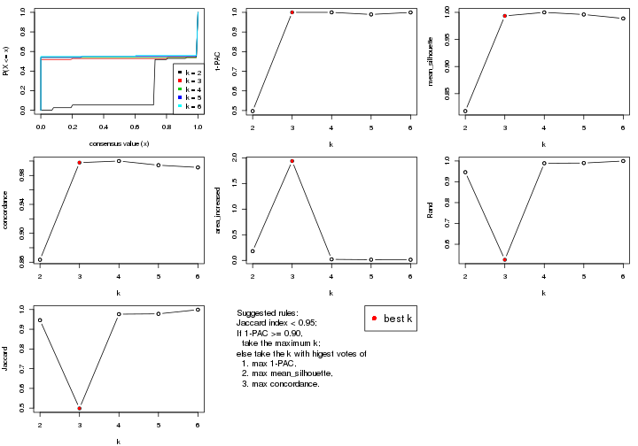

The numeric values for all these statistics can be obtained by `get_stats()`.

```r
get_stats(res)
```

```
#>   k 1-PAC mean_silhouette concordance area_increased  Rand Jaccard
#> 2 2 0.497           0.818       0.863         0.1801 0.946   0.946
#> 3 3 1.000           0.994       0.998         1.9383 0.526   0.499
#> 4 4 1.000           1.000       1.000         0.0206 0.989   0.977
#> 5 5 0.989           0.996       0.994         0.0140 0.990   0.978
#> 6 6 1.000           0.989       0.991         0.0129 1.000   0.999
```

`suggest_best_k()` suggests the best $k$ based on these statistics. The rules are as follows:

- All $k$ with Jaccard index larger than 0.95 are removed because increasing
  $k$ does not provide enough extra information. If all $k$ are removed, it is
  marked as no subgroup is detected.
- For all $k$ with 1-PAC score larger than 0.9, the maximal $k$ is taken as
  the best $k$, and other $k$ are marked as optional $k$.
- If it does not fit the second rule. The $k$ with the maximal vote of the
  highest 1-PAC score, highest mean silhouette, and highest concordance is
  taken as the best $k$.

```r
suggest_best_k(res)
```

```
#> [1] 3
```


Following shows the table of the partitions (You need to click the **show/hide
code output** link to see it). The membership matrix (columns with name `p*`)
is inferred by
[`clue::cl_consensus()`](https://www.rdocumentation.org/link/cl_consensus?package=clue)
function with the `SE` method. Basically the value in the membership matrix
represents the probability to belong to a certain group. The finall class
label for an item is determined with the group with highest probability it
belongs to.

In `get_classes()` function, the entropy is calculated from the membership
matrix and the silhouette score is calculated from the consensus matrix.


<script>
$( function() {
	$( '#tabs-SD-hclust-get-classes' ).tabs();
} );
</script>
<div id='tabs-SD-hclust-get-classes'>
<ul>
<li><a href='#tab-SD-hclust-get-classes-1'>k = 2</a></li>
<li><a href='#tab-SD-hclust-get-classes-2'>k = 3</a></li>
<li><a href='#tab-SD-hclust-get-classes-3'>k = 4</a></li>
<li><a href='#tab-SD-hclust-get-classes-4'>k = 5</a></li>
<li><a href='#tab-SD-hclust-get-classes-5'>k = 6</a></li>
</ul>

<div id='tab-SD-hclust-get-classes-1'>
<p><a id='tab-SD-hclust-get-classes-1-a' style='color:#0366d6' href='#'>show/hide code output</a></p>
<pre><code class="r">cbind(get_classes(res, k = 2), get_membership(res, k = 2))
</code></pre>

<pre><code>#&gt;           class entropy silhouette   p1   p2
#&gt; SRR315112     1   0.402      1.000 0.92 0.08
#&gt; SRR315113     1   0.402      1.000 0.92 0.08
#&gt; SRR315114     1   0.402      1.000 0.92 0.08
#&gt; SRR315115     1   0.402      1.000 0.92 0.08
#&gt; SRR315116     1   0.402      1.000 0.92 0.08
#&gt; SRR566986     2   0.855      0.816 0.28 0.72
#&gt; SRR566987     2   0.855      0.816 0.28 0.72
#&gt; SRR566988     2   0.855      0.816 0.28 0.72
#&gt; SRR566989     2   0.855      0.816 0.28 0.72
#&gt; SRR566990     2   0.855      0.816 0.28 0.72
#&gt; SRR566991     2   0.855      0.816 0.28 0.72
#&gt; SRR566992     2   0.855      0.816 0.28 0.72
#&gt; SRR566993     2   0.855      0.816 0.28 0.72
#&gt; SRR566994     2   0.855      0.816 0.28 0.72
#&gt; SRR566995     2   0.855      0.816 0.28 0.72
#&gt; SRR566996     2   0.855      0.816 0.28 0.72
#&gt; SRR566997     2   0.855      0.816 0.28 0.72
#&gt; SRR566998     2   0.855      0.816 0.28 0.72
#&gt; SRR566999     2   0.855      0.816 0.28 0.72
#&gt; SRR567000     2   0.855      0.816 0.28 0.72
#&gt; SRR567001     2   0.855      0.816 0.28 0.72
#&gt; SRR567002     2   0.855      0.816 0.28 0.72
#&gt; SRR567003     2   0.855      0.816 0.28 0.72
#&gt; SRR567004     2   0.855      0.816 0.28 0.72
#&gt; SRR567005     2   0.855      0.816 0.28 0.72
#&gt; SRR567006     2   0.855      0.816 0.28 0.72
#&gt; SRR567007     2   0.855      0.816 0.28 0.72
#&gt; SRR567008     2   0.855      0.816 0.28 0.72
#&gt; SRR567009     2   0.855      0.816 0.28 0.72
#&gt; SRR567010     2   0.855      0.816 0.28 0.72
#&gt; SRR567011     2   0.855      0.816 0.28 0.72
#&gt; SRR567012     2   0.855      0.816 0.28 0.72
#&gt; SRR567013     2   0.855      0.816 0.28 0.72
#&gt; SRR567014     2   0.855      0.816 0.28 0.72
#&gt; SRR567015     2   0.855      0.816 0.28 0.72
#&gt; SRR567016     2   0.855      0.816 0.28 0.72
#&gt; SRR567017     2   0.855      0.816 0.28 0.72
#&gt; SRR567018     2   0.855      0.816 0.28 0.72
#&gt; SRR567019     2   0.855      0.816 0.28 0.72
#&gt; SRR567020     2   0.855      0.816 0.28 0.72
#&gt; SRR567021     2   0.855      0.816 0.28 0.72
#&gt; SRR567022     2   0.855      0.816 0.28 0.72
#&gt; SRR567023     2   0.855      0.816 0.28 0.72
#&gt; SRR567024     2   0.855      0.816 0.28 0.72
#&gt; SRR567025     2   0.855      0.816 0.28 0.72
#&gt; SRR567026     2   0.855      0.816 0.28 0.72
#&gt; SRR567027     2   0.855      0.816 0.28 0.72
#&gt; SRR567028     2   0.855      0.816 0.28 0.72
#&gt; SRR567029     2   0.855      0.816 0.28 0.72
#&gt; SRR567030     2   0.855      0.816 0.28 0.72
#&gt; SRR567031     2   0.855      0.816 0.28 0.72
#&gt; SRR567032     2   0.855      0.816 0.28 0.72
#&gt; SRR567033     2   0.855      0.816 0.28 0.72
#&gt; SRR567034     2   0.855      0.816 0.28 0.72
#&gt; SRR567035     2   0.855      0.816 0.28 0.72
#&gt; SRR567036     2   0.855      0.816 0.28 0.72
#&gt; SRR567037     2   0.855      0.816 0.28 0.72
#&gt; SRR567038     2   0.855      0.816 0.28 0.72
#&gt; SRR567039     2   0.855      0.816 0.28 0.72
#&gt; SRR567040     2   0.855      0.816 0.28 0.72
#&gt; SRR567041     2   0.855      0.816 0.28 0.72
#&gt; SRR567042     2   0.855      0.816 0.28 0.72
#&gt; SRR567043     2   0.855      0.816 0.28 0.72
#&gt; SRR567044     2   0.855      0.816 0.28 0.72
#&gt; SRR567045     2   0.855      0.816 0.28 0.72
#&gt; SRR567046     2   0.855      0.816 0.28 0.72
#&gt; SRR567047     2   0.855      0.816 0.28 0.72
#&gt; SRR567048     2   0.855      0.816 0.28 0.72
#&gt; SRR567049     2   0.855      0.816 0.28 0.72
#&gt; SRR567050     2   0.855      0.816 0.28 0.72
#&gt; SRR567051     2   0.855      0.816 0.28 0.72
#&gt; SRR567052     2   0.855      0.816 0.28 0.72
#&gt; SRR567053     2   0.855      0.816 0.28 0.72
#&gt; SRR567054     2   0.855      0.816 0.28 0.72
#&gt; SRR567055     2   0.855      0.816 0.28 0.72
#&gt; SRR567056     2   0.855      0.816 0.28 0.72
#&gt; SRR567057     2   0.855      0.816 0.28 0.72
#&gt; SRR567058     2   0.855      0.816 0.28 0.72
#&gt; SRR567059     2   0.855      0.816 0.28 0.72
#&gt; SRR567060     2   0.855      0.816 0.28 0.72
#&gt; SRR567061     2   0.855      0.816 0.28 0.72
#&gt; SRR567062     2   0.855      0.816 0.28 0.72
#&gt; SRR567063     2   0.855      0.816 0.28 0.72
#&gt; SRR567064     2   0.855      0.816 0.28 0.72
#&gt; SRR567065     2   0.855      0.816 0.28 0.72
#&gt; SRR567066     2   0.855      0.816 0.28 0.72
#&gt; SRR567067     2   0.855      0.816 0.28 0.72
#&gt; SRR567068     2   0.855      0.816 0.28 0.72
#&gt; SRR567069     2   0.855      0.816 0.28 0.72
#&gt; SRR567070     2   0.855      0.816 0.28 0.72
#&gt; SRR567071     2   0.855      0.816 0.28 0.72
#&gt; SRR567072     2   0.855      0.816 0.28 0.72
#&gt; SRR567073     2   0.855      0.816 0.28 0.72
#&gt; SRR567074     2   0.855      0.816 0.28 0.72
#&gt; SRR567075     2   0.855      0.816 0.28 0.72
#&gt; SRR567076     2   0.000      0.809 0.00 1.00
#&gt; SRR567077     2   0.000      0.809 0.00 1.00
#&gt; SRR567078     2   0.000      0.809 0.00 1.00
#&gt; SRR567079     2   0.000      0.809 0.00 1.00
#&gt; SRR567080     2   0.000      0.809 0.00 1.00
#&gt; SRR567081     2   0.000      0.809 0.00 1.00
#&gt; SRR567082     2   0.000      0.809 0.00 1.00
#&gt; SRR567083     2   0.000      0.809 0.00 1.00
#&gt; SRR567084     2   0.000      0.809 0.00 1.00
#&gt; SRR567085     2   0.000      0.809 0.00 1.00
#&gt; SRR567086     2   0.000      0.809 0.00 1.00
#&gt; SRR567087     2   0.000      0.809 0.00 1.00
#&gt; SRR567088     2   0.000      0.809 0.00 1.00
#&gt; SRR567089     2   0.000      0.809 0.00 1.00
#&gt; SRR567090     2   0.000      0.809 0.00 1.00
#&gt; SRR567091     2   0.000      0.809 0.00 1.00
#&gt; SRR567092     2   0.000      0.809 0.00 1.00
#&gt; SRR567093     2   0.000      0.809 0.00 1.00
#&gt; SRR567094     2   0.000      0.809 0.00 1.00
#&gt; SRR567095     2   0.000      0.809 0.00 1.00
#&gt; SRR567096     2   0.000      0.809 0.00 1.00
#&gt; SRR567097     2   0.000      0.809 0.00 1.00
#&gt; SRR567098     2   0.000      0.809 0.00 1.00
#&gt; SRR567099     2   0.000      0.809 0.00 1.00
#&gt; SRR567100     2   0.000      0.809 0.00 1.00
#&gt; SRR567101     2   0.000      0.809 0.00 1.00
#&gt; SRR567102     2   0.000      0.809 0.00 1.00
#&gt; SRR567103     2   0.000      0.809 0.00 1.00
#&gt; SRR567104     2   0.000      0.809 0.00 1.00
#&gt; SRR567105     2   0.000      0.809 0.00 1.00
#&gt; SRR567106     2   0.000      0.809 0.00 1.00
#&gt; SRR567107     2   0.000      0.809 0.00 1.00
#&gt; SRR567108     2   0.000      0.809 0.00 1.00
#&gt; SRR567109     2   0.000      0.809 0.00 1.00
#&gt; SRR567110     2   0.000      0.809 0.00 1.00
#&gt; SRR567111     2   0.000      0.809 0.00 1.00
#&gt; SRR567112     2   0.000      0.809 0.00 1.00
#&gt; SRR567113     2   0.000      0.809 0.00 1.00
#&gt; SRR567114     2   0.000      0.809 0.00 1.00
#&gt; SRR567115     2   0.000      0.809 0.00 1.00
#&gt; SRR567116     2   0.000      0.809 0.00 1.00
#&gt; SRR567117     2   0.000      0.809 0.00 1.00
#&gt; SRR567118     2   0.000      0.809 0.00 1.00
#&gt; SRR567119     2   0.000      0.809 0.00 1.00
#&gt; SRR567120     2   0.000      0.809 0.00 1.00
#&gt; SRR567121     2   0.000      0.809 0.00 1.00
#&gt; SRR567122     2   0.000      0.809 0.00 1.00
#&gt; SRR567123     2   0.000      0.809 0.00 1.00
#&gt; SRR567124     2   0.000      0.809 0.00 1.00
#&gt; SRR567125     2   0.000      0.809 0.00 1.00
#&gt; SRR567126     2   0.000      0.809 0.00 1.00
#&gt; SRR567127     2   0.000      0.809 0.00 1.00
#&gt; SRR567128     2   0.000      0.809 0.00 1.00
#&gt; SRR567129     2   0.000      0.809 0.00 1.00
#&gt; SRR567130     2   0.000      0.809 0.00 1.00
#&gt; SRR567131     2   0.000      0.809 0.00 1.00
#&gt; SRR567132     2   0.000      0.809 0.00 1.00
#&gt; SRR567133     2   0.000      0.809 0.00 1.00
#&gt; SRR567134     2   0.000      0.809 0.00 1.00
#&gt; SRR567135     2   0.000      0.809 0.00 1.00
#&gt; SRR567136     2   0.000      0.809 0.00 1.00
#&gt; SRR567137     2   0.000      0.809 0.00 1.00
#&gt; SRR567138     2   0.000      0.809 0.00 1.00
#&gt; SRR567139     2   0.000      0.809 0.00 1.00
#&gt; SRR567140     2   0.000      0.809 0.00 1.00
#&gt; SRR567141     2   0.000      0.809 0.00 1.00
#&gt; SRR567142     2   0.000      0.809 0.00 1.00
#&gt; SRR567143     2   0.000      0.809 0.00 1.00
#&gt; SRR567144     2   0.000      0.809 0.00 1.00
#&gt; SRR567145     2   0.000      0.809 0.00 1.00
#&gt; SRR567146     2   0.402      0.809 0.08 0.92
#&gt; SRR567147     2   0.000      0.809 0.00 1.00
#&gt; SRR567148     2   0.000      0.809 0.00 1.00
#&gt; SRR567149     2   0.000      0.809 0.00 1.00
#&gt; SRR567150     2   0.000      0.809 0.00 1.00
#&gt; SRR567151     2   0.000      0.809 0.00 1.00
#&gt; SRR567152     2   0.000      0.809 0.00 1.00
#&gt; SRR567153     2   0.000      0.809 0.00 1.00
#&gt; SRR567154     2   0.000      0.809 0.00 1.00
#&gt; SRR567155     2   0.000      0.809 0.00 1.00
#&gt; SRR567156     2   0.000      0.809 0.00 1.00
#&gt; SRR567157     2   0.000      0.809 0.00 1.00
#&gt; SRR567158     2   0.000      0.809 0.00 1.00
#&gt; SRR567159     2   0.000      0.809 0.00 1.00
#&gt; SRR567160     2   0.000      0.809 0.00 1.00
#&gt; SRR567161     2   0.402      0.809 0.08 0.92
</code></pre>

<script>
$('#tab-SD-hclust-get-classes-1-a').parent().next().next().hide();
$('#tab-SD-hclust-get-classes-1-a').click(function(){
  $('#tab-SD-hclust-get-classes-1-a').parent().next().next().toggle();
  return(false);
});
</script>
</div>

<div id='tab-SD-hclust-get-classes-2'>
<p><a id='tab-SD-hclust-get-classes-2-a' style='color:#0366d6' href='#'>show/hide code output</a></p>
<pre><code class="r">cbind(get_classes(res, k = 3), get_membership(res, k = 3))
</code></pre>

<pre><code>#&gt;           class entropy silhouette  p1  p2 p3
#&gt; SRR315112     3   0.000      1.000 0.0 0.0  1
#&gt; SRR315113     3   0.000      1.000 0.0 0.0  1
#&gt; SRR315114     3   0.000      1.000 0.0 0.0  1
#&gt; SRR315115     3   0.000      1.000 0.0 0.0  1
#&gt; SRR315116     3   0.000      1.000 0.0 0.0  1
#&gt; SRR566986     2   0.000      0.994 0.0 1.0  0
#&gt; SRR566987     2   0.000      0.994 0.0 1.0  0
#&gt; SRR566988     2   0.000      0.994 0.0 1.0  0
#&gt; SRR566989     2   0.000      0.994 0.0 1.0  0
#&gt; SRR566990     2   0.000      0.994 0.0 1.0  0
#&gt; SRR566991     2   0.000      0.994 0.0 1.0  0
#&gt; SRR566992     2   0.000      0.994 0.0 1.0  0
#&gt; SRR566993     2   0.000      0.994 0.0 1.0  0
#&gt; SRR566994     2   0.000      0.994 0.0 1.0  0
#&gt; SRR566995     2   0.000      0.994 0.0 1.0  0
#&gt; SRR566996     2   0.000      0.994 0.0 1.0  0
#&gt; SRR566997     2   0.000      0.994 0.0 1.0  0
#&gt; SRR566998     2   0.000      0.994 0.0 1.0  0
#&gt; SRR566999     2   0.000      0.994 0.0 1.0  0
#&gt; SRR567000     2   0.000      0.994 0.0 1.0  0
#&gt; SRR567001     2   0.000      0.994 0.0 1.0  0
#&gt; SRR567002     2   0.000      0.994 0.0 1.0  0
#&gt; SRR567003     2   0.000      0.994 0.0 1.0  0
#&gt; SRR567004     2   0.000      0.994 0.0 1.0  0
#&gt; SRR567005     2   0.000      0.994 0.0 1.0  0
#&gt; SRR567006     2   0.000      0.994 0.0 1.0  0
#&gt; SRR567007     2   0.000      0.994 0.0 1.0  0
#&gt; SRR567008     2   0.000      0.994 0.0 1.0  0
#&gt; SRR567009     2   0.000      0.994 0.0 1.0  0
#&gt; SRR567010     2   0.000      0.994 0.0 1.0  0
#&gt; SRR567011     2   0.000      0.994 0.0 1.0  0
#&gt; SRR567012     2   0.000      0.994 0.0 1.0  0
#&gt; SRR567013     2   0.000      0.994 0.0 1.0  0
#&gt; SRR567014     2   0.000      0.994 0.0 1.0  0
#&gt; SRR567015     2   0.000      0.994 0.0 1.0  0
#&gt; SRR567016     2   0.000      0.994 0.0 1.0  0
#&gt; SRR567017     2   0.000      0.994 0.0 1.0  0
#&gt; SRR567018     2   0.000      0.994 0.0 1.0  0
#&gt; SRR567019     2   0.000      0.994 0.0 1.0  0
#&gt; SRR567020     2   0.000      0.994 0.0 1.0  0
#&gt; SRR567021     2   0.000      0.994 0.0 1.0  0
#&gt; SRR567022     2   0.000      0.994 0.0 1.0  0
#&gt; SRR567023     2   0.000      0.994 0.0 1.0  0
#&gt; SRR567024     2   0.000      0.994 0.0 1.0  0
#&gt; SRR567025     2   0.000      0.994 0.0 1.0  0
#&gt; SRR567026     2   0.000      0.994 0.0 1.0  0
#&gt; SRR567027     2   0.000      0.994 0.0 1.0  0
#&gt; SRR567028     2   0.000      0.994 0.0 1.0  0
#&gt; SRR567029     2   0.000      0.994 0.0 1.0  0
#&gt; SRR567030     2   0.000      0.994 0.0 1.0  0
#&gt; SRR567031     2   0.000      0.994 0.0 1.0  0
#&gt; SRR567032     2   0.000      0.994 0.0 1.0  0
#&gt; SRR567033     2   0.000      0.994 0.0 1.0  0
#&gt; SRR567034     2   0.000      0.994 0.0 1.0  0
#&gt; SRR567035     2   0.000      0.994 0.0 1.0  0
#&gt; SRR567036     2   0.000      0.994 0.0 1.0  0
#&gt; SRR567037     2   0.000      0.994 0.0 1.0  0
#&gt; SRR567038     2   0.000      0.994 0.0 1.0  0
#&gt; SRR567039     2   0.000      0.994 0.0 1.0  0
#&gt; SRR567040     2   0.000      0.994 0.0 1.0  0
#&gt; SRR567041     2   0.000      0.994 0.0 1.0  0
#&gt; SRR567042     2   0.000      0.994 0.0 1.0  0
#&gt; SRR567043     2   0.000      0.994 0.0 1.0  0
#&gt; SRR567044     2   0.000      0.994 0.0 1.0  0
#&gt; SRR567045     2   0.000      0.994 0.0 1.0  0
#&gt; SRR567046     2   0.000      0.994 0.0 1.0  0
#&gt; SRR567047     2   0.000      0.994 0.0 1.0  0
#&gt; SRR567048     2   0.000      0.994 0.0 1.0  0
#&gt; SRR567049     2   0.000      0.994 0.0 1.0  0
#&gt; SRR567050     2   0.000      0.994 0.0 1.0  0
#&gt; SRR567051     2   0.000      0.994 0.0 1.0  0
#&gt; SRR567052     2   0.000      0.994 0.0 1.0  0
#&gt; SRR567053     2   0.000      0.994 0.0 1.0  0
#&gt; SRR567054     2   0.000      0.994 0.0 1.0  0
#&gt; SRR567055     2   0.000      0.994 0.0 1.0  0
#&gt; SRR567056     2   0.000      0.994 0.0 1.0  0
#&gt; SRR567057     2   0.000      0.994 0.0 1.0  0
#&gt; SRR567058     2   0.000      0.994 0.0 1.0  0
#&gt; SRR567059     2   0.000      0.994 0.0 1.0  0
#&gt; SRR567060     2   0.000      0.994 0.0 1.0  0
#&gt; SRR567061     2   0.000      0.994 0.0 1.0  0
#&gt; SRR567062     2   0.000      0.994 0.0 1.0  0
#&gt; SRR567063     2   0.000      0.994 0.0 1.0  0
#&gt; SRR567064     2   0.000      0.994 0.0 1.0  0
#&gt; SRR567065     2   0.000      0.994 0.0 1.0  0
#&gt; SRR567066     2   0.000      0.994 0.0 1.0  0
#&gt; SRR567067     2   0.000      0.994 0.0 1.0  0
#&gt; SRR567068     2   0.000      0.994 0.0 1.0  0
#&gt; SRR567069     2   0.000      0.994 0.0 1.0  0
#&gt; SRR567070     2   0.000      0.994 0.0 1.0  0
#&gt; SRR567071     2   0.000      0.994 0.0 1.0  0
#&gt; SRR567072     2   0.000      0.994 0.0 1.0  0
#&gt; SRR567073     2   0.000      0.994 0.0 1.0  0
#&gt; SRR567074     2   0.000      0.994 0.0 1.0  0
#&gt; SRR567075     2   0.000      0.994 0.0 1.0  0
#&gt; SRR567076     1   0.000      1.000 1.0 0.0  0
#&gt; SRR567077     1   0.000      1.000 1.0 0.0  0
#&gt; SRR567078     1   0.000      1.000 1.0 0.0  0
#&gt; SRR567079     1   0.000      1.000 1.0 0.0  0
#&gt; SRR567080     1   0.000      1.000 1.0 0.0  0
#&gt; SRR567081     1   0.000      1.000 1.0 0.0  0
#&gt; SRR567082     1   0.000      1.000 1.0 0.0  0
#&gt; SRR567083     1   0.000      1.000 1.0 0.0  0
#&gt; SRR567084     1   0.000      1.000 1.0 0.0  0
#&gt; SRR567085     1   0.000      1.000 1.0 0.0  0
#&gt; SRR567086     1   0.000      1.000 1.0 0.0  0
#&gt; SRR567087     1   0.000      1.000 1.0 0.0  0
#&gt; SRR567088     1   0.000      1.000 1.0 0.0  0
#&gt; SRR567089     1   0.000      1.000 1.0 0.0  0
#&gt; SRR567090     1   0.000      1.000 1.0 0.0  0
#&gt; SRR567091     1   0.000      1.000 1.0 0.0  0
#&gt; SRR567092     1   0.000      1.000 1.0 0.0  0
#&gt; SRR567093     1   0.000      1.000 1.0 0.0  0
#&gt; SRR567094     1   0.000      1.000 1.0 0.0  0
#&gt; SRR567095     1   0.000      1.000 1.0 0.0  0
#&gt; SRR567096     1   0.000      1.000 1.0 0.0  0
#&gt; SRR567097     1   0.000      1.000 1.0 0.0  0
#&gt; SRR567098     1   0.000      1.000 1.0 0.0  0
#&gt; SRR567099     1   0.000      1.000 1.0 0.0  0
#&gt; SRR567100     1   0.000      1.000 1.0 0.0  0
#&gt; SRR567101     1   0.000      1.000 1.0 0.0  0
#&gt; SRR567102     1   0.000      1.000 1.0 0.0  0
#&gt; SRR567103     1   0.000      1.000 1.0 0.0  0
#&gt; SRR567104     1   0.000      1.000 1.0 0.0  0
#&gt; SRR567105     1   0.000      1.000 1.0 0.0  0
#&gt; SRR567106     1   0.000      1.000 1.0 0.0  0
#&gt; SRR567107     1   0.000      1.000 1.0 0.0  0
#&gt; SRR567108     1   0.000      1.000 1.0 0.0  0
#&gt; SRR567109     1   0.000      1.000 1.0 0.0  0
#&gt; SRR567110     1   0.000      1.000 1.0 0.0  0
#&gt; SRR567111     1   0.000      1.000 1.0 0.0  0
#&gt; SRR567112     1   0.000      1.000 1.0 0.0  0
#&gt; SRR567113     1   0.000      1.000 1.0 0.0  0
#&gt; SRR567114     1   0.000      1.000 1.0 0.0  0
#&gt; SRR567115     1   0.000      1.000 1.0 0.0  0
#&gt; SRR567116     1   0.000      1.000 1.0 0.0  0
#&gt; SRR567117     1   0.000      1.000 1.0 0.0  0
#&gt; SRR567118     1   0.000      1.000 1.0 0.0  0
#&gt; SRR567119     1   0.000      1.000 1.0 0.0  0
#&gt; SRR567120     1   0.000      1.000 1.0 0.0  0
#&gt; SRR567121     1   0.000      1.000 1.0 0.0  0
#&gt; SRR567122     1   0.000      1.000 1.0 0.0  0
#&gt; SRR567123     1   0.000      1.000 1.0 0.0  0
#&gt; SRR567124     1   0.000      1.000 1.0 0.0  0
#&gt; SRR567125     1   0.000      1.000 1.0 0.0  0
#&gt; SRR567126     1   0.000      1.000 1.0 0.0  0
#&gt; SRR567127     1   0.000      1.000 1.0 0.0  0
#&gt; SRR567128     1   0.000      1.000 1.0 0.0  0
#&gt; SRR567129     1   0.000      1.000 1.0 0.0  0
#&gt; SRR567130     1   0.000      1.000 1.0 0.0  0
#&gt; SRR567131     1   0.000      1.000 1.0 0.0  0
#&gt; SRR567132     1   0.000      1.000 1.0 0.0  0
#&gt; SRR567133     1   0.000      1.000 1.0 0.0  0
#&gt; SRR567134     1   0.000      1.000 1.0 0.0  0
#&gt; SRR567135     1   0.000      1.000 1.0 0.0  0
#&gt; SRR567136     1   0.000      1.000 1.0 0.0  0
#&gt; SRR567137     1   0.000      1.000 1.0 0.0  0
#&gt; SRR567138     1   0.000      1.000 1.0 0.0  0
#&gt; SRR567139     1   0.000      1.000 1.0 0.0  0
#&gt; SRR567140     1   0.000      1.000 1.0 0.0  0
#&gt; SRR567141     1   0.000      1.000 1.0 0.0  0
#&gt; SRR567142     1   0.000      1.000 1.0 0.0  0
#&gt; SRR567143     1   0.000      1.000 1.0 0.0  0
#&gt; SRR567144     1   0.000      1.000 1.0 0.0  0
#&gt; SRR567145     1   0.000      1.000 1.0 0.0  0
#&gt; SRR567146     2   0.455      0.682 0.2 0.8  0
#&gt; SRR567147     1   0.000      1.000 1.0 0.0  0
#&gt; SRR567148     1   0.000      1.000 1.0 0.0  0
#&gt; SRR567149     1   0.000      1.000 1.0 0.0  0
#&gt; SRR567150     1   0.000      1.000 1.0 0.0  0
#&gt; SRR567151     1   0.000      1.000 1.0 0.0  0
#&gt; SRR567152     1   0.000      1.000 1.0 0.0  0
#&gt; SRR567153     1   0.000      1.000 1.0 0.0  0
#&gt; SRR567154     1   0.000      1.000 1.0 0.0  0
#&gt; SRR567155     1   0.000      1.000 1.0 0.0  0
#&gt; SRR567156     1   0.000      1.000 1.0 0.0  0
#&gt; SRR567157     1   0.000      1.000 1.0 0.0  0
#&gt; SRR567158     1   0.000      1.000 1.0 0.0  0
#&gt; SRR567159     1   0.000      1.000 1.0 0.0  0
#&gt; SRR567160     1   0.000      1.000 1.0 0.0  0
#&gt; SRR567161     2   0.455      0.682 0.2 0.8  0
</code></pre>

<script>
$('#tab-SD-hclust-get-classes-2-a').parent().next().next().hide();
$('#tab-SD-hclust-get-classes-2-a').click(function(){
  $('#tab-SD-hclust-get-classes-2-a').parent().next().next().toggle();
  return(false);
});
</script>
</div>

<div id='tab-SD-hclust-get-classes-3'>
<p><a id='tab-SD-hclust-get-classes-3-a' style='color:#0366d6' href='#'>show/hide code output</a></p>
<pre><code class="r">cbind(get_classes(res, k = 4), get_membership(res, k = 4))
</code></pre>

<pre><code>#&gt;           class entropy silhouette p1 p2 p3 p4
#&gt; SRR315112     3       0          1  0  0  1  0
#&gt; SRR315113     3       0          1  0  0  1  0
#&gt; SRR315114     3       0          1  0  0  1  0
#&gt; SRR315115     3       0          1  0  0  1  0
#&gt; SRR315116     3       0          1  0  0  1  0
#&gt; SRR566986     2       0          1  0  1  0  0
#&gt; SRR566987     2       0          1  0  1  0  0
#&gt; SRR566988     2       0          1  0  1  0  0
#&gt; SRR566989     2       0          1  0  1  0  0
#&gt; SRR566990     2       0          1  0  1  0  0
#&gt; SRR566991     2       0          1  0  1  0  0
#&gt; SRR566992     2       0          1  0  1  0  0
#&gt; SRR566993     2       0          1  0  1  0  0
#&gt; SRR566994     2       0          1  0  1  0  0
#&gt; SRR566995     2       0          1  0  1  0  0
#&gt; SRR566996     2       0          1  0  1  0  0
#&gt; SRR566997     2       0          1  0  1  0  0
#&gt; SRR566998     2       0          1  0  1  0  0
#&gt; SRR566999     2       0          1  0  1  0  0
#&gt; SRR567000     2       0          1  0  1  0  0
#&gt; SRR567001     2       0          1  0  1  0  0
#&gt; SRR567002     2       0          1  0  1  0  0
#&gt; SRR567003     2       0          1  0  1  0  0
#&gt; SRR567004     2       0          1  0  1  0  0
#&gt; SRR567005     2       0          1  0  1  0  0
#&gt; SRR567006     2       0          1  0  1  0  0
#&gt; SRR567007     2       0          1  0  1  0  0
#&gt; SRR567008     2       0          1  0  1  0  0
#&gt; SRR567009     2       0          1  0  1  0  0
#&gt; SRR567010     2       0          1  0  1  0  0
#&gt; SRR567011     2       0          1  0  1  0  0
#&gt; SRR567012     2       0          1  0  1  0  0
#&gt; SRR567013     2       0          1  0  1  0  0
#&gt; SRR567014     2       0          1  0  1  0  0
#&gt; SRR567015     2       0          1  0  1  0  0
#&gt; SRR567016     2       0          1  0  1  0  0
#&gt; SRR567017     2       0          1  0  1  0  0
#&gt; SRR567018     2       0          1  0  1  0  0
#&gt; SRR567019     2       0          1  0  1  0  0
#&gt; SRR567020     2       0          1  0  1  0  0
#&gt; SRR567021     2       0          1  0  1  0  0
#&gt; SRR567022     2       0          1  0  1  0  0
#&gt; SRR567023     2       0          1  0  1  0  0
#&gt; SRR567024     2       0          1  0  1  0  0
#&gt; SRR567025     2       0          1  0  1  0  0
#&gt; SRR567026     2       0          1  0  1  0  0
#&gt; SRR567027     2       0          1  0  1  0  0
#&gt; SRR567028     2       0          1  0  1  0  0
#&gt; SRR567029     2       0          1  0  1  0  0
#&gt; SRR567030     2       0          1  0  1  0  0
#&gt; SRR567031     2       0          1  0  1  0  0
#&gt; SRR567032     2       0          1  0  1  0  0
#&gt; SRR567033     2       0          1  0  1  0  0
#&gt; SRR567034     2       0          1  0  1  0  0
#&gt; SRR567035     2       0          1  0  1  0  0
#&gt; SRR567036     2       0          1  0  1  0  0
#&gt; SRR567037     2       0          1  0  1  0  0
#&gt; SRR567038     2       0          1  0  1  0  0
#&gt; SRR567039     2       0          1  0  1  0  0
#&gt; SRR567040     2       0          1  0  1  0  0
#&gt; SRR567041     2       0          1  0  1  0  0
#&gt; SRR567042     2       0          1  0  1  0  0
#&gt; SRR567043     2       0          1  0  1  0  0
#&gt; SRR567044     2       0          1  0  1  0  0
#&gt; SRR567045     2       0          1  0  1  0  0
#&gt; SRR567046     2       0          1  0  1  0  0
#&gt; SRR567047     2       0          1  0  1  0  0
#&gt; SRR567048     2       0          1  0  1  0  0
#&gt; SRR567049     2       0          1  0  1  0  0
#&gt; SRR567050     2       0          1  0  1  0  0
#&gt; SRR567051     2       0          1  0  1  0  0
#&gt; SRR567052     2       0          1  0  1  0  0
#&gt; SRR567053     2       0          1  0  1  0  0
#&gt; SRR567054     2       0          1  0  1  0  0
#&gt; SRR567055     2       0          1  0  1  0  0
#&gt; SRR567056     2       0          1  0  1  0  0
#&gt; SRR567057     2       0          1  0  1  0  0
#&gt; SRR567058     2       0          1  0  1  0  0
#&gt; SRR567059     2       0          1  0  1  0  0
#&gt; SRR567060     2       0          1  0  1  0  0
#&gt; SRR567061     2       0          1  0  1  0  0
#&gt; SRR567062     2       0          1  0  1  0  0
#&gt; SRR567063     2       0          1  0  1  0  0
#&gt; SRR567064     2       0          1  0  1  0  0
#&gt; SRR567065     2       0          1  0  1  0  0
#&gt; SRR567066     2       0          1  0  1  0  0
#&gt; SRR567067     2       0          1  0  1  0  0
#&gt; SRR567068     2       0          1  0  1  0  0
#&gt; SRR567069     2       0          1  0  1  0  0
#&gt; SRR567070     2       0          1  0  1  0  0
#&gt; SRR567071     2       0          1  0  1  0  0
#&gt; SRR567072     2       0          1  0  1  0  0
#&gt; SRR567073     2       0          1  0  1  0  0
#&gt; SRR567074     2       0          1  0  1  0  0
#&gt; SRR567075     2       0          1  0  1  0  0
#&gt; SRR567076     1       0          1  1  0  0  0
#&gt; SRR567077     1       0          1  1  0  0  0
#&gt; SRR567078     1       0          1  1  0  0  0
#&gt; SRR567079     1       0          1  1  0  0  0
#&gt; SRR567080     1       0          1  1  0  0  0
#&gt; SRR567081     1       0          1  1  0  0  0
#&gt; SRR567082     1       0          1  1  0  0  0
#&gt; SRR567083     1       0          1  1  0  0  0
#&gt; SRR567084     1       0          1  1  0  0  0
#&gt; SRR567085     1       0          1  1  0  0  0
#&gt; SRR567086     1       0          1  1  0  0  0
#&gt; SRR567087     1       0          1  1  0  0  0
#&gt; SRR567088     1       0          1  1  0  0  0
#&gt; SRR567089     1       0          1  1  0  0  0
#&gt; SRR567090     1       0          1  1  0  0  0
#&gt; SRR567091     1       0          1  1  0  0  0
#&gt; SRR567092     1       0          1  1  0  0  0
#&gt; SRR567093     1       0          1  1  0  0  0
#&gt; SRR567094     1       0          1  1  0  0  0
#&gt; SRR567095     1       0          1  1  0  0  0
#&gt; SRR567096     1       0          1  1  0  0  0
#&gt; SRR567097     1       0          1  1  0  0  0
#&gt; SRR567098     1       0          1  1  0  0  0
#&gt; SRR567099     1       0          1  1  0  0  0
#&gt; SRR567100     1       0          1  1  0  0  0
#&gt; SRR567101     1       0          1  1  0  0  0
#&gt; SRR567102     1       0          1  1  0  0  0
#&gt; SRR567103     1       0          1  1  0  0  0
#&gt; SRR567104     1       0          1  1  0  0  0
#&gt; SRR567105     1       0          1  1  0  0  0
#&gt; SRR567106     1       0          1  1  0  0  0
#&gt; SRR567107     1       0          1  1  0  0  0
#&gt; SRR567108     1       0          1  1  0  0  0
#&gt; SRR567109     1       0          1  1  0  0  0
#&gt; SRR567110     1       0          1  1  0  0  0
#&gt; SRR567111     1       0          1  1  0  0  0
#&gt; SRR567112     1       0          1  1  0  0  0
#&gt; SRR567113     1       0          1  1  0  0  0
#&gt; SRR567114     1       0          1  1  0  0  0
#&gt; SRR567115     1       0          1  1  0  0  0
#&gt; SRR567116     1       0          1  1  0  0  0
#&gt; SRR567117     1       0          1  1  0  0  0
#&gt; SRR567118     1       0          1  1  0  0  0
#&gt; SRR567119     1       0          1  1  0  0  0
#&gt; SRR567120     1       0          1  1  0  0  0
#&gt; SRR567121     1       0          1  1  0  0  0
#&gt; SRR567122     1       0          1  1  0  0  0
#&gt; SRR567123     1       0          1  1  0  0  0
#&gt; SRR567124     1       0          1  1  0  0  0
#&gt; SRR567125     1       0          1  1  0  0  0
#&gt; SRR567126     1       0          1  1  0  0  0
#&gt; SRR567127     1       0          1  1  0  0  0
#&gt; SRR567128     1       0          1  1  0  0  0
#&gt; SRR567129     1       0          1  1  0  0  0
#&gt; SRR567130     1       0          1  1  0  0  0
#&gt; SRR567131     1       0          1  1  0  0  0
#&gt; SRR567132     1       0          1  1  0  0  0
#&gt; SRR567133     1       0          1  1  0  0  0
#&gt; SRR567134     1       0          1  1  0  0  0
#&gt; SRR567135     1       0          1  1  0  0  0
#&gt; SRR567136     1       0          1  1  0  0  0
#&gt; SRR567137     1       0          1  1  0  0  0
#&gt; SRR567138     1       0          1  1  0  0  0
#&gt; SRR567139     1       0          1  1  0  0  0
#&gt; SRR567140     1       0          1  1  0  0  0
#&gt; SRR567141     1       0          1  1  0  0  0
#&gt; SRR567142     1       0          1  1  0  0  0
#&gt; SRR567143     1       0          1  1  0  0  0
#&gt; SRR567144     1       0          1  1  0  0  0
#&gt; SRR567145     1       0          1  1  0  0  0
#&gt; SRR567146     4       0          1  0  0  0  1
#&gt; SRR567147     1       0          1  1  0  0  0
#&gt; SRR567148     1       0          1  1  0  0  0
#&gt; SRR567149     1       0          1  1  0  0  0
#&gt; SRR567150     1       0          1  1  0  0  0
#&gt; SRR567151     1       0          1  1  0  0  0
#&gt; SRR567152     1       0          1  1  0  0  0
#&gt; SRR567153     1       0          1  1  0  0  0
#&gt; SRR567154     1       0          1  1  0  0  0
#&gt; SRR567155     1       0          1  1  0  0  0
#&gt; SRR567156     1       0          1  1  0  0  0
#&gt; SRR567157     1       0          1  1  0  0  0
#&gt; SRR567158     1       0          1  1  0  0  0
#&gt; SRR567159     1       0          1  1  0  0  0
#&gt; SRR567160     1       0          1  1  0  0  0
#&gt; SRR567161     4       0          1  0  0  0  1
</code></pre>

<script>
$('#tab-SD-hclust-get-classes-3-a').parent().next().next().hide();
$('#tab-SD-hclust-get-classes-3-a').click(function(){
  $('#tab-SD-hclust-get-classes-3-a').parent().next().next().toggle();
  return(false);
});
</script>
</div>

<div id='tab-SD-hclust-get-classes-4'>
<p><a id='tab-SD-hclust-get-classes-4-a' style='color:#0366d6' href='#'>show/hide code output</a></p>
<pre><code class="r">cbind(get_classes(res, k = 5), get_membership(res, k = 5))
</code></pre>

<pre><code>#&gt;           class entropy silhouette   p1 p2   p3 p4   p5
#&gt; SRR315112     3   0.000      0.882 0.00  0 1.00  0 0.00
#&gt; SRR315113     3   0.356      0.816 0.00  0 0.74  0 0.26
#&gt; SRR315114     3   0.356      0.816 0.00  0 0.74  0 0.26
#&gt; SRR315115     3   0.000      0.882 0.00  0 1.00  0 0.00
#&gt; SRR315116     3   0.000      0.882 0.00  0 1.00  0 0.00
#&gt; SRR566986     2   0.000      1.000 0.00  1 0.00  0 0.00
#&gt; SRR566987     2   0.000      1.000 0.00  1 0.00  0 0.00
#&gt; SRR566988     2   0.000      1.000 0.00  1 0.00  0 0.00
#&gt; SRR566989     2   0.000      1.000 0.00  1 0.00  0 0.00
#&gt; SRR566990     2   0.000      1.000 0.00  1 0.00  0 0.00
#&gt; SRR566991     2   0.000      1.000 0.00  1 0.00  0 0.00
#&gt; SRR566992     2   0.000      1.000 0.00  1 0.00  0 0.00
#&gt; SRR566993     2   0.000      1.000 0.00  1 0.00  0 0.00
#&gt; SRR566994     2   0.000      1.000 0.00  1 0.00  0 0.00
#&gt; SRR566995     2   0.000      1.000 0.00  1 0.00  0 0.00
#&gt; SRR566996     2   0.000      1.000 0.00  1 0.00  0 0.00
#&gt; SRR566997     2   0.000      1.000 0.00  1 0.00  0 0.00
#&gt; SRR566998     2   0.000      1.000 0.00  1 0.00  0 0.00
#&gt; SRR566999     2   0.000      1.000 0.00  1 0.00  0 0.00
#&gt; SRR567000     2   0.000      1.000 0.00  1 0.00  0 0.00
#&gt; SRR567001     2   0.000      1.000 0.00  1 0.00  0 0.00
#&gt; SRR567002     2   0.000      1.000 0.00  1 0.00  0 0.00
#&gt; SRR567003     2   0.000      1.000 0.00  1 0.00  0 0.00
#&gt; SRR567004     2   0.000      1.000 0.00  1 0.00  0 0.00
#&gt; SRR567005     2   0.000      1.000 0.00  1 0.00  0 0.00
#&gt; SRR567006     2   0.000      1.000 0.00  1 0.00  0 0.00
#&gt; SRR567007     2   0.000      1.000 0.00  1 0.00  0 0.00
#&gt; SRR567008     2   0.000      1.000 0.00  1 0.00  0 0.00
#&gt; SRR567009     2   0.000      1.000 0.00  1 0.00  0 0.00
#&gt; SRR567010     2   0.000      1.000 0.00  1 0.00  0 0.00
#&gt; SRR567011     2   0.000      1.000 0.00  1 0.00  0 0.00
#&gt; SRR567012     2   0.000      1.000 0.00  1 0.00  0 0.00
#&gt; SRR567013     2   0.000      1.000 0.00  1 0.00  0 0.00
#&gt; SRR567014     2   0.000      1.000 0.00  1 0.00  0 0.00
#&gt; SRR567015     2   0.000      1.000 0.00  1 0.00  0 0.00
#&gt; SRR567016     2   0.000      1.000 0.00  1 0.00  0 0.00
#&gt; SRR567017     2   0.000      1.000 0.00  1 0.00  0 0.00
#&gt; SRR567018     2   0.000      1.000 0.00  1 0.00  0 0.00
#&gt; SRR567019     2   0.000      1.000 0.00  1 0.00  0 0.00
#&gt; SRR567020     2   0.000      1.000 0.00  1 0.00  0 0.00
#&gt; SRR567021     2   0.000      1.000 0.00  1 0.00  0 0.00
#&gt; SRR567022     2   0.000      1.000 0.00  1 0.00  0 0.00
#&gt; SRR567023     2   0.000      1.000 0.00  1 0.00  0 0.00
#&gt; SRR567024     2   0.000      1.000 0.00  1 0.00  0 0.00
#&gt; SRR567025     2   0.000      1.000 0.00  1 0.00  0 0.00
#&gt; SRR567026     2   0.000      1.000 0.00  1 0.00  0 0.00
#&gt; SRR567027     2   0.000      1.000 0.00  1 0.00  0 0.00
#&gt; SRR567028     2   0.000      1.000 0.00  1 0.00  0 0.00
#&gt; SRR567029     2   0.000      1.000 0.00  1 0.00  0 0.00
#&gt; SRR567030     2   0.000      1.000 0.00  1 0.00  0 0.00
#&gt; SRR567031     2   0.000      1.000 0.00  1 0.00  0 0.00
#&gt; SRR567032     2   0.000      1.000 0.00  1 0.00  0 0.00
#&gt; SRR567033     2   0.000      1.000 0.00  1 0.00  0 0.00
#&gt; SRR567034     2   0.000      1.000 0.00  1 0.00  0 0.00
#&gt; SRR567035     2   0.000      1.000 0.00  1 0.00  0 0.00
#&gt; SRR567036     2   0.000      1.000 0.00  1 0.00  0 0.00
#&gt; SRR567037     2   0.000      1.000 0.00  1 0.00  0 0.00
#&gt; SRR567038     2   0.000      1.000 0.00  1 0.00  0 0.00
#&gt; SRR567039     2   0.000      1.000 0.00  1 0.00  0 0.00
#&gt; SRR567040     2   0.000      1.000 0.00  1 0.00  0 0.00
#&gt; SRR567041     2   0.000      1.000 0.00  1 0.00  0 0.00
#&gt; SRR567042     2   0.000      1.000 0.00  1 0.00  0 0.00
#&gt; SRR567043     2   0.000      1.000 0.00  1 0.00  0 0.00
#&gt; SRR567044     2   0.000      1.000 0.00  1 0.00  0 0.00
#&gt; SRR567045     2   0.000      1.000 0.00  1 0.00  0 0.00
#&gt; SRR567046     2   0.000      1.000 0.00  1 0.00  0 0.00
#&gt; SRR567047     2   0.000      1.000 0.00  1 0.00  0 0.00
#&gt; SRR567048     2   0.000      1.000 0.00  1 0.00  0 0.00
#&gt; SRR567049     2   0.000      1.000 0.00  1 0.00  0 0.00
#&gt; SRR567050     2   0.000      1.000 0.00  1 0.00  0 0.00
#&gt; SRR567051     2   0.000      1.000 0.00  1 0.00  0 0.00
#&gt; SRR567052     2   0.000      1.000 0.00  1 0.00  0 0.00
#&gt; SRR567053     2   0.000      1.000 0.00  1 0.00  0 0.00
#&gt; SRR567054     2   0.000      1.000 0.00  1 0.00  0 0.00
#&gt; SRR567055     2   0.000      1.000 0.00  1 0.00  0 0.00
#&gt; SRR567056     2   0.000      1.000 0.00  1 0.00  0 0.00
#&gt; SRR567057     2   0.000      1.000 0.00  1 0.00  0 0.00
#&gt; SRR567058     2   0.000      1.000 0.00  1 0.00  0 0.00
#&gt; SRR567059     2   0.000      1.000 0.00  1 0.00  0 0.00
#&gt; SRR567060     2   0.000      1.000 0.00  1 0.00  0 0.00
#&gt; SRR567061     2   0.000      1.000 0.00  1 0.00  0 0.00
#&gt; SRR567062     2   0.000      1.000 0.00  1 0.00  0 0.00
#&gt; SRR567063     2   0.000      1.000 0.00  1 0.00  0 0.00
#&gt; SRR567064     2   0.000      1.000 0.00  1 0.00  0 0.00
#&gt; SRR567065     2   0.000      1.000 0.00  1 0.00  0 0.00
#&gt; SRR567066     2   0.000      1.000 0.00  1 0.00  0 0.00
#&gt; SRR567067     2   0.000      1.000 0.00  1 0.00  0 0.00
#&gt; SRR567068     2   0.000      1.000 0.00  1 0.00  0 0.00
#&gt; SRR567069     2   0.000      1.000 0.00  1 0.00  0 0.00
#&gt; SRR567070     2   0.000      1.000 0.00  1 0.00  0 0.00
#&gt; SRR567071     2   0.000      1.000 0.00  1 0.00  0 0.00
#&gt; SRR567072     2   0.000      1.000 0.00  1 0.00  0 0.00
#&gt; SRR567073     2   0.000      1.000 0.00  1 0.00  0 0.00
#&gt; SRR567074     2   0.000      1.000 0.00  1 0.00  0 0.00
#&gt; SRR567075     2   0.000      1.000 0.00  1 0.00  0 0.00
#&gt; SRR567076     1   0.000      1.000 1.00  0 0.00  0 0.00
#&gt; SRR567077     1   0.000      1.000 1.00  0 0.00  0 0.00
#&gt; SRR567078     1   0.000      1.000 1.00  0 0.00  0 0.00
#&gt; SRR567079     1   0.000      1.000 1.00  0 0.00  0 0.00
#&gt; SRR567080     1   0.000      1.000 1.00  0 0.00  0 0.00
#&gt; SRR567081     1   0.000      1.000 1.00  0 0.00  0 0.00
#&gt; SRR567082     1   0.000      1.000 1.00  0 0.00  0 0.00
#&gt; SRR567083     1   0.000      1.000 1.00  0 0.00  0 0.00
#&gt; SRR567084     1   0.000      1.000 1.00  0 0.00  0 0.00
#&gt; SRR567085     1   0.000      1.000 1.00  0 0.00  0 0.00
#&gt; SRR567086     1   0.000      1.000 1.00  0 0.00  0 0.00
#&gt; SRR567087     1   0.000      1.000 1.00  0 0.00  0 0.00
#&gt; SRR567088     1   0.000      1.000 1.00  0 0.00  0 0.00
#&gt; SRR567089     1   0.000      1.000 1.00  0 0.00  0 0.00
#&gt; SRR567090     1   0.000      1.000 1.00  0 0.00  0 0.00
#&gt; SRR567091     1   0.000      1.000 1.00  0 0.00  0 0.00
#&gt; SRR567092     1   0.000      1.000 1.00  0 0.00  0 0.00
#&gt; SRR567093     1   0.000      1.000 1.00  0 0.00  0 0.00
#&gt; SRR567094     1   0.000      1.000 1.00  0 0.00  0 0.00
#&gt; SRR567095     1   0.000      1.000 1.00  0 0.00  0 0.00
#&gt; SRR567096     1   0.000      1.000 1.00  0 0.00  0 0.00
#&gt; SRR567097     1   0.000      1.000 1.00  0 0.00  0 0.00
#&gt; SRR567098     1   0.000      1.000 1.00  0 0.00  0 0.00
#&gt; SRR567099     1   0.000      1.000 1.00  0 0.00  0 0.00
#&gt; SRR567100     1   0.000      1.000 1.00  0 0.00  0 0.00
#&gt; SRR567101     1   0.000      1.000 1.00  0 0.00  0 0.00
#&gt; SRR567102     1   0.000      1.000 1.00  0 0.00  0 0.00
#&gt; SRR567103     1   0.000      1.000 1.00  0 0.00  0 0.00
#&gt; SRR567104     1   0.000      1.000 1.00  0 0.00  0 0.00
#&gt; SRR567105     1   0.000      1.000 1.00  0 0.00  0 0.00
#&gt; SRR567106     1   0.000      1.000 1.00  0 0.00  0 0.00
#&gt; SRR567107     1   0.000      1.000 1.00  0 0.00  0 0.00
#&gt; SRR567108     1   0.000      1.000 1.00  0 0.00  0 0.00
#&gt; SRR567109     1   0.000      1.000 1.00  0 0.00  0 0.00
#&gt; SRR567110     1   0.000      1.000 1.00  0 0.00  0 0.00
#&gt; SRR567111     1   0.000      1.000 1.00  0 0.00  0 0.00
#&gt; SRR567112     1   0.000      1.000 1.00  0 0.00  0 0.00
#&gt; SRR567113     1   0.000      1.000 1.00  0 0.00  0 0.00
#&gt; SRR567114     1   0.000      1.000 1.00  0 0.00  0 0.00
#&gt; SRR567115     1   0.000      1.000 1.00  0 0.00  0 0.00
#&gt; SRR567116     1   0.000      1.000 1.00  0 0.00  0 0.00
#&gt; SRR567117     1   0.000      1.000 1.00  0 0.00  0 0.00
#&gt; SRR567118     1   0.000      1.000 1.00  0 0.00  0 0.00
#&gt; SRR567119     1   0.000      1.000 1.00  0 0.00  0 0.00
#&gt; SRR567120     1   0.000      1.000 1.00  0 0.00  0 0.00
#&gt; SRR567121     1   0.000      1.000 1.00  0 0.00  0 0.00
#&gt; SRR567122     1   0.000      1.000 1.00  0 0.00  0 0.00
#&gt; SRR567123     1   0.000      1.000 1.00  0 0.00  0 0.00
#&gt; SRR567124     1   0.000      1.000 1.00  0 0.00  0 0.00
#&gt; SRR567125     1   0.000      1.000 1.00  0 0.00  0 0.00
#&gt; SRR567126     1   0.000      1.000 1.00  0 0.00  0 0.00
#&gt; SRR567127     1   0.000      1.000 1.00  0 0.00  0 0.00
#&gt; SRR567128     1   0.000      1.000 1.00  0 0.00  0 0.00
#&gt; SRR567129     1   0.000      1.000 1.00  0 0.00  0 0.00
#&gt; SRR567130     1   0.000      1.000 1.00  0 0.00  0 0.00
#&gt; SRR567131     1   0.000      1.000 1.00  0 0.00  0 0.00
#&gt; SRR567132     1   0.000      1.000 1.00  0 0.00  0 0.00
#&gt; SRR567133     1   0.000      1.000 1.00  0 0.00  0 0.00
#&gt; SRR567134     1   0.000      1.000 1.00  0 0.00  0 0.00
#&gt; SRR567135     1   0.000      1.000 1.00  0 0.00  0 0.00
#&gt; SRR567136     5   0.356      1.000 0.26  0 0.00  0 0.74
#&gt; SRR567137     1   0.000      1.000 1.00  0 0.00  0 0.00
#&gt; SRR567138     1   0.000      1.000 1.00  0 0.00  0 0.00
#&gt; SRR567139     1   0.000      1.000 1.00  0 0.00  0 0.00
#&gt; SRR567140     1   0.000      1.000 1.00  0 0.00  0 0.00
#&gt; SRR567141     1   0.000      1.000 1.00  0 0.00  0 0.00
#&gt; SRR567142     1   0.000      1.000 1.00  0 0.00  0 0.00
#&gt; SRR567143     1   0.000      1.000 1.00  0 0.00  0 0.00
#&gt; SRR567144     1   0.000      1.000 1.00  0 0.00  0 0.00
#&gt; SRR567145     1   0.000      1.000 1.00  0 0.00  0 0.00
#&gt; SRR567146     4   0.000      1.000 0.00  0 0.00  1 0.00
#&gt; SRR567147     1   0.000      1.000 1.00  0 0.00  0 0.00
#&gt; SRR567148     1   0.000      1.000 1.00  0 0.00  0 0.00
#&gt; SRR567149     1   0.000      1.000 1.00  0 0.00  0 0.00
#&gt; SRR567150     1   0.000      1.000 1.00  0 0.00  0 0.00
#&gt; SRR567151     1   0.000      1.000 1.00  0 0.00  0 0.00
#&gt; SRR567152     1   0.000      1.000 1.00  0 0.00  0 0.00
#&gt; SRR567153     1   0.000      1.000 1.00  0 0.00  0 0.00
#&gt; SRR567154     1   0.000      1.000 1.00  0 0.00  0 0.00
#&gt; SRR567155     1   0.000      1.000 1.00  0 0.00  0 0.00
#&gt; SRR567156     1   0.000      1.000 1.00  0 0.00  0 0.00
#&gt; SRR567157     1   0.000      1.000 1.00  0 0.00  0 0.00
#&gt; SRR567158     1   0.000      1.000 1.00  0 0.00  0 0.00
#&gt; SRR567159     5   0.356      1.000 0.26  0 0.00  0 0.74
#&gt; SRR567160     1   0.000      1.000 1.00  0 0.00  0 0.00
#&gt; SRR567161     4   0.000      1.000 0.00  0 0.00  1 0.00
</code></pre>

<script>
$('#tab-SD-hclust-get-classes-4-a').parent().next().next().hide();
$('#tab-SD-hclust-get-classes-4-a').click(function(){
  $('#tab-SD-hclust-get-classes-4-a').parent().next().next().toggle();
  return(false);
});
</script>
</div>

<div id='tab-SD-hclust-get-classes-5'>
<p><a id='tab-SD-hclust-get-classes-5-a' style='color:#0366d6' href='#'>show/hide code output</a></p>
<pre><code class="r">cbind(get_classes(res, k = 6), get_membership(res, k = 6))
</code></pre>

<pre><code>#&gt;           class entropy silhouette p1  p2  p3 p4 p5  p6
#&gt; SRR315112     3   0.000      1.000  0 0.0 1.0  0  0 0.0
#&gt; SRR315113     6   0.376      1.000  0 0.0 0.4  0  0 0.6
#&gt; SRR315114     6   0.376      1.000  0 0.0 0.4  0  0 0.6
#&gt; SRR315115     3   0.000      1.000  0 0.0 1.0  0  0 0.0
#&gt; SRR315116     3   0.000      1.000  0 0.0 1.0  0  0 0.0
#&gt; SRR566986     2   0.000      0.991  0 1.0 0.0  0  0 0.0
#&gt; SRR566987     2   0.000      0.991  0 1.0 0.0  0  0 0.0
#&gt; SRR566988     2   0.000      0.991  0 1.0 0.0  0  0 0.0
#&gt; SRR566989     2   0.000      0.991  0 1.0 0.0  0  0 0.0
#&gt; SRR566990     2   0.000      0.991  0 1.0 0.0  0  0 0.0
#&gt; SRR566991     2   0.000      0.991  0 1.0 0.0  0  0 0.0
#&gt; SRR566992     2   0.000      0.991  0 1.0 0.0  0  0 0.0
#&gt; SRR566993     2   0.000      0.991  0 1.0 0.0  0  0 0.0
#&gt; SRR566994     2   0.000      0.991  0 1.0 0.0  0  0 0.0
#&gt; SRR566995     2   0.000      0.991  0 1.0 0.0  0  0 0.0
#&gt; SRR566996     2   0.000      0.991  0 1.0 0.0  0  0 0.0
#&gt; SRR566997     2   0.000      0.991  0 1.0 0.0  0  0 0.0
#&gt; SRR566998     2   0.000      0.991  0 1.0 0.0  0  0 0.0
#&gt; SRR566999     2   0.000      0.991  0 1.0 0.0  0  0 0.0
#&gt; SRR567000     2   0.000      0.991  0 1.0 0.0  0  0 0.0
#&gt; SRR567001     2   0.000      0.991  0 1.0 0.0  0  0 0.0
#&gt; SRR567002     2   0.000      0.991  0 1.0 0.0  0  0 0.0
#&gt; SRR567003     2   0.000      0.991  0 1.0 0.0  0  0 0.0
#&gt; SRR567004     2   0.000      0.991  0 1.0 0.0  0  0 0.0
#&gt; SRR567005     2   0.000      0.991  0 1.0 0.0  0  0 0.0
#&gt; SRR567006     2   0.000      0.991  0 1.0 0.0  0  0 0.0
#&gt; SRR567007     2   0.000      0.991  0 1.0 0.0  0  0 0.0
#&gt; SRR567008     2   0.000      0.991  0 1.0 0.0  0  0 0.0
#&gt; SRR567009     2   0.000      0.991  0 1.0 0.0  0  0 0.0
#&gt; SRR567010     2   0.000      0.991  0 1.0 0.0  0  0 0.0
#&gt; SRR567011     2   0.000      0.991  0 1.0 0.0  0  0 0.0
#&gt; SRR567012     2   0.000      0.991  0 1.0 0.0  0  0 0.0
#&gt; SRR567013     2   0.000      0.991  0 1.0 0.0  0  0 0.0
#&gt; SRR567014     2   0.000      0.991  0 1.0 0.0  0  0 0.0
#&gt; SRR567015     2   0.000      0.991  0 1.0 0.0  0  0 0.0
#&gt; SRR567016     2   0.000      0.991  0 1.0 0.0  0  0 0.0
#&gt; SRR567017     2   0.000      0.991  0 1.0 0.0  0  0 0.0
#&gt; SRR567018     2   0.000      0.991  0 1.0 0.0  0  0 0.0
#&gt; SRR567019     2   0.000      0.991  0 1.0 0.0  0  0 0.0
#&gt; SRR567020     2   0.000      0.991  0 1.0 0.0  0  0 0.0
#&gt; SRR567021     2   0.000      0.991  0 1.0 0.0  0  0 0.0
#&gt; SRR567022     2   0.376      0.372  0 0.6 0.0  0  0 0.4
#&gt; SRR567023     2   0.000      0.991  0 1.0 0.0  0  0 0.0
#&gt; SRR567024     2   0.000      0.991  0 1.0 0.0  0  0 0.0
#&gt; SRR567025     2   0.000      0.991  0 1.0 0.0  0  0 0.0
#&gt; SRR567026     2   0.000      0.991  0 1.0 0.0  0  0 0.0
#&gt; SRR567027     2   0.000      0.991  0 1.0 0.0  0  0 0.0
#&gt; SRR567028     2   0.000      0.991  0 1.0 0.0  0  0 0.0
#&gt; SRR567029     2   0.000      0.991  0 1.0 0.0  0  0 0.0
#&gt; SRR567030     2   0.000      0.991  0 1.0 0.0  0  0 0.0
#&gt; SRR567031     2   0.000      0.991  0 1.0 0.0  0  0 0.0
#&gt; SRR567032     2   0.000      0.991  0 1.0 0.0  0  0 0.0
#&gt; SRR567033     2   0.000      0.991  0 1.0 0.0  0  0 0.0
#&gt; SRR567034     2   0.000      0.991  0 1.0 0.0  0  0 0.0
#&gt; SRR567035     2   0.000      0.991  0 1.0 0.0  0  0 0.0
#&gt; SRR567036     2   0.000      0.991  0 1.0 0.0  0  0 0.0
#&gt; SRR567037     2   0.000      0.991  0 1.0 0.0  0  0 0.0
#&gt; SRR567038     2   0.000      0.991  0 1.0 0.0  0  0 0.0
#&gt; SRR567039     2   0.000      0.991  0 1.0 0.0  0  0 0.0
#&gt; SRR567040     2   0.000      0.991  0 1.0 0.0  0  0 0.0
#&gt; SRR567041     2   0.000      0.991  0 1.0 0.0  0  0 0.0
#&gt; SRR567042     2   0.376      0.372  0 0.6 0.0  0  0 0.4
#&gt; SRR567043     2   0.000      0.991  0 1.0 0.0  0  0 0.0
#&gt; SRR567044     2   0.000      0.991  0 1.0 0.0  0  0 0.0
#&gt; SRR567045     2   0.000      0.991  0 1.0 0.0  0  0 0.0
#&gt; SRR567046     2   0.000      0.991  0 1.0 0.0  0  0 0.0
#&gt; SRR567047     2   0.000      0.991  0 1.0 0.0  0  0 0.0
#&gt; SRR567048     2   0.000      0.991  0 1.0 0.0  0  0 0.0
#&gt; SRR567049     2   0.000      0.991  0 1.0 0.0  0  0 0.0
#&gt; SRR567050     2   0.000      0.991  0 1.0 0.0  0  0 0.0
#&gt; SRR567051     2   0.000      0.991  0 1.0 0.0  0  0 0.0
#&gt; SRR567052     2   0.000      0.991  0 1.0 0.0  0  0 0.0
#&gt; SRR567053     2   0.000      0.991  0 1.0 0.0  0  0 0.0
#&gt; SRR567054     2   0.000      0.991  0 1.0 0.0  0  0 0.0
#&gt; SRR567055     2   0.000      0.991  0 1.0 0.0  0  0 0.0
#&gt; SRR567056     2   0.000      0.991  0 1.0 0.0  0  0 0.0
#&gt; SRR567057     2   0.000      0.991  0 1.0 0.0  0  0 0.0
#&gt; SRR567058     2   0.000      0.991  0 1.0 0.0  0  0 0.0
#&gt; SRR567059     2   0.000      0.991  0 1.0 0.0  0  0 0.0
#&gt; SRR567060     2   0.000      0.991  0 1.0 0.0  0  0 0.0
#&gt; SRR567061     2   0.000      0.991  0 1.0 0.0  0  0 0.0
#&gt; SRR567062     2   0.000      0.991  0 1.0 0.0  0  0 0.0
#&gt; SRR567063     2   0.000      0.991  0 1.0 0.0  0  0 0.0
#&gt; SRR567064     2   0.000      0.991  0 1.0 0.0  0  0 0.0
#&gt; SRR567065     2   0.000      0.991  0 1.0 0.0  0  0 0.0
#&gt; SRR567066     2   0.000      0.991  0 1.0 0.0  0  0 0.0
#&gt; SRR567067     2   0.000      0.991  0 1.0 0.0  0  0 0.0
#&gt; SRR567068     2   0.000      0.991  0 1.0 0.0  0  0 0.0
#&gt; SRR567069     2   0.000      0.991  0 1.0 0.0  0  0 0.0
#&gt; SRR567070     2   0.000      0.991  0 1.0 0.0  0  0 0.0
#&gt; SRR567071     2   0.000      0.991  0 1.0 0.0  0  0 0.0
#&gt; SRR567072     2   0.000      0.991  0 1.0 0.0  0  0 0.0
#&gt; SRR567073     2   0.000      0.991  0 1.0 0.0  0  0 0.0
#&gt; SRR567074     2   0.000      0.991  0 1.0 0.0  0  0 0.0
#&gt; SRR567075     2   0.000      0.991  0 1.0 0.0  0  0 0.0
#&gt; SRR567076     1   0.000      1.000  1 0.0 0.0  0  0 0.0
#&gt; SRR567077     1   0.000      1.000  1 0.0 0.0  0  0 0.0
#&gt; SRR567078     1   0.000      1.000  1 0.0 0.0  0  0 0.0
#&gt; SRR567079     1   0.000      1.000  1 0.0 0.0  0  0 0.0
#&gt; SRR567080     1   0.000      1.000  1 0.0 0.0  0  0 0.0
#&gt; SRR567081     1   0.000      1.000  1 0.0 0.0  0  0 0.0
#&gt; SRR567082     1   0.000      1.000  1 0.0 0.0  0  0 0.0
#&gt; SRR567083     1   0.000      1.000  1 0.0 0.0  0  0 0.0
#&gt; SRR567084     1   0.000      1.000  1 0.0 0.0  0  0 0.0
#&gt; SRR567085     1   0.000      1.000  1 0.0 0.0  0  0 0.0
#&gt; SRR567086     1   0.000      1.000  1 0.0 0.0  0  0 0.0
#&gt; SRR567087     1   0.000      1.000  1 0.0 0.0  0  0 0.0
#&gt; SRR567088     1   0.000      1.000  1 0.0 0.0  0  0 0.0
#&gt; SRR567089     1   0.000      1.000  1 0.0 0.0  0  0 0.0
#&gt; SRR567090     1   0.000      1.000  1 0.0 0.0  0  0 0.0
#&gt; SRR567091     1   0.000      1.000  1 0.0 0.0  0  0 0.0
#&gt; SRR567092     1   0.000      1.000  1 0.0 0.0  0  0 0.0
#&gt; SRR567093     1   0.000      1.000  1 0.0 0.0  0  0 0.0
#&gt; SRR567094     1   0.000      1.000  1 0.0 0.0  0  0 0.0
#&gt; SRR567095     1   0.000      1.000  1 0.0 0.0  0  0 0.0
#&gt; SRR567096     1   0.000      1.000  1 0.0 0.0  0  0 0.0
#&gt; SRR567097     1   0.000      1.000  1 0.0 0.0  0  0 0.0
#&gt; SRR567098     1   0.000      1.000  1 0.0 0.0  0  0 0.0
#&gt; SRR567099     1   0.000      1.000  1 0.0 0.0  0  0 0.0
#&gt; SRR567100     1   0.000      1.000  1 0.0 0.0  0  0 0.0
#&gt; SRR567101     1   0.000      1.000  1 0.0 0.0  0  0 0.0
#&gt; SRR567102     1   0.000      1.000  1 0.0 0.0  0  0 0.0
#&gt; SRR567103     1   0.000      1.000  1 0.0 0.0  0  0 0.0
#&gt; SRR567104     1   0.000      1.000  1 0.0 0.0  0  0 0.0
#&gt; SRR567105     1   0.000      1.000  1 0.0 0.0  0  0 0.0
#&gt; SRR567106     1   0.000      1.000  1 0.0 0.0  0  0 0.0
#&gt; SRR567107     1   0.000      1.000  1 0.0 0.0  0  0 0.0
#&gt; SRR567108     1   0.000      1.000  1 0.0 0.0  0  0 0.0
#&gt; SRR567109     1   0.000      1.000  1 0.0 0.0  0  0 0.0
#&gt; SRR567110     1   0.000      1.000  1 0.0 0.0  0  0 0.0
#&gt; SRR567111     1   0.000      1.000  1 0.0 0.0  0  0 0.0
#&gt; SRR567112     1   0.000      1.000  1 0.0 0.0  0  0 0.0
#&gt; SRR567113     1   0.000      1.000  1 0.0 0.0  0  0 0.0
#&gt; SRR567114     1   0.000      1.000  1 0.0 0.0  0  0 0.0
#&gt; SRR567115     1   0.000      1.000  1 0.0 0.0  0  0 0.0
#&gt; SRR567116     1   0.000      1.000  1 0.0 0.0  0  0 0.0
#&gt; SRR567117     1   0.000      1.000  1 0.0 0.0  0  0 0.0
#&gt; SRR567118     1   0.000      1.000  1 0.0 0.0  0  0 0.0
#&gt; SRR567119     1   0.000      1.000  1 0.0 0.0  0  0 0.0
#&gt; SRR567120     1   0.000      1.000  1 0.0 0.0  0  0 0.0
#&gt; SRR567121     1   0.000      1.000  1 0.0 0.0  0  0 0.0
#&gt; SRR567122     1   0.000      1.000  1 0.0 0.0  0  0 0.0
#&gt; SRR567123     1   0.000      1.000  1 0.0 0.0  0  0 0.0
#&gt; SRR567124     1   0.000      1.000  1 0.0 0.0  0  0 0.0
#&gt; SRR567125     1   0.000      1.000  1 0.0 0.0  0  0 0.0
#&gt; SRR567126     1   0.000      1.000  1 0.0 0.0  0  0 0.0
#&gt; SRR567127     1   0.000      1.000  1 0.0 0.0  0  0 0.0
#&gt; SRR567128     1   0.000      1.000  1 0.0 0.0  0  0 0.0
#&gt; SRR567129     1   0.000      1.000  1 0.0 0.0  0  0 0.0
#&gt; SRR567130     1   0.000      1.000  1 0.0 0.0  0  0 0.0
#&gt; SRR567131     1   0.000      1.000  1 0.0 0.0  0  0 0.0
#&gt; SRR567132     1   0.000      1.000  1 0.0 0.0  0  0 0.0
#&gt; SRR567133     1   0.000      1.000  1 0.0 0.0  0  0 0.0
#&gt; SRR567134     1   0.000      1.000  1 0.0 0.0  0  0 0.0
#&gt; SRR567135     1   0.000      1.000  1 0.0 0.0  0  0 0.0
#&gt; SRR567136     5   0.000      1.000  0 0.0 0.0  0  1 0.0
#&gt; SRR567137     1   0.000      1.000  1 0.0 0.0  0  0 0.0
#&gt; SRR567138     1   0.000      1.000  1 0.0 0.0  0  0 0.0
#&gt; SRR567139     1   0.000      1.000  1 0.0 0.0  0  0 0.0
#&gt; SRR567140     1   0.000      1.000  1 0.0 0.0  0  0 0.0
#&gt; SRR567141     1   0.000      1.000  1 0.0 0.0  0  0 0.0
#&gt; SRR567142     1   0.000      1.000  1 0.0 0.0  0  0 0.0
#&gt; SRR567143     1   0.000      1.000  1 0.0 0.0  0  0 0.0
#&gt; SRR567144     1   0.000      1.000  1 0.0 0.0  0  0 0.0
#&gt; SRR567145     1   0.000      1.000  1 0.0 0.0  0  0 0.0
#&gt; SRR567146     4   0.000      1.000  0 0.0 0.0  1  0 0.0
#&gt; SRR567147     1   0.000      1.000  1 0.0 0.0  0  0 0.0
#&gt; SRR567148     1   0.000      1.000  1 0.0 0.0  0  0 0.0
#&gt; SRR567149     1   0.000      1.000  1 0.0 0.0  0  0 0.0
#&gt; SRR567150     1   0.000      1.000  1 0.0 0.0  0  0 0.0
#&gt; SRR567151     1   0.000      1.000  1 0.0 0.0  0  0 0.0
#&gt; SRR567152     1   0.000      1.000  1 0.0 0.0  0  0 0.0
#&gt; SRR567153     1   0.000      1.000  1 0.0 0.0  0  0 0.0
#&gt; SRR567154     1   0.000      1.000  1 0.0 0.0  0  0 0.0
#&gt; SRR567155     1   0.000      1.000  1 0.0 0.0  0  0 0.0
#&gt; SRR567156     1   0.000      1.000  1 0.0 0.0  0  0 0.0
#&gt; SRR567157     1   0.000      1.000  1 0.0 0.0  0  0 0.0
#&gt; SRR567158     1   0.000      1.000  1 0.0 0.0  0  0 0.0
#&gt; SRR567159     5   0.000      1.000  0 0.0 0.0  0  1 0.0
#&gt; SRR567160     1   0.000      1.000  1 0.0 0.0  0  0 0.0
#&gt; SRR567161     4   0.000      1.000  0 0.0 0.0  1  0 0.0
</code></pre>

<script>
$('#tab-SD-hclust-get-classes-5-a').parent().next().next().hide();
$('#tab-SD-hclust-get-classes-5-a').click(function(){
  $('#tab-SD-hclust-get-classes-5-a').parent().next().next().toggle();
  return(false);
});
</script>
</div>
</div>

Heatmaps for the consensus matrix. It visualizes the probability of two
samples to be in a same group.


<script>
$( function() {
	$( '#tabs-SD-hclust-consensus-heatmap' ).tabs();
} );
</script>
<div id='tabs-SD-hclust-consensus-heatmap'>
<ul>
<li><a href='#tab-SD-hclust-consensus-heatmap-1'>k = 2</a></li>
<li><a href='#tab-SD-hclust-consensus-heatmap-2'>k = 3</a></li>
<li><a href='#tab-SD-hclust-consensus-heatmap-3'>k = 4</a></li>
<li><a href='#tab-SD-hclust-consensus-heatmap-4'>k = 5</a></li>
<li><a href='#tab-SD-hclust-consensus-heatmap-5'>k = 6</a></li>
</ul>
<div id='tab-SD-hclust-consensus-heatmap-1'>
<pre><code class="r">consensus_heatmap(res, k = 2)
</code></pre>

<p></p>

</div>
<div id='tab-SD-hclust-consensus-heatmap-2'>
<pre><code class="r">consensus_heatmap(res, k = 3)
</code></pre>

<p></p>

</div>
<div id='tab-SD-hclust-consensus-heatmap-3'>
<pre><code class="r">consensus_heatmap(res, k = 4)
</code></pre>

<p></p>

</div>
<div id='tab-SD-hclust-consensus-heatmap-4'>
<pre><code class="r">consensus_heatmap(res, k = 5)
</code></pre>

<p></p>

</div>
<div id='tab-SD-hclust-consensus-heatmap-5'>
<pre><code class="r">consensus_heatmap(res, k = 6)
</code></pre>

<p></p>

</div>
</div>

Heatmaps for the membership of samples in all partitions to see how consistent they are:


<script>
$( function() {
	$( '#tabs-SD-hclust-membership-heatmap' ).tabs();
} );
</script>
<div id='tabs-SD-hclust-membership-heatmap'>
<ul>
<li><a href='#tab-SD-hclust-membership-heatmap-1'>k = 2</a></li>
<li><a href='#tab-SD-hclust-membership-heatmap-2'>k = 3</a></li>
<li><a href='#tab-SD-hclust-membership-heatmap-3'>k = 4</a></li>
<li><a href='#tab-SD-hclust-membership-heatmap-4'>k = 5</a></li>
<li><a href='#tab-SD-hclust-membership-heatmap-5'>k = 6</a></li>
</ul>
<div id='tab-SD-hclust-membership-heatmap-1'>
<pre><code class="r">membership_heatmap(res, k = 2)
</code></pre>

<p></p>

</div>
<div id='tab-SD-hclust-membership-heatmap-2'>
<pre><code class="r">membership_heatmap(res, k = 3)
</code></pre>

<p></p>

</div>
<div id='tab-SD-hclust-membership-heatmap-3'>
<pre><code class="r">membership_heatmap(res, k = 4)
</code></pre>

<p></p>

</div>
<div id='tab-SD-hclust-membership-heatmap-4'>
<pre><code class="r">membership_heatmap(res, k = 5)
</code></pre>

<p></p>

</div>
<div id='tab-SD-hclust-membership-heatmap-5'>
<pre><code class="r">membership_heatmap(res, k = 6)
</code></pre>

<p></p>

</div>
</div>

As soon as we have had the classes for columns, we can look for signatures
which are significantly different between classes which can be candidate marks
for certain classes. Following are the heatmaps for signatures.


Signature heatmaps where rows are scaled:


<script>
$( function() {
	$( '#tabs-SD-hclust-get-signatures' ).tabs();
} );
</script>
<div id='tabs-SD-hclust-get-signatures'>
<ul>
<li><a href='#tab-SD-hclust-get-signatures-1'>k = 2</a></li>
<li><a href='#tab-SD-hclust-get-signatures-2'>k = 3</a></li>
<li><a href='#tab-SD-hclust-get-signatures-3'>k = 4</a></li>
<li><a href='#tab-SD-hclust-get-signatures-4'>k = 5</a></li>
<li><a href='#tab-SD-hclust-get-signatures-5'>k = 6</a></li>
</ul>
<div id='tab-SD-hclust-get-signatures-1'>
<pre><code class="r">get_signatures(res, k = 2)
</code></pre>

<p></p>

</div>
<div id='tab-SD-hclust-get-signatures-2'>
<pre><code class="r">get_signatures(res, k = 3)
</code></pre>

<p></p>

</div>
<div id='tab-SD-hclust-get-signatures-3'>
<pre><code class="r">get_signatures(res, k = 4)
</code></pre>

<p></p>

</div>
<div id='tab-SD-hclust-get-signatures-4'>
<pre><code class="r">get_signatures(res, k = 5)
</code></pre>

<p></p>

</div>
<div id='tab-SD-hclust-get-signatures-5'>
<pre><code class="r">get_signatures(res, k = 6)
</code></pre>

<p></p>

</div>
</div>


Signature heatmaps where rows are not scaled:


<script>
$( function() {
	$( '#tabs-SD-hclust-get-signatures-no-scale' ).tabs();
} );
</script>
<div id='tabs-SD-hclust-get-signatures-no-scale'>
<ul>
<li><a href='#tab-SD-hclust-get-signatures-no-scale-1'>k = 2</a></li>
<li><a href='#tab-SD-hclust-get-signatures-no-scale-2'>k = 3</a></li>
<li><a href='#tab-SD-hclust-get-signatures-no-scale-3'>k = 4</a></li>
<li><a href='#tab-SD-hclust-get-signatures-no-scale-4'>k = 5</a></li>
<li><a href='#tab-SD-hclust-get-signatures-no-scale-5'>k = 6</a></li>
</ul>
<div id='tab-SD-hclust-get-signatures-no-scale-1'>
<pre><code class="r">get_signatures(res, k = 2, scale_rows = FALSE)
</code></pre>

<p></p>

</div>
<div id='tab-SD-hclust-get-signatures-no-scale-2'>
<pre><code class="r">get_signatures(res, k = 3, scale_rows = FALSE)
</code></pre>

<p></p>

</div>
<div id='tab-SD-hclust-get-signatures-no-scale-3'>
<pre><code class="r">get_signatures(res, k = 4, scale_rows = FALSE)
</code></pre>

<p></p>

</div>
<div id='tab-SD-hclust-get-signatures-no-scale-4'>
<pre><code class="r">get_signatures(res, k = 5, scale_rows = FALSE)
</code></pre>

<p></p>

</div>
<div id='tab-SD-hclust-get-signatures-no-scale-5'>
<pre><code class="r">get_signatures(res, k = 6, scale_rows = FALSE)
</code></pre>

<p></p>

</div>
</div>


Compare the overlap of signatures from different k:

```r
compare_signatures(res)
```


`get_signature()` returns a data frame invisibly. TO get the list of signatures, the function
call should be assigned to a variable explicitly. In following code, if `plot` argument is set
to `FALSE`, no heatmap is plotted while only the differential analysis is performed.

```r
# code only for demonstration
tb = get_signature(res, k = ..., plot = FALSE)
```

An example of the output of `tb` is:

```
#>   which_row         fdr    mean_1    mean_2 scaled_mean_1 scaled_mean_2 km
#> 1        38 0.042760348  8.373488  9.131774    -0.5533452     0.5164555  1
#> 2        40 0.018707592  7.106213  8.469186    -0.6173731     0.5762149  1
#> 3        55 0.019134737 10.221463 11.207825    -0.6159697     0.5749050  1
#> 4        59 0.006059896  5.921854  7.869574    -0.6899429     0.6439467  1
#> 5        60 0.018055526  8.928898 10.211722    -0.6204761     0.5791110  1
#> 6        98 0.009384629 15.714769 14.887706     0.6635654    -0.6193277  2
...
```

The columns in `tb` are:

1. `which_row`: row indices corresponding to the input matrix.
2. `fdr`: FDR for the differential test. 
3. `mean_x`: The mean value in group x.
4. `scaled_mean_x`: The mean value in group x after rows are scaled.
5. `km`: Row groups if k-means clustering is applied to rows.


UMAP plot which shows how samples are separated.


<script>
$( function() {
	$( '#tabs-SD-hclust-dimension-reduction' ).tabs();
} );
</script>
<div id='tabs-SD-hclust-dimension-reduction'>
<ul>
<li><a href='#tab-SD-hclust-dimension-reduction-1'>k = 2</a></li>
<li><a href='#tab-SD-hclust-dimension-reduction-2'>k = 3</a></li>
<li><a href='#tab-SD-hclust-dimension-reduction-3'>k = 4</a></li>
<li><a href='#tab-SD-hclust-dimension-reduction-4'>k = 5</a></li>
<li><a href='#tab-SD-hclust-dimension-reduction-5'>k = 6</a></li>
</ul>
<div id='tab-SD-hclust-dimension-reduction-1'>
<pre><code class="r">dimension_reduction(res, k = 2, method = &quot;UMAP&quot;)
</code></pre>

<p></p>

</div>
<div id='tab-SD-hclust-dimension-reduction-2'>
<pre><code class="r">dimension_reduction(res, k = 3, method = &quot;UMAP&quot;)
</code></pre>

<p></p>

</div>
<div id='tab-SD-hclust-dimension-reduction-3'>
<pre><code class="r">dimension_reduction(res, k = 4, method = &quot;UMAP&quot;)
</code></pre>

<p></p>

</div>
<div id='tab-SD-hclust-dimension-reduction-4'>
<pre><code class="r">dimension_reduction(res, k = 5, method = &quot;UMAP&quot;)
</code></pre>

<p></p>

</div>
<div id='tab-SD-hclust-dimension-reduction-5'>
<pre><code class="r">dimension_reduction(res, k = 6, method = &quot;UMAP&quot;)
</code></pre>

<p></p>

</div>
</div>


Following heatmap shows how subgroups are split when increasing `k`:

```r
collect_classes(res)
```


If matrix rows can be associated to genes, consider to use `functional_enrichment(res,
...)` to perform function enrichment for the signature genes. See [this vignette](http://bioconductor.org/packages/devel/bioc/vignettes/cola/inst/doc/functional_enrichment.html) for more detailed explanations.


 

---------------------------------------------------


### SD:kmeans**


The object with results only for a single top-value method and a single partition method 
can be extracted as:

```r
res = res_list["SD", "kmeans"]
# you can also extract it by
# res = res_list["SD:kmeans"]
```

A summary of `res` and all the functions that can be applied to it:

```r
res
```

```
#> A 'ConsensusPartition' object with k = 2, 3, 4, 5, 6.
#>   On a matrix with 12029 rows and 181 columns.
#>   Top rows (1000, 2000, 3000, 4000, 5000) are extracted by 'SD' method.
#>   Subgroups are detected by 'kmeans' method.
#>   Performed in total 1250 partitions by row resampling.
#>   Best k for subgroups seems to be 2.
#> 
#> Following methods can be applied to this 'ConsensusPartition' object:
#>  [1] "cola_report"             "collect_classes"         "collect_plots"          
#>  [4] "collect_stats"           "colnames"                "compare_signatures"     
#>  [7] "consensus_heatmap"       "dimension_reduction"     "functional_enrichment"  
#> [10] "get_anno_col"            "get_anno"                "get_classes"            
#> [13] "get_consensus"           "get_matrix"              "get_membership"         
#> [16] "get_param"               "get_signatures"          "get_stats"              
#> [19] "is_best_k"               "is_stable_k"             "membership_heatmap"     
#> [22] "ncol"                    "nrow"                    "plot_ecdf"              
#> [25] "rownames"                "select_partition_number" "show"                   
#> [28] "suggest_best_k"          "test_to_known_factors"
```

`collect_plots()` function collects all the plots made from `res` for all `k` (number of partitions)
into one single page to provide an easy and fast comparison between different `k`.

```r
collect_plots(res)
```


The plots are:

- The first row: a plot of the ECDF (empirical cumulative distribution
  function) curves of the consensus matrix for each `k` and the heatmap of
  predicted classes for each `k`.
- The second row: heatmaps of the consensus matrix for each `k`.
- The third row: heatmaps of the membership matrix for each `k`.
- The fouth row: heatmaps of the signatures for each `k`.

All the plots in panels can be made by individual functions and they are
plotted later in this section.

`select_partition_number()` produces several plots showing different
statistics for choosing "optimized" `k`. There are following statistics:

- ECDF curves of the consensus matrix for each `k`;
- 1-PAC. [The PAC
  score](https://en.wikipedia.org/wiki/Consensus_clustering#Over-interpretation_potential_of_consensus_clustering)
  measures the proportion of the ambiguous subgrouping.
- Mean silhouette score.
- Concordance. The mean probability of fiting the consensus class ids in all
  partitions.
- Area increased. Denote $A_k$ as the area under the ECDF curve for current
  `k`, the area increased is defined as $A_k - A_{k-1}$.
- Rand index. The percent of pairs of samples that are both in a same cluster
  or both are not in a same cluster in the partition of k and k-1.
- Jaccard index. The ratio of pairs of samples are both in a same cluster in
  the partition of k and k-1 and the pairs of samples are both in a same
  cluster in the partition k or k-1.

The detailed explanations of these statistics can be found in [the _cola_
vignette](http://bioconductor.org/packages/devel/bioc/vignettes/cola/inst/doc/cola.html#toc_13).

Generally speaking, lower PAC score, higher mean silhouette score or higher
concordance corresponds to better partition. Rand index and Jaccard index
measure how similar the current partition is compared to partition with `k-1`.
If they are too similar, we won't accept `k` is better than `k-1`.

```r
select_partition_number(res)
```


The numeric values for all these statistics can be obtained by `get_stats()`.

```r
get_stats(res)
```

```
#>   k 1-PAC mean_silhouette concordance area_increased  Rand Jaccard
#> 2 2 1.000           0.989       0.981         0.4883 0.498   0.498
#> 3 3 0.708           0.737       0.857         0.2182 0.989   0.977
#> 4 4 0.665           0.788       0.689         0.1015 0.775   0.542
#> 5 5 0.666           0.775       0.737         0.0803 0.985   0.945
#> 6 6 0.657           0.701       0.746         0.0466 0.984   0.938
```

`suggest_best_k()` suggests the best $k$ based on these statistics. The rules are as follows:

- All $k$ with Jaccard index larger than 0.95 are removed because increasing
  $k$ does not provide enough extra information. If all $k$ are removed, it is
  marked as no subgroup is detected.
- For all $k$ with 1-PAC score larger than 0.9, the maximal $k$ is taken as
  the best $k$, and other $k$ are marked as optional $k$.
- If it does not fit the second rule. The $k$ with the maximal vote of the
  highest 1-PAC score, highest mean silhouette, and highest concordance is
  taken as the best $k$.

```r
suggest_best_k(res)
```

```
#> [1] 2
```


Following shows the table of the partitions (You need to click the **show/hide
code output** link to see it). The membership matrix (columns with name `p*`)
is inferred by
[`clue::cl_consensus()`](https://www.rdocumentation.org/link/cl_consensus?package=clue)
function with the `SE` method. Basically the value in the membership matrix
represents the probability to belong to a certain group. The finall class
label for an item is determined with the group with highest probability it
belongs to.

In `get_classes()` function, the entropy is calculated from the membership
matrix and the silhouette score is calculated from the consensus matrix.


<script>
$( function() {
	$( '#tabs-SD-kmeans-get-classes' ).tabs();
} );
</script>
<div id='tabs-SD-kmeans-get-classes'>
<ul>
<li><a href='#tab-SD-kmeans-get-classes-1'>k = 2</a></li>
<li><a href='#tab-SD-kmeans-get-classes-2'>k = 3</a></li>
<li><a href='#tab-SD-kmeans-get-classes-3'>k = 4</a></li>
<li><a href='#tab-SD-kmeans-get-classes-4'>k = 5</a></li>
<li><a href='#tab-SD-kmeans-get-classes-5'>k = 6</a></li>
</ul>

<div id='tab-SD-kmeans-get-classes-1'>
<p><a id='tab-SD-kmeans-get-classes-1-a' style='color:#0366d6' href='#'>show/hide code output</a></p>
<pre><code class="r">cbind(get_classes(res, k = 2), get_membership(res, k = 2))
</code></pre>

<pre><code>#&gt;           class entropy silhouette    p1    p2
#&gt; SRR315112     2  0.1633      0.969 0.024 0.976
#&gt; SRR315113     1  0.0672      0.975 0.992 0.008
#&gt; SRR315114     1  0.0672      0.975 0.992 0.008
#&gt; SRR315115     2  0.1633      0.969 0.024 0.976
#&gt; SRR315116     2  0.1633      0.969 0.024 0.976
#&gt; SRR566986     2  0.0000      0.992 0.000 1.000
#&gt; SRR566987     2  0.0000      0.992 0.000 1.000
#&gt; SRR566988     2  0.0000      0.992 0.000 1.000
#&gt; SRR566989     2  0.0000      0.992 0.000 1.000
#&gt; SRR566990     2  0.0000      0.992 0.000 1.000
#&gt; SRR566991     2  0.0000      0.992 0.000 1.000
#&gt; SRR566992     2  0.0000      0.992 0.000 1.000
#&gt; SRR566993     2  0.0000      0.992 0.000 1.000
#&gt; SRR566994     2  0.0000      0.992 0.000 1.000
#&gt; SRR566995     2  0.0000      0.992 0.000 1.000
#&gt; SRR566996     2  0.0000      0.992 0.000 1.000
#&gt; SRR566997     2  0.0000      0.992 0.000 1.000
#&gt; SRR566998     2  0.0000      0.992 0.000 1.000
#&gt; SRR566999     2  0.0000      0.992 0.000 1.000
#&gt; SRR567000     2  0.0000      0.992 0.000 1.000
#&gt; SRR567001     2  0.0000      0.992 0.000 1.000
#&gt; SRR567002     2  0.0000      0.992 0.000 1.000
#&gt; SRR567003     2  0.0000      0.992 0.000 1.000
#&gt; SRR567004     2  0.0000      0.992 0.000 1.000
#&gt; SRR567005     2  0.0000      0.992 0.000 1.000
#&gt; SRR567006     2  0.0000      0.992 0.000 1.000
#&gt; SRR567007     2  0.0000      0.992 0.000 1.000
#&gt; SRR567008     2  0.0000      0.992 0.000 1.000
#&gt; SRR567009     2  0.0000      0.992 0.000 1.000
#&gt; SRR567010     2  0.0000      0.992 0.000 1.000
#&gt; SRR567011     2  0.0000      0.992 0.000 1.000
#&gt; SRR567012     2  0.0000      0.992 0.000 1.000
#&gt; SRR567013     2  0.0000      0.992 0.000 1.000
#&gt; SRR567014     2  0.0000      0.992 0.000 1.000
#&gt; SRR567015     2  0.0000      0.992 0.000 1.000
#&gt; SRR567016     2  0.0000      0.992 0.000 1.000
#&gt; SRR567017     2  0.0000      0.992 0.000 1.000
#&gt; SRR567018     2  0.0000      0.992 0.000 1.000
#&gt; SRR567019     2  0.0000      0.992 0.000 1.000
#&gt; SRR567020     2  0.0000      0.992 0.000 1.000
#&gt; SRR567021     2  0.0000      0.992 0.000 1.000
#&gt; SRR567022     2  0.0000      0.992 0.000 1.000
#&gt; SRR567023     2  0.0000      0.992 0.000 1.000
#&gt; SRR567024     2  0.0000      0.992 0.000 1.000
#&gt; SRR567025     2  0.0000      0.992 0.000 1.000
#&gt; SRR567026     2  0.0000      0.992 0.000 1.000
#&gt; SRR567027     2  0.0000      0.992 0.000 1.000
#&gt; SRR567028     2  0.0000      0.992 0.000 1.000
#&gt; SRR567029     2  0.0000      0.992 0.000 1.000
#&gt; SRR567030     2  0.0000      0.992 0.000 1.000
#&gt; SRR567031     2  0.0000      0.992 0.000 1.000
#&gt; SRR567032     2  0.0000      0.992 0.000 1.000
#&gt; SRR567033     2  0.0000      0.992 0.000 1.000
#&gt; SRR567034     2  0.0000      0.992 0.000 1.000
#&gt; SRR567035     2  0.0000      0.992 0.000 1.000
#&gt; SRR567036     2  0.0000      0.992 0.000 1.000
#&gt; SRR567037     2  0.0000      0.992 0.000 1.000
#&gt; SRR567038     2  0.0000      0.992 0.000 1.000
#&gt; SRR567039     2  0.0000      0.992 0.000 1.000
#&gt; SRR567040     2  0.0000      0.992 0.000 1.000
#&gt; SRR567041     2  0.0000      0.992 0.000 1.000
#&gt; SRR567042     2  0.0000      0.992 0.000 1.000
#&gt; SRR567043     2  0.0000      0.992 0.000 1.000
#&gt; SRR567044     2  0.0000      0.992 0.000 1.000
#&gt; SRR567045     2  0.0000      0.992 0.000 1.000
#&gt; SRR567046     2  0.0000      0.992 0.000 1.000
#&gt; SRR567047     2  0.0000      0.992 0.000 1.000
#&gt; SRR567048     2  0.0000      0.992 0.000 1.000
#&gt; SRR567049     2  0.0000      0.992 0.000 1.000
#&gt; SRR567050     2  0.0000      0.992 0.000 1.000
#&gt; SRR567051     2  0.0000      0.992 0.000 1.000
#&gt; SRR567052     2  0.0000      0.992 0.000 1.000
#&gt; SRR567053     2  0.0000      0.992 0.000 1.000
#&gt; SRR567054     2  0.0000      0.992 0.000 1.000
#&gt; SRR567055     2  0.0000      0.992 0.000 1.000
#&gt; SRR567056     2  0.0000      0.992 0.000 1.000
#&gt; SRR567057     2  0.0000      0.992 0.000 1.000
#&gt; SRR567058     2  0.0000      0.992 0.000 1.000
#&gt; SRR567059     2  0.0000      0.992 0.000 1.000
#&gt; SRR567060     2  0.0000      0.992 0.000 1.000
#&gt; SRR567061     2  0.0000      0.992 0.000 1.000
#&gt; SRR567062     2  0.0000      0.992 0.000 1.000
#&gt; SRR567063     2  0.0000      0.992 0.000 1.000
#&gt; SRR567064     2  0.0000      0.992 0.000 1.000
#&gt; SRR567065     2  0.0000      0.992 0.000 1.000
#&gt; SRR567066     2  0.0000      0.992 0.000 1.000
#&gt; SRR567067     2  0.0000      0.992 0.000 1.000
#&gt; SRR567068     2  0.0000      0.992 0.000 1.000
#&gt; SRR567069     2  0.0000      0.992 0.000 1.000
#&gt; SRR567070     2  0.0000      0.992 0.000 1.000
#&gt; SRR567071     2  0.0000      0.992 0.000 1.000
#&gt; SRR567072     2  0.0000      0.992 0.000 1.000
#&gt; SRR567073     2  0.0000      0.992 0.000 1.000
#&gt; SRR567074     2  0.0000      0.992 0.000 1.000
#&gt; SRR567075     2  0.0000      0.992 0.000 1.000
#&gt; SRR567076     1  0.2043      0.999 0.968 0.032
#&gt; SRR567077     1  0.2043      0.999 0.968 0.032
#&gt; SRR567078     1  0.2043      0.999 0.968 0.032
#&gt; SRR567079     1  0.2043      0.999 0.968 0.032
#&gt; SRR567080     1  0.2043      0.999 0.968 0.032
#&gt; SRR567081     1  0.2043      0.999 0.968 0.032
#&gt; SRR567082     1  0.2043      0.999 0.968 0.032
#&gt; SRR567083     1  0.2043      0.999 0.968 0.032
#&gt; SRR567084     1  0.2043      0.999 0.968 0.032
#&gt; SRR567085     1  0.2043      0.999 0.968 0.032
#&gt; SRR567086     1  0.2043      0.999 0.968 0.032
#&gt; SRR567087     1  0.2043      0.999 0.968 0.032
#&gt; SRR567088     1  0.2043      0.999 0.968 0.032
#&gt; SRR567089     1  0.2043      0.999 0.968 0.032
#&gt; SRR567090     1  0.2043      0.999 0.968 0.032
#&gt; SRR567091     1  0.2043      0.999 0.968 0.032
#&gt; SRR567092     1  0.2043      0.999 0.968 0.032
#&gt; SRR567093     1  0.2043      0.999 0.968 0.032
#&gt; SRR567094     1  0.2043      0.999 0.968 0.032
#&gt; SRR567095     1  0.2043      0.999 0.968 0.032
#&gt; SRR567096     1  0.2043      0.999 0.968 0.032
#&gt; SRR567097     1  0.2043      0.999 0.968 0.032
#&gt; SRR567098     1  0.2043      0.999 0.968 0.032
#&gt; SRR567099     1  0.2043      0.999 0.968 0.032
#&gt; SRR567100     1  0.2043      0.999 0.968 0.032
#&gt; SRR567101     1  0.2043      0.999 0.968 0.032
#&gt; SRR567102     1  0.2043      0.999 0.968 0.032
#&gt; SRR567103     1  0.2043      0.999 0.968 0.032
#&gt; SRR567104     1  0.2043      0.999 0.968 0.032
#&gt; SRR567105     1  0.2043      0.999 0.968 0.032
#&gt; SRR567106     1  0.2043      0.999 0.968 0.032
#&gt; SRR567107     1  0.2043      0.999 0.968 0.032
#&gt; SRR567108     1  0.2043      0.999 0.968 0.032
#&gt; SRR567109     1  0.2043      0.999 0.968 0.032
#&gt; SRR567110     1  0.2043      0.999 0.968 0.032
#&gt; SRR567111     1  0.2043      0.999 0.968 0.032
#&gt; SRR567112     1  0.2043      0.999 0.968 0.032
#&gt; SRR567113     1  0.2043      0.999 0.968 0.032
#&gt; SRR567114     1  0.2043      0.999 0.968 0.032
#&gt; SRR567115     1  0.2043      0.999 0.968 0.032
#&gt; SRR567116     1  0.2043      0.999 0.968 0.032
#&gt; SRR567117     1  0.2043      0.999 0.968 0.032
#&gt; SRR567118     1  0.2043      0.999 0.968 0.032
#&gt; SRR567119     1  0.2043      0.999 0.968 0.032
#&gt; SRR567120     1  0.2043      0.999 0.968 0.032
#&gt; SRR567121     1  0.2043      0.999 0.968 0.032
#&gt; SRR567122     1  0.2043      0.999 0.968 0.032
#&gt; SRR567123     1  0.2043      0.999 0.968 0.032
#&gt; SRR567124     1  0.2043      0.999 0.968 0.032
#&gt; SRR567125     1  0.2043      0.999 0.968 0.032
#&gt; SRR567126     1  0.2043      0.999 0.968 0.032
#&gt; SRR567127     1  0.2043      0.999 0.968 0.032
#&gt; SRR567128     1  0.2043      0.999 0.968 0.032
#&gt; SRR567129     1  0.2043      0.999 0.968 0.032
#&gt; SRR567130     1  0.2043      0.999 0.968 0.032
#&gt; SRR567131     1  0.2043      0.999 0.968 0.032
#&gt; SRR567132     1  0.2043      0.999 0.968 0.032
#&gt; SRR567133     1  0.2043      0.999 0.968 0.032
#&gt; SRR567134     1  0.2043      0.999 0.968 0.032
#&gt; SRR567135     1  0.2043      0.999 0.968 0.032
#&gt; SRR567136     1  0.2043      0.999 0.968 0.032
#&gt; SRR567137     1  0.2043      0.999 0.968 0.032
#&gt; SRR567138     1  0.2043      0.999 0.968 0.032
#&gt; SRR567139     1  0.2043      0.999 0.968 0.032
#&gt; SRR567140     1  0.2043      0.999 0.968 0.032
#&gt; SRR567141     1  0.2043      0.999 0.968 0.032
#&gt; SRR567142     1  0.2043      0.999 0.968 0.032
#&gt; SRR567143     1  0.2043      0.999 0.968 0.032
#&gt; SRR567144     1  0.2043      0.999 0.968 0.032
#&gt; SRR567145     1  0.2043      0.999 0.968 0.032
#&gt; SRR567146     2  0.9358      0.463 0.352 0.648
#&gt; SRR567147     1  0.2043      0.999 0.968 0.032
#&gt; SRR567148     1  0.2043      0.999 0.968 0.032
#&gt; SRR567149     1  0.2043      0.999 0.968 0.032
#&gt; SRR567150     1  0.2043      0.999 0.968 0.032
#&gt; SRR567151     1  0.2043      0.999 0.968 0.032
#&gt; SRR567152     1  0.2043      0.999 0.968 0.032
#&gt; SRR567153     1  0.2043      0.999 0.968 0.032
#&gt; SRR567154     1  0.2043      0.999 0.968 0.032
#&gt; SRR567155     1  0.2043      0.999 0.968 0.032
#&gt; SRR567156     1  0.2043      0.999 0.968 0.032
#&gt; SRR567157     1  0.2043      0.999 0.968 0.032
#&gt; SRR567158     1  0.2043      0.999 0.968 0.032
#&gt; SRR567159     1  0.2043      0.999 0.968 0.032
#&gt; SRR567160     1  0.2043      0.999 0.968 0.032
#&gt; SRR567161     2  0.9358      0.463 0.352 0.648
</code></pre>

<script>
$('#tab-SD-kmeans-get-classes-1-a').parent().next().next().hide();
$('#tab-SD-kmeans-get-classes-1-a').click(function(){
  $('#tab-SD-kmeans-get-classes-1-a').parent().next().next().toggle();
  return(false);
});
</script>
</div>

<div id='tab-SD-kmeans-get-classes-2'>
<p><a id='tab-SD-kmeans-get-classes-2-a' style='color:#0366d6' href='#'>show/hide code output</a></p>
<pre><code class="r">cbind(get_classes(res, k = 3), get_membership(res, k = 3))
</code></pre>

<pre><code>#&gt;           class entropy silhouette    p1    p2    p3
#&gt; SRR315112     2  0.6104      0.641 0.004 0.648 0.348
#&gt; SRR315113     1  0.5327      0.200 0.728 0.000 0.272
#&gt; SRR315114     1  0.4842      0.344 0.776 0.000 0.224
#&gt; SRR315115     2  0.6104      0.641 0.004 0.648 0.348
#&gt; SRR315116     2  0.6104      0.641 0.004 0.648 0.348
#&gt; SRR566986     2  0.0000      0.849 0.000 1.000 0.000
#&gt; SRR566987     2  0.0000      0.849 0.000 1.000 0.000
#&gt; SRR566988     2  0.0000      0.849 0.000 1.000 0.000
#&gt; SRR566989     2  0.0000      0.849 0.000 1.000 0.000
#&gt; SRR566990     2  0.0000      0.849 0.000 1.000 0.000
#&gt; SRR566991     2  0.0000      0.849 0.000 1.000 0.000
#&gt; SRR566992     2  0.0000      0.849 0.000 1.000 0.000
#&gt; SRR566993     2  0.0000      0.849 0.000 1.000 0.000
#&gt; SRR566994     2  0.0000      0.849 0.000 1.000 0.000
#&gt; SRR566995     2  0.0000      0.849 0.000 1.000 0.000
#&gt; SRR566996     2  0.0000      0.849 0.000 1.000 0.000
#&gt; SRR566997     2  0.0000      0.849 0.000 1.000 0.000
#&gt; SRR566998     2  0.0000      0.849 0.000 1.000 0.000
#&gt; SRR566999     2  0.0000      0.849 0.000 1.000 0.000
#&gt; SRR567000     2  0.0000      0.849 0.000 1.000 0.000
#&gt; SRR567001     2  0.0000      0.849 0.000 1.000 0.000
#&gt; SRR567002     2  0.0000      0.849 0.000 1.000 0.000
#&gt; SRR567003     2  0.0000      0.849 0.000 1.000 0.000
#&gt; SRR567004     2  0.0000      0.849 0.000 1.000 0.000
#&gt; SRR567005     2  0.0000      0.849 0.000 1.000 0.000
#&gt; SRR567006     2  0.0000      0.849 0.000 1.000 0.000
#&gt; SRR567007     2  0.0000      0.849 0.000 1.000 0.000
#&gt; SRR567008     2  0.0000      0.849 0.000 1.000 0.000
#&gt; SRR567009     2  0.0000      0.849 0.000 1.000 0.000
#&gt; SRR567010     2  0.0000      0.849 0.000 1.000 0.000
#&gt; SRR567011     2  0.0000      0.849 0.000 1.000 0.000
#&gt; SRR567012     2  0.0000      0.849 0.000 1.000 0.000
#&gt; SRR567013     2  0.0000      0.849 0.000 1.000 0.000
#&gt; SRR567014     2  0.5291      0.739 0.000 0.732 0.268
#&gt; SRR567015     2  0.5291      0.739 0.000 0.732 0.268
#&gt; SRR567016     2  0.5291      0.739 0.000 0.732 0.268
#&gt; SRR567017     2  0.5291      0.739 0.000 0.732 0.268
#&gt; SRR567018     2  0.5291      0.739 0.000 0.732 0.268
#&gt; SRR567019     2  0.5291      0.739 0.000 0.732 0.268
#&gt; SRR567020     2  0.5291      0.739 0.000 0.732 0.268
#&gt; SRR567021     2  0.5291      0.739 0.000 0.732 0.268
#&gt; SRR567022     2  0.5291      0.741 0.000 0.732 0.268
#&gt; SRR567023     2  0.5291      0.739 0.000 0.732 0.268
#&gt; SRR567024     2  0.5291      0.739 0.000 0.732 0.268
#&gt; SRR567025     2  0.5291      0.739 0.000 0.732 0.268
#&gt; SRR567026     2  0.5291      0.739 0.000 0.732 0.268
#&gt; SRR567027     2  0.5291      0.739 0.000 0.732 0.268
#&gt; SRR567028     2  0.5291      0.739 0.000 0.732 0.268
#&gt; SRR567029     2  0.5291      0.739 0.000 0.732 0.268
#&gt; SRR567030     2  0.5291      0.739 0.000 0.732 0.268
#&gt; SRR567031     2  0.5291      0.739 0.000 0.732 0.268
#&gt; SRR567032     2  0.5291      0.739 0.000 0.732 0.268
#&gt; SRR567033     2  0.5291      0.739 0.000 0.732 0.268
#&gt; SRR567034     2  0.5291      0.739 0.000 0.732 0.268
#&gt; SRR567035     2  0.5291      0.739 0.000 0.732 0.268
#&gt; SRR567036     2  0.5291      0.739 0.000 0.732 0.268
#&gt; SRR567037     2  0.5291      0.739 0.000 0.732 0.268
#&gt; SRR567038     2  0.5291      0.739 0.000 0.732 0.268
#&gt; SRR567039     2  0.5291      0.739 0.000 0.732 0.268
#&gt; SRR567040     2  0.5291      0.739 0.000 0.732 0.268
#&gt; SRR567041     2  0.5291      0.739 0.000 0.732 0.268
#&gt; SRR567042     2  0.5291      0.741 0.000 0.732 0.268
#&gt; SRR567043     2  0.5291      0.739 0.000 0.732 0.268
#&gt; SRR567044     2  0.2261      0.836 0.000 0.932 0.068
#&gt; SRR567045     2  0.2261      0.836 0.000 0.932 0.068
#&gt; SRR567046     2  0.2261      0.836 0.000 0.932 0.068
#&gt; SRR567047     2  0.2261      0.836 0.000 0.932 0.068
#&gt; SRR567048     2  0.2261      0.836 0.000 0.932 0.068
#&gt; SRR567049     2  0.2261      0.836 0.000 0.932 0.068
#&gt; SRR567050     2  0.2261      0.836 0.000 0.932 0.068
#&gt; SRR567051     2  0.2261      0.836 0.000 0.932 0.068
#&gt; SRR567052     2  0.2261      0.836 0.000 0.932 0.068
#&gt; SRR567053     2  0.2261      0.836 0.000 0.932 0.068
#&gt; SRR567054     2  0.2261      0.836 0.000 0.932 0.068
#&gt; SRR567055     2  0.2261      0.836 0.000 0.932 0.068
#&gt; SRR567056     2  0.2261      0.836 0.000 0.932 0.068
#&gt; SRR567057     2  0.2261      0.836 0.000 0.932 0.068
#&gt; SRR567058     2  0.2261      0.836 0.000 0.932 0.068
#&gt; SRR567059     2  0.2261      0.836 0.000 0.932 0.068
#&gt; SRR567060     2  0.2261      0.836 0.000 0.932 0.068
#&gt; SRR567061     2  0.2261      0.836 0.000 0.932 0.068
#&gt; SRR567062     2  0.2261      0.836 0.000 0.932 0.068
#&gt; SRR567063     2  0.2261      0.836 0.000 0.932 0.068
#&gt; SRR567064     2  0.2261      0.836 0.000 0.932 0.068
#&gt; SRR567065     2  0.2261      0.836 0.000 0.932 0.068
#&gt; SRR567066     2  0.2261      0.836 0.000 0.932 0.068
#&gt; SRR567067     2  0.2261      0.836 0.000 0.932 0.068
#&gt; SRR567068     2  0.2261      0.836 0.000 0.932 0.068
#&gt; SRR567069     2  0.2261      0.836 0.000 0.932 0.068
#&gt; SRR567070     2  0.2261      0.836 0.000 0.932 0.068
#&gt; SRR567071     2  0.2261      0.836 0.000 0.932 0.068
#&gt; SRR567072     2  0.2261      0.836 0.000 0.932 0.068
#&gt; SRR567073     2  0.2261      0.836 0.000 0.932 0.068
#&gt; SRR567074     2  0.2261      0.836 0.000 0.932 0.068
#&gt; SRR567075     2  0.2261      0.836 0.000 0.932 0.068
#&gt; SRR567076     1  0.5785      0.735 0.696 0.004 0.300
#&gt; SRR567077     1  0.5785      0.735 0.696 0.004 0.300
#&gt; SRR567078     1  0.5785      0.735 0.696 0.004 0.300
#&gt; SRR567079     1  0.5785      0.735 0.696 0.004 0.300
#&gt; SRR567080     1  0.5785      0.735 0.696 0.004 0.300
#&gt; SRR567081     1  0.5785      0.735 0.696 0.004 0.300
#&gt; SRR567082     1  0.5785      0.735 0.696 0.004 0.300
#&gt; SRR567083     1  0.5785      0.735 0.696 0.004 0.300
#&gt; SRR567084     1  0.5785      0.735 0.696 0.004 0.300
#&gt; SRR567085     1  0.5785      0.735 0.696 0.004 0.300
#&gt; SRR567086     1  0.5785      0.735 0.696 0.004 0.300
#&gt; SRR567087     1  0.5785      0.735 0.696 0.004 0.300
#&gt; SRR567088     1  0.5785      0.735 0.696 0.004 0.300
#&gt; SRR567089     1  0.5785      0.735 0.696 0.004 0.300
#&gt; SRR567090     1  0.5785      0.735 0.696 0.004 0.300
#&gt; SRR567091     1  0.5785      0.735 0.696 0.004 0.300
#&gt; SRR567092     1  0.5785      0.735 0.696 0.004 0.300
#&gt; SRR567093     1  0.5785      0.735 0.696 0.004 0.300
#&gt; SRR567094     1  0.5785      0.735 0.696 0.004 0.300
#&gt; SRR567095     1  0.5785      0.735 0.696 0.004 0.300
#&gt; SRR567096     1  0.5785      0.735 0.696 0.004 0.300
#&gt; SRR567097     1  0.5785      0.735 0.696 0.004 0.300
#&gt; SRR567098     1  0.5785      0.735 0.696 0.004 0.300
#&gt; SRR567099     1  0.5785      0.735 0.696 0.004 0.300
#&gt; SRR567100     1  0.5785      0.735 0.696 0.004 0.300
#&gt; SRR567101     1  0.5785      0.735 0.696 0.004 0.300
#&gt; SRR567102     1  0.6057      0.717 0.656 0.004 0.340
#&gt; SRR567103     1  0.6057      0.717 0.656 0.004 0.340
#&gt; SRR567104     1  0.5785      0.735 0.696 0.004 0.300
#&gt; SRR567105     1  0.5785      0.735 0.696 0.004 0.300
#&gt; SRR567106     1  0.0475      0.612 0.992 0.004 0.004
#&gt; SRR567107     1  0.0237      0.616 0.996 0.004 0.000
#&gt; SRR567108     1  0.0237      0.616 0.996 0.004 0.000
#&gt; SRR567109     1  0.0237      0.616 0.996 0.004 0.000
#&gt; SRR567110     1  0.0237      0.616 0.996 0.004 0.000
#&gt; SRR567111     1  0.0237      0.616 0.996 0.004 0.000
#&gt; SRR567112     1  0.0237      0.616 0.996 0.004 0.000
#&gt; SRR567113     1  0.0237      0.616 0.996 0.004 0.000
#&gt; SRR567114     1  0.0237      0.616 0.996 0.004 0.000
#&gt; SRR567115     1  0.0237      0.616 0.996 0.004 0.000
#&gt; SRR567116     1  0.0237      0.616 0.996 0.004 0.000
#&gt; SRR567117     1  0.0237      0.616 0.996 0.004 0.000
#&gt; SRR567118     1  0.0237      0.616 0.996 0.004 0.000
#&gt; SRR567119     1  0.0237      0.616 0.996 0.004 0.000
#&gt; SRR567120     1  0.0237      0.616 0.996 0.004 0.000
#&gt; SRR567121     1  0.0475      0.612 0.992 0.004 0.004
#&gt; SRR567122     1  0.0237      0.616 0.996 0.004 0.000
#&gt; SRR567123     1  0.0237      0.616 0.996 0.004 0.000
#&gt; SRR567124     1  0.0237      0.616 0.996 0.004 0.000
#&gt; SRR567125     1  0.0237      0.616 0.996 0.004 0.000
#&gt; SRR567126     1  0.0237      0.616 0.996 0.004 0.000
#&gt; SRR567127     1  0.0475      0.612 0.992 0.004 0.004
#&gt; SRR567128     1  0.0237      0.616 0.996 0.004 0.000
#&gt; SRR567129     1  0.0475      0.612 0.992 0.004 0.004
#&gt; SRR567130     1  0.0237      0.616 0.996 0.004 0.000
#&gt; SRR567131     1  0.0237      0.616 0.996 0.004 0.000
#&gt; SRR567132     1  0.0475      0.612 0.992 0.004 0.004
#&gt; SRR567133     1  0.0475      0.612 0.992 0.004 0.004
#&gt; SRR567134     1  0.6460      0.652 0.556 0.004 0.440
#&gt; SRR567135     1  0.6460      0.652 0.556 0.004 0.440
#&gt; SRR567136     1  0.6483      0.636 0.544 0.004 0.452
#&gt; SRR567137     1  0.6460      0.652 0.556 0.004 0.440
#&gt; SRR567138     1  0.6460      0.652 0.556 0.004 0.440
#&gt; SRR567139     1  0.6460      0.652 0.556 0.004 0.440
#&gt; SRR567140     1  0.6460      0.652 0.556 0.004 0.440
#&gt; SRR567141     1  0.6460      0.652 0.556 0.004 0.440
#&gt; SRR567142     1  0.6460      0.652 0.556 0.004 0.440
#&gt; SRR567143     1  0.6460      0.652 0.556 0.004 0.440
#&gt; SRR567144     1  0.6460      0.652 0.556 0.004 0.440
#&gt; SRR567145     1  0.6460      0.652 0.556 0.004 0.440
#&gt; SRR567146     3  0.7433      1.000 0.132 0.168 0.700
#&gt; SRR567147     1  0.6460      0.652 0.556 0.004 0.440
#&gt; SRR567148     1  0.6460      0.652 0.556 0.004 0.440
#&gt; SRR567149     1  0.6460      0.652 0.556 0.004 0.440
#&gt; SRR567150     1  0.6460      0.652 0.556 0.004 0.440
#&gt; SRR567151     1  0.6460      0.652 0.556 0.004 0.440
#&gt; SRR567152     1  0.6460      0.652 0.556 0.004 0.440
#&gt; SRR567153     1  0.6460      0.652 0.556 0.004 0.440
#&gt; SRR567154     1  0.6460      0.652 0.556 0.004 0.440
#&gt; SRR567155     1  0.6460      0.652 0.556 0.004 0.440
#&gt; SRR567156     1  0.6460      0.652 0.556 0.004 0.440
#&gt; SRR567157     1  0.6460      0.652 0.556 0.004 0.440
#&gt; SRR567158     1  0.6460      0.652 0.556 0.004 0.440
#&gt; SRR567159     1  0.6483      0.636 0.544 0.004 0.452
#&gt; SRR567160     1  0.6460      0.652 0.556 0.004 0.440
#&gt; SRR567161     3  0.7433      1.000 0.132 0.168 0.700
</code></pre>

<script>
$('#tab-SD-kmeans-get-classes-2-a').parent().next().next().hide();
$('#tab-SD-kmeans-get-classes-2-a').click(function(){
  $('#tab-SD-kmeans-get-classes-2-a').parent().next().next().toggle();
  return(false);
});
</script>
</div>

<div id='tab-SD-kmeans-get-classes-3'>
<p><a id='tab-SD-kmeans-get-classes-3-a' style='color:#0366d6' href='#'>show/hide code output</a></p>
<pre><code class="r">cbind(get_classes(res, k = 4), get_membership(res, k = 4))
</code></pre>

<pre><code>#&gt;           class entropy silhouette    p1    p2    p3    p4
#&gt; SRR315112     3  0.7203      0.523 0.000 0.288 0.536 0.176
#&gt; SRR315113     4  0.6814      0.447 0.276 0.000 0.140 0.584
#&gt; SRR315114     4  0.6674      0.470 0.300 0.000 0.116 0.584
#&gt; SRR315115     3  0.7203      0.523 0.000 0.288 0.536 0.176
#&gt; SRR315116     3  0.7203      0.523 0.000 0.288 0.536 0.176
#&gt; SRR566986     2  0.4635      0.752 0.000 0.796 0.124 0.080
#&gt; SRR566987     2  0.4635      0.752 0.000 0.796 0.124 0.080
#&gt; SRR566988     2  0.4635      0.752 0.000 0.796 0.124 0.080
#&gt; SRR566989     2  0.4635      0.752 0.000 0.796 0.124 0.080
#&gt; SRR566990     2  0.4635      0.752 0.000 0.796 0.124 0.080
#&gt; SRR566991     2  0.4635      0.752 0.000 0.796 0.124 0.080
#&gt; SRR566992     2  0.4635      0.752 0.000 0.796 0.124 0.080
#&gt; SRR566993     2  0.4635      0.752 0.000 0.796 0.124 0.080
#&gt; SRR566994     2  0.4635      0.752 0.000 0.796 0.124 0.080
#&gt; SRR566995     2  0.4635      0.752 0.000 0.796 0.124 0.080
#&gt; SRR566996     2  0.4635      0.752 0.000 0.796 0.124 0.080
#&gt; SRR566997     2  0.4635      0.752 0.000 0.796 0.124 0.080
#&gt; SRR566998     2  0.4635      0.752 0.000 0.796 0.124 0.080
#&gt; SRR566999     2  0.4635      0.752 0.000 0.796 0.124 0.080
#&gt; SRR567000     2  0.4635      0.752 0.000 0.796 0.124 0.080
#&gt; SRR567001     2  0.4635      0.752 0.000 0.796 0.124 0.080
#&gt; SRR567002     2  0.4635      0.752 0.000 0.796 0.124 0.080
#&gt; SRR567003     2  0.4635      0.752 0.000 0.796 0.124 0.080
#&gt; SRR567004     2  0.4635      0.752 0.000 0.796 0.124 0.080
#&gt; SRR567005     2  0.4635      0.752 0.000 0.796 0.124 0.080
#&gt; SRR567006     2  0.4635      0.752 0.000 0.796 0.124 0.080
#&gt; SRR567007     2  0.4635      0.752 0.000 0.796 0.124 0.080
#&gt; SRR567008     2  0.4635      0.752 0.000 0.796 0.124 0.080
#&gt; SRR567009     2  0.4635      0.752 0.000 0.796 0.124 0.080
#&gt; SRR567010     2  0.4635      0.752 0.000 0.796 0.124 0.080
#&gt; SRR567011     2  0.4635      0.752 0.000 0.796 0.124 0.080
#&gt; SRR567012     2  0.4635      0.752 0.000 0.796 0.124 0.080
#&gt; SRR567013     2  0.4635      0.752 0.000 0.796 0.124 0.080
#&gt; SRR567014     3  0.4967      0.845 0.000 0.452 0.548 0.000
#&gt; SRR567015     3  0.4967      0.845 0.000 0.452 0.548 0.000
#&gt; SRR567016     3  0.5137      0.844 0.000 0.452 0.544 0.004
#&gt; SRR567017     3  0.5137      0.844 0.000 0.452 0.544 0.004
#&gt; SRR567018     3  0.5268      0.840 0.000 0.452 0.540 0.008
#&gt; SRR567019     3  0.5268      0.840 0.000 0.452 0.540 0.008
#&gt; SRR567020     3  0.5137      0.844 0.000 0.452 0.544 0.004
#&gt; SRR567021     3  0.5137      0.844 0.000 0.452 0.544 0.004
#&gt; SRR567022     2  0.6384     -0.569 0.000 0.496 0.440 0.064
#&gt; SRR567023     3  0.5137      0.844 0.000 0.452 0.544 0.004
#&gt; SRR567024     3  0.5268      0.840 0.000 0.452 0.540 0.008
#&gt; SRR567025     3  0.4967      0.845 0.000 0.452 0.548 0.000
#&gt; SRR567026     3  0.4967      0.845 0.000 0.452 0.548 0.000
#&gt; SRR567027     3  0.4967      0.845 0.000 0.452 0.548 0.000
#&gt; SRR567028     3  0.4967      0.845 0.000 0.452 0.548 0.000
#&gt; SRR567029     3  0.4967      0.845 0.000 0.452 0.548 0.000
#&gt; SRR567030     3  0.4967      0.845 0.000 0.452 0.548 0.000
#&gt; SRR567031     3  0.4967      0.845 0.000 0.452 0.548 0.000
#&gt; SRR567032     3  0.4967      0.845 0.000 0.452 0.548 0.000
#&gt; SRR567033     3  0.5137      0.844 0.000 0.452 0.544 0.004
#&gt; SRR567034     3  0.4967      0.845 0.000 0.452 0.548 0.000
#&gt; SRR567035     3  0.5137      0.844 0.000 0.452 0.544 0.004
#&gt; SRR567036     3  0.5268      0.840 0.000 0.452 0.540 0.008
#&gt; SRR567037     3  0.4967      0.845 0.000 0.452 0.548 0.000
#&gt; SRR567038     3  0.4967      0.845 0.000 0.452 0.548 0.000
#&gt; SRR567039     3  0.4967      0.845 0.000 0.452 0.548 0.000
#&gt; SRR567040     3  0.4967      0.845 0.000 0.452 0.548 0.000
#&gt; SRR567041     3  0.4967      0.845 0.000 0.452 0.548 0.000
#&gt; SRR567042     2  0.6384     -0.569 0.000 0.496 0.440 0.064
#&gt; SRR567043     3  0.5137      0.844 0.000 0.452 0.544 0.004
#&gt; SRR567044     2  0.0000      0.805 0.000 1.000 0.000 0.000
#&gt; SRR567045     2  0.0000      0.805 0.000 1.000 0.000 0.000
#&gt; SRR567046     2  0.0000      0.805 0.000 1.000 0.000 0.000
#&gt; SRR567047     2  0.0000      0.805 0.000 1.000 0.000 0.000
#&gt; SRR567048     2  0.0000      0.805 0.000 1.000 0.000 0.000
#&gt; SRR567049     2  0.0000      0.805 0.000 1.000 0.000 0.000
#&gt; SRR567050     2  0.0000      0.805 0.000 1.000 0.000 0.000
#&gt; SRR567051     2  0.0000      0.805 0.000 1.000 0.000 0.000
#&gt; SRR567052     2  0.0000      0.805 0.000 1.000 0.000 0.000
#&gt; SRR567053     2  0.0000      0.805 0.000 1.000 0.000 0.000
#&gt; SRR567054     2  0.0000      0.805 0.000 1.000 0.000 0.000
#&gt; SRR567055     2  0.0000      0.805 0.000 1.000 0.000 0.000
#&gt; SRR567056     2  0.0000      0.805 0.000 1.000 0.000 0.000
#&gt; SRR567057     2  0.0000      0.805 0.000 1.000 0.000 0.000
#&gt; SRR567058     2  0.0000      0.805 0.000 1.000 0.000 0.000
#&gt; SRR567059     2  0.0000      0.805 0.000 1.000 0.000 0.000
#&gt; SRR567060     2  0.0000      0.805 0.000 1.000 0.000 0.000
#&gt; SRR567061     2  0.0000      0.805 0.000 1.000 0.000 0.000
#&gt; SRR567062     2  0.0000      0.805 0.000 1.000 0.000 0.000
#&gt; SRR567063     2  0.0000      0.805 0.000 1.000 0.000 0.000
#&gt; SRR567064     2  0.0000      0.805 0.000 1.000 0.000 0.000
#&gt; SRR567065     2  0.0000      0.805 0.000 1.000 0.000 0.000
#&gt; SRR567066     2  0.0000      0.805 0.000 1.000 0.000 0.000
#&gt; SRR567067     2  0.0000      0.805 0.000 1.000 0.000 0.000
#&gt; SRR567068     2  0.0000      0.805 0.000 1.000 0.000 0.000
#&gt; SRR567069     2  0.0000      0.805 0.000 1.000 0.000 0.000
#&gt; SRR567070     2  0.0000      0.805 0.000 1.000 0.000 0.000
#&gt; SRR567071     2  0.0000      0.805 0.000 1.000 0.000 0.000
#&gt; SRR567072     2  0.0000      0.805 0.000 1.000 0.000 0.000
#&gt; SRR567073     2  0.0000      0.805 0.000 1.000 0.000 0.000
#&gt; SRR567074     2  0.0000      0.805 0.000 1.000 0.000 0.000
#&gt; SRR567075     2  0.0000      0.805 0.000 1.000 0.000 0.000
#&gt; SRR567076     1  0.4898      0.800 0.780 0.000 0.116 0.104
#&gt; SRR567077     1  0.4898      0.800 0.780 0.000 0.116 0.104
#&gt; SRR567078     1  0.4898      0.800 0.780 0.000 0.116 0.104
#&gt; SRR567079     1  0.4898      0.800 0.780 0.000 0.116 0.104
#&gt; SRR567080     1  0.4898      0.800 0.780 0.000 0.116 0.104
#&gt; SRR567081     1  0.4898      0.800 0.780 0.000 0.116 0.104
#&gt; SRR567082     1  0.4898      0.800 0.780 0.000 0.116 0.104
#&gt; SRR567083     1  0.4898      0.800 0.780 0.000 0.116 0.104
#&gt; SRR567084     1  0.4898      0.800 0.780 0.000 0.116 0.104
#&gt; SRR567085     1  0.4898      0.800 0.780 0.000 0.116 0.104
#&gt; SRR567086     1  0.4898      0.800 0.780 0.000 0.116 0.104
#&gt; SRR567087     1  0.4898      0.800 0.780 0.000 0.116 0.104
#&gt; SRR567088     1  0.4898      0.800 0.780 0.000 0.116 0.104
#&gt; SRR567089     1  0.4898      0.800 0.780 0.000 0.116 0.104
#&gt; SRR567090     1  0.4898      0.800 0.780 0.000 0.116 0.104
#&gt; SRR567091     1  0.4898      0.800 0.780 0.000 0.116 0.104
#&gt; SRR567092     1  0.4898      0.800 0.780 0.000 0.116 0.104
#&gt; SRR567093     1  0.4898      0.800 0.780 0.000 0.116 0.104
#&gt; SRR567094     1  0.4898      0.800 0.780 0.000 0.116 0.104
#&gt; SRR567095     1  0.4898      0.800 0.780 0.000 0.116 0.104
#&gt; SRR567096     1  0.4898      0.800 0.780 0.000 0.116 0.104
#&gt; SRR567097     1  0.4898      0.800 0.780 0.000 0.116 0.104
#&gt; SRR567098     1  0.4898      0.800 0.780 0.000 0.116 0.104
#&gt; SRR567099     1  0.4898      0.800 0.780 0.000 0.116 0.104
#&gt; SRR567100     1  0.4898      0.800 0.780 0.000 0.116 0.104
#&gt; SRR567101     1  0.4898      0.800 0.780 0.000 0.116 0.104
#&gt; SRR567102     1  0.4356      0.791 0.812 0.000 0.124 0.064
#&gt; SRR567103     1  0.4356      0.791 0.812 0.000 0.124 0.064
#&gt; SRR567104     1  0.4898      0.800 0.780 0.000 0.116 0.104
#&gt; SRR567105     1  0.4898      0.800 0.780 0.000 0.116 0.104
#&gt; SRR567106     4  0.4866      0.954 0.404 0.000 0.000 0.596
#&gt; SRR567107     4  0.4866      0.954 0.404 0.000 0.000 0.596
#&gt; SRR567108     4  0.4866      0.954 0.404 0.000 0.000 0.596
#&gt; SRR567109     4  0.5039      0.953 0.404 0.000 0.004 0.592
#&gt; SRR567110     4  0.5039      0.953 0.404 0.000 0.004 0.592
#&gt; SRR567111     4  0.4866      0.954 0.404 0.000 0.000 0.596
#&gt; SRR567112     4  0.4866      0.954 0.404 0.000 0.000 0.596
#&gt; SRR567113     4  0.5039      0.953 0.404 0.000 0.004 0.592
#&gt; SRR567114     4  0.5039      0.953 0.404 0.000 0.004 0.592
#&gt; SRR567115     4  0.4866      0.954 0.404 0.000 0.000 0.596
#&gt; SRR567116     4  0.4866      0.954 0.404 0.000 0.000 0.596
#&gt; SRR567117     4  0.4866      0.954 0.404 0.000 0.000 0.596
#&gt; SRR567118     4  0.4866      0.954 0.404 0.000 0.000 0.596
#&gt; SRR567119     4  0.4866      0.954 0.404 0.000 0.000 0.596
#&gt; SRR567120     4  0.5039      0.953 0.404 0.000 0.004 0.592
#&gt; SRR567121     4  0.5039      0.953 0.404 0.000 0.004 0.592
#&gt; SRR567122     4  0.5039      0.953 0.404 0.000 0.004 0.592
#&gt; SRR567123     4  0.4866      0.954 0.404 0.000 0.000 0.596
#&gt; SRR567124     4  0.4866      0.954 0.404 0.000 0.000 0.596
#&gt; SRR567125     4  0.4866      0.954 0.404 0.000 0.000 0.596
#&gt; SRR567126     4  0.5039      0.953 0.404 0.000 0.004 0.592
#&gt; SRR567127     4  0.4866      0.954 0.404 0.000 0.000 0.596
#&gt; SRR567128     4  0.4866      0.954 0.404 0.000 0.000 0.596
#&gt; SRR567129     4  0.4866      0.954 0.404 0.000 0.000 0.596
#&gt; SRR567130     4  0.5039      0.953 0.404 0.000 0.004 0.592
#&gt; SRR567131     4  0.4866      0.954 0.404 0.000 0.000 0.596
#&gt; SRR567132     4  0.5039      0.953 0.404 0.000 0.004 0.592
#&gt; SRR567133     4  0.4866      0.954 0.404 0.000 0.000 0.596
#&gt; SRR567134     1  0.0336      0.791 0.992 0.000 0.000 0.008
#&gt; SRR567135     1  0.0336      0.791 0.992 0.000 0.000 0.008
#&gt; SRR567136     1  0.1724      0.743 0.948 0.000 0.032 0.020
#&gt; SRR567137     1  0.0336      0.791 0.992 0.000 0.000 0.008
#&gt; SRR567138     1  0.0524      0.791 0.988 0.000 0.004 0.008
#&gt; SRR567139     1  0.0524      0.791 0.988 0.000 0.004 0.008
#&gt; SRR567140     1  0.0336      0.791 0.992 0.000 0.000 0.008
#&gt; SRR567141     1  0.0336      0.791 0.992 0.000 0.000 0.008
#&gt; SRR567142     1  0.0524      0.791 0.988 0.000 0.004 0.008
#&gt; SRR567143     1  0.0336      0.791 0.992 0.000 0.000 0.008
#&gt; SRR567144     1  0.0336      0.791 0.992 0.000 0.000 0.008
#&gt; SRR567145     1  0.0336      0.791 0.992 0.000 0.000 0.008
#&gt; SRR567146     3  0.9180     -0.117 0.328 0.080 0.364 0.228
#&gt; SRR567147     1  0.0336      0.791 0.992 0.000 0.000 0.008
#&gt; SRR567148     1  0.0336      0.791 0.992 0.000 0.000 0.008
#&gt; SRR567149     1  0.0524      0.791 0.988 0.000 0.004 0.008
#&gt; SRR567150     1  0.0336      0.791 0.992 0.000 0.000 0.008
#&gt; SRR567151     1  0.0336      0.791 0.992 0.000 0.000 0.008
#&gt; SRR567152     1  0.0336      0.791 0.992 0.000 0.000 0.008
#&gt; SRR567153     1  0.0524      0.791 0.988 0.000 0.004 0.008
#&gt; SRR567154     1  0.0336      0.791 0.992 0.000 0.000 0.008
#&gt; SRR567155     1  0.0336      0.791 0.992 0.000 0.000 0.008
#&gt; SRR567156     1  0.0336      0.791 0.992 0.000 0.000 0.008
#&gt; SRR567157     1  0.0336      0.791 0.992 0.000 0.000 0.008
#&gt; SRR567158     1  0.0524      0.791 0.988 0.000 0.004 0.008
#&gt; SRR567159     1  0.1724      0.743 0.948 0.000 0.032 0.020
#&gt; SRR567160     1  0.0336      0.791 0.992 0.000 0.000 0.008
#&gt; SRR567161     3  0.9180     -0.117 0.328 0.080 0.364 0.228
</code></pre>

<script>
$('#tab-SD-kmeans-get-classes-3-a').parent().next().next().hide();
$('#tab-SD-kmeans-get-classes-3-a').click(function(){
  $('#tab-SD-kmeans-get-classes-3-a').parent().next().next().toggle();
  return(false);
});
</script>
</div>

<div id='tab-SD-kmeans-get-classes-4'>
<p><a id='tab-SD-kmeans-get-classes-4-a' style='color:#0366d6' href='#'>show/hide code output</a></p>
<pre><code class="r">cbind(get_classes(res, k = 5), get_membership(res, k = 5))
</code></pre>

<pre><code>#&gt;           class entropy silhouette    p1    p2    p3    p4    p5
#&gt; SRR315112     3  0.6993     0.3530 0.000 0.204 0.544 0.204 0.048
#&gt; SRR315113     5  0.8226    -0.0408 0.208 0.000 0.172 0.212 0.408
#&gt; SRR315114     5  0.8207     0.0059 0.220 0.000 0.160 0.212 0.408
#&gt; SRR315115     3  0.6993     0.3530 0.000 0.204 0.544 0.204 0.048
#&gt; SRR315116     3  0.6993     0.3530 0.000 0.204 0.544 0.204 0.048
#&gt; SRR566986     2  0.0290     0.6674 0.000 0.992 0.000 0.008 0.000
#&gt; SRR566987     2  0.0162     0.6676 0.000 0.996 0.000 0.004 0.000
#&gt; SRR566988     2  0.0162     0.6690 0.000 0.996 0.000 0.004 0.000
#&gt; SRR566989     2  0.0162     0.6676 0.000 0.996 0.000 0.004 0.000
#&gt; SRR566990     2  0.0000     0.6693 0.000 1.000 0.000 0.000 0.000
#&gt; SRR566991     2  0.0000     0.6693 0.000 1.000 0.000 0.000 0.000
#&gt; SRR566992     2  0.0162     0.6676 0.000 0.996 0.000 0.004 0.000
#&gt; SRR566993     2  0.0290     0.6674 0.000 0.992 0.000 0.008 0.000
#&gt; SRR566994     2  0.0000     0.6693 0.000 1.000 0.000 0.000 0.000
#&gt; SRR566995     2  0.0162     0.6690 0.000 0.996 0.000 0.004 0.000
#&gt; SRR566996     2  0.0290     0.6674 0.000 0.992 0.000 0.008 0.000
#&gt; SRR566997     2  0.0290     0.6674 0.000 0.992 0.000 0.008 0.000
#&gt; SRR566998     2  0.0162     0.6690 0.000 0.996 0.000 0.004 0.000
#&gt; SRR566999     2  0.0000     0.6693 0.000 1.000 0.000 0.000 0.000
#&gt; SRR567000     2  0.0000     0.6693 0.000 1.000 0.000 0.000 0.000
#&gt; SRR567001     2  0.0162     0.6690 0.000 0.996 0.000 0.004 0.000
#&gt; SRR567002     2  0.0000     0.6693 0.000 1.000 0.000 0.000 0.000
#&gt; SRR567003     2  0.0000     0.6693 0.000 1.000 0.000 0.000 0.000
#&gt; SRR567004     2  0.0000     0.6693 0.000 1.000 0.000 0.000 0.000
#&gt; SRR567005     2  0.0162     0.6690 0.000 0.996 0.000 0.004 0.000
#&gt; SRR567006     2  0.0000     0.6693 0.000 1.000 0.000 0.000 0.000
#&gt; SRR567007     2  0.0000     0.6693 0.000 1.000 0.000 0.000 0.000
#&gt; SRR567008     2  0.0162     0.6690 0.000 0.996 0.000 0.004 0.000
#&gt; SRR567009     2  0.0000     0.6693 0.000 1.000 0.000 0.000 0.000
#&gt; SRR567010     2  0.0000     0.6693 0.000 1.000 0.000 0.000 0.000
#&gt; SRR567011     2  0.0000     0.6693 0.000 1.000 0.000 0.000 0.000
#&gt; SRR567012     2  0.0162     0.6676 0.000 0.996 0.000 0.004 0.000
#&gt; SRR567013     2  0.0000     0.6693 0.000 1.000 0.000 0.000 0.000
#&gt; SRR567014     3  0.4299     0.9293 0.000 0.388 0.608 0.000 0.004
#&gt; SRR567015     3  0.4449     0.9289 0.000 0.388 0.604 0.004 0.004
#&gt; SRR567016     3  0.4449     0.9289 0.000 0.388 0.604 0.004 0.004
#&gt; SRR567017     3  0.4449     0.9289 0.000 0.388 0.604 0.004 0.004
#&gt; SRR567018     3  0.4299     0.9292 0.000 0.388 0.608 0.004 0.000
#&gt; SRR567019     3  0.4299     0.9292 0.000 0.388 0.608 0.004 0.000
#&gt; SRR567020     3  0.4449     0.9289 0.000 0.388 0.604 0.004 0.004
#&gt; SRR567021     3  0.4150     0.9298 0.000 0.388 0.612 0.000 0.000
#&gt; SRR567022     3  0.6895     0.5877 0.000 0.392 0.428 0.156 0.024
#&gt; SRR567023     3  0.4449     0.9289 0.000 0.388 0.604 0.004 0.004
#&gt; SRR567024     3  0.4415     0.9289 0.000 0.388 0.604 0.000 0.008
#&gt; SRR567025     3  0.4299     0.9293 0.000 0.388 0.608 0.000 0.004
#&gt; SRR567026     3  0.4299     0.9292 0.000 0.388 0.608 0.004 0.000
#&gt; SRR567027     3  0.4150     0.9298 0.000 0.388 0.612 0.000 0.000
#&gt; SRR567028     3  0.4415     0.9289 0.000 0.388 0.604 0.000 0.008
#&gt; SRR567029     3  0.4150     0.9298 0.000 0.388 0.612 0.000 0.000
#&gt; SRR567030     3  0.4150     0.9298 0.000 0.388 0.612 0.000 0.000
#&gt; SRR567031     3  0.4299     0.9292 0.000 0.388 0.608 0.004 0.000
#&gt; SRR567032     3  0.4150     0.9298 0.000 0.388 0.612 0.000 0.000
#&gt; SRR567033     3  0.4150     0.9298 0.000 0.388 0.612 0.000 0.000
#&gt; SRR567034     3  0.4415     0.9289 0.000 0.388 0.604 0.000 0.008
#&gt; SRR567035     3  0.4299     0.9293 0.000 0.388 0.608 0.000 0.004
#&gt; SRR567036     3  0.4415     0.9289 0.000 0.388 0.604 0.000 0.008
#&gt; SRR567037     3  0.4449     0.9295 0.000 0.388 0.604 0.004 0.004
#&gt; SRR567038     3  0.4449     0.9295 0.000 0.388 0.604 0.004 0.004
#&gt; SRR567039     3  0.4449     0.9289 0.000 0.388 0.604 0.004 0.004
#&gt; SRR567040     3  0.4299     0.9293 0.000 0.388 0.608 0.000 0.004
#&gt; SRR567041     3  0.4299     0.9293 0.000 0.388 0.608 0.000 0.004
#&gt; SRR567042     3  0.6895     0.5877 0.000 0.392 0.428 0.156 0.024
#&gt; SRR567043     3  0.4299     0.9293 0.000 0.388 0.608 0.000 0.004
#&gt; SRR567044     2  0.6567     0.7548 0.000 0.616 0.124 0.068 0.192
#&gt; SRR567045     2  0.6592     0.7547 0.000 0.616 0.124 0.072 0.188
#&gt; SRR567046     2  0.6666     0.7532 0.000 0.612 0.124 0.080 0.184
#&gt; SRR567047     2  0.6645     0.7537 0.000 0.612 0.124 0.076 0.188
#&gt; SRR567048     2  0.6567     0.7548 0.000 0.616 0.124 0.068 0.192
#&gt; SRR567049     2  0.6666     0.7532 0.000 0.612 0.124 0.080 0.184
#&gt; SRR567050     2  0.6567     0.7548 0.000 0.616 0.124 0.068 0.192
#&gt; SRR567051     2  0.6567     0.7548 0.000 0.616 0.124 0.068 0.192
#&gt; SRR567052     2  0.6621     0.7538 0.000 0.612 0.124 0.072 0.192
#&gt; SRR567053     2  0.6615     0.7542 0.000 0.616 0.124 0.076 0.184
#&gt; SRR567054     2  0.6592     0.7547 0.000 0.616 0.124 0.072 0.188
#&gt; SRR567055     2  0.6567     0.7548 0.000 0.616 0.124 0.068 0.192
#&gt; SRR567056     2  0.6621     0.7538 0.000 0.612 0.124 0.072 0.192
#&gt; SRR567057     2  0.6621     0.7538 0.000 0.612 0.124 0.072 0.192
#&gt; SRR567058     2  0.6567     0.7548 0.000 0.616 0.124 0.068 0.192
#&gt; SRR567059     2  0.6592     0.7547 0.000 0.616 0.124 0.072 0.188
#&gt; SRR567060     2  0.6567     0.7548 0.000 0.616 0.124 0.068 0.192
#&gt; SRR567061     2  0.6615     0.7542 0.000 0.616 0.124 0.076 0.184
#&gt; SRR567062     2  0.6567     0.7548 0.000 0.616 0.124 0.068 0.192
#&gt; SRR567063     2  0.6567     0.7548 0.000 0.616 0.124 0.068 0.192
#&gt; SRR567064     2  0.6592     0.7547 0.000 0.616 0.124 0.072 0.188
#&gt; SRR567065     2  0.6592     0.7547 0.000 0.616 0.124 0.072 0.188
#&gt; SRR567066     2  0.6621     0.7538 0.000 0.612 0.124 0.072 0.192
#&gt; SRR567067     2  0.6567     0.7548 0.000 0.616 0.124 0.068 0.192
#&gt; SRR567068     2  0.6592     0.7547 0.000 0.616 0.124 0.072 0.188
#&gt; SRR567069     2  0.6621     0.7538 0.000 0.612 0.124 0.072 0.192
#&gt; SRR567070     2  0.6567     0.7548 0.000 0.616 0.124 0.068 0.192
#&gt; SRR567071     2  0.6567     0.7548 0.000 0.616 0.124 0.068 0.192
#&gt; SRR567072     2  0.6621     0.7538 0.000 0.612 0.124 0.072 0.192
#&gt; SRR567073     2  0.6615     0.7542 0.000 0.616 0.124 0.076 0.184
#&gt; SRR567074     2  0.6645     0.7537 0.000 0.612 0.124 0.076 0.188
#&gt; SRR567075     2  0.6615     0.7542 0.000 0.616 0.124 0.076 0.184
#&gt; SRR567076     1  0.5378     0.7284 0.668 0.000 0.000 0.172 0.160
#&gt; SRR567077     1  0.5344     0.7304 0.672 0.000 0.000 0.168 0.160
#&gt; SRR567078     1  0.5378     0.7284 0.668 0.000 0.000 0.172 0.160
#&gt; SRR567079     1  0.5344     0.7304 0.672 0.000 0.000 0.168 0.160
#&gt; SRR567080     1  0.5344     0.7304 0.672 0.000 0.000 0.168 0.160
#&gt; SRR567081     1  0.5344     0.7304 0.672 0.000 0.000 0.168 0.160
#&gt; SRR567082     1  0.5344     0.7304 0.672 0.000 0.000 0.168 0.160
#&gt; SRR567083     1  0.5344     0.7304 0.672 0.000 0.000 0.168 0.160
#&gt; SRR567084     1  0.5344     0.7304 0.672 0.000 0.000 0.168 0.160
#&gt; SRR567085     1  0.5378     0.7284 0.668 0.000 0.000 0.172 0.160
#&gt; SRR567086     1  0.5378     0.7284 0.668 0.000 0.000 0.172 0.160
#&gt; SRR567087     1  0.5344     0.7304 0.672 0.000 0.000 0.168 0.160
#&gt; SRR567088     1  0.5344     0.7304 0.672 0.000 0.000 0.168 0.160
#&gt; SRR567089     1  0.5344     0.7304 0.672 0.000 0.000 0.168 0.160
#&gt; SRR567090     1  0.5344     0.7304 0.672 0.000 0.000 0.168 0.160
#&gt; SRR567091     1  0.5344     0.7304 0.672 0.000 0.000 0.168 0.160
#&gt; SRR567092     1  0.5344     0.7304 0.672 0.000 0.000 0.168 0.160
#&gt; SRR567093     1  0.5344     0.7304 0.672 0.000 0.000 0.168 0.160
#&gt; SRR567094     1  0.5344     0.7304 0.672 0.000 0.000 0.168 0.160
#&gt; SRR567095     1  0.5378     0.7284 0.668 0.000 0.000 0.172 0.160
#&gt; SRR567096     1  0.5344     0.7304 0.672 0.000 0.000 0.168 0.160
#&gt; SRR567097     1  0.5344     0.7304 0.672 0.000 0.000 0.168 0.160
#&gt; SRR567098     1  0.5344     0.7304 0.672 0.000 0.000 0.168 0.160
#&gt; SRR567099     1  0.5344     0.7304 0.672 0.000 0.000 0.168 0.160
#&gt; SRR567100     1  0.5378     0.7284 0.668 0.000 0.000 0.172 0.160
#&gt; SRR567101     1  0.5378     0.7284 0.668 0.000 0.000 0.172 0.160
#&gt; SRR567102     1  0.5245     0.7181 0.704 0.000 0.012 0.180 0.104
#&gt; SRR567103     1  0.5245     0.7181 0.704 0.000 0.012 0.180 0.104
#&gt; SRR567104     1  0.5378     0.7284 0.668 0.000 0.000 0.172 0.160
#&gt; SRR567105     1  0.5344     0.7304 0.672 0.000 0.000 0.168 0.160
#&gt; SRR567106     5  0.3980     0.9490 0.284 0.000 0.008 0.000 0.708
#&gt; SRR567107     5  0.3707     0.9494 0.284 0.000 0.000 0.000 0.716
#&gt; SRR567108     5  0.4015     0.9481 0.284 0.000 0.004 0.004 0.708
#&gt; SRR567109     5  0.3861     0.9492 0.284 0.000 0.000 0.004 0.712
#&gt; SRR567110     5  0.3980     0.9490 0.284 0.000 0.008 0.000 0.708
#&gt; SRR567111     5  0.4134     0.9483 0.284 0.000 0.008 0.004 0.704
#&gt; SRR567112     5  0.3707     0.9494 0.284 0.000 0.000 0.000 0.716
#&gt; SRR567113     5  0.3861     0.9492 0.284 0.000 0.000 0.004 0.712
#&gt; SRR567114     5  0.4134     0.9483 0.284 0.000 0.004 0.008 0.704
#&gt; SRR567115     5  0.3707     0.9494 0.284 0.000 0.000 0.000 0.716
#&gt; SRR567116     5  0.4253     0.9468 0.284 0.000 0.008 0.008 0.700
#&gt; SRR567117     5  0.4134     0.9483 0.284 0.000 0.008 0.004 0.704
#&gt; SRR567118     5  0.3707     0.9494 0.284 0.000 0.000 0.000 0.716
#&gt; SRR567119     5  0.4015     0.9481 0.284 0.000 0.004 0.004 0.708
#&gt; SRR567120     5  0.3861     0.9486 0.284 0.000 0.004 0.000 0.712
#&gt; SRR567121     5  0.4015     0.9485 0.284 0.000 0.004 0.004 0.708
#&gt; SRR567122     5  0.3980     0.9490 0.284 0.000 0.008 0.000 0.708
#&gt; SRR567123     5  0.4134     0.9475 0.284 0.000 0.008 0.004 0.704
#&gt; SRR567124     5  0.3707     0.9494 0.284 0.000 0.000 0.000 0.716
#&gt; SRR567125     5  0.4253     0.9468 0.284 0.000 0.008 0.008 0.700
#&gt; SRR567126     5  0.4134     0.9483 0.284 0.000 0.004 0.008 0.704
#&gt; SRR567127     5  0.4015     0.9485 0.284 0.000 0.004 0.004 0.708
#&gt; SRR567128     5  0.3707     0.9494 0.284 0.000 0.000 0.000 0.716
#&gt; SRR567129     5  0.4015     0.9485 0.284 0.000 0.004 0.004 0.708
#&gt; SRR567130     5  0.3861     0.9486 0.284 0.000 0.004 0.000 0.712
#&gt; SRR567131     5  0.4134     0.9475 0.284 0.000 0.008 0.004 0.704
#&gt; SRR567132     5  0.4015     0.9485 0.284 0.000 0.004 0.004 0.708
#&gt; SRR567133     5  0.3980     0.9490 0.284 0.000 0.008 0.000 0.708
#&gt; SRR567134     1  0.0451     0.7271 0.988 0.000 0.004 0.008 0.000
#&gt; SRR567135     1  0.0162     0.7308 0.996 0.000 0.000 0.004 0.000
#&gt; SRR567136     1  0.2590     0.6372 0.900 0.000 0.028 0.060 0.012
#&gt; SRR567137     1  0.0451     0.7271 0.988 0.000 0.004 0.008 0.000
#&gt; SRR567138     1  0.0162     0.7308 0.996 0.000 0.004 0.000 0.000
#&gt; SRR567139     1  0.0162     0.7308 0.996 0.000 0.004 0.000 0.000
#&gt; SRR567140     1  0.0162     0.7308 0.996 0.000 0.000 0.004 0.000
#&gt; SRR567141     1  0.0162     0.7308 0.996 0.000 0.000 0.004 0.000
#&gt; SRR567142     1  0.0290     0.7294 0.992 0.000 0.000 0.008 0.000
#&gt; SRR567143     1  0.0324     0.7285 0.992 0.000 0.004 0.004 0.000
#&gt; SRR567144     1  0.0162     0.7308 0.996 0.000 0.000 0.004 0.000
#&gt; SRR567145     1  0.0162     0.7308 0.996 0.000 0.000 0.004 0.000
#&gt; SRR567146     4  0.5815     1.0000 0.228 0.008 0.108 0.648 0.008
#&gt; SRR567147     1  0.0162     0.7308 0.996 0.000 0.004 0.000 0.000
#&gt; SRR567148     1  0.0162     0.7308 0.996 0.000 0.004 0.000 0.000
#&gt; SRR567149     1  0.0290     0.7294 0.992 0.000 0.000 0.008 0.000
#&gt; SRR567150     1  0.0162     0.7308 0.996 0.000 0.004 0.000 0.000
#&gt; SRR567151     1  0.0324     0.7285 0.992 0.000 0.004 0.004 0.000
#&gt; SRR567152     1  0.0290     0.7294 0.992 0.000 0.000 0.008 0.000
#&gt; SRR567153     1  0.0162     0.7308 0.996 0.000 0.000 0.004 0.000
#&gt; SRR567154     1  0.0162     0.7308 0.996 0.000 0.000 0.004 0.000
#&gt; SRR567155     1  0.0290     0.7294 0.992 0.000 0.000 0.008 0.000
#&gt; SRR567156     1  0.0324     0.7285 0.992 0.000 0.004 0.004 0.000
#&gt; SRR567157     1  0.0324     0.7285 0.992 0.000 0.004 0.004 0.000
#&gt; SRR567158     1  0.0162     0.7308 0.996 0.000 0.000 0.004 0.000
#&gt; SRR567159     1  0.2590     0.6372 0.900 0.000 0.028 0.060 0.012
#&gt; SRR567160     1  0.0162     0.7308 0.996 0.000 0.004 0.000 0.000
#&gt; SRR567161     4  0.5815     1.0000 0.228 0.008 0.108 0.648 0.008
</code></pre>

<script>
$('#tab-SD-kmeans-get-classes-4-a').parent().next().next().hide();
$('#tab-SD-kmeans-get-classes-4-a').click(function(){
  $('#tab-SD-kmeans-get-classes-4-a').parent().next().next().toggle();
  return(false);
});
</script>
</div>

<div id='tab-SD-kmeans-get-classes-5'>
<p><a id='tab-SD-kmeans-get-classes-5-a' style='color:#0366d6' href='#'>show/hide code output</a></p>
<pre><code class="r">cbind(get_classes(res, k = 6), get_membership(res, k = 6))
</code></pre>

<pre><code>#&gt;           class entropy silhouette    p1    p2    p3    p4    p5    p6
#&gt; SRR315112     3  0.6519     0.5354 0.076 0.384 0.464 0.036 0.000 0.040
#&gt; SRR315113     3  0.6199     0.3170 0.404 0.000 0.448 0.080 0.068 0.000
#&gt; SRR315114     3  0.6199     0.3170 0.404 0.000 0.448 0.080 0.068 0.000
#&gt; SRR315115     3  0.6519     0.5354 0.076 0.384 0.464 0.036 0.000 0.040
#&gt; SRR315116     3  0.6519     0.5354 0.076 0.384 0.464 0.036 0.000 0.040
#&gt; SRR566986     6  0.5586     0.6467 0.004 0.140 0.288 0.004 0.000 0.564
#&gt; SRR566987     6  0.5805     0.6423 0.008 0.144 0.284 0.008 0.000 0.556
#&gt; SRR566988     6  0.5954     0.6417 0.012 0.140 0.284 0.012 0.000 0.552
#&gt; SRR566989     6  0.5584     0.6436 0.008 0.140 0.296 0.000 0.000 0.556
#&gt; SRR566990     6  0.5672     0.6465 0.008 0.136 0.292 0.004 0.000 0.560
#&gt; SRR566991     6  0.5654     0.6476 0.008 0.132 0.296 0.004 0.000 0.560
#&gt; SRR566992     6  0.5584     0.6436 0.008 0.140 0.296 0.000 0.000 0.556
#&gt; SRR566993     6  0.5632     0.6447 0.004 0.144 0.292 0.004 0.000 0.556
#&gt; SRR566994     6  0.5593     0.6438 0.004 0.132 0.308 0.004 0.000 0.552
#&gt; SRR566995     6  0.5848     0.6455 0.012 0.144 0.272 0.008 0.000 0.564
#&gt; SRR566996     6  0.5586     0.6467 0.004 0.140 0.288 0.004 0.000 0.564
#&gt; SRR566997     6  0.5632     0.6447 0.004 0.144 0.292 0.004 0.000 0.556
#&gt; SRR566998     6  0.5848     0.6455 0.012 0.144 0.272 0.008 0.000 0.564
#&gt; SRR566999     6  0.5991     0.6452 0.020 0.144 0.268 0.008 0.000 0.560
#&gt; SRR567000     6  0.5814     0.6466 0.016 0.136 0.284 0.004 0.000 0.560
#&gt; SRR567001     6  0.5761     0.6437 0.012 0.136 0.292 0.004 0.000 0.556
#&gt; SRR567002     6  0.5553     0.6467 0.008 0.136 0.296 0.000 0.000 0.560
#&gt; SRR567003     6  0.5654     0.6476 0.008 0.132 0.296 0.004 0.000 0.560
#&gt; SRR567004     6  0.5688     0.6459 0.004 0.140 0.288 0.008 0.000 0.560
#&gt; SRR567005     6  0.5954     0.6417 0.012 0.140 0.284 0.012 0.000 0.552
#&gt; SRR567006     6  0.5814     0.6466 0.016 0.136 0.284 0.004 0.000 0.560
#&gt; SRR567007     6  0.5553     0.6467 0.008 0.136 0.296 0.000 0.000 0.560
#&gt; SRR567008     6  0.5761     0.6437 0.012 0.136 0.292 0.004 0.000 0.556
#&gt; SRR567009     6  0.5593     0.6438 0.004 0.132 0.308 0.004 0.000 0.552
#&gt; SRR567010     6  0.5991     0.6452 0.020 0.144 0.268 0.008 0.000 0.560
#&gt; SRR567011     6  0.5672     0.6465 0.008 0.136 0.292 0.004 0.000 0.560
#&gt; SRR567012     6  0.5805     0.6423 0.008 0.144 0.284 0.008 0.000 0.556
#&gt; SRR567013     6  0.5688     0.6459 0.004 0.140 0.288 0.008 0.000 0.560
#&gt; SRR567014     2  0.3110     0.9557 0.012 0.792 0.000 0.000 0.000 0.196
#&gt; SRR567015     2  0.3262     0.9562 0.008 0.788 0.008 0.000 0.000 0.196
#&gt; SRR567016     2  0.3293     0.9557 0.008 0.788 0.004 0.004 0.000 0.196
#&gt; SRR567017     2  0.3152     0.9558 0.000 0.792 0.004 0.008 0.000 0.196
#&gt; SRR567018     2  0.3293     0.9561 0.008 0.788 0.004 0.004 0.000 0.196
#&gt; SRR567019     2  0.3293     0.9561 0.008 0.788 0.004 0.004 0.000 0.196
#&gt; SRR567020     2  0.3293     0.9557 0.008 0.788 0.004 0.004 0.000 0.196
#&gt; SRR567021     2  0.3511     0.9541 0.008 0.780 0.008 0.008 0.000 0.196
#&gt; SRR567022     2  0.7865     0.4097 0.064 0.444 0.156 0.116 0.000 0.220
#&gt; SRR567023     2  0.3152     0.9558 0.000 0.792 0.004 0.008 0.000 0.196
#&gt; SRR567024     2  0.3480     0.9548 0.016 0.780 0.004 0.004 0.000 0.196
#&gt; SRR567025     2  0.3110     0.9557 0.012 0.792 0.000 0.000 0.000 0.196
#&gt; SRR567026     2  0.3359     0.9544 0.012 0.784 0.008 0.000 0.000 0.196
#&gt; SRR567027     2  0.3152     0.9558 0.008 0.792 0.004 0.000 0.000 0.196
#&gt; SRR567028     2  0.3152     0.9562 0.008 0.792 0.000 0.004 0.000 0.196
#&gt; SRR567029     2  0.3152     0.9558 0.008 0.792 0.004 0.000 0.000 0.196
#&gt; SRR567030     2  0.3402     0.9545 0.008 0.784 0.004 0.008 0.000 0.196
#&gt; SRR567031     2  0.3359     0.9544 0.012 0.784 0.008 0.000 0.000 0.196
#&gt; SRR567032     2  0.3402     0.9545 0.008 0.784 0.004 0.008 0.000 0.196
#&gt; SRR567033     2  0.3511     0.9541 0.008 0.780 0.008 0.008 0.000 0.196
#&gt; SRR567034     2  0.3152     0.9562 0.008 0.792 0.000 0.004 0.000 0.196
#&gt; SRR567035     2  0.3402     0.9551 0.008 0.784 0.004 0.008 0.000 0.196
#&gt; SRR567036     2  0.3480     0.9548 0.016 0.780 0.004 0.004 0.000 0.196
#&gt; SRR567037     2  0.3200     0.9552 0.016 0.788 0.000 0.000 0.000 0.196
#&gt; SRR567038     2  0.3200     0.9552 0.016 0.788 0.000 0.000 0.000 0.196
#&gt; SRR567039     2  0.3262     0.9562 0.008 0.788 0.008 0.000 0.000 0.196
#&gt; SRR567040     2  0.3340     0.9546 0.016 0.784 0.004 0.000 0.000 0.196
#&gt; SRR567041     2  0.3340     0.9546 0.016 0.784 0.004 0.000 0.000 0.196
#&gt; SRR567042     2  0.7865     0.4097 0.064 0.444 0.156 0.116 0.000 0.220
#&gt; SRR567043     2  0.3402     0.9551 0.008 0.784 0.004 0.008 0.000 0.196
#&gt; SRR567044     6  0.0622     0.7378 0.012 0.000 0.008 0.000 0.000 0.980
#&gt; SRR567045     6  0.0520     0.7381 0.008 0.000 0.008 0.000 0.000 0.984
#&gt; SRR567046     6  0.0603     0.7373 0.016 0.000 0.004 0.000 0.000 0.980
#&gt; SRR567047     6  0.0748     0.7379 0.016 0.000 0.004 0.004 0.000 0.976
#&gt; SRR567048     6  0.0291     0.7379 0.004 0.000 0.004 0.000 0.000 0.992
#&gt; SRR567049     6  0.0603     0.7373 0.016 0.000 0.004 0.000 0.000 0.980
#&gt; SRR567050     6  0.0622     0.7378 0.012 0.000 0.008 0.000 0.000 0.980
#&gt; SRR567051     6  0.0665     0.7371 0.008 0.000 0.008 0.004 0.000 0.980
#&gt; SRR567052     6  0.0717     0.7379 0.016 0.000 0.008 0.000 0.000 0.976
#&gt; SRR567053     6  0.0964     0.7371 0.012 0.000 0.016 0.004 0.000 0.968
#&gt; SRR567054     6  0.0622     0.7379 0.008 0.000 0.012 0.000 0.000 0.980
#&gt; SRR567055     6  0.0665     0.7371 0.008 0.000 0.008 0.004 0.000 0.980
#&gt; SRR567056     6  0.0436     0.7378 0.004 0.000 0.004 0.004 0.000 0.988
#&gt; SRR567057     6  0.0717     0.7379 0.016 0.000 0.008 0.000 0.000 0.976
#&gt; SRR567058     6  0.0820     0.7343 0.012 0.000 0.016 0.000 0.000 0.972
#&gt; SRR567059     6  0.0767     0.7368 0.012 0.000 0.008 0.004 0.000 0.976
#&gt; SRR567060     6  0.0291     0.7374 0.004 0.000 0.004 0.000 0.000 0.992
#&gt; SRR567061     6  0.0870     0.7370 0.012 0.000 0.012 0.004 0.000 0.972
#&gt; SRR567062     6  0.0291     0.7379 0.004 0.000 0.004 0.000 0.000 0.992
#&gt; SRR567063     6  0.0820     0.7343 0.012 0.000 0.016 0.000 0.000 0.972
#&gt; SRR567064     6  0.0767     0.7368 0.012 0.000 0.008 0.004 0.000 0.976
#&gt; SRR567065     6  0.0520     0.7381 0.008 0.000 0.008 0.000 0.000 0.984
#&gt; SRR567066     6  0.0551     0.7382 0.004 0.000 0.008 0.004 0.000 0.984
#&gt; SRR567067     6  0.0622     0.7375 0.008 0.000 0.012 0.000 0.000 0.980
#&gt; SRR567068     6  0.0622     0.7379 0.008 0.000 0.012 0.000 0.000 0.980
#&gt; SRR567069     6  0.0436     0.7378 0.004 0.000 0.004 0.004 0.000 0.988
#&gt; SRR567070     6  0.0622     0.7375 0.008 0.000 0.012 0.000 0.000 0.980
#&gt; SRR567071     6  0.0291     0.7374 0.004 0.000 0.004 0.000 0.000 0.992
#&gt; SRR567072     6  0.0551     0.7382 0.004 0.000 0.008 0.004 0.000 0.984
#&gt; SRR567073     6  0.0870     0.7370 0.012 0.000 0.012 0.004 0.000 0.972
#&gt; SRR567074     6  0.0748     0.7379 0.016 0.000 0.004 0.004 0.000 0.976
#&gt; SRR567075     6  0.0964     0.7371 0.012 0.000 0.016 0.004 0.000 0.968
#&gt; SRR567076     5  0.0653     0.6547 0.004 0.004 0.000 0.012 0.980 0.000
#&gt; SRR567077     5  0.0405     0.6573 0.000 0.004 0.000 0.008 0.988 0.000
#&gt; SRR567078     5  0.0260     0.6582 0.000 0.000 0.000 0.008 0.992 0.000
#&gt; SRR567079     5  0.0291     0.6593 0.000 0.004 0.000 0.004 0.992 0.000
#&gt; SRR567080     5  0.0146     0.6601 0.000 0.004 0.000 0.000 0.996 0.000
#&gt; SRR567081     5  0.0146     0.6601 0.000 0.004 0.000 0.000 0.996 0.000
#&gt; SRR567082     5  0.0000     0.6601 0.000 0.000 0.000 0.000 1.000 0.000
#&gt; SRR567083     5  0.0405     0.6575 0.004 0.000 0.000 0.008 0.988 0.000
#&gt; SRR567084     5  0.0551     0.6567 0.004 0.004 0.000 0.008 0.984 0.000
#&gt; SRR567085     5  0.0146     0.6592 0.000 0.000 0.000 0.004 0.996 0.000
#&gt; SRR567086     5  0.0146     0.6598 0.000 0.004 0.000 0.000 0.996 0.000
#&gt; SRR567087     5  0.0405     0.6573 0.000 0.004 0.000 0.008 0.988 0.000
#&gt; SRR567088     5  0.0405     0.6573 0.000 0.004 0.000 0.008 0.988 0.000
#&gt; SRR567089     5  0.0000     0.6601 0.000 0.000 0.000 0.000 1.000 0.000
#&gt; SRR567090     5  0.0405     0.6575 0.004 0.000 0.000 0.008 0.988 0.000
#&gt; SRR567091     5  0.0146     0.6601 0.000 0.004 0.000 0.000 0.996 0.000
#&gt; SRR567092     5  0.0146     0.6598 0.000 0.004 0.000 0.000 0.996 0.000
#&gt; SRR567093     5  0.0405     0.6592 0.000 0.008 0.000 0.004 0.988 0.000
#&gt; SRR567094     5  0.0146     0.6601 0.000 0.004 0.000 0.000 0.996 0.000
#&gt; SRR567095     5  0.0653     0.6547 0.004 0.004 0.000 0.012 0.980 0.000
#&gt; SRR567096     5  0.0405     0.6592 0.000 0.008 0.000 0.004 0.988 0.000
#&gt; SRR567097     5  0.0405     0.6573 0.000 0.004 0.000 0.008 0.988 0.000
#&gt; SRR567098     5  0.0291     0.6593 0.000 0.004 0.000 0.004 0.992 0.000
#&gt; SRR567099     5  0.0146     0.6598 0.000 0.004 0.000 0.000 0.996 0.000
#&gt; SRR567100     5  0.0146     0.6592 0.000 0.000 0.000 0.004 0.996 0.000
#&gt; SRR567101     5  0.0146     0.6598 0.000 0.004 0.000 0.000 0.996 0.000
#&gt; SRR567102     5  0.3075     0.5689 0.036 0.028 0.004 0.068 0.864 0.000
#&gt; SRR567103     5  0.3075     0.5689 0.036 0.028 0.004 0.068 0.864 0.000
#&gt; SRR567104     5  0.0260     0.6582 0.000 0.000 0.000 0.008 0.992 0.000
#&gt; SRR567105     5  0.0551     0.6567 0.004 0.004 0.000 0.008 0.984 0.000
#&gt; SRR567106     1  0.3615     0.9857 0.700 0.008 0.000 0.000 0.292 0.000
#&gt; SRR567107     1  0.3997     0.9843 0.688 0.008 0.004 0.008 0.292 0.000
#&gt; SRR567108     1  0.4091     0.9845 0.684 0.004 0.012 0.008 0.292 0.000
#&gt; SRR567109     1  0.4072     0.9839 0.684 0.016 0.004 0.004 0.292 0.000
#&gt; SRR567110     1  0.4041     0.9841 0.684 0.016 0.000 0.008 0.292 0.000
#&gt; SRR567111     1  0.4103     0.9836 0.684 0.008 0.008 0.008 0.292 0.000
#&gt; SRR567112     1  0.3890     0.9850 0.692 0.004 0.008 0.004 0.292 0.000
#&gt; SRR567113     1  0.4072     0.9839 0.684 0.016 0.004 0.004 0.292 0.000
#&gt; SRR567114     1  0.3646     0.9857 0.700 0.004 0.000 0.004 0.292 0.000
#&gt; SRR567115     1  0.3997     0.9843 0.688 0.008 0.004 0.008 0.292 0.000
#&gt; SRR567116     1  0.4091     0.9836 0.684 0.008 0.004 0.012 0.292 0.000
#&gt; SRR567117     1  0.4103     0.9836 0.684 0.008 0.008 0.008 0.292 0.000
#&gt; SRR567118     1  0.3890     0.9850 0.692 0.004 0.008 0.004 0.292 0.000
#&gt; SRR567119     1  0.4091     0.9845 0.684 0.004 0.012 0.008 0.292 0.000
#&gt; SRR567120     1  0.3859     0.9846 0.692 0.008 0.000 0.008 0.292 0.000
#&gt; SRR567121     1  0.4429     0.9790 0.668 0.024 0.004 0.012 0.292 0.000
#&gt; SRR567122     1  0.4041     0.9841 0.684 0.016 0.000 0.008 0.292 0.000
#&gt; SRR567123     1  0.3890     0.9855 0.692 0.008 0.004 0.004 0.292 0.000
#&gt; SRR567124     1  0.4197     0.9814 0.680 0.008 0.012 0.008 0.292 0.000
#&gt; SRR567125     1  0.4091     0.9836 0.684 0.008 0.004 0.012 0.292 0.000
#&gt; SRR567126     1  0.3646     0.9857 0.700 0.004 0.000 0.004 0.292 0.000
#&gt; SRR567127     1  0.3859     0.9847 0.692 0.008 0.000 0.008 0.292 0.000
#&gt; SRR567128     1  0.4197     0.9814 0.680 0.008 0.012 0.008 0.292 0.000
#&gt; SRR567129     1  0.3859     0.9847 0.692 0.008 0.000 0.008 0.292 0.000
#&gt; SRR567130     1  0.3859     0.9846 0.692 0.008 0.000 0.008 0.292 0.000
#&gt; SRR567131     1  0.3890     0.9855 0.692 0.008 0.004 0.004 0.292 0.000
#&gt; SRR567132     1  0.4429     0.9790 0.668 0.024 0.004 0.012 0.292 0.000
#&gt; SRR567133     1  0.3615     0.9857 0.700 0.008 0.000 0.000 0.292 0.000
#&gt; SRR567134     5  0.3975     0.3672 0.000 0.000 0.004 0.452 0.544 0.000
#&gt; SRR567135     5  0.3847     0.3676 0.000 0.000 0.000 0.456 0.544 0.000
#&gt; SRR567136     4  0.4802    -0.2614 0.008 0.016 0.012 0.504 0.460 0.000
#&gt; SRR567137     5  0.3975     0.3672 0.000 0.000 0.004 0.452 0.544 0.000
#&gt; SRR567138     5  0.3975     0.3667 0.000 0.004 0.000 0.452 0.544 0.000
#&gt; SRR567139     5  0.3975     0.3667 0.000 0.004 0.000 0.452 0.544 0.000
#&gt; SRR567140     5  0.4230     0.3657 0.004 0.004 0.004 0.444 0.544 0.000
#&gt; SRR567141     5  0.4230     0.3657 0.004 0.004 0.004 0.444 0.544 0.000
#&gt; SRR567142     5  0.4103     0.3657 0.000 0.004 0.004 0.448 0.544 0.000
#&gt; SRR567143     5  0.3979     0.3637 0.000 0.000 0.004 0.456 0.540 0.000
#&gt; SRR567144     5  0.3847     0.3676 0.000 0.000 0.000 0.456 0.544 0.000
#&gt; SRR567145     5  0.3847     0.3676 0.000 0.000 0.000 0.456 0.544 0.000
#&gt; SRR567146     4  0.7104     0.0211 0.056 0.112 0.192 0.572 0.036 0.032
#&gt; SRR567147     5  0.3975     0.3672 0.000 0.000 0.004 0.452 0.544 0.000
#&gt; SRR567148     5  0.3975     0.3672 0.004 0.000 0.000 0.452 0.544 0.000
#&gt; SRR567149     5  0.4103     0.3657 0.000 0.004 0.004 0.448 0.544 0.000
#&gt; SRR567150     5  0.3975     0.3672 0.004 0.000 0.000 0.452 0.544 0.000
#&gt; SRR567151     5  0.3979     0.3637 0.000 0.000 0.004 0.456 0.540 0.000
#&gt; SRR567152     5  0.3847     0.3676 0.000 0.000 0.000 0.456 0.544 0.000
#&gt; SRR567153     5  0.3975     0.3672 0.004 0.000 0.000 0.452 0.544 0.000
#&gt; SRR567154     5  0.3847     0.3676 0.000 0.000 0.000 0.456 0.544 0.000
#&gt; SRR567155     5  0.3847     0.3676 0.000 0.000 0.000 0.456 0.544 0.000
#&gt; SRR567156     5  0.3979     0.3635 0.004 0.000 0.000 0.456 0.540 0.000
#&gt; SRR567157     5  0.3979     0.3635 0.004 0.000 0.000 0.456 0.540 0.000
#&gt; SRR567158     5  0.3975     0.3672 0.004 0.000 0.000 0.452 0.544 0.000
#&gt; SRR567159     4  0.4802    -0.2614 0.008 0.016 0.012 0.504 0.460 0.000
#&gt; SRR567160     5  0.3975     0.3672 0.000 0.000 0.004 0.452 0.544 0.000
#&gt; SRR567161     4  0.7038     0.0211 0.052 0.108 0.196 0.576 0.036 0.032
</code></pre>

<script>
$('#tab-SD-kmeans-get-classes-5-a').parent().next().next().hide();
$('#tab-SD-kmeans-get-classes-5-a').click(function(){
  $('#tab-SD-kmeans-get-classes-5-a').parent().next().next().toggle();
  return(false);
});
</script>
</div>
</div>

Heatmaps for the consensus matrix. It visualizes the probability of two
samples to be in a same group.


<script>
$( function() {
	$( '#tabs-SD-kmeans-consensus-heatmap' ).tabs();
} );
</script>
<div id='tabs-SD-kmeans-consensus-heatmap'>
<ul>
<li><a href='#tab-SD-kmeans-consensus-heatmap-1'>k = 2</a></li>
<li><a href='#tab-SD-kmeans-consensus-heatmap-2'>k = 3</a></li>
<li><a href='#tab-SD-kmeans-consensus-heatmap-3'>k = 4</a></li>
<li><a href='#tab-SD-kmeans-consensus-heatmap-4'>k = 5</a></li>
<li><a href='#tab-SD-kmeans-consensus-heatmap-5'>k = 6</a></li>
</ul>
<div id='tab-SD-kmeans-consensus-heatmap-1'>
<pre><code class="r">consensus_heatmap(res, k = 2)
</code></pre>

<p></p>

</div>
<div id='tab-SD-kmeans-consensus-heatmap-2'>
<pre><code class="r">consensus_heatmap(res, k = 3)
</code></pre>

<p></p>

</div>
<div id='tab-SD-kmeans-consensus-heatmap-3'>
<pre><code class="r">consensus_heatmap(res, k = 4)
</code></pre>

<p></p>

</div>
<div id='tab-SD-kmeans-consensus-heatmap-4'>
<pre><code class="r">consensus_heatmap(res, k = 5)
</code></pre>

<p></p>

</div>
<div id='tab-SD-kmeans-consensus-heatmap-5'>
<pre><code class="r">consensus_heatmap(res, k = 6)
</code></pre>

<p></p>

</div>
</div>

Heatmaps for the membership of samples in all partitions to see how consistent they are:


<script>
$( function() {
	$( '#tabs-SD-kmeans-membership-heatmap' ).tabs();
} );
</script>
<div id='tabs-SD-kmeans-membership-heatmap'>
<ul>
<li><a href='#tab-SD-kmeans-membership-heatmap-1'>k = 2</a></li>
<li><a href='#tab-SD-kmeans-membership-heatmap-2'>k = 3</a></li>
<li><a href='#tab-SD-kmeans-membership-heatmap-3'>k = 4</a></li>
<li><a href='#tab-SD-kmeans-membership-heatmap-4'>k = 5</a></li>
<li><a href='#tab-SD-kmeans-membership-heatmap-5'>k = 6</a></li>
</ul>
<div id='tab-SD-kmeans-membership-heatmap-1'>
<pre><code class="r">membership_heatmap(res, k = 2)
</code></pre>

<p></p>

</div>
<div id='tab-SD-kmeans-membership-heatmap-2'>
<pre><code class="r">membership_heatmap(res, k = 3)
</code></pre>

<p></p>

</div>
<div id='tab-SD-kmeans-membership-heatmap-3'>
<pre><code class="r">membership_heatmap(res, k = 4)
</code></pre>

<p>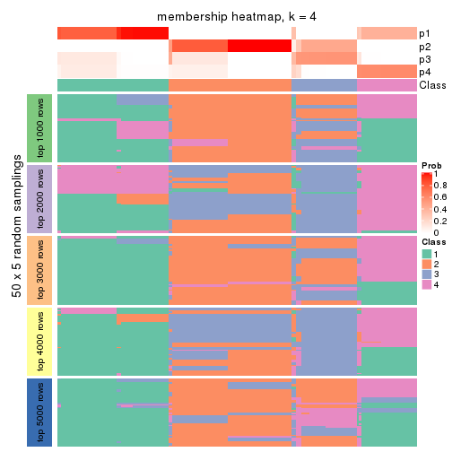</p>

</div>
<div id='tab-SD-kmeans-membership-heatmap-4'>
<pre><code class="r">membership_heatmap(res, k = 5)
</code></pre>

<p></p>

</div>
<div id='tab-SD-kmeans-membership-heatmap-5'>
<pre><code class="r">membership_heatmap(res, k = 6)
</code></pre>

<p></p>

</div>
</div>

As soon as we have had the classes for columns, we can look for signatures
which are significantly different between classes which can be candidate marks
for certain classes. Following are the heatmaps for signatures.


Signature heatmaps where rows are scaled:


<script>
$( function() {
	$( '#tabs-SD-kmeans-get-signatures' ).tabs();
} );
</script>
<div id='tabs-SD-kmeans-get-signatures'>
<ul>
<li><a href='#tab-SD-kmeans-get-signatures-1'>k = 2</a></li>
<li><a href='#tab-SD-kmeans-get-signatures-2'>k = 3</a></li>
<li><a href='#tab-SD-kmeans-get-signatures-3'>k = 4</a></li>
<li><a href='#tab-SD-kmeans-get-signatures-4'>k = 5</a></li>
<li><a href='#tab-SD-kmeans-get-signatures-5'>k = 6</a></li>
</ul>
<div id='tab-SD-kmeans-get-signatures-1'>
<pre><code class="r">get_signatures(res, k = 2)
</code></pre>

<p></p>

</div>
<div id='tab-SD-kmeans-get-signatures-2'>
<pre><code class="r">get_signatures(res, k = 3)
</code></pre>

<p></p>

</div>
<div id='tab-SD-kmeans-get-signatures-3'>
<pre><code class="r">get_signatures(res, k = 4)
</code></pre>

<p></p>

</div>
<div id='tab-SD-kmeans-get-signatures-4'>
<pre><code class="r">get_signatures(res, k = 5)
</code></pre>

<p></p>

</div>
<div id='tab-SD-kmeans-get-signatures-5'>
<pre><code class="r">get_signatures(res, k = 6)
</code></pre>

<p></p>

</div>
</div>


Signature heatmaps where rows are not scaled:


<script>
$( function() {
	$( '#tabs-SD-kmeans-get-signatures-no-scale' ).tabs();
} );
</script>
<div id='tabs-SD-kmeans-get-signatures-no-scale'>
<ul>
<li><a href='#tab-SD-kmeans-get-signatures-no-scale-1'>k = 2</a></li>
<li><a href='#tab-SD-kmeans-get-signatures-no-scale-2'>k = 3</a></li>
<li><a href='#tab-SD-kmeans-get-signatures-no-scale-3'>k = 4</a></li>
<li><a href='#tab-SD-kmeans-get-signatures-no-scale-4'>k = 5</a></li>
<li><a href='#tab-SD-kmeans-get-signatures-no-scale-5'>k = 6</a></li>
</ul>
<div id='tab-SD-kmeans-get-signatures-no-scale-1'>
<pre><code class="r">get_signatures(res, k = 2, scale_rows = FALSE)
</code></pre>

<p></p>

</div>
<div id='tab-SD-kmeans-get-signatures-no-scale-2'>
<pre><code class="r">get_signatures(res, k = 3, scale_rows = FALSE)
</code></pre>

<p></p>

</div>
<div id='tab-SD-kmeans-get-signatures-no-scale-3'>
<pre><code class="r">get_signatures(res, k = 4, scale_rows = FALSE)
</code></pre>

<p></p>

</div>
<div id='tab-SD-kmeans-get-signatures-no-scale-4'>
<pre><code class="r">get_signatures(res, k = 5, scale_rows = FALSE)
</code></pre>

<p></p>

</div>
<div id='tab-SD-kmeans-get-signatures-no-scale-5'>
<pre><code class="r">get_signatures(res, k = 6, scale_rows = FALSE)
</code></pre>

<p></p>

</div>
</div>


Compare the overlap of signatures from different k:

```r
compare_signatures(res)
```

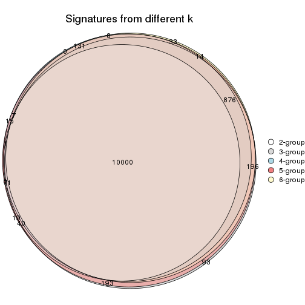

`get_signature()` returns a data frame invisibly. TO get the list of signatures, the function
call should be assigned to a variable explicitly. In following code, if `plot` argument is set
to `FALSE`, no heatmap is plotted while only the differential analysis is performed.

```r
# code only for demonstration
tb = get_signature(res, k = ..., plot = FALSE)
```

An example of the output of `tb` is:

```
#>   which_row         fdr    mean_1    mean_2 scaled_mean_1 scaled_mean_2 km
#> 1        38 0.042760348  8.373488  9.131774    -0.5533452     0.5164555  1
#> 2        40 0.018707592  7.106213  8.469186    -0.6173731     0.5762149  1
#> 3        55 0.019134737 10.221463 11.207825    -0.6159697     0.5749050  1
#> 4        59 0.006059896  5.921854  7.869574    -0.6899429     0.6439467  1
#> 5        60 0.018055526  8.928898 10.211722    -0.6204761     0.5791110  1
#> 6        98 0.009384629 15.714769 14.887706     0.6635654    -0.6193277  2
...
```

The columns in `tb` are:

1. `which_row`: row indices corresponding to the input matrix.
2. `fdr`: FDR for the differential test. 
3. `mean_x`: The mean value in group x.
4. `scaled_mean_x`: The mean value in group x after rows are scaled.
5. `km`: Row groups if k-means clustering is applied to rows.


UMAP plot which shows how samples are separated.


<script>
$( function() {
	$( '#tabs-SD-kmeans-dimension-reduction' ).tabs();
} );
</script>
<div id='tabs-SD-kmeans-dimension-reduction'>
<ul>
<li><a href='#tab-SD-kmeans-dimension-reduction-1'>k = 2</a></li>
<li><a href='#tab-SD-kmeans-dimension-reduction-2'>k = 3</a></li>
<li><a href='#tab-SD-kmeans-dimension-reduction-3'>k = 4</a></li>
<li><a href='#tab-SD-kmeans-dimension-reduction-4'>k = 5</a></li>
<li><a href='#tab-SD-kmeans-dimension-reduction-5'>k = 6</a></li>
</ul>
<div id='tab-SD-kmeans-dimension-reduction-1'>
<pre><code class="r">dimension_reduction(res, k = 2, method = &quot;UMAP&quot;)
</code></pre>

<p></p>

</div>
<div id='tab-SD-kmeans-dimension-reduction-2'>
<pre><code class="r">dimension_reduction(res, k = 3, method = &quot;UMAP&quot;)
</code></pre>

<p></p>

</div>
<div id='tab-SD-kmeans-dimension-reduction-3'>
<pre><code class="r">dimension_reduction(res, k = 4, method = &quot;UMAP&quot;)
</code></pre>

<p></p>

</div>
<div id='tab-SD-kmeans-dimension-reduction-4'>
<pre><code class="r">dimension_reduction(res, k = 5, method = &quot;UMAP&quot;)
</code></pre>

<p></p>

</div>
<div id='tab-SD-kmeans-dimension-reduction-5'>
<pre><code class="r">dimension_reduction(res, k = 6, method = &quot;UMAP&quot;)
</code></pre>

<p></p>

</div>
</div>


Following heatmap shows how subgroups are split when increasing `k`:

```r
collect_classes(res)
```


If matrix rows can be associated to genes, consider to use `functional_enrichment(res,
...)` to perform function enrichment for the signature genes. See [this vignette](http://bioconductor.org/packages/devel/bioc/vignettes/cola/inst/doc/functional_enrichment.html) for more detailed explanations.


 

---------------------------------------------------


### SD:skmeans**


The object with results only for a single top-value method and a single partition method 
can be extracted as:

```r
res = res_list["SD", "skmeans"]
# you can also extract it by
# res = res_list["SD:skmeans"]
```

A summary of `res` and all the functions that can be applied to it:

```r
res
```

```
#> A 'ConsensusPartition' object with k = 2, 3, 4, 5, 6.
#>   On a matrix with 12029 rows and 181 columns.
#>   Top rows (1000, 2000, 3000, 4000, 5000) are extracted by 'SD' method.
#>   Subgroups are detected by 'skmeans' method.
#>   Performed in total 1250 partitions by row resampling.
#>   Best k for subgroups seems to be 2.
#> 
#> Following methods can be applied to this 'ConsensusPartition' object:
#>  [1] "cola_report"             "collect_classes"         "collect_plots"          
#>  [4] "collect_stats"           "colnames"                "compare_signatures"     
#>  [7] "consensus_heatmap"       "dimension_reduction"     "functional_enrichment"  
#> [10] "get_anno_col"            "get_anno"                "get_classes"            
#> [13] "get_consensus"           "get_matrix"              "get_membership"         
#> [16] "get_param"               "get_signatures"          "get_stats"              
#> [19] "is_best_k"               "is_stable_k"             "membership_heatmap"     
#> [22] "ncol"                    "nrow"                    "plot_ecdf"              
#> [25] "rownames"                "select_partition_number" "show"                   
#> [28] "suggest_best_k"          "test_to_known_factors"
```

`collect_plots()` function collects all the plots made from `res` for all `k` (number of partitions)
into one single page to provide an easy and fast comparison between different `k`.

```r
collect_plots(res)
```


The plots are:

- The first row: a plot of the ECDF (empirical cumulative distribution
  function) curves of the consensus matrix for each `k` and the heatmap of
  predicted classes for each `k`.
- The second row: heatmaps of the consensus matrix for each `k`.
- The third row: heatmaps of the membership matrix for each `k`.
- The fouth row: heatmaps of the signatures for each `k`.

All the plots in panels can be made by individual functions and they are
plotted later in this section.

`select_partition_number()` produces several plots showing different
statistics for choosing "optimized" `k`. There are following statistics:

- ECDF curves of the consensus matrix for each `k`;
- 1-PAC. [The PAC
  score](https://en.wikipedia.org/wiki/Consensus_clustering#Over-interpretation_potential_of_consensus_clustering)
  measures the proportion of the ambiguous subgrouping.
- Mean silhouette score.
- Concordance. The mean probability of fiting the consensus class ids in all
  partitions.
- Area increased. Denote $A_k$ as the area under the ECDF curve for current
  `k`, the area increased is defined as $A_k - A_{k-1}$.
- Rand index. The percent of pairs of samples that are both in a same cluster
  or both are not in a same cluster in the partition of k and k-1.
- Jaccard index. The ratio of pairs of samples are both in a same cluster in
  the partition of k and k-1 and the pairs of samples are both in a same
  cluster in the partition k or k-1.

The detailed explanations of these statistics can be found in [the _cola_
vignette](http://bioconductor.org/packages/devel/bioc/vignettes/cola/inst/doc/cola.html#toc_13).

Generally speaking, lower PAC score, higher mean silhouette score or higher
concordance corresponds to better partition. Rand index and Jaccard index
measure how similar the current partition is compared to partition with `k-1`.
If they are too similar, we won't accept `k` is better than `k-1`.

```r
select_partition_number(res)
```


The numeric values for all these statistics can be obtained by `get_stats()`.

```r
get_stats(res)
```

```
#>   k 1-PAC mean_silhouette concordance area_increased  Rand Jaccard
#> 2 2 1.000           0.985       0.995         0.5025 0.498   0.498
#> 3 3 0.810           0.860       0.914         0.1503 0.962   0.924
#> 4 4 0.674           0.679       0.778         0.1406 1.000   1.000
#> 5 5 0.741           0.697       0.753         0.1004 0.890   0.760
#> 6 6 0.774           0.853       0.749         0.0591 0.852   0.582
```

`suggest_best_k()` suggests the best $k$ based on these statistics. The rules are as follows:

- All $k$ with Jaccard index larger than 0.95 are removed because increasing
  $k$ does not provide enough extra information. If all $k$ are removed, it is
  marked as no subgroup is detected.
- For all $k$ with 1-PAC score larger than 0.9, the maximal $k$ is taken as
  the best $k$, and other $k$ are marked as optional $k$.
- If it does not fit the second rule. The $k$ with the maximal vote of the
  highest 1-PAC score, highest mean silhouette, and highest concordance is
  taken as the best $k$.

```r
suggest_best_k(res)
```

```
#> [1] 2
```


Following shows the table of the partitions (You need to click the **show/hide
code output** link to see it). The membership matrix (columns with name `p*`)
is inferred by
[`clue::cl_consensus()`](https://www.rdocumentation.org/link/cl_consensus?package=clue)
function with the `SE` method. Basically the value in the membership matrix
represents the probability to belong to a certain group. The finall class
label for an item is determined with the group with highest probability it
belongs to.

In `get_classes()` function, the entropy is calculated from the membership
matrix and the silhouette score is calculated from the consensus matrix.


<script>
$( function() {
	$( '#tabs-SD-skmeans-get-classes' ).tabs();
} );
</script>
<div id='tabs-SD-skmeans-get-classes'>
<ul>
<li><a href='#tab-SD-skmeans-get-classes-1'>k = 2</a></li>
<li><a href='#tab-SD-skmeans-get-classes-2'>k = 3</a></li>
<li><a href='#tab-SD-skmeans-get-classes-3'>k = 4</a></li>
<li><a href='#tab-SD-skmeans-get-classes-4'>k = 5</a></li>
<li><a href='#tab-SD-skmeans-get-classes-5'>k = 6</a></li>
</ul>

<div id='tab-SD-skmeans-get-classes-1'>
<p><a id='tab-SD-skmeans-get-classes-1-a' style='color:#0366d6' href='#'>show/hide code output</a></p>
<pre><code class="r">cbind(get_classes(res, k = 2), get_membership(res, k = 2))
</code></pre>

<pre><code>#&gt;           class entropy silhouette    p1    p2
#&gt; SRR315112     2   0.000      1.000 0.000 1.000
#&gt; SRR315113     1   0.000      0.989 1.000 0.000
#&gt; SRR315114     1   0.000      0.989 1.000 0.000
#&gt; SRR315115     2   0.000      1.000 0.000 1.000
#&gt; SRR315116     2   0.000      1.000 0.000 1.000
#&gt; SRR566986     2   0.000      1.000 0.000 1.000
#&gt; SRR566987     2   0.000      1.000 0.000 1.000
#&gt; SRR566988     2   0.000      1.000 0.000 1.000
#&gt; SRR566989     2   0.000      1.000 0.000 1.000
#&gt; SRR566990     2   0.000      1.000 0.000 1.000
#&gt; SRR566991     2   0.000      1.000 0.000 1.000
#&gt; SRR566992     2   0.000      1.000 0.000 1.000
#&gt; SRR566993     2   0.000      1.000 0.000 1.000
#&gt; SRR566994     2   0.000      1.000 0.000 1.000
#&gt; SRR566995     2   0.000      1.000 0.000 1.000
#&gt; SRR566996     2   0.000      1.000 0.000 1.000
#&gt; SRR566997     2   0.000      1.000 0.000 1.000
#&gt; SRR566998     2   0.000      1.000 0.000 1.000
#&gt; SRR566999     2   0.000      1.000 0.000 1.000
#&gt; SRR567000     2   0.000      1.000 0.000 1.000
#&gt; SRR567001     2   0.000      1.000 0.000 1.000
#&gt; SRR567002     2   0.000      1.000 0.000 1.000
#&gt; SRR567003     2   0.000      1.000 0.000 1.000
#&gt; SRR567004     2   0.000      1.000 0.000 1.000
#&gt; SRR567005     2   0.000      1.000 0.000 1.000
#&gt; SRR567006     2   0.000      1.000 0.000 1.000
#&gt; SRR567007     2   0.000      1.000 0.000 1.000
#&gt; SRR567008     2   0.000      1.000 0.000 1.000
#&gt; SRR567009     2   0.000      1.000 0.000 1.000
#&gt; SRR567010     2   0.000      1.000 0.000 1.000
#&gt; SRR567011     2   0.000      1.000 0.000 1.000
#&gt; SRR567012     2   0.000      1.000 0.000 1.000
#&gt; SRR567013     2   0.000      1.000 0.000 1.000
#&gt; SRR567014     2   0.000      1.000 0.000 1.000
#&gt; SRR567015     2   0.000      1.000 0.000 1.000
#&gt; SRR567016     2   0.000      1.000 0.000 1.000
#&gt; SRR567017     2   0.000      1.000 0.000 1.000
#&gt; SRR567018     2   0.000      1.000 0.000 1.000
#&gt; SRR567019     2   0.000      1.000 0.000 1.000
#&gt; SRR567020     2   0.000      1.000 0.000 1.000
#&gt; SRR567021     2   0.000      1.000 0.000 1.000
#&gt; SRR567022     2   0.000      1.000 0.000 1.000
#&gt; SRR567023     2   0.000      1.000 0.000 1.000
#&gt; SRR567024     2   0.000      1.000 0.000 1.000
#&gt; SRR567025     2   0.000      1.000 0.000 1.000
#&gt; SRR567026     2   0.000      1.000 0.000 1.000
#&gt; SRR567027     2   0.000      1.000 0.000 1.000
#&gt; SRR567028     2   0.000      1.000 0.000 1.000
#&gt; SRR567029     2   0.000      1.000 0.000 1.000
#&gt; SRR567030     2   0.000      1.000 0.000 1.000
#&gt; SRR567031     2   0.000      1.000 0.000 1.000
#&gt; SRR567032     2   0.000      1.000 0.000 1.000
#&gt; SRR567033     2   0.000      1.000 0.000 1.000
#&gt; SRR567034     2   0.000      1.000 0.000 1.000
#&gt; SRR567035     2   0.000      1.000 0.000 1.000
#&gt; SRR567036     2   0.000      1.000 0.000 1.000
#&gt; SRR567037     2   0.000      1.000 0.000 1.000
#&gt; SRR567038     2   0.000      1.000 0.000 1.000
#&gt; SRR567039     2   0.000      1.000 0.000 1.000
#&gt; SRR567040     2   0.000      1.000 0.000 1.000
#&gt; SRR567041     2   0.000      1.000 0.000 1.000
#&gt; SRR567042     2   0.000      1.000 0.000 1.000
#&gt; SRR567043     2   0.000      1.000 0.000 1.000
#&gt; SRR567044     2   0.000      1.000 0.000 1.000
#&gt; SRR567045     2   0.000      1.000 0.000 1.000
#&gt; SRR567046     2   0.000      1.000 0.000 1.000
#&gt; SRR567047     2   0.000      1.000 0.000 1.000
#&gt; SRR567048     2   0.000      1.000 0.000 1.000
#&gt; SRR567049     2   0.000      1.000 0.000 1.000
#&gt; SRR567050     2   0.000      1.000 0.000 1.000
#&gt; SRR567051     2   0.000      1.000 0.000 1.000
#&gt; SRR567052     2   0.000      1.000 0.000 1.000
#&gt; SRR567053     2   0.000      1.000 0.000 1.000
#&gt; SRR567054     2   0.000      1.000 0.000 1.000
#&gt; SRR567055     2   0.000      1.000 0.000 1.000
#&gt; SRR567056     2   0.000      1.000 0.000 1.000
#&gt; SRR567057     2   0.000      1.000 0.000 1.000
#&gt; SRR567058     2   0.000      1.000 0.000 1.000
#&gt; SRR567059     2   0.000      1.000 0.000 1.000
#&gt; SRR567060     2   0.000      1.000 0.000 1.000
#&gt; SRR567061     2   0.000      1.000 0.000 1.000
#&gt; SRR567062     2   0.000      1.000 0.000 1.000
#&gt; SRR567063     2   0.000      1.000 0.000 1.000
#&gt; SRR567064     2   0.000      1.000 0.000 1.000
#&gt; SRR567065     2   0.000      1.000 0.000 1.000
#&gt; SRR567066     2   0.000      1.000 0.000 1.000
#&gt; SRR567067     2   0.000      1.000 0.000 1.000
#&gt; SRR567068     2   0.000      1.000 0.000 1.000
#&gt; SRR567069     2   0.000      1.000 0.000 1.000
#&gt; SRR567070     2   0.000      1.000 0.000 1.000
#&gt; SRR567071     2   0.000      1.000 0.000 1.000
#&gt; SRR567072     2   0.000      1.000 0.000 1.000
#&gt; SRR567073     2   0.000      1.000 0.000 1.000
#&gt; SRR567074     2   0.000      1.000 0.000 1.000
#&gt; SRR567075     2   0.000      1.000 0.000 1.000
#&gt; SRR567076     1   0.000      0.989 1.000 0.000
#&gt; SRR567077     1   0.000      0.989 1.000 0.000
#&gt; SRR567078     1   0.000      0.989 1.000 0.000
#&gt; SRR567079     1   0.000      0.989 1.000 0.000
#&gt; SRR567080     1   0.000      0.989 1.000 0.000
#&gt; SRR567081     1   0.000      0.989 1.000 0.000
#&gt; SRR567082     1   0.000      0.989 1.000 0.000
#&gt; SRR567083     1   0.000      0.989 1.000 0.000
#&gt; SRR567084     1   0.000      0.989 1.000 0.000
#&gt; SRR567085     1   0.000      0.989 1.000 0.000
#&gt; SRR567086     1   0.000      0.989 1.000 0.000
#&gt; SRR567087     1   0.000      0.989 1.000 0.000
#&gt; SRR567088     1   0.000      0.989 1.000 0.000
#&gt; SRR567089     1   0.000      0.989 1.000 0.000
#&gt; SRR567090     1   0.000      0.989 1.000 0.000
#&gt; SRR567091     1   0.000      0.989 1.000 0.000
#&gt; SRR567092     1   0.000      0.989 1.000 0.000
#&gt; SRR567093     1   0.000      0.989 1.000 0.000
#&gt; SRR567094     1   0.000      0.989 1.000 0.000
#&gt; SRR567095     1   0.000      0.989 1.000 0.000
#&gt; SRR567096     1   0.000      0.989 1.000 0.000
#&gt; SRR567097     1   0.000      0.989 1.000 0.000
#&gt; SRR567098     1   0.000      0.989 1.000 0.000
#&gt; SRR567099     1   0.000      0.989 1.000 0.000
#&gt; SRR567100     1   0.000      0.989 1.000 0.000
#&gt; SRR567101     1   0.000      0.989 1.000 0.000
#&gt; SRR567102     1   0.000      0.989 1.000 0.000
#&gt; SRR567103     1   0.000      0.989 1.000 0.000
#&gt; SRR567104     1   0.000      0.989 1.000 0.000
#&gt; SRR567105     1   0.000      0.989 1.000 0.000
#&gt; SRR567106     1   0.000      0.989 1.000 0.000
#&gt; SRR567107     1   0.000      0.989 1.000 0.000
#&gt; SRR567108     1   0.000      0.989 1.000 0.000
#&gt; SRR567109     1   0.000      0.989 1.000 0.000
#&gt; SRR567110     1   0.000      0.989 1.000 0.000
#&gt; SRR567111     1   0.000      0.989 1.000 0.000
#&gt; SRR567112     1   0.000      0.989 1.000 0.000
#&gt; SRR567113     1   0.000      0.989 1.000 0.000
#&gt; SRR567114     1   0.000      0.989 1.000 0.000
#&gt; SRR567115     1   0.000      0.989 1.000 0.000
#&gt; SRR567116     1   0.000      0.989 1.000 0.000
#&gt; SRR567117     1   0.000      0.989 1.000 0.000
#&gt; SRR567118     1   0.000      0.989 1.000 0.000
#&gt; SRR567119     1   0.000      0.989 1.000 0.000
#&gt; SRR567120     1   0.000      0.989 1.000 0.000
#&gt; SRR567121     1   0.000      0.989 1.000 0.000
#&gt; SRR567122     1   0.000      0.989 1.000 0.000
#&gt; SRR567123     1   0.000      0.989 1.000 0.000
#&gt; SRR567124     1   0.000      0.989 1.000 0.000
#&gt; SRR567125     1   0.000      0.989 1.000 0.000
#&gt; SRR567126     1   0.000      0.989 1.000 0.000
#&gt; SRR567127     1   0.000      0.989 1.000 0.000
#&gt; SRR567128     1   0.000      0.989 1.000 0.000
#&gt; SRR567129     1   0.000      0.989 1.000 0.000
#&gt; SRR567130     1   0.000      0.989 1.000 0.000
#&gt; SRR567131     1   0.000      0.989 1.000 0.000
#&gt; SRR567132     1   0.000      0.989 1.000 0.000
#&gt; SRR567133     1   0.000      0.989 1.000 0.000
#&gt; SRR567134     1   0.000      0.989 1.000 0.000
#&gt; SRR567135     1   0.000      0.989 1.000 0.000
#&gt; SRR567136     1   0.000      0.989 1.000 0.000
#&gt; SRR567137     1   0.000      0.989 1.000 0.000
#&gt; SRR567138     1   0.000      0.989 1.000 0.000
#&gt; SRR567139     1   0.000      0.989 1.000 0.000
#&gt; SRR567140     1   0.000      0.989 1.000 0.000
#&gt; SRR567141     1   0.000      0.989 1.000 0.000
#&gt; SRR567142     1   0.000      0.989 1.000 0.000
#&gt; SRR567143     1   0.000      0.989 1.000 0.000
#&gt; SRR567144     1   0.000      0.989 1.000 0.000
#&gt; SRR567145     1   0.000      0.989 1.000 0.000
#&gt; SRR567146     1   0.996      0.144 0.536 0.464
#&gt; SRR567147     1   0.000      0.989 1.000 0.000
#&gt; SRR567148     1   0.000      0.989 1.000 0.000
#&gt; SRR567149     1   0.000      0.989 1.000 0.000
#&gt; SRR567150     1   0.000      0.989 1.000 0.000
#&gt; SRR567151     1   0.000      0.989 1.000 0.000
#&gt; SRR567152     1   0.000      0.989 1.000 0.000
#&gt; SRR567153     1   0.000      0.989 1.000 0.000
#&gt; SRR567154     1   0.000      0.989 1.000 0.000
#&gt; SRR567155     1   0.000      0.989 1.000 0.000
#&gt; SRR567156     1   0.000      0.989 1.000 0.000
#&gt; SRR567157     1   0.000      0.989 1.000 0.000
#&gt; SRR567158     1   0.000      0.989 1.000 0.000
#&gt; SRR567159     1   0.000      0.989 1.000 0.000
#&gt; SRR567160     1   0.000      0.989 1.000 0.000
#&gt; SRR567161     1   0.996      0.144 0.536 0.464
</code></pre>

<script>
$('#tab-SD-skmeans-get-classes-1-a').parent().next().next().hide();
$('#tab-SD-skmeans-get-classes-1-a').click(function(){
  $('#tab-SD-skmeans-get-classes-1-a').parent().next().next().toggle();
  return(false);
});
</script>
</div>

<div id='tab-SD-skmeans-get-classes-2'>
<p><a id='tab-SD-skmeans-get-classes-2-a' style='color:#0366d6' href='#'>show/hide code output</a></p>
<pre><code class="r">cbind(get_classes(res, k = 3), get_membership(res, k = 3))
</code></pre>

<pre><code>#&gt;           class entropy silhouette    p1    p2    p3
#&gt; SRR315112     3  0.0592      0.593 0.000 0.012 0.988
#&gt; SRR315113     3  0.6252      0.417 0.444 0.000 0.556
#&gt; SRR315114     3  0.6252      0.417 0.444 0.000 0.556
#&gt; SRR315115     3  0.0592      0.593 0.000 0.012 0.988
#&gt; SRR315116     3  0.0592      0.593 0.000 0.012 0.988
#&gt; SRR566986     2  0.2959      0.821 0.000 0.900 0.100
#&gt; SRR566987     2  0.2959      0.821 0.000 0.900 0.100
#&gt; SRR566988     2  0.2959      0.821 0.000 0.900 0.100
#&gt; SRR566989     2  0.2959      0.821 0.000 0.900 0.100
#&gt; SRR566990     2  0.2959      0.821 0.000 0.900 0.100
#&gt; SRR566991     2  0.2959      0.821 0.000 0.900 0.100
#&gt; SRR566992     2  0.2959      0.821 0.000 0.900 0.100
#&gt; SRR566993     2  0.2959      0.821 0.000 0.900 0.100
#&gt; SRR566994     2  0.2959      0.821 0.000 0.900 0.100
#&gt; SRR566995     2  0.2959      0.821 0.000 0.900 0.100
#&gt; SRR566996     2  0.2959      0.821 0.000 0.900 0.100
#&gt; SRR566997     2  0.2959      0.821 0.000 0.900 0.100
#&gt; SRR566998     2  0.2959      0.821 0.000 0.900 0.100
#&gt; SRR566999     2  0.2959      0.821 0.000 0.900 0.100
#&gt; SRR567000     2  0.2959      0.821 0.000 0.900 0.100
#&gt; SRR567001     2  0.2959      0.821 0.000 0.900 0.100
#&gt; SRR567002     2  0.2959      0.821 0.000 0.900 0.100
#&gt; SRR567003     2  0.2959      0.821 0.000 0.900 0.100
#&gt; SRR567004     2  0.2959      0.821 0.000 0.900 0.100
#&gt; SRR567005     2  0.2959      0.821 0.000 0.900 0.100
#&gt; SRR567006     2  0.2959      0.821 0.000 0.900 0.100
#&gt; SRR567007     2  0.2959      0.821 0.000 0.900 0.100
#&gt; SRR567008     2  0.2959      0.821 0.000 0.900 0.100
#&gt; SRR567009     2  0.2959      0.821 0.000 0.900 0.100
#&gt; SRR567010     2  0.2959      0.821 0.000 0.900 0.100
#&gt; SRR567011     2  0.2959      0.821 0.000 0.900 0.100
#&gt; SRR567012     2  0.2959      0.821 0.000 0.900 0.100
#&gt; SRR567013     2  0.2959      0.821 0.000 0.900 0.100
#&gt; SRR567014     2  0.6244      0.647 0.000 0.560 0.440
#&gt; SRR567015     2  0.6244      0.647 0.000 0.560 0.440
#&gt; SRR567016     2  0.6244      0.647 0.000 0.560 0.440
#&gt; SRR567017     2  0.6244      0.647 0.000 0.560 0.440
#&gt; SRR567018     2  0.6244      0.647 0.000 0.560 0.440
#&gt; SRR567019     2  0.6244      0.647 0.000 0.560 0.440
#&gt; SRR567020     2  0.6244      0.647 0.000 0.560 0.440
#&gt; SRR567021     2  0.6244      0.647 0.000 0.560 0.440
#&gt; SRR567022     2  0.6244      0.647 0.000 0.560 0.440
#&gt; SRR567023     2  0.6244      0.647 0.000 0.560 0.440
#&gt; SRR567024     2  0.6244      0.647 0.000 0.560 0.440
#&gt; SRR567025     2  0.6244      0.647 0.000 0.560 0.440
#&gt; SRR567026     2  0.6244      0.647 0.000 0.560 0.440
#&gt; SRR567027     2  0.6244      0.647 0.000 0.560 0.440
#&gt; SRR567028     2  0.6244      0.647 0.000 0.560 0.440
#&gt; SRR567029     2  0.6244      0.647 0.000 0.560 0.440
#&gt; SRR567030     2  0.6244      0.647 0.000 0.560 0.440
#&gt; SRR567031     2  0.6244      0.647 0.000 0.560 0.440
#&gt; SRR567032     2  0.6244      0.647 0.000 0.560 0.440
#&gt; SRR567033     2  0.6244      0.647 0.000 0.560 0.440
#&gt; SRR567034     2  0.6244      0.647 0.000 0.560 0.440
#&gt; SRR567035     2  0.6244      0.647 0.000 0.560 0.440
#&gt; SRR567036     2  0.6244      0.647 0.000 0.560 0.440
#&gt; SRR567037     2  0.6244      0.647 0.000 0.560 0.440
#&gt; SRR567038     2  0.6244      0.647 0.000 0.560 0.440
#&gt; SRR567039     2  0.6244      0.647 0.000 0.560 0.440
#&gt; SRR567040     2  0.6244      0.647 0.000 0.560 0.440
#&gt; SRR567041     2  0.6244      0.647 0.000 0.560 0.440
#&gt; SRR567042     2  0.6244      0.647 0.000 0.560 0.440
#&gt; SRR567043     2  0.6244      0.647 0.000 0.560 0.440
#&gt; SRR567044     2  0.0000      0.805 0.000 1.000 0.000
#&gt; SRR567045     2  0.0000      0.805 0.000 1.000 0.000
#&gt; SRR567046     2  0.0000      0.805 0.000 1.000 0.000
#&gt; SRR567047     2  0.0000      0.805 0.000 1.000 0.000
#&gt; SRR567048     2  0.0000      0.805 0.000 1.000 0.000
#&gt; SRR567049     2  0.0000      0.805 0.000 1.000 0.000
#&gt; SRR567050     2  0.0000      0.805 0.000 1.000 0.000
#&gt; SRR567051     2  0.0000      0.805 0.000 1.000 0.000
#&gt; SRR567052     2  0.0000      0.805 0.000 1.000 0.000
#&gt; SRR567053     2  0.0000      0.805 0.000 1.000 0.000
#&gt; SRR567054     2  0.0000      0.805 0.000 1.000 0.000
#&gt; SRR567055     2  0.0000      0.805 0.000 1.000 0.000
#&gt; SRR567056     2  0.0000      0.805 0.000 1.000 0.000
#&gt; SRR567057     2  0.0000      0.805 0.000 1.000 0.000
#&gt; SRR567058     2  0.0000      0.805 0.000 1.000 0.000
#&gt; SRR567059     2  0.0000      0.805 0.000 1.000 0.000
#&gt; SRR567060     2  0.0000      0.805 0.000 1.000 0.000
#&gt; SRR567061     2  0.0000      0.805 0.000 1.000 0.000
#&gt; SRR567062     2  0.0000      0.805 0.000 1.000 0.000
#&gt; SRR567063     2  0.0000      0.805 0.000 1.000 0.000
#&gt; SRR567064     2  0.0000      0.805 0.000 1.000 0.000
#&gt; SRR567065     2  0.0000      0.805 0.000 1.000 0.000
#&gt; SRR567066     2  0.0000      0.805 0.000 1.000 0.000
#&gt; SRR567067     2  0.0000      0.805 0.000 1.000 0.000
#&gt; SRR567068     2  0.0000      0.805 0.000 1.000 0.000
#&gt; SRR567069     2  0.0000      0.805 0.000 1.000 0.000
#&gt; SRR567070     2  0.0000      0.805 0.000 1.000 0.000
#&gt; SRR567071     2  0.0000      0.805 0.000 1.000 0.000
#&gt; SRR567072     2  0.0000      0.805 0.000 1.000 0.000
#&gt; SRR567073     2  0.0000      0.805 0.000 1.000 0.000
#&gt; SRR567074     2  0.0000      0.805 0.000 1.000 0.000
#&gt; SRR567075     2  0.0000      0.805 0.000 1.000 0.000
#&gt; SRR567076     1  0.0000      0.995 1.000 0.000 0.000
#&gt; SRR567077     1  0.0000      0.995 1.000 0.000 0.000
#&gt; SRR567078     1  0.0000      0.995 1.000 0.000 0.000
#&gt; SRR567079     1  0.0000      0.995 1.000 0.000 0.000
#&gt; SRR567080     1  0.0000      0.995 1.000 0.000 0.000
#&gt; SRR567081     1  0.0000      0.995 1.000 0.000 0.000
#&gt; SRR567082     1  0.0000      0.995 1.000 0.000 0.000
#&gt; SRR567083     1  0.0000      0.995 1.000 0.000 0.000
#&gt; SRR567084     1  0.0000      0.995 1.000 0.000 0.000
#&gt; SRR567085     1  0.0000      0.995 1.000 0.000 0.000
#&gt; SRR567086     1  0.0000      0.995 1.000 0.000 0.000
#&gt; SRR567087     1  0.0000      0.995 1.000 0.000 0.000
#&gt; SRR567088     1  0.0000      0.995 1.000 0.000 0.000
#&gt; SRR567089     1  0.0000      0.995 1.000 0.000 0.000
#&gt; SRR567090     1  0.0000      0.995 1.000 0.000 0.000
#&gt; SRR567091     1  0.0000      0.995 1.000 0.000 0.000
#&gt; SRR567092     1  0.0000      0.995 1.000 0.000 0.000
#&gt; SRR567093     1  0.0000      0.995 1.000 0.000 0.000
#&gt; SRR567094     1  0.0000      0.995 1.000 0.000 0.000
#&gt; SRR567095     1  0.0000      0.995 1.000 0.000 0.000
#&gt; SRR567096     1  0.0000      0.995 1.000 0.000 0.000
#&gt; SRR567097     1  0.0000      0.995 1.000 0.000 0.000
#&gt; SRR567098     1  0.0000      0.995 1.000 0.000 0.000
#&gt; SRR567099     1  0.0000      0.995 1.000 0.000 0.000
#&gt; SRR567100     1  0.0000      0.995 1.000 0.000 0.000
#&gt; SRR567101     1  0.0000      0.995 1.000 0.000 0.000
#&gt; SRR567102     1  0.0000      0.995 1.000 0.000 0.000
#&gt; SRR567103     1  0.0000      0.995 1.000 0.000 0.000
#&gt; SRR567104     1  0.0000      0.995 1.000 0.000 0.000
#&gt; SRR567105     1  0.0000      0.995 1.000 0.000 0.000
#&gt; SRR567106     1  0.0424      0.993 0.992 0.000 0.008
#&gt; SRR567107     1  0.0424      0.993 0.992 0.000 0.008
#&gt; SRR567108     1  0.0424      0.993 0.992 0.000 0.008
#&gt; SRR567109     1  0.0424      0.993 0.992 0.000 0.008
#&gt; SRR567110     1  0.0424      0.993 0.992 0.000 0.008
#&gt; SRR567111     1  0.0424      0.993 0.992 0.000 0.008
#&gt; SRR567112     1  0.0424      0.993 0.992 0.000 0.008
#&gt; SRR567113     1  0.0424      0.993 0.992 0.000 0.008
#&gt; SRR567114     1  0.0424      0.993 0.992 0.000 0.008
#&gt; SRR567115     1  0.0424      0.993 0.992 0.000 0.008
#&gt; SRR567116     1  0.0424      0.993 0.992 0.000 0.008
#&gt; SRR567117     1  0.0424      0.993 0.992 0.000 0.008
#&gt; SRR567118     1  0.0424      0.993 0.992 0.000 0.008
#&gt; SRR567119     1  0.0424      0.993 0.992 0.000 0.008
#&gt; SRR567120     1  0.0424      0.993 0.992 0.000 0.008
#&gt; SRR567121     1  0.0424      0.993 0.992 0.000 0.008
#&gt; SRR567122     1  0.0424      0.993 0.992 0.000 0.008
#&gt; SRR567123     1  0.0424      0.993 0.992 0.000 0.008
#&gt; SRR567124     1  0.0424      0.993 0.992 0.000 0.008
#&gt; SRR567125     1  0.0424      0.993 0.992 0.000 0.008
#&gt; SRR567126     1  0.0424      0.993 0.992 0.000 0.008
#&gt; SRR567127     1  0.0424      0.993 0.992 0.000 0.008
#&gt; SRR567128     1  0.0424      0.993 0.992 0.000 0.008
#&gt; SRR567129     1  0.0424      0.993 0.992 0.000 0.008
#&gt; SRR567130     1  0.0424      0.993 0.992 0.000 0.008
#&gt; SRR567131     1  0.0424      0.993 0.992 0.000 0.008
#&gt; SRR567132     1  0.0424      0.993 0.992 0.000 0.008
#&gt; SRR567133     1  0.0424      0.993 0.992 0.000 0.008
#&gt; SRR567134     1  0.0237      0.994 0.996 0.000 0.004
#&gt; SRR567135     1  0.0237      0.994 0.996 0.000 0.004
#&gt; SRR567136     1  0.0237      0.994 0.996 0.000 0.004
#&gt; SRR567137     1  0.0237      0.994 0.996 0.000 0.004
#&gt; SRR567138     1  0.0237      0.994 0.996 0.000 0.004
#&gt; SRR567139     1  0.0237      0.994 0.996 0.000 0.004
#&gt; SRR567140     1  0.0237      0.994 0.996 0.000 0.004
#&gt; SRR567141     1  0.0237      0.994 0.996 0.000 0.004
#&gt; SRR567142     1  0.0237      0.994 0.996 0.000 0.004
#&gt; SRR567143     1  0.0237      0.994 0.996 0.000 0.004
#&gt; SRR567144     1  0.0237      0.994 0.996 0.000 0.004
#&gt; SRR567145     1  0.0237      0.994 0.996 0.000 0.004
#&gt; SRR567146     3  0.6262      0.677 0.284 0.020 0.696
#&gt; SRR567147     1  0.0237      0.994 0.996 0.000 0.004
#&gt; SRR567148     1  0.0237      0.994 0.996 0.000 0.004
#&gt; SRR567149     1  0.0237      0.994 0.996 0.000 0.004
#&gt; SRR567150     1  0.0237      0.994 0.996 0.000 0.004
#&gt; SRR567151     1  0.0237      0.994 0.996 0.000 0.004
#&gt; SRR567152     1  0.0237      0.994 0.996 0.000 0.004
#&gt; SRR567153     1  0.0237      0.994 0.996 0.000 0.004
#&gt; SRR567154     1  0.0237      0.994 0.996 0.000 0.004
#&gt; SRR567155     1  0.0237      0.994 0.996 0.000 0.004
#&gt; SRR567156     1  0.0237      0.994 0.996 0.000 0.004
#&gt; SRR567157     1  0.0237      0.994 0.996 0.000 0.004
#&gt; SRR567158     1  0.0237      0.994 0.996 0.000 0.004
#&gt; SRR567159     1  0.0237      0.994 0.996 0.000 0.004
#&gt; SRR567160     1  0.0237      0.994 0.996 0.000 0.004
#&gt; SRR567161     3  0.6262      0.677 0.284 0.020 0.696
</code></pre>

<script>
$('#tab-SD-skmeans-get-classes-2-a').parent().next().next().hide();
$('#tab-SD-skmeans-get-classes-2-a').click(function(){
  $('#tab-SD-skmeans-get-classes-2-a').parent().next().next().toggle();
  return(false);
});
</script>
</div>

<div id='tab-SD-skmeans-get-classes-3'>
<p><a id='tab-SD-skmeans-get-classes-3-a' style='color:#0366d6' href='#'>show/hide code output</a></p>
<pre><code class="r">cbind(get_classes(res, k = 4), get_membership(res, k = 4))
</code></pre>

<pre><code>#&gt;           class entropy silhouette    p1    p2 p3    p4
#&gt; SRR315112     4  0.5816      0.819 0.000 0.036 NA 0.572
#&gt; SRR315113     4  0.4136      0.759 0.016 0.000 NA 0.788
#&gt; SRR315114     4  0.4136      0.759 0.016 0.000 NA 0.788
#&gt; SRR315115     4  0.5816      0.819 0.000 0.036 NA 0.572
#&gt; SRR315116     4  0.5816      0.819 0.000 0.036 NA 0.572
#&gt; SRR566986     2  0.0000      0.662 0.000 1.000 NA 0.000
#&gt; SRR566987     2  0.0000      0.662 0.000 1.000 NA 0.000
#&gt; SRR566988     2  0.0000      0.662 0.000 1.000 NA 0.000
#&gt; SRR566989     2  0.0000      0.662 0.000 1.000 NA 0.000
#&gt; SRR566990     2  0.0000      0.662 0.000 1.000 NA 0.000
#&gt; SRR566991     2  0.0000      0.662 0.000 1.000 NA 0.000
#&gt; SRR566992     2  0.0000      0.662 0.000 1.000 NA 0.000
#&gt; SRR566993     2  0.0000      0.662 0.000 1.000 NA 0.000
#&gt; SRR566994     2  0.0000      0.662 0.000 1.000 NA 0.000
#&gt; SRR566995     2  0.0000      0.662 0.000 1.000 NA 0.000
#&gt; SRR566996     2  0.0000      0.662 0.000 1.000 NA 0.000
#&gt; SRR566997     2  0.0000      0.662 0.000 1.000 NA 0.000
#&gt; SRR566998     2  0.0000      0.662 0.000 1.000 NA 0.000
#&gt; SRR566999     2  0.0000      0.662 0.000 1.000 NA 0.000
#&gt; SRR567000     2  0.0000      0.662 0.000 1.000 NA 0.000
#&gt; SRR567001     2  0.0000      0.662 0.000 1.000 NA 0.000
#&gt; SRR567002     2  0.0000      0.662 0.000 1.000 NA 0.000
#&gt; SRR567003     2  0.0000      0.662 0.000 1.000 NA 0.000
#&gt; SRR567004     2  0.0000      0.662 0.000 1.000 NA 0.000
#&gt; SRR567005     2  0.0000      0.662 0.000 1.000 NA 0.000
#&gt; SRR567006     2  0.0000      0.662 0.000 1.000 NA 0.000
#&gt; SRR567007     2  0.0000      0.662 0.000 1.000 NA 0.000
#&gt; SRR567008     2  0.0000      0.662 0.000 1.000 NA 0.000
#&gt; SRR567009     2  0.0000      0.662 0.000 1.000 NA 0.000
#&gt; SRR567010     2  0.0000      0.662 0.000 1.000 NA 0.000
#&gt; SRR567011     2  0.0000      0.662 0.000 1.000 NA 0.000
#&gt; SRR567012     2  0.0000      0.662 0.000 1.000 NA 0.000
#&gt; SRR567013     2  0.0000      0.662 0.000 1.000 NA 0.000
#&gt; SRR567014     2  0.4961      0.435 0.000 0.552 NA 0.000
#&gt; SRR567015     2  0.4961      0.435 0.000 0.552 NA 0.000
#&gt; SRR567016     2  0.4961      0.435 0.000 0.552 NA 0.000
#&gt; SRR567017     2  0.4961      0.435 0.000 0.552 NA 0.000
#&gt; SRR567018     2  0.4961      0.435 0.000 0.552 NA 0.000
#&gt; SRR567019     2  0.4961      0.435 0.000 0.552 NA 0.000
#&gt; SRR567020     2  0.4961      0.435 0.000 0.552 NA 0.000
#&gt; SRR567021     2  0.4961      0.435 0.000 0.552 NA 0.000
#&gt; SRR567022     2  0.4989      0.399 0.000 0.528 NA 0.000
#&gt; SRR567023     2  0.4961      0.435 0.000 0.552 NA 0.000
#&gt; SRR567024     2  0.4961      0.435 0.000 0.552 NA 0.000
#&gt; SRR567025     2  0.4961      0.435 0.000 0.552 NA 0.000
#&gt; SRR567026     2  0.4961      0.435 0.000 0.552 NA 0.000
#&gt; SRR567027     2  0.4961      0.435 0.000 0.552 NA 0.000
#&gt; SRR567028     2  0.4961      0.435 0.000 0.552 NA 0.000
#&gt; SRR567029     2  0.4961      0.435 0.000 0.552 NA 0.000
#&gt; SRR567030     2  0.4961      0.435 0.000 0.552 NA 0.000
#&gt; SRR567031     2  0.4961      0.435 0.000 0.552 NA 0.000
#&gt; SRR567032     2  0.4961      0.435 0.000 0.552 NA 0.000
#&gt; SRR567033     2  0.4961      0.435 0.000 0.552 NA 0.000
#&gt; SRR567034     2  0.4961      0.435 0.000 0.552 NA 0.000
#&gt; SRR567035     2  0.4961      0.435 0.000 0.552 NA 0.000
#&gt; SRR567036     2  0.4961      0.435 0.000 0.552 NA 0.000
#&gt; SRR567037     2  0.4961      0.435 0.000 0.552 NA 0.000
#&gt; SRR567038     2  0.4961      0.435 0.000 0.552 NA 0.000
#&gt; SRR567039     2  0.4961      0.435 0.000 0.552 NA 0.000
#&gt; SRR567040     2  0.4961      0.435 0.000 0.552 NA 0.000
#&gt; SRR567041     2  0.4961      0.435 0.000 0.552 NA 0.000
#&gt; SRR567042     2  0.4989      0.399 0.000 0.528 NA 0.000
#&gt; SRR567043     2  0.4961      0.435 0.000 0.552 NA 0.000
#&gt; SRR567044     2  0.4608      0.590 0.000 0.692 NA 0.004
#&gt; SRR567045     2  0.4608      0.590 0.000 0.692 NA 0.004
#&gt; SRR567046     2  0.4608      0.590 0.000 0.692 NA 0.004
#&gt; SRR567047     2  0.4608      0.590 0.000 0.692 NA 0.004
#&gt; SRR567048     2  0.4608      0.590 0.000 0.692 NA 0.004
#&gt; SRR567049     2  0.4608      0.590 0.000 0.692 NA 0.004
#&gt; SRR567050     2  0.4608      0.590 0.000 0.692 NA 0.004
#&gt; SRR567051     2  0.4608      0.590 0.000 0.692 NA 0.004
#&gt; SRR567052     2  0.4608      0.590 0.000 0.692 NA 0.004
#&gt; SRR567053     2  0.4608      0.590 0.000 0.692 NA 0.004
#&gt; SRR567054     2  0.4608      0.590 0.000 0.692 NA 0.004
#&gt; SRR567055     2  0.4608      0.590 0.000 0.692 NA 0.004
#&gt; SRR567056     2  0.4608      0.590 0.000 0.692 NA 0.004
#&gt; SRR567057     2  0.4608      0.590 0.000 0.692 NA 0.004
#&gt; SRR567058     2  0.4608      0.590 0.000 0.692 NA 0.004
#&gt; SRR567059     2  0.4608      0.590 0.000 0.692 NA 0.004
#&gt; SRR567060     2  0.4608      0.590 0.000 0.692 NA 0.004
#&gt; SRR567061     2  0.4608      0.590 0.000 0.692 NA 0.004
#&gt; SRR567062     2  0.4608      0.590 0.000 0.692 NA 0.004
#&gt; SRR567063     2  0.4608      0.590 0.000 0.692 NA 0.004
#&gt; SRR567064     2  0.4608      0.590 0.000 0.692 NA 0.004
#&gt; SRR567065     2  0.4608      0.590 0.000 0.692 NA 0.004
#&gt; SRR567066     2  0.4608      0.590 0.000 0.692 NA 0.004
#&gt; SRR567067     2  0.4608      0.590 0.000 0.692 NA 0.004
#&gt; SRR567068     2  0.4608      0.590 0.000 0.692 NA 0.004
#&gt; SRR567069     2  0.4608      0.590 0.000 0.692 NA 0.004
#&gt; SRR567070     2  0.4608      0.590 0.000 0.692 NA 0.004
#&gt; SRR567071     2  0.4608      0.590 0.000 0.692 NA 0.004
#&gt; SRR567072     2  0.4608      0.590 0.000 0.692 NA 0.004
#&gt; SRR567073     2  0.4608      0.590 0.000 0.692 NA 0.004
#&gt; SRR567074     2  0.4608      0.590 0.000 0.692 NA 0.004
#&gt; SRR567075     2  0.4608      0.590 0.000 0.692 NA 0.004
#&gt; SRR567076     1  0.3837      0.842 0.776 0.000 NA 0.224
#&gt; SRR567077     1  0.3837      0.842 0.776 0.000 NA 0.224
#&gt; SRR567078     1  0.3837      0.842 0.776 0.000 NA 0.224
#&gt; SRR567079     1  0.3837      0.842 0.776 0.000 NA 0.224
#&gt; SRR567080     1  0.3837      0.842 0.776 0.000 NA 0.224
#&gt; SRR567081     1  0.3837      0.842 0.776 0.000 NA 0.224
#&gt; SRR567082     1  0.3837      0.842 0.776 0.000 NA 0.224
#&gt; SRR567083     1  0.3837      0.842 0.776 0.000 NA 0.224
#&gt; SRR567084     1  0.3837      0.842 0.776 0.000 NA 0.224
#&gt; SRR567085     1  0.3837      0.842 0.776 0.000 NA 0.224
#&gt; SRR567086     1  0.3837      0.842 0.776 0.000 NA 0.224
#&gt; SRR567087     1  0.3837      0.842 0.776 0.000 NA 0.224
#&gt; SRR567088     1  0.3837      0.842 0.776 0.000 NA 0.224
#&gt; SRR567089     1  0.3837      0.842 0.776 0.000 NA 0.224
#&gt; SRR567090     1  0.3837      0.842 0.776 0.000 NA 0.224
#&gt; SRR567091     1  0.3837      0.842 0.776 0.000 NA 0.224
#&gt; SRR567092     1  0.3837      0.842 0.776 0.000 NA 0.224
#&gt; SRR567093     1  0.3837      0.842 0.776 0.000 NA 0.224
#&gt; SRR567094     1  0.3837      0.842 0.776 0.000 NA 0.224
#&gt; SRR567095     1  0.3837      0.842 0.776 0.000 NA 0.224
#&gt; SRR567096     1  0.3837      0.842 0.776 0.000 NA 0.224
#&gt; SRR567097     1  0.3837      0.842 0.776 0.000 NA 0.224
#&gt; SRR567098     1  0.3837      0.842 0.776 0.000 NA 0.224
#&gt; SRR567099     1  0.3837      0.842 0.776 0.000 NA 0.224
#&gt; SRR567100     1  0.3837      0.842 0.776 0.000 NA 0.224
#&gt; SRR567101     1  0.3837      0.842 0.776 0.000 NA 0.224
#&gt; SRR567102     1  0.3870      0.838 0.788 0.000 NA 0.208
#&gt; SRR567103     1  0.3870      0.838 0.788 0.000 NA 0.208
#&gt; SRR567104     1  0.3837      0.842 0.776 0.000 NA 0.224
#&gt; SRR567105     1  0.3837      0.842 0.776 0.000 NA 0.224
#&gt; SRR567106     1  0.4877      0.785 0.592 0.000 NA 0.408
#&gt; SRR567107     1  0.4877      0.785 0.592 0.000 NA 0.408
#&gt; SRR567108     1  0.4877      0.785 0.592 0.000 NA 0.408
#&gt; SRR567109     1  0.4877      0.785 0.592 0.000 NA 0.408
#&gt; SRR567110     1  0.4877      0.785 0.592 0.000 NA 0.408
#&gt; SRR567111     1  0.4877      0.785 0.592 0.000 NA 0.408
#&gt; SRR567112     1  0.4877      0.785 0.592 0.000 NA 0.408
#&gt; SRR567113     1  0.4877      0.785 0.592 0.000 NA 0.408
#&gt; SRR567114     1  0.4877      0.785 0.592 0.000 NA 0.408
#&gt; SRR567115     1  0.4877      0.785 0.592 0.000 NA 0.408
#&gt; SRR567116     1  0.4877      0.785 0.592 0.000 NA 0.408
#&gt; SRR567117     1  0.4877      0.785 0.592 0.000 NA 0.408
#&gt; SRR567118     1  0.4877      0.785 0.592 0.000 NA 0.408
#&gt; SRR567119     1  0.4877      0.785 0.592 0.000 NA 0.408
#&gt; SRR567120     1  0.4877      0.785 0.592 0.000 NA 0.408
#&gt; SRR567121     1  0.4877      0.785 0.592 0.000 NA 0.408
#&gt; SRR567122     1  0.4877      0.785 0.592 0.000 NA 0.408
#&gt; SRR567123     1  0.4877      0.785 0.592 0.000 NA 0.408
#&gt; SRR567124     1  0.4877      0.785 0.592 0.000 NA 0.408
#&gt; SRR567125     1  0.4877      0.785 0.592 0.000 NA 0.408
#&gt; SRR567126     1  0.4877      0.785 0.592 0.000 NA 0.408
#&gt; SRR567127     1  0.4877      0.785 0.592 0.000 NA 0.408
#&gt; SRR567128     1  0.4877      0.785 0.592 0.000 NA 0.408
#&gt; SRR567129     1  0.4877      0.785 0.592 0.000 NA 0.408
#&gt; SRR567130     1  0.4877      0.785 0.592 0.000 NA 0.408
#&gt; SRR567131     1  0.4877      0.785 0.592 0.000 NA 0.408
#&gt; SRR567132     1  0.4877      0.785 0.592 0.000 NA 0.408
#&gt; SRR567133     1  0.4877      0.785 0.592 0.000 NA 0.408
#&gt; SRR567134     1  0.0000      0.756 1.000 0.000 NA 0.000
#&gt; SRR567135     1  0.0000      0.756 1.000 0.000 NA 0.000
#&gt; SRR567136     1  0.0592      0.742 0.984 0.000 NA 0.000
#&gt; SRR567137     1  0.0000      0.756 1.000 0.000 NA 0.000
#&gt; SRR567138     1  0.0000      0.756 1.000 0.000 NA 0.000
#&gt; SRR567139     1  0.0000      0.756 1.000 0.000 NA 0.000
#&gt; SRR567140     1  0.0000      0.756 1.000 0.000 NA 0.000
#&gt; SRR567141     1  0.0000      0.756 1.000 0.000 NA 0.000
#&gt; SRR567142     1  0.0000      0.756 1.000 0.000 NA 0.000
#&gt; SRR567143     1  0.0000      0.756 1.000 0.000 NA 0.000
#&gt; SRR567144     1  0.0000      0.756 1.000 0.000 NA 0.000
#&gt; SRR567145     1  0.0000      0.756 1.000 0.000 NA 0.000
#&gt; SRR567146     4  0.7819      0.809 0.176 0.024 NA 0.532
#&gt; SRR567147     1  0.0000      0.756 1.000 0.000 NA 0.000
#&gt; SRR567148     1  0.0000      0.756 1.000 0.000 NA 0.000
#&gt; SRR567149     1  0.0000      0.756 1.000 0.000 NA 0.000
#&gt; SRR567150     1  0.0000      0.756 1.000 0.000 NA 0.000
#&gt; SRR567151     1  0.0000      0.756 1.000 0.000 NA 0.000
#&gt; SRR567152     1  0.0000      0.756 1.000 0.000 NA 0.000
#&gt; SRR567153     1  0.0000      0.756 1.000 0.000 NA 0.000
#&gt; SRR567154     1  0.0000      0.756 1.000 0.000 NA 0.000
#&gt; SRR567155     1  0.0000      0.756 1.000 0.000 NA 0.000
#&gt; SRR567156     1  0.0000      0.756 1.000 0.000 NA 0.000
#&gt; SRR567157     1  0.0000      0.756 1.000 0.000 NA 0.000
#&gt; SRR567158     1  0.0000      0.756 1.000 0.000 NA 0.000
#&gt; SRR567159     1  0.0592      0.742 0.984 0.000 NA 0.000
#&gt; SRR567160     1  0.0000      0.756 1.000 0.000 NA 0.000
#&gt; SRR567161     4  0.7819      0.809 0.176 0.024 NA 0.532
</code></pre>

<script>
$('#tab-SD-skmeans-get-classes-3-a').parent().next().next().hide();
$('#tab-SD-skmeans-get-classes-3-a').click(function(){
  $('#tab-SD-skmeans-get-classes-3-a').parent().next().next().toggle();
  return(false);
});
</script>
</div>

<div id='tab-SD-skmeans-get-classes-4'>
<p><a id='tab-SD-skmeans-get-classes-4-a' style='color:#0366d6' href='#'>show/hide code output</a></p>
<pre><code class="r">cbind(get_classes(res, k = 5), get_membership(res, k = 5))
</code></pre>

<pre><code>#&gt;           class entropy silhouette    p1    p2    p3    p4    p5
#&gt; SRR315112     3   0.242      0.872 0.000 0.000 0.868 0.132 0.000
#&gt; SRR315113     3   0.262      0.860 0.020 0.000 0.880 0.000 0.100
#&gt; SRR315114     3   0.262      0.860 0.020 0.000 0.880 0.000 0.100
#&gt; SRR315115     3   0.242      0.872 0.000 0.000 0.868 0.132 0.000
#&gt; SRR315116     3   0.238      0.874 0.000 0.000 0.872 0.128 0.000
#&gt; SRR566986     2   0.651      0.649 0.000 0.568 0.036 0.280 0.116
#&gt; SRR566987     2   0.651      0.649 0.000 0.568 0.036 0.280 0.116
#&gt; SRR566988     2   0.651      0.649 0.000 0.568 0.036 0.280 0.116
#&gt; SRR566989     2   0.651      0.649 0.000 0.568 0.036 0.280 0.116
#&gt; SRR566990     2   0.651      0.649 0.000 0.568 0.036 0.280 0.116
#&gt; SRR566991     2   0.651      0.649 0.000 0.568 0.036 0.280 0.116
#&gt; SRR566992     2   0.651      0.649 0.000 0.568 0.036 0.280 0.116
#&gt; SRR566993     2   0.651      0.649 0.000 0.568 0.036 0.280 0.116
#&gt; SRR566994     2   0.651      0.649 0.000 0.568 0.036 0.280 0.116
#&gt; SRR566995     2   0.651      0.649 0.000 0.568 0.036 0.280 0.116
#&gt; SRR566996     2   0.651      0.649 0.000 0.568 0.036 0.280 0.116
#&gt; SRR566997     2   0.651      0.649 0.000 0.568 0.036 0.280 0.116
#&gt; SRR566998     2   0.651      0.649 0.000 0.568 0.036 0.280 0.116
#&gt; SRR566999     2   0.651      0.649 0.000 0.568 0.036 0.280 0.116
#&gt; SRR567000     2   0.651      0.649 0.000 0.568 0.036 0.280 0.116
#&gt; SRR567001     2   0.651      0.649 0.000 0.568 0.036 0.280 0.116
#&gt; SRR567002     2   0.651      0.649 0.000 0.568 0.036 0.280 0.116
#&gt; SRR567003     2   0.651      0.649 0.000 0.568 0.036 0.280 0.116
#&gt; SRR567004     2   0.651      0.649 0.000 0.568 0.036 0.280 0.116
#&gt; SRR567005     2   0.651      0.649 0.000 0.568 0.036 0.280 0.116
#&gt; SRR567006     2   0.651      0.649 0.000 0.568 0.036 0.280 0.116
#&gt; SRR567007     2   0.651      0.649 0.000 0.568 0.036 0.280 0.116
#&gt; SRR567008     2   0.651      0.649 0.000 0.568 0.036 0.280 0.116
#&gt; SRR567009     2   0.651      0.649 0.000 0.568 0.036 0.280 0.116
#&gt; SRR567010     2   0.651      0.649 0.000 0.568 0.036 0.280 0.116
#&gt; SRR567011     2   0.651      0.649 0.000 0.568 0.036 0.280 0.116
#&gt; SRR567012     2   0.651      0.649 0.000 0.568 0.036 0.280 0.116
#&gt; SRR567013     2   0.651      0.649 0.000 0.568 0.036 0.280 0.116
#&gt; SRR567014     4   0.161      0.993 0.000 0.072 0.000 0.928 0.000
#&gt; SRR567015     4   0.161      0.993 0.000 0.072 0.000 0.928 0.000
#&gt; SRR567016     4   0.161      0.993 0.000 0.072 0.000 0.928 0.000
#&gt; SRR567017     4   0.161      0.993 0.000 0.072 0.000 0.928 0.000
#&gt; SRR567018     4   0.161      0.993 0.000 0.072 0.000 0.928 0.000
#&gt; SRR567019     4   0.161      0.993 0.000 0.072 0.000 0.928 0.000
#&gt; SRR567020     4   0.161      0.993 0.000 0.072 0.000 0.928 0.000
#&gt; SRR567021     4   0.161      0.993 0.000 0.072 0.000 0.928 0.000
#&gt; SRR567022     4   0.252      0.888 0.000 0.040 0.024 0.908 0.028
#&gt; SRR567023     4   0.161      0.993 0.000 0.072 0.000 0.928 0.000
#&gt; SRR567024     4   0.161      0.993 0.000 0.072 0.000 0.928 0.000
#&gt; SRR567025     4   0.161      0.993 0.000 0.072 0.000 0.928 0.000
#&gt; SRR567026     4   0.161      0.993 0.000 0.072 0.000 0.928 0.000
#&gt; SRR567027     4   0.161      0.993 0.000 0.072 0.000 0.928 0.000
#&gt; SRR567028     4   0.161      0.993 0.000 0.072 0.000 0.928 0.000
#&gt; SRR567029     4   0.161      0.993 0.000 0.072 0.000 0.928 0.000
#&gt; SRR567030     4   0.161      0.993 0.000 0.072 0.000 0.928 0.000
#&gt; SRR567031     4   0.161      0.993 0.000 0.072 0.000 0.928 0.000
#&gt; SRR567032     4   0.161      0.993 0.000 0.072 0.000 0.928 0.000
#&gt; SRR567033     4   0.161      0.993 0.000 0.072 0.000 0.928 0.000
#&gt; SRR567034     4   0.161      0.993 0.000 0.072 0.000 0.928 0.000
#&gt; SRR567035     4   0.161      0.993 0.000 0.072 0.000 0.928 0.000
#&gt; SRR567036     4   0.161      0.993 0.000 0.072 0.000 0.928 0.000
#&gt; SRR567037     4   0.161      0.993 0.000 0.072 0.000 0.928 0.000
#&gt; SRR567038     4   0.161      0.993 0.000 0.072 0.000 0.928 0.000
#&gt; SRR567039     4   0.161      0.993 0.000 0.072 0.000 0.928 0.000
#&gt; SRR567040     4   0.161      0.993 0.000 0.072 0.000 0.928 0.000
#&gt; SRR567041     4   0.161      0.993 0.000 0.072 0.000 0.928 0.000
#&gt; SRR567042     4   0.252      0.888 0.000 0.040 0.024 0.908 0.028
#&gt; SRR567043     4   0.161      0.993 0.000 0.072 0.000 0.928 0.000
#&gt; SRR567044     2   0.000      0.743 0.000 1.000 0.000 0.000 0.000
#&gt; SRR567045     2   0.000      0.743 0.000 1.000 0.000 0.000 0.000
#&gt; SRR567046     2   0.000      0.743 0.000 1.000 0.000 0.000 0.000
#&gt; SRR567047     2   0.000      0.743 0.000 1.000 0.000 0.000 0.000
#&gt; SRR567048     2   0.000      0.743 0.000 1.000 0.000 0.000 0.000
#&gt; SRR567049     2   0.000      0.743 0.000 1.000 0.000 0.000 0.000
#&gt; SRR567050     2   0.000      0.743 0.000 1.000 0.000 0.000 0.000
#&gt; SRR567051     2   0.000      0.743 0.000 1.000 0.000 0.000 0.000
#&gt; SRR567052     2   0.000      0.743 0.000 1.000 0.000 0.000 0.000
#&gt; SRR567053     2   0.000      0.743 0.000 1.000 0.000 0.000 0.000
#&gt; SRR567054     2   0.000      0.743 0.000 1.000 0.000 0.000 0.000
#&gt; SRR567055     2   0.000      0.743 0.000 1.000 0.000 0.000 0.000
#&gt; SRR567056     2   0.000      0.743 0.000 1.000 0.000 0.000 0.000
#&gt; SRR567057     2   0.000      0.743 0.000 1.000 0.000 0.000 0.000
#&gt; SRR567058     2   0.000      0.743 0.000 1.000 0.000 0.000 0.000
#&gt; SRR567059     2   0.000      0.743 0.000 1.000 0.000 0.000 0.000
#&gt; SRR567060     2   0.000      0.743 0.000 1.000 0.000 0.000 0.000
#&gt; SRR567061     2   0.000      0.743 0.000 1.000 0.000 0.000 0.000
#&gt; SRR567062     2   0.000      0.743 0.000 1.000 0.000 0.000 0.000
#&gt; SRR567063     2   0.000      0.743 0.000 1.000 0.000 0.000 0.000
#&gt; SRR567064     2   0.000      0.743 0.000 1.000 0.000 0.000 0.000
#&gt; SRR567065     2   0.000      0.743 0.000 1.000 0.000 0.000 0.000
#&gt; SRR567066     2   0.000      0.743 0.000 1.000 0.000 0.000 0.000
#&gt; SRR567067     2   0.000      0.743 0.000 1.000 0.000 0.000 0.000
#&gt; SRR567068     2   0.000      0.743 0.000 1.000 0.000 0.000 0.000
#&gt; SRR567069     2   0.000      0.743 0.000 1.000 0.000 0.000 0.000
#&gt; SRR567070     2   0.000      0.743 0.000 1.000 0.000 0.000 0.000
#&gt; SRR567071     2   0.000      0.743 0.000 1.000 0.000 0.000 0.000
#&gt; SRR567072     2   0.000      0.743 0.000 1.000 0.000 0.000 0.000
#&gt; SRR567073     2   0.000      0.743 0.000 1.000 0.000 0.000 0.000
#&gt; SRR567074     2   0.000      0.743 0.000 1.000 0.000 0.000 0.000
#&gt; SRR567075     2   0.000      0.743 0.000 1.000 0.000 0.000 0.000
#&gt; SRR567076     1   0.000      0.675 1.000 0.000 0.000 0.000 0.000
#&gt; SRR567077     1   0.000      0.675 1.000 0.000 0.000 0.000 0.000
#&gt; SRR567078     1   0.000      0.675 1.000 0.000 0.000 0.000 0.000
#&gt; SRR567079     1   0.000      0.675 1.000 0.000 0.000 0.000 0.000
#&gt; SRR567080     1   0.000      0.675 1.000 0.000 0.000 0.000 0.000
#&gt; SRR567081     1   0.000      0.675 1.000 0.000 0.000 0.000 0.000
#&gt; SRR567082     1   0.000      0.675 1.000 0.000 0.000 0.000 0.000
#&gt; SRR567083     1   0.000      0.675 1.000 0.000 0.000 0.000 0.000
#&gt; SRR567084     1   0.000      0.675 1.000 0.000 0.000 0.000 0.000
#&gt; SRR567085     1   0.000      0.675 1.000 0.000 0.000 0.000 0.000
#&gt; SRR567086     1   0.000      0.675 1.000 0.000 0.000 0.000 0.000
#&gt; SRR567087     1   0.000      0.675 1.000 0.000 0.000 0.000 0.000
#&gt; SRR567088     1   0.000      0.675 1.000 0.000 0.000 0.000 0.000
#&gt; SRR567089     1   0.000      0.675 1.000 0.000 0.000 0.000 0.000
#&gt; SRR567090     1   0.000      0.675 1.000 0.000 0.000 0.000 0.000
#&gt; SRR567091     1   0.000      0.675 1.000 0.000 0.000 0.000 0.000
#&gt; SRR567092     1   0.000      0.675 1.000 0.000 0.000 0.000 0.000
#&gt; SRR567093     1   0.000      0.675 1.000 0.000 0.000 0.000 0.000
#&gt; SRR567094     1   0.000      0.675 1.000 0.000 0.000 0.000 0.000
#&gt; SRR567095     1   0.000      0.675 1.000 0.000 0.000 0.000 0.000
#&gt; SRR567096     1   0.000      0.675 1.000 0.000 0.000 0.000 0.000
#&gt; SRR567097     1   0.000      0.675 1.000 0.000 0.000 0.000 0.000
#&gt; SRR567098     1   0.000      0.675 1.000 0.000 0.000 0.000 0.000
#&gt; SRR567099     1   0.000      0.675 1.000 0.000 0.000 0.000 0.000
#&gt; SRR567100     1   0.000      0.675 1.000 0.000 0.000 0.000 0.000
#&gt; SRR567101     1   0.000      0.675 1.000 0.000 0.000 0.000 0.000
#&gt; SRR567102     1   0.104      0.662 0.960 0.000 0.000 0.000 0.040
#&gt; SRR567103     1   0.104      0.662 0.960 0.000 0.000 0.000 0.040
#&gt; SRR567104     1   0.000      0.675 1.000 0.000 0.000 0.000 0.000
#&gt; SRR567105     1   0.000      0.675 1.000 0.000 0.000 0.000 0.000
#&gt; SRR567106     1   0.423      0.533 0.576 0.000 0.000 0.000 0.424
#&gt; SRR567107     1   0.423      0.533 0.576 0.000 0.000 0.000 0.424
#&gt; SRR567108     1   0.423      0.533 0.576 0.000 0.000 0.000 0.424
#&gt; SRR567109     1   0.423      0.533 0.576 0.000 0.000 0.000 0.424
#&gt; SRR567110     1   0.423      0.533 0.576 0.000 0.000 0.000 0.424
#&gt; SRR567111     1   0.423      0.533 0.576 0.000 0.000 0.000 0.424
#&gt; SRR567112     1   0.423      0.533 0.576 0.000 0.000 0.000 0.424
#&gt; SRR567113     1   0.423      0.533 0.576 0.000 0.000 0.000 0.424
#&gt; SRR567114     1   0.423      0.533 0.576 0.000 0.000 0.000 0.424
#&gt; SRR567115     1   0.423      0.533 0.576 0.000 0.000 0.000 0.424
#&gt; SRR567116     1   0.423      0.533 0.576 0.000 0.000 0.000 0.424
#&gt; SRR567117     1   0.423      0.533 0.576 0.000 0.000 0.000 0.424
#&gt; SRR567118     1   0.423      0.533 0.576 0.000 0.000 0.000 0.424
#&gt; SRR567119     1   0.423      0.533 0.576 0.000 0.000 0.000 0.424
#&gt; SRR567120     1   0.423      0.533 0.576 0.000 0.000 0.000 0.424
#&gt; SRR567121     1   0.423      0.533 0.576 0.000 0.000 0.000 0.424
#&gt; SRR567122     1   0.423      0.533 0.576 0.000 0.000 0.000 0.424
#&gt; SRR567123     1   0.423      0.533 0.576 0.000 0.000 0.000 0.424
#&gt; SRR567124     1   0.423      0.533 0.576 0.000 0.000 0.000 0.424
#&gt; SRR567125     1   0.423      0.533 0.576 0.000 0.000 0.000 0.424
#&gt; SRR567126     1   0.423      0.533 0.576 0.000 0.000 0.000 0.424
#&gt; SRR567127     1   0.423      0.533 0.576 0.000 0.000 0.000 0.424
#&gt; SRR567128     1   0.423      0.533 0.576 0.000 0.000 0.000 0.424
#&gt; SRR567129     1   0.423      0.533 0.576 0.000 0.000 0.000 0.424
#&gt; SRR567130     1   0.423      0.533 0.576 0.000 0.000 0.000 0.424
#&gt; SRR567131     1   0.423      0.533 0.576 0.000 0.000 0.000 0.424
#&gt; SRR567132     1   0.423      0.533 0.576 0.000 0.000 0.000 0.424
#&gt; SRR567133     1   0.423      0.533 0.576 0.000 0.000 0.000 0.424
#&gt; SRR567134     1   0.524      0.520 0.596 0.000 0.040 0.008 0.356
#&gt; SRR567135     1   0.524      0.520 0.596 0.000 0.040 0.008 0.356
#&gt; SRR567136     1   0.566      0.435 0.524 0.000 0.052 0.012 0.412
#&gt; SRR567137     1   0.524      0.520 0.596 0.000 0.040 0.008 0.356
#&gt; SRR567138     1   0.524      0.520 0.596 0.000 0.040 0.008 0.356
#&gt; SRR567139     1   0.524      0.520 0.596 0.000 0.040 0.008 0.356
#&gt; SRR567140     1   0.524      0.520 0.596 0.000 0.040 0.008 0.356
#&gt; SRR567141     1   0.524      0.520 0.596 0.000 0.040 0.008 0.356
#&gt; SRR567142     1   0.524      0.520 0.596 0.000 0.040 0.008 0.356
#&gt; SRR567143     1   0.524      0.520 0.596 0.000 0.040 0.008 0.356
#&gt; SRR567144     1   0.524      0.520 0.596 0.000 0.040 0.008 0.356
#&gt; SRR567145     1   0.524      0.520 0.596 0.000 0.040 0.008 0.356
#&gt; SRR567146     3   0.449      0.850 0.004 0.000 0.760 0.080 0.156
#&gt; SRR567147     1   0.524      0.520 0.596 0.000 0.040 0.008 0.356
#&gt; SRR567148     1   0.524      0.520 0.596 0.000 0.040 0.008 0.356
#&gt; SRR567149     1   0.524      0.520 0.596 0.000 0.040 0.008 0.356
#&gt; SRR567150     1   0.524      0.520 0.596 0.000 0.040 0.008 0.356
#&gt; SRR567151     1   0.524      0.520 0.596 0.000 0.040 0.008 0.356
#&gt; SRR567152     1   0.524      0.520 0.596 0.000 0.040 0.008 0.356
#&gt; SRR567153     1   0.524      0.520 0.596 0.000 0.040 0.008 0.356
#&gt; SRR567154     1   0.524      0.520 0.596 0.000 0.040 0.008 0.356
#&gt; SRR567155     1   0.524      0.520 0.596 0.000 0.040 0.008 0.356
#&gt; SRR567156     1   0.524      0.520 0.596 0.000 0.040 0.008 0.356
#&gt; SRR567157     1   0.524      0.520 0.596 0.000 0.040 0.008 0.356
#&gt; SRR567158     1   0.524      0.520 0.596 0.000 0.040 0.008 0.356
#&gt; SRR567159     1   0.566      0.435 0.524 0.000 0.052 0.012 0.412
#&gt; SRR567160     1   0.524      0.520 0.596 0.000 0.040 0.008 0.356
#&gt; SRR567161     3   0.449      0.850 0.004 0.000 0.760 0.080 0.156
</code></pre>

<script>
$('#tab-SD-skmeans-get-classes-4-a').parent().next().next().hide();
$('#tab-SD-skmeans-get-classes-4-a').click(function(){
  $('#tab-SD-skmeans-get-classes-4-a').parent().next().next().toggle();
  return(false);
});
</script>
</div>

<div id='tab-SD-skmeans-get-classes-5'>
<p><a id='tab-SD-skmeans-get-classes-5-a' style='color:#0366d6' href='#'>show/hide code output</a></p>
<pre><code class="r">cbind(get_classes(res, k = 6), get_membership(res, k = 6))
</code></pre>

<pre><code>#&gt;           class entropy silhouette    p1    p2    p3    p4    p5    p6
#&gt; SRR315112     3  0.5798      0.927 0.140 0.100 0.644 0.116 0.000 0.000
#&gt; SRR315113     3  0.4888      0.893 0.240 0.000 0.644 0.116 0.000 0.000
#&gt; SRR315114     3  0.4888      0.893 0.240 0.000 0.644 0.116 0.000 0.000
#&gt; SRR315115     3  0.5798      0.927 0.140 0.100 0.644 0.116 0.000 0.000
#&gt; SRR315116     3  0.5798      0.927 0.140 0.100 0.644 0.116 0.000 0.000
#&gt; SRR566986     6  0.2883      0.656 0.000 0.212 0.000 0.000 0.000 0.788
#&gt; SRR566987     6  0.2883      0.656 0.000 0.212 0.000 0.000 0.000 0.788
#&gt; SRR566988     6  0.2883      0.656 0.000 0.212 0.000 0.000 0.000 0.788
#&gt; SRR566989     6  0.2883      0.656 0.000 0.212 0.000 0.000 0.000 0.788
#&gt; SRR566990     6  0.2883      0.656 0.000 0.212 0.000 0.000 0.000 0.788
#&gt; SRR566991     6  0.2883      0.656 0.000 0.212 0.000 0.000 0.000 0.788
#&gt; SRR566992     6  0.2883      0.656 0.000 0.212 0.000 0.000 0.000 0.788
#&gt; SRR566993     6  0.2883      0.656 0.000 0.212 0.000 0.000 0.000 0.788
#&gt; SRR566994     6  0.2883      0.656 0.000 0.212 0.000 0.000 0.000 0.788
#&gt; SRR566995     6  0.2883      0.656 0.000 0.212 0.000 0.000 0.000 0.788
#&gt; SRR566996     6  0.2883      0.656 0.000 0.212 0.000 0.000 0.000 0.788
#&gt; SRR566997     6  0.2883      0.656 0.000 0.212 0.000 0.000 0.000 0.788
#&gt; SRR566998     6  0.2883      0.656 0.000 0.212 0.000 0.000 0.000 0.788
#&gt; SRR566999     6  0.2883      0.656 0.000 0.212 0.000 0.000 0.000 0.788
#&gt; SRR567000     6  0.2883      0.656 0.000 0.212 0.000 0.000 0.000 0.788
#&gt; SRR567001     6  0.2883      0.656 0.000 0.212 0.000 0.000 0.000 0.788
#&gt; SRR567002     6  0.2883      0.656 0.000 0.212 0.000 0.000 0.000 0.788
#&gt; SRR567003     6  0.2883      0.656 0.000 0.212 0.000 0.000 0.000 0.788
#&gt; SRR567004     6  0.2883      0.656 0.000 0.212 0.000 0.000 0.000 0.788
#&gt; SRR567005     6  0.2883      0.656 0.000 0.212 0.000 0.000 0.000 0.788
#&gt; SRR567006     6  0.2883      0.656 0.000 0.212 0.000 0.000 0.000 0.788
#&gt; SRR567007     6  0.2883      0.656 0.000 0.212 0.000 0.000 0.000 0.788
#&gt; SRR567008     6  0.2883      0.656 0.000 0.212 0.000 0.000 0.000 0.788
#&gt; SRR567009     6  0.2883      0.656 0.000 0.212 0.000 0.000 0.000 0.788
#&gt; SRR567010     6  0.2883      0.656 0.000 0.212 0.000 0.000 0.000 0.788
#&gt; SRR567011     6  0.2883      0.656 0.000 0.212 0.000 0.000 0.000 0.788
#&gt; SRR567012     6  0.2883      0.656 0.000 0.212 0.000 0.000 0.000 0.788
#&gt; SRR567013     6  0.2883      0.656 0.000 0.212 0.000 0.000 0.000 0.788
#&gt; SRR567014     2  0.0865      0.987 0.000 0.964 0.000 0.000 0.000 0.036
#&gt; SRR567015     2  0.0865      0.987 0.000 0.964 0.000 0.000 0.000 0.036
#&gt; SRR567016     2  0.0865      0.987 0.000 0.964 0.000 0.000 0.000 0.036
#&gt; SRR567017     2  0.0865      0.987 0.000 0.964 0.000 0.000 0.000 0.036
#&gt; SRR567018     2  0.0865      0.987 0.000 0.964 0.000 0.000 0.000 0.036
#&gt; SRR567019     2  0.0865      0.987 0.000 0.964 0.000 0.000 0.000 0.036
#&gt; SRR567020     2  0.0865      0.987 0.000 0.964 0.000 0.000 0.000 0.036
#&gt; SRR567021     2  0.0865      0.987 0.000 0.964 0.000 0.000 0.000 0.036
#&gt; SRR567022     2  0.3499      0.777 0.024 0.828 0.012 0.116 0.000 0.020
#&gt; SRR567023     2  0.0865      0.987 0.000 0.964 0.000 0.000 0.000 0.036
#&gt; SRR567024     2  0.0865      0.987 0.000 0.964 0.000 0.000 0.000 0.036
#&gt; SRR567025     2  0.0865      0.987 0.000 0.964 0.000 0.000 0.000 0.036
#&gt; SRR567026     2  0.0865      0.987 0.000 0.964 0.000 0.000 0.000 0.036
#&gt; SRR567027     2  0.0865      0.987 0.000 0.964 0.000 0.000 0.000 0.036
#&gt; SRR567028     2  0.0865      0.987 0.000 0.964 0.000 0.000 0.000 0.036
#&gt; SRR567029     2  0.0865      0.987 0.000 0.964 0.000 0.000 0.000 0.036
#&gt; SRR567030     2  0.0865      0.987 0.000 0.964 0.000 0.000 0.000 0.036
#&gt; SRR567031     2  0.0865      0.987 0.000 0.964 0.000 0.000 0.000 0.036
#&gt; SRR567032     2  0.0865      0.987 0.000 0.964 0.000 0.000 0.000 0.036
#&gt; SRR567033     2  0.0865      0.987 0.000 0.964 0.000 0.000 0.000 0.036
#&gt; SRR567034     2  0.0865      0.987 0.000 0.964 0.000 0.000 0.000 0.036
#&gt; SRR567035     2  0.0865      0.987 0.000 0.964 0.000 0.000 0.000 0.036
#&gt; SRR567036     2  0.0865      0.987 0.000 0.964 0.000 0.000 0.000 0.036
#&gt; SRR567037     2  0.0865      0.987 0.000 0.964 0.000 0.000 0.000 0.036
#&gt; SRR567038     2  0.0865      0.987 0.000 0.964 0.000 0.000 0.000 0.036
#&gt; SRR567039     2  0.0865      0.987 0.000 0.964 0.000 0.000 0.000 0.036
#&gt; SRR567040     2  0.0865      0.987 0.000 0.964 0.000 0.000 0.000 0.036
#&gt; SRR567041     2  0.0865      0.987 0.000 0.964 0.000 0.000 0.000 0.036
#&gt; SRR567042     2  0.3499      0.777 0.024 0.828 0.012 0.116 0.000 0.020
#&gt; SRR567043     2  0.0865      0.987 0.000 0.964 0.000 0.000 0.000 0.036
#&gt; SRR567044     6  0.3309      0.716 0.000 0.000 0.280 0.000 0.000 0.720
#&gt; SRR567045     6  0.3309      0.716 0.000 0.000 0.280 0.000 0.000 0.720
#&gt; SRR567046     6  0.3309      0.716 0.000 0.000 0.280 0.000 0.000 0.720
#&gt; SRR567047     6  0.3309      0.716 0.000 0.000 0.280 0.000 0.000 0.720
#&gt; SRR567048     6  0.3309      0.716 0.000 0.000 0.280 0.000 0.000 0.720
#&gt; SRR567049     6  0.3309      0.716 0.000 0.000 0.280 0.000 0.000 0.720
#&gt; SRR567050     6  0.3309      0.716 0.000 0.000 0.280 0.000 0.000 0.720
#&gt; SRR567051     6  0.3309      0.716 0.000 0.000 0.280 0.000 0.000 0.720
#&gt; SRR567052     6  0.3309      0.716 0.000 0.000 0.280 0.000 0.000 0.720
#&gt; SRR567053     6  0.3309      0.716 0.000 0.000 0.280 0.000 0.000 0.720
#&gt; SRR567054     6  0.3309      0.716 0.000 0.000 0.280 0.000 0.000 0.720
#&gt; SRR567055     6  0.3309      0.716 0.000 0.000 0.280 0.000 0.000 0.720
#&gt; SRR567056     6  0.3309      0.716 0.000 0.000 0.280 0.000 0.000 0.720
#&gt; SRR567057     6  0.3309      0.716 0.000 0.000 0.280 0.000 0.000 0.720
#&gt; SRR567058     6  0.3309      0.716 0.000 0.000 0.280 0.000 0.000 0.720
#&gt; SRR567059     6  0.3309      0.716 0.000 0.000 0.280 0.000 0.000 0.720
#&gt; SRR567060     6  0.3309      0.716 0.000 0.000 0.280 0.000 0.000 0.720
#&gt; SRR567061     6  0.3309      0.716 0.000 0.000 0.280 0.000 0.000 0.720
#&gt; SRR567062     6  0.3309      0.716 0.000 0.000 0.280 0.000 0.000 0.720
#&gt; SRR567063     6  0.3309      0.716 0.000 0.000 0.280 0.000 0.000 0.720
#&gt; SRR567064     6  0.3309      0.716 0.000 0.000 0.280 0.000 0.000 0.720
#&gt; SRR567065     6  0.3309      0.716 0.000 0.000 0.280 0.000 0.000 0.720
#&gt; SRR567066     6  0.3309      0.716 0.000 0.000 0.280 0.000 0.000 0.720
#&gt; SRR567067     6  0.3309      0.716 0.000 0.000 0.280 0.000 0.000 0.720
#&gt; SRR567068     6  0.3309      0.716 0.000 0.000 0.280 0.000 0.000 0.720
#&gt; SRR567069     6  0.3309      0.716 0.000 0.000 0.280 0.000 0.000 0.720
#&gt; SRR567070     6  0.3309      0.716 0.000 0.000 0.280 0.000 0.000 0.720
#&gt; SRR567071     6  0.3309      0.716 0.000 0.000 0.280 0.000 0.000 0.720
#&gt; SRR567072     6  0.3309      0.716 0.000 0.000 0.280 0.000 0.000 0.720
#&gt; SRR567073     6  0.3309      0.716 0.000 0.000 0.280 0.000 0.000 0.720
#&gt; SRR567074     6  0.3309      0.716 0.000 0.000 0.280 0.000 0.000 0.720
#&gt; SRR567075     6  0.3309      0.716 0.000 0.000 0.280 0.000 0.000 0.720
#&gt; SRR567076     5  0.0000      0.992 0.000 0.000 0.000 0.000 1.000 0.000
#&gt; SRR567077     5  0.0000      0.992 0.000 0.000 0.000 0.000 1.000 0.000
#&gt; SRR567078     5  0.0000      0.992 0.000 0.000 0.000 0.000 1.000 0.000
#&gt; SRR567079     5  0.0000      0.992 0.000 0.000 0.000 0.000 1.000 0.000
#&gt; SRR567080     5  0.0000      0.992 0.000 0.000 0.000 0.000 1.000 0.000
#&gt; SRR567081     5  0.0000      0.992 0.000 0.000 0.000 0.000 1.000 0.000
#&gt; SRR567082     5  0.0000      0.992 0.000 0.000 0.000 0.000 1.000 0.000
#&gt; SRR567083     5  0.0000      0.992 0.000 0.000 0.000 0.000 1.000 0.000
#&gt; SRR567084     5  0.0000      0.992 0.000 0.000 0.000 0.000 1.000 0.000
#&gt; SRR567085     5  0.0000      0.992 0.000 0.000 0.000 0.000 1.000 0.000
#&gt; SRR567086     5  0.0000      0.992 0.000 0.000 0.000 0.000 1.000 0.000
#&gt; SRR567087     5  0.0000      0.992 0.000 0.000 0.000 0.000 1.000 0.000
#&gt; SRR567088     5  0.0000      0.992 0.000 0.000 0.000 0.000 1.000 0.000
#&gt; SRR567089     5  0.0000      0.992 0.000 0.000 0.000 0.000 1.000 0.000
#&gt; SRR567090     5  0.0000      0.992 0.000 0.000 0.000 0.000 1.000 0.000
#&gt; SRR567091     5  0.0000      0.992 0.000 0.000 0.000 0.000 1.000 0.000
#&gt; SRR567092     5  0.0000      0.992 0.000 0.000 0.000 0.000 1.000 0.000
#&gt; SRR567093     5  0.0000      0.992 0.000 0.000 0.000 0.000 1.000 0.000
#&gt; SRR567094     5  0.0000      0.992 0.000 0.000 0.000 0.000 1.000 0.000
#&gt; SRR567095     5  0.0000      0.992 0.000 0.000 0.000 0.000 1.000 0.000
#&gt; SRR567096     5  0.0000      0.992 0.000 0.000 0.000 0.000 1.000 0.000
#&gt; SRR567097     5  0.0000      0.992 0.000 0.000 0.000 0.000 1.000 0.000
#&gt; SRR567098     5  0.0000      0.992 0.000 0.000 0.000 0.000 1.000 0.000
#&gt; SRR567099     5  0.0000      0.992 0.000 0.000 0.000 0.000 1.000 0.000
#&gt; SRR567100     5  0.0000      0.992 0.000 0.000 0.000 0.000 1.000 0.000
#&gt; SRR567101     5  0.0000      0.992 0.000 0.000 0.000 0.000 1.000 0.000
#&gt; SRR567102     5  0.1701      0.882 0.008 0.000 0.000 0.072 0.920 0.000
#&gt; SRR567103     5  0.1701      0.882 0.008 0.000 0.000 0.072 0.920 0.000
#&gt; SRR567104     5  0.0000      0.992 0.000 0.000 0.000 0.000 1.000 0.000
#&gt; SRR567105     5  0.0000      0.992 0.000 0.000 0.000 0.000 1.000 0.000
#&gt; SRR567106     1  0.3647      1.000 0.640 0.000 0.000 0.000 0.360 0.000
#&gt; SRR567107     1  0.3647      1.000 0.640 0.000 0.000 0.000 0.360 0.000
#&gt; SRR567108     1  0.3647      1.000 0.640 0.000 0.000 0.000 0.360 0.000
#&gt; SRR567109     1  0.3647      1.000 0.640 0.000 0.000 0.000 0.360 0.000
#&gt; SRR567110     1  0.3647      1.000 0.640 0.000 0.000 0.000 0.360 0.000
#&gt; SRR567111     1  0.3647      1.000 0.640 0.000 0.000 0.000 0.360 0.000
#&gt; SRR567112     1  0.3647      1.000 0.640 0.000 0.000 0.000 0.360 0.000
#&gt; SRR567113     1  0.3647      1.000 0.640 0.000 0.000 0.000 0.360 0.000
#&gt; SRR567114     1  0.3647      1.000 0.640 0.000 0.000 0.000 0.360 0.000
#&gt; SRR567115     1  0.3647      1.000 0.640 0.000 0.000 0.000 0.360 0.000
#&gt; SRR567116     1  0.3647      1.000 0.640 0.000 0.000 0.000 0.360 0.000
#&gt; SRR567117     1  0.3647      1.000 0.640 0.000 0.000 0.000 0.360 0.000
#&gt; SRR567118     1  0.3647      1.000 0.640 0.000 0.000 0.000 0.360 0.000
#&gt; SRR567119     1  0.3647      1.000 0.640 0.000 0.000 0.000 0.360 0.000
#&gt; SRR567120     1  0.3647      1.000 0.640 0.000 0.000 0.000 0.360 0.000
#&gt; SRR567121     1  0.3647      1.000 0.640 0.000 0.000 0.000 0.360 0.000
#&gt; SRR567122     1  0.3647      1.000 0.640 0.000 0.000 0.000 0.360 0.000
#&gt; SRR567123     1  0.3647      1.000 0.640 0.000 0.000 0.000 0.360 0.000
#&gt; SRR567124     1  0.3647      1.000 0.640 0.000 0.000 0.000 0.360 0.000
#&gt; SRR567125     1  0.3647      1.000 0.640 0.000 0.000 0.000 0.360 0.000
#&gt; SRR567126     1  0.3647      1.000 0.640 0.000 0.000 0.000 0.360 0.000
#&gt; SRR567127     1  0.3647      1.000 0.640 0.000 0.000 0.000 0.360 0.000
#&gt; SRR567128     1  0.3647      1.000 0.640 0.000 0.000 0.000 0.360 0.000
#&gt; SRR567129     1  0.3647      1.000 0.640 0.000 0.000 0.000 0.360 0.000
#&gt; SRR567130     1  0.3647      1.000 0.640 0.000 0.000 0.000 0.360 0.000
#&gt; SRR567131     1  0.3647      1.000 0.640 0.000 0.000 0.000 0.360 0.000
#&gt; SRR567132     1  0.3647      1.000 0.640 0.000 0.000 0.000 0.360 0.000
#&gt; SRR567133     1  0.3647      1.000 0.640 0.000 0.000 0.000 0.360 0.000
#&gt; SRR567134     4  0.4004      0.902 0.012 0.000 0.000 0.620 0.368 0.000
#&gt; SRR567135     4  0.3911      0.903 0.008 0.000 0.000 0.624 0.368 0.000
#&gt; SRR567136     4  0.4539      0.796 0.048 0.000 0.004 0.644 0.304 0.000
#&gt; SRR567137     4  0.4004      0.902 0.012 0.000 0.000 0.620 0.368 0.000
#&gt; SRR567138     4  0.3911      0.903 0.008 0.000 0.000 0.624 0.368 0.000
#&gt; SRR567139     4  0.3911      0.903 0.008 0.000 0.000 0.624 0.368 0.000
#&gt; SRR567140     4  0.4004      0.902 0.012 0.000 0.000 0.620 0.368 0.000
#&gt; SRR567141     4  0.4004      0.902 0.012 0.000 0.000 0.620 0.368 0.000
#&gt; SRR567142     4  0.3911      0.903 0.008 0.000 0.000 0.624 0.368 0.000
#&gt; SRR567143     4  0.3911      0.903 0.008 0.000 0.000 0.624 0.368 0.000
#&gt; SRR567144     4  0.4004      0.902 0.012 0.000 0.000 0.620 0.368 0.000
#&gt; SRR567145     4  0.3911      0.903 0.008 0.000 0.000 0.624 0.368 0.000
#&gt; SRR567146     4  0.6737     -0.706 0.300 0.036 0.288 0.376 0.000 0.000
#&gt; SRR567147     4  0.3911      0.903 0.008 0.000 0.000 0.624 0.368 0.000
#&gt; SRR567148     4  0.3911      0.903 0.008 0.000 0.000 0.624 0.368 0.000
#&gt; SRR567149     4  0.3911      0.903 0.008 0.000 0.000 0.624 0.368 0.000
#&gt; SRR567150     4  0.3911      0.903 0.008 0.000 0.000 0.624 0.368 0.000
#&gt; SRR567151     4  0.3911      0.903 0.008 0.000 0.000 0.624 0.368 0.000
#&gt; SRR567152     4  0.3911      0.903 0.008 0.000 0.000 0.624 0.368 0.000
#&gt; SRR567153     4  0.3911      0.903 0.008 0.000 0.000 0.624 0.368 0.000
#&gt; SRR567154     4  0.4004      0.902 0.012 0.000 0.000 0.620 0.368 0.000
#&gt; SRR567155     4  0.3911      0.903 0.008 0.000 0.000 0.624 0.368 0.000
#&gt; SRR567156     4  0.4004      0.902 0.012 0.000 0.000 0.620 0.368 0.000
#&gt; SRR567157     4  0.4004      0.902 0.012 0.000 0.000 0.620 0.368 0.000
#&gt; SRR567158     4  0.3911      0.903 0.008 0.000 0.000 0.624 0.368 0.000
#&gt; SRR567159     4  0.4539      0.796 0.048 0.000 0.004 0.644 0.304 0.000
#&gt; SRR567160     4  0.3911      0.903 0.008 0.000 0.000 0.624 0.368 0.000
#&gt; SRR567161     4  0.6737     -0.706 0.300 0.036 0.288 0.376 0.000 0.000
</code></pre>

<script>
$('#tab-SD-skmeans-get-classes-5-a').parent().next().next().hide();
$('#tab-SD-skmeans-get-classes-5-a').click(function(){
  $('#tab-SD-skmeans-get-classes-5-a').parent().next().next().toggle();
  return(false);
});
</script>
</div>
</div>

Heatmaps for the consensus matrix. It visualizes the probability of two
samples to be in a same group.


<script>
$( function() {
	$( '#tabs-SD-skmeans-consensus-heatmap' ).tabs();
} );
</script>
<div id='tabs-SD-skmeans-consensus-heatmap'>
<ul>
<li><a href='#tab-SD-skmeans-consensus-heatmap-1'>k = 2</a></li>
<li><a href='#tab-SD-skmeans-consensus-heatmap-2'>k = 3</a></li>
<li><a href='#tab-SD-skmeans-consensus-heatmap-3'>k = 4</a></li>
<li><a href='#tab-SD-skmeans-consensus-heatmap-4'>k = 5</a></li>
<li><a href='#tab-SD-skmeans-consensus-heatmap-5'>k = 6</a></li>
</ul>
<div id='tab-SD-skmeans-consensus-heatmap-1'>
<pre><code class="r">consensus_heatmap(res, k = 2)
</code></pre>

<p></p>

</div>
<div id='tab-SD-skmeans-consensus-heatmap-2'>
<pre><code class="r">consensus_heatmap(res, k = 3)
</code></pre>

<p></p>

</div>
<div id='tab-SD-skmeans-consensus-heatmap-3'>
<pre><code class="r">consensus_heatmap(res, k = 4)
</code></pre>

<p></p>

</div>
<div id='tab-SD-skmeans-consensus-heatmap-4'>
<pre><code class="r">consensus_heatmap(res, k = 5)
</code></pre>

<p></p>

</div>
<div id='tab-SD-skmeans-consensus-heatmap-5'>
<pre><code class="r">consensus_heatmap(res, k = 6)
</code></pre>

<p></p>

</div>
</div>

Heatmaps for the membership of samples in all partitions to see how consistent they are:


<script>
$( function() {
	$( '#tabs-SD-skmeans-membership-heatmap' ).tabs();
} );
</script>
<div id='tabs-SD-skmeans-membership-heatmap'>
<ul>
<li><a href='#tab-SD-skmeans-membership-heatmap-1'>k = 2</a></li>
<li><a href='#tab-SD-skmeans-membership-heatmap-2'>k = 3</a></li>
<li><a href='#tab-SD-skmeans-membership-heatmap-3'>k = 4</a></li>
<li><a href='#tab-SD-skmeans-membership-heatmap-4'>k = 5</a></li>
<li><a href='#tab-SD-skmeans-membership-heatmap-5'>k = 6</a></li>
</ul>
<div id='tab-SD-skmeans-membership-heatmap-1'>
<pre><code class="r">membership_heatmap(res, k = 2)
</code></pre>

<p></p>

</div>
<div id='tab-SD-skmeans-membership-heatmap-2'>
<pre><code class="r">membership_heatmap(res, k = 3)
</code></pre>

<p></p>

</div>
<div id='tab-SD-skmeans-membership-heatmap-3'>
<pre><code class="r">membership_heatmap(res, k = 4)
</code></pre>

<p></p>

</div>
<div id='tab-SD-skmeans-membership-heatmap-4'>
<pre><code class="r">membership_heatmap(res, k = 5)
</code></pre>

<p></p>

</div>
<div id='tab-SD-skmeans-membership-heatmap-5'>
<pre><code class="r">membership_heatmap(res, k = 6)
</code></pre>

<p></p>

</div>
</div>

As soon as we have had the classes for columns, we can look for signatures
which are significantly different between classes which can be candidate marks
for certain classes. Following are the heatmaps for signatures.


Signature heatmaps where rows are scaled:


<script>
$( function() {
	$( '#tabs-SD-skmeans-get-signatures' ).tabs();
} );
</script>
<div id='tabs-SD-skmeans-get-signatures'>
<ul>
<li><a href='#tab-SD-skmeans-get-signatures-1'>k = 2</a></li>
<li><a href='#tab-SD-skmeans-get-signatures-2'>k = 3</a></li>
<li><a href='#tab-SD-skmeans-get-signatures-3'>k = 4</a></li>
<li><a href='#tab-SD-skmeans-get-signatures-4'>k = 5</a></li>
<li><a href='#tab-SD-skmeans-get-signatures-5'>k = 6</a></li>
</ul>
<div id='tab-SD-skmeans-get-signatures-1'>
<pre><code class="r">get_signatures(res, k = 2)
</code></pre>

<p></p>

</div>
<div id='tab-SD-skmeans-get-signatures-2'>
<pre><code class="r">get_signatures(res, k = 3)
</code></pre>

<p></p>

</div>
<div id='tab-SD-skmeans-get-signatures-3'>
<pre><code class="r">get_signatures(res, k = 4)
</code></pre>

<p></p>

</div>
<div id='tab-SD-skmeans-get-signatures-4'>
<pre><code class="r">get_signatures(res, k = 5)
</code></pre>

<p></p>

</div>
<div id='tab-SD-skmeans-get-signatures-5'>
<pre><code class="r">get_signatures(res, k = 6)
</code></pre>

<p></p>

</div>
</div>


Signature heatmaps where rows are not scaled:


<script>
$( function() {
	$( '#tabs-SD-skmeans-get-signatures-no-scale' ).tabs();
} );
</script>
<div id='tabs-SD-skmeans-get-signatures-no-scale'>
<ul>
<li><a href='#tab-SD-skmeans-get-signatures-no-scale-1'>k = 2</a></li>
<li><a href='#tab-SD-skmeans-get-signatures-no-scale-2'>k = 3</a></li>
<li><a href='#tab-SD-skmeans-get-signatures-no-scale-3'>k = 4</a></li>
<li><a href='#tab-SD-skmeans-get-signatures-no-scale-4'>k = 5</a></li>
<li><a href='#tab-SD-skmeans-get-signatures-no-scale-5'>k = 6</a></li>
</ul>
<div id='tab-SD-skmeans-get-signatures-no-scale-1'>
<pre><code class="r">get_signatures(res, k = 2, scale_rows = FALSE)
</code></pre>

<p></p>

</div>
<div id='tab-SD-skmeans-get-signatures-no-scale-2'>
<pre><code class="r">get_signatures(res, k = 3, scale_rows = FALSE)
</code></pre>

<p></p>

</div>
<div id='tab-SD-skmeans-get-signatures-no-scale-3'>
<pre><code class="r">get_signatures(res, k = 4, scale_rows = FALSE)
</code></pre>

<p></p>

</div>
<div id='tab-SD-skmeans-get-signatures-no-scale-4'>
<pre><code class="r">get_signatures(res, k = 5, scale_rows = FALSE)
</code></pre>

<p></p>

</div>
<div id='tab-SD-skmeans-get-signatures-no-scale-5'>
<pre><code class="r">get_signatures(res, k = 6, scale_rows = FALSE)
</code></pre>

<p></p>

</div>
</div>


Compare the overlap of signatures from different k:

```r
compare_signatures(res)
```


`get_signature()` returns a data frame invisibly. TO get the list of signatures, the function
call should be assigned to a variable explicitly. In following code, if `plot` argument is set
to `FALSE`, no heatmap is plotted while only the differential analysis is performed.

```r
# code only for demonstration
tb = get_signature(res, k = ..., plot = FALSE)
```

An example of the output of `tb` is:

```
#>   which_row         fdr    mean_1    mean_2 scaled_mean_1 scaled_mean_2 km
#> 1        38 0.042760348  8.373488  9.131774    -0.5533452     0.5164555  1
#> 2        40 0.018707592  7.106213  8.469186    -0.6173731     0.5762149  1
#> 3        55 0.019134737 10.221463 11.207825    -0.6159697     0.5749050  1
#> 4        59 0.006059896  5.921854  7.869574    -0.6899429     0.6439467  1
#> 5        60 0.018055526  8.928898 10.211722    -0.6204761     0.5791110  1
#> 6        98 0.009384629 15.714769 14.887706     0.6635654    -0.6193277  2
...
```

The columns in `tb` are:

1. `which_row`: row indices corresponding to the input matrix.
2. `fdr`: FDR for the differential test. 
3. `mean_x`: The mean value in group x.
4. `scaled_mean_x`: The mean value in group x after rows are scaled.
5. `km`: Row groups if k-means clustering is applied to rows.


UMAP plot which shows how samples are separated.


<script>
$( function() {
	$( '#tabs-SD-skmeans-dimension-reduction' ).tabs();
} );
</script>
<div id='tabs-SD-skmeans-dimension-reduction'>
<ul>
<li><a href='#tab-SD-skmeans-dimension-reduction-1'>k = 2</a></li>
<li><a href='#tab-SD-skmeans-dimension-reduction-2'>k = 3</a></li>
<li><a href='#tab-SD-skmeans-dimension-reduction-3'>k = 4</a></li>
<li><a href='#tab-SD-skmeans-dimension-reduction-4'>k = 5</a></li>
<li><a href='#tab-SD-skmeans-dimension-reduction-5'>k = 6</a></li>
</ul>
<div id='tab-SD-skmeans-dimension-reduction-1'>
<pre><code class="r">dimension_reduction(res, k = 2, method = &quot;UMAP&quot;)
</code></pre>

<p></p>

</div>
<div id='tab-SD-skmeans-dimension-reduction-2'>
<pre><code class="r">dimension_reduction(res, k = 3, method = &quot;UMAP&quot;)
</code></pre>

<p></p>

</div>
<div id='tab-SD-skmeans-dimension-reduction-3'>
<pre><code class="r">dimension_reduction(res, k = 4, method = &quot;UMAP&quot;)
</code></pre>

<p></p>

</div>
<div id='tab-SD-skmeans-dimension-reduction-4'>
<pre><code class="r">dimension_reduction(res, k = 5, method = &quot;UMAP&quot;)
</code></pre>

<p></p>

</div>
<div id='tab-SD-skmeans-dimension-reduction-5'>
<pre><code class="r">dimension_reduction(res, k = 6, method = &quot;UMAP&quot;)
</code></pre>

<p></p>

</div>
</div>


Following heatmap shows how subgroups are split when increasing `k`:

```r
collect_classes(res)
```

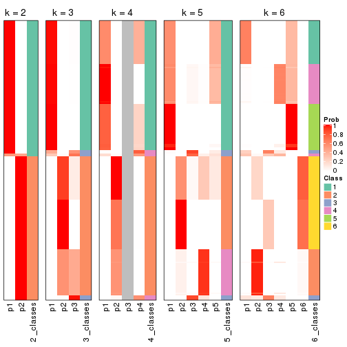


If matrix rows can be associated to genes, consider to use `functional_enrichment(res,
...)` to perform function enrichment for the signature genes. See [this vignette](http://bioconductor.org/packages/devel/bioc/vignettes/cola/inst/doc/functional_enrichment.html) for more detailed explanations.


 

---------------------------------------------------


### SD:pam**


The object with results only for a single top-value method and a single partition method 
can be extracted as:

```r
res = res_list["SD", "pam"]
# you can also extract it by
# res = res_list["SD:pam"]
```

A summary of `res` and all the functions that can be applied to it:

```r
res
```

```
#> A 'ConsensusPartition' object with k = 2, 3, 4, 5, 6.
#>   On a matrix with 12029 rows and 181 columns.
#>   Top rows (1000, 2000, 3000, 4000, 5000) are extracted by 'SD' method.
#>   Subgroups are detected by 'pam' method.
#>   Performed in total 1250 partitions by row resampling.
#>   Best k for subgroups seems to be 2.
#> 
#> Following methods can be applied to this 'ConsensusPartition' object:
#>  [1] "cola_report"             "collect_classes"         "collect_plots"          
#>  [4] "collect_stats"           "colnames"                "compare_signatures"     
#>  [7] "consensus_heatmap"       "dimension_reduction"     "functional_enrichment"  
#> [10] "get_anno_col"            "get_anno"                "get_classes"            
#> [13] "get_consensus"           "get_matrix"              "get_membership"         
#> [16] "get_param"               "get_signatures"          "get_stats"              
#> [19] "is_best_k"               "is_stable_k"             "membership_heatmap"     
#> [22] "ncol"                    "nrow"                    "plot_ecdf"              
#> [25] "rownames"                "select_partition_number" "show"                   
#> [28] "suggest_best_k"          "test_to_known_factors"
```

`collect_plots()` function collects all the plots made from `res` for all `k` (number of partitions)
into one single page to provide an easy and fast comparison between different `k`.

```r
collect_plots(res)
```


The plots are:

- The first row: a plot of the ECDF (empirical cumulative distribution
  function) curves of the consensus matrix for each `k` and the heatmap of
  predicted classes for each `k`.
- The second row: heatmaps of the consensus matrix for each `k`.
- The third row: heatmaps of the membership matrix for each `k`.
- The fouth row: heatmaps of the signatures for each `k`.

All the plots in panels can be made by individual functions and they are
plotted later in this section.

`select_partition_number()` produces several plots showing different
statistics for choosing "optimized" `k`. There are following statistics:

- ECDF curves of the consensus matrix for each `k`;
- 1-PAC. [The PAC
  score](https://en.wikipedia.org/wiki/Consensus_clustering#Over-interpretation_potential_of_consensus_clustering)
  measures the proportion of the ambiguous subgrouping.
- Mean silhouette score.
- Concordance. The mean probability of fiting the consensus class ids in all
  partitions.
- Area increased. Denote $A_k$ as the area under the ECDF curve for current
  `k`, the area increased is defined as $A_k - A_{k-1}$.
- Rand index. The percent of pairs of samples that are both in a same cluster
  or both are not in a same cluster in the partition of k and k-1.
- Jaccard index. The ratio of pairs of samples are both in a same cluster in
  the partition of k and k-1 and the pairs of samples are both in a same
  cluster in the partition k or k-1.

The detailed explanations of these statistics can be found in [the _cola_
vignette](http://bioconductor.org/packages/devel/bioc/vignettes/cola/inst/doc/cola.html#toc_13).

Generally speaking, lower PAC score, higher mean silhouette score or higher
concordance corresponds to better partition. Rand index and Jaccard index
measure how similar the current partition is compared to partition with `k-1`.
If they are too similar, we won't accept `k` is better than `k-1`.

```r
select_partition_number(res)
```


The numeric values for all these statistics can be obtained by `get_stats()`.

```r
get_stats(res)
```

```
#>   k 1-PAC mean_silhouette concordance area_increased  Rand Jaccard
#> 2 2 1.000           0.988       0.995         0.5024 0.498   0.498
#> 3 3 0.776           0.949       0.934         0.2129 0.897   0.793
#> 4 4 0.814           0.792       0.856         0.1242 0.873   0.678
#> 5 5 0.760           0.571       0.819         0.0628 0.871   0.663
#> 6 6 0.833           0.825       0.881         0.0453 0.882   0.680
```

`suggest_best_k()` suggests the best $k$ based on these statistics. The rules are as follows:

- All $k$ with Jaccard index larger than 0.95 are removed because increasing
  $k$ does not provide enough extra information. If all $k$ are removed, it is
  marked as no subgroup is detected.
- For all $k$ with 1-PAC score larger than 0.9, the maximal $k$ is taken as
  the best $k$, and other $k$ are marked as optional $k$.
- If it does not fit the second rule. The $k$ with the maximal vote of the
  highest 1-PAC score, highest mean silhouette, and highest concordance is
  taken as the best $k$.

```r
suggest_best_k(res)
```

```
#> [1] 2
```


Following shows the table of the partitions (You need to click the **show/hide
code output** link to see it). The membership matrix (columns with name `p*`)
is inferred by
[`clue::cl_consensus()`](https://www.rdocumentation.org/link/cl_consensus?package=clue)
function with the `SE` method. Basically the value in the membership matrix
represents the probability to belong to a certain group. The finall class
label for an item is determined with the group with highest probability it
belongs to.

In `get_classes()` function, the entropy is calculated from the membership
matrix and the silhouette score is calculated from the consensus matrix.


<script>
$( function() {
	$( '#tabs-SD-pam-get-classes' ).tabs();
} );
</script>
<div id='tabs-SD-pam-get-classes'>
<ul>
<li><a href='#tab-SD-pam-get-classes-1'>k = 2</a></li>
<li><a href='#tab-SD-pam-get-classes-2'>k = 3</a></li>
<li><a href='#tab-SD-pam-get-classes-3'>k = 4</a></li>
<li><a href='#tab-SD-pam-get-classes-4'>k = 5</a></li>
<li><a href='#tab-SD-pam-get-classes-5'>k = 6</a></li>
</ul>

<div id='tab-SD-pam-get-classes-1'>
<p><a id='tab-SD-pam-get-classes-1-a' style='color:#0366d6' href='#'>show/hide code output</a></p>
<pre><code class="r">cbind(get_classes(res, k = 2), get_membership(res, k = 2))
</code></pre>

<pre><code>#&gt;           class entropy silhouette    p1    p2
#&gt; SRR315112     2   0.000      0.991 0.000 1.000
#&gt; SRR315113     1   0.163      0.975 0.976 0.024
#&gt; SRR315114     1   0.000      1.000 1.000 0.000
#&gt; SRR315115     2   0.000      0.991 0.000 1.000
#&gt; SRR315116     2   0.000      0.991 0.000 1.000
#&gt; SRR566986     2   0.000      0.991 0.000 1.000
#&gt; SRR566987     2   0.000      0.991 0.000 1.000
#&gt; SRR566988     2   0.000      0.991 0.000 1.000
#&gt; SRR566989     2   0.000      0.991 0.000 1.000
#&gt; SRR566990     2   0.000      0.991 0.000 1.000
#&gt; SRR566991     2   0.000      0.991 0.000 1.000
#&gt; SRR566992     2   0.000      0.991 0.000 1.000
#&gt; SRR566993     2   0.000      0.991 0.000 1.000
#&gt; SRR566994     2   0.000      0.991 0.000 1.000
#&gt; SRR566995     2   0.000      0.991 0.000 1.000
#&gt; SRR566996     2   0.000      0.991 0.000 1.000
#&gt; SRR566997     2   0.000      0.991 0.000 1.000
#&gt; SRR566998     2   0.000      0.991 0.000 1.000
#&gt; SRR566999     2   0.000      0.991 0.000 1.000
#&gt; SRR567000     2   0.000      0.991 0.000 1.000
#&gt; SRR567001     2   0.000      0.991 0.000 1.000
#&gt; SRR567002     2   0.000      0.991 0.000 1.000
#&gt; SRR567003     2   0.000      0.991 0.000 1.000
#&gt; SRR567004     2   0.000      0.991 0.000 1.000
#&gt; SRR567005     2   0.000      0.991 0.000 1.000
#&gt; SRR567006     2   0.000      0.991 0.000 1.000
#&gt; SRR567007     2   0.000      0.991 0.000 1.000
#&gt; SRR567008     2   0.000      0.991 0.000 1.000
#&gt; SRR567009     2   0.000      0.991 0.000 1.000
#&gt; SRR567010     2   0.000      0.991 0.000 1.000
#&gt; SRR567011     2   0.000      0.991 0.000 1.000
#&gt; SRR567012     2   0.000      0.991 0.000 1.000
#&gt; SRR567013     2   0.000      0.991 0.000 1.000
#&gt; SRR567014     2   0.000      0.991 0.000 1.000
#&gt; SRR567015     2   0.000      0.991 0.000 1.000
#&gt; SRR567016     2   0.000      0.991 0.000 1.000
#&gt; SRR567017     2   0.000      0.991 0.000 1.000
#&gt; SRR567018     2   0.000      0.991 0.000 1.000
#&gt; SRR567019     2   0.000      0.991 0.000 1.000
#&gt; SRR567020     2   0.000      0.991 0.000 1.000
#&gt; SRR567021     2   0.000      0.991 0.000 1.000
#&gt; SRR567022     2   0.000      0.991 0.000 1.000
#&gt; SRR567023     2   0.000      0.991 0.000 1.000
#&gt; SRR567024     2   0.000      0.991 0.000 1.000
#&gt; SRR567025     2   0.000      0.991 0.000 1.000
#&gt; SRR567026     2   0.000      0.991 0.000 1.000
#&gt; SRR567027     2   0.000      0.991 0.000 1.000
#&gt; SRR567028     2   0.000      0.991 0.000 1.000
#&gt; SRR567029     2   0.000      0.991 0.000 1.000
#&gt; SRR567030     2   0.000      0.991 0.000 1.000
#&gt; SRR567031     2   0.000      0.991 0.000 1.000
#&gt; SRR567032     2   0.000      0.991 0.000 1.000
#&gt; SRR567033     2   0.000      0.991 0.000 1.000
#&gt; SRR567034     2   0.000      0.991 0.000 1.000
#&gt; SRR567035     2   0.000      0.991 0.000 1.000
#&gt; SRR567036     2   0.000      0.991 0.000 1.000
#&gt; SRR567037     2   0.000      0.991 0.000 1.000
#&gt; SRR567038     2   0.000      0.991 0.000 1.000
#&gt; SRR567039     2   0.000      0.991 0.000 1.000
#&gt; SRR567040     2   0.000      0.991 0.000 1.000
#&gt; SRR567041     2   0.000      0.991 0.000 1.000
#&gt; SRR567042     2   0.000      0.991 0.000 1.000
#&gt; SRR567043     2   0.000      0.991 0.000 1.000
#&gt; SRR567044     2   0.000      0.991 0.000 1.000
#&gt; SRR567045     2   0.000      0.991 0.000 1.000
#&gt; SRR567046     2   0.000      0.991 0.000 1.000
#&gt; SRR567047     2   0.000      0.991 0.000 1.000
#&gt; SRR567048     2   0.000      0.991 0.000 1.000
#&gt; SRR567049     2   0.000      0.991 0.000 1.000
#&gt; SRR567050     2   0.000      0.991 0.000 1.000
#&gt; SRR567051     2   0.000      0.991 0.000 1.000
#&gt; SRR567052     2   0.000      0.991 0.000 1.000
#&gt; SRR567053     2   0.000      0.991 0.000 1.000
#&gt; SRR567054     2   0.000      0.991 0.000 1.000
#&gt; SRR567055     2   0.000      0.991 0.000 1.000
#&gt; SRR567056     2   0.000      0.991 0.000 1.000
#&gt; SRR567057     2   0.000      0.991 0.000 1.000
#&gt; SRR567058     2   0.000      0.991 0.000 1.000
#&gt; SRR567059     2   0.000      0.991 0.000 1.000
#&gt; SRR567060     2   0.000      0.991 0.000 1.000
#&gt; SRR567061     2   0.000      0.991 0.000 1.000
#&gt; SRR567062     2   0.000      0.991 0.000 1.000
#&gt; SRR567063     2   0.000      0.991 0.000 1.000
#&gt; SRR567064     2   0.000      0.991 0.000 1.000
#&gt; SRR567065     2   0.000      0.991 0.000 1.000
#&gt; SRR567066     2   0.000      0.991 0.000 1.000
#&gt; SRR567067     2   0.000      0.991 0.000 1.000
#&gt; SRR567068     2   0.000      0.991 0.000 1.000
#&gt; SRR567069     2   0.000      0.991 0.000 1.000
#&gt; SRR567070     2   0.000      0.991 0.000 1.000
#&gt; SRR567071     2   0.000      0.991 0.000 1.000
#&gt; SRR567072     2   0.000      0.991 0.000 1.000
#&gt; SRR567073     2   0.000      0.991 0.000 1.000
#&gt; SRR567074     2   0.000      0.991 0.000 1.000
#&gt; SRR567075     2   0.000      0.991 0.000 1.000
#&gt; SRR567076     1   0.000      1.000 1.000 0.000
#&gt; SRR567077     1   0.000      1.000 1.000 0.000
#&gt; SRR567078     1   0.000      1.000 1.000 0.000
#&gt; SRR567079     1   0.000      1.000 1.000 0.000
#&gt; SRR567080     1   0.000      1.000 1.000 0.000
#&gt; SRR567081     1   0.000      1.000 1.000 0.000
#&gt; SRR567082     1   0.000      1.000 1.000 0.000
#&gt; SRR567083     1   0.000      1.000 1.000 0.000
#&gt; SRR567084     1   0.000      1.000 1.000 0.000
#&gt; SRR567085     1   0.000      1.000 1.000 0.000
#&gt; SRR567086     1   0.000      1.000 1.000 0.000
#&gt; SRR567087     1   0.000      1.000 1.000 0.000
#&gt; SRR567088     1   0.000      1.000 1.000 0.000
#&gt; SRR567089     1   0.000      1.000 1.000 0.000
#&gt; SRR567090     1   0.000      1.000 1.000 0.000
#&gt; SRR567091     1   0.000      1.000 1.000 0.000
#&gt; SRR567092     1   0.000      1.000 1.000 0.000
#&gt; SRR567093     1   0.000      1.000 1.000 0.000
#&gt; SRR567094     1   0.000      1.000 1.000 0.000
#&gt; SRR567095     1   0.000      1.000 1.000 0.000
#&gt; SRR567096     1   0.000      1.000 1.000 0.000
#&gt; SRR567097     1   0.000      1.000 1.000 0.000
#&gt; SRR567098     1   0.000      1.000 1.000 0.000
#&gt; SRR567099     1   0.000      1.000 1.000 0.000
#&gt; SRR567100     1   0.000      1.000 1.000 0.000
#&gt; SRR567101     1   0.000      1.000 1.000 0.000
#&gt; SRR567102     1   0.000      1.000 1.000 0.000
#&gt; SRR567103     1   0.000      1.000 1.000 0.000
#&gt; SRR567104     1   0.000      1.000 1.000 0.000
#&gt; SRR567105     1   0.000      1.000 1.000 0.000
#&gt; SRR567106     1   0.000      1.000 1.000 0.000
#&gt; SRR567107     1   0.000      1.000 1.000 0.000
#&gt; SRR567108     1   0.000      1.000 1.000 0.000
#&gt; SRR567109     1   0.000      1.000 1.000 0.000
#&gt; SRR567110     1   0.000      1.000 1.000 0.000
#&gt; SRR567111     1   0.000      1.000 1.000 0.000
#&gt; SRR567112     1   0.000      1.000 1.000 0.000
#&gt; SRR567113     1   0.000      1.000 1.000 0.000
#&gt; SRR567114     1   0.000      1.000 1.000 0.000
#&gt; SRR567115     1   0.000      1.000 1.000 0.000
#&gt; SRR567116     1   0.000      1.000 1.000 0.000
#&gt; SRR567117     1   0.000      1.000 1.000 0.000
#&gt; SRR567118     1   0.000      1.000 1.000 0.000
#&gt; SRR567119     1   0.000      1.000 1.000 0.000
#&gt; SRR567120     1   0.000      1.000 1.000 0.000
#&gt; SRR567121     1   0.000      1.000 1.000 0.000
#&gt; SRR567122     1   0.000      1.000 1.000 0.000
#&gt; SRR567123     1   0.000      1.000 1.000 0.000
#&gt; SRR567124     1   0.000      1.000 1.000 0.000
#&gt; SRR567125     1   0.000      1.000 1.000 0.000
#&gt; SRR567126     1   0.000      1.000 1.000 0.000
#&gt; SRR567127     1   0.000      1.000 1.000 0.000
#&gt; SRR567128     1   0.000      1.000 1.000 0.000
#&gt; SRR567129     1   0.000      1.000 1.000 0.000
#&gt; SRR567130     1   0.000      1.000 1.000 0.000
#&gt; SRR567131     1   0.000      1.000 1.000 0.000
#&gt; SRR567132     1   0.000      1.000 1.000 0.000
#&gt; SRR567133     1   0.000      1.000 1.000 0.000
#&gt; SRR567134     1   0.000      1.000 1.000 0.000
#&gt; SRR567135     1   0.000      1.000 1.000 0.000
#&gt; SRR567136     1   0.000      1.000 1.000 0.000
#&gt; SRR567137     1   0.000      1.000 1.000 0.000
#&gt; SRR567138     1   0.000      1.000 1.000 0.000
#&gt; SRR567139     1   0.000      1.000 1.000 0.000
#&gt; SRR567140     1   0.000      1.000 1.000 0.000
#&gt; SRR567141     1   0.000      1.000 1.000 0.000
#&gt; SRR567142     1   0.000      1.000 1.000 0.000
#&gt; SRR567143     1   0.000      1.000 1.000 0.000
#&gt; SRR567144     1   0.000      1.000 1.000 0.000
#&gt; SRR567145     1   0.000      1.000 1.000 0.000
#&gt; SRR567146     2   0.978      0.306 0.412 0.588
#&gt; SRR567147     1   0.000      1.000 1.000 0.000
#&gt; SRR567148     1   0.000      1.000 1.000 0.000
#&gt; SRR567149     1   0.000      1.000 1.000 0.000
#&gt; SRR567150     1   0.000      1.000 1.000 0.000
#&gt; SRR567151     1   0.000      1.000 1.000 0.000
#&gt; SRR567152     1   0.000      1.000 1.000 0.000
#&gt; SRR567153     1   0.000      1.000 1.000 0.000
#&gt; SRR567154     1   0.000      1.000 1.000 0.000
#&gt; SRR567155     1   0.000      1.000 1.000 0.000
#&gt; SRR567156     1   0.000      1.000 1.000 0.000
#&gt; SRR567157     1   0.000      1.000 1.000 0.000
#&gt; SRR567158     1   0.000      1.000 1.000 0.000
#&gt; SRR567159     1   0.000      1.000 1.000 0.000
#&gt; SRR567160     1   0.000      1.000 1.000 0.000
#&gt; SRR567161     2   0.975      0.317 0.408 0.592
</code></pre>

<script>
$('#tab-SD-pam-get-classes-1-a').parent().next().next().hide();
$('#tab-SD-pam-get-classes-1-a').click(function(){
  $('#tab-SD-pam-get-classes-1-a').parent().next().next().toggle();
  return(false);
});
</script>
</div>

<div id='tab-SD-pam-get-classes-2'>
<p><a id='tab-SD-pam-get-classes-2-a' style='color:#0366d6' href='#'>show/hide code output</a></p>
<pre><code class="r">cbind(get_classes(res, k = 3), get_membership(res, k = 3))
</code></pre>

<pre><code>#&gt;           class entropy silhouette    p1    p2    p3
#&gt; SRR315112     2   0.271      0.911 0.000 0.912 0.088
#&gt; SRR315113     3   0.429      1.000 0.180 0.000 0.820
#&gt; SRR315114     3   0.429      1.000 0.180 0.000 0.820
#&gt; SRR315115     2   0.429      0.881 0.000 0.820 0.180
#&gt; SRR315116     2   0.429      0.881 0.000 0.820 0.180
#&gt; SRR566986     2   0.000      0.936 0.000 1.000 0.000
#&gt; SRR566987     2   0.000      0.936 0.000 1.000 0.000
#&gt; SRR566988     2   0.000      0.936 0.000 1.000 0.000
#&gt; SRR566989     2   0.000      0.936 0.000 1.000 0.000
#&gt; SRR566990     2   0.000      0.936 0.000 1.000 0.000
#&gt; SRR566991     2   0.000      0.936 0.000 1.000 0.000
#&gt; SRR566992     2   0.000      0.936 0.000 1.000 0.000
#&gt; SRR566993     2   0.000      0.936 0.000 1.000 0.000
#&gt; SRR566994     2   0.000      0.936 0.000 1.000 0.000
#&gt; SRR566995     2   0.000      0.936 0.000 1.000 0.000
#&gt; SRR566996     2   0.000      0.936 0.000 1.000 0.000
#&gt; SRR566997     2   0.000      0.936 0.000 1.000 0.000
#&gt; SRR566998     2   0.000      0.936 0.000 1.000 0.000
#&gt; SRR566999     2   0.000      0.936 0.000 1.000 0.000
#&gt; SRR567000     2   0.000      0.936 0.000 1.000 0.000
#&gt; SRR567001     2   0.000      0.936 0.000 1.000 0.000
#&gt; SRR567002     2   0.000      0.936 0.000 1.000 0.000
#&gt; SRR567003     2   0.000      0.936 0.000 1.000 0.000
#&gt; SRR567004     2   0.000      0.936 0.000 1.000 0.000
#&gt; SRR567005     2   0.000      0.936 0.000 1.000 0.000
#&gt; SRR567006     2   0.000      0.936 0.000 1.000 0.000
#&gt; SRR567007     2   0.000      0.936 0.000 1.000 0.000
#&gt; SRR567008     2   0.000      0.936 0.000 1.000 0.000
#&gt; SRR567009     2   0.000      0.936 0.000 1.000 0.000
#&gt; SRR567010     2   0.000      0.936 0.000 1.000 0.000
#&gt; SRR567011     2   0.000      0.936 0.000 1.000 0.000
#&gt; SRR567012     2   0.000      0.936 0.000 1.000 0.000
#&gt; SRR567013     2   0.000      0.936 0.000 1.000 0.000
#&gt; SRR567014     2   0.429      0.881 0.000 0.820 0.180
#&gt; SRR567015     2   0.429      0.881 0.000 0.820 0.180
#&gt; SRR567016     2   0.429      0.881 0.000 0.820 0.180
#&gt; SRR567017     2   0.429      0.881 0.000 0.820 0.180
#&gt; SRR567018     2   0.429      0.881 0.000 0.820 0.180
#&gt; SRR567019     2   0.429      0.881 0.000 0.820 0.180
#&gt; SRR567020     2   0.429      0.881 0.000 0.820 0.180
#&gt; SRR567021     2   0.429      0.881 0.000 0.820 0.180
#&gt; SRR567022     2   0.245      0.914 0.000 0.924 0.076
#&gt; SRR567023     2   0.429      0.881 0.000 0.820 0.180
#&gt; SRR567024     2   0.429      0.881 0.000 0.820 0.180
#&gt; SRR567025     2   0.429      0.881 0.000 0.820 0.180
#&gt; SRR567026     2   0.429      0.881 0.000 0.820 0.180
#&gt; SRR567027     2   0.429      0.881 0.000 0.820 0.180
#&gt; SRR567028     2   0.429      0.881 0.000 0.820 0.180
#&gt; SRR567029     2   0.429      0.881 0.000 0.820 0.180
#&gt; SRR567030     2   0.429      0.881 0.000 0.820 0.180
#&gt; SRR567031     2   0.429      0.881 0.000 0.820 0.180
#&gt; SRR567032     2   0.429      0.881 0.000 0.820 0.180
#&gt; SRR567033     2   0.429      0.881 0.000 0.820 0.180
#&gt; SRR567034     2   0.429      0.881 0.000 0.820 0.180
#&gt; SRR567035     2   0.429      0.881 0.000 0.820 0.180
#&gt; SRR567036     2   0.429      0.881 0.000 0.820 0.180
#&gt; SRR567037     2   0.429      0.881 0.000 0.820 0.180
#&gt; SRR567038     2   0.429      0.881 0.000 0.820 0.180
#&gt; SRR567039     2   0.429      0.881 0.000 0.820 0.180
#&gt; SRR567040     2   0.429      0.881 0.000 0.820 0.180
#&gt; SRR567041     2   0.429      0.881 0.000 0.820 0.180
#&gt; SRR567042     2   0.334      0.901 0.000 0.880 0.120
#&gt; SRR567043     2   0.429      0.881 0.000 0.820 0.180
#&gt; SRR567044     2   0.000      0.936 0.000 1.000 0.000
#&gt; SRR567045     2   0.000      0.936 0.000 1.000 0.000
#&gt; SRR567046     2   0.000      0.936 0.000 1.000 0.000
#&gt; SRR567047     2   0.000      0.936 0.000 1.000 0.000
#&gt; SRR567048     2   0.000      0.936 0.000 1.000 0.000
#&gt; SRR567049     2   0.000      0.936 0.000 1.000 0.000
#&gt; SRR567050     2   0.000      0.936 0.000 1.000 0.000
#&gt; SRR567051     2   0.000      0.936 0.000 1.000 0.000
#&gt; SRR567052     2   0.000      0.936 0.000 1.000 0.000
#&gt; SRR567053     2   0.000      0.936 0.000 1.000 0.000
#&gt; SRR567054     2   0.000      0.936 0.000 1.000 0.000
#&gt; SRR567055     2   0.000      0.936 0.000 1.000 0.000
#&gt; SRR567056     2   0.000      0.936 0.000 1.000 0.000
#&gt; SRR567057     2   0.000      0.936 0.000 1.000 0.000
#&gt; SRR567058     2   0.000      0.936 0.000 1.000 0.000
#&gt; SRR567059     2   0.000      0.936 0.000 1.000 0.000
#&gt; SRR567060     2   0.000      0.936 0.000 1.000 0.000
#&gt; SRR567061     2   0.000      0.936 0.000 1.000 0.000
#&gt; SRR567062     2   0.000      0.936 0.000 1.000 0.000
#&gt; SRR567063     2   0.000      0.936 0.000 1.000 0.000
#&gt; SRR567064     2   0.000      0.936 0.000 1.000 0.000
#&gt; SRR567065     2   0.000      0.936 0.000 1.000 0.000
#&gt; SRR567066     2   0.000      0.936 0.000 1.000 0.000
#&gt; SRR567067     2   0.000      0.936 0.000 1.000 0.000
#&gt; SRR567068     2   0.000      0.936 0.000 1.000 0.000
#&gt; SRR567069     2   0.000      0.936 0.000 1.000 0.000
#&gt; SRR567070     2   0.000      0.936 0.000 1.000 0.000
#&gt; SRR567071     2   0.000      0.936 0.000 1.000 0.000
#&gt; SRR567072     2   0.000      0.936 0.000 1.000 0.000
#&gt; SRR567073     2   0.000      0.936 0.000 1.000 0.000
#&gt; SRR567074     2   0.000      0.936 0.000 1.000 0.000
#&gt; SRR567075     2   0.000      0.936 0.000 1.000 0.000
#&gt; SRR567076     1   0.000      1.000 1.000 0.000 0.000
#&gt; SRR567077     1   0.000      1.000 1.000 0.000 0.000
#&gt; SRR567078     1   0.000      1.000 1.000 0.000 0.000
#&gt; SRR567079     1   0.000      1.000 1.000 0.000 0.000
#&gt; SRR567080     1   0.000      1.000 1.000 0.000 0.000
#&gt; SRR567081     1   0.000      1.000 1.000 0.000 0.000
#&gt; SRR567082     1   0.000      1.000 1.000 0.000 0.000
#&gt; SRR567083     1   0.000      1.000 1.000 0.000 0.000
#&gt; SRR567084     1   0.000      1.000 1.000 0.000 0.000
#&gt; SRR567085     1   0.000      1.000 1.000 0.000 0.000
#&gt; SRR567086     1   0.000      1.000 1.000 0.000 0.000
#&gt; SRR567087     1   0.000      1.000 1.000 0.000 0.000
#&gt; SRR567088     1   0.000      1.000 1.000 0.000 0.000
#&gt; SRR567089     1   0.000      1.000 1.000 0.000 0.000
#&gt; SRR567090     1   0.000      1.000 1.000 0.000 0.000
#&gt; SRR567091     1   0.000      1.000 1.000 0.000 0.000
#&gt; SRR567092     1   0.000      1.000 1.000 0.000 0.000
#&gt; SRR567093     1   0.000      1.000 1.000 0.000 0.000
#&gt; SRR567094     1   0.000      1.000 1.000 0.000 0.000
#&gt; SRR567095     1   0.000      1.000 1.000 0.000 0.000
#&gt; SRR567096     1   0.000      1.000 1.000 0.000 0.000
#&gt; SRR567097     1   0.000      1.000 1.000 0.000 0.000
#&gt; SRR567098     1   0.000      1.000 1.000 0.000 0.000
#&gt; SRR567099     1   0.000      1.000 1.000 0.000 0.000
#&gt; SRR567100     1   0.000      1.000 1.000 0.000 0.000
#&gt; SRR567101     1   0.000      1.000 1.000 0.000 0.000
#&gt; SRR567102     1   0.000      1.000 1.000 0.000 0.000
#&gt; SRR567103     1   0.000      1.000 1.000 0.000 0.000
#&gt; SRR567104     1   0.000      1.000 1.000 0.000 0.000
#&gt; SRR567105     1   0.000      1.000 1.000 0.000 0.000
#&gt; SRR567106     3   0.429      1.000 0.180 0.000 0.820
#&gt; SRR567107     3   0.429      1.000 0.180 0.000 0.820
#&gt; SRR567108     3   0.429      1.000 0.180 0.000 0.820
#&gt; SRR567109     3   0.429      1.000 0.180 0.000 0.820
#&gt; SRR567110     3   0.429      1.000 0.180 0.000 0.820
#&gt; SRR567111     3   0.429      1.000 0.180 0.000 0.820
#&gt; SRR567112     3   0.429      1.000 0.180 0.000 0.820
#&gt; SRR567113     3   0.429      1.000 0.180 0.000 0.820
#&gt; SRR567114     3   0.429      1.000 0.180 0.000 0.820
#&gt; SRR567115     3   0.429      1.000 0.180 0.000 0.820
#&gt; SRR567116     3   0.429      1.000 0.180 0.000 0.820
#&gt; SRR567117     3   0.429      1.000 0.180 0.000 0.820
#&gt; SRR567118     3   0.429      1.000 0.180 0.000 0.820
#&gt; SRR567119     3   0.429      1.000 0.180 0.000 0.820
#&gt; SRR567120     3   0.429      1.000 0.180 0.000 0.820
#&gt; SRR567121     3   0.429      1.000 0.180 0.000 0.820
#&gt; SRR567122     3   0.429      1.000 0.180 0.000 0.820
#&gt; SRR567123     3   0.429      1.000 0.180 0.000 0.820
#&gt; SRR567124     3   0.429      1.000 0.180 0.000 0.820
#&gt; SRR567125     3   0.429      1.000 0.180 0.000 0.820
#&gt; SRR567126     3   0.429      1.000 0.180 0.000 0.820
#&gt; SRR567127     3   0.429      1.000 0.180 0.000 0.820
#&gt; SRR567128     3   0.429      1.000 0.180 0.000 0.820
#&gt; SRR567129     3   0.429      1.000 0.180 0.000 0.820
#&gt; SRR567130     3   0.429      1.000 0.180 0.000 0.820
#&gt; SRR567131     3   0.429      1.000 0.180 0.000 0.820
#&gt; SRR567132     3   0.429      1.000 0.180 0.000 0.820
#&gt; SRR567133     3   0.429      1.000 0.180 0.000 0.820
#&gt; SRR567134     1   0.000      1.000 1.000 0.000 0.000
#&gt; SRR567135     1   0.000      1.000 1.000 0.000 0.000
#&gt; SRR567136     1   0.000      1.000 1.000 0.000 0.000
#&gt; SRR567137     1   0.000      1.000 1.000 0.000 0.000
#&gt; SRR567138     1   0.000      1.000 1.000 0.000 0.000
#&gt; SRR567139     1   0.000      1.000 1.000 0.000 0.000
#&gt; SRR567140     1   0.000      1.000 1.000 0.000 0.000
#&gt; SRR567141     1   0.000      1.000 1.000 0.000 0.000
#&gt; SRR567142     1   0.000      1.000 1.000 0.000 0.000
#&gt; SRR567143     1   0.000      1.000 1.000 0.000 0.000
#&gt; SRR567144     1   0.000      1.000 1.000 0.000 0.000
#&gt; SRR567145     1   0.000      1.000 1.000 0.000 0.000
#&gt; SRR567146     2   0.629      0.208 0.464 0.536 0.000
#&gt; SRR567147     1   0.000      1.000 1.000 0.000 0.000
#&gt; SRR567148     1   0.000      1.000 1.000 0.000 0.000
#&gt; SRR567149     1   0.000      1.000 1.000 0.000 0.000
#&gt; SRR567150     1   0.000      1.000 1.000 0.000 0.000
#&gt; SRR567151     1   0.000      1.000 1.000 0.000 0.000
#&gt; SRR567152     1   0.000      1.000 1.000 0.000 0.000
#&gt; SRR567153     1   0.000      1.000 1.000 0.000 0.000
#&gt; SRR567154     1   0.000      1.000 1.000 0.000 0.000
#&gt; SRR567155     1   0.000      1.000 1.000 0.000 0.000
#&gt; SRR567156     1   0.000      1.000 1.000 0.000 0.000
#&gt; SRR567157     1   0.000      1.000 1.000 0.000 0.000
#&gt; SRR567158     1   0.000      1.000 1.000 0.000 0.000
#&gt; SRR567159     1   0.000      1.000 1.000 0.000 0.000
#&gt; SRR567160     1   0.000      1.000 1.000 0.000 0.000
#&gt; SRR567161     2   0.629      0.208 0.464 0.536 0.000
</code></pre>

<script>
$('#tab-SD-pam-get-classes-2-a').parent().next().next().hide();
$('#tab-SD-pam-get-classes-2-a').click(function(){
  $('#tab-SD-pam-get-classes-2-a').parent().next().next().toggle();
  return(false);
});
</script>
</div>

<div id='tab-SD-pam-get-classes-3'>
<p><a id='tab-SD-pam-get-classes-3-a' style='color:#0366d6' href='#'>show/hide code output</a></p>
<pre><code class="r">cbind(get_classes(res, k = 4), get_membership(res, k = 4))
</code></pre>

<pre><code>#&gt;           class entropy silhouette    p1    p2    p3    p4
#&gt; SRR315112     2  0.2589      0.593 0.000 0.884 0.000 0.116
#&gt; SRR315113     3  0.1004      0.974 0.024 0.000 0.972 0.004
#&gt; SRR315114     3  0.1004      0.974 0.024 0.000 0.972 0.004
#&gt; SRR315115     2  0.0336      0.657 0.000 0.992 0.000 0.008
#&gt; SRR315116     2  0.0336      0.657 0.000 0.992 0.000 0.008
#&gt; SRR566986     2  0.4730      0.300 0.000 0.636 0.000 0.364
#&gt; SRR566987     2  0.4730      0.300 0.000 0.636 0.000 0.364
#&gt; SRR566988     2  0.4730      0.300 0.000 0.636 0.000 0.364
#&gt; SRR566989     2  0.4730      0.300 0.000 0.636 0.000 0.364
#&gt; SRR566990     2  0.4730      0.300 0.000 0.636 0.000 0.364
#&gt; SRR566991     2  0.4730      0.300 0.000 0.636 0.000 0.364
#&gt; SRR566992     2  0.4730      0.300 0.000 0.636 0.000 0.364
#&gt; SRR566993     2  0.4730      0.300 0.000 0.636 0.000 0.364
#&gt; SRR566994     2  0.4730      0.300 0.000 0.636 0.000 0.364
#&gt; SRR566995     2  0.4730      0.300 0.000 0.636 0.000 0.364
#&gt; SRR566996     2  0.4730      0.300 0.000 0.636 0.000 0.364
#&gt; SRR566997     2  0.4730      0.300 0.000 0.636 0.000 0.364
#&gt; SRR566998     2  0.4730      0.300 0.000 0.636 0.000 0.364
#&gt; SRR566999     2  0.4730      0.300 0.000 0.636 0.000 0.364
#&gt; SRR567000     2  0.4730      0.300 0.000 0.636 0.000 0.364
#&gt; SRR567001     2  0.4730      0.300 0.000 0.636 0.000 0.364
#&gt; SRR567002     2  0.4730      0.300 0.000 0.636 0.000 0.364
#&gt; SRR567003     2  0.4730      0.300 0.000 0.636 0.000 0.364
#&gt; SRR567004     2  0.4730      0.300 0.000 0.636 0.000 0.364
#&gt; SRR567005     2  0.4730      0.300 0.000 0.636 0.000 0.364
#&gt; SRR567006     2  0.4730      0.300 0.000 0.636 0.000 0.364
#&gt; SRR567007     2  0.4730      0.300 0.000 0.636 0.000 0.364
#&gt; SRR567008     2  0.4730      0.300 0.000 0.636 0.000 0.364
#&gt; SRR567009     2  0.4730      0.300 0.000 0.636 0.000 0.364
#&gt; SRR567010     2  0.4730      0.300 0.000 0.636 0.000 0.364
#&gt; SRR567011     2  0.4730      0.300 0.000 0.636 0.000 0.364
#&gt; SRR567012     2  0.4730      0.300 0.000 0.636 0.000 0.364
#&gt; SRR567013     2  0.4730      0.300 0.000 0.636 0.000 0.364
#&gt; SRR567014     2  0.0000      0.661 0.000 1.000 0.000 0.000
#&gt; SRR567015     2  0.0000      0.661 0.000 1.000 0.000 0.000
#&gt; SRR567016     2  0.0000      0.661 0.000 1.000 0.000 0.000
#&gt; SRR567017     2  0.0000      0.661 0.000 1.000 0.000 0.000
#&gt; SRR567018     2  0.0000      0.661 0.000 1.000 0.000 0.000
#&gt; SRR567019     2  0.0000      0.661 0.000 1.000 0.000 0.000
#&gt; SRR567020     2  0.0000      0.661 0.000 1.000 0.000 0.000
#&gt; SRR567021     2  0.0000      0.661 0.000 1.000 0.000 0.000
#&gt; SRR567022     2  0.3356      0.537 0.000 0.824 0.000 0.176
#&gt; SRR567023     2  0.0000      0.661 0.000 1.000 0.000 0.000
#&gt; SRR567024     2  0.0000      0.661 0.000 1.000 0.000 0.000
#&gt; SRR567025     2  0.0000      0.661 0.000 1.000 0.000 0.000
#&gt; SRR567026     2  0.0000      0.661 0.000 1.000 0.000 0.000
#&gt; SRR567027     2  0.0000      0.661 0.000 1.000 0.000 0.000
#&gt; SRR567028     2  0.0000      0.661 0.000 1.000 0.000 0.000
#&gt; SRR567029     2  0.0000      0.661 0.000 1.000 0.000 0.000
#&gt; SRR567030     2  0.0000      0.661 0.000 1.000 0.000 0.000
#&gt; SRR567031     2  0.0000      0.661 0.000 1.000 0.000 0.000
#&gt; SRR567032     2  0.0000      0.661 0.000 1.000 0.000 0.000
#&gt; SRR567033     2  0.0000      0.661 0.000 1.000 0.000 0.000
#&gt; SRR567034     2  0.0000      0.661 0.000 1.000 0.000 0.000
#&gt; SRR567035     2  0.0000      0.661 0.000 1.000 0.000 0.000
#&gt; SRR567036     2  0.0000      0.661 0.000 1.000 0.000 0.000
#&gt; SRR567037     2  0.0000      0.661 0.000 1.000 0.000 0.000
#&gt; SRR567038     2  0.0000      0.661 0.000 1.000 0.000 0.000
#&gt; SRR567039     2  0.0000      0.661 0.000 1.000 0.000 0.000
#&gt; SRR567040     2  0.0000      0.661 0.000 1.000 0.000 0.000
#&gt; SRR567041     2  0.0000      0.661 0.000 1.000 0.000 0.000
#&gt; SRR567042     2  0.2973      0.567 0.000 0.856 0.000 0.144
#&gt; SRR567043     2  0.0000      0.661 0.000 1.000 0.000 0.000
#&gt; SRR567044     4  0.4843      0.894 0.000 0.396 0.000 0.604
#&gt; SRR567045     4  0.4843      0.894 0.000 0.396 0.000 0.604
#&gt; SRR567046     4  0.4843      0.894 0.000 0.396 0.000 0.604
#&gt; SRR567047     4  0.4843      0.894 0.000 0.396 0.000 0.604
#&gt; SRR567048     4  0.4843      0.894 0.000 0.396 0.000 0.604
#&gt; SRR567049     4  0.4843      0.894 0.000 0.396 0.000 0.604
#&gt; SRR567050     4  0.4843      0.894 0.000 0.396 0.000 0.604
#&gt; SRR567051     4  0.4843      0.894 0.000 0.396 0.000 0.604
#&gt; SRR567052     4  0.4843      0.894 0.000 0.396 0.000 0.604
#&gt; SRR567053     4  0.4843      0.894 0.000 0.396 0.000 0.604
#&gt; SRR567054     4  0.4843      0.894 0.000 0.396 0.000 0.604
#&gt; SRR567055     4  0.4843      0.894 0.000 0.396 0.000 0.604
#&gt; SRR567056     4  0.4843      0.894 0.000 0.396 0.000 0.604
#&gt; SRR567057     4  0.4843      0.894 0.000 0.396 0.000 0.604
#&gt; SRR567058     4  0.4843      0.894 0.000 0.396 0.000 0.604
#&gt; SRR567059     4  0.4843      0.894 0.000 0.396 0.000 0.604
#&gt; SRR567060     4  0.4843      0.894 0.000 0.396 0.000 0.604
#&gt; SRR567061     4  0.4843      0.894 0.000 0.396 0.000 0.604
#&gt; SRR567062     4  0.4843      0.894 0.000 0.396 0.000 0.604
#&gt; SRR567063     4  0.4843      0.894 0.000 0.396 0.000 0.604
#&gt; SRR567064     4  0.4843      0.894 0.000 0.396 0.000 0.604
#&gt; SRR567065     4  0.4843      0.894 0.000 0.396 0.000 0.604
#&gt; SRR567066     4  0.4843      0.894 0.000 0.396 0.000 0.604
#&gt; SRR567067     4  0.4843      0.894 0.000 0.396 0.000 0.604
#&gt; SRR567068     4  0.4843      0.894 0.000 0.396 0.000 0.604
#&gt; SRR567069     4  0.4843      0.894 0.000 0.396 0.000 0.604
#&gt; SRR567070     4  0.4843      0.894 0.000 0.396 0.000 0.604
#&gt; SRR567071     4  0.4843      0.894 0.000 0.396 0.000 0.604
#&gt; SRR567072     4  0.4843      0.894 0.000 0.396 0.000 0.604
#&gt; SRR567073     4  0.4843      0.894 0.000 0.396 0.000 0.604
#&gt; SRR567074     4  0.4843      0.894 0.000 0.396 0.000 0.604
#&gt; SRR567075     4  0.4843      0.894 0.000 0.396 0.000 0.604
#&gt; SRR567076     1  0.0921      0.986 0.972 0.000 0.028 0.000
#&gt; SRR567077     1  0.0921      0.986 0.972 0.000 0.028 0.000
#&gt; SRR567078     1  0.0921      0.986 0.972 0.000 0.028 0.000
#&gt; SRR567079     1  0.0921      0.986 0.972 0.000 0.028 0.000
#&gt; SRR567080     1  0.0921      0.986 0.972 0.000 0.028 0.000
#&gt; SRR567081     1  0.0921      0.986 0.972 0.000 0.028 0.000
#&gt; SRR567082     1  0.0921      0.986 0.972 0.000 0.028 0.000
#&gt; SRR567083     1  0.0817      0.986 0.976 0.000 0.024 0.000
#&gt; SRR567084     1  0.0921      0.986 0.972 0.000 0.028 0.000
#&gt; SRR567085     1  0.0921      0.986 0.972 0.000 0.028 0.000
#&gt; SRR567086     1  0.0921      0.986 0.972 0.000 0.028 0.000
#&gt; SRR567087     1  0.0921      0.986 0.972 0.000 0.028 0.000
#&gt; SRR567088     1  0.0921      0.986 0.972 0.000 0.028 0.000
#&gt; SRR567089     1  0.0921      0.986 0.972 0.000 0.028 0.000
#&gt; SRR567090     1  0.0817      0.986 0.976 0.000 0.024 0.000
#&gt; SRR567091     1  0.0921      0.986 0.972 0.000 0.028 0.000
#&gt; SRR567092     1  0.0921      0.986 0.972 0.000 0.028 0.000
#&gt; SRR567093     1  0.0921      0.986 0.972 0.000 0.028 0.000
#&gt; SRR567094     1  0.0921      0.986 0.972 0.000 0.028 0.000
#&gt; SRR567095     1  0.0921      0.986 0.972 0.000 0.028 0.000
#&gt; SRR567096     1  0.0921      0.986 0.972 0.000 0.028 0.000
#&gt; SRR567097     1  0.0921      0.986 0.972 0.000 0.028 0.000
#&gt; SRR567098     1  0.0921      0.986 0.972 0.000 0.028 0.000
#&gt; SRR567099     1  0.0921      0.986 0.972 0.000 0.028 0.000
#&gt; SRR567100     1  0.0921      0.986 0.972 0.000 0.028 0.000
#&gt; SRR567101     1  0.0921      0.986 0.972 0.000 0.028 0.000
#&gt; SRR567102     1  0.0921      0.986 0.972 0.000 0.028 0.000
#&gt; SRR567103     1  0.0921      0.986 0.972 0.000 0.028 0.000
#&gt; SRR567104     1  0.0921      0.986 0.972 0.000 0.028 0.000
#&gt; SRR567105     1  0.0921      0.986 0.972 0.000 0.028 0.000
#&gt; SRR567106     3  0.0000      0.998 0.000 0.000 1.000 0.000
#&gt; SRR567107     3  0.0000      0.998 0.000 0.000 1.000 0.000
#&gt; SRR567108     3  0.0000      0.998 0.000 0.000 1.000 0.000
#&gt; SRR567109     3  0.0000      0.998 0.000 0.000 1.000 0.000
#&gt; SRR567110     3  0.0000      0.998 0.000 0.000 1.000 0.000
#&gt; SRR567111     3  0.0000      0.998 0.000 0.000 1.000 0.000
#&gt; SRR567112     3  0.0000      0.998 0.000 0.000 1.000 0.000
#&gt; SRR567113     3  0.0000      0.998 0.000 0.000 1.000 0.000
#&gt; SRR567114     3  0.0000      0.998 0.000 0.000 1.000 0.000
#&gt; SRR567115     3  0.0000      0.998 0.000 0.000 1.000 0.000
#&gt; SRR567116     3  0.0000      0.998 0.000 0.000 1.000 0.000
#&gt; SRR567117     3  0.0000      0.998 0.000 0.000 1.000 0.000
#&gt; SRR567118     3  0.0000      0.998 0.000 0.000 1.000 0.000
#&gt; SRR567119     3  0.0000      0.998 0.000 0.000 1.000 0.000
#&gt; SRR567120     3  0.0000      0.998 0.000 0.000 1.000 0.000
#&gt; SRR567121     3  0.0000      0.998 0.000 0.000 1.000 0.000
#&gt; SRR567122     3  0.0000      0.998 0.000 0.000 1.000 0.000
#&gt; SRR567123     3  0.0000      0.998 0.000 0.000 1.000 0.000
#&gt; SRR567124     3  0.0000      0.998 0.000 0.000 1.000 0.000
#&gt; SRR567125     3  0.0000      0.998 0.000 0.000 1.000 0.000
#&gt; SRR567126     3  0.0000      0.998 0.000 0.000 1.000 0.000
#&gt; SRR567127     3  0.0000      0.998 0.000 0.000 1.000 0.000
#&gt; SRR567128     3  0.0000      0.998 0.000 0.000 1.000 0.000
#&gt; SRR567129     3  0.0000      0.998 0.000 0.000 1.000 0.000
#&gt; SRR567130     3  0.0000      0.998 0.000 0.000 1.000 0.000
#&gt; SRR567131     3  0.0000      0.998 0.000 0.000 1.000 0.000
#&gt; SRR567132     3  0.0000      0.998 0.000 0.000 1.000 0.000
#&gt; SRR567133     3  0.0000      0.998 0.000 0.000 1.000 0.000
#&gt; SRR567134     1  0.0000      0.985 1.000 0.000 0.000 0.000
#&gt; SRR567135     1  0.0000      0.985 1.000 0.000 0.000 0.000
#&gt; SRR567136     1  0.0000      0.985 1.000 0.000 0.000 0.000
#&gt; SRR567137     1  0.0000      0.985 1.000 0.000 0.000 0.000
#&gt; SRR567138     1  0.0000      0.985 1.000 0.000 0.000 0.000
#&gt; SRR567139     1  0.0000      0.985 1.000 0.000 0.000 0.000
#&gt; SRR567140     1  0.0000      0.985 1.000 0.000 0.000 0.000
#&gt; SRR567141     1  0.0000      0.985 1.000 0.000 0.000 0.000
#&gt; SRR567142     1  0.0000      0.985 1.000 0.000 0.000 0.000
#&gt; SRR567143     1  0.0000      0.985 1.000 0.000 0.000 0.000
#&gt; SRR567144     1  0.0000      0.985 1.000 0.000 0.000 0.000
#&gt; SRR567145     1  0.0000      0.985 1.000 0.000 0.000 0.000
#&gt; SRR567146     4  0.5712     -0.135 0.300 0.020 0.020 0.660
#&gt; SRR567147     1  0.0000      0.985 1.000 0.000 0.000 0.000
#&gt; SRR567148     1  0.0000      0.985 1.000 0.000 0.000 0.000
#&gt; SRR567149     1  0.0000      0.985 1.000 0.000 0.000 0.000
#&gt; SRR567150     1  0.0000      0.985 1.000 0.000 0.000 0.000
#&gt; SRR567151     1  0.0000      0.985 1.000 0.000 0.000 0.000
#&gt; SRR567152     1  0.0000      0.985 1.000 0.000 0.000 0.000
#&gt; SRR567153     1  0.0000      0.985 1.000 0.000 0.000 0.000
#&gt; SRR567154     1  0.0000      0.985 1.000 0.000 0.000 0.000
#&gt; SRR567155     1  0.0000      0.985 1.000 0.000 0.000 0.000
#&gt; SRR567156     1  0.0000      0.985 1.000 0.000 0.000 0.000
#&gt; SRR567157     1  0.0000      0.985 1.000 0.000 0.000 0.000
#&gt; SRR567158     1  0.0000      0.985 1.000 0.000 0.000 0.000
#&gt; SRR567159     1  0.0000      0.985 1.000 0.000 0.000 0.000
#&gt; SRR567160     1  0.0000      0.985 1.000 0.000 0.000 0.000
#&gt; SRR567161     4  0.5474     -0.092 0.280 0.012 0.024 0.684
</code></pre>

<script>
$('#tab-SD-pam-get-classes-3-a').parent().next().next().hide();
$('#tab-SD-pam-get-classes-3-a').click(function(){
  $('#tab-SD-pam-get-classes-3-a').parent().next().next().toggle();
  return(false);
});
</script>
</div>

<div id='tab-SD-pam-get-classes-4'>
<p><a id='tab-SD-pam-get-classes-4-a' style='color:#0366d6' href='#'>show/hide code output</a></p>
<pre><code class="r">cbind(get_classes(res, k = 5), get_membership(res, k = 5))
</code></pre>

<pre><code>#&gt;           class entropy silhouette    p1    p2    p3    p4    p5
#&gt; SRR315112     3  0.4171      0.757 0.000 0.396 0.604 0.000 0.000
#&gt; SRR315113     5  0.4182      0.527 0.004 0.000 0.352 0.000 0.644
#&gt; SRR315114     5  0.4015      0.541 0.000 0.000 0.348 0.000 0.652
#&gt; SRR315115     3  0.3730      0.886 0.000 0.288 0.712 0.000 0.000
#&gt; SRR315116     3  0.3730      0.886 0.000 0.288 0.712 0.000 0.000
#&gt; SRR566986     2  0.0000      0.440 0.000 1.000 0.000 0.000 0.000
#&gt; SRR566987     2  0.0000      0.440 0.000 1.000 0.000 0.000 0.000
#&gt; SRR566988     2  0.0000      0.440 0.000 1.000 0.000 0.000 0.000
#&gt; SRR566989     2  0.0000      0.440 0.000 1.000 0.000 0.000 0.000
#&gt; SRR566990     2  0.0000      0.440 0.000 1.000 0.000 0.000 0.000
#&gt; SRR566991     2  0.0000      0.440 0.000 1.000 0.000 0.000 0.000
#&gt; SRR566992     2  0.0000      0.440 0.000 1.000 0.000 0.000 0.000
#&gt; SRR566993     2  0.0000      0.440 0.000 1.000 0.000 0.000 0.000
#&gt; SRR566994     2  0.0000      0.440 0.000 1.000 0.000 0.000 0.000
#&gt; SRR566995     2  0.0000      0.440 0.000 1.000 0.000 0.000 0.000
#&gt; SRR566996     2  0.0000      0.440 0.000 1.000 0.000 0.000 0.000
#&gt; SRR566997     2  0.0000      0.440 0.000 1.000 0.000 0.000 0.000
#&gt; SRR566998     2  0.0000      0.440 0.000 1.000 0.000 0.000 0.000
#&gt; SRR566999     2  0.0000      0.440 0.000 1.000 0.000 0.000 0.000
#&gt; SRR567000     2  0.0000      0.440 0.000 1.000 0.000 0.000 0.000
#&gt; SRR567001     2  0.0000      0.440 0.000 1.000 0.000 0.000 0.000
#&gt; SRR567002     2  0.0000      0.440 0.000 1.000 0.000 0.000 0.000
#&gt; SRR567003     2  0.0000      0.440 0.000 1.000 0.000 0.000 0.000
#&gt; SRR567004     2  0.0000      0.440 0.000 1.000 0.000 0.000 0.000
#&gt; SRR567005     2  0.0000      0.440 0.000 1.000 0.000 0.000 0.000
#&gt; SRR567006     2  0.0162      0.439 0.000 0.996 0.000 0.004 0.000
#&gt; SRR567007     2  0.0000      0.440 0.000 1.000 0.000 0.000 0.000
#&gt; SRR567008     2  0.0000      0.440 0.000 1.000 0.000 0.000 0.000
#&gt; SRR567009     2  0.0000      0.440 0.000 1.000 0.000 0.000 0.000
#&gt; SRR567010     2  0.0000      0.440 0.000 1.000 0.000 0.000 0.000
#&gt; SRR567011     2  0.0000      0.440 0.000 1.000 0.000 0.000 0.000
#&gt; SRR567012     2  0.0000      0.440 0.000 1.000 0.000 0.000 0.000
#&gt; SRR567013     2  0.0000      0.440 0.000 1.000 0.000 0.000 0.000
#&gt; SRR567014     2  0.4074     -0.139 0.000 0.636 0.364 0.000 0.000
#&gt; SRR567015     2  0.4074     -0.139 0.000 0.636 0.364 0.000 0.000
#&gt; SRR567016     2  0.4074     -0.139 0.000 0.636 0.364 0.000 0.000
#&gt; SRR567017     2  0.4074     -0.139 0.000 0.636 0.364 0.000 0.000
#&gt; SRR567018     2  0.4225     -0.142 0.000 0.632 0.364 0.004 0.000
#&gt; SRR567019     2  0.4074     -0.139 0.000 0.636 0.364 0.000 0.000
#&gt; SRR567020     2  0.4074     -0.139 0.000 0.636 0.364 0.000 0.000
#&gt; SRR567021     2  0.4074     -0.139 0.000 0.636 0.364 0.000 0.000
#&gt; SRR567022     2  0.3391      0.166 0.000 0.800 0.188 0.012 0.000
#&gt; SRR567023     2  0.4074     -0.139 0.000 0.636 0.364 0.000 0.000
#&gt; SRR567024     2  0.4074     -0.139 0.000 0.636 0.364 0.000 0.000
#&gt; SRR567025     2  0.4074     -0.139 0.000 0.636 0.364 0.000 0.000
#&gt; SRR567026     2  0.4074     -0.139 0.000 0.636 0.364 0.000 0.000
#&gt; SRR567027     2  0.4074     -0.139 0.000 0.636 0.364 0.000 0.000
#&gt; SRR567028     2  0.4074     -0.139 0.000 0.636 0.364 0.000 0.000
#&gt; SRR567029     2  0.4074     -0.139 0.000 0.636 0.364 0.000 0.000
#&gt; SRR567030     2  0.4074     -0.139 0.000 0.636 0.364 0.000 0.000
#&gt; SRR567031     2  0.4074     -0.139 0.000 0.636 0.364 0.000 0.000
#&gt; SRR567032     2  0.4074     -0.139 0.000 0.636 0.364 0.000 0.000
#&gt; SRR567033     2  0.4074     -0.139 0.000 0.636 0.364 0.000 0.000
#&gt; SRR567034     2  0.4074     -0.139 0.000 0.636 0.364 0.000 0.000
#&gt; SRR567035     2  0.4074     -0.139 0.000 0.636 0.364 0.000 0.000
#&gt; SRR567036     2  0.4074     -0.139 0.000 0.636 0.364 0.000 0.000
#&gt; SRR567037     2  0.4074     -0.139 0.000 0.636 0.364 0.000 0.000
#&gt; SRR567038     2  0.4074     -0.139 0.000 0.636 0.364 0.000 0.000
#&gt; SRR567039     2  0.4074     -0.139 0.000 0.636 0.364 0.000 0.000
#&gt; SRR567040     2  0.4074     -0.139 0.000 0.636 0.364 0.000 0.000
#&gt; SRR567041     2  0.4074     -0.139 0.000 0.636 0.364 0.000 0.000
#&gt; SRR567042     2  0.3852      0.109 0.000 0.760 0.220 0.020 0.000
#&gt; SRR567043     2  0.4074     -0.139 0.000 0.636 0.364 0.000 0.000
#&gt; SRR567044     2  0.4273      0.401 0.000 0.552 0.000 0.448 0.000
#&gt; SRR567045     2  0.4273      0.401 0.000 0.552 0.000 0.448 0.000
#&gt; SRR567046     2  0.4273      0.401 0.000 0.552 0.000 0.448 0.000
#&gt; SRR567047     2  0.4273      0.401 0.000 0.552 0.000 0.448 0.000
#&gt; SRR567048     2  0.4273      0.401 0.000 0.552 0.000 0.448 0.000
#&gt; SRR567049     2  0.4273      0.401 0.000 0.552 0.000 0.448 0.000
#&gt; SRR567050     2  0.4273      0.401 0.000 0.552 0.000 0.448 0.000
#&gt; SRR567051     2  0.4273      0.401 0.000 0.552 0.000 0.448 0.000
#&gt; SRR567052     2  0.4273      0.401 0.000 0.552 0.000 0.448 0.000
#&gt; SRR567053     2  0.4273      0.401 0.000 0.552 0.000 0.448 0.000
#&gt; SRR567054     2  0.4273      0.401 0.000 0.552 0.000 0.448 0.000
#&gt; SRR567055     2  0.4273      0.401 0.000 0.552 0.000 0.448 0.000
#&gt; SRR567056     2  0.4273      0.401 0.000 0.552 0.000 0.448 0.000
#&gt; SRR567057     2  0.4273      0.401 0.000 0.552 0.000 0.448 0.000
#&gt; SRR567058     2  0.4273      0.401 0.000 0.552 0.000 0.448 0.000
#&gt; SRR567059     2  0.4273      0.401 0.000 0.552 0.000 0.448 0.000
#&gt; SRR567060     2  0.4273      0.401 0.000 0.552 0.000 0.448 0.000
#&gt; SRR567061     2  0.4273      0.401 0.000 0.552 0.000 0.448 0.000
#&gt; SRR567062     2  0.4273      0.401 0.000 0.552 0.000 0.448 0.000
#&gt; SRR567063     2  0.4273      0.401 0.000 0.552 0.000 0.448 0.000
#&gt; SRR567064     2  0.4273      0.401 0.000 0.552 0.000 0.448 0.000
#&gt; SRR567065     2  0.4273      0.401 0.000 0.552 0.000 0.448 0.000
#&gt; SRR567066     2  0.4273      0.401 0.000 0.552 0.000 0.448 0.000
#&gt; SRR567067     2  0.4273      0.401 0.000 0.552 0.000 0.448 0.000
#&gt; SRR567068     2  0.4273      0.401 0.000 0.552 0.000 0.448 0.000
#&gt; SRR567069     2  0.4273      0.401 0.000 0.552 0.000 0.448 0.000
#&gt; SRR567070     2  0.4273      0.401 0.000 0.552 0.000 0.448 0.000
#&gt; SRR567071     2  0.4273      0.401 0.000 0.552 0.000 0.448 0.000
#&gt; SRR567072     2  0.4273      0.401 0.000 0.552 0.000 0.448 0.000
#&gt; SRR567073     2  0.4273      0.401 0.000 0.552 0.000 0.448 0.000
#&gt; SRR567074     2  0.4273      0.401 0.000 0.552 0.000 0.448 0.000
#&gt; SRR567075     2  0.4273      0.401 0.000 0.552 0.000 0.448 0.000
#&gt; SRR567076     1  0.3177      0.882 0.792 0.000 0.000 0.208 0.000
#&gt; SRR567077     1  0.3177      0.882 0.792 0.000 0.000 0.208 0.000
#&gt; SRR567078     1  0.3177      0.882 0.792 0.000 0.000 0.208 0.000
#&gt; SRR567079     1  0.3177      0.882 0.792 0.000 0.000 0.208 0.000
#&gt; SRR567080     1  0.3177      0.882 0.792 0.000 0.000 0.208 0.000
#&gt; SRR567081     1  0.3177      0.882 0.792 0.000 0.000 0.208 0.000
#&gt; SRR567082     1  0.3177      0.882 0.792 0.000 0.000 0.208 0.000
#&gt; SRR567083     1  0.3177      0.882 0.792 0.000 0.000 0.208 0.000
#&gt; SRR567084     1  0.3177      0.882 0.792 0.000 0.000 0.208 0.000
#&gt; SRR567085     1  0.3177      0.882 0.792 0.000 0.000 0.208 0.000
#&gt; SRR567086     1  0.3177      0.882 0.792 0.000 0.000 0.208 0.000
#&gt; SRR567087     1  0.3177      0.882 0.792 0.000 0.000 0.208 0.000
#&gt; SRR567088     1  0.3177      0.882 0.792 0.000 0.000 0.208 0.000
#&gt; SRR567089     1  0.3177      0.882 0.792 0.000 0.000 0.208 0.000
#&gt; SRR567090     1  0.3177      0.882 0.792 0.000 0.000 0.208 0.000
#&gt; SRR567091     1  0.3177      0.882 0.792 0.000 0.000 0.208 0.000
#&gt; SRR567092     1  0.3177      0.882 0.792 0.000 0.000 0.208 0.000
#&gt; SRR567093     1  0.3177      0.882 0.792 0.000 0.000 0.208 0.000
#&gt; SRR567094     1  0.3177      0.882 0.792 0.000 0.000 0.208 0.000
#&gt; SRR567095     1  0.3177      0.882 0.792 0.000 0.000 0.208 0.000
#&gt; SRR567096     1  0.3177      0.882 0.792 0.000 0.000 0.208 0.000
#&gt; SRR567097     1  0.3177      0.882 0.792 0.000 0.000 0.208 0.000
#&gt; SRR567098     1  0.3177      0.882 0.792 0.000 0.000 0.208 0.000
#&gt; SRR567099     1  0.3177      0.882 0.792 0.000 0.000 0.208 0.000
#&gt; SRR567100     1  0.3177      0.882 0.792 0.000 0.000 0.208 0.000
#&gt; SRR567101     1  0.3177      0.882 0.792 0.000 0.000 0.208 0.000
#&gt; SRR567102     1  0.3177      0.882 0.792 0.000 0.000 0.208 0.000
#&gt; SRR567103     1  0.3177      0.882 0.792 0.000 0.000 0.208 0.000
#&gt; SRR567104     1  0.3177      0.882 0.792 0.000 0.000 0.208 0.000
#&gt; SRR567105     1  0.3177      0.882 0.792 0.000 0.000 0.208 0.000
#&gt; SRR567106     5  0.0000      0.975 0.000 0.000 0.000 0.000 1.000
#&gt; SRR567107     5  0.0000      0.975 0.000 0.000 0.000 0.000 1.000
#&gt; SRR567108     5  0.0000      0.975 0.000 0.000 0.000 0.000 1.000
#&gt; SRR567109     5  0.0000      0.975 0.000 0.000 0.000 0.000 1.000
#&gt; SRR567110     5  0.0000      0.975 0.000 0.000 0.000 0.000 1.000
#&gt; SRR567111     5  0.0000      0.975 0.000 0.000 0.000 0.000 1.000
#&gt; SRR567112     5  0.0000      0.975 0.000 0.000 0.000 0.000 1.000
#&gt; SRR567113     5  0.0000      0.975 0.000 0.000 0.000 0.000 1.000
#&gt; SRR567114     5  0.0000      0.975 0.000 0.000 0.000 0.000 1.000
#&gt; SRR567115     5  0.0000      0.975 0.000 0.000 0.000 0.000 1.000
#&gt; SRR567116     5  0.0000      0.975 0.000 0.000 0.000 0.000 1.000
#&gt; SRR567117     5  0.0000      0.975 0.000 0.000 0.000 0.000 1.000
#&gt; SRR567118     5  0.0000      0.975 0.000 0.000 0.000 0.000 1.000
#&gt; SRR567119     5  0.0000      0.975 0.000 0.000 0.000 0.000 1.000
#&gt; SRR567120     5  0.0000      0.975 0.000 0.000 0.000 0.000 1.000
#&gt; SRR567121     5  0.0000      0.975 0.000 0.000 0.000 0.000 1.000
#&gt; SRR567122     5  0.0000      0.975 0.000 0.000 0.000 0.000 1.000
#&gt; SRR567123     5  0.0000      0.975 0.000 0.000 0.000 0.000 1.000
#&gt; SRR567124     5  0.0000      0.975 0.000 0.000 0.000 0.000 1.000
#&gt; SRR567125     5  0.0000      0.975 0.000 0.000 0.000 0.000 1.000
#&gt; SRR567126     5  0.0000      0.975 0.000 0.000 0.000 0.000 1.000
#&gt; SRR567127     5  0.0000      0.975 0.000 0.000 0.000 0.000 1.000
#&gt; SRR567128     5  0.0000      0.975 0.000 0.000 0.000 0.000 1.000
#&gt; SRR567129     5  0.0000      0.975 0.000 0.000 0.000 0.000 1.000
#&gt; SRR567130     5  0.0000      0.975 0.000 0.000 0.000 0.000 1.000
#&gt; SRR567131     5  0.0000      0.975 0.000 0.000 0.000 0.000 1.000
#&gt; SRR567132     5  0.0000      0.975 0.000 0.000 0.000 0.000 1.000
#&gt; SRR567133     5  0.0000      0.975 0.000 0.000 0.000 0.000 1.000
#&gt; SRR567134     1  0.0000      0.862 1.000 0.000 0.000 0.000 0.000
#&gt; SRR567135     1  0.0000      0.862 1.000 0.000 0.000 0.000 0.000
#&gt; SRR567136     1  0.0000      0.862 1.000 0.000 0.000 0.000 0.000
#&gt; SRR567137     1  0.0000      0.862 1.000 0.000 0.000 0.000 0.000
#&gt; SRR567138     1  0.0000      0.862 1.000 0.000 0.000 0.000 0.000
#&gt; SRR567139     1  0.0000      0.862 1.000 0.000 0.000 0.000 0.000
#&gt; SRR567140     1  0.0000      0.862 1.000 0.000 0.000 0.000 0.000
#&gt; SRR567141     1  0.0000      0.862 1.000 0.000 0.000 0.000 0.000
#&gt; SRR567142     1  0.0000      0.862 1.000 0.000 0.000 0.000 0.000
#&gt; SRR567143     1  0.0000      0.862 1.000 0.000 0.000 0.000 0.000
#&gt; SRR567144     1  0.0000      0.862 1.000 0.000 0.000 0.000 0.000
#&gt; SRR567145     1  0.0000      0.862 1.000 0.000 0.000 0.000 0.000
#&gt; SRR567146     4  0.5632      0.989 0.088 0.008 0.284 0.620 0.000
#&gt; SRR567147     1  0.0000      0.862 1.000 0.000 0.000 0.000 0.000
#&gt; SRR567148     1  0.0000      0.862 1.000 0.000 0.000 0.000 0.000
#&gt; SRR567149     1  0.0000      0.862 1.000 0.000 0.000 0.000 0.000
#&gt; SRR567150     1  0.0000      0.862 1.000 0.000 0.000 0.000 0.000
#&gt; SRR567151     1  0.0000      0.862 1.000 0.000 0.000 0.000 0.000
#&gt; SRR567152     1  0.0000      0.862 1.000 0.000 0.000 0.000 0.000
#&gt; SRR567153     1  0.0000      0.862 1.000 0.000 0.000 0.000 0.000
#&gt; SRR567154     1  0.0000      0.862 1.000 0.000 0.000 0.000 0.000
#&gt; SRR567155     1  0.0000      0.862 1.000 0.000 0.000 0.000 0.000
#&gt; SRR567156     1  0.0000      0.862 1.000 0.000 0.000 0.000 0.000
#&gt; SRR567157     1  0.0000      0.862 1.000 0.000 0.000 0.000 0.000
#&gt; SRR567158     1  0.0000      0.862 1.000 0.000 0.000 0.000 0.000
#&gt; SRR567159     1  0.0000      0.862 1.000 0.000 0.000 0.000 0.000
#&gt; SRR567160     1  0.0000      0.862 1.000 0.000 0.000 0.000 0.000
#&gt; SRR567161     4  0.5466      0.989 0.084 0.004 0.284 0.628 0.000
</code></pre>

<script>
$('#tab-SD-pam-get-classes-4-a').parent().next().next().hide();
$('#tab-SD-pam-get-classes-4-a').click(function(){
  $('#tab-SD-pam-get-classes-4-a').parent().next().next().toggle();
  return(false);
});
</script>
</div>

<div id='tab-SD-pam-get-classes-5'>
<p><a id='tab-SD-pam-get-classes-5-a' style='color:#0366d6' href='#'>show/hide code output</a></p>
<pre><code class="r">cbind(get_classes(res, k = 6), get_membership(res, k = 6))
</code></pre>

<pre><code>#&gt;           class entropy silhouette    p1    p2    p3 p4    p5    p6
#&gt; SRR315112     3  0.4819      0.372 0.000 0.228 0.656  0 0.000 0.116
#&gt; SRR315113     3  0.3699      0.328 0.336 0.000 0.660  0 0.000 0.004
#&gt; SRR315114     3  0.3756      0.322 0.352 0.000 0.644  0 0.000 0.004
#&gt; SRR315115     3  0.3804      0.467 0.000 0.336 0.656  0 0.000 0.008
#&gt; SRR315116     3  0.3804      0.467 0.000 0.336 0.656  0 0.000 0.008
#&gt; SRR566986     2  0.3659      0.706 0.000 0.636 0.000  0 0.000 0.364
#&gt; SRR566987     2  0.3659      0.706 0.000 0.636 0.000  0 0.000 0.364
#&gt; SRR566988     2  0.3659      0.706 0.000 0.636 0.000  0 0.000 0.364
#&gt; SRR566989     2  0.3659      0.706 0.000 0.636 0.000  0 0.000 0.364
#&gt; SRR566990     2  0.3659      0.706 0.000 0.636 0.000  0 0.000 0.364
#&gt; SRR566991     2  0.3659      0.706 0.000 0.636 0.000  0 0.000 0.364
#&gt; SRR566992     2  0.3659      0.706 0.000 0.636 0.000  0 0.000 0.364
#&gt; SRR566993     2  0.3659      0.706 0.000 0.636 0.000  0 0.000 0.364
#&gt; SRR566994     2  0.3659      0.706 0.000 0.636 0.000  0 0.000 0.364
#&gt; SRR566995     2  0.3659      0.706 0.000 0.636 0.000  0 0.000 0.364
#&gt; SRR566996     2  0.3659      0.706 0.000 0.636 0.000  0 0.000 0.364
#&gt; SRR566997     2  0.3659      0.706 0.000 0.636 0.000  0 0.000 0.364
#&gt; SRR566998     2  0.3659      0.706 0.000 0.636 0.000  0 0.000 0.364
#&gt; SRR566999     2  0.3659      0.706 0.000 0.636 0.000  0 0.000 0.364
#&gt; SRR567000     2  0.3659      0.706 0.000 0.636 0.000  0 0.000 0.364
#&gt; SRR567001     2  0.3659      0.706 0.000 0.636 0.000  0 0.000 0.364
#&gt; SRR567002     2  0.3659      0.706 0.000 0.636 0.000  0 0.000 0.364
#&gt; SRR567003     2  0.3659      0.706 0.000 0.636 0.000  0 0.000 0.364
#&gt; SRR567004     2  0.3659      0.706 0.000 0.636 0.000  0 0.000 0.364
#&gt; SRR567005     2  0.3659      0.706 0.000 0.636 0.000  0 0.000 0.364
#&gt; SRR567006     2  0.3672      0.700 0.000 0.632 0.000  0 0.000 0.368
#&gt; SRR567007     2  0.3659      0.706 0.000 0.636 0.000  0 0.000 0.364
#&gt; SRR567008     2  0.3659      0.706 0.000 0.636 0.000  0 0.000 0.364
#&gt; SRR567009     2  0.3659      0.706 0.000 0.636 0.000  0 0.000 0.364
#&gt; SRR567010     2  0.3659      0.706 0.000 0.636 0.000  0 0.000 0.364
#&gt; SRR567011     2  0.3659      0.706 0.000 0.636 0.000  0 0.000 0.364
#&gt; SRR567012     2  0.3659      0.706 0.000 0.636 0.000  0 0.000 0.364
#&gt; SRR567013     2  0.3659      0.706 0.000 0.636 0.000  0 0.000 0.364
#&gt; SRR567014     2  0.0000      0.698 0.000 1.000 0.000  0 0.000 0.000
#&gt; SRR567015     2  0.0000      0.698 0.000 1.000 0.000  0 0.000 0.000
#&gt; SRR567016     2  0.0000      0.698 0.000 1.000 0.000  0 0.000 0.000
#&gt; SRR567017     2  0.0000      0.698 0.000 1.000 0.000  0 0.000 0.000
#&gt; SRR567018     2  0.0146      0.695 0.000 0.996 0.000  0 0.000 0.004
#&gt; SRR567019     2  0.0000      0.698 0.000 1.000 0.000  0 0.000 0.000
#&gt; SRR567020     2  0.0000      0.698 0.000 1.000 0.000  0 0.000 0.000
#&gt; SRR567021     2  0.0000      0.698 0.000 1.000 0.000  0 0.000 0.000
#&gt; SRR567022     2  0.2730      0.702 0.000 0.808 0.000  0 0.000 0.192
#&gt; SRR567023     2  0.0000      0.698 0.000 1.000 0.000  0 0.000 0.000
#&gt; SRR567024     2  0.0000      0.698 0.000 1.000 0.000  0 0.000 0.000
#&gt; SRR567025     2  0.0000      0.698 0.000 1.000 0.000  0 0.000 0.000
#&gt; SRR567026     2  0.0000      0.698 0.000 1.000 0.000  0 0.000 0.000
#&gt; SRR567027     2  0.0000      0.698 0.000 1.000 0.000  0 0.000 0.000
#&gt; SRR567028     2  0.0000      0.698 0.000 1.000 0.000  0 0.000 0.000
#&gt; SRR567029     2  0.0000      0.698 0.000 1.000 0.000  0 0.000 0.000
#&gt; SRR567030     2  0.0146      0.695 0.000 0.996 0.000  0 0.000 0.004
#&gt; SRR567031     2  0.0000      0.698 0.000 1.000 0.000  0 0.000 0.000
#&gt; SRR567032     2  0.0000      0.698 0.000 1.000 0.000  0 0.000 0.000
#&gt; SRR567033     2  0.0000      0.698 0.000 1.000 0.000  0 0.000 0.000
#&gt; SRR567034     2  0.0000      0.698 0.000 1.000 0.000  0 0.000 0.000
#&gt; SRR567035     2  0.0000      0.698 0.000 1.000 0.000  0 0.000 0.000
#&gt; SRR567036     2  0.0000      0.698 0.000 1.000 0.000  0 0.000 0.000
#&gt; SRR567037     2  0.0000      0.698 0.000 1.000 0.000  0 0.000 0.000
#&gt; SRR567038     2  0.0000      0.698 0.000 1.000 0.000  0 0.000 0.000
#&gt; SRR567039     2  0.0000      0.698 0.000 1.000 0.000  0 0.000 0.000
#&gt; SRR567040     2  0.0000      0.698 0.000 1.000 0.000  0 0.000 0.000
#&gt; SRR567041     2  0.0000      0.698 0.000 1.000 0.000  0 0.000 0.000
#&gt; SRR567042     2  0.2597      0.691 0.000 0.824 0.000  0 0.000 0.176
#&gt; SRR567043     2  0.0000      0.698 0.000 1.000 0.000  0 0.000 0.000
#&gt; SRR567044     6  0.0260      0.994 0.000 0.008 0.000  0 0.000 0.992
#&gt; SRR567045     6  0.0146      1.000 0.000 0.004 0.000  0 0.000 0.996
#&gt; SRR567046     6  0.0146      1.000 0.000 0.004 0.000  0 0.000 0.996
#&gt; SRR567047     6  0.0146      1.000 0.000 0.004 0.000  0 0.000 0.996
#&gt; SRR567048     6  0.0146      1.000 0.000 0.004 0.000  0 0.000 0.996
#&gt; SRR567049     6  0.0146      1.000 0.000 0.004 0.000  0 0.000 0.996
#&gt; SRR567050     6  0.0146      1.000 0.000 0.004 0.000  0 0.000 0.996
#&gt; SRR567051     6  0.0146      1.000 0.000 0.004 0.000  0 0.000 0.996
#&gt; SRR567052     6  0.0146      1.000 0.000 0.004 0.000  0 0.000 0.996
#&gt; SRR567053     6  0.0146      1.000 0.000 0.004 0.000  0 0.000 0.996
#&gt; SRR567054     6  0.0146      1.000 0.000 0.004 0.000  0 0.000 0.996
#&gt; SRR567055     6  0.0146      1.000 0.000 0.004 0.000  0 0.000 0.996
#&gt; SRR567056     6  0.0146      1.000 0.000 0.004 0.000  0 0.000 0.996
#&gt; SRR567057     6  0.0146      1.000 0.000 0.004 0.000  0 0.000 0.996
#&gt; SRR567058     6  0.0146      1.000 0.000 0.004 0.000  0 0.000 0.996
#&gt; SRR567059     6  0.0146      1.000 0.000 0.004 0.000  0 0.000 0.996
#&gt; SRR567060     6  0.0146      1.000 0.000 0.004 0.000  0 0.000 0.996
#&gt; SRR567061     6  0.0146      1.000 0.000 0.004 0.000  0 0.000 0.996
#&gt; SRR567062     6  0.0146      1.000 0.000 0.004 0.000  0 0.000 0.996
#&gt; SRR567063     6  0.0146      1.000 0.000 0.004 0.000  0 0.000 0.996
#&gt; SRR567064     6  0.0146      1.000 0.000 0.004 0.000  0 0.000 0.996
#&gt; SRR567065     6  0.0146      1.000 0.000 0.004 0.000  0 0.000 0.996
#&gt; SRR567066     6  0.0146      1.000 0.000 0.004 0.000  0 0.000 0.996
#&gt; SRR567067     6  0.0146      1.000 0.000 0.004 0.000  0 0.000 0.996
#&gt; SRR567068     6  0.0146      1.000 0.000 0.004 0.000  0 0.000 0.996
#&gt; SRR567069     6  0.0146      1.000 0.000 0.004 0.000  0 0.000 0.996
#&gt; SRR567070     6  0.0146      1.000 0.000 0.004 0.000  0 0.000 0.996
#&gt; SRR567071     6  0.0146      1.000 0.000 0.004 0.000  0 0.000 0.996
#&gt; SRR567072     6  0.0146      1.000 0.000 0.004 0.000  0 0.000 0.996
#&gt; SRR567073     6  0.0146      1.000 0.000 0.004 0.000  0 0.000 0.996
#&gt; SRR567074     6  0.0146      1.000 0.000 0.004 0.000  0 0.000 0.996
#&gt; SRR567075     6  0.0146      1.000 0.000 0.004 0.000  0 0.000 0.996
#&gt; SRR567076     5  0.0000      0.815 0.000 0.000 0.000  0 1.000 0.000
#&gt; SRR567077     5  0.0000      0.815 0.000 0.000 0.000  0 1.000 0.000
#&gt; SRR567078     5  0.0000      0.815 0.000 0.000 0.000  0 1.000 0.000
#&gt; SRR567079     5  0.0000      0.815 0.000 0.000 0.000  0 1.000 0.000
#&gt; SRR567080     5  0.0000      0.815 0.000 0.000 0.000  0 1.000 0.000
#&gt; SRR567081     5  0.0000      0.815 0.000 0.000 0.000  0 1.000 0.000
#&gt; SRR567082     5  0.0000      0.815 0.000 0.000 0.000  0 1.000 0.000
#&gt; SRR567083     5  0.0000      0.815 0.000 0.000 0.000  0 1.000 0.000
#&gt; SRR567084     5  0.0000      0.815 0.000 0.000 0.000  0 1.000 0.000
#&gt; SRR567085     5  0.0000      0.815 0.000 0.000 0.000  0 1.000 0.000
#&gt; SRR567086     5  0.0000      0.815 0.000 0.000 0.000  0 1.000 0.000
#&gt; SRR567087     5  0.0000      0.815 0.000 0.000 0.000  0 1.000 0.000
#&gt; SRR567088     5  0.0000      0.815 0.000 0.000 0.000  0 1.000 0.000
#&gt; SRR567089     5  0.0000      0.815 0.000 0.000 0.000  0 1.000 0.000
#&gt; SRR567090     5  0.0000      0.815 0.000 0.000 0.000  0 1.000 0.000
#&gt; SRR567091     5  0.0000      0.815 0.000 0.000 0.000  0 1.000 0.000
#&gt; SRR567092     5  0.0000      0.815 0.000 0.000 0.000  0 1.000 0.000
#&gt; SRR567093     5  0.0000      0.815 0.000 0.000 0.000  0 1.000 0.000
#&gt; SRR567094     5  0.0000      0.815 0.000 0.000 0.000  0 1.000 0.000
#&gt; SRR567095     5  0.0000      0.815 0.000 0.000 0.000  0 1.000 0.000
#&gt; SRR567096     5  0.0000      0.815 0.000 0.000 0.000  0 1.000 0.000
#&gt; SRR567097     5  0.0000      0.815 0.000 0.000 0.000  0 1.000 0.000
#&gt; SRR567098     5  0.0000      0.815 0.000 0.000 0.000  0 1.000 0.000
#&gt; SRR567099     5  0.0000      0.815 0.000 0.000 0.000  0 1.000 0.000
#&gt; SRR567100     5  0.0000      0.815 0.000 0.000 0.000  0 1.000 0.000
#&gt; SRR567101     5  0.0000      0.815 0.000 0.000 0.000  0 1.000 0.000
#&gt; SRR567102     5  0.0000      0.815 0.000 0.000 0.000  0 1.000 0.000
#&gt; SRR567103     5  0.0000      0.815 0.000 0.000 0.000  0 1.000 0.000
#&gt; SRR567104     5  0.0000      0.815 0.000 0.000 0.000  0 1.000 0.000
#&gt; SRR567105     5  0.0000      0.815 0.000 0.000 0.000  0 1.000 0.000
#&gt; SRR567106     1  0.0000      1.000 1.000 0.000 0.000  0 0.000 0.000
#&gt; SRR567107     1  0.0000      1.000 1.000 0.000 0.000  0 0.000 0.000
#&gt; SRR567108     1  0.0000      1.000 1.000 0.000 0.000  0 0.000 0.000
#&gt; SRR567109     1  0.0000      1.000 1.000 0.000 0.000  0 0.000 0.000
#&gt; SRR567110     1  0.0000      1.000 1.000 0.000 0.000  0 0.000 0.000
#&gt; SRR567111     1  0.0000      1.000 1.000 0.000 0.000  0 0.000 0.000
#&gt; SRR567112     1  0.0000      1.000 1.000 0.000 0.000  0 0.000 0.000
#&gt; SRR567113     1  0.0000      1.000 1.000 0.000 0.000  0 0.000 0.000
#&gt; SRR567114     1  0.0000      1.000 1.000 0.000 0.000  0 0.000 0.000
#&gt; SRR567115     1  0.0000      1.000 1.000 0.000 0.000  0 0.000 0.000
#&gt; SRR567116     1  0.0000      1.000 1.000 0.000 0.000  0 0.000 0.000
#&gt; SRR567117     1  0.0000      1.000 1.000 0.000 0.000  0 0.000 0.000
#&gt; SRR567118     1  0.0000      1.000 1.000 0.000 0.000  0 0.000 0.000
#&gt; SRR567119     1  0.0000      1.000 1.000 0.000 0.000  0 0.000 0.000
#&gt; SRR567120     1  0.0000      1.000 1.000 0.000 0.000  0 0.000 0.000
#&gt; SRR567121     1  0.0000      1.000 1.000 0.000 0.000  0 0.000 0.000
#&gt; SRR567122     1  0.0000      1.000 1.000 0.000 0.000  0 0.000 0.000
#&gt; SRR567123     1  0.0000      1.000 1.000 0.000 0.000  0 0.000 0.000
#&gt; SRR567124     1  0.0000      1.000 1.000 0.000 0.000  0 0.000 0.000
#&gt; SRR567125     1  0.0000      1.000 1.000 0.000 0.000  0 0.000 0.000
#&gt; SRR567126     1  0.0000      1.000 1.000 0.000 0.000  0 0.000 0.000
#&gt; SRR567127     1  0.0000      1.000 1.000 0.000 0.000  0 0.000 0.000
#&gt; SRR567128     1  0.0000      1.000 1.000 0.000 0.000  0 0.000 0.000
#&gt; SRR567129     1  0.0000      1.000 1.000 0.000 0.000  0 0.000 0.000
#&gt; SRR567130     1  0.0000      1.000 1.000 0.000 0.000  0 0.000 0.000
#&gt; SRR567131     1  0.0000      1.000 1.000 0.000 0.000  0 0.000 0.000
#&gt; SRR567132     1  0.0000      1.000 1.000 0.000 0.000  0 0.000 0.000
#&gt; SRR567133     1  0.0000      1.000 1.000 0.000 0.000  0 0.000 0.000
#&gt; SRR567134     5  0.3592      0.780 0.000 0.000 0.344  0 0.656 0.000
#&gt; SRR567135     5  0.3592      0.780 0.000 0.000 0.344  0 0.656 0.000
#&gt; SRR567136     5  0.3592      0.780 0.000 0.000 0.344  0 0.656 0.000
#&gt; SRR567137     5  0.3592      0.780 0.000 0.000 0.344  0 0.656 0.000
#&gt; SRR567138     5  0.3592      0.780 0.000 0.000 0.344  0 0.656 0.000
#&gt; SRR567139     5  0.3592      0.780 0.000 0.000 0.344  0 0.656 0.000
#&gt; SRR567140     5  0.3592      0.780 0.000 0.000 0.344  0 0.656 0.000
#&gt; SRR567141     5  0.3592      0.780 0.000 0.000 0.344  0 0.656 0.000
#&gt; SRR567142     5  0.3592      0.780 0.000 0.000 0.344  0 0.656 0.000
#&gt; SRR567143     5  0.3592      0.780 0.000 0.000 0.344  0 0.656 0.000
#&gt; SRR567144     5  0.3592      0.780 0.000 0.000 0.344  0 0.656 0.000
#&gt; SRR567145     5  0.3592      0.780 0.000 0.000 0.344  0 0.656 0.000
#&gt; SRR567146     4  0.0000      1.000 0.000 0.000 0.000  1 0.000 0.000
#&gt; SRR567147     5  0.3592      0.780 0.000 0.000 0.344  0 0.656 0.000
#&gt; SRR567148     5  0.3592      0.780 0.000 0.000 0.344  0 0.656 0.000
#&gt; SRR567149     5  0.3592      0.780 0.000 0.000 0.344  0 0.656 0.000
#&gt; SRR567150     5  0.3592      0.780 0.000 0.000 0.344  0 0.656 0.000
#&gt; SRR567151     5  0.3592      0.780 0.000 0.000 0.344  0 0.656 0.000
#&gt; SRR567152     5  0.3592      0.780 0.000 0.000 0.344  0 0.656 0.000
#&gt; SRR567153     5  0.3592      0.780 0.000 0.000 0.344  0 0.656 0.000
#&gt; SRR567154     5  0.3592      0.780 0.000 0.000 0.344  0 0.656 0.000
#&gt; SRR567155     5  0.3592      0.780 0.000 0.000 0.344  0 0.656 0.000
#&gt; SRR567156     5  0.3592      0.780 0.000 0.000 0.344  0 0.656 0.000
#&gt; SRR567157     5  0.3592      0.780 0.000 0.000 0.344  0 0.656 0.000
#&gt; SRR567158     5  0.3592      0.780 0.000 0.000 0.344  0 0.656 0.000
#&gt; SRR567159     5  0.3592      0.780 0.000 0.000 0.344  0 0.656 0.000
#&gt; SRR567160     5  0.3592      0.780 0.000 0.000 0.344  0 0.656 0.000
#&gt; SRR567161     4  0.0000      1.000 0.000 0.000 0.000  1 0.000 0.000
</code></pre>

<script>
$('#tab-SD-pam-get-classes-5-a').parent().next().next().hide();
$('#tab-SD-pam-get-classes-5-a').click(function(){
  $('#tab-SD-pam-get-classes-5-a').parent().next().next().toggle();
  return(false);
});
</script>
</div>
</div>

Heatmaps for the consensus matrix. It visualizes the probability of two
samples to be in a same group.


<script>
$( function() {
	$( '#tabs-SD-pam-consensus-heatmap' ).tabs();
} );
</script>
<div id='tabs-SD-pam-consensus-heatmap'>
<ul>
<li><a href='#tab-SD-pam-consensus-heatmap-1'>k = 2</a></li>
<li><a href='#tab-SD-pam-consensus-heatmap-2'>k = 3</a></li>
<li><a href='#tab-SD-pam-consensus-heatmap-3'>k = 4</a></li>
<li><a href='#tab-SD-pam-consensus-heatmap-4'>k = 5</a></li>
<li><a href='#tab-SD-pam-consensus-heatmap-5'>k = 6</a></li>
</ul>
<div id='tab-SD-pam-consensus-heatmap-1'>
<pre><code class="r">consensus_heatmap(res, k = 2)
</code></pre>

<p></p>

</div>
<div id='tab-SD-pam-consensus-heatmap-2'>
<pre><code class="r">consensus_heatmap(res, k = 3)
</code></pre>

<p></p>

</div>
<div id='tab-SD-pam-consensus-heatmap-3'>
<pre><code class="r">consensus_heatmap(res, k = 4)
</code></pre>

<p></p>

</div>
<div id='tab-SD-pam-consensus-heatmap-4'>
<pre><code class="r">consensus_heatmap(res, k = 5)
</code></pre>

<p></p>

</div>
<div id='tab-SD-pam-consensus-heatmap-5'>
<pre><code class="r">consensus_heatmap(res, k = 6)
</code></pre>

<p></p>

</div>
</div>

Heatmaps for the membership of samples in all partitions to see how consistent they are:


<script>
$( function() {
	$( '#tabs-SD-pam-membership-heatmap' ).tabs();
} );
</script>
<div id='tabs-SD-pam-membership-heatmap'>
<ul>
<li><a href='#tab-SD-pam-membership-heatmap-1'>k = 2</a></li>
<li><a href='#tab-SD-pam-membership-heatmap-2'>k = 3</a></li>
<li><a href='#tab-SD-pam-membership-heatmap-3'>k = 4</a></li>
<li><a href='#tab-SD-pam-membership-heatmap-4'>k = 5</a></li>
<li><a href='#tab-SD-pam-membership-heatmap-5'>k = 6</a></li>
</ul>
<div id='tab-SD-pam-membership-heatmap-1'>
<pre><code class="r">membership_heatmap(res, k = 2)
</code></pre>

<p></p>

</div>
<div id='tab-SD-pam-membership-heatmap-2'>
<pre><code class="r">membership_heatmap(res, k = 3)
</code></pre>

<p></p>

</div>
<div id='tab-SD-pam-membership-heatmap-3'>
<pre><code class="r">membership_heatmap(res, k = 4)
</code></pre>

<p></p>

</div>
<div id='tab-SD-pam-membership-heatmap-4'>
<pre><code class="r">membership_heatmap(res, k = 5)
</code></pre>

<p></p>

</div>
<div id='tab-SD-pam-membership-heatmap-5'>
<pre><code class="r">membership_heatmap(res, k = 6)
</code></pre>

<p></p>

</div>
</div>

As soon as we have had the classes for columns, we can look for signatures
which are significantly different between classes which can be candidate marks
for certain classes. Following are the heatmaps for signatures.


Signature heatmaps where rows are scaled:


<script>
$( function() {
	$( '#tabs-SD-pam-get-signatures' ).tabs();
} );
</script>
<div id='tabs-SD-pam-get-signatures'>
<ul>
<li><a href='#tab-SD-pam-get-signatures-1'>k = 2</a></li>
<li><a href='#tab-SD-pam-get-signatures-2'>k = 3</a></li>
<li><a href='#tab-SD-pam-get-signatures-3'>k = 4</a></li>
<li><a href='#tab-SD-pam-get-signatures-4'>k = 5</a></li>
<li><a href='#tab-SD-pam-get-signatures-5'>k = 6</a></li>
</ul>
<div id='tab-SD-pam-get-signatures-1'>
<pre><code class="r">get_signatures(res, k = 2)
</code></pre>

<p></p>

</div>
<div id='tab-SD-pam-get-signatures-2'>
<pre><code class="r">get_signatures(res, k = 3)
</code></pre>

<p></p>

</div>
<div id='tab-SD-pam-get-signatures-3'>
<pre><code class="r">get_signatures(res, k = 4)
</code></pre>

<p></p>

</div>
<div id='tab-SD-pam-get-signatures-4'>
<pre><code class="r">get_signatures(res, k = 5)
</code></pre>

<p></p>

</div>
<div id='tab-SD-pam-get-signatures-5'>
<pre><code class="r">get_signatures(res, k = 6)
</code></pre>

<p></p>

</div>
</div>


Signature heatmaps where rows are not scaled:


<script>
$( function() {
	$( '#tabs-SD-pam-get-signatures-no-scale' ).tabs();
} );
</script>
<div id='tabs-SD-pam-get-signatures-no-scale'>
<ul>
<li><a href='#tab-SD-pam-get-signatures-no-scale-1'>k = 2</a></li>
<li><a href='#tab-SD-pam-get-signatures-no-scale-2'>k = 3</a></li>
<li><a href='#tab-SD-pam-get-signatures-no-scale-3'>k = 4</a></li>
<li><a href='#tab-SD-pam-get-signatures-no-scale-4'>k = 5</a></li>
<li><a href='#tab-SD-pam-get-signatures-no-scale-5'>k = 6</a></li>
</ul>
<div id='tab-SD-pam-get-signatures-no-scale-1'>
<pre><code class="r">get_signatures(res, k = 2, scale_rows = FALSE)
</code></pre>

<p></p>

</div>
<div id='tab-SD-pam-get-signatures-no-scale-2'>
<pre><code class="r">get_signatures(res, k = 3, scale_rows = FALSE)
</code></pre>

<p></p>

</div>
<div id='tab-SD-pam-get-signatures-no-scale-3'>
<pre><code class="r">get_signatures(res, k = 4, scale_rows = FALSE)
</code></pre>

<p></p>

</div>
<div id='tab-SD-pam-get-signatures-no-scale-4'>
<pre><code class="r">get_signatures(res, k = 5, scale_rows = FALSE)
</code></pre>

<p></p>

</div>
<div id='tab-SD-pam-get-signatures-no-scale-5'>
<pre><code class="r">get_signatures(res, k = 6, scale_rows = FALSE)
</code></pre>

<p></p>

</div>
</div>


Compare the overlap of signatures from different k:

```r
compare_signatures(res)
```


`get_signature()` returns a data frame invisibly. TO get the list of signatures, the function
call should be assigned to a variable explicitly. In following code, if `plot` argument is set
to `FALSE`, no heatmap is plotted while only the differential analysis is performed.

```r
# code only for demonstration
tb = get_signature(res, k = ..., plot = FALSE)
```

An example of the output of `tb` is:

```
#>   which_row         fdr    mean_1    mean_2 scaled_mean_1 scaled_mean_2 km
#> 1        38 0.042760348  8.373488  9.131774    -0.5533452     0.5164555  1
#> 2        40 0.018707592  7.106213  8.469186    -0.6173731     0.5762149  1
#> 3        55 0.019134737 10.221463 11.207825    -0.6159697     0.5749050  1
#> 4        59 0.006059896  5.921854  7.869574    -0.6899429     0.6439467  1
#> 5        60 0.018055526  8.928898 10.211722    -0.6204761     0.5791110  1
#> 6        98 0.009384629 15.714769 14.887706     0.6635654    -0.6193277  2
...
```

The columns in `tb` are:

1. `which_row`: row indices corresponding to the input matrix.
2. `fdr`: FDR for the differential test. 
3. `mean_x`: The mean value in group x.
4. `scaled_mean_x`: The mean value in group x after rows are scaled.
5. `km`: Row groups if k-means clustering is applied to rows.


UMAP plot which shows how samples are separated.


<script>
$( function() {
	$( '#tabs-SD-pam-dimension-reduction' ).tabs();
} );
</script>
<div id='tabs-SD-pam-dimension-reduction'>
<ul>
<li><a href='#tab-SD-pam-dimension-reduction-1'>k = 2</a></li>
<li><a href='#tab-SD-pam-dimension-reduction-2'>k = 3</a></li>
<li><a href='#tab-SD-pam-dimension-reduction-3'>k = 4</a></li>
<li><a href='#tab-SD-pam-dimension-reduction-4'>k = 5</a></li>
<li><a href='#tab-SD-pam-dimension-reduction-5'>k = 6</a></li>
</ul>
<div id='tab-SD-pam-dimension-reduction-1'>
<pre><code class="r">dimension_reduction(res, k = 2, method = &quot;UMAP&quot;)
</code></pre>

<p></p>

</div>
<div id='tab-SD-pam-dimension-reduction-2'>
<pre><code class="r">dimension_reduction(res, k = 3, method = &quot;UMAP&quot;)
</code></pre>

<p></p>

</div>
<div id='tab-SD-pam-dimension-reduction-3'>
<pre><code class="r">dimension_reduction(res, k = 4, method = &quot;UMAP&quot;)
</code></pre>

<p></p>

</div>
<div id='tab-SD-pam-dimension-reduction-4'>
<pre><code class="r">dimension_reduction(res, k = 5, method = &quot;UMAP&quot;)
</code></pre>

<p></p>

</div>
<div id='tab-SD-pam-dimension-reduction-5'>
<pre><code class="r">dimension_reduction(res, k = 6, method = &quot;UMAP&quot;)
</code></pre>

<p></p>

</div>
</div>


Following heatmap shows how subgroups are split when increasing `k`:

```r
collect_classes(res)
```


If matrix rows can be associated to genes, consider to use `functional_enrichment(res,
...)` to perform function enrichment for the signature genes. See [this vignette](http://bioconductor.org/packages/devel/bioc/vignettes/cola/inst/doc/functional_enrichment.html) for more detailed explanations.


 

---------------------------------------------------


### SD:mclust


The object with results only for a single top-value method and a single partition method 
can be extracted as:

```r
res = res_list["SD", "mclust"]
# you can also extract it by
# res = res_list["SD:mclust"]
```

A summary of `res` and all the functions that can be applied to it:

```r
res
```

```
#> A 'ConsensusPartition' object with k = 2, 3, 4, 5, 6.
#>   On a matrix with 12029 rows and 181 columns.
#>   Top rows (1000, 2000, 3000, 4000, 5000) are extracted by 'SD' method.
#>   Subgroups are detected by 'mclust' method.
#>   Performed in total 1250 partitions by row resampling.
#>   Best k for subgroups seems to be 6.
#> 
#> Following methods can be applied to this 'ConsensusPartition' object:
#>  [1] "cola_report"             "collect_classes"         "collect_plots"          
#>  [4] "collect_stats"           "colnames"                "compare_signatures"     
#>  [7] "consensus_heatmap"       "dimension_reduction"     "functional_enrichment"  
#> [10] "get_anno_col"            "get_anno"                "get_classes"            
#> [13] "get_consensus"           "get_matrix"              "get_membership"         
#> [16] "get_param"               "get_signatures"          "get_stats"              
#> [19] "is_best_k"               "is_stable_k"             "membership_heatmap"     
#> [22] "ncol"                    "nrow"                    "plot_ecdf"              
#> [25] "rownames"                "select_partition_number" "show"                   
#> [28] "suggest_best_k"          "test_to_known_factors"
```

`collect_plots()` function collects all the plots made from `res` for all `k` (number of partitions)
into one single page to provide an easy and fast comparison between different `k`.

```r
collect_plots(res)
```


The plots are:

- The first row: a plot of the ECDF (empirical cumulative distribution
  function) curves of the consensus matrix for each `k` and the heatmap of
  predicted classes for each `k`.
- The second row: heatmaps of the consensus matrix for each `k`.
- The third row: heatmaps of the membership matrix for each `k`.
- The fouth row: heatmaps of the signatures for each `k`.

All the plots in panels can be made by individual functions and they are
plotted later in this section.

`select_partition_number()` produces several plots showing different
statistics for choosing "optimized" `k`. There are following statistics:

- ECDF curves of the consensus matrix for each `k`;
- 1-PAC. [The PAC
  score](https://en.wikipedia.org/wiki/Consensus_clustering#Over-interpretation_potential_of_consensus_clustering)
  measures the proportion of the ambiguous subgrouping.
- Mean silhouette score.
- Concordance. The mean probability of fiting the consensus class ids in all
  partitions.
- Area increased. Denote $A_k$ as the area under the ECDF curve for current
  `k`, the area increased is defined as $A_k - A_{k-1}$.
- Rand index. The percent of pairs of samples that are both in a same cluster
  or both are not in a same cluster in the partition of k and k-1.
- Jaccard index. The ratio of pairs of samples are both in a same cluster in
  the partition of k and k-1 and the pairs of samples are both in a same
  cluster in the partition k or k-1.

The detailed explanations of these statistics can be found in [the _cola_
vignette](http://bioconductor.org/packages/devel/bioc/vignettes/cola/inst/doc/cola.html#toc_13).

Generally speaking, lower PAC score, higher mean silhouette score or higher
concordance corresponds to better partition. Rand index and Jaccard index
measure how similar the current partition is compared to partition with `k-1`.
If they are too similar, we won't accept `k` is better than `k-1`.

```r
select_partition_number(res)
```


The numeric values for all these statistics can be obtained by `get_stats()`.

```r
get_stats(res)
```

```
#>   k 1-PAC mean_silhouette concordance area_increased  Rand Jaccard
#> 2 2 0.728           0.918       0.951         0.4906 0.498   0.498
#> 3 3 0.590           0.794       0.826         0.2087 0.925   0.860
#> 4 4 0.674           0.839       0.870         0.2058 0.759   0.516
#> 5 5 0.836           0.923       0.940         0.0753 0.978   0.913
#> 6 6 0.897           0.959       0.964         0.0488 0.959   0.824
```

`suggest_best_k()` suggests the best $k$ based on these statistics. The rules are as follows:

- All $k$ with Jaccard index larger than 0.95 are removed because increasing
  $k$ does not provide enough extra information. If all $k$ are removed, it is
  marked as no subgroup is detected.
- For all $k$ with 1-PAC score larger than 0.9, the maximal $k$ is taken as
  the best $k$, and other $k$ are marked as optional $k$.
- If it does not fit the second rule. The $k$ with the maximal vote of the
  highest 1-PAC score, highest mean silhouette, and highest concordance is
  taken as the best $k$.

```r
suggest_best_k(res)
```

```
#> [1] 6
```


Following shows the table of the partitions (You need to click the **show/hide
code output** link to see it). The membership matrix (columns with name `p*`)
is inferred by
[`clue::cl_consensus()`](https://www.rdocumentation.org/link/cl_consensus?package=clue)
function with the `SE` method. Basically the value in the membership matrix
represents the probability to belong to a certain group. The finall class
label for an item is determined with the group with highest probability it
belongs to.

In `get_classes()` function, the entropy is calculated from the membership
matrix and the silhouette score is calculated from the consensus matrix.


<script>
$( function() {
	$( '#tabs-SD-mclust-get-classes' ).tabs();
} );
</script>
<div id='tabs-SD-mclust-get-classes'>
<ul>
<li><a href='#tab-SD-mclust-get-classes-1'>k = 2</a></li>
<li><a href='#tab-SD-mclust-get-classes-2'>k = 3</a></li>
<li><a href='#tab-SD-mclust-get-classes-3'>k = 4</a></li>
<li><a href='#tab-SD-mclust-get-classes-4'>k = 5</a></li>
<li><a href='#tab-SD-mclust-get-classes-5'>k = 6</a></li>
</ul>

<div id='tab-SD-mclust-get-classes-1'>
<p><a id='tab-SD-mclust-get-classes-1-a' style='color:#0366d6' href='#'>show/hide code output</a></p>
<pre><code class="r">cbind(get_classes(res, k = 2), get_membership(res, k = 2))
</code></pre>

<pre><code>#&gt;           class entropy silhouette    p1    p2
#&gt; SRR315112     2  0.9775      0.485 0.412 0.588
#&gt; SRR315113     1  0.1414      0.976 0.980 0.020
#&gt; SRR315114     1  0.1414      0.976 0.980 0.020
#&gt; SRR315115     2  0.9775      0.485 0.412 0.588
#&gt; SRR315116     2  0.9775      0.485 0.412 0.588
#&gt; SRR566986     2  0.0000      0.902 0.000 1.000
#&gt; SRR566987     2  0.0000      0.902 0.000 1.000
#&gt; SRR566988     2  0.0000      0.902 0.000 1.000
#&gt; SRR566989     2  0.0000      0.902 0.000 1.000
#&gt; SRR566990     2  0.0000      0.902 0.000 1.000
#&gt; SRR566991     2  0.0000      0.902 0.000 1.000
#&gt; SRR566992     2  0.0000      0.902 0.000 1.000
#&gt; SRR566993     2  0.0000      0.902 0.000 1.000
#&gt; SRR566994     2  0.0000      0.902 0.000 1.000
#&gt; SRR566995     2  0.0000      0.902 0.000 1.000
#&gt; SRR566996     2  0.0000      0.902 0.000 1.000
#&gt; SRR566997     2  0.0000      0.902 0.000 1.000
#&gt; SRR566998     2  0.0000      0.902 0.000 1.000
#&gt; SRR566999     2  0.0000      0.902 0.000 1.000
#&gt; SRR567000     2  0.0000      0.902 0.000 1.000
#&gt; SRR567001     2  0.0000      0.902 0.000 1.000
#&gt; SRR567002     2  0.0000      0.902 0.000 1.000
#&gt; SRR567003     2  0.0000      0.902 0.000 1.000
#&gt; SRR567004     2  0.0000      0.902 0.000 1.000
#&gt; SRR567005     2  0.0000      0.902 0.000 1.000
#&gt; SRR567006     2  0.0000      0.902 0.000 1.000
#&gt; SRR567007     2  0.0000      0.902 0.000 1.000
#&gt; SRR567008     2  0.0000      0.902 0.000 1.000
#&gt; SRR567009     2  0.0000      0.902 0.000 1.000
#&gt; SRR567010     2  0.0000      0.902 0.000 1.000
#&gt; SRR567011     2  0.0000      0.902 0.000 1.000
#&gt; SRR567012     2  0.0000      0.902 0.000 1.000
#&gt; SRR567013     2  0.0000      0.902 0.000 1.000
#&gt; SRR567014     2  0.7299      0.814 0.204 0.796
#&gt; SRR567015     2  0.7299      0.814 0.204 0.796
#&gt; SRR567016     2  0.7299      0.814 0.204 0.796
#&gt; SRR567017     2  0.7299      0.814 0.204 0.796
#&gt; SRR567018     2  0.7299      0.814 0.204 0.796
#&gt; SRR567019     2  0.7299      0.814 0.204 0.796
#&gt; SRR567020     2  0.7299      0.814 0.204 0.796
#&gt; SRR567021     2  0.7299      0.814 0.204 0.796
#&gt; SRR567022     2  0.9775      0.485 0.412 0.588
#&gt; SRR567023     2  0.7299      0.814 0.204 0.796
#&gt; SRR567024     2  0.7299      0.814 0.204 0.796
#&gt; SRR567025     2  0.7299      0.814 0.204 0.796
#&gt; SRR567026     2  0.7299      0.814 0.204 0.796
#&gt; SRR567027     2  0.7299      0.814 0.204 0.796
#&gt; SRR567028     2  0.7299      0.814 0.204 0.796
#&gt; SRR567029     2  0.7299      0.814 0.204 0.796
#&gt; SRR567030     2  0.7299      0.814 0.204 0.796
#&gt; SRR567031     2  0.7299      0.814 0.204 0.796
#&gt; SRR567032     2  0.7299      0.814 0.204 0.796
#&gt; SRR567033     2  0.7299      0.814 0.204 0.796
#&gt; SRR567034     2  0.7299      0.814 0.204 0.796
#&gt; SRR567035     2  0.7299      0.814 0.204 0.796
#&gt; SRR567036     2  0.7299      0.814 0.204 0.796
#&gt; SRR567037     2  0.7299      0.814 0.204 0.796
#&gt; SRR567038     2  0.7299      0.814 0.204 0.796
#&gt; SRR567039     2  0.7299      0.814 0.204 0.796
#&gt; SRR567040     2  0.7299      0.814 0.204 0.796
#&gt; SRR567041     2  0.7299      0.814 0.204 0.796
#&gt; SRR567042     2  0.9775      0.485 0.412 0.588
#&gt; SRR567043     2  0.7299      0.814 0.204 0.796
#&gt; SRR567044     2  0.0376      0.903 0.004 0.996
#&gt; SRR567045     2  0.0376      0.903 0.004 0.996
#&gt; SRR567046     2  0.0376      0.903 0.004 0.996
#&gt; SRR567047     2  0.0376      0.903 0.004 0.996
#&gt; SRR567048     2  0.0376      0.903 0.004 0.996
#&gt; SRR567049     2  0.0376      0.903 0.004 0.996
#&gt; SRR567050     2  0.0376      0.903 0.004 0.996
#&gt; SRR567051     2  0.0376      0.903 0.004 0.996
#&gt; SRR567052     2  0.0376      0.903 0.004 0.996
#&gt; SRR567053     2  0.0376      0.903 0.004 0.996
#&gt; SRR567054     2  0.0376      0.903 0.004 0.996
#&gt; SRR567055     2  0.0376      0.903 0.004 0.996
#&gt; SRR567056     2  0.0376      0.903 0.004 0.996
#&gt; SRR567057     2  0.0376      0.903 0.004 0.996
#&gt; SRR567058     2  0.0376      0.903 0.004 0.996
#&gt; SRR567059     2  0.0376      0.903 0.004 0.996
#&gt; SRR567060     2  0.0376      0.903 0.004 0.996
#&gt; SRR567061     2  0.0376      0.903 0.004 0.996
#&gt; SRR567062     2  0.0376      0.903 0.004 0.996
#&gt; SRR567063     2  0.0376      0.903 0.004 0.996
#&gt; SRR567064     2  0.0672      0.902 0.008 0.992
#&gt; SRR567065     2  0.0376      0.903 0.004 0.996
#&gt; SRR567066     2  0.0376      0.903 0.004 0.996
#&gt; SRR567067     2  0.0376      0.903 0.004 0.996
#&gt; SRR567068     2  0.0376      0.903 0.004 0.996
#&gt; SRR567069     2  0.0376      0.903 0.004 0.996
#&gt; SRR567070     2  0.0376      0.903 0.004 0.996
#&gt; SRR567071     2  0.0376      0.903 0.004 0.996
#&gt; SRR567072     2  0.0376      0.903 0.004 0.996
#&gt; SRR567073     2  0.0376      0.903 0.004 0.996
#&gt; SRR567074     2  0.0376      0.903 0.004 0.996
#&gt; SRR567075     2  0.0376      0.903 0.004 0.996
#&gt; SRR567076     1  0.0000      0.999 1.000 0.000
#&gt; SRR567077     1  0.0000      0.999 1.000 0.000
#&gt; SRR567078     1  0.0000      0.999 1.000 0.000
#&gt; SRR567079     1  0.0000      0.999 1.000 0.000
#&gt; SRR567080     1  0.0000      0.999 1.000 0.000
#&gt; SRR567081     1  0.0000      0.999 1.000 0.000
#&gt; SRR567082     1  0.0000      0.999 1.000 0.000
#&gt; SRR567083     1  0.0000      0.999 1.000 0.000
#&gt; SRR567084     1  0.0000      0.999 1.000 0.000
#&gt; SRR567085     1  0.0000      0.999 1.000 0.000
#&gt; SRR567086     1  0.0000      0.999 1.000 0.000
#&gt; SRR567087     1  0.0000      0.999 1.000 0.000
#&gt; SRR567088     1  0.0000      0.999 1.000 0.000
#&gt; SRR567089     1  0.0000      0.999 1.000 0.000
#&gt; SRR567090     1  0.0000      0.999 1.000 0.000
#&gt; SRR567091     1  0.0000      0.999 1.000 0.000
#&gt; SRR567092     1  0.0000      0.999 1.000 0.000
#&gt; SRR567093     1  0.0000      0.999 1.000 0.000
#&gt; SRR567094     1  0.0000      0.999 1.000 0.000
#&gt; SRR567095     1  0.0000      0.999 1.000 0.000
#&gt; SRR567096     1  0.0000      0.999 1.000 0.000
#&gt; SRR567097     1  0.0000      0.999 1.000 0.000
#&gt; SRR567098     1  0.0000      0.999 1.000 0.000
#&gt; SRR567099     1  0.0000      0.999 1.000 0.000
#&gt; SRR567100     1  0.0000      0.999 1.000 0.000
#&gt; SRR567101     1  0.0000      0.999 1.000 0.000
#&gt; SRR567102     1  0.0000      0.999 1.000 0.000
#&gt; SRR567103     1  0.0000      0.999 1.000 0.000
#&gt; SRR567104     1  0.0000      0.999 1.000 0.000
#&gt; SRR567105     1  0.0000      0.999 1.000 0.000
#&gt; SRR567106     1  0.0000      0.999 1.000 0.000
#&gt; SRR567107     1  0.0000      0.999 1.000 0.000
#&gt; SRR567108     1  0.0000      0.999 1.000 0.000
#&gt; SRR567109     1  0.0000      0.999 1.000 0.000
#&gt; SRR567110     1  0.0000      0.999 1.000 0.000
#&gt; SRR567111     1  0.0000      0.999 1.000 0.000
#&gt; SRR567112     1  0.0000      0.999 1.000 0.000
#&gt; SRR567113     1  0.0000      0.999 1.000 0.000
#&gt; SRR567114     1  0.0000      0.999 1.000 0.000
#&gt; SRR567115     1  0.0000      0.999 1.000 0.000
#&gt; SRR567116     1  0.0000      0.999 1.000 0.000
#&gt; SRR567117     1  0.0000      0.999 1.000 0.000
#&gt; SRR567118     1  0.0000      0.999 1.000 0.000
#&gt; SRR567119     1  0.0000      0.999 1.000 0.000
#&gt; SRR567120     1  0.0000      0.999 1.000 0.000
#&gt; SRR567121     1  0.0000      0.999 1.000 0.000
#&gt; SRR567122     1  0.0000      0.999 1.000 0.000
#&gt; SRR567123     1  0.0000      0.999 1.000 0.000
#&gt; SRR567124     1  0.0000      0.999 1.000 0.000
#&gt; SRR567125     1  0.0000      0.999 1.000 0.000
#&gt; SRR567126     1  0.0000      0.999 1.000 0.000
#&gt; SRR567127     1  0.0000      0.999 1.000 0.000
#&gt; SRR567128     1  0.0000      0.999 1.000 0.000
#&gt; SRR567129     1  0.0000      0.999 1.000 0.000
#&gt; SRR567130     1  0.0000      0.999 1.000 0.000
#&gt; SRR567131     1  0.0000      0.999 1.000 0.000
#&gt; SRR567132     1  0.0000      0.999 1.000 0.000
#&gt; SRR567133     1  0.0000      0.999 1.000 0.000
#&gt; SRR567134     1  0.0000      0.999 1.000 0.000
#&gt; SRR567135     1  0.0000      0.999 1.000 0.000
#&gt; SRR567136     1  0.0000      0.999 1.000 0.000
#&gt; SRR567137     1  0.0000      0.999 1.000 0.000
#&gt; SRR567138     1  0.0000      0.999 1.000 0.000
#&gt; SRR567139     1  0.0000      0.999 1.000 0.000
#&gt; SRR567140     1  0.0000      0.999 1.000 0.000
#&gt; SRR567141     1  0.0000      0.999 1.000 0.000
#&gt; SRR567142     1  0.0000      0.999 1.000 0.000
#&gt; SRR567143     1  0.0000      0.999 1.000 0.000
#&gt; SRR567144     1  0.0000      0.999 1.000 0.000
#&gt; SRR567145     1  0.0000      0.999 1.000 0.000
#&gt; SRR567146     2  0.9866      0.438 0.432 0.568
#&gt; SRR567147     1  0.0000      0.999 1.000 0.000
#&gt; SRR567148     1  0.0000      0.999 1.000 0.000
#&gt; SRR567149     1  0.0000      0.999 1.000 0.000
#&gt; SRR567150     1  0.0000      0.999 1.000 0.000
#&gt; SRR567151     1  0.0000      0.999 1.000 0.000
#&gt; SRR567152     1  0.0000      0.999 1.000 0.000
#&gt; SRR567153     1  0.0000      0.999 1.000 0.000
#&gt; SRR567154     1  0.0000      0.999 1.000 0.000
#&gt; SRR567155     1  0.0000      0.999 1.000 0.000
#&gt; SRR567156     1  0.0000      0.999 1.000 0.000
#&gt; SRR567157     1  0.0000      0.999 1.000 0.000
#&gt; SRR567158     1  0.0000      0.999 1.000 0.000
#&gt; SRR567159     1  0.0000      0.999 1.000 0.000
#&gt; SRR567160     1  0.0000      0.999 1.000 0.000
#&gt; SRR567161     2  0.9866      0.438 0.432 0.568
</code></pre>

<script>
$('#tab-SD-mclust-get-classes-1-a').parent().next().next().hide();
$('#tab-SD-mclust-get-classes-1-a').click(function(){
  $('#tab-SD-mclust-get-classes-1-a').parent().next().next().toggle();
  return(false);
});
</script>
</div>

<div id='tab-SD-mclust-get-classes-2'>
<p><a id='tab-SD-mclust-get-classes-2-a' style='color:#0366d6' href='#'>show/hide code output</a></p>
<pre><code class="r">cbind(get_classes(res, k = 3), get_membership(res, k = 3))
</code></pre>

<pre><code>#&gt;           class entropy silhouette    p1    p2    p3
#&gt; SRR315112     1   0.650      0.585 0.536 0.004 0.460
#&gt; SRR315113     1   0.628      0.590 0.540 0.000 0.460
#&gt; SRR315114     1   0.628      0.590 0.540 0.000 0.460
#&gt; SRR315115     1   0.650      0.585 0.536 0.004 0.460
#&gt; SRR315116     1   0.650      0.585 0.536 0.004 0.460
#&gt; SRR566986     2   0.000      0.794 0.000 1.000 0.000
#&gt; SRR566987     2   0.000      0.794 0.000 1.000 0.000
#&gt; SRR566988     2   0.000      0.794 0.000 1.000 0.000
#&gt; SRR566989     2   0.000      0.794 0.000 1.000 0.000
#&gt; SRR566990     2   0.000      0.794 0.000 1.000 0.000
#&gt; SRR566991     2   0.000      0.794 0.000 1.000 0.000
#&gt; SRR566992     2   0.000      0.794 0.000 1.000 0.000
#&gt; SRR566993     2   0.000      0.794 0.000 1.000 0.000
#&gt; SRR566994     2   0.000      0.794 0.000 1.000 0.000
#&gt; SRR566995     2   0.000      0.794 0.000 1.000 0.000
#&gt; SRR566996     2   0.000      0.794 0.000 1.000 0.000
#&gt; SRR566997     2   0.000      0.794 0.000 1.000 0.000
#&gt; SRR566998     2   0.000      0.794 0.000 1.000 0.000
#&gt; SRR566999     2   0.000      0.794 0.000 1.000 0.000
#&gt; SRR567000     2   0.000      0.794 0.000 1.000 0.000
#&gt; SRR567001     2   0.000      0.794 0.000 1.000 0.000
#&gt; SRR567002     2   0.000      0.794 0.000 1.000 0.000
#&gt; SRR567003     2   0.000      0.794 0.000 1.000 0.000
#&gt; SRR567004     2   0.000      0.794 0.000 1.000 0.000
#&gt; SRR567005     2   0.000      0.794 0.000 1.000 0.000
#&gt; SRR567006     2   0.000      0.794 0.000 1.000 0.000
#&gt; SRR567007     2   0.000      0.794 0.000 1.000 0.000
#&gt; SRR567008     2   0.000      0.794 0.000 1.000 0.000
#&gt; SRR567009     2   0.000      0.794 0.000 1.000 0.000
#&gt; SRR567010     2   0.000      0.794 0.000 1.000 0.000
#&gt; SRR567011     2   0.000      0.794 0.000 1.000 0.000
#&gt; SRR567012     2   0.000      0.794 0.000 1.000 0.000
#&gt; SRR567013     2   0.000      0.794 0.000 1.000 0.000
#&gt; SRR567014     2   0.551      0.729 0.136 0.808 0.056
#&gt; SRR567015     2   0.551      0.729 0.136 0.808 0.056
#&gt; SRR567016     2   0.551      0.729 0.136 0.808 0.056
#&gt; SRR567017     2   0.551      0.729 0.136 0.808 0.056
#&gt; SRR567018     2   0.551      0.729 0.136 0.808 0.056
#&gt; SRR567019     2   0.551      0.729 0.136 0.808 0.056
#&gt; SRR567020     2   0.551      0.729 0.136 0.808 0.056
#&gt; SRR567021     2   0.551      0.729 0.136 0.808 0.056
#&gt; SRR567022     1   0.915      0.435 0.532 0.184 0.284
#&gt; SRR567023     2   0.551      0.729 0.136 0.808 0.056
#&gt; SRR567024     2   0.551      0.729 0.136 0.808 0.056
#&gt; SRR567025     2   0.551      0.729 0.136 0.808 0.056
#&gt; SRR567026     2   0.551      0.729 0.136 0.808 0.056
#&gt; SRR567027     2   0.551      0.729 0.136 0.808 0.056
#&gt; SRR567028     2   0.551      0.729 0.136 0.808 0.056
#&gt; SRR567029     2   0.551      0.729 0.136 0.808 0.056
#&gt; SRR567030     2   0.551      0.729 0.136 0.808 0.056
#&gt; SRR567031     2   0.551      0.729 0.136 0.808 0.056
#&gt; SRR567032     2   0.551      0.729 0.136 0.808 0.056
#&gt; SRR567033     2   0.551      0.729 0.136 0.808 0.056
#&gt; SRR567034     2   0.551      0.729 0.136 0.808 0.056
#&gt; SRR567035     2   0.551      0.729 0.136 0.808 0.056
#&gt; SRR567036     2   0.551      0.729 0.136 0.808 0.056
#&gt; SRR567037     2   0.551      0.729 0.136 0.808 0.056
#&gt; SRR567038     2   0.551      0.729 0.136 0.808 0.056
#&gt; SRR567039     2   0.551      0.729 0.136 0.808 0.056
#&gt; SRR567040     2   0.551      0.729 0.136 0.808 0.056
#&gt; SRR567041     2   0.551      0.729 0.136 0.808 0.056
#&gt; SRR567042     1   0.915      0.435 0.532 0.184 0.284
#&gt; SRR567043     2   0.551      0.729 0.136 0.808 0.056
#&gt; SRR567044     2   0.622      0.709 0.000 0.568 0.432
#&gt; SRR567045     2   0.622      0.709 0.000 0.568 0.432
#&gt; SRR567046     2   0.622      0.709 0.000 0.568 0.432
#&gt; SRR567047     2   0.622      0.709 0.000 0.568 0.432
#&gt; SRR567048     2   0.622      0.709 0.000 0.568 0.432
#&gt; SRR567049     2   0.622      0.709 0.000 0.568 0.432
#&gt; SRR567050     2   0.622      0.709 0.000 0.568 0.432
#&gt; SRR567051     2   0.622      0.709 0.000 0.568 0.432
#&gt; SRR567052     2   0.622      0.709 0.000 0.568 0.432
#&gt; SRR567053     2   0.622      0.709 0.000 0.568 0.432
#&gt; SRR567054     2   0.622      0.709 0.000 0.568 0.432
#&gt; SRR567055     2   0.622      0.709 0.000 0.568 0.432
#&gt; SRR567056     2   0.622      0.709 0.000 0.568 0.432
#&gt; SRR567057     2   0.622      0.709 0.000 0.568 0.432
#&gt; SRR567058     2   0.622      0.709 0.000 0.568 0.432
#&gt; SRR567059     2   0.644      0.706 0.004 0.564 0.432
#&gt; SRR567060     2   0.622      0.709 0.000 0.568 0.432
#&gt; SRR567061     2   0.622      0.709 0.000 0.568 0.432
#&gt; SRR567062     2   0.622      0.709 0.000 0.568 0.432
#&gt; SRR567063     2   0.622      0.709 0.000 0.568 0.432
#&gt; SRR567064     2   0.648      0.693 0.004 0.544 0.452
#&gt; SRR567065     2   0.622      0.709 0.000 0.568 0.432
#&gt; SRR567066     2   0.622      0.709 0.000 0.568 0.432
#&gt; SRR567067     2   0.622      0.709 0.000 0.568 0.432
#&gt; SRR567068     2   0.622      0.709 0.000 0.568 0.432
#&gt; SRR567069     2   0.622      0.709 0.000 0.568 0.432
#&gt; SRR567070     2   0.622      0.709 0.000 0.568 0.432
#&gt; SRR567071     2   0.622      0.709 0.000 0.568 0.432
#&gt; SRR567072     2   0.622      0.709 0.000 0.568 0.432
#&gt; SRR567073     2   0.622      0.709 0.000 0.568 0.432
#&gt; SRR567074     2   0.622      0.709 0.000 0.568 0.432
#&gt; SRR567075     2   0.622      0.709 0.000 0.568 0.432
#&gt; SRR567076     1   0.000      0.893 1.000 0.000 0.000
#&gt; SRR567077     1   0.000      0.893 1.000 0.000 0.000
#&gt; SRR567078     1   0.000      0.893 1.000 0.000 0.000
#&gt; SRR567079     1   0.000      0.893 1.000 0.000 0.000
#&gt; SRR567080     1   0.000      0.893 1.000 0.000 0.000
#&gt; SRR567081     1   0.000      0.893 1.000 0.000 0.000
#&gt; SRR567082     1   0.000      0.893 1.000 0.000 0.000
#&gt; SRR567083     1   0.000      0.893 1.000 0.000 0.000
#&gt; SRR567084     1   0.000      0.893 1.000 0.000 0.000
#&gt; SRR567085     1   0.000      0.893 1.000 0.000 0.000
#&gt; SRR567086     1   0.000      0.893 1.000 0.000 0.000
#&gt; SRR567087     1   0.000      0.893 1.000 0.000 0.000
#&gt; SRR567088     1   0.000      0.893 1.000 0.000 0.000
#&gt; SRR567089     1   0.000      0.893 1.000 0.000 0.000
#&gt; SRR567090     1   0.000      0.893 1.000 0.000 0.000
#&gt; SRR567091     1   0.000      0.893 1.000 0.000 0.000
#&gt; SRR567092     1   0.000      0.893 1.000 0.000 0.000
#&gt; SRR567093     1   0.000      0.893 1.000 0.000 0.000
#&gt; SRR567094     1   0.000      0.893 1.000 0.000 0.000
#&gt; SRR567095     1   0.000      0.893 1.000 0.000 0.000
#&gt; SRR567096     1   0.000      0.893 1.000 0.000 0.000
#&gt; SRR567097     1   0.000      0.893 1.000 0.000 0.000
#&gt; SRR567098     1   0.000      0.893 1.000 0.000 0.000
#&gt; SRR567099     1   0.000      0.893 1.000 0.000 0.000
#&gt; SRR567100     1   0.000      0.893 1.000 0.000 0.000
#&gt; SRR567101     1   0.000      0.893 1.000 0.000 0.000
#&gt; SRR567102     1   0.475      0.798 0.784 0.000 0.216
#&gt; SRR567103     1   0.475      0.798 0.784 0.000 0.216
#&gt; SRR567104     1   0.000      0.893 1.000 0.000 0.000
#&gt; SRR567105     1   0.000      0.893 1.000 0.000 0.000
#&gt; SRR567106     1   0.424      0.850 0.824 0.000 0.176
#&gt; SRR567107     1   0.424      0.850 0.824 0.000 0.176
#&gt; SRR567108     1   0.424      0.850 0.824 0.000 0.176
#&gt; SRR567109     1   0.424      0.850 0.824 0.000 0.176
#&gt; SRR567110     1   0.424      0.850 0.824 0.000 0.176
#&gt; SRR567111     1   0.424      0.850 0.824 0.000 0.176
#&gt; SRR567112     1   0.424      0.850 0.824 0.000 0.176
#&gt; SRR567113     1   0.424      0.850 0.824 0.000 0.176
#&gt; SRR567114     1   0.424      0.850 0.824 0.000 0.176
#&gt; SRR567115     1   0.424      0.850 0.824 0.000 0.176
#&gt; SRR567116     1   0.424      0.850 0.824 0.000 0.176
#&gt; SRR567117     1   0.424      0.850 0.824 0.000 0.176
#&gt; SRR567118     1   0.424      0.850 0.824 0.000 0.176
#&gt; SRR567119     1   0.424      0.850 0.824 0.000 0.176
#&gt; SRR567120     1   0.424      0.850 0.824 0.000 0.176
#&gt; SRR567121     1   0.424      0.850 0.824 0.000 0.176
#&gt; SRR567122     1   0.424      0.850 0.824 0.000 0.176
#&gt; SRR567123     1   0.424      0.850 0.824 0.000 0.176
#&gt; SRR567124     1   0.424      0.850 0.824 0.000 0.176
#&gt; SRR567125     1   0.424      0.850 0.824 0.000 0.176
#&gt; SRR567126     1   0.424      0.850 0.824 0.000 0.176
#&gt; SRR567127     1   0.424      0.850 0.824 0.000 0.176
#&gt; SRR567128     1   0.424      0.850 0.824 0.000 0.176
#&gt; SRR567129     1   0.424      0.850 0.824 0.000 0.176
#&gt; SRR567130     1   0.424      0.850 0.824 0.000 0.176
#&gt; SRR567131     1   0.424      0.850 0.824 0.000 0.176
#&gt; SRR567132     1   0.424      0.850 0.824 0.000 0.176
#&gt; SRR567133     1   0.424      0.850 0.824 0.000 0.176
#&gt; SRR567134     1   0.186      0.883 0.948 0.000 0.052
#&gt; SRR567135     1   0.186      0.883 0.948 0.000 0.052
#&gt; SRR567136     1   0.529      0.773 0.732 0.000 0.268
#&gt; SRR567137     1   0.186      0.883 0.948 0.000 0.052
#&gt; SRR567138     1   0.186      0.883 0.948 0.000 0.052
#&gt; SRR567139     1   0.186      0.883 0.948 0.000 0.052
#&gt; SRR567140     1   0.186      0.883 0.948 0.000 0.052
#&gt; SRR567141     1   0.186      0.883 0.948 0.000 0.052
#&gt; SRR567142     1   0.186      0.883 0.948 0.000 0.052
#&gt; SRR567143     1   0.186      0.883 0.948 0.000 0.052
#&gt; SRR567144     1   0.186      0.883 0.948 0.000 0.052
#&gt; SRR567145     1   0.186      0.883 0.948 0.000 0.052
#&gt; SRR567146     1   0.559      0.745 0.696 0.000 0.304
#&gt; SRR567147     1   0.186      0.883 0.948 0.000 0.052
#&gt; SRR567148     1   0.186      0.883 0.948 0.000 0.052
#&gt; SRR567149     1   0.186      0.883 0.948 0.000 0.052
#&gt; SRR567150     1   0.186      0.883 0.948 0.000 0.052
#&gt; SRR567151     1   0.186      0.883 0.948 0.000 0.052
#&gt; SRR567152     1   0.186      0.883 0.948 0.000 0.052
#&gt; SRR567153     1   0.186      0.883 0.948 0.000 0.052
#&gt; SRR567154     1   0.186      0.883 0.948 0.000 0.052
#&gt; SRR567155     1   0.186      0.883 0.948 0.000 0.052
#&gt; SRR567156     1   0.186      0.883 0.948 0.000 0.052
#&gt; SRR567157     1   0.186      0.883 0.948 0.000 0.052
#&gt; SRR567158     1   0.186      0.883 0.948 0.000 0.052
#&gt; SRR567159     1   0.529      0.773 0.732 0.000 0.268
#&gt; SRR567160     1   0.186      0.883 0.948 0.000 0.052
#&gt; SRR567161     1   0.559      0.745 0.696 0.000 0.304
</code></pre>

<script>
$('#tab-SD-mclust-get-classes-2-a').parent().next().next().hide();
$('#tab-SD-mclust-get-classes-2-a').click(function(){
  $('#tab-SD-mclust-get-classes-2-a').parent().next().next().toggle();
  return(false);
});
</script>
</div>

<div id='tab-SD-mclust-get-classes-3'>
<p><a id='tab-SD-mclust-get-classes-3-a' style='color:#0366d6' href='#'>show/hide code output</a></p>
<pre><code class="r">cbind(get_classes(res, k = 4), get_membership(res, k = 4))
</code></pre>

<pre><code>#&gt;           class entropy silhouette    p1    p2    p3    p4
#&gt; SRR315112     4  0.3528      0.573 0.000 0.192 0.000 0.808
#&gt; SRR315113     4  0.3668      0.573 0.004 0.188 0.000 0.808
#&gt; SRR315114     4  0.3668      0.573 0.004 0.188 0.000 0.808
#&gt; SRR315115     4  0.3528      0.573 0.000 0.192 0.000 0.808
#&gt; SRR315116     4  0.3528      0.573 0.000 0.192 0.000 0.808
#&gt; SRR566986     2  0.3726      0.842 0.000 0.788 0.212 0.000
#&gt; SRR566987     2  0.3726      0.842 0.000 0.788 0.212 0.000
#&gt; SRR566988     2  0.3726      0.842 0.000 0.788 0.212 0.000
#&gt; SRR566989     2  0.3726      0.842 0.000 0.788 0.212 0.000
#&gt; SRR566990     2  0.3726      0.842 0.000 0.788 0.212 0.000
#&gt; SRR566991     2  0.3726      0.842 0.000 0.788 0.212 0.000
#&gt; SRR566992     2  0.3726      0.842 0.000 0.788 0.212 0.000
#&gt; SRR566993     2  0.3726      0.842 0.000 0.788 0.212 0.000
#&gt; SRR566994     2  0.3726      0.842 0.000 0.788 0.212 0.000
#&gt; SRR566995     2  0.3726      0.842 0.000 0.788 0.212 0.000
#&gt; SRR566996     2  0.3726      0.842 0.000 0.788 0.212 0.000
#&gt; SRR566997     2  0.3726      0.842 0.000 0.788 0.212 0.000
#&gt; SRR566998     2  0.3726      0.842 0.000 0.788 0.212 0.000
#&gt; SRR566999     2  0.3726      0.842 0.000 0.788 0.212 0.000
#&gt; SRR567000     2  0.3726      0.842 0.000 0.788 0.212 0.000
#&gt; SRR567001     2  0.3726      0.842 0.000 0.788 0.212 0.000
#&gt; SRR567002     2  0.3726      0.842 0.000 0.788 0.212 0.000
#&gt; SRR567003     2  0.3726      0.842 0.000 0.788 0.212 0.000
#&gt; SRR567004     2  0.3726      0.842 0.000 0.788 0.212 0.000
#&gt; SRR567005     2  0.3726      0.842 0.000 0.788 0.212 0.000
#&gt; SRR567006     2  0.3726      0.842 0.000 0.788 0.212 0.000
#&gt; SRR567007     2  0.3726      0.842 0.000 0.788 0.212 0.000
#&gt; SRR567008     2  0.3726      0.842 0.000 0.788 0.212 0.000
#&gt; SRR567009     2  0.3726      0.842 0.000 0.788 0.212 0.000
#&gt; SRR567010     2  0.3726      0.842 0.000 0.788 0.212 0.000
#&gt; SRR567011     2  0.3726      0.842 0.000 0.788 0.212 0.000
#&gt; SRR567012     2  0.3726      0.842 0.000 0.788 0.212 0.000
#&gt; SRR567013     2  0.3726      0.842 0.000 0.788 0.212 0.000
#&gt; SRR567014     2  0.0000      0.859 0.000 1.000 0.000 0.000
#&gt; SRR567015     2  0.0000      0.859 0.000 1.000 0.000 0.000
#&gt; SRR567016     2  0.0000      0.859 0.000 1.000 0.000 0.000
#&gt; SRR567017     2  0.0000      0.859 0.000 1.000 0.000 0.000
#&gt; SRR567018     2  0.0000      0.859 0.000 1.000 0.000 0.000
#&gt; SRR567019     2  0.0000      0.859 0.000 1.000 0.000 0.000
#&gt; SRR567020     2  0.0000      0.859 0.000 1.000 0.000 0.000
#&gt; SRR567021     2  0.0000      0.859 0.000 1.000 0.000 0.000
#&gt; SRR567022     4  0.3610      0.567 0.000 0.200 0.000 0.800
#&gt; SRR567023     2  0.0000      0.859 0.000 1.000 0.000 0.000
#&gt; SRR567024     2  0.0000      0.859 0.000 1.000 0.000 0.000
#&gt; SRR567025     2  0.0000      0.859 0.000 1.000 0.000 0.000
#&gt; SRR567026     2  0.0000      0.859 0.000 1.000 0.000 0.000
#&gt; SRR567027     2  0.0000      0.859 0.000 1.000 0.000 0.000
#&gt; SRR567028     2  0.0000      0.859 0.000 1.000 0.000 0.000
#&gt; SRR567029     2  0.0000      0.859 0.000 1.000 0.000 0.000
#&gt; SRR567030     2  0.0000      0.859 0.000 1.000 0.000 0.000
#&gt; SRR567031     2  0.0000      0.859 0.000 1.000 0.000 0.000
#&gt; SRR567032     2  0.0000      0.859 0.000 1.000 0.000 0.000
#&gt; SRR567033     2  0.0000      0.859 0.000 1.000 0.000 0.000
#&gt; SRR567034     2  0.0000      0.859 0.000 1.000 0.000 0.000
#&gt; SRR567035     2  0.0000      0.859 0.000 1.000 0.000 0.000
#&gt; SRR567036     2  0.0000      0.859 0.000 1.000 0.000 0.000
#&gt; SRR567037     2  0.0000      0.859 0.000 1.000 0.000 0.000
#&gt; SRR567038     2  0.0000      0.859 0.000 1.000 0.000 0.000
#&gt; SRR567039     2  0.0000      0.859 0.000 1.000 0.000 0.000
#&gt; SRR567040     2  0.0000      0.859 0.000 1.000 0.000 0.000
#&gt; SRR567041     2  0.0000      0.859 0.000 1.000 0.000 0.000
#&gt; SRR567042     4  0.3610      0.567 0.000 0.200 0.000 0.800
#&gt; SRR567043     2  0.0000      0.859 0.000 1.000 0.000 0.000
#&gt; SRR567044     3  0.0000      0.999 0.000 0.000 1.000 0.000
#&gt; SRR567045     3  0.0000      0.999 0.000 0.000 1.000 0.000
#&gt; SRR567046     3  0.0000      0.999 0.000 0.000 1.000 0.000
#&gt; SRR567047     3  0.0000      0.999 0.000 0.000 1.000 0.000
#&gt; SRR567048     3  0.0000      0.999 0.000 0.000 1.000 0.000
#&gt; SRR567049     3  0.0000      0.999 0.000 0.000 1.000 0.000
#&gt; SRR567050     3  0.0000      0.999 0.000 0.000 1.000 0.000
#&gt; SRR567051     3  0.0000      0.999 0.000 0.000 1.000 0.000
#&gt; SRR567052     3  0.0000      0.999 0.000 0.000 1.000 0.000
#&gt; SRR567053     3  0.0000      0.999 0.000 0.000 1.000 0.000
#&gt; SRR567054     3  0.0000      0.999 0.000 0.000 1.000 0.000
#&gt; SRR567055     3  0.0000      0.999 0.000 0.000 1.000 0.000
#&gt; SRR567056     3  0.0000      0.999 0.000 0.000 1.000 0.000
#&gt; SRR567057     3  0.0000      0.999 0.000 0.000 1.000 0.000
#&gt; SRR567058     3  0.0000      0.999 0.000 0.000 1.000 0.000
#&gt; SRR567059     3  0.0707      0.982 0.000 0.000 0.980 0.020
#&gt; SRR567060     3  0.0000      0.999 0.000 0.000 1.000 0.000
#&gt; SRR567061     3  0.0000      0.999 0.000 0.000 1.000 0.000
#&gt; SRR567062     3  0.0000      0.999 0.000 0.000 1.000 0.000
#&gt; SRR567063     3  0.0000      0.999 0.000 0.000 1.000 0.000
#&gt; SRR567064     3  0.0921      0.976 0.000 0.000 0.972 0.028
#&gt; SRR567065     3  0.0000      0.999 0.000 0.000 1.000 0.000
#&gt; SRR567066     3  0.0000      0.999 0.000 0.000 1.000 0.000
#&gt; SRR567067     3  0.0000      0.999 0.000 0.000 1.000 0.000
#&gt; SRR567068     3  0.0000      0.999 0.000 0.000 1.000 0.000
#&gt; SRR567069     3  0.0000      0.999 0.000 0.000 1.000 0.000
#&gt; SRR567070     3  0.0000      0.999 0.000 0.000 1.000 0.000
#&gt; SRR567071     3  0.0000      0.999 0.000 0.000 1.000 0.000
#&gt; SRR567072     3  0.0000      0.999 0.000 0.000 1.000 0.000
#&gt; SRR567073     3  0.0000      0.999 0.000 0.000 1.000 0.000
#&gt; SRR567074     3  0.0000      0.999 0.000 0.000 1.000 0.000
#&gt; SRR567075     3  0.0000      0.999 0.000 0.000 1.000 0.000
#&gt; SRR567076     1  0.0469      0.854 0.988 0.000 0.000 0.012
#&gt; SRR567077     1  0.0469      0.854 0.988 0.000 0.000 0.012
#&gt; SRR567078     1  0.0469      0.854 0.988 0.000 0.000 0.012
#&gt; SRR567079     1  0.0469      0.854 0.988 0.000 0.000 0.012
#&gt; SRR567080     1  0.0469      0.854 0.988 0.000 0.000 0.012
#&gt; SRR567081     1  0.0469      0.854 0.988 0.000 0.000 0.012
#&gt; SRR567082     1  0.0469      0.854 0.988 0.000 0.000 0.012
#&gt; SRR567083     1  0.0469      0.854 0.988 0.000 0.000 0.012
#&gt; SRR567084     1  0.0469      0.854 0.988 0.000 0.000 0.012
#&gt; SRR567085     1  0.0469      0.854 0.988 0.000 0.000 0.012
#&gt; SRR567086     1  0.0469      0.854 0.988 0.000 0.000 0.012
#&gt; SRR567087     1  0.0469      0.854 0.988 0.000 0.000 0.012
#&gt; SRR567088     1  0.0469      0.854 0.988 0.000 0.000 0.012
#&gt; SRR567089     1  0.0469      0.854 0.988 0.000 0.000 0.012
#&gt; SRR567090     1  0.0469      0.854 0.988 0.000 0.000 0.012
#&gt; SRR567091     1  0.0469      0.854 0.988 0.000 0.000 0.012
#&gt; SRR567092     1  0.0469      0.854 0.988 0.000 0.000 0.012
#&gt; SRR567093     1  0.0469      0.854 0.988 0.000 0.000 0.012
#&gt; SRR567094     1  0.0469      0.854 0.988 0.000 0.000 0.012
#&gt; SRR567095     1  0.0469      0.854 0.988 0.000 0.000 0.012
#&gt; SRR567096     1  0.0469      0.854 0.988 0.000 0.000 0.012
#&gt; SRR567097     1  0.0469      0.854 0.988 0.000 0.000 0.012
#&gt; SRR567098     1  0.0469      0.854 0.988 0.000 0.000 0.012
#&gt; SRR567099     1  0.0469      0.854 0.988 0.000 0.000 0.012
#&gt; SRR567100     1  0.0469      0.854 0.988 0.000 0.000 0.012
#&gt; SRR567101     1  0.0469      0.854 0.988 0.000 0.000 0.012
#&gt; SRR567102     4  0.4290      0.577 0.036 0.164 0.000 0.800
#&gt; SRR567103     4  0.4199      0.576 0.032 0.164 0.000 0.804
#&gt; SRR567104     1  0.0469      0.854 0.988 0.000 0.000 0.012
#&gt; SRR567105     1  0.0469      0.854 0.988 0.000 0.000 0.012
#&gt; SRR567106     4  0.4661      0.758 0.348 0.000 0.000 0.652
#&gt; SRR567107     4  0.4661      0.758 0.348 0.000 0.000 0.652
#&gt; SRR567108     4  0.4661      0.758 0.348 0.000 0.000 0.652
#&gt; SRR567109     4  0.4661      0.758 0.348 0.000 0.000 0.652
#&gt; SRR567110     4  0.4661      0.758 0.348 0.000 0.000 0.652
#&gt; SRR567111     4  0.4661      0.758 0.348 0.000 0.000 0.652
#&gt; SRR567112     4  0.4661      0.758 0.348 0.000 0.000 0.652
#&gt; SRR567113     4  0.4661      0.758 0.348 0.000 0.000 0.652
#&gt; SRR567114     4  0.4661      0.758 0.348 0.000 0.000 0.652
#&gt; SRR567115     4  0.4661      0.758 0.348 0.000 0.000 0.652
#&gt; SRR567116     4  0.4661      0.758 0.348 0.000 0.000 0.652
#&gt; SRR567117     4  0.4661      0.758 0.348 0.000 0.000 0.652
#&gt; SRR567118     4  0.4661      0.758 0.348 0.000 0.000 0.652
#&gt; SRR567119     4  0.4661      0.758 0.348 0.000 0.000 0.652
#&gt; SRR567120     4  0.4661      0.758 0.348 0.000 0.000 0.652
#&gt; SRR567121     4  0.4661      0.758 0.348 0.000 0.000 0.652
#&gt; SRR567122     4  0.4661      0.758 0.348 0.000 0.000 0.652
#&gt; SRR567123     4  0.4661      0.758 0.348 0.000 0.000 0.652
#&gt; SRR567124     4  0.4661      0.758 0.348 0.000 0.000 0.652
#&gt; SRR567125     4  0.4661      0.758 0.348 0.000 0.000 0.652
#&gt; SRR567126     4  0.4661      0.758 0.348 0.000 0.000 0.652
#&gt; SRR567127     4  0.4661      0.758 0.348 0.000 0.000 0.652
#&gt; SRR567128     4  0.4661      0.758 0.348 0.000 0.000 0.652
#&gt; SRR567129     4  0.4661      0.758 0.348 0.000 0.000 0.652
#&gt; SRR567130     4  0.4661      0.758 0.348 0.000 0.000 0.652
#&gt; SRR567131     4  0.4661      0.758 0.348 0.000 0.000 0.652
#&gt; SRR567132     4  0.4661      0.758 0.348 0.000 0.000 0.652
#&gt; SRR567133     4  0.4661      0.758 0.348 0.000 0.000 0.652
#&gt; SRR567134     1  0.3486      0.822 0.812 0.188 0.000 0.000
#&gt; SRR567135     1  0.3486      0.822 0.812 0.188 0.000 0.000
#&gt; SRR567136     4  0.4054      0.570 0.016 0.188 0.000 0.796
#&gt; SRR567137     1  0.3486      0.822 0.812 0.188 0.000 0.000
#&gt; SRR567138     1  0.3486      0.822 0.812 0.188 0.000 0.000
#&gt; SRR567139     1  0.3486      0.822 0.812 0.188 0.000 0.000
#&gt; SRR567140     1  0.3486      0.822 0.812 0.188 0.000 0.000
#&gt; SRR567141     1  0.3486      0.822 0.812 0.188 0.000 0.000
#&gt; SRR567142     1  0.3486      0.822 0.812 0.188 0.000 0.000
#&gt; SRR567143     1  0.3486      0.822 0.812 0.188 0.000 0.000
#&gt; SRR567144     1  0.3486      0.822 0.812 0.188 0.000 0.000
#&gt; SRR567145     1  0.3486      0.822 0.812 0.188 0.000 0.000
#&gt; SRR567146     4  0.3486      0.575 0.000 0.188 0.000 0.812
#&gt; SRR567147     1  0.3486      0.822 0.812 0.188 0.000 0.000
#&gt; SRR567148     1  0.3486      0.822 0.812 0.188 0.000 0.000
#&gt; SRR567149     1  0.3486      0.822 0.812 0.188 0.000 0.000
#&gt; SRR567150     1  0.3486      0.822 0.812 0.188 0.000 0.000
#&gt; SRR567151     1  0.3486      0.822 0.812 0.188 0.000 0.000
#&gt; SRR567152     1  0.3486      0.822 0.812 0.188 0.000 0.000
#&gt; SRR567153     1  0.3486      0.822 0.812 0.188 0.000 0.000
#&gt; SRR567154     1  0.3486      0.822 0.812 0.188 0.000 0.000
#&gt; SRR567155     1  0.3486      0.822 0.812 0.188 0.000 0.000
#&gt; SRR567156     1  0.3486      0.822 0.812 0.188 0.000 0.000
#&gt; SRR567157     1  0.3486      0.822 0.812 0.188 0.000 0.000
#&gt; SRR567158     1  0.3486      0.822 0.812 0.188 0.000 0.000
#&gt; SRR567159     4  0.4163      0.571 0.020 0.188 0.000 0.792
#&gt; SRR567160     1  0.3486      0.822 0.812 0.188 0.000 0.000
#&gt; SRR567161     4  0.3486      0.575 0.000 0.188 0.000 0.812
</code></pre>

<script>
$('#tab-SD-mclust-get-classes-3-a').parent().next().next().hide();
$('#tab-SD-mclust-get-classes-3-a').click(function(){
  $('#tab-SD-mclust-get-classes-3-a').parent().next().next().toggle();
  return(false);
});
</script>
</div>

<div id='tab-SD-mclust-get-classes-4'>
<p><a id='tab-SD-mclust-get-classes-4-a' style='color:#0366d6' href='#'>show/hide code output</a></p>
<pre><code class="r">cbind(get_classes(res, k = 5), get_membership(res, k = 5))
</code></pre>

<pre><code>#&gt;           class entropy silhouette    p1    p2    p3    p4    p5
#&gt; SRR315112     3  0.0290      0.990 0.000 0.000 0.992 0.000 0.008
#&gt; SRR315113     3  0.0290      0.990 0.000 0.000 0.992 0.000 0.008
#&gt; SRR315114     3  0.0290      0.990 0.000 0.000 0.992 0.000 0.008
#&gt; SRR315115     3  0.0290      0.990 0.000 0.000 0.992 0.000 0.008
#&gt; SRR315116     3  0.0290      0.990 0.000 0.000 0.992 0.000 0.008
#&gt; SRR566986     2  0.3177      0.864 0.000 0.792 0.000 0.208 0.000
#&gt; SRR566987     2  0.3177      0.864 0.000 0.792 0.000 0.208 0.000
#&gt; SRR566988     2  0.3177      0.864 0.000 0.792 0.000 0.208 0.000
#&gt; SRR566989     2  0.3177      0.864 0.000 0.792 0.000 0.208 0.000
#&gt; SRR566990     2  0.3177      0.864 0.000 0.792 0.000 0.208 0.000
#&gt; SRR566991     2  0.3177      0.864 0.000 0.792 0.000 0.208 0.000
#&gt; SRR566992     2  0.3177      0.864 0.000 0.792 0.000 0.208 0.000
#&gt; SRR566993     2  0.3177      0.864 0.000 0.792 0.000 0.208 0.000
#&gt; SRR566994     2  0.3177      0.864 0.000 0.792 0.000 0.208 0.000
#&gt; SRR566995     2  0.3177      0.864 0.000 0.792 0.000 0.208 0.000
#&gt; SRR566996     2  0.3177      0.864 0.000 0.792 0.000 0.208 0.000
#&gt; SRR566997     2  0.3177      0.864 0.000 0.792 0.000 0.208 0.000
#&gt; SRR566998     2  0.3177      0.864 0.000 0.792 0.000 0.208 0.000
#&gt; SRR566999     2  0.3177      0.864 0.000 0.792 0.000 0.208 0.000
#&gt; SRR567000     2  0.3177      0.864 0.000 0.792 0.000 0.208 0.000
#&gt; SRR567001     2  0.3177      0.864 0.000 0.792 0.000 0.208 0.000
#&gt; SRR567002     2  0.3177      0.864 0.000 0.792 0.000 0.208 0.000
#&gt; SRR567003     2  0.3177      0.864 0.000 0.792 0.000 0.208 0.000
#&gt; SRR567004     2  0.3177      0.864 0.000 0.792 0.000 0.208 0.000
#&gt; SRR567005     2  0.3177      0.864 0.000 0.792 0.000 0.208 0.000
#&gt; SRR567006     2  0.3177      0.864 0.000 0.792 0.000 0.208 0.000
#&gt; SRR567007     2  0.3177      0.864 0.000 0.792 0.000 0.208 0.000
#&gt; SRR567008     2  0.3177      0.864 0.000 0.792 0.000 0.208 0.000
#&gt; SRR567009     2  0.3177      0.864 0.000 0.792 0.000 0.208 0.000
#&gt; SRR567010     2  0.3177      0.864 0.000 0.792 0.000 0.208 0.000
#&gt; SRR567011     2  0.3177      0.864 0.000 0.792 0.000 0.208 0.000
#&gt; SRR567012     2  0.3177      0.864 0.000 0.792 0.000 0.208 0.000
#&gt; SRR567013     2  0.3177      0.864 0.000 0.792 0.000 0.208 0.000
#&gt; SRR567014     2  0.0162      0.869 0.000 0.996 0.004 0.000 0.000
#&gt; SRR567015     2  0.0162      0.869 0.000 0.996 0.004 0.000 0.000
#&gt; SRR567016     2  0.0162      0.869 0.000 0.996 0.004 0.000 0.000
#&gt; SRR567017     2  0.0162      0.869 0.000 0.996 0.004 0.000 0.000
#&gt; SRR567018     2  0.0162      0.869 0.000 0.996 0.004 0.000 0.000
#&gt; SRR567019     2  0.0162      0.869 0.000 0.996 0.004 0.000 0.000
#&gt; SRR567020     2  0.0162      0.869 0.000 0.996 0.004 0.000 0.000
#&gt; SRR567021     2  0.0162      0.869 0.000 0.996 0.004 0.000 0.000
#&gt; SRR567022     3  0.0290      0.988 0.000 0.008 0.992 0.000 0.000
#&gt; SRR567023     2  0.0162      0.869 0.000 0.996 0.004 0.000 0.000
#&gt; SRR567024     2  0.0162      0.869 0.000 0.996 0.004 0.000 0.000
#&gt; SRR567025     2  0.0162      0.869 0.000 0.996 0.004 0.000 0.000
#&gt; SRR567026     2  0.0162      0.869 0.000 0.996 0.004 0.000 0.000
#&gt; SRR567027     2  0.0162      0.869 0.000 0.996 0.004 0.000 0.000
#&gt; SRR567028     2  0.0162      0.869 0.000 0.996 0.004 0.000 0.000
#&gt; SRR567029     2  0.0162      0.869 0.000 0.996 0.004 0.000 0.000
#&gt; SRR567030     2  0.0162      0.869 0.000 0.996 0.004 0.000 0.000
#&gt; SRR567031     2  0.0162      0.869 0.000 0.996 0.004 0.000 0.000
#&gt; SRR567032     2  0.0162      0.869 0.000 0.996 0.004 0.000 0.000
#&gt; SRR567033     2  0.0162      0.869 0.000 0.996 0.004 0.000 0.000
#&gt; SRR567034     2  0.0162      0.869 0.000 0.996 0.004 0.000 0.000
#&gt; SRR567035     2  0.0162      0.869 0.000 0.996 0.004 0.000 0.000
#&gt; SRR567036     2  0.0162      0.869 0.000 0.996 0.004 0.000 0.000
#&gt; SRR567037     2  0.0162      0.869 0.000 0.996 0.004 0.000 0.000
#&gt; SRR567038     2  0.0162      0.869 0.000 0.996 0.004 0.000 0.000
#&gt; SRR567039     2  0.0162      0.869 0.000 0.996 0.004 0.000 0.000
#&gt; SRR567040     2  0.0162      0.869 0.000 0.996 0.004 0.000 0.000
#&gt; SRR567041     2  0.0162      0.869 0.000 0.996 0.004 0.000 0.000
#&gt; SRR567042     3  0.0290      0.988 0.000 0.008 0.992 0.000 0.000
#&gt; SRR567043     2  0.0162      0.869 0.000 0.996 0.004 0.000 0.000
#&gt; SRR567044     4  0.0000      0.998 0.000 0.000 0.000 1.000 0.000
#&gt; SRR567045     4  0.0000      0.998 0.000 0.000 0.000 1.000 0.000
#&gt; SRR567046     4  0.0000      0.998 0.000 0.000 0.000 1.000 0.000
#&gt; SRR567047     4  0.0000      0.998 0.000 0.000 0.000 1.000 0.000
#&gt; SRR567048     4  0.0000      0.998 0.000 0.000 0.000 1.000 0.000
#&gt; SRR567049     4  0.0000      0.998 0.000 0.000 0.000 1.000 0.000
#&gt; SRR567050     4  0.0000      0.998 0.000 0.000 0.000 1.000 0.000
#&gt; SRR567051     4  0.0000      0.998 0.000 0.000 0.000 1.000 0.000
#&gt; SRR567052     4  0.0000      0.998 0.000 0.000 0.000 1.000 0.000
#&gt; SRR567053     4  0.0000      0.998 0.000 0.000 0.000 1.000 0.000
#&gt; SRR567054     4  0.0000      0.998 0.000 0.000 0.000 1.000 0.000
#&gt; SRR567055     4  0.0000      0.998 0.000 0.000 0.000 1.000 0.000
#&gt; SRR567056     4  0.0000      0.998 0.000 0.000 0.000 1.000 0.000
#&gt; SRR567057     4  0.0000      0.998 0.000 0.000 0.000 1.000 0.000
#&gt; SRR567058     4  0.0000      0.998 0.000 0.000 0.000 1.000 0.000
#&gt; SRR567059     4  0.0609      0.980 0.000 0.000 0.020 0.980 0.000
#&gt; SRR567060     4  0.0000      0.998 0.000 0.000 0.000 1.000 0.000
#&gt; SRR567061     4  0.0000      0.998 0.000 0.000 0.000 1.000 0.000
#&gt; SRR567062     4  0.0000      0.998 0.000 0.000 0.000 1.000 0.000
#&gt; SRR567063     4  0.0000      0.998 0.000 0.000 0.000 1.000 0.000
#&gt; SRR567064     4  0.0794      0.973 0.000 0.000 0.028 0.972 0.000
#&gt; SRR567065     4  0.0000      0.998 0.000 0.000 0.000 1.000 0.000
#&gt; SRR567066     4  0.0000      0.998 0.000 0.000 0.000 1.000 0.000
#&gt; SRR567067     4  0.0000      0.998 0.000 0.000 0.000 1.000 0.000
#&gt; SRR567068     4  0.0000      0.998 0.000 0.000 0.000 1.000 0.000
#&gt; SRR567069     4  0.0000      0.998 0.000 0.000 0.000 1.000 0.000
#&gt; SRR567070     4  0.0000      0.998 0.000 0.000 0.000 1.000 0.000
#&gt; SRR567071     4  0.0000      0.998 0.000 0.000 0.000 1.000 0.000
#&gt; SRR567072     4  0.0000      0.998 0.000 0.000 0.000 1.000 0.000
#&gt; SRR567073     4  0.0000      0.998 0.000 0.000 0.000 1.000 0.000
#&gt; SRR567074     4  0.0000      0.998 0.000 0.000 0.000 1.000 0.000
#&gt; SRR567075     4  0.0000      0.998 0.000 0.000 0.000 1.000 0.000
#&gt; SRR567076     1  0.0000      0.893 1.000 0.000 0.000 0.000 0.000
#&gt; SRR567077     1  0.0000      0.893 1.000 0.000 0.000 0.000 0.000
#&gt; SRR567078     1  0.0000      0.893 1.000 0.000 0.000 0.000 0.000
#&gt; SRR567079     1  0.0000      0.893 1.000 0.000 0.000 0.000 0.000
#&gt; SRR567080     1  0.0000      0.893 1.000 0.000 0.000 0.000 0.000
#&gt; SRR567081     1  0.0000      0.893 1.000 0.000 0.000 0.000 0.000
#&gt; SRR567082     1  0.0000      0.893 1.000 0.000 0.000 0.000 0.000
#&gt; SRR567083     1  0.0000      0.893 1.000 0.000 0.000 0.000 0.000
#&gt; SRR567084     1  0.0000      0.893 1.000 0.000 0.000 0.000 0.000
#&gt; SRR567085     1  0.0000      0.893 1.000 0.000 0.000 0.000 0.000
#&gt; SRR567086     1  0.0000      0.893 1.000 0.000 0.000 0.000 0.000
#&gt; SRR567087     1  0.0000      0.893 1.000 0.000 0.000 0.000 0.000
#&gt; SRR567088     1  0.0000      0.893 1.000 0.000 0.000 0.000 0.000
#&gt; SRR567089     1  0.0000      0.893 1.000 0.000 0.000 0.000 0.000
#&gt; SRR567090     1  0.0000      0.893 1.000 0.000 0.000 0.000 0.000
#&gt; SRR567091     1  0.0000      0.893 1.000 0.000 0.000 0.000 0.000
#&gt; SRR567092     1  0.0000      0.893 1.000 0.000 0.000 0.000 0.000
#&gt; SRR567093     1  0.0000      0.893 1.000 0.000 0.000 0.000 0.000
#&gt; SRR567094     1  0.0000      0.893 1.000 0.000 0.000 0.000 0.000
#&gt; SRR567095     1  0.0000      0.893 1.000 0.000 0.000 0.000 0.000
#&gt; SRR567096     1  0.0000      0.893 1.000 0.000 0.000 0.000 0.000
#&gt; SRR567097     1  0.0000      0.893 1.000 0.000 0.000 0.000 0.000
#&gt; SRR567098     1  0.0000      0.893 1.000 0.000 0.000 0.000 0.000
#&gt; SRR567099     1  0.0000      0.893 1.000 0.000 0.000 0.000 0.000
#&gt; SRR567100     1  0.0000      0.893 1.000 0.000 0.000 0.000 0.000
#&gt; SRR567101     1  0.0000      0.893 1.000 0.000 0.000 0.000 0.000
#&gt; SRR567102     3  0.0703      0.976 0.024 0.000 0.976 0.000 0.000
#&gt; SRR567103     3  0.0794      0.971 0.028 0.000 0.972 0.000 0.000
#&gt; SRR567104     1  0.0000      0.893 1.000 0.000 0.000 0.000 0.000
#&gt; SRR567105     1  0.0000      0.893 1.000 0.000 0.000 0.000 0.000
#&gt; SRR567106     5  0.0000      1.000 0.000 0.000 0.000 0.000 1.000
#&gt; SRR567107     5  0.0000      1.000 0.000 0.000 0.000 0.000 1.000
#&gt; SRR567108     5  0.0000      1.000 0.000 0.000 0.000 0.000 1.000
#&gt; SRR567109     5  0.0000      1.000 0.000 0.000 0.000 0.000 1.000
#&gt; SRR567110     5  0.0000      1.000 0.000 0.000 0.000 0.000 1.000
#&gt; SRR567111     5  0.0000      1.000 0.000 0.000 0.000 0.000 1.000
#&gt; SRR567112     5  0.0000      1.000 0.000 0.000 0.000 0.000 1.000
#&gt; SRR567113     5  0.0000      1.000 0.000 0.000 0.000 0.000 1.000
#&gt; SRR567114     5  0.0000      1.000 0.000 0.000 0.000 0.000 1.000
#&gt; SRR567115     5  0.0000      1.000 0.000 0.000 0.000 0.000 1.000
#&gt; SRR567116     5  0.0000      1.000 0.000 0.000 0.000 0.000 1.000
#&gt; SRR567117     5  0.0000      1.000 0.000 0.000 0.000 0.000 1.000
#&gt; SRR567118     5  0.0000      1.000 0.000 0.000 0.000 0.000 1.000
#&gt; SRR567119     5  0.0000      1.000 0.000 0.000 0.000 0.000 1.000
#&gt; SRR567120     5  0.0000      1.000 0.000 0.000 0.000 0.000 1.000
#&gt; SRR567121     5  0.0000      1.000 0.000 0.000 0.000 0.000 1.000
#&gt; SRR567122     5  0.0000      1.000 0.000 0.000 0.000 0.000 1.000
#&gt; SRR567123     5  0.0000      1.000 0.000 0.000 0.000 0.000 1.000
#&gt; SRR567124     5  0.0000      1.000 0.000 0.000 0.000 0.000 1.000
#&gt; SRR567125     5  0.0000      1.000 0.000 0.000 0.000 0.000 1.000
#&gt; SRR567126     5  0.0000      1.000 0.000 0.000 0.000 0.000 1.000
#&gt; SRR567127     5  0.0000      1.000 0.000 0.000 0.000 0.000 1.000
#&gt; SRR567128     5  0.0000      1.000 0.000 0.000 0.000 0.000 1.000
#&gt; SRR567129     5  0.0000      1.000 0.000 0.000 0.000 0.000 1.000
#&gt; SRR567130     5  0.0000      1.000 0.000 0.000 0.000 0.000 1.000
#&gt; SRR567131     5  0.0000      1.000 0.000 0.000 0.000 0.000 1.000
#&gt; SRR567132     5  0.0000      1.000 0.000 0.000 0.000 0.000 1.000
#&gt; SRR567133     5  0.0000      1.000 0.000 0.000 0.000 0.000 1.000
#&gt; SRR567134     1  0.3109      0.865 0.800 0.000 0.200 0.000 0.000
#&gt; SRR567135     1  0.3109      0.865 0.800 0.000 0.200 0.000 0.000
#&gt; SRR567136     3  0.0000      0.988 0.000 0.000 1.000 0.000 0.000
#&gt; SRR567137     1  0.3109      0.865 0.800 0.000 0.200 0.000 0.000
#&gt; SRR567138     1  0.3109      0.865 0.800 0.000 0.200 0.000 0.000
#&gt; SRR567139     1  0.3109      0.865 0.800 0.000 0.200 0.000 0.000
#&gt; SRR567140     1  0.3109      0.865 0.800 0.000 0.200 0.000 0.000
#&gt; SRR567141     1  0.3109      0.865 0.800 0.000 0.200 0.000 0.000
#&gt; SRR567142     1  0.3109      0.865 0.800 0.000 0.200 0.000 0.000
#&gt; SRR567143     1  0.3109      0.865 0.800 0.000 0.200 0.000 0.000
#&gt; SRR567144     1  0.3109      0.865 0.800 0.000 0.200 0.000 0.000
#&gt; SRR567145     1  0.3109      0.865 0.800 0.000 0.200 0.000 0.000
#&gt; SRR567146     3  0.0290      0.989 0.008 0.000 0.992 0.000 0.000
#&gt; SRR567147     1  0.3109      0.865 0.800 0.000 0.200 0.000 0.000
#&gt; SRR567148     1  0.3109      0.865 0.800 0.000 0.200 0.000 0.000
#&gt; SRR567149     1  0.3109      0.865 0.800 0.000 0.200 0.000 0.000
#&gt; SRR567150     1  0.3109      0.865 0.800 0.000 0.200 0.000 0.000
#&gt; SRR567151     1  0.3109      0.865 0.800 0.000 0.200 0.000 0.000
#&gt; SRR567152     1  0.3109      0.865 0.800 0.000 0.200 0.000 0.000
#&gt; SRR567153     1  0.3109      0.865 0.800 0.000 0.200 0.000 0.000
#&gt; SRR567154     1  0.3109      0.865 0.800 0.000 0.200 0.000 0.000
#&gt; SRR567155     1  0.3109      0.865 0.800 0.000 0.200 0.000 0.000
#&gt; SRR567156     1  0.3109      0.865 0.800 0.000 0.200 0.000 0.000
#&gt; SRR567157     1  0.3109      0.865 0.800 0.000 0.200 0.000 0.000
#&gt; SRR567158     1  0.3109      0.865 0.800 0.000 0.200 0.000 0.000
#&gt; SRR567159     3  0.0000      0.988 0.000 0.000 1.000 0.000 0.000
#&gt; SRR567160     1  0.3109      0.865 0.800 0.000 0.200 0.000 0.000
#&gt; SRR567161     3  0.0290      0.989 0.008 0.000 0.992 0.000 0.000
</code></pre>

<script>
$('#tab-SD-mclust-get-classes-4-a').parent().next().next().hide();
$('#tab-SD-mclust-get-classes-4-a').click(function(){
  $('#tab-SD-mclust-get-classes-4-a').parent().next().next().toggle();
  return(false);
});
</script>
</div>

<div id='tab-SD-mclust-get-classes-5'>
<p><a id='tab-SD-mclust-get-classes-5-a' style='color:#0366d6' href='#'>show/hide code output</a></p>
<pre><code class="r">cbind(get_classes(res, k = 6), get_membership(res, k = 6))
</code></pre>

<pre><code>#&gt;           class entropy silhouette    p1    p2    p3    p4    p5    p6
#&gt; SRR315112     3  0.0547      1.000 0.000 0.000 0.980 0.020 0.000 0.000
#&gt; SRR315113     3  0.0547      1.000 0.000 0.000 0.980 0.020 0.000 0.000
#&gt; SRR315114     3  0.0547      1.000 0.000 0.000 0.980 0.020 0.000 0.000
#&gt; SRR315115     3  0.0547      1.000 0.000 0.000 0.980 0.020 0.000 0.000
#&gt; SRR315116     3  0.0547      1.000 0.000 0.000 0.980 0.020 0.000 0.000
#&gt; SRR566986     2  0.3393      0.868 0.000 0.784 0.020 0.004 0.000 0.192
#&gt; SRR566987     2  0.3393      0.868 0.000 0.784 0.020 0.004 0.000 0.192
#&gt; SRR566988     2  0.3393      0.868 0.000 0.784 0.020 0.004 0.000 0.192
#&gt; SRR566989     2  0.3393      0.868 0.000 0.784 0.020 0.004 0.000 0.192
#&gt; SRR566990     2  0.3393      0.868 0.000 0.784 0.020 0.004 0.000 0.192
#&gt; SRR566991     2  0.3393      0.868 0.000 0.784 0.020 0.004 0.000 0.192
#&gt; SRR566992     2  0.3393      0.868 0.000 0.784 0.020 0.004 0.000 0.192
#&gt; SRR566993     2  0.3393      0.868 0.000 0.784 0.020 0.004 0.000 0.192
#&gt; SRR566994     2  0.3393      0.868 0.000 0.784 0.020 0.004 0.000 0.192
#&gt; SRR566995     2  0.3393      0.868 0.000 0.784 0.020 0.004 0.000 0.192
#&gt; SRR566996     2  0.3393      0.868 0.000 0.784 0.020 0.004 0.000 0.192
#&gt; SRR566997     2  0.3393      0.868 0.000 0.784 0.020 0.004 0.000 0.192
#&gt; SRR566998     2  0.3393      0.868 0.000 0.784 0.020 0.004 0.000 0.192
#&gt; SRR566999     2  0.3393      0.868 0.000 0.784 0.020 0.004 0.000 0.192
#&gt; SRR567000     2  0.3393      0.868 0.000 0.784 0.020 0.004 0.000 0.192
#&gt; SRR567001     2  0.3393      0.868 0.000 0.784 0.020 0.004 0.000 0.192
#&gt; SRR567002     2  0.3393      0.868 0.000 0.784 0.020 0.004 0.000 0.192
#&gt; SRR567003     2  0.3393      0.868 0.000 0.784 0.020 0.004 0.000 0.192
#&gt; SRR567004     2  0.3393      0.868 0.000 0.784 0.020 0.004 0.000 0.192
#&gt; SRR567005     2  0.3393      0.868 0.000 0.784 0.020 0.004 0.000 0.192
#&gt; SRR567006     2  0.3393      0.868 0.000 0.784 0.020 0.004 0.000 0.192
#&gt; SRR567007     2  0.3393      0.868 0.000 0.784 0.020 0.004 0.000 0.192
#&gt; SRR567008     2  0.3393      0.868 0.000 0.784 0.020 0.004 0.000 0.192
#&gt; SRR567009     2  0.3393      0.868 0.000 0.784 0.020 0.004 0.000 0.192
#&gt; SRR567010     2  0.3393      0.868 0.000 0.784 0.020 0.004 0.000 0.192
#&gt; SRR567011     2  0.3393      0.868 0.000 0.784 0.020 0.004 0.000 0.192
#&gt; SRR567012     2  0.3393      0.868 0.000 0.784 0.020 0.004 0.000 0.192
#&gt; SRR567013     2  0.3393      0.868 0.000 0.784 0.020 0.004 0.000 0.192
#&gt; SRR567014     2  0.0000      0.870 0.000 1.000 0.000 0.000 0.000 0.000
#&gt; SRR567015     2  0.0000      0.870 0.000 1.000 0.000 0.000 0.000 0.000
#&gt; SRR567016     2  0.0000      0.870 0.000 1.000 0.000 0.000 0.000 0.000
#&gt; SRR567017     2  0.0000      0.870 0.000 1.000 0.000 0.000 0.000 0.000
#&gt; SRR567018     2  0.0000      0.870 0.000 1.000 0.000 0.000 0.000 0.000
#&gt; SRR567019     2  0.0000      0.870 0.000 1.000 0.000 0.000 0.000 0.000
#&gt; SRR567020     2  0.0000      0.870 0.000 1.000 0.000 0.000 0.000 0.000
#&gt; SRR567021     2  0.0146      0.869 0.000 0.996 0.004 0.000 0.000 0.000
#&gt; SRR567022     3  0.0547      1.000 0.000 0.000 0.980 0.020 0.000 0.000
#&gt; SRR567023     2  0.0000      0.870 0.000 1.000 0.000 0.000 0.000 0.000
#&gt; SRR567024     2  0.0000      0.870 0.000 1.000 0.000 0.000 0.000 0.000
#&gt; SRR567025     2  0.0000      0.870 0.000 1.000 0.000 0.000 0.000 0.000
#&gt; SRR567026     2  0.0000      0.870 0.000 1.000 0.000 0.000 0.000 0.000
#&gt; SRR567027     2  0.0000      0.870 0.000 1.000 0.000 0.000 0.000 0.000
#&gt; SRR567028     2  0.0000      0.870 0.000 1.000 0.000 0.000 0.000 0.000
#&gt; SRR567029     2  0.0000      0.870 0.000 1.000 0.000 0.000 0.000 0.000
#&gt; SRR567030     2  0.0000      0.870 0.000 1.000 0.000 0.000 0.000 0.000
#&gt; SRR567031     2  0.0000      0.870 0.000 1.000 0.000 0.000 0.000 0.000
#&gt; SRR567032     2  0.0000      0.870 0.000 1.000 0.000 0.000 0.000 0.000
#&gt; SRR567033     2  0.0000      0.870 0.000 1.000 0.000 0.000 0.000 0.000
#&gt; SRR567034     2  0.0000      0.870 0.000 1.000 0.000 0.000 0.000 0.000
#&gt; SRR567035     2  0.0000      0.870 0.000 1.000 0.000 0.000 0.000 0.000
#&gt; SRR567036     2  0.0000      0.870 0.000 1.000 0.000 0.000 0.000 0.000
#&gt; SRR567037     2  0.0000      0.870 0.000 1.000 0.000 0.000 0.000 0.000
#&gt; SRR567038     2  0.0000      0.870 0.000 1.000 0.000 0.000 0.000 0.000
#&gt; SRR567039     2  0.0000      0.870 0.000 1.000 0.000 0.000 0.000 0.000
#&gt; SRR567040     2  0.0000      0.870 0.000 1.000 0.000 0.000 0.000 0.000
#&gt; SRR567041     2  0.0000      0.870 0.000 1.000 0.000 0.000 0.000 0.000
#&gt; SRR567042     3  0.0547      1.000 0.000 0.000 0.980 0.020 0.000 0.000
#&gt; SRR567043     2  0.0000      0.870 0.000 1.000 0.000 0.000 0.000 0.000
#&gt; SRR567044     6  0.0000      0.998 0.000 0.000 0.000 0.000 0.000 1.000
#&gt; SRR567045     6  0.0000      0.998 0.000 0.000 0.000 0.000 0.000 1.000
#&gt; SRR567046     6  0.0000      0.998 0.000 0.000 0.000 0.000 0.000 1.000
#&gt; SRR567047     6  0.0000      0.998 0.000 0.000 0.000 0.000 0.000 1.000
#&gt; SRR567048     6  0.0000      0.998 0.000 0.000 0.000 0.000 0.000 1.000
#&gt; SRR567049     6  0.0000      0.998 0.000 0.000 0.000 0.000 0.000 1.000
#&gt; SRR567050     6  0.0000      0.998 0.000 0.000 0.000 0.000 0.000 1.000
#&gt; SRR567051     6  0.0000      0.998 0.000 0.000 0.000 0.000 0.000 1.000
#&gt; SRR567052     6  0.0000      0.998 0.000 0.000 0.000 0.000 0.000 1.000
#&gt; SRR567053     6  0.0000      0.998 0.000 0.000 0.000 0.000 0.000 1.000
#&gt; SRR567054     6  0.0000      0.998 0.000 0.000 0.000 0.000 0.000 1.000
#&gt; SRR567055     6  0.0000      0.998 0.000 0.000 0.000 0.000 0.000 1.000
#&gt; SRR567056     6  0.0000      0.998 0.000 0.000 0.000 0.000 0.000 1.000
#&gt; SRR567057     6  0.0000      0.998 0.000 0.000 0.000 0.000 0.000 1.000
#&gt; SRR567058     6  0.0000      0.998 0.000 0.000 0.000 0.000 0.000 1.000
#&gt; SRR567059     6  0.0632      0.976 0.000 0.000 0.024 0.000 0.000 0.976
#&gt; SRR567060     6  0.0000      0.998 0.000 0.000 0.000 0.000 0.000 1.000
#&gt; SRR567061     6  0.0000      0.998 0.000 0.000 0.000 0.000 0.000 1.000
#&gt; SRR567062     6  0.0000      0.998 0.000 0.000 0.000 0.000 0.000 1.000
#&gt; SRR567063     6  0.0000      0.998 0.000 0.000 0.000 0.000 0.000 1.000
#&gt; SRR567064     6  0.0790      0.968 0.000 0.000 0.032 0.000 0.000 0.968
#&gt; SRR567065     6  0.0000      0.998 0.000 0.000 0.000 0.000 0.000 1.000
#&gt; SRR567066     6  0.0000      0.998 0.000 0.000 0.000 0.000 0.000 1.000
#&gt; SRR567067     6  0.0000      0.998 0.000 0.000 0.000 0.000 0.000 1.000
#&gt; SRR567068     6  0.0000      0.998 0.000 0.000 0.000 0.000 0.000 1.000
#&gt; SRR567069     6  0.0000      0.998 0.000 0.000 0.000 0.000 0.000 1.000
#&gt; SRR567070     6  0.0000      0.998 0.000 0.000 0.000 0.000 0.000 1.000
#&gt; SRR567071     6  0.0000      0.998 0.000 0.000 0.000 0.000 0.000 1.000
#&gt; SRR567072     6  0.0000      0.998 0.000 0.000 0.000 0.000 0.000 1.000
#&gt; SRR567073     6  0.0000      0.998 0.000 0.000 0.000 0.000 0.000 1.000
#&gt; SRR567074     6  0.0000      0.998 0.000 0.000 0.000 0.000 0.000 1.000
#&gt; SRR567075     6  0.0000      0.998 0.000 0.000 0.000 0.000 0.000 1.000
#&gt; SRR567076     5  0.0000      1.000 0.000 0.000 0.000 0.000 1.000 0.000
#&gt; SRR567077     5  0.0000      1.000 0.000 0.000 0.000 0.000 1.000 0.000
#&gt; SRR567078     5  0.0000      1.000 0.000 0.000 0.000 0.000 1.000 0.000
#&gt; SRR567079     5  0.0000      1.000 0.000 0.000 0.000 0.000 1.000 0.000
#&gt; SRR567080     5  0.0000      1.000 0.000 0.000 0.000 0.000 1.000 0.000
#&gt; SRR567081     5  0.0000      1.000 0.000 0.000 0.000 0.000 1.000 0.000
#&gt; SRR567082     5  0.0000      1.000 0.000 0.000 0.000 0.000 1.000 0.000
#&gt; SRR567083     5  0.0000      1.000 0.000 0.000 0.000 0.000 1.000 0.000
#&gt; SRR567084     5  0.0000      1.000 0.000 0.000 0.000 0.000 1.000 0.000
#&gt; SRR567085     5  0.0000      1.000 0.000 0.000 0.000 0.000 1.000 0.000
#&gt; SRR567086     5  0.0000      1.000 0.000 0.000 0.000 0.000 1.000 0.000
#&gt; SRR567087     5  0.0000      1.000 0.000 0.000 0.000 0.000 1.000 0.000
#&gt; SRR567088     5  0.0000      1.000 0.000 0.000 0.000 0.000 1.000 0.000
#&gt; SRR567089     5  0.0000      1.000 0.000 0.000 0.000 0.000 1.000 0.000
#&gt; SRR567090     5  0.0000      1.000 0.000 0.000 0.000 0.000 1.000 0.000
#&gt; SRR567091     5  0.0000      1.000 0.000 0.000 0.000 0.000 1.000 0.000
#&gt; SRR567092     5  0.0000      1.000 0.000 0.000 0.000 0.000 1.000 0.000
#&gt; SRR567093     5  0.0000      1.000 0.000 0.000 0.000 0.000 1.000 0.000
#&gt; SRR567094     5  0.0000      1.000 0.000 0.000 0.000 0.000 1.000 0.000
#&gt; SRR567095     5  0.0000      1.000 0.000 0.000 0.000 0.000 1.000 0.000
#&gt; SRR567096     5  0.0000      1.000 0.000 0.000 0.000 0.000 1.000 0.000
#&gt; SRR567097     5  0.0000      1.000 0.000 0.000 0.000 0.000 1.000 0.000
#&gt; SRR567098     5  0.0000      1.000 0.000 0.000 0.000 0.000 1.000 0.000
#&gt; SRR567099     5  0.0000      1.000 0.000 0.000 0.000 0.000 1.000 0.000
#&gt; SRR567100     5  0.0000      1.000 0.000 0.000 0.000 0.000 1.000 0.000
#&gt; SRR567101     5  0.0000      1.000 0.000 0.000 0.000 0.000 1.000 0.000
#&gt; SRR567102     3  0.0547      1.000 0.000 0.000 0.980 0.020 0.000 0.000
#&gt; SRR567103     3  0.0547      1.000 0.000 0.000 0.980 0.020 0.000 0.000
#&gt; SRR567104     5  0.0000      1.000 0.000 0.000 0.000 0.000 1.000 0.000
#&gt; SRR567105     5  0.0000      1.000 0.000 0.000 0.000 0.000 1.000 0.000
#&gt; SRR567106     1  0.0000      1.000 1.000 0.000 0.000 0.000 0.000 0.000
#&gt; SRR567107     1  0.0000      1.000 1.000 0.000 0.000 0.000 0.000 0.000
#&gt; SRR567108     1  0.0000      1.000 1.000 0.000 0.000 0.000 0.000 0.000
#&gt; SRR567109     1  0.0000      1.000 1.000 0.000 0.000 0.000 0.000 0.000
#&gt; SRR567110     1  0.0000      1.000 1.000 0.000 0.000 0.000 0.000 0.000
#&gt; SRR567111     1  0.0000      1.000 1.000 0.000 0.000 0.000 0.000 0.000
#&gt; SRR567112     1  0.0000      1.000 1.000 0.000 0.000 0.000 0.000 0.000
#&gt; SRR567113     1  0.0000      1.000 1.000 0.000 0.000 0.000 0.000 0.000
#&gt; SRR567114     1  0.0000      1.000 1.000 0.000 0.000 0.000 0.000 0.000
#&gt; SRR567115     1  0.0000      1.000 1.000 0.000 0.000 0.000 0.000 0.000
#&gt; SRR567116     1  0.0000      1.000 1.000 0.000 0.000 0.000 0.000 0.000
#&gt; SRR567117     1  0.0000      1.000 1.000 0.000 0.000 0.000 0.000 0.000
#&gt; SRR567118     1  0.0000      1.000 1.000 0.000 0.000 0.000 0.000 0.000
#&gt; SRR567119     1  0.0000      1.000 1.000 0.000 0.000 0.000 0.000 0.000
#&gt; SRR567120     1  0.0000      1.000 1.000 0.000 0.000 0.000 0.000 0.000
#&gt; SRR567121     1  0.0146      0.996 0.996 0.000 0.004 0.000 0.000 0.000
#&gt; SRR567122     1  0.0000      1.000 1.000 0.000 0.000 0.000 0.000 0.000
#&gt; SRR567123     1  0.0000      1.000 1.000 0.000 0.000 0.000 0.000 0.000
#&gt; SRR567124     1  0.0000      1.000 1.000 0.000 0.000 0.000 0.000 0.000
#&gt; SRR567125     1  0.0000      1.000 1.000 0.000 0.000 0.000 0.000 0.000
#&gt; SRR567126     1  0.0000      1.000 1.000 0.000 0.000 0.000 0.000 0.000
#&gt; SRR567127     1  0.0000      1.000 1.000 0.000 0.000 0.000 0.000 0.000
#&gt; SRR567128     1  0.0000      1.000 1.000 0.000 0.000 0.000 0.000 0.000
#&gt; SRR567129     1  0.0000      1.000 1.000 0.000 0.000 0.000 0.000 0.000
#&gt; SRR567130     1  0.0000      1.000 1.000 0.000 0.000 0.000 0.000 0.000
#&gt; SRR567131     1  0.0000      1.000 1.000 0.000 0.000 0.000 0.000 0.000
#&gt; SRR567132     1  0.0000      1.000 1.000 0.000 0.000 0.000 0.000 0.000
#&gt; SRR567133     1  0.0000      1.000 1.000 0.000 0.000 0.000 0.000 0.000
#&gt; SRR567134     4  0.0146      1.000 0.000 0.000 0.000 0.996 0.004 0.000
#&gt; SRR567135     4  0.0146      1.000 0.000 0.000 0.000 0.996 0.004 0.000
#&gt; SRR567136     3  0.0547      1.000 0.000 0.000 0.980 0.020 0.000 0.000
#&gt; SRR567137     4  0.0146      1.000 0.000 0.000 0.000 0.996 0.004 0.000
#&gt; SRR567138     4  0.0146      1.000 0.000 0.000 0.000 0.996 0.004 0.000
#&gt; SRR567139     4  0.0146      1.000 0.000 0.000 0.000 0.996 0.004 0.000
#&gt; SRR567140     4  0.0146      1.000 0.000 0.000 0.000 0.996 0.004 0.000
#&gt; SRR567141     4  0.0146      1.000 0.000 0.000 0.000 0.996 0.004 0.000
#&gt; SRR567142     4  0.0146      1.000 0.000 0.000 0.000 0.996 0.004 0.000
#&gt; SRR567143     4  0.0146      1.000 0.000 0.000 0.000 0.996 0.004 0.000
#&gt; SRR567144     4  0.0146      1.000 0.000 0.000 0.000 0.996 0.004 0.000
#&gt; SRR567145     4  0.0146      1.000 0.000 0.000 0.000 0.996 0.004 0.000
#&gt; SRR567146     3  0.0547      1.000 0.000 0.000 0.980 0.020 0.000 0.000
#&gt; SRR567147     4  0.0146      1.000 0.000 0.000 0.000 0.996 0.004 0.000
#&gt; SRR567148     4  0.0146      1.000 0.000 0.000 0.000 0.996 0.004 0.000
#&gt; SRR567149     4  0.0146      1.000 0.000 0.000 0.000 0.996 0.004 0.000
#&gt; SRR567150     4  0.0146      1.000 0.000 0.000 0.000 0.996 0.004 0.000
#&gt; SRR567151     4  0.0146      1.000 0.000 0.000 0.000 0.996 0.004 0.000
#&gt; SRR567152     4  0.0146      1.000 0.000 0.000 0.000 0.996 0.004 0.000
#&gt; SRR567153     4  0.0146      1.000 0.000 0.000 0.000 0.996 0.004 0.000
#&gt; SRR567154     4  0.0146      1.000 0.000 0.000 0.000 0.996 0.004 0.000
#&gt; SRR567155     4  0.0146      1.000 0.000 0.000 0.000 0.996 0.004 0.000
#&gt; SRR567156     4  0.0146      1.000 0.000 0.000 0.000 0.996 0.004 0.000
#&gt; SRR567157     4  0.0146      1.000 0.000 0.000 0.000 0.996 0.004 0.000
#&gt; SRR567158     4  0.0146      1.000 0.000 0.000 0.000 0.996 0.004 0.000
#&gt; SRR567159     3  0.0547      1.000 0.000 0.000 0.980 0.020 0.000 0.000
#&gt; SRR567160     4  0.0146      1.000 0.000 0.000 0.000 0.996 0.004 0.000
#&gt; SRR567161     3  0.0547      1.000 0.000 0.000 0.980 0.020 0.000 0.000
</code></pre>

<script>
$('#tab-SD-mclust-get-classes-5-a').parent().next().next().hide();
$('#tab-SD-mclust-get-classes-5-a').click(function(){
  $('#tab-SD-mclust-get-classes-5-a').parent().next().next().toggle();
  return(false);
});
</script>
</div>
</div>

Heatmaps for the consensus matrix. It visualizes the probability of two
samples to be in a same group.


<script>
$( function() {
	$( '#tabs-SD-mclust-consensus-heatmap' ).tabs();
} );
</script>
<div id='tabs-SD-mclust-consensus-heatmap'>
<ul>
<li><a href='#tab-SD-mclust-consensus-heatmap-1'>k = 2</a></li>
<li><a href='#tab-SD-mclust-consensus-heatmap-2'>k = 3</a></li>
<li><a href='#tab-SD-mclust-consensus-heatmap-3'>k = 4</a></li>
<li><a href='#tab-SD-mclust-consensus-heatmap-4'>k = 5</a></li>
<li><a href='#tab-SD-mclust-consensus-heatmap-5'>k = 6</a></li>
</ul>
<div id='tab-SD-mclust-consensus-heatmap-1'>
<pre><code class="r">consensus_heatmap(res, k = 2)
</code></pre>

<p></p>

</div>
<div id='tab-SD-mclust-consensus-heatmap-2'>
<pre><code class="r">consensus_heatmap(res, k = 3)
</code></pre>

<p></p>

</div>
<div id='tab-SD-mclust-consensus-heatmap-3'>
<pre><code class="r">consensus_heatmap(res, k = 4)
</code></pre>

<p></p>

</div>
<div id='tab-SD-mclust-consensus-heatmap-4'>
<pre><code class="r">consensus_heatmap(res, k = 5)
</code></pre>

<p></p>

</div>
<div id='tab-SD-mclust-consensus-heatmap-5'>
<pre><code class="r">consensus_heatmap(res, k = 6)
</code></pre>

<p></p>

</div>
</div>

Heatmaps for the membership of samples in all partitions to see how consistent they are:


<script>
$( function() {
	$( '#tabs-SD-mclust-membership-heatmap' ).tabs();
} );
</script>
<div id='tabs-SD-mclust-membership-heatmap'>
<ul>
<li><a href='#tab-SD-mclust-membership-heatmap-1'>k = 2</a></li>
<li><a href='#tab-SD-mclust-membership-heatmap-2'>k = 3</a></li>
<li><a href='#tab-SD-mclust-membership-heatmap-3'>k = 4</a></li>
<li><a href='#tab-SD-mclust-membership-heatmap-4'>k = 5</a></li>
<li><a href='#tab-SD-mclust-membership-heatmap-5'>k = 6</a></li>
</ul>
<div id='tab-SD-mclust-membership-heatmap-1'>
<pre><code class="r">membership_heatmap(res, k = 2)
</code></pre>

<p></p>

</div>
<div id='tab-SD-mclust-membership-heatmap-2'>
<pre><code class="r">membership_heatmap(res, k = 3)
</code></pre>

<p></p>

</div>
<div id='tab-SD-mclust-membership-heatmap-3'>
<pre><code class="r">membership_heatmap(res, k = 4)
</code></pre>

<p></p>

</div>
<div id='tab-SD-mclust-membership-heatmap-4'>
<pre><code class="r">membership_heatmap(res, k = 5)
</code></pre>

<p></p>

</div>
<div id='tab-SD-mclust-membership-heatmap-5'>
<pre><code class="r">membership_heatmap(res, k = 6)
</code></pre>

<p></p>

</div>
</div>

As soon as we have had the classes for columns, we can look for signatures
which are significantly different between classes which can be candidate marks
for certain classes. Following are the heatmaps for signatures.


Signature heatmaps where rows are scaled:


<script>
$( function() {
	$( '#tabs-SD-mclust-get-signatures' ).tabs();
} );
</script>
<div id='tabs-SD-mclust-get-signatures'>
<ul>
<li><a href='#tab-SD-mclust-get-signatures-1'>k = 2</a></li>
<li><a href='#tab-SD-mclust-get-signatures-2'>k = 3</a></li>
<li><a href='#tab-SD-mclust-get-signatures-3'>k = 4</a></li>
<li><a href='#tab-SD-mclust-get-signatures-4'>k = 5</a></li>
<li><a href='#tab-SD-mclust-get-signatures-5'>k = 6</a></li>
</ul>
<div id='tab-SD-mclust-get-signatures-1'>
<pre><code class="r">get_signatures(res, k = 2)
</code></pre>

<p></p>

</div>
<div id='tab-SD-mclust-get-signatures-2'>
<pre><code class="r">get_signatures(res, k = 3)
</code></pre>

<p></p>

</div>
<div id='tab-SD-mclust-get-signatures-3'>
<pre><code class="r">get_signatures(res, k = 4)
</code></pre>

<p></p>

</div>
<div id='tab-SD-mclust-get-signatures-4'>
<pre><code class="r">get_signatures(res, k = 5)
</code></pre>

<p></p>

</div>
<div id='tab-SD-mclust-get-signatures-5'>
<pre><code class="r">get_signatures(res, k = 6)
</code></pre>

<p></p>

</div>
</div>


Signature heatmaps where rows are not scaled:


<script>
$( function() {
	$( '#tabs-SD-mclust-get-signatures-no-scale' ).tabs();
} );
</script>
<div id='tabs-SD-mclust-get-signatures-no-scale'>
<ul>
<li><a href='#tab-SD-mclust-get-signatures-no-scale-1'>k = 2</a></li>
<li><a href='#tab-SD-mclust-get-signatures-no-scale-2'>k = 3</a></li>
<li><a href='#tab-SD-mclust-get-signatures-no-scale-3'>k = 4</a></li>
<li><a href='#tab-SD-mclust-get-signatures-no-scale-4'>k = 5</a></li>
<li><a href='#tab-SD-mclust-get-signatures-no-scale-5'>k = 6</a></li>
</ul>
<div id='tab-SD-mclust-get-signatures-no-scale-1'>
<pre><code class="r">get_signatures(res, k = 2, scale_rows = FALSE)
</code></pre>

<p></p>

</div>
<div id='tab-SD-mclust-get-signatures-no-scale-2'>
<pre><code class="r">get_signatures(res, k = 3, scale_rows = FALSE)
</code></pre>

<p></p>

</div>
<div id='tab-SD-mclust-get-signatures-no-scale-3'>
<pre><code class="r">get_signatures(res, k = 4, scale_rows = FALSE)
</code></pre>

<p></p>

</div>
<div id='tab-SD-mclust-get-signatures-no-scale-4'>
<pre><code class="r">get_signatures(res, k = 5, scale_rows = FALSE)
</code></pre>

<p></p>

</div>
<div id='tab-SD-mclust-get-signatures-no-scale-5'>
<pre><code class="r">get_signatures(res, k = 6, scale_rows = FALSE)
</code></pre>

<p></p>

</div>
</div>


Compare the overlap of signatures from different k:

```r
compare_signatures(res)
```


`get_signature()` returns a data frame invisibly. TO get the list of signatures, the function
call should be assigned to a variable explicitly. In following code, if `plot` argument is set
to `FALSE`, no heatmap is plotted while only the differential analysis is performed.

```r
# code only for demonstration
tb = get_signature(res, k = ..., plot = FALSE)
```

An example of the output of `tb` is:

```
#>   which_row         fdr    mean_1    mean_2 scaled_mean_1 scaled_mean_2 km
#> 1        38 0.042760348  8.373488  9.131774    -0.5533452     0.5164555  1
#> 2        40 0.018707592  7.106213  8.469186    -0.6173731     0.5762149  1
#> 3        55 0.019134737 10.221463 11.207825    -0.6159697     0.5749050  1
#> 4        59 0.006059896  5.921854  7.869574    -0.6899429     0.6439467  1
#> 5        60 0.018055526  8.928898 10.211722    -0.6204761     0.5791110  1
#> 6        98 0.009384629 15.714769 14.887706     0.6635654    -0.6193277  2
...
```

The columns in `tb` are:

1. `which_row`: row indices corresponding to the input matrix.
2. `fdr`: FDR for the differential test. 
3. `mean_x`: The mean value in group x.
4. `scaled_mean_x`: The mean value in group x after rows are scaled.
5. `km`: Row groups if k-means clustering is applied to rows.


UMAP plot which shows how samples are separated.


<script>
$( function() {
	$( '#tabs-SD-mclust-dimension-reduction' ).tabs();
} );
</script>
<div id='tabs-SD-mclust-dimension-reduction'>
<ul>
<li><a href='#tab-SD-mclust-dimension-reduction-1'>k = 2</a></li>
<li><a href='#tab-SD-mclust-dimension-reduction-2'>k = 3</a></li>
<li><a href='#tab-SD-mclust-dimension-reduction-3'>k = 4</a></li>
<li><a href='#tab-SD-mclust-dimension-reduction-4'>k = 5</a></li>
<li><a href='#tab-SD-mclust-dimension-reduction-5'>k = 6</a></li>
</ul>
<div id='tab-SD-mclust-dimension-reduction-1'>
<pre><code class="r">dimension_reduction(res, k = 2, method = &quot;UMAP&quot;)
</code></pre>

<p></p>

</div>
<div id='tab-SD-mclust-dimension-reduction-2'>
<pre><code class="r">dimension_reduction(res, k = 3, method = &quot;UMAP&quot;)
</code></pre>

<p></p>

</div>
<div id='tab-SD-mclust-dimension-reduction-3'>
<pre><code class="r">dimension_reduction(res, k = 4, method = &quot;UMAP&quot;)
</code></pre>

<p></p>

</div>
<div id='tab-SD-mclust-dimension-reduction-4'>
<pre><code class="r">dimension_reduction(res, k = 5, method = &quot;UMAP&quot;)
</code></pre>

<p></p>

</div>
<div id='tab-SD-mclust-dimension-reduction-5'>
<pre><code class="r">dimension_reduction(res, k = 6, method = &quot;UMAP&quot;)
</code></pre>

<p></p>

</div>
</div>


Following heatmap shows how subgroups are split when increasing `k`:

```r
collect_classes(res)
```

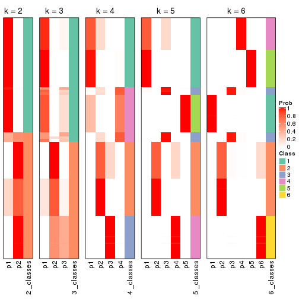


If matrix rows can be associated to genes, consider to use `functional_enrichment(res,
...)` to perform function enrichment for the signature genes. See [this vignette](http://bioconductor.org/packages/devel/bioc/vignettes/cola/inst/doc/functional_enrichment.html) for more detailed explanations.


 

---------------------------------------------------


### SD:NMF**


The object with results only for a single top-value method and a single partition method 
can be extracted as:

```r
res = res_list["SD", "NMF"]
# you can also extract it by
# res = res_list["SD:NMF"]
```

A summary of `res` and all the functions that can be applied to it:

```r
res
```

```
#> A 'ConsensusPartition' object with k = 2, 3, 4, 5, 6.
#>   On a matrix with 12029 rows and 181 columns.
#>   Top rows (1000, 2000, 3000, 4000, 5000) are extracted by 'SD' method.
#>   Subgroups are detected by 'NMF' method.
#>   Performed in total 1250 partitions by row resampling.
#>   Best k for subgroups seems to be 3.
#> 
#> Following methods can be applied to this 'ConsensusPartition' object:
#>  [1] "cola_report"             "collect_classes"         "collect_plots"          
#>  [4] "collect_stats"           "colnames"                "compare_signatures"     
#>  [7] "consensus_heatmap"       "dimension_reduction"     "functional_enrichment"  
#> [10] "get_anno_col"            "get_anno"                "get_classes"            
#> [13] "get_consensus"           "get_matrix"              "get_membership"         
#> [16] "get_param"               "get_signatures"          "get_stats"              
#> [19] "is_best_k"               "is_stable_k"             "membership_heatmap"     
#> [22] "ncol"                    "nrow"                    "plot_ecdf"              
#> [25] "rownames"                "select_partition_number" "show"                   
#> [28] "suggest_best_k"          "test_to_known_factors"
```

`collect_plots()` function collects all the plots made from `res` for all `k` (number of partitions)
into one single page to provide an easy and fast comparison between different `k`.

```r
collect_plots(res)
```


The plots are:

- The first row: a plot of the ECDF (empirical cumulative distribution
  function) curves of the consensus matrix for each `k` and the heatmap of
  predicted classes for each `k`.
- The second row: heatmaps of the consensus matrix for each `k`.
- The third row: heatmaps of the membership matrix for each `k`.
- The fouth row: heatmaps of the signatures for each `k`.

All the plots in panels can be made by individual functions and they are
plotted later in this section.

`select_partition_number()` produces several plots showing different
statistics for choosing "optimized" `k`. There are following statistics:

- ECDF curves of the consensus matrix for each `k`;
- 1-PAC. [The PAC
  score](https://en.wikipedia.org/wiki/Consensus_clustering#Over-interpretation_potential_of_consensus_clustering)
  measures the proportion of the ambiguous subgrouping.
- Mean silhouette score.
- Concordance. The mean probability of fiting the consensus class ids in all
  partitions.
- Area increased. Denote $A_k$ as the area under the ECDF curve for current
  `k`, the area increased is defined as $A_k - A_{k-1}$.
- Rand index. The percent of pairs of samples that are both in a same cluster
  or both are not in a same cluster in the partition of k and k-1.
- Jaccard index. The ratio of pairs of samples are both in a same cluster in
  the partition of k and k-1 and the pairs of samples are both in a same
  cluster in the partition k or k-1.

The detailed explanations of these statistics can be found in [the _cola_
vignette](http://bioconductor.org/packages/devel/bioc/vignettes/cola/inst/doc/cola.html#toc_13).

Generally speaking, lower PAC score, higher mean silhouette score or higher
concordance corresponds to better partition. Rand index and Jaccard index
measure how similar the current partition is compared to partition with `k-1`.
If they are too similar, we won't accept `k` is better than `k-1`.

```r
select_partition_number(res)
```


The numeric values for all these statistics can be obtained by `get_stats()`.

```r
get_stats(res)
```

```
#>   k 1-PAC mean_silhouette concordance area_increased  Rand Jaccard
#> 2 2 1.000           1.000       1.000         0.5029 0.498   0.498
#> 3 3 1.000           0.996       0.997         0.0543 0.972   0.945
#> 4 4 0.952           0.954       0.969         0.0393 1.000   1.000
#> 5 5 0.904           0.915       0.939         0.0374 0.979   0.955
#> 6 6 0.826           0.885       0.923         0.0300 1.000   0.999
```

`suggest_best_k()` suggests the best $k$ based on these statistics. The rules are as follows:

- All $k$ with Jaccard index larger than 0.95 are removed because increasing
  $k$ does not provide enough extra information. If all $k$ are removed, it is
  marked as no subgroup is detected.
- For all $k$ with 1-PAC score larger than 0.9, the maximal $k$ is taken as
  the best $k$, and other $k$ are marked as optional $k$.
- If it does not fit the second rule. The $k$ with the maximal vote of the
  highest 1-PAC score, highest mean silhouette, and highest concordance is
  taken as the best $k$.

```r
suggest_best_k(res)
```

```
#> [1] 3
#> attr(,"optional")
#> [1] 2
```

There is also optional best $k$ = 2 that is worth to check.

Following shows the table of the partitions (You need to click the **show/hide
code output** link to see it). The membership matrix (columns with name `p*`)
is inferred by
[`clue::cl_consensus()`](https://www.rdocumentation.org/link/cl_consensus?package=clue)
function with the `SE` method. Basically the value in the membership matrix
represents the probability to belong to a certain group. The finall class
label for an item is determined with the group with highest probability it
belongs to.

In `get_classes()` function, the entropy is calculated from the membership
matrix and the silhouette score is calculated from the consensus matrix.


<script>
$( function() {
	$( '#tabs-SD-NMF-get-classes' ).tabs();
} );
</script>
<div id='tabs-SD-NMF-get-classes'>
<ul>
<li><a href='#tab-SD-NMF-get-classes-1'>k = 2</a></li>
<li><a href='#tab-SD-NMF-get-classes-2'>k = 3</a></li>
<li><a href='#tab-SD-NMF-get-classes-3'>k = 4</a></li>
<li><a href='#tab-SD-NMF-get-classes-4'>k = 5</a></li>
<li><a href='#tab-SD-NMF-get-classes-5'>k = 6</a></li>
</ul>

<div id='tab-SD-NMF-get-classes-1'>
<p><a id='tab-SD-NMF-get-classes-1-a' style='color:#0366d6' href='#'>show/hide code output</a></p>
<pre><code class="r">cbind(get_classes(res, k = 2), get_membership(res, k = 2))
</code></pre>

<pre><code>#&gt;           class entropy silhouette p1 p2
#&gt; SRR315112     2       0          1  0  1
#&gt; SRR315113     1       0          1  1  0
#&gt; SRR315114     1       0          1  1  0
#&gt; SRR315115     2       0          1  0  1
#&gt; SRR315116     2       0          1  0  1
#&gt; SRR566986     2       0          1  0  1
#&gt; SRR566987     2       0          1  0  1
#&gt; SRR566988     2       0          1  0  1
#&gt; SRR566989     2       0          1  0  1
#&gt; SRR566990     2       0          1  0  1
#&gt; SRR566991     2       0          1  0  1
#&gt; SRR566992     2       0          1  0  1
#&gt; SRR566993     2       0          1  0  1
#&gt; SRR566994     2       0          1  0  1
#&gt; SRR566995     2       0          1  0  1
#&gt; SRR566996     2       0          1  0  1
#&gt; SRR566997     2       0          1  0  1
#&gt; SRR566998     2       0          1  0  1
#&gt; SRR566999     2       0          1  0  1
#&gt; SRR567000     2       0          1  0  1
#&gt; SRR567001     2       0          1  0  1
#&gt; SRR567002     2       0          1  0  1
#&gt; SRR567003     2       0          1  0  1
#&gt; SRR567004     2       0          1  0  1
#&gt; SRR567005     2       0          1  0  1
#&gt; SRR567006     2       0          1  0  1
#&gt; SRR567007     2       0          1  0  1
#&gt; SRR567008     2       0          1  0  1
#&gt; SRR567009     2       0          1  0  1
#&gt; SRR567010     2       0          1  0  1
#&gt; SRR567011     2       0          1  0  1
#&gt; SRR567012     2       0          1  0  1
#&gt; SRR567013     2       0          1  0  1
#&gt; SRR567014     2       0          1  0  1
#&gt; SRR567015     2       0          1  0  1
#&gt; SRR567016     2       0          1  0  1
#&gt; SRR567017     2       0          1  0  1
#&gt; SRR567018     2       0          1  0  1
#&gt; SRR567019     2       0          1  0  1
#&gt; SRR567020     2       0          1  0  1
#&gt; SRR567021     2       0          1  0  1
#&gt; SRR567022     2       0          1  0  1
#&gt; SRR567023     2       0          1  0  1
#&gt; SRR567024     2       0          1  0  1
#&gt; SRR567025     2       0          1  0  1
#&gt; SRR567026     2       0          1  0  1
#&gt; SRR567027     2       0          1  0  1
#&gt; SRR567028     2       0          1  0  1
#&gt; SRR567029     2       0          1  0  1
#&gt; SRR567030     2       0          1  0  1
#&gt; SRR567031     2       0          1  0  1
#&gt; SRR567032     2       0          1  0  1
#&gt; SRR567033     2       0          1  0  1
#&gt; SRR567034     2       0          1  0  1
#&gt; SRR567035     2       0          1  0  1
#&gt; SRR567036     2       0          1  0  1
#&gt; SRR567037     2       0          1  0  1
#&gt; SRR567038     2       0          1  0  1
#&gt; SRR567039     2       0          1  0  1
#&gt; SRR567040     2       0          1  0  1
#&gt; SRR567041     2       0          1  0  1
#&gt; SRR567042     2       0          1  0  1
#&gt; SRR567043     2       0          1  0  1
#&gt; SRR567044     2       0          1  0  1
#&gt; SRR567045     2       0          1  0  1
#&gt; SRR567046     2       0          1  0  1
#&gt; SRR567047     2       0          1  0  1
#&gt; SRR567048     2       0          1  0  1
#&gt; SRR567049     2       0          1  0  1
#&gt; SRR567050     2       0          1  0  1
#&gt; SRR567051     2       0          1  0  1
#&gt; SRR567052     2       0          1  0  1
#&gt; SRR567053     2       0          1  0  1
#&gt; SRR567054     2       0          1  0  1
#&gt; SRR567055     2       0          1  0  1
#&gt; SRR567056     2       0          1  0  1
#&gt; SRR567057     2       0          1  0  1
#&gt; SRR567058     2       0          1  0  1
#&gt; SRR567059     2       0          1  0  1
#&gt; SRR567060     2       0          1  0  1
#&gt; SRR567061     2       0          1  0  1
#&gt; SRR567062     2       0          1  0  1
#&gt; SRR567063     2       0          1  0  1
#&gt; SRR567064     2       0          1  0  1
#&gt; SRR567065     2       0          1  0  1
#&gt; SRR567066     2       0          1  0  1
#&gt; SRR567067     2       0          1  0  1
#&gt; SRR567068     2       0          1  0  1
#&gt; SRR567069     2       0          1  0  1
#&gt; SRR567070     2       0          1  0  1
#&gt; SRR567071     2       0          1  0  1
#&gt; SRR567072     2       0          1  0  1
#&gt; SRR567073     2       0          1  0  1
#&gt; SRR567074     2       0          1  0  1
#&gt; SRR567075     2       0          1  0  1
#&gt; SRR567076     1       0          1  1  0
#&gt; SRR567077     1       0          1  1  0
#&gt; SRR567078     1       0          1  1  0
#&gt; SRR567079     1       0          1  1  0
#&gt; SRR567080     1       0          1  1  0
#&gt; SRR567081     1       0          1  1  0
#&gt; SRR567082     1       0          1  1  0
#&gt; SRR567083     1       0          1  1  0
#&gt; SRR567084     1       0          1  1  0
#&gt; SRR567085     1       0          1  1  0
#&gt; SRR567086     1       0          1  1  0
#&gt; SRR567087     1       0          1  1  0
#&gt; SRR567088     1       0          1  1  0
#&gt; SRR567089     1       0          1  1  0
#&gt; SRR567090     1       0          1  1  0
#&gt; SRR567091     1       0          1  1  0
#&gt; SRR567092     1       0          1  1  0
#&gt; SRR567093     1       0          1  1  0
#&gt; SRR567094     1       0          1  1  0
#&gt; SRR567095     1       0          1  1  0
#&gt; SRR567096     1       0          1  1  0
#&gt; SRR567097     1       0          1  1  0
#&gt; SRR567098     1       0          1  1  0
#&gt; SRR567099     1       0          1  1  0
#&gt; SRR567100     1       0          1  1  0
#&gt; SRR567101     1       0          1  1  0
#&gt; SRR567102     1       0          1  1  0
#&gt; SRR567103     1       0          1  1  0
#&gt; SRR567104     1       0          1  1  0
#&gt; SRR567105     1       0          1  1  0
#&gt; SRR567106     1       0          1  1  0
#&gt; SRR567107     1       0          1  1  0
#&gt; SRR567108     1       0          1  1  0
#&gt; SRR567109     1       0          1  1  0
#&gt; SRR567110     1       0          1  1  0
#&gt; SRR567111     1       0          1  1  0
#&gt; SRR567112     1       0          1  1  0
#&gt; SRR567113     1       0          1  1  0
#&gt; SRR567114     1       0          1  1  0
#&gt; SRR567115     1       0          1  1  0
#&gt; SRR567116     1       0          1  1  0
#&gt; SRR567117     1       0          1  1  0
#&gt; SRR567118     1       0          1  1  0
#&gt; SRR567119     1       0          1  1  0
#&gt; SRR567120     1       0          1  1  0
#&gt; SRR567121     1       0          1  1  0
#&gt; SRR567122     1       0          1  1  0
#&gt; SRR567123     1       0          1  1  0
#&gt; SRR567124     1       0          1  1  0
#&gt; SRR567125     1       0          1  1  0
#&gt; SRR567126     1       0          1  1  0
#&gt; SRR567127     1       0          1  1  0
#&gt; SRR567128     1       0          1  1  0
#&gt; SRR567129     1       0          1  1  0
#&gt; SRR567130     1       0          1  1  0
#&gt; SRR567131     1       0          1  1  0
#&gt; SRR567132     1       0          1  1  0
#&gt; SRR567133     1       0          1  1  0
#&gt; SRR567134     1       0          1  1  0
#&gt; SRR567135     1       0          1  1  0
#&gt; SRR567136     1       0          1  1  0
#&gt; SRR567137     1       0          1  1  0
#&gt; SRR567138     1       0          1  1  0
#&gt; SRR567139     1       0          1  1  0
#&gt; SRR567140     1       0          1  1  0
#&gt; SRR567141     1       0          1  1  0
#&gt; SRR567142     1       0          1  1  0
#&gt; SRR567143     1       0          1  1  0
#&gt; SRR567144     1       0          1  1  0
#&gt; SRR567145     1       0          1  1  0
#&gt; SRR567146     1       0          1  1  0
#&gt; SRR567147     1       0          1  1  0
#&gt; SRR567148     1       0          1  1  0
#&gt; SRR567149     1       0          1  1  0
#&gt; SRR567150     1       0          1  1  0
#&gt; SRR567151     1       0          1  1  0
#&gt; SRR567152     1       0          1  1  0
#&gt; SRR567153     1       0          1  1  0
#&gt; SRR567154     1       0          1  1  0
#&gt; SRR567155     1       0          1  1  0
#&gt; SRR567156     1       0          1  1  0
#&gt; SRR567157     1       0          1  1  0
#&gt; SRR567158     1       0          1  1  0
#&gt; SRR567159     1       0          1  1  0
#&gt; SRR567160     1       0          1  1  0
#&gt; SRR567161     1       0          1  1  0
</code></pre>

<script>
$('#tab-SD-NMF-get-classes-1-a').parent().next().next().hide();
$('#tab-SD-NMF-get-classes-1-a').click(function(){
  $('#tab-SD-NMF-get-classes-1-a').parent().next().next().toggle();
  return(false);
});
</script>
</div>

<div id='tab-SD-NMF-get-classes-2'>
<p><a id='tab-SD-NMF-get-classes-2-a' style='color:#0366d6' href='#'>show/hide code output</a></p>
<pre><code class="r">cbind(get_classes(res, k = 3), get_membership(res, k = 3))
</code></pre>

<pre><code>#&gt;           class entropy silhouette    p1    p2    p3
#&gt; SRR315112     3  0.1411      0.977 0.000 0.036 0.964
#&gt; SRR315113     3  0.1525      0.965 0.032 0.004 0.964
#&gt; SRR315114     3  0.1525      0.965 0.032 0.004 0.964
#&gt; SRR315115     3  0.1411      0.977 0.000 0.036 0.964
#&gt; SRR315116     3  0.1411      0.977 0.000 0.036 0.964
#&gt; SRR566986     2  0.0000      0.996 0.000 1.000 0.000
#&gt; SRR566987     2  0.0000      0.996 0.000 1.000 0.000
#&gt; SRR566988     2  0.0000      0.996 0.000 1.000 0.000
#&gt; SRR566989     2  0.0000      0.996 0.000 1.000 0.000
#&gt; SRR566990     2  0.0237      0.996 0.000 0.996 0.004
#&gt; SRR566991     2  0.0000      0.996 0.000 1.000 0.000
#&gt; SRR566992     2  0.0000      0.996 0.000 1.000 0.000
#&gt; SRR566993     2  0.0000      0.996 0.000 1.000 0.000
#&gt; SRR566994     2  0.0000      0.996 0.000 1.000 0.000
#&gt; SRR566995     2  0.0000      0.996 0.000 1.000 0.000
#&gt; SRR566996     2  0.0237      0.996 0.000 0.996 0.004
#&gt; SRR566997     2  0.0000      0.996 0.000 1.000 0.000
#&gt; SRR566998     2  0.0000      0.996 0.000 1.000 0.000
#&gt; SRR566999     2  0.0000      0.996 0.000 1.000 0.000
#&gt; SRR567000     2  0.0000      0.996 0.000 1.000 0.000
#&gt; SRR567001     2  0.0000      0.996 0.000 1.000 0.000
#&gt; SRR567002     2  0.0000      0.996 0.000 1.000 0.000
#&gt; SRR567003     2  0.0000      0.996 0.000 1.000 0.000
#&gt; SRR567004     2  0.0000      0.996 0.000 1.000 0.000
#&gt; SRR567005     2  0.0000      0.996 0.000 1.000 0.000
#&gt; SRR567006     2  0.0000      0.996 0.000 1.000 0.000
#&gt; SRR567007     2  0.0000      0.996 0.000 1.000 0.000
#&gt; SRR567008     2  0.0000      0.996 0.000 1.000 0.000
#&gt; SRR567009     2  0.0000      0.996 0.000 1.000 0.000
#&gt; SRR567010     2  0.0000      0.996 0.000 1.000 0.000
#&gt; SRR567011     2  0.0000      0.996 0.000 1.000 0.000
#&gt; SRR567012     2  0.0000      0.996 0.000 1.000 0.000
#&gt; SRR567013     2  0.0000      0.996 0.000 1.000 0.000
#&gt; SRR567014     2  0.0237      0.995 0.000 0.996 0.004
#&gt; SRR567015     2  0.0424      0.993 0.000 0.992 0.008
#&gt; SRR567016     2  0.0592      0.990 0.000 0.988 0.012
#&gt; SRR567017     2  0.0592      0.990 0.000 0.988 0.012
#&gt; SRR567018     2  0.0237      0.995 0.000 0.996 0.004
#&gt; SRR567019     2  0.0424      0.993 0.000 0.992 0.008
#&gt; SRR567020     2  0.0592      0.990 0.000 0.988 0.012
#&gt; SRR567021     2  0.0237      0.995 0.000 0.996 0.004
#&gt; SRR567022     2  0.0237      0.996 0.000 0.996 0.004
#&gt; SRR567023     2  0.0592      0.990 0.000 0.988 0.012
#&gt; SRR567024     2  0.0237      0.995 0.000 0.996 0.004
#&gt; SRR567025     2  0.0237      0.995 0.000 0.996 0.004
#&gt; SRR567026     2  0.0592      0.990 0.000 0.988 0.012
#&gt; SRR567027     2  0.0592      0.990 0.000 0.988 0.012
#&gt; SRR567028     2  0.0237      0.995 0.000 0.996 0.004
#&gt; SRR567029     2  0.0592      0.990 0.000 0.988 0.012
#&gt; SRR567030     2  0.0592      0.990 0.000 0.988 0.012
#&gt; SRR567031     2  0.0592      0.990 0.000 0.988 0.012
#&gt; SRR567032     2  0.0592      0.990 0.000 0.988 0.012
#&gt; SRR567033     2  0.0424      0.993 0.000 0.992 0.008
#&gt; SRR567034     2  0.0237      0.995 0.000 0.996 0.004
#&gt; SRR567035     2  0.0237      0.995 0.000 0.996 0.004
#&gt; SRR567036     2  0.0237      0.995 0.000 0.996 0.004
#&gt; SRR567037     2  0.0424      0.993 0.000 0.992 0.008
#&gt; SRR567038     2  0.0424      0.993 0.000 0.992 0.008
#&gt; SRR567039     2  0.0424      0.993 0.000 0.992 0.008
#&gt; SRR567040     2  0.0237      0.995 0.000 0.996 0.004
#&gt; SRR567041     2  0.0237      0.995 0.000 0.996 0.004
#&gt; SRR567042     2  0.0237      0.996 0.000 0.996 0.004
#&gt; SRR567043     2  0.0237      0.995 0.000 0.996 0.004
#&gt; SRR567044     2  0.0237      0.996 0.000 0.996 0.004
#&gt; SRR567045     2  0.0237      0.996 0.000 0.996 0.004
#&gt; SRR567046     2  0.0237      0.996 0.000 0.996 0.004
#&gt; SRR567047     2  0.0237      0.996 0.000 0.996 0.004
#&gt; SRR567048     2  0.0237      0.996 0.000 0.996 0.004
#&gt; SRR567049     2  0.0237      0.996 0.000 0.996 0.004
#&gt; SRR567050     2  0.0237      0.996 0.000 0.996 0.004
#&gt; SRR567051     2  0.0237      0.996 0.000 0.996 0.004
#&gt; SRR567052     2  0.0237      0.996 0.000 0.996 0.004
#&gt; SRR567053     2  0.0237      0.996 0.000 0.996 0.004
#&gt; SRR567054     2  0.0237      0.996 0.000 0.996 0.004
#&gt; SRR567055     2  0.0237      0.996 0.000 0.996 0.004
#&gt; SRR567056     2  0.0237      0.996 0.000 0.996 0.004
#&gt; SRR567057     2  0.0237      0.996 0.000 0.996 0.004
#&gt; SRR567058     2  0.0237      0.996 0.000 0.996 0.004
#&gt; SRR567059     2  0.0237      0.996 0.000 0.996 0.004
#&gt; SRR567060     2  0.0237      0.996 0.000 0.996 0.004
#&gt; SRR567061     2  0.0237      0.996 0.000 0.996 0.004
#&gt; SRR567062     2  0.0237      0.996 0.000 0.996 0.004
#&gt; SRR567063     2  0.0237      0.996 0.000 0.996 0.004
#&gt; SRR567064     2  0.0237      0.996 0.000 0.996 0.004
#&gt; SRR567065     2  0.0237      0.996 0.000 0.996 0.004
#&gt; SRR567066     2  0.0237      0.996 0.000 0.996 0.004
#&gt; SRR567067     2  0.0237      0.996 0.000 0.996 0.004
#&gt; SRR567068     2  0.0237      0.996 0.000 0.996 0.004
#&gt; SRR567069     2  0.0237      0.996 0.000 0.996 0.004
#&gt; SRR567070     2  0.0237      0.996 0.000 0.996 0.004
#&gt; SRR567071     2  0.0237      0.996 0.000 0.996 0.004
#&gt; SRR567072     2  0.0237      0.996 0.000 0.996 0.004
#&gt; SRR567073     2  0.0237      0.996 0.000 0.996 0.004
#&gt; SRR567074     2  0.0237      0.996 0.000 0.996 0.004
#&gt; SRR567075     2  0.0237      0.996 0.000 0.996 0.004
#&gt; SRR567076     1  0.0000      0.999 1.000 0.000 0.000
#&gt; SRR567077     1  0.0000      0.999 1.000 0.000 0.000
#&gt; SRR567078     1  0.0000      0.999 1.000 0.000 0.000
#&gt; SRR567079     1  0.0000      0.999 1.000 0.000 0.000
#&gt; SRR567080     1  0.0000      0.999 1.000 0.000 0.000
#&gt; SRR567081     1  0.0000      0.999 1.000 0.000 0.000
#&gt; SRR567082     1  0.0000      0.999 1.000 0.000 0.000
#&gt; SRR567083     1  0.0000      0.999 1.000 0.000 0.000
#&gt; SRR567084     1  0.0000      0.999 1.000 0.000 0.000
#&gt; SRR567085     1  0.0000      0.999 1.000 0.000 0.000
#&gt; SRR567086     1  0.0000      0.999 1.000 0.000 0.000
#&gt; SRR567087     1  0.0000      0.999 1.000 0.000 0.000
#&gt; SRR567088     1  0.0000      0.999 1.000 0.000 0.000
#&gt; SRR567089     1  0.0000      0.999 1.000 0.000 0.000
#&gt; SRR567090     1  0.0000      0.999 1.000 0.000 0.000
#&gt; SRR567091     1  0.0000      0.999 1.000 0.000 0.000
#&gt; SRR567092     1  0.0000      0.999 1.000 0.000 0.000
#&gt; SRR567093     1  0.0000      0.999 1.000 0.000 0.000
#&gt; SRR567094     1  0.0000      0.999 1.000 0.000 0.000
#&gt; SRR567095     1  0.0000      0.999 1.000 0.000 0.000
#&gt; SRR567096     1  0.0000      0.999 1.000 0.000 0.000
#&gt; SRR567097     1  0.0000      0.999 1.000 0.000 0.000
#&gt; SRR567098     1  0.0000      0.999 1.000 0.000 0.000
#&gt; SRR567099     1  0.0000      0.999 1.000 0.000 0.000
#&gt; SRR567100     1  0.0000      0.999 1.000 0.000 0.000
#&gt; SRR567101     1  0.0000      0.999 1.000 0.000 0.000
#&gt; SRR567102     1  0.0000      0.999 1.000 0.000 0.000
#&gt; SRR567103     1  0.0000      0.999 1.000 0.000 0.000
#&gt; SRR567104     1  0.0000      0.999 1.000 0.000 0.000
#&gt; SRR567105     1  0.0000      0.999 1.000 0.000 0.000
#&gt; SRR567106     1  0.0000      0.999 1.000 0.000 0.000
#&gt; SRR567107     1  0.0000      0.999 1.000 0.000 0.000
#&gt; SRR567108     1  0.0000      0.999 1.000 0.000 0.000
#&gt; SRR567109     1  0.0000      0.999 1.000 0.000 0.000
#&gt; SRR567110     1  0.0000      0.999 1.000 0.000 0.000
#&gt; SRR567111     1  0.0000      0.999 1.000 0.000 0.000
#&gt; SRR567112     1  0.0000      0.999 1.000 0.000 0.000
#&gt; SRR567113     1  0.0000      0.999 1.000 0.000 0.000
#&gt; SRR567114     1  0.0000      0.999 1.000 0.000 0.000
#&gt; SRR567115     1  0.0000      0.999 1.000 0.000 0.000
#&gt; SRR567116     1  0.0000      0.999 1.000 0.000 0.000
#&gt; SRR567117     1  0.0000      0.999 1.000 0.000 0.000
#&gt; SRR567118     1  0.0000      0.999 1.000 0.000 0.000
#&gt; SRR567119     1  0.0000      0.999 1.000 0.000 0.000
#&gt; SRR567120     1  0.0000      0.999 1.000 0.000 0.000
#&gt; SRR567121     1  0.0000      0.999 1.000 0.000 0.000
#&gt; SRR567122     1  0.0000      0.999 1.000 0.000 0.000
#&gt; SRR567123     1  0.0000      0.999 1.000 0.000 0.000
#&gt; SRR567124     1  0.0000      0.999 1.000 0.000 0.000
#&gt; SRR567125     1  0.0000      0.999 1.000 0.000 0.000
#&gt; SRR567126     1  0.0000      0.999 1.000 0.000 0.000
#&gt; SRR567127     1  0.0000      0.999 1.000 0.000 0.000
#&gt; SRR567128     1  0.0000      0.999 1.000 0.000 0.000
#&gt; SRR567129     1  0.0000      0.999 1.000 0.000 0.000
#&gt; SRR567130     1  0.0000      0.999 1.000 0.000 0.000
#&gt; SRR567131     1  0.0000      0.999 1.000 0.000 0.000
#&gt; SRR567132     1  0.0000      0.999 1.000 0.000 0.000
#&gt; SRR567133     1  0.0000      0.999 1.000 0.000 0.000
#&gt; SRR567134     1  0.0000      0.999 1.000 0.000 0.000
#&gt; SRR567135     1  0.0000      0.999 1.000 0.000 0.000
#&gt; SRR567136     1  0.0000      0.999 1.000 0.000 0.000
#&gt; SRR567137     1  0.0000      0.999 1.000 0.000 0.000
#&gt; SRR567138     1  0.0000      0.999 1.000 0.000 0.000
#&gt; SRR567139     1  0.0000      0.999 1.000 0.000 0.000
#&gt; SRR567140     1  0.0000      0.999 1.000 0.000 0.000
#&gt; SRR567141     1  0.0000      0.999 1.000 0.000 0.000
#&gt; SRR567142     1  0.0000      0.999 1.000 0.000 0.000
#&gt; SRR567143     1  0.0000      0.999 1.000 0.000 0.000
#&gt; SRR567144     1  0.0000      0.999 1.000 0.000 0.000
#&gt; SRR567145     1  0.0000      0.999 1.000 0.000 0.000
#&gt; SRR567146     1  0.1289      0.967 0.968 0.000 0.032
#&gt; SRR567147     1  0.0000      0.999 1.000 0.000 0.000
#&gt; SRR567148     1  0.0000      0.999 1.000 0.000 0.000
#&gt; SRR567149     1  0.0000      0.999 1.000 0.000 0.000
#&gt; SRR567150     1  0.0000      0.999 1.000 0.000 0.000
#&gt; SRR567151     1  0.0000      0.999 1.000 0.000 0.000
#&gt; SRR567152     1  0.0000      0.999 1.000 0.000 0.000
#&gt; SRR567153     1  0.0000      0.999 1.000 0.000 0.000
#&gt; SRR567154     1  0.0000      0.999 1.000 0.000 0.000
#&gt; SRR567155     1  0.0000      0.999 1.000 0.000 0.000
#&gt; SRR567156     1  0.0000      0.999 1.000 0.000 0.000
#&gt; SRR567157     1  0.0000      0.999 1.000 0.000 0.000
#&gt; SRR567158     1  0.0000      0.999 1.000 0.000 0.000
#&gt; SRR567159     1  0.0000      0.999 1.000 0.000 0.000
#&gt; SRR567160     1  0.0000      0.999 1.000 0.000 0.000
#&gt; SRR567161     1  0.1525      0.963 0.964 0.004 0.032
</code></pre>

<script>
$('#tab-SD-NMF-get-classes-2-a').parent().next().next().hide();
$('#tab-SD-NMF-get-classes-2-a').click(function(){
  $('#tab-SD-NMF-get-classes-2-a').parent().next().next().toggle();
  return(false);
});
</script>
</div>

<div id='tab-SD-NMF-get-classes-3'>
<p><a id='tab-SD-NMF-get-classes-3-a' style='color:#0366d6' href='#'>show/hide code output</a></p>
<pre><code class="r">cbind(get_classes(res, k = 4), get_membership(res, k = 4))
</code></pre>

<pre><code>#&gt;           class entropy silhouette    p1    p2    p3 p4
#&gt; SRR315112     3  0.1059      0.983 0.000 0.016 0.972 NA
#&gt; SRR315113     3  0.1890      0.979 0.008 0.000 0.936 NA
#&gt; SRR315114     3  0.2179      0.975 0.012 0.000 0.924 NA
#&gt; SRR315115     3  0.1297      0.982 0.000 0.016 0.964 NA
#&gt; SRR315116     3  0.0336      0.984 0.000 0.008 0.992 NA
#&gt; SRR566986     2  0.0188      0.983 0.000 0.996 0.004 NA
#&gt; SRR566987     2  0.0188      0.983 0.000 0.996 0.004 NA
#&gt; SRR566988     2  0.0000      0.984 0.000 1.000 0.000 NA
#&gt; SRR566989     2  0.0376      0.982 0.000 0.992 0.004 NA
#&gt; SRR566990     2  0.0000      0.984 0.000 1.000 0.000 NA
#&gt; SRR566991     2  0.0188      0.983 0.000 0.996 0.004 NA
#&gt; SRR566992     2  0.0376      0.982 0.000 0.992 0.004 NA
#&gt; SRR566993     2  0.0376      0.982 0.000 0.992 0.004 NA
#&gt; SRR566994     2  0.0188      0.983 0.000 0.996 0.004 NA
#&gt; SRR566995     2  0.0000      0.984 0.000 1.000 0.000 NA
#&gt; SRR566996     2  0.0000      0.984 0.000 1.000 0.000 NA
#&gt; SRR566997     2  0.0376      0.982 0.000 0.992 0.004 NA
#&gt; SRR566998     2  0.0000      0.984 0.000 1.000 0.000 NA
#&gt; SRR566999     2  0.0188      0.983 0.000 0.996 0.004 NA
#&gt; SRR567000     2  0.0376      0.983 0.000 0.992 0.004 NA
#&gt; SRR567001     2  0.0188      0.983 0.000 0.996 0.004 NA
#&gt; SRR567002     2  0.0000      0.984 0.000 1.000 0.000 NA
#&gt; SRR567003     2  0.0188      0.983 0.000 0.996 0.004 NA
#&gt; SRR567004     2  0.0376      0.982 0.000 0.992 0.004 NA
#&gt; SRR567005     2  0.0188      0.983 0.000 0.996 0.004 NA
#&gt; SRR567006     2  0.0376      0.983 0.000 0.992 0.004 NA
#&gt; SRR567007     2  0.0000      0.984 0.000 1.000 0.000 NA
#&gt; SRR567008     2  0.0188      0.983 0.000 0.996 0.004 NA
#&gt; SRR567009     2  0.0188      0.983 0.000 0.996 0.004 NA
#&gt; SRR567010     2  0.0188      0.983 0.000 0.996 0.004 NA
#&gt; SRR567011     2  0.0000      0.984 0.000 1.000 0.000 NA
#&gt; SRR567012     2  0.0188      0.983 0.000 0.996 0.004 NA
#&gt; SRR567013     2  0.0376      0.982 0.000 0.992 0.004 NA
#&gt; SRR567014     2  0.0000      0.984 0.000 1.000 0.000 NA
#&gt; SRR567015     2  0.0000      0.984 0.000 1.000 0.000 NA
#&gt; SRR567016     2  0.0188      0.983 0.000 0.996 0.000 NA
#&gt; SRR567017     2  0.0000      0.984 0.000 1.000 0.000 NA
#&gt; SRR567018     2  0.0188      0.983 0.000 0.996 0.000 NA
#&gt; SRR567019     2  0.0188      0.983 0.000 0.996 0.000 NA
#&gt; SRR567020     2  0.0188      0.983 0.000 0.996 0.000 NA
#&gt; SRR567021     2  0.0336      0.982 0.000 0.992 0.000 NA
#&gt; SRR567022     2  0.4741      0.553 0.000 0.668 0.004 NA
#&gt; SRR567023     2  0.0000      0.984 0.000 1.000 0.000 NA
#&gt; SRR567024     2  0.0188      0.983 0.000 0.996 0.000 NA
#&gt; SRR567025     2  0.0000      0.984 0.000 1.000 0.000 NA
#&gt; SRR567026     2  0.0000      0.984 0.000 1.000 0.000 NA
#&gt; SRR567027     2  0.0000      0.984 0.000 1.000 0.000 NA
#&gt; SRR567028     2  0.0000      0.984 0.000 1.000 0.000 NA
#&gt; SRR567029     2  0.0000      0.984 0.000 1.000 0.000 NA
#&gt; SRR567030     2  0.0336      0.982 0.000 0.992 0.000 NA
#&gt; SRR567031     2  0.0188      0.983 0.000 0.996 0.000 NA
#&gt; SRR567032     2  0.0336      0.982 0.000 0.992 0.000 NA
#&gt; SRR567033     2  0.0469      0.980 0.000 0.988 0.000 NA
#&gt; SRR567034     2  0.0000      0.984 0.000 1.000 0.000 NA
#&gt; SRR567035     2  0.0000      0.984 0.000 1.000 0.000 NA
#&gt; SRR567036     2  0.0188      0.983 0.000 0.996 0.000 NA
#&gt; SRR567037     2  0.0000      0.984 0.000 1.000 0.000 NA
#&gt; SRR567038     2  0.0000      0.984 0.000 1.000 0.000 NA
#&gt; SRR567039     2  0.0336      0.982 0.000 0.992 0.000 NA
#&gt; SRR567040     2  0.0000      0.984 0.000 1.000 0.000 NA
#&gt; SRR567041     2  0.0000      0.984 0.000 1.000 0.000 NA
#&gt; SRR567042     2  0.4741      0.553 0.000 0.668 0.004 NA
#&gt; SRR567043     2  0.0188      0.983 0.000 0.996 0.000 NA
#&gt; SRR567044     2  0.0817      0.978 0.000 0.976 0.000 NA
#&gt; SRR567045     2  0.0817      0.978 0.000 0.976 0.000 NA
#&gt; SRR567046     2  0.0817      0.978 0.000 0.976 0.000 NA
#&gt; SRR567047     2  0.0592      0.981 0.000 0.984 0.000 NA
#&gt; SRR567048     2  0.0817      0.978 0.000 0.976 0.000 NA
#&gt; SRR567049     2  0.0707      0.979 0.000 0.980 0.000 NA
#&gt; SRR567050     2  0.0707      0.979 0.000 0.980 0.000 NA
#&gt; SRR567051     2  0.0817      0.978 0.000 0.976 0.000 NA
#&gt; SRR567052     2  0.0592      0.981 0.000 0.984 0.000 NA
#&gt; SRR567053     2  0.0592      0.981 0.000 0.984 0.000 NA
#&gt; SRR567054     2  0.0707      0.979 0.000 0.980 0.000 NA
#&gt; SRR567055     2  0.0817      0.978 0.000 0.976 0.000 NA
#&gt; SRR567056     2  0.0817      0.978 0.000 0.976 0.000 NA
#&gt; SRR567057     2  0.0592      0.981 0.000 0.984 0.000 NA
#&gt; SRR567058     2  0.0817      0.978 0.000 0.976 0.000 NA
#&gt; SRR567059     2  0.0817      0.978 0.000 0.976 0.000 NA
#&gt; SRR567060     2  0.0817      0.978 0.000 0.976 0.000 NA
#&gt; SRR567061     2  0.0707      0.979 0.000 0.980 0.000 NA
#&gt; SRR567062     2  0.0817      0.978 0.000 0.976 0.000 NA
#&gt; SRR567063     2  0.0817      0.978 0.000 0.976 0.000 NA
#&gt; SRR567064     2  0.0817      0.978 0.000 0.976 0.000 NA
#&gt; SRR567065     2  0.0817      0.978 0.000 0.976 0.000 NA
#&gt; SRR567066     2  0.0817      0.978 0.000 0.976 0.000 NA
#&gt; SRR567067     2  0.0817      0.978 0.000 0.976 0.000 NA
#&gt; SRR567068     2  0.0707      0.979 0.000 0.980 0.000 NA
#&gt; SRR567069     2  0.0817      0.978 0.000 0.976 0.000 NA
#&gt; SRR567070     2  0.0817      0.978 0.000 0.976 0.000 NA
#&gt; SRR567071     2  0.0817      0.978 0.000 0.976 0.000 NA
#&gt; SRR567072     2  0.0817      0.978 0.000 0.976 0.000 NA
#&gt; SRR567073     2  0.0817      0.978 0.000 0.976 0.000 NA
#&gt; SRR567074     2  0.0592      0.981 0.000 0.984 0.000 NA
#&gt; SRR567075     2  0.0469      0.982 0.000 0.988 0.000 NA
#&gt; SRR567076     1  0.0188      0.955 0.996 0.000 0.000 NA
#&gt; SRR567077     1  0.0000      0.955 1.000 0.000 0.000 NA
#&gt; SRR567078     1  0.0000      0.955 1.000 0.000 0.000 NA
#&gt; SRR567079     1  0.0336      0.954 0.992 0.000 0.000 NA
#&gt; SRR567080     1  0.0000      0.955 1.000 0.000 0.000 NA
#&gt; SRR567081     1  0.0000      0.955 1.000 0.000 0.000 NA
#&gt; SRR567082     1  0.0000      0.955 1.000 0.000 0.000 NA
#&gt; SRR567083     1  0.0000      0.955 1.000 0.000 0.000 NA
#&gt; SRR567084     1  0.0000      0.955 1.000 0.000 0.000 NA
#&gt; SRR567085     1  0.0000      0.955 1.000 0.000 0.000 NA
#&gt; SRR567086     1  0.0188      0.955 0.996 0.000 0.000 NA
#&gt; SRR567087     1  0.0000      0.955 1.000 0.000 0.000 NA
#&gt; SRR567088     1  0.0000      0.955 1.000 0.000 0.000 NA
#&gt; SRR567089     1  0.0000      0.955 1.000 0.000 0.000 NA
#&gt; SRR567090     1  0.0000      0.955 1.000 0.000 0.000 NA
#&gt; SRR567091     1  0.0000      0.955 1.000 0.000 0.000 NA
#&gt; SRR567092     1  0.0000      0.955 1.000 0.000 0.000 NA
#&gt; SRR567093     1  0.0000      0.955 1.000 0.000 0.000 NA
#&gt; SRR567094     1  0.0000      0.955 1.000 0.000 0.000 NA
#&gt; SRR567095     1  0.0336      0.954 0.992 0.000 0.000 NA
#&gt; SRR567096     1  0.0000      0.955 1.000 0.000 0.000 NA
#&gt; SRR567097     1  0.0000      0.955 1.000 0.000 0.000 NA
#&gt; SRR567098     1  0.0336      0.954 0.992 0.000 0.000 NA
#&gt; SRR567099     1  0.0000      0.955 1.000 0.000 0.000 NA
#&gt; SRR567100     1  0.0000      0.955 1.000 0.000 0.000 NA
#&gt; SRR567101     1  0.0336      0.954 0.992 0.000 0.000 NA
#&gt; SRR567102     1  0.0592      0.952 0.984 0.000 0.000 NA
#&gt; SRR567103     1  0.0592      0.952 0.984 0.000 0.000 NA
#&gt; SRR567104     1  0.0000      0.955 1.000 0.000 0.000 NA
#&gt; SRR567105     1  0.0000      0.955 1.000 0.000 0.000 NA
#&gt; SRR567106     1  0.2216      0.929 0.908 0.000 0.000 NA
#&gt; SRR567107     1  0.2216      0.929 0.908 0.000 0.000 NA
#&gt; SRR567108     1  0.2216      0.929 0.908 0.000 0.000 NA
#&gt; SRR567109     1  0.2149      0.930 0.912 0.000 0.000 NA
#&gt; SRR567110     1  0.2216      0.929 0.908 0.000 0.000 NA
#&gt; SRR567111     1  0.2216      0.929 0.908 0.000 0.000 NA
#&gt; SRR567112     1  0.2216      0.929 0.908 0.000 0.000 NA
#&gt; SRR567113     1  0.2149      0.930 0.912 0.000 0.000 NA
#&gt; SRR567114     1  0.2216      0.929 0.908 0.000 0.000 NA
#&gt; SRR567115     1  0.2216      0.929 0.908 0.000 0.000 NA
#&gt; SRR567116     1  0.2216      0.929 0.908 0.000 0.000 NA
#&gt; SRR567117     1  0.2216      0.929 0.908 0.000 0.000 NA
#&gt; SRR567118     1  0.2216      0.929 0.908 0.000 0.000 NA
#&gt; SRR567119     1  0.2216      0.929 0.908 0.000 0.000 NA
#&gt; SRR567120     1  0.2216      0.929 0.908 0.000 0.000 NA
#&gt; SRR567121     1  0.2216      0.929 0.908 0.000 0.000 NA
#&gt; SRR567122     1  0.2216      0.929 0.908 0.000 0.000 NA
#&gt; SRR567123     1  0.2216      0.929 0.908 0.000 0.000 NA
#&gt; SRR567124     1  0.2216      0.929 0.908 0.000 0.000 NA
#&gt; SRR567125     1  0.2216      0.929 0.908 0.000 0.000 NA
#&gt; SRR567126     1  0.2216      0.929 0.908 0.000 0.000 NA
#&gt; SRR567127     1  0.2216      0.929 0.908 0.000 0.000 NA
#&gt; SRR567128     1  0.2216      0.929 0.908 0.000 0.000 NA
#&gt; SRR567129     1  0.2216      0.929 0.908 0.000 0.000 NA
#&gt; SRR567130     1  0.2216      0.929 0.908 0.000 0.000 NA
#&gt; SRR567131     1  0.2216      0.929 0.908 0.000 0.000 NA
#&gt; SRR567132     1  0.2216      0.929 0.908 0.000 0.000 NA
#&gt; SRR567133     1  0.2216      0.929 0.908 0.000 0.000 NA
#&gt; SRR567134     1  0.0707      0.950 0.980 0.000 0.000 NA
#&gt; SRR567135     1  0.0592      0.952 0.984 0.000 0.000 NA
#&gt; SRR567136     1  0.2281      0.895 0.904 0.000 0.000 NA
#&gt; SRR567137     1  0.0592      0.952 0.984 0.000 0.000 NA
#&gt; SRR567138     1  0.0469      0.953 0.988 0.000 0.000 NA
#&gt; SRR567139     1  0.0469      0.953 0.988 0.000 0.000 NA
#&gt; SRR567140     1  0.0592      0.952 0.984 0.000 0.000 NA
#&gt; SRR567141     1  0.0469      0.953 0.988 0.000 0.000 NA
#&gt; SRR567142     1  0.0469      0.953 0.988 0.000 0.000 NA
#&gt; SRR567143     1  0.0469      0.953 0.988 0.000 0.000 NA
#&gt; SRR567144     1  0.0469      0.953 0.988 0.000 0.000 NA
#&gt; SRR567145     1  0.0592      0.952 0.984 0.000 0.000 NA
#&gt; SRR567146     1  0.4978      0.487 0.612 0.000 0.004 NA
#&gt; SRR567147     1  0.0469      0.953 0.988 0.000 0.000 NA
#&gt; SRR567148     1  0.0592      0.952 0.984 0.000 0.000 NA
#&gt; SRR567149     1  0.0469      0.953 0.988 0.000 0.000 NA
#&gt; SRR567150     1  0.0592      0.952 0.984 0.000 0.000 NA
#&gt; SRR567151     1  0.0592      0.952 0.984 0.000 0.000 NA
#&gt; SRR567152     1  0.0469      0.953 0.988 0.000 0.000 NA
#&gt; SRR567153     1  0.0469      0.953 0.988 0.000 0.000 NA
#&gt; SRR567154     1  0.0469      0.953 0.988 0.000 0.000 NA
#&gt; SRR567155     1  0.0469      0.953 0.988 0.000 0.000 NA
#&gt; SRR567156     1  0.0469      0.953 0.988 0.000 0.000 NA
#&gt; SRR567157     1  0.0469      0.953 0.988 0.000 0.000 NA
#&gt; SRR567158     1  0.0469      0.953 0.988 0.000 0.000 NA
#&gt; SRR567159     1  0.2281      0.895 0.904 0.000 0.000 NA
#&gt; SRR567160     1  0.0469      0.953 0.988 0.000 0.000 NA
#&gt; SRR567161     1  0.4978      0.487 0.612 0.000 0.004 NA
</code></pre>

<script>
$('#tab-SD-NMF-get-classes-3-a').parent().next().next().hide();
$('#tab-SD-NMF-get-classes-3-a').click(function(){
  $('#tab-SD-NMF-get-classes-3-a').parent().next().next().toggle();
  return(false);
});
</script>
</div>

<div id='tab-SD-NMF-get-classes-4'>
<p><a id='tab-SD-NMF-get-classes-4-a' style='color:#0366d6' href='#'>show/hide code output</a></p>
<pre><code class="r">cbind(get_classes(res, k = 5), get_membership(res, k = 5))
</code></pre>

<pre><code>#&gt;           class entropy silhouette    p1    p2    p3    p4 p5
#&gt; SRR315112     3  0.1087    0.95183 0.000 0.008 0.968 0.008 NA
#&gt; SRR315113     3  0.2439    0.93781 0.000 0.000 0.876 0.004 NA
#&gt; SRR315114     3  0.2646    0.93538 0.004 0.000 0.868 0.004 NA
#&gt; SRR315115     3  0.1405    0.94482 0.000 0.016 0.956 0.008 NA
#&gt; SRR315116     3  0.0451    0.95400 0.000 0.008 0.988 0.004 NA
#&gt; SRR566986     2  0.0000    0.97496 0.000 1.000 0.000 0.000 NA
#&gt; SRR566987     2  0.0000    0.97496 0.000 1.000 0.000 0.000 NA
#&gt; SRR566988     2  0.0000    0.97496 0.000 1.000 0.000 0.000 NA
#&gt; SRR566989     2  0.0000    0.97496 0.000 1.000 0.000 0.000 NA
#&gt; SRR566990     2  0.0000    0.97496 0.000 1.000 0.000 0.000 NA
#&gt; SRR566991     2  0.0162    0.97461 0.000 0.996 0.000 0.000 NA
#&gt; SRR566992     2  0.0000    0.97496 0.000 1.000 0.000 0.000 NA
#&gt; SRR566993     2  0.0000    0.97496 0.000 1.000 0.000 0.000 NA
#&gt; SRR566994     2  0.0000    0.97496 0.000 1.000 0.000 0.000 NA
#&gt; SRR566995     2  0.0290    0.97540 0.000 0.992 0.000 0.000 NA
#&gt; SRR566996     2  0.0000    0.97496 0.000 1.000 0.000 0.000 NA
#&gt; SRR566997     2  0.0162    0.97483 0.000 0.996 0.000 0.004 NA
#&gt; SRR566998     2  0.0162    0.97461 0.000 0.996 0.000 0.000 NA
#&gt; SRR566999     2  0.0162    0.97461 0.000 0.996 0.000 0.000 NA
#&gt; SRR567000     2  0.0000    0.97496 0.000 1.000 0.000 0.000 NA
#&gt; SRR567001     2  0.0162    0.97461 0.000 0.996 0.000 0.000 NA
#&gt; SRR567002     2  0.0000    0.97496 0.000 1.000 0.000 0.000 NA
#&gt; SRR567003     2  0.0162    0.97461 0.000 0.996 0.000 0.000 NA
#&gt; SRR567004     2  0.0000    0.97496 0.000 1.000 0.000 0.000 NA
#&gt; SRR567005     2  0.0000    0.97496 0.000 1.000 0.000 0.000 NA
#&gt; SRR567006     2  0.0162    0.97475 0.000 0.996 0.000 0.000 NA
#&gt; SRR567007     2  0.0000    0.97496 0.000 1.000 0.000 0.000 NA
#&gt; SRR567008     2  0.0162    0.97461 0.000 0.996 0.000 0.000 NA
#&gt; SRR567009     2  0.0162    0.97483 0.000 0.996 0.000 0.004 NA
#&gt; SRR567010     2  0.0162    0.97461 0.000 0.996 0.000 0.000 NA
#&gt; SRR567011     2  0.0000    0.97496 0.000 1.000 0.000 0.000 NA
#&gt; SRR567012     2  0.0162    0.97493 0.000 0.996 0.000 0.004 NA
#&gt; SRR567013     2  0.0000    0.97496 0.000 1.000 0.000 0.000 NA
#&gt; SRR567014     2  0.1173    0.96264 0.000 0.964 0.004 0.012 NA
#&gt; SRR567015     2  0.1498    0.95506 0.000 0.952 0.008 0.024 NA
#&gt; SRR567016     2  0.1393    0.95741 0.000 0.956 0.008 0.024 NA
#&gt; SRR567017     2  0.1243    0.96096 0.000 0.960 0.004 0.028 NA
#&gt; SRR567018     2  0.1168    0.96022 0.000 0.960 0.000 0.032 NA
#&gt; SRR567019     2  0.1153    0.96240 0.000 0.964 0.004 0.024 NA
#&gt; SRR567020     2  0.1393    0.95741 0.000 0.956 0.008 0.024 NA
#&gt; SRR567021     2  0.1195    0.96022 0.000 0.960 0.000 0.028 NA
#&gt; SRR567022     4  0.4440    0.24290 0.000 0.468 0.004 0.528 NA
#&gt; SRR567023     2  0.1082    0.96242 0.000 0.964 0.000 0.028 NA
#&gt; SRR567024     2  0.1173    0.96264 0.000 0.964 0.004 0.020 NA
#&gt; SRR567025     2  0.1569    0.95153 0.000 0.948 0.012 0.008 NA
#&gt; SRR567026     2  0.1690    0.94775 0.000 0.944 0.008 0.024 NA
#&gt; SRR567027     2  0.1372    0.95739 0.000 0.956 0.004 0.024 NA
#&gt; SRR567028     2  0.1372    0.95783 0.000 0.956 0.004 0.016 NA
#&gt; SRR567029     2  0.1173    0.96222 0.000 0.964 0.004 0.020 NA
#&gt; SRR567030     2  0.1721    0.94785 0.000 0.944 0.020 0.016 NA
#&gt; SRR567031     2  0.1799    0.94366 0.000 0.940 0.012 0.020 NA
#&gt; SRR567032     2  0.1721    0.94786 0.000 0.944 0.016 0.020 NA
#&gt; SRR567033     2  0.1356    0.95762 0.000 0.956 0.004 0.028 NA
#&gt; SRR567034     2  0.1461    0.95491 0.000 0.952 0.004 0.016 NA
#&gt; SRR567035     2  0.1168    0.96022 0.000 0.960 0.000 0.032 NA
#&gt; SRR567036     2  0.1173    0.96264 0.000 0.964 0.004 0.020 NA
#&gt; SRR567037     2  0.1106    0.96236 0.000 0.964 0.000 0.024 NA
#&gt; SRR567038     2  0.1106    0.96236 0.000 0.964 0.000 0.024 NA
#&gt; SRR567039     2  0.1153    0.96240 0.000 0.964 0.004 0.024 NA
#&gt; SRR567040     2  0.1278    0.95995 0.000 0.960 0.004 0.020 NA
#&gt; SRR567041     2  0.1597    0.95156 0.000 0.948 0.008 0.020 NA
#&gt; SRR567042     4  0.4443    0.23269 0.000 0.472 0.004 0.524 NA
#&gt; SRR567043     2  0.1082    0.96273 0.000 0.964 0.000 0.028 NA
#&gt; SRR567044     2  0.0609    0.97112 0.000 0.980 0.000 0.000 NA
#&gt; SRR567045     2  0.0609    0.97090 0.000 0.980 0.000 0.000 NA
#&gt; SRR567046     2  0.0510    0.97237 0.000 0.984 0.000 0.000 NA
#&gt; SRR567047     2  0.0404    0.97340 0.000 0.988 0.000 0.000 NA
#&gt; SRR567048     2  0.0510    0.97237 0.000 0.984 0.000 0.000 NA
#&gt; SRR567049     2  0.0510    0.97237 0.000 0.984 0.000 0.000 NA
#&gt; SRR567050     2  0.0703    0.96877 0.000 0.976 0.000 0.000 NA
#&gt; SRR567051     2  0.0510    0.97237 0.000 0.984 0.000 0.000 NA
#&gt; SRR567052     2  0.0703    0.96877 0.000 0.976 0.000 0.000 NA
#&gt; SRR567053     2  0.0510    0.97237 0.000 0.984 0.000 0.000 NA
#&gt; SRR567054     2  0.0609    0.97090 0.000 0.980 0.000 0.000 NA
#&gt; SRR567055     2  0.0510    0.97237 0.000 0.984 0.000 0.000 NA
#&gt; SRR567056     2  0.0510    0.97237 0.000 0.984 0.000 0.000 NA
#&gt; SRR567057     2  0.0703    0.96877 0.000 0.976 0.000 0.000 NA
#&gt; SRR567058     2  0.0703    0.96877 0.000 0.976 0.000 0.000 NA
#&gt; SRR567059     2  0.0671    0.97144 0.000 0.980 0.000 0.004 NA
#&gt; SRR567060     2  0.0510    0.97237 0.000 0.984 0.000 0.000 NA
#&gt; SRR567061     2  0.0566    0.97325 0.000 0.984 0.000 0.004 NA
#&gt; SRR567062     2  0.0510    0.97237 0.000 0.984 0.000 0.000 NA
#&gt; SRR567063     2  0.0703    0.96877 0.000 0.976 0.000 0.000 NA
#&gt; SRR567064     2  0.0671    0.97144 0.000 0.980 0.000 0.004 NA
#&gt; SRR567065     2  0.0703    0.96877 0.000 0.976 0.000 0.000 NA
#&gt; SRR567066     2  0.0510    0.97237 0.000 0.984 0.000 0.000 NA
#&gt; SRR567067     2  0.0703    0.96877 0.000 0.976 0.000 0.000 NA
#&gt; SRR567068     2  0.0609    0.97090 0.000 0.980 0.000 0.000 NA
#&gt; SRR567069     2  0.0510    0.97237 0.000 0.984 0.000 0.000 NA
#&gt; SRR567070     2  0.0703    0.96877 0.000 0.976 0.000 0.000 NA
#&gt; SRR567071     2  0.0609    0.97090 0.000 0.980 0.000 0.000 NA
#&gt; SRR567072     2  0.0510    0.97237 0.000 0.984 0.000 0.000 NA
#&gt; SRR567073     2  0.0510    0.97237 0.000 0.984 0.000 0.000 NA
#&gt; SRR567074     2  0.0510    0.97237 0.000 0.984 0.000 0.000 NA
#&gt; SRR567075     2  0.0609    0.97090 0.000 0.980 0.000 0.000 NA
#&gt; SRR567076     1  0.0451    0.91997 0.988 0.000 0.000 0.008 NA
#&gt; SRR567077     1  0.0290    0.91953 0.992 0.000 0.000 0.000 NA
#&gt; SRR567078     1  0.0162    0.91981 0.996 0.000 0.000 0.000 NA
#&gt; SRR567079     1  0.0992    0.91880 0.968 0.000 0.000 0.008 NA
#&gt; SRR567080     1  0.0566    0.91976 0.984 0.000 0.000 0.004 NA
#&gt; SRR567081     1  0.0798    0.91911 0.976 0.000 0.000 0.008 NA
#&gt; SRR567082     1  0.0510    0.92016 0.984 0.000 0.000 0.000 NA
#&gt; SRR567083     1  0.0162    0.92001 0.996 0.000 0.000 0.000 NA
#&gt; SRR567084     1  0.0510    0.92000 0.984 0.000 0.000 0.000 NA
#&gt; SRR567085     1  0.0451    0.92045 0.988 0.000 0.000 0.004 NA
#&gt; SRR567086     1  0.0693    0.92022 0.980 0.000 0.000 0.008 NA
#&gt; SRR567087     1  0.0290    0.92019 0.992 0.000 0.000 0.000 NA
#&gt; SRR567088     1  0.0324    0.92034 0.992 0.000 0.000 0.004 NA
#&gt; SRR567089     1  0.0510    0.92045 0.984 0.000 0.000 0.000 NA
#&gt; SRR567090     1  0.0290    0.91957 0.992 0.000 0.000 0.000 NA
#&gt; SRR567091     1  0.0451    0.91959 0.988 0.000 0.000 0.004 NA
#&gt; SRR567092     1  0.0451    0.91974 0.988 0.000 0.000 0.004 NA
#&gt; SRR567093     1  0.0579    0.92018 0.984 0.000 0.000 0.008 NA
#&gt; SRR567094     1  0.0566    0.91981 0.984 0.000 0.000 0.004 NA
#&gt; SRR567095     1  0.0324    0.91975 0.992 0.000 0.000 0.004 NA
#&gt; SRR567096     1  0.0162    0.92001 0.996 0.000 0.000 0.000 NA
#&gt; SRR567097     1  0.0162    0.91988 0.996 0.000 0.000 0.004 NA
#&gt; SRR567098     1  0.0798    0.91867 0.976 0.000 0.000 0.008 NA
#&gt; SRR567099     1  0.0671    0.91991 0.980 0.000 0.000 0.004 NA
#&gt; SRR567100     1  0.0865    0.91932 0.972 0.000 0.000 0.004 NA
#&gt; SRR567101     1  0.0671    0.91975 0.980 0.000 0.000 0.004 NA
#&gt; SRR567102     1  0.3304    0.80057 0.816 0.000 0.000 0.016 NA
#&gt; SRR567103     1  0.3264    0.80578 0.820 0.000 0.000 0.016 NA
#&gt; SRR567104     1  0.0162    0.91993 0.996 0.000 0.000 0.000 NA
#&gt; SRR567105     1  0.0451    0.91983 0.988 0.000 0.000 0.004 NA
#&gt; SRR567106     1  0.2471    0.88052 0.864 0.000 0.000 0.000 NA
#&gt; SRR567107     1  0.2583    0.87953 0.864 0.000 0.004 0.000 NA
#&gt; SRR567108     1  0.2516    0.87852 0.860 0.000 0.000 0.000 NA
#&gt; SRR567109     1  0.2471    0.87945 0.864 0.000 0.000 0.000 NA
#&gt; SRR567110     1  0.2516    0.87852 0.860 0.000 0.000 0.000 NA
#&gt; SRR567111     1  0.2424    0.88122 0.868 0.000 0.000 0.000 NA
#&gt; SRR567112     1  0.2471    0.88052 0.864 0.000 0.000 0.000 NA
#&gt; SRR567113     1  0.2471    0.87945 0.864 0.000 0.000 0.000 NA
#&gt; SRR567114     1  0.2424    0.88118 0.868 0.000 0.000 0.000 NA
#&gt; SRR567115     1  0.2424    0.88122 0.868 0.000 0.000 0.000 NA
#&gt; SRR567116     1  0.2377    0.88322 0.872 0.000 0.000 0.000 NA
#&gt; SRR567117     1  0.2424    0.88122 0.868 0.000 0.000 0.000 NA
#&gt; SRR567118     1  0.2471    0.87945 0.864 0.000 0.000 0.000 NA
#&gt; SRR567119     1  0.2516    0.87852 0.860 0.000 0.000 0.000 NA
#&gt; SRR567120     1  0.2424    0.88122 0.868 0.000 0.000 0.000 NA
#&gt; SRR567121     1  0.2329    0.88437 0.876 0.000 0.000 0.000 NA
#&gt; SRR567122     1  0.2516    0.87852 0.860 0.000 0.000 0.000 NA
#&gt; SRR567123     1  0.2674    0.87589 0.856 0.000 0.004 0.000 NA
#&gt; SRR567124     1  0.2329    0.88437 0.876 0.000 0.000 0.000 NA
#&gt; SRR567125     1  0.2377    0.88322 0.872 0.000 0.000 0.000 NA
#&gt; SRR567126     1  0.2471    0.87945 0.864 0.000 0.000 0.000 NA
#&gt; SRR567127     1  0.2377    0.88322 0.872 0.000 0.000 0.000 NA
#&gt; SRR567128     1  0.2753    0.87590 0.856 0.000 0.008 0.000 NA
#&gt; SRR567129     1  0.2424    0.88279 0.868 0.000 0.000 0.000 NA
#&gt; SRR567130     1  0.2424    0.88122 0.868 0.000 0.000 0.000 NA
#&gt; SRR567131     1  0.2798    0.87306 0.852 0.000 0.008 0.000 NA
#&gt; SRR567132     1  0.2377    0.88322 0.872 0.000 0.000 0.000 NA
#&gt; SRR567133     1  0.2629    0.87842 0.860 0.000 0.004 0.000 NA
#&gt; SRR567134     1  0.1557    0.90833 0.940 0.000 0.000 0.008 NA
#&gt; SRR567135     1  0.1430    0.90827 0.944 0.000 0.000 0.004 NA
#&gt; SRR567136     1  0.4424    0.66987 0.728 0.000 0.000 0.048 NA
#&gt; SRR567137     1  0.1557    0.90833 0.940 0.000 0.000 0.008 NA
#&gt; SRR567138     1  0.1282    0.91097 0.952 0.000 0.000 0.004 NA
#&gt; SRR567139     1  0.1357    0.90984 0.948 0.000 0.000 0.004 NA
#&gt; SRR567140     1  0.1557    0.90823 0.940 0.000 0.000 0.008 NA
#&gt; SRR567141     1  0.1557    0.90823 0.940 0.000 0.000 0.008 NA
#&gt; SRR567142     1  0.1357    0.90984 0.948 0.000 0.000 0.004 NA
#&gt; SRR567143     1  0.1357    0.90977 0.948 0.000 0.000 0.004 NA
#&gt; SRR567144     1  0.1430    0.90827 0.944 0.000 0.000 0.004 NA
#&gt; SRR567145     1  0.1357    0.90984 0.948 0.000 0.000 0.004 NA
#&gt; SRR567146     4  0.6779    0.00482 0.300 0.000 0.004 0.444 NA
#&gt; SRR567147     1  0.1430    0.90827 0.944 0.000 0.000 0.004 NA
#&gt; SRR567148     1  0.1357    0.90984 0.948 0.000 0.000 0.004 NA
#&gt; SRR567149     1  0.1357    0.90984 0.948 0.000 0.000 0.004 NA
#&gt; SRR567150     1  0.1357    0.90984 0.948 0.000 0.000 0.004 NA
#&gt; SRR567151     1  0.1430    0.90827 0.944 0.000 0.000 0.004 NA
#&gt; SRR567152     1  0.1430    0.90827 0.944 0.000 0.000 0.004 NA
#&gt; SRR567153     1  0.1357    0.90984 0.948 0.000 0.000 0.004 NA
#&gt; SRR567154     1  0.1430    0.90827 0.944 0.000 0.000 0.004 NA
#&gt; SRR567155     1  0.1557    0.90823 0.940 0.000 0.000 0.008 NA
#&gt; SRR567156     1  0.1557    0.90823 0.940 0.000 0.000 0.008 NA
#&gt; SRR567157     1  0.1557    0.90823 0.940 0.000 0.000 0.008 NA
#&gt; SRR567158     1  0.1282    0.91097 0.952 0.000 0.000 0.004 NA
#&gt; SRR567159     1  0.4424    0.66977 0.728 0.000 0.000 0.048 NA
#&gt; SRR567160     1  0.1430    0.90827 0.944 0.000 0.000 0.004 NA
#&gt; SRR567161     4  0.6769    0.00176 0.296 0.000 0.004 0.448 NA
</code></pre>

<script>
$('#tab-SD-NMF-get-classes-4-a').parent().next().next().hide();
$('#tab-SD-NMF-get-classes-4-a').click(function(){
  $('#tab-SD-NMF-get-classes-4-a').parent().next().next().toggle();
  return(false);
});
</script>
</div>

<div id='tab-SD-NMF-get-classes-5'>
<p><a id='tab-SD-NMF-get-classes-5-a' style='color:#0366d6' href='#'>show/hide code output</a></p>
<pre><code class="r">cbind(get_classes(res, k = 6), get_membership(res, k = 6))
</code></pre>

<pre><code>#&gt;           class entropy silhouette    p1    p2    p3    p4 p5    p6
#&gt; SRR315112     3  0.1026     0.8835 0.000 0.008 0.968 0.008 NA 0.012
#&gt; SRR315113     3  0.4187     0.8413 0.000 0.000 0.784 0.044 NA 0.088
#&gt; SRR315114     3  0.4477     0.8270 0.000 0.000 0.764 0.060 NA 0.088
#&gt; SRR315115     3  0.1242     0.8816 0.000 0.008 0.960 0.008 NA 0.012
#&gt; SRR315116     3  0.0146     0.8842 0.000 0.000 0.996 0.000 NA 0.000
#&gt; SRR566986     2  0.0622     0.9388 0.000 0.980 0.000 0.000 NA 0.008
#&gt; SRR566987     2  0.0622     0.9388 0.000 0.980 0.000 0.000 NA 0.008
#&gt; SRR566988     2  0.0622     0.9391 0.000 0.980 0.000 0.000 NA 0.008
#&gt; SRR566989     2  0.0405     0.9386 0.000 0.988 0.000 0.000 NA 0.008
#&gt; SRR566990     2  0.0260     0.9370 0.000 0.992 0.000 0.000 NA 0.008
#&gt; SRR566991     2  0.0551     0.9370 0.000 0.984 0.004 0.000 NA 0.008
#&gt; SRR566992     2  0.0405     0.9386 0.000 0.988 0.000 0.000 NA 0.008
#&gt; SRR566993     2  0.0363     0.9364 0.000 0.988 0.000 0.000 NA 0.012
#&gt; SRR566994     2  0.0260     0.9370 0.000 0.992 0.000 0.000 NA 0.008
#&gt; SRR566995     2  0.0405     0.9382 0.000 0.988 0.000 0.000 NA 0.004
#&gt; SRR566996     2  0.0405     0.9388 0.000 0.988 0.000 0.000 NA 0.004
#&gt; SRR566997     2  0.0363     0.9364 0.000 0.988 0.000 0.000 NA 0.012
#&gt; SRR566998     2  0.0291     0.9379 0.000 0.992 0.000 0.000 NA 0.004
#&gt; SRR566999     2  0.0260     0.9370 0.000 0.992 0.000 0.000 NA 0.008
#&gt; SRR567000     2  0.0603     0.9372 0.000 0.980 0.000 0.000 NA 0.004
#&gt; SRR567001     2  0.0146     0.9375 0.000 0.996 0.000 0.000 NA 0.004
#&gt; SRR567002     2  0.0405     0.9382 0.000 0.988 0.000 0.000 NA 0.004
#&gt; SRR567003     2  0.0436     0.9380 0.000 0.988 0.004 0.000 NA 0.004
#&gt; SRR567004     2  0.0260     0.9370 0.000 0.992 0.000 0.000 NA 0.008
#&gt; SRR567005     2  0.0405     0.9385 0.000 0.988 0.000 0.000 NA 0.008
#&gt; SRR567006     2  0.0692     0.9368 0.000 0.976 0.000 0.000 NA 0.004
#&gt; SRR567007     2  0.0405     0.9388 0.000 0.988 0.000 0.000 NA 0.004
#&gt; SRR567008     2  0.0405     0.9383 0.000 0.988 0.000 0.000 NA 0.008
#&gt; SRR567009     2  0.0260     0.9370 0.000 0.992 0.000 0.000 NA 0.008
#&gt; SRR567010     2  0.0260     0.9370 0.000 0.992 0.000 0.000 NA 0.008
#&gt; SRR567011     2  0.0146     0.9375 0.000 0.996 0.000 0.000 NA 0.004
#&gt; SRR567012     2  0.0405     0.9383 0.000 0.988 0.000 0.000 NA 0.008
#&gt; SRR567013     2  0.0260     0.9370 0.000 0.992 0.000 0.000 NA 0.008
#&gt; SRR567014     2  0.1484     0.9195 0.000 0.944 0.004 0.004 NA 0.008
#&gt; SRR567015     2  0.1819     0.9094 0.000 0.932 0.008 0.004 NA 0.024
#&gt; SRR567016     2  0.1976     0.9021 0.000 0.924 0.008 0.004 NA 0.032
#&gt; SRR567017     2  0.1921     0.9066 0.000 0.928 0.012 0.004 NA 0.024
#&gt; SRR567018     2  0.1642     0.9118 0.000 0.936 0.004 0.000 NA 0.032
#&gt; SRR567019     2  0.1642     0.9118 0.000 0.936 0.004 0.000 NA 0.032
#&gt; SRR567020     2  0.2089     0.8992 0.000 0.920 0.008 0.008 NA 0.032
#&gt; SRR567021     2  0.1719     0.9090 0.000 0.932 0.004 0.000 NA 0.032
#&gt; SRR567022     6  0.3699     0.9898 0.000 0.336 0.004 0.000 NA 0.660
#&gt; SRR567023     2  0.1515     0.9165 0.000 0.944 0.008 0.000 NA 0.020
#&gt; SRR567024     2  0.1893     0.9065 0.000 0.928 0.008 0.004 NA 0.024
#&gt; SRR567025     2  0.1799     0.9072 0.000 0.928 0.008 0.004 NA 0.008
#&gt; SRR567026     2  0.2256     0.8905 0.000 0.908 0.008 0.004 NA 0.032
#&gt; SRR567027     2  0.1722     0.9126 0.000 0.936 0.008 0.004 NA 0.016
#&gt; SRR567028     2  0.1749     0.9101 0.000 0.932 0.004 0.004 NA 0.016
#&gt; SRR567029     2  0.1729     0.9141 0.000 0.936 0.012 0.004 NA 0.012
#&gt; SRR567030     2  0.2409     0.8820 0.000 0.904 0.024 0.004 NA 0.028
#&gt; SRR567031     2  0.2537     0.8758 0.000 0.896 0.020 0.004 NA 0.032
#&gt; SRR567032     2  0.2326     0.8868 0.000 0.908 0.020 0.004 NA 0.028
#&gt; SRR567033     2  0.1786     0.9100 0.000 0.932 0.004 0.004 NA 0.032
#&gt; SRR567034     2  0.2246     0.8873 0.000 0.908 0.012 0.004 NA 0.020
#&gt; SRR567035     2  0.1313     0.9209 0.000 0.952 0.004 0.000 NA 0.016
#&gt; SRR567036     2  0.2050     0.8995 0.000 0.920 0.008 0.004 NA 0.032
#&gt; SRR567037     2  0.1899     0.9067 0.000 0.928 0.008 0.004 NA 0.028
#&gt; SRR567038     2  0.1937     0.9033 0.000 0.924 0.004 0.004 NA 0.032
#&gt; SRR567039     2  0.1675     0.9135 0.000 0.936 0.008 0.000 NA 0.032
#&gt; SRR567040     2  0.1647     0.9149 0.000 0.940 0.008 0.004 NA 0.016
#&gt; SRR567041     2  0.1788     0.9081 0.000 0.928 0.012 0.004 NA 0.004
#&gt; SRR567042     6  0.3714     0.9899 0.000 0.340 0.004 0.000 NA 0.656
#&gt; SRR567043     2  0.1313     0.9209 0.000 0.952 0.004 0.000 NA 0.016
#&gt; SRR567044     2  0.1285     0.9252 0.000 0.944 0.000 0.000 NA 0.004
#&gt; SRR567045     2  0.1141     0.9251 0.000 0.948 0.000 0.000 NA 0.000
#&gt; SRR567046     2  0.1007     0.9293 0.000 0.956 0.000 0.000 NA 0.000
#&gt; SRR567047     2  0.1349     0.9212 0.000 0.940 0.000 0.000 NA 0.004
#&gt; SRR567048     2  0.1204     0.9224 0.000 0.944 0.000 0.000 NA 0.000
#&gt; SRR567049     2  0.1075     0.9277 0.000 0.952 0.000 0.000 NA 0.000
#&gt; SRR567050     2  0.1411     0.9180 0.000 0.936 0.000 0.000 NA 0.004
#&gt; SRR567051     2  0.1152     0.9298 0.000 0.952 0.000 0.000 NA 0.004
#&gt; SRR567052     2  0.1387     0.9136 0.000 0.932 0.000 0.000 NA 0.000
#&gt; SRR567053     2  0.0865     0.9322 0.000 0.964 0.000 0.000 NA 0.000
#&gt; SRR567054     2  0.1007     0.9293 0.000 0.956 0.000 0.000 NA 0.000
#&gt; SRR567055     2  0.1349     0.9212 0.000 0.940 0.000 0.000 NA 0.004
#&gt; SRR567056     2  0.1204     0.9231 0.000 0.944 0.000 0.000 NA 0.000
#&gt; SRR567057     2  0.1267     0.9196 0.000 0.940 0.000 0.000 NA 0.000
#&gt; SRR567058     2  0.1588     0.9073 0.000 0.924 0.000 0.000 NA 0.004
#&gt; SRR567059     2  0.1225     0.9315 0.000 0.952 0.000 0.000 NA 0.012
#&gt; SRR567060     2  0.1141     0.9251 0.000 0.948 0.000 0.000 NA 0.000
#&gt; SRR567061     2  0.0790     0.9336 0.000 0.968 0.000 0.000 NA 0.000
#&gt; SRR567062     2  0.1204     0.9224 0.000 0.944 0.000 0.000 NA 0.000
#&gt; SRR567063     2  0.1588     0.9074 0.000 0.924 0.000 0.000 NA 0.004
#&gt; SRR567064     2  0.1074     0.9346 0.000 0.960 0.000 0.000 NA 0.012
#&gt; SRR567065     2  0.1204     0.9224 0.000 0.944 0.000 0.000 NA 0.000
#&gt; SRR567066     2  0.1075     0.9275 0.000 0.952 0.000 0.000 NA 0.000
#&gt; SRR567067     2  0.1327     0.9169 0.000 0.936 0.000 0.000 NA 0.000
#&gt; SRR567068     2  0.1219     0.9272 0.000 0.948 0.000 0.000 NA 0.004
#&gt; SRR567069     2  0.1204     0.9231 0.000 0.944 0.000 0.000 NA 0.000
#&gt; SRR567070     2  0.1267     0.9196 0.000 0.940 0.000 0.000 NA 0.000
#&gt; SRR567071     2  0.1075     0.9275 0.000 0.952 0.000 0.000 NA 0.000
#&gt; SRR567072     2  0.0937     0.9309 0.000 0.960 0.000 0.000 NA 0.000
#&gt; SRR567073     2  0.1007     0.9289 0.000 0.956 0.000 0.000 NA 0.000
#&gt; SRR567074     2  0.1285     0.9247 0.000 0.944 0.000 0.000 NA 0.004
#&gt; SRR567075     2  0.1075     0.9271 0.000 0.952 0.000 0.000 NA 0.000
#&gt; SRR567076     1  0.0603     0.8938 0.980 0.000 0.000 0.016 NA 0.000
#&gt; SRR567077     1  0.0922     0.8934 0.968 0.000 0.000 0.024 NA 0.004
#&gt; SRR567078     1  0.0363     0.8926 0.988 0.000 0.000 0.012 NA 0.000
#&gt; SRR567079     1  0.0405     0.8950 0.988 0.000 0.000 0.008 NA 0.000
#&gt; SRR567080     1  0.0260     0.8945 0.992 0.000 0.000 0.008 NA 0.000
#&gt; SRR567081     1  0.0291     0.8937 0.992 0.000 0.000 0.004 NA 0.000
#&gt; SRR567082     1  0.0405     0.8930 0.988 0.000 0.000 0.008 NA 0.000
#&gt; SRR567083     1  0.0405     0.8930 0.988 0.000 0.000 0.008 NA 0.000
#&gt; SRR567084     1  0.0291     0.8937 0.992 0.000 0.000 0.004 NA 0.004
#&gt; SRR567085     1  0.0520     0.8953 0.984 0.000 0.000 0.008 NA 0.000
#&gt; SRR567086     1  0.0436     0.8937 0.988 0.000 0.000 0.004 NA 0.004
#&gt; SRR567087     1  0.0837     0.8934 0.972 0.000 0.000 0.020 NA 0.004
#&gt; SRR567088     1  0.0692     0.8941 0.976 0.000 0.000 0.020 NA 0.000
#&gt; SRR567089     1  0.0405     0.8930 0.988 0.000 0.000 0.008 NA 0.000
#&gt; SRR567090     1  0.0508     0.8923 0.984 0.000 0.000 0.012 NA 0.000
#&gt; SRR567091     1  0.0146     0.8938 0.996 0.000 0.000 0.004 NA 0.000
#&gt; SRR567092     1  0.0603     0.8934 0.980 0.000 0.000 0.016 NA 0.000
#&gt; SRR567093     1  0.0508     0.8923 0.984 0.000 0.000 0.012 NA 0.000
#&gt; SRR567094     1  0.0260     0.8930 0.992 0.000 0.000 0.008 NA 0.000
#&gt; SRR567095     1  0.0603     0.8938 0.980 0.000 0.000 0.016 NA 0.000
#&gt; SRR567096     1  0.0508     0.8923 0.984 0.000 0.000 0.012 NA 0.000
#&gt; SRR567097     1  0.0603     0.8940 0.980 0.000 0.000 0.016 NA 0.000
#&gt; SRR567098     1  0.0603     0.8939 0.980 0.000 0.000 0.016 NA 0.000
#&gt; SRR567099     1  0.0405     0.8930 0.988 0.000 0.000 0.008 NA 0.000
#&gt; SRR567100     1  0.0405     0.8940 0.988 0.000 0.000 0.008 NA 0.000
#&gt; SRR567101     1  0.0363     0.8950 0.988 0.000 0.000 0.012 NA 0.000
#&gt; SRR567102     1  0.5504     0.3613 0.624 0.000 0.000 0.136 NA 0.024
#&gt; SRR567103     1  0.5480     0.3729 0.628 0.000 0.000 0.136 NA 0.024
#&gt; SRR567104     1  0.0508     0.8923 0.984 0.000 0.000 0.012 NA 0.000
#&gt; SRR567105     1  0.0146     0.8938 0.996 0.000 0.000 0.004 NA 0.000
#&gt; SRR567106     1  0.2527     0.8433 0.832 0.000 0.000 0.168 NA 0.000
#&gt; SRR567107     1  0.2527     0.8433 0.832 0.000 0.000 0.168 NA 0.000
#&gt; SRR567108     1  0.2491     0.8457 0.836 0.000 0.000 0.164 NA 0.000
#&gt; SRR567109     1  0.2527     0.8446 0.832 0.000 0.000 0.168 NA 0.000
#&gt; SRR567110     1  0.2562     0.8417 0.828 0.000 0.000 0.172 NA 0.000
#&gt; SRR567111     1  0.2595     0.8480 0.836 0.000 0.000 0.160 NA 0.000
#&gt; SRR567112     1  0.2527     0.8433 0.832 0.000 0.000 0.168 NA 0.000
#&gt; SRR567113     1  0.2527     0.8446 0.832 0.000 0.000 0.168 NA 0.000
#&gt; SRR567114     1  0.2491     0.8457 0.836 0.000 0.000 0.164 NA 0.000
#&gt; SRR567115     1  0.2527     0.8446 0.832 0.000 0.000 0.168 NA 0.000
#&gt; SRR567116     1  0.2632     0.8446 0.832 0.000 0.000 0.164 NA 0.000
#&gt; SRR567117     1  0.2595     0.8465 0.836 0.000 0.000 0.160 NA 0.000
#&gt; SRR567118     1  0.2668     0.8432 0.828 0.000 0.000 0.168 NA 0.000
#&gt; SRR567119     1  0.2491     0.8457 0.836 0.000 0.000 0.164 NA 0.000
#&gt; SRR567120     1  0.2491     0.8457 0.836 0.000 0.000 0.164 NA 0.000
#&gt; SRR567121     1  0.2662     0.8488 0.840 0.000 0.000 0.152 NA 0.004
#&gt; SRR567122     1  0.2562     0.8417 0.828 0.000 0.000 0.172 NA 0.000
#&gt; SRR567123     1  0.2527     0.8433 0.832 0.000 0.000 0.168 NA 0.000
#&gt; SRR567124     1  0.2491     0.8457 0.836 0.000 0.000 0.164 NA 0.000
#&gt; SRR567125     1  0.2527     0.8433 0.832 0.000 0.000 0.168 NA 0.000
#&gt; SRR567126     1  0.2491     0.8457 0.836 0.000 0.000 0.164 NA 0.000
#&gt; SRR567127     1  0.2491     0.8457 0.836 0.000 0.000 0.164 NA 0.000
#&gt; SRR567128     1  0.2527     0.8433 0.832 0.000 0.000 0.168 NA 0.000
#&gt; SRR567129     1  0.2527     0.8433 0.832 0.000 0.000 0.168 NA 0.000
#&gt; SRR567130     1  0.2491     0.8457 0.836 0.000 0.000 0.164 NA 0.000
#&gt; SRR567131     1  0.2527     0.8433 0.832 0.000 0.000 0.168 NA 0.000
#&gt; SRR567132     1  0.2662     0.8488 0.840 0.000 0.000 0.152 NA 0.004
#&gt; SRR567133     1  0.2562     0.8408 0.828 0.000 0.000 0.172 NA 0.000
#&gt; SRR567134     1  0.1429     0.8803 0.940 0.000 0.000 0.004 NA 0.004
#&gt; SRR567135     1  0.1340     0.8848 0.948 0.000 0.000 0.008 NA 0.004
#&gt; SRR567136     1  0.5896    -0.0427 0.508 0.000 0.000 0.132 NA 0.020
#&gt; SRR567137     1  0.1296     0.8843 0.948 0.000 0.000 0.004 NA 0.004
#&gt; SRR567138     1  0.1485     0.8913 0.944 0.000 0.000 0.024 NA 0.004
#&gt; SRR567139     1  0.1036     0.8921 0.964 0.000 0.000 0.008 NA 0.004
#&gt; SRR567140     1  0.1296     0.8846 0.948 0.000 0.000 0.004 NA 0.004
#&gt; SRR567141     1  0.1226     0.8869 0.952 0.000 0.000 0.004 NA 0.004
#&gt; SRR567142     1  0.1082     0.8880 0.956 0.000 0.000 0.000 NA 0.004
#&gt; SRR567143     1  0.1536     0.8876 0.940 0.000 0.000 0.016 NA 0.004
#&gt; SRR567144     1  0.1226     0.8883 0.952 0.000 0.000 0.004 NA 0.004
#&gt; SRR567145     1  0.1152     0.8863 0.952 0.000 0.000 0.000 NA 0.004
#&gt; SRR567146     4  0.6192     1.0000 0.148 0.000 0.012 0.620 NA 0.140
#&gt; SRR567147     1  0.1226     0.8890 0.952 0.000 0.000 0.004 NA 0.004
#&gt; SRR567148     1  0.1003     0.8904 0.964 0.000 0.000 0.004 NA 0.004
#&gt; SRR567149     1  0.1226     0.8877 0.952 0.000 0.000 0.004 NA 0.004
#&gt; SRR567150     1  0.1155     0.8885 0.956 0.000 0.000 0.004 NA 0.004
#&gt; SRR567151     1  0.1511     0.8846 0.940 0.000 0.000 0.012 NA 0.004
#&gt; SRR567152     1  0.1296     0.8843 0.948 0.000 0.000 0.004 NA 0.004
#&gt; SRR567153     1  0.1082     0.8871 0.956 0.000 0.000 0.000 NA 0.004
#&gt; SRR567154     1  0.1296     0.8876 0.948 0.000 0.000 0.004 NA 0.004
#&gt; SRR567155     1  0.1364     0.8825 0.944 0.000 0.000 0.004 NA 0.004
#&gt; SRR567156     1  0.1296     0.8844 0.948 0.000 0.000 0.004 NA 0.004
#&gt; SRR567157     1  0.1226     0.8856 0.952 0.000 0.000 0.004 NA 0.004
#&gt; SRR567158     1  0.1010     0.8885 0.960 0.000 0.000 0.000 NA 0.004
#&gt; SRR567159     1  0.5896    -0.0260 0.508 0.000 0.000 0.132 NA 0.020
#&gt; SRR567160     1  0.1370     0.8886 0.948 0.000 0.000 0.012 NA 0.004
#&gt; SRR567161     4  0.6192     1.0000 0.148 0.000 0.012 0.620 NA 0.140
</code></pre>

<script>
$('#tab-SD-NMF-get-classes-5-a').parent().next().next().hide();
$('#tab-SD-NMF-get-classes-5-a').click(function(){
  $('#tab-SD-NMF-get-classes-5-a').parent().next().next().toggle();
  return(false);
});
</script>
</div>
</div>

Heatmaps for the consensus matrix. It visualizes the probability of two
samples to be in a same group.


<script>
$( function() {
	$( '#tabs-SD-NMF-consensus-heatmap' ).tabs();
} );
</script>
<div id='tabs-SD-NMF-consensus-heatmap'>
<ul>
<li><a href='#tab-SD-NMF-consensus-heatmap-1'>k = 2</a></li>
<li><a href='#tab-SD-NMF-consensus-heatmap-2'>k = 3</a></li>
<li><a href='#tab-SD-NMF-consensus-heatmap-3'>k = 4</a></li>
<li><a href='#tab-SD-NMF-consensus-heatmap-4'>k = 5</a></li>
<li><a href='#tab-SD-NMF-consensus-heatmap-5'>k = 6</a></li>
</ul>
<div id='tab-SD-NMF-consensus-heatmap-1'>
<pre><code class="r">consensus_heatmap(res, k = 2)
</code></pre>

<p></p>

</div>
<div id='tab-SD-NMF-consensus-heatmap-2'>
<pre><code class="r">consensus_heatmap(res, k = 3)
</code></pre>

<p></p>

</div>
<div id='tab-SD-NMF-consensus-heatmap-3'>
<pre><code class="r">consensus_heatmap(res, k = 4)
</code></pre>

<p></p>

</div>
<div id='tab-SD-NMF-consensus-heatmap-4'>
<pre><code class="r">consensus_heatmap(res, k = 5)
</code></pre>

<p></p>

</div>
<div id='tab-SD-NMF-consensus-heatmap-5'>
<pre><code class="r">consensus_heatmap(res, k = 6)
</code></pre>

<p></p>

</div>
</div>

Heatmaps for the membership of samples in all partitions to see how consistent they are:


<script>
$( function() {
	$( '#tabs-SD-NMF-membership-heatmap' ).tabs();
} );
</script>
<div id='tabs-SD-NMF-membership-heatmap'>
<ul>
<li><a href='#tab-SD-NMF-membership-heatmap-1'>k = 2</a></li>
<li><a href='#tab-SD-NMF-membership-heatmap-2'>k = 3</a></li>
<li><a href='#tab-SD-NMF-membership-heatmap-3'>k = 4</a></li>
<li><a href='#tab-SD-NMF-membership-heatmap-4'>k = 5</a></li>
<li><a href='#tab-SD-NMF-membership-heatmap-5'>k = 6</a></li>
</ul>
<div id='tab-SD-NMF-membership-heatmap-1'>
<pre><code class="r">membership_heatmap(res, k = 2)
</code></pre>

<p></p>

</div>
<div id='tab-SD-NMF-membership-heatmap-2'>
<pre><code class="r">membership_heatmap(res, k = 3)
</code></pre>

<p></p>

</div>
<div id='tab-SD-NMF-membership-heatmap-3'>
<pre><code class="r">membership_heatmap(res, k = 4)
</code></pre>

<p></p>

</div>
<div id='tab-SD-NMF-membership-heatmap-4'>
<pre><code class="r">membership_heatmap(res, k = 5)
</code></pre>

<p></p>

</div>
<div id='tab-SD-NMF-membership-heatmap-5'>
<pre><code class="r">membership_heatmap(res, k = 6)
</code></pre>

<p></p>

</div>
</div>

As soon as we have had the classes for columns, we can look for signatures
which are significantly different between classes which can be candidate marks
for certain classes. Following are the heatmaps for signatures.


Signature heatmaps where rows are scaled:


<script>
$( function() {
	$( '#tabs-SD-NMF-get-signatures' ).tabs();
} );
</script>
<div id='tabs-SD-NMF-get-signatures'>
<ul>
<li><a href='#tab-SD-NMF-get-signatures-1'>k = 2</a></li>
<li><a href='#tab-SD-NMF-get-signatures-2'>k = 3</a></li>
<li><a href='#tab-SD-NMF-get-signatures-3'>k = 4</a></li>
<li><a href='#tab-SD-NMF-get-signatures-4'>k = 5</a></li>
<li><a href='#tab-SD-NMF-get-signatures-5'>k = 6</a></li>
</ul>
<div id='tab-SD-NMF-get-signatures-1'>
<pre><code class="r">get_signatures(res, k = 2)
</code></pre>

<p></p>

</div>
<div id='tab-SD-NMF-get-signatures-2'>
<pre><code class="r">get_signatures(res, k = 3)
</code></pre>

<p></p>

</div>
<div id='tab-SD-NMF-get-signatures-3'>
<pre><code class="r">get_signatures(res, k = 4)
</code></pre>

<p></p>

</div>
<div id='tab-SD-NMF-get-signatures-4'>
<pre><code class="r">get_signatures(res, k = 5)
</code></pre>

<p></p>

</div>
<div id='tab-SD-NMF-get-signatures-5'>
<pre><code class="r">get_signatures(res, k = 6)
</code></pre>

<p></p>

</div>
</div>


Signature heatmaps where rows are not scaled:


<script>
$( function() {
	$( '#tabs-SD-NMF-get-signatures-no-scale' ).tabs();
} );
</script>
<div id='tabs-SD-NMF-get-signatures-no-scale'>
<ul>
<li><a href='#tab-SD-NMF-get-signatures-no-scale-1'>k = 2</a></li>
<li><a href='#tab-SD-NMF-get-signatures-no-scale-2'>k = 3</a></li>
<li><a href='#tab-SD-NMF-get-signatures-no-scale-3'>k = 4</a></li>
<li><a href='#tab-SD-NMF-get-signatures-no-scale-4'>k = 5</a></li>
<li><a href='#tab-SD-NMF-get-signatures-no-scale-5'>k = 6</a></li>
</ul>
<div id='tab-SD-NMF-get-signatures-no-scale-1'>
<pre><code class="r">get_signatures(res, k = 2, scale_rows = FALSE)
</code></pre>

<p></p>

</div>
<div id='tab-SD-NMF-get-signatures-no-scale-2'>
<pre><code class="r">get_signatures(res, k = 3, scale_rows = FALSE)
</code></pre>

<p></p>

</div>
<div id='tab-SD-NMF-get-signatures-no-scale-3'>
<pre><code class="r">get_signatures(res, k = 4, scale_rows = FALSE)
</code></pre>

<p></p>

</div>
<div id='tab-SD-NMF-get-signatures-no-scale-4'>
<pre><code class="r">get_signatures(res, k = 5, scale_rows = FALSE)
</code></pre>

<p></p>

</div>
<div id='tab-SD-NMF-get-signatures-no-scale-5'>
<pre><code class="r">get_signatures(res, k = 6, scale_rows = FALSE)
</code></pre>

<p></p>

</div>
</div>


Compare the overlap of signatures from different k:

```r
compare_signatures(res)
```


`get_signature()` returns a data frame invisibly. TO get the list of signatures, the function
call should be assigned to a variable explicitly. In following code, if `plot` argument is set
to `FALSE`, no heatmap is plotted while only the differential analysis is performed.

```r
# code only for demonstration
tb = get_signature(res, k = ..., plot = FALSE)
```

An example of the output of `tb` is:

```
#>   which_row         fdr    mean_1    mean_2 scaled_mean_1 scaled_mean_2 km
#> 1        38 0.042760348  8.373488  9.131774    -0.5533452     0.5164555  1
#> 2        40 0.018707592  7.106213  8.469186    -0.6173731     0.5762149  1
#> 3        55 0.019134737 10.221463 11.207825    -0.6159697     0.5749050  1
#> 4        59 0.006059896  5.921854  7.869574    -0.6899429     0.6439467  1
#> 5        60 0.018055526  8.928898 10.211722    -0.6204761     0.5791110  1
#> 6        98 0.009384629 15.714769 14.887706     0.6635654    -0.6193277  2
...
```

The columns in `tb` are:

1. `which_row`: row indices corresponding to the input matrix.
2. `fdr`: FDR for the differential test. 
3. `mean_x`: The mean value in group x.
4. `scaled_mean_x`: The mean value in group x after rows are scaled.
5. `km`: Row groups if k-means clustering is applied to rows.


UMAP plot which shows how samples are separated.


<script>
$( function() {
	$( '#tabs-SD-NMF-dimension-reduction' ).tabs();
} );
</script>
<div id='tabs-SD-NMF-dimension-reduction'>
<ul>
<li><a href='#tab-SD-NMF-dimension-reduction-1'>k = 2</a></li>
<li><a href='#tab-SD-NMF-dimension-reduction-2'>k = 3</a></li>
<li><a href='#tab-SD-NMF-dimension-reduction-3'>k = 4</a></li>
<li><a href='#tab-SD-NMF-dimension-reduction-4'>k = 5</a></li>
<li><a href='#tab-SD-NMF-dimension-reduction-5'>k = 6</a></li>
</ul>
<div id='tab-SD-NMF-dimension-reduction-1'>
<pre><code class="r">dimension_reduction(res, k = 2, method = &quot;UMAP&quot;)
</code></pre>

<p></p>

</div>
<div id='tab-SD-NMF-dimension-reduction-2'>
<pre><code class="r">dimension_reduction(res, k = 3, method = &quot;UMAP&quot;)
</code></pre>

<p></p>

</div>
<div id='tab-SD-NMF-dimension-reduction-3'>
<pre><code class="r">dimension_reduction(res, k = 4, method = &quot;UMAP&quot;)
</code></pre>

<p></p>

</div>
<div id='tab-SD-NMF-dimension-reduction-4'>
<pre><code class="r">dimension_reduction(res, k = 5, method = &quot;UMAP&quot;)
</code></pre>

<p></p>

</div>
<div id='tab-SD-NMF-dimension-reduction-5'>
<pre><code class="r">dimension_reduction(res, k = 6, method = &quot;UMAP&quot;)
</code></pre>

<p></p>

</div>
</div>


Following heatmap shows how subgroups are split when increasing `k`:

```r
collect_classes(res)
```


If matrix rows can be associated to genes, consider to use `functional_enrichment(res,
...)` to perform function enrichment for the signature genes. See [this vignette](http://bioconductor.org/packages/devel/bioc/vignettes/cola/inst/doc/functional_enrichment.html) for more detailed explanations.


 

---------------------------------------------------


### CV:hclust**


The object with results only for a single top-value method and a single partition method 
can be extracted as:

```r
res = res_list["CV", "hclust"]
# you can also extract it by
# res = res_list["CV:hclust"]
```

A summary of `res` and all the functions that can be applied to it:

```r
res
```

```
#> A 'ConsensusPartition' object with k = 2, 3, 4, 5, 6.
#>   On a matrix with 12029 rows and 181 columns.
#>   Top rows (1000, 2000, 3000, 4000, 5000) are extracted by 'CV' method.
#>   Subgroups are detected by 'hclust' method.
#>   Performed in total 1250 partitions by row resampling.
#>   Best k for subgroups seems to be 3.
#> 
#> Following methods can be applied to this 'ConsensusPartition' object:
#>  [1] "cola_report"             "collect_classes"         "collect_plots"          
#>  [4] "collect_stats"           "colnames"                "compare_signatures"     
#>  [7] "consensus_heatmap"       "dimension_reduction"     "functional_enrichment"  
#> [10] "get_anno_col"            "get_anno"                "get_classes"            
#> [13] "get_consensus"           "get_matrix"              "get_membership"         
#> [16] "get_param"               "get_signatures"          "get_stats"              
#> [19] "is_best_k"               "is_stable_k"             "membership_heatmap"     
#> [22] "ncol"                    "nrow"                    "plot_ecdf"              
#> [25] "rownames"                "select_partition_number" "show"                   
#> [28] "suggest_best_k"          "test_to_known_factors"
```

`collect_plots()` function collects all the plots made from `res` for all `k` (number of partitions)
into one single page to provide an easy and fast comparison between different `k`.

```r
collect_plots(res)
```


The plots are:

- The first row: a plot of the ECDF (empirical cumulative distribution
  function) curves of the consensus matrix for each `k` and the heatmap of
  predicted classes for each `k`.
- The second row: heatmaps of the consensus matrix for each `k`.
- The third row: heatmaps of the membership matrix for each `k`.
- The fouth row: heatmaps of the signatures for each `k`.

All the plots in panels can be made by individual functions and they are
plotted later in this section.

`select_partition_number()` produces several plots showing different
statistics for choosing "optimized" `k`. There are following statistics:

- ECDF curves of the consensus matrix for each `k`;
- 1-PAC. [The PAC
  score](https://en.wikipedia.org/wiki/Consensus_clustering#Over-interpretation_potential_of_consensus_clustering)
  measures the proportion of the ambiguous subgrouping.
- Mean silhouette score.
- Concordance. The mean probability of fiting the consensus class ids in all
  partitions.
- Area increased. Denote $A_k$ as the area under the ECDF curve for current
  `k`, the area increased is defined as $A_k - A_{k-1}$.
- Rand index. The percent of pairs of samples that are both in a same cluster
  or both are not in a same cluster in the partition of k and k-1.
- Jaccard index. The ratio of pairs of samples are both in a same cluster in
  the partition of k and k-1 and the pairs of samples are both in a same
  cluster in the partition k or k-1.

The detailed explanations of these statistics can be found in [the _cola_
vignette](http://bioconductor.org/packages/devel/bioc/vignettes/cola/inst/doc/cola.html#toc_13).

Generally speaking, lower PAC score, higher mean silhouette score or higher
concordance corresponds to better partition. Rand index and Jaccard index
measure how similar the current partition is compared to partition with `k-1`.
If they are too similar, we won't accept `k` is better than `k-1`.

```r
select_partition_number(res)
```


The numeric values for all these statistics can be obtained by `get_stats()`.

```r
get_stats(res)
```

```
#>   k 1-PAC mean_silhouette concordance area_increased  Rand Jaccard
#> 2 2 0.500           0.966       0.820         0.3332 0.497   0.497
#> 3 3 1.000           0.991       0.968         0.5036 0.974   0.948
#> 4 4 0.988           0.979       0.987         0.0790 0.989   0.977
#> 5 5 1.000           0.981       0.992         0.0227 0.990   0.978
#> 6 6 1.000           0.978       0.986         0.0213 0.989   0.976
```

`suggest_best_k()` suggests the best $k$ based on these statistics. The rules are as follows:

- All $k$ with Jaccard index larger than 0.95 are removed because increasing
  $k$ does not provide enough extra information. If all $k$ are removed, it is
  marked as no subgroup is detected.
- For all $k$ with 1-PAC score larger than 0.9, the maximal $k$ is taken as
  the best $k$, and other $k$ are marked as optional $k$.
- If it does not fit the second rule. The $k$ with the maximal vote of the
  highest 1-PAC score, highest mean silhouette, and highest concordance is
  taken as the best $k$.

```r
suggest_best_k(res)
```

```
#> [1] 3
```


Following shows the table of the partitions (You need to click the **show/hide
code output** link to see it). The membership matrix (columns with name `p*`)
is inferred by
[`clue::cl_consensus()`](https://www.rdocumentation.org/link/cl_consensus?package=clue)
function with the `SE` method. Basically the value in the membership matrix
represents the probability to belong to a certain group. The finall class
label for an item is determined with the group with highest probability it
belongs to.

In `get_classes()` function, the entropy is calculated from the membership
matrix and the silhouette score is calculated from the consensus matrix.


<script>
$( function() {
	$( '#tabs-CV-hclust-get-classes' ).tabs();
} );
</script>
<div id='tabs-CV-hclust-get-classes'>
<ul>
<li><a href='#tab-CV-hclust-get-classes-1'>k = 2</a></li>
<li><a href='#tab-CV-hclust-get-classes-2'>k = 3</a></li>
<li><a href='#tab-CV-hclust-get-classes-3'>k = 4</a></li>
<li><a href='#tab-CV-hclust-get-classes-4'>k = 5</a></li>
<li><a href='#tab-CV-hclust-get-classes-5'>k = 6</a></li>
</ul>

<div id='tab-CV-hclust-get-classes-1'>
<p><a id='tab-CV-hclust-get-classes-1-a' style='color:#0366d6' href='#'>show/hide code output</a></p>
<pre><code class="r">cbind(get_classes(res, k = 2), get_membership(res, k = 2))
</code></pre>

<pre><code>#&gt;           class entropy silhouette    p1    p2
#&gt; SRR315112     1   0.900      0.579 0.684 0.316
#&gt; SRR315113     1   0.900      0.579 0.684 0.316
#&gt; SRR315114     1   0.900      0.579 0.684 0.316
#&gt; SRR315115     1   0.900      0.579 0.684 0.316
#&gt; SRR315116     1   0.900      0.579 0.684 0.316
#&gt; SRR566986     2   0.961      0.995 0.384 0.616
#&gt; SRR566987     2   0.961      0.995 0.384 0.616
#&gt; SRR566988     2   0.961      0.995 0.384 0.616
#&gt; SRR566989     2   0.961      0.995 0.384 0.616
#&gt; SRR566990     2   0.961      0.995 0.384 0.616
#&gt; SRR566991     2   0.961      0.995 0.384 0.616
#&gt; SRR566992     2   0.961      0.995 0.384 0.616
#&gt; SRR566993     2   0.961      0.995 0.384 0.616
#&gt; SRR566994     2   0.961      0.995 0.384 0.616
#&gt; SRR566995     2   0.961      0.995 0.384 0.616
#&gt; SRR566996     2   0.961      0.995 0.384 0.616
#&gt; SRR566997     2   0.961      0.995 0.384 0.616
#&gt; SRR566998     2   0.961      0.995 0.384 0.616
#&gt; SRR566999     2   0.961      0.995 0.384 0.616
#&gt; SRR567000     2   0.961      0.995 0.384 0.616
#&gt; SRR567001     2   0.961      0.995 0.384 0.616
#&gt; SRR567002     2   0.961      0.995 0.384 0.616
#&gt; SRR567003     2   0.961      0.995 0.384 0.616
#&gt; SRR567004     2   0.961      0.995 0.384 0.616
#&gt; SRR567005     2   0.961      0.995 0.384 0.616
#&gt; SRR567006     2   0.961      0.995 0.384 0.616
#&gt; SRR567007     2   0.961      0.995 0.384 0.616
#&gt; SRR567008     2   0.961      0.995 0.384 0.616
#&gt; SRR567009     2   0.961      0.995 0.384 0.616
#&gt; SRR567010     2   0.961      0.995 0.384 0.616
#&gt; SRR567011     2   0.961      0.995 0.384 0.616
#&gt; SRR567012     2   0.961      0.995 0.384 0.616
#&gt; SRR567013     2   0.961      0.995 0.384 0.616
#&gt; SRR567014     2   0.961      0.995 0.384 0.616
#&gt; SRR567015     2   0.961      0.995 0.384 0.616
#&gt; SRR567016     2   0.961      0.995 0.384 0.616
#&gt; SRR567017     2   0.961      0.995 0.384 0.616
#&gt; SRR567018     2   0.961      0.995 0.384 0.616
#&gt; SRR567019     2   0.961      0.995 0.384 0.616
#&gt; SRR567020     2   0.961      0.995 0.384 0.616
#&gt; SRR567021     2   0.961      0.995 0.384 0.616
#&gt; SRR567022     2   0.900      0.894 0.316 0.684
#&gt; SRR567023     2   0.961      0.995 0.384 0.616
#&gt; SRR567024     2   0.961      0.995 0.384 0.616
#&gt; SRR567025     2   0.961      0.995 0.384 0.616
#&gt; SRR567026     2   0.961      0.995 0.384 0.616
#&gt; SRR567027     2   0.961      0.995 0.384 0.616
#&gt; SRR567028     2   0.961      0.995 0.384 0.616
#&gt; SRR567029     2   0.961      0.995 0.384 0.616
#&gt; SRR567030     2   0.961      0.995 0.384 0.616
#&gt; SRR567031     2   0.961      0.995 0.384 0.616
#&gt; SRR567032     2   0.961      0.995 0.384 0.616
#&gt; SRR567033     2   0.961      0.995 0.384 0.616
#&gt; SRR567034     2   0.961      0.995 0.384 0.616
#&gt; SRR567035     2   0.961      0.995 0.384 0.616
#&gt; SRR567036     2   0.961      0.995 0.384 0.616
#&gt; SRR567037     2   0.961      0.995 0.384 0.616
#&gt; SRR567038     2   0.961      0.995 0.384 0.616
#&gt; SRR567039     2   0.961      0.995 0.384 0.616
#&gt; SRR567040     2   0.961      0.995 0.384 0.616
#&gt; SRR567041     2   0.961      0.995 0.384 0.616
#&gt; SRR567042     2   0.900      0.894 0.316 0.684
#&gt; SRR567043     2   0.961      0.995 0.384 0.616
#&gt; SRR567044     2   0.961      0.995 0.384 0.616
#&gt; SRR567045     2   0.961      0.995 0.384 0.616
#&gt; SRR567046     2   0.961      0.995 0.384 0.616
#&gt; SRR567047     2   0.961      0.995 0.384 0.616
#&gt; SRR567048     2   0.961      0.995 0.384 0.616
#&gt; SRR567049     2   0.961      0.995 0.384 0.616
#&gt; SRR567050     2   0.961      0.995 0.384 0.616
#&gt; SRR567051     2   0.961      0.995 0.384 0.616
#&gt; SRR567052     2   0.961      0.995 0.384 0.616
#&gt; SRR567053     2   0.961      0.995 0.384 0.616
#&gt; SRR567054     2   0.961      0.995 0.384 0.616
#&gt; SRR567055     2   0.961      0.995 0.384 0.616
#&gt; SRR567056     2   0.961      0.995 0.384 0.616
#&gt; SRR567057     2   0.961      0.995 0.384 0.616
#&gt; SRR567058     2   0.961      0.995 0.384 0.616
#&gt; SRR567059     2   0.961      0.995 0.384 0.616
#&gt; SRR567060     2   0.961      0.995 0.384 0.616
#&gt; SRR567061     2   0.961      0.995 0.384 0.616
#&gt; SRR567062     2   0.961      0.995 0.384 0.616
#&gt; SRR567063     2   0.961      0.995 0.384 0.616
#&gt; SRR567064     2   0.961      0.995 0.384 0.616
#&gt; SRR567065     2   0.961      0.995 0.384 0.616
#&gt; SRR567066     2   0.961      0.995 0.384 0.616
#&gt; SRR567067     2   0.961      0.995 0.384 0.616
#&gt; SRR567068     2   0.961      0.995 0.384 0.616
#&gt; SRR567069     2   0.961      0.995 0.384 0.616
#&gt; SRR567070     2   0.961      0.995 0.384 0.616
#&gt; SRR567071     2   0.961      0.995 0.384 0.616
#&gt; SRR567072     2   0.961      0.995 0.384 0.616
#&gt; SRR567073     2   0.961      0.995 0.384 0.616
#&gt; SRR567074     2   0.961      0.995 0.384 0.616
#&gt; SRR567075     2   0.961      0.995 0.384 0.616
#&gt; SRR567076     1   0.000      0.966 1.000 0.000
#&gt; SRR567077     1   0.000      0.966 1.000 0.000
#&gt; SRR567078     1   0.000      0.966 1.000 0.000
#&gt; SRR567079     1   0.000      0.966 1.000 0.000
#&gt; SRR567080     1   0.000      0.966 1.000 0.000
#&gt; SRR567081     1   0.000      0.966 1.000 0.000
#&gt; SRR567082     1   0.000      0.966 1.000 0.000
#&gt; SRR567083     1   0.000      0.966 1.000 0.000
#&gt; SRR567084     1   0.000      0.966 1.000 0.000
#&gt; SRR567085     1   0.000      0.966 1.000 0.000
#&gt; SRR567086     1   0.000      0.966 1.000 0.000
#&gt; SRR567087     1   0.000      0.966 1.000 0.000
#&gt; SRR567088     1   0.000      0.966 1.000 0.000
#&gt; SRR567089     1   0.000      0.966 1.000 0.000
#&gt; SRR567090     1   0.000      0.966 1.000 0.000
#&gt; SRR567091     1   0.000      0.966 1.000 0.000
#&gt; SRR567092     1   0.000      0.966 1.000 0.000
#&gt; SRR567093     1   0.000      0.966 1.000 0.000
#&gt; SRR567094     1   0.000      0.966 1.000 0.000
#&gt; SRR567095     1   0.000      0.966 1.000 0.000
#&gt; SRR567096     1   0.000      0.966 1.000 0.000
#&gt; SRR567097     1   0.000      0.966 1.000 0.000
#&gt; SRR567098     1   0.000      0.966 1.000 0.000
#&gt; SRR567099     1   0.000      0.966 1.000 0.000
#&gt; SRR567100     1   0.000      0.966 1.000 0.000
#&gt; SRR567101     1   0.000      0.966 1.000 0.000
#&gt; SRR567102     1   0.358      0.876 0.932 0.068
#&gt; SRR567103     1   0.358      0.876 0.932 0.068
#&gt; SRR567104     1   0.000      0.966 1.000 0.000
#&gt; SRR567105     1   0.000      0.966 1.000 0.000
#&gt; SRR567106     1   0.000      0.966 1.000 0.000
#&gt; SRR567107     1   0.000      0.966 1.000 0.000
#&gt; SRR567108     1   0.000      0.966 1.000 0.000
#&gt; SRR567109     1   0.000      0.966 1.000 0.000
#&gt; SRR567110     1   0.000      0.966 1.000 0.000
#&gt; SRR567111     1   0.000      0.966 1.000 0.000
#&gt; SRR567112     1   0.000      0.966 1.000 0.000
#&gt; SRR567113     1   0.000      0.966 1.000 0.000
#&gt; SRR567114     1   0.000      0.966 1.000 0.000
#&gt; SRR567115     1   0.000      0.966 1.000 0.000
#&gt; SRR567116     1   0.000      0.966 1.000 0.000
#&gt; SRR567117     1   0.000      0.966 1.000 0.000
#&gt; SRR567118     1   0.000      0.966 1.000 0.000
#&gt; SRR567119     1   0.000      0.966 1.000 0.000
#&gt; SRR567120     1   0.000      0.966 1.000 0.000
#&gt; SRR567121     1   0.000      0.966 1.000 0.000
#&gt; SRR567122     1   0.000      0.966 1.000 0.000
#&gt; SRR567123     1   0.000      0.966 1.000 0.000
#&gt; SRR567124     1   0.000      0.966 1.000 0.000
#&gt; SRR567125     1   0.000      0.966 1.000 0.000
#&gt; SRR567126     1   0.000      0.966 1.000 0.000
#&gt; SRR567127     1   0.000      0.966 1.000 0.000
#&gt; SRR567128     1   0.000      0.966 1.000 0.000
#&gt; SRR567129     1   0.000      0.966 1.000 0.000
#&gt; SRR567130     1   0.000      0.966 1.000 0.000
#&gt; SRR567131     1   0.000      0.966 1.000 0.000
#&gt; SRR567132     1   0.000      0.966 1.000 0.000
#&gt; SRR567133     1   0.000      0.966 1.000 0.000
#&gt; SRR567134     1   0.000      0.966 1.000 0.000
#&gt; SRR567135     1   0.000      0.966 1.000 0.000
#&gt; SRR567136     1   0.443      0.864 0.908 0.092
#&gt; SRR567137     1   0.000      0.966 1.000 0.000
#&gt; SRR567138     1   0.000      0.966 1.000 0.000
#&gt; SRR567139     1   0.000      0.966 1.000 0.000
#&gt; SRR567140     1   0.000      0.966 1.000 0.000
#&gt; SRR567141     1   0.000      0.966 1.000 0.000
#&gt; SRR567142     1   0.000      0.966 1.000 0.000
#&gt; SRR567143     1   0.000      0.966 1.000 0.000
#&gt; SRR567144     1   0.000      0.966 1.000 0.000
#&gt; SRR567145     1   0.000      0.966 1.000 0.000
#&gt; SRR567146     2   0.900      0.894 0.316 0.684
#&gt; SRR567147     1   0.000      0.966 1.000 0.000
#&gt; SRR567148     1   0.000      0.966 1.000 0.000
#&gt; SRR567149     1   0.000      0.966 1.000 0.000
#&gt; SRR567150     1   0.000      0.966 1.000 0.000
#&gt; SRR567151     1   0.000      0.966 1.000 0.000
#&gt; SRR567152     1   0.000      0.966 1.000 0.000
#&gt; SRR567153     1   0.000      0.966 1.000 0.000
#&gt; SRR567154     1   0.000      0.966 1.000 0.000
#&gt; SRR567155     1   0.000      0.966 1.000 0.000
#&gt; SRR567156     1   0.000      0.966 1.000 0.000
#&gt; SRR567157     1   0.000      0.966 1.000 0.000
#&gt; SRR567158     1   0.000      0.966 1.000 0.000
#&gt; SRR567159     1   0.443      0.864 0.908 0.092
#&gt; SRR567160     1   0.000      0.966 1.000 0.000
#&gt; SRR567161     2   0.900      0.894 0.316 0.684
</code></pre>

<script>
$('#tab-CV-hclust-get-classes-1-a').parent().next().next().hide();
$('#tab-CV-hclust-get-classes-1-a').click(function(){
  $('#tab-CV-hclust-get-classes-1-a').parent().next().next().toggle();
  return(false);
});
</script>
</div>

<div id='tab-CV-hclust-get-classes-2'>
<p><a id='tab-CV-hclust-get-classes-2-a' style='color:#0366d6' href='#'>show/hide code output</a></p>
<pre><code class="r">cbind(get_classes(res, k = 3), get_membership(res, k = 3))
</code></pre>

<pre><code>#&gt;           class entropy silhouette    p1    p2    p3
#&gt; SRR315112     3  0.2261      0.997 0.000 0.068 0.932
#&gt; SRR315113     3  0.2400      0.995 0.004 0.064 0.932
#&gt; SRR315114     3  0.2400      0.995 0.004 0.064 0.932
#&gt; SRR315115     3  0.2261      0.997 0.000 0.068 0.932
#&gt; SRR315116     3  0.2261      0.997 0.000 0.068 0.932
#&gt; SRR566986     2  0.0000      0.996 0.000 1.000 0.000
#&gt; SRR566987     2  0.0000      0.996 0.000 1.000 0.000
#&gt; SRR566988     2  0.0000      0.996 0.000 1.000 0.000
#&gt; SRR566989     2  0.0000      0.996 0.000 1.000 0.000
#&gt; SRR566990     2  0.0000      0.996 0.000 1.000 0.000
#&gt; SRR566991     2  0.0000      0.996 0.000 1.000 0.000
#&gt; SRR566992     2  0.0000      0.996 0.000 1.000 0.000
#&gt; SRR566993     2  0.0000      0.996 0.000 1.000 0.000
#&gt; SRR566994     2  0.0000      0.996 0.000 1.000 0.000
#&gt; SRR566995     2  0.0000      0.996 0.000 1.000 0.000
#&gt; SRR566996     2  0.0000      0.996 0.000 1.000 0.000
#&gt; SRR566997     2  0.0000      0.996 0.000 1.000 0.000
#&gt; SRR566998     2  0.0000      0.996 0.000 1.000 0.000
#&gt; SRR566999     2  0.0000      0.996 0.000 1.000 0.000
#&gt; SRR567000     2  0.0000      0.996 0.000 1.000 0.000
#&gt; SRR567001     2  0.0000      0.996 0.000 1.000 0.000
#&gt; SRR567002     2  0.0000      0.996 0.000 1.000 0.000
#&gt; SRR567003     2  0.0000      0.996 0.000 1.000 0.000
#&gt; SRR567004     2  0.0000      0.996 0.000 1.000 0.000
#&gt; SRR567005     2  0.0000      0.996 0.000 1.000 0.000
#&gt; SRR567006     2  0.0000      0.996 0.000 1.000 0.000
#&gt; SRR567007     2  0.0000      0.996 0.000 1.000 0.000
#&gt; SRR567008     2  0.0000      0.996 0.000 1.000 0.000
#&gt; SRR567009     2  0.0000      0.996 0.000 1.000 0.000
#&gt; SRR567010     2  0.0000      0.996 0.000 1.000 0.000
#&gt; SRR567011     2  0.0000      0.996 0.000 1.000 0.000
#&gt; SRR567012     2  0.0000      0.996 0.000 1.000 0.000
#&gt; SRR567013     2  0.0000      0.996 0.000 1.000 0.000
#&gt; SRR567014     2  0.0000      0.996 0.000 1.000 0.000
#&gt; SRR567015     2  0.0000      0.996 0.000 1.000 0.000
#&gt; SRR567016     2  0.0000      0.996 0.000 1.000 0.000
#&gt; SRR567017     2  0.0000      0.996 0.000 1.000 0.000
#&gt; SRR567018     2  0.0000      0.996 0.000 1.000 0.000
#&gt; SRR567019     2  0.0000      0.996 0.000 1.000 0.000
#&gt; SRR567020     2  0.0000      0.996 0.000 1.000 0.000
#&gt; SRR567021     2  0.0000      0.996 0.000 1.000 0.000
#&gt; SRR567022     2  0.2261      0.902 0.000 0.932 0.068
#&gt; SRR567023     2  0.0000      0.996 0.000 1.000 0.000
#&gt; SRR567024     2  0.0000      0.996 0.000 1.000 0.000
#&gt; SRR567025     2  0.0000      0.996 0.000 1.000 0.000
#&gt; SRR567026     2  0.0000      0.996 0.000 1.000 0.000
#&gt; SRR567027     2  0.0000      0.996 0.000 1.000 0.000
#&gt; SRR567028     2  0.0000      0.996 0.000 1.000 0.000
#&gt; SRR567029     2  0.0000      0.996 0.000 1.000 0.000
#&gt; SRR567030     2  0.0000      0.996 0.000 1.000 0.000
#&gt; SRR567031     2  0.0000      0.996 0.000 1.000 0.000
#&gt; SRR567032     2  0.0000      0.996 0.000 1.000 0.000
#&gt; SRR567033     2  0.0000      0.996 0.000 1.000 0.000
#&gt; SRR567034     2  0.0000      0.996 0.000 1.000 0.000
#&gt; SRR567035     2  0.0000      0.996 0.000 1.000 0.000
#&gt; SRR567036     2  0.0000      0.996 0.000 1.000 0.000
#&gt; SRR567037     2  0.0000      0.996 0.000 1.000 0.000
#&gt; SRR567038     2  0.0000      0.996 0.000 1.000 0.000
#&gt; SRR567039     2  0.0000      0.996 0.000 1.000 0.000
#&gt; SRR567040     2  0.0000      0.996 0.000 1.000 0.000
#&gt; SRR567041     2  0.0000      0.996 0.000 1.000 0.000
#&gt; SRR567042     2  0.2261      0.902 0.000 0.932 0.068
#&gt; SRR567043     2  0.0000      0.996 0.000 1.000 0.000
#&gt; SRR567044     2  0.0000      0.996 0.000 1.000 0.000
#&gt; SRR567045     2  0.0000      0.996 0.000 1.000 0.000
#&gt; SRR567046     2  0.0000      0.996 0.000 1.000 0.000
#&gt; SRR567047     2  0.0000      0.996 0.000 1.000 0.000
#&gt; SRR567048     2  0.0000      0.996 0.000 1.000 0.000
#&gt; SRR567049     2  0.0000      0.996 0.000 1.000 0.000
#&gt; SRR567050     2  0.0000      0.996 0.000 1.000 0.000
#&gt; SRR567051     2  0.0000      0.996 0.000 1.000 0.000
#&gt; SRR567052     2  0.0000      0.996 0.000 1.000 0.000
#&gt; SRR567053     2  0.0000      0.996 0.000 1.000 0.000
#&gt; SRR567054     2  0.0000      0.996 0.000 1.000 0.000
#&gt; SRR567055     2  0.0000      0.996 0.000 1.000 0.000
#&gt; SRR567056     2  0.0000      0.996 0.000 1.000 0.000
#&gt; SRR567057     2  0.0000      0.996 0.000 1.000 0.000
#&gt; SRR567058     2  0.0000      0.996 0.000 1.000 0.000
#&gt; SRR567059     2  0.0000      0.996 0.000 1.000 0.000
#&gt; SRR567060     2  0.0000      0.996 0.000 1.000 0.000
#&gt; SRR567061     2  0.0000      0.996 0.000 1.000 0.000
#&gt; SRR567062     2  0.0000      0.996 0.000 1.000 0.000
#&gt; SRR567063     2  0.0000      0.996 0.000 1.000 0.000
#&gt; SRR567064     2  0.0000      0.996 0.000 1.000 0.000
#&gt; SRR567065     2  0.0000      0.996 0.000 1.000 0.000
#&gt; SRR567066     2  0.0000      0.996 0.000 1.000 0.000
#&gt; SRR567067     2  0.0000      0.996 0.000 1.000 0.000
#&gt; SRR567068     2  0.0000      0.996 0.000 1.000 0.000
#&gt; SRR567069     2  0.0000      0.996 0.000 1.000 0.000
#&gt; SRR567070     2  0.0000      0.996 0.000 1.000 0.000
#&gt; SRR567071     2  0.0000      0.996 0.000 1.000 0.000
#&gt; SRR567072     2  0.0000      0.996 0.000 1.000 0.000
#&gt; SRR567073     2  0.0000      0.996 0.000 1.000 0.000
#&gt; SRR567074     2  0.0000      0.996 0.000 1.000 0.000
#&gt; SRR567075     2  0.0000      0.996 0.000 1.000 0.000
#&gt; SRR567076     1  0.2165      0.995 0.936 0.064 0.000
#&gt; SRR567077     1  0.2165      0.995 0.936 0.064 0.000
#&gt; SRR567078     1  0.2165      0.995 0.936 0.064 0.000
#&gt; SRR567079     1  0.2165      0.995 0.936 0.064 0.000
#&gt; SRR567080     1  0.2165      0.995 0.936 0.064 0.000
#&gt; SRR567081     1  0.2165      0.995 0.936 0.064 0.000
#&gt; SRR567082     1  0.2165      0.995 0.936 0.064 0.000
#&gt; SRR567083     1  0.2165      0.995 0.936 0.064 0.000
#&gt; SRR567084     1  0.2165      0.995 0.936 0.064 0.000
#&gt; SRR567085     1  0.2165      0.995 0.936 0.064 0.000
#&gt; SRR567086     1  0.2165      0.995 0.936 0.064 0.000
#&gt; SRR567087     1  0.2165      0.995 0.936 0.064 0.000
#&gt; SRR567088     1  0.2165      0.995 0.936 0.064 0.000
#&gt; SRR567089     1  0.2165      0.995 0.936 0.064 0.000
#&gt; SRR567090     1  0.2165      0.995 0.936 0.064 0.000
#&gt; SRR567091     1  0.2165      0.995 0.936 0.064 0.000
#&gt; SRR567092     1  0.2165      0.995 0.936 0.064 0.000
#&gt; SRR567093     1  0.2165      0.995 0.936 0.064 0.000
#&gt; SRR567094     1  0.2165      0.995 0.936 0.064 0.000
#&gt; SRR567095     1  0.2165      0.995 0.936 0.064 0.000
#&gt; SRR567096     1  0.2165      0.995 0.936 0.064 0.000
#&gt; SRR567097     1  0.2165      0.995 0.936 0.064 0.000
#&gt; SRR567098     1  0.2165      0.995 0.936 0.064 0.000
#&gt; SRR567099     1  0.2165      0.995 0.936 0.064 0.000
#&gt; SRR567100     1  0.2165      0.995 0.936 0.064 0.000
#&gt; SRR567101     1  0.2165      0.995 0.936 0.064 0.000
#&gt; SRR567102     1  0.0237      0.897 0.996 0.000 0.004
#&gt; SRR567103     1  0.0237      0.897 0.996 0.000 0.004
#&gt; SRR567104     1  0.2165      0.995 0.936 0.064 0.000
#&gt; SRR567105     1  0.2165      0.995 0.936 0.064 0.000
#&gt; SRR567106     1  0.2165      0.995 0.936 0.064 0.000
#&gt; SRR567107     1  0.2165      0.995 0.936 0.064 0.000
#&gt; SRR567108     1  0.2165      0.995 0.936 0.064 0.000
#&gt; SRR567109     1  0.2165      0.995 0.936 0.064 0.000
#&gt; SRR567110     1  0.2165      0.995 0.936 0.064 0.000
#&gt; SRR567111     1  0.2165      0.995 0.936 0.064 0.000
#&gt; SRR567112     1  0.2165      0.995 0.936 0.064 0.000
#&gt; SRR567113     1  0.2165      0.995 0.936 0.064 0.000
#&gt; SRR567114     1  0.2165      0.995 0.936 0.064 0.000
#&gt; SRR567115     1  0.2165      0.995 0.936 0.064 0.000
#&gt; SRR567116     1  0.2165      0.995 0.936 0.064 0.000
#&gt; SRR567117     1  0.2165      0.995 0.936 0.064 0.000
#&gt; SRR567118     1  0.2165      0.995 0.936 0.064 0.000
#&gt; SRR567119     1  0.2165      0.995 0.936 0.064 0.000
#&gt; SRR567120     1  0.2165      0.995 0.936 0.064 0.000
#&gt; SRR567121     1  0.2165      0.995 0.936 0.064 0.000
#&gt; SRR567122     1  0.2165      0.995 0.936 0.064 0.000
#&gt; SRR567123     1  0.2165      0.995 0.936 0.064 0.000
#&gt; SRR567124     1  0.2165      0.995 0.936 0.064 0.000
#&gt; SRR567125     1  0.2165      0.995 0.936 0.064 0.000
#&gt; SRR567126     1  0.2165      0.995 0.936 0.064 0.000
#&gt; SRR567127     1  0.2165      0.995 0.936 0.064 0.000
#&gt; SRR567128     1  0.2165      0.995 0.936 0.064 0.000
#&gt; SRR567129     1  0.2165      0.995 0.936 0.064 0.000
#&gt; SRR567130     1  0.2165      0.995 0.936 0.064 0.000
#&gt; SRR567131     1  0.2165      0.995 0.936 0.064 0.000
#&gt; SRR567132     1  0.2165      0.995 0.936 0.064 0.000
#&gt; SRR567133     1  0.2165      0.995 0.936 0.064 0.000
#&gt; SRR567134     1  0.2165      0.995 0.936 0.064 0.000
#&gt; SRR567135     1  0.2165      0.995 0.936 0.064 0.000
#&gt; SRR567136     1  0.1267      0.889 0.972 0.024 0.004
#&gt; SRR567137     1  0.2165      0.995 0.936 0.064 0.000
#&gt; SRR567138     1  0.2165      0.995 0.936 0.064 0.000
#&gt; SRR567139     1  0.2165      0.995 0.936 0.064 0.000
#&gt; SRR567140     1  0.2165      0.995 0.936 0.064 0.000
#&gt; SRR567141     1  0.2165      0.995 0.936 0.064 0.000
#&gt; SRR567142     1  0.2165      0.995 0.936 0.064 0.000
#&gt; SRR567143     1  0.2165      0.995 0.936 0.064 0.000
#&gt; SRR567144     1  0.2165      0.995 0.936 0.064 0.000
#&gt; SRR567145     1  0.2165      0.995 0.936 0.064 0.000
#&gt; SRR567146     2  0.2261      0.902 0.000 0.932 0.068
#&gt; SRR567147     1  0.2165      0.995 0.936 0.064 0.000
#&gt; SRR567148     1  0.2165      0.995 0.936 0.064 0.000
#&gt; SRR567149     1  0.2165      0.995 0.936 0.064 0.000
#&gt; SRR567150     1  0.2165      0.995 0.936 0.064 0.000
#&gt; SRR567151     1  0.2165      0.995 0.936 0.064 0.000
#&gt; SRR567152     1  0.2165      0.995 0.936 0.064 0.000
#&gt; SRR567153     1  0.2165      0.995 0.936 0.064 0.000
#&gt; SRR567154     1  0.2165      0.995 0.936 0.064 0.000
#&gt; SRR567155     1  0.2165      0.995 0.936 0.064 0.000
#&gt; SRR567156     1  0.2165      0.995 0.936 0.064 0.000
#&gt; SRR567157     1  0.2165      0.995 0.936 0.064 0.000
#&gt; SRR567158     1  0.2165      0.995 0.936 0.064 0.000
#&gt; SRR567159     1  0.1267      0.889 0.972 0.024 0.004
#&gt; SRR567160     1  0.2165      0.995 0.936 0.064 0.000
#&gt; SRR567161     2  0.2261      0.902 0.000 0.932 0.068
</code></pre>

<script>
$('#tab-CV-hclust-get-classes-2-a').parent().next().next().hide();
$('#tab-CV-hclust-get-classes-2-a').click(function(){
  $('#tab-CV-hclust-get-classes-2-a').parent().next().next().toggle();
  return(false);
});
</script>
</div>

<div id='tab-CV-hclust-get-classes-3'>
<p><a id='tab-CV-hclust-get-classes-3-a' style='color:#0366d6' href='#'>show/hide code output</a></p>
<pre><code class="r">cbind(get_classes(res, k = 4), get_membership(res, k = 4))
</code></pre>

<pre><code>#&gt;           class entropy silhouette    p1    p2    p3    p4
#&gt; SRR315112     3   0.179      0.879 0.000 0.068 0.932 0.000
#&gt; SRR315113     3   0.179      0.840 0.068 0.000 0.932 0.000
#&gt; SRR315114     3   0.179      0.840 0.068 0.000 0.932 0.000
#&gt; SRR315115     3   0.179      0.879 0.000 0.068 0.932 0.000
#&gt; SRR315116     3   0.179      0.879 0.000 0.068 0.932 0.000
#&gt; SRR566986     2   0.000      0.996 0.000 1.000 0.000 0.000
#&gt; SRR566987     2   0.000      0.996 0.000 1.000 0.000 0.000
#&gt; SRR566988     2   0.000      0.996 0.000 1.000 0.000 0.000
#&gt; SRR566989     2   0.000      0.996 0.000 1.000 0.000 0.000
#&gt; SRR566990     2   0.000      0.996 0.000 1.000 0.000 0.000
#&gt; SRR566991     2   0.000      0.996 0.000 1.000 0.000 0.000
#&gt; SRR566992     2   0.000      0.996 0.000 1.000 0.000 0.000
#&gt; SRR566993     2   0.000      0.996 0.000 1.000 0.000 0.000
#&gt; SRR566994     2   0.000      0.996 0.000 1.000 0.000 0.000
#&gt; SRR566995     2   0.000      0.996 0.000 1.000 0.000 0.000
#&gt; SRR566996     2   0.000      0.996 0.000 1.000 0.000 0.000
#&gt; SRR566997     2   0.000      0.996 0.000 1.000 0.000 0.000
#&gt; SRR566998     2   0.000      0.996 0.000 1.000 0.000 0.000
#&gt; SRR566999     2   0.000      0.996 0.000 1.000 0.000 0.000
#&gt; SRR567000     2   0.000      0.996 0.000 1.000 0.000 0.000
#&gt; SRR567001     2   0.000      0.996 0.000 1.000 0.000 0.000
#&gt; SRR567002     2   0.000      0.996 0.000 1.000 0.000 0.000
#&gt; SRR567003     2   0.000      0.996 0.000 1.000 0.000 0.000
#&gt; SRR567004     2   0.000      0.996 0.000 1.000 0.000 0.000
#&gt; SRR567005     2   0.000      0.996 0.000 1.000 0.000 0.000
#&gt; SRR567006     2   0.000      0.996 0.000 1.000 0.000 0.000
#&gt; SRR567007     2   0.000      0.996 0.000 1.000 0.000 0.000
#&gt; SRR567008     2   0.000      0.996 0.000 1.000 0.000 0.000
#&gt; SRR567009     2   0.000      0.996 0.000 1.000 0.000 0.000
#&gt; SRR567010     2   0.000      0.996 0.000 1.000 0.000 0.000
#&gt; SRR567011     2   0.000      0.996 0.000 1.000 0.000 0.000
#&gt; SRR567012     2   0.000      0.996 0.000 1.000 0.000 0.000
#&gt; SRR567013     2   0.000      0.996 0.000 1.000 0.000 0.000
#&gt; SRR567014     2   0.000      0.996 0.000 1.000 0.000 0.000
#&gt; SRR567015     2   0.000      0.996 0.000 1.000 0.000 0.000
#&gt; SRR567016     2   0.000      0.996 0.000 1.000 0.000 0.000
#&gt; SRR567017     2   0.000      0.996 0.000 1.000 0.000 0.000
#&gt; SRR567018     2   0.000      0.996 0.000 1.000 0.000 0.000
#&gt; SRR567019     2   0.000      0.996 0.000 1.000 0.000 0.000
#&gt; SRR567020     2   0.000      0.996 0.000 1.000 0.000 0.000
#&gt; SRR567021     2   0.000      0.996 0.000 1.000 0.000 0.000
#&gt; SRR567022     2   0.307      0.797 0.000 0.888 0.068 0.044
#&gt; SRR567023     2   0.000      0.996 0.000 1.000 0.000 0.000
#&gt; SRR567024     2   0.000      0.996 0.000 1.000 0.000 0.000
#&gt; SRR567025     2   0.000      0.996 0.000 1.000 0.000 0.000
#&gt; SRR567026     2   0.000      0.996 0.000 1.000 0.000 0.000
#&gt; SRR567027     2   0.000      0.996 0.000 1.000 0.000 0.000
#&gt; SRR567028     2   0.000      0.996 0.000 1.000 0.000 0.000
#&gt; SRR567029     2   0.000      0.996 0.000 1.000 0.000 0.000
#&gt; SRR567030     2   0.000      0.996 0.000 1.000 0.000 0.000
#&gt; SRR567031     2   0.000      0.996 0.000 1.000 0.000 0.000
#&gt; SRR567032     2   0.000      0.996 0.000 1.000 0.000 0.000
#&gt; SRR567033     2   0.000      0.996 0.000 1.000 0.000 0.000
#&gt; SRR567034     2   0.000      0.996 0.000 1.000 0.000 0.000
#&gt; SRR567035     2   0.000      0.996 0.000 1.000 0.000 0.000
#&gt; SRR567036     2   0.000      0.996 0.000 1.000 0.000 0.000
#&gt; SRR567037     2   0.000      0.996 0.000 1.000 0.000 0.000
#&gt; SRR567038     2   0.000      0.996 0.000 1.000 0.000 0.000
#&gt; SRR567039     2   0.000      0.996 0.000 1.000 0.000 0.000
#&gt; SRR567040     2   0.000      0.996 0.000 1.000 0.000 0.000
#&gt; SRR567041     2   0.000      0.996 0.000 1.000 0.000 0.000
#&gt; SRR567042     2   0.307      0.797 0.000 0.888 0.068 0.044
#&gt; SRR567043     2   0.000      0.996 0.000 1.000 0.000 0.000
#&gt; SRR567044     2   0.000      0.996 0.000 1.000 0.000 0.000
#&gt; SRR567045     2   0.000      0.996 0.000 1.000 0.000 0.000
#&gt; SRR567046     2   0.000      0.996 0.000 1.000 0.000 0.000
#&gt; SRR567047     2   0.000      0.996 0.000 1.000 0.000 0.000
#&gt; SRR567048     2   0.000      0.996 0.000 1.000 0.000 0.000
#&gt; SRR567049     2   0.000      0.996 0.000 1.000 0.000 0.000
#&gt; SRR567050     2   0.000      0.996 0.000 1.000 0.000 0.000
#&gt; SRR567051     2   0.000      0.996 0.000 1.000 0.000 0.000
#&gt; SRR567052     2   0.000      0.996 0.000 1.000 0.000 0.000
#&gt; SRR567053     2   0.000      0.996 0.000 1.000 0.000 0.000
#&gt; SRR567054     2   0.000      0.996 0.000 1.000 0.000 0.000
#&gt; SRR567055     2   0.000      0.996 0.000 1.000 0.000 0.000
#&gt; SRR567056     2   0.000      0.996 0.000 1.000 0.000 0.000
#&gt; SRR567057     2   0.000      0.996 0.000 1.000 0.000 0.000
#&gt; SRR567058     2   0.000      0.996 0.000 1.000 0.000 0.000
#&gt; SRR567059     2   0.000      0.996 0.000 1.000 0.000 0.000
#&gt; SRR567060     2   0.000      0.996 0.000 1.000 0.000 0.000
#&gt; SRR567061     2   0.000      0.996 0.000 1.000 0.000 0.000
#&gt; SRR567062     2   0.000      0.996 0.000 1.000 0.000 0.000
#&gt; SRR567063     2   0.000      0.996 0.000 1.000 0.000 0.000
#&gt; SRR567064     2   0.000      0.996 0.000 1.000 0.000 0.000
#&gt; SRR567065     2   0.000      0.996 0.000 1.000 0.000 0.000
#&gt; SRR567066     2   0.000      0.996 0.000 1.000 0.000 0.000
#&gt; SRR567067     2   0.000      0.996 0.000 1.000 0.000 0.000
#&gt; SRR567068     2   0.000      0.996 0.000 1.000 0.000 0.000
#&gt; SRR567069     2   0.000      0.996 0.000 1.000 0.000 0.000
#&gt; SRR567070     2   0.000      0.996 0.000 1.000 0.000 0.000
#&gt; SRR567071     2   0.000      0.996 0.000 1.000 0.000 0.000
#&gt; SRR567072     2   0.000      0.996 0.000 1.000 0.000 0.000
#&gt; SRR567073     2   0.000      0.996 0.000 1.000 0.000 0.000
#&gt; SRR567074     2   0.000      0.996 0.000 1.000 0.000 0.000
#&gt; SRR567075     2   0.000      0.996 0.000 1.000 0.000 0.000
#&gt; SRR567076     1   0.000      0.988 1.000 0.000 0.000 0.000
#&gt; SRR567077     1   0.000      0.988 1.000 0.000 0.000 0.000
#&gt; SRR567078     1   0.000      0.988 1.000 0.000 0.000 0.000
#&gt; SRR567079     1   0.000      0.988 1.000 0.000 0.000 0.000
#&gt; SRR567080     1   0.000      0.988 1.000 0.000 0.000 0.000
#&gt; SRR567081     1   0.000      0.988 1.000 0.000 0.000 0.000
#&gt; SRR567082     1   0.000      0.988 1.000 0.000 0.000 0.000
#&gt; SRR567083     1   0.000      0.988 1.000 0.000 0.000 0.000
#&gt; SRR567084     1   0.000      0.988 1.000 0.000 0.000 0.000
#&gt; SRR567085     1   0.000      0.988 1.000 0.000 0.000 0.000
#&gt; SRR567086     1   0.000      0.988 1.000 0.000 0.000 0.000
#&gt; SRR567087     1   0.000      0.988 1.000 0.000 0.000 0.000
#&gt; SRR567088     1   0.000      0.988 1.000 0.000 0.000 0.000
#&gt; SRR567089     1   0.000      0.988 1.000 0.000 0.000 0.000
#&gt; SRR567090     1   0.000      0.988 1.000 0.000 0.000 0.000
#&gt; SRR567091     1   0.000      0.988 1.000 0.000 0.000 0.000
#&gt; SRR567092     1   0.000      0.988 1.000 0.000 0.000 0.000
#&gt; SRR567093     1   0.000      0.988 1.000 0.000 0.000 0.000
#&gt; SRR567094     1   0.000      0.988 1.000 0.000 0.000 0.000
#&gt; SRR567095     1   0.000      0.988 1.000 0.000 0.000 0.000
#&gt; SRR567096     1   0.000      0.988 1.000 0.000 0.000 0.000
#&gt; SRR567097     1   0.000      0.988 1.000 0.000 0.000 0.000
#&gt; SRR567098     1   0.000      0.988 1.000 0.000 0.000 0.000
#&gt; SRR567099     1   0.000      0.988 1.000 0.000 0.000 0.000
#&gt; SRR567100     1   0.000      0.988 1.000 0.000 0.000 0.000
#&gt; SRR567101     1   0.000      0.988 1.000 0.000 0.000 0.000
#&gt; SRR567102     1   0.228      0.890 0.904 0.000 0.000 0.096
#&gt; SRR567103     1   0.228      0.890 0.904 0.000 0.000 0.096
#&gt; SRR567104     1   0.000      0.988 1.000 0.000 0.000 0.000
#&gt; SRR567105     1   0.000      0.988 1.000 0.000 0.000 0.000
#&gt; SRR567106     1   0.000      0.988 1.000 0.000 0.000 0.000
#&gt; SRR567107     1   0.000      0.988 1.000 0.000 0.000 0.000
#&gt; SRR567108     1   0.000      0.988 1.000 0.000 0.000 0.000
#&gt; SRR567109     1   0.000      0.988 1.000 0.000 0.000 0.000
#&gt; SRR567110     1   0.000      0.988 1.000 0.000 0.000 0.000
#&gt; SRR567111     1   0.000      0.988 1.000 0.000 0.000 0.000
#&gt; SRR567112     1   0.000      0.988 1.000 0.000 0.000 0.000
#&gt; SRR567113     1   0.000      0.988 1.000 0.000 0.000 0.000
#&gt; SRR567114     1   0.000      0.988 1.000 0.000 0.000 0.000
#&gt; SRR567115     1   0.000      0.988 1.000 0.000 0.000 0.000
#&gt; SRR567116     1   0.000      0.988 1.000 0.000 0.000 0.000
#&gt; SRR567117     1   0.000      0.988 1.000 0.000 0.000 0.000
#&gt; SRR567118     1   0.000      0.988 1.000 0.000 0.000 0.000
#&gt; SRR567119     1   0.000      0.988 1.000 0.000 0.000 0.000
#&gt; SRR567120     1   0.000      0.988 1.000 0.000 0.000 0.000
#&gt; SRR567121     1   0.000      0.988 1.000 0.000 0.000 0.000
#&gt; SRR567122     1   0.000      0.988 1.000 0.000 0.000 0.000
#&gt; SRR567123     1   0.000      0.988 1.000 0.000 0.000 0.000
#&gt; SRR567124     1   0.000      0.988 1.000 0.000 0.000 0.000
#&gt; SRR567125     1   0.000      0.988 1.000 0.000 0.000 0.000
#&gt; SRR567126     1   0.000      0.988 1.000 0.000 0.000 0.000
#&gt; SRR567127     1   0.000      0.988 1.000 0.000 0.000 0.000
#&gt; SRR567128     1   0.000      0.988 1.000 0.000 0.000 0.000
#&gt; SRR567129     1   0.000      0.988 1.000 0.000 0.000 0.000
#&gt; SRR567130     1   0.000      0.988 1.000 0.000 0.000 0.000
#&gt; SRR567131     1   0.000      0.988 1.000 0.000 0.000 0.000
#&gt; SRR567132     1   0.000      0.988 1.000 0.000 0.000 0.000
#&gt; SRR567133     1   0.000      0.988 1.000 0.000 0.000 0.000
#&gt; SRR567134     1   0.000      0.988 1.000 0.000 0.000 0.000
#&gt; SRR567135     1   0.000      0.988 1.000 0.000 0.000 0.000
#&gt; SRR567136     1   0.487      0.377 0.596 0.000 0.000 0.404
#&gt; SRR567137     1   0.000      0.988 1.000 0.000 0.000 0.000
#&gt; SRR567138     1   0.000      0.988 1.000 0.000 0.000 0.000
#&gt; SRR567139     1   0.000      0.988 1.000 0.000 0.000 0.000
#&gt; SRR567140     1   0.000      0.988 1.000 0.000 0.000 0.000
#&gt; SRR567141     1   0.000      0.988 1.000 0.000 0.000 0.000
#&gt; SRR567142     1   0.000      0.988 1.000 0.000 0.000 0.000
#&gt; SRR567143     1   0.000      0.988 1.000 0.000 0.000 0.000
#&gt; SRR567144     1   0.000      0.988 1.000 0.000 0.000 0.000
#&gt; SRR567145     1   0.000      0.988 1.000 0.000 0.000 0.000
#&gt; SRR567146     4   0.620      1.000 0.000 0.340 0.068 0.592
#&gt; SRR567147     1   0.000      0.988 1.000 0.000 0.000 0.000
#&gt; SRR567148     1   0.000      0.988 1.000 0.000 0.000 0.000
#&gt; SRR567149     1   0.000      0.988 1.000 0.000 0.000 0.000
#&gt; SRR567150     1   0.000      0.988 1.000 0.000 0.000 0.000
#&gt; SRR567151     1   0.000      0.988 1.000 0.000 0.000 0.000
#&gt; SRR567152     1   0.000      0.988 1.000 0.000 0.000 0.000
#&gt; SRR567153     1   0.000      0.988 1.000 0.000 0.000 0.000
#&gt; SRR567154     1   0.000      0.988 1.000 0.000 0.000 0.000
#&gt; SRR567155     1   0.000      0.988 1.000 0.000 0.000 0.000
#&gt; SRR567156     1   0.000      0.988 1.000 0.000 0.000 0.000
#&gt; SRR567157     1   0.000      0.988 1.000 0.000 0.000 0.000
#&gt; SRR567158     1   0.000      0.988 1.000 0.000 0.000 0.000
#&gt; SRR567159     1   0.487      0.377 0.596 0.000 0.000 0.404
#&gt; SRR567160     1   0.000      0.988 1.000 0.000 0.000 0.000
#&gt; SRR567161     4   0.620      1.000 0.000 0.340 0.068 0.592
</code></pre>

<script>
$('#tab-CV-hclust-get-classes-3-a').parent().next().next().hide();
$('#tab-CV-hclust-get-classes-3-a').click(function(){
  $('#tab-CV-hclust-get-classes-3-a').parent().next().next().toggle();
  return(false);
});
</script>
</div>

<div id='tab-CV-hclust-get-classes-4'>
<p><a id='tab-CV-hclust-get-classes-4-a' style='color:#0366d6' href='#'>show/hide code output</a></p>
<pre><code class="r">cbind(get_classes(res, k = 5), get_membership(res, k = 5))
</code></pre>

<pre><code>#&gt;           class entropy silhouette    p1    p2    p3    p4    p5
#&gt; SRR315112     3  0.1544      0.834 0.000 0.068 0.932 0.000 0.000
#&gt; SRR315113     3  0.1544      0.741 0.068 0.000 0.932 0.000 0.000
#&gt; SRR315114     3  0.1544      0.741 0.068 0.000 0.932 0.000 0.000
#&gt; SRR315115     3  0.1544      0.834 0.000 0.068 0.932 0.000 0.000
#&gt; SRR315116     3  0.1544      0.834 0.000 0.068 0.932 0.000 0.000
#&gt; SRR566986     2  0.0000      0.991 0.000 1.000 0.000 0.000 0.000
#&gt; SRR566987     2  0.0000      0.991 0.000 1.000 0.000 0.000 0.000
#&gt; SRR566988     2  0.0000      0.991 0.000 1.000 0.000 0.000 0.000
#&gt; SRR566989     2  0.0000      0.991 0.000 1.000 0.000 0.000 0.000
#&gt; SRR566990     2  0.0000      0.991 0.000 1.000 0.000 0.000 0.000
#&gt; SRR566991     2  0.0000      0.991 0.000 1.000 0.000 0.000 0.000
#&gt; SRR566992     2  0.0000      0.991 0.000 1.000 0.000 0.000 0.000
#&gt; SRR566993     2  0.0000      0.991 0.000 1.000 0.000 0.000 0.000
#&gt; SRR566994     2  0.0000      0.991 0.000 1.000 0.000 0.000 0.000
#&gt; SRR566995     2  0.0000      0.991 0.000 1.000 0.000 0.000 0.000
#&gt; SRR566996     2  0.0000      0.991 0.000 1.000 0.000 0.000 0.000
#&gt; SRR566997     2  0.0000      0.991 0.000 1.000 0.000 0.000 0.000
#&gt; SRR566998     2  0.0000      0.991 0.000 1.000 0.000 0.000 0.000
#&gt; SRR566999     2  0.0000      0.991 0.000 1.000 0.000 0.000 0.000
#&gt; SRR567000     2  0.0000      0.991 0.000 1.000 0.000 0.000 0.000
#&gt; SRR567001     2  0.0000      0.991 0.000 1.000 0.000 0.000 0.000
#&gt; SRR567002     2  0.0000      0.991 0.000 1.000 0.000 0.000 0.000
#&gt; SRR567003     2  0.0000      0.991 0.000 1.000 0.000 0.000 0.000
#&gt; SRR567004     2  0.0000      0.991 0.000 1.000 0.000 0.000 0.000
#&gt; SRR567005     2  0.0000      0.991 0.000 1.000 0.000 0.000 0.000
#&gt; SRR567006     2  0.0000      0.991 0.000 1.000 0.000 0.000 0.000
#&gt; SRR567007     2  0.0000      0.991 0.000 1.000 0.000 0.000 0.000
#&gt; SRR567008     2  0.0000      0.991 0.000 1.000 0.000 0.000 0.000
#&gt; SRR567009     2  0.0000      0.991 0.000 1.000 0.000 0.000 0.000
#&gt; SRR567010     2  0.0000      0.991 0.000 1.000 0.000 0.000 0.000
#&gt; SRR567011     2  0.0000      0.991 0.000 1.000 0.000 0.000 0.000
#&gt; SRR567012     2  0.0000      0.991 0.000 1.000 0.000 0.000 0.000
#&gt; SRR567013     2  0.0000      0.991 0.000 1.000 0.000 0.000 0.000
#&gt; SRR567014     2  0.0000      0.991 0.000 1.000 0.000 0.000 0.000
#&gt; SRR567015     2  0.0000      0.991 0.000 1.000 0.000 0.000 0.000
#&gt; SRR567016     2  0.0000      0.991 0.000 1.000 0.000 0.000 0.000
#&gt; SRR567017     2  0.0000      0.991 0.000 1.000 0.000 0.000 0.000
#&gt; SRR567018     2  0.0000      0.991 0.000 1.000 0.000 0.000 0.000
#&gt; SRR567019     2  0.0000      0.991 0.000 1.000 0.000 0.000 0.000
#&gt; SRR567020     2  0.0000      0.991 0.000 1.000 0.000 0.000 0.000
#&gt; SRR567021     2  0.0000      0.991 0.000 1.000 0.000 0.000 0.000
#&gt; SRR567022     2  0.4114      0.404 0.000 0.624 0.000 0.376 0.000
#&gt; SRR567023     2  0.0000      0.991 0.000 1.000 0.000 0.000 0.000
#&gt; SRR567024     2  0.0000      0.991 0.000 1.000 0.000 0.000 0.000
#&gt; SRR567025     2  0.0000      0.991 0.000 1.000 0.000 0.000 0.000
#&gt; SRR567026     2  0.0000      0.991 0.000 1.000 0.000 0.000 0.000
#&gt; SRR567027     2  0.0000      0.991 0.000 1.000 0.000 0.000 0.000
#&gt; SRR567028     2  0.0000      0.991 0.000 1.000 0.000 0.000 0.000
#&gt; SRR567029     2  0.0000      0.991 0.000 1.000 0.000 0.000 0.000
#&gt; SRR567030     2  0.0000      0.991 0.000 1.000 0.000 0.000 0.000
#&gt; SRR567031     2  0.0000      0.991 0.000 1.000 0.000 0.000 0.000
#&gt; SRR567032     2  0.0000      0.991 0.000 1.000 0.000 0.000 0.000
#&gt; SRR567033     2  0.0000      0.991 0.000 1.000 0.000 0.000 0.000
#&gt; SRR567034     2  0.0000      0.991 0.000 1.000 0.000 0.000 0.000
#&gt; SRR567035     2  0.0000      0.991 0.000 1.000 0.000 0.000 0.000
#&gt; SRR567036     2  0.0000      0.991 0.000 1.000 0.000 0.000 0.000
#&gt; SRR567037     2  0.0000      0.991 0.000 1.000 0.000 0.000 0.000
#&gt; SRR567038     2  0.0000      0.991 0.000 1.000 0.000 0.000 0.000
#&gt; SRR567039     2  0.0000      0.991 0.000 1.000 0.000 0.000 0.000
#&gt; SRR567040     2  0.0000      0.991 0.000 1.000 0.000 0.000 0.000
#&gt; SRR567041     2  0.0000      0.991 0.000 1.000 0.000 0.000 0.000
#&gt; SRR567042     2  0.4114      0.404 0.000 0.624 0.000 0.376 0.000
#&gt; SRR567043     2  0.0000      0.991 0.000 1.000 0.000 0.000 0.000
#&gt; SRR567044     2  0.0000      0.991 0.000 1.000 0.000 0.000 0.000
#&gt; SRR567045     2  0.0000      0.991 0.000 1.000 0.000 0.000 0.000
#&gt; SRR567046     2  0.0000      0.991 0.000 1.000 0.000 0.000 0.000
#&gt; SRR567047     2  0.0000      0.991 0.000 1.000 0.000 0.000 0.000
#&gt; SRR567048     2  0.0000      0.991 0.000 1.000 0.000 0.000 0.000
#&gt; SRR567049     2  0.0000      0.991 0.000 1.000 0.000 0.000 0.000
#&gt; SRR567050     2  0.0000      0.991 0.000 1.000 0.000 0.000 0.000
#&gt; SRR567051     2  0.0000      0.991 0.000 1.000 0.000 0.000 0.000
#&gt; SRR567052     2  0.0000      0.991 0.000 1.000 0.000 0.000 0.000
#&gt; SRR567053     2  0.0000      0.991 0.000 1.000 0.000 0.000 0.000
#&gt; SRR567054     2  0.0000      0.991 0.000 1.000 0.000 0.000 0.000
#&gt; SRR567055     2  0.0000      0.991 0.000 1.000 0.000 0.000 0.000
#&gt; SRR567056     2  0.0000      0.991 0.000 1.000 0.000 0.000 0.000
#&gt; SRR567057     2  0.0000      0.991 0.000 1.000 0.000 0.000 0.000
#&gt; SRR567058     2  0.0000      0.991 0.000 1.000 0.000 0.000 0.000
#&gt; SRR567059     2  0.0000      0.991 0.000 1.000 0.000 0.000 0.000
#&gt; SRR567060     2  0.0000      0.991 0.000 1.000 0.000 0.000 0.000
#&gt; SRR567061     2  0.0000      0.991 0.000 1.000 0.000 0.000 0.000
#&gt; SRR567062     2  0.0000      0.991 0.000 1.000 0.000 0.000 0.000
#&gt; SRR567063     2  0.0000      0.991 0.000 1.000 0.000 0.000 0.000
#&gt; SRR567064     2  0.0000      0.991 0.000 1.000 0.000 0.000 0.000
#&gt; SRR567065     2  0.0000      0.991 0.000 1.000 0.000 0.000 0.000
#&gt; SRR567066     2  0.0000      0.991 0.000 1.000 0.000 0.000 0.000
#&gt; SRR567067     2  0.0000      0.991 0.000 1.000 0.000 0.000 0.000
#&gt; SRR567068     2  0.0000      0.991 0.000 1.000 0.000 0.000 0.000
#&gt; SRR567069     2  0.0000      0.991 0.000 1.000 0.000 0.000 0.000
#&gt; SRR567070     2  0.0000      0.991 0.000 1.000 0.000 0.000 0.000
#&gt; SRR567071     2  0.0000      0.991 0.000 1.000 0.000 0.000 0.000
#&gt; SRR567072     2  0.0000      0.991 0.000 1.000 0.000 0.000 0.000
#&gt; SRR567073     2  0.0000      0.991 0.000 1.000 0.000 0.000 0.000
#&gt; SRR567074     2  0.0000      0.991 0.000 1.000 0.000 0.000 0.000
#&gt; SRR567075     2  0.0000      0.991 0.000 1.000 0.000 0.000 0.000
#&gt; SRR567076     1  0.0000      0.997 1.000 0.000 0.000 0.000 0.000
#&gt; SRR567077     1  0.0000      0.997 1.000 0.000 0.000 0.000 0.000
#&gt; SRR567078     1  0.0000      0.997 1.000 0.000 0.000 0.000 0.000
#&gt; SRR567079     1  0.0000      0.997 1.000 0.000 0.000 0.000 0.000
#&gt; SRR567080     1  0.0000      0.997 1.000 0.000 0.000 0.000 0.000
#&gt; SRR567081     1  0.0000      0.997 1.000 0.000 0.000 0.000 0.000
#&gt; SRR567082     1  0.0000      0.997 1.000 0.000 0.000 0.000 0.000
#&gt; SRR567083     1  0.0000      0.997 1.000 0.000 0.000 0.000 0.000
#&gt; SRR567084     1  0.0000      0.997 1.000 0.000 0.000 0.000 0.000
#&gt; SRR567085     1  0.0000      0.997 1.000 0.000 0.000 0.000 0.000
#&gt; SRR567086     1  0.0000      0.997 1.000 0.000 0.000 0.000 0.000
#&gt; SRR567087     1  0.0000      0.997 1.000 0.000 0.000 0.000 0.000
#&gt; SRR567088     1  0.0000      0.997 1.000 0.000 0.000 0.000 0.000
#&gt; SRR567089     1  0.0000      0.997 1.000 0.000 0.000 0.000 0.000
#&gt; SRR567090     1  0.0000      0.997 1.000 0.000 0.000 0.000 0.000
#&gt; SRR567091     1  0.0000      0.997 1.000 0.000 0.000 0.000 0.000
#&gt; SRR567092     1  0.0000      0.997 1.000 0.000 0.000 0.000 0.000
#&gt; SRR567093     1  0.0000      0.997 1.000 0.000 0.000 0.000 0.000
#&gt; SRR567094     1  0.0000      0.997 1.000 0.000 0.000 0.000 0.000
#&gt; SRR567095     1  0.0000      0.997 1.000 0.000 0.000 0.000 0.000
#&gt; SRR567096     1  0.0000      0.997 1.000 0.000 0.000 0.000 0.000
#&gt; SRR567097     1  0.0000      0.997 1.000 0.000 0.000 0.000 0.000
#&gt; SRR567098     1  0.0000      0.997 1.000 0.000 0.000 0.000 0.000
#&gt; SRR567099     1  0.0000      0.997 1.000 0.000 0.000 0.000 0.000
#&gt; SRR567100     1  0.0000      0.997 1.000 0.000 0.000 0.000 0.000
#&gt; SRR567101     1  0.0000      0.997 1.000 0.000 0.000 0.000 0.000
#&gt; SRR567102     1  0.2491      0.882 0.896 0.000 0.068 0.000 0.036
#&gt; SRR567103     1  0.2491      0.882 0.896 0.000 0.068 0.000 0.036
#&gt; SRR567104     1  0.0000      0.997 1.000 0.000 0.000 0.000 0.000
#&gt; SRR567105     1  0.0000      0.997 1.000 0.000 0.000 0.000 0.000
#&gt; SRR567106     1  0.0000      0.997 1.000 0.000 0.000 0.000 0.000
#&gt; SRR567107     1  0.0000      0.997 1.000 0.000 0.000 0.000 0.000
#&gt; SRR567108     1  0.0000      0.997 1.000 0.000 0.000 0.000 0.000
#&gt; SRR567109     1  0.0000      0.997 1.000 0.000 0.000 0.000 0.000
#&gt; SRR567110     1  0.0000      0.997 1.000 0.000 0.000 0.000 0.000
#&gt; SRR567111     1  0.0000      0.997 1.000 0.000 0.000 0.000 0.000
#&gt; SRR567112     1  0.0000      0.997 1.000 0.000 0.000 0.000 0.000
#&gt; SRR567113     1  0.0000      0.997 1.000 0.000 0.000 0.000 0.000
#&gt; SRR567114     1  0.0000      0.997 1.000 0.000 0.000 0.000 0.000
#&gt; SRR567115     1  0.0000      0.997 1.000 0.000 0.000 0.000 0.000
#&gt; SRR567116     1  0.0000      0.997 1.000 0.000 0.000 0.000 0.000
#&gt; SRR567117     1  0.0000      0.997 1.000 0.000 0.000 0.000 0.000
#&gt; SRR567118     1  0.0000      0.997 1.000 0.000 0.000 0.000 0.000
#&gt; SRR567119     1  0.0000      0.997 1.000 0.000 0.000 0.000 0.000
#&gt; SRR567120     1  0.0000      0.997 1.000 0.000 0.000 0.000 0.000
#&gt; SRR567121     1  0.0000      0.997 1.000 0.000 0.000 0.000 0.000
#&gt; SRR567122     1  0.0000      0.997 1.000 0.000 0.000 0.000 0.000
#&gt; SRR567123     1  0.0000      0.997 1.000 0.000 0.000 0.000 0.000
#&gt; SRR567124     1  0.0000      0.997 1.000 0.000 0.000 0.000 0.000
#&gt; SRR567125     1  0.0000      0.997 1.000 0.000 0.000 0.000 0.000
#&gt; SRR567126     1  0.0000      0.997 1.000 0.000 0.000 0.000 0.000
#&gt; SRR567127     1  0.0000      0.997 1.000 0.000 0.000 0.000 0.000
#&gt; SRR567128     1  0.0000      0.997 1.000 0.000 0.000 0.000 0.000
#&gt; SRR567129     1  0.0000      0.997 1.000 0.000 0.000 0.000 0.000
#&gt; SRR567130     1  0.0000      0.997 1.000 0.000 0.000 0.000 0.000
#&gt; SRR567131     1  0.0000      0.997 1.000 0.000 0.000 0.000 0.000
#&gt; SRR567132     1  0.0000      0.997 1.000 0.000 0.000 0.000 0.000
#&gt; SRR567133     1  0.0000      0.997 1.000 0.000 0.000 0.000 0.000
#&gt; SRR567134     1  0.0000      0.997 1.000 0.000 0.000 0.000 0.000
#&gt; SRR567135     1  0.0000      0.997 1.000 0.000 0.000 0.000 0.000
#&gt; SRR567136     5  0.0963      1.000 0.036 0.000 0.000 0.000 0.964
#&gt; SRR567137     1  0.0000      0.997 1.000 0.000 0.000 0.000 0.000
#&gt; SRR567138     1  0.0000      0.997 1.000 0.000 0.000 0.000 0.000
#&gt; SRR567139     1  0.0000      0.997 1.000 0.000 0.000 0.000 0.000
#&gt; SRR567140     1  0.0000      0.997 1.000 0.000 0.000 0.000 0.000
#&gt; SRR567141     1  0.0000      0.997 1.000 0.000 0.000 0.000 0.000
#&gt; SRR567142     1  0.0000      0.997 1.000 0.000 0.000 0.000 0.000
#&gt; SRR567143     1  0.0000      0.997 1.000 0.000 0.000 0.000 0.000
#&gt; SRR567144     1  0.0000      0.997 1.000 0.000 0.000 0.000 0.000
#&gt; SRR567145     1  0.0000      0.997 1.000 0.000 0.000 0.000 0.000
#&gt; SRR567146     4  0.0000      1.000 0.000 0.000 0.000 1.000 0.000
#&gt; SRR567147     1  0.0000      0.997 1.000 0.000 0.000 0.000 0.000
#&gt; SRR567148     1  0.0000      0.997 1.000 0.000 0.000 0.000 0.000
#&gt; SRR567149     1  0.0000      0.997 1.000 0.000 0.000 0.000 0.000
#&gt; SRR567150     1  0.0000      0.997 1.000 0.000 0.000 0.000 0.000
#&gt; SRR567151     1  0.0000      0.997 1.000 0.000 0.000 0.000 0.000
#&gt; SRR567152     1  0.0000      0.997 1.000 0.000 0.000 0.000 0.000
#&gt; SRR567153     1  0.0000      0.997 1.000 0.000 0.000 0.000 0.000
#&gt; SRR567154     1  0.0000      0.997 1.000 0.000 0.000 0.000 0.000
#&gt; SRR567155     1  0.0000      0.997 1.000 0.000 0.000 0.000 0.000
#&gt; SRR567156     1  0.0000      0.997 1.000 0.000 0.000 0.000 0.000
#&gt; SRR567157     1  0.0000      0.997 1.000 0.000 0.000 0.000 0.000
#&gt; SRR567158     1  0.0000      0.997 1.000 0.000 0.000 0.000 0.000
#&gt; SRR567159     5  0.0963      1.000 0.036 0.000 0.000 0.000 0.964
#&gt; SRR567160     1  0.0000      0.997 1.000 0.000 0.000 0.000 0.000
#&gt; SRR567161     4  0.0000      1.000 0.000 0.000 0.000 1.000 0.000
</code></pre>

<script>
$('#tab-CV-hclust-get-classes-4-a').parent().next().next().hide();
$('#tab-CV-hclust-get-classes-4-a').click(function(){
  $('#tab-CV-hclust-get-classes-4-a').parent().next().next().toggle();
  return(false);
});
</script>
</div>

<div id='tab-CV-hclust-get-classes-5'>
<p><a id='tab-CV-hclust-get-classes-5-a' style='color:#0366d6' href='#'>show/hide code output</a></p>
<pre><code class="r">cbind(get_classes(res, k = 6), get_membership(res, k = 6))
</code></pre>

<pre><code>#&gt;           class entropy silhouette    p1    p2    p3    p4 p5   p6
#&gt; SRR315112     3  0.1075      0.846 0.000 0.048 0.952 0.000  0 0.00
#&gt; SRR315113     3  0.1387      0.769 0.068 0.000 0.932 0.000  0 0.00
#&gt; SRR315114     3  0.1387      0.769 0.068 0.000 0.932 0.000  0 0.00
#&gt; SRR315115     3  0.1075      0.846 0.000 0.048 0.952 0.000  0 0.00
#&gt; SRR315116     3  0.1075      0.846 0.000 0.048 0.952 0.000  0 0.00
#&gt; SRR566986     2  0.0000      0.993 0.000 1.000 0.000 0.000  0 0.00
#&gt; SRR566987     2  0.0000      0.993 0.000 1.000 0.000 0.000  0 0.00
#&gt; SRR566988     2  0.0000      0.993 0.000 1.000 0.000 0.000  0 0.00
#&gt; SRR566989     2  0.0000      0.993 0.000 1.000 0.000 0.000  0 0.00
#&gt; SRR566990     2  0.0000      0.993 0.000 1.000 0.000 0.000  0 0.00
#&gt; SRR566991     2  0.0000      0.993 0.000 1.000 0.000 0.000  0 0.00
#&gt; SRR566992     2  0.0000      0.993 0.000 1.000 0.000 0.000  0 0.00
#&gt; SRR566993     2  0.0000      0.993 0.000 1.000 0.000 0.000  0 0.00
#&gt; SRR566994     2  0.0000      0.993 0.000 1.000 0.000 0.000  0 0.00
#&gt; SRR566995     2  0.0000      0.993 0.000 1.000 0.000 0.000  0 0.00
#&gt; SRR566996     2  0.0000      0.993 0.000 1.000 0.000 0.000  0 0.00
#&gt; SRR566997     2  0.0000      0.993 0.000 1.000 0.000 0.000  0 0.00
#&gt; SRR566998     2  0.0000      0.993 0.000 1.000 0.000 0.000  0 0.00
#&gt; SRR566999     2  0.0000      0.993 0.000 1.000 0.000 0.000  0 0.00
#&gt; SRR567000     2  0.0000      0.993 0.000 1.000 0.000 0.000  0 0.00
#&gt; SRR567001     2  0.0000      0.993 0.000 1.000 0.000 0.000  0 0.00
#&gt; SRR567002     2  0.0000      0.993 0.000 1.000 0.000 0.000  0 0.00
#&gt; SRR567003     2  0.0000      0.993 0.000 1.000 0.000 0.000  0 0.00
#&gt; SRR567004     2  0.0000      0.993 0.000 1.000 0.000 0.000  0 0.00
#&gt; SRR567005     2  0.0000      0.993 0.000 1.000 0.000 0.000  0 0.00
#&gt; SRR567006     2  0.0000      0.993 0.000 1.000 0.000 0.000  0 0.00
#&gt; SRR567007     2  0.0000      0.993 0.000 1.000 0.000 0.000  0 0.00
#&gt; SRR567008     2  0.0000      0.993 0.000 1.000 0.000 0.000  0 0.00
#&gt; SRR567009     2  0.0000      0.993 0.000 1.000 0.000 0.000  0 0.00
#&gt; SRR567010     2  0.0000      0.993 0.000 1.000 0.000 0.000  0 0.00
#&gt; SRR567011     2  0.0000      0.993 0.000 1.000 0.000 0.000  0 0.00
#&gt; SRR567012     2  0.0000      0.993 0.000 1.000 0.000 0.000  0 0.00
#&gt; SRR567013     2  0.0000      0.993 0.000 1.000 0.000 0.000  0 0.00
#&gt; SRR567014     2  0.0547      0.985 0.000 0.980 0.020 0.000  0 0.00
#&gt; SRR567015     2  0.0547      0.985 0.000 0.980 0.020 0.000  0 0.00
#&gt; SRR567016     2  0.0547      0.985 0.000 0.980 0.020 0.000  0 0.00
#&gt; SRR567017     2  0.0547      0.985 0.000 0.980 0.020 0.000  0 0.00
#&gt; SRR567018     2  0.0547      0.985 0.000 0.980 0.020 0.000  0 0.00
#&gt; SRR567019     2  0.0547      0.985 0.000 0.980 0.020 0.000  0 0.00
#&gt; SRR567020     2  0.0547      0.985 0.000 0.980 0.020 0.000  0 0.00
#&gt; SRR567021     2  0.0547      0.985 0.000 0.980 0.020 0.000  0 0.00
#&gt; SRR567022     6  0.4668      1.000 0.000 0.064 0.000 0.316  0 0.62
#&gt; SRR567023     2  0.0547      0.985 0.000 0.980 0.020 0.000  0 0.00
#&gt; SRR567024     2  0.0547      0.985 0.000 0.980 0.020 0.000  0 0.00
#&gt; SRR567025     2  0.0547      0.985 0.000 0.980 0.020 0.000  0 0.00
#&gt; SRR567026     2  0.0547      0.985 0.000 0.980 0.020 0.000  0 0.00
#&gt; SRR567027     2  0.0547      0.985 0.000 0.980 0.020 0.000  0 0.00
#&gt; SRR567028     2  0.0547      0.985 0.000 0.980 0.020 0.000  0 0.00
#&gt; SRR567029     2  0.0547      0.985 0.000 0.980 0.020 0.000  0 0.00
#&gt; SRR567030     2  0.0547      0.985 0.000 0.980 0.020 0.000  0 0.00
#&gt; SRR567031     2  0.0547      0.985 0.000 0.980 0.020 0.000  0 0.00
#&gt; SRR567032     2  0.0547      0.985 0.000 0.980 0.020 0.000  0 0.00
#&gt; SRR567033     2  0.0547      0.985 0.000 0.980 0.020 0.000  0 0.00
#&gt; SRR567034     2  0.0547      0.985 0.000 0.980 0.020 0.000  0 0.00
#&gt; SRR567035     2  0.0547      0.985 0.000 0.980 0.020 0.000  0 0.00
#&gt; SRR567036     2  0.0547      0.985 0.000 0.980 0.020 0.000  0 0.00
#&gt; SRR567037     2  0.0547      0.985 0.000 0.980 0.020 0.000  0 0.00
#&gt; SRR567038     2  0.0547      0.985 0.000 0.980 0.020 0.000  0 0.00
#&gt; SRR567039     2  0.0547      0.985 0.000 0.980 0.020 0.000  0 0.00
#&gt; SRR567040     2  0.0547      0.985 0.000 0.980 0.020 0.000  0 0.00
#&gt; SRR567041     2  0.0547      0.985 0.000 0.980 0.020 0.000  0 0.00
#&gt; SRR567042     6  0.4668      1.000 0.000 0.064 0.000 0.316  0 0.62
#&gt; SRR567043     2  0.0547      0.985 0.000 0.980 0.020 0.000  0 0.00
#&gt; SRR567044     2  0.0000      0.993 0.000 1.000 0.000 0.000  0 0.00
#&gt; SRR567045     2  0.0000      0.993 0.000 1.000 0.000 0.000  0 0.00
#&gt; SRR567046     2  0.0000      0.993 0.000 1.000 0.000 0.000  0 0.00
#&gt; SRR567047     2  0.0000      0.993 0.000 1.000 0.000 0.000  0 0.00
#&gt; SRR567048     2  0.0000      0.993 0.000 1.000 0.000 0.000  0 0.00
#&gt; SRR567049     2  0.0000      0.993 0.000 1.000 0.000 0.000  0 0.00
#&gt; SRR567050     2  0.0000      0.993 0.000 1.000 0.000 0.000  0 0.00
#&gt; SRR567051     2  0.0000      0.993 0.000 1.000 0.000 0.000  0 0.00
#&gt; SRR567052     2  0.0000      0.993 0.000 1.000 0.000 0.000  0 0.00
#&gt; SRR567053     2  0.0000      0.993 0.000 1.000 0.000 0.000  0 0.00
#&gt; SRR567054     2  0.0000      0.993 0.000 1.000 0.000 0.000  0 0.00
#&gt; SRR567055     2  0.0000      0.993 0.000 1.000 0.000 0.000  0 0.00
#&gt; SRR567056     2  0.0000      0.993 0.000 1.000 0.000 0.000  0 0.00
#&gt; SRR567057     2  0.0000      0.993 0.000 1.000 0.000 0.000  0 0.00
#&gt; SRR567058     2  0.0000      0.993 0.000 1.000 0.000 0.000  0 0.00
#&gt; SRR567059     2  0.0000      0.993 0.000 1.000 0.000 0.000  0 0.00
#&gt; SRR567060     2  0.0000      0.993 0.000 1.000 0.000 0.000  0 0.00
#&gt; SRR567061     2  0.0000      0.993 0.000 1.000 0.000 0.000  0 0.00
#&gt; SRR567062     2  0.0000      0.993 0.000 1.000 0.000 0.000  0 0.00
#&gt; SRR567063     2  0.0000      0.993 0.000 1.000 0.000 0.000  0 0.00
#&gt; SRR567064     2  0.0000      0.993 0.000 1.000 0.000 0.000  0 0.00
#&gt; SRR567065     2  0.0000      0.993 0.000 1.000 0.000 0.000  0 0.00
#&gt; SRR567066     2  0.0000      0.993 0.000 1.000 0.000 0.000  0 0.00
#&gt; SRR567067     2  0.0000      0.993 0.000 1.000 0.000 0.000  0 0.00
#&gt; SRR567068     2  0.0000      0.993 0.000 1.000 0.000 0.000  0 0.00
#&gt; SRR567069     2  0.0000      0.993 0.000 1.000 0.000 0.000  0 0.00
#&gt; SRR567070     2  0.0000      0.993 0.000 1.000 0.000 0.000  0 0.00
#&gt; SRR567071     2  0.0000      0.993 0.000 1.000 0.000 0.000  0 0.00
#&gt; SRR567072     2  0.0000      0.993 0.000 1.000 0.000 0.000  0 0.00
#&gt; SRR567073     2  0.0000      0.993 0.000 1.000 0.000 0.000  0 0.00
#&gt; SRR567074     2  0.0000      0.993 0.000 1.000 0.000 0.000  0 0.00
#&gt; SRR567075     2  0.0000      0.993 0.000 1.000 0.000 0.000  0 0.00
#&gt; SRR567076     1  0.0000      0.989 1.000 0.000 0.000 0.000  0 0.00
#&gt; SRR567077     1  0.0000      0.989 1.000 0.000 0.000 0.000  0 0.00
#&gt; SRR567078     1  0.0000      0.989 1.000 0.000 0.000 0.000  0 0.00
#&gt; SRR567079     1  0.0000      0.989 1.000 0.000 0.000 0.000  0 0.00
#&gt; SRR567080     1  0.0000      0.989 1.000 0.000 0.000 0.000  0 0.00
#&gt; SRR567081     1  0.0000      0.989 1.000 0.000 0.000 0.000  0 0.00
#&gt; SRR567082     1  0.0000      0.989 1.000 0.000 0.000 0.000  0 0.00
#&gt; SRR567083     1  0.0000      0.989 1.000 0.000 0.000 0.000  0 0.00
#&gt; SRR567084     1  0.0000      0.989 1.000 0.000 0.000 0.000  0 0.00
#&gt; SRR567085     1  0.0000      0.989 1.000 0.000 0.000 0.000  0 0.00
#&gt; SRR567086     1  0.0000      0.989 1.000 0.000 0.000 0.000  0 0.00
#&gt; SRR567087     1  0.0000      0.989 1.000 0.000 0.000 0.000  0 0.00
#&gt; SRR567088     1  0.0000      0.989 1.000 0.000 0.000 0.000  0 0.00
#&gt; SRR567089     1  0.0000      0.989 1.000 0.000 0.000 0.000  0 0.00
#&gt; SRR567090     1  0.0000      0.989 1.000 0.000 0.000 0.000  0 0.00
#&gt; SRR567091     1  0.0000      0.989 1.000 0.000 0.000 0.000  0 0.00
#&gt; SRR567092     1  0.0000      0.989 1.000 0.000 0.000 0.000  0 0.00
#&gt; SRR567093     1  0.0000      0.989 1.000 0.000 0.000 0.000  0 0.00
#&gt; SRR567094     1  0.0000      0.989 1.000 0.000 0.000 0.000  0 0.00
#&gt; SRR567095     1  0.0000      0.989 1.000 0.000 0.000 0.000  0 0.00
#&gt; SRR567096     1  0.0000      0.989 1.000 0.000 0.000 0.000  0 0.00
#&gt; SRR567097     1  0.0000      0.989 1.000 0.000 0.000 0.000  0 0.00
#&gt; SRR567098     1  0.0000      0.989 1.000 0.000 0.000 0.000  0 0.00
#&gt; SRR567099     1  0.0000      0.989 1.000 0.000 0.000 0.000  0 0.00
#&gt; SRR567100     1  0.0000      0.989 1.000 0.000 0.000 0.000  0 0.00
#&gt; SRR567101     1  0.0000      0.989 1.000 0.000 0.000 0.000  0 0.00
#&gt; SRR567102     1  0.4649      0.303 0.572 0.000 0.048 0.000  0 0.38
#&gt; SRR567103     1  0.4649      0.303 0.572 0.000 0.048 0.000  0 0.38
#&gt; SRR567104     1  0.0000      0.989 1.000 0.000 0.000 0.000  0 0.00
#&gt; SRR567105     1  0.0000      0.989 1.000 0.000 0.000 0.000  0 0.00
#&gt; SRR567106     1  0.0000      0.989 1.000 0.000 0.000 0.000  0 0.00
#&gt; SRR567107     1  0.0000      0.989 1.000 0.000 0.000 0.000  0 0.00
#&gt; SRR567108     1  0.0000      0.989 1.000 0.000 0.000 0.000  0 0.00
#&gt; SRR567109     1  0.0000      0.989 1.000 0.000 0.000 0.000  0 0.00
#&gt; SRR567110     1  0.0000      0.989 1.000 0.000 0.000 0.000  0 0.00
#&gt; SRR567111     1  0.0000      0.989 1.000 0.000 0.000 0.000  0 0.00
#&gt; SRR567112     1  0.0000      0.989 1.000 0.000 0.000 0.000  0 0.00
#&gt; SRR567113     1  0.0000      0.989 1.000 0.000 0.000 0.000  0 0.00
#&gt; SRR567114     1  0.0000      0.989 1.000 0.000 0.000 0.000  0 0.00
#&gt; SRR567115     1  0.0000      0.989 1.000 0.000 0.000 0.000  0 0.00
#&gt; SRR567116     1  0.0000      0.989 1.000 0.000 0.000 0.000  0 0.00
#&gt; SRR567117     1  0.0000      0.989 1.000 0.000 0.000 0.000  0 0.00
#&gt; SRR567118     1  0.0000      0.989 1.000 0.000 0.000 0.000  0 0.00
#&gt; SRR567119     1  0.0000      0.989 1.000 0.000 0.000 0.000  0 0.00
#&gt; SRR567120     1  0.0000      0.989 1.000 0.000 0.000 0.000  0 0.00
#&gt; SRR567121     1  0.0000      0.989 1.000 0.000 0.000 0.000  0 0.00
#&gt; SRR567122     1  0.0000      0.989 1.000 0.000 0.000 0.000  0 0.00
#&gt; SRR567123     1  0.0000      0.989 1.000 0.000 0.000 0.000  0 0.00
#&gt; SRR567124     1  0.0000      0.989 1.000 0.000 0.000 0.000  0 0.00
#&gt; SRR567125     1  0.0000      0.989 1.000 0.000 0.000 0.000  0 0.00
#&gt; SRR567126     1  0.0000      0.989 1.000 0.000 0.000 0.000  0 0.00
#&gt; SRR567127     1  0.0000      0.989 1.000 0.000 0.000 0.000  0 0.00
#&gt; SRR567128     1  0.0000      0.989 1.000 0.000 0.000 0.000  0 0.00
#&gt; SRR567129     1  0.0000      0.989 1.000 0.000 0.000 0.000  0 0.00
#&gt; SRR567130     1  0.0000      0.989 1.000 0.000 0.000 0.000  0 0.00
#&gt; SRR567131     1  0.0000      0.989 1.000 0.000 0.000 0.000  0 0.00
#&gt; SRR567132     1  0.0000      0.989 1.000 0.000 0.000 0.000  0 0.00
#&gt; SRR567133     1  0.0000      0.989 1.000 0.000 0.000 0.000  0 0.00
#&gt; SRR567134     1  0.0000      0.989 1.000 0.000 0.000 0.000  0 0.00
#&gt; SRR567135     1  0.0000      0.989 1.000 0.000 0.000 0.000  0 0.00
#&gt; SRR567136     5  0.0000      1.000 0.000 0.000 0.000 0.000  1 0.00
#&gt; SRR567137     1  0.0000      0.989 1.000 0.000 0.000 0.000  0 0.00
#&gt; SRR567138     1  0.0000      0.989 1.000 0.000 0.000 0.000  0 0.00
#&gt; SRR567139     1  0.0000      0.989 1.000 0.000 0.000 0.000  0 0.00
#&gt; SRR567140     1  0.0000      0.989 1.000 0.000 0.000 0.000  0 0.00
#&gt; SRR567141     1  0.0000      0.989 1.000 0.000 0.000 0.000  0 0.00
#&gt; SRR567142     1  0.0000      0.989 1.000 0.000 0.000 0.000  0 0.00
#&gt; SRR567143     1  0.0000      0.989 1.000 0.000 0.000 0.000  0 0.00
#&gt; SRR567144     1  0.0000      0.989 1.000 0.000 0.000 0.000  0 0.00
#&gt; SRR567145     1  0.0000      0.989 1.000 0.000 0.000 0.000  0 0.00
#&gt; SRR567146     4  0.0000      1.000 0.000 0.000 0.000 1.000  0 0.00
#&gt; SRR567147     1  0.0000      0.989 1.000 0.000 0.000 0.000  0 0.00
#&gt; SRR567148     1  0.0000      0.989 1.000 0.000 0.000 0.000  0 0.00
#&gt; SRR567149     1  0.0000      0.989 1.000 0.000 0.000 0.000  0 0.00
#&gt; SRR567150     1  0.0000      0.989 1.000 0.000 0.000 0.000  0 0.00
#&gt; SRR567151     1  0.0000      0.989 1.000 0.000 0.000 0.000  0 0.00
#&gt; SRR567152     1  0.0000      0.989 1.000 0.000 0.000 0.000  0 0.00
#&gt; SRR567153     1  0.0000      0.989 1.000 0.000 0.000 0.000  0 0.00
#&gt; SRR567154     1  0.0000      0.989 1.000 0.000 0.000 0.000  0 0.00
#&gt; SRR567155     1  0.0000      0.989 1.000 0.000 0.000 0.000  0 0.00
#&gt; SRR567156     1  0.0000      0.989 1.000 0.000 0.000 0.000  0 0.00
#&gt; SRR567157     1  0.0000      0.989 1.000 0.000 0.000 0.000  0 0.00
#&gt; SRR567158     1  0.0000      0.989 1.000 0.000 0.000 0.000  0 0.00
#&gt; SRR567159     5  0.0000      1.000 0.000 0.000 0.000 0.000  1 0.00
#&gt; SRR567160     1  0.0000      0.989 1.000 0.000 0.000 0.000  0 0.00
#&gt; SRR567161     4  0.0000      1.000 0.000 0.000 0.000 1.000  0 0.00
</code></pre>

<script>
$('#tab-CV-hclust-get-classes-5-a').parent().next().next().hide();
$('#tab-CV-hclust-get-classes-5-a').click(function(){
  $('#tab-CV-hclust-get-classes-5-a').parent().next().next().toggle();
  return(false);
});
</script>
</div>
</div>

Heatmaps for the consensus matrix. It visualizes the probability of two
samples to be in a same group.


<script>
$( function() {
	$( '#tabs-CV-hclust-consensus-heatmap' ).tabs();
} );
</script>
<div id='tabs-CV-hclust-consensus-heatmap'>
<ul>
<li><a href='#tab-CV-hclust-consensus-heatmap-1'>k = 2</a></li>
<li><a href='#tab-CV-hclust-consensus-heatmap-2'>k = 3</a></li>
<li><a href='#tab-CV-hclust-consensus-heatmap-3'>k = 4</a></li>
<li><a href='#tab-CV-hclust-consensus-heatmap-4'>k = 5</a></li>
<li><a href='#tab-CV-hclust-consensus-heatmap-5'>k = 6</a></li>
</ul>
<div id='tab-CV-hclust-consensus-heatmap-1'>
<pre><code class="r">consensus_heatmap(res, k = 2)
</code></pre>

<p></p>

</div>
<div id='tab-CV-hclust-consensus-heatmap-2'>
<pre><code class="r">consensus_heatmap(res, k = 3)
</code></pre>

<p></p>

</div>
<div id='tab-CV-hclust-consensus-heatmap-3'>
<pre><code class="r">consensus_heatmap(res, k = 4)
</code></pre>

<p></p>

</div>
<div id='tab-CV-hclust-consensus-heatmap-4'>
<pre><code class="r">consensus_heatmap(res, k = 5)
</code></pre>

<p></p>

</div>
<div id='tab-CV-hclust-consensus-heatmap-5'>
<pre><code class="r">consensus_heatmap(res, k = 6)
</code></pre>

<p></p>

</div>
</div>

Heatmaps for the membership of samples in all partitions to see how consistent they are:


<script>
$( function() {
	$( '#tabs-CV-hclust-membership-heatmap' ).tabs();
} );
</script>
<div id='tabs-CV-hclust-membership-heatmap'>
<ul>
<li><a href='#tab-CV-hclust-membership-heatmap-1'>k = 2</a></li>
<li><a href='#tab-CV-hclust-membership-heatmap-2'>k = 3</a></li>
<li><a href='#tab-CV-hclust-membership-heatmap-3'>k = 4</a></li>
<li><a href='#tab-CV-hclust-membership-heatmap-4'>k = 5</a></li>
<li><a href='#tab-CV-hclust-membership-heatmap-5'>k = 6</a></li>
</ul>
<div id='tab-CV-hclust-membership-heatmap-1'>
<pre><code class="r">membership_heatmap(res, k = 2)
</code></pre>

<p></p>

</div>
<div id='tab-CV-hclust-membership-heatmap-2'>
<pre><code class="r">membership_heatmap(res, k = 3)
</code></pre>

<p>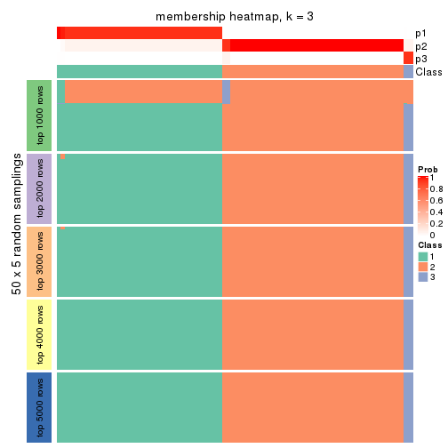</p>

</div>
<div id='tab-CV-hclust-membership-heatmap-3'>
<pre><code class="r">membership_heatmap(res, k = 4)
</code></pre>

<p></p>

</div>
<div id='tab-CV-hclust-membership-heatmap-4'>
<pre><code class="r">membership_heatmap(res, k = 5)
</code></pre>

<p></p>

</div>
<div id='tab-CV-hclust-membership-heatmap-5'>
<pre><code class="r">membership_heatmap(res, k = 6)
</code></pre>

<p></p>

</div>
</div>

As soon as we have had the classes for columns, we can look for signatures
which are significantly different between classes which can be candidate marks
for certain classes. Following are the heatmaps for signatures.


Signature heatmaps where rows are scaled:


<script>
$( function() {
	$( '#tabs-CV-hclust-get-signatures' ).tabs();
} );
</script>
<div id='tabs-CV-hclust-get-signatures'>
<ul>
<li><a href='#tab-CV-hclust-get-signatures-1'>k = 2</a></li>
<li><a href='#tab-CV-hclust-get-signatures-2'>k = 3</a></li>
<li><a href='#tab-CV-hclust-get-signatures-3'>k = 4</a></li>
<li><a href='#tab-CV-hclust-get-signatures-4'>k = 5</a></li>
<li><a href='#tab-CV-hclust-get-signatures-5'>k = 6</a></li>
</ul>
<div id='tab-CV-hclust-get-signatures-1'>
<pre><code class="r">get_signatures(res, k = 2)
</code></pre>

<p></p>

</div>
<div id='tab-CV-hclust-get-signatures-2'>
<pre><code class="r">get_signatures(res, k = 3)
</code></pre>

<p></p>

</div>
<div id='tab-CV-hclust-get-signatures-3'>
<pre><code class="r">get_signatures(res, k = 4)
</code></pre>

<p></p>

</div>
<div id='tab-CV-hclust-get-signatures-4'>
<pre><code class="r">get_signatures(res, k = 5)
</code></pre>

<p></p>

</div>
<div id='tab-CV-hclust-get-signatures-5'>
<pre><code class="r">get_signatures(res, k = 6)
</code></pre>

<p></p>

</div>
</div>


Signature heatmaps where rows are not scaled:


<script>
$( function() {
	$( '#tabs-CV-hclust-get-signatures-no-scale' ).tabs();
} );
</script>
<div id='tabs-CV-hclust-get-signatures-no-scale'>
<ul>
<li><a href='#tab-CV-hclust-get-signatures-no-scale-1'>k = 2</a></li>
<li><a href='#tab-CV-hclust-get-signatures-no-scale-2'>k = 3</a></li>
<li><a href='#tab-CV-hclust-get-signatures-no-scale-3'>k = 4</a></li>
<li><a href='#tab-CV-hclust-get-signatures-no-scale-4'>k = 5</a></li>
<li><a href='#tab-CV-hclust-get-signatures-no-scale-5'>k = 6</a></li>
</ul>
<div id='tab-CV-hclust-get-signatures-no-scale-1'>
<pre><code class="r">get_signatures(res, k = 2, scale_rows = FALSE)
</code></pre>

<p></p>

</div>
<div id='tab-CV-hclust-get-signatures-no-scale-2'>
<pre><code class="r">get_signatures(res, k = 3, scale_rows = FALSE)
</code></pre>

<p></p>

</div>
<div id='tab-CV-hclust-get-signatures-no-scale-3'>
<pre><code class="r">get_signatures(res, k = 4, scale_rows = FALSE)
</code></pre>

<p></p>

</div>
<div id='tab-CV-hclust-get-signatures-no-scale-4'>
<pre><code class="r">get_signatures(res, k = 5, scale_rows = FALSE)
</code></pre>

<p>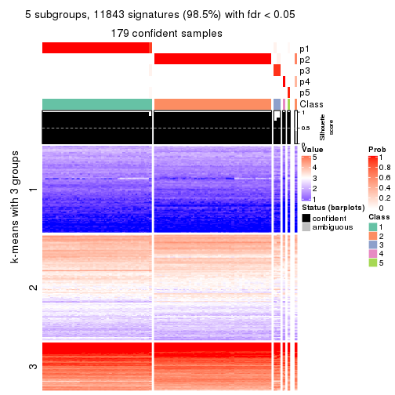</p>

</div>
<div id='tab-CV-hclust-get-signatures-no-scale-5'>
<pre><code class="r">get_signatures(res, k = 6, scale_rows = FALSE)
</code></pre>

<p></p>

</div>
</div>


Compare the overlap of signatures from different k:

```r
compare_signatures(res)
```


`get_signature()` returns a data frame invisibly. TO get the list of signatures, the function
call should be assigned to a variable explicitly. In following code, if `plot` argument is set
to `FALSE`, no heatmap is plotted while only the differential analysis is performed.

```r
# code only for demonstration
tb = get_signature(res, k = ..., plot = FALSE)
```

An example of the output of `tb` is:

```
#>   which_row         fdr    mean_1    mean_2 scaled_mean_1 scaled_mean_2 km
#> 1        38 0.042760348  8.373488  9.131774    -0.5533452     0.5164555  1
#> 2        40 0.018707592  7.106213  8.469186    -0.6173731     0.5762149  1
#> 3        55 0.019134737 10.221463 11.207825    -0.6159697     0.5749050  1
#> 4        59 0.006059896  5.921854  7.869574    -0.6899429     0.6439467  1
#> 5        60 0.018055526  8.928898 10.211722    -0.6204761     0.5791110  1
#> 6        98 0.009384629 15.714769 14.887706     0.6635654    -0.6193277  2
...
```

The columns in `tb` are:

1. `which_row`: row indices corresponding to the input matrix.
2. `fdr`: FDR for the differential test. 
3. `mean_x`: The mean value in group x.
4. `scaled_mean_x`: The mean value in group x after rows are scaled.
5. `km`: Row groups if k-means clustering is applied to rows.


UMAP plot which shows how samples are separated.


<script>
$( function() {
	$( '#tabs-CV-hclust-dimension-reduction' ).tabs();
} );
</script>
<div id='tabs-CV-hclust-dimension-reduction'>
<ul>
<li><a href='#tab-CV-hclust-dimension-reduction-1'>k = 2</a></li>
<li><a href='#tab-CV-hclust-dimension-reduction-2'>k = 3</a></li>
<li><a href='#tab-CV-hclust-dimension-reduction-3'>k = 4</a></li>
<li><a href='#tab-CV-hclust-dimension-reduction-4'>k = 5</a></li>
<li><a href='#tab-CV-hclust-dimension-reduction-5'>k = 6</a></li>
</ul>
<div id='tab-CV-hclust-dimension-reduction-1'>
<pre><code class="r">dimension_reduction(res, k = 2, method = &quot;UMAP&quot;)
</code></pre>

<p></p>

</div>
<div id='tab-CV-hclust-dimension-reduction-2'>
<pre><code class="r">dimension_reduction(res, k = 3, method = &quot;UMAP&quot;)
</code></pre>

<p></p>

</div>
<div id='tab-CV-hclust-dimension-reduction-3'>
<pre><code class="r">dimension_reduction(res, k = 4, method = &quot;UMAP&quot;)
</code></pre>

<p></p>

</div>
<div id='tab-CV-hclust-dimension-reduction-4'>
<pre><code class="r">dimension_reduction(res, k = 5, method = &quot;UMAP&quot;)
</code></pre>

<p></p>

</div>
<div id='tab-CV-hclust-dimension-reduction-5'>
<pre><code class="r">dimension_reduction(res, k = 6, method = &quot;UMAP&quot;)
</code></pre>

<p></p>

</div>
</div>


Following heatmap shows how subgroups are split when increasing `k`:

```r
collect_classes(res)
```


If matrix rows can be associated to genes, consider to use `functional_enrichment(res,
...)` to perform function enrichment for the signature genes. See [this vignette](http://bioconductor.org/packages/devel/bioc/vignettes/cola/inst/doc/functional_enrichment.html) for more detailed explanations.


 

---------------------------------------------------


### CV:kmeans


The object with results only for a single top-value method and a single partition method 
can be extracted as:

```r
res = res_list["CV", "kmeans"]
# you can also extract it by
# res = res_list["CV:kmeans"]
```

A summary of `res` and all the functions that can be applied to it:

```r
res
```

```
#> A 'ConsensusPartition' object with k = 2, 3, 4, 5, 6.
#>   On a matrix with 12029 rows and 181 columns.
#>   Top rows (1000, 2000, 3000, 4000, 5000) are extracted by 'CV' method.
#>   Subgroups are detected by 'kmeans' method.
#>   Performed in total 1250 partitions by row resampling.
#>   Best k for subgroups seems to be 2.
#> 
#> Following methods can be applied to this 'ConsensusPartition' object:
#>  [1] "cola_report"             "collect_classes"         "collect_plots"          
#>  [4] "collect_stats"           "colnames"                "compare_signatures"     
#>  [7] "consensus_heatmap"       "dimension_reduction"     "functional_enrichment"  
#> [10] "get_anno_col"            "get_anno"                "get_classes"            
#> [13] "get_consensus"           "get_matrix"              "get_membership"         
#> [16] "get_param"               "get_signatures"          "get_stats"              
#> [19] "is_best_k"               "is_stable_k"             "membership_heatmap"     
#> [22] "ncol"                    "nrow"                    "plot_ecdf"              
#> [25] "rownames"                "select_partition_number" "show"                   
#> [28] "suggest_best_k"          "test_to_known_factors"
```

`collect_plots()` function collects all the plots made from `res` for all `k` (number of partitions)
into one single page to provide an easy and fast comparison between different `k`.

```r
collect_plots(res)
```

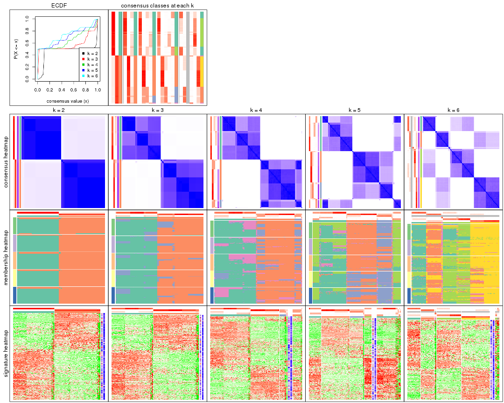

The plots are:

- The first row: a plot of the ECDF (empirical cumulative distribution
  function) curves of the consensus matrix for each `k` and the heatmap of
  predicted classes for each `k`.
- The second row: heatmaps of the consensus matrix for each `k`.
- The third row: heatmaps of the membership matrix for each `k`.
- The fouth row: heatmaps of the signatures for each `k`.

All the plots in panels can be made by individual functions and they are
plotted later in this section.

`select_partition_number()` produces several plots showing different
statistics for choosing "optimized" `k`. There are following statistics:

- ECDF curves of the consensus matrix for each `k`;
- 1-PAC. [The PAC
  score](https://en.wikipedia.org/wiki/Consensus_clustering#Over-interpretation_potential_of_consensus_clustering)
  measures the proportion of the ambiguous subgrouping.
- Mean silhouette score.
- Concordance. The mean probability of fiting the consensus class ids in all
  partitions.
- Area increased. Denote $A_k$ as the area under the ECDF curve for current
  `k`, the area increased is defined as $A_k - A_{k-1}$.
- Rand index. The percent of pairs of samples that are both in a same cluster
  or both are not in a same cluster in the partition of k and k-1.
- Jaccard index. The ratio of pairs of samples are both in a same cluster in
  the partition of k and k-1 and the pairs of samples are both in a same
  cluster in the partition k or k-1.

The detailed explanations of these statistics can be found in [the _cola_
vignette](http://bioconductor.org/packages/devel/bioc/vignettes/cola/inst/doc/cola.html#toc_13).

Generally speaking, lower PAC score, higher mean silhouette score or higher
concordance corresponds to better partition. Rand index and Jaccard index
measure how similar the current partition is compared to partition with `k-1`.
If they are too similar, we won't accept `k` is better than `k-1`.

```r
select_partition_number(res)
```


The numeric values for all these statistics can be obtained by `get_stats()`.

```r
get_stats(res)
```

```
#>   k 1-PAC mean_silhouette concordance area_increased  Rand Jaccard
#> 2 2 0.729           0.988       0.948         0.4592 0.498   0.498
#> 3 3 0.719           0.888       0.886         0.2511 1.000   1.000
#> 4 4 0.644           0.547       0.756         0.1227 0.921   0.841
#> 5 5 0.638           0.583       0.671         0.0789 0.849   0.651
#> 6 6 0.629           0.755       0.748         0.0516 0.934   0.788
```

`suggest_best_k()` suggests the best $k$ based on these statistics. The rules are as follows:

- All $k$ with Jaccard index larger than 0.95 are removed because increasing
  $k$ does not provide enough extra information. If all $k$ are removed, it is
  marked as no subgroup is detected.
- For all $k$ with 1-PAC score larger than 0.9, the maximal $k$ is taken as
  the best $k$, and other $k$ are marked as optional $k$.
- If it does not fit the second rule. The $k$ with the maximal vote of the
  highest 1-PAC score, highest mean silhouette, and highest concordance is
  taken as the best $k$.

```r
suggest_best_k(res)
```

```
#> [1] 2
```


Following shows the table of the partitions (You need to click the **show/hide
code output** link to see it). The membership matrix (columns with name `p*`)
is inferred by
[`clue::cl_consensus()`](https://www.rdocumentation.org/link/cl_consensus?package=clue)
function with the `SE` method. Basically the value in the membership matrix
represents the probability to belong to a certain group. The finall class
label for an item is determined with the group with highest probability it
belongs to.

In `get_classes()` function, the entropy is calculated from the membership
matrix and the silhouette score is calculated from the consensus matrix.


<script>
$( function() {
	$( '#tabs-CV-kmeans-get-classes' ).tabs();
} );
</script>
<div id='tabs-CV-kmeans-get-classes'>
<ul>
<li><a href='#tab-CV-kmeans-get-classes-1'>k = 2</a></li>
<li><a href='#tab-CV-kmeans-get-classes-2'>k = 3</a></li>
<li><a href='#tab-CV-kmeans-get-classes-3'>k = 4</a></li>
<li><a href='#tab-CV-kmeans-get-classes-4'>k = 5</a></li>
<li><a href='#tab-CV-kmeans-get-classes-5'>k = 6</a></li>
</ul>

<div id='tab-CV-kmeans-get-classes-1'>
<p><a id='tab-CV-kmeans-get-classes-1-a' style='color:#0366d6' href='#'>show/hide code output</a></p>
<pre><code class="r">cbind(get_classes(res, k = 2), get_membership(res, k = 2))
</code></pre>

<pre><code>#&gt;           class entropy silhouette    p1    p2
#&gt; SRR315112     2  0.3584      0.964 0.068 0.932
#&gt; SRR315113     1  0.2423      0.964 0.960 0.040
#&gt; SRR315114     1  0.2423      0.964 0.960 0.040
#&gt; SRR315115     2  0.3584      0.964 0.068 0.932
#&gt; SRR315116     2  0.3584      0.964 0.068 0.932
#&gt; SRR566986     2  0.4939      0.992 0.108 0.892
#&gt; SRR566987     2  0.4939      0.992 0.108 0.892
#&gt; SRR566988     2  0.4939      0.992 0.108 0.892
#&gt; SRR566989     2  0.4939      0.992 0.108 0.892
#&gt; SRR566990     2  0.4939      0.992 0.108 0.892
#&gt; SRR566991     2  0.4939      0.992 0.108 0.892
#&gt; SRR566992     2  0.4939      0.992 0.108 0.892
#&gt; SRR566993     2  0.4939      0.992 0.108 0.892
#&gt; SRR566994     2  0.4939      0.992 0.108 0.892
#&gt; SRR566995     2  0.4939      0.992 0.108 0.892
#&gt; SRR566996     2  0.4939      0.992 0.108 0.892
#&gt; SRR566997     2  0.4939      0.992 0.108 0.892
#&gt; SRR566998     2  0.4939      0.992 0.108 0.892
#&gt; SRR566999     2  0.4939      0.992 0.108 0.892
#&gt; SRR567000     2  0.4939      0.992 0.108 0.892
#&gt; SRR567001     2  0.4939      0.992 0.108 0.892
#&gt; SRR567002     2  0.4939      0.992 0.108 0.892
#&gt; SRR567003     2  0.4939      0.992 0.108 0.892
#&gt; SRR567004     2  0.4939      0.992 0.108 0.892
#&gt; SRR567005     2  0.4939      0.992 0.108 0.892
#&gt; SRR567006     2  0.4939      0.992 0.108 0.892
#&gt; SRR567007     2  0.4939      0.992 0.108 0.892
#&gt; SRR567008     2  0.4939      0.992 0.108 0.892
#&gt; SRR567009     2  0.4939      0.992 0.108 0.892
#&gt; SRR567010     2  0.4939      0.992 0.108 0.892
#&gt; SRR567011     2  0.4939      0.992 0.108 0.892
#&gt; SRR567012     2  0.4939      0.992 0.108 0.892
#&gt; SRR567013     2  0.4939      0.992 0.108 0.892
#&gt; SRR567014     2  0.4562      0.988 0.096 0.904
#&gt; SRR567015     2  0.4562      0.988 0.096 0.904
#&gt; SRR567016     2  0.4562      0.988 0.096 0.904
#&gt; SRR567017     2  0.4562      0.988 0.096 0.904
#&gt; SRR567018     2  0.4562      0.988 0.096 0.904
#&gt; SRR567019     2  0.4562      0.988 0.096 0.904
#&gt; SRR567020     2  0.4562      0.988 0.096 0.904
#&gt; SRR567021     2  0.4562      0.988 0.096 0.904
#&gt; SRR567022     2  0.2423      0.937 0.040 0.960
#&gt; SRR567023     2  0.4562      0.988 0.096 0.904
#&gt; SRR567024     2  0.4562      0.988 0.096 0.904
#&gt; SRR567025     2  0.4562      0.988 0.096 0.904
#&gt; SRR567026     2  0.4562      0.988 0.096 0.904
#&gt; SRR567027     2  0.4562      0.988 0.096 0.904
#&gt; SRR567028     2  0.4562      0.988 0.096 0.904
#&gt; SRR567029     2  0.4562      0.988 0.096 0.904
#&gt; SRR567030     2  0.4562      0.988 0.096 0.904
#&gt; SRR567031     2  0.4562      0.988 0.096 0.904
#&gt; SRR567032     2  0.4562      0.988 0.096 0.904
#&gt; SRR567033     2  0.4562      0.988 0.096 0.904
#&gt; SRR567034     2  0.4562      0.988 0.096 0.904
#&gt; SRR567035     2  0.4562      0.988 0.096 0.904
#&gt; SRR567036     2  0.4562      0.988 0.096 0.904
#&gt; SRR567037     2  0.4562      0.988 0.096 0.904
#&gt; SRR567038     2  0.4562      0.988 0.096 0.904
#&gt; SRR567039     2  0.4562      0.988 0.096 0.904
#&gt; SRR567040     2  0.4562      0.988 0.096 0.904
#&gt; SRR567041     2  0.4562      0.988 0.096 0.904
#&gt; SRR567042     2  0.2423      0.937 0.040 0.960
#&gt; SRR567043     2  0.4562      0.988 0.096 0.904
#&gt; SRR567044     2  0.4939      0.992 0.108 0.892
#&gt; SRR567045     2  0.4939      0.992 0.108 0.892
#&gt; SRR567046     2  0.4939      0.992 0.108 0.892
#&gt; SRR567047     2  0.4939      0.992 0.108 0.892
#&gt; SRR567048     2  0.4939      0.992 0.108 0.892
#&gt; SRR567049     2  0.4939      0.992 0.108 0.892
#&gt; SRR567050     2  0.4939      0.992 0.108 0.892
#&gt; SRR567051     2  0.4939      0.992 0.108 0.892
#&gt; SRR567052     2  0.4939      0.992 0.108 0.892
#&gt; SRR567053     2  0.4939      0.992 0.108 0.892
#&gt; SRR567054     2  0.4939      0.992 0.108 0.892
#&gt; SRR567055     2  0.4939      0.992 0.108 0.892
#&gt; SRR567056     2  0.4939      0.992 0.108 0.892
#&gt; SRR567057     2  0.4939      0.992 0.108 0.892
#&gt; SRR567058     2  0.4939      0.992 0.108 0.892
#&gt; SRR567059     2  0.4939      0.992 0.108 0.892
#&gt; SRR567060     2  0.4939      0.992 0.108 0.892
#&gt; SRR567061     2  0.4939      0.992 0.108 0.892
#&gt; SRR567062     2  0.4939      0.992 0.108 0.892
#&gt; SRR567063     2  0.4939      0.992 0.108 0.892
#&gt; SRR567064     2  0.4939      0.992 0.108 0.892
#&gt; SRR567065     2  0.4939      0.992 0.108 0.892
#&gt; SRR567066     2  0.4939      0.992 0.108 0.892
#&gt; SRR567067     2  0.4939      0.992 0.108 0.892
#&gt; SRR567068     2  0.4939      0.992 0.108 0.892
#&gt; SRR567069     2  0.4939      0.992 0.108 0.892
#&gt; SRR567070     2  0.4939      0.992 0.108 0.892
#&gt; SRR567071     2  0.4939      0.992 0.108 0.892
#&gt; SRR567072     2  0.4939      0.992 0.108 0.892
#&gt; SRR567073     2  0.4939      0.992 0.108 0.892
#&gt; SRR567074     2  0.4939      0.992 0.108 0.892
#&gt; SRR567075     2  0.4939      0.992 0.108 0.892
#&gt; SRR567076     1  0.0000      0.993 1.000 0.000
#&gt; SRR567077     1  0.0000      0.993 1.000 0.000
#&gt; SRR567078     1  0.0000      0.993 1.000 0.000
#&gt; SRR567079     1  0.0000      0.993 1.000 0.000
#&gt; SRR567080     1  0.0000      0.993 1.000 0.000
#&gt; SRR567081     1  0.0000      0.993 1.000 0.000
#&gt; SRR567082     1  0.0000      0.993 1.000 0.000
#&gt; SRR567083     1  0.0000      0.993 1.000 0.000
#&gt; SRR567084     1  0.0000      0.993 1.000 0.000
#&gt; SRR567085     1  0.0000      0.993 1.000 0.000
#&gt; SRR567086     1  0.0000      0.993 1.000 0.000
#&gt; SRR567087     1  0.0000      0.993 1.000 0.000
#&gt; SRR567088     1  0.0000      0.993 1.000 0.000
#&gt; SRR567089     1  0.0000      0.993 1.000 0.000
#&gt; SRR567090     1  0.0000      0.993 1.000 0.000
#&gt; SRR567091     1  0.0000      0.993 1.000 0.000
#&gt; SRR567092     1  0.0000      0.993 1.000 0.000
#&gt; SRR567093     1  0.0000      0.993 1.000 0.000
#&gt; SRR567094     1  0.0000      0.993 1.000 0.000
#&gt; SRR567095     1  0.0000      0.993 1.000 0.000
#&gt; SRR567096     1  0.0000      0.993 1.000 0.000
#&gt; SRR567097     1  0.0000      0.993 1.000 0.000
#&gt; SRR567098     1  0.0000      0.993 1.000 0.000
#&gt; SRR567099     1  0.0000      0.993 1.000 0.000
#&gt; SRR567100     1  0.0000      0.993 1.000 0.000
#&gt; SRR567101     1  0.0000      0.993 1.000 0.000
#&gt; SRR567102     1  0.2423      0.958 0.960 0.040
#&gt; SRR567103     1  0.2423      0.958 0.960 0.040
#&gt; SRR567104     1  0.0000      0.993 1.000 0.000
#&gt; SRR567105     1  0.0000      0.993 1.000 0.000
#&gt; SRR567106     1  0.0000      0.993 1.000 0.000
#&gt; SRR567107     1  0.0000      0.993 1.000 0.000
#&gt; SRR567108     1  0.0000      0.993 1.000 0.000
#&gt; SRR567109     1  0.0000      0.993 1.000 0.000
#&gt; SRR567110     1  0.0000      0.993 1.000 0.000
#&gt; SRR567111     1  0.0000      0.993 1.000 0.000
#&gt; SRR567112     1  0.0000      0.993 1.000 0.000
#&gt; SRR567113     1  0.0000      0.993 1.000 0.000
#&gt; SRR567114     1  0.0000      0.993 1.000 0.000
#&gt; SRR567115     1  0.0000      0.993 1.000 0.000
#&gt; SRR567116     1  0.0000      0.993 1.000 0.000
#&gt; SRR567117     1  0.0000      0.993 1.000 0.000
#&gt; SRR567118     1  0.0000      0.993 1.000 0.000
#&gt; SRR567119     1  0.0000      0.993 1.000 0.000
#&gt; SRR567120     1  0.0000      0.993 1.000 0.000
#&gt; SRR567121     1  0.0000      0.993 1.000 0.000
#&gt; SRR567122     1  0.0000      0.993 1.000 0.000
#&gt; SRR567123     1  0.0000      0.993 1.000 0.000
#&gt; SRR567124     1  0.0000      0.993 1.000 0.000
#&gt; SRR567125     1  0.0000      0.993 1.000 0.000
#&gt; SRR567126     1  0.0000      0.993 1.000 0.000
#&gt; SRR567127     1  0.0000      0.993 1.000 0.000
#&gt; SRR567128     1  0.0000      0.993 1.000 0.000
#&gt; SRR567129     1  0.0000      0.993 1.000 0.000
#&gt; SRR567130     1  0.0000      0.993 1.000 0.000
#&gt; SRR567131     1  0.0000      0.993 1.000 0.000
#&gt; SRR567132     1  0.0000      0.993 1.000 0.000
#&gt; SRR567133     1  0.0000      0.993 1.000 0.000
#&gt; SRR567134     1  0.0938      0.988 0.988 0.012
#&gt; SRR567135     1  0.0938      0.988 0.988 0.012
#&gt; SRR567136     1  0.2236      0.962 0.964 0.036
#&gt; SRR567137     1  0.0938      0.988 0.988 0.012
#&gt; SRR567138     1  0.0938      0.988 0.988 0.012
#&gt; SRR567139     1  0.0938      0.988 0.988 0.012
#&gt; SRR567140     1  0.0938      0.988 0.988 0.012
#&gt; SRR567141     1  0.0938      0.988 0.988 0.012
#&gt; SRR567142     1  0.0938      0.988 0.988 0.012
#&gt; SRR567143     1  0.0938      0.988 0.988 0.012
#&gt; SRR567144     1  0.0938      0.988 0.988 0.012
#&gt; SRR567145     1  0.0938      0.988 0.988 0.012
#&gt; SRR567146     2  0.2423      0.929 0.040 0.960
#&gt; SRR567147     1  0.0938      0.988 0.988 0.012
#&gt; SRR567148     1  0.0938      0.988 0.988 0.012
#&gt; SRR567149     1  0.0938      0.988 0.988 0.012
#&gt; SRR567150     1  0.0938      0.988 0.988 0.012
#&gt; SRR567151     1  0.0938      0.988 0.988 0.012
#&gt; SRR567152     1  0.0938      0.988 0.988 0.012
#&gt; SRR567153     1  0.0938      0.988 0.988 0.012
#&gt; SRR567154     1  0.0938      0.988 0.988 0.012
#&gt; SRR567155     1  0.0938      0.988 0.988 0.012
#&gt; SRR567156     1  0.0938      0.988 0.988 0.012
#&gt; SRR567157     1  0.0938      0.988 0.988 0.012
#&gt; SRR567158     1  0.0938      0.988 0.988 0.012
#&gt; SRR567159     1  0.2236      0.962 0.964 0.036
#&gt; SRR567160     1  0.0938      0.988 0.988 0.012
#&gt; SRR567161     2  0.2423      0.929 0.040 0.960
</code></pre>

<script>
$('#tab-CV-kmeans-get-classes-1-a').parent().next().next().hide();
$('#tab-CV-kmeans-get-classes-1-a').click(function(){
  $('#tab-CV-kmeans-get-classes-1-a').parent().next().next().toggle();
  return(false);
});
</script>
</div>

<div id='tab-CV-kmeans-get-classes-2'>
<p><a id='tab-CV-kmeans-get-classes-2-a' style='color:#0366d6' href='#'>show/hide code output</a></p>
<pre><code class="r">cbind(get_classes(res, k = 3), get_membership(res, k = 3))
</code></pre>

<pre><code>#&gt;           class entropy silhouette    p1    p2    p3
#&gt; SRR315112     2  0.6180      0.769 0.008 0.660 0.332
#&gt; SRR315113     1  0.6373      0.732 0.588 0.004 0.408
#&gt; SRR315114     1  0.6282      0.746 0.612 0.004 0.384
#&gt; SRR315115     2  0.6180      0.769 0.008 0.660 0.332
#&gt; SRR315116     2  0.6180      0.769 0.008 0.660 0.332
#&gt; SRR566986     2  0.0424      0.932 0.000 0.992 0.008
#&gt; SRR566987     2  0.0424      0.932 0.000 0.992 0.008
#&gt; SRR566988     2  0.0237      0.932 0.000 0.996 0.004
#&gt; SRR566989     2  0.0424      0.932 0.000 0.992 0.008
#&gt; SRR566990     2  0.0424      0.932 0.000 0.992 0.008
#&gt; SRR566991     2  0.0237      0.932 0.000 0.996 0.004
#&gt; SRR566992     2  0.0424      0.932 0.000 0.992 0.008
#&gt; SRR566993     2  0.0237      0.932 0.000 0.996 0.004
#&gt; SRR566994     2  0.0237      0.932 0.000 0.996 0.004
#&gt; SRR566995     2  0.0592      0.932 0.000 0.988 0.012
#&gt; SRR566996     2  0.0424      0.932 0.000 0.992 0.008
#&gt; SRR566997     2  0.0237      0.932 0.000 0.996 0.004
#&gt; SRR566998     2  0.0592      0.932 0.000 0.988 0.012
#&gt; SRR566999     2  0.0237      0.932 0.000 0.996 0.004
#&gt; SRR567000     2  0.0237      0.932 0.000 0.996 0.004
#&gt; SRR567001     2  0.0237      0.932 0.000 0.996 0.004
#&gt; SRR567002     2  0.0237      0.932 0.000 0.996 0.004
#&gt; SRR567003     2  0.0237      0.932 0.000 0.996 0.004
#&gt; SRR567004     2  0.0592      0.932 0.000 0.988 0.012
#&gt; SRR567005     2  0.0237      0.932 0.000 0.996 0.004
#&gt; SRR567006     2  0.0237      0.932 0.000 0.996 0.004
#&gt; SRR567007     2  0.0237      0.932 0.000 0.996 0.004
#&gt; SRR567008     2  0.0237      0.932 0.000 0.996 0.004
#&gt; SRR567009     2  0.0237      0.932 0.000 0.996 0.004
#&gt; SRR567010     2  0.0237      0.932 0.000 0.996 0.004
#&gt; SRR567011     2  0.0424      0.932 0.000 0.992 0.008
#&gt; SRR567012     2  0.0424      0.932 0.000 0.992 0.008
#&gt; SRR567013     2  0.0592      0.932 0.000 0.988 0.012
#&gt; SRR567014     2  0.4291      0.894 0.008 0.840 0.152
#&gt; SRR567015     2  0.4291      0.894 0.008 0.840 0.152
#&gt; SRR567016     2  0.4228      0.895 0.008 0.844 0.148
#&gt; SRR567017     2  0.4228      0.895 0.008 0.844 0.148
#&gt; SRR567018     2  0.4228      0.895 0.008 0.844 0.148
#&gt; SRR567019     2  0.4228      0.895 0.008 0.844 0.148
#&gt; SRR567020     2  0.4228      0.895 0.008 0.844 0.148
#&gt; SRR567021     2  0.4228      0.895 0.008 0.844 0.148
#&gt; SRR567022     2  0.5397      0.805 0.000 0.720 0.280
#&gt; SRR567023     2  0.4228      0.895 0.008 0.844 0.148
#&gt; SRR567024     2  0.4228      0.895 0.008 0.844 0.148
#&gt; SRR567025     2  0.4291      0.894 0.008 0.840 0.152
#&gt; SRR567026     2  0.4291      0.894 0.008 0.840 0.152
#&gt; SRR567027     2  0.4291      0.894 0.008 0.840 0.152
#&gt; SRR567028     2  0.4291      0.894 0.008 0.840 0.152
#&gt; SRR567029     2  0.4291      0.894 0.008 0.840 0.152
#&gt; SRR567030     2  0.4228      0.895 0.008 0.844 0.148
#&gt; SRR567031     2  0.4291      0.894 0.008 0.840 0.152
#&gt; SRR567032     2  0.4228      0.895 0.008 0.844 0.148
#&gt; SRR567033     2  0.4228      0.895 0.008 0.844 0.148
#&gt; SRR567034     2  0.4291      0.894 0.008 0.840 0.152
#&gt; SRR567035     2  0.4228      0.895 0.008 0.844 0.148
#&gt; SRR567036     2  0.4228      0.895 0.008 0.844 0.148
#&gt; SRR567037     2  0.4228      0.895 0.008 0.844 0.148
#&gt; SRR567038     2  0.4228      0.895 0.008 0.844 0.148
#&gt; SRR567039     2  0.4291      0.894 0.008 0.840 0.152
#&gt; SRR567040     2  0.4228      0.895 0.008 0.844 0.148
#&gt; SRR567041     2  0.4228      0.895 0.008 0.844 0.148
#&gt; SRR567042     2  0.5397      0.805 0.000 0.720 0.280
#&gt; SRR567043     2  0.4228      0.895 0.008 0.844 0.148
#&gt; SRR567044     2  0.1643      0.929 0.000 0.956 0.044
#&gt; SRR567045     2  0.1643      0.929 0.000 0.956 0.044
#&gt; SRR567046     2  0.1529      0.930 0.000 0.960 0.040
#&gt; SRR567047     2  0.1529      0.930 0.000 0.960 0.040
#&gt; SRR567048     2  0.1643      0.929 0.000 0.956 0.044
#&gt; SRR567049     2  0.1529      0.930 0.000 0.960 0.040
#&gt; SRR567050     2  0.1643      0.929 0.000 0.956 0.044
#&gt; SRR567051     2  0.1529      0.930 0.000 0.960 0.040
#&gt; SRR567052     2  0.1529      0.930 0.000 0.960 0.040
#&gt; SRR567053     2  0.1643      0.929 0.000 0.956 0.044
#&gt; SRR567054     2  0.1529      0.930 0.000 0.960 0.040
#&gt; SRR567055     2  0.1529      0.930 0.000 0.960 0.040
#&gt; SRR567056     2  0.1529      0.930 0.000 0.960 0.040
#&gt; SRR567057     2  0.1529      0.930 0.000 0.960 0.040
#&gt; SRR567058     2  0.1643      0.929 0.000 0.956 0.044
#&gt; SRR567059     2  0.1643      0.929 0.000 0.956 0.044
#&gt; SRR567060     2  0.1643      0.929 0.000 0.956 0.044
#&gt; SRR567061     2  0.1529      0.930 0.000 0.960 0.040
#&gt; SRR567062     2  0.1643      0.929 0.000 0.956 0.044
#&gt; SRR567063     2  0.1643      0.929 0.000 0.956 0.044
#&gt; SRR567064     2  0.1643      0.929 0.000 0.956 0.044
#&gt; SRR567065     2  0.1643      0.929 0.000 0.956 0.044
#&gt; SRR567066     2  0.1643      0.929 0.000 0.956 0.044
#&gt; SRR567067     2  0.1643      0.929 0.000 0.956 0.044
#&gt; SRR567068     2  0.1529      0.930 0.000 0.960 0.040
#&gt; SRR567069     2  0.1529      0.930 0.000 0.960 0.040
#&gt; SRR567070     2  0.1643      0.929 0.000 0.956 0.044
#&gt; SRR567071     2  0.1643      0.929 0.000 0.956 0.044
#&gt; SRR567072     2  0.1643      0.929 0.000 0.956 0.044
#&gt; SRR567073     2  0.1529      0.930 0.000 0.960 0.040
#&gt; SRR567074     2  0.1529      0.930 0.000 0.960 0.040
#&gt; SRR567075     2  0.1643      0.929 0.000 0.956 0.044
#&gt; SRR567076     1  0.0829      0.894 0.984 0.012 0.004
#&gt; SRR567077     1  0.0592      0.894 0.988 0.012 0.000
#&gt; SRR567078     1  0.1482      0.894 0.968 0.012 0.020
#&gt; SRR567079     1  0.1337      0.894 0.972 0.012 0.016
#&gt; SRR567080     1  0.1482      0.894 0.968 0.012 0.020
#&gt; SRR567081     1  0.1015      0.894 0.980 0.012 0.008
#&gt; SRR567082     1  0.0592      0.894 0.988 0.012 0.000
#&gt; SRR567083     1  0.1182      0.894 0.976 0.012 0.012
#&gt; SRR567084     1  0.0592      0.894 0.988 0.012 0.000
#&gt; SRR567085     1  0.1015      0.894 0.980 0.012 0.008
#&gt; SRR567086     1  0.0829      0.894 0.984 0.012 0.004
#&gt; SRR567087     1  0.0592      0.894 0.988 0.012 0.000
#&gt; SRR567088     1  0.1182      0.894 0.976 0.012 0.012
#&gt; SRR567089     1  0.0592      0.894 0.988 0.012 0.000
#&gt; SRR567090     1  0.1182      0.894 0.976 0.012 0.012
#&gt; SRR567091     1  0.1482      0.894 0.968 0.012 0.020
#&gt; SRR567092     1  0.1015      0.894 0.980 0.012 0.008
#&gt; SRR567093     1  0.1337      0.894 0.972 0.012 0.016
#&gt; SRR567094     1  0.1015      0.894 0.980 0.012 0.008
#&gt; SRR567095     1  0.0829      0.894 0.984 0.012 0.004
#&gt; SRR567096     1  0.1337      0.894 0.972 0.012 0.016
#&gt; SRR567097     1  0.1182      0.894 0.976 0.012 0.012
#&gt; SRR567098     1  0.1337      0.894 0.972 0.012 0.016
#&gt; SRR567099     1  0.1015      0.894 0.980 0.012 0.008
#&gt; SRR567100     1  0.1015      0.894 0.980 0.012 0.008
#&gt; SRR567101     1  0.0829      0.894 0.984 0.012 0.004
#&gt; SRR567102     1  0.4796      0.837 0.780 0.000 0.220
#&gt; SRR567103     1  0.4796      0.837 0.780 0.000 0.220
#&gt; SRR567104     1  0.1482      0.894 0.968 0.012 0.020
#&gt; SRR567105     1  0.0592      0.894 0.988 0.012 0.000
#&gt; SRR567106     1  0.5220      0.856 0.780 0.012 0.208
#&gt; SRR567107     1  0.5268      0.855 0.776 0.012 0.212
#&gt; SRR567108     1  0.5220      0.856 0.780 0.012 0.208
#&gt; SRR567109     1  0.5220      0.856 0.780 0.012 0.208
#&gt; SRR567110     1  0.5220      0.856 0.780 0.012 0.208
#&gt; SRR567111     1  0.5220      0.856 0.780 0.012 0.208
#&gt; SRR567112     1  0.5268      0.855 0.776 0.012 0.212
#&gt; SRR567113     1  0.5220      0.856 0.780 0.012 0.208
#&gt; SRR567114     1  0.5220      0.856 0.780 0.012 0.208
#&gt; SRR567115     1  0.5268      0.855 0.776 0.012 0.212
#&gt; SRR567116     1  0.5268      0.855 0.776 0.012 0.212
#&gt; SRR567117     1  0.5220      0.856 0.780 0.012 0.208
#&gt; SRR567118     1  0.5268      0.855 0.776 0.012 0.212
#&gt; SRR567119     1  0.5220      0.856 0.780 0.012 0.208
#&gt; SRR567120     1  0.5220      0.856 0.780 0.012 0.208
#&gt; SRR567121     1  0.5220      0.856 0.780 0.012 0.208
#&gt; SRR567122     1  0.5220      0.856 0.780 0.012 0.208
#&gt; SRR567123     1  0.5220      0.856 0.780 0.012 0.208
#&gt; SRR567124     1  0.5268      0.855 0.776 0.012 0.212
#&gt; SRR567125     1  0.5268      0.855 0.776 0.012 0.212
#&gt; SRR567126     1  0.5220      0.856 0.780 0.012 0.208
#&gt; SRR567127     1  0.5220      0.856 0.780 0.012 0.208
#&gt; SRR567128     1  0.5268      0.855 0.776 0.012 0.212
#&gt; SRR567129     1  0.5220      0.856 0.780 0.012 0.208
#&gt; SRR567130     1  0.5220      0.856 0.780 0.012 0.208
#&gt; SRR567131     1  0.5220      0.856 0.780 0.012 0.208
#&gt; SRR567132     1  0.5220      0.856 0.780 0.012 0.208
#&gt; SRR567133     1  0.5220      0.856 0.780 0.012 0.208
#&gt; SRR567134     1  0.4233      0.865 0.836 0.004 0.160
#&gt; SRR567135     1  0.4293      0.864 0.832 0.004 0.164
#&gt; SRR567136     1  0.5291      0.814 0.732 0.000 0.268
#&gt; SRR567137     1  0.4233      0.865 0.836 0.004 0.160
#&gt; SRR567138     1  0.4233      0.865 0.836 0.004 0.160
#&gt; SRR567139     1  0.4233      0.865 0.836 0.004 0.160
#&gt; SRR567140     1  0.4293      0.864 0.832 0.004 0.164
#&gt; SRR567141     1  0.4293      0.864 0.832 0.004 0.164
#&gt; SRR567142     1  0.4233      0.865 0.836 0.004 0.160
#&gt; SRR567143     1  0.4233      0.865 0.836 0.004 0.160
#&gt; SRR567144     1  0.4233      0.865 0.836 0.004 0.160
#&gt; SRR567145     1  0.4293      0.864 0.832 0.004 0.164
#&gt; SRR567146     2  0.5650      0.732 0.000 0.688 0.312
#&gt; SRR567147     1  0.4233      0.865 0.836 0.004 0.160
#&gt; SRR567148     1  0.4233      0.865 0.836 0.004 0.160
#&gt; SRR567149     1  0.4233      0.865 0.836 0.004 0.160
#&gt; SRR567150     1  0.4233      0.865 0.836 0.004 0.160
#&gt; SRR567151     1  0.4233      0.865 0.836 0.004 0.160
#&gt; SRR567152     1  0.4233      0.865 0.836 0.004 0.160
#&gt; SRR567153     1  0.4293      0.864 0.832 0.004 0.164
#&gt; SRR567154     1  0.4233      0.865 0.836 0.004 0.160
#&gt; SRR567155     1  0.4233      0.865 0.836 0.004 0.160
#&gt; SRR567156     1  0.4233      0.865 0.836 0.004 0.160
#&gt; SRR567157     1  0.4233      0.865 0.836 0.004 0.160
#&gt; SRR567158     1  0.4293      0.864 0.832 0.004 0.164
#&gt; SRR567159     1  0.5291      0.814 0.732 0.000 0.268
#&gt; SRR567160     1  0.4233      0.865 0.836 0.004 0.160
#&gt; SRR567161     2  0.5650      0.732 0.000 0.688 0.312
</code></pre>

<script>
$('#tab-CV-kmeans-get-classes-2-a').parent().next().next().hide();
$('#tab-CV-kmeans-get-classes-2-a').click(function(){
  $('#tab-CV-kmeans-get-classes-2-a').parent().next().next().toggle();
  return(false);
});
</script>
</div>

<div id='tab-CV-kmeans-get-classes-3'>
<p><a id='tab-CV-kmeans-get-classes-3-a' style='color:#0366d6' href='#'>show/hide code output</a></p>
<pre><code class="r">cbind(get_classes(res, k = 4), get_membership(res, k = 4))
</code></pre>

<pre><code>#&gt;           class entropy silhouette    p1    p2    p3    p4
#&gt; SRR315112     3  0.7083      0.526 0.000 0.328 0.528 0.144
#&gt; SRR315113     1  0.7517      0.499 0.484 0.000 0.304 0.212
#&gt; SRR315114     1  0.7442      0.531 0.504 0.000 0.284 0.212
#&gt; SRR315115     3  0.7083      0.526 0.000 0.328 0.528 0.144
#&gt; SRR315116     3  0.7083      0.526 0.000 0.328 0.528 0.144
#&gt; SRR566986     2  0.3486      0.648 0.000 0.864 0.092 0.044
#&gt; SRR566987     2  0.3245      0.649 0.000 0.872 0.100 0.028
#&gt; SRR566988     2  0.3015      0.650 0.000 0.884 0.092 0.024
#&gt; SRR566989     2  0.3372      0.649 0.000 0.868 0.096 0.036
#&gt; SRR566990     2  0.3245      0.646 0.000 0.872 0.100 0.028
#&gt; SRR566991     2  0.3674      0.637 0.000 0.852 0.104 0.044
#&gt; SRR566992     2  0.3372      0.649 0.000 0.868 0.096 0.036
#&gt; SRR566993     2  0.3497      0.643 0.000 0.860 0.104 0.036
#&gt; SRR566994     2  0.3647      0.636 0.000 0.852 0.108 0.040
#&gt; SRR566995     2  0.3435      0.646 0.000 0.864 0.100 0.036
#&gt; SRR566996     2  0.3486      0.648 0.000 0.864 0.092 0.044
#&gt; SRR566997     2  0.3497      0.643 0.000 0.860 0.104 0.036
#&gt; SRR566998     2  0.3435      0.646 0.000 0.864 0.100 0.036
#&gt; SRR566999     2  0.3464      0.639 0.000 0.860 0.108 0.032
#&gt; SRR567000     2  0.3486      0.650 0.000 0.864 0.092 0.044
#&gt; SRR567001     2  0.3464      0.641 0.000 0.860 0.108 0.032
#&gt; SRR567002     2  0.3616      0.631 0.000 0.852 0.112 0.036
#&gt; SRR567003     2  0.3674      0.637 0.000 0.852 0.104 0.044
#&gt; SRR567004     2  0.3215      0.651 0.000 0.876 0.092 0.032
#&gt; SRR567005     2  0.3015      0.650 0.000 0.884 0.092 0.024
#&gt; SRR567006     2  0.3486      0.650 0.000 0.864 0.092 0.044
#&gt; SRR567007     2  0.3616      0.631 0.000 0.852 0.112 0.036
#&gt; SRR567008     2  0.3464      0.641 0.000 0.860 0.108 0.032
#&gt; SRR567009     2  0.3647      0.636 0.000 0.852 0.108 0.040
#&gt; SRR567010     2  0.3464      0.639 0.000 0.860 0.108 0.032
#&gt; SRR567011     2  0.3245      0.646 0.000 0.872 0.100 0.028
#&gt; SRR567012     2  0.3245      0.649 0.000 0.872 0.100 0.028
#&gt; SRR567013     2  0.3215      0.651 0.000 0.876 0.092 0.032
#&gt; SRR567014     2  0.5168     -0.849 0.000 0.504 0.492 0.004
#&gt; SRR567015     3  0.5168      0.841 0.000 0.496 0.500 0.004
#&gt; SRR567016     3  0.5168      0.840 0.000 0.492 0.504 0.004
#&gt; SRR567017     3  0.5168      0.842 0.000 0.496 0.500 0.004
#&gt; SRR567018     2  0.5168     -0.851 0.000 0.500 0.496 0.004
#&gt; SRR567019     2  0.5168     -0.851 0.000 0.500 0.496 0.004
#&gt; SRR567020     3  0.5168      0.840 0.000 0.492 0.504 0.004
#&gt; SRR567021     3  0.5296      0.841 0.000 0.496 0.496 0.008
#&gt; SRR567022     2  0.7415     -0.507 0.000 0.500 0.196 0.304
#&gt; SRR567023     3  0.5168      0.842 0.000 0.496 0.500 0.004
#&gt; SRR567024     2  0.5168     -0.850 0.000 0.500 0.496 0.004
#&gt; SRR567025     2  0.5168     -0.849 0.000 0.504 0.492 0.004
#&gt; SRR567026     2  0.5168     -0.845 0.000 0.500 0.496 0.004
#&gt; SRR567027     2  0.5168     -0.845 0.000 0.500 0.496 0.004
#&gt; SRR567028     3  0.5000      0.842 0.000 0.500 0.500 0.000
#&gt; SRR567029     2  0.5168     -0.845 0.000 0.500 0.496 0.004
#&gt; SRR567030     2  0.5168     -0.852 0.000 0.500 0.496 0.004
#&gt; SRR567031     2  0.5168     -0.845 0.000 0.500 0.496 0.004
#&gt; SRR567032     2  0.5168     -0.852 0.000 0.500 0.496 0.004
#&gt; SRR567033     3  0.5296      0.841 0.000 0.496 0.496 0.008
#&gt; SRR567034     3  0.5000      0.842 0.000 0.500 0.500 0.000
#&gt; SRR567035     2  0.5168     -0.846 0.000 0.500 0.496 0.004
#&gt; SRR567036     2  0.5168     -0.850 0.000 0.500 0.496 0.004
#&gt; SRR567037     3  0.5000      0.839 0.000 0.500 0.500 0.000
#&gt; SRR567038     2  0.5000     -0.852 0.000 0.500 0.500 0.000
#&gt; SRR567039     3  0.5168      0.841 0.000 0.496 0.500 0.004
#&gt; SRR567040     2  0.5296     -0.851 0.000 0.500 0.492 0.008
#&gt; SRR567041     2  0.5296     -0.851 0.000 0.500 0.492 0.008
#&gt; SRR567042     2  0.7415     -0.507 0.000 0.500 0.196 0.304
#&gt; SRR567043     2  0.5168     -0.846 0.000 0.500 0.496 0.004
#&gt; SRR567044     2  0.0657      0.673 0.000 0.984 0.004 0.012
#&gt; SRR567045     2  0.0188      0.673 0.000 0.996 0.000 0.004
#&gt; SRR567046     2  0.0188      0.673 0.000 0.996 0.004 0.000
#&gt; SRR567047     2  0.0376      0.673 0.000 0.992 0.004 0.004
#&gt; SRR567048     2  0.0817      0.671 0.000 0.976 0.000 0.024
#&gt; SRR567049     2  0.0188      0.673 0.000 0.996 0.004 0.000
#&gt; SRR567050     2  0.0657      0.673 0.000 0.984 0.004 0.012
#&gt; SRR567051     2  0.0336      0.673 0.000 0.992 0.008 0.000
#&gt; SRR567052     2  0.0188      0.673 0.000 0.996 0.000 0.004
#&gt; SRR567053     2  0.0524      0.673 0.000 0.988 0.004 0.008
#&gt; SRR567054     2  0.0592      0.673 0.000 0.984 0.000 0.016
#&gt; SRR567055     2  0.0336      0.673 0.000 0.992 0.008 0.000
#&gt; SRR567056     2  0.0779      0.673 0.000 0.980 0.004 0.016
#&gt; SRR567057     2  0.0188      0.673 0.000 0.996 0.000 0.004
#&gt; SRR567058     2  0.0672      0.667 0.000 0.984 0.008 0.008
#&gt; SRR567059     2  0.0804      0.673 0.000 0.980 0.008 0.012
#&gt; SRR567060     2  0.0376      0.673 0.000 0.992 0.004 0.004
#&gt; SRR567061     2  0.0524      0.672 0.000 0.988 0.004 0.008
#&gt; SRR567062     2  0.0817      0.671 0.000 0.976 0.000 0.024
#&gt; SRR567063     2  0.0672      0.667 0.000 0.984 0.008 0.008
#&gt; SRR567064     2  0.0804      0.673 0.000 0.980 0.008 0.012
#&gt; SRR567065     2  0.0188      0.673 0.000 0.996 0.000 0.004
#&gt; SRR567066     2  0.0672      0.673 0.000 0.984 0.008 0.008
#&gt; SRR567067     2  0.0376      0.673 0.000 0.992 0.004 0.004
#&gt; SRR567068     2  0.0592      0.673 0.000 0.984 0.000 0.016
#&gt; SRR567069     2  0.0779      0.673 0.000 0.980 0.004 0.016
#&gt; SRR567070     2  0.0376      0.673 0.000 0.992 0.004 0.004
#&gt; SRR567071     2  0.0376      0.673 0.000 0.992 0.004 0.004
#&gt; SRR567072     2  0.0672      0.673 0.000 0.984 0.008 0.008
#&gt; SRR567073     2  0.0524      0.672 0.000 0.988 0.004 0.008
#&gt; SRR567074     2  0.0376      0.673 0.000 0.992 0.004 0.004
#&gt; SRR567075     2  0.0524      0.673 0.000 0.988 0.004 0.008
#&gt; SRR567076     1  0.1182      0.783 0.968 0.000 0.016 0.016
#&gt; SRR567077     1  0.1182      0.783 0.968 0.000 0.016 0.016
#&gt; SRR567078     1  0.1406      0.782 0.960 0.000 0.016 0.024
#&gt; SRR567079     1  0.1182      0.783 0.968 0.000 0.016 0.016
#&gt; SRR567080     1  0.1284      0.784 0.964 0.000 0.012 0.024
#&gt; SRR567081     1  0.1059      0.782 0.972 0.000 0.012 0.016
#&gt; SRR567082     1  0.1042      0.783 0.972 0.000 0.020 0.008
#&gt; SRR567083     1  0.1297      0.783 0.964 0.000 0.016 0.020
#&gt; SRR567084     1  0.0804      0.784 0.980 0.000 0.008 0.012
#&gt; SRR567085     1  0.1297      0.783 0.964 0.000 0.016 0.020
#&gt; SRR567086     1  0.0804      0.783 0.980 0.000 0.012 0.008
#&gt; SRR567087     1  0.1182      0.783 0.968 0.000 0.016 0.016
#&gt; SRR567088     1  0.0672      0.784 0.984 0.000 0.008 0.008
#&gt; SRR567089     1  0.1042      0.783 0.972 0.000 0.020 0.008
#&gt; SRR567090     1  0.1297      0.783 0.964 0.000 0.016 0.020
#&gt; SRR567091     1  0.1284      0.784 0.964 0.000 0.012 0.024
#&gt; SRR567092     1  0.1256      0.783 0.964 0.000 0.008 0.028
#&gt; SRR567093     1  0.1510      0.782 0.956 0.000 0.016 0.028
#&gt; SRR567094     1  0.1059      0.782 0.972 0.000 0.012 0.016
#&gt; SRR567095     1  0.1182      0.783 0.968 0.000 0.016 0.016
#&gt; SRR567096     1  0.1510      0.782 0.956 0.000 0.016 0.028
#&gt; SRR567097     1  0.0672      0.784 0.984 0.000 0.008 0.008
#&gt; SRR567098     1  0.1182      0.783 0.968 0.000 0.016 0.016
#&gt; SRR567099     1  0.1256      0.783 0.964 0.000 0.008 0.028
#&gt; SRR567100     1  0.1297      0.783 0.964 0.000 0.016 0.020
#&gt; SRR567101     1  0.0804      0.783 0.980 0.000 0.012 0.008
#&gt; SRR567102     1  0.5407      0.655 0.668 0.000 0.036 0.296
#&gt; SRR567103     1  0.5407      0.655 0.668 0.000 0.036 0.296
#&gt; SRR567104     1  0.1406      0.782 0.960 0.000 0.016 0.024
#&gt; SRR567105     1  0.0804      0.784 0.980 0.000 0.008 0.012
#&gt; SRR567106     1  0.5781      0.701 0.676 0.000 0.252 0.072
#&gt; SRR567107     1  0.5940      0.701 0.672 0.000 0.240 0.088
#&gt; SRR567108     1  0.5817      0.701 0.676 0.000 0.248 0.076
#&gt; SRR567109     1  0.5970      0.701 0.668 0.000 0.244 0.088
#&gt; SRR567110     1  0.5907      0.701 0.668 0.000 0.252 0.080
#&gt; SRR567111     1  0.5939      0.700 0.668 0.000 0.248 0.084
#&gt; SRR567112     1  0.5781      0.701 0.676 0.000 0.252 0.072
#&gt; SRR567113     1  0.5970      0.701 0.668 0.000 0.244 0.088
#&gt; SRR567114     1  0.5820      0.702 0.680 0.000 0.240 0.080
#&gt; SRR567115     1  0.5940      0.701 0.672 0.000 0.240 0.088
#&gt; SRR567116     1  0.5879      0.701 0.672 0.000 0.248 0.080
#&gt; SRR567117     1  0.5939      0.700 0.668 0.000 0.248 0.084
#&gt; SRR567118     1  0.5781      0.701 0.676 0.000 0.252 0.072
#&gt; SRR567119     1  0.5817      0.701 0.676 0.000 0.248 0.076
#&gt; SRR567120     1  0.5845      0.701 0.672 0.000 0.252 0.076
#&gt; SRR567121     1  0.5939      0.701 0.668 0.000 0.248 0.084
#&gt; SRR567122     1  0.5907      0.701 0.668 0.000 0.252 0.080
#&gt; SRR567123     1  0.5935      0.700 0.664 0.000 0.256 0.080
#&gt; SRR567124     1  0.5845      0.701 0.672 0.000 0.252 0.076
#&gt; SRR567125     1  0.5879      0.701 0.672 0.000 0.248 0.080
#&gt; SRR567126     1  0.5820      0.702 0.680 0.000 0.240 0.080
#&gt; SRR567127     1  0.5940      0.701 0.672 0.000 0.240 0.088
#&gt; SRR567128     1  0.5845      0.701 0.672 0.000 0.252 0.076
#&gt; SRR567129     1  0.5940      0.701 0.672 0.000 0.240 0.088
#&gt; SRR567130     1  0.5845      0.701 0.672 0.000 0.252 0.076
#&gt; SRR567131     1  0.5935      0.700 0.664 0.000 0.256 0.080
#&gt; SRR567132     1  0.5939      0.701 0.668 0.000 0.248 0.084
#&gt; SRR567133     1  0.5781      0.701 0.676 0.000 0.252 0.072
#&gt; SRR567134     1  0.4606      0.714 0.724 0.000 0.012 0.264
#&gt; SRR567135     1  0.4482      0.714 0.728 0.000 0.008 0.264
#&gt; SRR567136     1  0.5731      0.556 0.544 0.000 0.028 0.428
#&gt; SRR567137     1  0.4606      0.714 0.724 0.000 0.012 0.264
#&gt; SRR567138     1  0.4277      0.712 0.720 0.000 0.000 0.280
#&gt; SRR567139     1  0.4277      0.712 0.720 0.000 0.000 0.280
#&gt; SRR567140     1  0.4516      0.716 0.736 0.000 0.012 0.252
#&gt; SRR567141     1  0.4516      0.716 0.736 0.000 0.012 0.252
#&gt; SRR567142     1  0.4599      0.717 0.736 0.000 0.016 0.248
#&gt; SRR567143     1  0.4452      0.715 0.732 0.000 0.008 0.260
#&gt; SRR567144     1  0.4372      0.716 0.728 0.000 0.004 0.268
#&gt; SRR567145     1  0.4482      0.714 0.728 0.000 0.008 0.264
#&gt; SRR567146     4  0.7167      1.000 0.000 0.396 0.136 0.468
#&gt; SRR567147     1  0.4452      0.715 0.732 0.000 0.008 0.260
#&gt; SRR567148     1  0.4428      0.714 0.720 0.000 0.004 0.276
#&gt; SRR567149     1  0.4599      0.717 0.736 0.000 0.016 0.248
#&gt; SRR567150     1  0.4428      0.714 0.720 0.000 0.004 0.276
#&gt; SRR567151     1  0.4452      0.715 0.732 0.000 0.008 0.260
#&gt; SRR567152     1  0.4372      0.713 0.728 0.000 0.004 0.268
#&gt; SRR567153     1  0.4372      0.714 0.728 0.000 0.004 0.268
#&gt; SRR567154     1  0.4372      0.716 0.728 0.000 0.004 0.268
#&gt; SRR567155     1  0.4372      0.713 0.728 0.000 0.004 0.268
#&gt; SRR567156     1  0.4546      0.716 0.732 0.000 0.012 0.256
#&gt; SRR567157     1  0.4546      0.716 0.732 0.000 0.012 0.256
#&gt; SRR567158     1  0.4372      0.714 0.728 0.000 0.004 0.268
#&gt; SRR567159     1  0.5731      0.556 0.544 0.000 0.028 0.428
#&gt; SRR567160     1  0.4452      0.715 0.732 0.000 0.008 0.260
#&gt; SRR567161     4  0.7167      1.000 0.000 0.396 0.136 0.468
</code></pre>

<script>
$('#tab-CV-kmeans-get-classes-3-a').parent().next().next().hide();
$('#tab-CV-kmeans-get-classes-3-a').click(function(){
  $('#tab-CV-kmeans-get-classes-3-a').parent().next().next().toggle();
  return(false);
});
</script>
</div>

<div id='tab-CV-kmeans-get-classes-4'>
<p><a id='tab-CV-kmeans-get-classes-4-a' style='color:#0366d6' href='#'>show/hide code output</a></p>
<pre><code class="r">cbind(get_classes(res, k = 5), get_membership(res, k = 5))
</code></pre>

<pre><code>#&gt;           class entropy silhouette    p1    p2    p3    p4    p5
#&gt; SRR315112     3  0.7144      0.316 0.000 0.200 0.516 0.048 0.236
#&gt; SRR315113     5  0.6313      0.421 0.204 0.000 0.108 0.056 0.632
#&gt; SRR315114     5  0.6027      0.461 0.220 0.000 0.080 0.052 0.648
#&gt; SRR315115     3  0.7144      0.316 0.000 0.200 0.516 0.048 0.236
#&gt; SRR315116     3  0.7144      0.316 0.000 0.200 0.516 0.048 0.236
#&gt; SRR566986     2  0.3842      0.762 0.000 0.804 0.156 0.028 0.012
#&gt; SRR566987     2  0.3767      0.761 0.000 0.800 0.168 0.024 0.008
#&gt; SRR566988     2  0.4015      0.754 0.000 0.788 0.172 0.024 0.016
#&gt; SRR566989     2  0.4198      0.750 0.000 0.784 0.164 0.032 0.020
#&gt; SRR566990     2  0.3993      0.765 0.000 0.796 0.160 0.024 0.020
#&gt; SRR566991     2  0.3965      0.744 0.000 0.784 0.180 0.028 0.008
#&gt; SRR566992     2  0.4198      0.750 0.000 0.784 0.164 0.032 0.020
#&gt; SRR566993     2  0.4057      0.748 0.000 0.784 0.176 0.020 0.020
#&gt; SRR566994     2  0.4274      0.744 0.000 0.776 0.172 0.032 0.020
#&gt; SRR566995     2  0.3876      0.756 0.000 0.796 0.168 0.024 0.012
#&gt; SRR566996     2  0.3842      0.762 0.000 0.804 0.156 0.028 0.012
#&gt; SRR566997     2  0.4057      0.748 0.000 0.784 0.176 0.020 0.020
#&gt; SRR566998     2  0.3876      0.756 0.000 0.796 0.168 0.024 0.012
#&gt; SRR566999     2  0.3806      0.754 0.000 0.796 0.172 0.024 0.008
#&gt; SRR567000     2  0.4100      0.754 0.000 0.784 0.172 0.028 0.016
#&gt; SRR567001     2  0.4174      0.745 0.000 0.776 0.180 0.028 0.016
#&gt; SRR567002     2  0.4183      0.745 0.000 0.776 0.180 0.024 0.020
#&gt; SRR567003     2  0.3965      0.744 0.000 0.784 0.180 0.028 0.008
#&gt; SRR567004     2  0.4082      0.756 0.000 0.792 0.160 0.024 0.024
#&gt; SRR567005     2  0.4015      0.754 0.000 0.788 0.172 0.024 0.016
#&gt; SRR567006     2  0.4100      0.754 0.000 0.784 0.172 0.028 0.016
#&gt; SRR567007     2  0.4183      0.745 0.000 0.776 0.180 0.024 0.020
#&gt; SRR567008     2  0.4174      0.745 0.000 0.776 0.180 0.028 0.016
#&gt; SRR567009     2  0.4274      0.744 0.000 0.776 0.172 0.032 0.020
#&gt; SRR567010     2  0.3806      0.754 0.000 0.796 0.172 0.024 0.008
#&gt; SRR567011     2  0.3993      0.765 0.000 0.796 0.160 0.024 0.020
#&gt; SRR567012     2  0.3767      0.761 0.000 0.800 0.168 0.024 0.008
#&gt; SRR567013     2  0.4082      0.756 0.000 0.792 0.160 0.024 0.024
#&gt; SRR567014     3  0.4669      0.923 0.000 0.352 0.628 0.008 0.012
#&gt; SRR567015     3  0.5013      0.924 0.000 0.352 0.612 0.008 0.028
#&gt; SRR567016     3  0.4633      0.924 0.000 0.348 0.632 0.004 0.016
#&gt; SRR567017     3  0.4934      0.924 0.000 0.352 0.616 0.008 0.024
#&gt; SRR567018     3  0.4538      0.923 0.000 0.348 0.636 0.004 0.012
#&gt; SRR567019     3  0.4538      0.923 0.000 0.348 0.636 0.004 0.012
#&gt; SRR567020     3  0.4633      0.924 0.000 0.348 0.632 0.004 0.016
#&gt; SRR567021     3  0.4182      0.921 0.000 0.352 0.644 0.004 0.000
#&gt; SRR567022     2  0.7896     -0.633 0.000 0.364 0.272 0.292 0.072
#&gt; SRR567023     3  0.4934      0.924 0.000 0.352 0.616 0.008 0.024
#&gt; SRR567024     3  0.4580      0.922 0.000 0.356 0.628 0.008 0.008
#&gt; SRR567025     3  0.4669      0.923 0.000 0.352 0.628 0.008 0.012
#&gt; SRR567026     3  0.4721      0.923 0.000 0.348 0.628 0.004 0.020
#&gt; SRR567027     3  0.4832      0.924 0.000 0.356 0.616 0.004 0.024
#&gt; SRR567028     3  0.4954      0.918 0.000 0.352 0.616 0.012 0.020
#&gt; SRR567029     3  0.4832      0.924 0.000 0.356 0.616 0.004 0.024
#&gt; SRR567030     3  0.4449      0.922 0.000 0.352 0.636 0.004 0.008
#&gt; SRR567031     3  0.4721      0.923 0.000 0.348 0.628 0.004 0.020
#&gt; SRR567032     3  0.4449      0.922 0.000 0.352 0.636 0.004 0.008
#&gt; SRR567033     3  0.4182      0.921 0.000 0.352 0.644 0.004 0.000
#&gt; SRR567034     3  0.4954      0.918 0.000 0.352 0.616 0.012 0.020
#&gt; SRR567035     3  0.4298      0.925 0.000 0.352 0.640 0.008 0.000
#&gt; SRR567036     3  0.4580      0.922 0.000 0.356 0.628 0.008 0.008
#&gt; SRR567037     3  0.4757      0.925 0.000 0.348 0.628 0.012 0.012
#&gt; SRR567038     3  0.4757      0.925 0.000 0.348 0.628 0.012 0.012
#&gt; SRR567039     3  0.5013      0.924 0.000 0.352 0.612 0.008 0.028
#&gt; SRR567040     3  0.4747      0.924 0.000 0.352 0.620 0.000 0.028
#&gt; SRR567041     3  0.4747      0.924 0.000 0.352 0.620 0.000 0.028
#&gt; SRR567042     2  0.7896     -0.633 0.000 0.364 0.272 0.292 0.072
#&gt; SRR567043     3  0.4298      0.925 0.000 0.352 0.640 0.008 0.000
#&gt; SRR567044     2  0.0693      0.807 0.000 0.980 0.008 0.000 0.012
#&gt; SRR567045     2  0.0960      0.809 0.000 0.972 0.004 0.008 0.016
#&gt; SRR567046     2  0.0451      0.811 0.000 0.988 0.000 0.004 0.008
#&gt; SRR567047     2  0.0960      0.813 0.000 0.972 0.004 0.016 0.008
#&gt; SRR567048     2  0.1173      0.809 0.000 0.964 0.004 0.012 0.020
#&gt; SRR567049     2  0.0451      0.811 0.000 0.988 0.000 0.004 0.008
#&gt; SRR567050     2  0.0693      0.807 0.000 0.980 0.008 0.000 0.012
#&gt; SRR567051     2  0.0960      0.807 0.000 0.972 0.008 0.004 0.016
#&gt; SRR567052     2  0.0865      0.810 0.000 0.972 0.000 0.004 0.024
#&gt; SRR567053     2  0.1059      0.812 0.000 0.968 0.004 0.008 0.020
#&gt; SRR567054     2  0.0290      0.811 0.000 0.992 0.000 0.000 0.008
#&gt; SRR567055     2  0.0960      0.807 0.000 0.972 0.008 0.004 0.016
#&gt; SRR567056     2  0.1012      0.810 0.000 0.968 0.000 0.012 0.020
#&gt; SRR567057     2  0.0865      0.810 0.000 0.972 0.000 0.004 0.024
#&gt; SRR567058     2  0.0960      0.805 0.000 0.972 0.008 0.004 0.016
#&gt; SRR567059     2  0.1569      0.803 0.000 0.948 0.012 0.008 0.032
#&gt; SRR567060     2  0.0865      0.809 0.000 0.972 0.000 0.004 0.024
#&gt; SRR567061     2  0.1059      0.810 0.000 0.968 0.004 0.008 0.020
#&gt; SRR567062     2  0.1173      0.809 0.000 0.964 0.004 0.012 0.020
#&gt; SRR567063     2  0.0960      0.805 0.000 0.972 0.008 0.004 0.016
#&gt; SRR567064     2  0.1569      0.803 0.000 0.948 0.012 0.008 0.032
#&gt; SRR567065     2  0.0960      0.809 0.000 0.972 0.004 0.008 0.016
#&gt; SRR567066     2  0.0960      0.811 0.000 0.972 0.004 0.008 0.016
#&gt; SRR567067     2  0.0740      0.810 0.000 0.980 0.004 0.008 0.008
#&gt; SRR567068     2  0.0290      0.811 0.000 0.992 0.000 0.000 0.008
#&gt; SRR567069     2  0.1012      0.810 0.000 0.968 0.000 0.012 0.020
#&gt; SRR567070     2  0.0740      0.810 0.000 0.980 0.004 0.008 0.008
#&gt; SRR567071     2  0.0865      0.809 0.000 0.972 0.000 0.004 0.024
#&gt; SRR567072     2  0.0960      0.811 0.000 0.972 0.004 0.008 0.016
#&gt; SRR567073     2  0.1059      0.810 0.000 0.968 0.004 0.008 0.020
#&gt; SRR567074     2  0.0960      0.813 0.000 0.972 0.004 0.016 0.008
#&gt; SRR567075     2  0.1059      0.812 0.000 0.968 0.004 0.008 0.020
#&gt; SRR567076     1  0.0912      0.496 0.972 0.000 0.000 0.012 0.016
#&gt; SRR567077     1  0.1243      0.477 0.960 0.000 0.004 0.008 0.028
#&gt; SRR567078     1  0.1195      0.498 0.960 0.000 0.000 0.028 0.012
#&gt; SRR567079     1  0.1278      0.492 0.960 0.000 0.004 0.020 0.016
#&gt; SRR567080     1  0.1074      0.497 0.968 0.000 0.004 0.016 0.012
#&gt; SRR567081     1  0.1179      0.491 0.964 0.000 0.004 0.016 0.016
#&gt; SRR567082     1  0.1498      0.490 0.952 0.000 0.008 0.016 0.024
#&gt; SRR567083     1  0.1179      0.499 0.964 0.000 0.004 0.016 0.016
#&gt; SRR567084     1  0.1299      0.486 0.960 0.000 0.008 0.012 0.020
#&gt; SRR567085     1  0.1372      0.487 0.956 0.000 0.004 0.016 0.024
#&gt; SRR567086     1  0.0960      0.493 0.972 0.000 0.004 0.016 0.008
#&gt; SRR567087     1  0.1243      0.477 0.960 0.000 0.004 0.008 0.028
#&gt; SRR567088     1  0.1547      0.483 0.948 0.000 0.004 0.016 0.032
#&gt; SRR567089     1  0.1498      0.490 0.952 0.000 0.008 0.016 0.024
#&gt; SRR567090     1  0.1179      0.499 0.964 0.000 0.004 0.016 0.016
#&gt; SRR567091     1  0.1074      0.497 0.968 0.000 0.004 0.016 0.012
#&gt; SRR567092     1  0.1653      0.499 0.944 0.000 0.004 0.028 0.024
#&gt; SRR567093     1  0.1278      0.501 0.960 0.000 0.004 0.020 0.016
#&gt; SRR567094     1  0.1179      0.491 0.964 0.000 0.004 0.016 0.016
#&gt; SRR567095     1  0.0912      0.496 0.972 0.000 0.000 0.012 0.016
#&gt; SRR567096     1  0.1278      0.501 0.960 0.000 0.004 0.020 0.016
#&gt; SRR567097     1  0.1547      0.483 0.948 0.000 0.004 0.016 0.032
#&gt; SRR567098     1  0.1278      0.492 0.960 0.000 0.004 0.020 0.016
#&gt; SRR567099     1  0.1653      0.499 0.944 0.000 0.004 0.028 0.024
#&gt; SRR567100     1  0.1372      0.487 0.956 0.000 0.004 0.016 0.024
#&gt; SRR567101     1  0.0960      0.493 0.972 0.000 0.004 0.016 0.008
#&gt; SRR567102     1  0.6236      0.415 0.576 0.000 0.052 0.312 0.060
#&gt; SRR567103     1  0.6236      0.415 0.576 0.000 0.052 0.312 0.060
#&gt; SRR567104     1  0.1195      0.498 0.960 0.000 0.000 0.028 0.012
#&gt; SRR567105     1  0.1299      0.486 0.960 0.000 0.008 0.012 0.020
#&gt; SRR567106     5  0.4803      0.875 0.488 0.000 0.012 0.004 0.496
#&gt; SRR567107     5  0.4892      0.876 0.484 0.000 0.016 0.004 0.496
#&gt; SRR567108     5  0.5084      0.875 0.484 0.000 0.020 0.008 0.488
#&gt; SRR567109     1  0.4999     -0.878 0.504 0.000 0.016 0.008 0.472
#&gt; SRR567110     1  0.4907     -0.881 0.492 0.000 0.024 0.000 0.484
#&gt; SRR567111     5  0.4800      0.869 0.476 0.000 0.012 0.004 0.508
#&gt; SRR567112     5  0.4816      0.874 0.488 0.000 0.008 0.008 0.496
#&gt; SRR567113     1  0.4999     -0.878 0.504 0.000 0.016 0.008 0.472
#&gt; SRR567114     1  0.4705     -0.877 0.504 0.000 0.008 0.004 0.484
#&gt; SRR567115     5  0.4892      0.876 0.484 0.000 0.016 0.004 0.496
#&gt; SRR567116     1  0.4706     -0.877 0.500 0.000 0.004 0.008 0.488
#&gt; SRR567117     5  0.4800      0.869 0.476 0.000 0.012 0.004 0.508
#&gt; SRR567118     5  0.4816      0.874 0.488 0.000 0.008 0.008 0.496
#&gt; SRR567119     5  0.5084      0.875 0.484 0.000 0.020 0.008 0.488
#&gt; SRR567120     1  0.4706     -0.878 0.496 0.000 0.008 0.004 0.492
#&gt; SRR567121     5  0.5499      0.857 0.472 0.000 0.020 0.028 0.480
#&gt; SRR567122     1  0.4907     -0.881 0.492 0.000 0.024 0.000 0.484
#&gt; SRR567123     1  0.4803     -0.878 0.500 0.000 0.012 0.004 0.484
#&gt; SRR567124     5  0.4816      0.872 0.492 0.000 0.008 0.008 0.492
#&gt; SRR567125     1  0.4706     -0.877 0.500 0.000 0.004 0.008 0.488
#&gt; SRR567126     1  0.4705     -0.877 0.504 0.000 0.008 0.004 0.484
#&gt; SRR567127     5  0.4913      0.875 0.488 0.000 0.012 0.008 0.492
#&gt; SRR567128     1  0.4816     -0.882 0.492 0.000 0.008 0.008 0.492
#&gt; SRR567129     5  0.4913      0.875 0.488 0.000 0.012 0.008 0.492
#&gt; SRR567130     1  0.4706     -0.878 0.496 0.000 0.008 0.004 0.492
#&gt; SRR567131     1  0.4803     -0.878 0.500 0.000 0.012 0.004 0.484
#&gt; SRR567132     5  0.5499      0.857 0.472 0.000 0.020 0.028 0.480
#&gt; SRR567133     5  0.4803      0.875 0.488 0.000 0.012 0.004 0.496
#&gt; SRR567134     1  0.4789      0.540 0.580 0.000 0.004 0.400 0.016
#&gt; SRR567135     1  0.4699      0.541 0.588 0.000 0.008 0.396 0.008
#&gt; SRR567136     1  0.6580      0.402 0.444 0.000 0.068 0.436 0.052
#&gt; SRR567137     1  0.4789      0.540 0.580 0.000 0.004 0.400 0.016
#&gt; SRR567138     1  0.4599      0.544 0.600 0.000 0.000 0.384 0.016
#&gt; SRR567139     1  0.4599      0.544 0.600 0.000 0.000 0.384 0.016
#&gt; SRR567140     1  0.4813      0.544 0.600 0.000 0.004 0.376 0.020
#&gt; SRR567141     1  0.4813      0.544 0.600 0.000 0.004 0.376 0.020
#&gt; SRR567142     1  0.4446      0.542 0.592 0.000 0.000 0.400 0.008
#&gt; SRR567143     1  0.4866      0.540 0.580 0.000 0.004 0.396 0.020
#&gt; SRR567144     1  0.4585      0.542 0.592 0.000 0.004 0.396 0.008
#&gt; SRR567145     1  0.4699      0.541 0.588 0.000 0.008 0.396 0.008
#&gt; SRR567146     4  0.7914      1.000 0.000 0.240 0.264 0.408 0.088
#&gt; SRR567147     1  0.4574      0.539 0.576 0.000 0.000 0.412 0.012
#&gt; SRR567148     1  0.4835      0.543 0.592 0.000 0.004 0.384 0.020
#&gt; SRR567149     1  0.4446      0.542 0.592 0.000 0.000 0.400 0.008
#&gt; SRR567150     1  0.4835      0.543 0.592 0.000 0.004 0.384 0.020
#&gt; SRR567151     1  0.4866      0.540 0.580 0.000 0.004 0.396 0.020
#&gt; SRR567152     1  0.4906      0.542 0.592 0.000 0.004 0.380 0.024
#&gt; SRR567153     1  0.4564      0.544 0.600 0.000 0.008 0.388 0.004
#&gt; SRR567154     1  0.4585      0.542 0.592 0.000 0.004 0.396 0.008
#&gt; SRR567155     1  0.4906      0.542 0.592 0.000 0.004 0.380 0.024
#&gt; SRR567156     1  0.4686      0.544 0.588 0.000 0.004 0.396 0.012
#&gt; SRR567157     1  0.4686      0.544 0.588 0.000 0.004 0.396 0.012
#&gt; SRR567158     1  0.4564      0.544 0.600 0.000 0.008 0.388 0.004
#&gt; SRR567159     1  0.6580      0.402 0.444 0.000 0.068 0.436 0.052
#&gt; SRR567160     1  0.4574      0.539 0.576 0.000 0.000 0.412 0.012
#&gt; SRR567161     4  0.7914      1.000 0.000 0.240 0.264 0.408 0.088
</code></pre>

<script>
$('#tab-CV-kmeans-get-classes-4-a').parent().next().next().hide();
$('#tab-CV-kmeans-get-classes-4-a').click(function(){
  $('#tab-CV-kmeans-get-classes-4-a').parent().next().next().toggle();
  return(false);
});
</script>
</div>

<div id='tab-CV-kmeans-get-classes-5'>
<p><a id='tab-CV-kmeans-get-classes-5-a' style='color:#0366d6' href='#'>show/hide code output</a></p>
<pre><code class="r">cbind(get_classes(res, k = 6), get_membership(res, k = 6))
</code></pre>

<pre><code>#&gt;           class entropy silhouette    p1    p2 p3    p4    p5    p6
#&gt; SRR315112     2   0.752      0.130 0.140 0.508 NA 0.064 0.000 0.116
#&gt; SRR315113     1   0.673      0.256 0.592 0.116 NA 0.072 0.040 0.004
#&gt; SRR315114     1   0.650      0.299 0.608 0.104 NA 0.068 0.044 0.000
#&gt; SRR315115     2   0.752      0.130 0.140 0.508 NA 0.064 0.000 0.116
#&gt; SRR315116     2   0.752      0.130 0.140 0.508 NA 0.064 0.000 0.116
#&gt; SRR566986     6   0.451      0.761 0.000 0.156 NA 0.040 0.000 0.744
#&gt; SRR566987     6   0.484      0.751 0.000 0.164 NA 0.040 0.000 0.716
#&gt; SRR566988     6   0.477      0.754 0.000 0.172 NA 0.032 0.000 0.716
#&gt; SRR566989     6   0.497      0.746 0.000 0.172 NA 0.028 0.000 0.696
#&gt; SRR566990     6   0.470      0.758 0.004 0.164 NA 0.036 0.000 0.732
#&gt; SRR566991     6   0.490      0.739 0.004 0.180 NA 0.028 0.000 0.708
#&gt; SRR566992     6   0.497      0.746 0.000 0.172 NA 0.028 0.000 0.696
#&gt; SRR566993     6   0.494      0.735 0.000 0.188 NA 0.032 0.000 0.696
#&gt; SRR566994     6   0.507      0.741 0.000 0.160 NA 0.032 0.000 0.692
#&gt; SRR566995     6   0.487      0.749 0.000 0.168 NA 0.040 0.000 0.712
#&gt; SRR566996     6   0.451      0.761 0.000 0.156 NA 0.040 0.000 0.744
#&gt; SRR566997     6   0.494      0.735 0.000 0.188 NA 0.032 0.000 0.696
#&gt; SRR566998     6   0.487      0.749 0.000 0.168 NA 0.040 0.000 0.712
#&gt; SRR566999     6   0.483      0.745 0.000 0.176 NA 0.040 0.000 0.712
#&gt; SRR567000     6   0.488      0.746 0.000 0.168 NA 0.032 0.000 0.708
#&gt; SRR567001     6   0.511      0.745 0.008 0.176 NA 0.036 0.000 0.700
#&gt; SRR567002     6   0.478      0.753 0.000 0.168 NA 0.032 0.000 0.716
#&gt; SRR567003     6   0.490      0.739 0.004 0.180 NA 0.028 0.000 0.708
#&gt; SRR567004     6   0.483      0.760 0.004 0.160 NA 0.036 0.000 0.724
#&gt; SRR567005     6   0.477      0.754 0.000 0.172 NA 0.032 0.000 0.716
#&gt; SRR567006     6   0.488      0.746 0.000 0.168 NA 0.032 0.000 0.708
#&gt; SRR567007     6   0.478      0.753 0.000 0.168 NA 0.032 0.000 0.716
#&gt; SRR567008     6   0.511      0.745 0.008 0.176 NA 0.036 0.000 0.700
#&gt; SRR567009     6   0.507      0.741 0.000 0.160 NA 0.032 0.000 0.692
#&gt; SRR567010     6   0.483      0.745 0.000 0.176 NA 0.040 0.000 0.712
#&gt; SRR567011     6   0.470      0.758 0.004 0.164 NA 0.036 0.000 0.732
#&gt; SRR567012     6   0.484      0.751 0.000 0.164 NA 0.040 0.000 0.716
#&gt; SRR567013     6   0.483      0.760 0.004 0.160 NA 0.036 0.000 0.724
#&gt; SRR567014     2   0.419      0.896 0.004 0.724 NA 0.020 0.000 0.232
#&gt; SRR567015     2   0.420      0.900 0.004 0.720 NA 0.012 0.000 0.236
#&gt; SRR567016     2   0.448      0.902 0.004 0.696 NA 0.012 0.000 0.248
#&gt; SRR567017     2   0.355      0.904 0.000 0.748 NA 0.008 0.000 0.236
#&gt; SRR567018     2   0.417      0.903 0.000 0.716 NA 0.016 0.000 0.240
#&gt; SRR567019     2   0.417      0.903 0.000 0.716 NA 0.016 0.000 0.240
#&gt; SRR567020     2   0.448      0.902 0.004 0.696 NA 0.012 0.000 0.248
#&gt; SRR567021     2   0.443      0.901 0.000 0.700 NA 0.024 0.000 0.244
#&gt; SRR567022     4   0.625      0.714 0.000 0.180 NA 0.540 0.000 0.236
#&gt; SRR567023     2   0.355      0.904 0.000 0.748 NA 0.008 0.000 0.236
#&gt; SRR567024     2   0.397      0.901 0.004 0.732 NA 0.012 0.000 0.236
#&gt; SRR567025     2   0.419      0.896 0.004 0.724 NA 0.020 0.000 0.232
#&gt; SRR567026     2   0.388      0.903 0.000 0.728 NA 0.016 0.000 0.244
#&gt; SRR567027     2   0.460      0.895 0.004 0.696 NA 0.020 0.000 0.240
#&gt; SRR567028     2   0.450      0.898 0.000 0.696 NA 0.024 0.000 0.244
#&gt; SRR567029     2   0.460      0.895 0.004 0.696 NA 0.020 0.000 0.240
#&gt; SRR567030     2   0.356      0.903 0.000 0.744 NA 0.004 0.000 0.240
#&gt; SRR567031     2   0.388      0.903 0.000 0.728 NA 0.016 0.000 0.244
#&gt; SRR567032     2   0.356      0.903 0.000 0.744 NA 0.004 0.000 0.240
#&gt; SRR567033     2   0.443      0.901 0.000 0.700 NA 0.024 0.000 0.244
#&gt; SRR567034     2   0.450      0.898 0.000 0.696 NA 0.024 0.000 0.244
#&gt; SRR567035     2   0.406      0.893 0.000 0.724 NA 0.012 0.000 0.236
#&gt; SRR567036     2   0.397      0.901 0.004 0.732 NA 0.012 0.000 0.236
#&gt; SRR567037     2   0.386      0.902 0.000 0.728 NA 0.008 0.000 0.244
#&gt; SRR567038     2   0.386      0.902 0.000 0.728 NA 0.008 0.000 0.244
#&gt; SRR567039     2   0.420      0.900 0.004 0.720 NA 0.012 0.000 0.236
#&gt; SRR567040     2   0.413      0.900 0.004 0.724 NA 0.012 0.000 0.236
#&gt; SRR567041     2   0.413      0.900 0.004 0.724 NA 0.012 0.000 0.236
#&gt; SRR567042     4   0.625      0.714 0.000 0.180 NA 0.540 0.000 0.236
#&gt; SRR567043     2   0.406      0.893 0.000 0.724 NA 0.012 0.000 0.236
#&gt; SRR567044     6   0.133      0.785 0.008 0.000 NA 0.000 0.000 0.944
#&gt; SRR567045     6   0.175      0.782 0.000 0.000 NA 0.004 0.000 0.912
#&gt; SRR567046     6   0.174      0.784 0.016 0.000 NA 0.004 0.000 0.928
#&gt; SRR567047     6   0.128      0.789 0.004 0.000 NA 0.000 0.000 0.944
#&gt; SRR567048     6   0.143      0.787 0.000 0.004 NA 0.004 0.000 0.940
#&gt; SRR567049     6   0.174      0.784 0.016 0.000 NA 0.004 0.000 0.928
#&gt; SRR567050     6   0.133      0.785 0.008 0.000 NA 0.000 0.000 0.944
#&gt; SRR567051     6   0.166      0.776 0.000 0.000 NA 0.000 0.000 0.912
#&gt; SRR567052     6   0.108      0.783 0.004 0.000 NA 0.000 0.000 0.956
#&gt; SRR567053     6   0.154      0.787 0.008 0.004 NA 0.000 0.000 0.936
#&gt; SRR567054     6   0.141      0.783 0.008 0.000 NA 0.004 0.000 0.944
#&gt; SRR567055     6   0.166      0.776 0.000 0.000 NA 0.000 0.000 0.912
#&gt; SRR567056     6   0.155      0.786 0.004 0.004 NA 0.000 0.000 0.932
#&gt; SRR567057     6   0.108      0.783 0.004 0.000 NA 0.000 0.000 0.956
#&gt; SRR567058     6   0.179      0.776 0.008 0.004 NA 0.000 0.000 0.920
#&gt; SRR567059     6   0.216      0.767 0.004 0.008 NA 0.008 0.000 0.904
#&gt; SRR567060     6   0.164      0.776 0.004 0.000 NA 0.000 0.000 0.920
#&gt; SRR567061     6   0.169      0.783 0.012 0.000 NA 0.000 0.000 0.924
#&gt; SRR567062     6   0.143      0.787 0.000 0.004 NA 0.004 0.000 0.940
#&gt; SRR567063     6   0.179      0.776 0.008 0.004 NA 0.000 0.000 0.920
#&gt; SRR567064     6   0.216      0.767 0.004 0.008 NA 0.008 0.000 0.904
#&gt; SRR567065     6   0.175      0.782 0.000 0.000 NA 0.004 0.000 0.912
#&gt; SRR567066     6   0.170      0.774 0.000 0.000 NA 0.004 0.000 0.916
#&gt; SRR567067     6   0.115      0.784 0.000 0.000 NA 0.004 0.000 0.952
#&gt; SRR567068     6   0.141      0.783 0.008 0.000 NA 0.004 0.000 0.944
#&gt; SRR567069     6   0.155      0.786 0.004 0.004 NA 0.000 0.000 0.932
#&gt; SRR567070     6   0.115      0.784 0.000 0.000 NA 0.004 0.000 0.952
#&gt; SRR567071     6   0.164      0.776 0.004 0.000 NA 0.000 0.000 0.920
#&gt; SRR567072     6   0.170      0.774 0.000 0.000 NA 0.004 0.000 0.916
#&gt; SRR567073     6   0.169      0.783 0.012 0.000 NA 0.000 0.000 0.924
#&gt; SRR567074     6   0.128      0.789 0.004 0.000 NA 0.000 0.000 0.944
#&gt; SRR567075     6   0.154      0.787 0.008 0.004 NA 0.000 0.000 0.936
#&gt; SRR567076     5   0.573      0.627 0.224 0.004 NA 0.004 0.564 0.000
#&gt; SRR567077     5   0.553      0.629 0.216 0.000 NA 0.000 0.560 0.000
#&gt; SRR567078     5   0.549      0.640 0.220 0.000 NA 0.000 0.568 0.000
#&gt; SRR567079     5   0.595      0.642 0.200 0.008 NA 0.016 0.576 0.000
#&gt; SRR567080     5   0.560      0.654 0.184 0.008 NA 0.004 0.600 0.000
#&gt; SRR567081     5   0.567      0.637 0.208 0.004 NA 0.004 0.576 0.000
#&gt; SRR567082     5   0.560      0.637 0.212 0.004 NA 0.000 0.568 0.000
#&gt; SRR567083     5   0.577      0.642 0.208 0.004 NA 0.008 0.572 0.000
#&gt; SRR567084     5   0.540      0.638 0.212 0.000 NA 0.000 0.584 0.000
#&gt; SRR567085     5   0.568      0.635 0.216 0.008 NA 0.000 0.568 0.000
#&gt; SRR567086     5   0.582      0.634 0.220 0.008 NA 0.008 0.576 0.000
#&gt; SRR567087     5   0.553      0.629 0.216 0.000 NA 0.000 0.560 0.000
#&gt; SRR567088     5   0.563      0.638 0.204 0.000 NA 0.008 0.576 0.000
#&gt; SRR567089     5   0.560      0.637 0.212 0.004 NA 0.000 0.568 0.000
#&gt; SRR567090     5   0.577      0.642 0.208 0.004 NA 0.008 0.572 0.000
#&gt; SRR567091     5   0.560      0.654 0.184 0.008 NA 0.004 0.600 0.000
#&gt; SRR567092     5   0.578      0.640 0.188 0.008 NA 0.004 0.568 0.000
#&gt; SRR567093     5   0.581      0.643 0.208 0.008 NA 0.004 0.564 0.000
#&gt; SRR567094     5   0.567      0.637 0.208 0.004 NA 0.004 0.576 0.000
#&gt; SRR567095     5   0.573      0.627 0.224 0.004 NA 0.004 0.564 0.000
#&gt; SRR567096     5   0.581      0.643 0.208 0.008 NA 0.004 0.564 0.000
#&gt; SRR567097     5   0.563      0.638 0.204 0.000 NA 0.008 0.576 0.000
#&gt; SRR567098     5   0.595      0.642 0.200 0.008 NA 0.016 0.576 0.000
#&gt; SRR567099     5   0.578      0.640 0.188 0.008 NA 0.004 0.568 0.000
#&gt; SRR567100     5   0.568      0.635 0.216 0.008 NA 0.000 0.568 0.000
#&gt; SRR567101     5   0.582      0.634 0.220 0.008 NA 0.008 0.576 0.000
#&gt; SRR567102     5   0.699      0.463 0.072 0.012 NA 0.192 0.484 0.000
#&gt; SRR567103     5   0.699      0.463 0.072 0.012 NA 0.192 0.484 0.000
#&gt; SRR567104     5   0.549      0.640 0.220 0.000 NA 0.000 0.568 0.000
#&gt; SRR567105     5   0.540      0.638 0.212 0.000 NA 0.000 0.584 0.000
#&gt; SRR567106     1   0.308      0.921 0.796 0.000 NA 0.000 0.192 0.000
#&gt; SRR567107     1   0.440      0.917 0.732 0.008 NA 0.020 0.204 0.000
#&gt; SRR567108     1   0.420      0.917 0.752 0.016 NA 0.016 0.192 0.000
#&gt; SRR567109     1   0.419      0.920 0.748 0.008 NA 0.032 0.196 0.000
#&gt; SRR567110     1   0.375      0.920 0.764 0.000 NA 0.020 0.200 0.000
#&gt; SRR567111     1   0.424      0.912 0.744 0.024 NA 0.008 0.200 0.000
#&gt; SRR567112     1   0.426      0.917 0.752 0.016 NA 0.020 0.188 0.000
#&gt; SRR567113     1   0.419      0.920 0.748 0.008 NA 0.032 0.196 0.000
#&gt; SRR567114     1   0.425      0.918 0.744 0.004 NA 0.028 0.196 0.000
#&gt; SRR567115     1   0.440      0.917 0.732 0.008 NA 0.020 0.204 0.000
#&gt; SRR567116     1   0.425      0.918 0.744 0.004 NA 0.032 0.196 0.000
#&gt; SRR567117     1   0.424      0.912 0.744 0.024 NA 0.008 0.200 0.000
#&gt; SRR567118     1   0.426      0.917 0.752 0.016 NA 0.020 0.188 0.000
#&gt; SRR567119     1   0.420      0.917 0.752 0.016 NA 0.016 0.192 0.000
#&gt; SRR567120     1   0.420      0.919 0.744 0.004 NA 0.020 0.200 0.000
#&gt; SRR567121     1   0.480      0.907 0.716 0.012 NA 0.032 0.196 0.000
#&gt; SRR567122     1   0.375      0.920 0.764 0.000 NA 0.020 0.200 0.000
#&gt; SRR567123     1   0.422      0.920 0.744 0.008 NA 0.016 0.200 0.000
#&gt; SRR567124     1   0.421      0.918 0.748 0.008 NA 0.024 0.196 0.000
#&gt; SRR567125     1   0.425      0.918 0.744 0.004 NA 0.032 0.196 0.000
#&gt; SRR567126     1   0.425      0.918 0.744 0.004 NA 0.028 0.196 0.000
#&gt; SRR567127     1   0.416      0.920 0.748 0.008 NA 0.024 0.200 0.000
#&gt; SRR567128     1   0.421      0.918 0.748 0.008 NA 0.024 0.196 0.000
#&gt; SRR567129     1   0.416      0.920 0.748 0.008 NA 0.024 0.200 0.000
#&gt; SRR567130     1   0.420      0.919 0.744 0.004 NA 0.020 0.200 0.000
#&gt; SRR567131     1   0.422      0.920 0.744 0.008 NA 0.016 0.200 0.000
#&gt; SRR567132     1   0.480      0.907 0.716 0.012 NA 0.032 0.196 0.000
#&gt; SRR567133     1   0.308      0.921 0.796 0.000 NA 0.000 0.192 0.000
#&gt; SRR567134     5   0.201      0.678 0.008 0.012 NA 0.016 0.924 0.000
#&gt; SRR567135     5   0.216      0.672 0.012 0.020 NA 0.020 0.920 0.000
#&gt; SRR567136     5   0.556      0.486 0.008 0.012 NA 0.208 0.624 0.000
#&gt; SRR567137     5   0.201      0.678 0.008 0.012 NA 0.016 0.924 0.000
#&gt; SRR567138     5   0.163      0.676 0.012 0.016 NA 0.012 0.944 0.000
#&gt; SRR567139     5   0.163      0.676 0.012 0.016 NA 0.012 0.944 0.000
#&gt; SRR567140     5   0.291      0.662 0.016 0.024 NA 0.028 0.880 0.000
#&gt; SRR567141     5   0.291      0.662 0.016 0.024 NA 0.028 0.880 0.000
#&gt; SRR567142     5   0.192      0.675 0.012 0.004 NA 0.024 0.928 0.000
#&gt; SRR567143     5   0.240      0.658 0.012 0.012 NA 0.020 0.904 0.000
#&gt; SRR567144     5   0.228      0.674 0.020 0.020 NA 0.008 0.912 0.000
#&gt; SRR567145     5   0.216      0.672 0.012 0.020 NA 0.020 0.920 0.000
#&gt; SRR567146     4   0.321      0.783 0.000 0.028 NA 0.816 0.004 0.152
#&gt; SRR567147     5   0.148      0.676 0.008 0.004 NA 0.012 0.948 0.000
#&gt; SRR567148     5   0.206      0.669 0.008 0.020 NA 0.020 0.924 0.000
#&gt; SRR567149     5   0.192      0.675 0.012 0.004 NA 0.024 0.928 0.000
#&gt; SRR567150     5   0.206      0.669 0.008 0.020 NA 0.020 0.924 0.000
#&gt; SRR567151     5   0.240      0.658 0.012 0.012 NA 0.020 0.904 0.000
#&gt; SRR567152     5   0.202      0.672 0.008 0.020 NA 0.012 0.924 0.000
#&gt; SRR567153     5   0.236      0.674 0.016 0.016 NA 0.016 0.908 0.000
#&gt; SRR567154     5   0.228      0.674 0.020 0.020 NA 0.008 0.912 0.000
#&gt; SRR567155     5   0.202      0.672 0.008 0.020 NA 0.012 0.924 0.000
#&gt; SRR567156     5   0.268      0.674 0.012 0.012 NA 0.028 0.888 0.000
#&gt; SRR567157     5   0.268      0.674 0.012 0.012 NA 0.028 0.888 0.000
#&gt; SRR567158     5   0.236      0.674 0.016 0.016 NA 0.016 0.908 0.000
#&gt; SRR567159     5   0.556      0.486 0.008 0.012 NA 0.208 0.624 0.000
#&gt; SRR567160     5   0.148      0.676 0.008 0.004 NA 0.012 0.948 0.000
#&gt; SRR567161     4   0.321      0.783 0.000 0.028 NA 0.816 0.004 0.152
</code></pre>

<script>
$('#tab-CV-kmeans-get-classes-5-a').parent().next().next().hide();
$('#tab-CV-kmeans-get-classes-5-a').click(function(){
  $('#tab-CV-kmeans-get-classes-5-a').parent().next().next().toggle();
  return(false);
});
</script>
</div>
</div>

Heatmaps for the consensus matrix. It visualizes the probability of two
samples to be in a same group.


<script>
$( function() {
	$( '#tabs-CV-kmeans-consensus-heatmap' ).tabs();
} );
</script>
<div id='tabs-CV-kmeans-consensus-heatmap'>
<ul>
<li><a href='#tab-CV-kmeans-consensus-heatmap-1'>k = 2</a></li>
<li><a href='#tab-CV-kmeans-consensus-heatmap-2'>k = 3</a></li>
<li><a href='#tab-CV-kmeans-consensus-heatmap-3'>k = 4</a></li>
<li><a href='#tab-CV-kmeans-consensus-heatmap-4'>k = 5</a></li>
<li><a href='#tab-CV-kmeans-consensus-heatmap-5'>k = 6</a></li>
</ul>
<div id='tab-CV-kmeans-consensus-heatmap-1'>
<pre><code class="r">consensus_heatmap(res, k = 2)
</code></pre>

<p></p>

</div>
<div id='tab-CV-kmeans-consensus-heatmap-2'>
<pre><code class="r">consensus_heatmap(res, k = 3)
</code></pre>

<p></p>

</div>
<div id='tab-CV-kmeans-consensus-heatmap-3'>
<pre><code class="r">consensus_heatmap(res, k = 4)
</code></pre>

<p>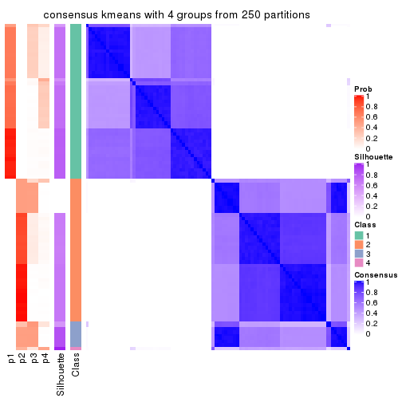</p>

</div>
<div id='tab-CV-kmeans-consensus-heatmap-4'>
<pre><code class="r">consensus_heatmap(res, k = 5)
</code></pre>

<p></p>

</div>
<div id='tab-CV-kmeans-consensus-heatmap-5'>
<pre><code class="r">consensus_heatmap(res, k = 6)
</code></pre>

<p></p>

</div>
</div>

Heatmaps for the membership of samples in all partitions to see how consistent they are:


<script>
$( function() {
	$( '#tabs-CV-kmeans-membership-heatmap' ).tabs();
} );
</script>
<div id='tabs-CV-kmeans-membership-heatmap'>
<ul>
<li><a href='#tab-CV-kmeans-membership-heatmap-1'>k = 2</a></li>
<li><a href='#tab-CV-kmeans-membership-heatmap-2'>k = 3</a></li>
<li><a href='#tab-CV-kmeans-membership-heatmap-3'>k = 4</a></li>
<li><a href='#tab-CV-kmeans-membership-heatmap-4'>k = 5</a></li>
<li><a href='#tab-CV-kmeans-membership-heatmap-5'>k = 6</a></li>
</ul>
<div id='tab-CV-kmeans-membership-heatmap-1'>
<pre><code class="r">membership_heatmap(res, k = 2)
</code></pre>

<p></p>

</div>
<div id='tab-CV-kmeans-membership-heatmap-2'>
<pre><code class="r">membership_heatmap(res, k = 3)
</code></pre>

<p></p>

</div>
<div id='tab-CV-kmeans-membership-heatmap-3'>
<pre><code class="r">membership_heatmap(res, k = 4)
</code></pre>

<p></p>

</div>
<div id='tab-CV-kmeans-membership-heatmap-4'>
<pre><code class="r">membership_heatmap(res, k = 5)
</code></pre>

<p></p>

</div>
<div id='tab-CV-kmeans-membership-heatmap-5'>
<pre><code class="r">membership_heatmap(res, k = 6)
</code></pre>

<p></p>

</div>
</div>

As soon as we have had the classes for columns, we can look for signatures
which are significantly different between classes which can be candidate marks
for certain classes. Following are the heatmaps for signatures.


Signature heatmaps where rows are scaled:


<script>
$( function() {
	$( '#tabs-CV-kmeans-get-signatures' ).tabs();
} );
</script>
<div id='tabs-CV-kmeans-get-signatures'>
<ul>
<li><a href='#tab-CV-kmeans-get-signatures-1'>k = 2</a></li>
<li><a href='#tab-CV-kmeans-get-signatures-2'>k = 3</a></li>
<li><a href='#tab-CV-kmeans-get-signatures-3'>k = 4</a></li>
<li><a href='#tab-CV-kmeans-get-signatures-4'>k = 5</a></li>
<li><a href='#tab-CV-kmeans-get-signatures-5'>k = 6</a></li>
</ul>
<div id='tab-CV-kmeans-get-signatures-1'>
<pre><code class="r">get_signatures(res, k = 2)
</code></pre>

<p></p>

</div>
<div id='tab-CV-kmeans-get-signatures-2'>
<pre><code class="r">get_signatures(res, k = 3)
</code></pre>

<p></p>

</div>
<div id='tab-CV-kmeans-get-signatures-3'>
<pre><code class="r">get_signatures(res, k = 4)
</code></pre>

<p></p>

</div>
<div id='tab-CV-kmeans-get-signatures-4'>
<pre><code class="r">get_signatures(res, k = 5)
</code></pre>

<p></p>

</div>
<div id='tab-CV-kmeans-get-signatures-5'>
<pre><code class="r">get_signatures(res, k = 6)
</code></pre>

<p>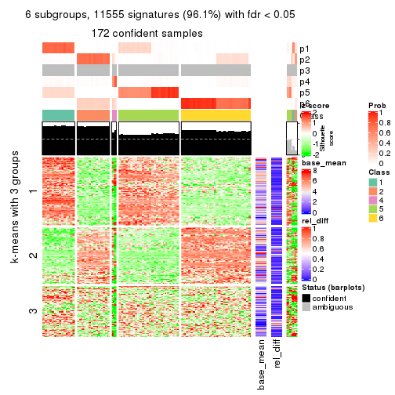</p>

</div>
</div>


Signature heatmaps where rows are not scaled:


<script>
$( function() {
	$( '#tabs-CV-kmeans-get-signatures-no-scale' ).tabs();
} );
</script>
<div id='tabs-CV-kmeans-get-signatures-no-scale'>
<ul>
<li><a href='#tab-CV-kmeans-get-signatures-no-scale-1'>k = 2</a></li>
<li><a href='#tab-CV-kmeans-get-signatures-no-scale-2'>k = 3</a></li>
<li><a href='#tab-CV-kmeans-get-signatures-no-scale-3'>k = 4</a></li>
<li><a href='#tab-CV-kmeans-get-signatures-no-scale-4'>k = 5</a></li>
<li><a href='#tab-CV-kmeans-get-signatures-no-scale-5'>k = 6</a></li>
</ul>
<div id='tab-CV-kmeans-get-signatures-no-scale-1'>
<pre><code class="r">get_signatures(res, k = 2, scale_rows = FALSE)
</code></pre>

<p></p>

</div>
<div id='tab-CV-kmeans-get-signatures-no-scale-2'>
<pre><code class="r">get_signatures(res, k = 3, scale_rows = FALSE)
</code></pre>

<p></p>

</div>
<div id='tab-CV-kmeans-get-signatures-no-scale-3'>
<pre><code class="r">get_signatures(res, k = 4, scale_rows = FALSE)
</code></pre>

<p></p>

</div>
<div id='tab-CV-kmeans-get-signatures-no-scale-4'>
<pre><code class="r">get_signatures(res, k = 5, scale_rows = FALSE)
</code></pre>

<p></p>

</div>
<div id='tab-CV-kmeans-get-signatures-no-scale-5'>
<pre><code class="r">get_signatures(res, k = 6, scale_rows = FALSE)
</code></pre>

<p></p>

</div>
</div>


Compare the overlap of signatures from different k:

```r
compare_signatures(res)
```


`get_signature()` returns a data frame invisibly. TO get the list of signatures, the function
call should be assigned to a variable explicitly. In following code, if `plot` argument is set
to `FALSE`, no heatmap is plotted while only the differential analysis is performed.

```r
# code only for demonstration
tb = get_signature(res, k = ..., plot = FALSE)
```

An example of the output of `tb` is:

```
#>   which_row         fdr    mean_1    mean_2 scaled_mean_1 scaled_mean_2 km
#> 1        38 0.042760348  8.373488  9.131774    -0.5533452     0.5164555  1
#> 2        40 0.018707592  7.106213  8.469186    -0.6173731     0.5762149  1
#> 3        55 0.019134737 10.221463 11.207825    -0.6159697     0.5749050  1
#> 4        59 0.006059896  5.921854  7.869574    -0.6899429     0.6439467  1
#> 5        60 0.018055526  8.928898 10.211722    -0.6204761     0.5791110  1
#> 6        98 0.009384629 15.714769 14.887706     0.6635654    -0.6193277  2
...
```

The columns in `tb` are:

1. `which_row`: row indices corresponding to the input matrix.
2. `fdr`: FDR for the differential test. 
3. `mean_x`: The mean value in group x.
4. `scaled_mean_x`: The mean value in group x after rows are scaled.
5. `km`: Row groups if k-means clustering is applied to rows.


UMAP plot which shows how samples are separated.


<script>
$( function() {
	$( '#tabs-CV-kmeans-dimension-reduction' ).tabs();
} );
</script>
<div id='tabs-CV-kmeans-dimension-reduction'>
<ul>
<li><a href='#tab-CV-kmeans-dimension-reduction-1'>k = 2</a></li>
<li><a href='#tab-CV-kmeans-dimension-reduction-2'>k = 3</a></li>
<li><a href='#tab-CV-kmeans-dimension-reduction-3'>k = 4</a></li>
<li><a href='#tab-CV-kmeans-dimension-reduction-4'>k = 5</a></li>
<li><a href='#tab-CV-kmeans-dimension-reduction-5'>k = 6</a></li>
</ul>
<div id='tab-CV-kmeans-dimension-reduction-1'>
<pre><code class="r">dimension_reduction(res, k = 2, method = &quot;UMAP&quot;)
</code></pre>

<p></p>

</div>
<div id='tab-CV-kmeans-dimension-reduction-2'>
<pre><code class="r">dimension_reduction(res, k = 3, method = &quot;UMAP&quot;)
</code></pre>

<p></p>

</div>
<div id='tab-CV-kmeans-dimension-reduction-3'>
<pre><code class="r">dimension_reduction(res, k = 4, method = &quot;UMAP&quot;)
</code></pre>

<p></p>

</div>
<div id='tab-CV-kmeans-dimension-reduction-4'>
<pre><code class="r">dimension_reduction(res, k = 5, method = &quot;UMAP&quot;)
</code></pre>

<p></p>

</div>
<div id='tab-CV-kmeans-dimension-reduction-5'>
<pre><code class="r">dimension_reduction(res, k = 6, method = &quot;UMAP&quot;)
</code></pre>

<p></p>

</div>
</div>


Following heatmap shows how subgroups are split when increasing `k`:

```r
collect_classes(res)
```


If matrix rows can be associated to genes, consider to use `functional_enrichment(res,
...)` to perform function enrichment for the signature genes. See [this vignette](http://bioconductor.org/packages/devel/bioc/vignettes/cola/inst/doc/functional_enrichment.html) for more detailed explanations.


 

---------------------------------------------------


### CV:skmeans**


The object with results only for a single top-value method and a single partition method 
can be extracted as:

```r
res = res_list["CV", "skmeans"]
# you can also extract it by
# res = res_list["CV:skmeans"]
```

A summary of `res` and all the functions that can be applied to it:

```r
res
```

```
#> A 'ConsensusPartition' object with k = 2, 3, 4, 5, 6.
#>   On a matrix with 12029 rows and 181 columns.
#>   Top rows (1000, 2000, 3000, 4000, 5000) are extracted by 'CV' method.
#>   Subgroups are detected by 'skmeans' method.
#>   Performed in total 1250 partitions by row resampling.
#>   Best k for subgroups seems to be 2.
#> 
#> Following methods can be applied to this 'ConsensusPartition' object:
#>  [1] "cola_report"             "collect_classes"         "collect_plots"          
#>  [4] "collect_stats"           "colnames"                "compare_signatures"     
#>  [7] "consensus_heatmap"       "dimension_reduction"     "functional_enrichment"  
#> [10] "get_anno_col"            "get_anno"                "get_classes"            
#> [13] "get_consensus"           "get_matrix"              "get_membership"         
#> [16] "get_param"               "get_signatures"          "get_stats"              
#> [19] "is_best_k"               "is_stable_k"             "membership_heatmap"     
#> [22] "ncol"                    "nrow"                    "plot_ecdf"              
#> [25] "rownames"                "select_partition_number" "show"                   
#> [28] "suggest_best_k"          "test_to_known_factors"
```

`collect_plots()` function collects all the plots made from `res` for all `k` (number of partitions)
into one single page to provide an easy and fast comparison between different `k`.

```r
collect_plots(res)
```


The plots are:

- The first row: a plot of the ECDF (empirical cumulative distribution
  function) curves of the consensus matrix for each `k` and the heatmap of
  predicted classes for each `k`.
- The second row: heatmaps of the consensus matrix for each `k`.
- The third row: heatmaps of the membership matrix for each `k`.
- The fouth row: heatmaps of the signatures for each `k`.

All the plots in panels can be made by individual functions and they are
plotted later in this section.

`select_partition_number()` produces several plots showing different
statistics for choosing "optimized" `k`. There are following statistics:

- ECDF curves of the consensus matrix for each `k`;
- 1-PAC. [The PAC
  score](https://en.wikipedia.org/wiki/Consensus_clustering#Over-interpretation_potential_of_consensus_clustering)
  measures the proportion of the ambiguous subgrouping.
- Mean silhouette score.
- Concordance. The mean probability of fiting the consensus class ids in all
  partitions.
- Area increased. Denote $A_k$ as the area under the ECDF curve for current
  `k`, the area increased is defined as $A_k - A_{k-1}$.
- Rand index. The percent of pairs of samples that are both in a same cluster
  or both are not in a same cluster in the partition of k and k-1.
- Jaccard index. The ratio of pairs of samples are both in a same cluster in
  the partition of k and k-1 and the pairs of samples are both in a same
  cluster in the partition k or k-1.

The detailed explanations of these statistics can be found in [the _cola_
vignette](http://bioconductor.org/packages/devel/bioc/vignettes/cola/inst/doc/cola.html#toc_13).

Generally speaking, lower PAC score, higher mean silhouette score or higher
concordance corresponds to better partition. Rand index and Jaccard index
measure how similar the current partition is compared to partition with `k-1`.
If they are too similar, we won't accept `k` is better than `k-1`.

```r
select_partition_number(res)
```


The numeric values for all these statistics can be obtained by `get_stats()`.

```r
get_stats(res)
```

```
#>   k 1-PAC mean_silhouette concordance area_increased  Rand Jaccard
#> 2 2 1.000           1.000       1.000         0.5020 0.498   0.498
#> 3 3 0.878           0.939       0.916         0.2045 0.874   0.748
#> 4 4 0.662           0.752       0.722         0.1171 0.919   0.788
#> 5 5 0.730           0.826       0.799         0.0798 0.824   0.525
#> 6 6 0.724           0.799       0.801         0.0506 1.000   1.000
```

`suggest_best_k()` suggests the best $k$ based on these statistics. The rules are as follows:

- All $k$ with Jaccard index larger than 0.95 are removed because increasing
  $k$ does not provide enough extra information. If all $k$ are removed, it is
  marked as no subgroup is detected.
- For all $k$ with 1-PAC score larger than 0.9, the maximal $k$ is taken as
  the best $k$, and other $k$ are marked as optional $k$.
- If it does not fit the second rule. The $k$ with the maximal vote of the
  highest 1-PAC score, highest mean silhouette, and highest concordance is
  taken as the best $k$.

```r
suggest_best_k(res)
```

```
#> [1] 2
```


Following shows the table of the partitions (You need to click the **show/hide
code output** link to see it). The membership matrix (columns with name `p*`)
is inferred by
[`clue::cl_consensus()`](https://www.rdocumentation.org/link/cl_consensus?package=clue)
function with the `SE` method. Basically the value in the membership matrix
represents the probability to belong to a certain group. The finall class
label for an item is determined with the group with highest probability it
belongs to.

In `get_classes()` function, the entropy is calculated from the membership
matrix and the silhouette score is calculated from the consensus matrix.


<script>
$( function() {
	$( '#tabs-CV-skmeans-get-classes' ).tabs();
} );
</script>
<div id='tabs-CV-skmeans-get-classes'>
<ul>
<li><a href='#tab-CV-skmeans-get-classes-1'>k = 2</a></li>
<li><a href='#tab-CV-skmeans-get-classes-2'>k = 3</a></li>
<li><a href='#tab-CV-skmeans-get-classes-3'>k = 4</a></li>
<li><a href='#tab-CV-skmeans-get-classes-4'>k = 5</a></li>
<li><a href='#tab-CV-skmeans-get-classes-5'>k = 6</a></li>
</ul>

<div id='tab-CV-skmeans-get-classes-1'>
<p><a id='tab-CV-skmeans-get-classes-1-a' style='color:#0366d6' href='#'>show/hide code output</a></p>
<pre><code class="r">cbind(get_classes(res, k = 2), get_membership(res, k = 2))
</code></pre>

<pre><code>#&gt;           class entropy silhouette p1 p2
#&gt; SRR315112     2       0          1  0  1
#&gt; SRR315113     1       0          1  1  0
#&gt; SRR315114     1       0          1  1  0
#&gt; SRR315115     2       0          1  0  1
#&gt; SRR315116     2       0          1  0  1
#&gt; SRR566986     2       0          1  0  1
#&gt; SRR566987     2       0          1  0  1
#&gt; SRR566988     2       0          1  0  1
#&gt; SRR566989     2       0          1  0  1
#&gt; SRR566990     2       0          1  0  1
#&gt; SRR566991     2       0          1  0  1
#&gt; SRR566992     2       0          1  0  1
#&gt; SRR566993     2       0          1  0  1
#&gt; SRR566994     2       0          1  0  1
#&gt; SRR566995     2       0          1  0  1
#&gt; SRR566996     2       0          1  0  1
#&gt; SRR566997     2       0          1  0  1
#&gt; SRR566998     2       0          1  0  1
#&gt; SRR566999     2       0          1  0  1
#&gt; SRR567000     2       0          1  0  1
#&gt; SRR567001     2       0          1  0  1
#&gt; SRR567002     2       0          1  0  1
#&gt; SRR567003     2       0          1  0  1
#&gt; SRR567004     2       0          1  0  1
#&gt; SRR567005     2       0          1  0  1
#&gt; SRR567006     2       0          1  0  1
#&gt; SRR567007     2       0          1  0  1
#&gt; SRR567008     2       0          1  0  1
#&gt; SRR567009     2       0          1  0  1
#&gt; SRR567010     2       0          1  0  1
#&gt; SRR567011     2       0          1  0  1
#&gt; SRR567012     2       0          1  0  1
#&gt; SRR567013     2       0          1  0  1
#&gt; SRR567014     2       0          1  0  1
#&gt; SRR567015     2       0          1  0  1
#&gt; SRR567016     2       0          1  0  1
#&gt; SRR567017     2       0          1  0  1
#&gt; SRR567018     2       0          1  0  1
#&gt; SRR567019     2       0          1  0  1
#&gt; SRR567020     2       0          1  0  1
#&gt; SRR567021     2       0          1  0  1
#&gt; SRR567022     2       0          1  0  1
#&gt; SRR567023     2       0          1  0  1
#&gt; SRR567024     2       0          1  0  1
#&gt; SRR567025     2       0          1  0  1
#&gt; SRR567026     2       0          1  0  1
#&gt; SRR567027     2       0          1  0  1
#&gt; SRR567028     2       0          1  0  1
#&gt; SRR567029     2       0          1  0  1
#&gt; SRR567030     2       0          1  0  1
#&gt; SRR567031     2       0          1  0  1
#&gt; SRR567032     2       0          1  0  1
#&gt; SRR567033     2       0          1  0  1
#&gt; SRR567034     2       0          1  0  1
#&gt; SRR567035     2       0          1  0  1
#&gt; SRR567036     2       0          1  0  1
#&gt; SRR567037     2       0          1  0  1
#&gt; SRR567038     2       0          1  0  1
#&gt; SRR567039     2       0          1  0  1
#&gt; SRR567040     2       0          1  0  1
#&gt; SRR567041     2       0          1  0  1
#&gt; SRR567042     2       0          1  0  1
#&gt; SRR567043     2       0          1  0  1
#&gt; SRR567044     2       0          1  0  1
#&gt; SRR567045     2       0          1  0  1
#&gt; SRR567046     2       0          1  0  1
#&gt; SRR567047     2       0          1  0  1
#&gt; SRR567048     2       0          1  0  1
#&gt; SRR567049     2       0          1  0  1
#&gt; SRR567050     2       0          1  0  1
#&gt; SRR567051     2       0          1  0  1
#&gt; SRR567052     2       0          1  0  1
#&gt; SRR567053     2       0          1  0  1
#&gt; SRR567054     2       0          1  0  1
#&gt; SRR567055     2       0          1  0  1
#&gt; SRR567056     2       0          1  0  1
#&gt; SRR567057     2       0          1  0  1
#&gt; SRR567058     2       0          1  0  1
#&gt; SRR567059     2       0          1  0  1
#&gt; SRR567060     2       0          1  0  1
#&gt; SRR567061     2       0          1  0  1
#&gt; SRR567062     2       0          1  0  1
#&gt; SRR567063     2       0          1  0  1
#&gt; SRR567064     2       0          1  0  1
#&gt; SRR567065     2       0          1  0  1
#&gt; SRR567066     2       0          1  0  1
#&gt; SRR567067     2       0          1  0  1
#&gt; SRR567068     2       0          1  0  1
#&gt; SRR567069     2       0          1  0  1
#&gt; SRR567070     2       0          1  0  1
#&gt; SRR567071     2       0          1  0  1
#&gt; SRR567072     2       0          1  0  1
#&gt; SRR567073     2       0          1  0  1
#&gt; SRR567074     2       0          1  0  1
#&gt; SRR567075     2       0          1  0  1
#&gt; SRR567076     1       0          1  1  0
#&gt; SRR567077     1       0          1  1  0
#&gt; SRR567078     1       0          1  1  0
#&gt; SRR567079     1       0          1  1  0
#&gt; SRR567080     1       0          1  1  0
#&gt; SRR567081     1       0          1  1  0
#&gt; SRR567082     1       0          1  1  0
#&gt; SRR567083     1       0          1  1  0
#&gt; SRR567084     1       0          1  1  0
#&gt; SRR567085     1       0          1  1  0
#&gt; SRR567086     1       0          1  1  0
#&gt; SRR567087     1       0          1  1  0
#&gt; SRR567088     1       0          1  1  0
#&gt; SRR567089     1       0          1  1  0
#&gt; SRR567090     1       0          1  1  0
#&gt; SRR567091     1       0          1  1  0
#&gt; SRR567092     1       0          1  1  0
#&gt; SRR567093     1       0          1  1  0
#&gt; SRR567094     1       0          1  1  0
#&gt; SRR567095     1       0          1  1  0
#&gt; SRR567096     1       0          1  1  0
#&gt; SRR567097     1       0          1  1  0
#&gt; SRR567098     1       0          1  1  0
#&gt; SRR567099     1       0          1  1  0
#&gt; SRR567100     1       0          1  1  0
#&gt; SRR567101     1       0          1  1  0
#&gt; SRR567102     1       0          1  1  0
#&gt; SRR567103     1       0          1  1  0
#&gt; SRR567104     1       0          1  1  0
#&gt; SRR567105     1       0          1  1  0
#&gt; SRR567106     1       0          1  1  0
#&gt; SRR567107     1       0          1  1  0
#&gt; SRR567108     1       0          1  1  0
#&gt; SRR567109     1       0          1  1  0
#&gt; SRR567110     1       0          1  1  0
#&gt; SRR567111     1       0          1  1  0
#&gt; SRR567112     1       0          1  1  0
#&gt; SRR567113     1       0          1  1  0
#&gt; SRR567114     1       0          1  1  0
#&gt; SRR567115     1       0          1  1  0
#&gt; SRR567116     1       0          1  1  0
#&gt; SRR567117     1       0          1  1  0
#&gt; SRR567118     1       0          1  1  0
#&gt; SRR567119     1       0          1  1  0
#&gt; SRR567120     1       0          1  1  0
#&gt; SRR567121     1       0          1  1  0
#&gt; SRR567122     1       0          1  1  0
#&gt; SRR567123     1       0          1  1  0
#&gt; SRR567124     1       0          1  1  0
#&gt; SRR567125     1       0          1  1  0
#&gt; SRR567126     1       0          1  1  0
#&gt; SRR567127     1       0          1  1  0
#&gt; SRR567128     1       0          1  1  0
#&gt; SRR567129     1       0          1  1  0
#&gt; SRR567130     1       0          1  1  0
#&gt; SRR567131     1       0          1  1  0
#&gt; SRR567132     1       0          1  1  0
#&gt; SRR567133     1       0          1  1  0
#&gt; SRR567134     1       0          1  1  0
#&gt; SRR567135     1       0          1  1  0
#&gt; SRR567136     1       0          1  1  0
#&gt; SRR567137     1       0          1  1  0
#&gt; SRR567138     1       0          1  1  0
#&gt; SRR567139     1       0          1  1  0
#&gt; SRR567140     1       0          1  1  0
#&gt; SRR567141     1       0          1  1  0
#&gt; SRR567142     1       0          1  1  0
#&gt; SRR567143     1       0          1  1  0
#&gt; SRR567144     1       0          1  1  0
#&gt; SRR567145     1       0          1  1  0
#&gt; SRR567146     2       0          1  0  1
#&gt; SRR567147     1       0          1  1  0
#&gt; SRR567148     1       0          1  1  0
#&gt; SRR567149     1       0          1  1  0
#&gt; SRR567150     1       0          1  1  0
#&gt; SRR567151     1       0          1  1  0
#&gt; SRR567152     1       0          1  1  0
#&gt; SRR567153     1       0          1  1  0
#&gt; SRR567154     1       0          1  1  0
#&gt; SRR567155     1       0          1  1  0
#&gt; SRR567156     1       0          1  1  0
#&gt; SRR567157     1       0          1  1  0
#&gt; SRR567158     1       0          1  1  0
#&gt; SRR567159     1       0          1  1  0
#&gt; SRR567160     1       0          1  1  0
#&gt; SRR567161     2       0          1  0  1
</code></pre>

<script>
$('#tab-CV-skmeans-get-classes-1-a').parent().next().next().hide();
$('#tab-CV-skmeans-get-classes-1-a').click(function(){
  $('#tab-CV-skmeans-get-classes-1-a').parent().next().next().toggle();
  return(false);
});
</script>
</div>

<div id='tab-CV-skmeans-get-classes-2'>
<p><a id='tab-CV-skmeans-get-classes-2-a' style='color:#0366d6' href='#'>show/hide code output</a></p>
<pre><code class="r">cbind(get_classes(res, k = 3), get_membership(res, k = 3))
</code></pre>

<pre><code>#&gt;           class entropy silhouette    p1    p2    p3
#&gt; SRR315112     3  0.4504      0.748 0.000 0.196 0.804
#&gt; SRR315113     1  0.4702      0.801 0.788 0.212 0.000
#&gt; SRR315114     1  0.4702      0.801 0.788 0.212 0.000
#&gt; SRR315115     3  0.4504      0.748 0.000 0.196 0.804
#&gt; SRR315116     3  0.4504      0.748 0.000 0.196 0.804
#&gt; SRR566986     2  0.6026      0.919 0.000 0.624 0.376
#&gt; SRR566987     2  0.6026      0.919 0.000 0.624 0.376
#&gt; SRR566988     2  0.6026      0.919 0.000 0.624 0.376
#&gt; SRR566989     2  0.6045      0.914 0.000 0.620 0.380
#&gt; SRR566990     2  0.6026      0.919 0.000 0.624 0.376
#&gt; SRR566991     2  0.6026      0.919 0.000 0.624 0.376
#&gt; SRR566992     2  0.6045      0.914 0.000 0.620 0.380
#&gt; SRR566993     2  0.6026      0.919 0.000 0.624 0.376
#&gt; SRR566994     2  0.6026      0.919 0.000 0.624 0.376
#&gt; SRR566995     2  0.6026      0.919 0.000 0.624 0.376
#&gt; SRR566996     2  0.6026      0.919 0.000 0.624 0.376
#&gt; SRR566997     2  0.6026      0.919 0.000 0.624 0.376
#&gt; SRR566998     2  0.6026      0.919 0.000 0.624 0.376
#&gt; SRR566999     2  0.6026      0.919 0.000 0.624 0.376
#&gt; SRR567000     2  0.6026      0.919 0.000 0.624 0.376
#&gt; SRR567001     2  0.6045      0.914 0.000 0.620 0.380
#&gt; SRR567002     2  0.6026      0.919 0.000 0.624 0.376
#&gt; SRR567003     2  0.6026      0.919 0.000 0.624 0.376
#&gt; SRR567004     2  0.6026      0.919 0.000 0.624 0.376
#&gt; SRR567005     2  0.6026      0.919 0.000 0.624 0.376
#&gt; SRR567006     2  0.6026      0.919 0.000 0.624 0.376
#&gt; SRR567007     2  0.6026      0.919 0.000 0.624 0.376
#&gt; SRR567008     2  0.6045      0.914 0.000 0.620 0.380
#&gt; SRR567009     2  0.6026      0.919 0.000 0.624 0.376
#&gt; SRR567010     2  0.6026      0.919 0.000 0.624 0.376
#&gt; SRR567011     2  0.6026      0.919 0.000 0.624 0.376
#&gt; SRR567012     2  0.6026      0.919 0.000 0.624 0.376
#&gt; SRR567013     2  0.6026      0.919 0.000 0.624 0.376
#&gt; SRR567014     3  0.0000      0.945 0.000 0.000 1.000
#&gt; SRR567015     3  0.0000      0.945 0.000 0.000 1.000
#&gt; SRR567016     3  0.0000      0.945 0.000 0.000 1.000
#&gt; SRR567017     3  0.0000      0.945 0.000 0.000 1.000
#&gt; SRR567018     3  0.0000      0.945 0.000 0.000 1.000
#&gt; SRR567019     3  0.0000      0.945 0.000 0.000 1.000
#&gt; SRR567020     3  0.0000      0.945 0.000 0.000 1.000
#&gt; SRR567021     3  0.0000      0.945 0.000 0.000 1.000
#&gt; SRR567022     3  0.6095      0.632 0.000 0.392 0.608
#&gt; SRR567023     3  0.0000      0.945 0.000 0.000 1.000
#&gt; SRR567024     3  0.0000      0.945 0.000 0.000 1.000
#&gt; SRR567025     3  0.0000      0.945 0.000 0.000 1.000
#&gt; SRR567026     3  0.0000      0.945 0.000 0.000 1.000
#&gt; SRR567027     3  0.0000      0.945 0.000 0.000 1.000
#&gt; SRR567028     3  0.0000      0.945 0.000 0.000 1.000
#&gt; SRR567029     3  0.0000      0.945 0.000 0.000 1.000
#&gt; SRR567030     3  0.0000      0.945 0.000 0.000 1.000
#&gt; SRR567031     3  0.0000      0.945 0.000 0.000 1.000
#&gt; SRR567032     3  0.0000      0.945 0.000 0.000 1.000
#&gt; SRR567033     3  0.0000      0.945 0.000 0.000 1.000
#&gt; SRR567034     3  0.0000      0.945 0.000 0.000 1.000
#&gt; SRR567035     3  0.0000      0.945 0.000 0.000 1.000
#&gt; SRR567036     3  0.0000      0.945 0.000 0.000 1.000
#&gt; SRR567037     3  0.0000      0.945 0.000 0.000 1.000
#&gt; SRR567038     3  0.0000      0.945 0.000 0.000 1.000
#&gt; SRR567039     3  0.0000      0.945 0.000 0.000 1.000
#&gt; SRR567040     3  0.0000      0.945 0.000 0.000 1.000
#&gt; SRR567041     3  0.0000      0.945 0.000 0.000 1.000
#&gt; SRR567042     3  0.6095      0.632 0.000 0.392 0.608
#&gt; SRR567043     3  0.0000      0.945 0.000 0.000 1.000
#&gt; SRR567044     2  0.5560      0.930 0.000 0.700 0.300
#&gt; SRR567045     2  0.5560      0.930 0.000 0.700 0.300
#&gt; SRR567046     2  0.5560      0.930 0.000 0.700 0.300
#&gt; SRR567047     2  0.5560      0.930 0.000 0.700 0.300
#&gt; SRR567048     2  0.5560      0.930 0.000 0.700 0.300
#&gt; SRR567049     2  0.5560      0.930 0.000 0.700 0.300
#&gt; SRR567050     2  0.5560      0.930 0.000 0.700 0.300
#&gt; SRR567051     2  0.5560      0.930 0.000 0.700 0.300
#&gt; SRR567052     2  0.5560      0.930 0.000 0.700 0.300
#&gt; SRR567053     2  0.5560      0.930 0.000 0.700 0.300
#&gt; SRR567054     2  0.5560      0.930 0.000 0.700 0.300
#&gt; SRR567055     2  0.5560      0.930 0.000 0.700 0.300
#&gt; SRR567056     2  0.5560      0.930 0.000 0.700 0.300
#&gt; SRR567057     2  0.5560      0.930 0.000 0.700 0.300
#&gt; SRR567058     2  0.5560      0.930 0.000 0.700 0.300
#&gt; SRR567059     2  0.5560      0.930 0.000 0.700 0.300
#&gt; SRR567060     2  0.5560      0.930 0.000 0.700 0.300
#&gt; SRR567061     2  0.5560      0.930 0.000 0.700 0.300
#&gt; SRR567062     2  0.5560      0.930 0.000 0.700 0.300
#&gt; SRR567063     2  0.5560      0.930 0.000 0.700 0.300
#&gt; SRR567064     2  0.5560      0.930 0.000 0.700 0.300
#&gt; SRR567065     2  0.5560      0.930 0.000 0.700 0.300
#&gt; SRR567066     2  0.5560      0.930 0.000 0.700 0.300
#&gt; SRR567067     2  0.5560      0.930 0.000 0.700 0.300
#&gt; SRR567068     2  0.5560      0.930 0.000 0.700 0.300
#&gt; SRR567069     2  0.5560      0.930 0.000 0.700 0.300
#&gt; SRR567070     2  0.5560      0.930 0.000 0.700 0.300
#&gt; SRR567071     2  0.5560      0.930 0.000 0.700 0.300
#&gt; SRR567072     2  0.5560      0.930 0.000 0.700 0.300
#&gt; SRR567073     2  0.5560      0.930 0.000 0.700 0.300
#&gt; SRR567074     2  0.5560      0.930 0.000 0.700 0.300
#&gt; SRR567075     2  0.5560      0.930 0.000 0.700 0.300
#&gt; SRR567076     1  0.0000      0.986 1.000 0.000 0.000
#&gt; SRR567077     1  0.0000      0.986 1.000 0.000 0.000
#&gt; SRR567078     1  0.0000      0.986 1.000 0.000 0.000
#&gt; SRR567079     1  0.0000      0.986 1.000 0.000 0.000
#&gt; SRR567080     1  0.0000      0.986 1.000 0.000 0.000
#&gt; SRR567081     1  0.0000      0.986 1.000 0.000 0.000
#&gt; SRR567082     1  0.0000      0.986 1.000 0.000 0.000
#&gt; SRR567083     1  0.0000      0.986 1.000 0.000 0.000
#&gt; SRR567084     1  0.0000      0.986 1.000 0.000 0.000
#&gt; SRR567085     1  0.0000      0.986 1.000 0.000 0.000
#&gt; SRR567086     1  0.0000      0.986 1.000 0.000 0.000
#&gt; SRR567087     1  0.0000      0.986 1.000 0.000 0.000
#&gt; SRR567088     1  0.0000      0.986 1.000 0.000 0.000
#&gt; SRR567089     1  0.0000      0.986 1.000 0.000 0.000
#&gt; SRR567090     1  0.0000      0.986 1.000 0.000 0.000
#&gt; SRR567091     1  0.0000      0.986 1.000 0.000 0.000
#&gt; SRR567092     1  0.0000      0.986 1.000 0.000 0.000
#&gt; SRR567093     1  0.0000      0.986 1.000 0.000 0.000
#&gt; SRR567094     1  0.0000      0.986 1.000 0.000 0.000
#&gt; SRR567095     1  0.0000      0.986 1.000 0.000 0.000
#&gt; SRR567096     1  0.0000      0.986 1.000 0.000 0.000
#&gt; SRR567097     1  0.0000      0.986 1.000 0.000 0.000
#&gt; SRR567098     1  0.0000      0.986 1.000 0.000 0.000
#&gt; SRR567099     1  0.0000      0.986 1.000 0.000 0.000
#&gt; SRR567100     1  0.0000      0.986 1.000 0.000 0.000
#&gt; SRR567101     1  0.0000      0.986 1.000 0.000 0.000
#&gt; SRR567102     1  0.2796      0.920 0.908 0.092 0.000
#&gt; SRR567103     1  0.2796      0.920 0.908 0.092 0.000
#&gt; SRR567104     1  0.0000      0.986 1.000 0.000 0.000
#&gt; SRR567105     1  0.0000      0.986 1.000 0.000 0.000
#&gt; SRR567106     1  0.0747      0.983 0.984 0.016 0.000
#&gt; SRR567107     1  0.0747      0.983 0.984 0.016 0.000
#&gt; SRR567108     1  0.0747      0.983 0.984 0.016 0.000
#&gt; SRR567109     1  0.0747      0.983 0.984 0.016 0.000
#&gt; SRR567110     1  0.0747      0.983 0.984 0.016 0.000
#&gt; SRR567111     1  0.0747      0.983 0.984 0.016 0.000
#&gt; SRR567112     1  0.0747      0.983 0.984 0.016 0.000
#&gt; SRR567113     1  0.0747      0.983 0.984 0.016 0.000
#&gt; SRR567114     1  0.0747      0.983 0.984 0.016 0.000
#&gt; SRR567115     1  0.0747      0.983 0.984 0.016 0.000
#&gt; SRR567116     1  0.0747      0.983 0.984 0.016 0.000
#&gt; SRR567117     1  0.0747      0.983 0.984 0.016 0.000
#&gt; SRR567118     1  0.0747      0.983 0.984 0.016 0.000
#&gt; SRR567119     1  0.0747      0.983 0.984 0.016 0.000
#&gt; SRR567120     1  0.0747      0.983 0.984 0.016 0.000
#&gt; SRR567121     1  0.0747      0.983 0.984 0.016 0.000
#&gt; SRR567122     1  0.0747      0.983 0.984 0.016 0.000
#&gt; SRR567123     1  0.0747      0.983 0.984 0.016 0.000
#&gt; SRR567124     1  0.0747      0.983 0.984 0.016 0.000
#&gt; SRR567125     1  0.0747      0.983 0.984 0.016 0.000
#&gt; SRR567126     1  0.0747      0.983 0.984 0.016 0.000
#&gt; SRR567127     1  0.0747      0.983 0.984 0.016 0.000
#&gt; SRR567128     1  0.0747      0.983 0.984 0.016 0.000
#&gt; SRR567129     1  0.0747      0.983 0.984 0.016 0.000
#&gt; SRR567130     1  0.0747      0.983 0.984 0.016 0.000
#&gt; SRR567131     1  0.0747      0.983 0.984 0.016 0.000
#&gt; SRR567132     1  0.0747      0.983 0.984 0.016 0.000
#&gt; SRR567133     1  0.0747      0.983 0.984 0.016 0.000
#&gt; SRR567134     1  0.0424      0.984 0.992 0.008 0.000
#&gt; SRR567135     1  0.0424      0.984 0.992 0.008 0.000
#&gt; SRR567136     1  0.2878      0.919 0.904 0.096 0.000
#&gt; SRR567137     1  0.0424      0.984 0.992 0.008 0.000
#&gt; SRR567138     1  0.0424      0.984 0.992 0.008 0.000
#&gt; SRR567139     1  0.0424      0.984 0.992 0.008 0.000
#&gt; SRR567140     1  0.0424      0.984 0.992 0.008 0.000
#&gt; SRR567141     1  0.0424      0.984 0.992 0.008 0.000
#&gt; SRR567142     1  0.0424      0.984 0.992 0.008 0.000
#&gt; SRR567143     1  0.0424      0.984 0.992 0.008 0.000
#&gt; SRR567144     1  0.0424      0.984 0.992 0.008 0.000
#&gt; SRR567145     1  0.0424      0.984 0.992 0.008 0.000
#&gt; SRR567146     2  0.4702      0.281 0.000 0.788 0.212
#&gt; SRR567147     1  0.0424      0.984 0.992 0.008 0.000
#&gt; SRR567148     1  0.0424      0.984 0.992 0.008 0.000
#&gt; SRR567149     1  0.0424      0.984 0.992 0.008 0.000
#&gt; SRR567150     1  0.0424      0.984 0.992 0.008 0.000
#&gt; SRR567151     1  0.0424      0.984 0.992 0.008 0.000
#&gt; SRR567152     1  0.0424      0.984 0.992 0.008 0.000
#&gt; SRR567153     1  0.0424      0.984 0.992 0.008 0.000
#&gt; SRR567154     1  0.0424      0.984 0.992 0.008 0.000
#&gt; SRR567155     1  0.0424      0.984 0.992 0.008 0.000
#&gt; SRR567156     1  0.0424      0.984 0.992 0.008 0.000
#&gt; SRR567157     1  0.0424      0.984 0.992 0.008 0.000
#&gt; SRR567158     1  0.0424      0.984 0.992 0.008 0.000
#&gt; SRR567159     1  0.2878      0.919 0.904 0.096 0.000
#&gt; SRR567160     1  0.0424      0.984 0.992 0.008 0.000
#&gt; SRR567161     2  0.4702      0.281 0.000 0.788 0.212
</code></pre>

<script>
$('#tab-CV-skmeans-get-classes-2-a').parent().next().next().hide();
$('#tab-CV-skmeans-get-classes-2-a').click(function(){
  $('#tab-CV-skmeans-get-classes-2-a').parent().next().next().toggle();
  return(false);
});
</script>
</div>

<div id='tab-CV-skmeans-get-classes-3'>
<p><a id='tab-CV-skmeans-get-classes-3-a' style='color:#0366d6' href='#'>show/hide code output</a></p>
<pre><code class="r">cbind(get_classes(res, k = 4), get_membership(res, k = 4))
</code></pre>

<pre><code>#&gt;           class entropy silhouette    p1    p2    p3    p4
#&gt; SRR315112     3  0.5496      0.687 0.000 0.064 0.704 0.232
#&gt; SRR315113     2  0.7613     -0.632 0.288 0.472 0.000 0.240
#&gt; SRR315114     2  0.7585     -0.647 0.304 0.472 0.000 0.224
#&gt; SRR315115     3  0.5496      0.687 0.000 0.064 0.704 0.232
#&gt; SRR315116     3  0.5496      0.687 0.000 0.064 0.704 0.232
#&gt; SRR566986     4  0.7921      0.668 0.000 0.320 0.332 0.348
#&gt; SRR566987     4  0.7918      0.668 0.000 0.316 0.332 0.352
#&gt; SRR566988     4  0.7919      0.677 0.000 0.316 0.336 0.348
#&gt; SRR566989     4  0.7921      0.668 0.000 0.320 0.332 0.348
#&gt; SRR566990     4  0.7916      0.674 0.000 0.312 0.336 0.352
#&gt; SRR566991     4  0.7917      0.671 0.000 0.312 0.340 0.348
#&gt; SRR566992     4  0.7921      0.668 0.000 0.320 0.332 0.348
#&gt; SRR566993     4  0.7919      0.677 0.000 0.316 0.336 0.348
#&gt; SRR566994     4  0.7919      0.677 0.000 0.316 0.336 0.348
#&gt; SRR566995     4  0.7921      0.666 0.000 0.320 0.332 0.348
#&gt; SRR566996     4  0.7921      0.668 0.000 0.320 0.332 0.348
#&gt; SRR566997     4  0.7919      0.677 0.000 0.316 0.336 0.348
#&gt; SRR566998     4  0.7921      0.666 0.000 0.320 0.332 0.348
#&gt; SRR566999     4  0.7916      0.674 0.000 0.312 0.336 0.352
#&gt; SRR567000     4  0.7919      0.677 0.000 0.316 0.336 0.348
#&gt; SRR567001     4  0.7919      0.677 0.000 0.316 0.336 0.348
#&gt; SRR567002     4  0.7921      0.668 0.000 0.320 0.332 0.348
#&gt; SRR567003     4  0.7917      0.671 0.000 0.312 0.340 0.348
#&gt; SRR567004     4  0.7919      0.677 0.000 0.316 0.336 0.348
#&gt; SRR567005     4  0.7919      0.677 0.000 0.316 0.336 0.348
#&gt; SRR567006     4  0.7919      0.677 0.000 0.316 0.336 0.348
#&gt; SRR567007     4  0.7921      0.668 0.000 0.320 0.332 0.348
#&gt; SRR567008     4  0.7919      0.677 0.000 0.316 0.336 0.348
#&gt; SRR567009     4  0.7919      0.677 0.000 0.316 0.336 0.348
#&gt; SRR567010     4  0.7916      0.674 0.000 0.312 0.336 0.352
#&gt; SRR567011     4  0.7916      0.674 0.000 0.312 0.336 0.352
#&gt; SRR567012     4  0.7918      0.668 0.000 0.316 0.332 0.352
#&gt; SRR567013     4  0.7919      0.677 0.000 0.316 0.336 0.348
#&gt; SRR567014     3  0.0000      0.965 0.000 0.000 1.000 0.000
#&gt; SRR567015     3  0.0000      0.965 0.000 0.000 1.000 0.000
#&gt; SRR567016     3  0.0000      0.965 0.000 0.000 1.000 0.000
#&gt; SRR567017     3  0.0000      0.965 0.000 0.000 1.000 0.000
#&gt; SRR567018     3  0.0000      0.965 0.000 0.000 1.000 0.000
#&gt; SRR567019     3  0.0000      0.965 0.000 0.000 1.000 0.000
#&gt; SRR567020     3  0.0000      0.965 0.000 0.000 1.000 0.000
#&gt; SRR567021     3  0.0000      0.965 0.000 0.000 1.000 0.000
#&gt; SRR567022     4  0.4585     -0.315 0.000 0.000 0.332 0.668
#&gt; SRR567023     3  0.0000      0.965 0.000 0.000 1.000 0.000
#&gt; SRR567024     3  0.0000      0.965 0.000 0.000 1.000 0.000
#&gt; SRR567025     3  0.0000      0.965 0.000 0.000 1.000 0.000
#&gt; SRR567026     3  0.0000      0.965 0.000 0.000 1.000 0.000
#&gt; SRR567027     3  0.0000      0.965 0.000 0.000 1.000 0.000
#&gt; SRR567028     3  0.0000      0.965 0.000 0.000 1.000 0.000
#&gt; SRR567029     3  0.0000      0.965 0.000 0.000 1.000 0.000
#&gt; SRR567030     3  0.0000      0.965 0.000 0.000 1.000 0.000
#&gt; SRR567031     3  0.0000      0.965 0.000 0.000 1.000 0.000
#&gt; SRR567032     3  0.0000      0.965 0.000 0.000 1.000 0.000
#&gt; SRR567033     3  0.0000      0.965 0.000 0.000 1.000 0.000
#&gt; SRR567034     3  0.0000      0.965 0.000 0.000 1.000 0.000
#&gt; SRR567035     3  0.0000      0.965 0.000 0.000 1.000 0.000
#&gt; SRR567036     3  0.0000      0.965 0.000 0.000 1.000 0.000
#&gt; SRR567037     3  0.0000      0.965 0.000 0.000 1.000 0.000
#&gt; SRR567038     3  0.0000      0.965 0.000 0.000 1.000 0.000
#&gt; SRR567039     3  0.0000      0.965 0.000 0.000 1.000 0.000
#&gt; SRR567040     3  0.0000      0.965 0.000 0.000 1.000 0.000
#&gt; SRR567041     3  0.0000      0.965 0.000 0.000 1.000 0.000
#&gt; SRR567042     4  0.4585     -0.315 0.000 0.000 0.332 0.668
#&gt; SRR567043     3  0.0000      0.965 0.000 0.000 1.000 0.000
#&gt; SRR567044     2  0.7261      0.762 0.000 0.480 0.152 0.368
#&gt; SRR567045     2  0.7261      0.762 0.000 0.480 0.152 0.368
#&gt; SRR567046     2  0.7261      0.762 0.000 0.480 0.152 0.368
#&gt; SRR567047     2  0.7261      0.762 0.000 0.480 0.152 0.368
#&gt; SRR567048     2  0.7261      0.762 0.000 0.480 0.152 0.368
#&gt; SRR567049     2  0.7261      0.762 0.000 0.480 0.152 0.368
#&gt; SRR567050     2  0.7261      0.762 0.000 0.480 0.152 0.368
#&gt; SRR567051     2  0.7261      0.762 0.000 0.480 0.152 0.368
#&gt; SRR567052     2  0.7261      0.762 0.000 0.480 0.152 0.368
#&gt; SRR567053     2  0.7261      0.762 0.000 0.480 0.152 0.368
#&gt; SRR567054     2  0.7268      0.748 0.000 0.476 0.152 0.372
#&gt; SRR567055     2  0.7261      0.762 0.000 0.480 0.152 0.368
#&gt; SRR567056     2  0.7261      0.762 0.000 0.480 0.152 0.368
#&gt; SRR567057     2  0.7261      0.762 0.000 0.480 0.152 0.368
#&gt; SRR567058     2  0.7261      0.762 0.000 0.480 0.152 0.368
#&gt; SRR567059     2  0.7275      0.740 0.000 0.472 0.152 0.376
#&gt; SRR567060     2  0.7261      0.762 0.000 0.480 0.152 0.368
#&gt; SRR567061     2  0.7261      0.762 0.000 0.480 0.152 0.368
#&gt; SRR567062     2  0.7261      0.762 0.000 0.480 0.152 0.368
#&gt; SRR567063     2  0.7261      0.762 0.000 0.480 0.152 0.368
#&gt; SRR567064     2  0.7275      0.740 0.000 0.472 0.152 0.376
#&gt; SRR567065     2  0.7261      0.762 0.000 0.480 0.152 0.368
#&gt; SRR567066     2  0.7261      0.762 0.000 0.480 0.152 0.368
#&gt; SRR567067     2  0.7261      0.762 0.000 0.480 0.152 0.368
#&gt; SRR567068     2  0.7268      0.748 0.000 0.476 0.152 0.372
#&gt; SRR567069     2  0.7261      0.762 0.000 0.480 0.152 0.368
#&gt; SRR567070     2  0.7261      0.762 0.000 0.480 0.152 0.368
#&gt; SRR567071     2  0.7261      0.762 0.000 0.480 0.152 0.368
#&gt; SRR567072     2  0.7261      0.762 0.000 0.480 0.152 0.368
#&gt; SRR567073     2  0.7261      0.762 0.000 0.480 0.152 0.368
#&gt; SRR567074     2  0.7261      0.762 0.000 0.480 0.152 0.368
#&gt; SRR567075     2  0.7261      0.762 0.000 0.480 0.152 0.368
#&gt; SRR567076     1  0.4679      0.845 0.648 0.352 0.000 0.000
#&gt; SRR567077     1  0.4679      0.845 0.648 0.352 0.000 0.000
#&gt; SRR567078     1  0.4661      0.845 0.652 0.348 0.000 0.000
#&gt; SRR567079     1  0.4661      0.845 0.652 0.348 0.000 0.000
#&gt; SRR567080     1  0.4661      0.845 0.652 0.348 0.000 0.000
#&gt; SRR567081     1  0.4661      0.845 0.652 0.348 0.000 0.000
#&gt; SRR567082     1  0.4697      0.845 0.644 0.356 0.000 0.000
#&gt; SRR567083     1  0.4679      0.846 0.648 0.352 0.000 0.000
#&gt; SRR567084     1  0.4661      0.845 0.652 0.348 0.000 0.000
#&gt; SRR567085     1  0.4661      0.845 0.652 0.348 0.000 0.000
#&gt; SRR567086     1  0.4661      0.845 0.652 0.348 0.000 0.000
#&gt; SRR567087     1  0.4679      0.845 0.648 0.352 0.000 0.000
#&gt; SRR567088     1  0.4679      0.845 0.648 0.352 0.000 0.000
#&gt; SRR567089     1  0.4697      0.845 0.644 0.356 0.000 0.000
#&gt; SRR567090     1  0.4679      0.846 0.648 0.352 0.000 0.000
#&gt; SRR567091     1  0.4661      0.845 0.652 0.348 0.000 0.000
#&gt; SRR567092     1  0.4661      0.845 0.652 0.348 0.000 0.000
#&gt; SRR567093     1  0.4679      0.845 0.648 0.352 0.000 0.000
#&gt; SRR567094     1  0.4661      0.845 0.652 0.348 0.000 0.000
#&gt; SRR567095     1  0.4679      0.845 0.648 0.352 0.000 0.000
#&gt; SRR567096     1  0.4679      0.845 0.648 0.352 0.000 0.000
#&gt; SRR567097     1  0.4679      0.845 0.648 0.352 0.000 0.000
#&gt; SRR567098     1  0.4661      0.845 0.652 0.348 0.000 0.000
#&gt; SRR567099     1  0.4661      0.845 0.652 0.348 0.000 0.000
#&gt; SRR567100     1  0.4661      0.845 0.652 0.348 0.000 0.000
#&gt; SRR567101     1  0.4661      0.845 0.652 0.348 0.000 0.000
#&gt; SRR567102     1  0.7431      0.452 0.448 0.172 0.000 0.380
#&gt; SRR567103     1  0.7431      0.452 0.448 0.172 0.000 0.380
#&gt; SRR567104     1  0.4661      0.845 0.652 0.348 0.000 0.000
#&gt; SRR567105     1  0.4661      0.845 0.652 0.348 0.000 0.000
#&gt; SRR567106     1  0.4972      0.830 0.544 0.456 0.000 0.000
#&gt; SRR567107     1  0.4972      0.830 0.544 0.456 0.000 0.000
#&gt; SRR567108     1  0.4972      0.830 0.544 0.456 0.000 0.000
#&gt; SRR567109     1  0.4972      0.830 0.544 0.456 0.000 0.000
#&gt; SRR567110     1  0.4972      0.830 0.544 0.456 0.000 0.000
#&gt; SRR567111     1  0.4972      0.830 0.544 0.456 0.000 0.000
#&gt; SRR567112     1  0.4972      0.830 0.544 0.456 0.000 0.000
#&gt; SRR567113     1  0.4972      0.830 0.544 0.456 0.000 0.000
#&gt; SRR567114     1  0.4972      0.830 0.544 0.456 0.000 0.000
#&gt; SRR567115     1  0.4972      0.830 0.544 0.456 0.000 0.000
#&gt; SRR567116     1  0.4972      0.830 0.544 0.456 0.000 0.000
#&gt; SRR567117     1  0.4972      0.830 0.544 0.456 0.000 0.000
#&gt; SRR567118     1  0.4972      0.830 0.544 0.456 0.000 0.000
#&gt; SRR567119     1  0.4972      0.830 0.544 0.456 0.000 0.000
#&gt; SRR567120     1  0.4972      0.830 0.544 0.456 0.000 0.000
#&gt; SRR567121     1  0.4972      0.830 0.544 0.456 0.000 0.000
#&gt; SRR567122     1  0.4972      0.830 0.544 0.456 0.000 0.000
#&gt; SRR567123     1  0.4972      0.830 0.544 0.456 0.000 0.000
#&gt; SRR567124     1  0.4972      0.830 0.544 0.456 0.000 0.000
#&gt; SRR567125     1  0.4972      0.830 0.544 0.456 0.000 0.000
#&gt; SRR567126     1  0.4972      0.830 0.544 0.456 0.000 0.000
#&gt; SRR567127     1  0.4972      0.830 0.544 0.456 0.000 0.000
#&gt; SRR567128     1  0.4972      0.830 0.544 0.456 0.000 0.000
#&gt; SRR567129     1  0.4972      0.830 0.544 0.456 0.000 0.000
#&gt; SRR567130     1  0.4972      0.830 0.544 0.456 0.000 0.000
#&gt; SRR567131     1  0.4972      0.830 0.544 0.456 0.000 0.000
#&gt; SRR567132     1  0.4972      0.830 0.544 0.456 0.000 0.000
#&gt; SRR567133     1  0.4972      0.830 0.544 0.456 0.000 0.000
#&gt; SRR567134     1  0.0188      0.717 0.996 0.000 0.000 0.004
#&gt; SRR567135     1  0.0188      0.717 0.996 0.000 0.000 0.004
#&gt; SRR567136     1  0.4817      0.309 0.612 0.000 0.000 0.388
#&gt; SRR567137     1  0.0188      0.717 0.996 0.000 0.000 0.004
#&gt; SRR567138     1  0.0188      0.717 0.996 0.000 0.000 0.004
#&gt; SRR567139     1  0.0188      0.717 0.996 0.000 0.000 0.004
#&gt; SRR567140     1  0.0000      0.719 1.000 0.000 0.000 0.000
#&gt; SRR567141     1  0.0000      0.719 1.000 0.000 0.000 0.000
#&gt; SRR567142     1  0.0188      0.717 0.996 0.000 0.000 0.004
#&gt; SRR567143     1  0.0188      0.717 0.996 0.000 0.000 0.004
#&gt; SRR567144     1  0.0188      0.717 0.996 0.000 0.000 0.004
#&gt; SRR567145     1  0.0188      0.717 0.996 0.000 0.000 0.004
#&gt; SRR567146     4  0.1716      0.081 0.000 0.000 0.064 0.936
#&gt; SRR567147     1  0.0188      0.717 0.996 0.000 0.000 0.004
#&gt; SRR567148     1  0.0000      0.719 1.000 0.000 0.000 0.000
#&gt; SRR567149     1  0.0188      0.717 0.996 0.000 0.000 0.004
#&gt; SRR567150     1  0.0000      0.719 1.000 0.000 0.000 0.000
#&gt; SRR567151     1  0.0188      0.717 0.996 0.000 0.000 0.004
#&gt; SRR567152     1  0.0000      0.719 1.000 0.000 0.000 0.000
#&gt; SRR567153     1  0.0188      0.717 0.996 0.000 0.000 0.004
#&gt; SRR567154     1  0.0188      0.717 0.996 0.000 0.000 0.004
#&gt; SRR567155     1  0.0000      0.719 1.000 0.000 0.000 0.000
#&gt; SRR567156     1  0.0188      0.717 0.996 0.000 0.000 0.004
#&gt; SRR567157     1  0.0188      0.717 0.996 0.000 0.000 0.004
#&gt; SRR567158     1  0.0188      0.717 0.996 0.000 0.000 0.004
#&gt; SRR567159     1  0.4817      0.309 0.612 0.000 0.000 0.388
#&gt; SRR567160     1  0.0188      0.717 0.996 0.000 0.000 0.004
#&gt; SRR567161     4  0.1716      0.081 0.000 0.000 0.064 0.936
</code></pre>

<script>
$('#tab-CV-skmeans-get-classes-3-a').parent().next().next().hide();
$('#tab-CV-skmeans-get-classes-3-a').click(function(){
  $('#tab-CV-skmeans-get-classes-3-a').parent().next().next().toggle();
  return(false);
});
</script>
</div>

<div id='tab-CV-skmeans-get-classes-4'>
<p><a id='tab-CV-skmeans-get-classes-4-a' style='color:#0366d6' href='#'>show/hide code output</a></p>
<pre><code class="r">cbind(get_classes(res, k = 5), get_membership(res, k = 5))
</code></pre>

<pre><code>#&gt;           class entropy silhouette    p1    p2    p3    p4    p5
#&gt; SRR315112     3  0.6129      0.395 0.000 0.008 0.588 0.248 0.156
#&gt; SRR315113     1  0.6556      0.158 0.568 0.000 0.028 0.252 0.152
#&gt; SRR315114     1  0.6514      0.180 0.576 0.000 0.028 0.244 0.152
#&gt; SRR315115     3  0.6129      0.395 0.000 0.008 0.588 0.248 0.156
#&gt; SRR315116     3  0.6129      0.395 0.000 0.008 0.588 0.248 0.156
#&gt; SRR566986     2  0.5540      0.800 0.000 0.712 0.152 0.056 0.080
#&gt; SRR566987     2  0.5504      0.800 0.000 0.708 0.168 0.048 0.076
#&gt; SRR566988     2  0.5460      0.797 0.000 0.708 0.176 0.048 0.068
#&gt; SRR566989     2  0.5574      0.793 0.000 0.700 0.176 0.048 0.076
#&gt; SRR566990     2  0.5248      0.804 0.000 0.728 0.160 0.044 0.068
#&gt; SRR566991     2  0.5574      0.794 0.000 0.700 0.176 0.048 0.076
#&gt; SRR566992     2  0.5574      0.793 0.000 0.700 0.176 0.048 0.076
#&gt; SRR566993     2  0.5540      0.793 0.000 0.700 0.180 0.044 0.076
#&gt; SRR566994     2  0.5628      0.792 0.000 0.696 0.176 0.048 0.080
#&gt; SRR566995     2  0.5486      0.801 0.000 0.712 0.160 0.048 0.080
#&gt; SRR566996     2  0.5540      0.800 0.000 0.712 0.152 0.056 0.080
#&gt; SRR566997     2  0.5540      0.793 0.000 0.700 0.180 0.044 0.076
#&gt; SRR566998     2  0.5486      0.801 0.000 0.712 0.160 0.048 0.080
#&gt; SRR566999     2  0.5739      0.783 0.000 0.684 0.188 0.052 0.076
#&gt; SRR567000     2  0.5471      0.798 0.000 0.708 0.172 0.044 0.076
#&gt; SRR567001     2  0.5662      0.791 0.000 0.692 0.180 0.048 0.080
#&gt; SRR567002     2  0.5628      0.795 0.000 0.696 0.176 0.048 0.080
#&gt; SRR567003     2  0.5574      0.794 0.000 0.700 0.176 0.048 0.076
#&gt; SRR567004     2  0.5483      0.798 0.000 0.708 0.172 0.048 0.072
#&gt; SRR567005     2  0.5460      0.797 0.000 0.708 0.176 0.048 0.068
#&gt; SRR567006     2  0.5436      0.800 0.000 0.712 0.168 0.044 0.076
#&gt; SRR567007     2  0.5628      0.795 0.000 0.696 0.176 0.048 0.080
#&gt; SRR567008     2  0.5662      0.791 0.000 0.692 0.180 0.048 0.080
#&gt; SRR567009     2  0.5628      0.792 0.000 0.696 0.176 0.048 0.080
#&gt; SRR567010     2  0.5739      0.783 0.000 0.684 0.188 0.052 0.076
#&gt; SRR567011     2  0.5248      0.804 0.000 0.728 0.160 0.044 0.068
#&gt; SRR567012     2  0.5504      0.800 0.000 0.708 0.168 0.048 0.076
#&gt; SRR567013     2  0.5483      0.798 0.000 0.708 0.172 0.048 0.072
#&gt; SRR567014     3  0.1408      0.948 0.000 0.044 0.948 0.000 0.008
#&gt; SRR567015     3  0.1408      0.949 0.000 0.044 0.948 0.000 0.008
#&gt; SRR567016     3  0.1121      0.950 0.000 0.044 0.956 0.000 0.000
#&gt; SRR567017     3  0.1787      0.944 0.000 0.044 0.936 0.004 0.016
#&gt; SRR567018     3  0.1121      0.950 0.000 0.044 0.956 0.000 0.000
#&gt; SRR567019     3  0.1121      0.950 0.000 0.044 0.956 0.000 0.000
#&gt; SRR567020     3  0.1121      0.950 0.000 0.044 0.956 0.000 0.000
#&gt; SRR567021     3  0.1282      0.949 0.000 0.044 0.952 0.000 0.004
#&gt; SRR567022     4  0.4426      0.609 0.000 0.028 0.188 0.760 0.024
#&gt; SRR567023     3  0.1787      0.944 0.000 0.044 0.936 0.004 0.016
#&gt; SRR567024     3  0.1522      0.948 0.000 0.044 0.944 0.000 0.012
#&gt; SRR567025     3  0.1408      0.948 0.000 0.044 0.948 0.000 0.008
#&gt; SRR567026     3  0.1282      0.949 0.000 0.044 0.952 0.000 0.004
#&gt; SRR567027     3  0.1121      0.950 0.000 0.044 0.956 0.000 0.000
#&gt; SRR567028     3  0.1282      0.949 0.000 0.044 0.952 0.000 0.004
#&gt; SRR567029     3  0.1121      0.950 0.000 0.044 0.956 0.000 0.000
#&gt; SRR567030     3  0.1522      0.948 0.000 0.044 0.944 0.000 0.012
#&gt; SRR567031     3  0.1282      0.949 0.000 0.044 0.952 0.000 0.004
#&gt; SRR567032     3  0.1522      0.948 0.000 0.044 0.944 0.000 0.012
#&gt; SRR567033     3  0.1282      0.949 0.000 0.044 0.952 0.000 0.004
#&gt; SRR567034     3  0.1282      0.949 0.000 0.044 0.952 0.000 0.004
#&gt; SRR567035     3  0.1522      0.949 0.000 0.044 0.944 0.000 0.012
#&gt; SRR567036     3  0.1522      0.948 0.000 0.044 0.944 0.000 0.012
#&gt; SRR567037     3  0.1121      0.950 0.000 0.044 0.956 0.000 0.000
#&gt; SRR567038     3  0.1121      0.950 0.000 0.044 0.956 0.000 0.000
#&gt; SRR567039     3  0.1408      0.949 0.000 0.044 0.948 0.000 0.008
#&gt; SRR567040     3  0.1282      0.949 0.000 0.044 0.952 0.000 0.004
#&gt; SRR567041     3  0.1282      0.949 0.000 0.044 0.952 0.000 0.004
#&gt; SRR567042     4  0.4342      0.609 0.000 0.024 0.188 0.764 0.024
#&gt; SRR567043     3  0.1522      0.949 0.000 0.044 0.944 0.000 0.012
#&gt; SRR567044     2  0.0566      0.828 0.000 0.984 0.000 0.004 0.012
#&gt; SRR567045     2  0.0671      0.825 0.000 0.980 0.000 0.004 0.016
#&gt; SRR567046     2  0.0510      0.828 0.000 0.984 0.000 0.000 0.016
#&gt; SRR567047     2  0.0510      0.829 0.000 0.984 0.000 0.000 0.016
#&gt; SRR567048     2  0.0451      0.828 0.000 0.988 0.000 0.004 0.008
#&gt; SRR567049     2  0.0510      0.828 0.000 0.984 0.000 0.000 0.016
#&gt; SRR567050     2  0.0566      0.828 0.000 0.984 0.000 0.004 0.012
#&gt; SRR567051     2  0.0404      0.827 0.000 0.988 0.000 0.000 0.012
#&gt; SRR567052     2  0.0404      0.828 0.000 0.988 0.000 0.000 0.012
#&gt; SRR567053     2  0.0609      0.829 0.000 0.980 0.000 0.000 0.020
#&gt; SRR567054     2  0.0290      0.829 0.000 0.992 0.000 0.000 0.008
#&gt; SRR567055     2  0.0404      0.827 0.000 0.988 0.000 0.000 0.012
#&gt; SRR567056     2  0.0404      0.827 0.000 0.988 0.000 0.000 0.012
#&gt; SRR567057     2  0.0404      0.828 0.000 0.988 0.000 0.000 0.012
#&gt; SRR567058     2  0.0566      0.826 0.000 0.984 0.000 0.004 0.012
#&gt; SRR567059     2  0.1216      0.821 0.000 0.960 0.000 0.020 0.020
#&gt; SRR567060     2  0.0404      0.827 0.000 0.988 0.000 0.000 0.012
#&gt; SRR567061     2  0.0510      0.828 0.000 0.984 0.000 0.000 0.016
#&gt; SRR567062     2  0.0451      0.828 0.000 0.988 0.000 0.004 0.008
#&gt; SRR567063     2  0.0566      0.826 0.000 0.984 0.000 0.004 0.012
#&gt; SRR567064     2  0.1310      0.818 0.000 0.956 0.000 0.024 0.020
#&gt; SRR567065     2  0.0671      0.825 0.000 0.980 0.000 0.004 0.016
#&gt; SRR567066     2  0.0609      0.827 0.000 0.980 0.000 0.000 0.020
#&gt; SRR567067     2  0.0451      0.827 0.000 0.988 0.000 0.004 0.008
#&gt; SRR567068     2  0.0290      0.829 0.000 0.992 0.000 0.000 0.008
#&gt; SRR567069     2  0.0404      0.827 0.000 0.988 0.000 0.000 0.012
#&gt; SRR567070     2  0.0451      0.827 0.000 0.988 0.000 0.004 0.008
#&gt; SRR567071     2  0.0404      0.827 0.000 0.988 0.000 0.000 0.012
#&gt; SRR567072     2  0.0609      0.827 0.000 0.980 0.000 0.000 0.020
#&gt; SRR567073     2  0.0404      0.828 0.000 0.988 0.000 0.000 0.012
#&gt; SRR567074     2  0.0510      0.829 0.000 0.984 0.000 0.000 0.016
#&gt; SRR567075     2  0.0609      0.829 0.000 0.980 0.000 0.000 0.020
#&gt; SRR567076     1  0.4407      0.758 0.764 0.000 0.016 0.040 0.180
#&gt; SRR567077     1  0.3898      0.778 0.800 0.000 0.016 0.024 0.160
#&gt; SRR567078     1  0.4130      0.752 0.768 0.000 0.012 0.024 0.196
#&gt; SRR567079     1  0.4368      0.757 0.764 0.000 0.016 0.036 0.184
#&gt; SRR567080     1  0.4280      0.757 0.764 0.000 0.016 0.028 0.192
#&gt; SRR567081     1  0.4512      0.746 0.752 0.000 0.016 0.040 0.192
#&gt; SRR567082     1  0.4025      0.778 0.796 0.000 0.016 0.032 0.156
#&gt; SRR567083     1  0.4303      0.758 0.764 0.000 0.012 0.036 0.188
#&gt; SRR567084     1  0.4052      0.769 0.784 0.000 0.016 0.024 0.176
#&gt; SRR567085     1  0.4255      0.765 0.772 0.000 0.016 0.032 0.180
#&gt; SRR567086     1  0.4326      0.757 0.764 0.000 0.016 0.032 0.188
#&gt; SRR567087     1  0.3938      0.777 0.796 0.000 0.016 0.024 0.164
#&gt; SRR567088     1  0.4161      0.762 0.772 0.000 0.016 0.024 0.188
#&gt; SRR567089     1  0.4065      0.776 0.792 0.000 0.016 0.032 0.160
#&gt; SRR567090     1  0.4303      0.758 0.764 0.000 0.012 0.036 0.188
#&gt; SRR567091     1  0.4280      0.757 0.764 0.000 0.016 0.028 0.192
#&gt; SRR567092     1  0.4161      0.760 0.772 0.000 0.016 0.024 0.188
#&gt; SRR567093     1  0.4477      0.751 0.756 0.000 0.016 0.040 0.188
#&gt; SRR567094     1  0.4437      0.750 0.756 0.000 0.016 0.036 0.192
#&gt; SRR567095     1  0.4407      0.758 0.764 0.000 0.016 0.040 0.180
#&gt; SRR567096     1  0.4477      0.751 0.756 0.000 0.016 0.040 0.188
#&gt; SRR567097     1  0.4161      0.762 0.772 0.000 0.016 0.024 0.188
#&gt; SRR567098     1  0.4368      0.757 0.764 0.000 0.016 0.036 0.184
#&gt; SRR567099     1  0.4161      0.760 0.772 0.000 0.016 0.024 0.188
#&gt; SRR567100     1  0.4255      0.765 0.772 0.000 0.016 0.032 0.180
#&gt; SRR567101     1  0.4326      0.757 0.764 0.000 0.016 0.032 0.188
#&gt; SRR567102     4  0.5886      0.552 0.176 0.000 0.000 0.600 0.224
#&gt; SRR567103     4  0.5886      0.552 0.176 0.000 0.000 0.600 0.224
#&gt; SRR567104     1  0.4130      0.752 0.768 0.000 0.012 0.024 0.196
#&gt; SRR567105     1  0.4052      0.769 0.784 0.000 0.016 0.024 0.176
#&gt; SRR567106     1  0.0000      0.814 1.000 0.000 0.000 0.000 0.000
#&gt; SRR567107     1  0.0000      0.814 1.000 0.000 0.000 0.000 0.000
#&gt; SRR567108     1  0.0000      0.814 1.000 0.000 0.000 0.000 0.000
#&gt; SRR567109     1  0.0000      0.814 1.000 0.000 0.000 0.000 0.000
#&gt; SRR567110     1  0.0000      0.814 1.000 0.000 0.000 0.000 0.000
#&gt; SRR567111     1  0.0162      0.814 0.996 0.000 0.000 0.004 0.000
#&gt; SRR567112     1  0.0000      0.814 1.000 0.000 0.000 0.000 0.000
#&gt; SRR567113     1  0.0000      0.814 1.000 0.000 0.000 0.000 0.000
#&gt; SRR567114     1  0.0000      0.814 1.000 0.000 0.000 0.000 0.000
#&gt; SRR567115     1  0.0000      0.814 1.000 0.000 0.000 0.000 0.000
#&gt; SRR567116     1  0.0000      0.814 1.000 0.000 0.000 0.000 0.000
#&gt; SRR567117     1  0.0162      0.814 0.996 0.000 0.000 0.004 0.000
#&gt; SRR567118     1  0.0000      0.814 1.000 0.000 0.000 0.000 0.000
#&gt; SRR567119     1  0.0000      0.814 1.000 0.000 0.000 0.000 0.000
#&gt; SRR567120     1  0.0000      0.814 1.000 0.000 0.000 0.000 0.000
#&gt; SRR567121     1  0.0162      0.811 0.996 0.000 0.000 0.000 0.004
#&gt; SRR567122     1  0.0000      0.814 1.000 0.000 0.000 0.000 0.000
#&gt; SRR567123     1  0.0000      0.814 1.000 0.000 0.000 0.000 0.000
#&gt; SRR567124     1  0.0000      0.814 1.000 0.000 0.000 0.000 0.000
#&gt; SRR567125     1  0.0000      0.814 1.000 0.000 0.000 0.000 0.000
#&gt; SRR567126     1  0.0000      0.814 1.000 0.000 0.000 0.000 0.000
#&gt; SRR567127     1  0.0000      0.814 1.000 0.000 0.000 0.000 0.000
#&gt; SRR567128     1  0.0000      0.814 1.000 0.000 0.000 0.000 0.000
#&gt; SRR567129     1  0.0000      0.814 1.000 0.000 0.000 0.000 0.000
#&gt; SRR567130     1  0.0000      0.814 1.000 0.000 0.000 0.000 0.000
#&gt; SRR567131     1  0.0000      0.814 1.000 0.000 0.000 0.000 0.000
#&gt; SRR567132     1  0.0162      0.811 0.996 0.000 0.000 0.000 0.004
#&gt; SRR567133     1  0.0000      0.814 1.000 0.000 0.000 0.000 0.000
#&gt; SRR567134     5  0.3661      0.987 0.276 0.000 0.000 0.000 0.724
#&gt; SRR567135     5  0.3586      0.983 0.264 0.000 0.000 0.000 0.736
#&gt; SRR567136     4  0.4989      0.613 0.056 0.000 0.000 0.648 0.296
#&gt; SRR567137     5  0.3661      0.987 0.276 0.000 0.000 0.000 0.724
#&gt; SRR567138     5  0.3661      0.989 0.276 0.000 0.000 0.000 0.724
#&gt; SRR567139     5  0.3661      0.989 0.276 0.000 0.000 0.000 0.724
#&gt; SRR567140     5  0.3790      0.989 0.272 0.000 0.000 0.004 0.724
#&gt; SRR567141     5  0.3790      0.989 0.272 0.000 0.000 0.004 0.724
#&gt; SRR567142     5  0.3730      0.976 0.288 0.000 0.000 0.000 0.712
#&gt; SRR567143     5  0.3661      0.989 0.276 0.000 0.000 0.000 0.724
#&gt; SRR567144     5  0.3636      0.988 0.272 0.000 0.000 0.000 0.728
#&gt; SRR567145     5  0.3586      0.983 0.264 0.000 0.000 0.000 0.736
#&gt; SRR567146     4  0.2172      0.697 0.000 0.076 0.016 0.908 0.000
#&gt; SRR567147     5  0.3684      0.987 0.280 0.000 0.000 0.000 0.720
#&gt; SRR567148     5  0.3636      0.989 0.272 0.000 0.000 0.000 0.728
#&gt; SRR567149     5  0.3730      0.976 0.288 0.000 0.000 0.000 0.712
#&gt; SRR567150     5  0.3636      0.989 0.272 0.000 0.000 0.000 0.728
#&gt; SRR567151     5  0.3661      0.989 0.276 0.000 0.000 0.000 0.724
#&gt; SRR567152     5  0.3661      0.989 0.276 0.000 0.000 0.000 0.724
#&gt; SRR567153     5  0.3612      0.986 0.268 0.000 0.000 0.000 0.732
#&gt; SRR567154     5  0.3636      0.988 0.272 0.000 0.000 0.000 0.728
#&gt; SRR567155     5  0.3661      0.989 0.276 0.000 0.000 0.000 0.724
#&gt; SRR567156     5  0.3661      0.983 0.276 0.000 0.000 0.000 0.724
#&gt; SRR567157     5  0.3661      0.983 0.276 0.000 0.000 0.000 0.724
#&gt; SRR567158     5  0.3612      0.986 0.268 0.000 0.000 0.000 0.732
#&gt; SRR567159     4  0.4989      0.613 0.056 0.000 0.000 0.648 0.296
#&gt; SRR567160     5  0.3684      0.987 0.280 0.000 0.000 0.000 0.720
#&gt; SRR567161     4  0.2172      0.697 0.000 0.076 0.016 0.908 0.000
</code></pre>

<script>
$('#tab-CV-skmeans-get-classes-4-a').parent().next().next().hide();
$('#tab-CV-skmeans-get-classes-4-a').click(function(){
  $('#tab-CV-skmeans-get-classes-4-a').parent().next().next().toggle();
  return(false);
});
</script>
</div>

<div id='tab-CV-skmeans-get-classes-5'>
<p><a id='tab-CV-skmeans-get-classes-5-a' style='color:#0366d6' href='#'>show/hide code output</a></p>
<pre><code class="r">cbind(get_classes(res, k = 6), get_membership(res, k = 6))
</code></pre>

<pre><code>#&gt;           class entropy silhouette    p1    p2 p3    p4    p5    p6
#&gt; SRR315112     2  0.6517      0.110 0.076 0.412 NA 0.108 0.000 0.000
#&gt; SRR315113     5  0.6940     -0.174 0.072 0.016 NA 0.120 0.404 0.000
#&gt; SRR315114     5  0.6822     -0.129 0.072 0.016 NA 0.104 0.424 0.000
#&gt; SRR315115     2  0.6516      0.118 0.076 0.416 NA 0.108 0.000 0.000
#&gt; SRR315116     2  0.6515      0.125 0.076 0.420 NA 0.108 0.000 0.000
#&gt; SRR566986     6  0.5090      0.760 0.004 0.096 NA 0.000 0.000 0.604
#&gt; SRR566987     6  0.5114      0.758 0.004 0.100 NA 0.000 0.000 0.604
#&gt; SRR566988     6  0.5344      0.750 0.000 0.104 NA 0.008 0.000 0.572
#&gt; SRR566989     6  0.5460      0.751 0.008 0.108 NA 0.004 0.000 0.580
#&gt; SRR566990     6  0.4873      0.765 0.000 0.100 NA 0.000 0.000 0.632
#&gt; SRR566991     6  0.5238      0.753 0.004 0.108 NA 0.000 0.000 0.584
#&gt; SRR566992     6  0.5460      0.751 0.008 0.108 NA 0.004 0.000 0.580
#&gt; SRR566993     6  0.5170      0.757 0.000 0.104 NA 0.004 0.000 0.596
#&gt; SRR566994     6  0.5175      0.755 0.000 0.100 NA 0.004 0.000 0.588
#&gt; SRR566995     6  0.5146      0.761 0.000 0.100 NA 0.004 0.000 0.596
#&gt; SRR566996     6  0.5090      0.760 0.004 0.096 NA 0.000 0.000 0.604
#&gt; SRR566997     6  0.5170      0.757 0.000 0.104 NA 0.004 0.000 0.596
#&gt; SRR566998     6  0.5146      0.761 0.000 0.100 NA 0.004 0.000 0.596
#&gt; SRR566999     6  0.5295      0.751 0.000 0.108 NA 0.008 0.000 0.592
#&gt; SRR567000     6  0.5112      0.753 0.000 0.112 NA 0.000 0.000 0.592
#&gt; SRR567001     6  0.5103      0.761 0.004 0.104 NA 0.000 0.000 0.612
#&gt; SRR567002     6  0.5394      0.752 0.004 0.112 NA 0.004 0.000 0.580
#&gt; SRR567003     6  0.5238      0.753 0.004 0.108 NA 0.000 0.000 0.584
#&gt; SRR567004     6  0.5286      0.761 0.004 0.092 NA 0.008 0.000 0.600
#&gt; SRR567005     6  0.5344      0.750 0.000 0.104 NA 0.008 0.000 0.572
#&gt; SRR567006     6  0.5112      0.753 0.000 0.112 NA 0.000 0.000 0.592
#&gt; SRR567007     6  0.5394      0.752 0.004 0.112 NA 0.004 0.000 0.580
#&gt; SRR567008     6  0.5103      0.761 0.004 0.104 NA 0.000 0.000 0.612
#&gt; SRR567009     6  0.5175      0.755 0.000 0.100 NA 0.004 0.000 0.588
#&gt; SRR567010     6  0.5295      0.751 0.000 0.108 NA 0.008 0.000 0.592
#&gt; SRR567011     6  0.4873      0.765 0.000 0.100 NA 0.000 0.000 0.632
#&gt; SRR567012     6  0.5114      0.758 0.004 0.100 NA 0.000 0.000 0.604
#&gt; SRR567013     6  0.5286      0.761 0.004 0.092 NA 0.008 0.000 0.600
#&gt; SRR567014     2  0.1074      0.926 0.000 0.960 NA 0.000 0.000 0.028
#&gt; SRR567015     2  0.1616      0.921 0.000 0.940 NA 0.020 0.000 0.028
#&gt; SRR567016     2  0.1476      0.924 0.004 0.948 NA 0.008 0.000 0.028
#&gt; SRR567017     2  0.1003      0.925 0.000 0.964 NA 0.004 0.000 0.028
#&gt; SRR567018     2  0.1684      0.923 0.008 0.940 NA 0.008 0.000 0.028
#&gt; SRR567019     2  0.1684      0.923 0.008 0.940 NA 0.008 0.000 0.028
#&gt; SRR567020     2  0.1476      0.924 0.004 0.948 NA 0.008 0.000 0.028
#&gt; SRR567021     2  0.1434      0.925 0.000 0.948 NA 0.012 0.000 0.028
#&gt; SRR567022     4  0.3516      0.755 0.008 0.136 NA 0.812 0.000 0.004
#&gt; SRR567023     2  0.1003      0.925 0.000 0.964 NA 0.004 0.000 0.028
#&gt; SRR567024     2  0.1363      0.924 0.004 0.952 NA 0.004 0.000 0.028
#&gt; SRR567025     2  0.1074      0.926 0.000 0.960 NA 0.000 0.000 0.028
#&gt; SRR567026     2  0.1332      0.925 0.000 0.952 NA 0.008 0.000 0.028
#&gt; SRR567027     2  0.2051      0.918 0.008 0.924 NA 0.016 0.000 0.028
#&gt; SRR567028     2  0.1332      0.925 0.000 0.952 NA 0.012 0.000 0.028
#&gt; SRR567029     2  0.2051      0.918 0.008 0.924 NA 0.016 0.000 0.028
#&gt; SRR567030     2  0.1401      0.924 0.000 0.948 NA 0.004 0.000 0.028
#&gt; SRR567031     2  0.1528      0.925 0.000 0.944 NA 0.012 0.000 0.028
#&gt; SRR567032     2  0.1401      0.924 0.000 0.948 NA 0.004 0.000 0.028
#&gt; SRR567033     2  0.1434      0.925 0.000 0.948 NA 0.012 0.000 0.028
#&gt; SRR567034     2  0.1434      0.925 0.000 0.948 NA 0.012 0.000 0.028
#&gt; SRR567035     2  0.1313      0.924 0.000 0.952 NA 0.004 0.000 0.028
#&gt; SRR567036     2  0.1363      0.924 0.004 0.952 NA 0.004 0.000 0.028
#&gt; SRR567037     2  0.1485      0.924 0.000 0.944 NA 0.004 0.000 0.028
#&gt; SRR567038     2  0.1485      0.924 0.000 0.944 NA 0.004 0.000 0.028
#&gt; SRR567039     2  0.1616      0.921 0.000 0.940 NA 0.020 0.000 0.028
#&gt; SRR567040     2  0.1772      0.920 0.008 0.936 NA 0.008 0.000 0.028
#&gt; SRR567041     2  0.1772      0.920 0.008 0.936 NA 0.008 0.000 0.028
#&gt; SRR567042     4  0.3516      0.755 0.008 0.136 NA 0.812 0.000 0.004
#&gt; SRR567043     2  0.1313      0.924 0.000 0.952 NA 0.004 0.000 0.028
#&gt; SRR567044     6  0.1036      0.781 0.008 0.000 NA 0.004 0.000 0.964
#&gt; SRR567045     6  0.1138      0.783 0.012 0.000 NA 0.004 0.000 0.960
#&gt; SRR567046     6  0.1598      0.790 0.008 0.004 NA 0.008 0.000 0.940
#&gt; SRR567047     6  0.1542      0.791 0.008 0.000 NA 0.004 0.000 0.936
#&gt; SRR567048     6  0.0922      0.784 0.004 0.000 NA 0.004 0.000 0.968
#&gt; SRR567049     6  0.1598      0.790 0.008 0.004 NA 0.008 0.000 0.940
#&gt; SRR567050     6  0.1036      0.781 0.008 0.000 NA 0.004 0.000 0.964
#&gt; SRR567051     6  0.1391      0.779 0.016 0.000 NA 0.000 0.000 0.944
#&gt; SRR567052     6  0.1082      0.786 0.004 0.000 NA 0.000 0.000 0.956
#&gt; SRR567053     6  0.1655      0.788 0.012 0.004 NA 0.004 0.000 0.936
#&gt; SRR567054     6  0.0935      0.788 0.000 0.000 NA 0.004 0.000 0.964
#&gt; SRR567055     6  0.1391      0.779 0.016 0.000 NA 0.000 0.000 0.944
#&gt; SRR567056     6  0.1401      0.787 0.020 0.004 NA 0.000 0.000 0.948
#&gt; SRR567057     6  0.1082      0.786 0.004 0.000 NA 0.000 0.000 0.956
#&gt; SRR567058     6  0.2069      0.773 0.020 0.000 NA 0.004 0.000 0.908
#&gt; SRR567059     6  0.1890      0.777 0.024 0.000 NA 0.008 0.000 0.924
#&gt; SRR567060     6  0.0909      0.781 0.020 0.000 NA 0.000 0.000 0.968
#&gt; SRR567061     6  0.1155      0.788 0.004 0.000 NA 0.004 0.000 0.956
#&gt; SRR567062     6  0.0837      0.782 0.004 0.000 NA 0.004 0.000 0.972
#&gt; SRR567063     6  0.2069      0.773 0.020 0.000 NA 0.004 0.000 0.908
#&gt; SRR567064     6  0.1890      0.777 0.024 0.000 NA 0.008 0.000 0.924
#&gt; SRR567065     6  0.1138      0.783 0.012 0.000 NA 0.004 0.000 0.960
#&gt; SRR567066     6  0.1196      0.786 0.008 0.000 NA 0.000 0.000 0.952
#&gt; SRR567067     6  0.1138      0.787 0.012 0.000 NA 0.004 0.000 0.960
#&gt; SRR567068     6  0.0858      0.788 0.000 0.000 NA 0.004 0.000 0.968
#&gt; SRR567069     6  0.1478      0.787 0.020 0.004 NA 0.000 0.000 0.944
#&gt; SRR567070     6  0.1138      0.787 0.012 0.000 NA 0.004 0.000 0.960
#&gt; SRR567071     6  0.0909      0.781 0.020 0.000 NA 0.000 0.000 0.968
#&gt; SRR567072     6  0.1196      0.786 0.008 0.000 NA 0.000 0.000 0.952
#&gt; SRR567073     6  0.1155      0.788 0.004 0.000 NA 0.004 0.000 0.956
#&gt; SRR567074     6  0.1542      0.791 0.008 0.000 NA 0.004 0.000 0.936
#&gt; SRR567075     6  0.1655      0.788 0.012 0.004 NA 0.004 0.000 0.936
#&gt; SRR567076     5  0.4874      0.752 0.148 0.000 NA 0.012 0.692 0.000
#&gt; SRR567077     5  0.4905      0.749 0.140 0.000 NA 0.008 0.680 0.000
#&gt; SRR567078     5  0.5006      0.741 0.164 0.000 NA 0.012 0.676 0.000
#&gt; SRR567079     5  0.5197      0.723 0.164 0.000 NA 0.012 0.652 0.000
#&gt; SRR567080     5  0.5011      0.737 0.160 0.000 NA 0.008 0.668 0.000
#&gt; SRR567081     5  0.4737      0.758 0.132 0.000 NA 0.008 0.700 0.000
#&gt; SRR567082     5  0.4905      0.754 0.140 0.000 NA 0.012 0.688 0.000
#&gt; SRR567083     5  0.5128      0.736 0.148 0.000 NA 0.012 0.660 0.000
#&gt; SRR567084     5  0.4632      0.763 0.128 0.000 NA 0.008 0.712 0.000
#&gt; SRR567085     5  0.4923      0.746 0.132 0.000 NA 0.008 0.676 0.000
#&gt; SRR567086     5  0.5010      0.737 0.168 0.000 NA 0.008 0.668 0.000
#&gt; SRR567087     5  0.4936      0.747 0.140 0.000 NA 0.008 0.676 0.000
#&gt; SRR567088     5  0.5073      0.739 0.160 0.000 NA 0.012 0.668 0.000
#&gt; SRR567089     5  0.4905      0.754 0.140 0.000 NA 0.012 0.688 0.000
#&gt; SRR567090     5  0.5128      0.736 0.148 0.000 NA 0.012 0.660 0.000
#&gt; SRR567091     5  0.5011      0.737 0.160 0.000 NA 0.008 0.668 0.000
#&gt; SRR567092     5  0.4880      0.746 0.160 0.000 NA 0.008 0.684 0.000
#&gt; SRR567093     5  0.5257      0.719 0.172 0.000 NA 0.012 0.644 0.000
#&gt; SRR567094     5  0.4700      0.760 0.128 0.000 NA 0.008 0.704 0.000
#&gt; SRR567095     5  0.4874      0.752 0.148 0.000 NA 0.012 0.692 0.000
#&gt; SRR567096     5  0.5257      0.719 0.172 0.000 NA 0.012 0.644 0.000
#&gt; SRR567097     5  0.5073      0.739 0.160 0.000 NA 0.012 0.668 0.000
#&gt; SRR567098     5  0.5197      0.723 0.164 0.000 NA 0.012 0.652 0.000
#&gt; SRR567099     5  0.4880      0.746 0.160 0.000 NA 0.008 0.684 0.000
#&gt; SRR567100     5  0.4886      0.748 0.128 0.000 NA 0.008 0.680 0.000
#&gt; SRR567101     5  0.5010      0.737 0.168 0.000 NA 0.008 0.668 0.000
#&gt; SRR567102     4  0.5381      0.713 0.144 0.008 NA 0.692 0.100 0.000
#&gt; SRR567103     4  0.5359      0.714 0.148 0.008 NA 0.692 0.100 0.000
#&gt; SRR567104     5  0.5006      0.741 0.164 0.000 NA 0.012 0.676 0.000
#&gt; SRR567105     5  0.4632      0.763 0.128 0.000 NA 0.008 0.712 0.000
#&gt; SRR567106     5  0.0000      0.801 0.000 0.000 NA 0.000 1.000 0.000
#&gt; SRR567107     5  0.0000      0.801 0.000 0.000 NA 0.000 1.000 0.000
#&gt; SRR567108     5  0.0000      0.801 0.000 0.000 NA 0.000 1.000 0.000
#&gt; SRR567109     5  0.0000      0.801 0.000 0.000 NA 0.000 1.000 0.000
#&gt; SRR567110     5  0.0000      0.801 0.000 0.000 NA 0.000 1.000 0.000
#&gt; SRR567111     5  0.0692      0.800 0.004 0.000 NA 0.000 0.976 0.000
#&gt; SRR567112     5  0.0146      0.801 0.000 0.000 NA 0.000 0.996 0.000
#&gt; SRR567113     5  0.0000      0.801 0.000 0.000 NA 0.000 1.000 0.000
#&gt; SRR567114     5  0.0146      0.800 0.000 0.000 NA 0.000 0.996 0.000
#&gt; SRR567115     5  0.0000      0.801 0.000 0.000 NA 0.000 1.000 0.000
#&gt; SRR567116     5  0.0363      0.801 0.000 0.000 NA 0.000 0.988 0.000
#&gt; SRR567117     5  0.0692      0.800 0.004 0.000 NA 0.000 0.976 0.000
#&gt; SRR567118     5  0.0146      0.801 0.000 0.000 NA 0.000 0.996 0.000
#&gt; SRR567119     5  0.0000      0.801 0.000 0.000 NA 0.000 1.000 0.000
#&gt; SRR567120     5  0.0547      0.799 0.000 0.000 NA 0.000 0.980 0.000
#&gt; SRR567121     5  0.0146      0.800 0.000 0.000 NA 0.000 0.996 0.000
#&gt; SRR567122     5  0.0000      0.801 0.000 0.000 NA 0.000 1.000 0.000
#&gt; SRR567123     5  0.0146      0.800 0.000 0.000 NA 0.000 0.996 0.000
#&gt; SRR567124     5  0.0363      0.802 0.000 0.000 NA 0.000 0.988 0.000
#&gt; SRR567125     5  0.0458      0.801 0.000 0.000 NA 0.000 0.984 0.000
#&gt; SRR567126     5  0.0146      0.800 0.000 0.000 NA 0.000 0.996 0.000
#&gt; SRR567127     5  0.0000      0.801 0.000 0.000 NA 0.000 1.000 0.000
#&gt; SRR567128     5  0.0363      0.802 0.000 0.000 NA 0.000 0.988 0.000
#&gt; SRR567129     5  0.0000      0.801 0.000 0.000 NA 0.000 1.000 0.000
#&gt; SRR567130     5  0.0547      0.799 0.000 0.000 NA 0.000 0.980 0.000
#&gt; SRR567131     5  0.0146      0.800 0.000 0.000 NA 0.000 0.996 0.000
#&gt; SRR567132     5  0.0146      0.800 0.000 0.000 NA 0.000 0.996 0.000
#&gt; SRR567133     5  0.0000      0.801 0.000 0.000 NA 0.000 1.000 0.000
#&gt; SRR567134     1  0.3529      0.956 0.800 0.000 NA 0.008 0.152 0.000
#&gt; SRR567135     1  0.2988      0.968 0.824 0.000 NA 0.000 0.152 0.000
#&gt; SRR567136     4  0.3745      0.774 0.192 0.004 NA 0.772 0.016 0.000
#&gt; SRR567137     1  0.3529      0.956 0.800 0.000 NA 0.008 0.152 0.000
#&gt; SRR567138     1  0.2932      0.963 0.836 0.000 NA 0.004 0.140 0.000
#&gt; SRR567139     1  0.2932      0.963 0.836 0.000 NA 0.004 0.140 0.000
#&gt; SRR567140     1  0.2473      0.961 0.856 0.000 NA 0.000 0.136 0.000
#&gt; SRR567141     1  0.2473      0.961 0.856 0.000 NA 0.000 0.136 0.000
#&gt; SRR567142     1  0.3390      0.965 0.808 0.000 NA 0.008 0.152 0.000
#&gt; SRR567143     1  0.3010      0.964 0.828 0.000 NA 0.004 0.148 0.000
#&gt; SRR567144     1  0.3239      0.964 0.816 0.000 NA 0.008 0.152 0.000
#&gt; SRR567145     1  0.2988      0.968 0.824 0.000 NA 0.000 0.152 0.000
#&gt; SRR567146     4  0.1608      0.811 0.004 0.004 NA 0.940 0.000 0.016
#&gt; SRR567147     1  0.3529      0.960 0.800 0.000 NA 0.008 0.152 0.000
#&gt; SRR567148     1  0.3163      0.963 0.820 0.000 NA 0.000 0.140 0.000
#&gt; SRR567149     1  0.3390      0.965 0.808 0.000 NA 0.008 0.152 0.000
#&gt; SRR567150     1  0.3163      0.963 0.820 0.000 NA 0.000 0.140 0.000
#&gt; SRR567151     1  0.3010      0.964 0.828 0.000 NA 0.004 0.148 0.000
#&gt; SRR567152     1  0.2821      0.966 0.832 0.000 NA 0.000 0.152 0.000
#&gt; SRR567153     1  0.3139      0.961 0.812 0.000 NA 0.000 0.160 0.000
#&gt; SRR567154     1  0.3239      0.964 0.816 0.000 NA 0.008 0.152 0.000
#&gt; SRR567155     1  0.2821      0.966 0.832 0.000 NA 0.000 0.152 0.000
#&gt; SRR567156     1  0.3488      0.963 0.800 0.000 NA 0.012 0.160 0.000
#&gt; SRR567157     1  0.3488      0.963 0.800 0.000 NA 0.012 0.160 0.000
#&gt; SRR567158     1  0.3139      0.961 0.812 0.000 NA 0.000 0.160 0.000
#&gt; SRR567159     4  0.3745      0.774 0.192 0.004 NA 0.772 0.016 0.000
#&gt; SRR567160     1  0.3529      0.960 0.800 0.000 NA 0.008 0.152 0.000
#&gt; SRR567161     4  0.1608      0.811 0.004 0.004 NA 0.940 0.000 0.016
</code></pre>

<script>
$('#tab-CV-skmeans-get-classes-5-a').parent().next().next().hide();
$('#tab-CV-skmeans-get-classes-5-a').click(function(){
  $('#tab-CV-skmeans-get-classes-5-a').parent().next().next().toggle();
  return(false);
});
</script>
</div>
</div>

Heatmaps for the consensus matrix. It visualizes the probability of two
samples to be in a same group.


<script>
$( function() {
	$( '#tabs-CV-skmeans-consensus-heatmap' ).tabs();
} );
</script>
<div id='tabs-CV-skmeans-consensus-heatmap'>
<ul>
<li><a href='#tab-CV-skmeans-consensus-heatmap-1'>k = 2</a></li>
<li><a href='#tab-CV-skmeans-consensus-heatmap-2'>k = 3</a></li>
<li><a href='#tab-CV-skmeans-consensus-heatmap-3'>k = 4</a></li>
<li><a href='#tab-CV-skmeans-consensus-heatmap-4'>k = 5</a></li>
<li><a href='#tab-CV-skmeans-consensus-heatmap-5'>k = 6</a></li>
</ul>
<div id='tab-CV-skmeans-consensus-heatmap-1'>
<pre><code class="r">consensus_heatmap(res, k = 2)
</code></pre>

<p></p>

</div>
<div id='tab-CV-skmeans-consensus-heatmap-2'>
<pre><code class="r">consensus_heatmap(res, k = 3)
</code></pre>

<p></p>

</div>
<div id='tab-CV-skmeans-consensus-heatmap-3'>
<pre><code class="r">consensus_heatmap(res, k = 4)
</code></pre>

<p></p>

</div>
<div id='tab-CV-skmeans-consensus-heatmap-4'>
<pre><code class="r">consensus_heatmap(res, k = 5)
</code></pre>

<p></p>

</div>
<div id='tab-CV-skmeans-consensus-heatmap-5'>
<pre><code class="r">consensus_heatmap(res, k = 6)
</code></pre>

<p></p>

</div>
</div>

Heatmaps for the membership of samples in all partitions to see how consistent they are:


<script>
$( function() {
	$( '#tabs-CV-skmeans-membership-heatmap' ).tabs();
} );
</script>
<div id='tabs-CV-skmeans-membership-heatmap'>
<ul>
<li><a href='#tab-CV-skmeans-membership-heatmap-1'>k = 2</a></li>
<li><a href='#tab-CV-skmeans-membership-heatmap-2'>k = 3</a></li>
<li><a href='#tab-CV-skmeans-membership-heatmap-3'>k = 4</a></li>
<li><a href='#tab-CV-skmeans-membership-heatmap-4'>k = 5</a></li>
<li><a href='#tab-CV-skmeans-membership-heatmap-5'>k = 6</a></li>
</ul>
<div id='tab-CV-skmeans-membership-heatmap-1'>
<pre><code class="r">membership_heatmap(res, k = 2)
</code></pre>

<p></p>

</div>
<div id='tab-CV-skmeans-membership-heatmap-2'>
<pre><code class="r">membership_heatmap(res, k = 3)
</code></pre>

<p></p>

</div>
<div id='tab-CV-skmeans-membership-heatmap-3'>
<pre><code class="r">membership_heatmap(res, k = 4)
</code></pre>

<p></p>

</div>
<div id='tab-CV-skmeans-membership-heatmap-4'>
<pre><code class="r">membership_heatmap(res, k = 5)
</code></pre>

<p></p>

</div>
<div id='tab-CV-skmeans-membership-heatmap-5'>
<pre><code class="r">membership_heatmap(res, k = 6)
</code></pre>

<p></p>

</div>
</div>

As soon as we have had the classes for columns, we can look for signatures
which are significantly different between classes which can be candidate marks
for certain classes. Following are the heatmaps for signatures.


Signature heatmaps where rows are scaled:


<script>
$( function() {
	$( '#tabs-CV-skmeans-get-signatures' ).tabs();
} );
</script>
<div id='tabs-CV-skmeans-get-signatures'>
<ul>
<li><a href='#tab-CV-skmeans-get-signatures-1'>k = 2</a></li>
<li><a href='#tab-CV-skmeans-get-signatures-2'>k = 3</a></li>
<li><a href='#tab-CV-skmeans-get-signatures-3'>k = 4</a></li>
<li><a href='#tab-CV-skmeans-get-signatures-4'>k = 5</a></li>
<li><a href='#tab-CV-skmeans-get-signatures-5'>k = 6</a></li>
</ul>
<div id='tab-CV-skmeans-get-signatures-1'>
<pre><code class="r">get_signatures(res, k = 2)
</code></pre>

<p></p>

</div>
<div id='tab-CV-skmeans-get-signatures-2'>
<pre><code class="r">get_signatures(res, k = 3)
</code></pre>

<p></p>

</div>
<div id='tab-CV-skmeans-get-signatures-3'>
<pre><code class="r">get_signatures(res, k = 4)
</code></pre>

<p></p>

</div>
<div id='tab-CV-skmeans-get-signatures-4'>
<pre><code class="r">get_signatures(res, k = 5)
</code></pre>

<p></p>

</div>
<div id='tab-CV-skmeans-get-signatures-5'>
<pre><code class="r">get_signatures(res, k = 6)
</code></pre>

<p></p>

</div>
</div>


Signature heatmaps where rows are not scaled:


<script>
$( function() {
	$( '#tabs-CV-skmeans-get-signatures-no-scale' ).tabs();
} );
</script>
<div id='tabs-CV-skmeans-get-signatures-no-scale'>
<ul>
<li><a href='#tab-CV-skmeans-get-signatures-no-scale-1'>k = 2</a></li>
<li><a href='#tab-CV-skmeans-get-signatures-no-scale-2'>k = 3</a></li>
<li><a href='#tab-CV-skmeans-get-signatures-no-scale-3'>k = 4</a></li>
<li><a href='#tab-CV-skmeans-get-signatures-no-scale-4'>k = 5</a></li>
<li><a href='#tab-CV-skmeans-get-signatures-no-scale-5'>k = 6</a></li>
</ul>
<div id='tab-CV-skmeans-get-signatures-no-scale-1'>
<pre><code class="r">get_signatures(res, k = 2, scale_rows = FALSE)
</code></pre>

<p></p>

</div>
<div id='tab-CV-skmeans-get-signatures-no-scale-2'>
<pre><code class="r">get_signatures(res, k = 3, scale_rows = FALSE)
</code></pre>

<p></p>

</div>
<div id='tab-CV-skmeans-get-signatures-no-scale-3'>
<pre><code class="r">get_signatures(res, k = 4, scale_rows = FALSE)
</code></pre>

<p></p>

</div>
<div id='tab-CV-skmeans-get-signatures-no-scale-4'>
<pre><code class="r">get_signatures(res, k = 5, scale_rows = FALSE)
</code></pre>

<p></p>

</div>
<div id='tab-CV-skmeans-get-signatures-no-scale-5'>
<pre><code class="r">get_signatures(res, k = 6, scale_rows = FALSE)
</code></pre>

<p></p>

</div>
</div>


Compare the overlap of signatures from different k:

```r
compare_signatures(res)
```


`get_signature()` returns a data frame invisibly. TO get the list of signatures, the function
call should be assigned to a variable explicitly. In following code, if `plot` argument is set
to `FALSE`, no heatmap is plotted while only the differential analysis is performed.

```r
# code only for demonstration
tb = get_signature(res, k = ..., plot = FALSE)
```

An example of the output of `tb` is:

```
#>   which_row         fdr    mean_1    mean_2 scaled_mean_1 scaled_mean_2 km
#> 1        38 0.042760348  8.373488  9.131774    -0.5533452     0.5164555  1
#> 2        40 0.018707592  7.106213  8.469186    -0.6173731     0.5762149  1
#> 3        55 0.019134737 10.221463 11.207825    -0.6159697     0.5749050  1
#> 4        59 0.006059896  5.921854  7.869574    -0.6899429     0.6439467  1
#> 5        60 0.018055526  8.928898 10.211722    -0.6204761     0.5791110  1
#> 6        98 0.009384629 15.714769 14.887706     0.6635654    -0.6193277  2
...
```

The columns in `tb` are:

1. `which_row`: row indices corresponding to the input matrix.
2. `fdr`: FDR for the differential test. 
3. `mean_x`: The mean value in group x.
4. `scaled_mean_x`: The mean value in group x after rows are scaled.
5. `km`: Row groups if k-means clustering is applied to rows.


UMAP plot which shows how samples are separated.


<script>
$( function() {
	$( '#tabs-CV-skmeans-dimension-reduction' ).tabs();
} );
</script>
<div id='tabs-CV-skmeans-dimension-reduction'>
<ul>
<li><a href='#tab-CV-skmeans-dimension-reduction-1'>k = 2</a></li>
<li><a href='#tab-CV-skmeans-dimension-reduction-2'>k = 3</a></li>
<li><a href='#tab-CV-skmeans-dimension-reduction-3'>k = 4</a></li>
<li><a href='#tab-CV-skmeans-dimension-reduction-4'>k = 5</a></li>
<li><a href='#tab-CV-skmeans-dimension-reduction-5'>k = 6</a></li>
</ul>
<div id='tab-CV-skmeans-dimension-reduction-1'>
<pre><code class="r">dimension_reduction(res, k = 2, method = &quot;UMAP&quot;)
</code></pre>

<p></p>

</div>
<div id='tab-CV-skmeans-dimension-reduction-2'>
<pre><code class="r">dimension_reduction(res, k = 3, method = &quot;UMAP&quot;)
</code></pre>

<p></p>

</div>
<div id='tab-CV-skmeans-dimension-reduction-3'>
<pre><code class="r">dimension_reduction(res, k = 4, method = &quot;UMAP&quot;)
</code></pre>

<p></p>

</div>
<div id='tab-CV-skmeans-dimension-reduction-4'>
<pre><code class="r">dimension_reduction(res, k = 5, method = &quot;UMAP&quot;)
</code></pre>

<p></p>

</div>
<div id='tab-CV-skmeans-dimension-reduction-5'>
<pre><code class="r">dimension_reduction(res, k = 6, method = &quot;UMAP&quot;)
</code></pre>

<p></p>

</div>
</div>


Following heatmap shows how subgroups are split when increasing `k`:

```r
collect_classes(res)
```


If matrix rows can be associated to genes, consider to use `functional_enrichment(res,
...)` to perform function enrichment for the signature genes. See [this vignette](http://bioconductor.org/packages/devel/bioc/vignettes/cola/inst/doc/functional_enrichment.html) for more detailed explanations.


 

---------------------------------------------------


### CV:pam**


The object with results only for a single top-value method and a single partition method 
can be extracted as:

```r
res = res_list["CV", "pam"]
# you can also extract it by
# res = res_list["CV:pam"]
```

A summary of `res` and all the functions that can be applied to it:

```r
res
```

```
#> A 'ConsensusPartition' object with k = 2, 3, 4, 5, 6.
#>   On a matrix with 12029 rows and 181 columns.
#>   Top rows (1000, 2000, 3000, 4000, 5000) are extracted by 'CV' method.
#>   Subgroups are detected by 'pam' method.
#>   Performed in total 1250 partitions by row resampling.
#>   Best k for subgroups seems to be 2.
#> 
#> Following methods can be applied to this 'ConsensusPartition' object:
#>  [1] "cola_report"             "collect_classes"         "collect_plots"          
#>  [4] "collect_stats"           "colnames"                "compare_signatures"     
#>  [7] "consensus_heatmap"       "dimension_reduction"     "functional_enrichment"  
#> [10] "get_anno_col"            "get_anno"                "get_classes"            
#> [13] "get_consensus"           "get_matrix"              "get_membership"         
#> [16] "get_param"               "get_signatures"          "get_stats"              
#> [19] "is_best_k"               "is_stable_k"             "membership_heatmap"     
#> [22] "ncol"                    "nrow"                    "plot_ecdf"              
#> [25] "rownames"                "select_partition_number" "show"                   
#> [28] "suggest_best_k"          "test_to_known_factors"
```

`collect_plots()` function collects all the plots made from `res` for all `k` (number of partitions)
into one single page to provide an easy and fast comparison between different `k`.

```r
collect_plots(res)
```


The plots are:

- The first row: a plot of the ECDF (empirical cumulative distribution
  function) curves of the consensus matrix for each `k` and the heatmap of
  predicted classes for each `k`.
- The second row: heatmaps of the consensus matrix for each `k`.
- The third row: heatmaps of the membership matrix for each `k`.
- The fouth row: heatmaps of the signatures for each `k`.

All the plots in panels can be made by individual functions and they are
plotted later in this section.

`select_partition_number()` produces several plots showing different
statistics for choosing "optimized" `k`. There are following statistics:

- ECDF curves of the consensus matrix for each `k`;
- 1-PAC. [The PAC
  score](https://en.wikipedia.org/wiki/Consensus_clustering#Over-interpretation_potential_of_consensus_clustering)
  measures the proportion of the ambiguous subgrouping.
- Mean silhouette score.
- Concordance. The mean probability of fiting the consensus class ids in all
  partitions.
- Area increased. Denote $A_k$ as the area under the ECDF curve for current
  `k`, the area increased is defined as $A_k - A_{k-1}$.
- Rand index. The percent of pairs of samples that are both in a same cluster
  or both are not in a same cluster in the partition of k and k-1.
- Jaccard index. The ratio of pairs of samples are both in a same cluster in
  the partition of k and k-1 and the pairs of samples are both in a same
  cluster in the partition k or k-1.

The detailed explanations of these statistics can be found in [the _cola_
vignette](http://bioconductor.org/packages/devel/bioc/vignettes/cola/inst/doc/cola.html#toc_13).

Generally speaking, lower PAC score, higher mean silhouette score or higher
concordance corresponds to better partition. Rand index and Jaccard index
measure how similar the current partition is compared to partition with `k-1`.
If they are too similar, we won't accept `k` is better than `k-1`.

```r
select_partition_number(res)
```


The numeric values for all these statistics can be obtained by `get_stats()`.

```r
get_stats(res)
```

```
#>   k 1-PAC mean_silhouette concordance area_increased  Rand Jaccard
#> 2 2 1.000           0.999       0.999         0.5020 0.498   0.498
#> 3 3 0.859           0.935       0.891         0.1310 0.897   0.793
#> 4 4 0.851           0.907       0.890         0.0626 0.989   0.971
#> 5 5 0.780           0.905       0.929         0.0794 0.980   0.947
#> 6 6 0.756           0.597       0.788         0.0947 0.905   0.740
```

`suggest_best_k()` suggests the best $k$ based on these statistics. The rules are as follows:

- All $k$ with Jaccard index larger than 0.95 are removed because increasing
  $k$ does not provide enough extra information. If all $k$ are removed, it is
  marked as no subgroup is detected.
- For all $k$ with 1-PAC score larger than 0.9, the maximal $k$ is taken as
  the best $k$, and other $k$ are marked as optional $k$.
- If it does not fit the second rule. The $k$ with the maximal vote of the
  highest 1-PAC score, highest mean silhouette, and highest concordance is
  taken as the best $k$.

```r
suggest_best_k(res)
```

```
#> [1] 2
```


Following shows the table of the partitions (You need to click the **show/hide
code output** link to see it). The membership matrix (columns with name `p*`)
is inferred by
[`clue::cl_consensus()`](https://www.rdocumentation.org/link/cl_consensus?package=clue)
function with the `SE` method. Basically the value in the membership matrix
represents the probability to belong to a certain group. The finall class
label for an item is determined with the group with highest probability it
belongs to.

In `get_classes()` function, the entropy is calculated from the membership
matrix and the silhouette score is calculated from the consensus matrix.


<script>
$( function() {
	$( '#tabs-CV-pam-get-classes' ).tabs();
} );
</script>
<div id='tabs-CV-pam-get-classes'>
<ul>
<li><a href='#tab-CV-pam-get-classes-1'>k = 2</a></li>
<li><a href='#tab-CV-pam-get-classes-2'>k = 3</a></li>
<li><a href='#tab-CV-pam-get-classes-3'>k = 4</a></li>
<li><a href='#tab-CV-pam-get-classes-4'>k = 5</a></li>
<li><a href='#tab-CV-pam-get-classes-5'>k = 6</a></li>
</ul>

<div id='tab-CV-pam-get-classes-1'>
<p><a id='tab-CV-pam-get-classes-1-a' style='color:#0366d6' href='#'>show/hide code output</a></p>
<pre><code class="r">cbind(get_classes(res, k = 2), get_membership(res, k = 2))
</code></pre>

<pre><code>#&gt;           class entropy silhouette    p1    p2
#&gt; SRR315112     2   0.000      1.000 0.000 1.000
#&gt; SRR315113     1   0.506      0.874 0.888 0.112
#&gt; SRR315114     1   0.000      0.999 1.000 0.000
#&gt; SRR315115     2   0.000      1.000 0.000 1.000
#&gt; SRR315116     2   0.000      1.000 0.000 1.000
#&gt; SRR566986     2   0.000      1.000 0.000 1.000
#&gt; SRR566987     2   0.000      1.000 0.000 1.000
#&gt; SRR566988     2   0.000      1.000 0.000 1.000
#&gt; SRR566989     2   0.000      1.000 0.000 1.000
#&gt; SRR566990     2   0.000      1.000 0.000 1.000
#&gt; SRR566991     2   0.000      1.000 0.000 1.000
#&gt; SRR566992     2   0.000      1.000 0.000 1.000
#&gt; SRR566993     2   0.000      1.000 0.000 1.000
#&gt; SRR566994     2   0.000      1.000 0.000 1.000
#&gt; SRR566995     2   0.000      1.000 0.000 1.000
#&gt; SRR566996     2   0.000      1.000 0.000 1.000
#&gt; SRR566997     2   0.000      1.000 0.000 1.000
#&gt; SRR566998     2   0.000      1.000 0.000 1.000
#&gt; SRR566999     2   0.000      1.000 0.000 1.000
#&gt; SRR567000     2   0.000      1.000 0.000 1.000
#&gt; SRR567001     2   0.000      1.000 0.000 1.000
#&gt; SRR567002     2   0.000      1.000 0.000 1.000
#&gt; SRR567003     2   0.000      1.000 0.000 1.000
#&gt; SRR567004     2   0.000      1.000 0.000 1.000
#&gt; SRR567005     2   0.000      1.000 0.000 1.000
#&gt; SRR567006     2   0.000      1.000 0.000 1.000
#&gt; SRR567007     2   0.000      1.000 0.000 1.000
#&gt; SRR567008     2   0.000      1.000 0.000 1.000
#&gt; SRR567009     2   0.000      1.000 0.000 1.000
#&gt; SRR567010     2   0.000      1.000 0.000 1.000
#&gt; SRR567011     2   0.000      1.000 0.000 1.000
#&gt; SRR567012     2   0.000      1.000 0.000 1.000
#&gt; SRR567013     2   0.000      1.000 0.000 1.000
#&gt; SRR567014     2   0.000      1.000 0.000 1.000
#&gt; SRR567015     2   0.000      1.000 0.000 1.000
#&gt; SRR567016     2   0.000      1.000 0.000 1.000
#&gt; SRR567017     2   0.000      1.000 0.000 1.000
#&gt; SRR567018     2   0.000      1.000 0.000 1.000
#&gt; SRR567019     2   0.000      1.000 0.000 1.000
#&gt; SRR567020     2   0.000      1.000 0.000 1.000
#&gt; SRR567021     2   0.000      1.000 0.000 1.000
#&gt; SRR567022     2   0.000      1.000 0.000 1.000
#&gt; SRR567023     2   0.000      1.000 0.000 1.000
#&gt; SRR567024     2   0.000      1.000 0.000 1.000
#&gt; SRR567025     2   0.000      1.000 0.000 1.000
#&gt; SRR567026     2   0.000      1.000 0.000 1.000
#&gt; SRR567027     2   0.000      1.000 0.000 1.000
#&gt; SRR567028     2   0.000      1.000 0.000 1.000
#&gt; SRR567029     2   0.000      1.000 0.000 1.000
#&gt; SRR567030     2   0.000      1.000 0.000 1.000
#&gt; SRR567031     2   0.000      1.000 0.000 1.000
#&gt; SRR567032     2   0.000      1.000 0.000 1.000
#&gt; SRR567033     2   0.000      1.000 0.000 1.000
#&gt; SRR567034     2   0.000      1.000 0.000 1.000
#&gt; SRR567035     2   0.000      1.000 0.000 1.000
#&gt; SRR567036     2   0.000      1.000 0.000 1.000
#&gt; SRR567037     2   0.000      1.000 0.000 1.000
#&gt; SRR567038     2   0.000      1.000 0.000 1.000
#&gt; SRR567039     2   0.000      1.000 0.000 1.000
#&gt; SRR567040     2   0.000      1.000 0.000 1.000
#&gt; SRR567041     2   0.000      1.000 0.000 1.000
#&gt; SRR567042     2   0.000      1.000 0.000 1.000
#&gt; SRR567043     2   0.000      1.000 0.000 1.000
#&gt; SRR567044     2   0.000      1.000 0.000 1.000
#&gt; SRR567045     2   0.000      1.000 0.000 1.000
#&gt; SRR567046     2   0.000      1.000 0.000 1.000
#&gt; SRR567047     2   0.000      1.000 0.000 1.000
#&gt; SRR567048     2   0.000      1.000 0.000 1.000
#&gt; SRR567049     2   0.000      1.000 0.000 1.000
#&gt; SRR567050     2   0.000      1.000 0.000 1.000
#&gt; SRR567051     2   0.000      1.000 0.000 1.000
#&gt; SRR567052     2   0.000      1.000 0.000 1.000
#&gt; SRR567053     2   0.000      1.000 0.000 1.000
#&gt; SRR567054     2   0.000      1.000 0.000 1.000
#&gt; SRR567055     2   0.000      1.000 0.000 1.000
#&gt; SRR567056     2   0.000      1.000 0.000 1.000
#&gt; SRR567057     2   0.000      1.000 0.000 1.000
#&gt; SRR567058     2   0.000      1.000 0.000 1.000
#&gt; SRR567059     2   0.000      1.000 0.000 1.000
#&gt; SRR567060     2   0.000      1.000 0.000 1.000
#&gt; SRR567061     2   0.000      1.000 0.000 1.000
#&gt; SRR567062     2   0.000      1.000 0.000 1.000
#&gt; SRR567063     2   0.000      1.000 0.000 1.000
#&gt; SRR567064     2   0.000      1.000 0.000 1.000
#&gt; SRR567065     2   0.000      1.000 0.000 1.000
#&gt; SRR567066     2   0.000      1.000 0.000 1.000
#&gt; SRR567067     2   0.000      1.000 0.000 1.000
#&gt; SRR567068     2   0.000      1.000 0.000 1.000
#&gt; SRR567069     2   0.000      1.000 0.000 1.000
#&gt; SRR567070     2   0.000      1.000 0.000 1.000
#&gt; SRR567071     2   0.000      1.000 0.000 1.000
#&gt; SRR567072     2   0.000      1.000 0.000 1.000
#&gt; SRR567073     2   0.000      1.000 0.000 1.000
#&gt; SRR567074     2   0.000      1.000 0.000 1.000
#&gt; SRR567075     2   0.000      1.000 0.000 1.000
#&gt; SRR567076     1   0.000      0.999 1.000 0.000
#&gt; SRR567077     1   0.000      0.999 1.000 0.000
#&gt; SRR567078     1   0.000      0.999 1.000 0.000
#&gt; SRR567079     1   0.000      0.999 1.000 0.000
#&gt; SRR567080     1   0.000      0.999 1.000 0.000
#&gt; SRR567081     1   0.000      0.999 1.000 0.000
#&gt; SRR567082     1   0.000      0.999 1.000 0.000
#&gt; SRR567083     1   0.000      0.999 1.000 0.000
#&gt; SRR567084     1   0.000      0.999 1.000 0.000
#&gt; SRR567085     1   0.000      0.999 1.000 0.000
#&gt; SRR567086     1   0.000      0.999 1.000 0.000
#&gt; SRR567087     1   0.000      0.999 1.000 0.000
#&gt; SRR567088     1   0.000      0.999 1.000 0.000
#&gt; SRR567089     1   0.000      0.999 1.000 0.000
#&gt; SRR567090     1   0.000      0.999 1.000 0.000
#&gt; SRR567091     1   0.000      0.999 1.000 0.000
#&gt; SRR567092     1   0.000      0.999 1.000 0.000
#&gt; SRR567093     1   0.000      0.999 1.000 0.000
#&gt; SRR567094     1   0.000      0.999 1.000 0.000
#&gt; SRR567095     1   0.000      0.999 1.000 0.000
#&gt; SRR567096     1   0.000      0.999 1.000 0.000
#&gt; SRR567097     1   0.000      0.999 1.000 0.000
#&gt; SRR567098     1   0.000      0.999 1.000 0.000
#&gt; SRR567099     1   0.000      0.999 1.000 0.000
#&gt; SRR567100     1   0.000      0.999 1.000 0.000
#&gt; SRR567101     1   0.000      0.999 1.000 0.000
#&gt; SRR567102     1   0.000      0.999 1.000 0.000
#&gt; SRR567103     1   0.000      0.999 1.000 0.000
#&gt; SRR567104     1   0.000      0.999 1.000 0.000
#&gt; SRR567105     1   0.000      0.999 1.000 0.000
#&gt; SRR567106     1   0.000      0.999 1.000 0.000
#&gt; SRR567107     1   0.000      0.999 1.000 0.000
#&gt; SRR567108     1   0.000      0.999 1.000 0.000
#&gt; SRR567109     1   0.000      0.999 1.000 0.000
#&gt; SRR567110     1   0.000      0.999 1.000 0.000
#&gt; SRR567111     1   0.000      0.999 1.000 0.000
#&gt; SRR567112     1   0.000      0.999 1.000 0.000
#&gt; SRR567113     1   0.000      0.999 1.000 0.000
#&gt; SRR567114     1   0.000      0.999 1.000 0.000
#&gt; SRR567115     1   0.000      0.999 1.000 0.000
#&gt; SRR567116     1   0.000      0.999 1.000 0.000
#&gt; SRR567117     1   0.000      0.999 1.000 0.000
#&gt; SRR567118     1   0.000      0.999 1.000 0.000
#&gt; SRR567119     1   0.000      0.999 1.000 0.000
#&gt; SRR567120     1   0.000      0.999 1.000 0.000
#&gt; SRR567121     1   0.000      0.999 1.000 0.000
#&gt; SRR567122     1   0.000      0.999 1.000 0.000
#&gt; SRR567123     1   0.000      0.999 1.000 0.000
#&gt; SRR567124     1   0.000      0.999 1.000 0.000
#&gt; SRR567125     1   0.000      0.999 1.000 0.000
#&gt; SRR567126     1   0.000      0.999 1.000 0.000
#&gt; SRR567127     1   0.000      0.999 1.000 0.000
#&gt; SRR567128     1   0.000      0.999 1.000 0.000
#&gt; SRR567129     1   0.000      0.999 1.000 0.000
#&gt; SRR567130     1   0.000      0.999 1.000 0.000
#&gt; SRR567131     1   0.000      0.999 1.000 0.000
#&gt; SRR567132     1   0.000      0.999 1.000 0.000
#&gt; SRR567133     1   0.000      0.999 1.000 0.000
#&gt; SRR567134     1   0.000      0.999 1.000 0.000
#&gt; SRR567135     1   0.000      0.999 1.000 0.000
#&gt; SRR567136     1   0.000      0.999 1.000 0.000
#&gt; SRR567137     1   0.000      0.999 1.000 0.000
#&gt; SRR567138     1   0.000      0.999 1.000 0.000
#&gt; SRR567139     1   0.000      0.999 1.000 0.000
#&gt; SRR567140     1   0.000      0.999 1.000 0.000
#&gt; SRR567141     1   0.000      0.999 1.000 0.000
#&gt; SRR567142     1   0.000      0.999 1.000 0.000
#&gt; SRR567143     1   0.000      0.999 1.000 0.000
#&gt; SRR567144     1   0.000      0.999 1.000 0.000
#&gt; SRR567145     1   0.000      0.999 1.000 0.000
#&gt; SRR567146     2   0.000      1.000 0.000 1.000
#&gt; SRR567147     1   0.000      0.999 1.000 0.000
#&gt; SRR567148     1   0.000      0.999 1.000 0.000
#&gt; SRR567149     1   0.000      0.999 1.000 0.000
#&gt; SRR567150     1   0.000      0.999 1.000 0.000
#&gt; SRR567151     1   0.000      0.999 1.000 0.000
#&gt; SRR567152     1   0.000      0.999 1.000 0.000
#&gt; SRR567153     1   0.000      0.999 1.000 0.000
#&gt; SRR567154     1   0.000      0.999 1.000 0.000
#&gt; SRR567155     1   0.000      0.999 1.000 0.000
#&gt; SRR567156     1   0.000      0.999 1.000 0.000
#&gt; SRR567157     1   0.000      0.999 1.000 0.000
#&gt; SRR567158     1   0.000      0.999 1.000 0.000
#&gt; SRR567159     1   0.000      0.999 1.000 0.000
#&gt; SRR567160     1   0.000      0.999 1.000 0.000
#&gt; SRR567161     2   0.000      1.000 0.000 1.000
</code></pre>

<script>
$('#tab-CV-pam-get-classes-1-a').parent().next().next().hide();
$('#tab-CV-pam-get-classes-1-a').click(function(){
  $('#tab-CV-pam-get-classes-1-a').parent().next().next().toggle();
  return(false);
});
</script>
</div>

<div id='tab-CV-pam-get-classes-2'>
<p><a id='tab-CV-pam-get-classes-2-a' style='color:#0366d6' href='#'>show/hide code output</a></p>
<pre><code class="r">cbind(get_classes(res, k = 3), get_membership(res, k = 3))
</code></pre>

<pre><code>#&gt;           class entropy silhouette    p1    p2    p3
#&gt; SRR315112     2  0.0892      0.979 0.000 0.980 0.020
#&gt; SRR315113     3  0.6244      0.911 0.440 0.000 0.560
#&gt; SRR315114     3  0.6235      0.919 0.436 0.000 0.564
#&gt; SRR315115     2  0.1289      0.975 0.000 0.968 0.032
#&gt; SRR315116     2  0.1163      0.976 0.000 0.972 0.028
#&gt; SRR566986     2  0.0000      0.988 0.000 1.000 0.000
#&gt; SRR566987     2  0.0000      0.988 0.000 1.000 0.000
#&gt; SRR566988     2  0.0000      0.988 0.000 1.000 0.000
#&gt; SRR566989     2  0.0000      0.988 0.000 1.000 0.000
#&gt; SRR566990     2  0.0000      0.988 0.000 1.000 0.000
#&gt; SRR566991     2  0.0000      0.988 0.000 1.000 0.000
#&gt; SRR566992     2  0.0000      0.988 0.000 1.000 0.000
#&gt; SRR566993     2  0.0000      0.988 0.000 1.000 0.000
#&gt; SRR566994     2  0.0000      0.988 0.000 1.000 0.000
#&gt; SRR566995     2  0.0000      0.988 0.000 1.000 0.000
#&gt; SRR566996     2  0.0000      0.988 0.000 1.000 0.000
#&gt; SRR566997     2  0.0000      0.988 0.000 1.000 0.000
#&gt; SRR566998     2  0.0000      0.988 0.000 1.000 0.000
#&gt; SRR566999     2  0.0000      0.988 0.000 1.000 0.000
#&gt; SRR567000     2  0.0000      0.988 0.000 1.000 0.000
#&gt; SRR567001     2  0.0000      0.988 0.000 1.000 0.000
#&gt; SRR567002     2  0.0000      0.988 0.000 1.000 0.000
#&gt; SRR567003     2  0.0000      0.988 0.000 1.000 0.000
#&gt; SRR567004     2  0.0000      0.988 0.000 1.000 0.000
#&gt; SRR567005     2  0.0000      0.988 0.000 1.000 0.000
#&gt; SRR567006     2  0.0000      0.988 0.000 1.000 0.000
#&gt; SRR567007     2  0.0000      0.988 0.000 1.000 0.000
#&gt; SRR567008     2  0.0000      0.988 0.000 1.000 0.000
#&gt; SRR567009     2  0.0000      0.988 0.000 1.000 0.000
#&gt; SRR567010     2  0.0000      0.988 0.000 1.000 0.000
#&gt; SRR567011     2  0.0000      0.988 0.000 1.000 0.000
#&gt; SRR567012     2  0.0000      0.988 0.000 1.000 0.000
#&gt; SRR567013     2  0.0000      0.988 0.000 1.000 0.000
#&gt; SRR567014     2  0.0892      0.982 0.000 0.980 0.020
#&gt; SRR567015     2  0.0892      0.982 0.000 0.980 0.020
#&gt; SRR567016     2  0.0892      0.982 0.000 0.980 0.020
#&gt; SRR567017     2  0.0892      0.982 0.000 0.980 0.020
#&gt; SRR567018     2  0.0892      0.982 0.000 0.980 0.020
#&gt; SRR567019     2  0.0892      0.982 0.000 0.980 0.020
#&gt; SRR567020     2  0.0892      0.982 0.000 0.980 0.020
#&gt; SRR567021     2  0.0892      0.982 0.000 0.980 0.020
#&gt; SRR567022     2  0.0892      0.979 0.000 0.980 0.020
#&gt; SRR567023     2  0.0892      0.982 0.000 0.980 0.020
#&gt; SRR567024     2  0.0892      0.982 0.000 0.980 0.020
#&gt; SRR567025     2  0.0892      0.982 0.000 0.980 0.020
#&gt; SRR567026     2  0.0892      0.982 0.000 0.980 0.020
#&gt; SRR567027     2  0.0747      0.983 0.000 0.984 0.016
#&gt; SRR567028     2  0.0747      0.983 0.000 0.984 0.016
#&gt; SRR567029     2  0.0892      0.982 0.000 0.980 0.020
#&gt; SRR567030     2  0.0592      0.985 0.000 0.988 0.012
#&gt; SRR567031     2  0.0892      0.982 0.000 0.980 0.020
#&gt; SRR567032     2  0.0892      0.982 0.000 0.980 0.020
#&gt; SRR567033     2  0.0892      0.982 0.000 0.980 0.020
#&gt; SRR567034     2  0.0892      0.982 0.000 0.980 0.020
#&gt; SRR567035     2  0.0747      0.983 0.000 0.984 0.016
#&gt; SRR567036     2  0.0892      0.982 0.000 0.980 0.020
#&gt; SRR567037     2  0.0892      0.982 0.000 0.980 0.020
#&gt; SRR567038     2  0.0892      0.982 0.000 0.980 0.020
#&gt; SRR567039     2  0.0892      0.982 0.000 0.980 0.020
#&gt; SRR567040     2  0.0892      0.982 0.000 0.980 0.020
#&gt; SRR567041     2  0.0892      0.982 0.000 0.980 0.020
#&gt; SRR567042     2  0.0592      0.984 0.000 0.988 0.012
#&gt; SRR567043     2  0.0747      0.983 0.000 0.984 0.016
#&gt; SRR567044     2  0.0000      0.988 0.000 1.000 0.000
#&gt; SRR567045     2  0.0000      0.988 0.000 1.000 0.000
#&gt; SRR567046     2  0.0000      0.988 0.000 1.000 0.000
#&gt; SRR567047     2  0.0000      0.988 0.000 1.000 0.000
#&gt; SRR567048     2  0.0000      0.988 0.000 1.000 0.000
#&gt; SRR567049     2  0.0000      0.988 0.000 1.000 0.000
#&gt; SRR567050     2  0.0000      0.988 0.000 1.000 0.000
#&gt; SRR567051     2  0.0000      0.988 0.000 1.000 0.000
#&gt; SRR567052     2  0.0000      0.988 0.000 1.000 0.000
#&gt; SRR567053     2  0.0000      0.988 0.000 1.000 0.000
#&gt; SRR567054     2  0.0000      0.988 0.000 1.000 0.000
#&gt; SRR567055     2  0.0000      0.988 0.000 1.000 0.000
#&gt; SRR567056     2  0.0000      0.988 0.000 1.000 0.000
#&gt; SRR567057     2  0.0000      0.988 0.000 1.000 0.000
#&gt; SRR567058     2  0.0000      0.988 0.000 1.000 0.000
#&gt; SRR567059     2  0.0000      0.988 0.000 1.000 0.000
#&gt; SRR567060     2  0.0000      0.988 0.000 1.000 0.000
#&gt; SRR567061     2  0.0000      0.988 0.000 1.000 0.000
#&gt; SRR567062     2  0.0000      0.988 0.000 1.000 0.000
#&gt; SRR567063     2  0.0000      0.988 0.000 1.000 0.000
#&gt; SRR567064     2  0.0000      0.988 0.000 1.000 0.000
#&gt; SRR567065     2  0.0000      0.988 0.000 1.000 0.000
#&gt; SRR567066     2  0.0000      0.988 0.000 1.000 0.000
#&gt; SRR567067     2  0.0000      0.988 0.000 1.000 0.000
#&gt; SRR567068     2  0.0000      0.988 0.000 1.000 0.000
#&gt; SRR567069     2  0.0000      0.988 0.000 1.000 0.000
#&gt; SRR567070     2  0.0000      0.988 0.000 1.000 0.000
#&gt; SRR567071     2  0.0000      0.988 0.000 1.000 0.000
#&gt; SRR567072     2  0.0000      0.988 0.000 1.000 0.000
#&gt; SRR567073     2  0.0000      0.988 0.000 1.000 0.000
#&gt; SRR567074     2  0.0000      0.988 0.000 1.000 0.000
#&gt; SRR567075     2  0.0000      0.988 0.000 1.000 0.000
#&gt; SRR567076     1  0.3816      0.837 0.852 0.000 0.148
#&gt; SRR567077     1  0.3941      0.827 0.844 0.000 0.156
#&gt; SRR567078     1  0.3752      0.840 0.856 0.000 0.144
#&gt; SRR567079     1  0.3816      0.837 0.852 0.000 0.148
#&gt; SRR567080     1  0.3816      0.837 0.852 0.000 0.148
#&gt; SRR567081     1  0.3816      0.837 0.852 0.000 0.148
#&gt; SRR567082     1  0.3816      0.837 0.852 0.000 0.148
#&gt; SRR567083     1  0.3816      0.837 0.852 0.000 0.148
#&gt; SRR567084     1  0.3752      0.840 0.856 0.000 0.144
#&gt; SRR567085     1  0.3816      0.837 0.852 0.000 0.148
#&gt; SRR567086     1  0.3879      0.832 0.848 0.000 0.152
#&gt; SRR567087     1  0.3941      0.827 0.844 0.000 0.156
#&gt; SRR567088     1  0.3816      0.837 0.852 0.000 0.148
#&gt; SRR567089     1  0.3816      0.837 0.852 0.000 0.148
#&gt; SRR567090     1  0.3816      0.837 0.852 0.000 0.148
#&gt; SRR567091     1  0.3752      0.839 0.856 0.000 0.144
#&gt; SRR567092     1  0.3752      0.837 0.856 0.000 0.144
#&gt; SRR567093     1  0.3686      0.841 0.860 0.000 0.140
#&gt; SRR567094     1  0.3816      0.837 0.852 0.000 0.148
#&gt; SRR567095     1  0.3879      0.833 0.848 0.000 0.152
#&gt; SRR567096     1  0.3752      0.839 0.856 0.000 0.144
#&gt; SRR567097     1  0.3879      0.833 0.848 0.000 0.152
#&gt; SRR567098     1  0.3816      0.837 0.852 0.000 0.148
#&gt; SRR567099     1  0.3941      0.825 0.844 0.000 0.156
#&gt; SRR567100     1  0.3879      0.833 0.848 0.000 0.152
#&gt; SRR567101     1  0.3879      0.832 0.848 0.000 0.152
#&gt; SRR567102     1  0.3551      0.841 0.868 0.000 0.132
#&gt; SRR567103     1  0.3551      0.841 0.868 0.000 0.132
#&gt; SRR567104     1  0.3752      0.840 0.856 0.000 0.144
#&gt; SRR567105     1  0.3941      0.827 0.844 0.000 0.156
#&gt; SRR567106     3  0.6204      0.992 0.424 0.000 0.576
#&gt; SRR567107     3  0.6204      0.992 0.424 0.000 0.576
#&gt; SRR567108     3  0.6204      0.992 0.424 0.000 0.576
#&gt; SRR567109     3  0.6204      0.992 0.424 0.000 0.576
#&gt; SRR567110     3  0.6204      0.992 0.424 0.000 0.576
#&gt; SRR567111     3  0.6204      0.992 0.424 0.000 0.576
#&gt; SRR567112     3  0.6204      0.992 0.424 0.000 0.576
#&gt; SRR567113     3  0.6204      0.992 0.424 0.000 0.576
#&gt; SRR567114     3  0.6204      0.992 0.424 0.000 0.576
#&gt; SRR567115     3  0.6204      0.992 0.424 0.000 0.576
#&gt; SRR567116     3  0.6204      0.992 0.424 0.000 0.576
#&gt; SRR567117     3  0.6225      0.978 0.432 0.000 0.568
#&gt; SRR567118     3  0.6204      0.992 0.424 0.000 0.576
#&gt; SRR567119     3  0.6204      0.992 0.424 0.000 0.576
#&gt; SRR567120     3  0.6204      0.992 0.424 0.000 0.576
#&gt; SRR567121     3  0.6204      0.992 0.424 0.000 0.576
#&gt; SRR567122     3  0.6215      0.986 0.428 0.000 0.572
#&gt; SRR567123     3  0.6204      0.992 0.424 0.000 0.576
#&gt; SRR567124     3  0.6215      0.986 0.428 0.000 0.572
#&gt; SRR567125     3  0.6204      0.992 0.424 0.000 0.576
#&gt; SRR567126     3  0.6204      0.992 0.424 0.000 0.576
#&gt; SRR567127     3  0.6204      0.992 0.424 0.000 0.576
#&gt; SRR567128     3  0.6215      0.986 0.428 0.000 0.572
#&gt; SRR567129     3  0.6204      0.992 0.424 0.000 0.576
#&gt; SRR567130     3  0.6204      0.992 0.424 0.000 0.576
#&gt; SRR567131     3  0.6204      0.992 0.424 0.000 0.576
#&gt; SRR567132     3  0.6204      0.992 0.424 0.000 0.576
#&gt; SRR567133     3  0.6204      0.992 0.424 0.000 0.576
#&gt; SRR567134     1  0.0424      0.839 0.992 0.000 0.008
#&gt; SRR567135     1  0.0237      0.835 0.996 0.000 0.004
#&gt; SRR567136     1  0.0747      0.841 0.984 0.000 0.016
#&gt; SRR567137     1  0.0592      0.831 0.988 0.000 0.012
#&gt; SRR567138     1  0.0000      0.836 1.000 0.000 0.000
#&gt; SRR567139     1  0.0237      0.835 0.996 0.000 0.004
#&gt; SRR567140     1  0.0000      0.836 1.000 0.000 0.000
#&gt; SRR567141     1  0.0000      0.836 1.000 0.000 0.000
#&gt; SRR567142     1  0.0237      0.834 0.996 0.000 0.004
#&gt; SRR567143     1  0.0000      0.836 1.000 0.000 0.000
#&gt; SRR567144     1  0.0747      0.834 0.984 0.000 0.016
#&gt; SRR567145     1  0.0892      0.831 0.980 0.000 0.020
#&gt; SRR567146     2  0.6079      0.586 0.000 0.612 0.388
#&gt; SRR567147     1  0.0000      0.836 1.000 0.000 0.000
#&gt; SRR567148     1  0.0000      0.836 1.000 0.000 0.000
#&gt; SRR567149     1  0.0000      0.836 1.000 0.000 0.000
#&gt; SRR567150     1  0.0000      0.836 1.000 0.000 0.000
#&gt; SRR567151     1  0.0000      0.836 1.000 0.000 0.000
#&gt; SRR567152     1  0.0000      0.836 1.000 0.000 0.000
#&gt; SRR567153     1  0.0892      0.822 0.980 0.000 0.020
#&gt; SRR567154     1  0.0000      0.836 1.000 0.000 0.000
#&gt; SRR567155     1  0.0000      0.836 1.000 0.000 0.000
#&gt; SRR567156     1  0.0237      0.835 0.996 0.000 0.004
#&gt; SRR567157     1  0.0747      0.834 0.984 0.000 0.016
#&gt; SRR567158     1  0.0237      0.835 0.996 0.000 0.004
#&gt; SRR567159     1  0.0892      0.841 0.980 0.000 0.020
#&gt; SRR567160     1  0.0000      0.836 1.000 0.000 0.000
#&gt; SRR567161     2  0.6079      0.586 0.000 0.612 0.388
</code></pre>

<script>
$('#tab-CV-pam-get-classes-2-a').parent().next().next().hide();
$('#tab-CV-pam-get-classes-2-a').click(function(){
  $('#tab-CV-pam-get-classes-2-a').parent().next().next().toggle();
  return(false);
});
</script>
</div>

<div id='tab-CV-pam-get-classes-3'>
<p><a id='tab-CV-pam-get-classes-3-a' style='color:#0366d6' href='#'>show/hide code output</a></p>
<pre><code class="r">cbind(get_classes(res, k = 4), get_membership(res, k = 4))
</code></pre>

<pre><code>#&gt;           class entropy silhouette    p1    p2    p3    p4
#&gt; SRR315112     2  0.5141      0.584 0.268 0.700 0.032 0.000
#&gt; SRR315113     4  0.4769      0.384 0.308 0.000 0.008 0.684
#&gt; SRR315114     4  0.4722      0.398 0.300 0.000 0.008 0.692
#&gt; SRR315115     2  0.5916      0.547 0.272 0.656 0.072 0.000
#&gt; SRR315116     2  0.5759      0.558 0.268 0.668 0.064 0.000
#&gt; SRR566986     2  0.0000      0.965 0.000 1.000 0.000 0.000
#&gt; SRR566987     2  0.0000      0.965 0.000 1.000 0.000 0.000
#&gt; SRR566988     2  0.0000      0.965 0.000 1.000 0.000 0.000
#&gt; SRR566989     2  0.0000      0.965 0.000 1.000 0.000 0.000
#&gt; SRR566990     2  0.0000      0.965 0.000 1.000 0.000 0.000
#&gt; SRR566991     2  0.0000      0.965 0.000 1.000 0.000 0.000
#&gt; SRR566992     2  0.0000      0.965 0.000 1.000 0.000 0.000
#&gt; SRR566993     2  0.0000      0.965 0.000 1.000 0.000 0.000
#&gt; SRR566994     2  0.0000      0.965 0.000 1.000 0.000 0.000
#&gt; SRR566995     2  0.0000      0.965 0.000 1.000 0.000 0.000
#&gt; SRR566996     2  0.0000      0.965 0.000 1.000 0.000 0.000
#&gt; SRR566997     2  0.0000      0.965 0.000 1.000 0.000 0.000
#&gt; SRR566998     2  0.0000      0.965 0.000 1.000 0.000 0.000
#&gt; SRR566999     2  0.0000      0.965 0.000 1.000 0.000 0.000
#&gt; SRR567000     2  0.0000      0.965 0.000 1.000 0.000 0.000
#&gt; SRR567001     2  0.0000      0.965 0.000 1.000 0.000 0.000
#&gt; SRR567002     2  0.0000      0.965 0.000 1.000 0.000 0.000
#&gt; SRR567003     2  0.0000      0.965 0.000 1.000 0.000 0.000
#&gt; SRR567004     2  0.0000      0.965 0.000 1.000 0.000 0.000
#&gt; SRR567005     2  0.0000      0.965 0.000 1.000 0.000 0.000
#&gt; SRR567006     2  0.0000      0.965 0.000 1.000 0.000 0.000
#&gt; SRR567007     2  0.0000      0.965 0.000 1.000 0.000 0.000
#&gt; SRR567008     2  0.0000      0.965 0.000 1.000 0.000 0.000
#&gt; SRR567009     2  0.0000      0.965 0.000 1.000 0.000 0.000
#&gt; SRR567010     2  0.0000      0.965 0.000 1.000 0.000 0.000
#&gt; SRR567011     2  0.0000      0.965 0.000 1.000 0.000 0.000
#&gt; SRR567012     2  0.0000      0.965 0.000 1.000 0.000 0.000
#&gt; SRR567013     2  0.0000      0.965 0.000 1.000 0.000 0.000
#&gt; SRR567014     2  0.1978      0.937 0.004 0.928 0.068 0.000
#&gt; SRR567015     2  0.1902      0.939 0.004 0.932 0.064 0.000
#&gt; SRR567016     2  0.1978      0.937 0.004 0.928 0.068 0.000
#&gt; SRR567017     2  0.1978      0.937 0.004 0.928 0.068 0.000
#&gt; SRR567018     2  0.1824      0.941 0.004 0.936 0.060 0.000
#&gt; SRR567019     2  0.1902      0.939 0.004 0.932 0.064 0.000
#&gt; SRR567020     2  0.1978      0.937 0.004 0.928 0.068 0.000
#&gt; SRR567021     2  0.1978      0.937 0.004 0.928 0.068 0.000
#&gt; SRR567022     2  0.1940      0.912 0.000 0.924 0.076 0.000
#&gt; SRR567023     2  0.1978      0.937 0.004 0.928 0.068 0.000
#&gt; SRR567024     2  0.1902      0.939 0.004 0.932 0.064 0.000
#&gt; SRR567025     2  0.1978      0.937 0.004 0.928 0.068 0.000
#&gt; SRR567026     2  0.1978      0.937 0.004 0.928 0.068 0.000
#&gt; SRR567027     2  0.1902      0.939 0.004 0.932 0.064 0.000
#&gt; SRR567028     2  0.1902      0.939 0.004 0.932 0.064 0.000
#&gt; SRR567029     2  0.1978      0.937 0.004 0.928 0.068 0.000
#&gt; SRR567030     2  0.1637      0.942 0.000 0.940 0.060 0.000
#&gt; SRR567031     2  0.1978      0.937 0.004 0.928 0.068 0.000
#&gt; SRR567032     2  0.1978      0.937 0.004 0.928 0.068 0.000
#&gt; SRR567033     2  0.1978      0.937 0.004 0.928 0.068 0.000
#&gt; SRR567034     2  0.1978      0.937 0.004 0.928 0.068 0.000
#&gt; SRR567035     2  0.1902      0.939 0.004 0.932 0.064 0.000
#&gt; SRR567036     2  0.1978      0.937 0.004 0.928 0.068 0.000
#&gt; SRR567037     2  0.1978      0.937 0.004 0.928 0.068 0.000
#&gt; SRR567038     2  0.1978      0.937 0.004 0.928 0.068 0.000
#&gt; SRR567039     2  0.1902      0.939 0.004 0.932 0.064 0.000
#&gt; SRR567040     2  0.1978      0.937 0.004 0.928 0.068 0.000
#&gt; SRR567041     2  0.1978      0.937 0.004 0.928 0.068 0.000
#&gt; SRR567042     2  0.1557      0.933 0.000 0.944 0.056 0.000
#&gt; SRR567043     2  0.1902      0.939 0.004 0.932 0.064 0.000
#&gt; SRR567044     2  0.0000      0.965 0.000 1.000 0.000 0.000
#&gt; SRR567045     2  0.0000      0.965 0.000 1.000 0.000 0.000
#&gt; SRR567046     2  0.0000      0.965 0.000 1.000 0.000 0.000
#&gt; SRR567047     2  0.0000      0.965 0.000 1.000 0.000 0.000
#&gt; SRR567048     2  0.0000      0.965 0.000 1.000 0.000 0.000
#&gt; SRR567049     2  0.0000      0.965 0.000 1.000 0.000 0.000
#&gt; SRR567050     2  0.0000      0.965 0.000 1.000 0.000 0.000
#&gt; SRR567051     2  0.0000      0.965 0.000 1.000 0.000 0.000
#&gt; SRR567052     2  0.0000      0.965 0.000 1.000 0.000 0.000
#&gt; SRR567053     2  0.0000      0.965 0.000 1.000 0.000 0.000
#&gt; SRR567054     2  0.0000      0.965 0.000 1.000 0.000 0.000
#&gt; SRR567055     2  0.0000      0.965 0.000 1.000 0.000 0.000
#&gt; SRR567056     2  0.0000      0.965 0.000 1.000 0.000 0.000
#&gt; SRR567057     2  0.0000      0.965 0.000 1.000 0.000 0.000
#&gt; SRR567058     2  0.0000      0.965 0.000 1.000 0.000 0.000
#&gt; SRR567059     2  0.0000      0.965 0.000 1.000 0.000 0.000
#&gt; SRR567060     2  0.0000      0.965 0.000 1.000 0.000 0.000
#&gt; SRR567061     2  0.0000      0.965 0.000 1.000 0.000 0.000
#&gt; SRR567062     2  0.0000      0.965 0.000 1.000 0.000 0.000
#&gt; SRR567063     2  0.0000      0.965 0.000 1.000 0.000 0.000
#&gt; SRR567064     2  0.0000      0.965 0.000 1.000 0.000 0.000
#&gt; SRR567065     2  0.0000      0.965 0.000 1.000 0.000 0.000
#&gt; SRR567066     2  0.0000      0.965 0.000 1.000 0.000 0.000
#&gt; SRR567067     2  0.0000      0.965 0.000 1.000 0.000 0.000
#&gt; SRR567068     2  0.0000      0.965 0.000 1.000 0.000 0.000
#&gt; SRR567069     2  0.0000      0.965 0.000 1.000 0.000 0.000
#&gt; SRR567070     2  0.0000      0.965 0.000 1.000 0.000 0.000
#&gt; SRR567071     2  0.0000      0.965 0.000 1.000 0.000 0.000
#&gt; SRR567072     2  0.0000      0.965 0.000 1.000 0.000 0.000
#&gt; SRR567073     2  0.0000      0.965 0.000 1.000 0.000 0.000
#&gt; SRR567074     2  0.0000      0.965 0.000 1.000 0.000 0.000
#&gt; SRR567075     2  0.0000      0.965 0.000 1.000 0.000 0.000
#&gt; SRR567076     1  0.5137      0.841 0.544 0.000 0.004 0.452
#&gt; SRR567077     1  0.5163      0.809 0.516 0.000 0.004 0.480
#&gt; SRR567078     1  0.5132      0.843 0.548 0.000 0.004 0.448
#&gt; SRR567079     1  0.5158      0.821 0.524 0.000 0.004 0.472
#&gt; SRR567080     1  0.5143      0.839 0.540 0.000 0.004 0.456
#&gt; SRR567081     1  0.5143      0.838 0.540 0.000 0.004 0.456
#&gt; SRR567082     1  0.5137      0.841 0.544 0.000 0.004 0.452
#&gt; SRR567083     1  0.5137      0.841 0.544 0.000 0.004 0.452
#&gt; SRR567084     1  0.5132      0.844 0.548 0.000 0.004 0.448
#&gt; SRR567085     1  0.5137      0.841 0.544 0.000 0.004 0.452
#&gt; SRR567086     1  0.5143      0.838 0.540 0.000 0.004 0.456
#&gt; SRR567087     1  0.5158      0.821 0.524 0.000 0.004 0.472
#&gt; SRR567088     1  0.5137      0.841 0.544 0.000 0.004 0.452
#&gt; SRR567089     1  0.5137      0.841 0.544 0.000 0.004 0.452
#&gt; SRR567090     1  0.5137      0.841 0.544 0.000 0.004 0.452
#&gt; SRR567091     1  0.5132      0.843 0.548 0.000 0.004 0.448
#&gt; SRR567092     1  0.5132      0.840 0.548 0.000 0.004 0.448
#&gt; SRR567093     1  0.4967      0.843 0.548 0.000 0.000 0.452
#&gt; SRR567094     1  0.5137      0.841 0.544 0.000 0.004 0.452
#&gt; SRR567095     1  0.5143      0.839 0.540 0.000 0.004 0.456
#&gt; SRR567096     1  0.4967      0.843 0.548 0.000 0.000 0.452
#&gt; SRR567097     1  0.5143      0.839 0.540 0.000 0.004 0.456
#&gt; SRR567098     1  0.5158      0.820 0.524 0.000 0.004 0.472
#&gt; SRR567099     1  0.5158      0.820 0.524 0.000 0.004 0.472
#&gt; SRR567100     1  0.5143      0.839 0.540 0.000 0.004 0.456
#&gt; SRR567101     1  0.5155      0.826 0.528 0.000 0.004 0.468
#&gt; SRR567102     1  0.5112      0.845 0.560 0.000 0.004 0.436
#&gt; SRR567103     1  0.5126      0.843 0.552 0.000 0.004 0.444
#&gt; SRR567104     1  0.5132      0.843 0.548 0.000 0.004 0.448
#&gt; SRR567105     1  0.5151      0.831 0.532 0.000 0.004 0.464
#&gt; SRR567106     4  0.0000      0.962 0.000 0.000 0.000 1.000
#&gt; SRR567107     4  0.0000      0.962 0.000 0.000 0.000 1.000
#&gt; SRR567108     4  0.0000      0.962 0.000 0.000 0.000 1.000
#&gt; SRR567109     4  0.0000      0.962 0.000 0.000 0.000 1.000
#&gt; SRR567110     4  0.0000      0.962 0.000 0.000 0.000 1.000
#&gt; SRR567111     4  0.0000      0.962 0.000 0.000 0.000 1.000
#&gt; SRR567112     4  0.0000      0.962 0.000 0.000 0.000 1.000
#&gt; SRR567113     4  0.0000      0.962 0.000 0.000 0.000 1.000
#&gt; SRR567114     4  0.0000      0.962 0.000 0.000 0.000 1.000
#&gt; SRR567115     4  0.0000      0.962 0.000 0.000 0.000 1.000
#&gt; SRR567116     4  0.0188      0.957 0.004 0.000 0.000 0.996
#&gt; SRR567117     4  0.0779      0.934 0.016 0.000 0.004 0.980
#&gt; SRR567118     4  0.0000      0.962 0.000 0.000 0.000 1.000
#&gt; SRR567119     4  0.0000      0.962 0.000 0.000 0.000 1.000
#&gt; SRR567120     4  0.0188      0.958 0.000 0.000 0.004 0.996
#&gt; SRR567121     4  0.0000      0.962 0.000 0.000 0.000 1.000
#&gt; SRR567122     4  0.0188      0.957 0.004 0.000 0.000 0.996
#&gt; SRR567123     4  0.0000      0.962 0.000 0.000 0.000 1.000
#&gt; SRR567124     4  0.0188      0.957 0.004 0.000 0.000 0.996
#&gt; SRR567125     4  0.0188      0.957 0.004 0.000 0.000 0.996
#&gt; SRR567126     4  0.0000      0.962 0.000 0.000 0.000 1.000
#&gt; SRR567127     4  0.0000      0.962 0.000 0.000 0.000 1.000
#&gt; SRR567128     4  0.0188      0.957 0.004 0.000 0.000 0.996
#&gt; SRR567129     4  0.0000      0.962 0.000 0.000 0.000 1.000
#&gt; SRR567130     4  0.0188      0.958 0.000 0.000 0.004 0.996
#&gt; SRR567131     4  0.0000      0.962 0.000 0.000 0.000 1.000
#&gt; SRR567132     4  0.0000      0.962 0.000 0.000 0.000 1.000
#&gt; SRR567133     4  0.0000      0.962 0.000 0.000 0.000 1.000
#&gt; SRR567134     1  0.4304      0.842 0.716 0.000 0.000 0.284
#&gt; SRR567135     1  0.4250      0.837 0.724 0.000 0.000 0.276
#&gt; SRR567136     1  0.4509      0.843 0.708 0.000 0.004 0.288
#&gt; SRR567137     1  0.4382      0.829 0.704 0.000 0.000 0.296
#&gt; SRR567138     1  0.4222      0.837 0.728 0.000 0.000 0.272
#&gt; SRR567139     1  0.4250      0.837 0.724 0.000 0.000 0.276
#&gt; SRR567140     1  0.4222      0.837 0.728 0.000 0.000 0.272
#&gt; SRR567141     1  0.4222      0.837 0.728 0.000 0.000 0.272
#&gt; SRR567142     1  0.4250      0.837 0.724 0.000 0.000 0.276
#&gt; SRR567143     1  0.4222      0.837 0.728 0.000 0.000 0.272
#&gt; SRR567144     1  0.4382      0.834 0.704 0.000 0.000 0.296
#&gt; SRR567145     1  0.4431      0.830 0.696 0.000 0.000 0.304
#&gt; SRR567146     3  0.2011      1.000 0.000 0.080 0.920 0.000
#&gt; SRR567147     1  0.4250      0.837 0.724 0.000 0.000 0.276
#&gt; SRR567148     1  0.4250      0.837 0.724 0.000 0.000 0.276
#&gt; SRR567149     1  0.4222      0.837 0.728 0.000 0.000 0.272
#&gt; SRR567150     1  0.4222      0.837 0.728 0.000 0.000 0.272
#&gt; SRR567151     1  0.4222      0.837 0.728 0.000 0.000 0.272
#&gt; SRR567152     1  0.4222      0.837 0.728 0.000 0.000 0.272
#&gt; SRR567153     1  0.4522      0.807 0.680 0.000 0.000 0.320
#&gt; SRR567154     1  0.4222      0.837 0.728 0.000 0.000 0.272
#&gt; SRR567155     1  0.4222      0.837 0.728 0.000 0.000 0.272
#&gt; SRR567156     1  0.4250      0.837 0.724 0.000 0.000 0.276
#&gt; SRR567157     1  0.4454      0.830 0.692 0.000 0.000 0.308
#&gt; SRR567158     1  0.4277      0.836 0.720 0.000 0.000 0.280
#&gt; SRR567159     1  0.4560      0.844 0.700 0.000 0.004 0.296
#&gt; SRR567160     1  0.4250      0.837 0.724 0.000 0.000 0.276
#&gt; SRR567161     3  0.2011      1.000 0.000 0.080 0.920 0.000
</code></pre>

<script>
$('#tab-CV-pam-get-classes-3-a').parent().next().next().hide();
$('#tab-CV-pam-get-classes-3-a').click(function(){
  $('#tab-CV-pam-get-classes-3-a').parent().next().next().toggle();
  return(false);
});
</script>
</div>

<div id='tab-CV-pam-get-classes-4'>
<p><a id='tab-CV-pam-get-classes-4-a' style='color:#0366d6' href='#'>show/hide code output</a></p>
<pre><code class="r">cbind(get_classes(res, k = 5), get_membership(res, k = 5))
</code></pre>

<pre><code>#&gt;           class entropy silhouette    p1    p2    p3    p4    p5
#&gt; SRR315112     3  0.2852      0.572 0.000 0.172 0.828 0.000 0.000
#&gt; SRR315113     3  0.3527      0.516 0.024 0.000 0.804 0.000 0.172
#&gt; SRR315114     3  0.3513      0.512 0.020 0.000 0.800 0.000 0.180
#&gt; SRR315115     3  0.2179      0.639 0.000 0.112 0.888 0.000 0.000
#&gt; SRR315116     3  0.2127      0.638 0.000 0.108 0.892 0.000 0.000
#&gt; SRR566986     2  0.0000      0.950 0.000 1.000 0.000 0.000 0.000
#&gt; SRR566987     2  0.0000      0.950 0.000 1.000 0.000 0.000 0.000
#&gt; SRR566988     2  0.0000      0.950 0.000 1.000 0.000 0.000 0.000
#&gt; SRR566989     2  0.0000      0.950 0.000 1.000 0.000 0.000 0.000
#&gt; SRR566990     2  0.0000      0.950 0.000 1.000 0.000 0.000 0.000
#&gt; SRR566991     2  0.0000      0.950 0.000 1.000 0.000 0.000 0.000
#&gt; SRR566992     2  0.0000      0.950 0.000 1.000 0.000 0.000 0.000
#&gt; SRR566993     2  0.0000      0.950 0.000 1.000 0.000 0.000 0.000
#&gt; SRR566994     2  0.0000      0.950 0.000 1.000 0.000 0.000 0.000
#&gt; SRR566995     2  0.0000      0.950 0.000 1.000 0.000 0.000 0.000
#&gt; SRR566996     2  0.0000      0.950 0.000 1.000 0.000 0.000 0.000
#&gt; SRR566997     2  0.0000      0.950 0.000 1.000 0.000 0.000 0.000
#&gt; SRR566998     2  0.0000      0.950 0.000 1.000 0.000 0.000 0.000
#&gt; SRR566999     2  0.0000      0.950 0.000 1.000 0.000 0.000 0.000
#&gt; SRR567000     2  0.0000      0.950 0.000 1.000 0.000 0.000 0.000
#&gt; SRR567001     2  0.0000      0.950 0.000 1.000 0.000 0.000 0.000
#&gt; SRR567002     2  0.0000      0.950 0.000 1.000 0.000 0.000 0.000
#&gt; SRR567003     2  0.0000      0.950 0.000 1.000 0.000 0.000 0.000
#&gt; SRR567004     2  0.0000      0.950 0.000 1.000 0.000 0.000 0.000
#&gt; SRR567005     2  0.0000      0.950 0.000 1.000 0.000 0.000 0.000
#&gt; SRR567006     2  0.0000      0.950 0.000 1.000 0.000 0.000 0.000
#&gt; SRR567007     2  0.0000      0.950 0.000 1.000 0.000 0.000 0.000
#&gt; SRR567008     2  0.0000      0.950 0.000 1.000 0.000 0.000 0.000
#&gt; SRR567009     2  0.0000      0.950 0.000 1.000 0.000 0.000 0.000
#&gt; SRR567010     2  0.0000      0.950 0.000 1.000 0.000 0.000 0.000
#&gt; SRR567011     2  0.0000      0.950 0.000 1.000 0.000 0.000 0.000
#&gt; SRR567012     2  0.0000      0.950 0.000 1.000 0.000 0.000 0.000
#&gt; SRR567013     2  0.0000      0.950 0.000 1.000 0.000 0.000 0.000
#&gt; SRR567014     2  0.2648      0.877 0.000 0.848 0.152 0.000 0.000
#&gt; SRR567015     2  0.2561      0.884 0.000 0.856 0.144 0.000 0.000
#&gt; SRR567016     2  0.2648      0.877 0.000 0.848 0.152 0.000 0.000
#&gt; SRR567017     2  0.2648      0.877 0.000 0.848 0.152 0.000 0.000
#&gt; SRR567018     2  0.2471      0.890 0.000 0.864 0.136 0.000 0.000
#&gt; SRR567019     2  0.2561      0.884 0.000 0.856 0.144 0.000 0.000
#&gt; SRR567020     2  0.2648      0.877 0.000 0.848 0.152 0.000 0.000
#&gt; SRR567021     2  0.2648      0.877 0.000 0.848 0.152 0.000 0.000
#&gt; SRR567022     2  0.2166      0.901 0.000 0.912 0.012 0.072 0.004
#&gt; SRR567023     2  0.2605      0.881 0.000 0.852 0.148 0.000 0.000
#&gt; SRR567024     2  0.2329      0.896 0.000 0.876 0.124 0.000 0.000
#&gt; SRR567025     2  0.2648      0.877 0.000 0.848 0.152 0.000 0.000
#&gt; SRR567026     2  0.2648      0.877 0.000 0.848 0.152 0.000 0.000
#&gt; SRR567027     2  0.2561      0.884 0.000 0.856 0.144 0.000 0.000
#&gt; SRR567028     2  0.2471      0.890 0.000 0.864 0.136 0.000 0.000
#&gt; SRR567029     2  0.2424      0.892 0.000 0.868 0.132 0.000 0.000
#&gt; SRR567030     2  0.2280      0.898 0.000 0.880 0.120 0.000 0.000
#&gt; SRR567031     2  0.2605      0.881 0.000 0.852 0.148 0.000 0.000
#&gt; SRR567032     2  0.2516      0.887 0.000 0.860 0.140 0.000 0.000
#&gt; SRR567033     2  0.2605      0.881 0.000 0.852 0.148 0.000 0.000
#&gt; SRR567034     2  0.2648      0.877 0.000 0.848 0.152 0.000 0.000
#&gt; SRR567035     2  0.2424      0.892 0.000 0.868 0.132 0.000 0.000
#&gt; SRR567036     2  0.2516      0.887 0.000 0.860 0.140 0.000 0.000
#&gt; SRR567037     2  0.2424      0.892 0.000 0.868 0.132 0.000 0.000
#&gt; SRR567038     2  0.2605      0.881 0.000 0.852 0.148 0.000 0.000
#&gt; SRR567039     2  0.2516      0.887 0.000 0.860 0.140 0.000 0.000
#&gt; SRR567040     2  0.2471      0.890 0.000 0.864 0.136 0.000 0.000
#&gt; SRR567041     2  0.2605      0.881 0.000 0.852 0.148 0.000 0.000
#&gt; SRR567042     2  0.2125      0.911 0.000 0.920 0.024 0.052 0.004
#&gt; SRR567043     2  0.2516      0.887 0.000 0.860 0.140 0.000 0.000
#&gt; SRR567044     2  0.0000      0.950 0.000 1.000 0.000 0.000 0.000
#&gt; SRR567045     2  0.0000      0.950 0.000 1.000 0.000 0.000 0.000
#&gt; SRR567046     2  0.0000      0.950 0.000 1.000 0.000 0.000 0.000
#&gt; SRR567047     2  0.0000      0.950 0.000 1.000 0.000 0.000 0.000
#&gt; SRR567048     2  0.0000      0.950 0.000 1.000 0.000 0.000 0.000
#&gt; SRR567049     2  0.0000      0.950 0.000 1.000 0.000 0.000 0.000
#&gt; SRR567050     2  0.0000      0.950 0.000 1.000 0.000 0.000 0.000
#&gt; SRR567051     2  0.0000      0.950 0.000 1.000 0.000 0.000 0.000
#&gt; SRR567052     2  0.0000      0.950 0.000 1.000 0.000 0.000 0.000
#&gt; SRR567053     2  0.0000      0.950 0.000 1.000 0.000 0.000 0.000
#&gt; SRR567054     2  0.0000      0.950 0.000 1.000 0.000 0.000 0.000
#&gt; SRR567055     2  0.0000      0.950 0.000 1.000 0.000 0.000 0.000
#&gt; SRR567056     2  0.0000      0.950 0.000 1.000 0.000 0.000 0.000
#&gt; SRR567057     2  0.0000      0.950 0.000 1.000 0.000 0.000 0.000
#&gt; SRR567058     2  0.0000      0.950 0.000 1.000 0.000 0.000 0.000
#&gt; SRR567059     2  0.0000      0.950 0.000 1.000 0.000 0.000 0.000
#&gt; SRR567060     2  0.0000      0.950 0.000 1.000 0.000 0.000 0.000
#&gt; SRR567061     2  0.0000      0.950 0.000 1.000 0.000 0.000 0.000
#&gt; SRR567062     2  0.0000      0.950 0.000 1.000 0.000 0.000 0.000
#&gt; SRR567063     2  0.0000      0.950 0.000 1.000 0.000 0.000 0.000
#&gt; SRR567064     2  0.0000      0.950 0.000 1.000 0.000 0.000 0.000
#&gt; SRR567065     2  0.0000      0.950 0.000 1.000 0.000 0.000 0.000
#&gt; SRR567066     2  0.0000      0.950 0.000 1.000 0.000 0.000 0.000
#&gt; SRR567067     2  0.0000      0.950 0.000 1.000 0.000 0.000 0.000
#&gt; SRR567068     2  0.0000      0.950 0.000 1.000 0.000 0.000 0.000
#&gt; SRR567069     2  0.0000      0.950 0.000 1.000 0.000 0.000 0.000
#&gt; SRR567070     2  0.0000      0.950 0.000 1.000 0.000 0.000 0.000
#&gt; SRR567071     2  0.0000      0.950 0.000 1.000 0.000 0.000 0.000
#&gt; SRR567072     2  0.0000      0.950 0.000 1.000 0.000 0.000 0.000
#&gt; SRR567073     2  0.0000      0.950 0.000 1.000 0.000 0.000 0.000
#&gt; SRR567074     2  0.0000      0.950 0.000 1.000 0.000 0.000 0.000
#&gt; SRR567075     2  0.0000      0.950 0.000 1.000 0.000 0.000 0.000
#&gt; SRR567076     1  0.2763      0.881 0.848 0.000 0.004 0.000 0.148
#&gt; SRR567077     1  0.3196      0.852 0.804 0.000 0.004 0.000 0.192
#&gt; SRR567078     1  0.2674      0.882 0.856 0.000 0.004 0.000 0.140
#&gt; SRR567079     1  0.3430      0.835 0.776 0.000 0.004 0.000 0.220
#&gt; SRR567080     1  0.2806      0.880 0.844 0.000 0.004 0.000 0.152
#&gt; SRR567081     1  0.2848      0.879 0.840 0.000 0.004 0.000 0.156
#&gt; SRR567082     1  0.2648      0.881 0.848 0.000 0.000 0.000 0.152
#&gt; SRR567083     1  0.2719      0.881 0.852 0.000 0.004 0.000 0.144
#&gt; SRR567084     1  0.2763      0.882 0.848 0.000 0.004 0.000 0.148
#&gt; SRR567085     1  0.2719      0.881 0.852 0.000 0.004 0.000 0.144
#&gt; SRR567086     1  0.2930      0.874 0.832 0.000 0.004 0.000 0.164
#&gt; SRR567087     1  0.3086      0.863 0.816 0.000 0.004 0.000 0.180
#&gt; SRR567088     1  0.2605      0.881 0.852 0.000 0.000 0.000 0.148
#&gt; SRR567089     1  0.2719      0.881 0.852 0.000 0.004 0.000 0.144
#&gt; SRR567090     1  0.2806      0.881 0.844 0.000 0.004 0.000 0.152
#&gt; SRR567091     1  0.2648      0.881 0.848 0.000 0.000 0.000 0.152
#&gt; SRR567092     1  0.2719      0.883 0.852 0.000 0.004 0.000 0.144
#&gt; SRR567093     1  0.2970      0.877 0.828 0.000 0.004 0.000 0.168
#&gt; SRR567094     1  0.2806      0.881 0.844 0.000 0.004 0.000 0.152
#&gt; SRR567095     1  0.2848      0.880 0.840 0.000 0.004 0.000 0.156
#&gt; SRR567096     1  0.2848      0.881 0.840 0.000 0.004 0.000 0.156
#&gt; SRR567097     1  0.2763      0.881 0.848 0.000 0.004 0.000 0.148
#&gt; SRR567098     1  0.3715      0.788 0.736 0.000 0.004 0.000 0.260
#&gt; SRR567099     1  0.3010      0.869 0.824 0.000 0.004 0.000 0.172
#&gt; SRR567100     1  0.2848      0.879 0.840 0.000 0.004 0.000 0.156
#&gt; SRR567101     1  0.3048      0.866 0.820 0.000 0.004 0.000 0.176
#&gt; SRR567102     1  0.2674      0.883 0.856 0.000 0.004 0.000 0.140
#&gt; SRR567103     1  0.2848      0.877 0.840 0.000 0.004 0.000 0.156
#&gt; SRR567104     1  0.2719      0.883 0.852 0.000 0.004 0.000 0.144
#&gt; SRR567105     1  0.2890      0.878 0.836 0.000 0.004 0.000 0.160
#&gt; SRR567106     5  0.0290      0.973 0.008 0.000 0.000 0.000 0.992
#&gt; SRR567107     5  0.0404      0.973 0.012 0.000 0.000 0.000 0.988
#&gt; SRR567108     5  0.0510      0.971 0.016 0.000 0.000 0.000 0.984
#&gt; SRR567109     5  0.0162      0.973 0.004 0.000 0.000 0.000 0.996
#&gt; SRR567110     5  0.0162      0.973 0.004 0.000 0.000 0.000 0.996
#&gt; SRR567111     5  0.1121      0.944 0.044 0.000 0.000 0.000 0.956
#&gt; SRR567112     5  0.0162      0.973 0.004 0.000 0.000 0.000 0.996
#&gt; SRR567113     5  0.0162      0.973 0.004 0.000 0.000 0.000 0.996
#&gt; SRR567114     5  0.0162      0.973 0.004 0.000 0.000 0.000 0.996
#&gt; SRR567115     5  0.0290      0.973 0.008 0.000 0.000 0.000 0.992
#&gt; SRR567116     5  0.1732      0.891 0.080 0.000 0.000 0.000 0.920
#&gt; SRR567117     5  0.2338      0.840 0.112 0.000 0.004 0.000 0.884
#&gt; SRR567118     5  0.0162      0.973 0.004 0.000 0.000 0.000 0.996
#&gt; SRR567119     5  0.0510      0.970 0.016 0.000 0.000 0.000 0.984
#&gt; SRR567120     5  0.1341      0.934 0.056 0.000 0.000 0.000 0.944
#&gt; SRR567121     5  0.0404      0.972 0.012 0.000 0.000 0.000 0.988
#&gt; SRR567122     5  0.0290      0.972 0.008 0.000 0.000 0.000 0.992
#&gt; SRR567123     5  0.0290      0.973 0.008 0.000 0.000 0.000 0.992
#&gt; SRR567124     5  0.0671      0.969 0.016 0.000 0.004 0.000 0.980
#&gt; SRR567125     5  0.1341      0.929 0.056 0.000 0.000 0.000 0.944
#&gt; SRR567126     5  0.0162      0.973 0.004 0.000 0.000 0.000 0.996
#&gt; SRR567127     5  0.0290      0.973 0.008 0.000 0.000 0.000 0.992
#&gt; SRR567128     5  0.0566      0.971 0.012 0.000 0.004 0.000 0.984
#&gt; SRR567129     5  0.0162      0.973 0.004 0.000 0.000 0.000 0.996
#&gt; SRR567130     5  0.1043      0.952 0.040 0.000 0.000 0.000 0.960
#&gt; SRR567131     5  0.0404      0.973 0.012 0.000 0.000 0.000 0.988
#&gt; SRR567132     5  0.0771      0.966 0.020 0.000 0.004 0.000 0.976
#&gt; SRR567133     5  0.0162      0.973 0.004 0.000 0.000 0.000 0.996
#&gt; SRR567134     1  0.1281      0.865 0.956 0.000 0.032 0.000 0.012
#&gt; SRR567135     1  0.1282      0.858 0.952 0.000 0.044 0.000 0.004
#&gt; SRR567136     1  0.1117      0.868 0.964 0.000 0.020 0.000 0.016
#&gt; SRR567137     1  0.1818      0.856 0.932 0.000 0.044 0.000 0.024
#&gt; SRR567138     1  0.1121      0.858 0.956 0.000 0.044 0.000 0.000
#&gt; SRR567139     1  0.1121      0.858 0.956 0.000 0.044 0.000 0.000
#&gt; SRR567140     1  0.1121      0.858 0.956 0.000 0.044 0.000 0.000
#&gt; SRR567141     1  0.1121      0.858 0.956 0.000 0.044 0.000 0.000
#&gt; SRR567142     1  0.1725      0.855 0.936 0.000 0.044 0.000 0.020
#&gt; SRR567143     1  0.1626      0.857 0.940 0.000 0.044 0.000 0.016
#&gt; SRR567144     1  0.2645      0.837 0.888 0.000 0.044 0.000 0.068
#&gt; SRR567145     1  0.2708      0.836 0.884 0.000 0.044 0.000 0.072
#&gt; SRR567146     4  0.0000      1.000 0.000 0.000 0.000 1.000 0.000
#&gt; SRR567147     1  0.1408      0.858 0.948 0.000 0.044 0.000 0.008
#&gt; SRR567148     1  0.1408      0.859 0.948 0.000 0.044 0.000 0.008
#&gt; SRR567149     1  0.1282      0.858 0.952 0.000 0.044 0.000 0.004
#&gt; SRR567150     1  0.1121      0.858 0.956 0.000 0.044 0.000 0.000
#&gt; SRR567151     1  0.1282      0.858 0.952 0.000 0.044 0.000 0.004
#&gt; SRR567152     1  0.1121      0.858 0.956 0.000 0.044 0.000 0.000
#&gt; SRR567153     1  0.2708      0.825 0.884 0.000 0.044 0.000 0.072
#&gt; SRR567154     1  0.2153      0.847 0.916 0.000 0.044 0.000 0.040
#&gt; SRR567155     1  0.1121      0.858 0.956 0.000 0.044 0.000 0.000
#&gt; SRR567156     1  0.1282      0.858 0.952 0.000 0.044 0.000 0.004
#&gt; SRR567157     1  0.2446      0.846 0.900 0.000 0.044 0.000 0.056
#&gt; SRR567158     1  0.1725      0.856 0.936 0.000 0.044 0.000 0.020
#&gt; SRR567159     1  0.1106      0.870 0.964 0.000 0.012 0.000 0.024
#&gt; SRR567160     1  0.1408      0.858 0.948 0.000 0.044 0.000 0.008
#&gt; SRR567161     4  0.0000      1.000 0.000 0.000 0.000 1.000 0.000
</code></pre>

<script>
$('#tab-CV-pam-get-classes-4-a').parent().next().next().hide();
$('#tab-CV-pam-get-classes-4-a').click(function(){
  $('#tab-CV-pam-get-classes-4-a').parent().next().next().toggle();
  return(false);
});
</script>
</div>

<div id='tab-CV-pam-get-classes-5'>
<p><a id='tab-CV-pam-get-classes-5-a' style='color:#0366d6' href='#'>show/hide code output</a></p>
<pre><code class="r">cbind(get_classes(res, k = 6), get_membership(res, k = 6))
</code></pre>

<pre><code>#&gt;           class entropy silhouette    p1    p2    p3    p4    p5    p6
#&gt; SRR315112     3  0.2930     0.6368 0.000 0.036 0.840 0.000 0.000 0.124
#&gt; SRR315113     3  0.2300     0.6600 0.144 0.000 0.856 0.000 0.000 0.000
#&gt; SRR315114     3  0.2454     0.6486 0.160 0.000 0.840 0.000 0.000 0.000
#&gt; SRR315115     3  0.3032     0.7230 0.000 0.104 0.840 0.000 0.000 0.056
#&gt; SRR315116     3  0.3032     0.7218 0.000 0.104 0.840 0.000 0.000 0.056
#&gt; SRR566986     6  0.3706    -0.0901 0.000 0.380 0.000 0.000 0.000 0.620
#&gt; SRR566987     6  0.3684    -0.0786 0.000 0.372 0.000 0.000 0.000 0.628
#&gt; SRR566988     6  0.3747    -0.1051 0.000 0.396 0.000 0.000 0.000 0.604
#&gt; SRR566989     6  0.3727    -0.0819 0.000 0.388 0.000 0.000 0.000 0.612
#&gt; SRR566990     6  0.3737    -0.1039 0.000 0.392 0.000 0.000 0.000 0.608
#&gt; SRR566991     6  0.3747    -0.1051 0.000 0.396 0.000 0.000 0.000 0.604
#&gt; SRR566992     6  0.3717    -0.0741 0.000 0.384 0.000 0.000 0.000 0.616
#&gt; SRR566993     6  0.3717    -0.0896 0.000 0.384 0.000 0.000 0.000 0.616
#&gt; SRR566994     6  0.3737    -0.1039 0.000 0.392 0.000 0.000 0.000 0.608
#&gt; SRR566995     6  0.3706    -0.0804 0.000 0.380 0.000 0.000 0.000 0.620
#&gt; SRR566996     6  0.3717    -0.0907 0.000 0.384 0.000 0.000 0.000 0.616
#&gt; SRR566997     6  0.3727    -0.1013 0.000 0.388 0.000 0.000 0.000 0.612
#&gt; SRR566998     6  0.3737    -0.0976 0.000 0.392 0.000 0.000 0.000 0.608
#&gt; SRR566999     6  0.3747    -0.1051 0.000 0.396 0.000 0.000 0.000 0.604
#&gt; SRR567000     6  0.3737    -0.1000 0.000 0.392 0.000 0.000 0.000 0.608
#&gt; SRR567001     6  0.3695    -0.0711 0.000 0.376 0.000 0.000 0.000 0.624
#&gt; SRR567002     6  0.3607    -0.0155 0.000 0.348 0.000 0.000 0.000 0.652
#&gt; SRR567003     6  0.3727    -0.0916 0.000 0.388 0.000 0.000 0.000 0.612
#&gt; SRR567004     6  0.3737    -0.1039 0.000 0.392 0.000 0.000 0.000 0.608
#&gt; SRR567005     6  0.3747    -0.1051 0.000 0.396 0.000 0.000 0.000 0.604
#&gt; SRR567006     6  0.3737    -0.1000 0.000 0.392 0.000 0.000 0.000 0.608
#&gt; SRR567007     6  0.3620    -0.0264 0.000 0.352 0.000 0.000 0.000 0.648
#&gt; SRR567008     6  0.3647    -0.0288 0.000 0.360 0.000 0.000 0.000 0.640
#&gt; SRR567009     6  0.3737    -0.1039 0.000 0.392 0.000 0.000 0.000 0.608
#&gt; SRR567010     6  0.3737    -0.1015 0.000 0.392 0.000 0.000 0.000 0.608
#&gt; SRR567011     6  0.3737    -0.1039 0.000 0.392 0.000 0.000 0.000 0.608
#&gt; SRR567012     6  0.3737    -0.1039 0.000 0.392 0.000 0.000 0.000 0.608
#&gt; SRR567013     6  0.3727    -0.1013 0.000 0.388 0.000 0.000 0.000 0.612
#&gt; SRR567014     6  0.3868    -0.7355 0.000 0.492 0.000 0.000 0.000 0.508
#&gt; SRR567015     2  0.3843     0.8546 0.000 0.548 0.000 0.000 0.000 0.452
#&gt; SRR567016     2  0.3866     0.7924 0.000 0.516 0.000 0.000 0.000 0.484
#&gt; SRR567017     2  0.3817     0.8400 0.000 0.568 0.000 0.000 0.000 0.432
#&gt; SRR567018     6  0.3828    -0.5573 0.000 0.440 0.000 0.000 0.000 0.560
#&gt; SRR567019     2  0.3838     0.8530 0.000 0.552 0.000 0.000 0.000 0.448
#&gt; SRR567020     2  0.3857     0.8086 0.000 0.532 0.000 0.000 0.000 0.468
#&gt; SRR567021     2  0.3843     0.8403 0.000 0.548 0.000 0.000 0.000 0.452
#&gt; SRR567022     2  0.4887     0.3391 0.000 0.596 0.000 0.080 0.000 0.324
#&gt; SRR567023     2  0.3828     0.8454 0.000 0.560 0.000 0.000 0.000 0.440
#&gt; SRR567024     2  0.3857     0.8083 0.000 0.532 0.000 0.000 0.000 0.468
#&gt; SRR567025     6  0.3868    -0.7469 0.000 0.496 0.000 0.000 0.000 0.504
#&gt; SRR567026     2  0.3823     0.8474 0.000 0.564 0.000 0.000 0.000 0.436
#&gt; SRR567027     2  0.3851     0.8440 0.000 0.540 0.000 0.000 0.000 0.460
#&gt; SRR567028     2  0.3864     0.8211 0.000 0.520 0.000 0.000 0.000 0.480
#&gt; SRR567029     2  0.3868     0.7962 0.000 0.504 0.000 0.000 0.000 0.496
#&gt; SRR567030     2  0.3857     0.7948 0.000 0.532 0.000 0.000 0.000 0.468
#&gt; SRR567031     2  0.3854     0.8428 0.000 0.536 0.000 0.000 0.000 0.464
#&gt; SRR567032     2  0.3843     0.8497 0.000 0.548 0.000 0.000 0.000 0.452
#&gt; SRR567033     2  0.3843     0.8447 0.000 0.548 0.000 0.000 0.000 0.452
#&gt; SRR567034     2  0.3823     0.8479 0.000 0.564 0.000 0.000 0.000 0.436
#&gt; SRR567035     2  0.3851     0.8378 0.000 0.540 0.000 0.000 0.000 0.460
#&gt; SRR567036     2  0.3854     0.8400 0.000 0.536 0.000 0.000 0.000 0.464
#&gt; SRR567037     6  0.3857    -0.6516 0.000 0.468 0.000 0.000 0.000 0.532
#&gt; SRR567038     6  0.3747    -0.3641 0.000 0.396 0.000 0.000 0.000 0.604
#&gt; SRR567039     2  0.3851     0.8416 0.000 0.540 0.000 0.000 0.000 0.460
#&gt; SRR567040     6  0.3854    -0.6604 0.000 0.464 0.000 0.000 0.000 0.536
#&gt; SRR567041     6  0.3869    -0.7525 0.000 0.500 0.000 0.000 0.000 0.500
#&gt; SRR567042     2  0.4818     0.3097 0.000 0.572 0.000 0.064 0.000 0.364
#&gt; SRR567043     2  0.3847     0.8497 0.000 0.544 0.000 0.000 0.000 0.456
#&gt; SRR567044     6  0.0146     0.5422 0.000 0.004 0.000 0.000 0.000 0.996
#&gt; SRR567045     6  0.0000     0.5424 0.000 0.000 0.000 0.000 0.000 1.000
#&gt; SRR567046     6  0.0363     0.5414 0.000 0.012 0.000 0.000 0.000 0.988
#&gt; SRR567047     6  0.0000     0.5424 0.000 0.000 0.000 0.000 0.000 1.000
#&gt; SRR567048     6  0.0260     0.5413 0.000 0.008 0.000 0.000 0.000 0.992
#&gt; SRR567049     6  0.0865     0.5273 0.000 0.036 0.000 0.000 0.000 0.964
#&gt; SRR567050     6  0.0000     0.5424 0.000 0.000 0.000 0.000 0.000 1.000
#&gt; SRR567051     6  0.0146     0.5422 0.000 0.004 0.000 0.000 0.000 0.996
#&gt; SRR567052     6  0.0632     0.5340 0.000 0.024 0.000 0.000 0.000 0.976
#&gt; SRR567053     6  0.0458     0.5389 0.000 0.016 0.000 0.000 0.000 0.984
#&gt; SRR567054     6  0.0260     0.5423 0.000 0.008 0.000 0.000 0.000 0.992
#&gt; SRR567055     6  0.0260     0.5419 0.000 0.008 0.000 0.000 0.000 0.992
#&gt; SRR567056     6  0.0260     0.5426 0.000 0.008 0.000 0.000 0.000 0.992
#&gt; SRR567057     6  0.0547     0.5378 0.000 0.020 0.000 0.000 0.000 0.980
#&gt; SRR567058     6  0.0146     0.5421 0.000 0.004 0.000 0.000 0.000 0.996
#&gt; SRR567059     6  0.0865     0.5276 0.000 0.036 0.000 0.000 0.000 0.964
#&gt; SRR567060     6  0.0000     0.5424 0.000 0.000 0.000 0.000 0.000 1.000
#&gt; SRR567061     6  0.0000     0.5424 0.000 0.000 0.000 0.000 0.000 1.000
#&gt; SRR567062     6  0.0000     0.5424 0.000 0.000 0.000 0.000 0.000 1.000
#&gt; SRR567063     6  0.0260     0.5413 0.000 0.008 0.000 0.000 0.000 0.992
#&gt; SRR567064     6  0.0363     0.5419 0.000 0.012 0.000 0.000 0.000 0.988
#&gt; SRR567065     6  0.0260     0.5423 0.000 0.008 0.000 0.000 0.000 0.992
#&gt; SRR567066     6  0.0146     0.5422 0.000 0.004 0.000 0.000 0.000 0.996
#&gt; SRR567067     6  0.0000     0.5424 0.000 0.000 0.000 0.000 0.000 1.000
#&gt; SRR567068     6  0.0000     0.5424 0.000 0.000 0.000 0.000 0.000 1.000
#&gt; SRR567069     6  0.0713     0.5347 0.000 0.028 0.000 0.000 0.000 0.972
#&gt; SRR567070     6  0.0000     0.5424 0.000 0.000 0.000 0.000 0.000 1.000
#&gt; SRR567071     6  0.0146     0.5421 0.000 0.004 0.000 0.000 0.000 0.996
#&gt; SRR567072     6  0.0146     0.5422 0.000 0.004 0.000 0.000 0.000 0.996
#&gt; SRR567073     6  0.0146     0.5421 0.000 0.004 0.000 0.000 0.000 0.996
#&gt; SRR567074     6  0.0146     0.5422 0.000 0.004 0.000 0.000 0.000 0.996
#&gt; SRR567075     6  0.0363     0.5400 0.000 0.012 0.000 0.000 0.000 0.988
#&gt; SRR567076     5  0.1007     0.8752 0.044 0.000 0.000 0.000 0.956 0.000
#&gt; SRR567077     5  0.1610     0.8516 0.084 0.000 0.000 0.000 0.916 0.000
#&gt; SRR567078     5  0.0790     0.8741 0.032 0.000 0.000 0.000 0.968 0.000
#&gt; SRR567079     5  0.2664     0.7958 0.184 0.000 0.000 0.000 0.816 0.000
#&gt; SRR567080     5  0.0937     0.8728 0.040 0.000 0.000 0.000 0.960 0.000
#&gt; SRR567081     5  0.1387     0.8713 0.068 0.000 0.000 0.000 0.932 0.000
#&gt; SRR567082     5  0.0937     0.8740 0.040 0.000 0.000 0.000 0.960 0.000
#&gt; SRR567083     5  0.0790     0.8716 0.032 0.000 0.000 0.000 0.968 0.000
#&gt; SRR567084     5  0.1327     0.8726 0.064 0.000 0.000 0.000 0.936 0.000
#&gt; SRR567085     5  0.0790     0.8716 0.032 0.000 0.000 0.000 0.968 0.000
#&gt; SRR567086     5  0.1075     0.8715 0.048 0.000 0.000 0.000 0.952 0.000
#&gt; SRR567087     5  0.1444     0.8610 0.072 0.000 0.000 0.000 0.928 0.000
#&gt; SRR567088     5  0.0865     0.8733 0.036 0.000 0.000 0.000 0.964 0.000
#&gt; SRR567089     5  0.0790     0.8716 0.032 0.000 0.000 0.000 0.968 0.000
#&gt; SRR567090     5  0.1007     0.8745 0.044 0.000 0.000 0.000 0.956 0.000
#&gt; SRR567091     5  0.0865     0.8725 0.036 0.000 0.000 0.000 0.964 0.000
#&gt; SRR567092     5  0.1141     0.8713 0.052 0.000 0.000 0.000 0.948 0.000
#&gt; SRR567093     5  0.1765     0.8614 0.096 0.000 0.000 0.000 0.904 0.000
#&gt; SRR567094     5  0.1267     0.8749 0.060 0.000 0.000 0.000 0.940 0.000
#&gt; SRR567095     5  0.1267     0.8739 0.060 0.000 0.000 0.000 0.940 0.000
#&gt; SRR567096     5  0.1075     0.8753 0.048 0.000 0.000 0.000 0.952 0.000
#&gt; SRR567097     5  0.1075     0.8755 0.048 0.000 0.000 0.000 0.952 0.000
#&gt; SRR567098     5  0.2996     0.7419 0.228 0.000 0.000 0.000 0.772 0.000
#&gt; SRR567099     5  0.1327     0.8643 0.064 0.000 0.000 0.000 0.936 0.000
#&gt; SRR567100     5  0.0937     0.8724 0.040 0.000 0.000 0.000 0.960 0.000
#&gt; SRR567101     5  0.1204     0.8690 0.056 0.000 0.000 0.000 0.944 0.000
#&gt; SRR567102     5  0.1225     0.8761 0.036 0.012 0.000 0.000 0.952 0.000
#&gt; SRR567103     5  0.1462     0.8686 0.056 0.008 0.000 0.000 0.936 0.000
#&gt; SRR567104     5  0.0865     0.8753 0.036 0.000 0.000 0.000 0.964 0.000
#&gt; SRR567105     5  0.1327     0.8722 0.064 0.000 0.000 0.000 0.936 0.000
#&gt; SRR567106     1  0.0713     0.9576 0.972 0.000 0.000 0.000 0.028 0.000
#&gt; SRR567107     1  0.0547     0.9623 0.980 0.000 0.000 0.000 0.020 0.000
#&gt; SRR567108     1  0.0790     0.9568 0.968 0.000 0.000 0.000 0.032 0.000
#&gt; SRR567109     1  0.0146     0.9618 0.996 0.000 0.000 0.000 0.004 0.000
#&gt; SRR567110     1  0.0146     0.9618 0.996 0.000 0.000 0.000 0.004 0.000
#&gt; SRR567111     1  0.1204     0.9325 0.944 0.000 0.000 0.000 0.056 0.000
#&gt; SRR567112     1  0.0146     0.9618 0.996 0.000 0.000 0.000 0.004 0.000
#&gt; SRR567113     1  0.0146     0.9618 0.996 0.000 0.000 0.000 0.004 0.000
#&gt; SRR567114     1  0.0146     0.9618 0.996 0.000 0.000 0.000 0.004 0.000
#&gt; SRR567115     1  0.0260     0.9629 0.992 0.000 0.000 0.000 0.008 0.000
#&gt; SRR567116     1  0.1765     0.8763 0.904 0.000 0.000 0.000 0.096 0.000
#&gt; SRR567117     1  0.2562     0.7716 0.828 0.000 0.000 0.000 0.172 0.000
#&gt; SRR567118     1  0.0146     0.9618 0.996 0.000 0.000 0.000 0.004 0.000
#&gt; SRR567119     1  0.0547     0.9616 0.980 0.000 0.000 0.000 0.020 0.000
#&gt; SRR567120     1  0.1663     0.9016 0.912 0.000 0.000 0.000 0.088 0.000
#&gt; SRR567121     1  0.0547     0.9618 0.980 0.000 0.000 0.000 0.020 0.000
#&gt; SRR567122     1  0.0260     0.9618 0.992 0.000 0.000 0.000 0.008 0.000
#&gt; SRR567123     1  0.0458     0.9629 0.984 0.000 0.000 0.000 0.016 0.000
#&gt; SRR567124     1  0.0632     0.9602 0.976 0.000 0.000 0.000 0.024 0.000
#&gt; SRR567125     1  0.1444     0.9149 0.928 0.000 0.000 0.000 0.072 0.000
#&gt; SRR567126     1  0.0146     0.9618 0.996 0.000 0.000 0.000 0.004 0.000
#&gt; SRR567127     1  0.0458     0.9628 0.984 0.000 0.000 0.000 0.016 0.000
#&gt; SRR567128     1  0.0547     0.9626 0.980 0.000 0.000 0.000 0.020 0.000
#&gt; SRR567129     1  0.0146     0.9618 0.996 0.000 0.000 0.000 0.004 0.000
#&gt; SRR567130     1  0.1204     0.9360 0.944 0.000 0.000 0.000 0.056 0.000
#&gt; SRR567131     1  0.0632     0.9602 0.976 0.000 0.000 0.000 0.024 0.000
#&gt; SRR567132     1  0.0713     0.9578 0.972 0.000 0.000 0.000 0.028 0.000
#&gt; SRR567133     1  0.0260     0.9624 0.992 0.000 0.000 0.000 0.008 0.000
#&gt; SRR567134     5  0.3100     0.8636 0.012 0.024 0.128 0.000 0.836 0.000
#&gt; SRR567135     5  0.3280     0.8530 0.004 0.028 0.160 0.000 0.808 0.000
#&gt; SRR567136     5  0.4688     0.7152 0.012 0.208 0.084 0.000 0.696 0.000
#&gt; SRR567137     5  0.3502     0.8532 0.016 0.024 0.160 0.000 0.800 0.000
#&gt; SRR567138     5  0.3139     0.8526 0.000 0.028 0.160 0.000 0.812 0.000
#&gt; SRR567139     5  0.3139     0.8526 0.000 0.028 0.160 0.000 0.812 0.000
#&gt; SRR567140     5  0.3139     0.8526 0.000 0.028 0.160 0.000 0.812 0.000
#&gt; SRR567141     5  0.3139     0.8526 0.000 0.028 0.160 0.000 0.812 0.000
#&gt; SRR567142     5  0.3663     0.8480 0.020 0.028 0.160 0.000 0.792 0.000
#&gt; SRR567143     5  0.3578     0.8503 0.016 0.028 0.160 0.000 0.796 0.000
#&gt; SRR567144     5  0.4299     0.8276 0.060 0.028 0.156 0.000 0.756 0.000
#&gt; SRR567145     5  0.4389     0.8295 0.064 0.028 0.160 0.000 0.748 0.000
#&gt; SRR567146     4  0.0000     1.0000 0.000 0.000 0.000 1.000 0.000 0.000
#&gt; SRR567147     5  0.3390     0.8524 0.008 0.028 0.160 0.000 0.804 0.000
#&gt; SRR567148     5  0.3390     0.8527 0.008 0.028 0.160 0.000 0.804 0.000
#&gt; SRR567149     5  0.3280     0.8529 0.004 0.028 0.160 0.000 0.808 0.000
#&gt; SRR567150     5  0.3139     0.8526 0.000 0.028 0.160 0.000 0.812 0.000
#&gt; SRR567151     5  0.3280     0.8528 0.004 0.028 0.160 0.000 0.808 0.000
#&gt; SRR567152     5  0.3139     0.8526 0.000 0.028 0.160 0.000 0.812 0.000
#&gt; SRR567153     5  0.4319     0.8234 0.064 0.028 0.152 0.000 0.756 0.000
#&gt; SRR567154     5  0.3961     0.8400 0.036 0.028 0.160 0.000 0.776 0.000
#&gt; SRR567155     5  0.3139     0.8526 0.000 0.028 0.160 0.000 0.812 0.000
#&gt; SRR567156     5  0.3280     0.8530 0.004 0.028 0.160 0.000 0.808 0.000
#&gt; SRR567157     5  0.4058     0.8404 0.044 0.028 0.156 0.000 0.772 0.000
#&gt; SRR567158     5  0.3663     0.8489 0.020 0.028 0.160 0.000 0.792 0.000
#&gt; SRR567159     5  0.4381     0.7195 0.012 0.208 0.060 0.000 0.720 0.000
#&gt; SRR567160     5  0.3390     0.8523 0.008 0.028 0.160 0.000 0.804 0.000
#&gt; SRR567161     4  0.0000     1.0000 0.000 0.000 0.000 1.000 0.000 0.000
</code></pre>

<script>
$('#tab-CV-pam-get-classes-5-a').parent().next().next().hide();
$('#tab-CV-pam-get-classes-5-a').click(function(){
  $('#tab-CV-pam-get-classes-5-a').parent().next().next().toggle();
  return(false);
});
</script>
</div>
</div>

Heatmaps for the consensus matrix. It visualizes the probability of two
samples to be in a same group.


<script>
$( function() {
	$( '#tabs-CV-pam-consensus-heatmap' ).tabs();
} );
</script>
<div id='tabs-CV-pam-consensus-heatmap'>
<ul>
<li><a href='#tab-CV-pam-consensus-heatmap-1'>k = 2</a></li>
<li><a href='#tab-CV-pam-consensus-heatmap-2'>k = 3</a></li>
<li><a href='#tab-CV-pam-consensus-heatmap-3'>k = 4</a></li>
<li><a href='#tab-CV-pam-consensus-heatmap-4'>k = 5</a></li>
<li><a href='#tab-CV-pam-consensus-heatmap-5'>k = 6</a></li>
</ul>
<div id='tab-CV-pam-consensus-heatmap-1'>
<pre><code class="r">consensus_heatmap(res, k = 2)
</code></pre>

<p></p>

</div>
<div id='tab-CV-pam-consensus-heatmap-2'>
<pre><code class="r">consensus_heatmap(res, k = 3)
</code></pre>

<p></p>

</div>
<div id='tab-CV-pam-consensus-heatmap-3'>
<pre><code class="r">consensus_heatmap(res, k = 4)
</code></pre>

<p></p>

</div>
<div id='tab-CV-pam-consensus-heatmap-4'>
<pre><code class="r">consensus_heatmap(res, k = 5)
</code></pre>

<p></p>

</div>
<div id='tab-CV-pam-consensus-heatmap-5'>
<pre><code class="r">consensus_heatmap(res, k = 6)
</code></pre>

<p></p>

</div>
</div>

Heatmaps for the membership of samples in all partitions to see how consistent they are:


<script>
$( function() {
	$( '#tabs-CV-pam-membership-heatmap' ).tabs();
} );
</script>
<div id='tabs-CV-pam-membership-heatmap'>
<ul>
<li><a href='#tab-CV-pam-membership-heatmap-1'>k = 2</a></li>
<li><a href='#tab-CV-pam-membership-heatmap-2'>k = 3</a></li>
<li><a href='#tab-CV-pam-membership-heatmap-3'>k = 4</a></li>
<li><a href='#tab-CV-pam-membership-heatmap-4'>k = 5</a></li>
<li><a href='#tab-CV-pam-membership-heatmap-5'>k = 6</a></li>
</ul>
<div id='tab-CV-pam-membership-heatmap-1'>
<pre><code class="r">membership_heatmap(res, k = 2)
</code></pre>

<p></p>

</div>
<div id='tab-CV-pam-membership-heatmap-2'>
<pre><code class="r">membership_heatmap(res, k = 3)
</code></pre>

<p></p>

</div>
<div id='tab-CV-pam-membership-heatmap-3'>
<pre><code class="r">membership_heatmap(res, k = 4)
</code></pre>

<p></p>

</div>
<div id='tab-CV-pam-membership-heatmap-4'>
<pre><code class="r">membership_heatmap(res, k = 5)
</code></pre>

<p></p>

</div>
<div id='tab-CV-pam-membership-heatmap-5'>
<pre><code class="r">membership_heatmap(res, k = 6)
</code></pre>

<p></p>

</div>
</div>

As soon as we have had the classes for columns, we can look for signatures
which are significantly different between classes which can be candidate marks
for certain classes. Following are the heatmaps for signatures.


Signature heatmaps where rows are scaled:


<script>
$( function() {
	$( '#tabs-CV-pam-get-signatures' ).tabs();
} );
</script>
<div id='tabs-CV-pam-get-signatures'>
<ul>
<li><a href='#tab-CV-pam-get-signatures-1'>k = 2</a></li>
<li><a href='#tab-CV-pam-get-signatures-2'>k = 3</a></li>
<li><a href='#tab-CV-pam-get-signatures-3'>k = 4</a></li>
<li><a href='#tab-CV-pam-get-signatures-4'>k = 5</a></li>
<li><a href='#tab-CV-pam-get-signatures-5'>k = 6</a></li>
</ul>
<div id='tab-CV-pam-get-signatures-1'>
<pre><code class="r">get_signatures(res, k = 2)
</code></pre>

<p></p>

</div>
<div id='tab-CV-pam-get-signatures-2'>
<pre><code class="r">get_signatures(res, k = 3)
</code></pre>

<p></p>

</div>
<div id='tab-CV-pam-get-signatures-3'>
<pre><code class="r">get_signatures(res, k = 4)
</code></pre>

<p></p>

</div>
<div id='tab-CV-pam-get-signatures-4'>
<pre><code class="r">get_signatures(res, k = 5)
</code></pre>

<p></p>

</div>
<div id='tab-CV-pam-get-signatures-5'>
<pre><code class="r">get_signatures(res, k = 6)
</code></pre>

<p></p>

</div>
</div>


Signature heatmaps where rows are not scaled:


<script>
$( function() {
	$( '#tabs-CV-pam-get-signatures-no-scale' ).tabs();
} );
</script>
<div id='tabs-CV-pam-get-signatures-no-scale'>
<ul>
<li><a href='#tab-CV-pam-get-signatures-no-scale-1'>k = 2</a></li>
<li><a href='#tab-CV-pam-get-signatures-no-scale-2'>k = 3</a></li>
<li><a href='#tab-CV-pam-get-signatures-no-scale-3'>k = 4</a></li>
<li><a href='#tab-CV-pam-get-signatures-no-scale-4'>k = 5</a></li>
<li><a href='#tab-CV-pam-get-signatures-no-scale-5'>k = 6</a></li>
</ul>
<div id='tab-CV-pam-get-signatures-no-scale-1'>
<pre><code class="r">get_signatures(res, k = 2, scale_rows = FALSE)
</code></pre>

<p></p>

</div>
<div id='tab-CV-pam-get-signatures-no-scale-2'>
<pre><code class="r">get_signatures(res, k = 3, scale_rows = FALSE)
</code></pre>

<p></p>

</div>
<div id='tab-CV-pam-get-signatures-no-scale-3'>
<pre><code class="r">get_signatures(res, k = 4, scale_rows = FALSE)
</code></pre>

<p></p>

</div>
<div id='tab-CV-pam-get-signatures-no-scale-4'>
<pre><code class="r">get_signatures(res, k = 5, scale_rows = FALSE)
</code></pre>

<p></p>

</div>
<div id='tab-CV-pam-get-signatures-no-scale-5'>
<pre><code class="r">get_signatures(res, k = 6, scale_rows = FALSE)
</code></pre>

<p></p>

</div>
</div>


Compare the overlap of signatures from different k:

```r
compare_signatures(res)
```


`get_signature()` returns a data frame invisibly. TO get the list of signatures, the function
call should be assigned to a variable explicitly. In following code, if `plot` argument is set
to `FALSE`, no heatmap is plotted while only the differential analysis is performed.

```r
# code only for demonstration
tb = get_signature(res, k = ..., plot = FALSE)
```

An example of the output of `tb` is:

```
#>   which_row         fdr    mean_1    mean_2 scaled_mean_1 scaled_mean_2 km
#> 1        38 0.042760348  8.373488  9.131774    -0.5533452     0.5164555  1
#> 2        40 0.018707592  7.106213  8.469186    -0.6173731     0.5762149  1
#> 3        55 0.019134737 10.221463 11.207825    -0.6159697     0.5749050  1
#> 4        59 0.006059896  5.921854  7.869574    -0.6899429     0.6439467  1
#> 5        60 0.018055526  8.928898 10.211722    -0.6204761     0.5791110  1
#> 6        98 0.009384629 15.714769 14.887706     0.6635654    -0.6193277  2
...
```

The columns in `tb` are:

1. `which_row`: row indices corresponding to the input matrix.
2. `fdr`: FDR for the differential test. 
3. `mean_x`: The mean value in group x.
4. `scaled_mean_x`: The mean value in group x after rows are scaled.
5. `km`: Row groups if k-means clustering is applied to rows.


UMAP plot which shows how samples are separated.


<script>
$( function() {
	$( '#tabs-CV-pam-dimension-reduction' ).tabs();
} );
</script>
<div id='tabs-CV-pam-dimension-reduction'>
<ul>
<li><a href='#tab-CV-pam-dimension-reduction-1'>k = 2</a></li>
<li><a href='#tab-CV-pam-dimension-reduction-2'>k = 3</a></li>
<li><a href='#tab-CV-pam-dimension-reduction-3'>k = 4</a></li>
<li><a href='#tab-CV-pam-dimension-reduction-4'>k = 5</a></li>
<li><a href='#tab-CV-pam-dimension-reduction-5'>k = 6</a></li>
</ul>
<div id='tab-CV-pam-dimension-reduction-1'>
<pre><code class="r">dimension_reduction(res, k = 2, method = &quot;UMAP&quot;)
</code></pre>

<p></p>

</div>
<div id='tab-CV-pam-dimension-reduction-2'>
<pre><code class="r">dimension_reduction(res, k = 3, method = &quot;UMAP&quot;)
</code></pre>

<p>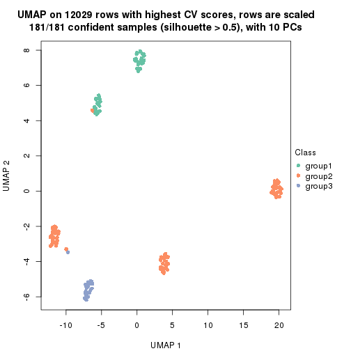</p>

</div>
<div id='tab-CV-pam-dimension-reduction-3'>
<pre><code class="r">dimension_reduction(res, k = 4, method = &quot;UMAP&quot;)
</code></pre>

<p></p>

</div>
<div id='tab-CV-pam-dimension-reduction-4'>
<pre><code class="r">dimension_reduction(res, k = 5, method = &quot;UMAP&quot;)
</code></pre>

<p></p>

</div>
<div id='tab-CV-pam-dimension-reduction-5'>
<pre><code class="r">dimension_reduction(res, k = 6, method = &quot;UMAP&quot;)
</code></pre>

<p></p>

</div>
</div>


Following heatmap shows how subgroups are split when increasing `k`:

```r
collect_classes(res)
```


If matrix rows can be associated to genes, consider to use `functional_enrichment(res,
...)` to perform function enrichment for the signature genes. See [this vignette](http://bioconductor.org/packages/devel/bioc/vignettes/cola/inst/doc/functional_enrichment.html) for more detailed explanations.


 

---------------------------------------------------


### CV:mclust


The object with results only for a single top-value method and a single partition method 
can be extracted as:

```r
res = res_list["CV", "mclust"]
# you can also extract it by
# res = res_list["CV:mclust"]
```

A summary of `res` and all the functions that can be applied to it:

```r
res
```

```
#> A 'ConsensusPartition' object with k = 2, 3, 4, 5, 6.
#>   On a matrix with 12029 rows and 181 columns.
#>   Top rows (1000, 2000, 3000, 4000, 5000) are extracted by 'CV' method.
#>   Subgroups are detected by 'mclust' method.
#>   Performed in total 1250 partitions by row resampling.
#>   Best k for subgroups seems to be 6.
#> 
#> Following methods can be applied to this 'ConsensusPartition' object:
#>  [1] "cola_report"             "collect_classes"         "collect_plots"          
#>  [4] "collect_stats"           "colnames"                "compare_signatures"     
#>  [7] "consensus_heatmap"       "dimension_reduction"     "functional_enrichment"  
#> [10] "get_anno_col"            "get_anno"                "get_classes"            
#> [13] "get_consensus"           "get_matrix"              "get_membership"         
#> [16] "get_param"               "get_signatures"          "get_stats"              
#> [19] "is_best_k"               "is_stable_k"             "membership_heatmap"     
#> [22] "ncol"                    "nrow"                    "plot_ecdf"              
#> [25] "rownames"                "select_partition_number" "show"                   
#> [28] "suggest_best_k"          "test_to_known_factors"
```

`collect_plots()` function collects all the plots made from `res` for all `k` (number of partitions)
into one single page to provide an easy and fast comparison between different `k`.

```r
collect_plots(res)
```


The plots are:

- The first row: a plot of the ECDF (empirical cumulative distribution
  function) curves of the consensus matrix for each `k` and the heatmap of
  predicted classes for each `k`.
- The second row: heatmaps of the consensus matrix for each `k`.
- The third row: heatmaps of the membership matrix for each `k`.
- The fouth row: heatmaps of the signatures for each `k`.

All the plots in panels can be made by individual functions and they are
plotted later in this section.

`select_partition_number()` produces several plots showing different
statistics for choosing "optimized" `k`. There are following statistics:

- ECDF curves of the consensus matrix for each `k`;
- 1-PAC. [The PAC
  score](https://en.wikipedia.org/wiki/Consensus_clustering#Over-interpretation_potential_of_consensus_clustering)
  measures the proportion of the ambiguous subgrouping.
- Mean silhouette score.
- Concordance. The mean probability of fiting the consensus class ids in all
  partitions.
- Area increased. Denote $A_k$ as the area under the ECDF curve for current
  `k`, the area increased is defined as $A_k - A_{k-1}$.
- Rand index. The percent of pairs of samples that are both in a same cluster
  or both are not in a same cluster in the partition of k and k-1.
- Jaccard index. The ratio of pairs of samples are both in a same cluster in
  the partition of k and k-1 and the pairs of samples are both in a same
  cluster in the partition k or k-1.

The detailed explanations of these statistics can be found in [the _cola_
vignette](http://bioconductor.org/packages/devel/bioc/vignettes/cola/inst/doc/cola.html#toc_13).

Generally speaking, lower PAC score, higher mean silhouette score or higher
concordance corresponds to better partition. Rand index and Jaccard index
measure how similar the current partition is compared to partition with `k-1`.
If they are too similar, we won't accept `k` is better than `k-1`.

```r
select_partition_number(res)
```


The numeric values for all these statistics can be obtained by `get_stats()`.

```r
get_stats(res)
```

```
#>   k 1-PAC mean_silhouette concordance area_increased  Rand Jaccard
#> 2 2 0.673           0.881       0.934         0.4849 0.497   0.497
#> 3 3 0.647           0.787       0.858         0.3178 0.809   0.632
#> 4 4 0.790           0.842       0.901         0.0810 0.974   0.927
#> 5 5 0.807           0.814       0.870         0.1024 0.911   0.724
#> 6 6 0.896           0.886       0.927         0.0578 0.953   0.803
```

`suggest_best_k()` suggests the best $k$ based on these statistics. The rules are as follows:

- All $k$ with Jaccard index larger than 0.95 are removed because increasing
  $k$ does not provide enough extra information. If all $k$ are removed, it is
  marked as no subgroup is detected.
- For all $k$ with 1-PAC score larger than 0.9, the maximal $k$ is taken as
  the best $k$, and other $k$ are marked as optional $k$.
- If it does not fit the second rule. The $k$ with the maximal vote of the
  highest 1-PAC score, highest mean silhouette, and highest concordance is
  taken as the best $k$.

```r
suggest_best_k(res)
```

```
#> [1] 6
```


Following shows the table of the partitions (You need to click the **show/hide
code output** link to see it). The membership matrix (columns with name `p*`)
is inferred by
[`clue::cl_consensus()`](https://www.rdocumentation.org/link/cl_consensus?package=clue)
function with the `SE` method. Basically the value in the membership matrix
represents the probability to belong to a certain group. The finall class
label for an item is determined with the group with highest probability it
belongs to.

In `get_classes()` function, the entropy is calculated from the membership
matrix and the silhouette score is calculated from the consensus matrix.


<script>
$( function() {
	$( '#tabs-CV-mclust-get-classes' ).tabs();
} );
</script>
<div id='tabs-CV-mclust-get-classes'>
<ul>
<li><a href='#tab-CV-mclust-get-classes-1'>k = 2</a></li>
<li><a href='#tab-CV-mclust-get-classes-2'>k = 3</a></li>
<li><a href='#tab-CV-mclust-get-classes-3'>k = 4</a></li>
<li><a href='#tab-CV-mclust-get-classes-4'>k = 5</a></li>
<li><a href='#tab-CV-mclust-get-classes-5'>k = 6</a></li>
</ul>

<div id='tab-CV-mclust-get-classes-1'>
<p><a id='tab-CV-mclust-get-classes-1-a' style='color:#0366d6' href='#'>show/hide code output</a></p>
<pre><code class="r">cbind(get_classes(res, k = 2), get_membership(res, k = 2))
</code></pre>

<pre><code>#&gt;           class entropy silhouette    p1    p2
#&gt; SRR315112     2   0.980      0.485 0.416 0.584
#&gt; SRR315113     1   1.000     -0.238 0.504 0.496
#&gt; SRR315114     1   1.000     -0.238 0.504 0.496
#&gt; SRR315115     2   0.980      0.485 0.416 0.584
#&gt; SRR315116     2   0.980      0.485 0.416 0.584
#&gt; SRR566986     2   0.000      0.880 0.000 1.000
#&gt; SRR566987     2   0.000      0.880 0.000 1.000
#&gt; SRR566988     2   0.000      0.880 0.000 1.000
#&gt; SRR566989     2   0.000      0.880 0.000 1.000
#&gt; SRR566990     2   0.000      0.880 0.000 1.000
#&gt; SRR566991     2   0.000      0.880 0.000 1.000
#&gt; SRR566992     2   0.000      0.880 0.000 1.000
#&gt; SRR566993     2   0.000      0.880 0.000 1.000
#&gt; SRR566994     2   0.000      0.880 0.000 1.000
#&gt; SRR566995     2   0.000      0.880 0.000 1.000
#&gt; SRR566996     2   0.000      0.880 0.000 1.000
#&gt; SRR566997     2   0.000      0.880 0.000 1.000
#&gt; SRR566998     2   0.000      0.880 0.000 1.000
#&gt; SRR566999     2   0.000      0.880 0.000 1.000
#&gt; SRR567000     2   0.000      0.880 0.000 1.000
#&gt; SRR567001     2   0.000      0.880 0.000 1.000
#&gt; SRR567002     2   0.000      0.880 0.000 1.000
#&gt; SRR567003     2   0.000      0.880 0.000 1.000
#&gt; SRR567004     2   0.000      0.880 0.000 1.000
#&gt; SRR567005     2   0.000      0.880 0.000 1.000
#&gt; SRR567006     2   0.000      0.880 0.000 1.000
#&gt; SRR567007     2   0.000      0.880 0.000 1.000
#&gt; SRR567008     2   0.000      0.880 0.000 1.000
#&gt; SRR567009     2   0.000      0.880 0.000 1.000
#&gt; SRR567010     2   0.000      0.880 0.000 1.000
#&gt; SRR567011     2   0.000      0.880 0.000 1.000
#&gt; SRR567012     2   0.000      0.880 0.000 1.000
#&gt; SRR567013     2   0.000      0.880 0.000 1.000
#&gt; SRR567014     2   0.730      0.810 0.204 0.796
#&gt; SRR567015     2   0.730      0.810 0.204 0.796
#&gt; SRR567016     2   0.730      0.810 0.204 0.796
#&gt; SRR567017     2   0.730      0.810 0.204 0.796
#&gt; SRR567018     2   0.730      0.810 0.204 0.796
#&gt; SRR567019     2   0.730      0.810 0.204 0.796
#&gt; SRR567020     2   0.730      0.810 0.204 0.796
#&gt; SRR567021     2   0.730      0.810 0.204 0.796
#&gt; SRR567022     1   0.909      0.416 0.676 0.324
#&gt; SRR567023     2   0.730      0.810 0.204 0.796
#&gt; SRR567024     2   0.730      0.810 0.204 0.796
#&gt; SRR567025     2   0.730      0.810 0.204 0.796
#&gt; SRR567026     2   0.730      0.810 0.204 0.796
#&gt; SRR567027     2   0.730      0.810 0.204 0.796
#&gt; SRR567028     2   0.730      0.810 0.204 0.796
#&gt; SRR567029     2   0.730      0.810 0.204 0.796
#&gt; SRR567030     2   0.730      0.810 0.204 0.796
#&gt; SRR567031     2   0.730      0.810 0.204 0.796
#&gt; SRR567032     2   0.730      0.810 0.204 0.796
#&gt; SRR567033     2   0.730      0.810 0.204 0.796
#&gt; SRR567034     2   0.730      0.810 0.204 0.796
#&gt; SRR567035     2   0.730      0.810 0.204 0.796
#&gt; SRR567036     2   0.730      0.810 0.204 0.796
#&gt; SRR567037     2   0.730      0.810 0.204 0.796
#&gt; SRR567038     2   0.730      0.810 0.204 0.796
#&gt; SRR567039     2   0.730      0.810 0.204 0.796
#&gt; SRR567040     2   0.730      0.810 0.204 0.796
#&gt; SRR567041     2   0.730      0.810 0.204 0.796
#&gt; SRR567042     1   0.909      0.416 0.676 0.324
#&gt; SRR567043     2   0.730      0.810 0.204 0.796
#&gt; SRR567044     2   0.388      0.884 0.076 0.924
#&gt; SRR567045     2   0.388      0.884 0.076 0.924
#&gt; SRR567046     2   0.388      0.884 0.076 0.924
#&gt; SRR567047     2   0.388      0.884 0.076 0.924
#&gt; SRR567048     2   0.388      0.884 0.076 0.924
#&gt; SRR567049     2   0.388      0.884 0.076 0.924
#&gt; SRR567050     2   0.388      0.884 0.076 0.924
#&gt; SRR567051     2   0.388      0.884 0.076 0.924
#&gt; SRR567052     2   0.388      0.884 0.076 0.924
#&gt; SRR567053     2   0.388      0.884 0.076 0.924
#&gt; SRR567054     2   0.388      0.884 0.076 0.924
#&gt; SRR567055     2   0.388      0.884 0.076 0.924
#&gt; SRR567056     2   0.388      0.884 0.076 0.924
#&gt; SRR567057     2   0.388      0.884 0.076 0.924
#&gt; SRR567058     2   0.388      0.884 0.076 0.924
#&gt; SRR567059     2   0.615      0.831 0.152 0.848
#&gt; SRR567060     2   0.388      0.884 0.076 0.924
#&gt; SRR567061     2   0.388      0.884 0.076 0.924
#&gt; SRR567062     2   0.388      0.884 0.076 0.924
#&gt; SRR567063     2   0.388      0.884 0.076 0.924
#&gt; SRR567064     2   0.615      0.831 0.152 0.848
#&gt; SRR567065     2   0.388      0.884 0.076 0.924
#&gt; SRR567066     2   0.388      0.884 0.076 0.924
#&gt; SRR567067     2   0.388      0.884 0.076 0.924
#&gt; SRR567068     2   0.388      0.884 0.076 0.924
#&gt; SRR567069     2   0.388      0.884 0.076 0.924
#&gt; SRR567070     2   0.388      0.884 0.076 0.924
#&gt; SRR567071     2   0.388      0.884 0.076 0.924
#&gt; SRR567072     2   0.388      0.884 0.076 0.924
#&gt; SRR567073     2   0.388      0.884 0.076 0.924
#&gt; SRR567074     2   0.388      0.884 0.076 0.924
#&gt; SRR567075     2   0.388      0.884 0.076 0.924
#&gt; SRR567076     1   0.000      0.967 1.000 0.000
#&gt; SRR567077     1   0.000      0.967 1.000 0.000
#&gt; SRR567078     1   0.000      0.967 1.000 0.000
#&gt; SRR567079     1   0.000      0.967 1.000 0.000
#&gt; SRR567080     1   0.000      0.967 1.000 0.000
#&gt; SRR567081     1   0.000      0.967 1.000 0.000
#&gt; SRR567082     1   0.000      0.967 1.000 0.000
#&gt; SRR567083     1   0.000      0.967 1.000 0.000
#&gt; SRR567084     1   0.000      0.967 1.000 0.000
#&gt; SRR567085     1   0.000      0.967 1.000 0.000
#&gt; SRR567086     1   0.000      0.967 1.000 0.000
#&gt; SRR567087     1   0.000      0.967 1.000 0.000
#&gt; SRR567088     1   0.000      0.967 1.000 0.000
#&gt; SRR567089     1   0.000      0.967 1.000 0.000
#&gt; SRR567090     1   0.000      0.967 1.000 0.000
#&gt; SRR567091     1   0.000      0.967 1.000 0.000
#&gt; SRR567092     1   0.000      0.967 1.000 0.000
#&gt; SRR567093     1   0.000      0.967 1.000 0.000
#&gt; SRR567094     1   0.000      0.967 1.000 0.000
#&gt; SRR567095     1   0.000      0.967 1.000 0.000
#&gt; SRR567096     1   0.000      0.967 1.000 0.000
#&gt; SRR567097     1   0.000      0.967 1.000 0.000
#&gt; SRR567098     1   0.000      0.967 1.000 0.000
#&gt; SRR567099     1   0.000      0.967 1.000 0.000
#&gt; SRR567100     1   0.000      0.967 1.000 0.000
#&gt; SRR567101     1   0.000      0.967 1.000 0.000
#&gt; SRR567102     1   0.529      0.828 0.880 0.120
#&gt; SRR567103     1   0.529      0.828 0.880 0.120
#&gt; SRR567104     1   0.000      0.967 1.000 0.000
#&gt; SRR567105     1   0.000      0.967 1.000 0.000
#&gt; SRR567106     1   0.000      0.967 1.000 0.000
#&gt; SRR567107     1   0.000      0.967 1.000 0.000
#&gt; SRR567108     1   0.000      0.967 1.000 0.000
#&gt; SRR567109     1   0.000      0.967 1.000 0.000
#&gt; SRR567110     1   0.000      0.967 1.000 0.000
#&gt; SRR567111     1   0.000      0.967 1.000 0.000
#&gt; SRR567112     1   0.000      0.967 1.000 0.000
#&gt; SRR567113     1   0.000      0.967 1.000 0.000
#&gt; SRR567114     1   0.000      0.967 1.000 0.000
#&gt; SRR567115     1   0.000      0.967 1.000 0.000
#&gt; SRR567116     1   0.000      0.967 1.000 0.000
#&gt; SRR567117     1   0.000      0.967 1.000 0.000
#&gt; SRR567118     1   0.000      0.967 1.000 0.000
#&gt; SRR567119     1   0.000      0.967 1.000 0.000
#&gt; SRR567120     1   0.000      0.967 1.000 0.000
#&gt; SRR567121     1   0.000      0.967 1.000 0.000
#&gt; SRR567122     1   0.000      0.967 1.000 0.000
#&gt; SRR567123     1   0.000      0.967 1.000 0.000
#&gt; SRR567124     1   0.000      0.967 1.000 0.000
#&gt; SRR567125     1   0.000      0.967 1.000 0.000
#&gt; SRR567126     1   0.000      0.967 1.000 0.000
#&gt; SRR567127     1   0.000      0.967 1.000 0.000
#&gt; SRR567128     1   0.000      0.967 1.000 0.000
#&gt; SRR567129     1   0.000      0.967 1.000 0.000
#&gt; SRR567130     1   0.000      0.967 1.000 0.000
#&gt; SRR567131     1   0.000      0.967 1.000 0.000
#&gt; SRR567132     1   0.000      0.967 1.000 0.000
#&gt; SRR567133     1   0.000      0.967 1.000 0.000
#&gt; SRR567134     1   0.000      0.967 1.000 0.000
#&gt; SRR567135     1   0.000      0.967 1.000 0.000
#&gt; SRR567136     1   0.529      0.828 0.880 0.120
#&gt; SRR567137     1   0.000      0.967 1.000 0.000
#&gt; SRR567138     1   0.000      0.967 1.000 0.000
#&gt; SRR567139     1   0.000      0.967 1.000 0.000
#&gt; SRR567140     1   0.000      0.967 1.000 0.000
#&gt; SRR567141     1   0.000      0.967 1.000 0.000
#&gt; SRR567142     1   0.000      0.967 1.000 0.000
#&gt; SRR567143     1   0.000      0.967 1.000 0.000
#&gt; SRR567144     1   0.000      0.967 1.000 0.000
#&gt; SRR567145     1   0.000      0.967 1.000 0.000
#&gt; SRR567146     1   0.653      0.756 0.832 0.168
#&gt; SRR567147     1   0.000      0.967 1.000 0.000
#&gt; SRR567148     1   0.000      0.967 1.000 0.000
#&gt; SRR567149     1   0.000      0.967 1.000 0.000
#&gt; SRR567150     1   0.000      0.967 1.000 0.000
#&gt; SRR567151     1   0.000      0.967 1.000 0.000
#&gt; SRR567152     1   0.000      0.967 1.000 0.000
#&gt; SRR567153     1   0.000      0.967 1.000 0.000
#&gt; SRR567154     1   0.000      0.967 1.000 0.000
#&gt; SRR567155     1   0.000      0.967 1.000 0.000
#&gt; SRR567156     1   0.000      0.967 1.000 0.000
#&gt; SRR567157     1   0.000      0.967 1.000 0.000
#&gt; SRR567158     1   0.000      0.967 1.000 0.000
#&gt; SRR567159     1   0.529      0.828 0.880 0.120
#&gt; SRR567160     1   0.000      0.967 1.000 0.000
#&gt; SRR567161     1   0.653      0.756 0.832 0.168
</code></pre>

<script>
$('#tab-CV-mclust-get-classes-1-a').parent().next().next().hide();
$('#tab-CV-mclust-get-classes-1-a').click(function(){
  $('#tab-CV-mclust-get-classes-1-a').parent().next().next().toggle();
  return(false);
});
</script>
</div>

<div id='tab-CV-mclust-get-classes-2'>
<p><a id='tab-CV-mclust-get-classes-2-a' style='color:#0366d6' href='#'>show/hide code output</a></p>
<pre><code class="r">cbind(get_classes(res, k = 3), get_membership(res, k = 3))
</code></pre>

<pre><code>#&gt;           class entropy silhouette    p1    p2    p3
#&gt; SRR315112     3   0.631      0.527 0.000 0.492 0.508
#&gt; SRR315113     3   0.631      0.527 0.000 0.496 0.504
#&gt; SRR315114     3   0.631      0.527 0.000 0.496 0.504
#&gt; SRR315115     3   0.631      0.527 0.000 0.492 0.508
#&gt; SRR315116     3   0.631      0.527 0.000 0.492 0.508
#&gt; SRR566986     2   0.631      0.721 0.000 0.504 0.496
#&gt; SRR566987     2   0.631      0.721 0.000 0.504 0.496
#&gt; SRR566988     2   0.631      0.721 0.000 0.504 0.496
#&gt; SRR566989     2   0.631      0.721 0.000 0.504 0.496
#&gt; SRR566990     2   0.631      0.721 0.000 0.504 0.496
#&gt; SRR566991     2   0.631      0.721 0.000 0.504 0.496
#&gt; SRR566992     2   0.631      0.721 0.000 0.504 0.496
#&gt; SRR566993     2   0.631      0.721 0.000 0.504 0.496
#&gt; SRR566994     2   0.631      0.721 0.000 0.504 0.496
#&gt; SRR566995     2   0.631      0.721 0.000 0.504 0.496
#&gt; SRR566996     2   0.631      0.721 0.000 0.504 0.496
#&gt; SRR566997     2   0.631      0.721 0.000 0.504 0.496
#&gt; SRR566998     2   0.631      0.721 0.000 0.504 0.496
#&gt; SRR566999     2   0.631      0.721 0.000 0.504 0.496
#&gt; SRR567000     2   0.631      0.721 0.000 0.504 0.496
#&gt; SRR567001     2   0.631      0.721 0.000 0.504 0.496
#&gt; SRR567002     2   0.631      0.721 0.000 0.504 0.496
#&gt; SRR567003     2   0.631      0.721 0.000 0.504 0.496
#&gt; SRR567004     2   0.631      0.721 0.000 0.504 0.496
#&gt; SRR567005     2   0.631      0.721 0.000 0.504 0.496
#&gt; SRR567006     2   0.631      0.721 0.000 0.504 0.496
#&gt; SRR567007     2   0.631      0.721 0.000 0.504 0.496
#&gt; SRR567008     2   0.631      0.721 0.000 0.504 0.496
#&gt; SRR567009     2   0.631      0.721 0.000 0.504 0.496
#&gt; SRR567010     2   0.631      0.721 0.000 0.504 0.496
#&gt; SRR567011     2   0.631      0.721 0.000 0.504 0.496
#&gt; SRR567012     2   0.631      0.721 0.000 0.504 0.496
#&gt; SRR567013     2   0.631      0.721 0.000 0.504 0.496
#&gt; SRR567014     2   0.470      0.751 0.000 0.788 0.212
#&gt; SRR567015     2   0.470      0.751 0.000 0.788 0.212
#&gt; SRR567016     2   0.470      0.751 0.000 0.788 0.212
#&gt; SRR567017     2   0.470      0.751 0.000 0.788 0.212
#&gt; SRR567018     2   0.470      0.751 0.000 0.788 0.212
#&gt; SRR567019     2   0.470      0.751 0.000 0.788 0.212
#&gt; SRR567020     2   0.470      0.751 0.000 0.788 0.212
#&gt; SRR567021     2   0.470      0.751 0.000 0.788 0.212
#&gt; SRR567022     3   0.631      0.527 0.000 0.496 0.504
#&gt; SRR567023     2   0.470      0.751 0.000 0.788 0.212
#&gt; SRR567024     2   0.470      0.751 0.000 0.788 0.212
#&gt; SRR567025     2   0.470      0.751 0.000 0.788 0.212
#&gt; SRR567026     2   0.470      0.751 0.000 0.788 0.212
#&gt; SRR567027     2   0.470      0.751 0.000 0.788 0.212
#&gt; SRR567028     2   0.470      0.751 0.000 0.788 0.212
#&gt; SRR567029     2   0.470      0.751 0.000 0.788 0.212
#&gt; SRR567030     2   0.470      0.751 0.000 0.788 0.212
#&gt; SRR567031     2   0.470      0.751 0.000 0.788 0.212
#&gt; SRR567032     2   0.470      0.751 0.000 0.788 0.212
#&gt; SRR567033     2   0.475      0.747 0.000 0.784 0.216
#&gt; SRR567034     2   0.470      0.751 0.000 0.788 0.212
#&gt; SRR567035     2   0.470      0.751 0.000 0.788 0.212
#&gt; SRR567036     2   0.470      0.751 0.000 0.788 0.212
#&gt; SRR567037     2   0.470      0.751 0.000 0.788 0.212
#&gt; SRR567038     2   0.470      0.751 0.000 0.788 0.212
#&gt; SRR567039     2   0.470      0.751 0.000 0.788 0.212
#&gt; SRR567040     2   0.470      0.751 0.000 0.788 0.212
#&gt; SRR567041     2   0.475      0.747 0.000 0.784 0.216
#&gt; SRR567042     3   0.631      0.527 0.000 0.496 0.504
#&gt; SRR567043     2   0.470      0.751 0.000 0.788 0.212
#&gt; SRR567044     3   0.000      0.760 0.000 0.000 1.000
#&gt; SRR567045     3   0.000      0.760 0.000 0.000 1.000
#&gt; SRR567046     3   0.000      0.760 0.000 0.000 1.000
#&gt; SRR567047     3   0.000      0.760 0.000 0.000 1.000
#&gt; SRR567048     3   0.000      0.760 0.000 0.000 1.000
#&gt; SRR567049     3   0.000      0.760 0.000 0.000 1.000
#&gt; SRR567050     3   0.000      0.760 0.000 0.000 1.000
#&gt; SRR567051     3   0.000      0.760 0.000 0.000 1.000
#&gt; SRR567052     3   0.000      0.760 0.000 0.000 1.000
#&gt; SRR567053     3   0.000      0.760 0.000 0.000 1.000
#&gt; SRR567054     3   0.000      0.760 0.000 0.000 1.000
#&gt; SRR567055     3   0.000      0.760 0.000 0.000 1.000
#&gt; SRR567056     3   0.000      0.760 0.000 0.000 1.000
#&gt; SRR567057     3   0.000      0.760 0.000 0.000 1.000
#&gt; SRR567058     3   0.000      0.760 0.000 0.000 1.000
#&gt; SRR567059     3   0.460      0.663 0.000 0.204 0.796
#&gt; SRR567060     3   0.000      0.760 0.000 0.000 1.000
#&gt; SRR567061     3   0.000      0.760 0.000 0.000 1.000
#&gt; SRR567062     3   0.000      0.760 0.000 0.000 1.000
#&gt; SRR567063     3   0.000      0.760 0.000 0.000 1.000
#&gt; SRR567064     3   0.460      0.663 0.000 0.204 0.796
#&gt; SRR567065     3   0.000      0.760 0.000 0.000 1.000
#&gt; SRR567066     3   0.000      0.760 0.000 0.000 1.000
#&gt; SRR567067     3   0.000      0.760 0.000 0.000 1.000
#&gt; SRR567068     3   0.000      0.760 0.000 0.000 1.000
#&gt; SRR567069     3   0.000      0.760 0.000 0.000 1.000
#&gt; SRR567070     3   0.000      0.760 0.000 0.000 1.000
#&gt; SRR567071     3   0.000      0.760 0.000 0.000 1.000
#&gt; SRR567072     3   0.000      0.760 0.000 0.000 1.000
#&gt; SRR567073     3   0.000      0.760 0.000 0.000 1.000
#&gt; SRR567074     3   0.000      0.760 0.000 0.000 1.000
#&gt; SRR567075     3   0.000      0.760 0.000 0.000 1.000
#&gt; SRR567076     1   0.000      0.917 1.000 0.000 0.000
#&gt; SRR567077     1   0.000      0.917 1.000 0.000 0.000
#&gt; SRR567078     1   0.000      0.917 1.000 0.000 0.000
#&gt; SRR567079     1   0.000      0.917 1.000 0.000 0.000
#&gt; SRR567080     1   0.000      0.917 1.000 0.000 0.000
#&gt; SRR567081     1   0.000      0.917 1.000 0.000 0.000
#&gt; SRR567082     1   0.000      0.917 1.000 0.000 0.000
#&gt; SRR567083     1   0.000      0.917 1.000 0.000 0.000
#&gt; SRR567084     1   0.000      0.917 1.000 0.000 0.000
#&gt; SRR567085     1   0.000      0.917 1.000 0.000 0.000
#&gt; SRR567086     1   0.000      0.917 1.000 0.000 0.000
#&gt; SRR567087     1   0.000      0.917 1.000 0.000 0.000
#&gt; SRR567088     1   0.000      0.917 1.000 0.000 0.000
#&gt; SRR567089     1   0.000      0.917 1.000 0.000 0.000
#&gt; SRR567090     1   0.000      0.917 1.000 0.000 0.000
#&gt; SRR567091     1   0.000      0.917 1.000 0.000 0.000
#&gt; SRR567092     1   0.000      0.917 1.000 0.000 0.000
#&gt; SRR567093     1   0.000      0.917 1.000 0.000 0.000
#&gt; SRR567094     1   0.000      0.917 1.000 0.000 0.000
#&gt; SRR567095     1   0.000      0.917 1.000 0.000 0.000
#&gt; SRR567096     1   0.000      0.917 1.000 0.000 0.000
#&gt; SRR567097     1   0.000      0.917 1.000 0.000 0.000
#&gt; SRR567098     1   0.000      0.917 1.000 0.000 0.000
#&gt; SRR567099     1   0.000      0.917 1.000 0.000 0.000
#&gt; SRR567100     1   0.000      0.917 1.000 0.000 0.000
#&gt; SRR567101     1   0.000      0.917 1.000 0.000 0.000
#&gt; SRR567102     3   0.631      0.527 0.000 0.496 0.504
#&gt; SRR567103     3   0.631      0.527 0.000 0.496 0.504
#&gt; SRR567104     1   0.000      0.917 1.000 0.000 0.000
#&gt; SRR567105     1   0.000      0.917 1.000 0.000 0.000
#&gt; SRR567106     1   0.000      0.917 1.000 0.000 0.000
#&gt; SRR567107     1   0.000      0.917 1.000 0.000 0.000
#&gt; SRR567108     1   0.000      0.917 1.000 0.000 0.000
#&gt; SRR567109     1   0.000      0.917 1.000 0.000 0.000
#&gt; SRR567110     1   0.000      0.917 1.000 0.000 0.000
#&gt; SRR567111     1   0.000      0.917 1.000 0.000 0.000
#&gt; SRR567112     1   0.000      0.917 1.000 0.000 0.000
#&gt; SRR567113     1   0.000      0.917 1.000 0.000 0.000
#&gt; SRR567114     1   0.000      0.917 1.000 0.000 0.000
#&gt; SRR567115     1   0.000      0.917 1.000 0.000 0.000
#&gt; SRR567116     1   0.000      0.917 1.000 0.000 0.000
#&gt; SRR567117     1   0.000      0.917 1.000 0.000 0.000
#&gt; SRR567118     1   0.000      0.917 1.000 0.000 0.000
#&gt; SRR567119     1   0.000      0.917 1.000 0.000 0.000
#&gt; SRR567120     1   0.000      0.917 1.000 0.000 0.000
#&gt; SRR567121     1   0.226      0.886 0.932 0.068 0.000
#&gt; SRR567122     1   0.000      0.917 1.000 0.000 0.000
#&gt; SRR567123     1   0.000      0.917 1.000 0.000 0.000
#&gt; SRR567124     1   0.000      0.917 1.000 0.000 0.000
#&gt; SRR567125     1   0.000      0.917 1.000 0.000 0.000
#&gt; SRR567126     1   0.000      0.917 1.000 0.000 0.000
#&gt; SRR567127     1   0.000      0.917 1.000 0.000 0.000
#&gt; SRR567128     1   0.000      0.917 1.000 0.000 0.000
#&gt; SRR567129     1   0.000      0.917 1.000 0.000 0.000
#&gt; SRR567130     1   0.000      0.917 1.000 0.000 0.000
#&gt; SRR567131     1   0.000      0.917 1.000 0.000 0.000
#&gt; SRR567132     1   0.226      0.886 0.932 0.068 0.000
#&gt; SRR567133     1   0.000      0.917 1.000 0.000 0.000
#&gt; SRR567134     1   0.510      0.790 0.752 0.248 0.000
#&gt; SRR567135     1   0.510      0.790 0.752 0.248 0.000
#&gt; SRR567136     3   0.631      0.527 0.000 0.496 0.504
#&gt; SRR567137     1   0.510      0.790 0.752 0.248 0.000
#&gt; SRR567138     1   0.510      0.790 0.752 0.248 0.000
#&gt; SRR567139     1   0.510      0.790 0.752 0.248 0.000
#&gt; SRR567140     1   0.510      0.790 0.752 0.248 0.000
#&gt; SRR567141     1   0.510      0.790 0.752 0.248 0.000
#&gt; SRR567142     1   0.510      0.790 0.752 0.248 0.000
#&gt; SRR567143     1   0.510      0.790 0.752 0.248 0.000
#&gt; SRR567144     1   0.510      0.790 0.752 0.248 0.000
#&gt; SRR567145     1   0.510      0.790 0.752 0.248 0.000
#&gt; SRR567146     3   0.631      0.527 0.000 0.496 0.504
#&gt; SRR567147     1   0.510      0.790 0.752 0.248 0.000
#&gt; SRR567148     1   0.510      0.790 0.752 0.248 0.000
#&gt; SRR567149     1   0.510      0.790 0.752 0.248 0.000
#&gt; SRR567150     1   0.510      0.790 0.752 0.248 0.000
#&gt; SRR567151     1   0.510      0.790 0.752 0.248 0.000
#&gt; SRR567152     1   0.510      0.790 0.752 0.248 0.000
#&gt; SRR567153     1   0.510      0.790 0.752 0.248 0.000
#&gt; SRR567154     1   0.510      0.790 0.752 0.248 0.000
#&gt; SRR567155     1   0.510      0.790 0.752 0.248 0.000
#&gt; SRR567156     1   0.510      0.790 0.752 0.248 0.000
#&gt; SRR567157     1   0.510      0.790 0.752 0.248 0.000
#&gt; SRR567158     1   0.510      0.790 0.752 0.248 0.000
#&gt; SRR567159     3   0.631      0.527 0.000 0.496 0.504
#&gt; SRR567160     1   0.510      0.790 0.752 0.248 0.000
#&gt; SRR567161     3   0.631      0.527 0.000 0.496 0.504
</code></pre>

<script>
$('#tab-CV-mclust-get-classes-2-a').parent().next().next().hide();
$('#tab-CV-mclust-get-classes-2-a').click(function(){
  $('#tab-CV-mclust-get-classes-2-a').parent().next().next().toggle();
  return(false);
});
</script>
</div>

<div id='tab-CV-mclust-get-classes-3'>
<p><a id='tab-CV-mclust-get-classes-3-a' style='color:#0366d6' href='#'>show/hide code output</a></p>
<pre><code class="r">cbind(get_classes(res, k = 4), get_membership(res, k = 4))
</code></pre>

<pre><code>#&gt;           class entropy silhouette    p1    p2    p3    p4
#&gt; SRR315112     4   0.000      1.000 0.000 0.000 0.000 1.000
#&gt; SRR315113     4   0.000      1.000 0.000 0.000 0.000 1.000
#&gt; SRR315114     4   0.000      1.000 0.000 0.000 0.000 1.000
#&gt; SRR315115     4   0.000      1.000 0.000 0.000 0.000 1.000
#&gt; SRR315116     4   0.000      1.000 0.000 0.000 0.000 1.000
#&gt; SRR566986     2   0.000      0.657 0.000 1.000 0.000 0.000
#&gt; SRR566987     2   0.000      0.657 0.000 1.000 0.000 0.000
#&gt; SRR566988     2   0.000      0.657 0.000 1.000 0.000 0.000
#&gt; SRR566989     2   0.000      0.657 0.000 1.000 0.000 0.000
#&gt; SRR566990     2   0.000      0.657 0.000 1.000 0.000 0.000
#&gt; SRR566991     2   0.000      0.657 0.000 1.000 0.000 0.000
#&gt; SRR566992     2   0.000      0.657 0.000 1.000 0.000 0.000
#&gt; SRR566993     2   0.000      0.657 0.000 1.000 0.000 0.000
#&gt; SRR566994     2   0.000      0.657 0.000 1.000 0.000 0.000
#&gt; SRR566995     2   0.000      0.657 0.000 1.000 0.000 0.000
#&gt; SRR566996     2   0.000      0.657 0.000 1.000 0.000 0.000
#&gt; SRR566997     2   0.000      0.657 0.000 1.000 0.000 0.000
#&gt; SRR566998     2   0.000      0.657 0.000 1.000 0.000 0.000
#&gt; SRR566999     2   0.000      0.657 0.000 1.000 0.000 0.000
#&gt; SRR567000     2   0.000      0.657 0.000 1.000 0.000 0.000
#&gt; SRR567001     2   0.000      0.657 0.000 1.000 0.000 0.000
#&gt; SRR567002     2   0.000      0.657 0.000 1.000 0.000 0.000
#&gt; SRR567003     2   0.000      0.657 0.000 1.000 0.000 0.000
#&gt; SRR567004     2   0.000      0.657 0.000 1.000 0.000 0.000
#&gt; SRR567005     2   0.000      0.657 0.000 1.000 0.000 0.000
#&gt; SRR567006     2   0.000      0.657 0.000 1.000 0.000 0.000
#&gt; SRR567007     2   0.000      0.657 0.000 1.000 0.000 0.000
#&gt; SRR567008     2   0.000      0.657 0.000 1.000 0.000 0.000
#&gt; SRR567009     2   0.000      0.657 0.000 1.000 0.000 0.000
#&gt; SRR567010     2   0.000      0.657 0.000 1.000 0.000 0.000
#&gt; SRR567011     2   0.000      0.657 0.000 1.000 0.000 0.000
#&gt; SRR567012     2   0.000      0.657 0.000 1.000 0.000 0.000
#&gt; SRR567013     2   0.000      0.657 0.000 1.000 0.000 0.000
#&gt; SRR567014     2   0.485      0.737 0.000 0.600 0.400 0.000
#&gt; SRR567015     2   0.485      0.737 0.000 0.600 0.400 0.000
#&gt; SRR567016     2   0.485      0.737 0.000 0.600 0.400 0.000
#&gt; SRR567017     2   0.485      0.737 0.000 0.600 0.400 0.000
#&gt; SRR567018     2   0.485      0.737 0.000 0.600 0.400 0.000
#&gt; SRR567019     2   0.485      0.737 0.000 0.600 0.400 0.000
#&gt; SRR567020     2   0.485      0.737 0.000 0.600 0.400 0.000
#&gt; SRR567021     2   0.485      0.737 0.000 0.600 0.400 0.000
#&gt; SRR567022     4   0.000      1.000 0.000 0.000 0.000 1.000
#&gt; SRR567023     2   0.485      0.737 0.000 0.600 0.400 0.000
#&gt; SRR567024     2   0.485      0.737 0.000 0.600 0.400 0.000
#&gt; SRR567025     2   0.485      0.737 0.000 0.600 0.400 0.000
#&gt; SRR567026     2   0.485      0.737 0.000 0.600 0.400 0.000
#&gt; SRR567027     2   0.485      0.737 0.000 0.600 0.400 0.000
#&gt; SRR567028     2   0.485      0.737 0.000 0.600 0.400 0.000
#&gt; SRR567029     2   0.485      0.737 0.000 0.600 0.400 0.000
#&gt; SRR567030     2   0.485      0.737 0.000 0.600 0.400 0.000
#&gt; SRR567031     2   0.485      0.737 0.000 0.600 0.400 0.000
#&gt; SRR567032     2   0.485      0.737 0.000 0.600 0.400 0.000
#&gt; SRR567033     2   0.485      0.737 0.000 0.600 0.400 0.000
#&gt; SRR567034     2   0.485      0.737 0.000 0.600 0.400 0.000
#&gt; SRR567035     2   0.485      0.737 0.000 0.600 0.400 0.000
#&gt; SRR567036     2   0.485      0.737 0.000 0.600 0.400 0.000
#&gt; SRR567037     2   0.485      0.737 0.000 0.600 0.400 0.000
#&gt; SRR567038     2   0.485      0.737 0.000 0.600 0.400 0.000
#&gt; SRR567039     2   0.485      0.737 0.000 0.600 0.400 0.000
#&gt; SRR567040     2   0.485      0.737 0.000 0.600 0.400 0.000
#&gt; SRR567041     2   0.485      0.737 0.000 0.600 0.400 0.000
#&gt; SRR567042     4   0.000      1.000 0.000 0.000 0.000 1.000
#&gt; SRR567043     2   0.485      0.737 0.000 0.600 0.400 0.000
#&gt; SRR567044     3   0.485      0.984 0.000 0.400 0.600 0.000
#&gt; SRR567045     3   0.485      0.984 0.000 0.400 0.600 0.000
#&gt; SRR567046     3   0.485      0.984 0.000 0.400 0.600 0.000
#&gt; SRR567047     3   0.485      0.984 0.000 0.400 0.600 0.000
#&gt; SRR567048     3   0.485      0.984 0.000 0.400 0.600 0.000
#&gt; SRR567049     3   0.485      0.984 0.000 0.400 0.600 0.000
#&gt; SRR567050     3   0.485      0.984 0.000 0.400 0.600 0.000
#&gt; SRR567051     3   0.485      0.984 0.000 0.400 0.600 0.000
#&gt; SRR567052     3   0.485      0.984 0.000 0.400 0.600 0.000
#&gt; SRR567053     3   0.485      0.984 0.000 0.400 0.600 0.000
#&gt; SRR567054     3   0.485      0.984 0.000 0.400 0.600 0.000
#&gt; SRR567055     3   0.485      0.984 0.000 0.400 0.600 0.000
#&gt; SRR567056     3   0.485      0.984 0.000 0.400 0.600 0.000
#&gt; SRR567057     3   0.485      0.984 0.000 0.400 0.600 0.000
#&gt; SRR567058     3   0.485      0.984 0.000 0.400 0.600 0.000
#&gt; SRR567059     3   0.780      0.704 0.000 0.368 0.384 0.248
#&gt; SRR567060     3   0.485      0.984 0.000 0.400 0.600 0.000
#&gt; SRR567061     3   0.485      0.984 0.000 0.400 0.600 0.000
#&gt; SRR567062     3   0.485      0.984 0.000 0.400 0.600 0.000
#&gt; SRR567063     3   0.485      0.984 0.000 0.400 0.600 0.000
#&gt; SRR567064     3   0.780      0.704 0.000 0.368 0.384 0.248
#&gt; SRR567065     3   0.485      0.984 0.000 0.400 0.600 0.000
#&gt; SRR567066     3   0.485      0.984 0.000 0.400 0.600 0.000
#&gt; SRR567067     3   0.485      0.984 0.000 0.400 0.600 0.000
#&gt; SRR567068     3   0.485      0.984 0.000 0.400 0.600 0.000
#&gt; SRR567069     3   0.485      0.984 0.000 0.400 0.600 0.000
#&gt; SRR567070     3   0.485      0.984 0.000 0.400 0.600 0.000
#&gt; SRR567071     3   0.485      0.984 0.000 0.400 0.600 0.000
#&gt; SRR567072     3   0.485      0.984 0.000 0.400 0.600 0.000
#&gt; SRR567073     3   0.485      0.984 0.000 0.400 0.600 0.000
#&gt; SRR567074     3   0.485      0.984 0.000 0.400 0.600 0.000
#&gt; SRR567075     3   0.485      0.984 0.000 0.400 0.600 0.000
#&gt; SRR567076     1   0.000      0.913 1.000 0.000 0.000 0.000
#&gt; SRR567077     1   0.000      0.913 1.000 0.000 0.000 0.000
#&gt; SRR567078     1   0.000      0.913 1.000 0.000 0.000 0.000
#&gt; SRR567079     1   0.000      0.913 1.000 0.000 0.000 0.000
#&gt; SRR567080     1   0.000      0.913 1.000 0.000 0.000 0.000
#&gt; SRR567081     1   0.000      0.913 1.000 0.000 0.000 0.000
#&gt; SRR567082     1   0.000      0.913 1.000 0.000 0.000 0.000
#&gt; SRR567083     1   0.000      0.913 1.000 0.000 0.000 0.000
#&gt; SRR567084     1   0.000      0.913 1.000 0.000 0.000 0.000
#&gt; SRR567085     1   0.000      0.913 1.000 0.000 0.000 0.000
#&gt; SRR567086     1   0.000      0.913 1.000 0.000 0.000 0.000
#&gt; SRR567087     1   0.000      0.913 1.000 0.000 0.000 0.000
#&gt; SRR567088     1   0.000      0.913 1.000 0.000 0.000 0.000
#&gt; SRR567089     1   0.000      0.913 1.000 0.000 0.000 0.000
#&gt; SRR567090     1   0.000      0.913 1.000 0.000 0.000 0.000
#&gt; SRR567091     1   0.000      0.913 1.000 0.000 0.000 0.000
#&gt; SRR567092     1   0.000      0.913 1.000 0.000 0.000 0.000
#&gt; SRR567093     1   0.000      0.913 1.000 0.000 0.000 0.000
#&gt; SRR567094     1   0.000      0.913 1.000 0.000 0.000 0.000
#&gt; SRR567095     1   0.000      0.913 1.000 0.000 0.000 0.000
#&gt; SRR567096     1   0.000      0.913 1.000 0.000 0.000 0.000
#&gt; SRR567097     1   0.000      0.913 1.000 0.000 0.000 0.000
#&gt; SRR567098     1   0.000      0.913 1.000 0.000 0.000 0.000
#&gt; SRR567099     1   0.000      0.913 1.000 0.000 0.000 0.000
#&gt; SRR567100     1   0.000      0.913 1.000 0.000 0.000 0.000
#&gt; SRR567101     1   0.000      0.913 1.000 0.000 0.000 0.000
#&gt; SRR567102     4   0.000      1.000 0.000 0.000 0.000 1.000
#&gt; SRR567103     4   0.000      1.000 0.000 0.000 0.000 1.000
#&gt; SRR567104     1   0.000      0.913 1.000 0.000 0.000 0.000
#&gt; SRR567105     1   0.000      0.913 1.000 0.000 0.000 0.000
#&gt; SRR567106     1   0.000      0.913 1.000 0.000 0.000 0.000
#&gt; SRR567107     1   0.000      0.913 1.000 0.000 0.000 0.000
#&gt; SRR567108     1   0.000      0.913 1.000 0.000 0.000 0.000
#&gt; SRR567109     1   0.000      0.913 1.000 0.000 0.000 0.000
#&gt; SRR567110     1   0.000      0.913 1.000 0.000 0.000 0.000
#&gt; SRR567111     1   0.000      0.913 1.000 0.000 0.000 0.000
#&gt; SRR567112     1   0.000      0.913 1.000 0.000 0.000 0.000
#&gt; SRR567113     1   0.000      0.913 1.000 0.000 0.000 0.000
#&gt; SRR567114     1   0.000      0.913 1.000 0.000 0.000 0.000
#&gt; SRR567115     1   0.000      0.913 1.000 0.000 0.000 0.000
#&gt; SRR567116     1   0.000      0.913 1.000 0.000 0.000 0.000
#&gt; SRR567117     1   0.000      0.913 1.000 0.000 0.000 0.000
#&gt; SRR567118     1   0.000      0.913 1.000 0.000 0.000 0.000
#&gt; SRR567119     1   0.000      0.913 1.000 0.000 0.000 0.000
#&gt; SRR567120     1   0.000      0.913 1.000 0.000 0.000 0.000
#&gt; SRR567121     1   0.194      0.872 0.924 0.000 0.000 0.076
#&gt; SRR567122     1   0.000      0.913 1.000 0.000 0.000 0.000
#&gt; SRR567123     1   0.000      0.913 1.000 0.000 0.000 0.000
#&gt; SRR567124     1   0.000      0.913 1.000 0.000 0.000 0.000
#&gt; SRR567125     1   0.000      0.913 1.000 0.000 0.000 0.000
#&gt; SRR567126     1   0.000      0.913 1.000 0.000 0.000 0.000
#&gt; SRR567127     1   0.000      0.913 1.000 0.000 0.000 0.000
#&gt; SRR567128     1   0.000      0.913 1.000 0.000 0.000 0.000
#&gt; SRR567129     1   0.000      0.913 1.000 0.000 0.000 0.000
#&gt; SRR567130     1   0.000      0.913 1.000 0.000 0.000 0.000
#&gt; SRR567131     1   0.000      0.913 1.000 0.000 0.000 0.000
#&gt; SRR567132     1   0.194      0.872 0.924 0.000 0.000 0.076
#&gt; SRR567133     1   0.000      0.913 1.000 0.000 0.000 0.000
#&gt; SRR567134     1   0.407      0.764 0.748 0.000 0.000 0.252
#&gt; SRR567135     1   0.407      0.764 0.748 0.000 0.000 0.252
#&gt; SRR567136     4   0.000      1.000 0.000 0.000 0.000 1.000
#&gt; SRR567137     1   0.407      0.764 0.748 0.000 0.000 0.252
#&gt; SRR567138     1   0.407      0.764 0.748 0.000 0.000 0.252
#&gt; SRR567139     1   0.407      0.764 0.748 0.000 0.000 0.252
#&gt; SRR567140     1   0.407      0.764 0.748 0.000 0.000 0.252
#&gt; SRR567141     1   0.407      0.764 0.748 0.000 0.000 0.252
#&gt; SRR567142     1   0.407      0.764 0.748 0.000 0.000 0.252
#&gt; SRR567143     1   0.407      0.764 0.748 0.000 0.000 0.252
#&gt; SRR567144     1   0.407      0.764 0.748 0.000 0.000 0.252
#&gt; SRR567145     1   0.407      0.764 0.748 0.000 0.000 0.252
#&gt; SRR567146     4   0.000      1.000 0.000 0.000 0.000 1.000
#&gt; SRR567147     1   0.407      0.764 0.748 0.000 0.000 0.252
#&gt; SRR567148     1   0.407      0.764 0.748 0.000 0.000 0.252
#&gt; SRR567149     1   0.407      0.764 0.748 0.000 0.000 0.252
#&gt; SRR567150     1   0.407      0.764 0.748 0.000 0.000 0.252
#&gt; SRR567151     1   0.407      0.764 0.748 0.000 0.000 0.252
#&gt; SRR567152     1   0.407      0.764 0.748 0.000 0.000 0.252
#&gt; SRR567153     1   0.407      0.764 0.748 0.000 0.000 0.252
#&gt; SRR567154     1   0.407      0.764 0.748 0.000 0.000 0.252
#&gt; SRR567155     1   0.407      0.764 0.748 0.000 0.000 0.252
#&gt; SRR567156     1   0.407      0.764 0.748 0.000 0.000 0.252
#&gt; SRR567157     1   0.407      0.764 0.748 0.000 0.000 0.252
#&gt; SRR567158     1   0.407      0.764 0.748 0.000 0.000 0.252
#&gt; SRR567159     4   0.000      1.000 0.000 0.000 0.000 1.000
#&gt; SRR567160     1   0.407      0.764 0.748 0.000 0.000 0.252
#&gt; SRR567161     4   0.000      1.000 0.000 0.000 0.000 1.000
</code></pre>

<script>
$('#tab-CV-mclust-get-classes-3-a').parent().next().next().hide();
$('#tab-CV-mclust-get-classes-3-a').click(function(){
  $('#tab-CV-mclust-get-classes-3-a').parent().next().next().toggle();
  return(false);
});
</script>
</div>

<div id='tab-CV-mclust-get-classes-4'>
<p><a id='tab-CV-mclust-get-classes-4-a' style='color:#0366d6' href='#'>show/hide code output</a></p>
<pre><code class="r">cbind(get_classes(res, k = 5), get_membership(res, k = 5))
</code></pre>

<pre><code>#&gt;           class entropy silhouette    p1    p2    p3    p4    p5
#&gt; SRR315112     3   0.000      1.000 0.000 0.000 1.000 0.000 0.000
#&gt; SRR315113     3   0.000      1.000 0.000 0.000 1.000 0.000 0.000
#&gt; SRR315114     3   0.000      1.000 0.000 0.000 1.000 0.000 0.000
#&gt; SRR315115     3   0.000      1.000 0.000 0.000 1.000 0.000 0.000
#&gt; SRR315116     3   0.000      1.000 0.000 0.000 1.000 0.000 0.000
#&gt; SRR566986     2   0.418      0.658 0.000 0.600 0.000 0.400 0.000
#&gt; SRR566987     2   0.418      0.658 0.000 0.600 0.000 0.400 0.000
#&gt; SRR566988     2   0.418      0.658 0.000 0.600 0.000 0.400 0.000
#&gt; SRR566989     2   0.418      0.658 0.000 0.600 0.000 0.400 0.000
#&gt; SRR566990     2   0.418      0.658 0.000 0.600 0.000 0.400 0.000
#&gt; SRR566991     2   0.418      0.658 0.000 0.600 0.000 0.400 0.000
#&gt; SRR566992     2   0.418      0.658 0.000 0.600 0.000 0.400 0.000
#&gt; SRR566993     2   0.418      0.658 0.000 0.600 0.000 0.400 0.000
#&gt; SRR566994     2   0.418      0.658 0.000 0.600 0.000 0.400 0.000
#&gt; SRR566995     2   0.418      0.658 0.000 0.600 0.000 0.400 0.000
#&gt; SRR566996     2   0.418      0.658 0.000 0.600 0.000 0.400 0.000
#&gt; SRR566997     2   0.418      0.658 0.000 0.600 0.000 0.400 0.000
#&gt; SRR566998     2   0.418      0.658 0.000 0.600 0.000 0.400 0.000
#&gt; SRR566999     2   0.418      0.658 0.000 0.600 0.000 0.400 0.000
#&gt; SRR567000     2   0.418      0.658 0.000 0.600 0.000 0.400 0.000
#&gt; SRR567001     2   0.418      0.658 0.000 0.600 0.000 0.400 0.000
#&gt; SRR567002     2   0.418      0.658 0.000 0.600 0.000 0.400 0.000
#&gt; SRR567003     2   0.418      0.658 0.000 0.600 0.000 0.400 0.000
#&gt; SRR567004     2   0.418      0.658 0.000 0.600 0.000 0.400 0.000
#&gt; SRR567005     2   0.418      0.658 0.000 0.600 0.000 0.400 0.000
#&gt; SRR567006     2   0.418      0.658 0.000 0.600 0.000 0.400 0.000
#&gt; SRR567007     2   0.418      0.658 0.000 0.600 0.000 0.400 0.000
#&gt; SRR567008     2   0.418      0.658 0.000 0.600 0.000 0.400 0.000
#&gt; SRR567009     2   0.418      0.658 0.000 0.600 0.000 0.400 0.000
#&gt; SRR567010     2   0.418      0.658 0.000 0.600 0.000 0.400 0.000
#&gt; SRR567011     2   0.418      0.658 0.000 0.600 0.000 0.400 0.000
#&gt; SRR567012     2   0.418      0.658 0.000 0.600 0.000 0.400 0.000
#&gt; SRR567013     2   0.418      0.658 0.000 0.600 0.000 0.400 0.000
#&gt; SRR567014     2   0.000      0.734 0.000 1.000 0.000 0.000 0.000
#&gt; SRR567015     2   0.000      0.734 0.000 1.000 0.000 0.000 0.000
#&gt; SRR567016     2   0.000      0.734 0.000 1.000 0.000 0.000 0.000
#&gt; SRR567017     2   0.000      0.734 0.000 1.000 0.000 0.000 0.000
#&gt; SRR567018     2   0.000      0.734 0.000 1.000 0.000 0.000 0.000
#&gt; SRR567019     2   0.000      0.734 0.000 1.000 0.000 0.000 0.000
#&gt; SRR567020     2   0.000      0.734 0.000 1.000 0.000 0.000 0.000
#&gt; SRR567021     2   0.000      0.734 0.000 1.000 0.000 0.000 0.000
#&gt; SRR567022     3   0.000      1.000 0.000 0.000 1.000 0.000 0.000
#&gt; SRR567023     2   0.000      0.734 0.000 1.000 0.000 0.000 0.000
#&gt; SRR567024     2   0.000      0.734 0.000 1.000 0.000 0.000 0.000
#&gt; SRR567025     2   0.000      0.734 0.000 1.000 0.000 0.000 0.000
#&gt; SRR567026     2   0.000      0.734 0.000 1.000 0.000 0.000 0.000
#&gt; SRR567027     2   0.000      0.734 0.000 1.000 0.000 0.000 0.000
#&gt; SRR567028     2   0.000      0.734 0.000 1.000 0.000 0.000 0.000
#&gt; SRR567029     2   0.000      0.734 0.000 1.000 0.000 0.000 0.000
#&gt; SRR567030     2   0.000      0.734 0.000 1.000 0.000 0.000 0.000
#&gt; SRR567031     2   0.000      0.734 0.000 1.000 0.000 0.000 0.000
#&gt; SRR567032     2   0.000      0.734 0.000 1.000 0.000 0.000 0.000
#&gt; SRR567033     2   0.000      0.734 0.000 1.000 0.000 0.000 0.000
#&gt; SRR567034     2   0.000      0.734 0.000 1.000 0.000 0.000 0.000
#&gt; SRR567035     2   0.000      0.734 0.000 1.000 0.000 0.000 0.000
#&gt; SRR567036     2   0.000      0.734 0.000 1.000 0.000 0.000 0.000
#&gt; SRR567037     2   0.000      0.734 0.000 1.000 0.000 0.000 0.000
#&gt; SRR567038     2   0.000      0.734 0.000 1.000 0.000 0.000 0.000
#&gt; SRR567039     2   0.000      0.734 0.000 1.000 0.000 0.000 0.000
#&gt; SRR567040     2   0.000      0.734 0.000 1.000 0.000 0.000 0.000
#&gt; SRR567041     2   0.000      0.734 0.000 1.000 0.000 0.000 0.000
#&gt; SRR567042     3   0.000      1.000 0.000 0.000 1.000 0.000 0.000
#&gt; SRR567043     2   0.000      0.734 0.000 1.000 0.000 0.000 0.000
#&gt; SRR567044     4   0.000      0.980 0.000 0.000 0.000 1.000 0.000
#&gt; SRR567045     4   0.000      0.980 0.000 0.000 0.000 1.000 0.000
#&gt; SRR567046     4   0.000      0.980 0.000 0.000 0.000 1.000 0.000
#&gt; SRR567047     4   0.000      0.980 0.000 0.000 0.000 1.000 0.000
#&gt; SRR567048     4   0.000      0.980 0.000 0.000 0.000 1.000 0.000
#&gt; SRR567049     4   0.000      0.980 0.000 0.000 0.000 1.000 0.000
#&gt; SRR567050     4   0.000      0.980 0.000 0.000 0.000 1.000 0.000
#&gt; SRR567051     4   0.000      0.980 0.000 0.000 0.000 1.000 0.000
#&gt; SRR567052     4   0.000      0.980 0.000 0.000 0.000 1.000 0.000
#&gt; SRR567053     4   0.000      0.980 0.000 0.000 0.000 1.000 0.000
#&gt; SRR567054     4   0.000      0.980 0.000 0.000 0.000 1.000 0.000
#&gt; SRR567055     4   0.000      0.980 0.000 0.000 0.000 1.000 0.000
#&gt; SRR567056     4   0.000      0.980 0.000 0.000 0.000 1.000 0.000
#&gt; SRR567057     4   0.000      0.980 0.000 0.000 0.000 1.000 0.000
#&gt; SRR567058     4   0.000      0.980 0.000 0.000 0.000 1.000 0.000
#&gt; SRR567059     4   0.395      0.599 0.000 0.004 0.300 0.696 0.000
#&gt; SRR567060     4   0.000      0.980 0.000 0.000 0.000 1.000 0.000
#&gt; SRR567061     4   0.000      0.980 0.000 0.000 0.000 1.000 0.000
#&gt; SRR567062     4   0.000      0.980 0.000 0.000 0.000 1.000 0.000
#&gt; SRR567063     4   0.000      0.980 0.000 0.000 0.000 1.000 0.000
#&gt; SRR567064     4   0.393      0.607 0.000 0.004 0.296 0.700 0.000
#&gt; SRR567065     4   0.000      0.980 0.000 0.000 0.000 1.000 0.000
#&gt; SRR567066     4   0.000      0.980 0.000 0.000 0.000 1.000 0.000
#&gt; SRR567067     4   0.000      0.980 0.000 0.000 0.000 1.000 0.000
#&gt; SRR567068     4   0.000      0.980 0.000 0.000 0.000 1.000 0.000
#&gt; SRR567069     4   0.000      0.980 0.000 0.000 0.000 1.000 0.000
#&gt; SRR567070     4   0.000      0.980 0.000 0.000 0.000 1.000 0.000
#&gt; SRR567071     4   0.000      0.980 0.000 0.000 0.000 1.000 0.000
#&gt; SRR567072     4   0.000      0.980 0.000 0.000 0.000 1.000 0.000
#&gt; SRR567073     4   0.000      0.980 0.000 0.000 0.000 1.000 0.000
#&gt; SRR567074     4   0.000      0.980 0.000 0.000 0.000 1.000 0.000
#&gt; SRR567075     4   0.000      0.980 0.000 0.000 0.000 1.000 0.000
#&gt; SRR567076     1   0.414      0.699 0.616 0.000 0.000 0.000 0.384
#&gt; SRR567077     1   0.414      0.699 0.616 0.000 0.000 0.000 0.384
#&gt; SRR567078     1   0.414      0.699 0.616 0.000 0.000 0.000 0.384
#&gt; SRR567079     1   0.414      0.699 0.616 0.000 0.000 0.000 0.384
#&gt; SRR567080     1   0.414      0.699 0.616 0.000 0.000 0.000 0.384
#&gt; SRR567081     1   0.414      0.699 0.616 0.000 0.000 0.000 0.384
#&gt; SRR567082     1   0.414      0.699 0.616 0.000 0.000 0.000 0.384
#&gt; SRR567083     1   0.414      0.699 0.616 0.000 0.000 0.000 0.384
#&gt; SRR567084     1   0.414      0.699 0.616 0.000 0.000 0.000 0.384
#&gt; SRR567085     1   0.414      0.699 0.616 0.000 0.000 0.000 0.384
#&gt; SRR567086     1   0.414      0.699 0.616 0.000 0.000 0.000 0.384
#&gt; SRR567087     1   0.414      0.699 0.616 0.000 0.000 0.000 0.384
#&gt; SRR567088     1   0.414      0.699 0.616 0.000 0.000 0.000 0.384
#&gt; SRR567089     1   0.414      0.699 0.616 0.000 0.000 0.000 0.384
#&gt; SRR567090     1   0.414      0.699 0.616 0.000 0.000 0.000 0.384
#&gt; SRR567091     1   0.414      0.699 0.616 0.000 0.000 0.000 0.384
#&gt; SRR567092     1   0.414      0.699 0.616 0.000 0.000 0.000 0.384
#&gt; SRR567093     1   0.414      0.699 0.616 0.000 0.000 0.000 0.384
#&gt; SRR567094     1   0.414      0.699 0.616 0.000 0.000 0.000 0.384
#&gt; SRR567095     1   0.414      0.699 0.616 0.000 0.000 0.000 0.384
#&gt; SRR567096     1   0.414      0.699 0.616 0.000 0.000 0.000 0.384
#&gt; SRR567097     1   0.414      0.699 0.616 0.000 0.000 0.000 0.384
#&gt; SRR567098     1   0.414      0.699 0.616 0.000 0.000 0.000 0.384
#&gt; SRR567099     1   0.414      0.699 0.616 0.000 0.000 0.000 0.384
#&gt; SRR567100     1   0.414      0.699 0.616 0.000 0.000 0.000 0.384
#&gt; SRR567101     1   0.414      0.699 0.616 0.000 0.000 0.000 0.384
#&gt; SRR567102     3   0.000      1.000 0.000 0.000 1.000 0.000 0.000
#&gt; SRR567103     3   0.000      1.000 0.000 0.000 1.000 0.000 0.000
#&gt; SRR567104     1   0.414      0.699 0.616 0.000 0.000 0.000 0.384
#&gt; SRR567105     1   0.414      0.699 0.616 0.000 0.000 0.000 0.384
#&gt; SRR567106     5   0.000      0.997 0.000 0.000 0.000 0.000 1.000
#&gt; SRR567107     5   0.000      0.997 0.000 0.000 0.000 0.000 1.000
#&gt; SRR567108     5   0.000      0.997 0.000 0.000 0.000 0.000 1.000
#&gt; SRR567109     5   0.000      0.997 0.000 0.000 0.000 0.000 1.000
#&gt; SRR567110     5   0.000      0.997 0.000 0.000 0.000 0.000 1.000
#&gt; SRR567111     5   0.000      0.997 0.000 0.000 0.000 0.000 1.000
#&gt; SRR567112     5   0.000      0.997 0.000 0.000 0.000 0.000 1.000
#&gt; SRR567113     5   0.000      0.997 0.000 0.000 0.000 0.000 1.000
#&gt; SRR567114     5   0.000      0.997 0.000 0.000 0.000 0.000 1.000
#&gt; SRR567115     5   0.000      0.997 0.000 0.000 0.000 0.000 1.000
#&gt; SRR567116     5   0.000      0.997 0.000 0.000 0.000 0.000 1.000
#&gt; SRR567117     5   0.000      0.997 0.000 0.000 0.000 0.000 1.000
#&gt; SRR567118     5   0.000      0.997 0.000 0.000 0.000 0.000 1.000
#&gt; SRR567119     5   0.000      0.997 0.000 0.000 0.000 0.000 1.000
#&gt; SRR567120     5   0.000      0.997 0.000 0.000 0.000 0.000 1.000
#&gt; SRR567121     5   0.112      0.958 0.016 0.000 0.020 0.000 0.964
#&gt; SRR567122     5   0.000      0.997 0.000 0.000 0.000 0.000 1.000
#&gt; SRR567123     5   0.000      0.997 0.000 0.000 0.000 0.000 1.000
#&gt; SRR567124     5   0.000      0.997 0.000 0.000 0.000 0.000 1.000
#&gt; SRR567125     5   0.000      0.997 0.000 0.000 0.000 0.000 1.000
#&gt; SRR567126     5   0.000      0.997 0.000 0.000 0.000 0.000 1.000
#&gt; SRR567127     5   0.000      0.997 0.000 0.000 0.000 0.000 1.000
#&gt; SRR567128     5   0.000      0.997 0.000 0.000 0.000 0.000 1.000
#&gt; SRR567129     5   0.000      0.997 0.000 0.000 0.000 0.000 1.000
#&gt; SRR567130     5   0.000      0.997 0.000 0.000 0.000 0.000 1.000
#&gt; SRR567131     5   0.000      0.997 0.000 0.000 0.000 0.000 1.000
#&gt; SRR567132     5   0.121      0.954 0.016 0.000 0.024 0.000 0.960
#&gt; SRR567133     5   0.000      0.997 0.000 0.000 0.000 0.000 1.000
#&gt; SRR567134     1   0.051      0.723 0.984 0.000 0.000 0.000 0.016
#&gt; SRR567135     1   0.051      0.723 0.984 0.000 0.000 0.000 0.016
#&gt; SRR567136     3   0.000      1.000 0.000 0.000 1.000 0.000 0.000
#&gt; SRR567137     1   0.051      0.723 0.984 0.000 0.000 0.000 0.016
#&gt; SRR567138     1   0.051      0.723 0.984 0.000 0.000 0.000 0.016
#&gt; SRR567139     1   0.051      0.723 0.984 0.000 0.000 0.000 0.016
#&gt; SRR567140     1   0.051      0.723 0.984 0.000 0.000 0.000 0.016
#&gt; SRR567141     1   0.051      0.723 0.984 0.000 0.000 0.000 0.016
#&gt; SRR567142     1   0.051      0.723 0.984 0.000 0.000 0.000 0.016
#&gt; SRR567143     1   0.051      0.723 0.984 0.000 0.000 0.000 0.016
#&gt; SRR567144     1   0.051      0.723 0.984 0.000 0.000 0.000 0.016
#&gt; SRR567145     1   0.051      0.723 0.984 0.000 0.000 0.000 0.016
#&gt; SRR567146     3   0.000      1.000 0.000 0.000 1.000 0.000 0.000
#&gt; SRR567147     1   0.051      0.723 0.984 0.000 0.000 0.000 0.016
#&gt; SRR567148     1   0.051      0.723 0.984 0.000 0.000 0.000 0.016
#&gt; SRR567149     1   0.051      0.723 0.984 0.000 0.000 0.000 0.016
#&gt; SRR567150     1   0.051      0.723 0.984 0.000 0.000 0.000 0.016
#&gt; SRR567151     1   0.051      0.723 0.984 0.000 0.000 0.000 0.016
#&gt; SRR567152     1   0.051      0.723 0.984 0.000 0.000 0.000 0.016
#&gt; SRR567153     1   0.051      0.723 0.984 0.000 0.000 0.000 0.016
#&gt; SRR567154     1   0.051      0.723 0.984 0.000 0.000 0.000 0.016
#&gt; SRR567155     1   0.051      0.723 0.984 0.000 0.000 0.000 0.016
#&gt; SRR567156     1   0.051      0.723 0.984 0.000 0.000 0.000 0.016
#&gt; SRR567157     1   0.051      0.723 0.984 0.000 0.000 0.000 0.016
#&gt; SRR567158     1   0.051      0.723 0.984 0.000 0.000 0.000 0.016
#&gt; SRR567159     3   0.000      1.000 0.000 0.000 1.000 0.000 0.000
#&gt; SRR567160     1   0.051      0.723 0.984 0.000 0.000 0.000 0.016
#&gt; SRR567161     3   0.000      1.000 0.000 0.000 1.000 0.000 0.000
</code></pre>

<script>
$('#tab-CV-mclust-get-classes-4-a').parent().next().next().hide();
$('#tab-CV-mclust-get-classes-4-a').click(function(){
  $('#tab-CV-mclust-get-classes-4-a').parent().next().next().toggle();
  return(false);
});
</script>
</div>

<div id='tab-CV-mclust-get-classes-5'>
<p><a id='tab-CV-mclust-get-classes-5-a' style='color:#0366d6' href='#'>show/hide code output</a></p>
<pre><code class="r">cbind(get_classes(res, k = 6), get_membership(res, k = 6))
</code></pre>

<pre><code>#&gt;           class entropy silhouette   p1    p2    p3 p4    p5    p6
#&gt; SRR315112     3  0.0547      0.926 0.02 0.000 0.980  0 0.000 0.000
#&gt; SRR315113     3  0.0547      0.926 0.02 0.000 0.980  0 0.000 0.000
#&gt; SRR315114     3  0.0547      0.926 0.02 0.000 0.980  0 0.000 0.000
#&gt; SRR315115     3  0.0547      0.926 0.02 0.000 0.980  0 0.000 0.000
#&gt; SRR315116     3  0.0547      0.926 0.02 0.000 0.980  0 0.000 0.000
#&gt; SRR566986     2  0.0000      0.659 0.00 1.000 0.000  0 0.000 0.000
#&gt; SRR566987     2  0.0000      0.659 0.00 1.000 0.000  0 0.000 0.000
#&gt; SRR566988     2  0.0000      0.659 0.00 1.000 0.000  0 0.000 0.000
#&gt; SRR566989     2  0.0000      0.659 0.00 1.000 0.000  0 0.000 0.000
#&gt; SRR566990     2  0.0000      0.659 0.00 1.000 0.000  0 0.000 0.000
#&gt; SRR566991     2  0.0000      0.659 0.00 1.000 0.000  0 0.000 0.000
#&gt; SRR566992     2  0.0000      0.659 0.00 1.000 0.000  0 0.000 0.000
#&gt; SRR566993     2  0.0000      0.659 0.00 1.000 0.000  0 0.000 0.000
#&gt; SRR566994     2  0.0000      0.659 0.00 1.000 0.000  0 0.000 0.000
#&gt; SRR566995     2  0.0000      0.659 0.00 1.000 0.000  0 0.000 0.000
#&gt; SRR566996     2  0.0000      0.659 0.00 1.000 0.000  0 0.000 0.000
#&gt; SRR566997     2  0.0000      0.659 0.00 1.000 0.000  0 0.000 0.000
#&gt; SRR566998     2  0.0000      0.659 0.00 1.000 0.000  0 0.000 0.000
#&gt; SRR566999     2  0.0000      0.659 0.00 1.000 0.000  0 0.000 0.000
#&gt; SRR567000     2  0.0000      0.659 0.00 1.000 0.000  0 0.000 0.000
#&gt; SRR567001     2  0.0000      0.659 0.00 1.000 0.000  0 0.000 0.000
#&gt; SRR567002     2  0.0000      0.659 0.00 1.000 0.000  0 0.000 0.000
#&gt; SRR567003     2  0.0000      0.659 0.00 1.000 0.000  0 0.000 0.000
#&gt; SRR567004     2  0.0000      0.659 0.00 1.000 0.000  0 0.000 0.000
#&gt; SRR567005     2  0.0000      0.659 0.00 1.000 0.000  0 0.000 0.000
#&gt; SRR567006     2  0.0000      0.659 0.00 1.000 0.000  0 0.000 0.000
#&gt; SRR567007     2  0.0000      0.659 0.00 1.000 0.000  0 0.000 0.000
#&gt; SRR567008     2  0.0000      0.659 0.00 1.000 0.000  0 0.000 0.000
#&gt; SRR567009     2  0.0000      0.659 0.00 1.000 0.000  0 0.000 0.000
#&gt; SRR567010     2  0.0000      0.659 0.00 1.000 0.000  0 0.000 0.000
#&gt; SRR567011     2  0.0000      0.659 0.00 1.000 0.000  0 0.000 0.000
#&gt; SRR567012     2  0.0000      0.659 0.00 1.000 0.000  0 0.000 0.000
#&gt; SRR567013     2  0.0000      0.659 0.00 1.000 0.000  0 0.000 0.000
#&gt; SRR567014     2  0.3756      0.733 0.00 0.600 0.000  0 0.000 0.400
#&gt; SRR567015     2  0.3756      0.733 0.00 0.600 0.000  0 0.000 0.400
#&gt; SRR567016     2  0.3756      0.733 0.00 0.600 0.000  0 0.000 0.400
#&gt; SRR567017     2  0.3756      0.733 0.00 0.600 0.000  0 0.000 0.400
#&gt; SRR567018     2  0.3756      0.733 0.00 0.600 0.000  0 0.000 0.400
#&gt; SRR567019     2  0.3756      0.733 0.00 0.600 0.000  0 0.000 0.400
#&gt; SRR567020     2  0.3756      0.733 0.00 0.600 0.000  0 0.000 0.400
#&gt; SRR567021     2  0.3756      0.733 0.00 0.600 0.000  0 0.000 0.400
#&gt; SRR567022     3  0.0000      0.928 0.00 0.000 1.000  0 0.000 0.000
#&gt; SRR567023     2  0.3756      0.733 0.00 0.600 0.000  0 0.000 0.400
#&gt; SRR567024     2  0.3756      0.733 0.00 0.600 0.000  0 0.000 0.400
#&gt; SRR567025     2  0.3756      0.733 0.00 0.600 0.000  0 0.000 0.400
#&gt; SRR567026     2  0.3756      0.733 0.00 0.600 0.000  0 0.000 0.400
#&gt; SRR567027     2  0.3756      0.733 0.00 0.600 0.000  0 0.000 0.400
#&gt; SRR567028     2  0.3756      0.733 0.00 0.600 0.000  0 0.000 0.400
#&gt; SRR567029     2  0.3756      0.733 0.00 0.600 0.000  0 0.000 0.400
#&gt; SRR567030     2  0.3756      0.733 0.00 0.600 0.000  0 0.000 0.400
#&gt; SRR567031     2  0.3756      0.733 0.00 0.600 0.000  0 0.000 0.400
#&gt; SRR567032     2  0.3756      0.733 0.00 0.600 0.000  0 0.000 0.400
#&gt; SRR567033     2  0.3756      0.733 0.00 0.600 0.000  0 0.000 0.400
#&gt; SRR567034     2  0.3756      0.733 0.00 0.600 0.000  0 0.000 0.400
#&gt; SRR567035     2  0.3756      0.733 0.00 0.600 0.000  0 0.000 0.400
#&gt; SRR567036     2  0.3756      0.733 0.00 0.600 0.000  0 0.000 0.400
#&gt; SRR567037     2  0.3756      0.733 0.00 0.600 0.000  0 0.000 0.400
#&gt; SRR567038     2  0.3756      0.733 0.00 0.600 0.000  0 0.000 0.400
#&gt; SRR567039     2  0.3756      0.733 0.00 0.600 0.000  0 0.000 0.400
#&gt; SRR567040     2  0.3756      0.733 0.00 0.600 0.000  0 0.000 0.400
#&gt; SRR567041     2  0.3756      0.733 0.00 0.600 0.000  0 0.000 0.400
#&gt; SRR567042     3  0.0000      0.928 0.00 0.000 1.000  0 0.000 0.000
#&gt; SRR567043     2  0.3756      0.733 0.00 0.600 0.000  0 0.000 0.400
#&gt; SRR567044     6  0.3756      1.000 0.00 0.400 0.000  0 0.000 0.600
#&gt; SRR567045     6  0.3756      1.000 0.00 0.400 0.000  0 0.000 0.600
#&gt; SRR567046     6  0.3756      1.000 0.00 0.400 0.000  0 0.000 0.600
#&gt; SRR567047     6  0.3756      1.000 0.00 0.400 0.000  0 0.000 0.600
#&gt; SRR567048     6  0.3756      1.000 0.00 0.400 0.000  0 0.000 0.600
#&gt; SRR567049     6  0.3756      1.000 0.00 0.400 0.000  0 0.000 0.600
#&gt; SRR567050     6  0.3756      1.000 0.00 0.400 0.000  0 0.000 0.600
#&gt; SRR567051     6  0.3756      1.000 0.00 0.400 0.000  0 0.000 0.600
#&gt; SRR567052     6  0.3756      1.000 0.00 0.400 0.000  0 0.000 0.600
#&gt; SRR567053     6  0.3756      1.000 0.00 0.400 0.000  0 0.000 0.600
#&gt; SRR567054     6  0.3756      1.000 0.00 0.400 0.000  0 0.000 0.600
#&gt; SRR567055     6  0.3756      1.000 0.00 0.400 0.000  0 0.000 0.600
#&gt; SRR567056     6  0.3756      1.000 0.00 0.400 0.000  0 0.000 0.600
#&gt; SRR567057     6  0.3756      1.000 0.00 0.400 0.000  0 0.000 0.600
#&gt; SRR567058     6  0.3756      1.000 0.00 0.400 0.000  0 0.000 0.600
#&gt; SRR567059     3  0.5076      0.374 0.00 0.248 0.620  0 0.000 0.132
#&gt; SRR567060     6  0.3756      1.000 0.00 0.400 0.000  0 0.000 0.600
#&gt; SRR567061     6  0.3756      1.000 0.00 0.400 0.000  0 0.000 0.600
#&gt; SRR567062     6  0.3756      1.000 0.00 0.400 0.000  0 0.000 0.600
#&gt; SRR567063     6  0.3756      1.000 0.00 0.400 0.000  0 0.000 0.600
#&gt; SRR567064     3  0.5135      0.339 0.00 0.260 0.608  0 0.000 0.132
#&gt; SRR567065     6  0.3756      1.000 0.00 0.400 0.000  0 0.000 0.600
#&gt; SRR567066     6  0.3756      1.000 0.00 0.400 0.000  0 0.000 0.600
#&gt; SRR567067     6  0.3756      1.000 0.00 0.400 0.000  0 0.000 0.600
#&gt; SRR567068     6  0.3756      1.000 0.00 0.400 0.000  0 0.000 0.600
#&gt; SRR567069     6  0.3756      1.000 0.00 0.400 0.000  0 0.000 0.600
#&gt; SRR567070     6  0.3756      1.000 0.00 0.400 0.000  0 0.000 0.600
#&gt; SRR567071     6  0.3756      1.000 0.00 0.400 0.000  0 0.000 0.600
#&gt; SRR567072     6  0.3756      1.000 0.00 0.400 0.000  0 0.000 0.600
#&gt; SRR567073     6  0.3756      1.000 0.00 0.400 0.000  0 0.000 0.600
#&gt; SRR567074     6  0.3756      1.000 0.00 0.400 0.000  0 0.000 0.600
#&gt; SRR567075     6  0.3756      1.000 0.00 0.400 0.000  0 0.000 0.600
#&gt; SRR567076     5  0.0000      1.000 0.00 0.000 0.000  0 1.000 0.000
#&gt; SRR567077     5  0.0000      1.000 0.00 0.000 0.000  0 1.000 0.000
#&gt; SRR567078     5  0.0000      1.000 0.00 0.000 0.000  0 1.000 0.000
#&gt; SRR567079     5  0.0000      1.000 0.00 0.000 0.000  0 1.000 0.000
#&gt; SRR567080     5  0.0000      1.000 0.00 0.000 0.000  0 1.000 0.000
#&gt; SRR567081     5  0.0000      1.000 0.00 0.000 0.000  0 1.000 0.000
#&gt; SRR567082     5  0.0000      1.000 0.00 0.000 0.000  0 1.000 0.000
#&gt; SRR567083     5  0.0000      1.000 0.00 0.000 0.000  0 1.000 0.000
#&gt; SRR567084     5  0.0000      1.000 0.00 0.000 0.000  0 1.000 0.000
#&gt; SRR567085     5  0.0000      1.000 0.00 0.000 0.000  0 1.000 0.000
#&gt; SRR567086     5  0.0000      1.000 0.00 0.000 0.000  0 1.000 0.000
#&gt; SRR567087     5  0.0000      1.000 0.00 0.000 0.000  0 1.000 0.000
#&gt; SRR567088     5  0.0000      1.000 0.00 0.000 0.000  0 1.000 0.000
#&gt; SRR567089     5  0.0000      1.000 0.00 0.000 0.000  0 1.000 0.000
#&gt; SRR567090     5  0.0000      1.000 0.00 0.000 0.000  0 1.000 0.000
#&gt; SRR567091     5  0.0000      1.000 0.00 0.000 0.000  0 1.000 0.000
#&gt; SRR567092     5  0.0000      1.000 0.00 0.000 0.000  0 1.000 0.000
#&gt; SRR567093     5  0.0000      1.000 0.00 0.000 0.000  0 1.000 0.000
#&gt; SRR567094     5  0.0000      1.000 0.00 0.000 0.000  0 1.000 0.000
#&gt; SRR567095     5  0.0000      1.000 0.00 0.000 0.000  0 1.000 0.000
#&gt; SRR567096     5  0.0000      1.000 0.00 0.000 0.000  0 1.000 0.000
#&gt; SRR567097     5  0.0000      1.000 0.00 0.000 0.000  0 1.000 0.000
#&gt; SRR567098     5  0.0000      1.000 0.00 0.000 0.000  0 1.000 0.000
#&gt; SRR567099     5  0.0000      1.000 0.00 0.000 0.000  0 1.000 0.000
#&gt; SRR567100     5  0.0000      1.000 0.00 0.000 0.000  0 1.000 0.000
#&gt; SRR567101     5  0.0000      1.000 0.00 0.000 0.000  0 1.000 0.000
#&gt; SRR567102     3  0.0000      0.928 0.00 0.000 1.000  0 0.000 0.000
#&gt; SRR567103     3  0.0000      0.928 0.00 0.000 1.000  0 0.000 0.000
#&gt; SRR567104     5  0.0000      1.000 0.00 0.000 0.000  0 1.000 0.000
#&gt; SRR567105     5  0.0000      1.000 0.00 0.000 0.000  0 1.000 0.000
#&gt; SRR567106     1  0.0547      0.978 0.98 0.000 0.000  0 0.020 0.000
#&gt; SRR567107     1  0.0547      0.978 0.98 0.000 0.000  0 0.020 0.000
#&gt; SRR567108     1  0.0547      0.978 0.98 0.000 0.000  0 0.020 0.000
#&gt; SRR567109     1  0.0547      0.978 0.98 0.000 0.000  0 0.020 0.000
#&gt; SRR567110     1  0.0547      0.978 0.98 0.000 0.000  0 0.020 0.000
#&gt; SRR567111     1  0.0547      0.978 0.98 0.000 0.000  0 0.020 0.000
#&gt; SRR567112     1  0.0547      0.978 0.98 0.000 0.000  0 0.020 0.000
#&gt; SRR567113     1  0.0547      0.978 0.98 0.000 0.000  0 0.020 0.000
#&gt; SRR567114     1  0.0547      0.978 0.98 0.000 0.000  0 0.020 0.000
#&gt; SRR567115     1  0.0547      0.978 0.98 0.000 0.000  0 0.020 0.000
#&gt; SRR567116     1  0.0547      0.978 0.98 0.000 0.000  0 0.020 0.000
#&gt; SRR567117     1  0.0547      0.978 0.98 0.000 0.000  0 0.020 0.000
#&gt; SRR567118     1  0.0547      0.978 0.98 0.000 0.000  0 0.020 0.000
#&gt; SRR567119     1  0.0547      0.978 0.98 0.000 0.000  0 0.020 0.000
#&gt; SRR567120     1  0.0547      0.978 0.98 0.000 0.000  0 0.020 0.000
#&gt; SRR567121     1  0.4640      0.629 0.68 0.000 0.212  0 0.108 0.000
#&gt; SRR567122     1  0.0547      0.978 0.98 0.000 0.000  0 0.020 0.000
#&gt; SRR567123     1  0.0547      0.978 0.98 0.000 0.000  0 0.020 0.000
#&gt; SRR567124     1  0.0547      0.978 0.98 0.000 0.000  0 0.020 0.000
#&gt; SRR567125     1  0.0547      0.978 0.98 0.000 0.000  0 0.020 0.000
#&gt; SRR567126     1  0.0547      0.978 0.98 0.000 0.000  0 0.020 0.000
#&gt; SRR567127     1  0.0547      0.978 0.98 0.000 0.000  0 0.020 0.000
#&gt; SRR567128     1  0.0547      0.978 0.98 0.000 0.000  0 0.020 0.000
#&gt; SRR567129     1  0.0547      0.978 0.98 0.000 0.000  0 0.020 0.000
#&gt; SRR567130     1  0.0547      0.978 0.98 0.000 0.000  0 0.020 0.000
#&gt; SRR567131     1  0.0547      0.978 0.98 0.000 0.000  0 0.020 0.000
#&gt; SRR567132     1  0.4640      0.629 0.68 0.000 0.212  0 0.108 0.000
#&gt; SRR567133     1  0.0547      0.978 0.98 0.000 0.000  0 0.020 0.000
#&gt; SRR567134     4  0.0000      1.000 0.00 0.000 0.000  1 0.000 0.000
#&gt; SRR567135     4  0.0000      1.000 0.00 0.000 0.000  1 0.000 0.000
#&gt; SRR567136     3  0.0000      0.928 0.00 0.000 1.000  0 0.000 0.000
#&gt; SRR567137     4  0.0000      1.000 0.00 0.000 0.000  1 0.000 0.000
#&gt; SRR567138     4  0.0000      1.000 0.00 0.000 0.000  1 0.000 0.000
#&gt; SRR567139     4  0.0000      1.000 0.00 0.000 0.000  1 0.000 0.000
#&gt; SRR567140     4  0.0000      1.000 0.00 0.000 0.000  1 0.000 0.000
#&gt; SRR567141     4  0.0000      1.000 0.00 0.000 0.000  1 0.000 0.000
#&gt; SRR567142     4  0.0000      1.000 0.00 0.000 0.000  1 0.000 0.000
#&gt; SRR567143     4  0.0000      1.000 0.00 0.000 0.000  1 0.000 0.000
#&gt; SRR567144     4  0.0000      1.000 0.00 0.000 0.000  1 0.000 0.000
#&gt; SRR567145     4  0.0000      1.000 0.00 0.000 0.000  1 0.000 0.000
#&gt; SRR567146     3  0.0000      0.928 0.00 0.000 1.000  0 0.000 0.000
#&gt; SRR567147     4  0.0000      1.000 0.00 0.000 0.000  1 0.000 0.000
#&gt; SRR567148     4  0.0000      1.000 0.00 0.000 0.000  1 0.000 0.000
#&gt; SRR567149     4  0.0000      1.000 0.00 0.000 0.000  1 0.000 0.000
#&gt; SRR567150     4  0.0000      1.000 0.00 0.000 0.000  1 0.000 0.000
#&gt; SRR567151     4  0.0000      1.000 0.00 0.000 0.000  1 0.000 0.000
#&gt; SRR567152     4  0.0000      1.000 0.00 0.000 0.000  1 0.000 0.000
#&gt; SRR567153     4  0.0000      1.000 0.00 0.000 0.000  1 0.000 0.000
#&gt; SRR567154     4  0.0000      1.000 0.00 0.000 0.000  1 0.000 0.000
#&gt; SRR567155     4  0.0000      1.000 0.00 0.000 0.000  1 0.000 0.000
#&gt; SRR567156     4  0.0000      1.000 0.00 0.000 0.000  1 0.000 0.000
#&gt; SRR567157     4  0.0000      1.000 0.00 0.000 0.000  1 0.000 0.000
#&gt; SRR567158     4  0.0000      1.000 0.00 0.000 0.000  1 0.000 0.000
#&gt; SRR567159     3  0.0000      0.928 0.00 0.000 1.000  0 0.000 0.000
#&gt; SRR567160     4  0.0000      1.000 0.00 0.000 0.000  1 0.000 0.000
#&gt; SRR567161     3  0.0000      0.928 0.00 0.000 1.000  0 0.000 0.000
</code></pre>

<script>
$('#tab-CV-mclust-get-classes-5-a').parent().next().next().hide();
$('#tab-CV-mclust-get-classes-5-a').click(function(){
  $('#tab-CV-mclust-get-classes-5-a').parent().next().next().toggle();
  return(false);
});
</script>
</div>
</div>

Heatmaps for the consensus matrix. It visualizes the probability of two
samples to be in a same group.


<script>
$( function() {
	$( '#tabs-CV-mclust-consensus-heatmap' ).tabs();
} );
</script>
<div id='tabs-CV-mclust-consensus-heatmap'>
<ul>
<li><a href='#tab-CV-mclust-consensus-heatmap-1'>k = 2</a></li>
<li><a href='#tab-CV-mclust-consensus-heatmap-2'>k = 3</a></li>
<li><a href='#tab-CV-mclust-consensus-heatmap-3'>k = 4</a></li>
<li><a href='#tab-CV-mclust-consensus-heatmap-4'>k = 5</a></li>
<li><a href='#tab-CV-mclust-consensus-heatmap-5'>k = 6</a></li>
</ul>
<div id='tab-CV-mclust-consensus-heatmap-1'>
<pre><code class="r">consensus_heatmap(res, k = 2)
</code></pre>

<p></p>

</div>
<div id='tab-CV-mclust-consensus-heatmap-2'>
<pre><code class="r">consensus_heatmap(res, k = 3)
</code></pre>

<p></p>

</div>
<div id='tab-CV-mclust-consensus-heatmap-3'>
<pre><code class="r">consensus_heatmap(res, k = 4)
</code></pre>

<p></p>

</div>
<div id='tab-CV-mclust-consensus-heatmap-4'>
<pre><code class="r">consensus_heatmap(res, k = 5)
</code></pre>

<p>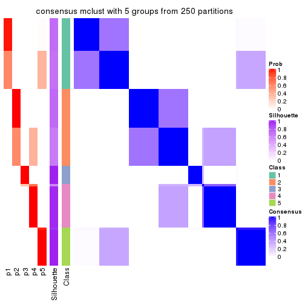</p>

</div>
<div id='tab-CV-mclust-consensus-heatmap-5'>
<pre><code class="r">consensus_heatmap(res, k = 6)
</code></pre>

<p></p>

</div>
</div>

Heatmaps for the membership of samples in all partitions to see how consistent they are:


<script>
$( function() {
	$( '#tabs-CV-mclust-membership-heatmap' ).tabs();
} );
</script>
<div id='tabs-CV-mclust-membership-heatmap'>
<ul>
<li><a href='#tab-CV-mclust-membership-heatmap-1'>k = 2</a></li>
<li><a href='#tab-CV-mclust-membership-heatmap-2'>k = 3</a></li>
<li><a href='#tab-CV-mclust-membership-heatmap-3'>k = 4</a></li>
<li><a href='#tab-CV-mclust-membership-heatmap-4'>k = 5</a></li>
<li><a href='#tab-CV-mclust-membership-heatmap-5'>k = 6</a></li>
</ul>
<div id='tab-CV-mclust-membership-heatmap-1'>
<pre><code class="r">membership_heatmap(res, k = 2)
</code></pre>

<p></p>

</div>
<div id='tab-CV-mclust-membership-heatmap-2'>
<pre><code class="r">membership_heatmap(res, k = 3)
</code></pre>

<p></p>

</div>
<div id='tab-CV-mclust-membership-heatmap-3'>
<pre><code class="r">membership_heatmap(res, k = 4)
</code></pre>

<p></p>

</div>
<div id='tab-CV-mclust-membership-heatmap-4'>
<pre><code class="r">membership_heatmap(res, k = 5)
</code></pre>

<p></p>

</div>
<div id='tab-CV-mclust-membership-heatmap-5'>
<pre><code class="r">membership_heatmap(res, k = 6)
</code></pre>

<p></p>

</div>
</div>

As soon as we have had the classes for columns, we can look for signatures
which are significantly different between classes which can be candidate marks
for certain classes. Following are the heatmaps for signatures.


Signature heatmaps where rows are scaled:


<script>
$( function() {
	$( '#tabs-CV-mclust-get-signatures' ).tabs();
} );
</script>
<div id='tabs-CV-mclust-get-signatures'>
<ul>
<li><a href='#tab-CV-mclust-get-signatures-1'>k = 2</a></li>
<li><a href='#tab-CV-mclust-get-signatures-2'>k = 3</a></li>
<li><a href='#tab-CV-mclust-get-signatures-3'>k = 4</a></li>
<li><a href='#tab-CV-mclust-get-signatures-4'>k = 5</a></li>
<li><a href='#tab-CV-mclust-get-signatures-5'>k = 6</a></li>
</ul>
<div id='tab-CV-mclust-get-signatures-1'>
<pre><code class="r">get_signatures(res, k = 2)
</code></pre>

<p></p>

</div>
<div id='tab-CV-mclust-get-signatures-2'>
<pre><code class="r">get_signatures(res, k = 3)
</code></pre>

<p></p>

</div>
<div id='tab-CV-mclust-get-signatures-3'>
<pre><code class="r">get_signatures(res, k = 4)
</code></pre>

<p></p>

</div>
<div id='tab-CV-mclust-get-signatures-4'>
<pre><code class="r">get_signatures(res, k = 5)
</code></pre>

<p></p>

</div>
<div id='tab-CV-mclust-get-signatures-5'>
<pre><code class="r">get_signatures(res, k = 6)
</code></pre>

<p></p>

</div>
</div>


Signature heatmaps where rows are not scaled:


<script>
$( function() {
	$( '#tabs-CV-mclust-get-signatures-no-scale' ).tabs();
} );
</script>
<div id='tabs-CV-mclust-get-signatures-no-scale'>
<ul>
<li><a href='#tab-CV-mclust-get-signatures-no-scale-1'>k = 2</a></li>
<li><a href='#tab-CV-mclust-get-signatures-no-scale-2'>k = 3</a></li>
<li><a href='#tab-CV-mclust-get-signatures-no-scale-3'>k = 4</a></li>
<li><a href='#tab-CV-mclust-get-signatures-no-scale-4'>k = 5</a></li>
<li><a href='#tab-CV-mclust-get-signatures-no-scale-5'>k = 6</a></li>
</ul>
<div id='tab-CV-mclust-get-signatures-no-scale-1'>
<pre><code class="r">get_signatures(res, k = 2, scale_rows = FALSE)
</code></pre>

<p></p>

</div>
<div id='tab-CV-mclust-get-signatures-no-scale-2'>
<pre><code class="r">get_signatures(res, k = 3, scale_rows = FALSE)
</code></pre>

<p></p>

</div>
<div id='tab-CV-mclust-get-signatures-no-scale-3'>
<pre><code class="r">get_signatures(res, k = 4, scale_rows = FALSE)
</code></pre>

<p>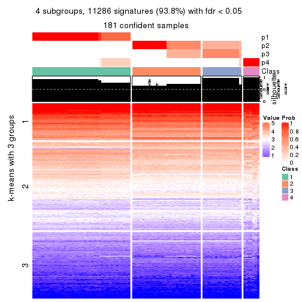</p>

</div>
<div id='tab-CV-mclust-get-signatures-no-scale-4'>
<pre><code class="r">get_signatures(res, k = 5, scale_rows = FALSE)
</code></pre>

<p></p>

</div>
<div id='tab-CV-mclust-get-signatures-no-scale-5'>
<pre><code class="r">get_signatures(res, k = 6, scale_rows = FALSE)
</code></pre>

<p></p>

</div>
</div>


Compare the overlap of signatures from different k:

```r
compare_signatures(res)
```


`get_signature()` returns a data frame invisibly. TO get the list of signatures, the function
call should be assigned to a variable explicitly. In following code, if `plot` argument is set
to `FALSE`, no heatmap is plotted while only the differential analysis is performed.

```r
# code only for demonstration
tb = get_signature(res, k = ..., plot = FALSE)
```

An example of the output of `tb` is:

```
#>   which_row         fdr    mean_1    mean_2 scaled_mean_1 scaled_mean_2 km
#> 1        38 0.042760348  8.373488  9.131774    -0.5533452     0.5164555  1
#> 2        40 0.018707592  7.106213  8.469186    -0.6173731     0.5762149  1
#> 3        55 0.019134737 10.221463 11.207825    -0.6159697     0.5749050  1
#> 4        59 0.006059896  5.921854  7.869574    -0.6899429     0.6439467  1
#> 5        60 0.018055526  8.928898 10.211722    -0.6204761     0.5791110  1
#> 6        98 0.009384629 15.714769 14.887706     0.6635654    -0.6193277  2
...
```

The columns in `tb` are:

1. `which_row`: row indices corresponding to the input matrix.
2. `fdr`: FDR for the differential test. 
3. `mean_x`: The mean value in group x.
4. `scaled_mean_x`: The mean value in group x after rows are scaled.
5. `km`: Row groups if k-means clustering is applied to rows.


UMAP plot which shows how samples are separated.


<script>
$( function() {
	$( '#tabs-CV-mclust-dimension-reduction' ).tabs();
} );
</script>
<div id='tabs-CV-mclust-dimension-reduction'>
<ul>
<li><a href='#tab-CV-mclust-dimension-reduction-1'>k = 2</a></li>
<li><a href='#tab-CV-mclust-dimension-reduction-2'>k = 3</a></li>
<li><a href='#tab-CV-mclust-dimension-reduction-3'>k = 4</a></li>
<li><a href='#tab-CV-mclust-dimension-reduction-4'>k = 5</a></li>
<li><a href='#tab-CV-mclust-dimension-reduction-5'>k = 6</a></li>
</ul>
<div id='tab-CV-mclust-dimension-reduction-1'>
<pre><code class="r">dimension_reduction(res, k = 2, method = &quot;UMAP&quot;)
</code></pre>

<p></p>

</div>
<div id='tab-CV-mclust-dimension-reduction-2'>
<pre><code class="r">dimension_reduction(res, k = 3, method = &quot;UMAP&quot;)
</code></pre>

<p></p>

</div>
<div id='tab-CV-mclust-dimension-reduction-3'>
<pre><code class="r">dimension_reduction(res, k = 4, method = &quot;UMAP&quot;)
</code></pre>

<p></p>

</div>
<div id='tab-CV-mclust-dimension-reduction-4'>
<pre><code class="r">dimension_reduction(res, k = 5, method = &quot;UMAP&quot;)
</code></pre>

<p></p>

</div>
<div id='tab-CV-mclust-dimension-reduction-5'>
<pre><code class="r">dimension_reduction(res, k = 6, method = &quot;UMAP&quot;)
</code></pre>

<p></p>

</div>
</div>


Following heatmap shows how subgroups are split when increasing `k`:

```r
collect_classes(res)
```


If matrix rows can be associated to genes, consider to use `functional_enrichment(res,
...)` to perform function enrichment for the signature genes. See [this vignette](http://bioconductor.org/packages/devel/bioc/vignettes/cola/inst/doc/functional_enrichment.html) for more detailed explanations.


 

---------------------------------------------------


### CV:NMF**


The object with results only for a single top-value method and a single partition method 
can be extracted as:

```r
res = res_list["CV", "NMF"]
# you can also extract it by
# res = res_list["CV:NMF"]
```

A summary of `res` and all the functions that can be applied to it:

```r
res
```

```
#> A 'ConsensusPartition' object with k = 2, 3, 4, 5, 6.
#>   On a matrix with 12029 rows and 181 columns.
#>   Top rows (1000, 2000, 3000, 4000, 5000) are extracted by 'CV' method.
#>   Subgroups are detected by 'NMF' method.
#>   Performed in total 1250 partitions by row resampling.
#>   Best k for subgroups seems to be 3.
#> 
#> Following methods can be applied to this 'ConsensusPartition' object:
#>  [1] "cola_report"             "collect_classes"         "collect_plots"          
#>  [4] "collect_stats"           "colnames"                "compare_signatures"     
#>  [7] "consensus_heatmap"       "dimension_reduction"     "functional_enrichment"  
#> [10] "get_anno_col"            "get_anno"                "get_classes"            
#> [13] "get_consensus"           "get_matrix"              "get_membership"         
#> [16] "get_param"               "get_signatures"          "get_stats"              
#> [19] "is_best_k"               "is_stable_k"             "membership_heatmap"     
#> [22] "ncol"                    "nrow"                    "plot_ecdf"              
#> [25] "rownames"                "select_partition_number" "show"                   
#> [28] "suggest_best_k"          "test_to_known_factors"
```

`collect_plots()` function collects all the plots made from `res` for all `k` (number of partitions)
into one single page to provide an easy and fast comparison between different `k`.

```r
collect_plots(res)
```


The plots are:

- The first row: a plot of the ECDF (empirical cumulative distribution
  function) curves of the consensus matrix for each `k` and the heatmap of
  predicted classes for each `k`.
- The second row: heatmaps of the consensus matrix for each `k`.
- The third row: heatmaps of the membership matrix for each `k`.
- The fouth row: heatmaps of the signatures for each `k`.

All the plots in panels can be made by individual functions and they are
plotted later in this section.

`select_partition_number()` produces several plots showing different
statistics for choosing "optimized" `k`. There are following statistics:

- ECDF curves of the consensus matrix for each `k`;
- 1-PAC. [The PAC
  score](https://en.wikipedia.org/wiki/Consensus_clustering#Over-interpretation_potential_of_consensus_clustering)
  measures the proportion of the ambiguous subgrouping.
- Mean silhouette score.
- Concordance. The mean probability of fiting the consensus class ids in all
  partitions.
- Area increased. Denote $A_k$ as the area under the ECDF curve for current
  `k`, the area increased is defined as $A_k - A_{k-1}$.
- Rand index. The percent of pairs of samples that are both in a same cluster
  or both are not in a same cluster in the partition of k and k-1.
- Jaccard index. The ratio of pairs of samples are both in a same cluster in
  the partition of k and k-1 and the pairs of samples are both in a same
  cluster in the partition k or k-1.

The detailed explanations of these statistics can be found in [the _cola_
vignette](http://bioconductor.org/packages/devel/bioc/vignettes/cola/inst/doc/cola.html#toc_13).

Generally speaking, lower PAC score, higher mean silhouette score or higher
concordance corresponds to better partition. Rand index and Jaccard index
measure how similar the current partition is compared to partition with `k-1`.
If they are too similar, we won't accept `k` is better than `k-1`.

```r
select_partition_number(res)
```


The numeric values for all these statistics can be obtained by `get_stats()`.

```r
get_stats(res)
```

```
#>   k 1-PAC mean_silhouette concordance area_increased  Rand Jaccard
#> 2 2 1.000           1.000       1.000         0.5029 0.498   0.498
#> 3 3 0.989           0.952       0.973         0.0546 0.972   0.945
#> 4 4 0.978           0.920       0.963         0.0419 0.980   0.957
#> 5 5 0.977           0.957       0.967         0.0301 0.979   0.953
#> 6 6 0.808           0.917       0.934         0.0518 1.000   1.000
```

`suggest_best_k()` suggests the best $k$ based on these statistics. The rules are as follows:

- All $k$ with Jaccard index larger than 0.95 are removed because increasing
  $k$ does not provide enough extra information. If all $k$ are removed, it is
  marked as no subgroup is detected.
- For all $k$ with 1-PAC score larger than 0.9, the maximal $k$ is taken as
  the best $k$, and other $k$ are marked as optional $k$.
- If it does not fit the second rule. The $k$ with the maximal vote of the
  highest 1-PAC score, highest mean silhouette, and highest concordance is
  taken as the best $k$.

```r
suggest_best_k(res)
```

```
#> [1] 3
#> attr(,"optional")
#> [1] 2
```

There is also optional best $k$ = 2 that is worth to check.

Following shows the table of the partitions (You need to click the **show/hide
code output** link to see it). The membership matrix (columns with name `p*`)
is inferred by
[`clue::cl_consensus()`](https://www.rdocumentation.org/link/cl_consensus?package=clue)
function with the `SE` method. Basically the value in the membership matrix
represents the probability to belong to a certain group. The finall class
label for an item is determined with the group with highest probability it
belongs to.

In `get_classes()` function, the entropy is calculated from the membership
matrix and the silhouette score is calculated from the consensus matrix.


<script>
$( function() {
	$( '#tabs-CV-NMF-get-classes' ).tabs();
} );
</script>
<div id='tabs-CV-NMF-get-classes'>
<ul>
<li><a href='#tab-CV-NMF-get-classes-1'>k = 2</a></li>
<li><a href='#tab-CV-NMF-get-classes-2'>k = 3</a></li>
<li><a href='#tab-CV-NMF-get-classes-3'>k = 4</a></li>
<li><a href='#tab-CV-NMF-get-classes-4'>k = 5</a></li>
<li><a href='#tab-CV-NMF-get-classes-5'>k = 6</a></li>
</ul>

<div id='tab-CV-NMF-get-classes-1'>
<p><a id='tab-CV-NMF-get-classes-1-a' style='color:#0366d6' href='#'>show/hide code output</a></p>
<pre><code class="r">cbind(get_classes(res, k = 2), get_membership(res, k = 2))
</code></pre>

<pre><code>#&gt;           class entropy silhouette p1 p2
#&gt; SRR315112     2       0          1  0  1
#&gt; SRR315113     1       0          1  1  0
#&gt; SRR315114     1       0          1  1  0
#&gt; SRR315115     2       0          1  0  1
#&gt; SRR315116     2       0          1  0  1
#&gt; SRR566986     2       0          1  0  1
#&gt; SRR566987     2       0          1  0  1
#&gt; SRR566988     2       0          1  0  1
#&gt; SRR566989     2       0          1  0  1
#&gt; SRR566990     2       0          1  0  1
#&gt; SRR566991     2       0          1  0  1
#&gt; SRR566992     2       0          1  0  1
#&gt; SRR566993     2       0          1  0  1
#&gt; SRR566994     2       0          1  0  1
#&gt; SRR566995     2       0          1  0  1
#&gt; SRR566996     2       0          1  0  1
#&gt; SRR566997     2       0          1  0  1
#&gt; SRR566998     2       0          1  0  1
#&gt; SRR566999     2       0          1  0  1
#&gt; SRR567000     2       0          1  0  1
#&gt; SRR567001     2       0          1  0  1
#&gt; SRR567002     2       0          1  0  1
#&gt; SRR567003     2       0          1  0  1
#&gt; SRR567004     2       0          1  0  1
#&gt; SRR567005     2       0          1  0  1
#&gt; SRR567006     2       0          1  0  1
#&gt; SRR567007     2       0          1  0  1
#&gt; SRR567008     2       0          1  0  1
#&gt; SRR567009     2       0          1  0  1
#&gt; SRR567010     2       0          1  0  1
#&gt; SRR567011     2       0          1  0  1
#&gt; SRR567012     2       0          1  0  1
#&gt; SRR567013     2       0          1  0  1
#&gt; SRR567014     2       0          1  0  1
#&gt; SRR567015     2       0          1  0  1
#&gt; SRR567016     2       0          1  0  1
#&gt; SRR567017     2       0          1  0  1
#&gt; SRR567018     2       0          1  0  1
#&gt; SRR567019     2       0          1  0  1
#&gt; SRR567020     2       0          1  0  1
#&gt; SRR567021     2       0          1  0  1
#&gt; SRR567022     2       0          1  0  1
#&gt; SRR567023     2       0          1  0  1
#&gt; SRR567024     2       0          1  0  1
#&gt; SRR567025     2       0          1  0  1
#&gt; SRR567026     2       0          1  0  1
#&gt; SRR567027     2       0          1  0  1
#&gt; SRR567028     2       0          1  0  1
#&gt; SRR567029     2       0          1  0  1
#&gt; SRR567030     2       0          1  0  1
#&gt; SRR567031     2       0          1  0  1
#&gt; SRR567032     2       0          1  0  1
#&gt; SRR567033     2       0          1  0  1
#&gt; SRR567034     2       0          1  0  1
#&gt; SRR567035     2       0          1  0  1
#&gt; SRR567036     2       0          1  0  1
#&gt; SRR567037     2       0          1  0  1
#&gt; SRR567038     2       0          1  0  1
#&gt; SRR567039     2       0          1  0  1
#&gt; SRR567040     2       0          1  0  1
#&gt; SRR567041     2       0          1  0  1
#&gt; SRR567042     2       0          1  0  1
#&gt; SRR567043     2       0          1  0  1
#&gt; SRR567044     2       0          1  0  1
#&gt; SRR567045     2       0          1  0  1
#&gt; SRR567046     2       0          1  0  1
#&gt; SRR567047     2       0          1  0  1
#&gt; SRR567048     2       0          1  0  1
#&gt; SRR567049     2       0          1  0  1
#&gt; SRR567050     2       0          1  0  1
#&gt; SRR567051     2       0          1  0  1
#&gt; SRR567052     2       0          1  0  1
#&gt; SRR567053     2       0          1  0  1
#&gt; SRR567054     2       0          1  0  1
#&gt; SRR567055     2       0          1  0  1
#&gt; SRR567056     2       0          1  0  1
#&gt; SRR567057     2       0          1  0  1
#&gt; SRR567058     2       0          1  0  1
#&gt; SRR567059     2       0          1  0  1
#&gt; SRR567060     2       0          1  0  1
#&gt; SRR567061     2       0          1  0  1
#&gt; SRR567062     2       0          1  0  1
#&gt; SRR567063     2       0          1  0  1
#&gt; SRR567064     2       0          1  0  1
#&gt; SRR567065     2       0          1  0  1
#&gt; SRR567066     2       0          1  0  1
#&gt; SRR567067     2       0          1  0  1
#&gt; SRR567068     2       0          1  0  1
#&gt; SRR567069     2       0          1  0  1
#&gt; SRR567070     2       0          1  0  1
#&gt; SRR567071     2       0          1  0  1
#&gt; SRR567072     2       0          1  0  1
#&gt; SRR567073     2       0          1  0  1
#&gt; SRR567074     2       0          1  0  1
#&gt; SRR567075     2       0          1  0  1
#&gt; SRR567076     1       0          1  1  0
#&gt; SRR567077     1       0          1  1  0
#&gt; SRR567078     1       0          1  1  0
#&gt; SRR567079     1       0          1  1  0
#&gt; SRR567080     1       0          1  1  0
#&gt; SRR567081     1       0          1  1  0
#&gt; SRR567082     1       0          1  1  0
#&gt; SRR567083     1       0          1  1  0
#&gt; SRR567084     1       0          1  1  0
#&gt; SRR567085     1       0          1  1  0
#&gt; SRR567086     1       0          1  1  0
#&gt; SRR567087     1       0          1  1  0
#&gt; SRR567088     1       0          1  1  0
#&gt; SRR567089     1       0          1  1  0
#&gt; SRR567090     1       0          1  1  0
#&gt; SRR567091     1       0          1  1  0
#&gt; SRR567092     1       0          1  1  0
#&gt; SRR567093     1       0          1  1  0
#&gt; SRR567094     1       0          1  1  0
#&gt; SRR567095     1       0          1  1  0
#&gt; SRR567096     1       0          1  1  0
#&gt; SRR567097     1       0          1  1  0
#&gt; SRR567098     1       0          1  1  0
#&gt; SRR567099     1       0          1  1  0
#&gt; SRR567100     1       0          1  1  0
#&gt; SRR567101     1       0          1  1  0
#&gt; SRR567102     1       0          1  1  0
#&gt; SRR567103     1       0          1  1  0
#&gt; SRR567104     1       0          1  1  0
#&gt; SRR567105     1       0          1  1  0
#&gt; SRR567106     1       0          1  1  0
#&gt; SRR567107     1       0          1  1  0
#&gt; SRR567108     1       0          1  1  0
#&gt; SRR567109     1       0          1  1  0
#&gt; SRR567110     1       0          1  1  0
#&gt; SRR567111     1       0          1  1  0
#&gt; SRR567112     1       0          1  1  0
#&gt; SRR567113     1       0          1  1  0
#&gt; SRR567114     1       0          1  1  0
#&gt; SRR567115     1       0          1  1  0
#&gt; SRR567116     1       0          1  1  0
#&gt; SRR567117     1       0          1  1  0
#&gt; SRR567118     1       0          1  1  0
#&gt; SRR567119     1       0          1  1  0
#&gt; SRR567120     1       0          1  1  0
#&gt; SRR567121     1       0          1  1  0
#&gt; SRR567122     1       0          1  1  0
#&gt; SRR567123     1       0          1  1  0
#&gt; SRR567124     1       0          1  1  0
#&gt; SRR567125     1       0          1  1  0
#&gt; SRR567126     1       0          1  1  0
#&gt; SRR567127     1       0          1  1  0
#&gt; SRR567128     1       0          1  1  0
#&gt; SRR567129     1       0          1  1  0
#&gt; SRR567130     1       0          1  1  0
#&gt; SRR567131     1       0          1  1  0
#&gt; SRR567132     1       0          1  1  0
#&gt; SRR567133     1       0          1  1  0
#&gt; SRR567134     1       0          1  1  0
#&gt; SRR567135     1       0          1  1  0
#&gt; SRR567136     1       0          1  1  0
#&gt; SRR567137     1       0          1  1  0
#&gt; SRR567138     1       0          1  1  0
#&gt; SRR567139     1       0          1  1  0
#&gt; SRR567140     1       0          1  1  0
#&gt; SRR567141     1       0          1  1  0
#&gt; SRR567142     1       0          1  1  0
#&gt; SRR567143     1       0          1  1  0
#&gt; SRR567144     1       0          1  1  0
#&gt; SRR567145     1       0          1  1  0
#&gt; SRR567146     1       0          1  1  0
#&gt; SRR567147     1       0          1  1  0
#&gt; SRR567148     1       0          1  1  0
#&gt; SRR567149     1       0          1  1  0
#&gt; SRR567150     1       0          1  1  0
#&gt; SRR567151     1       0          1  1  0
#&gt; SRR567152     1       0          1  1  0
#&gt; SRR567153     1       0          1  1  0
#&gt; SRR567154     1       0          1  1  0
#&gt; SRR567155     1       0          1  1  0
#&gt; SRR567156     1       0          1  1  0
#&gt; SRR567157     1       0          1  1  0
#&gt; SRR567158     1       0          1  1  0
#&gt; SRR567159     1       0          1  1  0
#&gt; SRR567160     1       0          1  1  0
#&gt; SRR567161     1       0          1  1  0
</code></pre>

<script>
$('#tab-CV-NMF-get-classes-1-a').parent().next().next().hide();
$('#tab-CV-NMF-get-classes-1-a').click(function(){
  $('#tab-CV-NMF-get-classes-1-a').parent().next().next().toggle();
  return(false);
});
</script>
</div>

<div id='tab-CV-NMF-get-classes-2'>
<p><a id='tab-CV-NMF-get-classes-2-a' style='color:#0366d6' href='#'>show/hide code output</a></p>
<pre><code class="r">cbind(get_classes(res, k = 3), get_membership(res, k = 3))
</code></pre>

<pre><code>#&gt;           class entropy silhouette    p1    p2    p3
#&gt; SRR315112     3  0.6215      0.497 0.000 0.428 0.572
#&gt; SRR315113     3  0.6783      0.279 0.396 0.016 0.588
#&gt; SRR315114     3  0.6661      0.267 0.400 0.012 0.588
#&gt; SRR315115     3  0.6225      0.488 0.000 0.432 0.568
#&gt; SRR315116     3  0.6386      0.516 0.004 0.412 0.584
#&gt; SRR566986     2  0.0237      0.982 0.000 0.996 0.004
#&gt; SRR566987     2  0.0000      0.982 0.000 1.000 0.000
#&gt; SRR566988     2  0.0000      0.982 0.000 1.000 0.000
#&gt; SRR566989     2  0.0000      0.982 0.000 1.000 0.000
#&gt; SRR566990     2  0.0237      0.982 0.000 0.996 0.004
#&gt; SRR566991     2  0.0237      0.982 0.000 0.996 0.004
#&gt; SRR566992     2  0.0000      0.982 0.000 1.000 0.000
#&gt; SRR566993     2  0.0000      0.982 0.000 1.000 0.000
#&gt; SRR566994     2  0.0000      0.982 0.000 1.000 0.000
#&gt; SRR566995     2  0.0237      0.982 0.000 0.996 0.004
#&gt; SRR566996     2  0.0237      0.982 0.000 0.996 0.004
#&gt; SRR566997     2  0.0000      0.982 0.000 1.000 0.000
#&gt; SRR566998     2  0.0237      0.982 0.000 0.996 0.004
#&gt; SRR566999     2  0.0237      0.982 0.000 0.996 0.004
#&gt; SRR567000     2  0.0000      0.982 0.000 1.000 0.000
#&gt; SRR567001     2  0.0000      0.982 0.000 1.000 0.000
#&gt; SRR567002     2  0.0000      0.982 0.000 1.000 0.000
#&gt; SRR567003     2  0.0237      0.982 0.000 0.996 0.004
#&gt; SRR567004     2  0.0237      0.982 0.000 0.996 0.004
#&gt; SRR567005     2  0.0000      0.982 0.000 1.000 0.000
#&gt; SRR567006     2  0.0000      0.982 0.000 1.000 0.000
#&gt; SRR567007     2  0.0000      0.982 0.000 1.000 0.000
#&gt; SRR567008     2  0.0237      0.982 0.000 0.996 0.004
#&gt; SRR567009     2  0.0237      0.982 0.000 0.996 0.004
#&gt; SRR567010     2  0.0237      0.982 0.000 0.996 0.004
#&gt; SRR567011     2  0.0424      0.981 0.000 0.992 0.008
#&gt; SRR567012     2  0.0000      0.982 0.000 1.000 0.000
#&gt; SRR567013     2  0.0237      0.982 0.000 0.996 0.004
#&gt; SRR567014     2  0.0237      0.982 0.000 0.996 0.004
#&gt; SRR567015     2  0.0237      0.982 0.000 0.996 0.004
#&gt; SRR567016     2  0.0237      0.982 0.000 0.996 0.004
#&gt; SRR567017     2  0.0237      0.982 0.000 0.996 0.004
#&gt; SRR567018     2  0.0237      0.982 0.000 0.996 0.004
#&gt; SRR567019     2  0.0237      0.982 0.000 0.996 0.004
#&gt; SRR567020     2  0.0237      0.982 0.000 0.996 0.004
#&gt; SRR567021     2  0.0237      0.982 0.000 0.996 0.004
#&gt; SRR567022     2  0.5733      0.393 0.000 0.676 0.324
#&gt; SRR567023     2  0.0237      0.982 0.000 0.996 0.004
#&gt; SRR567024     2  0.0237      0.982 0.000 0.996 0.004
#&gt; SRR567025     2  0.0237      0.982 0.000 0.996 0.004
#&gt; SRR567026     2  0.0424      0.979 0.000 0.992 0.008
#&gt; SRR567027     2  0.0237      0.982 0.000 0.996 0.004
#&gt; SRR567028     2  0.0237      0.982 0.000 0.996 0.004
#&gt; SRR567029     2  0.0237      0.982 0.000 0.996 0.004
#&gt; SRR567030     2  0.0237      0.982 0.000 0.996 0.004
#&gt; SRR567031     2  0.0592      0.975 0.000 0.988 0.012
#&gt; SRR567032     2  0.0237      0.982 0.000 0.996 0.004
#&gt; SRR567033     2  0.0237      0.982 0.000 0.996 0.004
#&gt; SRR567034     2  0.0237      0.982 0.000 0.996 0.004
#&gt; SRR567035     2  0.0237      0.982 0.000 0.996 0.004
#&gt; SRR567036     2  0.0237      0.982 0.000 0.996 0.004
#&gt; SRR567037     2  0.0237      0.982 0.000 0.996 0.004
#&gt; SRR567038     2  0.0237      0.982 0.000 0.996 0.004
#&gt; SRR567039     2  0.0237      0.982 0.000 0.996 0.004
#&gt; SRR567040     2  0.0237      0.982 0.000 0.996 0.004
#&gt; SRR567041     2  0.0237      0.982 0.000 0.996 0.004
#&gt; SRR567042     2  0.5760      0.382 0.000 0.672 0.328
#&gt; SRR567043     2  0.0237      0.982 0.000 0.996 0.004
#&gt; SRR567044     2  0.0592      0.980 0.000 0.988 0.012
#&gt; SRR567045     2  0.0592      0.980 0.000 0.988 0.012
#&gt; SRR567046     2  0.0592      0.980 0.000 0.988 0.012
#&gt; SRR567047     2  0.0592      0.980 0.000 0.988 0.012
#&gt; SRR567048     2  0.0592      0.980 0.000 0.988 0.012
#&gt; SRR567049     2  0.0592      0.980 0.000 0.988 0.012
#&gt; SRR567050     2  0.0592      0.980 0.000 0.988 0.012
#&gt; SRR567051     2  0.0592      0.980 0.000 0.988 0.012
#&gt; SRR567052     2  0.0592      0.980 0.000 0.988 0.012
#&gt; SRR567053     2  0.0592      0.980 0.000 0.988 0.012
#&gt; SRR567054     2  0.0592      0.980 0.000 0.988 0.012
#&gt; SRR567055     2  0.0592      0.980 0.000 0.988 0.012
#&gt; SRR567056     2  0.0592      0.980 0.000 0.988 0.012
#&gt; SRR567057     2  0.0592      0.980 0.000 0.988 0.012
#&gt; SRR567058     2  0.0592      0.980 0.000 0.988 0.012
#&gt; SRR567059     2  0.0747      0.977 0.000 0.984 0.016
#&gt; SRR567060     2  0.0592      0.980 0.000 0.988 0.012
#&gt; SRR567061     2  0.0592      0.980 0.000 0.988 0.012
#&gt; SRR567062     2  0.0592      0.980 0.000 0.988 0.012
#&gt; SRR567063     2  0.0592      0.980 0.000 0.988 0.012
#&gt; SRR567064     2  0.0747      0.977 0.000 0.984 0.016
#&gt; SRR567065     2  0.0592      0.980 0.000 0.988 0.012
#&gt; SRR567066     2  0.0592      0.980 0.000 0.988 0.012
#&gt; SRR567067     2  0.0592      0.980 0.000 0.988 0.012
#&gt; SRR567068     2  0.0592      0.980 0.000 0.988 0.012
#&gt; SRR567069     2  0.0592      0.980 0.000 0.988 0.012
#&gt; SRR567070     2  0.0592      0.980 0.000 0.988 0.012
#&gt; SRR567071     2  0.0592      0.980 0.000 0.988 0.012
#&gt; SRR567072     2  0.0592      0.980 0.000 0.988 0.012
#&gt; SRR567073     2  0.0592      0.980 0.000 0.988 0.012
#&gt; SRR567074     2  0.0592      0.980 0.000 0.988 0.012
#&gt; SRR567075     2  0.0592      0.980 0.000 0.988 0.012
#&gt; SRR567076     1  0.0237      0.980 0.996 0.000 0.004
#&gt; SRR567077     1  0.0237      0.981 0.996 0.000 0.004
#&gt; SRR567078     1  0.0424      0.980 0.992 0.000 0.008
#&gt; SRR567079     1  0.0424      0.980 0.992 0.000 0.008
#&gt; SRR567080     1  0.0237      0.980 0.996 0.000 0.004
#&gt; SRR567081     1  0.0424      0.981 0.992 0.000 0.008
#&gt; SRR567082     1  0.0424      0.980 0.992 0.000 0.008
#&gt; SRR567083     1  0.0237      0.980 0.996 0.000 0.004
#&gt; SRR567084     1  0.0424      0.980 0.992 0.000 0.008
#&gt; SRR567085     1  0.0424      0.981 0.992 0.000 0.008
#&gt; SRR567086     1  0.0237      0.981 0.996 0.000 0.004
#&gt; SRR567087     1  0.0424      0.980 0.992 0.000 0.008
#&gt; SRR567088     1  0.0000      0.981 1.000 0.000 0.000
#&gt; SRR567089     1  0.0237      0.981 0.996 0.000 0.004
#&gt; SRR567090     1  0.0237      0.980 0.996 0.000 0.004
#&gt; SRR567091     1  0.0237      0.981 0.996 0.000 0.004
#&gt; SRR567092     1  0.0592      0.978 0.988 0.000 0.012
#&gt; SRR567093     1  0.0424      0.980 0.992 0.000 0.008
#&gt; SRR567094     1  0.0424      0.981 0.992 0.000 0.008
#&gt; SRR567095     1  0.0000      0.981 1.000 0.000 0.000
#&gt; SRR567096     1  0.0424      0.981 0.992 0.000 0.008
#&gt; SRR567097     1  0.0424      0.980 0.992 0.000 0.008
#&gt; SRR567098     1  0.0424      0.980 0.992 0.000 0.008
#&gt; SRR567099     1  0.0424      0.980 0.992 0.000 0.008
#&gt; SRR567100     1  0.0237      0.981 0.996 0.000 0.004
#&gt; SRR567101     1  0.0237      0.981 0.996 0.000 0.004
#&gt; SRR567102     1  0.2448      0.916 0.924 0.000 0.076
#&gt; SRR567103     1  0.2448      0.916 0.924 0.000 0.076
#&gt; SRR567104     1  0.0424      0.980 0.992 0.000 0.008
#&gt; SRR567105     1  0.0424      0.980 0.992 0.000 0.008
#&gt; SRR567106     1  0.0892      0.974 0.980 0.000 0.020
#&gt; SRR567107     1  0.0424      0.980 0.992 0.000 0.008
#&gt; SRR567108     1  0.0892      0.974 0.980 0.000 0.020
#&gt; SRR567109     1  0.0592      0.978 0.988 0.000 0.012
#&gt; SRR567110     1  0.0237      0.981 0.996 0.000 0.004
#&gt; SRR567111     1  0.0747      0.976 0.984 0.000 0.016
#&gt; SRR567112     1  0.0592      0.978 0.988 0.000 0.012
#&gt; SRR567113     1  0.0592      0.978 0.988 0.000 0.012
#&gt; SRR567114     1  0.0424      0.980 0.992 0.000 0.008
#&gt; SRR567115     1  0.0424      0.979 0.992 0.000 0.008
#&gt; SRR567116     1  0.0592      0.978 0.988 0.000 0.012
#&gt; SRR567117     1  0.0592      0.978 0.988 0.000 0.012
#&gt; SRR567118     1  0.0424      0.979 0.992 0.000 0.008
#&gt; SRR567119     1  0.0892      0.974 0.980 0.000 0.020
#&gt; SRR567120     1  0.0747      0.976 0.984 0.000 0.016
#&gt; SRR567121     1  0.0237      0.981 0.996 0.000 0.004
#&gt; SRR567122     1  0.0237      0.981 0.996 0.000 0.004
#&gt; SRR567123     1  0.0592      0.980 0.988 0.000 0.012
#&gt; SRR567124     1  0.0747      0.976 0.984 0.000 0.016
#&gt; SRR567125     1  0.0747      0.976 0.984 0.000 0.016
#&gt; SRR567126     1  0.0592      0.978 0.988 0.000 0.012
#&gt; SRR567127     1  0.0592      0.978 0.988 0.000 0.012
#&gt; SRR567128     1  0.0747      0.976 0.984 0.000 0.016
#&gt; SRR567129     1  0.0892      0.974 0.980 0.000 0.020
#&gt; SRR567130     1  0.0592      0.978 0.988 0.000 0.012
#&gt; SRR567131     1  0.0747      0.976 0.984 0.000 0.016
#&gt; SRR567132     1  0.0237      0.981 0.996 0.000 0.004
#&gt; SRR567133     1  0.0892      0.974 0.980 0.000 0.020
#&gt; SRR567134     1  0.0237      0.981 0.996 0.000 0.004
#&gt; SRR567135     1  0.0424      0.980 0.992 0.000 0.008
#&gt; SRR567136     1  0.3340      0.863 0.880 0.000 0.120
#&gt; SRR567137     1  0.0237      0.981 0.996 0.000 0.004
#&gt; SRR567138     1  0.0424      0.980 0.992 0.000 0.008
#&gt; SRR567139     1  0.0424      0.980 0.992 0.000 0.008
#&gt; SRR567140     1  0.0237      0.980 0.996 0.000 0.004
#&gt; SRR567141     1  0.0424      0.980 0.992 0.000 0.008
#&gt; SRR567142     1  0.0237      0.980 0.996 0.000 0.004
#&gt; SRR567143     1  0.0424      0.980 0.992 0.000 0.008
#&gt; SRR567144     1  0.0237      0.981 0.996 0.000 0.004
#&gt; SRR567145     1  0.0424      0.980 0.992 0.000 0.008
#&gt; SRR567146     1  0.5698      0.639 0.736 0.012 0.252
#&gt; SRR567147     1  0.0424      0.980 0.992 0.000 0.008
#&gt; SRR567148     1  0.0237      0.980 0.996 0.000 0.004
#&gt; SRR567149     1  0.0000      0.981 1.000 0.000 0.000
#&gt; SRR567150     1  0.0237      0.980 0.996 0.000 0.004
#&gt; SRR567151     1  0.0237      0.981 0.996 0.000 0.004
#&gt; SRR567152     1  0.0000      0.981 1.000 0.000 0.000
#&gt; SRR567153     1  0.0000      0.981 1.000 0.000 0.000
#&gt; SRR567154     1  0.0237      0.981 0.996 0.000 0.004
#&gt; SRR567155     1  0.0592      0.978 0.988 0.000 0.012
#&gt; SRR567156     1  0.0000      0.981 1.000 0.000 0.000
#&gt; SRR567157     1  0.0000      0.981 1.000 0.000 0.000
#&gt; SRR567158     1  0.0237      0.981 0.996 0.000 0.004
#&gt; SRR567159     1  0.3340      0.863 0.880 0.000 0.120
#&gt; SRR567160     1  0.0424      0.980 0.992 0.000 0.008
#&gt; SRR567161     1  0.5992      0.601 0.716 0.016 0.268
</code></pre>

<script>
$('#tab-CV-NMF-get-classes-2-a').parent().next().next().hide();
$('#tab-CV-NMF-get-classes-2-a').click(function(){
  $('#tab-CV-NMF-get-classes-2-a').parent().next().next().toggle();
  return(false);
});
</script>
</div>

<div id='tab-CV-NMF-get-classes-3'>
<p><a id='tab-CV-NMF-get-classes-3-a' style='color:#0366d6' href='#'>show/hide code output</a></p>
<pre><code class="r">cbind(get_classes(res, k = 4), get_membership(res, k = 4))
</code></pre>

<pre><code>#&gt;           class entropy silhouette    p1    p2    p3    p4
#&gt; SRR315112     3  0.4401     0.6300 0.004 0.272 0.724 0.000
#&gt; SRR315113     3  0.4813     0.0558 0.268 0.004 0.716 0.012
#&gt; SRR315114     3  0.4841     0.0448 0.272 0.004 0.712 0.012
#&gt; SRR315115     3  0.4401     0.6300 0.004 0.272 0.724 0.000
#&gt; SRR315116     3  0.4511     0.6295 0.008 0.268 0.724 0.000
#&gt; SRR566986     2  0.0000     0.9761 0.000 1.000 0.000 0.000
#&gt; SRR566987     2  0.0000     0.9761 0.000 1.000 0.000 0.000
#&gt; SRR566988     2  0.0000     0.9761 0.000 1.000 0.000 0.000
#&gt; SRR566989     2  0.0000     0.9761 0.000 1.000 0.000 0.000
#&gt; SRR566990     2  0.0188     0.9759 0.000 0.996 0.000 0.004
#&gt; SRR566991     2  0.0188     0.9757 0.000 0.996 0.004 0.000
#&gt; SRR566992     2  0.0000     0.9761 0.000 1.000 0.000 0.000
#&gt; SRR566993     2  0.0188     0.9757 0.000 0.996 0.004 0.000
#&gt; SRR566994     2  0.0188     0.9757 0.000 0.996 0.004 0.000
#&gt; SRR566995     2  0.0000     0.9761 0.000 1.000 0.000 0.000
#&gt; SRR566996     2  0.0000     0.9761 0.000 1.000 0.000 0.000
#&gt; SRR566997     2  0.0188     0.9757 0.000 0.996 0.004 0.000
#&gt; SRR566998     2  0.0000     0.9761 0.000 1.000 0.000 0.000
#&gt; SRR566999     2  0.0188     0.9757 0.000 0.996 0.004 0.000
#&gt; SRR567000     2  0.0188     0.9757 0.000 0.996 0.004 0.000
#&gt; SRR567001     2  0.0000     0.9761 0.000 1.000 0.000 0.000
#&gt; SRR567002     2  0.0188     0.9757 0.000 0.996 0.004 0.000
#&gt; SRR567003     2  0.0188     0.9757 0.000 0.996 0.004 0.000
#&gt; SRR567004     2  0.0188     0.9759 0.000 0.996 0.000 0.004
#&gt; SRR567005     2  0.0188     0.9757 0.000 0.996 0.004 0.000
#&gt; SRR567006     2  0.0188     0.9757 0.000 0.996 0.004 0.000
#&gt; SRR567007     2  0.0188     0.9757 0.000 0.996 0.004 0.000
#&gt; SRR567008     2  0.0000     0.9761 0.000 1.000 0.000 0.000
#&gt; SRR567009     2  0.0188     0.9757 0.000 0.996 0.004 0.000
#&gt; SRR567010     2  0.0188     0.9757 0.000 0.996 0.004 0.000
#&gt; SRR567011     2  0.0188     0.9759 0.000 0.996 0.000 0.004
#&gt; SRR567012     2  0.0000     0.9761 0.000 1.000 0.000 0.000
#&gt; SRR567013     2  0.0000     0.9761 0.000 1.000 0.000 0.000
#&gt; SRR567014     2  0.0469     0.9729 0.000 0.988 0.012 0.000
#&gt; SRR567015     2  0.0672     0.9712 0.000 0.984 0.008 0.008
#&gt; SRR567016     2  0.0657     0.9709 0.000 0.984 0.012 0.004
#&gt; SRR567017     2  0.1004     0.9616 0.000 0.972 0.024 0.004
#&gt; SRR567018     2  0.0657     0.9715 0.000 0.984 0.012 0.004
#&gt; SRR567019     2  0.0592     0.9710 0.000 0.984 0.016 0.000
#&gt; SRR567020     2  0.0779     0.9683 0.000 0.980 0.016 0.004
#&gt; SRR567021     2  0.0336     0.9745 0.000 0.992 0.008 0.000
#&gt; SRR567022     2  0.7818    -0.3860 0.000 0.388 0.256 0.356
#&gt; SRR567023     2  0.0336     0.9745 0.000 0.992 0.008 0.000
#&gt; SRR567024     2  0.0592     0.9710 0.000 0.984 0.016 0.000
#&gt; SRR567025     2  0.0469     0.9730 0.000 0.988 0.012 0.000
#&gt; SRR567026     2  0.0895     0.9651 0.000 0.976 0.020 0.004
#&gt; SRR567027     2  0.0336     0.9745 0.000 0.992 0.008 0.000
#&gt; SRR567028     2  0.0469     0.9729 0.000 0.988 0.012 0.000
#&gt; SRR567029     2  0.0336     0.9745 0.000 0.992 0.008 0.000
#&gt; SRR567030     2  0.0779     0.9682 0.000 0.980 0.016 0.004
#&gt; SRR567031     2  0.1004     0.9614 0.000 0.972 0.024 0.004
#&gt; SRR567032     2  0.0657     0.9709 0.000 0.984 0.012 0.004
#&gt; SRR567033     2  0.0524     0.9734 0.000 0.988 0.008 0.004
#&gt; SRR567034     2  0.0707     0.9682 0.000 0.980 0.020 0.000
#&gt; SRR567035     2  0.0592     0.9710 0.000 0.984 0.016 0.000
#&gt; SRR567036     2  0.0336     0.9745 0.000 0.992 0.008 0.000
#&gt; SRR567037     2  0.0592     0.9707 0.000 0.984 0.016 0.000
#&gt; SRR567038     2  0.0469     0.9730 0.000 0.988 0.012 0.000
#&gt; SRR567039     2  0.0804     0.9683 0.000 0.980 0.012 0.008
#&gt; SRR567040     2  0.0817     0.9650 0.000 0.976 0.024 0.000
#&gt; SRR567041     2  0.0707     0.9682 0.000 0.980 0.020 0.000
#&gt; SRR567042     2  0.7833    -0.4062 0.000 0.376 0.260 0.364
#&gt; SRR567043     2  0.0469     0.9729 0.000 0.988 0.012 0.000
#&gt; SRR567044     2  0.0188     0.9758 0.000 0.996 0.004 0.000
#&gt; SRR567045     2  0.0188     0.9758 0.000 0.996 0.004 0.000
#&gt; SRR567046     2  0.0188     0.9758 0.000 0.996 0.004 0.000
#&gt; SRR567047     2  0.0188     0.9758 0.000 0.996 0.004 0.000
#&gt; SRR567048     2  0.0188     0.9758 0.000 0.996 0.004 0.000
#&gt; SRR567049     2  0.0188     0.9758 0.000 0.996 0.004 0.000
#&gt; SRR567050     2  0.0188     0.9758 0.000 0.996 0.004 0.000
#&gt; SRR567051     2  0.0188     0.9758 0.000 0.996 0.004 0.000
#&gt; SRR567052     2  0.0188     0.9758 0.000 0.996 0.004 0.000
#&gt; SRR567053     2  0.0188     0.9758 0.000 0.996 0.004 0.000
#&gt; SRR567054     2  0.0188     0.9758 0.000 0.996 0.004 0.000
#&gt; SRR567055     2  0.0188     0.9758 0.000 0.996 0.004 0.000
#&gt; SRR567056     2  0.0188     0.9758 0.000 0.996 0.004 0.000
#&gt; SRR567057     2  0.0188     0.9758 0.000 0.996 0.004 0.000
#&gt; SRR567058     2  0.0188     0.9758 0.000 0.996 0.004 0.000
#&gt; SRR567059     2  0.0672     0.9696 0.000 0.984 0.008 0.008
#&gt; SRR567060     2  0.0188     0.9758 0.000 0.996 0.004 0.000
#&gt; SRR567061     2  0.0188     0.9758 0.000 0.996 0.004 0.000
#&gt; SRR567062     2  0.0188     0.9758 0.000 0.996 0.004 0.000
#&gt; SRR567063     2  0.0188     0.9758 0.000 0.996 0.004 0.000
#&gt; SRR567064     2  0.0672     0.9696 0.000 0.984 0.008 0.008
#&gt; SRR567065     2  0.0188     0.9758 0.000 0.996 0.004 0.000
#&gt; SRR567066     2  0.0188     0.9758 0.000 0.996 0.004 0.000
#&gt; SRR567067     2  0.0188     0.9758 0.000 0.996 0.004 0.000
#&gt; SRR567068     2  0.0188     0.9758 0.000 0.996 0.004 0.000
#&gt; SRR567069     2  0.0188     0.9758 0.000 0.996 0.004 0.000
#&gt; SRR567070     2  0.0188     0.9758 0.000 0.996 0.004 0.000
#&gt; SRR567071     2  0.0188     0.9758 0.000 0.996 0.004 0.000
#&gt; SRR567072     2  0.0188     0.9758 0.000 0.996 0.004 0.000
#&gt; SRR567073     2  0.0188     0.9758 0.000 0.996 0.004 0.000
#&gt; SRR567074     2  0.0188     0.9758 0.000 0.996 0.004 0.000
#&gt; SRR567075     2  0.0188     0.9758 0.000 0.996 0.004 0.000
#&gt; SRR567076     1  0.0707     0.9662 0.980 0.000 0.000 0.020
#&gt; SRR567077     1  0.1474     0.9267 0.948 0.000 0.000 0.052
#&gt; SRR567078     1  0.0921     0.9557 0.972 0.000 0.000 0.028
#&gt; SRR567079     1  0.0707     0.9666 0.980 0.000 0.000 0.020
#&gt; SRR567080     1  0.0469     0.9694 0.988 0.000 0.000 0.012
#&gt; SRR567081     1  0.0469     0.9694 0.988 0.000 0.000 0.012
#&gt; SRR567082     1  0.0592     0.9673 0.984 0.000 0.000 0.016
#&gt; SRR567083     1  0.0657     0.9699 0.984 0.000 0.004 0.012
#&gt; SRR567084     1  0.0336     0.9696 0.992 0.000 0.000 0.008
#&gt; SRR567085     1  0.0657     0.9706 0.984 0.000 0.004 0.012
#&gt; SRR567086     1  0.0895     0.9671 0.976 0.000 0.004 0.020
#&gt; SRR567087     1  0.0817     0.9607 0.976 0.000 0.000 0.024
#&gt; SRR567088     1  0.0921     0.9556 0.972 0.000 0.000 0.028
#&gt; SRR567089     1  0.0592     0.9672 0.984 0.000 0.000 0.016
#&gt; SRR567090     1  0.0469     0.9694 0.988 0.000 0.000 0.012
#&gt; SRR567091     1  0.0469     0.9685 0.988 0.000 0.000 0.012
#&gt; SRR567092     1  0.1022     0.9521 0.968 0.000 0.000 0.032
#&gt; SRR567093     1  0.0707     0.9633 0.980 0.000 0.000 0.020
#&gt; SRR567094     1  0.0707     0.9662 0.980 0.000 0.000 0.020
#&gt; SRR567095     1  0.1022     0.9564 0.968 0.000 0.000 0.032
#&gt; SRR567096     1  0.0592     0.9687 0.984 0.000 0.000 0.016
#&gt; SRR567097     1  0.0817     0.9594 0.976 0.000 0.000 0.024
#&gt; SRR567098     1  0.0921     0.9616 0.972 0.000 0.000 0.028
#&gt; SRR567099     1  0.0817     0.9606 0.976 0.000 0.000 0.024
#&gt; SRR567100     1  0.0469     0.9698 0.988 0.000 0.000 0.012
#&gt; SRR567101     1  0.0779     0.9682 0.980 0.000 0.004 0.016
#&gt; SRR567102     1  0.5300    -0.2929 0.580 0.000 0.012 0.408
#&gt; SRR567103     1  0.5300    -0.2929 0.580 0.000 0.012 0.408
#&gt; SRR567104     1  0.1022     0.9510 0.968 0.000 0.000 0.032
#&gt; SRR567105     1  0.0592     0.9667 0.984 0.000 0.000 0.016
#&gt; SRR567106     1  0.0524     0.9689 0.988 0.000 0.008 0.004
#&gt; SRR567107     1  0.0188     0.9707 0.996 0.000 0.004 0.000
#&gt; SRR567108     1  0.0376     0.9703 0.992 0.000 0.004 0.004
#&gt; SRR567109     1  0.0376     0.9703 0.992 0.000 0.004 0.004
#&gt; SRR567110     1  0.0188     0.9707 0.996 0.000 0.004 0.000
#&gt; SRR567111     1  0.0376     0.9703 0.992 0.000 0.004 0.004
#&gt; SRR567112     1  0.0188     0.9707 0.996 0.000 0.004 0.000
#&gt; SRR567113     1  0.0376     0.9703 0.992 0.000 0.004 0.004
#&gt; SRR567114     1  0.0376     0.9708 0.992 0.000 0.004 0.004
#&gt; SRR567115     1  0.0188     0.9707 0.996 0.000 0.004 0.000
#&gt; SRR567116     1  0.0376     0.9703 0.992 0.000 0.004 0.004
#&gt; SRR567117     1  0.0376     0.9703 0.992 0.000 0.004 0.004
#&gt; SRR567118     1  0.0376     0.9703 0.992 0.000 0.004 0.004
#&gt; SRR567119     1  0.0376     0.9703 0.992 0.000 0.004 0.004
#&gt; SRR567120     1  0.0376     0.9708 0.992 0.000 0.004 0.004
#&gt; SRR567121     1  0.1109     0.9507 0.968 0.000 0.004 0.028
#&gt; SRR567122     1  0.0188     0.9707 0.996 0.000 0.004 0.000
#&gt; SRR567123     1  0.0376     0.9708 0.992 0.000 0.004 0.004
#&gt; SRR567124     1  0.0376     0.9703 0.992 0.000 0.004 0.004
#&gt; SRR567125     1  0.0376     0.9703 0.992 0.000 0.004 0.004
#&gt; SRR567126     1  0.0188     0.9707 0.996 0.000 0.004 0.000
#&gt; SRR567127     1  0.0524     0.9702 0.988 0.000 0.004 0.008
#&gt; SRR567128     1  0.0376     0.9703 0.992 0.000 0.004 0.004
#&gt; SRR567129     1  0.0524     0.9689 0.988 0.000 0.008 0.004
#&gt; SRR567130     1  0.0376     0.9708 0.992 0.000 0.004 0.004
#&gt; SRR567131     1  0.0188     0.9707 0.996 0.000 0.004 0.000
#&gt; SRR567132     1  0.1824     0.9072 0.936 0.000 0.004 0.060
#&gt; SRR567133     1  0.0524     0.9689 0.988 0.000 0.008 0.004
#&gt; SRR567134     1  0.0188     0.9710 0.996 0.000 0.000 0.004
#&gt; SRR567135     1  0.0524     0.9707 0.988 0.000 0.008 0.004
#&gt; SRR567136     4  0.5290     0.7221 0.404 0.000 0.012 0.584
#&gt; SRR567137     1  0.0336     0.9696 0.992 0.000 0.000 0.008
#&gt; SRR567138     1  0.0336     0.9713 0.992 0.000 0.008 0.000
#&gt; SRR567139     1  0.0188     0.9705 0.996 0.000 0.000 0.004
#&gt; SRR567140     1  0.0188     0.9712 0.996 0.000 0.004 0.000
#&gt; SRR567141     1  0.0188     0.9712 0.996 0.000 0.004 0.000
#&gt; SRR567142     1  0.0000     0.9710 1.000 0.000 0.000 0.000
#&gt; SRR567143     1  0.0336     0.9708 0.992 0.000 0.000 0.008
#&gt; SRR567144     1  0.0336     0.9713 0.992 0.000 0.008 0.000
#&gt; SRR567145     1  0.0524     0.9707 0.988 0.000 0.008 0.004
#&gt; SRR567146     4  0.4194     0.6801 0.228 0.000 0.008 0.764
#&gt; SRR567147     1  0.0000     0.9710 1.000 0.000 0.000 0.000
#&gt; SRR567148     1  0.0188     0.9705 0.996 0.000 0.000 0.004
#&gt; SRR567149     1  0.0336     0.9703 0.992 0.000 0.000 0.008
#&gt; SRR567150     1  0.0188     0.9712 0.996 0.000 0.004 0.000
#&gt; SRR567151     1  0.0336     0.9708 0.992 0.000 0.000 0.008
#&gt; SRR567152     1  0.0188     0.9710 0.996 0.000 0.000 0.004
#&gt; SRR567153     1  0.0188     0.9707 0.996 0.000 0.004 0.000
#&gt; SRR567154     1  0.0336     0.9713 0.992 0.000 0.008 0.000
#&gt; SRR567155     1  0.0000     0.9710 1.000 0.000 0.000 0.000
#&gt; SRR567156     1  0.0000     0.9710 1.000 0.000 0.000 0.000
#&gt; SRR567157     1  0.0188     0.9705 0.996 0.000 0.000 0.004
#&gt; SRR567158     1  0.0188     0.9707 0.996 0.000 0.004 0.000
#&gt; SRR567159     4  0.5268     0.7304 0.396 0.000 0.012 0.592
#&gt; SRR567160     1  0.0188     0.9710 0.996 0.000 0.000 0.004
#&gt; SRR567161     4  0.4284     0.6720 0.224 0.000 0.012 0.764
</code></pre>

<script>
$('#tab-CV-NMF-get-classes-3-a').parent().next().next().hide();
$('#tab-CV-NMF-get-classes-3-a').click(function(){
  $('#tab-CV-NMF-get-classes-3-a').parent().next().next().toggle();
  return(false);
});
</script>
</div>

<div id='tab-CV-NMF-get-classes-4'>
<p><a id='tab-CV-NMF-get-classes-4-a' style='color:#0366d6' href='#'>show/hide code output</a></p>
<pre><code class="r">cbind(get_classes(res, k = 5), get_membership(res, k = 5))
</code></pre>

<pre><code>#&gt;           class entropy silhouette    p1    p2    p3    p4    p5
#&gt; SRR315112     3  0.2629      0.613 0.000 0.136 0.860 0.000 0.004
#&gt; SRR315113     3  0.3080      0.499 0.140 0.000 0.844 0.008 0.008
#&gt; SRR315114     3  0.3277      0.476 0.148 0.000 0.832 0.008 0.012
#&gt; SRR315115     3  0.2741      0.619 0.000 0.132 0.860 0.004 0.004
#&gt; SRR315116     3  0.2805      0.631 0.004 0.124 0.864 0.004 0.004
#&gt; SRR566986     2  0.0000      0.984 0.000 1.000 0.000 0.000 0.000
#&gt; SRR566987     2  0.0162      0.984 0.000 0.996 0.000 0.000 0.004
#&gt; SRR566988     2  0.0451      0.983 0.000 0.988 0.008 0.000 0.004
#&gt; SRR566989     2  0.0451      0.983 0.000 0.988 0.008 0.000 0.004
#&gt; SRR566990     2  0.0451      0.981 0.000 0.988 0.000 0.004 0.008
#&gt; SRR566991     2  0.0510      0.981 0.000 0.984 0.016 0.000 0.000
#&gt; SRR566992     2  0.0162      0.984 0.000 0.996 0.000 0.000 0.004
#&gt; SRR566993     2  0.0162      0.984 0.000 0.996 0.000 0.000 0.004
#&gt; SRR566994     2  0.0162      0.984 0.000 0.996 0.000 0.000 0.004
#&gt; SRR566995     2  0.0162      0.984 0.000 0.996 0.004 0.000 0.000
#&gt; SRR566996     2  0.0000      0.984 0.000 1.000 0.000 0.000 0.000
#&gt; SRR566997     2  0.0324      0.984 0.000 0.992 0.004 0.000 0.004
#&gt; SRR566998     2  0.0000      0.984 0.000 1.000 0.000 0.000 0.000
#&gt; SRR566999     2  0.0000      0.984 0.000 1.000 0.000 0.000 0.000
#&gt; SRR567000     2  0.0290      0.983 0.000 0.992 0.008 0.000 0.000
#&gt; SRR567001     2  0.0000      0.984 0.000 1.000 0.000 0.000 0.000
#&gt; SRR567002     2  0.0162      0.984 0.000 0.996 0.004 0.000 0.000
#&gt; SRR567003     2  0.0162      0.984 0.000 0.996 0.004 0.000 0.000
#&gt; SRR567004     2  0.0162      0.984 0.000 0.996 0.000 0.000 0.004
#&gt; SRR567005     2  0.0566      0.982 0.000 0.984 0.012 0.000 0.004
#&gt; SRR567006     2  0.0566      0.982 0.000 0.984 0.012 0.000 0.004
#&gt; SRR567007     2  0.0000      0.984 0.000 1.000 0.000 0.000 0.000
#&gt; SRR567008     2  0.0000      0.984 0.000 1.000 0.000 0.000 0.000
#&gt; SRR567009     2  0.0162      0.984 0.000 0.996 0.000 0.000 0.004
#&gt; SRR567010     2  0.0162      0.984 0.000 0.996 0.004 0.000 0.000
#&gt; SRR567011     2  0.0451      0.981 0.000 0.988 0.000 0.004 0.008
#&gt; SRR567012     2  0.0324      0.984 0.000 0.992 0.004 0.000 0.004
#&gt; SRR567013     2  0.0162      0.984 0.000 0.996 0.000 0.000 0.004
#&gt; SRR567014     2  0.1173      0.971 0.000 0.964 0.020 0.012 0.004
#&gt; SRR567015     2  0.0740      0.980 0.000 0.980 0.004 0.008 0.008
#&gt; SRR567016     2  0.1518      0.964 0.000 0.952 0.020 0.016 0.012
#&gt; SRR567017     2  0.1200      0.972 0.000 0.964 0.016 0.008 0.012
#&gt; SRR567018     2  0.1200      0.973 0.000 0.964 0.016 0.008 0.012
#&gt; SRR567019     2  0.1059      0.974 0.000 0.968 0.020 0.008 0.004
#&gt; SRR567020     2  0.1518      0.964 0.000 0.952 0.020 0.016 0.012
#&gt; SRR567021     2  0.1209      0.971 0.000 0.964 0.012 0.012 0.012
#&gt; SRR567022     5  0.3538      1.000 0.000 0.176 0.016 0.004 0.804
#&gt; SRR567023     2  0.1087      0.974 0.000 0.968 0.016 0.008 0.008
#&gt; SRR567024     2  0.1211      0.968 0.000 0.960 0.024 0.016 0.000
#&gt; SRR567025     2  0.1299      0.968 0.000 0.960 0.020 0.012 0.008
#&gt; SRR567026     2  0.1442      0.962 0.000 0.952 0.032 0.012 0.004
#&gt; SRR567027     2  0.1026      0.974 0.000 0.968 0.024 0.004 0.004
#&gt; SRR567028     2  0.1195      0.967 0.000 0.960 0.028 0.012 0.000
#&gt; SRR567029     2  0.0932      0.977 0.000 0.972 0.020 0.004 0.004
#&gt; SRR567030     2  0.1059      0.975 0.000 0.968 0.020 0.008 0.004
#&gt; SRR567031     2  0.1728      0.950 0.000 0.940 0.036 0.020 0.004
#&gt; SRR567032     2  0.1173      0.972 0.000 0.964 0.020 0.012 0.004
#&gt; SRR567033     2  0.1200      0.972 0.000 0.964 0.012 0.016 0.008
#&gt; SRR567034     2  0.1787      0.946 0.000 0.936 0.044 0.016 0.004
#&gt; SRR567035     2  0.1082      0.971 0.000 0.964 0.028 0.008 0.000
#&gt; SRR567036     2  0.1560      0.959 0.000 0.948 0.028 0.020 0.004
#&gt; SRR567037     2  0.1280      0.969 0.000 0.960 0.024 0.008 0.008
#&gt; SRR567038     2  0.1200      0.971 0.000 0.964 0.016 0.012 0.008
#&gt; SRR567039     2  0.1074      0.974 0.000 0.968 0.016 0.012 0.004
#&gt; SRR567040     2  0.1569      0.959 0.000 0.948 0.032 0.012 0.008
#&gt; SRR567041     2  0.1442      0.962 0.000 0.952 0.032 0.012 0.004
#&gt; SRR567042     5  0.3538      1.000 0.000 0.176 0.016 0.004 0.804
#&gt; SRR567043     2  0.1026      0.974 0.000 0.968 0.024 0.004 0.004
#&gt; SRR567044     2  0.0162      0.983 0.000 0.996 0.004 0.000 0.000
#&gt; SRR567045     2  0.0000      0.984 0.000 1.000 0.000 0.000 0.000
#&gt; SRR567046     2  0.0162      0.984 0.000 0.996 0.004 0.000 0.000
#&gt; SRR567047     2  0.0000      0.984 0.000 1.000 0.000 0.000 0.000
#&gt; SRR567048     2  0.0000      0.984 0.000 1.000 0.000 0.000 0.000
#&gt; SRR567049     2  0.0290      0.983 0.000 0.992 0.008 0.000 0.000
#&gt; SRR567050     2  0.0000      0.984 0.000 1.000 0.000 0.000 0.000
#&gt; SRR567051     2  0.0000      0.984 0.000 1.000 0.000 0.000 0.000
#&gt; SRR567052     2  0.0000      0.984 0.000 1.000 0.000 0.000 0.000
#&gt; SRR567053     2  0.0000      0.984 0.000 1.000 0.000 0.000 0.000
#&gt; SRR567054     2  0.0000      0.984 0.000 1.000 0.000 0.000 0.000
#&gt; SRR567055     2  0.0000      0.984 0.000 1.000 0.000 0.000 0.000
#&gt; SRR567056     2  0.0162      0.983 0.000 0.996 0.000 0.000 0.004
#&gt; SRR567057     2  0.0000      0.984 0.000 1.000 0.000 0.000 0.000
#&gt; SRR567058     2  0.0000      0.984 0.000 1.000 0.000 0.000 0.000
#&gt; SRR567059     2  0.0833      0.975 0.000 0.976 0.004 0.004 0.016
#&gt; SRR567060     2  0.0000      0.984 0.000 1.000 0.000 0.000 0.000
#&gt; SRR567061     2  0.0000      0.984 0.000 1.000 0.000 0.000 0.000
#&gt; SRR567062     2  0.0000      0.984 0.000 1.000 0.000 0.000 0.000
#&gt; SRR567063     2  0.0162      0.983 0.000 0.996 0.004 0.000 0.000
#&gt; SRR567064     2  0.0833      0.975 0.000 0.976 0.004 0.004 0.016
#&gt; SRR567065     2  0.0000      0.984 0.000 1.000 0.000 0.000 0.000
#&gt; SRR567066     2  0.0000      0.984 0.000 1.000 0.000 0.000 0.000
#&gt; SRR567067     2  0.0000      0.984 0.000 1.000 0.000 0.000 0.000
#&gt; SRR567068     2  0.0000      0.984 0.000 1.000 0.000 0.000 0.000
#&gt; SRR567069     2  0.0000      0.984 0.000 1.000 0.000 0.000 0.000
#&gt; SRR567070     2  0.0000      0.984 0.000 1.000 0.000 0.000 0.000
#&gt; SRR567071     2  0.0000      0.984 0.000 1.000 0.000 0.000 0.000
#&gt; SRR567072     2  0.0000      0.984 0.000 1.000 0.000 0.000 0.000
#&gt; SRR567073     2  0.0000      0.984 0.000 1.000 0.000 0.000 0.000
#&gt; SRR567074     2  0.0000      0.984 0.000 1.000 0.000 0.000 0.000
#&gt; SRR567075     2  0.0000      0.984 0.000 1.000 0.000 0.000 0.000
#&gt; SRR567076     1  0.0324      0.982 0.992 0.000 0.004 0.000 0.004
#&gt; SRR567077     1  0.0324      0.982 0.992 0.000 0.004 0.000 0.004
#&gt; SRR567078     1  0.0162      0.982 0.996 0.000 0.004 0.000 0.000
#&gt; SRR567079     1  0.0000      0.982 1.000 0.000 0.000 0.000 0.000
#&gt; SRR567080     1  0.0290      0.982 0.992 0.000 0.008 0.000 0.000
#&gt; SRR567081     1  0.0162      0.982 0.996 0.000 0.004 0.000 0.000
#&gt; SRR567082     1  0.0324      0.982 0.992 0.000 0.004 0.000 0.004
#&gt; SRR567083     1  0.0162      0.982 0.996 0.000 0.004 0.000 0.000
#&gt; SRR567084     1  0.0324      0.983 0.992 0.000 0.004 0.000 0.004
#&gt; SRR567085     1  0.0290      0.982 0.992 0.000 0.008 0.000 0.000
#&gt; SRR567086     1  0.0451      0.982 0.988 0.000 0.008 0.000 0.004
#&gt; SRR567087     1  0.0324      0.982 0.992 0.000 0.004 0.000 0.004
#&gt; SRR567088     1  0.0324      0.982 0.992 0.000 0.004 0.000 0.004
#&gt; SRR567089     1  0.0324      0.982 0.992 0.000 0.004 0.000 0.004
#&gt; SRR567090     1  0.0162      0.982 0.996 0.000 0.004 0.000 0.000
#&gt; SRR567091     1  0.0162      0.982 0.996 0.000 0.004 0.000 0.000
#&gt; SRR567092     1  0.0324      0.983 0.992 0.000 0.004 0.004 0.000
#&gt; SRR567093     1  0.0290      0.982 0.992 0.000 0.008 0.000 0.000
#&gt; SRR567094     1  0.0162      0.982 0.996 0.000 0.004 0.000 0.000
#&gt; SRR567095     1  0.0324      0.982 0.992 0.000 0.004 0.000 0.004
#&gt; SRR567096     1  0.0162      0.982 0.996 0.000 0.004 0.000 0.000
#&gt; SRR567097     1  0.0162      0.983 0.996 0.000 0.000 0.000 0.004
#&gt; SRR567098     1  0.0162      0.982 0.996 0.000 0.004 0.000 0.000
#&gt; SRR567099     1  0.0451      0.982 0.988 0.000 0.004 0.008 0.000
#&gt; SRR567100     1  0.0451      0.982 0.988 0.000 0.008 0.000 0.004
#&gt; SRR567101     1  0.0290      0.982 0.992 0.000 0.008 0.000 0.000
#&gt; SRR567102     4  0.5808      0.660 0.240 0.000 0.044 0.652 0.064
#&gt; SRR567103     4  0.5832      0.655 0.244 0.000 0.044 0.648 0.064
#&gt; SRR567104     1  0.0162      0.982 0.996 0.000 0.004 0.000 0.000
#&gt; SRR567105     1  0.0451      0.982 0.988 0.000 0.008 0.000 0.004
#&gt; SRR567106     1  0.1095      0.977 0.968 0.000 0.012 0.008 0.012
#&gt; SRR567107     1  0.1200      0.975 0.964 0.000 0.008 0.016 0.012
#&gt; SRR567108     1  0.0981      0.978 0.972 0.000 0.008 0.008 0.012
#&gt; SRR567109     1  0.1209      0.977 0.964 0.000 0.012 0.012 0.012
#&gt; SRR567110     1  0.1209      0.977 0.964 0.000 0.012 0.012 0.012
#&gt; SRR567111     1  0.0854      0.979 0.976 0.000 0.004 0.008 0.012
#&gt; SRR567112     1  0.0968      0.977 0.972 0.000 0.004 0.012 0.012
#&gt; SRR567113     1  0.1209      0.977 0.964 0.000 0.012 0.012 0.012
#&gt; SRR567114     1  0.1095      0.976 0.968 0.000 0.008 0.012 0.012
#&gt; SRR567115     1  0.1074      0.976 0.968 0.000 0.004 0.016 0.012
#&gt; SRR567116     1  0.1095      0.976 0.968 0.000 0.008 0.012 0.012
#&gt; SRR567117     1  0.0968      0.977 0.972 0.000 0.004 0.012 0.012
#&gt; SRR567118     1  0.0854      0.979 0.976 0.000 0.004 0.008 0.012
#&gt; SRR567119     1  0.0981      0.978 0.972 0.000 0.008 0.008 0.012
#&gt; SRR567120     1  0.0968      0.977 0.972 0.000 0.004 0.012 0.012
#&gt; SRR567121     1  0.1306      0.972 0.960 0.000 0.008 0.016 0.016
#&gt; SRR567122     1  0.1095      0.977 0.968 0.000 0.008 0.012 0.012
#&gt; SRR567123     1  0.0968      0.977 0.972 0.000 0.004 0.012 0.012
#&gt; SRR567124     1  0.1314      0.975 0.960 0.000 0.016 0.012 0.012
#&gt; SRR567125     1  0.1209      0.974 0.964 0.000 0.012 0.012 0.012
#&gt; SRR567126     1  0.1314      0.975 0.960 0.000 0.016 0.012 0.012
#&gt; SRR567127     1  0.1095      0.976 0.968 0.000 0.008 0.012 0.012
#&gt; SRR567128     1  0.1209      0.974 0.964 0.000 0.012 0.012 0.012
#&gt; SRR567129     1  0.1209      0.974 0.964 0.000 0.012 0.012 0.012
#&gt; SRR567130     1  0.0968      0.977 0.972 0.000 0.004 0.012 0.012
#&gt; SRR567131     1  0.1095      0.976 0.968 0.000 0.008 0.012 0.012
#&gt; SRR567132     1  0.1200      0.974 0.964 0.000 0.008 0.016 0.012
#&gt; SRR567133     1  0.1095      0.977 0.968 0.000 0.012 0.008 0.012
#&gt; SRR567134     1  0.0671      0.978 0.980 0.000 0.004 0.016 0.000
#&gt; SRR567135     1  0.0865      0.968 0.972 0.000 0.004 0.024 0.000
#&gt; SRR567136     4  0.4902      0.698 0.152 0.000 0.024 0.748 0.076
#&gt; SRR567137     1  0.0771      0.975 0.976 0.000 0.004 0.020 0.000
#&gt; SRR567138     1  0.0798      0.978 0.976 0.000 0.008 0.016 0.000
#&gt; SRR567139     1  0.0671      0.980 0.980 0.000 0.004 0.016 0.000
#&gt; SRR567140     1  0.0898      0.974 0.972 0.000 0.008 0.020 0.000
#&gt; SRR567141     1  0.0671      0.974 0.980 0.000 0.004 0.016 0.000
#&gt; SRR567142     1  0.0324      0.980 0.992 0.000 0.004 0.004 0.000
#&gt; SRR567143     1  0.0609      0.975 0.980 0.000 0.000 0.020 0.000
#&gt; SRR567144     1  0.0566      0.980 0.984 0.000 0.004 0.012 0.000
#&gt; SRR567145     1  0.0566      0.976 0.984 0.000 0.004 0.012 0.000
#&gt; SRR567146     4  0.5303      0.612 0.108 0.000 0.000 0.660 0.232
#&gt; SRR567147     1  0.0579      0.981 0.984 0.000 0.008 0.008 0.000
#&gt; SRR567148     1  0.0579      0.980 0.984 0.000 0.008 0.008 0.000
#&gt; SRR567149     1  0.0451      0.978 0.988 0.000 0.004 0.008 0.000
#&gt; SRR567150     1  0.0693      0.978 0.980 0.000 0.008 0.012 0.000
#&gt; SRR567151     1  0.0671      0.974 0.980 0.000 0.004 0.016 0.000
#&gt; SRR567152     1  0.0290      0.982 0.992 0.000 0.000 0.008 0.000
#&gt; SRR567153     1  0.0451      0.981 0.988 0.000 0.004 0.008 0.000
#&gt; SRR567154     1  0.0566      0.980 0.984 0.000 0.004 0.012 0.000
#&gt; SRR567155     1  0.0566      0.980 0.984 0.000 0.004 0.012 0.000
#&gt; SRR567156     1  0.0510      0.979 0.984 0.000 0.000 0.016 0.000
#&gt; SRR567157     1  0.0290      0.982 0.992 0.000 0.000 0.008 0.000
#&gt; SRR567158     1  0.0162      0.982 0.996 0.000 0.000 0.004 0.000
#&gt; SRR567159     4  0.4902      0.698 0.152 0.000 0.024 0.748 0.076
#&gt; SRR567160     1  0.0566      0.979 0.984 0.000 0.012 0.004 0.000
#&gt; SRR567161     4  0.5403      0.604 0.108 0.000 0.000 0.644 0.248
</code></pre>

<script>
$('#tab-CV-NMF-get-classes-4-a').parent().next().next().hide();
$('#tab-CV-NMF-get-classes-4-a').click(function(){
  $('#tab-CV-NMF-get-classes-4-a').parent().next().next().toggle();
  return(false);
});
</script>
</div>

<div id='tab-CV-NMF-get-classes-5'>
<p><a id='tab-CV-NMF-get-classes-5-a' style='color:#0366d6' href='#'>show/hide code output</a></p>
<pre><code class="r">cbind(get_classes(res, k = 6), get_membership(res, k = 6))
</code></pre>

<pre><code>#&gt;           class entropy silhouette    p1    p2    p3 p4    p5    p6
#&gt; SRR315112     3  0.1267      0.814 0.000 0.060 0.940 NA 0.000 0.000
#&gt; SRR315113     3  0.2988      0.777 0.052 0.004 0.868 NA 0.004 0.008
#&gt; SRR315114     3  0.2907      0.765 0.056 0.000 0.868 NA 0.004 0.008
#&gt; SRR315115     3  0.1204      0.821 0.000 0.056 0.944 NA 0.000 0.000
#&gt; SRR315116     3  0.1082      0.832 0.004 0.040 0.956 NA 0.000 0.000
#&gt; SRR566986     2  0.0665      0.955 0.000 0.980 0.008 NA 0.000 0.004
#&gt; SRR566987     2  0.0520      0.955 0.000 0.984 0.000 NA 0.000 0.008
#&gt; SRR566988     2  0.0779      0.955 0.000 0.976 0.008 NA 0.000 0.008
#&gt; SRR566989     2  0.0665      0.955 0.000 0.980 0.008 NA 0.000 0.004
#&gt; SRR566990     2  0.1059      0.952 0.000 0.964 0.004 NA 0.000 0.016
#&gt; SRR566991     2  0.0767      0.954 0.000 0.976 0.012 NA 0.000 0.004
#&gt; SRR566992     2  0.0779      0.954 0.000 0.976 0.008 NA 0.000 0.008
#&gt; SRR566993     2  0.0870      0.954 0.000 0.972 0.012 NA 0.000 0.004
#&gt; SRR566994     2  0.0405      0.955 0.000 0.988 0.000 NA 0.000 0.004
#&gt; SRR566995     2  0.0653      0.955 0.000 0.980 0.004 NA 0.000 0.004
#&gt; SRR566996     2  0.0653      0.955 0.000 0.980 0.004 NA 0.000 0.004
#&gt; SRR566997     2  0.0767      0.955 0.000 0.976 0.012 NA 0.000 0.004
#&gt; SRR566998     2  0.0653      0.955 0.000 0.980 0.004 NA 0.000 0.004
#&gt; SRR566999     2  0.0964      0.953 0.000 0.968 0.004 NA 0.000 0.012
#&gt; SRR567000     2  0.0665      0.955 0.000 0.980 0.008 NA 0.000 0.004
#&gt; SRR567001     2  0.0881      0.954 0.000 0.972 0.008 NA 0.000 0.008
#&gt; SRR567002     2  0.0984      0.953 0.000 0.968 0.012 NA 0.000 0.012
#&gt; SRR567003     2  0.0862      0.955 0.000 0.972 0.016 NA 0.000 0.004
#&gt; SRR567004     2  0.0767      0.954 0.000 0.976 0.004 NA 0.000 0.012
#&gt; SRR567005     2  0.0665      0.955 0.000 0.980 0.008 NA 0.000 0.004
#&gt; SRR567006     2  0.0551      0.955 0.000 0.984 0.004 NA 0.000 0.004
#&gt; SRR567007     2  0.0984      0.953 0.000 0.968 0.012 NA 0.000 0.012
#&gt; SRR567008     2  0.0984      0.952 0.000 0.968 0.008 NA 0.000 0.012
#&gt; SRR567009     2  0.0436      0.955 0.000 0.988 0.004 NA 0.000 0.004
#&gt; SRR567010     2  0.0551      0.955 0.000 0.984 0.004 NA 0.000 0.004
#&gt; SRR567011     2  0.0964      0.952 0.000 0.968 0.004 NA 0.000 0.016
#&gt; SRR567012     2  0.0881      0.953 0.000 0.972 0.008 NA 0.000 0.012
#&gt; SRR567013     2  0.0665      0.955 0.000 0.980 0.004 NA 0.000 0.008
#&gt; SRR567014     2  0.2214      0.913 0.000 0.888 0.016 NA 0.000 0.000
#&gt; SRR567015     2  0.1967      0.925 0.000 0.904 0.012 NA 0.000 0.000
#&gt; SRR567016     2  0.2443      0.909 0.000 0.880 0.020 NA 0.000 0.004
#&gt; SRR567017     2  0.2491      0.900 0.000 0.868 0.020 NA 0.000 0.000
#&gt; SRR567018     2  0.2342      0.915 0.000 0.888 0.020 NA 0.000 0.004
#&gt; SRR567019     2  0.2052      0.929 0.000 0.912 0.028 NA 0.000 0.004
#&gt; SRR567020     2  0.2892      0.874 0.000 0.840 0.020 NA 0.000 0.004
#&gt; SRR567021     2  0.2538      0.892 0.000 0.860 0.016 NA 0.000 0.000
#&gt; SRR567022     6  0.1429      1.000 0.000 0.052 0.004 NA 0.004 0.940
#&gt; SRR567023     2  0.1524      0.935 0.000 0.932 0.008 NA 0.000 0.000
#&gt; SRR567024     2  0.2877      0.856 0.000 0.820 0.012 NA 0.000 0.000
#&gt; SRR567025     2  0.2488      0.893 0.000 0.864 0.008 NA 0.004 0.000
#&gt; SRR567026     2  0.3102      0.846 0.000 0.816 0.028 NA 0.000 0.000
#&gt; SRR567027     2  0.1549      0.939 0.000 0.936 0.020 NA 0.000 0.000
#&gt; SRR567028     2  0.2527      0.897 0.000 0.868 0.024 NA 0.000 0.000
#&gt; SRR567029     2  0.1480      0.943 0.000 0.940 0.020 NA 0.000 0.000
#&gt; SRR567030     2  0.1391      0.943 0.000 0.944 0.016 NA 0.000 0.000
#&gt; SRR567031     2  0.3706      0.795 0.000 0.772 0.056 NA 0.000 0.000
#&gt; SRR567032     2  0.1398      0.940 0.000 0.940 0.008 NA 0.000 0.000
#&gt; SRR567033     2  0.2531      0.888 0.000 0.856 0.012 NA 0.000 0.000
#&gt; SRR567034     2  0.3481      0.817 0.000 0.792 0.048 NA 0.000 0.000
#&gt; SRR567035     2  0.2309      0.916 0.000 0.888 0.028 NA 0.000 0.000
#&gt; SRR567036     2  0.3121      0.824 0.000 0.796 0.008 NA 0.004 0.000
#&gt; SRR567037     2  0.2436      0.910 0.000 0.880 0.032 NA 0.000 0.000
#&gt; SRR567038     2  0.2230      0.916 0.000 0.892 0.024 NA 0.000 0.000
#&gt; SRR567039     2  0.2094      0.930 0.000 0.908 0.024 NA 0.000 0.004
#&gt; SRR567040     2  0.2894      0.887 0.000 0.852 0.036 NA 0.000 0.004
#&gt; SRR567041     2  0.2491      0.899 0.000 0.868 0.020 NA 0.000 0.000
#&gt; SRR567042     6  0.1429      1.000 0.000 0.052 0.004 NA 0.004 0.940
#&gt; SRR567043     2  0.1838      0.931 0.000 0.916 0.016 NA 0.000 0.000
#&gt; SRR567044     2  0.0146      0.955 0.000 0.996 0.000 NA 0.000 0.004
#&gt; SRR567045     2  0.0405      0.954 0.000 0.988 0.000 NA 0.000 0.008
#&gt; SRR567046     2  0.0260      0.955 0.000 0.992 0.000 NA 0.000 0.000
#&gt; SRR567047     2  0.0146      0.955 0.000 0.996 0.000 NA 0.000 0.000
#&gt; SRR567048     2  0.0000      0.955 0.000 1.000 0.000 NA 0.000 0.000
#&gt; SRR567049     2  0.0146      0.955 0.000 0.996 0.000 NA 0.000 0.000
#&gt; SRR567050     2  0.0146      0.955 0.000 0.996 0.004 NA 0.000 0.000
#&gt; SRR567051     2  0.0146      0.955 0.000 0.996 0.004 NA 0.000 0.000
#&gt; SRR567052     2  0.0291      0.955 0.000 0.992 0.000 NA 0.000 0.004
#&gt; SRR567053     2  0.0146      0.955 0.000 0.996 0.000 NA 0.000 0.004
#&gt; SRR567054     2  0.0146      0.955 0.000 0.996 0.000 NA 0.000 0.000
#&gt; SRR567055     2  0.0146      0.955 0.000 0.996 0.004 NA 0.000 0.000
#&gt; SRR567056     2  0.0146      0.955 0.000 0.996 0.000 NA 0.000 0.004
#&gt; SRR567057     2  0.0291      0.955 0.000 0.992 0.000 NA 0.000 0.004
#&gt; SRR567058     2  0.0551      0.954 0.000 0.984 0.004 NA 0.000 0.004
#&gt; SRR567059     2  0.2555      0.879 0.000 0.876 0.008 NA 0.000 0.020
#&gt; SRR567060     2  0.0291      0.955 0.000 0.992 0.004 NA 0.000 0.004
#&gt; SRR567061     2  0.0291      0.955 0.000 0.992 0.000 NA 0.000 0.004
#&gt; SRR567062     2  0.0000      0.955 0.000 1.000 0.000 NA 0.000 0.000
#&gt; SRR567063     2  0.0551      0.954 0.000 0.984 0.004 NA 0.000 0.004
#&gt; SRR567064     2  0.2555      0.879 0.000 0.876 0.008 NA 0.000 0.020
#&gt; SRR567065     2  0.0000      0.955 0.000 1.000 0.000 NA 0.000 0.000
#&gt; SRR567066     2  0.0146      0.955 0.000 0.996 0.000 NA 0.000 0.004
#&gt; SRR567067     2  0.0146      0.955 0.000 0.996 0.000 NA 0.000 0.004
#&gt; SRR567068     2  0.0260      0.955 0.000 0.992 0.000 NA 0.000 0.000
#&gt; SRR567069     2  0.0146      0.955 0.000 0.996 0.000 NA 0.000 0.004
#&gt; SRR567070     2  0.0146      0.955 0.000 0.996 0.000 NA 0.000 0.004
#&gt; SRR567071     2  0.0146      0.955 0.000 0.996 0.004 NA 0.000 0.000
#&gt; SRR567072     2  0.0146      0.955 0.000 0.996 0.000 NA 0.000 0.004
#&gt; SRR567073     2  0.0291      0.955 0.000 0.992 0.000 NA 0.000 0.004
#&gt; SRR567074     2  0.0146      0.955 0.000 0.996 0.000 NA 0.000 0.000
#&gt; SRR567075     2  0.0146      0.955 0.000 0.996 0.000 NA 0.000 0.000
#&gt; SRR567076     1  0.0146      0.940 0.996 0.000 0.000 NA 0.000 0.000
#&gt; SRR567077     1  0.0914      0.939 0.968 0.000 0.000 NA 0.016 0.000
#&gt; SRR567078     1  0.0146      0.939 0.996 0.000 0.000 NA 0.004 0.000
#&gt; SRR567079     1  0.0146      0.940 0.996 0.000 0.000 NA 0.000 0.000
#&gt; SRR567080     1  0.0146      0.940 0.996 0.000 0.000 NA 0.000 0.000
#&gt; SRR567081     1  0.0291      0.940 0.992 0.000 0.000 NA 0.004 0.000
#&gt; SRR567082     1  0.0405      0.941 0.988 0.000 0.000 NA 0.004 0.000
#&gt; SRR567083     1  0.0146      0.940 0.996 0.000 0.000 NA 0.000 0.000
#&gt; SRR567084     1  0.0146      0.940 0.996 0.000 0.000 NA 0.004 0.000
#&gt; SRR567085     1  0.0291      0.941 0.992 0.000 0.000 NA 0.004 0.000
#&gt; SRR567086     1  0.0000      0.939 1.000 0.000 0.000 NA 0.000 0.000
#&gt; SRR567087     1  0.0914      0.939 0.968 0.000 0.000 NA 0.016 0.000
#&gt; SRR567088     1  0.0622      0.941 0.980 0.000 0.000 NA 0.012 0.000
#&gt; SRR567089     1  0.0405      0.941 0.988 0.000 0.000 NA 0.004 0.000
#&gt; SRR567090     1  0.0260      0.941 0.992 0.000 0.000 NA 0.000 0.000
#&gt; SRR567091     1  0.0000      0.939 1.000 0.000 0.000 NA 0.000 0.000
#&gt; SRR567092     1  0.0909      0.941 0.968 0.000 0.000 NA 0.012 0.000
#&gt; SRR567093     1  0.0000      0.939 1.000 0.000 0.000 NA 0.000 0.000
#&gt; SRR567094     1  0.0291      0.940 0.992 0.000 0.000 NA 0.004 0.000
#&gt; SRR567095     1  0.0520      0.941 0.984 0.000 0.000 NA 0.008 0.000
#&gt; SRR567096     1  0.0000      0.939 1.000 0.000 0.000 NA 0.000 0.000
#&gt; SRR567097     1  0.0520      0.941 0.984 0.000 0.000 NA 0.008 0.000
#&gt; SRR567098     1  0.0146      0.940 0.996 0.000 0.000 NA 0.000 0.000
#&gt; SRR567099     1  0.0508      0.941 0.984 0.000 0.000 NA 0.004 0.000
#&gt; SRR567100     1  0.0291      0.941 0.992 0.000 0.000 NA 0.004 0.000
#&gt; SRR567101     1  0.0146      0.940 0.996 0.000 0.000 NA 0.000 0.000
#&gt; SRR567102     5  0.6564      0.588 0.164 0.000 0.004 NA 0.440 0.040
#&gt; SRR567103     5  0.6564      0.588 0.164 0.000 0.004 NA 0.440 0.040
#&gt; SRR567104     1  0.0146      0.939 0.996 0.000 0.000 NA 0.004 0.000
#&gt; SRR567105     1  0.0622      0.941 0.980 0.000 0.000 NA 0.008 0.000
#&gt; SRR567106     1  0.2454      0.911 0.876 0.000 0.016 NA 0.004 0.000
#&gt; SRR567107     1  0.2165      0.914 0.884 0.000 0.008 NA 0.000 0.000
#&gt; SRR567108     1  0.2113      0.920 0.896 0.000 0.008 NA 0.004 0.000
#&gt; SRR567109     1  0.2163      0.918 0.892 0.000 0.008 NA 0.004 0.000
#&gt; SRR567110     1  0.2113      0.920 0.896 0.000 0.008 NA 0.004 0.000
#&gt; SRR567111     1  0.2213      0.917 0.888 0.000 0.008 NA 0.004 0.000
#&gt; SRR567112     1  0.2163      0.918 0.892 0.000 0.008 NA 0.004 0.000
#&gt; SRR567113     1  0.2101      0.918 0.892 0.000 0.004 NA 0.004 0.000
#&gt; SRR567114     1  0.2504      0.910 0.876 0.000 0.012 NA 0.004 0.004
#&gt; SRR567115     1  0.2053      0.917 0.888 0.000 0.004 NA 0.000 0.000
#&gt; SRR567116     1  0.2163      0.918 0.892 0.000 0.008 NA 0.004 0.000
#&gt; SRR567117     1  0.2261      0.914 0.884 0.000 0.008 NA 0.004 0.000
#&gt; SRR567118     1  0.2113      0.920 0.896 0.000 0.008 NA 0.004 0.000
#&gt; SRR567119     1  0.2009      0.923 0.904 0.000 0.008 NA 0.004 0.000
#&gt; SRR567120     1  0.2101      0.918 0.892 0.000 0.004 NA 0.004 0.000
#&gt; SRR567121     1  0.2666      0.901 0.864 0.000 0.012 NA 0.000 0.012
#&gt; SRR567122     1  0.2213      0.918 0.888 0.000 0.008 NA 0.004 0.000
#&gt; SRR567123     1  0.2070      0.918 0.892 0.000 0.008 NA 0.000 0.000
#&gt; SRR567124     1  0.2261      0.914 0.884 0.000 0.008 NA 0.004 0.000
#&gt; SRR567125     1  0.2163      0.918 0.892 0.000 0.008 NA 0.004 0.000
#&gt; SRR567126     1  0.2504      0.910 0.876 0.000 0.012 NA 0.004 0.004
#&gt; SRR567127     1  0.2592      0.902 0.864 0.000 0.016 NA 0.004 0.000
#&gt; SRR567128     1  0.2361      0.912 0.880 0.000 0.012 NA 0.004 0.000
#&gt; SRR567129     1  0.2821      0.896 0.856 0.000 0.020 NA 0.004 0.004
#&gt; SRR567130     1  0.2149      0.916 0.888 0.000 0.004 NA 0.004 0.000
#&gt; SRR567131     1  0.2361      0.913 0.880 0.000 0.012 NA 0.004 0.000
#&gt; SRR567132     1  0.2551      0.908 0.872 0.000 0.004 NA 0.004 0.012
#&gt; SRR567133     1  0.2540      0.908 0.872 0.000 0.020 NA 0.004 0.000
#&gt; SRR567134     1  0.1296      0.934 0.952 0.000 0.000 NA 0.012 0.004
#&gt; SRR567135     1  0.2144      0.909 0.908 0.000 0.012 NA 0.008 0.004
#&gt; SRR567136     5  0.1956      0.594 0.080 0.000 0.000 NA 0.908 0.008
#&gt; SRR567137     1  0.1464      0.934 0.944 0.000 0.000 NA 0.016 0.004
#&gt; SRR567138     1  0.1844      0.921 0.924 0.000 0.000 NA 0.024 0.004
#&gt; SRR567139     1  0.1837      0.927 0.928 0.000 0.004 NA 0.020 0.004
#&gt; SRR567140     1  0.2006      0.908 0.916 0.000 0.004 NA 0.016 0.004
#&gt; SRR567141     1  0.1760      0.918 0.928 0.000 0.000 NA 0.020 0.004
#&gt; SRR567142     1  0.1370      0.931 0.948 0.000 0.000 NA 0.012 0.004
#&gt; SRR567143     1  0.1390      0.931 0.948 0.000 0.000 NA 0.016 0.004
#&gt; SRR567144     1  0.1442      0.927 0.944 0.000 0.000 NA 0.012 0.004
#&gt; SRR567145     1  0.1851      0.922 0.924 0.000 0.004 NA 0.012 0.004
#&gt; SRR567146     5  0.6395      0.607 0.100 0.000 0.000 NA 0.568 0.184
#&gt; SRR567147     1  0.1320      0.931 0.948 0.000 0.000 NA 0.016 0.000
#&gt; SRR567148     1  0.1552      0.926 0.940 0.000 0.000 NA 0.020 0.004
#&gt; SRR567149     1  0.1370      0.931 0.948 0.000 0.000 NA 0.012 0.004
#&gt; SRR567150     1  0.1693      0.925 0.932 0.000 0.000 NA 0.020 0.004
#&gt; SRR567151     1  0.1464      0.930 0.944 0.000 0.000 NA 0.016 0.004
#&gt; SRR567152     1  0.1408      0.933 0.944 0.000 0.000 NA 0.020 0.000
#&gt; SRR567153     1  0.1194      0.936 0.956 0.000 0.004 NA 0.008 0.000
#&gt; SRR567154     1  0.1749      0.921 0.932 0.000 0.004 NA 0.016 0.004
#&gt; SRR567155     1  0.1478      0.930 0.944 0.000 0.000 NA 0.020 0.004
#&gt; SRR567156     1  0.1511      0.928 0.940 0.000 0.000 NA 0.012 0.004
#&gt; SRR567157     1  0.1390      0.931 0.948 0.000 0.000 NA 0.016 0.004
#&gt; SRR567158     1  0.1194      0.936 0.956 0.000 0.004 NA 0.008 0.000
#&gt; SRR567159     5  0.1956      0.594 0.080 0.000 0.000 NA 0.908 0.008
#&gt; SRR567160     1  0.1649      0.927 0.936 0.000 0.008 NA 0.016 0.000
#&gt; SRR567161     5  0.6352      0.579 0.084 0.000 0.000 NA 0.564 0.204
</code></pre>

<script>
$('#tab-CV-NMF-get-classes-5-a').parent().next().next().hide();
$('#tab-CV-NMF-get-classes-5-a').click(function(){
  $('#tab-CV-NMF-get-classes-5-a').parent().next().next().toggle();
  return(false);
});
</script>
</div>
</div>

Heatmaps for the consensus matrix. It visualizes the probability of two
samples to be in a same group.


<script>
$( function() {
	$( '#tabs-CV-NMF-consensus-heatmap' ).tabs();
} );
</script>
<div id='tabs-CV-NMF-consensus-heatmap'>
<ul>
<li><a href='#tab-CV-NMF-consensus-heatmap-1'>k = 2</a></li>
<li><a href='#tab-CV-NMF-consensus-heatmap-2'>k = 3</a></li>
<li><a href='#tab-CV-NMF-consensus-heatmap-3'>k = 4</a></li>
<li><a href='#tab-CV-NMF-consensus-heatmap-4'>k = 5</a></li>
<li><a href='#tab-CV-NMF-consensus-heatmap-5'>k = 6</a></li>
</ul>
<div id='tab-CV-NMF-consensus-heatmap-1'>
<pre><code class="r">consensus_heatmap(res, k = 2)
</code></pre>

<p></p>

</div>
<div id='tab-CV-NMF-consensus-heatmap-2'>
<pre><code class="r">consensus_heatmap(res, k = 3)
</code></pre>

<p></p>

</div>
<div id='tab-CV-NMF-consensus-heatmap-3'>
<pre><code class="r">consensus_heatmap(res, k = 4)
</code></pre>

<p></p>

</div>
<div id='tab-CV-NMF-consensus-heatmap-4'>
<pre><code class="r">consensus_heatmap(res, k = 5)
</code></pre>

<p></p>

</div>
<div id='tab-CV-NMF-consensus-heatmap-5'>
<pre><code class="r">consensus_heatmap(res, k = 6)
</code></pre>

<p></p>

</div>
</div>

Heatmaps for the membership of samples in all partitions to see how consistent they are:


<script>
$( function() {
	$( '#tabs-CV-NMF-membership-heatmap' ).tabs();
} );
</script>
<div id='tabs-CV-NMF-membership-heatmap'>
<ul>
<li><a href='#tab-CV-NMF-membership-heatmap-1'>k = 2</a></li>
<li><a href='#tab-CV-NMF-membership-heatmap-2'>k = 3</a></li>
<li><a href='#tab-CV-NMF-membership-heatmap-3'>k = 4</a></li>
<li><a href='#tab-CV-NMF-membership-heatmap-4'>k = 5</a></li>
<li><a href='#tab-CV-NMF-membership-heatmap-5'>k = 6</a></li>
</ul>
<div id='tab-CV-NMF-membership-heatmap-1'>
<pre><code class="r">membership_heatmap(res, k = 2)
</code></pre>

<p></p>

</div>
<div id='tab-CV-NMF-membership-heatmap-2'>
<pre><code class="r">membership_heatmap(res, k = 3)
</code></pre>

<p></p>

</div>
<div id='tab-CV-NMF-membership-heatmap-3'>
<pre><code class="r">membership_heatmap(res, k = 4)
</code></pre>

<p></p>

</div>
<div id='tab-CV-NMF-membership-heatmap-4'>
<pre><code class="r">membership_heatmap(res, k = 5)
</code></pre>

<p></p>

</div>
<div id='tab-CV-NMF-membership-heatmap-5'>
<pre><code class="r">membership_heatmap(res, k = 6)
</code></pre>

<p>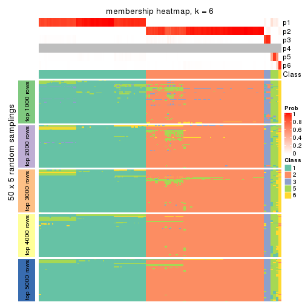</p>

</div>
</div>

As soon as we have had the classes for columns, we can look for signatures
which are significantly different between classes which can be candidate marks
for certain classes. Following are the heatmaps for signatures.


Signature heatmaps where rows are scaled:


<script>
$( function() {
	$( '#tabs-CV-NMF-get-signatures' ).tabs();
} );
</script>
<div id='tabs-CV-NMF-get-signatures'>
<ul>
<li><a href='#tab-CV-NMF-get-signatures-1'>k = 2</a></li>
<li><a href='#tab-CV-NMF-get-signatures-2'>k = 3</a></li>
<li><a href='#tab-CV-NMF-get-signatures-3'>k = 4</a></li>
<li><a href='#tab-CV-NMF-get-signatures-4'>k = 5</a></li>
<li><a href='#tab-CV-NMF-get-signatures-5'>k = 6</a></li>
</ul>
<div id='tab-CV-NMF-get-signatures-1'>
<pre><code class="r">get_signatures(res, k = 2)
</code></pre>

<p></p>

</div>
<div id='tab-CV-NMF-get-signatures-2'>
<pre><code class="r">get_signatures(res, k = 3)
</code></pre>

<p></p>

</div>
<div id='tab-CV-NMF-get-signatures-3'>
<pre><code class="r">get_signatures(res, k = 4)
</code></pre>

<p></p>

</div>
<div id='tab-CV-NMF-get-signatures-4'>
<pre><code class="r">get_signatures(res, k = 5)
</code></pre>

<p></p>

</div>
<div id='tab-CV-NMF-get-signatures-5'>
<pre><code class="r">get_signatures(res, k = 6)
</code></pre>

<p></p>

</div>
</div>


Signature heatmaps where rows are not scaled:


<script>
$( function() {
	$( '#tabs-CV-NMF-get-signatures-no-scale' ).tabs();
} );
</script>
<div id='tabs-CV-NMF-get-signatures-no-scale'>
<ul>
<li><a href='#tab-CV-NMF-get-signatures-no-scale-1'>k = 2</a></li>
<li><a href='#tab-CV-NMF-get-signatures-no-scale-2'>k = 3</a></li>
<li><a href='#tab-CV-NMF-get-signatures-no-scale-3'>k = 4</a></li>
<li><a href='#tab-CV-NMF-get-signatures-no-scale-4'>k = 5</a></li>
<li><a href='#tab-CV-NMF-get-signatures-no-scale-5'>k = 6</a></li>
</ul>
<div id='tab-CV-NMF-get-signatures-no-scale-1'>
<pre><code class="r">get_signatures(res, k = 2, scale_rows = FALSE)
</code></pre>

<p></p>

</div>
<div id='tab-CV-NMF-get-signatures-no-scale-2'>
<pre><code class="r">get_signatures(res, k = 3, scale_rows = FALSE)
</code></pre>

<p></p>

</div>
<div id='tab-CV-NMF-get-signatures-no-scale-3'>
<pre><code class="r">get_signatures(res, k = 4, scale_rows = FALSE)
</code></pre>

<p></p>

</div>
<div id='tab-CV-NMF-get-signatures-no-scale-4'>
<pre><code class="r">get_signatures(res, k = 5, scale_rows = FALSE)
</code></pre>

<p></p>

</div>
<div id='tab-CV-NMF-get-signatures-no-scale-5'>
<pre><code class="r">get_signatures(res, k = 6, scale_rows = FALSE)
</code></pre>

<p></p>

</div>
</div>


Compare the overlap of signatures from different k:

```r
compare_signatures(res)
```


`get_signature()` returns a data frame invisibly. TO get the list of signatures, the function
call should be assigned to a variable explicitly. In following code, if `plot` argument is set
to `FALSE`, no heatmap is plotted while only the differential analysis is performed.

```r
# code only for demonstration
tb = get_signature(res, k = ..., plot = FALSE)
```

An example of the output of `tb` is:

```
#>   which_row         fdr    mean_1    mean_2 scaled_mean_1 scaled_mean_2 km
#> 1        38 0.042760348  8.373488  9.131774    -0.5533452     0.5164555  1
#> 2        40 0.018707592  7.106213  8.469186    -0.6173731     0.5762149  1
#> 3        55 0.019134737 10.221463 11.207825    -0.6159697     0.5749050  1
#> 4        59 0.006059896  5.921854  7.869574    -0.6899429     0.6439467  1
#> 5        60 0.018055526  8.928898 10.211722    -0.6204761     0.5791110  1
#> 6        98 0.009384629 15.714769 14.887706     0.6635654    -0.6193277  2
...
```

The columns in `tb` are:

1. `which_row`: row indices corresponding to the input matrix.
2. `fdr`: FDR for the differential test. 
3. `mean_x`: The mean value in group x.
4. `scaled_mean_x`: The mean value in group x after rows are scaled.
5. `km`: Row groups if k-means clustering is applied to rows.


UMAP plot which shows how samples are separated.


<script>
$( function() {
	$( '#tabs-CV-NMF-dimension-reduction' ).tabs();
} );
</script>
<div id='tabs-CV-NMF-dimension-reduction'>
<ul>
<li><a href='#tab-CV-NMF-dimension-reduction-1'>k = 2</a></li>
<li><a href='#tab-CV-NMF-dimension-reduction-2'>k = 3</a></li>
<li><a href='#tab-CV-NMF-dimension-reduction-3'>k = 4</a></li>
<li><a href='#tab-CV-NMF-dimension-reduction-4'>k = 5</a></li>
<li><a href='#tab-CV-NMF-dimension-reduction-5'>k = 6</a></li>
</ul>
<div id='tab-CV-NMF-dimension-reduction-1'>
<pre><code class="r">dimension_reduction(res, k = 2, method = &quot;UMAP&quot;)
</code></pre>

<p></p>

</div>
<div id='tab-CV-NMF-dimension-reduction-2'>
<pre><code class="r">dimension_reduction(res, k = 3, method = &quot;UMAP&quot;)
</code></pre>

<p></p>

</div>
<div id='tab-CV-NMF-dimension-reduction-3'>
<pre><code class="r">dimension_reduction(res, k = 4, method = &quot;UMAP&quot;)
</code></pre>

<p></p>

</div>
<div id='tab-CV-NMF-dimension-reduction-4'>
<pre><code class="r">dimension_reduction(res, k = 5, method = &quot;UMAP&quot;)
</code></pre>

<p></p>

</div>
<div id='tab-CV-NMF-dimension-reduction-5'>
<pre><code class="r">dimension_reduction(res, k = 6, method = &quot;UMAP&quot;)
</code></pre>

<p></p>

</div>
</div>


Following heatmap shows how subgroups are split when increasing `k`:

```r
collect_classes(res)
```


If matrix rows can be associated to genes, consider to use `functional_enrichment(res,
...)` to perform function enrichment for the signature genes. See [this vignette](http://bioconductor.org/packages/devel/bioc/vignettes/cola/inst/doc/functional_enrichment.html) for more detailed explanations.


 

---------------------------------------------------


### MAD:hclust**


The object with results only for a single top-value method and a single partition method 
can be extracted as:

```r
res = res_list["MAD", "hclust"]
# you can also extract it by
# res = res_list["MAD:hclust"]
```

A summary of `res` and all the functions that can be applied to it:

```r
res
```

```
#> A 'ConsensusPartition' object with k = 2, 3, 4, 5, 6.
#>   On a matrix with 12029 rows and 181 columns.
#>   Top rows (1000, 2000, 3000, 4000, 5000) are extracted by 'MAD' method.
#>   Subgroups are detected by 'hclust' method.
#>   Performed in total 1250 partitions by row resampling.
#>   Best k for subgroups seems to be 3.
#> 
#> Following methods can be applied to this 'ConsensusPartition' object:
#>  [1] "cola_report"             "collect_classes"         "collect_plots"          
#>  [4] "collect_stats"           "colnames"                "compare_signatures"     
#>  [7] "consensus_heatmap"       "dimension_reduction"     "functional_enrichment"  
#> [10] "get_anno_col"            "get_anno"                "get_classes"            
#> [13] "get_consensus"           "get_matrix"              "get_membership"         
#> [16] "get_param"               "get_signatures"          "get_stats"              
#> [19] "is_best_k"               "is_stable_k"             "membership_heatmap"     
#> [22] "ncol"                    "nrow"                    "plot_ecdf"              
#> [25] "rownames"                "select_partition_number" "show"                   
#> [28] "suggest_best_k"          "test_to_known_factors"
```

`collect_plots()` function collects all the plots made from `res` for all `k` (number of partitions)
into one single page to provide an easy and fast comparison between different `k`.

```r
collect_plots(res)
```


The plots are:

- The first row: a plot of the ECDF (empirical cumulative distribution
  function) curves of the consensus matrix for each `k` and the heatmap of
  predicted classes for each `k`.
- The second row: heatmaps of the consensus matrix for each `k`.
- The third row: heatmaps of the membership matrix for each `k`.
- The fouth row: heatmaps of the signatures for each `k`.

All the plots in panels can be made by individual functions and they are
plotted later in this section.

`select_partition_number()` produces several plots showing different
statistics for choosing "optimized" `k`. There are following statistics:

- ECDF curves of the consensus matrix for each `k`;
- 1-PAC. [The PAC
  score](https://en.wikipedia.org/wiki/Consensus_clustering#Over-interpretation_potential_of_consensus_clustering)
  measures the proportion of the ambiguous subgrouping.
- Mean silhouette score.
- Concordance. The mean probability of fiting the consensus class ids in all
  partitions.
- Area increased. Denote $A_k$ as the area under the ECDF curve for current
  `k`, the area increased is defined as $A_k - A_{k-1}$.
- Rand index. The percent of pairs of samples that are both in a same cluster
  or both are not in a same cluster in the partition of k and k-1.
- Jaccard index. The ratio of pairs of samples are both in a same cluster in
  the partition of k and k-1 and the pairs of samples are both in a same
  cluster in the partition k or k-1.

The detailed explanations of these statistics can be found in [the _cola_
vignette](http://bioconductor.org/packages/devel/bioc/vignettes/cola/inst/doc/cola.html#toc_13).

Generally speaking, lower PAC score, higher mean silhouette score or higher
concordance corresponds to better partition. Rand index and Jaccard index
measure how similar the current partition is compared to partition with `k-1`.
If they are too similar, we won't accept `k` is better than `k-1`.

```r
select_partition_number(res)
```


The numeric values for all these statistics can be obtained by `get_stats()`.

```r
get_stats(res)
```

```
#>   k 1-PAC mean_silhouette concordance area_increased  Rand Jaccard
#> 2 2 0.497           0.856       0.885         0.1584 0.946   0.946
#> 3 3 1.000           0.994       0.998         2.3400 0.526   0.499
#> 4 4 1.000           1.000       1.000         0.0206 0.989   0.977
#> 5 5 0.989           0.994       0.991         0.0114 0.990   0.978
#> 6 6 1.000           0.995       0.996         0.0114 1.000   0.999
```

`suggest_best_k()` suggests the best $k$ based on these statistics. The rules are as follows:

- All $k$ with Jaccard index larger than 0.95 are removed because increasing
  $k$ does not provide enough extra information. If all $k$ are removed, it is
  marked as no subgroup is detected.
- For all $k$ with 1-PAC score larger than 0.9, the maximal $k$ is taken as
  the best $k$, and other $k$ are marked as optional $k$.
- If it does not fit the second rule. The $k$ with the maximal vote of the
  highest 1-PAC score, highest mean silhouette, and highest concordance is
  taken as the best $k$.

```r
suggest_best_k(res)
```

```
#> [1] 3
```


Following shows the table of the partitions (You need to click the **show/hide
code output** link to see it). The membership matrix (columns with name `p*`)
is inferred by
[`clue::cl_consensus()`](https://www.rdocumentation.org/link/cl_consensus?package=clue)
function with the `SE` method. Basically the value in the membership matrix
represents the probability to belong to a certain group. The finall class
label for an item is determined with the group with highest probability it
belongs to.

In `get_classes()` function, the entropy is calculated from the membership
matrix and the silhouette score is calculated from the consensus matrix.


<script>
$( function() {
	$( '#tabs-MAD-hclust-get-classes' ).tabs();
} );
</script>
<div id='tabs-MAD-hclust-get-classes'>
<ul>
<li><a href='#tab-MAD-hclust-get-classes-1'>k = 2</a></li>
<li><a href='#tab-MAD-hclust-get-classes-2'>k = 3</a></li>
<li><a href='#tab-MAD-hclust-get-classes-3'>k = 4</a></li>
<li><a href='#tab-MAD-hclust-get-classes-4'>k = 5</a></li>
<li><a href='#tab-MAD-hclust-get-classes-5'>k = 6</a></li>
</ul>

<div id='tab-MAD-hclust-get-classes-1'>
<p><a id='tab-MAD-hclust-get-classes-1-a' style='color:#0366d6' href='#'>show/hide code output</a></p>
<pre><code class="r">cbind(get_classes(res, k = 2), get_membership(res, k = 2))
</code></pre>

<pre><code>#&gt;           class entropy silhouette    p1    p2
#&gt; SRR315112     1   0.781      1.000 0.768 0.232
#&gt; SRR315113     1   0.781      1.000 0.768 0.232
#&gt; SRR315114     1   0.781      1.000 0.768 0.232
#&gt; SRR315115     1   0.781      1.000 0.768 0.232
#&gt; SRR315116     1   0.781      1.000 0.768 0.232
#&gt; SRR566986     2   0.000      0.852 0.000 1.000
#&gt; SRR566987     2   0.000      0.852 0.000 1.000
#&gt; SRR566988     2   0.000      0.852 0.000 1.000
#&gt; SRR566989     2   0.000      0.852 0.000 1.000
#&gt; SRR566990     2   0.000      0.852 0.000 1.000
#&gt; SRR566991     2   0.000      0.852 0.000 1.000
#&gt; SRR566992     2   0.000      0.852 0.000 1.000
#&gt; SRR566993     2   0.000      0.852 0.000 1.000
#&gt; SRR566994     2   0.000      0.852 0.000 1.000
#&gt; SRR566995     2   0.000      0.852 0.000 1.000
#&gt; SRR566996     2   0.000      0.852 0.000 1.000
#&gt; SRR566997     2   0.000      0.852 0.000 1.000
#&gt; SRR566998     2   0.000      0.852 0.000 1.000
#&gt; SRR566999     2   0.000      0.852 0.000 1.000
#&gt; SRR567000     2   0.000      0.852 0.000 1.000
#&gt; SRR567001     2   0.000      0.852 0.000 1.000
#&gt; SRR567002     2   0.000      0.852 0.000 1.000
#&gt; SRR567003     2   0.000      0.852 0.000 1.000
#&gt; SRR567004     2   0.000      0.852 0.000 1.000
#&gt; SRR567005     2   0.000      0.852 0.000 1.000
#&gt; SRR567006     2   0.000      0.852 0.000 1.000
#&gt; SRR567007     2   0.000      0.852 0.000 1.000
#&gt; SRR567008     2   0.000      0.852 0.000 1.000
#&gt; SRR567009     2   0.000      0.852 0.000 1.000
#&gt; SRR567010     2   0.000      0.852 0.000 1.000
#&gt; SRR567011     2   0.000      0.852 0.000 1.000
#&gt; SRR567012     2   0.000      0.852 0.000 1.000
#&gt; SRR567013     2   0.000      0.852 0.000 1.000
#&gt; SRR567014     2   0.000      0.852 0.000 1.000
#&gt; SRR567015     2   0.000      0.852 0.000 1.000
#&gt; SRR567016     2   0.000      0.852 0.000 1.000
#&gt; SRR567017     2   0.000      0.852 0.000 1.000
#&gt; SRR567018     2   0.000      0.852 0.000 1.000
#&gt; SRR567019     2   0.000      0.852 0.000 1.000
#&gt; SRR567020     2   0.000      0.852 0.000 1.000
#&gt; SRR567021     2   0.000      0.852 0.000 1.000
#&gt; SRR567022     2   0.000      0.852 0.000 1.000
#&gt; SRR567023     2   0.000      0.852 0.000 1.000
#&gt; SRR567024     2   0.000      0.852 0.000 1.000
#&gt; SRR567025     2   0.000      0.852 0.000 1.000
#&gt; SRR567026     2   0.000      0.852 0.000 1.000
#&gt; SRR567027     2   0.000      0.852 0.000 1.000
#&gt; SRR567028     2   0.000      0.852 0.000 1.000
#&gt; SRR567029     2   0.000      0.852 0.000 1.000
#&gt; SRR567030     2   0.000      0.852 0.000 1.000
#&gt; SRR567031     2   0.000      0.852 0.000 1.000
#&gt; SRR567032     2   0.000      0.852 0.000 1.000
#&gt; SRR567033     2   0.000      0.852 0.000 1.000
#&gt; SRR567034     2   0.000      0.852 0.000 1.000
#&gt; SRR567035     2   0.000      0.852 0.000 1.000
#&gt; SRR567036     2   0.000      0.852 0.000 1.000
#&gt; SRR567037     2   0.000      0.852 0.000 1.000
#&gt; SRR567038     2   0.000      0.852 0.000 1.000
#&gt; SRR567039     2   0.000      0.852 0.000 1.000
#&gt; SRR567040     2   0.000      0.852 0.000 1.000
#&gt; SRR567041     2   0.000      0.852 0.000 1.000
#&gt; SRR567042     2   0.000      0.852 0.000 1.000
#&gt; SRR567043     2   0.000      0.852 0.000 1.000
#&gt; SRR567044     2   0.000      0.852 0.000 1.000
#&gt; SRR567045     2   0.000      0.852 0.000 1.000
#&gt; SRR567046     2   0.000      0.852 0.000 1.000
#&gt; SRR567047     2   0.000      0.852 0.000 1.000
#&gt; SRR567048     2   0.000      0.852 0.000 1.000
#&gt; SRR567049     2   0.000      0.852 0.000 1.000
#&gt; SRR567050     2   0.000      0.852 0.000 1.000
#&gt; SRR567051     2   0.000      0.852 0.000 1.000
#&gt; SRR567052     2   0.000      0.852 0.000 1.000
#&gt; SRR567053     2   0.000      0.852 0.000 1.000
#&gt; SRR567054     2   0.000      0.852 0.000 1.000
#&gt; SRR567055     2   0.000      0.852 0.000 1.000
#&gt; SRR567056     2   0.000      0.852 0.000 1.000
#&gt; SRR567057     2   0.000      0.852 0.000 1.000
#&gt; SRR567058     2   0.000      0.852 0.000 1.000
#&gt; SRR567059     2   0.000      0.852 0.000 1.000
#&gt; SRR567060     2   0.000      0.852 0.000 1.000
#&gt; SRR567061     2   0.000      0.852 0.000 1.000
#&gt; SRR567062     2   0.000      0.852 0.000 1.000
#&gt; SRR567063     2   0.000      0.852 0.000 1.000
#&gt; SRR567064     2   0.000      0.852 0.000 1.000
#&gt; SRR567065     2   0.000      0.852 0.000 1.000
#&gt; SRR567066     2   0.000      0.852 0.000 1.000
#&gt; SRR567067     2   0.000      0.852 0.000 1.000
#&gt; SRR567068     2   0.000      0.852 0.000 1.000
#&gt; SRR567069     2   0.000      0.852 0.000 1.000
#&gt; SRR567070     2   0.000      0.852 0.000 1.000
#&gt; SRR567071     2   0.000      0.852 0.000 1.000
#&gt; SRR567072     2   0.000      0.852 0.000 1.000
#&gt; SRR567073     2   0.000      0.852 0.000 1.000
#&gt; SRR567074     2   0.000      0.852 0.000 1.000
#&gt; SRR567075     2   0.000      0.852 0.000 1.000
#&gt; SRR567076     2   0.781      0.851 0.232 0.768
#&gt; SRR567077     2   0.781      0.851 0.232 0.768
#&gt; SRR567078     2   0.781      0.851 0.232 0.768
#&gt; SRR567079     2   0.781      0.851 0.232 0.768
#&gt; SRR567080     2   0.781      0.851 0.232 0.768
#&gt; SRR567081     2   0.781      0.851 0.232 0.768
#&gt; SRR567082     2   0.781      0.851 0.232 0.768
#&gt; SRR567083     2   0.781      0.851 0.232 0.768
#&gt; SRR567084     2   0.781      0.851 0.232 0.768
#&gt; SRR567085     2   0.781      0.851 0.232 0.768
#&gt; SRR567086     2   0.781      0.851 0.232 0.768
#&gt; SRR567087     2   0.781      0.851 0.232 0.768
#&gt; SRR567088     2   0.781      0.851 0.232 0.768
#&gt; SRR567089     2   0.781      0.851 0.232 0.768
#&gt; SRR567090     2   0.781      0.851 0.232 0.768
#&gt; SRR567091     2   0.781      0.851 0.232 0.768
#&gt; SRR567092     2   0.781      0.851 0.232 0.768
#&gt; SRR567093     2   0.781      0.851 0.232 0.768
#&gt; SRR567094     2   0.781      0.851 0.232 0.768
#&gt; SRR567095     2   0.781      0.851 0.232 0.768
#&gt; SRR567096     2   0.781      0.851 0.232 0.768
#&gt; SRR567097     2   0.781      0.851 0.232 0.768
#&gt; SRR567098     2   0.781      0.851 0.232 0.768
#&gt; SRR567099     2   0.781      0.851 0.232 0.768
#&gt; SRR567100     2   0.781      0.851 0.232 0.768
#&gt; SRR567101     2   0.781      0.851 0.232 0.768
#&gt; SRR567102     2   0.781      0.851 0.232 0.768
#&gt; SRR567103     2   0.781      0.851 0.232 0.768
#&gt; SRR567104     2   0.781      0.851 0.232 0.768
#&gt; SRR567105     2   0.781      0.851 0.232 0.768
#&gt; SRR567106     2   0.781      0.851 0.232 0.768
#&gt; SRR567107     2   0.781      0.851 0.232 0.768
#&gt; SRR567108     2   0.781      0.851 0.232 0.768
#&gt; SRR567109     2   0.781      0.851 0.232 0.768
#&gt; SRR567110     2   0.781      0.851 0.232 0.768
#&gt; SRR567111     2   0.781      0.851 0.232 0.768
#&gt; SRR567112     2   0.781      0.851 0.232 0.768
#&gt; SRR567113     2   0.781      0.851 0.232 0.768
#&gt; SRR567114     2   0.781      0.851 0.232 0.768
#&gt; SRR567115     2   0.781      0.851 0.232 0.768
#&gt; SRR567116     2   0.781      0.851 0.232 0.768
#&gt; SRR567117     2   0.781      0.851 0.232 0.768
#&gt; SRR567118     2   0.781      0.851 0.232 0.768
#&gt; SRR567119     2   0.781      0.851 0.232 0.768
#&gt; SRR567120     2   0.781      0.851 0.232 0.768
#&gt; SRR567121     2   0.781      0.851 0.232 0.768
#&gt; SRR567122     2   0.781      0.851 0.232 0.768
#&gt; SRR567123     2   0.781      0.851 0.232 0.768
#&gt; SRR567124     2   0.781      0.851 0.232 0.768
#&gt; SRR567125     2   0.781      0.851 0.232 0.768
#&gt; SRR567126     2   0.781      0.851 0.232 0.768
#&gt; SRR567127     2   0.781      0.851 0.232 0.768
#&gt; SRR567128     2   0.781      0.851 0.232 0.768
#&gt; SRR567129     2   0.781      0.851 0.232 0.768
#&gt; SRR567130     2   0.781      0.851 0.232 0.768
#&gt; SRR567131     2   0.781      0.851 0.232 0.768
#&gt; SRR567132     2   0.781      0.851 0.232 0.768
#&gt; SRR567133     2   0.781      0.851 0.232 0.768
#&gt; SRR567134     2   0.781      0.851 0.232 0.768
#&gt; SRR567135     2   0.781      0.851 0.232 0.768
#&gt; SRR567136     2   0.781      0.851 0.232 0.768
#&gt; SRR567137     2   0.781      0.851 0.232 0.768
#&gt; SRR567138     2   0.781      0.851 0.232 0.768
#&gt; SRR567139     2   0.781      0.851 0.232 0.768
#&gt; SRR567140     2   0.781      0.851 0.232 0.768
#&gt; SRR567141     2   0.781      0.851 0.232 0.768
#&gt; SRR567142     2   0.781      0.851 0.232 0.768
#&gt; SRR567143     2   0.781      0.851 0.232 0.768
#&gt; SRR567144     2   0.781      0.851 0.232 0.768
#&gt; SRR567145     2   0.781      0.851 0.232 0.768
#&gt; SRR567146     2   0.722      0.851 0.200 0.800
#&gt; SRR567147     2   0.781      0.851 0.232 0.768
#&gt; SRR567148     2   0.781      0.851 0.232 0.768
#&gt; SRR567149     2   0.781      0.851 0.232 0.768
#&gt; SRR567150     2   0.781      0.851 0.232 0.768
#&gt; SRR567151     2   0.781      0.851 0.232 0.768
#&gt; SRR567152     2   0.781      0.851 0.232 0.768
#&gt; SRR567153     2   0.781      0.851 0.232 0.768
#&gt; SRR567154     2   0.781      0.851 0.232 0.768
#&gt; SRR567155     2   0.781      0.851 0.232 0.768
#&gt; SRR567156     2   0.781      0.851 0.232 0.768
#&gt; SRR567157     2   0.781      0.851 0.232 0.768
#&gt; SRR567158     2   0.781      0.851 0.232 0.768
#&gt; SRR567159     2   0.781      0.851 0.232 0.768
#&gt; SRR567160     2   0.781      0.851 0.232 0.768
#&gt; SRR567161     2   0.722      0.851 0.200 0.800
</code></pre>

<script>
$('#tab-MAD-hclust-get-classes-1-a').parent().next().next().hide();
$('#tab-MAD-hclust-get-classes-1-a').click(function(){
  $('#tab-MAD-hclust-get-classes-1-a').parent().next().next().toggle();
  return(false);
});
</script>
</div>

<div id='tab-MAD-hclust-get-classes-2'>
<p><a id='tab-MAD-hclust-get-classes-2-a' style='color:#0366d6' href='#'>show/hide code output</a></p>
<pre><code class="r">cbind(get_classes(res, k = 3), get_membership(res, k = 3))
</code></pre>

<pre><code>#&gt;           class entropy silhouette  p1  p2 p3
#&gt; SRR315112     3   0.000      1.000 0.0 0.0  1
#&gt; SRR315113     3   0.000      1.000 0.0 0.0  1
#&gt; SRR315114     3   0.000      1.000 0.0 0.0  1
#&gt; SRR315115     3   0.000      1.000 0.0 0.0  1
#&gt; SRR315116     3   0.000      1.000 0.0 0.0  1
#&gt; SRR566986     2   0.000      0.994 0.0 1.0  0
#&gt; SRR566987     2   0.000      0.994 0.0 1.0  0
#&gt; SRR566988     2   0.000      0.994 0.0 1.0  0
#&gt; SRR566989     2   0.000      0.994 0.0 1.0  0
#&gt; SRR566990     2   0.000      0.994 0.0 1.0  0
#&gt; SRR566991     2   0.000      0.994 0.0 1.0  0
#&gt; SRR566992     2   0.000      0.994 0.0 1.0  0
#&gt; SRR566993     2   0.000      0.994 0.0 1.0  0
#&gt; SRR566994     2   0.000      0.994 0.0 1.0  0
#&gt; SRR566995     2   0.000      0.994 0.0 1.0  0
#&gt; SRR566996     2   0.000      0.994 0.0 1.0  0
#&gt; SRR566997     2   0.000      0.994 0.0 1.0  0
#&gt; SRR566998     2   0.000      0.994 0.0 1.0  0
#&gt; SRR566999     2   0.000      0.994 0.0 1.0  0
#&gt; SRR567000     2   0.000      0.994 0.0 1.0  0
#&gt; SRR567001     2   0.000      0.994 0.0 1.0  0
#&gt; SRR567002     2   0.000      0.994 0.0 1.0  0
#&gt; SRR567003     2   0.000      0.994 0.0 1.0  0
#&gt; SRR567004     2   0.000      0.994 0.0 1.0  0
#&gt; SRR567005     2   0.000      0.994 0.0 1.0  0
#&gt; SRR567006     2   0.000      0.994 0.0 1.0  0
#&gt; SRR567007     2   0.000      0.994 0.0 1.0  0
#&gt; SRR567008     2   0.000      0.994 0.0 1.0  0
#&gt; SRR567009     2   0.000      0.994 0.0 1.0  0
#&gt; SRR567010     2   0.000      0.994 0.0 1.0  0
#&gt; SRR567011     2   0.000      0.994 0.0 1.0  0
#&gt; SRR567012     2   0.000      0.994 0.0 1.0  0
#&gt; SRR567013     2   0.000      0.994 0.0 1.0  0
#&gt; SRR567014     2   0.000      0.994 0.0 1.0  0
#&gt; SRR567015     2   0.000      0.994 0.0 1.0  0
#&gt; SRR567016     2   0.000      0.994 0.0 1.0  0
#&gt; SRR567017     2   0.000      0.994 0.0 1.0  0
#&gt; SRR567018     2   0.000      0.994 0.0 1.0  0
#&gt; SRR567019     2   0.000      0.994 0.0 1.0  0
#&gt; SRR567020     2   0.000      0.994 0.0 1.0  0
#&gt; SRR567021     2   0.000      0.994 0.0 1.0  0
#&gt; SRR567022     2   0.000      0.994 0.0 1.0  0
#&gt; SRR567023     2   0.000      0.994 0.0 1.0  0
#&gt; SRR567024     2   0.000      0.994 0.0 1.0  0
#&gt; SRR567025     2   0.000      0.994 0.0 1.0  0
#&gt; SRR567026     2   0.000      0.994 0.0 1.0  0
#&gt; SRR567027     2   0.000      0.994 0.0 1.0  0
#&gt; SRR567028     2   0.000      0.994 0.0 1.0  0
#&gt; SRR567029     2   0.000      0.994 0.0 1.0  0
#&gt; SRR567030     2   0.000      0.994 0.0 1.0  0
#&gt; SRR567031     2   0.000      0.994 0.0 1.0  0
#&gt; SRR567032     2   0.000      0.994 0.0 1.0  0
#&gt; SRR567033     2   0.000      0.994 0.0 1.0  0
#&gt; SRR567034     2   0.000      0.994 0.0 1.0  0
#&gt; SRR567035     2   0.000      0.994 0.0 1.0  0
#&gt; SRR567036     2   0.000      0.994 0.0 1.0  0
#&gt; SRR567037     2   0.000      0.994 0.0 1.0  0
#&gt; SRR567038     2   0.000      0.994 0.0 1.0  0
#&gt; SRR567039     2   0.000      0.994 0.0 1.0  0
#&gt; SRR567040     2   0.000      0.994 0.0 1.0  0
#&gt; SRR567041     2   0.000      0.994 0.0 1.0  0
#&gt; SRR567042     2   0.000      0.994 0.0 1.0  0
#&gt; SRR567043     2   0.000      0.994 0.0 1.0  0
#&gt; SRR567044     2   0.000      0.994 0.0 1.0  0
#&gt; SRR567045     2   0.000      0.994 0.0 1.0  0
#&gt; SRR567046     2   0.000      0.994 0.0 1.0  0
#&gt; SRR567047     2   0.000      0.994 0.0 1.0  0
#&gt; SRR567048     2   0.000      0.994 0.0 1.0  0
#&gt; SRR567049     2   0.000      0.994 0.0 1.0  0
#&gt; SRR567050     2   0.000      0.994 0.0 1.0  0
#&gt; SRR567051     2   0.000      0.994 0.0 1.0  0
#&gt; SRR567052     2   0.000      0.994 0.0 1.0  0
#&gt; SRR567053     2   0.000      0.994 0.0 1.0  0
#&gt; SRR567054     2   0.000      0.994 0.0 1.0  0
#&gt; SRR567055     2   0.000      0.994 0.0 1.0  0
#&gt; SRR567056     2   0.000      0.994 0.0 1.0  0
#&gt; SRR567057     2   0.000      0.994 0.0 1.0  0
#&gt; SRR567058     2   0.000      0.994 0.0 1.0  0
#&gt; SRR567059     2   0.000      0.994 0.0 1.0  0
#&gt; SRR567060     2   0.000      0.994 0.0 1.0  0
#&gt; SRR567061     2   0.000      0.994 0.0 1.0  0
#&gt; SRR567062     2   0.000      0.994 0.0 1.0  0
#&gt; SRR567063     2   0.000      0.994 0.0 1.0  0
#&gt; SRR567064     2   0.000      0.994 0.0 1.0  0
#&gt; SRR567065     2   0.000      0.994 0.0 1.0  0
#&gt; SRR567066     2   0.000      0.994 0.0 1.0  0
#&gt; SRR567067     2   0.000      0.994 0.0 1.0  0
#&gt; SRR567068     2   0.000      0.994 0.0 1.0  0
#&gt; SRR567069     2   0.000      0.994 0.0 1.0  0
#&gt; SRR567070     2   0.000      0.994 0.0 1.0  0
#&gt; SRR567071     2   0.000      0.994 0.0 1.0  0
#&gt; SRR567072     2   0.000      0.994 0.0 1.0  0
#&gt; SRR567073     2   0.000      0.994 0.0 1.0  0
#&gt; SRR567074     2   0.000      0.994 0.0 1.0  0
#&gt; SRR567075     2   0.000      0.994 0.0 1.0  0
#&gt; SRR567076     1   0.000      1.000 1.0 0.0  0
#&gt; SRR567077     1   0.000      1.000 1.0 0.0  0
#&gt; SRR567078     1   0.000      1.000 1.0 0.0  0
#&gt; SRR567079     1   0.000      1.000 1.0 0.0  0
#&gt; SRR567080     1   0.000      1.000 1.0 0.0  0
#&gt; SRR567081     1   0.000      1.000 1.0 0.0  0
#&gt; SRR567082     1   0.000      1.000 1.0 0.0  0
#&gt; SRR567083     1   0.000      1.000 1.0 0.0  0
#&gt; SRR567084     1   0.000      1.000 1.0 0.0  0
#&gt; SRR567085     1   0.000      1.000 1.0 0.0  0
#&gt; SRR567086     1   0.000      1.000 1.0 0.0  0
#&gt; SRR567087     1   0.000      1.000 1.0 0.0  0
#&gt; SRR567088     1   0.000      1.000 1.0 0.0  0
#&gt; SRR567089     1   0.000      1.000 1.0 0.0  0
#&gt; SRR567090     1   0.000      1.000 1.0 0.0  0
#&gt; SRR567091     1   0.000      1.000 1.0 0.0  0
#&gt; SRR567092     1   0.000      1.000 1.0 0.0  0
#&gt; SRR567093     1   0.000      1.000 1.0 0.0  0
#&gt; SRR567094     1   0.000      1.000 1.0 0.0  0
#&gt; SRR567095     1   0.000      1.000 1.0 0.0  0
#&gt; SRR567096     1   0.000      1.000 1.0 0.0  0
#&gt; SRR567097     1   0.000      1.000 1.0 0.0  0
#&gt; SRR567098     1   0.000      1.000 1.0 0.0  0
#&gt; SRR567099     1   0.000      1.000 1.0 0.0  0
#&gt; SRR567100     1   0.000      1.000 1.0 0.0  0
#&gt; SRR567101     1   0.000      1.000 1.0 0.0  0
#&gt; SRR567102     1   0.000      1.000 1.0 0.0  0
#&gt; SRR567103     1   0.000      1.000 1.0 0.0  0
#&gt; SRR567104     1   0.000      1.000 1.0 0.0  0
#&gt; SRR567105     1   0.000      1.000 1.0 0.0  0
#&gt; SRR567106     1   0.000      1.000 1.0 0.0  0
#&gt; SRR567107     1   0.000      1.000 1.0 0.0  0
#&gt; SRR567108     1   0.000      1.000 1.0 0.0  0
#&gt; SRR567109     1   0.000      1.000 1.0 0.0  0
#&gt; SRR567110     1   0.000      1.000 1.0 0.0  0
#&gt; SRR567111     1   0.000      1.000 1.0 0.0  0
#&gt; SRR567112     1   0.000      1.000 1.0 0.0  0
#&gt; SRR567113     1   0.000      1.000 1.0 0.0  0
#&gt; SRR567114     1   0.000      1.000 1.0 0.0  0
#&gt; SRR567115     1   0.000      1.000 1.0 0.0  0
#&gt; SRR567116     1   0.000      1.000 1.0 0.0  0
#&gt; SRR567117     1   0.000      1.000 1.0 0.0  0
#&gt; SRR567118     1   0.000      1.000 1.0 0.0  0
#&gt; SRR567119     1   0.000      1.000 1.0 0.0  0
#&gt; SRR567120     1   0.000      1.000 1.0 0.0  0
#&gt; SRR567121     1   0.000      1.000 1.0 0.0  0
#&gt; SRR567122     1   0.000      1.000 1.0 0.0  0
#&gt; SRR567123     1   0.000      1.000 1.0 0.0  0
#&gt; SRR567124     1   0.000      1.000 1.0 0.0  0
#&gt; SRR567125     1   0.000      1.000 1.0 0.0  0
#&gt; SRR567126     1   0.000      1.000 1.0 0.0  0
#&gt; SRR567127     1   0.000      1.000 1.0 0.0  0
#&gt; SRR567128     1   0.000      1.000 1.0 0.0  0
#&gt; SRR567129     1   0.000      1.000 1.0 0.0  0
#&gt; SRR567130     1   0.000      1.000 1.0 0.0  0
#&gt; SRR567131     1   0.000      1.000 1.0 0.0  0
#&gt; SRR567132     1   0.000      1.000 1.0 0.0  0
#&gt; SRR567133     1   0.000      1.000 1.0 0.0  0
#&gt; SRR567134     1   0.000      1.000 1.0 0.0  0
#&gt; SRR567135     1   0.000      1.000 1.0 0.0  0
#&gt; SRR567136     1   0.000      1.000 1.0 0.0  0
#&gt; SRR567137     1   0.000      1.000 1.0 0.0  0
#&gt; SRR567138     1   0.000      1.000 1.0 0.0  0
#&gt; SRR567139     1   0.000      1.000 1.0 0.0  0
#&gt; SRR567140     1   0.000      1.000 1.0 0.0  0
#&gt; SRR567141     1   0.000      1.000 1.0 0.0  0
#&gt; SRR567142     1   0.000      1.000 1.0 0.0  0
#&gt; SRR567143     1   0.000      1.000 1.0 0.0  0
#&gt; SRR567144     1   0.000      1.000 1.0 0.0  0
#&gt; SRR567145     1   0.000      1.000 1.0 0.0  0
#&gt; SRR567146     2   0.455      0.682 0.2 0.8  0
#&gt; SRR567147     1   0.000      1.000 1.0 0.0  0
#&gt; SRR567148     1   0.000      1.000 1.0 0.0  0
#&gt; SRR567149     1   0.000      1.000 1.0 0.0  0
#&gt; SRR567150     1   0.000      1.000 1.0 0.0  0
#&gt; SRR567151     1   0.000      1.000 1.0 0.0  0
#&gt; SRR567152     1   0.000      1.000 1.0 0.0  0
#&gt; SRR567153     1   0.000      1.000 1.0 0.0  0
#&gt; SRR567154     1   0.000      1.000 1.0 0.0  0
#&gt; SRR567155     1   0.000      1.000 1.0 0.0  0
#&gt; SRR567156     1   0.000      1.000 1.0 0.0  0
#&gt; SRR567157     1   0.000      1.000 1.0 0.0  0
#&gt; SRR567158     1   0.000      1.000 1.0 0.0  0
#&gt; SRR567159     1   0.000      1.000 1.0 0.0  0
#&gt; SRR567160     1   0.000      1.000 1.0 0.0  0
#&gt; SRR567161     2   0.455      0.682 0.2 0.8  0
</code></pre>

<script>
$('#tab-MAD-hclust-get-classes-2-a').parent().next().next().hide();
$('#tab-MAD-hclust-get-classes-2-a').click(function(){
  $('#tab-MAD-hclust-get-classes-2-a').parent().next().next().toggle();
  return(false);
});
</script>
</div>

<div id='tab-MAD-hclust-get-classes-3'>
<p><a id='tab-MAD-hclust-get-classes-3-a' style='color:#0366d6' href='#'>show/hide code output</a></p>
<pre><code class="r">cbind(get_classes(res, k = 4), get_membership(res, k = 4))
</code></pre>

<pre><code>#&gt;           class entropy silhouette p1 p2 p3 p4
#&gt; SRR315112     3       0          1  0  0  1  0
#&gt; SRR315113     3       0          1  0  0  1  0
#&gt; SRR315114     3       0          1  0  0  1  0
#&gt; SRR315115     3       0          1  0  0  1  0
#&gt; SRR315116     3       0          1  0  0  1  0
#&gt; SRR566986     2       0          1  0  1  0  0
#&gt; SRR566987     2       0          1  0  1  0  0
#&gt; SRR566988     2       0          1  0  1  0  0
#&gt; SRR566989     2       0          1  0  1  0  0
#&gt; SRR566990     2       0          1  0  1  0  0
#&gt; SRR566991     2       0          1  0  1  0  0
#&gt; SRR566992     2       0          1  0  1  0  0
#&gt; SRR566993     2       0          1  0  1  0  0
#&gt; SRR566994     2       0          1  0  1  0  0
#&gt; SRR566995     2       0          1  0  1  0  0
#&gt; SRR566996     2       0          1  0  1  0  0
#&gt; SRR566997     2       0          1  0  1  0  0
#&gt; SRR566998     2       0          1  0  1  0  0
#&gt; SRR566999     2       0          1  0  1  0  0
#&gt; SRR567000     2       0          1  0  1  0  0
#&gt; SRR567001     2       0          1  0  1  0  0
#&gt; SRR567002     2       0          1  0  1  0  0
#&gt; SRR567003     2       0          1  0  1  0  0
#&gt; SRR567004     2       0          1  0  1  0  0
#&gt; SRR567005     2       0          1  0  1  0  0
#&gt; SRR567006     2       0          1  0  1  0  0
#&gt; SRR567007     2       0          1  0  1  0  0
#&gt; SRR567008     2       0          1  0  1  0  0
#&gt; SRR567009     2       0          1  0  1  0  0
#&gt; SRR567010     2       0          1  0  1  0  0
#&gt; SRR567011     2       0          1  0  1  0  0
#&gt; SRR567012     2       0          1  0  1  0  0
#&gt; SRR567013     2       0          1  0  1  0  0
#&gt; SRR567014     2       0          1  0  1  0  0
#&gt; SRR567015     2       0          1  0  1  0  0
#&gt; SRR567016     2       0          1  0  1  0  0
#&gt; SRR567017     2       0          1  0  1  0  0
#&gt; SRR567018     2       0          1  0  1  0  0
#&gt; SRR567019     2       0          1  0  1  0  0
#&gt; SRR567020     2       0          1  0  1  0  0
#&gt; SRR567021     2       0          1  0  1  0  0
#&gt; SRR567022     2       0          1  0  1  0  0
#&gt; SRR567023     2       0          1  0  1  0  0
#&gt; SRR567024     2       0          1  0  1  0  0
#&gt; SRR567025     2       0          1  0  1  0  0
#&gt; SRR567026     2       0          1  0  1  0  0
#&gt; SRR567027     2       0          1  0  1  0  0
#&gt; SRR567028     2       0          1  0  1  0  0
#&gt; SRR567029     2       0          1  0  1  0  0
#&gt; SRR567030     2       0          1  0  1  0  0
#&gt; SRR567031     2       0          1  0  1  0  0
#&gt; SRR567032     2       0          1  0  1  0  0
#&gt; SRR567033     2       0          1  0  1  0  0
#&gt; SRR567034     2       0          1  0  1  0  0
#&gt; SRR567035     2       0          1  0  1  0  0
#&gt; SRR567036     2       0          1  0  1  0  0
#&gt; SRR567037     2       0          1  0  1  0  0
#&gt; SRR567038     2       0          1  0  1  0  0
#&gt; SRR567039     2       0          1  0  1  0  0
#&gt; SRR567040     2       0          1  0  1  0  0
#&gt; SRR567041     2       0          1  0  1  0  0
#&gt; SRR567042     2       0          1  0  1  0  0
#&gt; SRR567043     2       0          1  0  1  0  0
#&gt; SRR567044     2       0          1  0  1  0  0
#&gt; SRR567045     2       0          1  0  1  0  0
#&gt; SRR567046     2       0          1  0  1  0  0
#&gt; SRR567047     2       0          1  0  1  0  0
#&gt; SRR567048     2       0          1  0  1  0  0
#&gt; SRR567049     2       0          1  0  1  0  0
#&gt; SRR567050     2       0          1  0  1  0  0
#&gt; SRR567051     2       0          1  0  1  0  0
#&gt; SRR567052     2       0          1  0  1  0  0
#&gt; SRR567053     2       0          1  0  1  0  0
#&gt; SRR567054     2       0          1  0  1  0  0
#&gt; SRR567055     2       0          1  0  1  0  0
#&gt; SRR567056     2       0          1  0  1  0  0
#&gt; SRR567057     2       0          1  0  1  0  0
#&gt; SRR567058     2       0          1  0  1  0  0
#&gt; SRR567059     2       0          1  0  1  0  0
#&gt; SRR567060     2       0          1  0  1  0  0
#&gt; SRR567061     2       0          1  0  1  0  0
#&gt; SRR567062     2       0          1  0  1  0  0
#&gt; SRR567063     2       0          1  0  1  0  0
#&gt; SRR567064     2       0          1  0  1  0  0
#&gt; SRR567065     2       0          1  0  1  0  0
#&gt; SRR567066     2       0          1  0  1  0  0
#&gt; SRR567067     2       0          1  0  1  0  0
#&gt; SRR567068     2       0          1  0  1  0  0
#&gt; SRR567069     2       0          1  0  1  0  0
#&gt; SRR567070     2       0          1  0  1  0  0
#&gt; SRR567071     2       0          1  0  1  0  0
#&gt; SRR567072     2       0          1  0  1  0  0
#&gt; SRR567073     2       0          1  0  1  0  0
#&gt; SRR567074     2       0          1  0  1  0  0
#&gt; SRR567075     2       0          1  0  1  0  0
#&gt; SRR567076     1       0          1  1  0  0  0
#&gt; SRR567077     1       0          1  1  0  0  0
#&gt; SRR567078     1       0          1  1  0  0  0
#&gt; SRR567079     1       0          1  1  0  0  0
#&gt; SRR567080     1       0          1  1  0  0  0
#&gt; SRR567081     1       0          1  1  0  0  0
#&gt; SRR567082     1       0          1  1  0  0  0
#&gt; SRR567083     1       0          1  1  0  0  0
#&gt; SRR567084     1       0          1  1  0  0  0
#&gt; SRR567085     1       0          1  1  0  0  0
#&gt; SRR567086     1       0          1  1  0  0  0
#&gt; SRR567087     1       0          1  1  0  0  0
#&gt; SRR567088     1       0          1  1  0  0  0
#&gt; SRR567089     1       0          1  1  0  0  0
#&gt; SRR567090     1       0          1  1  0  0  0
#&gt; SRR567091     1       0          1  1  0  0  0
#&gt; SRR567092     1       0          1  1  0  0  0
#&gt; SRR567093     1       0          1  1  0  0  0
#&gt; SRR567094     1       0          1  1  0  0  0
#&gt; SRR567095     1       0          1  1  0  0  0
#&gt; SRR567096     1       0          1  1  0  0  0
#&gt; SRR567097     1       0          1  1  0  0  0
#&gt; SRR567098     1       0          1  1  0  0  0
#&gt; SRR567099     1       0          1  1  0  0  0
#&gt; SRR567100     1       0          1  1  0  0  0
#&gt; SRR567101     1       0          1  1  0  0  0
#&gt; SRR567102     1       0          1  1  0  0  0
#&gt; SRR567103     1       0          1  1  0  0  0
#&gt; SRR567104     1       0          1  1  0  0  0
#&gt; SRR567105     1       0          1  1  0  0  0
#&gt; SRR567106     1       0          1  1  0  0  0
#&gt; SRR567107     1       0          1  1  0  0  0
#&gt; SRR567108     1       0          1  1  0  0  0
#&gt; SRR567109     1       0          1  1  0  0  0
#&gt; SRR567110     1       0          1  1  0  0  0
#&gt; SRR567111     1       0          1  1  0  0  0
#&gt; SRR567112     1       0          1  1  0  0  0
#&gt; SRR567113     1       0          1  1  0  0  0
#&gt; SRR567114     1       0          1  1  0  0  0
#&gt; SRR567115     1       0          1  1  0  0  0
#&gt; SRR567116     1       0          1  1  0  0  0
#&gt; SRR567117     1       0          1  1  0  0  0
#&gt; SRR567118     1       0          1  1  0  0  0
#&gt; SRR567119     1       0          1  1  0  0  0
#&gt; SRR567120     1       0          1  1  0  0  0
#&gt; SRR567121     1       0          1  1  0  0  0
#&gt; SRR567122     1       0          1  1  0  0  0
#&gt; SRR567123     1       0          1  1  0  0  0
#&gt; SRR567124     1       0          1  1  0  0  0
#&gt; SRR567125     1       0          1  1  0  0  0
#&gt; SRR567126     1       0          1  1  0  0  0
#&gt; SRR567127     1       0          1  1  0  0  0
#&gt; SRR567128     1       0          1  1  0  0  0
#&gt; SRR567129     1       0          1  1  0  0  0
#&gt; SRR567130     1       0          1  1  0  0  0
#&gt; SRR567131     1       0          1  1  0  0  0
#&gt; SRR567132     1       0          1  1  0  0  0
#&gt; SRR567133     1       0          1  1  0  0  0
#&gt; SRR567134     1       0          1  1  0  0  0
#&gt; SRR567135     1       0          1  1  0  0  0
#&gt; SRR567136     1       0          1  1  0  0  0
#&gt; SRR567137     1       0          1  1  0  0  0
#&gt; SRR567138     1       0          1  1  0  0  0
#&gt; SRR567139     1       0          1  1  0  0  0
#&gt; SRR567140     1       0          1  1  0  0  0
#&gt; SRR567141     1       0          1  1  0  0  0
#&gt; SRR567142     1       0          1  1  0  0  0
#&gt; SRR567143     1       0          1  1  0  0  0
#&gt; SRR567144     1       0          1  1  0  0  0
#&gt; SRR567145     1       0          1  1  0  0  0
#&gt; SRR567146     4       0          1  0  0  0  1
#&gt; SRR567147     1       0          1  1  0  0  0
#&gt; SRR567148     1       0          1  1  0  0  0
#&gt; SRR567149     1       0          1  1  0  0  0
#&gt; SRR567150     1       0          1  1  0  0  0
#&gt; SRR567151     1       0          1  1  0  0  0
#&gt; SRR567152     1       0          1  1  0  0  0
#&gt; SRR567153     1       0          1  1  0  0  0
#&gt; SRR567154     1       0          1  1  0  0  0
#&gt; SRR567155     1       0          1  1  0  0  0
#&gt; SRR567156     1       0          1  1  0  0  0
#&gt; SRR567157     1       0          1  1  0  0  0
#&gt; SRR567158     1       0          1  1  0  0  0
#&gt; SRR567159     1       0          1  1  0  0  0
#&gt; SRR567160     1       0          1  1  0  0  0
#&gt; SRR567161     4       0          1  0  0  0  1
</code></pre>

<script>
$('#tab-MAD-hclust-get-classes-3-a').parent().next().next().hide();
$('#tab-MAD-hclust-get-classes-3-a').click(function(){
  $('#tab-MAD-hclust-get-classes-3-a').parent().next().next().toggle();
  return(false);
});
</script>
</div>

<div id='tab-MAD-hclust-get-classes-4'>
<p><a id='tab-MAD-hclust-get-classes-4-a' style='color:#0366d6' href='#'>show/hide code output</a></p>
<pre><code class="r">cbind(get_classes(res, k = 5), get_membership(res, k = 5))
</code></pre>

<pre><code>#&gt;           class entropy silhouette    p1 p2    p3 p4    p5
#&gt; SRR315112     3   0.000      0.811 0.000  0 1.000  0 0.000
#&gt; SRR315113     3   0.419      0.699 0.000  0 0.596  0 0.404
#&gt; SRR315114     3   0.419      0.699 0.000  0 0.596  0 0.404
#&gt; SRR315115     3   0.000      0.811 0.000  0 1.000  0 0.000
#&gt; SRR315116     3   0.000      0.811 0.000  0 1.000  0 0.000
#&gt; SRR566986     2   0.000      1.000 0.000  1 0.000  0 0.000
#&gt; SRR566987     2   0.000      1.000 0.000  1 0.000  0 0.000
#&gt; SRR566988     2   0.000      1.000 0.000  1 0.000  0 0.000
#&gt; SRR566989     2   0.000      1.000 0.000  1 0.000  0 0.000
#&gt; SRR566990     2   0.000      1.000 0.000  1 0.000  0 0.000
#&gt; SRR566991     2   0.000      1.000 0.000  1 0.000  0 0.000
#&gt; SRR566992     2   0.000      1.000 0.000  1 0.000  0 0.000
#&gt; SRR566993     2   0.000      1.000 0.000  1 0.000  0 0.000
#&gt; SRR566994     2   0.000      1.000 0.000  1 0.000  0 0.000
#&gt; SRR566995     2   0.000      1.000 0.000  1 0.000  0 0.000
#&gt; SRR566996     2   0.000      1.000 0.000  1 0.000  0 0.000
#&gt; SRR566997     2   0.000      1.000 0.000  1 0.000  0 0.000
#&gt; SRR566998     2   0.000      1.000 0.000  1 0.000  0 0.000
#&gt; SRR566999     2   0.000      1.000 0.000  1 0.000  0 0.000
#&gt; SRR567000     2   0.000      1.000 0.000  1 0.000  0 0.000
#&gt; SRR567001     2   0.000      1.000 0.000  1 0.000  0 0.000
#&gt; SRR567002     2   0.000      1.000 0.000  1 0.000  0 0.000
#&gt; SRR567003     2   0.000      1.000 0.000  1 0.000  0 0.000
#&gt; SRR567004     2   0.000      1.000 0.000  1 0.000  0 0.000
#&gt; SRR567005     2   0.000      1.000 0.000  1 0.000  0 0.000
#&gt; SRR567006     2   0.000      1.000 0.000  1 0.000  0 0.000
#&gt; SRR567007     2   0.000      1.000 0.000  1 0.000  0 0.000
#&gt; SRR567008     2   0.000      1.000 0.000  1 0.000  0 0.000
#&gt; SRR567009     2   0.000      1.000 0.000  1 0.000  0 0.000
#&gt; SRR567010     2   0.000      1.000 0.000  1 0.000  0 0.000
#&gt; SRR567011     2   0.000      1.000 0.000  1 0.000  0 0.000
#&gt; SRR567012     2   0.000      1.000 0.000  1 0.000  0 0.000
#&gt; SRR567013     2   0.000      1.000 0.000  1 0.000  0 0.000
#&gt; SRR567014     2   0.000      1.000 0.000  1 0.000  0 0.000
#&gt; SRR567015     2   0.000      1.000 0.000  1 0.000  0 0.000
#&gt; SRR567016     2   0.000      1.000 0.000  1 0.000  0 0.000
#&gt; SRR567017     2   0.000      1.000 0.000  1 0.000  0 0.000
#&gt; SRR567018     2   0.000      1.000 0.000  1 0.000  0 0.000
#&gt; SRR567019     2   0.000      1.000 0.000  1 0.000  0 0.000
#&gt; SRR567020     2   0.000      1.000 0.000  1 0.000  0 0.000
#&gt; SRR567021     2   0.000      1.000 0.000  1 0.000  0 0.000
#&gt; SRR567022     2   0.000      1.000 0.000  1 0.000  0 0.000
#&gt; SRR567023     2   0.000      1.000 0.000  1 0.000  0 0.000
#&gt; SRR567024     2   0.000      1.000 0.000  1 0.000  0 0.000
#&gt; SRR567025     2   0.000      1.000 0.000  1 0.000  0 0.000
#&gt; SRR567026     2   0.000      1.000 0.000  1 0.000  0 0.000
#&gt; SRR567027     2   0.000      1.000 0.000  1 0.000  0 0.000
#&gt; SRR567028     2   0.000      1.000 0.000  1 0.000  0 0.000
#&gt; SRR567029     2   0.000      1.000 0.000  1 0.000  0 0.000
#&gt; SRR567030     2   0.000      1.000 0.000  1 0.000  0 0.000
#&gt; SRR567031     2   0.000      1.000 0.000  1 0.000  0 0.000
#&gt; SRR567032     2   0.000      1.000 0.000  1 0.000  0 0.000
#&gt; SRR567033     2   0.000      1.000 0.000  1 0.000  0 0.000
#&gt; SRR567034     2   0.000      1.000 0.000  1 0.000  0 0.000
#&gt; SRR567035     2   0.000      1.000 0.000  1 0.000  0 0.000
#&gt; SRR567036     2   0.000      1.000 0.000  1 0.000  0 0.000
#&gt; SRR567037     2   0.000      1.000 0.000  1 0.000  0 0.000
#&gt; SRR567038     2   0.000      1.000 0.000  1 0.000  0 0.000
#&gt; SRR567039     2   0.000      1.000 0.000  1 0.000  0 0.000
#&gt; SRR567040     2   0.000      1.000 0.000  1 0.000  0 0.000
#&gt; SRR567041     2   0.000      1.000 0.000  1 0.000  0 0.000
#&gt; SRR567042     2   0.000      1.000 0.000  1 0.000  0 0.000
#&gt; SRR567043     2   0.000      1.000 0.000  1 0.000  0 0.000
#&gt; SRR567044     2   0.000      1.000 0.000  1 0.000  0 0.000
#&gt; SRR567045     2   0.000      1.000 0.000  1 0.000  0 0.000
#&gt; SRR567046     2   0.000      1.000 0.000  1 0.000  0 0.000
#&gt; SRR567047     2   0.000      1.000 0.000  1 0.000  0 0.000
#&gt; SRR567048     2   0.000      1.000 0.000  1 0.000  0 0.000
#&gt; SRR567049     2   0.000      1.000 0.000  1 0.000  0 0.000
#&gt; SRR567050     2   0.000      1.000 0.000  1 0.000  0 0.000
#&gt; SRR567051     2   0.000      1.000 0.000  1 0.000  0 0.000
#&gt; SRR567052     2   0.000      1.000 0.000  1 0.000  0 0.000
#&gt; SRR567053     2   0.000      1.000 0.000  1 0.000  0 0.000
#&gt; SRR567054     2   0.000      1.000 0.000  1 0.000  0 0.000
#&gt; SRR567055     2   0.000      1.000 0.000  1 0.000  0 0.000
#&gt; SRR567056     2   0.000      1.000 0.000  1 0.000  0 0.000
#&gt; SRR567057     2   0.000      1.000 0.000  1 0.000  0 0.000
#&gt; SRR567058     2   0.000      1.000 0.000  1 0.000  0 0.000
#&gt; SRR567059     2   0.000      1.000 0.000  1 0.000  0 0.000
#&gt; SRR567060     2   0.000      1.000 0.000  1 0.000  0 0.000
#&gt; SRR567061     2   0.000      1.000 0.000  1 0.000  0 0.000
#&gt; SRR567062     2   0.000      1.000 0.000  1 0.000  0 0.000
#&gt; SRR567063     2   0.000      1.000 0.000  1 0.000  0 0.000
#&gt; SRR567064     2   0.000      1.000 0.000  1 0.000  0 0.000
#&gt; SRR567065     2   0.000      1.000 0.000  1 0.000  0 0.000
#&gt; SRR567066     2   0.000      1.000 0.000  1 0.000  0 0.000
#&gt; SRR567067     2   0.000      1.000 0.000  1 0.000  0 0.000
#&gt; SRR567068     2   0.000      1.000 0.000  1 0.000  0 0.000
#&gt; SRR567069     2   0.000      1.000 0.000  1 0.000  0 0.000
#&gt; SRR567070     2   0.000      1.000 0.000  1 0.000  0 0.000
#&gt; SRR567071     2   0.000      1.000 0.000  1 0.000  0 0.000
#&gt; SRR567072     2   0.000      1.000 0.000  1 0.000  0 0.000
#&gt; SRR567073     2   0.000      1.000 0.000  1 0.000  0 0.000
#&gt; SRR567074     2   0.000      1.000 0.000  1 0.000  0 0.000
#&gt; SRR567075     2   0.000      1.000 0.000  1 0.000  0 0.000
#&gt; SRR567076     1   0.000      1.000 1.000  0 0.000  0 0.000
#&gt; SRR567077     1   0.000      1.000 1.000  0 0.000  0 0.000
#&gt; SRR567078     1   0.000      1.000 1.000  0 0.000  0 0.000
#&gt; SRR567079     1   0.000      1.000 1.000  0 0.000  0 0.000
#&gt; SRR567080     1   0.000      1.000 1.000  0 0.000  0 0.000
#&gt; SRR567081     1   0.000      1.000 1.000  0 0.000  0 0.000
#&gt; SRR567082     1   0.000      1.000 1.000  0 0.000  0 0.000
#&gt; SRR567083     1   0.000      1.000 1.000  0 0.000  0 0.000
#&gt; SRR567084     1   0.000      1.000 1.000  0 0.000  0 0.000
#&gt; SRR567085     1   0.000      1.000 1.000  0 0.000  0 0.000
#&gt; SRR567086     1   0.000      1.000 1.000  0 0.000  0 0.000
#&gt; SRR567087     1   0.000      1.000 1.000  0 0.000  0 0.000
#&gt; SRR567088     1   0.000      1.000 1.000  0 0.000  0 0.000
#&gt; SRR567089     1   0.000      1.000 1.000  0 0.000  0 0.000
#&gt; SRR567090     1   0.000      1.000 1.000  0 0.000  0 0.000
#&gt; SRR567091     1   0.000      1.000 1.000  0 0.000  0 0.000
#&gt; SRR567092     1   0.000      1.000 1.000  0 0.000  0 0.000
#&gt; SRR567093     1   0.000      1.000 1.000  0 0.000  0 0.000
#&gt; SRR567094     1   0.000      1.000 1.000  0 0.000  0 0.000
#&gt; SRR567095     1   0.000      1.000 1.000  0 0.000  0 0.000
#&gt; SRR567096     1   0.000      1.000 1.000  0 0.000  0 0.000
#&gt; SRR567097     1   0.000      1.000 1.000  0 0.000  0 0.000
#&gt; SRR567098     1   0.000      1.000 1.000  0 0.000  0 0.000
#&gt; SRR567099     1   0.000      1.000 1.000  0 0.000  0 0.000
#&gt; SRR567100     1   0.000      1.000 1.000  0 0.000  0 0.000
#&gt; SRR567101     1   0.000      1.000 1.000  0 0.000  0 0.000
#&gt; SRR567102     1   0.000      1.000 1.000  0 0.000  0 0.000
#&gt; SRR567103     1   0.000      1.000 1.000  0 0.000  0 0.000
#&gt; SRR567104     1   0.000      1.000 1.000  0 0.000  0 0.000
#&gt; SRR567105     1   0.000      1.000 1.000  0 0.000  0 0.000
#&gt; SRR567106     1   0.000      1.000 1.000  0 0.000  0 0.000
#&gt; SRR567107     1   0.000      1.000 1.000  0 0.000  0 0.000
#&gt; SRR567108     1   0.000      1.000 1.000  0 0.000  0 0.000
#&gt; SRR567109     1   0.000      1.000 1.000  0 0.000  0 0.000
#&gt; SRR567110     1   0.000      1.000 1.000  0 0.000  0 0.000
#&gt; SRR567111     1   0.000      1.000 1.000  0 0.000  0 0.000
#&gt; SRR567112     1   0.000      1.000 1.000  0 0.000  0 0.000
#&gt; SRR567113     1   0.000      1.000 1.000  0 0.000  0 0.000
#&gt; SRR567114     1   0.000      1.000 1.000  0 0.000  0 0.000
#&gt; SRR567115     1   0.000      1.000 1.000  0 0.000  0 0.000
#&gt; SRR567116     1   0.000      1.000 1.000  0 0.000  0 0.000
#&gt; SRR567117     1   0.000      1.000 1.000  0 0.000  0 0.000
#&gt; SRR567118     1   0.000      1.000 1.000  0 0.000  0 0.000
#&gt; SRR567119     1   0.000      1.000 1.000  0 0.000  0 0.000
#&gt; SRR567120     1   0.000      1.000 1.000  0 0.000  0 0.000
#&gt; SRR567121     1   0.000      1.000 1.000  0 0.000  0 0.000
#&gt; SRR567122     1   0.000      1.000 1.000  0 0.000  0 0.000
#&gt; SRR567123     1   0.000      1.000 1.000  0 0.000  0 0.000
#&gt; SRR567124     1   0.000      1.000 1.000  0 0.000  0 0.000
#&gt; SRR567125     1   0.000      1.000 1.000  0 0.000  0 0.000
#&gt; SRR567126     1   0.000      1.000 1.000  0 0.000  0 0.000
#&gt; SRR567127     1   0.000      1.000 1.000  0 0.000  0 0.000
#&gt; SRR567128     1   0.000      1.000 1.000  0 0.000  0 0.000
#&gt; SRR567129     1   0.000      1.000 1.000  0 0.000  0 0.000
#&gt; SRR567130     1   0.000      1.000 1.000  0 0.000  0 0.000
#&gt; SRR567131     1   0.000      1.000 1.000  0 0.000  0 0.000
#&gt; SRR567132     1   0.000      1.000 1.000  0 0.000  0 0.000
#&gt; SRR567133     1   0.000      1.000 1.000  0 0.000  0 0.000
#&gt; SRR567134     1   0.000      1.000 1.000  0 0.000  0 0.000
#&gt; SRR567135     1   0.000      1.000 1.000  0 0.000  0 0.000
#&gt; SRR567136     5   0.419      1.000 0.404  0 0.000  0 0.596
#&gt; SRR567137     1   0.000      1.000 1.000  0 0.000  0 0.000
#&gt; SRR567138     1   0.000      1.000 1.000  0 0.000  0 0.000
#&gt; SRR567139     1   0.000      1.000 1.000  0 0.000  0 0.000
#&gt; SRR567140     1   0.000      1.000 1.000  0 0.000  0 0.000
#&gt; SRR567141     1   0.000      1.000 1.000  0 0.000  0 0.000
#&gt; SRR567142     1   0.000      1.000 1.000  0 0.000  0 0.000
#&gt; SRR567143     1   0.000      1.000 1.000  0 0.000  0 0.000
#&gt; SRR567144     1   0.000      1.000 1.000  0 0.000  0 0.000
#&gt; SRR567145     1   0.000      1.000 1.000  0 0.000  0 0.000
#&gt; SRR567146     4   0.000      1.000 0.000  0 0.000  1 0.000
#&gt; SRR567147     1   0.000      1.000 1.000  0 0.000  0 0.000
#&gt; SRR567148     1   0.000      1.000 1.000  0 0.000  0 0.000
#&gt; SRR567149     1   0.000      1.000 1.000  0 0.000  0 0.000
#&gt; SRR567150     1   0.000      1.000 1.000  0 0.000  0 0.000
#&gt; SRR567151     1   0.000      1.000 1.000  0 0.000  0 0.000
#&gt; SRR567152     1   0.000      1.000 1.000  0 0.000  0 0.000
#&gt; SRR567153     1   0.000      1.000 1.000  0 0.000  0 0.000
#&gt; SRR567154     1   0.000      1.000 1.000  0 0.000  0 0.000
#&gt; SRR567155     1   0.000      1.000 1.000  0 0.000  0 0.000
#&gt; SRR567156     1   0.000      1.000 1.000  0 0.000  0 0.000
#&gt; SRR567157     1   0.000      1.000 1.000  0 0.000  0 0.000
#&gt; SRR567158     1   0.000      1.000 1.000  0 0.000  0 0.000
#&gt; SRR567159     5   0.419      1.000 0.404  0 0.000  0 0.596
#&gt; SRR567160     1   0.000      1.000 1.000  0 0.000  0 0.000
#&gt; SRR567161     4   0.000      1.000 0.000  0 0.000  1 0.000
</code></pre>

<script>
$('#tab-MAD-hclust-get-classes-4-a').parent().next().next().hide();
$('#tab-MAD-hclust-get-classes-4-a').click(function(){
  $('#tab-MAD-hclust-get-classes-4-a').parent().next().next().toggle();
  return(false);
});
</script>
</div>

<div id='tab-MAD-hclust-get-classes-5'>
<p><a id='tab-MAD-hclust-get-classes-5-a' style='color:#0366d6' href='#'>show/hide code output</a></p>
<pre><code class="r">cbind(get_classes(res, k = 6), get_membership(res, k = 6))
</code></pre>

<pre><code>#&gt;           class entropy silhouette p1    p2    p3 p4 p5    p6
#&gt; SRR315112     3    0.00      1.000  0 0.000 1.000  0  0 0.000
#&gt; SRR315113     6    0.27      1.000  0 0.000 0.188  0  0 0.812
#&gt; SRR315114     6    0.27      1.000  0 0.000 0.188  0  0 0.812
#&gt; SRR315115     3    0.00      1.000  0 0.000 1.000  0  0 0.000
#&gt; SRR315116     3    0.00      1.000  0 0.000 1.000  0  0 0.000
#&gt; SRR566986     2    0.00      0.996  0 1.000 0.000  0  0 0.000
#&gt; SRR566987     2    0.00      0.996  0 1.000 0.000  0  0 0.000
#&gt; SRR566988     2    0.00      0.996  0 1.000 0.000  0  0 0.000
#&gt; SRR566989     2    0.00      0.996  0 1.000 0.000  0  0 0.000
#&gt; SRR566990     2    0.00      0.996  0 1.000 0.000  0  0 0.000
#&gt; SRR566991     2    0.00      0.996  0 1.000 0.000  0  0 0.000
#&gt; SRR566992     2    0.00      0.996  0 1.000 0.000  0  0 0.000
#&gt; SRR566993     2    0.00      0.996  0 1.000 0.000  0  0 0.000
#&gt; SRR566994     2    0.00      0.996  0 1.000 0.000  0  0 0.000
#&gt; SRR566995     2    0.00      0.996  0 1.000 0.000  0  0 0.000
#&gt; SRR566996     2    0.00      0.996  0 1.000 0.000  0  0 0.000
#&gt; SRR566997     2    0.00      0.996  0 1.000 0.000  0  0 0.000
#&gt; SRR566998     2    0.00      0.996  0 1.000 0.000  0  0 0.000
#&gt; SRR566999     2    0.00      0.996  0 1.000 0.000  0  0 0.000
#&gt; SRR567000     2    0.00      0.996  0 1.000 0.000  0  0 0.000
#&gt; SRR567001     2    0.00      0.996  0 1.000 0.000  0  0 0.000
#&gt; SRR567002     2    0.00      0.996  0 1.000 0.000  0  0 0.000
#&gt; SRR567003     2    0.00      0.996  0 1.000 0.000  0  0 0.000
#&gt; SRR567004     2    0.00      0.996  0 1.000 0.000  0  0 0.000
#&gt; SRR567005     2    0.00      0.996  0 1.000 0.000  0  0 0.000
#&gt; SRR567006     2    0.00      0.996  0 1.000 0.000  0  0 0.000
#&gt; SRR567007     2    0.00      0.996  0 1.000 0.000  0  0 0.000
#&gt; SRR567008     2    0.00      0.996  0 1.000 0.000  0  0 0.000
#&gt; SRR567009     2    0.00      0.996  0 1.000 0.000  0  0 0.000
#&gt; SRR567010     2    0.00      0.996  0 1.000 0.000  0  0 0.000
#&gt; SRR567011     2    0.00      0.996  0 1.000 0.000  0  0 0.000
#&gt; SRR567012     2    0.00      0.996  0 1.000 0.000  0  0 0.000
#&gt; SRR567013     2    0.00      0.996  0 1.000 0.000  0  0 0.000
#&gt; SRR567014     2    0.00      0.996  0 1.000 0.000  0  0 0.000
#&gt; SRR567015     2    0.00      0.996  0 1.000 0.000  0  0 0.000
#&gt; SRR567016     2    0.00      0.996  0 1.000 0.000  0  0 0.000
#&gt; SRR567017     2    0.00      0.996  0 1.000 0.000  0  0 0.000
#&gt; SRR567018     2    0.00      0.996  0 1.000 0.000  0  0 0.000
#&gt; SRR567019     2    0.00      0.996  0 1.000 0.000  0  0 0.000
#&gt; SRR567020     2    0.00      0.996  0 1.000 0.000  0  0 0.000
#&gt; SRR567021     2    0.00      0.996  0 1.000 0.000  0  0 0.000
#&gt; SRR567022     2    0.27      0.776  0 0.812 0.000  0  0 0.188
#&gt; SRR567023     2    0.00      0.996  0 1.000 0.000  0  0 0.000
#&gt; SRR567024     2    0.00      0.996  0 1.000 0.000  0  0 0.000
#&gt; SRR567025     2    0.00      0.996  0 1.000 0.000  0  0 0.000
#&gt; SRR567026     2    0.00      0.996  0 1.000 0.000  0  0 0.000
#&gt; SRR567027     2    0.00      0.996  0 1.000 0.000  0  0 0.000
#&gt; SRR567028     2    0.00      0.996  0 1.000 0.000  0  0 0.000
#&gt; SRR567029     2    0.00      0.996  0 1.000 0.000  0  0 0.000
#&gt; SRR567030     2    0.00      0.996  0 1.000 0.000  0  0 0.000
#&gt; SRR567031     2    0.00      0.996  0 1.000 0.000  0  0 0.000
#&gt; SRR567032     2    0.00      0.996  0 1.000 0.000  0  0 0.000
#&gt; SRR567033     2    0.00      0.996  0 1.000 0.000  0  0 0.000
#&gt; SRR567034     2    0.00      0.996  0 1.000 0.000  0  0 0.000
#&gt; SRR567035     2    0.00      0.996  0 1.000 0.000  0  0 0.000
#&gt; SRR567036     2    0.00      0.996  0 1.000 0.000  0  0 0.000
#&gt; SRR567037     2    0.00      0.996  0 1.000 0.000  0  0 0.000
#&gt; SRR567038     2    0.00      0.996  0 1.000 0.000  0  0 0.000
#&gt; SRR567039     2    0.00      0.996  0 1.000 0.000  0  0 0.000
#&gt; SRR567040     2    0.00      0.996  0 1.000 0.000  0  0 0.000
#&gt; SRR567041     2    0.00      0.996  0 1.000 0.000  0  0 0.000
#&gt; SRR567042     2    0.27      0.776  0 0.812 0.000  0  0 0.188
#&gt; SRR567043     2    0.00      0.996  0 1.000 0.000  0  0 0.000
#&gt; SRR567044     2    0.00      0.996  0 1.000 0.000  0  0 0.000
#&gt; SRR567045     2    0.00      0.996  0 1.000 0.000  0  0 0.000
#&gt; SRR567046     2    0.00      0.996  0 1.000 0.000  0  0 0.000
#&gt; SRR567047     2    0.00      0.996  0 1.000 0.000  0  0 0.000
#&gt; SRR567048     2    0.00      0.996  0 1.000 0.000  0  0 0.000
#&gt; SRR567049     2    0.00      0.996  0 1.000 0.000  0  0 0.000
#&gt; SRR567050     2    0.00      0.996  0 1.000 0.000  0  0 0.000
#&gt; SRR567051     2    0.00      0.996  0 1.000 0.000  0  0 0.000
#&gt; SRR567052     2    0.00      0.996  0 1.000 0.000  0  0 0.000
#&gt; SRR567053     2    0.00      0.996  0 1.000 0.000  0  0 0.000
#&gt; SRR567054     2    0.00      0.996  0 1.000 0.000  0  0 0.000
#&gt; SRR567055     2    0.00      0.996  0 1.000 0.000  0  0 0.000
#&gt; SRR567056     2    0.00      0.996  0 1.000 0.000  0  0 0.000
#&gt; SRR567057     2    0.00      0.996  0 1.000 0.000  0  0 0.000
#&gt; SRR567058     2    0.00      0.996  0 1.000 0.000  0  0 0.000
#&gt; SRR567059     2    0.00      0.996  0 1.000 0.000  0  0 0.000
#&gt; SRR567060     2    0.00      0.996  0 1.000 0.000  0  0 0.000
#&gt; SRR567061     2    0.00      0.996  0 1.000 0.000  0  0 0.000
#&gt; SRR567062     2    0.00      0.996  0 1.000 0.000  0  0 0.000
#&gt; SRR567063     2    0.00      0.996  0 1.000 0.000  0  0 0.000
#&gt; SRR567064     2    0.00      0.996  0 1.000 0.000  0  0 0.000
#&gt; SRR567065     2    0.00      0.996  0 1.000 0.000  0  0 0.000
#&gt; SRR567066     2    0.00      0.996  0 1.000 0.000  0  0 0.000
#&gt; SRR567067     2    0.00      0.996  0 1.000 0.000  0  0 0.000
#&gt; SRR567068     2    0.00      0.996  0 1.000 0.000  0  0 0.000
#&gt; SRR567069     2    0.00      0.996  0 1.000 0.000  0  0 0.000
#&gt; SRR567070     2    0.00      0.996  0 1.000 0.000  0  0 0.000
#&gt; SRR567071     2    0.00      0.996  0 1.000 0.000  0  0 0.000
#&gt; SRR567072     2    0.00      0.996  0 1.000 0.000  0  0 0.000
#&gt; SRR567073     2    0.00      0.996  0 1.000 0.000  0  0 0.000
#&gt; SRR567074     2    0.00      0.996  0 1.000 0.000  0  0 0.000
#&gt; SRR567075     2    0.00      0.996  0 1.000 0.000  0  0 0.000
#&gt; SRR567076     1    0.00      1.000  1 0.000 0.000  0  0 0.000
#&gt; SRR567077     1    0.00      1.000  1 0.000 0.000  0  0 0.000
#&gt; SRR567078     1    0.00      1.000  1 0.000 0.000  0  0 0.000
#&gt; SRR567079     1    0.00      1.000  1 0.000 0.000  0  0 0.000
#&gt; SRR567080     1    0.00      1.000  1 0.000 0.000  0  0 0.000
#&gt; SRR567081     1    0.00      1.000  1 0.000 0.000  0  0 0.000
#&gt; SRR567082     1    0.00      1.000  1 0.000 0.000  0  0 0.000
#&gt; SRR567083     1    0.00      1.000  1 0.000 0.000  0  0 0.000
#&gt; SRR567084     1    0.00      1.000  1 0.000 0.000  0  0 0.000
#&gt; SRR567085     1    0.00      1.000  1 0.000 0.000  0  0 0.000
#&gt; SRR567086     1    0.00      1.000  1 0.000 0.000  0  0 0.000
#&gt; SRR567087     1    0.00      1.000  1 0.000 0.000  0  0 0.000
#&gt; SRR567088     1    0.00      1.000  1 0.000 0.000  0  0 0.000
#&gt; SRR567089     1    0.00      1.000  1 0.000 0.000  0  0 0.000
#&gt; SRR567090     1    0.00      1.000  1 0.000 0.000  0  0 0.000
#&gt; SRR567091     1    0.00      1.000  1 0.000 0.000  0  0 0.000
#&gt; SRR567092     1    0.00      1.000  1 0.000 0.000  0  0 0.000
#&gt; SRR567093     1    0.00      1.000  1 0.000 0.000  0  0 0.000
#&gt; SRR567094     1    0.00      1.000  1 0.000 0.000  0  0 0.000
#&gt; SRR567095     1    0.00      1.000  1 0.000 0.000  0  0 0.000
#&gt; SRR567096     1    0.00      1.000  1 0.000 0.000  0  0 0.000
#&gt; SRR567097     1    0.00      1.000  1 0.000 0.000  0  0 0.000
#&gt; SRR567098     1    0.00      1.000  1 0.000 0.000  0  0 0.000
#&gt; SRR567099     1    0.00      1.000  1 0.000 0.000  0  0 0.000
#&gt; SRR567100     1    0.00      1.000  1 0.000 0.000  0  0 0.000
#&gt; SRR567101     1    0.00      1.000  1 0.000 0.000  0  0 0.000
#&gt; SRR567102     1    0.00      1.000  1 0.000 0.000  0  0 0.000
#&gt; SRR567103     1    0.00      1.000  1 0.000 0.000  0  0 0.000
#&gt; SRR567104     1    0.00      1.000  1 0.000 0.000  0  0 0.000
#&gt; SRR567105     1    0.00      1.000  1 0.000 0.000  0  0 0.000
#&gt; SRR567106     1    0.00      1.000  1 0.000 0.000  0  0 0.000
#&gt; SRR567107     1    0.00      1.000  1 0.000 0.000  0  0 0.000
#&gt; SRR567108     1    0.00      1.000  1 0.000 0.000  0  0 0.000
#&gt; SRR567109     1    0.00      1.000  1 0.000 0.000  0  0 0.000
#&gt; SRR567110     1    0.00      1.000  1 0.000 0.000  0  0 0.000
#&gt; SRR567111     1    0.00      1.000  1 0.000 0.000  0  0 0.000
#&gt; SRR567112     1    0.00      1.000  1 0.000 0.000  0  0 0.000
#&gt; SRR567113     1    0.00      1.000  1 0.000 0.000  0  0 0.000
#&gt; SRR567114     1    0.00      1.000  1 0.000 0.000  0  0 0.000
#&gt; SRR567115     1    0.00      1.000  1 0.000 0.000  0  0 0.000
#&gt; SRR567116     1    0.00      1.000  1 0.000 0.000  0  0 0.000
#&gt; SRR567117     1    0.00      1.000  1 0.000 0.000  0  0 0.000
#&gt; SRR567118     1    0.00      1.000  1 0.000 0.000  0  0 0.000
#&gt; SRR567119     1    0.00      1.000  1 0.000 0.000  0  0 0.000
#&gt; SRR567120     1    0.00      1.000  1 0.000 0.000  0  0 0.000
#&gt; SRR567121     1    0.00      1.000  1 0.000 0.000  0  0 0.000
#&gt; SRR567122     1    0.00      1.000  1 0.000 0.000  0  0 0.000
#&gt; SRR567123     1    0.00      1.000  1 0.000 0.000  0  0 0.000
#&gt; SRR567124     1    0.00      1.000  1 0.000 0.000  0  0 0.000
#&gt; SRR567125     1    0.00      1.000  1 0.000 0.000  0  0 0.000
#&gt; SRR567126     1    0.00      1.000  1 0.000 0.000  0  0 0.000
#&gt; SRR567127     1    0.00      1.000  1 0.000 0.000  0  0 0.000
#&gt; SRR567128     1    0.00      1.000  1 0.000 0.000  0  0 0.000
#&gt; SRR567129     1    0.00      1.000  1 0.000 0.000  0  0 0.000
#&gt; SRR567130     1    0.00      1.000  1 0.000 0.000  0  0 0.000
#&gt; SRR567131     1    0.00      1.000  1 0.000 0.000  0  0 0.000
#&gt; SRR567132     1    0.00      1.000  1 0.000 0.000  0  0 0.000
#&gt; SRR567133     1    0.00      1.000  1 0.000 0.000  0  0 0.000
#&gt; SRR567134     1    0.00      1.000  1 0.000 0.000  0  0 0.000
#&gt; SRR567135     1    0.00      1.000  1 0.000 0.000  0  0 0.000
#&gt; SRR567136     5    0.00      1.000  0 0.000 0.000  0  1 0.000
#&gt; SRR567137     1    0.00      1.000  1 0.000 0.000  0  0 0.000
#&gt; SRR567138     1    0.00      1.000  1 0.000 0.000  0  0 0.000
#&gt; SRR567139     1    0.00      1.000  1 0.000 0.000  0  0 0.000
#&gt; SRR567140     1    0.00      1.000  1 0.000 0.000  0  0 0.000
#&gt; SRR567141     1    0.00      1.000  1 0.000 0.000  0  0 0.000
#&gt; SRR567142     1    0.00      1.000  1 0.000 0.000  0  0 0.000
#&gt; SRR567143     1    0.00      1.000  1 0.000 0.000  0  0 0.000
#&gt; SRR567144     1    0.00      1.000  1 0.000 0.000  0  0 0.000
#&gt; SRR567145     1    0.00      1.000  1 0.000 0.000  0  0 0.000
#&gt; SRR567146     4    0.00      1.000  0 0.000 0.000  1  0 0.000
#&gt; SRR567147     1    0.00      1.000  1 0.000 0.000  0  0 0.000
#&gt; SRR567148     1    0.00      1.000  1 0.000 0.000  0  0 0.000
#&gt; SRR567149     1    0.00      1.000  1 0.000 0.000  0  0 0.000
#&gt; SRR567150     1    0.00      1.000  1 0.000 0.000  0  0 0.000
#&gt; SRR567151     1    0.00      1.000  1 0.000 0.000  0  0 0.000
#&gt; SRR567152     1    0.00      1.000  1 0.000 0.000  0  0 0.000
#&gt; SRR567153     1    0.00      1.000  1 0.000 0.000  0  0 0.000
#&gt; SRR567154     1    0.00      1.000  1 0.000 0.000  0  0 0.000
#&gt; SRR567155     1    0.00      1.000  1 0.000 0.000  0  0 0.000
#&gt; SRR567156     1    0.00      1.000  1 0.000 0.000  0  0 0.000
#&gt; SRR567157     1    0.00      1.000  1 0.000 0.000  0  0 0.000
#&gt; SRR567158     1    0.00      1.000  1 0.000 0.000  0  0 0.000
#&gt; SRR567159     5    0.00      1.000  0 0.000 0.000  0  1 0.000
#&gt; SRR567160     1    0.00      1.000  1 0.000 0.000  0  0 0.000
#&gt; SRR567161     4    0.00      1.000  0 0.000 0.000  1  0 0.000
</code></pre>

<script>
$('#tab-MAD-hclust-get-classes-5-a').parent().next().next().hide();
$('#tab-MAD-hclust-get-classes-5-a').click(function(){
  $('#tab-MAD-hclust-get-classes-5-a').parent().next().next().toggle();
  return(false);
});
</script>
</div>
</div>

Heatmaps for the consensus matrix. It visualizes the probability of two
samples to be in a same group.


<script>
$( function() {
	$( '#tabs-MAD-hclust-consensus-heatmap' ).tabs();
} );
</script>
<div id='tabs-MAD-hclust-consensus-heatmap'>
<ul>
<li><a href='#tab-MAD-hclust-consensus-heatmap-1'>k = 2</a></li>
<li><a href='#tab-MAD-hclust-consensus-heatmap-2'>k = 3</a></li>
<li><a href='#tab-MAD-hclust-consensus-heatmap-3'>k = 4</a></li>
<li><a href='#tab-MAD-hclust-consensus-heatmap-4'>k = 5</a></li>
<li><a href='#tab-MAD-hclust-consensus-heatmap-5'>k = 6</a></li>
</ul>
<div id='tab-MAD-hclust-consensus-heatmap-1'>
<pre><code class="r">consensus_heatmap(res, k = 2)
</code></pre>

<p></p>

</div>
<div id='tab-MAD-hclust-consensus-heatmap-2'>
<pre><code class="r">consensus_heatmap(res, k = 3)
</code></pre>

<p></p>

</div>
<div id='tab-MAD-hclust-consensus-heatmap-3'>
<pre><code class="r">consensus_heatmap(res, k = 4)
</code></pre>

<p></p>

</div>
<div id='tab-MAD-hclust-consensus-heatmap-4'>
<pre><code class="r">consensus_heatmap(res, k = 5)
</code></pre>

<p></p>

</div>
<div id='tab-MAD-hclust-consensus-heatmap-5'>
<pre><code class="r">consensus_heatmap(res, k = 6)
</code></pre>

<p></p>

</div>
</div>

Heatmaps for the membership of samples in all partitions to see how consistent they are:


<script>
$( function() {
	$( '#tabs-MAD-hclust-membership-heatmap' ).tabs();
} );
</script>
<div id='tabs-MAD-hclust-membership-heatmap'>
<ul>
<li><a href='#tab-MAD-hclust-membership-heatmap-1'>k = 2</a></li>
<li><a href='#tab-MAD-hclust-membership-heatmap-2'>k = 3</a></li>
<li><a href='#tab-MAD-hclust-membership-heatmap-3'>k = 4</a></li>
<li><a href='#tab-MAD-hclust-membership-heatmap-4'>k = 5</a></li>
<li><a href='#tab-MAD-hclust-membership-heatmap-5'>k = 6</a></li>
</ul>
<div id='tab-MAD-hclust-membership-heatmap-1'>
<pre><code class="r">membership_heatmap(res, k = 2)
</code></pre>

<p></p>

</div>
<div id='tab-MAD-hclust-membership-heatmap-2'>
<pre><code class="r">membership_heatmap(res, k = 3)
</code></pre>

<p></p>

</div>
<div id='tab-MAD-hclust-membership-heatmap-3'>
<pre><code class="r">membership_heatmap(res, k = 4)
</code></pre>

<p></p>

</div>
<div id='tab-MAD-hclust-membership-heatmap-4'>
<pre><code class="r">membership_heatmap(res, k = 5)
</code></pre>

<p></p>

</div>
<div id='tab-MAD-hclust-membership-heatmap-5'>
<pre><code class="r">membership_heatmap(res, k = 6)
</code></pre>

<p></p>

</div>
</div>

As soon as we have had the classes for columns, we can look for signatures
which are significantly different between classes which can be candidate marks
for certain classes. Following are the heatmaps for signatures.


Signature heatmaps where rows are scaled:


<script>
$( function() {
	$( '#tabs-MAD-hclust-get-signatures' ).tabs();
} );
</script>
<div id='tabs-MAD-hclust-get-signatures'>
<ul>
<li><a href='#tab-MAD-hclust-get-signatures-1'>k = 2</a></li>
<li><a href='#tab-MAD-hclust-get-signatures-2'>k = 3</a></li>
<li><a href='#tab-MAD-hclust-get-signatures-3'>k = 4</a></li>
<li><a href='#tab-MAD-hclust-get-signatures-4'>k = 5</a></li>
<li><a href='#tab-MAD-hclust-get-signatures-5'>k = 6</a></li>
</ul>
<div id='tab-MAD-hclust-get-signatures-1'>
<pre><code class="r">get_signatures(res, k = 2)
</code></pre>

<p></p>

</div>
<div id='tab-MAD-hclust-get-signatures-2'>
<pre><code class="r">get_signatures(res, k = 3)
</code></pre>

<p></p>

</div>
<div id='tab-MAD-hclust-get-signatures-3'>
<pre><code class="r">get_signatures(res, k = 4)
</code></pre>

<p></p>

</div>
<div id='tab-MAD-hclust-get-signatures-4'>
<pre><code class="r">get_signatures(res, k = 5)
</code></pre>

<p></p>

</div>
<div id='tab-MAD-hclust-get-signatures-5'>
<pre><code class="r">get_signatures(res, k = 6)
</code></pre>

<p></p>

</div>
</div>


Signature heatmaps where rows are not scaled:


<script>
$( function() {
	$( '#tabs-MAD-hclust-get-signatures-no-scale' ).tabs();
} );
</script>
<div id='tabs-MAD-hclust-get-signatures-no-scale'>
<ul>
<li><a href='#tab-MAD-hclust-get-signatures-no-scale-1'>k = 2</a></li>
<li><a href='#tab-MAD-hclust-get-signatures-no-scale-2'>k = 3</a></li>
<li><a href='#tab-MAD-hclust-get-signatures-no-scale-3'>k = 4</a></li>
<li><a href='#tab-MAD-hclust-get-signatures-no-scale-4'>k = 5</a></li>
<li><a href='#tab-MAD-hclust-get-signatures-no-scale-5'>k = 6</a></li>
</ul>
<div id='tab-MAD-hclust-get-signatures-no-scale-1'>
<pre><code class="r">get_signatures(res, k = 2, scale_rows = FALSE)
</code></pre>

<p></p>

</div>
<div id='tab-MAD-hclust-get-signatures-no-scale-2'>
<pre><code class="r">get_signatures(res, k = 3, scale_rows = FALSE)
</code></pre>

<p></p>

</div>
<div id='tab-MAD-hclust-get-signatures-no-scale-3'>
<pre><code class="r">get_signatures(res, k = 4, scale_rows = FALSE)
</code></pre>

<p></p>

</div>
<div id='tab-MAD-hclust-get-signatures-no-scale-4'>
<pre><code class="r">get_signatures(res, k = 5, scale_rows = FALSE)
</code></pre>

<p></p>

</div>
<div id='tab-MAD-hclust-get-signatures-no-scale-5'>
<pre><code class="r">get_signatures(res, k = 6, scale_rows = FALSE)
</code></pre>

<p></p>

</div>
</div>


Compare the overlap of signatures from different k:

```r
compare_signatures(res)
```


`get_signature()` returns a data frame invisibly. TO get the list of signatures, the function
call should be assigned to a variable explicitly. In following code, if `plot` argument is set
to `FALSE`, no heatmap is plotted while only the differential analysis is performed.

```r
# code only for demonstration
tb = get_signature(res, k = ..., plot = FALSE)
```

An example of the output of `tb` is:

```
#>   which_row         fdr    mean_1    mean_2 scaled_mean_1 scaled_mean_2 km
#> 1        38 0.042760348  8.373488  9.131774    -0.5533452     0.5164555  1
#> 2        40 0.018707592  7.106213  8.469186    -0.6173731     0.5762149  1
#> 3        55 0.019134737 10.221463 11.207825    -0.6159697     0.5749050  1
#> 4        59 0.006059896  5.921854  7.869574    -0.6899429     0.6439467  1
#> 5        60 0.018055526  8.928898 10.211722    -0.6204761     0.5791110  1
#> 6        98 0.009384629 15.714769 14.887706     0.6635654    -0.6193277  2
...
```

The columns in `tb` are:

1. `which_row`: row indices corresponding to the input matrix.
2. `fdr`: FDR for the differential test. 
3. `mean_x`: The mean value in group x.
4. `scaled_mean_x`: The mean value in group x after rows are scaled.
5. `km`: Row groups if k-means clustering is applied to rows.


UMAP plot which shows how samples are separated.


<script>
$( function() {
	$( '#tabs-MAD-hclust-dimension-reduction' ).tabs();
} );
</script>
<div id='tabs-MAD-hclust-dimension-reduction'>
<ul>
<li><a href='#tab-MAD-hclust-dimension-reduction-1'>k = 2</a></li>
<li><a href='#tab-MAD-hclust-dimension-reduction-2'>k = 3</a></li>
<li><a href='#tab-MAD-hclust-dimension-reduction-3'>k = 4</a></li>
<li><a href='#tab-MAD-hclust-dimension-reduction-4'>k = 5</a></li>
<li><a href='#tab-MAD-hclust-dimension-reduction-5'>k = 6</a></li>
</ul>
<div id='tab-MAD-hclust-dimension-reduction-1'>
<pre><code class="r">dimension_reduction(res, k = 2, method = &quot;UMAP&quot;)
</code></pre>

<p></p>

</div>
<div id='tab-MAD-hclust-dimension-reduction-2'>
<pre><code class="r">dimension_reduction(res, k = 3, method = &quot;UMAP&quot;)
</code></pre>

<p></p>

</div>
<div id='tab-MAD-hclust-dimension-reduction-3'>
<pre><code class="r">dimension_reduction(res, k = 4, method = &quot;UMAP&quot;)
</code></pre>

<p></p>

</div>
<div id='tab-MAD-hclust-dimension-reduction-4'>
<pre><code class="r">dimension_reduction(res, k = 5, method = &quot;UMAP&quot;)
</code></pre>

<p></p>

</div>
<div id='tab-MAD-hclust-dimension-reduction-5'>
<pre><code class="r">dimension_reduction(res, k = 6, method = &quot;UMAP&quot;)
</code></pre>

<p></p>

</div>
</div>


Following heatmap shows how subgroups are split when increasing `k`:

```r
collect_classes(res)
```


If matrix rows can be associated to genes, consider to use `functional_enrichment(res,
...)` to perform function enrichment for the signature genes. See [this vignette](http://bioconductor.org/packages/devel/bioc/vignettes/cola/inst/doc/functional_enrichment.html) for more detailed explanations.


 

---------------------------------------------------


### MAD:kmeans**


The object with results only for a single top-value method and a single partition method 
can be extracted as:

```r
res = res_list["MAD", "kmeans"]
# you can also extract it by
# res = res_list["MAD:kmeans"]
```

A summary of `res` and all the functions that can be applied to it:

```r
res
```

```
#> A 'ConsensusPartition' object with k = 2, 3, 4, 5, 6.
#>   On a matrix with 12029 rows and 181 columns.
#>   Top rows (1000, 2000, 3000, 4000, 5000) are extracted by 'MAD' method.
#>   Subgroups are detected by 'kmeans' method.
#>   Performed in total 1250 partitions by row resampling.
#>   Best k for subgroups seems to be 2.
#> 
#> Following methods can be applied to this 'ConsensusPartition' object:
#>  [1] "cola_report"             "collect_classes"         "collect_plots"          
#>  [4] "collect_stats"           "colnames"                "compare_signatures"     
#>  [7] "consensus_heatmap"       "dimension_reduction"     "functional_enrichment"  
#> [10] "get_anno_col"            "get_anno"                "get_classes"            
#> [13] "get_consensus"           "get_matrix"              "get_membership"         
#> [16] "get_param"               "get_signatures"          "get_stats"              
#> [19] "is_best_k"               "is_stable_k"             "membership_heatmap"     
#> [22] "ncol"                    "nrow"                    "plot_ecdf"              
#> [25] "rownames"                "select_partition_number" "show"                   
#> [28] "suggest_best_k"          "test_to_known_factors"
```

`collect_plots()` function collects all the plots made from `res` for all `k` (number of partitions)
into one single page to provide an easy and fast comparison between different `k`.

```r
collect_plots(res)
```


The plots are:

- The first row: a plot of the ECDF (empirical cumulative distribution
  function) curves of the consensus matrix for each `k` and the heatmap of
  predicted classes for each `k`.
- The second row: heatmaps of the consensus matrix for each `k`.
- The third row: heatmaps of the membership matrix for each `k`.
- The fouth row: heatmaps of the signatures for each `k`.

All the plots in panels can be made by individual functions and they are
plotted later in this section.

`select_partition_number()` produces several plots showing different
statistics for choosing "optimized" `k`. There are following statistics:

- ECDF curves of the consensus matrix for each `k`;
- 1-PAC. [The PAC
  score](https://en.wikipedia.org/wiki/Consensus_clustering#Over-interpretation_potential_of_consensus_clustering)
  measures the proportion of the ambiguous subgrouping.
- Mean silhouette score.
- Concordance. The mean probability of fiting the consensus class ids in all
  partitions.
- Area increased. Denote $A_k$ as the area under the ECDF curve for current
  `k`, the area increased is defined as $A_k - A_{k-1}$.
- Rand index. The percent of pairs of samples that are both in a same cluster
  or both are not in a same cluster in the partition of k and k-1.
- Jaccard index. The ratio of pairs of samples are both in a same cluster in
  the partition of k and k-1 and the pairs of samples are both in a same
  cluster in the partition k or k-1.

The detailed explanations of these statistics can be found in [the _cola_
vignette](http://bioconductor.org/packages/devel/bioc/vignettes/cola/inst/doc/cola.html#toc_13).

Generally speaking, lower PAC score, higher mean silhouette score or higher
concordance corresponds to better partition. Rand index and Jaccard index
measure how similar the current partition is compared to partition with `k-1`.
If they are too similar, we won't accept `k` is better than `k-1`.

```r
select_partition_number(res)
```


The numeric values for all these statistics can be obtained by `get_stats()`.

```r
get_stats(res)
```

```
#>   k 1-PAC mean_silhouette concordance area_increased  Rand Jaccard
#> 2 2 1.000           0.986       0.984         0.4921 0.498   0.498
#> 3 3 0.712           0.771       0.869         0.2029 0.989   0.977
#> 4 4 0.655           0.689       0.628         0.1173 0.773   0.538
#> 5 5 0.666           0.747       0.757         0.0735 0.880   0.633
#> 6 6 0.667           0.656       0.639         0.0522 0.939   0.772
```

`suggest_best_k()` suggests the best $k$ based on these statistics. The rules are as follows:

- All $k$ with Jaccard index larger than 0.95 are removed because increasing
  $k$ does not provide enough extra information. If all $k$ are removed, it is
  marked as no subgroup is detected.
- For all $k$ with 1-PAC score larger than 0.9, the maximal $k$ is taken as
  the best $k$, and other $k$ are marked as optional $k$.
- If it does not fit the second rule. The $k$ with the maximal vote of the
  highest 1-PAC score, highest mean silhouette, and highest concordance is
  taken as the best $k$.

```r
suggest_best_k(res)
```

```
#> [1] 2
```


Following shows the table of the partitions (You need to click the **show/hide
code output** link to see it). The membership matrix (columns with name `p*`)
is inferred by
[`clue::cl_consensus()`](https://www.rdocumentation.org/link/cl_consensus?package=clue)
function with the `SE` method. Basically the value in the membership matrix
represents the probability to belong to a certain group. The finall class
label for an item is determined with the group with highest probability it
belongs to.

In `get_classes()` function, the entropy is calculated from the membership
matrix and the silhouette score is calculated from the consensus matrix.


<script>
$( function() {
	$( '#tabs-MAD-kmeans-get-classes' ).tabs();
} );
</script>
<div id='tabs-MAD-kmeans-get-classes'>
<ul>
<li><a href='#tab-MAD-kmeans-get-classes-1'>k = 2</a></li>
<li><a href='#tab-MAD-kmeans-get-classes-2'>k = 3</a></li>
<li><a href='#tab-MAD-kmeans-get-classes-3'>k = 4</a></li>
<li><a href='#tab-MAD-kmeans-get-classes-4'>k = 5</a></li>
<li><a href='#tab-MAD-kmeans-get-classes-5'>k = 6</a></li>
</ul>

<div id='tab-MAD-kmeans-get-classes-1'>
<p><a id='tab-MAD-kmeans-get-classes-1-a' style='color:#0366d6' href='#'>show/hide code output</a></p>
<pre><code class="r">cbind(get_classes(res, k = 2), get_membership(res, k = 2))
</code></pre>

<pre><code>#&gt;           class entropy silhouette    p1    p2
#&gt; SRR315112     2   0.163      0.967 0.024 0.976
#&gt; SRR315113     1   0.000      0.975 1.000 0.000
#&gt; SRR315114     1   0.000      0.975 1.000 0.000
#&gt; SRR315115     2   0.163      0.967 0.024 0.976
#&gt; SRR315116     2   0.163      0.967 0.024 0.976
#&gt; SRR566986     2   0.000      0.990 0.000 1.000
#&gt; SRR566987     2   0.000      0.990 0.000 1.000
#&gt; SRR566988     2   0.000      0.990 0.000 1.000
#&gt; SRR566989     2   0.000      0.990 0.000 1.000
#&gt; SRR566990     2   0.000      0.990 0.000 1.000
#&gt; SRR566991     2   0.000      0.990 0.000 1.000
#&gt; SRR566992     2   0.000      0.990 0.000 1.000
#&gt; SRR566993     2   0.000      0.990 0.000 1.000
#&gt; SRR566994     2   0.000      0.990 0.000 1.000
#&gt; SRR566995     2   0.000      0.990 0.000 1.000
#&gt; SRR566996     2   0.000      0.990 0.000 1.000
#&gt; SRR566997     2   0.000      0.990 0.000 1.000
#&gt; SRR566998     2   0.000      0.990 0.000 1.000
#&gt; SRR566999     2   0.000      0.990 0.000 1.000
#&gt; SRR567000     2   0.000      0.990 0.000 1.000
#&gt; SRR567001     2   0.000      0.990 0.000 1.000
#&gt; SRR567002     2   0.000      0.990 0.000 1.000
#&gt; SRR567003     2   0.000      0.990 0.000 1.000
#&gt; SRR567004     2   0.000      0.990 0.000 1.000
#&gt; SRR567005     2   0.000      0.990 0.000 1.000
#&gt; SRR567006     2   0.000      0.990 0.000 1.000
#&gt; SRR567007     2   0.000      0.990 0.000 1.000
#&gt; SRR567008     2   0.000      0.990 0.000 1.000
#&gt; SRR567009     2   0.000      0.990 0.000 1.000
#&gt; SRR567010     2   0.000      0.990 0.000 1.000
#&gt; SRR567011     2   0.000      0.990 0.000 1.000
#&gt; SRR567012     2   0.000      0.990 0.000 1.000
#&gt; SRR567013     2   0.000      0.990 0.000 1.000
#&gt; SRR567014     2   0.000      0.990 0.000 1.000
#&gt; SRR567015     2   0.000      0.990 0.000 1.000
#&gt; SRR567016     2   0.000      0.990 0.000 1.000
#&gt; SRR567017     2   0.000      0.990 0.000 1.000
#&gt; SRR567018     2   0.000      0.990 0.000 1.000
#&gt; SRR567019     2   0.000      0.990 0.000 1.000
#&gt; SRR567020     2   0.000      0.990 0.000 1.000
#&gt; SRR567021     2   0.000      0.990 0.000 1.000
#&gt; SRR567022     2   0.000      0.990 0.000 1.000
#&gt; SRR567023     2   0.000      0.990 0.000 1.000
#&gt; SRR567024     2   0.000      0.990 0.000 1.000
#&gt; SRR567025     2   0.000      0.990 0.000 1.000
#&gt; SRR567026     2   0.000      0.990 0.000 1.000
#&gt; SRR567027     2   0.000      0.990 0.000 1.000
#&gt; SRR567028     2   0.000      0.990 0.000 1.000
#&gt; SRR567029     2   0.000      0.990 0.000 1.000
#&gt; SRR567030     2   0.000      0.990 0.000 1.000
#&gt; SRR567031     2   0.000      0.990 0.000 1.000
#&gt; SRR567032     2   0.000      0.990 0.000 1.000
#&gt; SRR567033     2   0.000      0.990 0.000 1.000
#&gt; SRR567034     2   0.000      0.990 0.000 1.000
#&gt; SRR567035     2   0.000      0.990 0.000 1.000
#&gt; SRR567036     2   0.000      0.990 0.000 1.000
#&gt; SRR567037     2   0.000      0.990 0.000 1.000
#&gt; SRR567038     2   0.000      0.990 0.000 1.000
#&gt; SRR567039     2   0.000      0.990 0.000 1.000
#&gt; SRR567040     2   0.000      0.990 0.000 1.000
#&gt; SRR567041     2   0.000      0.990 0.000 1.000
#&gt; SRR567042     2   0.000      0.990 0.000 1.000
#&gt; SRR567043     2   0.000      0.990 0.000 1.000
#&gt; SRR567044     2   0.000      0.990 0.000 1.000
#&gt; SRR567045     2   0.000      0.990 0.000 1.000
#&gt; SRR567046     2   0.000      0.990 0.000 1.000
#&gt; SRR567047     2   0.000      0.990 0.000 1.000
#&gt; SRR567048     2   0.000      0.990 0.000 1.000
#&gt; SRR567049     2   0.000      0.990 0.000 1.000
#&gt; SRR567050     2   0.000      0.990 0.000 1.000
#&gt; SRR567051     2   0.000      0.990 0.000 1.000
#&gt; SRR567052     2   0.000      0.990 0.000 1.000
#&gt; SRR567053     2   0.000      0.990 0.000 1.000
#&gt; SRR567054     2   0.000      0.990 0.000 1.000
#&gt; SRR567055     2   0.000      0.990 0.000 1.000
#&gt; SRR567056     2   0.000      0.990 0.000 1.000
#&gt; SRR567057     2   0.000      0.990 0.000 1.000
#&gt; SRR567058     2   0.000      0.990 0.000 1.000
#&gt; SRR567059     2   0.000      0.990 0.000 1.000
#&gt; SRR567060     2   0.000      0.990 0.000 1.000
#&gt; SRR567061     2   0.000      0.990 0.000 1.000
#&gt; SRR567062     2   0.000      0.990 0.000 1.000
#&gt; SRR567063     2   0.000      0.990 0.000 1.000
#&gt; SRR567064     2   0.000      0.990 0.000 1.000
#&gt; SRR567065     2   0.000      0.990 0.000 1.000
#&gt; SRR567066     2   0.000      0.990 0.000 1.000
#&gt; SRR567067     2   0.000      0.990 0.000 1.000
#&gt; SRR567068     2   0.000      0.990 0.000 1.000
#&gt; SRR567069     2   0.000      0.990 0.000 1.000
#&gt; SRR567070     2   0.000      0.990 0.000 1.000
#&gt; SRR567071     2   0.000      0.990 0.000 1.000
#&gt; SRR567072     2   0.000      0.990 0.000 1.000
#&gt; SRR567073     2   0.000      0.990 0.000 1.000
#&gt; SRR567074     2   0.000      0.990 0.000 1.000
#&gt; SRR567075     2   0.000      0.990 0.000 1.000
#&gt; SRR567076     1   0.163      0.999 0.976 0.024
#&gt; SRR567077     1   0.163      0.999 0.976 0.024
#&gt; SRR567078     1   0.163      0.999 0.976 0.024
#&gt; SRR567079     1   0.163      0.999 0.976 0.024
#&gt; SRR567080     1   0.163      0.999 0.976 0.024
#&gt; SRR567081     1   0.163      0.999 0.976 0.024
#&gt; SRR567082     1   0.163      0.999 0.976 0.024
#&gt; SRR567083     1   0.163      0.999 0.976 0.024
#&gt; SRR567084     1   0.163      0.999 0.976 0.024
#&gt; SRR567085     1   0.163      0.999 0.976 0.024
#&gt; SRR567086     1   0.163      0.999 0.976 0.024
#&gt; SRR567087     1   0.163      0.999 0.976 0.024
#&gt; SRR567088     1   0.163      0.999 0.976 0.024
#&gt; SRR567089     1   0.163      0.999 0.976 0.024
#&gt; SRR567090     1   0.163      0.999 0.976 0.024
#&gt; SRR567091     1   0.163      0.999 0.976 0.024
#&gt; SRR567092     1   0.163      0.999 0.976 0.024
#&gt; SRR567093     1   0.163      0.999 0.976 0.024
#&gt; SRR567094     1   0.163      0.999 0.976 0.024
#&gt; SRR567095     1   0.163      0.999 0.976 0.024
#&gt; SRR567096     1   0.163      0.999 0.976 0.024
#&gt; SRR567097     1   0.163      0.999 0.976 0.024
#&gt; SRR567098     1   0.163      0.999 0.976 0.024
#&gt; SRR567099     1   0.163      0.999 0.976 0.024
#&gt; SRR567100     1   0.163      0.999 0.976 0.024
#&gt; SRR567101     1   0.163      0.999 0.976 0.024
#&gt; SRR567102     1   0.163      0.999 0.976 0.024
#&gt; SRR567103     1   0.163      0.999 0.976 0.024
#&gt; SRR567104     1   0.163      0.999 0.976 0.024
#&gt; SRR567105     1   0.163      0.999 0.976 0.024
#&gt; SRR567106     1   0.163      0.999 0.976 0.024
#&gt; SRR567107     1   0.163      0.999 0.976 0.024
#&gt; SRR567108     1   0.163      0.999 0.976 0.024
#&gt; SRR567109     1   0.163      0.999 0.976 0.024
#&gt; SRR567110     1   0.163      0.999 0.976 0.024
#&gt; SRR567111     1   0.163      0.999 0.976 0.024
#&gt; SRR567112     1   0.163      0.999 0.976 0.024
#&gt; SRR567113     1   0.163      0.999 0.976 0.024
#&gt; SRR567114     1   0.163      0.999 0.976 0.024
#&gt; SRR567115     1   0.163      0.999 0.976 0.024
#&gt; SRR567116     1   0.163      0.999 0.976 0.024
#&gt; SRR567117     1   0.163      0.999 0.976 0.024
#&gt; SRR567118     1   0.163      0.999 0.976 0.024
#&gt; SRR567119     1   0.163      0.999 0.976 0.024
#&gt; SRR567120     1   0.163      0.999 0.976 0.024
#&gt; SRR567121     1   0.163      0.999 0.976 0.024
#&gt; SRR567122     1   0.163      0.999 0.976 0.024
#&gt; SRR567123     1   0.163      0.999 0.976 0.024
#&gt; SRR567124     1   0.163      0.999 0.976 0.024
#&gt; SRR567125     1   0.163      0.999 0.976 0.024
#&gt; SRR567126     1   0.163      0.999 0.976 0.024
#&gt; SRR567127     1   0.163      0.999 0.976 0.024
#&gt; SRR567128     1   0.163      0.999 0.976 0.024
#&gt; SRR567129     1   0.163      0.999 0.976 0.024
#&gt; SRR567130     1   0.163      0.999 0.976 0.024
#&gt; SRR567131     1   0.163      0.999 0.976 0.024
#&gt; SRR567132     1   0.163      0.999 0.976 0.024
#&gt; SRR567133     1   0.163      0.999 0.976 0.024
#&gt; SRR567134     1   0.163      0.999 0.976 0.024
#&gt; SRR567135     1   0.163      0.999 0.976 0.024
#&gt; SRR567136     1   0.163      0.999 0.976 0.024
#&gt; SRR567137     1   0.163      0.999 0.976 0.024
#&gt; SRR567138     1   0.163      0.999 0.976 0.024
#&gt; SRR567139     1   0.163      0.999 0.976 0.024
#&gt; SRR567140     1   0.163      0.999 0.976 0.024
#&gt; SRR567141     1   0.163      0.999 0.976 0.024
#&gt; SRR567142     1   0.163      0.999 0.976 0.024
#&gt; SRR567143     1   0.163      0.999 0.976 0.024
#&gt; SRR567144     1   0.163      0.999 0.976 0.024
#&gt; SRR567145     1   0.163      0.999 0.976 0.024
#&gt; SRR567146     2   0.980      0.265 0.416 0.584
#&gt; SRR567147     1   0.163      0.999 0.976 0.024
#&gt; SRR567148     1   0.163      0.999 0.976 0.024
#&gt; SRR567149     1   0.163      0.999 0.976 0.024
#&gt; SRR567150     1   0.163      0.999 0.976 0.024
#&gt; SRR567151     1   0.163      0.999 0.976 0.024
#&gt; SRR567152     1   0.163      0.999 0.976 0.024
#&gt; SRR567153     1   0.163      0.999 0.976 0.024
#&gt; SRR567154     1   0.163      0.999 0.976 0.024
#&gt; SRR567155     1   0.163      0.999 0.976 0.024
#&gt; SRR567156     1   0.163      0.999 0.976 0.024
#&gt; SRR567157     1   0.163      0.999 0.976 0.024
#&gt; SRR567158     1   0.163      0.999 0.976 0.024
#&gt; SRR567159     1   0.163      0.999 0.976 0.024
#&gt; SRR567160     1   0.163      0.999 0.976 0.024
#&gt; SRR567161     2   0.980      0.265 0.416 0.584
</code></pre>

<script>
$('#tab-MAD-kmeans-get-classes-1-a').parent().next().next().hide();
$('#tab-MAD-kmeans-get-classes-1-a').click(function(){
  $('#tab-MAD-kmeans-get-classes-1-a').parent().next().next().toggle();
  return(false);
});
</script>
</div>

<div id='tab-MAD-kmeans-get-classes-2'>
<p><a id='tab-MAD-kmeans-get-classes-2-a' style='color:#0366d6' href='#'>show/hide code output</a></p>
<pre><code class="r">cbind(get_classes(res, k = 3), get_membership(res, k = 3))
</code></pre>

<pre><code>#&gt;           class entropy silhouette    p1    p2    p3
#&gt; SRR315112     2   0.400      0.520 0.000 0.840 0.160
#&gt; SRR315113     1   0.693      0.102 0.664 0.040 0.296
#&gt; SRR315114     1   0.553      0.269 0.704 0.000 0.296
#&gt; SRR315115     2   0.400      0.520 0.000 0.840 0.160
#&gt; SRR315116     2   0.400      0.520 0.000 0.840 0.160
#&gt; SRR566986     2   0.533      0.841 0.000 0.728 0.272
#&gt; SRR566987     2   0.533      0.841 0.000 0.728 0.272
#&gt; SRR566988     2   0.533      0.841 0.000 0.728 0.272
#&gt; SRR566989     2   0.533      0.841 0.000 0.728 0.272
#&gt; SRR566990     2   0.533      0.841 0.000 0.728 0.272
#&gt; SRR566991     2   0.533      0.841 0.000 0.728 0.272
#&gt; SRR566992     2   0.533      0.841 0.000 0.728 0.272
#&gt; SRR566993     2   0.533      0.841 0.000 0.728 0.272
#&gt; SRR566994     2   0.533      0.841 0.000 0.728 0.272
#&gt; SRR566995     2   0.533      0.841 0.000 0.728 0.272
#&gt; SRR566996     2   0.533      0.841 0.000 0.728 0.272
#&gt; SRR566997     2   0.533      0.841 0.000 0.728 0.272
#&gt; SRR566998     2   0.533      0.841 0.000 0.728 0.272
#&gt; SRR566999     2   0.533      0.841 0.000 0.728 0.272
#&gt; SRR567000     2   0.533      0.841 0.000 0.728 0.272
#&gt; SRR567001     2   0.533      0.841 0.000 0.728 0.272
#&gt; SRR567002     2   0.533      0.841 0.000 0.728 0.272
#&gt; SRR567003     2   0.533      0.841 0.000 0.728 0.272
#&gt; SRR567004     2   0.533      0.841 0.000 0.728 0.272
#&gt; SRR567005     2   0.533      0.841 0.000 0.728 0.272
#&gt; SRR567006     2   0.533      0.841 0.000 0.728 0.272
#&gt; SRR567007     2   0.533      0.841 0.000 0.728 0.272
#&gt; SRR567008     2   0.533      0.841 0.000 0.728 0.272
#&gt; SRR567009     2   0.533      0.841 0.000 0.728 0.272
#&gt; SRR567010     2   0.533      0.841 0.000 0.728 0.272
#&gt; SRR567011     2   0.533      0.841 0.000 0.728 0.272
#&gt; SRR567012     2   0.533      0.841 0.000 0.728 0.272
#&gt; SRR567013     2   0.533      0.841 0.000 0.728 0.272
#&gt; SRR567014     2   0.000      0.735 0.000 1.000 0.000
#&gt; SRR567015     2   0.000      0.735 0.000 1.000 0.000
#&gt; SRR567016     2   0.000      0.735 0.000 1.000 0.000
#&gt; SRR567017     2   0.000      0.735 0.000 1.000 0.000
#&gt; SRR567018     2   0.000      0.735 0.000 1.000 0.000
#&gt; SRR567019     2   0.000      0.735 0.000 1.000 0.000
#&gt; SRR567020     2   0.000      0.735 0.000 1.000 0.000
#&gt; SRR567021     2   0.000      0.735 0.000 1.000 0.000
#&gt; SRR567022     2   0.280      0.730 0.000 0.908 0.092
#&gt; SRR567023     2   0.000      0.735 0.000 1.000 0.000
#&gt; SRR567024     2   0.000      0.735 0.000 1.000 0.000
#&gt; SRR567025     2   0.000      0.735 0.000 1.000 0.000
#&gt; SRR567026     2   0.000      0.735 0.000 1.000 0.000
#&gt; SRR567027     2   0.000      0.735 0.000 1.000 0.000
#&gt; SRR567028     2   0.000      0.735 0.000 1.000 0.000
#&gt; SRR567029     2   0.000      0.735 0.000 1.000 0.000
#&gt; SRR567030     2   0.000      0.735 0.000 1.000 0.000
#&gt; SRR567031     2   0.000      0.735 0.000 1.000 0.000
#&gt; SRR567032     2   0.000      0.735 0.000 1.000 0.000
#&gt; SRR567033     2   0.000      0.735 0.000 1.000 0.000
#&gt; SRR567034     2   0.000      0.735 0.000 1.000 0.000
#&gt; SRR567035     2   0.000      0.735 0.000 1.000 0.000
#&gt; SRR567036     2   0.000      0.735 0.000 1.000 0.000
#&gt; SRR567037     2   0.000      0.735 0.000 1.000 0.000
#&gt; SRR567038     2   0.000      0.735 0.000 1.000 0.000
#&gt; SRR567039     2   0.000      0.735 0.000 1.000 0.000
#&gt; SRR567040     2   0.000      0.735 0.000 1.000 0.000
#&gt; SRR567041     2   0.000      0.735 0.000 1.000 0.000
#&gt; SRR567042     2   0.280      0.730 0.000 0.908 0.092
#&gt; SRR567043     2   0.000      0.735 0.000 1.000 0.000
#&gt; SRR567044     2   0.597      0.823 0.000 0.636 0.364
#&gt; SRR567045     2   0.597      0.823 0.000 0.636 0.364
#&gt; SRR567046     2   0.597      0.823 0.000 0.636 0.364
#&gt; SRR567047     2   0.597      0.823 0.000 0.636 0.364
#&gt; SRR567048     2   0.597      0.823 0.000 0.636 0.364
#&gt; SRR567049     2   0.597      0.823 0.000 0.636 0.364
#&gt; SRR567050     2   0.597      0.823 0.000 0.636 0.364
#&gt; SRR567051     2   0.597      0.823 0.000 0.636 0.364
#&gt; SRR567052     2   0.597      0.823 0.000 0.636 0.364
#&gt; SRR567053     2   0.597      0.823 0.000 0.636 0.364
#&gt; SRR567054     2   0.597      0.823 0.000 0.636 0.364
#&gt; SRR567055     2   0.597      0.823 0.000 0.636 0.364
#&gt; SRR567056     2   0.597      0.823 0.000 0.636 0.364
#&gt; SRR567057     2   0.597      0.823 0.000 0.636 0.364
#&gt; SRR567058     2   0.597      0.823 0.000 0.636 0.364
#&gt; SRR567059     2   0.597      0.823 0.000 0.636 0.364
#&gt; SRR567060     2   0.597      0.823 0.000 0.636 0.364
#&gt; SRR567061     2   0.597      0.823 0.000 0.636 0.364
#&gt; SRR567062     2   0.597      0.823 0.000 0.636 0.364
#&gt; SRR567063     2   0.597      0.823 0.000 0.636 0.364
#&gt; SRR567064     2   0.597      0.823 0.000 0.636 0.364
#&gt; SRR567065     2   0.597      0.823 0.000 0.636 0.364
#&gt; SRR567066     2   0.597      0.823 0.000 0.636 0.364
#&gt; SRR567067     2   0.597      0.823 0.000 0.636 0.364
#&gt; SRR567068     2   0.597      0.823 0.000 0.636 0.364
#&gt; SRR567069     2   0.597      0.823 0.000 0.636 0.364
#&gt; SRR567070     2   0.597      0.823 0.000 0.636 0.364
#&gt; SRR567071     2   0.597      0.823 0.000 0.636 0.364
#&gt; SRR567072     2   0.597      0.823 0.000 0.636 0.364
#&gt; SRR567073     2   0.597      0.823 0.000 0.636 0.364
#&gt; SRR567074     2   0.597      0.823 0.000 0.636 0.364
#&gt; SRR567075     2   0.597      0.823 0.000 0.636 0.364
#&gt; SRR567076     1   0.465      0.806 0.792 0.000 0.208
#&gt; SRR567077     1   0.465      0.806 0.792 0.000 0.208
#&gt; SRR567078     1   0.465      0.806 0.792 0.000 0.208
#&gt; SRR567079     1   0.465      0.806 0.792 0.000 0.208
#&gt; SRR567080     1   0.465      0.806 0.792 0.000 0.208
#&gt; SRR567081     1   0.465      0.806 0.792 0.000 0.208
#&gt; SRR567082     1   0.465      0.806 0.792 0.000 0.208
#&gt; SRR567083     1   0.465      0.806 0.792 0.000 0.208
#&gt; SRR567084     1   0.465      0.806 0.792 0.000 0.208
#&gt; SRR567085     1   0.465      0.806 0.792 0.000 0.208
#&gt; SRR567086     1   0.465      0.806 0.792 0.000 0.208
#&gt; SRR567087     1   0.465      0.806 0.792 0.000 0.208
#&gt; SRR567088     1   0.465      0.806 0.792 0.000 0.208
#&gt; SRR567089     1   0.465      0.806 0.792 0.000 0.208
#&gt; SRR567090     1   0.465      0.806 0.792 0.000 0.208
#&gt; SRR567091     1   0.465      0.806 0.792 0.000 0.208
#&gt; SRR567092     1   0.465      0.806 0.792 0.000 0.208
#&gt; SRR567093     1   0.465      0.806 0.792 0.000 0.208
#&gt; SRR567094     1   0.465      0.806 0.792 0.000 0.208
#&gt; SRR567095     1   0.465      0.806 0.792 0.000 0.208
#&gt; SRR567096     1   0.465      0.806 0.792 0.000 0.208
#&gt; SRR567097     1   0.465      0.806 0.792 0.000 0.208
#&gt; SRR567098     1   0.465      0.806 0.792 0.000 0.208
#&gt; SRR567099     1   0.465      0.806 0.792 0.000 0.208
#&gt; SRR567100     1   0.465      0.806 0.792 0.000 0.208
#&gt; SRR567101     1   0.465      0.806 0.792 0.000 0.208
#&gt; SRR567102     1   0.502      0.794 0.760 0.000 0.240
#&gt; SRR567103     1   0.502      0.794 0.760 0.000 0.240
#&gt; SRR567104     1   0.465      0.806 0.792 0.000 0.208
#&gt; SRR567105     1   0.465      0.806 0.792 0.000 0.208
#&gt; SRR567106     1   0.000      0.726 1.000 0.000 0.000
#&gt; SRR567107     1   0.000      0.726 1.000 0.000 0.000
#&gt; SRR567108     1   0.000      0.726 1.000 0.000 0.000
#&gt; SRR567109     1   0.000      0.726 1.000 0.000 0.000
#&gt; SRR567110     1   0.000      0.726 1.000 0.000 0.000
#&gt; SRR567111     1   0.000      0.726 1.000 0.000 0.000
#&gt; SRR567112     1   0.000      0.726 1.000 0.000 0.000
#&gt; SRR567113     1   0.000      0.726 1.000 0.000 0.000
#&gt; SRR567114     1   0.000      0.726 1.000 0.000 0.000
#&gt; SRR567115     1   0.000      0.726 1.000 0.000 0.000
#&gt; SRR567116     1   0.000      0.726 1.000 0.000 0.000
#&gt; SRR567117     1   0.000      0.726 1.000 0.000 0.000
#&gt; SRR567118     1   0.000      0.726 1.000 0.000 0.000
#&gt; SRR567119     1   0.000      0.726 1.000 0.000 0.000
#&gt; SRR567120     1   0.000      0.726 1.000 0.000 0.000
#&gt; SRR567121     1   0.000      0.726 1.000 0.000 0.000
#&gt; SRR567122     1   0.000      0.726 1.000 0.000 0.000
#&gt; SRR567123     1   0.000      0.726 1.000 0.000 0.000
#&gt; SRR567124     1   0.000      0.726 1.000 0.000 0.000
#&gt; SRR567125     1   0.000      0.726 1.000 0.000 0.000
#&gt; SRR567126     1   0.000      0.726 1.000 0.000 0.000
#&gt; SRR567127     1   0.000      0.726 1.000 0.000 0.000
#&gt; SRR567128     1   0.000      0.726 1.000 0.000 0.000
#&gt; SRR567129     1   0.000      0.726 1.000 0.000 0.000
#&gt; SRR567130     1   0.000      0.726 1.000 0.000 0.000
#&gt; SRR567131     1   0.000      0.726 1.000 0.000 0.000
#&gt; SRR567132     1   0.000      0.726 1.000 0.000 0.000
#&gt; SRR567133     1   0.000      0.726 1.000 0.000 0.000
#&gt; SRR567134     1   0.583      0.737 0.660 0.000 0.340
#&gt; SRR567135     1   0.583      0.737 0.660 0.000 0.340
#&gt; SRR567136     1   0.588      0.727 0.652 0.000 0.348
#&gt; SRR567137     1   0.583      0.737 0.660 0.000 0.340
#&gt; SRR567138     1   0.583      0.737 0.660 0.000 0.340
#&gt; SRR567139     1   0.583      0.737 0.660 0.000 0.340
#&gt; SRR567140     1   0.583      0.737 0.660 0.000 0.340
#&gt; SRR567141     1   0.583      0.737 0.660 0.000 0.340
#&gt; SRR567142     1   0.583      0.737 0.660 0.000 0.340
#&gt; SRR567143     1   0.583      0.737 0.660 0.000 0.340
#&gt; SRR567144     1   0.583      0.737 0.660 0.000 0.340
#&gt; SRR567145     1   0.583      0.737 0.660 0.000 0.340
#&gt; SRR567146     3   0.733      1.000 0.136 0.156 0.708
#&gt; SRR567147     1   0.583      0.737 0.660 0.000 0.340
#&gt; SRR567148     1   0.583      0.737 0.660 0.000 0.340
#&gt; SRR567149     1   0.583      0.737 0.660 0.000 0.340
#&gt; SRR567150     1   0.583      0.737 0.660 0.000 0.340
#&gt; SRR567151     1   0.583      0.737 0.660 0.000 0.340
#&gt; SRR567152     1   0.583      0.737 0.660 0.000 0.340
#&gt; SRR567153     1   0.583      0.737 0.660 0.000 0.340
#&gt; SRR567154     1   0.583      0.737 0.660 0.000 0.340
#&gt; SRR567155     1   0.583      0.737 0.660 0.000 0.340
#&gt; SRR567156     1   0.583      0.737 0.660 0.000 0.340
#&gt; SRR567157     1   0.583      0.737 0.660 0.000 0.340
#&gt; SRR567158     1   0.583      0.737 0.660 0.000 0.340
#&gt; SRR567159     1   0.588      0.727 0.652 0.000 0.348
#&gt; SRR567160     1   0.583      0.737 0.660 0.000 0.340
#&gt; SRR567161     3   0.733      1.000 0.136 0.156 0.708
</code></pre>

<script>
$('#tab-MAD-kmeans-get-classes-2-a').parent().next().next().hide();
$('#tab-MAD-kmeans-get-classes-2-a').click(function(){
  $('#tab-MAD-kmeans-get-classes-2-a').parent().next().next().toggle();
  return(false);
});
</script>
</div>

<div id='tab-MAD-kmeans-get-classes-3'>
<p><a id='tab-MAD-kmeans-get-classes-3-a' style='color:#0366d6' href='#'>show/hide code output</a></p>
<pre><code class="r">cbind(get_classes(res, k = 4), get_membership(res, k = 4))
</code></pre>

<pre><code>#&gt;           class entropy silhouette    p1    p2    p3    p4
#&gt; SRR315112     2  0.5891      0.378 0.000 0.700 0.132 0.168
#&gt; SRR315113     4  0.7635      0.277 0.396 0.016 0.132 0.456
#&gt; SRR315114     4  0.7146      0.285 0.412 0.000 0.132 0.456
#&gt; SRR315115     2  0.5891      0.378 0.000 0.700 0.132 0.168
#&gt; SRR315116     2  0.5891      0.378 0.000 0.700 0.132 0.168
#&gt; SRR566986     2  0.6383      0.371 0.000 0.612 0.292 0.096
#&gt; SRR566987     2  0.6383      0.371 0.000 0.612 0.292 0.096
#&gt; SRR566988     2  0.6383      0.371 0.000 0.612 0.292 0.096
#&gt; SRR566989     2  0.6436      0.367 0.000 0.608 0.292 0.100
#&gt; SRR566990     2  0.6383      0.371 0.000 0.612 0.292 0.096
#&gt; SRR566991     2  0.6436      0.367 0.000 0.608 0.292 0.100
#&gt; SRR566992     2  0.6436      0.367 0.000 0.608 0.292 0.100
#&gt; SRR566993     2  0.6383      0.371 0.000 0.612 0.292 0.096
#&gt; SRR566994     2  0.6436      0.367 0.000 0.608 0.292 0.100
#&gt; SRR566995     2  0.6383      0.371 0.000 0.612 0.292 0.096
#&gt; SRR566996     2  0.6383      0.371 0.000 0.612 0.292 0.096
#&gt; SRR566997     2  0.6383      0.371 0.000 0.612 0.292 0.096
#&gt; SRR566998     2  0.6383      0.371 0.000 0.612 0.292 0.096
#&gt; SRR566999     2  0.6383      0.371 0.000 0.612 0.292 0.096
#&gt; SRR567000     2  0.6383      0.371 0.000 0.612 0.292 0.096
#&gt; SRR567001     2  0.6383      0.371 0.000 0.612 0.292 0.096
#&gt; SRR567002     2  0.6436      0.367 0.000 0.608 0.292 0.100
#&gt; SRR567003     2  0.6436      0.367 0.000 0.608 0.292 0.100
#&gt; SRR567004     2  0.6383      0.371 0.000 0.612 0.292 0.096
#&gt; SRR567005     2  0.6383      0.371 0.000 0.612 0.292 0.096
#&gt; SRR567006     2  0.6383      0.371 0.000 0.612 0.292 0.096
#&gt; SRR567007     2  0.6436      0.367 0.000 0.608 0.292 0.100
#&gt; SRR567008     2  0.6383      0.371 0.000 0.612 0.292 0.096
#&gt; SRR567009     2  0.6436      0.367 0.000 0.608 0.292 0.100
#&gt; SRR567010     2  0.6383      0.371 0.000 0.612 0.292 0.096
#&gt; SRR567011     2  0.6383      0.371 0.000 0.612 0.292 0.096
#&gt; SRR567012     2  0.6383      0.371 0.000 0.612 0.292 0.096
#&gt; SRR567013     2  0.6383      0.371 0.000 0.612 0.292 0.096
#&gt; SRR567014     2  0.0000      0.647 0.000 1.000 0.000 0.000
#&gt; SRR567015     2  0.0000      0.647 0.000 1.000 0.000 0.000
#&gt; SRR567016     2  0.0000      0.647 0.000 1.000 0.000 0.000
#&gt; SRR567017     2  0.0000      0.647 0.000 1.000 0.000 0.000
#&gt; SRR567018     2  0.0188      0.645 0.000 0.996 0.000 0.004
#&gt; SRR567019     2  0.0188      0.645 0.000 0.996 0.000 0.004
#&gt; SRR567020     2  0.0000      0.647 0.000 1.000 0.000 0.000
#&gt; SRR567021     2  0.0000      0.647 0.000 1.000 0.000 0.000
#&gt; SRR567022     2  0.4706      0.485 0.000 0.788 0.140 0.072
#&gt; SRR567023     2  0.0000      0.647 0.000 1.000 0.000 0.000
#&gt; SRR567024     2  0.0188      0.645 0.000 0.996 0.000 0.004
#&gt; SRR567025     2  0.0000      0.647 0.000 1.000 0.000 0.000
#&gt; SRR567026     2  0.0000      0.647 0.000 1.000 0.000 0.000
#&gt; SRR567027     2  0.0188      0.645 0.000 0.996 0.000 0.004
#&gt; SRR567028     2  0.0000      0.647 0.000 1.000 0.000 0.000
#&gt; SRR567029     2  0.0188      0.645 0.000 0.996 0.000 0.004
#&gt; SRR567030     2  0.0000      0.647 0.000 1.000 0.000 0.000
#&gt; SRR567031     2  0.0000      0.647 0.000 1.000 0.000 0.000
#&gt; SRR567032     2  0.0000      0.647 0.000 1.000 0.000 0.000
#&gt; SRR567033     2  0.0000      0.647 0.000 1.000 0.000 0.000
#&gt; SRR567034     2  0.0000      0.647 0.000 1.000 0.000 0.000
#&gt; SRR567035     2  0.0188      0.645 0.000 0.996 0.000 0.004
#&gt; SRR567036     2  0.0188      0.645 0.000 0.996 0.000 0.004
#&gt; SRR567037     2  0.0000      0.647 0.000 1.000 0.000 0.000
#&gt; SRR567038     2  0.0000      0.647 0.000 1.000 0.000 0.000
#&gt; SRR567039     2  0.0000      0.647 0.000 1.000 0.000 0.000
#&gt; SRR567040     2  0.0000      0.647 0.000 1.000 0.000 0.000
#&gt; SRR567041     2  0.0000      0.647 0.000 1.000 0.000 0.000
#&gt; SRR567042     2  0.4706      0.485 0.000 0.788 0.140 0.072
#&gt; SRR567043     2  0.0188      0.645 0.000 0.996 0.000 0.004
#&gt; SRR567044     3  0.4991      0.886 0.000 0.388 0.608 0.004
#&gt; SRR567045     3  0.4817      0.891 0.000 0.388 0.612 0.000
#&gt; SRR567046     3  0.4817      0.891 0.000 0.388 0.612 0.000
#&gt; SRR567047     3  0.4817      0.891 0.000 0.388 0.612 0.000
#&gt; SRR567048     3  0.4817      0.891 0.000 0.388 0.612 0.000
#&gt; SRR567049     3  0.4817      0.891 0.000 0.388 0.612 0.000
#&gt; SRR567050     3  0.4991      0.886 0.000 0.388 0.608 0.004
#&gt; SRR567051     3  0.4991      0.886 0.000 0.388 0.608 0.004
#&gt; SRR567052     3  0.4817      0.891 0.000 0.388 0.612 0.000
#&gt; SRR567053     3  0.4817      0.891 0.000 0.388 0.612 0.000
#&gt; SRR567054     3  0.4817      0.891 0.000 0.388 0.612 0.000
#&gt; SRR567055     3  0.4991      0.886 0.000 0.388 0.608 0.004
#&gt; SRR567056     3  0.4817      0.891 0.000 0.388 0.612 0.000
#&gt; SRR567057     3  0.4817      0.891 0.000 0.388 0.612 0.000
#&gt; SRR567058     3  0.4991      0.886 0.000 0.388 0.608 0.004
#&gt; SRR567059     3  0.4817      0.891 0.000 0.388 0.612 0.000
#&gt; SRR567060     3  0.4817      0.891 0.000 0.388 0.612 0.000
#&gt; SRR567061     3  0.4817      0.891 0.000 0.388 0.612 0.000
#&gt; SRR567062     3  0.4817      0.891 0.000 0.388 0.612 0.000
#&gt; SRR567063     3  0.4991      0.886 0.000 0.388 0.608 0.004
#&gt; SRR567064     3  0.4817      0.891 0.000 0.388 0.612 0.000
#&gt; SRR567065     3  0.4817      0.891 0.000 0.388 0.612 0.000
#&gt; SRR567066     3  0.4817      0.891 0.000 0.388 0.612 0.000
#&gt; SRR567067     3  0.4817      0.891 0.000 0.388 0.612 0.000
#&gt; SRR567068     3  0.4817      0.891 0.000 0.388 0.612 0.000
#&gt; SRR567069     3  0.4817      0.891 0.000 0.388 0.612 0.000
#&gt; SRR567070     3  0.4817      0.891 0.000 0.388 0.612 0.000
#&gt; SRR567071     3  0.4817      0.891 0.000 0.388 0.612 0.000
#&gt; SRR567072     3  0.4817      0.891 0.000 0.388 0.612 0.000
#&gt; SRR567073     3  0.4817      0.891 0.000 0.388 0.612 0.000
#&gt; SRR567074     3  0.4817      0.891 0.000 0.388 0.612 0.000
#&gt; SRR567075     3  0.4817      0.891 0.000 0.388 0.612 0.000
#&gt; SRR567076     1  0.5633      0.687 0.716 0.000 0.100 0.184
#&gt; SRR567077     1  0.5633      0.687 0.716 0.000 0.100 0.184
#&gt; SRR567078     1  0.5633      0.687 0.716 0.000 0.100 0.184
#&gt; SRR567079     1  0.5633      0.687 0.716 0.000 0.100 0.184
#&gt; SRR567080     1  0.5633      0.687 0.716 0.000 0.100 0.184
#&gt; SRR567081     1  0.5633      0.687 0.716 0.000 0.100 0.184
#&gt; SRR567082     1  0.5633      0.687 0.716 0.000 0.100 0.184
#&gt; SRR567083     1  0.5633      0.687 0.716 0.000 0.100 0.184
#&gt; SRR567084     1  0.5633      0.687 0.716 0.000 0.100 0.184
#&gt; SRR567085     1  0.5633      0.687 0.716 0.000 0.100 0.184
#&gt; SRR567086     1  0.5633      0.687 0.716 0.000 0.100 0.184
#&gt; SRR567087     1  0.5633      0.687 0.716 0.000 0.100 0.184
#&gt; SRR567088     1  0.5633      0.687 0.716 0.000 0.100 0.184
#&gt; SRR567089     1  0.5633      0.687 0.716 0.000 0.100 0.184
#&gt; SRR567090     1  0.5633      0.687 0.716 0.000 0.100 0.184
#&gt; SRR567091     1  0.5633      0.687 0.716 0.000 0.100 0.184
#&gt; SRR567092     1  0.5633      0.687 0.716 0.000 0.100 0.184
#&gt; SRR567093     1  0.5633      0.687 0.716 0.000 0.100 0.184
#&gt; SRR567094     1  0.5633      0.687 0.716 0.000 0.100 0.184
#&gt; SRR567095     1  0.5633      0.687 0.716 0.000 0.100 0.184
#&gt; SRR567096     1  0.5633      0.687 0.716 0.000 0.100 0.184
#&gt; SRR567097     1  0.5633      0.687 0.716 0.000 0.100 0.184
#&gt; SRR567098     1  0.5633      0.687 0.716 0.000 0.100 0.184
#&gt; SRR567099     1  0.5633      0.687 0.716 0.000 0.100 0.184
#&gt; SRR567100     1  0.5633      0.687 0.716 0.000 0.100 0.184
#&gt; SRR567101     1  0.5633      0.687 0.716 0.000 0.100 0.184
#&gt; SRR567102     1  0.4834      0.694 0.784 0.000 0.096 0.120
#&gt; SRR567103     1  0.4834      0.694 0.784 0.000 0.096 0.120
#&gt; SRR567104     1  0.5633      0.687 0.716 0.000 0.100 0.184
#&gt; SRR567105     1  0.5633      0.687 0.716 0.000 0.100 0.184
#&gt; SRR567106     4  0.4916      0.940 0.424 0.000 0.000 0.576
#&gt; SRR567107     4  0.4916      0.940 0.424 0.000 0.000 0.576
#&gt; SRR567108     4  0.4916      0.940 0.424 0.000 0.000 0.576
#&gt; SRR567109     4  0.4916      0.940 0.424 0.000 0.000 0.576
#&gt; SRR567110     4  0.4916      0.940 0.424 0.000 0.000 0.576
#&gt; SRR567111     4  0.4916      0.940 0.424 0.000 0.000 0.576
#&gt; SRR567112     4  0.5088      0.938 0.424 0.000 0.004 0.572
#&gt; SRR567113     4  0.4916      0.940 0.424 0.000 0.000 0.576
#&gt; SRR567114     4  0.5088      0.938 0.424 0.000 0.004 0.572
#&gt; SRR567115     4  0.4916      0.940 0.424 0.000 0.000 0.576
#&gt; SRR567116     4  0.4916      0.940 0.424 0.000 0.000 0.576
#&gt; SRR567117     4  0.4916      0.940 0.424 0.000 0.000 0.576
#&gt; SRR567118     4  0.5088      0.938 0.424 0.000 0.004 0.572
#&gt; SRR567119     4  0.4916      0.940 0.424 0.000 0.000 0.576
#&gt; SRR567120     4  0.4916      0.940 0.424 0.000 0.000 0.576
#&gt; SRR567121     4  0.5088      0.938 0.424 0.000 0.004 0.572
#&gt; SRR567122     4  0.4916      0.940 0.424 0.000 0.000 0.576
#&gt; SRR567123     4  0.4916      0.940 0.424 0.000 0.000 0.576
#&gt; SRR567124     4  0.5088      0.938 0.424 0.000 0.004 0.572
#&gt; SRR567125     4  0.4916      0.940 0.424 0.000 0.000 0.576
#&gt; SRR567126     4  0.5088      0.938 0.424 0.000 0.004 0.572
#&gt; SRR567127     4  0.5088      0.938 0.424 0.000 0.004 0.572
#&gt; SRR567128     4  0.5088      0.938 0.424 0.000 0.004 0.572
#&gt; SRR567129     4  0.5088      0.938 0.424 0.000 0.004 0.572
#&gt; SRR567130     4  0.4916      0.940 0.424 0.000 0.000 0.576
#&gt; SRR567131     4  0.4916      0.940 0.424 0.000 0.000 0.576
#&gt; SRR567132     4  0.5088      0.938 0.424 0.000 0.004 0.572
#&gt; SRR567133     4  0.4916      0.940 0.424 0.000 0.000 0.576
#&gt; SRR567134     1  0.0000      0.713 1.000 0.000 0.000 0.000
#&gt; SRR567135     1  0.0000      0.713 1.000 0.000 0.000 0.000
#&gt; SRR567136     1  0.0895      0.706 0.976 0.000 0.020 0.004
#&gt; SRR567137     1  0.0000      0.713 1.000 0.000 0.000 0.000
#&gt; SRR567138     1  0.0000      0.713 1.000 0.000 0.000 0.000
#&gt; SRR567139     1  0.0000      0.713 1.000 0.000 0.000 0.000
#&gt; SRR567140     1  0.0000      0.713 1.000 0.000 0.000 0.000
#&gt; SRR567141     1  0.0000      0.713 1.000 0.000 0.000 0.000
#&gt; SRR567142     1  0.0000      0.713 1.000 0.000 0.000 0.000
#&gt; SRR567143     1  0.0000      0.713 1.000 0.000 0.000 0.000
#&gt; SRR567144     1  0.0000      0.713 1.000 0.000 0.000 0.000
#&gt; SRR567145     1  0.0000      0.713 1.000 0.000 0.000 0.000
#&gt; SRR567146     3  0.8663     -0.185 0.356 0.036 0.360 0.248
#&gt; SRR567147     1  0.0000      0.713 1.000 0.000 0.000 0.000
#&gt; SRR567148     1  0.0000      0.713 1.000 0.000 0.000 0.000
#&gt; SRR567149     1  0.0000      0.713 1.000 0.000 0.000 0.000
#&gt; SRR567150     1  0.0000      0.713 1.000 0.000 0.000 0.000
#&gt; SRR567151     1  0.0000      0.713 1.000 0.000 0.000 0.000
#&gt; SRR567152     1  0.0000      0.713 1.000 0.000 0.000 0.000
#&gt; SRR567153     1  0.0000      0.713 1.000 0.000 0.000 0.000
#&gt; SRR567154     1  0.0000      0.713 1.000 0.000 0.000 0.000
#&gt; SRR567155     1  0.0000      0.713 1.000 0.000 0.000 0.000
#&gt; SRR567156     1  0.0000      0.713 1.000 0.000 0.000 0.000
#&gt; SRR567157     1  0.0000      0.713 1.000 0.000 0.000 0.000
#&gt; SRR567158     1  0.0000      0.713 1.000 0.000 0.000 0.000
#&gt; SRR567159     1  0.0895      0.706 0.976 0.000 0.020 0.004
#&gt; SRR567160     1  0.0000      0.713 1.000 0.000 0.000 0.000
#&gt; SRR567161     3  0.8663     -0.185 0.356 0.036 0.360 0.248
</code></pre>

<script>
$('#tab-MAD-kmeans-get-classes-3-a').parent().next().next().hide();
$('#tab-MAD-kmeans-get-classes-3-a').click(function(){
  $('#tab-MAD-kmeans-get-classes-3-a').parent().next().next().toggle();
  return(false);
});
</script>
</div>

<div id='tab-MAD-kmeans-get-classes-4'>
<p><a id='tab-MAD-kmeans-get-classes-4-a' style='color:#0366d6' href='#'>show/hide code output</a></p>
<pre><code class="r">cbind(get_classes(res, k = 5), get_membership(res, k = 5))
</code></pre>

<pre><code>#&gt;           class entropy silhouette    p1    p2    p3    p4    p5
#&gt; SRR315112     3  0.6350      0.266 0.000 0.184 0.640 0.104 0.072
#&gt; SRR315113     5  0.8008     -0.403 0.084 0.000 0.260 0.312 0.344
#&gt; SRR315114     5  0.8061     -0.385 0.092 0.000 0.252 0.312 0.344
#&gt; SRR315115     3  0.6350      0.266 0.000 0.184 0.640 0.104 0.072
#&gt; SRR315116     3  0.6350      0.266 0.000 0.184 0.640 0.104 0.072
#&gt; SRR566986     2  0.0162      0.675 0.000 0.996 0.000 0.004 0.000
#&gt; SRR566987     2  0.0000      0.675 0.000 1.000 0.000 0.000 0.000
#&gt; SRR566988     2  0.0162      0.675 0.000 0.996 0.000 0.004 0.000
#&gt; SRR566989     2  0.0162      0.674 0.000 0.996 0.000 0.000 0.004
#&gt; SRR566990     2  0.0290      0.676 0.000 0.992 0.000 0.008 0.000
#&gt; SRR566991     2  0.0290      0.676 0.000 0.992 0.000 0.008 0.000
#&gt; SRR566992     2  0.0162      0.674 0.000 0.996 0.000 0.000 0.004
#&gt; SRR566993     2  0.0162      0.675 0.000 0.996 0.000 0.004 0.000
#&gt; SRR566994     2  0.0162      0.675 0.000 0.996 0.000 0.004 0.000
#&gt; SRR566995     2  0.0290      0.676 0.000 0.992 0.000 0.008 0.000
#&gt; SRR566996     2  0.0162      0.675 0.000 0.996 0.000 0.004 0.000
#&gt; SRR566997     2  0.0162      0.675 0.000 0.996 0.000 0.004 0.000
#&gt; SRR566998     2  0.0290      0.676 0.000 0.992 0.000 0.008 0.000
#&gt; SRR566999     2  0.0290      0.676 0.000 0.992 0.000 0.008 0.000
#&gt; SRR567000     2  0.0290      0.676 0.000 0.992 0.000 0.008 0.000
#&gt; SRR567001     2  0.0324      0.674 0.000 0.992 0.000 0.004 0.004
#&gt; SRR567002     2  0.0324      0.674 0.000 0.992 0.000 0.004 0.004
#&gt; SRR567003     2  0.0290      0.676 0.000 0.992 0.000 0.008 0.000
#&gt; SRR567004     2  0.0162      0.674 0.000 0.996 0.000 0.000 0.004
#&gt; SRR567005     2  0.0162      0.675 0.000 0.996 0.000 0.004 0.000
#&gt; SRR567006     2  0.0290      0.676 0.000 0.992 0.000 0.008 0.000
#&gt; SRR567007     2  0.0324      0.674 0.000 0.992 0.000 0.004 0.004
#&gt; SRR567008     2  0.0324      0.674 0.000 0.992 0.000 0.004 0.004
#&gt; SRR567009     2  0.0162      0.675 0.000 0.996 0.000 0.004 0.000
#&gt; SRR567010     2  0.0290      0.676 0.000 0.992 0.000 0.008 0.000
#&gt; SRR567011     2  0.0290      0.676 0.000 0.992 0.000 0.008 0.000
#&gt; SRR567012     2  0.0000      0.675 0.000 1.000 0.000 0.000 0.000
#&gt; SRR567013     2  0.0162      0.674 0.000 0.996 0.000 0.000 0.004
#&gt; SRR567014     3  0.4517      0.935 0.000 0.436 0.556 0.000 0.008
#&gt; SRR567015     3  0.4522      0.935 0.000 0.440 0.552 0.000 0.008
#&gt; SRR567016     3  0.4410      0.935 0.000 0.440 0.556 0.000 0.004
#&gt; SRR567017     3  0.4517      0.934 0.000 0.436 0.556 0.000 0.008
#&gt; SRR567018     3  0.4522      0.934 0.000 0.440 0.552 0.000 0.008
#&gt; SRR567019     3  0.4522      0.934 0.000 0.440 0.552 0.000 0.008
#&gt; SRR567020     3  0.4410      0.935 0.000 0.440 0.556 0.000 0.004
#&gt; SRR567021     3  0.4410      0.935 0.000 0.440 0.556 0.000 0.004
#&gt; SRR567022     2  0.6676     -0.554 0.000 0.476 0.388 0.096 0.040
#&gt; SRR567023     3  0.4517      0.934 0.000 0.436 0.556 0.000 0.008
#&gt; SRR567024     3  0.4617      0.933 0.000 0.436 0.552 0.000 0.012
#&gt; SRR567025     3  0.4517      0.935 0.000 0.436 0.556 0.000 0.008
#&gt; SRR567026     3  0.4256      0.936 0.000 0.436 0.564 0.000 0.000
#&gt; SRR567027     3  0.4403      0.935 0.000 0.436 0.560 0.000 0.004
#&gt; SRR567028     3  0.4522      0.935 0.000 0.440 0.552 0.000 0.008
#&gt; SRR567029     3  0.4403      0.935 0.000 0.436 0.560 0.000 0.004
#&gt; SRR567030     3  0.4617      0.935 0.000 0.436 0.552 0.000 0.012
#&gt; SRR567031     3  0.4256      0.936 0.000 0.436 0.564 0.000 0.000
#&gt; SRR567032     3  0.4617      0.935 0.000 0.436 0.552 0.000 0.012
#&gt; SRR567033     3  0.4410      0.935 0.000 0.440 0.556 0.000 0.004
#&gt; SRR567034     3  0.4522      0.935 0.000 0.440 0.552 0.000 0.008
#&gt; SRR567035     3  0.4622      0.933 0.000 0.440 0.548 0.000 0.012
#&gt; SRR567036     3  0.4617      0.933 0.000 0.436 0.552 0.000 0.012
#&gt; SRR567037     3  0.4403      0.935 0.000 0.436 0.560 0.000 0.004
#&gt; SRR567038     3  0.4403      0.935 0.000 0.436 0.560 0.000 0.004
#&gt; SRR567039     3  0.4522      0.935 0.000 0.440 0.552 0.000 0.008
#&gt; SRR567040     3  0.4256      0.936 0.000 0.436 0.564 0.000 0.000
#&gt; SRR567041     3  0.4256      0.936 0.000 0.436 0.564 0.000 0.000
#&gt; SRR567042     2  0.6676     -0.554 0.000 0.476 0.388 0.096 0.040
#&gt; SRR567043     3  0.4622      0.933 0.000 0.440 0.548 0.000 0.012
#&gt; SRR567044     2  0.5818      0.758 0.000 0.660 0.020 0.140 0.180
#&gt; SRR567045     2  0.5811      0.758 0.000 0.660 0.020 0.136 0.184
#&gt; SRR567046     2  0.5772      0.758 0.000 0.664 0.020 0.132 0.184
#&gt; SRR567047     2  0.5772      0.758 0.000 0.664 0.020 0.132 0.184
#&gt; SRR567048     2  0.5818      0.758 0.000 0.660 0.020 0.140 0.180
#&gt; SRR567049     2  0.5772      0.758 0.000 0.664 0.020 0.132 0.184
#&gt; SRR567050     2  0.5818      0.758 0.000 0.660 0.020 0.140 0.180
#&gt; SRR567051     2  0.5811      0.758 0.000 0.660 0.020 0.136 0.184
#&gt; SRR567052     2  0.5779      0.758 0.000 0.664 0.020 0.136 0.180
#&gt; SRR567053     2  0.5772      0.758 0.000 0.664 0.020 0.132 0.184
#&gt; SRR567054     2  0.5779      0.758 0.000 0.664 0.020 0.136 0.180
#&gt; SRR567055     2  0.5811      0.758 0.000 0.660 0.020 0.136 0.184
#&gt; SRR567056     2  0.5818      0.758 0.000 0.660 0.020 0.140 0.180
#&gt; SRR567057     2  0.5779      0.758 0.000 0.664 0.020 0.136 0.180
#&gt; SRR567058     2  0.5779      0.758 0.000 0.664 0.020 0.136 0.180
#&gt; SRR567059     2  0.5843      0.757 0.000 0.656 0.020 0.136 0.188
#&gt; SRR567060     2  0.5772      0.758 0.000 0.664 0.020 0.132 0.184
#&gt; SRR567061     2  0.5772      0.758 0.000 0.664 0.020 0.132 0.184
#&gt; SRR567062     2  0.5818      0.758 0.000 0.660 0.020 0.140 0.180
#&gt; SRR567063     2  0.5779      0.758 0.000 0.664 0.020 0.136 0.180
#&gt; SRR567064     2  0.5843      0.757 0.000 0.656 0.020 0.136 0.188
#&gt; SRR567065     2  0.5811      0.758 0.000 0.660 0.020 0.136 0.184
#&gt; SRR567066     2  0.5818      0.758 0.000 0.660 0.020 0.140 0.180
#&gt; SRR567067     2  0.5811      0.758 0.000 0.660 0.020 0.136 0.184
#&gt; SRR567068     2  0.5779      0.758 0.000 0.664 0.020 0.136 0.180
#&gt; SRR567069     2  0.5818      0.758 0.000 0.660 0.020 0.140 0.180
#&gt; SRR567070     2  0.5811      0.758 0.000 0.660 0.020 0.136 0.184
#&gt; SRR567071     2  0.5772      0.758 0.000 0.664 0.020 0.132 0.184
#&gt; SRR567072     2  0.5818      0.758 0.000 0.660 0.020 0.140 0.180
#&gt; SRR567073     2  0.5772      0.758 0.000 0.664 0.020 0.132 0.184
#&gt; SRR567074     2  0.5772      0.758 0.000 0.664 0.020 0.132 0.184
#&gt; SRR567075     2  0.5772      0.758 0.000 0.664 0.020 0.132 0.184
#&gt; SRR567076     1  0.0162      0.705 0.996 0.000 0.004 0.000 0.000
#&gt; SRR567077     1  0.0162      0.705 0.996 0.000 0.004 0.000 0.000
#&gt; SRR567078     1  0.0000      0.705 1.000 0.000 0.000 0.000 0.000
#&gt; SRR567079     1  0.0000      0.705 1.000 0.000 0.000 0.000 0.000
#&gt; SRR567080     1  0.0162      0.705 0.996 0.000 0.004 0.000 0.000
#&gt; SRR567081     1  0.0000      0.705 1.000 0.000 0.000 0.000 0.000
#&gt; SRR567082     1  0.0162      0.704 0.996 0.000 0.000 0.004 0.000
#&gt; SRR567083     1  0.0324      0.704 0.992 0.000 0.004 0.004 0.000
#&gt; SRR567084     1  0.0000      0.705 1.000 0.000 0.000 0.000 0.000
#&gt; SRR567085     1  0.0162      0.705 0.996 0.000 0.004 0.000 0.000
#&gt; SRR567086     1  0.0000      0.705 1.000 0.000 0.000 0.000 0.000
#&gt; SRR567087     1  0.0162      0.705 0.996 0.000 0.004 0.000 0.000
#&gt; SRR567088     1  0.0324      0.704 0.992 0.000 0.004 0.004 0.000
#&gt; SRR567089     1  0.0162      0.704 0.996 0.000 0.000 0.004 0.000
#&gt; SRR567090     1  0.0324      0.704 0.992 0.000 0.004 0.004 0.000
#&gt; SRR567091     1  0.0162      0.705 0.996 0.000 0.004 0.000 0.000
#&gt; SRR567092     1  0.0000      0.705 1.000 0.000 0.000 0.000 0.000
#&gt; SRR567093     1  0.0324      0.704 0.992 0.000 0.004 0.004 0.000
#&gt; SRR567094     1  0.0000      0.705 1.000 0.000 0.000 0.000 0.000
#&gt; SRR567095     1  0.0162      0.705 0.996 0.000 0.004 0.000 0.000
#&gt; SRR567096     1  0.0324      0.704 0.992 0.000 0.004 0.004 0.000
#&gt; SRR567097     1  0.0324      0.704 0.992 0.000 0.004 0.004 0.000
#&gt; SRR567098     1  0.0000      0.705 1.000 0.000 0.000 0.000 0.000
#&gt; SRR567099     1  0.0000      0.705 1.000 0.000 0.000 0.000 0.000
#&gt; SRR567100     1  0.0162      0.705 0.996 0.000 0.004 0.000 0.000
#&gt; SRR567101     1  0.0000      0.705 1.000 0.000 0.000 0.000 0.000
#&gt; SRR567102     1  0.2647      0.688 0.892 0.000 0.008 0.076 0.024
#&gt; SRR567103     1  0.2647      0.688 0.892 0.000 0.008 0.076 0.024
#&gt; SRR567104     1  0.0000      0.705 1.000 0.000 0.000 0.000 0.000
#&gt; SRR567105     1  0.0000      0.705 1.000 0.000 0.000 0.000 0.000
#&gt; SRR567106     5  0.4288      0.940 0.384 0.000 0.000 0.004 0.612
#&gt; SRR567107     5  0.4668      0.939 0.384 0.000 0.008 0.008 0.600
#&gt; SRR567108     5  0.4138      0.940 0.384 0.000 0.000 0.000 0.616
#&gt; SRR567109     5  0.4770      0.938 0.384 0.000 0.012 0.008 0.596
#&gt; SRR567110     5  0.4403      0.940 0.384 0.000 0.008 0.000 0.608
#&gt; SRR567111     5  0.4668      0.939 0.384 0.000 0.008 0.008 0.600
#&gt; SRR567112     5  0.4655      0.939 0.384 0.000 0.004 0.012 0.600
#&gt; SRR567113     5  0.4770      0.938 0.384 0.000 0.012 0.008 0.596
#&gt; SRR567114     5  0.4505      0.939 0.384 0.000 0.012 0.000 0.604
#&gt; SRR567115     5  0.4668      0.939 0.384 0.000 0.008 0.008 0.600
#&gt; SRR567116     5  0.4403      0.939 0.384 0.000 0.008 0.000 0.608
#&gt; SRR567117     5  0.4668      0.939 0.384 0.000 0.008 0.008 0.600
#&gt; SRR567118     5  0.4655      0.939 0.384 0.000 0.004 0.012 0.600
#&gt; SRR567119     5  0.4138      0.940 0.384 0.000 0.000 0.000 0.616
#&gt; SRR567120     5  0.4553      0.940 0.384 0.000 0.008 0.004 0.604
#&gt; SRR567121     5  0.4553      0.939 0.384 0.000 0.008 0.004 0.604
#&gt; SRR567122     5  0.4403      0.940 0.384 0.000 0.008 0.000 0.608
#&gt; SRR567123     5  0.4288      0.940 0.384 0.000 0.000 0.004 0.612
#&gt; SRR567124     5  0.4748      0.939 0.384 0.000 0.016 0.004 0.596
#&gt; SRR567125     5  0.4403      0.939 0.384 0.000 0.008 0.000 0.608
#&gt; SRR567126     5  0.4505      0.939 0.384 0.000 0.012 0.000 0.604
#&gt; SRR567127     5  0.4505      0.939 0.384 0.000 0.012 0.000 0.604
#&gt; SRR567128     5  0.4748      0.939 0.384 0.000 0.016 0.004 0.596
#&gt; SRR567129     5  0.4505      0.939 0.384 0.000 0.012 0.000 0.604
#&gt; SRR567130     5  0.4553      0.940 0.384 0.000 0.008 0.004 0.604
#&gt; SRR567131     5  0.4288      0.940 0.384 0.000 0.000 0.004 0.612
#&gt; SRR567132     5  0.4553      0.939 0.384 0.000 0.008 0.004 0.604
#&gt; SRR567133     5  0.4288      0.940 0.384 0.000 0.000 0.004 0.612
#&gt; SRR567134     1  0.4331      0.680 0.596 0.000 0.000 0.400 0.004
#&gt; SRR567135     1  0.4321      0.681 0.600 0.000 0.000 0.396 0.004
#&gt; SRR567136     1  0.4866      0.639 0.580 0.000 0.004 0.396 0.020
#&gt; SRR567137     1  0.4331      0.680 0.596 0.000 0.000 0.400 0.004
#&gt; SRR567138     1  0.4321      0.681 0.600 0.000 0.000 0.396 0.004
#&gt; SRR567139     1  0.4321      0.681 0.600 0.000 0.000 0.396 0.004
#&gt; SRR567140     1  0.4331      0.680 0.596 0.000 0.000 0.400 0.004
#&gt; SRR567141     1  0.4331      0.680 0.596 0.000 0.000 0.400 0.004
#&gt; SRR567142     1  0.4331      0.680 0.596 0.000 0.000 0.400 0.004
#&gt; SRR567143     1  0.4331      0.680 0.596 0.000 0.000 0.400 0.004
#&gt; SRR567144     1  0.4321      0.681 0.600 0.000 0.000 0.396 0.004
#&gt; SRR567145     1  0.4321      0.681 0.600 0.000 0.000 0.396 0.004
#&gt; SRR567146     4  0.6276      1.000 0.052 0.000 0.228 0.624 0.096
#&gt; SRR567147     1  0.4321      0.681 0.600 0.000 0.000 0.396 0.004
#&gt; SRR567148     1  0.4321      0.681 0.600 0.000 0.000 0.396 0.004
#&gt; SRR567149     1  0.4331      0.680 0.596 0.000 0.000 0.400 0.004
#&gt; SRR567150     1  0.4321      0.681 0.600 0.000 0.000 0.396 0.004
#&gt; SRR567151     1  0.4331      0.680 0.596 0.000 0.000 0.400 0.004
#&gt; SRR567152     1  0.4321      0.681 0.600 0.000 0.000 0.396 0.004
#&gt; SRR567153     1  0.4321      0.681 0.600 0.000 0.000 0.396 0.004
#&gt; SRR567154     1  0.4321      0.681 0.600 0.000 0.000 0.396 0.004
#&gt; SRR567155     1  0.4321      0.681 0.600 0.000 0.000 0.396 0.004
#&gt; SRR567156     1  0.4321      0.681 0.600 0.000 0.000 0.396 0.004
#&gt; SRR567157     1  0.4321      0.681 0.600 0.000 0.000 0.396 0.004
#&gt; SRR567158     1  0.4321      0.681 0.600 0.000 0.000 0.396 0.004
#&gt; SRR567159     1  0.4866      0.639 0.580 0.000 0.004 0.396 0.020
#&gt; SRR567160     1  0.4321      0.681 0.600 0.000 0.000 0.396 0.004
#&gt; SRR567161     4  0.6276      1.000 0.052 0.000 0.228 0.624 0.096
</code></pre>

<script>
$('#tab-MAD-kmeans-get-classes-4-a').parent().next().next().hide();
$('#tab-MAD-kmeans-get-classes-4-a').click(function(){
  $('#tab-MAD-kmeans-get-classes-4-a').parent().next().next().toggle();
  return(false);
});
</script>
</div>

<div id='tab-MAD-kmeans-get-classes-5'>
<p><a id='tab-MAD-kmeans-get-classes-5-a' style='color:#0366d6' href='#'>show/hide code output</a></p>
<pre><code class="r">cbind(get_classes(res, k = 6), get_membership(res, k = 6))
</code></pre>

<pre><code>#&gt;           class entropy silhouette    p1    p2    p3    p4    p5    p6
#&gt; SRR315112     3  0.7592     0.0275 0.132 0.092 0.504 0.180 0.000 0.092
#&gt; SRR315113     1  0.8258    -0.3950 0.400 0.000 0.148 0.208 0.156 0.088
#&gt; SRR315114     1  0.8258    -0.3950 0.400 0.000 0.148 0.208 0.156 0.088
#&gt; SRR315115     3  0.7592     0.0275 0.132 0.092 0.504 0.180 0.000 0.092
#&gt; SRR315116     3  0.7592     0.0275 0.132 0.092 0.504 0.180 0.000 0.092
#&gt; SRR566986     2  0.0146     0.7056 0.000 0.996 0.000 0.004 0.000 0.000
#&gt; SRR566987     2  0.0146     0.7057 0.000 0.996 0.000 0.004 0.000 0.000
#&gt; SRR566988     2  0.0260     0.7049 0.000 0.992 0.000 0.008 0.000 0.000
#&gt; SRR566989     2  0.0146     0.7048 0.000 0.996 0.000 0.000 0.000 0.004
#&gt; SRR566990     2  0.0363     0.7039 0.000 0.988 0.000 0.012 0.000 0.000
#&gt; SRR566991     2  0.0000     0.7054 0.000 1.000 0.000 0.000 0.000 0.000
#&gt; SRR566992     2  0.0146     0.7048 0.000 0.996 0.000 0.000 0.000 0.004
#&gt; SRR566993     2  0.0508     0.7030 0.000 0.984 0.000 0.012 0.000 0.004
#&gt; SRR566994     2  0.0291     0.7045 0.000 0.992 0.000 0.004 0.000 0.004
#&gt; SRR566995     2  0.0363     0.7039 0.000 0.988 0.000 0.012 0.000 0.000
#&gt; SRR566996     2  0.0146     0.7056 0.000 0.996 0.000 0.004 0.000 0.000
#&gt; SRR566997     2  0.0508     0.7030 0.000 0.984 0.000 0.012 0.000 0.004
#&gt; SRR566998     2  0.0363     0.7039 0.000 0.988 0.000 0.012 0.000 0.000
#&gt; SRR566999     2  0.0146     0.7057 0.000 0.996 0.000 0.004 0.000 0.000
#&gt; SRR567000     2  0.0146     0.7056 0.000 0.996 0.000 0.004 0.000 0.000
#&gt; SRR567001     2  0.0000     0.7054 0.000 1.000 0.000 0.000 0.000 0.000
#&gt; SRR567002     2  0.0146     0.7048 0.000 0.996 0.000 0.000 0.000 0.004
#&gt; SRR567003     2  0.0000     0.7054 0.000 1.000 0.000 0.000 0.000 0.000
#&gt; SRR567004     2  0.0146     0.7048 0.000 0.996 0.000 0.000 0.000 0.004
#&gt; SRR567005     2  0.0260     0.7049 0.000 0.992 0.000 0.008 0.000 0.000
#&gt; SRR567006     2  0.0146     0.7056 0.000 0.996 0.000 0.004 0.000 0.000
#&gt; SRR567007     2  0.0146     0.7048 0.000 0.996 0.000 0.000 0.000 0.004
#&gt; SRR567008     2  0.0000     0.7054 0.000 1.000 0.000 0.000 0.000 0.000
#&gt; SRR567009     2  0.0291     0.7045 0.000 0.992 0.000 0.004 0.000 0.004
#&gt; SRR567010     2  0.0146     0.7057 0.000 0.996 0.000 0.004 0.000 0.000
#&gt; SRR567011     2  0.0363     0.7039 0.000 0.988 0.000 0.012 0.000 0.000
#&gt; SRR567012     2  0.0146     0.7057 0.000 0.996 0.000 0.004 0.000 0.000
#&gt; SRR567013     2  0.0146     0.7048 0.000 0.996 0.000 0.000 0.000 0.004
#&gt; SRR567014     3  0.3733     0.9101 0.000 0.288 0.700 0.004 0.000 0.008
#&gt; SRR567015     3  0.3733     0.9088 0.000 0.288 0.700 0.004 0.000 0.008
#&gt; SRR567016     3  0.3828     0.9083 0.000 0.288 0.696 0.004 0.000 0.012
#&gt; SRR567017     3  0.3895     0.9095 0.004 0.284 0.696 0.000 0.000 0.016
#&gt; SRR567018     3  0.3713     0.9094 0.008 0.284 0.704 0.000 0.000 0.004
#&gt; SRR567019     3  0.3713     0.9094 0.008 0.284 0.704 0.000 0.000 0.004
#&gt; SRR567020     3  0.3828     0.9083 0.000 0.288 0.696 0.004 0.000 0.012
#&gt; SRR567021     3  0.3915     0.9081 0.000 0.288 0.692 0.004 0.000 0.016
#&gt; SRR567022     3  0.7391     0.4796 0.028 0.340 0.400 0.084 0.000 0.148
#&gt; SRR567023     3  0.3895     0.9095 0.004 0.284 0.696 0.000 0.000 0.016
#&gt; SRR567024     3  0.3915     0.9087 0.004 0.288 0.692 0.000 0.000 0.016
#&gt; SRR567025     3  0.3733     0.9101 0.000 0.288 0.700 0.004 0.000 0.008
#&gt; SRR567026     3  0.3606     0.9095 0.000 0.284 0.708 0.004 0.000 0.004
#&gt; SRR567027     3  0.3744     0.9093 0.004 0.284 0.704 0.004 0.000 0.004
#&gt; SRR567028     3  0.3733     0.9098 0.000 0.288 0.700 0.004 0.000 0.008
#&gt; SRR567029     3  0.3744     0.9093 0.004 0.284 0.704 0.004 0.000 0.004
#&gt; SRR567030     3  0.4240     0.9078 0.008 0.288 0.680 0.004 0.000 0.020
#&gt; SRR567031     3  0.3606     0.9095 0.000 0.284 0.708 0.004 0.000 0.004
#&gt; SRR567032     3  0.4240     0.9078 0.008 0.288 0.680 0.004 0.000 0.020
#&gt; SRR567033     3  0.3915     0.9081 0.000 0.288 0.692 0.004 0.000 0.016
#&gt; SRR567034     3  0.3733     0.9098 0.000 0.288 0.700 0.004 0.000 0.008
#&gt; SRR567035     3  0.3778     0.9091 0.000 0.288 0.696 0.000 0.000 0.016
#&gt; SRR567036     3  0.3915     0.9087 0.004 0.288 0.692 0.000 0.000 0.016
#&gt; SRR567037     3  0.4052     0.9087 0.008 0.284 0.692 0.004 0.000 0.012
#&gt; SRR567038     3  0.4052     0.9087 0.008 0.284 0.692 0.004 0.000 0.012
#&gt; SRR567039     3  0.3733     0.9088 0.000 0.288 0.700 0.004 0.000 0.008
#&gt; SRR567040     3  0.3851     0.9085 0.004 0.284 0.700 0.004 0.000 0.008
#&gt; SRR567041     3  0.3851     0.9085 0.004 0.284 0.700 0.004 0.000 0.008
#&gt; SRR567042     3  0.7391     0.4796 0.028 0.340 0.400 0.084 0.000 0.148
#&gt; SRR567043     3  0.3778     0.9091 0.000 0.288 0.696 0.000 0.000 0.016
#&gt; SRR567044     6  0.4227     0.9776 0.004 0.492 0.008 0.000 0.000 0.496
#&gt; SRR567045     2  0.4543    -0.9735 0.004 0.492 0.012 0.008 0.000 0.484
#&gt; SRR567046     2  0.4597    -0.9708 0.004 0.492 0.020 0.004 0.000 0.480
#&gt; SRR567047     6  0.4456     0.9723 0.008 0.488 0.008 0.004 0.000 0.492
#&gt; SRR567048     6  0.4394     0.9724 0.000 0.488 0.016 0.004 0.000 0.492
#&gt; SRR567049     2  0.4597    -0.9708 0.004 0.492 0.020 0.004 0.000 0.480
#&gt; SRR567050     6  0.4227     0.9776 0.004 0.492 0.008 0.000 0.000 0.496
#&gt; SRR567051     6  0.4227     0.9763 0.000 0.488 0.008 0.004 0.000 0.500
#&gt; SRR567052     6  0.4185     0.9778 0.012 0.492 0.000 0.000 0.000 0.496
#&gt; SRR567053     6  0.4184     0.9780 0.012 0.488 0.000 0.000 0.000 0.500
#&gt; SRR567054     6  0.4184     0.9770 0.000 0.488 0.012 0.000 0.000 0.500
#&gt; SRR567055     6  0.4227     0.9763 0.000 0.488 0.008 0.004 0.000 0.500
#&gt; SRR567056     6  0.4227     0.9777 0.004 0.492 0.008 0.000 0.000 0.496
#&gt; SRR567057     6  0.4185     0.9778 0.012 0.492 0.000 0.000 0.000 0.496
#&gt; SRR567058     2  0.4394    -0.9741 0.004 0.492 0.016 0.000 0.000 0.488
#&gt; SRR567059     2  0.4543    -0.9697 0.012 0.492 0.004 0.008 0.000 0.484
#&gt; SRR567060     6  0.4128     0.9776 0.000 0.492 0.004 0.004 0.000 0.500
#&gt; SRR567061     6  0.4394     0.9737 0.016 0.488 0.004 0.000 0.000 0.492
#&gt; SRR567062     6  0.4394     0.9724 0.000 0.488 0.016 0.004 0.000 0.492
#&gt; SRR567063     2  0.4394    -0.9741 0.004 0.492 0.016 0.000 0.000 0.488
#&gt; SRR567064     2  0.4543    -0.9697 0.012 0.492 0.004 0.008 0.000 0.484
#&gt; SRR567065     2  0.4543    -0.9735 0.004 0.492 0.012 0.008 0.000 0.484
#&gt; SRR567066     6  0.4357     0.9720 0.004 0.492 0.008 0.004 0.000 0.492
#&gt; SRR567067     2  0.4524    -0.9733 0.004 0.492 0.016 0.004 0.000 0.484
#&gt; SRR567068     6  0.4184     0.9770 0.000 0.488 0.012 0.000 0.000 0.500
#&gt; SRR567069     6  0.4227     0.9777 0.004 0.492 0.008 0.000 0.000 0.496
#&gt; SRR567070     2  0.4524    -0.9733 0.004 0.492 0.016 0.004 0.000 0.484
#&gt; SRR567071     6  0.4128     0.9776 0.000 0.492 0.004 0.004 0.000 0.500
#&gt; SRR567072     2  0.4357    -0.9740 0.004 0.492 0.008 0.004 0.000 0.492
#&gt; SRR567073     6  0.4394     0.9737 0.016 0.488 0.004 0.000 0.000 0.492
#&gt; SRR567074     6  0.4456     0.9723 0.008 0.488 0.008 0.004 0.000 0.492
#&gt; SRR567075     6  0.4184     0.9780 0.012 0.488 0.000 0.000 0.000 0.500
#&gt; SRR567076     5  0.6694     0.6580 0.132 0.000 0.000 0.100 0.496 0.272
#&gt; SRR567077     5  0.6811     0.6575 0.132 0.000 0.004 0.100 0.496 0.268
#&gt; SRR567078     5  0.6811     0.6576 0.132 0.000 0.004 0.100 0.496 0.268
#&gt; SRR567079     5  0.6716     0.6578 0.132 0.000 0.000 0.104 0.496 0.268
#&gt; SRR567080     5  0.6694     0.6580 0.132 0.000 0.000 0.100 0.496 0.272
#&gt; SRR567081     5  0.6811     0.6576 0.132 0.000 0.004 0.100 0.496 0.268
#&gt; SRR567082     5  0.6716     0.6578 0.132 0.000 0.000 0.104 0.496 0.268
#&gt; SRR567083     5  0.6694     0.6580 0.132 0.000 0.000 0.100 0.496 0.272
#&gt; SRR567084     5  0.6850     0.6571 0.132 0.000 0.008 0.092 0.496 0.272
#&gt; SRR567085     5  0.6811     0.6575 0.132 0.000 0.004 0.100 0.496 0.268
#&gt; SRR567086     5  0.6788     0.6576 0.132 0.000 0.004 0.096 0.496 0.272
#&gt; SRR567087     5  0.6811     0.6575 0.132 0.000 0.004 0.100 0.496 0.268
#&gt; SRR567088     5  0.6788     0.6575 0.132 0.000 0.004 0.096 0.496 0.272
#&gt; SRR567089     5  0.6716     0.6578 0.132 0.000 0.000 0.104 0.496 0.268
#&gt; SRR567090     5  0.6694     0.6580 0.132 0.000 0.000 0.100 0.496 0.272
#&gt; SRR567091     5  0.6694     0.6580 0.132 0.000 0.000 0.100 0.496 0.272
#&gt; SRR567092     5  0.6694     0.6580 0.132 0.000 0.000 0.100 0.496 0.272
#&gt; SRR567093     5  0.6694     0.6580 0.132 0.000 0.000 0.100 0.496 0.272
#&gt; SRR567094     5  0.6811     0.6576 0.132 0.000 0.004 0.100 0.496 0.268
#&gt; SRR567095     5  0.6694     0.6580 0.132 0.000 0.000 0.100 0.496 0.272
#&gt; SRR567096     5  0.6694     0.6580 0.132 0.000 0.000 0.100 0.496 0.272
#&gt; SRR567097     5  0.6788     0.6575 0.132 0.000 0.004 0.096 0.496 0.272
#&gt; SRR567098     5  0.6716     0.6578 0.132 0.000 0.000 0.104 0.496 0.268
#&gt; SRR567099     5  0.6694     0.6580 0.132 0.000 0.000 0.100 0.496 0.272
#&gt; SRR567100     5  0.6811     0.6575 0.132 0.000 0.004 0.100 0.496 0.268
#&gt; SRR567101     5  0.6788     0.6576 0.132 0.000 0.004 0.096 0.496 0.272
#&gt; SRR567102     5  0.6521     0.6475 0.072 0.000 0.020 0.100 0.560 0.248
#&gt; SRR567103     5  0.6521     0.6475 0.072 0.000 0.020 0.100 0.560 0.248
#&gt; SRR567104     5  0.6811     0.6576 0.132 0.000 0.004 0.100 0.496 0.268
#&gt; SRR567105     5  0.6850     0.6571 0.132 0.000 0.008 0.092 0.496 0.272
#&gt; SRR567106     1  0.2933     0.9399 0.796 0.000 0.000 0.000 0.200 0.004
#&gt; SRR567107     1  0.3043     0.9394 0.792 0.000 0.000 0.000 0.200 0.008
#&gt; SRR567108     1  0.2793     0.9401 0.800 0.000 0.000 0.000 0.200 0.000
#&gt; SRR567109     1  0.3183     0.9400 0.788 0.000 0.004 0.000 0.200 0.008
#&gt; SRR567110     1  0.2933     0.9401 0.796 0.000 0.000 0.000 0.200 0.004
#&gt; SRR567111     1  0.3433     0.9359 0.780 0.000 0.008 0.004 0.200 0.008
#&gt; SRR567112     1  0.3043     0.9394 0.792 0.000 0.000 0.000 0.200 0.008
#&gt; SRR567113     1  0.3183     0.9400 0.788 0.000 0.004 0.000 0.200 0.008
#&gt; SRR567114     1  0.2793     0.9401 0.800 0.000 0.000 0.000 0.200 0.000
#&gt; SRR567115     1  0.3043     0.9394 0.792 0.000 0.000 0.000 0.200 0.008
#&gt; SRR567116     1  0.3281     0.9378 0.784 0.000 0.012 0.000 0.200 0.004
#&gt; SRR567117     1  0.3433     0.9359 0.780 0.000 0.008 0.004 0.200 0.008
#&gt; SRR567118     1  0.3043     0.9394 0.792 0.000 0.000 0.000 0.200 0.008
#&gt; SRR567119     1  0.2793     0.9401 0.800 0.000 0.000 0.000 0.200 0.000
#&gt; SRR567120     1  0.3530     0.9356 0.776 0.000 0.012 0.004 0.200 0.008
#&gt; SRR567121     1  0.3281     0.9377 0.784 0.000 0.004 0.000 0.200 0.012
#&gt; SRR567122     1  0.2933     0.9401 0.796 0.000 0.000 0.000 0.200 0.004
#&gt; SRR567123     1  0.3433     0.9359 0.780 0.000 0.004 0.008 0.200 0.008
#&gt; SRR567124     1  0.3214     0.9383 0.788 0.000 0.004 0.004 0.200 0.004
#&gt; SRR567125     1  0.3281     0.9378 0.784 0.000 0.012 0.000 0.200 0.004
#&gt; SRR567126     1  0.2793     0.9401 0.800 0.000 0.000 0.000 0.200 0.000
#&gt; SRR567127     1  0.3074     0.9397 0.792 0.000 0.004 0.000 0.200 0.004
#&gt; SRR567128     1  0.3214     0.9383 0.788 0.000 0.004 0.004 0.200 0.004
#&gt; SRR567129     1  0.3074     0.9397 0.792 0.000 0.004 0.000 0.200 0.004
#&gt; SRR567130     1  0.3530     0.9356 0.776 0.000 0.012 0.004 0.200 0.008
#&gt; SRR567131     1  0.3433     0.9359 0.780 0.000 0.004 0.008 0.200 0.008
#&gt; SRR567132     1  0.3281     0.9377 0.784 0.000 0.004 0.000 0.200 0.012
#&gt; SRR567133     1  0.2933     0.9399 0.796 0.000 0.000 0.000 0.200 0.004
#&gt; SRR567134     5  0.0146     0.6011 0.000 0.000 0.000 0.004 0.996 0.000
#&gt; SRR567135     5  0.0146     0.6029 0.000 0.000 0.000 0.000 0.996 0.004
#&gt; SRR567136     5  0.2112     0.5689 0.000 0.000 0.028 0.036 0.916 0.020
#&gt; SRR567137     5  0.0146     0.6011 0.000 0.000 0.000 0.004 0.996 0.000
#&gt; SRR567138     5  0.0000     0.6012 0.000 0.000 0.000 0.000 1.000 0.000
#&gt; SRR567139     5  0.0000     0.6012 0.000 0.000 0.000 0.000 1.000 0.000
#&gt; SRR567140     5  0.0146     0.6011 0.000 0.000 0.000 0.004 0.996 0.000
#&gt; SRR567141     5  0.0146     0.6011 0.000 0.000 0.000 0.004 0.996 0.000
#&gt; SRR567142     5  0.0000     0.6012 0.000 0.000 0.000 0.000 1.000 0.000
#&gt; SRR567143     5  0.0146     0.6015 0.000 0.000 0.004 0.000 0.996 0.000
#&gt; SRR567144     5  0.0146     0.6029 0.000 0.000 0.000 0.000 0.996 0.004
#&gt; SRR567145     5  0.0146     0.6029 0.000 0.000 0.000 0.000 0.996 0.004
#&gt; SRR567146     4  0.3767     1.0000 0.000 0.000 0.028 0.780 0.172 0.020
#&gt; SRR567147     5  0.0000     0.6012 0.000 0.000 0.000 0.000 1.000 0.000
#&gt; SRR567148     5  0.0146     0.6029 0.000 0.000 0.000 0.000 0.996 0.004
#&gt; SRR567149     5  0.0000     0.6012 0.000 0.000 0.000 0.000 1.000 0.000
#&gt; SRR567150     5  0.0146     0.6029 0.000 0.000 0.000 0.000 0.996 0.004
#&gt; SRR567151     5  0.0146     0.6015 0.000 0.000 0.004 0.000 0.996 0.000
#&gt; SRR567152     5  0.0146     0.6011 0.000 0.000 0.000 0.004 0.996 0.000
#&gt; SRR567153     5  0.0000     0.6012 0.000 0.000 0.000 0.000 1.000 0.000
#&gt; SRR567154     5  0.0146     0.6029 0.000 0.000 0.000 0.000 0.996 0.004
#&gt; SRR567155     5  0.0146     0.6011 0.000 0.000 0.000 0.004 0.996 0.000
#&gt; SRR567156     5  0.0000     0.6012 0.000 0.000 0.000 0.000 1.000 0.000
#&gt; SRR567157     5  0.0000     0.6012 0.000 0.000 0.000 0.000 1.000 0.000
#&gt; SRR567158     5  0.0000     0.6012 0.000 0.000 0.000 0.000 1.000 0.000
#&gt; SRR567159     5  0.2112     0.5689 0.000 0.000 0.028 0.036 0.916 0.020
#&gt; SRR567160     5  0.0000     0.6012 0.000 0.000 0.000 0.000 1.000 0.000
#&gt; SRR567161     4  0.3767     1.0000 0.000 0.000 0.028 0.780 0.172 0.020
</code></pre>

<script>
$('#tab-MAD-kmeans-get-classes-5-a').parent().next().next().hide();
$('#tab-MAD-kmeans-get-classes-5-a').click(function(){
  $('#tab-MAD-kmeans-get-classes-5-a').parent().next().next().toggle();
  return(false);
});
</script>
</div>
</div>

Heatmaps for the consensus matrix. It visualizes the probability of two
samples to be in a same group.


<script>
$( function() {
	$( '#tabs-MAD-kmeans-consensus-heatmap' ).tabs();
} );
</script>
<div id='tabs-MAD-kmeans-consensus-heatmap'>
<ul>
<li><a href='#tab-MAD-kmeans-consensus-heatmap-1'>k = 2</a></li>
<li><a href='#tab-MAD-kmeans-consensus-heatmap-2'>k = 3</a></li>
<li><a href='#tab-MAD-kmeans-consensus-heatmap-3'>k = 4</a></li>
<li><a href='#tab-MAD-kmeans-consensus-heatmap-4'>k = 5</a></li>
<li><a href='#tab-MAD-kmeans-consensus-heatmap-5'>k = 6</a></li>
</ul>
<div id='tab-MAD-kmeans-consensus-heatmap-1'>
<pre><code class="r">consensus_heatmap(res, k = 2)
</code></pre>

<p></p>

</div>
<div id='tab-MAD-kmeans-consensus-heatmap-2'>
<pre><code class="r">consensus_heatmap(res, k = 3)
</code></pre>

<p></p>

</div>
<div id='tab-MAD-kmeans-consensus-heatmap-3'>
<pre><code class="r">consensus_heatmap(res, k = 4)
</code></pre>

<p></p>

</div>
<div id='tab-MAD-kmeans-consensus-heatmap-4'>
<pre><code class="r">consensus_heatmap(res, k = 5)
</code></pre>

<p></p>

</div>
<div id='tab-MAD-kmeans-consensus-heatmap-5'>
<pre><code class="r">consensus_heatmap(res, k = 6)
</code></pre>

<p></p>

</div>
</div>

Heatmaps for the membership of samples in all partitions to see how consistent they are:


<script>
$( function() {
	$( '#tabs-MAD-kmeans-membership-heatmap' ).tabs();
} );
</script>
<div id='tabs-MAD-kmeans-membership-heatmap'>
<ul>
<li><a href='#tab-MAD-kmeans-membership-heatmap-1'>k = 2</a></li>
<li><a href='#tab-MAD-kmeans-membership-heatmap-2'>k = 3</a></li>
<li><a href='#tab-MAD-kmeans-membership-heatmap-3'>k = 4</a></li>
<li><a href='#tab-MAD-kmeans-membership-heatmap-4'>k = 5</a></li>
<li><a href='#tab-MAD-kmeans-membership-heatmap-5'>k = 6</a></li>
</ul>
<div id='tab-MAD-kmeans-membership-heatmap-1'>
<pre><code class="r">membership_heatmap(res, k = 2)
</code></pre>

<p></p>

</div>
<div id='tab-MAD-kmeans-membership-heatmap-2'>
<pre><code class="r">membership_heatmap(res, k = 3)
</code></pre>

<p></p>

</div>
<div id='tab-MAD-kmeans-membership-heatmap-3'>
<pre><code class="r">membership_heatmap(res, k = 4)
</code></pre>

<p></p>

</div>
<div id='tab-MAD-kmeans-membership-heatmap-4'>
<pre><code class="r">membership_heatmap(res, k = 5)
</code></pre>

<p></p>

</div>
<div id='tab-MAD-kmeans-membership-heatmap-5'>
<pre><code class="r">membership_heatmap(res, k = 6)
</code></pre>

<p></p>

</div>
</div>

As soon as we have had the classes for columns, we can look for signatures
which are significantly different between classes which can be candidate marks
for certain classes. Following are the heatmaps for signatures.


Signature heatmaps where rows are scaled:


<script>
$( function() {
	$( '#tabs-MAD-kmeans-get-signatures' ).tabs();
} );
</script>
<div id='tabs-MAD-kmeans-get-signatures'>
<ul>
<li><a href='#tab-MAD-kmeans-get-signatures-1'>k = 2</a></li>
<li><a href='#tab-MAD-kmeans-get-signatures-2'>k = 3</a></li>
<li><a href='#tab-MAD-kmeans-get-signatures-3'>k = 4</a></li>
<li><a href='#tab-MAD-kmeans-get-signatures-4'>k = 5</a></li>
<li><a href='#tab-MAD-kmeans-get-signatures-5'>k = 6</a></li>
</ul>
<div id='tab-MAD-kmeans-get-signatures-1'>
<pre><code class="r">get_signatures(res, k = 2)
</code></pre>

<p></p>

</div>
<div id='tab-MAD-kmeans-get-signatures-2'>
<pre><code class="r">get_signatures(res, k = 3)
</code></pre>

<p></p>

</div>
<div id='tab-MAD-kmeans-get-signatures-3'>
<pre><code class="r">get_signatures(res, k = 4)
</code></pre>

<p></p>

</div>
<div id='tab-MAD-kmeans-get-signatures-4'>
<pre><code class="r">get_signatures(res, k = 5)
</code></pre>

<p></p>

</div>
<div id='tab-MAD-kmeans-get-signatures-5'>
<pre><code class="r">get_signatures(res, k = 6)
</code></pre>

<p></p>

</div>
</div>


Signature heatmaps where rows are not scaled:


<script>
$( function() {
	$( '#tabs-MAD-kmeans-get-signatures-no-scale' ).tabs();
} );
</script>
<div id='tabs-MAD-kmeans-get-signatures-no-scale'>
<ul>
<li><a href='#tab-MAD-kmeans-get-signatures-no-scale-1'>k = 2</a></li>
<li><a href='#tab-MAD-kmeans-get-signatures-no-scale-2'>k = 3</a></li>
<li><a href='#tab-MAD-kmeans-get-signatures-no-scale-3'>k = 4</a></li>
<li><a href='#tab-MAD-kmeans-get-signatures-no-scale-4'>k = 5</a></li>
<li><a href='#tab-MAD-kmeans-get-signatures-no-scale-5'>k = 6</a></li>
</ul>
<div id='tab-MAD-kmeans-get-signatures-no-scale-1'>
<pre><code class="r">get_signatures(res, k = 2, scale_rows = FALSE)
</code></pre>

<p></p>

</div>
<div id='tab-MAD-kmeans-get-signatures-no-scale-2'>
<pre><code class="r">get_signatures(res, k = 3, scale_rows = FALSE)
</code></pre>

<p></p>

</div>
<div id='tab-MAD-kmeans-get-signatures-no-scale-3'>
<pre><code class="r">get_signatures(res, k = 4, scale_rows = FALSE)
</code></pre>

<p></p>

</div>
<div id='tab-MAD-kmeans-get-signatures-no-scale-4'>
<pre><code class="r">get_signatures(res, k = 5, scale_rows = FALSE)
</code></pre>

<p></p>

</div>
<div id='tab-MAD-kmeans-get-signatures-no-scale-5'>
<pre><code class="r">get_signatures(res, k = 6, scale_rows = FALSE)
</code></pre>

<p></p>

</div>
</div>


Compare the overlap of signatures from different k:

```r
compare_signatures(res)
```


`get_signature()` returns a data frame invisibly. TO get the list of signatures, the function
call should be assigned to a variable explicitly. In following code, if `plot` argument is set
to `FALSE`, no heatmap is plotted while only the differential analysis is performed.

```r
# code only for demonstration
tb = get_signature(res, k = ..., plot = FALSE)
```

An example of the output of `tb` is:

```
#>   which_row         fdr    mean_1    mean_2 scaled_mean_1 scaled_mean_2 km
#> 1        38 0.042760348  8.373488  9.131774    -0.5533452     0.5164555  1
#> 2        40 0.018707592  7.106213  8.469186    -0.6173731     0.5762149  1
#> 3        55 0.019134737 10.221463 11.207825    -0.6159697     0.5749050  1
#> 4        59 0.006059896  5.921854  7.869574    -0.6899429     0.6439467  1
#> 5        60 0.018055526  8.928898 10.211722    -0.6204761     0.5791110  1
#> 6        98 0.009384629 15.714769 14.887706     0.6635654    -0.6193277  2
...
```

The columns in `tb` are:

1. `which_row`: row indices corresponding to the input matrix.
2. `fdr`: FDR for the differential test. 
3. `mean_x`: The mean value in group x.
4. `scaled_mean_x`: The mean value in group x after rows are scaled.
5. `km`: Row groups if k-means clustering is applied to rows.


UMAP plot which shows how samples are separated.


<script>
$( function() {
	$( '#tabs-MAD-kmeans-dimension-reduction' ).tabs();
} );
</script>
<div id='tabs-MAD-kmeans-dimension-reduction'>
<ul>
<li><a href='#tab-MAD-kmeans-dimension-reduction-1'>k = 2</a></li>
<li><a href='#tab-MAD-kmeans-dimension-reduction-2'>k = 3</a></li>
<li><a href='#tab-MAD-kmeans-dimension-reduction-3'>k = 4</a></li>
<li><a href='#tab-MAD-kmeans-dimension-reduction-4'>k = 5</a></li>
<li><a href='#tab-MAD-kmeans-dimension-reduction-5'>k = 6</a></li>
</ul>
<div id='tab-MAD-kmeans-dimension-reduction-1'>
<pre><code class="r">dimension_reduction(res, k = 2, method = &quot;UMAP&quot;)
</code></pre>

<p></p>

</div>
<div id='tab-MAD-kmeans-dimension-reduction-2'>
<pre><code class="r">dimension_reduction(res, k = 3, method = &quot;UMAP&quot;)
</code></pre>

<p></p>

</div>
<div id='tab-MAD-kmeans-dimension-reduction-3'>
<pre><code class="r">dimension_reduction(res, k = 4, method = &quot;UMAP&quot;)
</code></pre>

<p></p>

</div>
<div id='tab-MAD-kmeans-dimension-reduction-4'>
<pre><code class="r">dimension_reduction(res, k = 5, method = &quot;UMAP&quot;)
</code></pre>

<p></p>

</div>
<div id='tab-MAD-kmeans-dimension-reduction-5'>
<pre><code class="r">dimension_reduction(res, k = 6, method = &quot;UMAP&quot;)
</code></pre>

<p></p>

</div>
</div>


Following heatmap shows how subgroups are split when increasing `k`:

```r
collect_classes(res)
```


If matrix rows can be associated to genes, consider to use `functional_enrichment(res,
...)` to perform function enrichment for the signature genes. See [this vignette](http://bioconductor.org/packages/devel/bioc/vignettes/cola/inst/doc/functional_enrichment.html) for more detailed explanations.


 

---------------------------------------------------


### MAD:skmeans**


The object with results only for a single top-value method and a single partition method 
can be extracted as:

```r
res = res_list["MAD", "skmeans"]
# you can also extract it by
# res = res_list["MAD:skmeans"]
```

A summary of `res` and all the functions that can be applied to it:

```r
res
```

```
#> A 'ConsensusPartition' object with k = 2, 3, 4, 5, 6.
#>   On a matrix with 12029 rows and 181 columns.
#>   Top rows (1000, 2000, 3000, 4000, 5000) are extracted by 'MAD' method.
#>   Subgroups are detected by 'skmeans' method.
#>   Performed in total 1250 partitions by row resampling.
#>   Best k for subgroups seems to be 2.
#> 
#> Following methods can be applied to this 'ConsensusPartition' object:
#>  [1] "cola_report"             "collect_classes"         "collect_plots"          
#>  [4] "collect_stats"           "colnames"                "compare_signatures"     
#>  [7] "consensus_heatmap"       "dimension_reduction"     "functional_enrichment"  
#> [10] "get_anno_col"            "get_anno"                "get_classes"            
#> [13] "get_consensus"           "get_matrix"              "get_membership"         
#> [16] "get_param"               "get_signatures"          "get_stats"              
#> [19] "is_best_k"               "is_stable_k"             "membership_heatmap"     
#> [22] "ncol"                    "nrow"                    "plot_ecdf"              
#> [25] "rownames"                "select_partition_number" "show"                   
#> [28] "suggest_best_k"          "test_to_known_factors"
```

`collect_plots()` function collects all the plots made from `res` for all `k` (number of partitions)
into one single page to provide an easy and fast comparison between different `k`.

```r
collect_plots(res)
```


The plots are:

- The first row: a plot of the ECDF (empirical cumulative distribution
  function) curves of the consensus matrix for each `k` and the heatmap of
  predicted classes for each `k`.
- The second row: heatmaps of the consensus matrix for each `k`.
- The third row: heatmaps of the membership matrix for each `k`.
- The fouth row: heatmaps of the signatures for each `k`.

All the plots in panels can be made by individual functions and they are
plotted later in this section.

`select_partition_number()` produces several plots showing different
statistics for choosing "optimized" `k`. There are following statistics:

- ECDF curves of the consensus matrix for each `k`;
- 1-PAC. [The PAC
  score](https://en.wikipedia.org/wiki/Consensus_clustering#Over-interpretation_potential_of_consensus_clustering)
  measures the proportion of the ambiguous subgrouping.
- Mean silhouette score.
- Concordance. The mean probability of fiting the consensus class ids in all
  partitions.
- Area increased. Denote $A_k$ as the area under the ECDF curve for current
  `k`, the area increased is defined as $A_k - A_{k-1}$.
- Rand index. The percent of pairs of samples that are both in a same cluster
  or both are not in a same cluster in the partition of k and k-1.
- Jaccard index. The ratio of pairs of samples are both in a same cluster in
  the partition of k and k-1 and the pairs of samples are both in a same
  cluster in the partition k or k-1.

The detailed explanations of these statistics can be found in [the _cola_
vignette](http://bioconductor.org/packages/devel/bioc/vignettes/cola/inst/doc/cola.html#toc_13).

Generally speaking, lower PAC score, higher mean silhouette score or higher
concordance corresponds to better partition. Rand index and Jaccard index
measure how similar the current partition is compared to partition with `k-1`.
If they are too similar, we won't accept `k` is better than `k-1`.

```r
select_partition_number(res)
```


The numeric values for all these statistics can be obtained by `get_stats()`.

```r
get_stats(res)
```

```
#>   k 1-PAC mean_silhouette concordance area_increased  Rand Jaccard
#> 2 2 1.000           0.995       0.998         0.5027 0.498   0.498
#> 3 3 0.872           0.861       0.914         0.1500 0.962   0.924
#> 4 4 0.677           0.817       0.839         0.1398 0.890   0.760
#> 5 5 0.749           0.761       0.788         0.0929 0.904   0.725
#> 6 6 0.790           0.868       0.739         0.0618 0.952   0.812
```

`suggest_best_k()` suggests the best $k$ based on these statistics. The rules are as follows:

- All $k$ with Jaccard index larger than 0.95 are removed because increasing
  $k$ does not provide enough extra information. If all $k$ are removed, it is
  marked as no subgroup is detected.
- For all $k$ with 1-PAC score larger than 0.9, the maximal $k$ is taken as
  the best $k$, and other $k$ are marked as optional $k$.
- If it does not fit the second rule. The $k$ with the maximal vote of the
  highest 1-PAC score, highest mean silhouette, and highest concordance is
  taken as the best $k$.

```r
suggest_best_k(res)
```

```
#> [1] 2
```


Following shows the table of the partitions (You need to click the **show/hide
code output** link to see it). The membership matrix (columns with name `p*`)
is inferred by
[`clue::cl_consensus()`](https://www.rdocumentation.org/link/cl_consensus?package=clue)
function with the `SE` method. Basically the value in the membership matrix
represents the probability to belong to a certain group. The finall class
label for an item is determined with the group with highest probability it
belongs to.

In `get_classes()` function, the entropy is calculated from the membership
matrix and the silhouette score is calculated from the consensus matrix.


<script>
$( function() {
	$( '#tabs-MAD-skmeans-get-classes' ).tabs();
} );
</script>
<div id='tabs-MAD-skmeans-get-classes'>
<ul>
<li><a href='#tab-MAD-skmeans-get-classes-1'>k = 2</a></li>
<li><a href='#tab-MAD-skmeans-get-classes-2'>k = 3</a></li>
<li><a href='#tab-MAD-skmeans-get-classes-3'>k = 4</a></li>
<li><a href='#tab-MAD-skmeans-get-classes-4'>k = 5</a></li>
<li><a href='#tab-MAD-skmeans-get-classes-5'>k = 6</a></li>
</ul>

<div id='tab-MAD-skmeans-get-classes-1'>
<p><a id='tab-MAD-skmeans-get-classes-1-a' style='color:#0366d6' href='#'>show/hide code output</a></p>
<pre><code class="r">cbind(get_classes(res, k = 2), get_membership(res, k = 2))
</code></pre>

<pre><code>#&gt;           class entropy silhouette    p1    p2
#&gt; SRR315112     2   0.000      1.000 0.000 1.000
#&gt; SRR315113     1   0.000      0.996 1.000 0.000
#&gt; SRR315114     1   0.000      0.996 1.000 0.000
#&gt; SRR315115     2   0.000      1.000 0.000 1.000
#&gt; SRR315116     2   0.000      1.000 0.000 1.000
#&gt; SRR566986     2   0.000      1.000 0.000 1.000
#&gt; SRR566987     2   0.000      1.000 0.000 1.000
#&gt; SRR566988     2   0.000      1.000 0.000 1.000
#&gt; SRR566989     2   0.000      1.000 0.000 1.000
#&gt; SRR566990     2   0.000      1.000 0.000 1.000
#&gt; SRR566991     2   0.000      1.000 0.000 1.000
#&gt; SRR566992     2   0.000      1.000 0.000 1.000
#&gt; SRR566993     2   0.000      1.000 0.000 1.000
#&gt; SRR566994     2   0.000      1.000 0.000 1.000
#&gt; SRR566995     2   0.000      1.000 0.000 1.000
#&gt; SRR566996     2   0.000      1.000 0.000 1.000
#&gt; SRR566997     2   0.000      1.000 0.000 1.000
#&gt; SRR566998     2   0.000      1.000 0.000 1.000
#&gt; SRR566999     2   0.000      1.000 0.000 1.000
#&gt; SRR567000     2   0.000      1.000 0.000 1.000
#&gt; SRR567001     2   0.000      1.000 0.000 1.000
#&gt; SRR567002     2   0.000      1.000 0.000 1.000
#&gt; SRR567003     2   0.000      1.000 0.000 1.000
#&gt; SRR567004     2   0.000      1.000 0.000 1.000
#&gt; SRR567005     2   0.000      1.000 0.000 1.000
#&gt; SRR567006     2   0.000      1.000 0.000 1.000
#&gt; SRR567007     2   0.000      1.000 0.000 1.000
#&gt; SRR567008     2   0.000      1.000 0.000 1.000
#&gt; SRR567009     2   0.000      1.000 0.000 1.000
#&gt; SRR567010     2   0.000      1.000 0.000 1.000
#&gt; SRR567011     2   0.000      1.000 0.000 1.000
#&gt; SRR567012     2   0.000      1.000 0.000 1.000
#&gt; SRR567013     2   0.000      1.000 0.000 1.000
#&gt; SRR567014     2   0.000      1.000 0.000 1.000
#&gt; SRR567015     2   0.000      1.000 0.000 1.000
#&gt; SRR567016     2   0.000      1.000 0.000 1.000
#&gt; SRR567017     2   0.000      1.000 0.000 1.000
#&gt; SRR567018     2   0.000      1.000 0.000 1.000
#&gt; SRR567019     2   0.000      1.000 0.000 1.000
#&gt; SRR567020     2   0.000      1.000 0.000 1.000
#&gt; SRR567021     2   0.000      1.000 0.000 1.000
#&gt; SRR567022     2   0.000      1.000 0.000 1.000
#&gt; SRR567023     2   0.000      1.000 0.000 1.000
#&gt; SRR567024     2   0.000      1.000 0.000 1.000
#&gt; SRR567025     2   0.000      1.000 0.000 1.000
#&gt; SRR567026     2   0.000      1.000 0.000 1.000
#&gt; SRR567027     2   0.000      1.000 0.000 1.000
#&gt; SRR567028     2   0.000      1.000 0.000 1.000
#&gt; SRR567029     2   0.000      1.000 0.000 1.000
#&gt; SRR567030     2   0.000      1.000 0.000 1.000
#&gt; SRR567031     2   0.000      1.000 0.000 1.000
#&gt; SRR567032     2   0.000      1.000 0.000 1.000
#&gt; SRR567033     2   0.000      1.000 0.000 1.000
#&gt; SRR567034     2   0.000      1.000 0.000 1.000
#&gt; SRR567035     2   0.000      1.000 0.000 1.000
#&gt; SRR567036     2   0.000      1.000 0.000 1.000
#&gt; SRR567037     2   0.000      1.000 0.000 1.000
#&gt; SRR567038     2   0.000      1.000 0.000 1.000
#&gt; SRR567039     2   0.000      1.000 0.000 1.000
#&gt; SRR567040     2   0.000      1.000 0.000 1.000
#&gt; SRR567041     2   0.000      1.000 0.000 1.000
#&gt; SRR567042     2   0.000      1.000 0.000 1.000
#&gt; SRR567043     2   0.000      1.000 0.000 1.000
#&gt; SRR567044     2   0.000      1.000 0.000 1.000
#&gt; SRR567045     2   0.000      1.000 0.000 1.000
#&gt; SRR567046     2   0.000      1.000 0.000 1.000
#&gt; SRR567047     2   0.000      1.000 0.000 1.000
#&gt; SRR567048     2   0.000      1.000 0.000 1.000
#&gt; SRR567049     2   0.000      1.000 0.000 1.000
#&gt; SRR567050     2   0.000      1.000 0.000 1.000
#&gt; SRR567051     2   0.000      1.000 0.000 1.000
#&gt; SRR567052     2   0.000      1.000 0.000 1.000
#&gt; SRR567053     2   0.000      1.000 0.000 1.000
#&gt; SRR567054     2   0.000      1.000 0.000 1.000
#&gt; SRR567055     2   0.000      1.000 0.000 1.000
#&gt; SRR567056     2   0.000      1.000 0.000 1.000
#&gt; SRR567057     2   0.000      1.000 0.000 1.000
#&gt; SRR567058     2   0.000      1.000 0.000 1.000
#&gt; SRR567059     2   0.000      1.000 0.000 1.000
#&gt; SRR567060     2   0.000      1.000 0.000 1.000
#&gt; SRR567061     2   0.000      1.000 0.000 1.000
#&gt; SRR567062     2   0.000      1.000 0.000 1.000
#&gt; SRR567063     2   0.000      1.000 0.000 1.000
#&gt; SRR567064     2   0.000      1.000 0.000 1.000
#&gt; SRR567065     2   0.000      1.000 0.000 1.000
#&gt; SRR567066     2   0.000      1.000 0.000 1.000
#&gt; SRR567067     2   0.000      1.000 0.000 1.000
#&gt; SRR567068     2   0.000      1.000 0.000 1.000
#&gt; SRR567069     2   0.000      1.000 0.000 1.000
#&gt; SRR567070     2   0.000      1.000 0.000 1.000
#&gt; SRR567071     2   0.000      1.000 0.000 1.000
#&gt; SRR567072     2   0.000      1.000 0.000 1.000
#&gt; SRR567073     2   0.000      1.000 0.000 1.000
#&gt; SRR567074     2   0.000      1.000 0.000 1.000
#&gt; SRR567075     2   0.000      1.000 0.000 1.000
#&gt; SRR567076     1   0.000      0.996 1.000 0.000
#&gt; SRR567077     1   0.000      0.996 1.000 0.000
#&gt; SRR567078     1   0.000      0.996 1.000 0.000
#&gt; SRR567079     1   0.000      0.996 1.000 0.000
#&gt; SRR567080     1   0.000      0.996 1.000 0.000
#&gt; SRR567081     1   0.000      0.996 1.000 0.000
#&gt; SRR567082     1   0.000      0.996 1.000 0.000
#&gt; SRR567083     1   0.000      0.996 1.000 0.000
#&gt; SRR567084     1   0.000      0.996 1.000 0.000
#&gt; SRR567085     1   0.000      0.996 1.000 0.000
#&gt; SRR567086     1   0.000      0.996 1.000 0.000
#&gt; SRR567087     1   0.000      0.996 1.000 0.000
#&gt; SRR567088     1   0.000      0.996 1.000 0.000
#&gt; SRR567089     1   0.000      0.996 1.000 0.000
#&gt; SRR567090     1   0.000      0.996 1.000 0.000
#&gt; SRR567091     1   0.000      0.996 1.000 0.000
#&gt; SRR567092     1   0.000      0.996 1.000 0.000
#&gt; SRR567093     1   0.000      0.996 1.000 0.000
#&gt; SRR567094     1   0.000      0.996 1.000 0.000
#&gt; SRR567095     1   0.000      0.996 1.000 0.000
#&gt; SRR567096     1   0.000      0.996 1.000 0.000
#&gt; SRR567097     1   0.000      0.996 1.000 0.000
#&gt; SRR567098     1   0.000      0.996 1.000 0.000
#&gt; SRR567099     1   0.000      0.996 1.000 0.000
#&gt; SRR567100     1   0.000      0.996 1.000 0.000
#&gt; SRR567101     1   0.000      0.996 1.000 0.000
#&gt; SRR567102     1   0.000      0.996 1.000 0.000
#&gt; SRR567103     1   0.000      0.996 1.000 0.000
#&gt; SRR567104     1   0.000      0.996 1.000 0.000
#&gt; SRR567105     1   0.000      0.996 1.000 0.000
#&gt; SRR567106     1   0.000      0.996 1.000 0.000
#&gt; SRR567107     1   0.000      0.996 1.000 0.000
#&gt; SRR567108     1   0.000      0.996 1.000 0.000
#&gt; SRR567109     1   0.000      0.996 1.000 0.000
#&gt; SRR567110     1   0.000      0.996 1.000 0.000
#&gt; SRR567111     1   0.000      0.996 1.000 0.000
#&gt; SRR567112     1   0.000      0.996 1.000 0.000
#&gt; SRR567113     1   0.000      0.996 1.000 0.000
#&gt; SRR567114     1   0.000      0.996 1.000 0.000
#&gt; SRR567115     1   0.000      0.996 1.000 0.000
#&gt; SRR567116     1   0.000      0.996 1.000 0.000
#&gt; SRR567117     1   0.000      0.996 1.000 0.000
#&gt; SRR567118     1   0.000      0.996 1.000 0.000
#&gt; SRR567119     1   0.000      0.996 1.000 0.000
#&gt; SRR567120     1   0.000      0.996 1.000 0.000
#&gt; SRR567121     1   0.000      0.996 1.000 0.000
#&gt; SRR567122     1   0.000      0.996 1.000 0.000
#&gt; SRR567123     1   0.000      0.996 1.000 0.000
#&gt; SRR567124     1   0.000      0.996 1.000 0.000
#&gt; SRR567125     1   0.000      0.996 1.000 0.000
#&gt; SRR567126     1   0.000      0.996 1.000 0.000
#&gt; SRR567127     1   0.000      0.996 1.000 0.000
#&gt; SRR567128     1   0.000      0.996 1.000 0.000
#&gt; SRR567129     1   0.000      0.996 1.000 0.000
#&gt; SRR567130     1   0.000      0.996 1.000 0.000
#&gt; SRR567131     1   0.000      0.996 1.000 0.000
#&gt; SRR567132     1   0.000      0.996 1.000 0.000
#&gt; SRR567133     1   0.000      0.996 1.000 0.000
#&gt; SRR567134     1   0.000      0.996 1.000 0.000
#&gt; SRR567135     1   0.000      0.996 1.000 0.000
#&gt; SRR567136     1   0.000      0.996 1.000 0.000
#&gt; SRR567137     1   0.000      0.996 1.000 0.000
#&gt; SRR567138     1   0.000      0.996 1.000 0.000
#&gt; SRR567139     1   0.000      0.996 1.000 0.000
#&gt; SRR567140     1   0.000      0.996 1.000 0.000
#&gt; SRR567141     1   0.000      0.996 1.000 0.000
#&gt; SRR567142     1   0.000      0.996 1.000 0.000
#&gt; SRR567143     1   0.000      0.996 1.000 0.000
#&gt; SRR567144     1   0.000      0.996 1.000 0.000
#&gt; SRR567145     1   0.000      0.996 1.000 0.000
#&gt; SRR567146     1   0.697      0.771 0.812 0.188
#&gt; SRR567147     1   0.000      0.996 1.000 0.000
#&gt; SRR567148     1   0.000      0.996 1.000 0.000
#&gt; SRR567149     1   0.000      0.996 1.000 0.000
#&gt; SRR567150     1   0.000      0.996 1.000 0.000
#&gt; SRR567151     1   0.000      0.996 1.000 0.000
#&gt; SRR567152     1   0.000      0.996 1.000 0.000
#&gt; SRR567153     1   0.000      0.996 1.000 0.000
#&gt; SRR567154     1   0.000      0.996 1.000 0.000
#&gt; SRR567155     1   0.000      0.996 1.000 0.000
#&gt; SRR567156     1   0.000      0.996 1.000 0.000
#&gt; SRR567157     1   0.000      0.996 1.000 0.000
#&gt; SRR567158     1   0.000      0.996 1.000 0.000
#&gt; SRR567159     1   0.000      0.996 1.000 0.000
#&gt; SRR567160     1   0.000      0.996 1.000 0.000
#&gt; SRR567161     1   0.697      0.771 0.812 0.188
</code></pre>

<script>
$('#tab-MAD-skmeans-get-classes-1-a').parent().next().next().hide();
$('#tab-MAD-skmeans-get-classes-1-a').click(function(){
  $('#tab-MAD-skmeans-get-classes-1-a').parent().next().next().toggle();
  return(false);
});
</script>
</div>

<div id='tab-MAD-skmeans-get-classes-2'>
<p><a id='tab-MAD-skmeans-get-classes-2-a' style='color:#0366d6' href='#'>show/hide code output</a></p>
<pre><code class="r">cbind(get_classes(res, k = 3), get_membership(res, k = 3))
</code></pre>

<pre><code>#&gt;           class entropy silhouette    p1    p2    p3
#&gt; SRR315112     3  0.6267      0.583 0.000 0.452 0.548
#&gt; SRR315113     3  0.6235      0.435 0.436 0.000 0.564
#&gt; SRR315114     3  0.6235      0.435 0.436 0.000 0.564
#&gt; SRR315115     3  0.6267      0.583 0.000 0.452 0.548
#&gt; SRR315116     3  0.6267      0.583 0.000 0.452 0.548
#&gt; SRR566986     2  0.5859      0.824 0.000 0.656 0.344
#&gt; SRR566987     2  0.5859      0.824 0.000 0.656 0.344
#&gt; SRR566988     2  0.5859      0.824 0.000 0.656 0.344
#&gt; SRR566989     2  0.5859      0.824 0.000 0.656 0.344
#&gt; SRR566990     2  0.5859      0.824 0.000 0.656 0.344
#&gt; SRR566991     2  0.5859      0.824 0.000 0.656 0.344
#&gt; SRR566992     2  0.5859      0.824 0.000 0.656 0.344
#&gt; SRR566993     2  0.5859      0.824 0.000 0.656 0.344
#&gt; SRR566994     2  0.5859      0.824 0.000 0.656 0.344
#&gt; SRR566995     2  0.5859      0.824 0.000 0.656 0.344
#&gt; SRR566996     2  0.5859      0.824 0.000 0.656 0.344
#&gt; SRR566997     2  0.5859      0.824 0.000 0.656 0.344
#&gt; SRR566998     2  0.5859      0.824 0.000 0.656 0.344
#&gt; SRR566999     2  0.5859      0.824 0.000 0.656 0.344
#&gt; SRR567000     2  0.5859      0.824 0.000 0.656 0.344
#&gt; SRR567001     2  0.5859      0.824 0.000 0.656 0.344
#&gt; SRR567002     2  0.5859      0.824 0.000 0.656 0.344
#&gt; SRR567003     2  0.5859      0.824 0.000 0.656 0.344
#&gt; SRR567004     2  0.5859      0.824 0.000 0.656 0.344
#&gt; SRR567005     2  0.5859      0.824 0.000 0.656 0.344
#&gt; SRR567006     2  0.5859      0.824 0.000 0.656 0.344
#&gt; SRR567007     2  0.5859      0.824 0.000 0.656 0.344
#&gt; SRR567008     2  0.5859      0.824 0.000 0.656 0.344
#&gt; SRR567009     2  0.5859      0.824 0.000 0.656 0.344
#&gt; SRR567010     2  0.5859      0.824 0.000 0.656 0.344
#&gt; SRR567011     2  0.5859      0.824 0.000 0.656 0.344
#&gt; SRR567012     2  0.5859      0.824 0.000 0.656 0.344
#&gt; SRR567013     2  0.5859      0.824 0.000 0.656 0.344
#&gt; SRR567014     2  0.0000      0.649 0.000 1.000 0.000
#&gt; SRR567015     2  0.0000      0.649 0.000 1.000 0.000
#&gt; SRR567016     2  0.0000      0.649 0.000 1.000 0.000
#&gt; SRR567017     2  0.0000      0.649 0.000 1.000 0.000
#&gt; SRR567018     2  0.0000      0.649 0.000 1.000 0.000
#&gt; SRR567019     2  0.0000      0.649 0.000 1.000 0.000
#&gt; SRR567020     2  0.0000      0.649 0.000 1.000 0.000
#&gt; SRR567021     2  0.0000      0.649 0.000 1.000 0.000
#&gt; SRR567022     2  0.0000      0.649 0.000 1.000 0.000
#&gt; SRR567023     2  0.0000      0.649 0.000 1.000 0.000
#&gt; SRR567024     2  0.0000      0.649 0.000 1.000 0.000
#&gt; SRR567025     2  0.0000      0.649 0.000 1.000 0.000
#&gt; SRR567026     2  0.0000      0.649 0.000 1.000 0.000
#&gt; SRR567027     2  0.0000      0.649 0.000 1.000 0.000
#&gt; SRR567028     2  0.0000      0.649 0.000 1.000 0.000
#&gt; SRR567029     2  0.0000      0.649 0.000 1.000 0.000
#&gt; SRR567030     2  0.0000      0.649 0.000 1.000 0.000
#&gt; SRR567031     2  0.0000      0.649 0.000 1.000 0.000
#&gt; SRR567032     2  0.0000      0.649 0.000 1.000 0.000
#&gt; SRR567033     2  0.0000      0.649 0.000 1.000 0.000
#&gt; SRR567034     2  0.0000      0.649 0.000 1.000 0.000
#&gt; SRR567035     2  0.0000      0.649 0.000 1.000 0.000
#&gt; SRR567036     2  0.0000      0.649 0.000 1.000 0.000
#&gt; SRR567037     2  0.0000      0.649 0.000 1.000 0.000
#&gt; SRR567038     2  0.0000      0.649 0.000 1.000 0.000
#&gt; SRR567039     2  0.0000      0.649 0.000 1.000 0.000
#&gt; SRR567040     2  0.0000      0.649 0.000 1.000 0.000
#&gt; SRR567041     2  0.0000      0.649 0.000 1.000 0.000
#&gt; SRR567042     2  0.0000      0.649 0.000 1.000 0.000
#&gt; SRR567043     2  0.0000      0.649 0.000 1.000 0.000
#&gt; SRR567044     2  0.6235      0.810 0.000 0.564 0.436
#&gt; SRR567045     2  0.6235      0.810 0.000 0.564 0.436
#&gt; SRR567046     2  0.6235      0.810 0.000 0.564 0.436
#&gt; SRR567047     2  0.6235      0.810 0.000 0.564 0.436
#&gt; SRR567048     2  0.6235      0.810 0.000 0.564 0.436
#&gt; SRR567049     2  0.6235      0.810 0.000 0.564 0.436
#&gt; SRR567050     2  0.6235      0.810 0.000 0.564 0.436
#&gt; SRR567051     2  0.6235      0.810 0.000 0.564 0.436
#&gt; SRR567052     2  0.6235      0.810 0.000 0.564 0.436
#&gt; SRR567053     2  0.6235      0.810 0.000 0.564 0.436
#&gt; SRR567054     2  0.6235      0.810 0.000 0.564 0.436
#&gt; SRR567055     2  0.6235      0.810 0.000 0.564 0.436
#&gt; SRR567056     2  0.6235      0.810 0.000 0.564 0.436
#&gt; SRR567057     2  0.6235      0.810 0.000 0.564 0.436
#&gt; SRR567058     2  0.6235      0.810 0.000 0.564 0.436
#&gt; SRR567059     2  0.6235      0.810 0.000 0.564 0.436
#&gt; SRR567060     2  0.6235      0.810 0.000 0.564 0.436
#&gt; SRR567061     2  0.6235      0.810 0.000 0.564 0.436
#&gt; SRR567062     2  0.6235      0.810 0.000 0.564 0.436
#&gt; SRR567063     2  0.6235      0.810 0.000 0.564 0.436
#&gt; SRR567064     2  0.6235      0.810 0.000 0.564 0.436
#&gt; SRR567065     2  0.6235      0.810 0.000 0.564 0.436
#&gt; SRR567066     2  0.6235      0.810 0.000 0.564 0.436
#&gt; SRR567067     2  0.6235      0.810 0.000 0.564 0.436
#&gt; SRR567068     2  0.6235      0.810 0.000 0.564 0.436
#&gt; SRR567069     2  0.6235      0.810 0.000 0.564 0.436
#&gt; SRR567070     2  0.6235      0.810 0.000 0.564 0.436
#&gt; SRR567071     2  0.6235      0.810 0.000 0.564 0.436
#&gt; SRR567072     2  0.6235      0.810 0.000 0.564 0.436
#&gt; SRR567073     2  0.6235      0.810 0.000 0.564 0.436
#&gt; SRR567074     2  0.6235      0.810 0.000 0.564 0.436
#&gt; SRR567075     2  0.6235      0.810 0.000 0.564 0.436
#&gt; SRR567076     1  0.0000      0.994 1.000 0.000 0.000
#&gt; SRR567077     1  0.0000      0.994 1.000 0.000 0.000
#&gt; SRR567078     1  0.0000      0.994 1.000 0.000 0.000
#&gt; SRR567079     1  0.0000      0.994 1.000 0.000 0.000
#&gt; SRR567080     1  0.0000      0.994 1.000 0.000 0.000
#&gt; SRR567081     1  0.0000      0.994 1.000 0.000 0.000
#&gt; SRR567082     1  0.0000      0.994 1.000 0.000 0.000
#&gt; SRR567083     1  0.0000      0.994 1.000 0.000 0.000
#&gt; SRR567084     1  0.0000      0.994 1.000 0.000 0.000
#&gt; SRR567085     1  0.0000      0.994 1.000 0.000 0.000
#&gt; SRR567086     1  0.0000      0.994 1.000 0.000 0.000
#&gt; SRR567087     1  0.0000      0.994 1.000 0.000 0.000
#&gt; SRR567088     1  0.0000      0.994 1.000 0.000 0.000
#&gt; SRR567089     1  0.0000      0.994 1.000 0.000 0.000
#&gt; SRR567090     1  0.0000      0.994 1.000 0.000 0.000
#&gt; SRR567091     1  0.0000      0.994 1.000 0.000 0.000
#&gt; SRR567092     1  0.0000      0.994 1.000 0.000 0.000
#&gt; SRR567093     1  0.0000      0.994 1.000 0.000 0.000
#&gt; SRR567094     1  0.0000      0.994 1.000 0.000 0.000
#&gt; SRR567095     1  0.0000      0.994 1.000 0.000 0.000
#&gt; SRR567096     1  0.0000      0.994 1.000 0.000 0.000
#&gt; SRR567097     1  0.0000      0.994 1.000 0.000 0.000
#&gt; SRR567098     1  0.0000      0.994 1.000 0.000 0.000
#&gt; SRR567099     1  0.0000      0.994 1.000 0.000 0.000
#&gt; SRR567100     1  0.0000      0.994 1.000 0.000 0.000
#&gt; SRR567101     1  0.0000      0.994 1.000 0.000 0.000
#&gt; SRR567102     1  0.0000      0.994 1.000 0.000 0.000
#&gt; SRR567103     1  0.0000      0.994 1.000 0.000 0.000
#&gt; SRR567104     1  0.0000      0.994 1.000 0.000 0.000
#&gt; SRR567105     1  0.0000      0.994 1.000 0.000 0.000
#&gt; SRR567106     1  0.0424      0.991 0.992 0.000 0.008
#&gt; SRR567107     1  0.0424      0.991 0.992 0.000 0.008
#&gt; SRR567108     1  0.0424      0.991 0.992 0.000 0.008
#&gt; SRR567109     1  0.0424      0.991 0.992 0.000 0.008
#&gt; SRR567110     1  0.0424      0.991 0.992 0.000 0.008
#&gt; SRR567111     1  0.0424      0.991 0.992 0.000 0.008
#&gt; SRR567112     1  0.0424      0.991 0.992 0.000 0.008
#&gt; SRR567113     1  0.0424      0.991 0.992 0.000 0.008
#&gt; SRR567114     1  0.0424      0.991 0.992 0.000 0.008
#&gt; SRR567115     1  0.0424      0.991 0.992 0.000 0.008
#&gt; SRR567116     1  0.0424      0.991 0.992 0.000 0.008
#&gt; SRR567117     1  0.0424      0.991 0.992 0.000 0.008
#&gt; SRR567118     1  0.0424      0.991 0.992 0.000 0.008
#&gt; SRR567119     1  0.0424      0.991 0.992 0.000 0.008
#&gt; SRR567120     1  0.0424      0.991 0.992 0.000 0.008
#&gt; SRR567121     1  0.0424      0.991 0.992 0.000 0.008
#&gt; SRR567122     1  0.0424      0.991 0.992 0.000 0.008
#&gt; SRR567123     1  0.0424      0.991 0.992 0.000 0.008
#&gt; SRR567124     1  0.0424      0.991 0.992 0.000 0.008
#&gt; SRR567125     1  0.0424      0.991 0.992 0.000 0.008
#&gt; SRR567126     1  0.0424      0.991 0.992 0.000 0.008
#&gt; SRR567127     1  0.0424      0.991 0.992 0.000 0.008
#&gt; SRR567128     1  0.0424      0.991 0.992 0.000 0.008
#&gt; SRR567129     1  0.0424      0.991 0.992 0.000 0.008
#&gt; SRR567130     1  0.0424      0.991 0.992 0.000 0.008
#&gt; SRR567131     1  0.0424      0.991 0.992 0.000 0.008
#&gt; SRR567132     1  0.0424      0.991 0.992 0.000 0.008
#&gt; SRR567133     1  0.0424      0.991 0.992 0.000 0.008
#&gt; SRR567134     1  0.0424      0.991 0.992 0.000 0.008
#&gt; SRR567135     1  0.0424      0.991 0.992 0.000 0.008
#&gt; SRR567136     1  0.0424      0.991 0.992 0.000 0.008
#&gt; SRR567137     1  0.0424      0.991 0.992 0.000 0.008
#&gt; SRR567138     1  0.0424      0.991 0.992 0.000 0.008
#&gt; SRR567139     1  0.0424      0.991 0.992 0.000 0.008
#&gt; SRR567140     1  0.0424      0.991 0.992 0.000 0.008
#&gt; SRR567141     1  0.0424      0.991 0.992 0.000 0.008
#&gt; SRR567142     1  0.0424      0.991 0.992 0.000 0.008
#&gt; SRR567143     1  0.0424      0.991 0.992 0.000 0.008
#&gt; SRR567144     1  0.0424      0.991 0.992 0.000 0.008
#&gt; SRR567145     1  0.0424      0.991 0.992 0.000 0.008
#&gt; SRR567146     3  0.8028      0.664 0.288 0.096 0.616
#&gt; SRR567147     1  0.0424      0.991 0.992 0.000 0.008
#&gt; SRR567148     1  0.0424      0.991 0.992 0.000 0.008
#&gt; SRR567149     1  0.0424      0.991 0.992 0.000 0.008
#&gt; SRR567150     1  0.0424      0.991 0.992 0.000 0.008
#&gt; SRR567151     1  0.0424      0.991 0.992 0.000 0.008
#&gt; SRR567152     1  0.0424      0.991 0.992 0.000 0.008
#&gt; SRR567153     1  0.0424      0.991 0.992 0.000 0.008
#&gt; SRR567154     1  0.0424      0.991 0.992 0.000 0.008
#&gt; SRR567155     1  0.0424      0.991 0.992 0.000 0.008
#&gt; SRR567156     1  0.0424      0.991 0.992 0.000 0.008
#&gt; SRR567157     1  0.0424      0.991 0.992 0.000 0.008
#&gt; SRR567158     1  0.0424      0.991 0.992 0.000 0.008
#&gt; SRR567159     1  0.0424      0.991 0.992 0.000 0.008
#&gt; SRR567160     1  0.0424      0.991 0.992 0.000 0.008
#&gt; SRR567161     3  0.8028      0.664 0.288 0.096 0.616
</code></pre>

<script>
$('#tab-MAD-skmeans-get-classes-2-a').parent().next().next().hide();
$('#tab-MAD-skmeans-get-classes-2-a').click(function(){
  $('#tab-MAD-skmeans-get-classes-2-a').parent().next().next().toggle();
  return(false);
});
</script>
</div>

<div id='tab-MAD-skmeans-get-classes-3'>
<p><a id='tab-MAD-skmeans-get-classes-3-a' style='color:#0366d6' href='#'>show/hide code output</a></p>
<pre><code class="r">cbind(get_classes(res, k = 4), get_membership(res, k = 4))
</code></pre>

<pre><code>#&gt;           class entropy silhouette    p1    p2    p3    p4
#&gt; SRR315112     4  0.4585      0.830 0.000 0.000 0.332 0.668
#&gt; SRR315113     4  0.3479      0.862 0.012 0.000 0.148 0.840
#&gt; SRR315114     4  0.3479      0.862 0.012 0.000 0.148 0.840
#&gt; SRR315115     4  0.4585      0.830 0.000 0.000 0.332 0.668
#&gt; SRR315116     4  0.4585      0.830 0.000 0.000 0.332 0.668
#&gt; SRR566986     2  0.4643      0.602 0.000 0.656 0.344 0.000
#&gt; SRR566987     2  0.4643      0.602 0.000 0.656 0.344 0.000
#&gt; SRR566988     2  0.4643      0.602 0.000 0.656 0.344 0.000
#&gt; SRR566989     2  0.4643      0.602 0.000 0.656 0.344 0.000
#&gt; SRR566990     2  0.4643      0.602 0.000 0.656 0.344 0.000
#&gt; SRR566991     2  0.4643      0.602 0.000 0.656 0.344 0.000
#&gt; SRR566992     2  0.4643      0.602 0.000 0.656 0.344 0.000
#&gt; SRR566993     2  0.4643      0.602 0.000 0.656 0.344 0.000
#&gt; SRR566994     2  0.4643      0.602 0.000 0.656 0.344 0.000
#&gt; SRR566995     2  0.4643      0.602 0.000 0.656 0.344 0.000
#&gt; SRR566996     2  0.4643      0.602 0.000 0.656 0.344 0.000
#&gt; SRR566997     2  0.4643      0.602 0.000 0.656 0.344 0.000
#&gt; SRR566998     2  0.4643      0.602 0.000 0.656 0.344 0.000
#&gt; SRR566999     2  0.4643      0.602 0.000 0.656 0.344 0.000
#&gt; SRR567000     2  0.4643      0.602 0.000 0.656 0.344 0.000
#&gt; SRR567001     2  0.4643      0.602 0.000 0.656 0.344 0.000
#&gt; SRR567002     2  0.4643      0.602 0.000 0.656 0.344 0.000
#&gt; SRR567003     2  0.4643      0.602 0.000 0.656 0.344 0.000
#&gt; SRR567004     2  0.4643      0.602 0.000 0.656 0.344 0.000
#&gt; SRR567005     2  0.4643      0.602 0.000 0.656 0.344 0.000
#&gt; SRR567006     2  0.4643      0.602 0.000 0.656 0.344 0.000
#&gt; SRR567007     2  0.4643      0.602 0.000 0.656 0.344 0.000
#&gt; SRR567008     2  0.4643      0.602 0.000 0.656 0.344 0.000
#&gt; SRR567009     2  0.4643      0.602 0.000 0.656 0.344 0.000
#&gt; SRR567010     2  0.4643      0.602 0.000 0.656 0.344 0.000
#&gt; SRR567011     2  0.4643      0.602 0.000 0.656 0.344 0.000
#&gt; SRR567012     2  0.4643      0.602 0.000 0.656 0.344 0.000
#&gt; SRR567013     2  0.4643      0.602 0.000 0.656 0.344 0.000
#&gt; SRR567014     3  0.3486      0.998 0.000 0.188 0.812 0.000
#&gt; SRR567015     3  0.3486      0.998 0.000 0.188 0.812 0.000
#&gt; SRR567016     3  0.3486      0.998 0.000 0.188 0.812 0.000
#&gt; SRR567017     3  0.3486      0.998 0.000 0.188 0.812 0.000
#&gt; SRR567018     3  0.3486      0.998 0.000 0.188 0.812 0.000
#&gt; SRR567019     3  0.3486      0.998 0.000 0.188 0.812 0.000
#&gt; SRR567020     3  0.3486      0.998 0.000 0.188 0.812 0.000
#&gt; SRR567021     3  0.3486      0.998 0.000 0.188 0.812 0.000
#&gt; SRR567022     3  0.3311      0.973 0.000 0.172 0.828 0.000
#&gt; SRR567023     3  0.3486      0.998 0.000 0.188 0.812 0.000
#&gt; SRR567024     3  0.3486      0.998 0.000 0.188 0.812 0.000
#&gt; SRR567025     3  0.3486      0.998 0.000 0.188 0.812 0.000
#&gt; SRR567026     3  0.3486      0.998 0.000 0.188 0.812 0.000
#&gt; SRR567027     3  0.3486      0.998 0.000 0.188 0.812 0.000
#&gt; SRR567028     3  0.3486      0.998 0.000 0.188 0.812 0.000
#&gt; SRR567029     3  0.3486      0.998 0.000 0.188 0.812 0.000
#&gt; SRR567030     3  0.3486      0.998 0.000 0.188 0.812 0.000
#&gt; SRR567031     3  0.3486      0.998 0.000 0.188 0.812 0.000
#&gt; SRR567032     3  0.3486      0.998 0.000 0.188 0.812 0.000
#&gt; SRR567033     3  0.3486      0.998 0.000 0.188 0.812 0.000
#&gt; SRR567034     3  0.3486      0.998 0.000 0.188 0.812 0.000
#&gt; SRR567035     3  0.3486      0.998 0.000 0.188 0.812 0.000
#&gt; SRR567036     3  0.3486      0.998 0.000 0.188 0.812 0.000
#&gt; SRR567037     3  0.3486      0.998 0.000 0.188 0.812 0.000
#&gt; SRR567038     3  0.3486      0.998 0.000 0.188 0.812 0.000
#&gt; SRR567039     3  0.3486      0.998 0.000 0.188 0.812 0.000
#&gt; SRR567040     3  0.3486      0.998 0.000 0.188 0.812 0.000
#&gt; SRR567041     3  0.3486      0.998 0.000 0.188 0.812 0.000
#&gt; SRR567042     3  0.3311      0.973 0.000 0.172 0.828 0.000
#&gt; SRR567043     3  0.3486      0.998 0.000 0.188 0.812 0.000
#&gt; SRR567044     2  0.0000      0.759 0.000 1.000 0.000 0.000
#&gt; SRR567045     2  0.0000      0.759 0.000 1.000 0.000 0.000
#&gt; SRR567046     2  0.0000      0.759 0.000 1.000 0.000 0.000
#&gt; SRR567047     2  0.0000      0.759 0.000 1.000 0.000 0.000
#&gt; SRR567048     2  0.0000      0.759 0.000 1.000 0.000 0.000
#&gt; SRR567049     2  0.0000      0.759 0.000 1.000 0.000 0.000
#&gt; SRR567050     2  0.0000      0.759 0.000 1.000 0.000 0.000
#&gt; SRR567051     2  0.0000      0.759 0.000 1.000 0.000 0.000
#&gt; SRR567052     2  0.0000      0.759 0.000 1.000 0.000 0.000
#&gt; SRR567053     2  0.0000      0.759 0.000 1.000 0.000 0.000
#&gt; SRR567054     2  0.0000      0.759 0.000 1.000 0.000 0.000
#&gt; SRR567055     2  0.0000      0.759 0.000 1.000 0.000 0.000
#&gt; SRR567056     2  0.0000      0.759 0.000 1.000 0.000 0.000
#&gt; SRR567057     2  0.0000      0.759 0.000 1.000 0.000 0.000
#&gt; SRR567058     2  0.0000      0.759 0.000 1.000 0.000 0.000
#&gt; SRR567059     2  0.0000      0.759 0.000 1.000 0.000 0.000
#&gt; SRR567060     2  0.0000      0.759 0.000 1.000 0.000 0.000
#&gt; SRR567061     2  0.0000      0.759 0.000 1.000 0.000 0.000
#&gt; SRR567062     2  0.0000      0.759 0.000 1.000 0.000 0.000
#&gt; SRR567063     2  0.0000      0.759 0.000 1.000 0.000 0.000
#&gt; SRR567064     2  0.0000      0.759 0.000 1.000 0.000 0.000
#&gt; SRR567065     2  0.0000      0.759 0.000 1.000 0.000 0.000
#&gt; SRR567066     2  0.0000      0.759 0.000 1.000 0.000 0.000
#&gt; SRR567067     2  0.0000      0.759 0.000 1.000 0.000 0.000
#&gt; SRR567068     2  0.0000      0.759 0.000 1.000 0.000 0.000
#&gt; SRR567069     2  0.0000      0.759 0.000 1.000 0.000 0.000
#&gt; SRR567070     2  0.0000      0.759 0.000 1.000 0.000 0.000
#&gt; SRR567071     2  0.0000      0.759 0.000 1.000 0.000 0.000
#&gt; SRR567072     2  0.0000      0.759 0.000 1.000 0.000 0.000
#&gt; SRR567073     2  0.0000      0.759 0.000 1.000 0.000 0.000
#&gt; SRR567074     2  0.0000      0.759 0.000 1.000 0.000 0.000
#&gt; SRR567075     2  0.0000      0.759 0.000 1.000 0.000 0.000
#&gt; SRR567076     1  0.0000      0.879 1.000 0.000 0.000 0.000
#&gt; SRR567077     1  0.0000      0.879 1.000 0.000 0.000 0.000
#&gt; SRR567078     1  0.0000      0.879 1.000 0.000 0.000 0.000
#&gt; SRR567079     1  0.0000      0.879 1.000 0.000 0.000 0.000
#&gt; SRR567080     1  0.0000      0.879 1.000 0.000 0.000 0.000
#&gt; SRR567081     1  0.0000      0.879 1.000 0.000 0.000 0.000
#&gt; SRR567082     1  0.0000      0.879 1.000 0.000 0.000 0.000
#&gt; SRR567083     1  0.0000      0.879 1.000 0.000 0.000 0.000
#&gt; SRR567084     1  0.0000      0.879 1.000 0.000 0.000 0.000
#&gt; SRR567085     1  0.0000      0.879 1.000 0.000 0.000 0.000
#&gt; SRR567086     1  0.0000      0.879 1.000 0.000 0.000 0.000
#&gt; SRR567087     1  0.0000      0.879 1.000 0.000 0.000 0.000
#&gt; SRR567088     1  0.0000      0.879 1.000 0.000 0.000 0.000
#&gt; SRR567089     1  0.0000      0.879 1.000 0.000 0.000 0.000
#&gt; SRR567090     1  0.0000      0.879 1.000 0.000 0.000 0.000
#&gt; SRR567091     1  0.0000      0.879 1.000 0.000 0.000 0.000
#&gt; SRR567092     1  0.0000      0.879 1.000 0.000 0.000 0.000
#&gt; SRR567093     1  0.0000      0.879 1.000 0.000 0.000 0.000
#&gt; SRR567094     1  0.0000      0.879 1.000 0.000 0.000 0.000
#&gt; SRR567095     1  0.0000      0.879 1.000 0.000 0.000 0.000
#&gt; SRR567096     1  0.0000      0.879 1.000 0.000 0.000 0.000
#&gt; SRR567097     1  0.0000      0.879 1.000 0.000 0.000 0.000
#&gt; SRR567098     1  0.0000      0.879 1.000 0.000 0.000 0.000
#&gt; SRR567099     1  0.0000      0.879 1.000 0.000 0.000 0.000
#&gt; SRR567100     1  0.0000      0.879 1.000 0.000 0.000 0.000
#&gt; SRR567101     1  0.0000      0.879 1.000 0.000 0.000 0.000
#&gt; SRR567102     1  0.0592      0.875 0.984 0.000 0.000 0.016
#&gt; SRR567103     1  0.0592      0.875 0.984 0.000 0.000 0.016
#&gt; SRR567104     1  0.0000      0.879 1.000 0.000 0.000 0.000
#&gt; SRR567105     1  0.0000      0.879 1.000 0.000 0.000 0.000
#&gt; SRR567106     1  0.3074      0.837 0.848 0.000 0.000 0.152
#&gt; SRR567107     1  0.3074      0.837 0.848 0.000 0.000 0.152
#&gt; SRR567108     1  0.3074      0.837 0.848 0.000 0.000 0.152
#&gt; SRR567109     1  0.3074      0.837 0.848 0.000 0.000 0.152
#&gt; SRR567110     1  0.3074      0.837 0.848 0.000 0.000 0.152
#&gt; SRR567111     1  0.3074      0.837 0.848 0.000 0.000 0.152
#&gt; SRR567112     1  0.3074      0.837 0.848 0.000 0.000 0.152
#&gt; SRR567113     1  0.3074      0.837 0.848 0.000 0.000 0.152
#&gt; SRR567114     1  0.3074      0.837 0.848 0.000 0.000 0.152
#&gt; SRR567115     1  0.3074      0.837 0.848 0.000 0.000 0.152
#&gt; SRR567116     1  0.3074      0.837 0.848 0.000 0.000 0.152
#&gt; SRR567117     1  0.3074      0.837 0.848 0.000 0.000 0.152
#&gt; SRR567118     1  0.3074      0.837 0.848 0.000 0.000 0.152
#&gt; SRR567119     1  0.3074      0.837 0.848 0.000 0.000 0.152
#&gt; SRR567120     1  0.3074      0.837 0.848 0.000 0.000 0.152
#&gt; SRR567121     1  0.3074      0.837 0.848 0.000 0.000 0.152
#&gt; SRR567122     1  0.3074      0.837 0.848 0.000 0.000 0.152
#&gt; SRR567123     1  0.3074      0.837 0.848 0.000 0.000 0.152
#&gt; SRR567124     1  0.3074      0.837 0.848 0.000 0.000 0.152
#&gt; SRR567125     1  0.3074      0.837 0.848 0.000 0.000 0.152
#&gt; SRR567126     1  0.3074      0.837 0.848 0.000 0.000 0.152
#&gt; SRR567127     1  0.3074      0.837 0.848 0.000 0.000 0.152
#&gt; SRR567128     1  0.3074      0.837 0.848 0.000 0.000 0.152
#&gt; SRR567129     1  0.3074      0.837 0.848 0.000 0.000 0.152
#&gt; SRR567130     1  0.3074      0.837 0.848 0.000 0.000 0.152
#&gt; SRR567131     1  0.3074      0.837 0.848 0.000 0.000 0.152
#&gt; SRR567132     1  0.3074      0.837 0.848 0.000 0.000 0.152
#&gt; SRR567133     1  0.3074      0.837 0.848 0.000 0.000 0.152
#&gt; SRR567134     1  0.3400      0.812 0.820 0.000 0.000 0.180
#&gt; SRR567135     1  0.3400      0.812 0.820 0.000 0.000 0.180
#&gt; SRR567136     1  0.3725      0.806 0.812 0.000 0.008 0.180
#&gt; SRR567137     1  0.3400      0.812 0.820 0.000 0.000 0.180
#&gt; SRR567138     1  0.3400      0.812 0.820 0.000 0.000 0.180
#&gt; SRR567139     1  0.3400      0.812 0.820 0.000 0.000 0.180
#&gt; SRR567140     1  0.3400      0.812 0.820 0.000 0.000 0.180
#&gt; SRR567141     1  0.3400      0.812 0.820 0.000 0.000 0.180
#&gt; SRR567142     1  0.3400      0.812 0.820 0.000 0.000 0.180
#&gt; SRR567143     1  0.3400      0.812 0.820 0.000 0.000 0.180
#&gt; SRR567144     1  0.3400      0.812 0.820 0.000 0.000 0.180
#&gt; SRR567145     1  0.3400      0.812 0.820 0.000 0.000 0.180
#&gt; SRR567146     4  0.5346      0.845 0.076 0.000 0.192 0.732
#&gt; SRR567147     1  0.3400      0.812 0.820 0.000 0.000 0.180
#&gt; SRR567148     1  0.3400      0.812 0.820 0.000 0.000 0.180
#&gt; SRR567149     1  0.3400      0.812 0.820 0.000 0.000 0.180
#&gt; SRR567150     1  0.3400      0.812 0.820 0.000 0.000 0.180
#&gt; SRR567151     1  0.3400      0.812 0.820 0.000 0.000 0.180
#&gt; SRR567152     1  0.3400      0.812 0.820 0.000 0.000 0.180
#&gt; SRR567153     1  0.3400      0.812 0.820 0.000 0.000 0.180
#&gt; SRR567154     1  0.3400      0.812 0.820 0.000 0.000 0.180
#&gt; SRR567155     1  0.3400      0.812 0.820 0.000 0.000 0.180
#&gt; SRR567156     1  0.3400      0.812 0.820 0.000 0.000 0.180
#&gt; SRR567157     1  0.3400      0.812 0.820 0.000 0.000 0.180
#&gt; SRR567158     1  0.3400      0.812 0.820 0.000 0.000 0.180
#&gt; SRR567159     1  0.3725      0.806 0.812 0.000 0.008 0.180
#&gt; SRR567160     1  0.3400      0.812 0.820 0.000 0.000 0.180
#&gt; SRR567161     4  0.5346      0.845 0.076 0.000 0.192 0.732
</code></pre>

<script>
$('#tab-MAD-skmeans-get-classes-3-a').parent().next().next().hide();
$('#tab-MAD-skmeans-get-classes-3-a').click(function(){
  $('#tab-MAD-skmeans-get-classes-3-a').parent().next().next().toggle();
  return(false);
});
</script>
</div>

<div id='tab-MAD-skmeans-get-classes-4'>
<p><a id='tab-MAD-skmeans-get-classes-4-a' style='color:#0366d6' href='#'>show/hide code output</a></p>
<pre><code class="r">cbind(get_classes(res, k = 5), get_membership(res, k = 5))
</code></pre>

<pre><code>#&gt;           class entropy silhouette    p1    p2    p3    p4    p5
#&gt; SRR315112     3   0.423      0.941 0.000 0.020 0.704 0.276 0.000
#&gt; SRR315113     3   0.351      0.935 0.000 0.000 0.748 0.252 0.000
#&gt; SRR315114     3   0.351      0.935 0.000 0.000 0.748 0.252 0.000
#&gt; SRR315115     3   0.423      0.941 0.000 0.020 0.704 0.276 0.000
#&gt; SRR315116     3   0.423      0.941 0.000 0.020 0.704 0.276 0.000
#&gt; SRR566986     2   0.000      0.638 0.000 1.000 0.000 0.000 0.000
#&gt; SRR566987     2   0.000      0.638 0.000 1.000 0.000 0.000 0.000
#&gt; SRR566988     2   0.000      0.638 0.000 1.000 0.000 0.000 0.000
#&gt; SRR566989     2   0.000      0.638 0.000 1.000 0.000 0.000 0.000
#&gt; SRR566990     2   0.000      0.638 0.000 1.000 0.000 0.000 0.000
#&gt; SRR566991     2   0.000      0.638 0.000 1.000 0.000 0.000 0.000
#&gt; SRR566992     2   0.000      0.638 0.000 1.000 0.000 0.000 0.000
#&gt; SRR566993     2   0.000      0.638 0.000 1.000 0.000 0.000 0.000
#&gt; SRR566994     2   0.000      0.638 0.000 1.000 0.000 0.000 0.000
#&gt; SRR566995     2   0.000      0.638 0.000 1.000 0.000 0.000 0.000
#&gt; SRR566996     2   0.000      0.638 0.000 1.000 0.000 0.000 0.000
#&gt; SRR566997     2   0.000      0.638 0.000 1.000 0.000 0.000 0.000
#&gt; SRR566998     2   0.000      0.638 0.000 1.000 0.000 0.000 0.000
#&gt; SRR566999     2   0.000      0.638 0.000 1.000 0.000 0.000 0.000
#&gt; SRR567000     2   0.000      0.638 0.000 1.000 0.000 0.000 0.000
#&gt; SRR567001     2   0.000      0.638 0.000 1.000 0.000 0.000 0.000
#&gt; SRR567002     2   0.000      0.638 0.000 1.000 0.000 0.000 0.000
#&gt; SRR567003     2   0.000      0.638 0.000 1.000 0.000 0.000 0.000
#&gt; SRR567004     2   0.000      0.638 0.000 1.000 0.000 0.000 0.000
#&gt; SRR567005     2   0.000      0.638 0.000 1.000 0.000 0.000 0.000
#&gt; SRR567006     2   0.000      0.638 0.000 1.000 0.000 0.000 0.000
#&gt; SRR567007     2   0.000      0.638 0.000 1.000 0.000 0.000 0.000
#&gt; SRR567008     2   0.000      0.638 0.000 1.000 0.000 0.000 0.000
#&gt; SRR567009     2   0.000      0.638 0.000 1.000 0.000 0.000 0.000
#&gt; SRR567010     2   0.000      0.638 0.000 1.000 0.000 0.000 0.000
#&gt; SRR567011     2   0.000      0.638 0.000 1.000 0.000 0.000 0.000
#&gt; SRR567012     2   0.000      0.638 0.000 1.000 0.000 0.000 0.000
#&gt; SRR567013     2   0.000      0.638 0.000 1.000 0.000 0.000 0.000
#&gt; SRR567014     4   0.406      0.996 0.000 0.360 0.000 0.640 0.000
#&gt; SRR567015     4   0.406      0.996 0.000 0.360 0.000 0.640 0.000
#&gt; SRR567016     4   0.406      0.996 0.000 0.360 0.000 0.640 0.000
#&gt; SRR567017     4   0.406      0.996 0.000 0.360 0.000 0.640 0.000
#&gt; SRR567018     4   0.406      0.996 0.000 0.360 0.000 0.640 0.000
#&gt; SRR567019     4   0.406      0.996 0.000 0.360 0.000 0.640 0.000
#&gt; SRR567020     4   0.406      0.996 0.000 0.360 0.000 0.640 0.000
#&gt; SRR567021     4   0.406      0.996 0.000 0.360 0.000 0.640 0.000
#&gt; SRR567022     4   0.439      0.948 0.000 0.348 0.000 0.640 0.012
#&gt; SRR567023     4   0.406      0.996 0.000 0.360 0.000 0.640 0.000
#&gt; SRR567024     4   0.406      0.996 0.000 0.360 0.000 0.640 0.000
#&gt; SRR567025     4   0.406      0.996 0.000 0.360 0.000 0.640 0.000
#&gt; SRR567026     4   0.406      0.996 0.000 0.360 0.000 0.640 0.000
#&gt; SRR567027     4   0.406      0.996 0.000 0.360 0.000 0.640 0.000
#&gt; SRR567028     4   0.406      0.996 0.000 0.360 0.000 0.640 0.000
#&gt; SRR567029     4   0.406      0.996 0.000 0.360 0.000 0.640 0.000
#&gt; SRR567030     4   0.406      0.996 0.000 0.360 0.000 0.640 0.000
#&gt; SRR567031     4   0.406      0.996 0.000 0.360 0.000 0.640 0.000
#&gt; SRR567032     4   0.406      0.996 0.000 0.360 0.000 0.640 0.000
#&gt; SRR567033     4   0.406      0.996 0.000 0.360 0.000 0.640 0.000
#&gt; SRR567034     4   0.406      0.996 0.000 0.360 0.000 0.640 0.000
#&gt; SRR567035     4   0.406      0.996 0.000 0.360 0.000 0.640 0.000
#&gt; SRR567036     4   0.406      0.996 0.000 0.360 0.000 0.640 0.000
#&gt; SRR567037     4   0.406      0.996 0.000 0.360 0.000 0.640 0.000
#&gt; SRR567038     4   0.406      0.996 0.000 0.360 0.000 0.640 0.000
#&gt; SRR567039     4   0.406      0.996 0.000 0.360 0.000 0.640 0.000
#&gt; SRR567040     4   0.406      0.996 0.000 0.360 0.000 0.640 0.000
#&gt; SRR567041     4   0.406      0.996 0.000 0.360 0.000 0.640 0.000
#&gt; SRR567042     4   0.439      0.948 0.000 0.348 0.000 0.640 0.012
#&gt; SRR567043     4   0.406      0.996 0.000 0.360 0.000 0.640 0.000
#&gt; SRR567044     2   0.426      0.738 0.000 0.564 0.000 0.000 0.436
#&gt; SRR567045     2   0.426      0.738 0.000 0.564 0.000 0.000 0.436
#&gt; SRR567046     2   0.426      0.738 0.000 0.564 0.000 0.000 0.436
#&gt; SRR567047     2   0.426      0.738 0.000 0.564 0.000 0.000 0.436
#&gt; SRR567048     2   0.426      0.738 0.000 0.564 0.000 0.000 0.436
#&gt; SRR567049     2   0.426      0.738 0.000 0.564 0.000 0.000 0.436
#&gt; SRR567050     2   0.426      0.738 0.000 0.564 0.000 0.000 0.436
#&gt; SRR567051     2   0.426      0.738 0.000 0.564 0.000 0.000 0.436
#&gt; SRR567052     2   0.426      0.738 0.000 0.564 0.000 0.000 0.436
#&gt; SRR567053     2   0.426      0.738 0.000 0.564 0.000 0.000 0.436
#&gt; SRR567054     2   0.426      0.738 0.000 0.564 0.000 0.000 0.436
#&gt; SRR567055     2   0.426      0.738 0.000 0.564 0.000 0.000 0.436
#&gt; SRR567056     2   0.426      0.738 0.000 0.564 0.000 0.000 0.436
#&gt; SRR567057     2   0.426      0.738 0.000 0.564 0.000 0.000 0.436
#&gt; SRR567058     2   0.426      0.738 0.000 0.564 0.000 0.000 0.436
#&gt; SRR567059     2   0.426      0.738 0.000 0.564 0.000 0.000 0.436
#&gt; SRR567060     2   0.426      0.738 0.000 0.564 0.000 0.000 0.436
#&gt; SRR567061     2   0.426      0.738 0.000 0.564 0.000 0.000 0.436
#&gt; SRR567062     2   0.426      0.738 0.000 0.564 0.000 0.000 0.436
#&gt; SRR567063     2   0.426      0.738 0.000 0.564 0.000 0.000 0.436
#&gt; SRR567064     2   0.426      0.738 0.000 0.564 0.000 0.000 0.436
#&gt; SRR567065     2   0.426      0.738 0.000 0.564 0.000 0.000 0.436
#&gt; SRR567066     2   0.426      0.738 0.000 0.564 0.000 0.000 0.436
#&gt; SRR567067     2   0.426      0.738 0.000 0.564 0.000 0.000 0.436
#&gt; SRR567068     2   0.426      0.738 0.000 0.564 0.000 0.000 0.436
#&gt; SRR567069     2   0.426      0.738 0.000 0.564 0.000 0.000 0.436
#&gt; SRR567070     2   0.426      0.738 0.000 0.564 0.000 0.000 0.436
#&gt; SRR567071     2   0.426      0.738 0.000 0.564 0.000 0.000 0.436
#&gt; SRR567072     2   0.426      0.738 0.000 0.564 0.000 0.000 0.436
#&gt; SRR567073     2   0.426      0.738 0.000 0.564 0.000 0.000 0.436
#&gt; SRR567074     2   0.426      0.738 0.000 0.564 0.000 0.000 0.436
#&gt; SRR567075     2   0.426      0.738 0.000 0.564 0.000 0.000 0.436
#&gt; SRR567076     1   0.567      0.511 0.616 0.000 0.080 0.012 0.292
#&gt; SRR567077     1   0.567      0.511 0.616 0.000 0.080 0.012 0.292
#&gt; SRR567078     1   0.567      0.511 0.616 0.000 0.080 0.012 0.292
#&gt; SRR567079     1   0.567      0.511 0.616 0.000 0.080 0.012 0.292
#&gt; SRR567080     1   0.567      0.511 0.616 0.000 0.080 0.012 0.292
#&gt; SRR567081     1   0.567      0.511 0.616 0.000 0.080 0.012 0.292
#&gt; SRR567082     1   0.567      0.511 0.616 0.000 0.080 0.012 0.292
#&gt; SRR567083     1   0.567      0.511 0.616 0.000 0.080 0.012 0.292
#&gt; SRR567084     1   0.567      0.511 0.616 0.000 0.080 0.012 0.292
#&gt; SRR567085     1   0.567      0.511 0.616 0.000 0.080 0.012 0.292
#&gt; SRR567086     1   0.567      0.511 0.616 0.000 0.080 0.012 0.292
#&gt; SRR567087     1   0.567      0.511 0.616 0.000 0.080 0.012 0.292
#&gt; SRR567088     1   0.567      0.511 0.616 0.000 0.080 0.012 0.292
#&gt; SRR567089     1   0.567      0.511 0.616 0.000 0.080 0.012 0.292
#&gt; SRR567090     1   0.567      0.511 0.616 0.000 0.080 0.012 0.292
#&gt; SRR567091     1   0.567      0.511 0.616 0.000 0.080 0.012 0.292
#&gt; SRR567092     1   0.567      0.511 0.616 0.000 0.080 0.012 0.292
#&gt; SRR567093     1   0.567      0.511 0.616 0.000 0.080 0.012 0.292
#&gt; SRR567094     1   0.567      0.511 0.616 0.000 0.080 0.012 0.292
#&gt; SRR567095     1   0.567      0.511 0.616 0.000 0.080 0.012 0.292
#&gt; SRR567096     1   0.567      0.511 0.616 0.000 0.080 0.012 0.292
#&gt; SRR567097     1   0.567      0.511 0.616 0.000 0.080 0.012 0.292
#&gt; SRR567098     1   0.567      0.511 0.616 0.000 0.080 0.012 0.292
#&gt; SRR567099     1   0.567      0.511 0.616 0.000 0.080 0.012 0.292
#&gt; SRR567100     1   0.567      0.511 0.616 0.000 0.080 0.012 0.292
#&gt; SRR567101     1   0.567      0.511 0.616 0.000 0.080 0.012 0.292
#&gt; SRR567102     1   0.538      0.520 0.648 0.000 0.064 0.012 0.276
#&gt; SRR567103     1   0.538      0.520 0.648 0.000 0.064 0.012 0.276
#&gt; SRR567104     1   0.567      0.511 0.616 0.000 0.080 0.012 0.292
#&gt; SRR567105     1   0.567      0.511 0.616 0.000 0.080 0.012 0.292
#&gt; SRR567106     5   0.677      1.000 0.312 0.000 0.292 0.000 0.396
#&gt; SRR567107     5   0.677      1.000 0.312 0.000 0.292 0.000 0.396
#&gt; SRR567108     5   0.677      1.000 0.312 0.000 0.292 0.000 0.396
#&gt; SRR567109     5   0.677      1.000 0.312 0.000 0.292 0.000 0.396
#&gt; SRR567110     5   0.677      1.000 0.312 0.000 0.292 0.000 0.396
#&gt; SRR567111     5   0.677      1.000 0.312 0.000 0.292 0.000 0.396
#&gt; SRR567112     5   0.677      1.000 0.312 0.000 0.292 0.000 0.396
#&gt; SRR567113     5   0.677      1.000 0.312 0.000 0.292 0.000 0.396
#&gt; SRR567114     5   0.677      1.000 0.312 0.000 0.292 0.000 0.396
#&gt; SRR567115     5   0.677      1.000 0.312 0.000 0.292 0.000 0.396
#&gt; SRR567116     5   0.677      1.000 0.312 0.000 0.292 0.000 0.396
#&gt; SRR567117     5   0.677      1.000 0.312 0.000 0.292 0.000 0.396
#&gt; SRR567118     5   0.677      1.000 0.312 0.000 0.292 0.000 0.396
#&gt; SRR567119     5   0.677      1.000 0.312 0.000 0.292 0.000 0.396
#&gt; SRR567120     5   0.677      1.000 0.312 0.000 0.292 0.000 0.396
#&gt; SRR567121     5   0.677      1.000 0.312 0.000 0.292 0.000 0.396
#&gt; SRR567122     5   0.677      1.000 0.312 0.000 0.292 0.000 0.396
#&gt; SRR567123     5   0.677      1.000 0.312 0.000 0.292 0.000 0.396
#&gt; SRR567124     5   0.677      1.000 0.312 0.000 0.292 0.000 0.396
#&gt; SRR567125     5   0.677      1.000 0.312 0.000 0.292 0.000 0.396
#&gt; SRR567126     5   0.677      1.000 0.312 0.000 0.292 0.000 0.396
#&gt; SRR567127     5   0.677      1.000 0.312 0.000 0.292 0.000 0.396
#&gt; SRR567128     5   0.677      1.000 0.312 0.000 0.292 0.000 0.396
#&gt; SRR567129     5   0.677      1.000 0.312 0.000 0.292 0.000 0.396
#&gt; SRR567130     5   0.677      1.000 0.312 0.000 0.292 0.000 0.396
#&gt; SRR567131     5   0.677      1.000 0.312 0.000 0.292 0.000 0.396
#&gt; SRR567132     5   0.677      1.000 0.312 0.000 0.292 0.000 0.396
#&gt; SRR567133     5   0.677      1.000 0.312 0.000 0.292 0.000 0.396
#&gt; SRR567134     1   0.000      0.643 1.000 0.000 0.000 0.000 0.000
#&gt; SRR567135     1   0.000      0.643 1.000 0.000 0.000 0.000 0.000
#&gt; SRR567136     1   0.139      0.603 0.952 0.000 0.000 0.016 0.032
#&gt; SRR567137     1   0.000      0.643 1.000 0.000 0.000 0.000 0.000
#&gt; SRR567138     1   0.000      0.643 1.000 0.000 0.000 0.000 0.000
#&gt; SRR567139     1   0.000      0.643 1.000 0.000 0.000 0.000 0.000
#&gt; SRR567140     1   0.000      0.643 1.000 0.000 0.000 0.000 0.000
#&gt; SRR567141     1   0.000      0.643 1.000 0.000 0.000 0.000 0.000
#&gt; SRR567142     1   0.000      0.643 1.000 0.000 0.000 0.000 0.000
#&gt; SRR567143     1   0.000      0.643 1.000 0.000 0.000 0.000 0.000
#&gt; SRR567144     1   0.000      0.643 1.000 0.000 0.000 0.000 0.000
#&gt; SRR567145     1   0.000      0.643 1.000 0.000 0.000 0.000 0.000
#&gt; SRR567146     3   0.674      0.904 0.032 0.000 0.496 0.348 0.124
#&gt; SRR567147     1   0.000      0.643 1.000 0.000 0.000 0.000 0.000
#&gt; SRR567148     1   0.000      0.643 1.000 0.000 0.000 0.000 0.000
#&gt; SRR567149     1   0.000      0.643 1.000 0.000 0.000 0.000 0.000
#&gt; SRR567150     1   0.000      0.643 1.000 0.000 0.000 0.000 0.000
#&gt; SRR567151     1   0.000      0.643 1.000 0.000 0.000 0.000 0.000
#&gt; SRR567152     1   0.000      0.643 1.000 0.000 0.000 0.000 0.000
#&gt; SRR567153     1   0.000      0.643 1.000 0.000 0.000 0.000 0.000
#&gt; SRR567154     1   0.000      0.643 1.000 0.000 0.000 0.000 0.000
#&gt; SRR567155     1   0.000      0.643 1.000 0.000 0.000 0.000 0.000
#&gt; SRR567156     1   0.000      0.643 1.000 0.000 0.000 0.000 0.000
#&gt; SRR567157     1   0.000      0.643 1.000 0.000 0.000 0.000 0.000
#&gt; SRR567158     1   0.000      0.643 1.000 0.000 0.000 0.000 0.000
#&gt; SRR567159     1   0.139      0.603 0.952 0.000 0.000 0.016 0.032
#&gt; SRR567160     1   0.000      0.643 1.000 0.000 0.000 0.000 0.000
#&gt; SRR567161     3   0.674      0.904 0.032 0.000 0.496 0.348 0.124
</code></pre>

<script>
$('#tab-MAD-skmeans-get-classes-4-a').parent().next().next().hide();
$('#tab-MAD-skmeans-get-classes-4-a').click(function(){
  $('#tab-MAD-skmeans-get-classes-4-a').parent().next().next().toggle();
  return(false);
});
</script>
</div>

<div id='tab-MAD-skmeans-get-classes-5'>
<p><a id='tab-MAD-skmeans-get-classes-5-a' style='color:#0366d6' href='#'>show/hide code output</a></p>
<pre><code class="r">cbind(get_classes(res, k = 6), get_membership(res, k = 6))
</code></pre>

<pre><code>#&gt;           class entropy silhouette    p1    p2    p3    p4    p5    p6
#&gt; SRR315112     3  0.0865      0.900 0.000 0.036 0.964 0.000 0.000 0.000
#&gt; SRR315113     3  0.0632      0.896 0.024 0.000 0.976 0.000 0.000 0.000
#&gt; SRR315114     3  0.0632      0.896 0.024 0.000 0.976 0.000 0.000 0.000
#&gt; SRR315115     3  0.0865      0.900 0.000 0.036 0.964 0.000 0.000 0.000
#&gt; SRR315116     3  0.0865      0.900 0.000 0.036 0.964 0.000 0.000 0.000
#&gt; SRR566986     6  0.3314      0.595 0.000 0.256 0.004 0.000 0.000 0.740
#&gt; SRR566987     6  0.3314      0.595 0.000 0.256 0.004 0.000 0.000 0.740
#&gt; SRR566988     6  0.3314      0.595 0.000 0.256 0.004 0.000 0.000 0.740
#&gt; SRR566989     6  0.3314      0.595 0.000 0.256 0.004 0.000 0.000 0.740
#&gt; SRR566990     6  0.3314      0.595 0.000 0.256 0.004 0.000 0.000 0.740
#&gt; SRR566991     6  0.3314      0.595 0.000 0.256 0.004 0.000 0.000 0.740
#&gt; SRR566992     6  0.3314      0.595 0.000 0.256 0.004 0.000 0.000 0.740
#&gt; SRR566993     6  0.3314      0.595 0.000 0.256 0.004 0.000 0.000 0.740
#&gt; SRR566994     6  0.3314      0.595 0.000 0.256 0.004 0.000 0.000 0.740
#&gt; SRR566995     6  0.3314      0.595 0.000 0.256 0.004 0.000 0.000 0.740
#&gt; SRR566996     6  0.3314      0.595 0.000 0.256 0.004 0.000 0.000 0.740
#&gt; SRR566997     6  0.3314      0.595 0.000 0.256 0.004 0.000 0.000 0.740
#&gt; SRR566998     6  0.3314      0.595 0.000 0.256 0.004 0.000 0.000 0.740
#&gt; SRR566999     6  0.3314      0.595 0.000 0.256 0.004 0.000 0.000 0.740
#&gt; SRR567000     6  0.3314      0.595 0.000 0.256 0.004 0.000 0.000 0.740
#&gt; SRR567001     6  0.3314      0.595 0.000 0.256 0.004 0.000 0.000 0.740
#&gt; SRR567002     6  0.3314      0.595 0.000 0.256 0.004 0.000 0.000 0.740
#&gt; SRR567003     6  0.3314      0.595 0.000 0.256 0.004 0.000 0.000 0.740
#&gt; SRR567004     6  0.3314      0.595 0.000 0.256 0.004 0.000 0.000 0.740
#&gt; SRR567005     6  0.3314      0.595 0.000 0.256 0.004 0.000 0.000 0.740
#&gt; SRR567006     6  0.3314      0.595 0.000 0.256 0.004 0.000 0.000 0.740
#&gt; SRR567007     6  0.3314      0.595 0.000 0.256 0.004 0.000 0.000 0.740
#&gt; SRR567008     6  0.3314      0.595 0.000 0.256 0.004 0.000 0.000 0.740
#&gt; SRR567009     6  0.3314      0.595 0.000 0.256 0.004 0.000 0.000 0.740
#&gt; SRR567010     6  0.3314      0.595 0.000 0.256 0.004 0.000 0.000 0.740
#&gt; SRR567011     6  0.3314      0.595 0.000 0.256 0.004 0.000 0.000 0.740
#&gt; SRR567012     6  0.3314      0.595 0.000 0.256 0.004 0.000 0.000 0.740
#&gt; SRR567013     6  0.3314      0.595 0.000 0.256 0.004 0.000 0.000 0.740
#&gt; SRR567014     2  0.0937      0.989 0.000 0.960 0.000 0.000 0.000 0.040
#&gt; SRR567015     2  0.0937      0.989 0.000 0.960 0.000 0.000 0.000 0.040
#&gt; SRR567016     2  0.0937      0.989 0.000 0.960 0.000 0.000 0.000 0.040
#&gt; SRR567017     2  0.0937      0.989 0.000 0.960 0.000 0.000 0.000 0.040
#&gt; SRR567018     2  0.0937      0.989 0.000 0.960 0.000 0.000 0.000 0.040
#&gt; SRR567019     2  0.0937      0.989 0.000 0.960 0.000 0.000 0.000 0.040
#&gt; SRR567020     2  0.0937      0.989 0.000 0.960 0.000 0.000 0.000 0.040
#&gt; SRR567021     2  0.0937      0.989 0.000 0.960 0.000 0.000 0.000 0.040
#&gt; SRR567022     2  0.3378      0.821 0.032 0.848 0.012 0.080 0.000 0.028
#&gt; SRR567023     2  0.0937      0.989 0.000 0.960 0.000 0.000 0.000 0.040
#&gt; SRR567024     2  0.0937      0.989 0.000 0.960 0.000 0.000 0.000 0.040
#&gt; SRR567025     2  0.0937      0.989 0.000 0.960 0.000 0.000 0.000 0.040
#&gt; SRR567026     2  0.0937      0.989 0.000 0.960 0.000 0.000 0.000 0.040
#&gt; SRR567027     2  0.0937      0.989 0.000 0.960 0.000 0.000 0.000 0.040
#&gt; SRR567028     2  0.0937      0.989 0.000 0.960 0.000 0.000 0.000 0.040
#&gt; SRR567029     2  0.0937      0.989 0.000 0.960 0.000 0.000 0.000 0.040
#&gt; SRR567030     2  0.0937      0.989 0.000 0.960 0.000 0.000 0.000 0.040
#&gt; SRR567031     2  0.0937      0.989 0.000 0.960 0.000 0.000 0.000 0.040
#&gt; SRR567032     2  0.0937      0.989 0.000 0.960 0.000 0.000 0.000 0.040
#&gt; SRR567033     2  0.0937      0.989 0.000 0.960 0.000 0.000 0.000 0.040
#&gt; SRR567034     2  0.0937      0.989 0.000 0.960 0.000 0.000 0.000 0.040
#&gt; SRR567035     2  0.0937      0.989 0.000 0.960 0.000 0.000 0.000 0.040
#&gt; SRR567036     2  0.0937      0.989 0.000 0.960 0.000 0.000 0.000 0.040
#&gt; SRR567037     2  0.0937      0.989 0.000 0.960 0.000 0.000 0.000 0.040
#&gt; SRR567038     2  0.0937      0.989 0.000 0.960 0.000 0.000 0.000 0.040
#&gt; SRR567039     2  0.0937      0.989 0.000 0.960 0.000 0.000 0.000 0.040
#&gt; SRR567040     2  0.0937      0.989 0.000 0.960 0.000 0.000 0.000 0.040
#&gt; SRR567041     2  0.0937      0.989 0.000 0.960 0.000 0.000 0.000 0.040
#&gt; SRR567042     2  0.3378      0.821 0.032 0.848 0.012 0.080 0.000 0.028
#&gt; SRR567043     2  0.0937      0.989 0.000 0.960 0.000 0.000 0.000 0.040
#&gt; SRR567044     6  0.4328      0.681 0.164 0.000 0.000 0.112 0.000 0.724
#&gt; SRR567045     6  0.4328      0.681 0.164 0.000 0.000 0.112 0.000 0.724
#&gt; SRR567046     6  0.4328      0.681 0.164 0.000 0.000 0.112 0.000 0.724
#&gt; SRR567047     6  0.4328      0.681 0.164 0.000 0.000 0.112 0.000 0.724
#&gt; SRR567048     6  0.4369      0.680 0.164 0.000 0.000 0.116 0.000 0.720
#&gt; SRR567049     6  0.4328      0.681 0.164 0.000 0.000 0.112 0.000 0.724
#&gt; SRR567050     6  0.4328      0.681 0.164 0.000 0.000 0.112 0.000 0.724
#&gt; SRR567051     6  0.4369      0.680 0.164 0.000 0.000 0.116 0.000 0.720
#&gt; SRR567052     6  0.4328      0.681 0.164 0.000 0.000 0.112 0.000 0.724
#&gt; SRR567053     6  0.4328      0.681 0.164 0.000 0.000 0.112 0.000 0.724
#&gt; SRR567054     6  0.4328      0.681 0.164 0.000 0.000 0.112 0.000 0.724
#&gt; SRR567055     6  0.4369      0.680 0.164 0.000 0.000 0.116 0.000 0.720
#&gt; SRR567056     6  0.4369      0.680 0.164 0.000 0.000 0.116 0.000 0.720
#&gt; SRR567057     6  0.4328      0.681 0.164 0.000 0.000 0.112 0.000 0.724
#&gt; SRR567058     6  0.4328      0.681 0.164 0.000 0.000 0.112 0.000 0.724
#&gt; SRR567059     6  0.4369      0.680 0.164 0.000 0.000 0.116 0.000 0.720
#&gt; SRR567060     6  0.4328      0.681 0.164 0.000 0.000 0.112 0.000 0.724
#&gt; SRR567061     6  0.4328      0.681 0.164 0.000 0.000 0.112 0.000 0.724
#&gt; SRR567062     6  0.4369      0.680 0.164 0.000 0.000 0.116 0.000 0.720
#&gt; SRR567063     6  0.4328      0.681 0.164 0.000 0.000 0.112 0.000 0.724
#&gt; SRR567064     6  0.4369      0.680 0.164 0.000 0.000 0.116 0.000 0.720
#&gt; SRR567065     6  0.4328      0.681 0.164 0.000 0.000 0.112 0.000 0.724
#&gt; SRR567066     6  0.4369      0.680 0.164 0.000 0.000 0.116 0.000 0.720
#&gt; SRR567067     6  0.4328      0.681 0.164 0.000 0.000 0.112 0.000 0.724
#&gt; SRR567068     6  0.4328      0.681 0.164 0.000 0.000 0.112 0.000 0.724
#&gt; SRR567069     6  0.4369      0.680 0.164 0.000 0.000 0.116 0.000 0.720
#&gt; SRR567070     6  0.4328      0.681 0.164 0.000 0.000 0.112 0.000 0.724
#&gt; SRR567071     6  0.4328      0.681 0.164 0.000 0.000 0.112 0.000 0.724
#&gt; SRR567072     6  0.4369      0.680 0.164 0.000 0.000 0.116 0.000 0.720
#&gt; SRR567073     6  0.4328      0.681 0.164 0.000 0.000 0.112 0.000 0.724
#&gt; SRR567074     6  0.4328      0.681 0.164 0.000 0.000 0.112 0.000 0.724
#&gt; SRR567075     6  0.4328      0.681 0.164 0.000 0.000 0.112 0.000 0.724
#&gt; SRR567076     5  0.0000      0.994 0.000 0.000 0.000 0.000 1.000 0.000
#&gt; SRR567077     5  0.0000      0.994 0.000 0.000 0.000 0.000 1.000 0.000
#&gt; SRR567078     5  0.0000      0.994 0.000 0.000 0.000 0.000 1.000 0.000
#&gt; SRR567079     5  0.0000      0.994 0.000 0.000 0.000 0.000 1.000 0.000
#&gt; SRR567080     5  0.0000      0.994 0.000 0.000 0.000 0.000 1.000 0.000
#&gt; SRR567081     5  0.0000      0.994 0.000 0.000 0.000 0.000 1.000 0.000
#&gt; SRR567082     5  0.0000      0.994 0.000 0.000 0.000 0.000 1.000 0.000
#&gt; SRR567083     5  0.0000      0.994 0.000 0.000 0.000 0.000 1.000 0.000
#&gt; SRR567084     5  0.0000      0.994 0.000 0.000 0.000 0.000 1.000 0.000
#&gt; SRR567085     5  0.0000      0.994 0.000 0.000 0.000 0.000 1.000 0.000
#&gt; SRR567086     5  0.0000      0.994 0.000 0.000 0.000 0.000 1.000 0.000
#&gt; SRR567087     5  0.0000      0.994 0.000 0.000 0.000 0.000 1.000 0.000
#&gt; SRR567088     5  0.0000      0.994 0.000 0.000 0.000 0.000 1.000 0.000
#&gt; SRR567089     5  0.0000      0.994 0.000 0.000 0.000 0.000 1.000 0.000
#&gt; SRR567090     5  0.0000      0.994 0.000 0.000 0.000 0.000 1.000 0.000
#&gt; SRR567091     5  0.0000      0.994 0.000 0.000 0.000 0.000 1.000 0.000
#&gt; SRR567092     5  0.0000      0.994 0.000 0.000 0.000 0.000 1.000 0.000
#&gt; SRR567093     5  0.0000      0.994 0.000 0.000 0.000 0.000 1.000 0.000
#&gt; SRR567094     5  0.0000      0.994 0.000 0.000 0.000 0.000 1.000 0.000
#&gt; SRR567095     5  0.0000      0.994 0.000 0.000 0.000 0.000 1.000 0.000
#&gt; SRR567096     5  0.0000      0.994 0.000 0.000 0.000 0.000 1.000 0.000
#&gt; SRR567097     5  0.0000      0.994 0.000 0.000 0.000 0.000 1.000 0.000
#&gt; SRR567098     5  0.0000      0.994 0.000 0.000 0.000 0.000 1.000 0.000
#&gt; SRR567099     5  0.0000      0.994 0.000 0.000 0.000 0.000 1.000 0.000
#&gt; SRR567100     5  0.0000      0.994 0.000 0.000 0.000 0.000 1.000 0.000
#&gt; SRR567101     5  0.0000      0.994 0.000 0.000 0.000 0.000 1.000 0.000
#&gt; SRR567102     5  0.1141      0.911 0.000 0.000 0.000 0.052 0.948 0.000
#&gt; SRR567103     5  0.1141      0.911 0.000 0.000 0.000 0.052 0.948 0.000
#&gt; SRR567104     5  0.0000      0.994 0.000 0.000 0.000 0.000 1.000 0.000
#&gt; SRR567105     5  0.0000      0.994 0.000 0.000 0.000 0.000 1.000 0.000
#&gt; SRR567106     1  0.3774      1.000 0.592 0.000 0.000 0.000 0.408 0.000
#&gt; SRR567107     1  0.3774      1.000 0.592 0.000 0.000 0.000 0.408 0.000
#&gt; SRR567108     1  0.3774      1.000 0.592 0.000 0.000 0.000 0.408 0.000
#&gt; SRR567109     1  0.3774      1.000 0.592 0.000 0.000 0.000 0.408 0.000
#&gt; SRR567110     1  0.3774      1.000 0.592 0.000 0.000 0.000 0.408 0.000
#&gt; SRR567111     1  0.3774      1.000 0.592 0.000 0.000 0.000 0.408 0.000
#&gt; SRR567112     1  0.3774      1.000 0.592 0.000 0.000 0.000 0.408 0.000
#&gt; SRR567113     1  0.3774      1.000 0.592 0.000 0.000 0.000 0.408 0.000
#&gt; SRR567114     1  0.3774      1.000 0.592 0.000 0.000 0.000 0.408 0.000
#&gt; SRR567115     1  0.3774      1.000 0.592 0.000 0.000 0.000 0.408 0.000
#&gt; SRR567116     1  0.3774      1.000 0.592 0.000 0.000 0.000 0.408 0.000
#&gt; SRR567117     1  0.3774      1.000 0.592 0.000 0.000 0.000 0.408 0.000
#&gt; SRR567118     1  0.3774      1.000 0.592 0.000 0.000 0.000 0.408 0.000
#&gt; SRR567119     1  0.3774      1.000 0.592 0.000 0.000 0.000 0.408 0.000
#&gt; SRR567120     1  0.3774      1.000 0.592 0.000 0.000 0.000 0.408 0.000
#&gt; SRR567121     1  0.3774      1.000 0.592 0.000 0.000 0.000 0.408 0.000
#&gt; SRR567122     1  0.3774      1.000 0.592 0.000 0.000 0.000 0.408 0.000
#&gt; SRR567123     1  0.3774      1.000 0.592 0.000 0.000 0.000 0.408 0.000
#&gt; SRR567124     1  0.3774      1.000 0.592 0.000 0.000 0.000 0.408 0.000
#&gt; SRR567125     1  0.3774      1.000 0.592 0.000 0.000 0.000 0.408 0.000
#&gt; SRR567126     1  0.3774      1.000 0.592 0.000 0.000 0.000 0.408 0.000
#&gt; SRR567127     1  0.3774      1.000 0.592 0.000 0.000 0.000 0.408 0.000
#&gt; SRR567128     1  0.3774      1.000 0.592 0.000 0.000 0.000 0.408 0.000
#&gt; SRR567129     1  0.3774      1.000 0.592 0.000 0.000 0.000 0.408 0.000
#&gt; SRR567130     1  0.3774      1.000 0.592 0.000 0.000 0.000 0.408 0.000
#&gt; SRR567131     1  0.3774      1.000 0.592 0.000 0.000 0.000 0.408 0.000
#&gt; SRR567132     1  0.3774      1.000 0.592 0.000 0.000 0.000 0.408 0.000
#&gt; SRR567133     1  0.3774      1.000 0.592 0.000 0.000 0.000 0.408 0.000
#&gt; SRR567134     4  0.3945      0.994 0.008 0.000 0.000 0.612 0.380 0.000
#&gt; SRR567135     4  0.3945      0.994 0.008 0.000 0.000 0.612 0.380 0.000
#&gt; SRR567136     4  0.3955      0.926 0.008 0.000 0.004 0.648 0.340 0.000
#&gt; SRR567137     4  0.3945      0.994 0.008 0.000 0.000 0.612 0.380 0.000
#&gt; SRR567138     4  0.3945      0.994 0.008 0.000 0.000 0.612 0.380 0.000
#&gt; SRR567139     4  0.3945      0.994 0.008 0.000 0.000 0.612 0.380 0.000
#&gt; SRR567140     4  0.3945      0.994 0.008 0.000 0.000 0.612 0.380 0.000
#&gt; SRR567141     4  0.3945      0.994 0.008 0.000 0.000 0.612 0.380 0.000
#&gt; SRR567142     4  0.3945      0.994 0.008 0.000 0.000 0.612 0.380 0.000
#&gt; SRR567143     4  0.3945      0.994 0.008 0.000 0.000 0.612 0.380 0.000
#&gt; SRR567144     4  0.3945      0.994 0.008 0.000 0.000 0.612 0.380 0.000
#&gt; SRR567145     4  0.3945      0.994 0.008 0.000 0.000 0.612 0.380 0.000
#&gt; SRR567146     3  0.6593      0.780 0.244 0.040 0.456 0.260 0.000 0.000
#&gt; SRR567147     4  0.3945      0.994 0.008 0.000 0.000 0.612 0.380 0.000
#&gt; SRR567148     4  0.3945      0.994 0.008 0.000 0.000 0.612 0.380 0.000
#&gt; SRR567149     4  0.3945      0.994 0.008 0.000 0.000 0.612 0.380 0.000
#&gt; SRR567150     4  0.3945      0.994 0.008 0.000 0.000 0.612 0.380 0.000
#&gt; SRR567151     4  0.3945      0.994 0.008 0.000 0.000 0.612 0.380 0.000
#&gt; SRR567152     4  0.3945      0.994 0.008 0.000 0.000 0.612 0.380 0.000
#&gt; SRR567153     4  0.3945      0.994 0.008 0.000 0.000 0.612 0.380 0.000
#&gt; SRR567154     4  0.3945      0.994 0.008 0.000 0.000 0.612 0.380 0.000
#&gt; SRR567155     4  0.3945      0.994 0.008 0.000 0.000 0.612 0.380 0.000
#&gt; SRR567156     4  0.3945      0.994 0.008 0.000 0.000 0.612 0.380 0.000
#&gt; SRR567157     4  0.3945      0.994 0.008 0.000 0.000 0.612 0.380 0.000
#&gt; SRR567158     4  0.3945      0.994 0.008 0.000 0.000 0.612 0.380 0.000
#&gt; SRR567159     4  0.3955      0.926 0.008 0.000 0.004 0.648 0.340 0.000
#&gt; SRR567160     4  0.3945      0.994 0.008 0.000 0.000 0.612 0.380 0.000
#&gt; SRR567161     3  0.6593      0.780 0.244 0.040 0.456 0.260 0.000 0.000
</code></pre>

<script>
$('#tab-MAD-skmeans-get-classes-5-a').parent().next().next().hide();
$('#tab-MAD-skmeans-get-classes-5-a').click(function(){
  $('#tab-MAD-skmeans-get-classes-5-a').parent().next().next().toggle();
  return(false);
});
</script>
</div>
</div>

Heatmaps for the consensus matrix. It visualizes the probability of two
samples to be in a same group.


<script>
$( function() {
	$( '#tabs-MAD-skmeans-consensus-heatmap' ).tabs();
} );
</script>
<div id='tabs-MAD-skmeans-consensus-heatmap'>
<ul>
<li><a href='#tab-MAD-skmeans-consensus-heatmap-1'>k = 2</a></li>
<li><a href='#tab-MAD-skmeans-consensus-heatmap-2'>k = 3</a></li>
<li><a href='#tab-MAD-skmeans-consensus-heatmap-3'>k = 4</a></li>
<li><a href='#tab-MAD-skmeans-consensus-heatmap-4'>k = 5</a></li>
<li><a href='#tab-MAD-skmeans-consensus-heatmap-5'>k = 6</a></li>
</ul>
<div id='tab-MAD-skmeans-consensus-heatmap-1'>
<pre><code class="r">consensus_heatmap(res, k = 2)
</code></pre>

<p></p>

</div>
<div id='tab-MAD-skmeans-consensus-heatmap-2'>
<pre><code class="r">consensus_heatmap(res, k = 3)
</code></pre>

<p></p>

</div>
<div id='tab-MAD-skmeans-consensus-heatmap-3'>
<pre><code class="r">consensus_heatmap(res, k = 4)
</code></pre>

<p></p>

</div>
<div id='tab-MAD-skmeans-consensus-heatmap-4'>
<pre><code class="r">consensus_heatmap(res, k = 5)
</code></pre>

<p></p>

</div>
<div id='tab-MAD-skmeans-consensus-heatmap-5'>
<pre><code class="r">consensus_heatmap(res, k = 6)
</code></pre>

<p></p>

</div>
</div>

Heatmaps for the membership of samples in all partitions to see how consistent they are:


<script>
$( function() {
	$( '#tabs-MAD-skmeans-membership-heatmap' ).tabs();
} );
</script>
<div id='tabs-MAD-skmeans-membership-heatmap'>
<ul>
<li><a href='#tab-MAD-skmeans-membership-heatmap-1'>k = 2</a></li>
<li><a href='#tab-MAD-skmeans-membership-heatmap-2'>k = 3</a></li>
<li><a href='#tab-MAD-skmeans-membership-heatmap-3'>k = 4</a></li>
<li><a href='#tab-MAD-skmeans-membership-heatmap-4'>k = 5</a></li>
<li><a href='#tab-MAD-skmeans-membership-heatmap-5'>k = 6</a></li>
</ul>
<div id='tab-MAD-skmeans-membership-heatmap-1'>
<pre><code class="r">membership_heatmap(res, k = 2)
</code></pre>

<p></p>

</div>
<div id='tab-MAD-skmeans-membership-heatmap-2'>
<pre><code class="r">membership_heatmap(res, k = 3)
</code></pre>

<p></p>

</div>
<div id='tab-MAD-skmeans-membership-heatmap-3'>
<pre><code class="r">membership_heatmap(res, k = 4)
</code></pre>

<p></p>

</div>
<div id='tab-MAD-skmeans-membership-heatmap-4'>
<pre><code class="r">membership_heatmap(res, k = 5)
</code></pre>

<p></p>

</div>
<div id='tab-MAD-skmeans-membership-heatmap-5'>
<pre><code class="r">membership_heatmap(res, k = 6)
</code></pre>

<p></p>

</div>
</div>

As soon as we have had the classes for columns, we can look for signatures
which are significantly different between classes which can be candidate marks
for certain classes. Following are the heatmaps for signatures.


Signature heatmaps where rows are scaled:


<script>
$( function() {
	$( '#tabs-MAD-skmeans-get-signatures' ).tabs();
} );
</script>
<div id='tabs-MAD-skmeans-get-signatures'>
<ul>
<li><a href='#tab-MAD-skmeans-get-signatures-1'>k = 2</a></li>
<li><a href='#tab-MAD-skmeans-get-signatures-2'>k = 3</a></li>
<li><a href='#tab-MAD-skmeans-get-signatures-3'>k = 4</a></li>
<li><a href='#tab-MAD-skmeans-get-signatures-4'>k = 5</a></li>
<li><a href='#tab-MAD-skmeans-get-signatures-5'>k = 6</a></li>
</ul>
<div id='tab-MAD-skmeans-get-signatures-1'>
<pre><code class="r">get_signatures(res, k = 2)
</code></pre>

<p></p>

</div>
<div id='tab-MAD-skmeans-get-signatures-2'>
<pre><code class="r">get_signatures(res, k = 3)
</code></pre>

<p></p>

</div>
<div id='tab-MAD-skmeans-get-signatures-3'>
<pre><code class="r">get_signatures(res, k = 4)
</code></pre>

<p></p>

</div>
<div id='tab-MAD-skmeans-get-signatures-4'>
<pre><code class="r">get_signatures(res, k = 5)
</code></pre>

<p></p>

</div>
<div id='tab-MAD-skmeans-get-signatures-5'>
<pre><code class="r">get_signatures(res, k = 6)
</code></pre>

<p></p>

</div>
</div>


Signature heatmaps where rows are not scaled:


<script>
$( function() {
	$( '#tabs-MAD-skmeans-get-signatures-no-scale' ).tabs();
} );
</script>
<div id='tabs-MAD-skmeans-get-signatures-no-scale'>
<ul>
<li><a href='#tab-MAD-skmeans-get-signatures-no-scale-1'>k = 2</a></li>
<li><a href='#tab-MAD-skmeans-get-signatures-no-scale-2'>k = 3</a></li>
<li><a href='#tab-MAD-skmeans-get-signatures-no-scale-3'>k = 4</a></li>
<li><a href='#tab-MAD-skmeans-get-signatures-no-scale-4'>k = 5</a></li>
<li><a href='#tab-MAD-skmeans-get-signatures-no-scale-5'>k = 6</a></li>
</ul>
<div id='tab-MAD-skmeans-get-signatures-no-scale-1'>
<pre><code class="r">get_signatures(res, k = 2, scale_rows = FALSE)
</code></pre>

<p></p>

</div>
<div id='tab-MAD-skmeans-get-signatures-no-scale-2'>
<pre><code class="r">get_signatures(res, k = 3, scale_rows = FALSE)
</code></pre>

<p></p>

</div>
<div id='tab-MAD-skmeans-get-signatures-no-scale-3'>
<pre><code class="r">get_signatures(res, k = 4, scale_rows = FALSE)
</code></pre>

<p></p>

</div>
<div id='tab-MAD-skmeans-get-signatures-no-scale-4'>
<pre><code class="r">get_signatures(res, k = 5, scale_rows = FALSE)
</code></pre>

<p></p>

</div>
<div id='tab-MAD-skmeans-get-signatures-no-scale-5'>
<pre><code class="r">get_signatures(res, k = 6, scale_rows = FALSE)
</code></pre>

<p></p>

</div>
</div>


Compare the overlap of signatures from different k:

```r
compare_signatures(res)
```


`get_signature()` returns a data frame invisibly. TO get the list of signatures, the function
call should be assigned to a variable explicitly. In following code, if `plot` argument is set
to `FALSE`, no heatmap is plotted while only the differential analysis is performed.

```r
# code only for demonstration
tb = get_signature(res, k = ..., plot = FALSE)
```

An example of the output of `tb` is:

```
#>   which_row         fdr    mean_1    mean_2 scaled_mean_1 scaled_mean_2 km
#> 1        38 0.042760348  8.373488  9.131774    -0.5533452     0.5164555  1
#> 2        40 0.018707592  7.106213  8.469186    -0.6173731     0.5762149  1
#> 3        55 0.019134737 10.221463 11.207825    -0.6159697     0.5749050  1
#> 4        59 0.006059896  5.921854  7.869574    -0.6899429     0.6439467  1
#> 5        60 0.018055526  8.928898 10.211722    -0.6204761     0.5791110  1
#> 6        98 0.009384629 15.714769 14.887706     0.6635654    -0.6193277  2
...
```

The columns in `tb` are:

1. `which_row`: row indices corresponding to the input matrix.
2. `fdr`: FDR for the differential test. 
3. `mean_x`: The mean value in group x.
4. `scaled_mean_x`: The mean value in group x after rows are scaled.
5. `km`: Row groups if k-means clustering is applied to rows.


UMAP plot which shows how samples are separated.


<script>
$( function() {
	$( '#tabs-MAD-skmeans-dimension-reduction' ).tabs();
} );
</script>
<div id='tabs-MAD-skmeans-dimension-reduction'>
<ul>
<li><a href='#tab-MAD-skmeans-dimension-reduction-1'>k = 2</a></li>
<li><a href='#tab-MAD-skmeans-dimension-reduction-2'>k = 3</a></li>
<li><a href='#tab-MAD-skmeans-dimension-reduction-3'>k = 4</a></li>
<li><a href='#tab-MAD-skmeans-dimension-reduction-4'>k = 5</a></li>
<li><a href='#tab-MAD-skmeans-dimension-reduction-5'>k = 6</a></li>
</ul>
<div id='tab-MAD-skmeans-dimension-reduction-1'>
<pre><code class="r">dimension_reduction(res, k = 2, method = &quot;UMAP&quot;)
</code></pre>

<p></p>

</div>
<div id='tab-MAD-skmeans-dimension-reduction-2'>
<pre><code class="r">dimension_reduction(res, k = 3, method = &quot;UMAP&quot;)
</code></pre>

<p></p>

</div>
<div id='tab-MAD-skmeans-dimension-reduction-3'>
<pre><code class="r">dimension_reduction(res, k = 4, method = &quot;UMAP&quot;)
</code></pre>

<p></p>

</div>
<div id='tab-MAD-skmeans-dimension-reduction-4'>
<pre><code class="r">dimension_reduction(res, k = 5, method = &quot;UMAP&quot;)
</code></pre>

<p></p>

</div>
<div id='tab-MAD-skmeans-dimension-reduction-5'>
<pre><code class="r">dimension_reduction(res, k = 6, method = &quot;UMAP&quot;)
</code></pre>

<p></p>

</div>
</div>


Following heatmap shows how subgroups are split when increasing `k`:

```r
collect_classes(res)
```


If matrix rows can be associated to genes, consider to use `functional_enrichment(res,
...)` to perform function enrichment for the signature genes. See [this vignette](http://bioconductor.org/packages/devel/bioc/vignettes/cola/inst/doc/functional_enrichment.html) for more detailed explanations.


 

---------------------------------------------------


### MAD:pam**


The object with results only for a single top-value method and a single partition method 
can be extracted as:

```r
res = res_list["MAD", "pam"]
# you can also extract it by
# res = res_list["MAD:pam"]
```

A summary of `res` and all the functions that can be applied to it:

```r
res
```

```
#> A 'ConsensusPartition' object with k = 2, 3, 4, 5, 6.
#>   On a matrix with 12029 rows and 181 columns.
#>   Top rows (1000, 2000, 3000, 4000, 5000) are extracted by 'MAD' method.
#>   Subgroups are detected by 'pam' method.
#>   Performed in total 1250 partitions by row resampling.
#>   Best k for subgroups seems to be 2.
#> 
#> Following methods can be applied to this 'ConsensusPartition' object:
#>  [1] "cola_report"             "collect_classes"         "collect_plots"          
#>  [4] "collect_stats"           "colnames"                "compare_signatures"     
#>  [7] "consensus_heatmap"       "dimension_reduction"     "functional_enrichment"  
#> [10] "get_anno_col"            "get_anno"                "get_classes"            
#> [13] "get_consensus"           "get_matrix"              "get_membership"         
#> [16] "get_param"               "get_signatures"          "get_stats"              
#> [19] "is_best_k"               "is_stable_k"             "membership_heatmap"     
#> [22] "ncol"                    "nrow"                    "plot_ecdf"              
#> [25] "rownames"                "select_partition_number" "show"                   
#> [28] "suggest_best_k"          "test_to_known_factors"
```

`collect_plots()` function collects all the plots made from `res` for all `k` (number of partitions)
into one single page to provide an easy and fast comparison between different `k`.

```r
collect_plots(res)
```


The plots are:

- The first row: a plot of the ECDF (empirical cumulative distribution
  function) curves of the consensus matrix for each `k` and the heatmap of
  predicted classes for each `k`.
- The second row: heatmaps of the consensus matrix for each `k`.
- The third row: heatmaps of the membership matrix for each `k`.
- The fouth row: heatmaps of the signatures for each `k`.

All the plots in panels can be made by individual functions and they are
plotted later in this section.

`select_partition_number()` produces several plots showing different
statistics for choosing "optimized" `k`. There are following statistics:

- ECDF curves of the consensus matrix for each `k`;
- 1-PAC. [The PAC
  score](https://en.wikipedia.org/wiki/Consensus_clustering#Over-interpretation_potential_of_consensus_clustering)
  measures the proportion of the ambiguous subgrouping.
- Mean silhouette score.
- Concordance. The mean probability of fiting the consensus class ids in all
  partitions.
- Area increased. Denote $A_k$ as the area under the ECDF curve for current
  `k`, the area increased is defined as $A_k - A_{k-1}$.
- Rand index. The percent of pairs of samples that are both in a same cluster
  or both are not in a same cluster in the partition of k and k-1.
- Jaccard index. The ratio of pairs of samples are both in a same cluster in
  the partition of k and k-1 and the pairs of samples are both in a same
  cluster in the partition k or k-1.

The detailed explanations of these statistics can be found in [the _cola_
vignette](http://bioconductor.org/packages/devel/bioc/vignettes/cola/inst/doc/cola.html#toc_13).

Generally speaking, lower PAC score, higher mean silhouette score or higher
concordance corresponds to better partition. Rand index and Jaccard index
measure how similar the current partition is compared to partition with `k-1`.
If they are too similar, we won't accept `k` is better than `k-1`.

```r
select_partition_number(res)
```


The numeric values for all these statistics can be obtained by `get_stats()`.

```r
get_stats(res)
```

```
#>   k 1-PAC mean_silhouette concordance area_increased  Rand Jaccard
#> 2 2 1.000           0.986       0.995         0.5025 0.498   0.498
#> 3 3 0.770           0.939       0.923         0.2153 0.893   0.785
#> 4 4 0.811           0.815       0.885         0.1123 0.993   0.982
#> 5 5 0.825           0.883       0.910         0.0917 0.880   0.688
#> 6 6 0.835           0.866       0.893         0.0274 0.986   0.945
```

`suggest_best_k()` suggests the best $k$ based on these statistics. The rules are as follows:

- All $k$ with Jaccard index larger than 0.95 are removed because increasing
  $k$ does not provide enough extra information. If all $k$ are removed, it is
  marked as no subgroup is detected.
- For all $k$ with 1-PAC score larger than 0.9, the maximal $k$ is taken as
  the best $k$, and other $k$ are marked as optional $k$.
- If it does not fit the second rule. The $k$ with the maximal vote of the
  highest 1-PAC score, highest mean silhouette, and highest concordance is
  taken as the best $k$.

```r
suggest_best_k(res)
```

```
#> [1] 2
```


Following shows the table of the partitions (You need to click the **show/hide
code output** link to see it). The membership matrix (columns with name `p*`)
is inferred by
[`clue::cl_consensus()`](https://www.rdocumentation.org/link/cl_consensus?package=clue)
function with the `SE` method. Basically the value in the membership matrix
represents the probability to belong to a certain group. The finall class
label for an item is determined with the group with highest probability it
belongs to.

In `get_classes()` function, the entropy is calculated from the membership
matrix and the silhouette score is calculated from the consensus matrix.


<script>
$( function() {
	$( '#tabs-MAD-pam-get-classes' ).tabs();
} );
</script>
<div id='tabs-MAD-pam-get-classes'>
<ul>
<li><a href='#tab-MAD-pam-get-classes-1'>k = 2</a></li>
<li><a href='#tab-MAD-pam-get-classes-2'>k = 3</a></li>
<li><a href='#tab-MAD-pam-get-classes-3'>k = 4</a></li>
<li><a href='#tab-MAD-pam-get-classes-4'>k = 5</a></li>
<li><a href='#tab-MAD-pam-get-classes-5'>k = 6</a></li>
</ul>

<div id='tab-MAD-pam-get-classes-1'>
<p><a id='tab-MAD-pam-get-classes-1-a' style='color:#0366d6' href='#'>show/hide code output</a></p>
<pre><code class="r">cbind(get_classes(res, k = 2), get_membership(res, k = 2))
</code></pre>

<pre><code>#&gt;           class entropy silhouette    p1    p2
#&gt; SRR315112     2  0.0000      1.000 0.000 1.000
#&gt; SRR315113     1  0.0672      0.982 0.992 0.008
#&gt; SRR315114     1  0.0000      0.989 1.000 0.000
#&gt; SRR315115     2  0.0000      1.000 0.000 1.000
#&gt; SRR315116     2  0.0000      1.000 0.000 1.000
#&gt; SRR566986     2  0.0000      1.000 0.000 1.000
#&gt; SRR566987     2  0.0000      1.000 0.000 1.000
#&gt; SRR566988     2  0.0000      1.000 0.000 1.000
#&gt; SRR566989     2  0.0000      1.000 0.000 1.000
#&gt; SRR566990     2  0.0000      1.000 0.000 1.000
#&gt; SRR566991     2  0.0000      1.000 0.000 1.000
#&gt; SRR566992     2  0.0000      1.000 0.000 1.000
#&gt; SRR566993     2  0.0000      1.000 0.000 1.000
#&gt; SRR566994     2  0.0000      1.000 0.000 1.000
#&gt; SRR566995     2  0.0000      1.000 0.000 1.000
#&gt; SRR566996     2  0.0000      1.000 0.000 1.000
#&gt; SRR566997     2  0.0000      1.000 0.000 1.000
#&gt; SRR566998     2  0.0000      1.000 0.000 1.000
#&gt; SRR566999     2  0.0000      1.000 0.000 1.000
#&gt; SRR567000     2  0.0000      1.000 0.000 1.000
#&gt; SRR567001     2  0.0000      1.000 0.000 1.000
#&gt; SRR567002     2  0.0000      1.000 0.000 1.000
#&gt; SRR567003     2  0.0000      1.000 0.000 1.000
#&gt; SRR567004     2  0.0000      1.000 0.000 1.000
#&gt; SRR567005     2  0.0000      1.000 0.000 1.000
#&gt; SRR567006     2  0.0000      1.000 0.000 1.000
#&gt; SRR567007     2  0.0000      1.000 0.000 1.000
#&gt; SRR567008     2  0.0000      1.000 0.000 1.000
#&gt; SRR567009     2  0.0000      1.000 0.000 1.000
#&gt; SRR567010     2  0.0000      1.000 0.000 1.000
#&gt; SRR567011     2  0.0000      1.000 0.000 1.000
#&gt; SRR567012     2  0.0000      1.000 0.000 1.000
#&gt; SRR567013     2  0.0000      1.000 0.000 1.000
#&gt; SRR567014     2  0.0000      1.000 0.000 1.000
#&gt; SRR567015     2  0.0000      1.000 0.000 1.000
#&gt; SRR567016     2  0.0000      1.000 0.000 1.000
#&gt; SRR567017     2  0.0000      1.000 0.000 1.000
#&gt; SRR567018     2  0.0000      1.000 0.000 1.000
#&gt; SRR567019     2  0.0000      1.000 0.000 1.000
#&gt; SRR567020     2  0.0000      1.000 0.000 1.000
#&gt; SRR567021     2  0.0000      1.000 0.000 1.000
#&gt; SRR567022     2  0.0000      1.000 0.000 1.000
#&gt; SRR567023     2  0.0000      1.000 0.000 1.000
#&gt; SRR567024     2  0.0000      1.000 0.000 1.000
#&gt; SRR567025     2  0.0000      1.000 0.000 1.000
#&gt; SRR567026     2  0.0000      1.000 0.000 1.000
#&gt; SRR567027     2  0.0000      1.000 0.000 1.000
#&gt; SRR567028     2  0.0000      1.000 0.000 1.000
#&gt; SRR567029     2  0.0000      1.000 0.000 1.000
#&gt; SRR567030     2  0.0000      1.000 0.000 1.000
#&gt; SRR567031     2  0.0000      1.000 0.000 1.000
#&gt; SRR567032     2  0.0000      1.000 0.000 1.000
#&gt; SRR567033     2  0.0000      1.000 0.000 1.000
#&gt; SRR567034     2  0.0000      1.000 0.000 1.000
#&gt; SRR567035     2  0.0000      1.000 0.000 1.000
#&gt; SRR567036     2  0.0000      1.000 0.000 1.000
#&gt; SRR567037     2  0.0000      1.000 0.000 1.000
#&gt; SRR567038     2  0.0000      1.000 0.000 1.000
#&gt; SRR567039     2  0.0000      1.000 0.000 1.000
#&gt; SRR567040     2  0.0000      1.000 0.000 1.000
#&gt; SRR567041     2  0.0000      1.000 0.000 1.000
#&gt; SRR567042     2  0.0000      1.000 0.000 1.000
#&gt; SRR567043     2  0.0000      1.000 0.000 1.000
#&gt; SRR567044     2  0.0000      1.000 0.000 1.000
#&gt; SRR567045     2  0.0000      1.000 0.000 1.000
#&gt; SRR567046     2  0.0000      1.000 0.000 1.000
#&gt; SRR567047     2  0.0000      1.000 0.000 1.000
#&gt; SRR567048     2  0.0000      1.000 0.000 1.000
#&gt; SRR567049     2  0.0000      1.000 0.000 1.000
#&gt; SRR567050     2  0.0000      1.000 0.000 1.000
#&gt; SRR567051     2  0.0000      1.000 0.000 1.000
#&gt; SRR567052     2  0.0000      1.000 0.000 1.000
#&gt; SRR567053     2  0.0000      1.000 0.000 1.000
#&gt; SRR567054     2  0.0000      1.000 0.000 1.000
#&gt; SRR567055     2  0.0000      1.000 0.000 1.000
#&gt; SRR567056     2  0.0000      1.000 0.000 1.000
#&gt; SRR567057     2  0.0000      1.000 0.000 1.000
#&gt; SRR567058     2  0.0000      1.000 0.000 1.000
#&gt; SRR567059     2  0.0000      1.000 0.000 1.000
#&gt; SRR567060     2  0.0000      1.000 0.000 1.000
#&gt; SRR567061     2  0.0000      1.000 0.000 1.000
#&gt; SRR567062     2  0.0000      1.000 0.000 1.000
#&gt; SRR567063     2  0.0000      1.000 0.000 1.000
#&gt; SRR567064     2  0.0000      1.000 0.000 1.000
#&gt; SRR567065     2  0.0000      1.000 0.000 1.000
#&gt; SRR567066     2  0.0000      1.000 0.000 1.000
#&gt; SRR567067     2  0.0000      1.000 0.000 1.000
#&gt; SRR567068     2  0.0000      1.000 0.000 1.000
#&gt; SRR567069     2  0.0000      1.000 0.000 1.000
#&gt; SRR567070     2  0.0000      1.000 0.000 1.000
#&gt; SRR567071     2  0.0000      1.000 0.000 1.000
#&gt; SRR567072     2  0.0000      1.000 0.000 1.000
#&gt; SRR567073     2  0.0000      1.000 0.000 1.000
#&gt; SRR567074     2  0.0000      1.000 0.000 1.000
#&gt; SRR567075     2  0.0000      1.000 0.000 1.000
#&gt; SRR567076     1  0.0000      0.989 1.000 0.000
#&gt; SRR567077     1  0.0000      0.989 1.000 0.000
#&gt; SRR567078     1  0.0000      0.989 1.000 0.000
#&gt; SRR567079     1  0.0000      0.989 1.000 0.000
#&gt; SRR567080     1  0.0000      0.989 1.000 0.000
#&gt; SRR567081     1  0.0000      0.989 1.000 0.000
#&gt; SRR567082     1  0.0000      0.989 1.000 0.000
#&gt; SRR567083     1  0.0000      0.989 1.000 0.000
#&gt; SRR567084     1  0.0000      0.989 1.000 0.000
#&gt; SRR567085     1  0.0000      0.989 1.000 0.000
#&gt; SRR567086     1  0.0000      0.989 1.000 0.000
#&gt; SRR567087     1  0.0000      0.989 1.000 0.000
#&gt; SRR567088     1  0.0000      0.989 1.000 0.000
#&gt; SRR567089     1  0.0000      0.989 1.000 0.000
#&gt; SRR567090     1  0.0000      0.989 1.000 0.000
#&gt; SRR567091     1  0.0000      0.989 1.000 0.000
#&gt; SRR567092     1  0.0000      0.989 1.000 0.000
#&gt; SRR567093     1  0.0000      0.989 1.000 0.000
#&gt; SRR567094     1  0.0000      0.989 1.000 0.000
#&gt; SRR567095     1  0.0000      0.989 1.000 0.000
#&gt; SRR567096     1  0.0000      0.989 1.000 0.000
#&gt; SRR567097     1  0.0000      0.989 1.000 0.000
#&gt; SRR567098     1  0.0000      0.989 1.000 0.000
#&gt; SRR567099     1  0.0000      0.989 1.000 0.000
#&gt; SRR567100     1  0.0000      0.989 1.000 0.000
#&gt; SRR567101     1  0.0000      0.989 1.000 0.000
#&gt; SRR567102     1  0.0000      0.989 1.000 0.000
#&gt; SRR567103     1  0.0000      0.989 1.000 0.000
#&gt; SRR567104     1  0.0000      0.989 1.000 0.000
#&gt; SRR567105     1  0.0000      0.989 1.000 0.000
#&gt; SRR567106     1  0.0000      0.989 1.000 0.000
#&gt; SRR567107     1  0.0000      0.989 1.000 0.000
#&gt; SRR567108     1  0.0000      0.989 1.000 0.000
#&gt; SRR567109     1  0.0000      0.989 1.000 0.000
#&gt; SRR567110     1  0.0000      0.989 1.000 0.000
#&gt; SRR567111     1  0.0000      0.989 1.000 0.000
#&gt; SRR567112     1  0.0000      0.989 1.000 0.000
#&gt; SRR567113     1  0.0000      0.989 1.000 0.000
#&gt; SRR567114     1  0.0000      0.989 1.000 0.000
#&gt; SRR567115     1  0.0000      0.989 1.000 0.000
#&gt; SRR567116     1  0.0000      0.989 1.000 0.000
#&gt; SRR567117     1  0.0000      0.989 1.000 0.000
#&gt; SRR567118     1  0.0000      0.989 1.000 0.000
#&gt; SRR567119     1  0.0000      0.989 1.000 0.000
#&gt; SRR567120     1  0.0000      0.989 1.000 0.000
#&gt; SRR567121     1  0.0000      0.989 1.000 0.000
#&gt; SRR567122     1  0.0000      0.989 1.000 0.000
#&gt; SRR567123     1  0.0000      0.989 1.000 0.000
#&gt; SRR567124     1  0.0000      0.989 1.000 0.000
#&gt; SRR567125     1  0.0000      0.989 1.000 0.000
#&gt; SRR567126     1  0.0000      0.989 1.000 0.000
#&gt; SRR567127     1  0.0000      0.989 1.000 0.000
#&gt; SRR567128     1  0.0000      0.989 1.000 0.000
#&gt; SRR567129     1  0.0000      0.989 1.000 0.000
#&gt; SRR567130     1  0.0000      0.989 1.000 0.000
#&gt; SRR567131     1  0.0000      0.989 1.000 0.000
#&gt; SRR567132     1  0.0000      0.989 1.000 0.000
#&gt; SRR567133     1  0.0000      0.989 1.000 0.000
#&gt; SRR567134     1  0.0000      0.989 1.000 0.000
#&gt; SRR567135     1  0.0000      0.989 1.000 0.000
#&gt; SRR567136     1  0.0000      0.989 1.000 0.000
#&gt; SRR567137     1  0.0000      0.989 1.000 0.000
#&gt; SRR567138     1  0.0000      0.989 1.000 0.000
#&gt; SRR567139     1  0.0000      0.989 1.000 0.000
#&gt; SRR567140     1  0.0000      0.989 1.000 0.000
#&gt; SRR567141     1  0.0000      0.989 1.000 0.000
#&gt; SRR567142     1  0.0000      0.989 1.000 0.000
#&gt; SRR567143     1  0.0000      0.989 1.000 0.000
#&gt; SRR567144     1  0.0000      0.989 1.000 0.000
#&gt; SRR567145     1  0.0000      0.989 1.000 0.000
#&gt; SRR567146     1  0.9970      0.131 0.532 0.468
#&gt; SRR567147     1  0.0000      0.989 1.000 0.000
#&gt; SRR567148     1  0.0000      0.989 1.000 0.000
#&gt; SRR567149     1  0.0000      0.989 1.000 0.000
#&gt; SRR567150     1  0.0000      0.989 1.000 0.000
#&gt; SRR567151     1  0.0000      0.989 1.000 0.000
#&gt; SRR567152     1  0.0000      0.989 1.000 0.000
#&gt; SRR567153     1  0.0000      0.989 1.000 0.000
#&gt; SRR567154     1  0.0000      0.989 1.000 0.000
#&gt; SRR567155     1  0.0000      0.989 1.000 0.000
#&gt; SRR567156     1  0.0000      0.989 1.000 0.000
#&gt; SRR567157     1  0.0000      0.989 1.000 0.000
#&gt; SRR567158     1  0.0000      0.989 1.000 0.000
#&gt; SRR567159     1  0.0000      0.989 1.000 0.000
#&gt; SRR567160     1  0.0000      0.989 1.000 0.000
#&gt; SRR567161     1  0.9881      0.235 0.564 0.436
</code></pre>

<script>
$('#tab-MAD-pam-get-classes-1-a').parent().next().next().hide();
$('#tab-MAD-pam-get-classes-1-a').click(function(){
  $('#tab-MAD-pam-get-classes-1-a').parent().next().next().toggle();
  return(false);
});
</script>
</div>

<div id='tab-MAD-pam-get-classes-2'>
<p><a id='tab-MAD-pam-get-classes-2-a' style='color:#0366d6' href='#'>show/hide code output</a></p>
<pre><code class="r">cbind(get_classes(res, k = 3), get_membership(res, k = 3))
</code></pre>

<pre><code>#&gt;           class entropy silhouette    p1    p2    p3
#&gt; SRR315112     2   0.424      0.881 0.000 0.824 0.176
#&gt; SRR315113     3   0.470      1.000 0.212 0.000 0.788
#&gt; SRR315114     3   0.470      1.000 0.212 0.000 0.788
#&gt; SRR315115     2   0.470      0.868 0.000 0.788 0.212
#&gt; SRR315116     2   0.470      0.868 0.000 0.788 0.212
#&gt; SRR566986     2   0.000      0.933 0.000 1.000 0.000
#&gt; SRR566987     2   0.000      0.933 0.000 1.000 0.000
#&gt; SRR566988     2   0.000      0.933 0.000 1.000 0.000
#&gt; SRR566989     2   0.000      0.933 0.000 1.000 0.000
#&gt; SRR566990     2   0.000      0.933 0.000 1.000 0.000
#&gt; SRR566991     2   0.000      0.933 0.000 1.000 0.000
#&gt; SRR566992     2   0.000      0.933 0.000 1.000 0.000
#&gt; SRR566993     2   0.000      0.933 0.000 1.000 0.000
#&gt; SRR566994     2   0.000      0.933 0.000 1.000 0.000
#&gt; SRR566995     2   0.000      0.933 0.000 1.000 0.000
#&gt; SRR566996     2   0.000      0.933 0.000 1.000 0.000
#&gt; SRR566997     2   0.000      0.933 0.000 1.000 0.000
#&gt; SRR566998     2   0.000      0.933 0.000 1.000 0.000
#&gt; SRR566999     2   0.000      0.933 0.000 1.000 0.000
#&gt; SRR567000     2   0.000      0.933 0.000 1.000 0.000
#&gt; SRR567001     2   0.000      0.933 0.000 1.000 0.000
#&gt; SRR567002     2   0.000      0.933 0.000 1.000 0.000
#&gt; SRR567003     2   0.000      0.933 0.000 1.000 0.000
#&gt; SRR567004     2   0.000      0.933 0.000 1.000 0.000
#&gt; SRR567005     2   0.000      0.933 0.000 1.000 0.000
#&gt; SRR567006     2   0.000      0.933 0.000 1.000 0.000
#&gt; SRR567007     2   0.000      0.933 0.000 1.000 0.000
#&gt; SRR567008     2   0.000      0.933 0.000 1.000 0.000
#&gt; SRR567009     2   0.000      0.933 0.000 1.000 0.000
#&gt; SRR567010     2   0.000      0.933 0.000 1.000 0.000
#&gt; SRR567011     2   0.000      0.933 0.000 1.000 0.000
#&gt; SRR567012     2   0.000      0.933 0.000 1.000 0.000
#&gt; SRR567013     2   0.000      0.933 0.000 1.000 0.000
#&gt; SRR567014     2   0.470      0.868 0.000 0.788 0.212
#&gt; SRR567015     2   0.470      0.868 0.000 0.788 0.212
#&gt; SRR567016     2   0.470      0.868 0.000 0.788 0.212
#&gt; SRR567017     2   0.470      0.868 0.000 0.788 0.212
#&gt; SRR567018     2   0.470      0.868 0.000 0.788 0.212
#&gt; SRR567019     2   0.470      0.868 0.000 0.788 0.212
#&gt; SRR567020     2   0.470      0.868 0.000 0.788 0.212
#&gt; SRR567021     2   0.470      0.868 0.000 0.788 0.212
#&gt; SRR567022     2   0.412      0.883 0.000 0.832 0.168
#&gt; SRR567023     2   0.470      0.868 0.000 0.788 0.212
#&gt; SRR567024     2   0.470      0.868 0.000 0.788 0.212
#&gt; SRR567025     2   0.470      0.868 0.000 0.788 0.212
#&gt; SRR567026     2   0.470      0.868 0.000 0.788 0.212
#&gt; SRR567027     2   0.470      0.868 0.000 0.788 0.212
#&gt; SRR567028     2   0.470      0.868 0.000 0.788 0.212
#&gt; SRR567029     2   0.470      0.868 0.000 0.788 0.212
#&gt; SRR567030     2   0.470      0.868 0.000 0.788 0.212
#&gt; SRR567031     2   0.470      0.868 0.000 0.788 0.212
#&gt; SRR567032     2   0.470      0.868 0.000 0.788 0.212
#&gt; SRR567033     2   0.470      0.868 0.000 0.788 0.212
#&gt; SRR567034     2   0.470      0.868 0.000 0.788 0.212
#&gt; SRR567035     2   0.470      0.868 0.000 0.788 0.212
#&gt; SRR567036     2   0.470      0.868 0.000 0.788 0.212
#&gt; SRR567037     2   0.470      0.868 0.000 0.788 0.212
#&gt; SRR567038     2   0.470      0.868 0.000 0.788 0.212
#&gt; SRR567039     2   0.470      0.868 0.000 0.788 0.212
#&gt; SRR567040     2   0.470      0.868 0.000 0.788 0.212
#&gt; SRR567041     2   0.470      0.868 0.000 0.788 0.212
#&gt; SRR567042     2   0.400      0.886 0.000 0.840 0.160
#&gt; SRR567043     2   0.470      0.868 0.000 0.788 0.212
#&gt; SRR567044     2   0.000      0.933 0.000 1.000 0.000
#&gt; SRR567045     2   0.000      0.933 0.000 1.000 0.000
#&gt; SRR567046     2   0.000      0.933 0.000 1.000 0.000
#&gt; SRR567047     2   0.000      0.933 0.000 1.000 0.000
#&gt; SRR567048     2   0.000      0.933 0.000 1.000 0.000
#&gt; SRR567049     2   0.000      0.933 0.000 1.000 0.000
#&gt; SRR567050     2   0.000      0.933 0.000 1.000 0.000
#&gt; SRR567051     2   0.000      0.933 0.000 1.000 0.000
#&gt; SRR567052     2   0.000      0.933 0.000 1.000 0.000
#&gt; SRR567053     2   0.000      0.933 0.000 1.000 0.000
#&gt; SRR567054     2   0.000      0.933 0.000 1.000 0.000
#&gt; SRR567055     2   0.000      0.933 0.000 1.000 0.000
#&gt; SRR567056     2   0.000      0.933 0.000 1.000 0.000
#&gt; SRR567057     2   0.000      0.933 0.000 1.000 0.000
#&gt; SRR567058     2   0.000      0.933 0.000 1.000 0.000
#&gt; SRR567059     2   0.000      0.933 0.000 1.000 0.000
#&gt; SRR567060     2   0.000      0.933 0.000 1.000 0.000
#&gt; SRR567061     2   0.000      0.933 0.000 1.000 0.000
#&gt; SRR567062     2   0.000      0.933 0.000 1.000 0.000
#&gt; SRR567063     2   0.000      0.933 0.000 1.000 0.000
#&gt; SRR567064     2   0.000      0.933 0.000 1.000 0.000
#&gt; SRR567065     2   0.000      0.933 0.000 1.000 0.000
#&gt; SRR567066     2   0.000      0.933 0.000 1.000 0.000
#&gt; SRR567067     2   0.000      0.933 0.000 1.000 0.000
#&gt; SRR567068     2   0.000      0.933 0.000 1.000 0.000
#&gt; SRR567069     2   0.000      0.933 0.000 1.000 0.000
#&gt; SRR567070     2   0.000      0.933 0.000 1.000 0.000
#&gt; SRR567071     2   0.000      0.933 0.000 1.000 0.000
#&gt; SRR567072     2   0.000      0.933 0.000 1.000 0.000
#&gt; SRR567073     2   0.000      0.933 0.000 1.000 0.000
#&gt; SRR567074     2   0.000      0.933 0.000 1.000 0.000
#&gt; SRR567075     2   0.000      0.933 0.000 1.000 0.000
#&gt; SRR567076     1   0.000      0.977 1.000 0.000 0.000
#&gt; SRR567077     1   0.000      0.977 1.000 0.000 0.000
#&gt; SRR567078     1   0.000      0.977 1.000 0.000 0.000
#&gt; SRR567079     1   0.000      0.977 1.000 0.000 0.000
#&gt; SRR567080     1   0.000      0.977 1.000 0.000 0.000
#&gt; SRR567081     1   0.000      0.977 1.000 0.000 0.000
#&gt; SRR567082     1   0.000      0.977 1.000 0.000 0.000
#&gt; SRR567083     1   0.000      0.977 1.000 0.000 0.000
#&gt; SRR567084     1   0.000      0.977 1.000 0.000 0.000
#&gt; SRR567085     1   0.000      0.977 1.000 0.000 0.000
#&gt; SRR567086     1   0.000      0.977 1.000 0.000 0.000
#&gt; SRR567087     1   0.000      0.977 1.000 0.000 0.000
#&gt; SRR567088     1   0.000      0.977 1.000 0.000 0.000
#&gt; SRR567089     1   0.000      0.977 1.000 0.000 0.000
#&gt; SRR567090     1   0.000      0.977 1.000 0.000 0.000
#&gt; SRR567091     1   0.000      0.977 1.000 0.000 0.000
#&gt; SRR567092     1   0.000      0.977 1.000 0.000 0.000
#&gt; SRR567093     1   0.000      0.977 1.000 0.000 0.000
#&gt; SRR567094     1   0.000      0.977 1.000 0.000 0.000
#&gt; SRR567095     1   0.000      0.977 1.000 0.000 0.000
#&gt; SRR567096     1   0.000      0.977 1.000 0.000 0.000
#&gt; SRR567097     1   0.000      0.977 1.000 0.000 0.000
#&gt; SRR567098     1   0.000      0.977 1.000 0.000 0.000
#&gt; SRR567099     1   0.000      0.977 1.000 0.000 0.000
#&gt; SRR567100     1   0.000      0.977 1.000 0.000 0.000
#&gt; SRR567101     1   0.000      0.977 1.000 0.000 0.000
#&gt; SRR567102     1   0.000      0.977 1.000 0.000 0.000
#&gt; SRR567103     1   0.000      0.977 1.000 0.000 0.000
#&gt; SRR567104     1   0.000      0.977 1.000 0.000 0.000
#&gt; SRR567105     1   0.000      0.977 1.000 0.000 0.000
#&gt; SRR567106     3   0.470      1.000 0.212 0.000 0.788
#&gt; SRR567107     3   0.470      1.000 0.212 0.000 0.788
#&gt; SRR567108     3   0.470      1.000 0.212 0.000 0.788
#&gt; SRR567109     3   0.470      1.000 0.212 0.000 0.788
#&gt; SRR567110     3   0.470      1.000 0.212 0.000 0.788
#&gt; SRR567111     3   0.470      1.000 0.212 0.000 0.788
#&gt; SRR567112     3   0.470      1.000 0.212 0.000 0.788
#&gt; SRR567113     3   0.470      1.000 0.212 0.000 0.788
#&gt; SRR567114     3   0.470      1.000 0.212 0.000 0.788
#&gt; SRR567115     3   0.470      1.000 0.212 0.000 0.788
#&gt; SRR567116     3   0.470      1.000 0.212 0.000 0.788
#&gt; SRR567117     3   0.470      1.000 0.212 0.000 0.788
#&gt; SRR567118     3   0.470      1.000 0.212 0.000 0.788
#&gt; SRR567119     3   0.470      1.000 0.212 0.000 0.788
#&gt; SRR567120     3   0.470      1.000 0.212 0.000 0.788
#&gt; SRR567121     3   0.470      1.000 0.212 0.000 0.788
#&gt; SRR567122     3   0.470      1.000 0.212 0.000 0.788
#&gt; SRR567123     3   0.470      1.000 0.212 0.000 0.788
#&gt; SRR567124     3   0.470      1.000 0.212 0.000 0.788
#&gt; SRR567125     3   0.470      1.000 0.212 0.000 0.788
#&gt; SRR567126     3   0.470      1.000 0.212 0.000 0.788
#&gt; SRR567127     3   0.470      1.000 0.212 0.000 0.788
#&gt; SRR567128     3   0.470      1.000 0.212 0.000 0.788
#&gt; SRR567129     3   0.470      1.000 0.212 0.000 0.788
#&gt; SRR567130     3   0.470      1.000 0.212 0.000 0.788
#&gt; SRR567131     3   0.470      1.000 0.212 0.000 0.788
#&gt; SRR567132     3   0.470      1.000 0.212 0.000 0.788
#&gt; SRR567133     3   0.470      1.000 0.212 0.000 0.788
#&gt; SRR567134     1   0.000      0.977 1.000 0.000 0.000
#&gt; SRR567135     1   0.000      0.977 1.000 0.000 0.000
#&gt; SRR567136     1   0.000      0.977 1.000 0.000 0.000
#&gt; SRR567137     1   0.000      0.977 1.000 0.000 0.000
#&gt; SRR567138     1   0.000      0.977 1.000 0.000 0.000
#&gt; SRR567139     1   0.000      0.977 1.000 0.000 0.000
#&gt; SRR567140     1   0.000      0.977 1.000 0.000 0.000
#&gt; SRR567141     1   0.000      0.977 1.000 0.000 0.000
#&gt; SRR567142     1   0.000      0.977 1.000 0.000 0.000
#&gt; SRR567143     1   0.000      0.977 1.000 0.000 0.000
#&gt; SRR567144     1   0.000      0.977 1.000 0.000 0.000
#&gt; SRR567145     1   0.000      0.977 1.000 0.000 0.000
#&gt; SRR567146     1   0.618      0.239 0.584 0.416 0.000
#&gt; SRR567147     1   0.000      0.977 1.000 0.000 0.000
#&gt; SRR567148     1   0.000      0.977 1.000 0.000 0.000
#&gt; SRR567149     1   0.000      0.977 1.000 0.000 0.000
#&gt; SRR567150     1   0.000      0.977 1.000 0.000 0.000
#&gt; SRR567151     1   0.000      0.977 1.000 0.000 0.000
#&gt; SRR567152     1   0.000      0.977 1.000 0.000 0.000
#&gt; SRR567153     1   0.000      0.977 1.000 0.000 0.000
#&gt; SRR567154     1   0.000      0.977 1.000 0.000 0.000
#&gt; SRR567155     1   0.000      0.977 1.000 0.000 0.000
#&gt; SRR567156     1   0.000      0.977 1.000 0.000 0.000
#&gt; SRR567157     1   0.000      0.977 1.000 0.000 0.000
#&gt; SRR567158     1   0.000      0.977 1.000 0.000 0.000
#&gt; SRR567159     1   0.000      0.977 1.000 0.000 0.000
#&gt; SRR567160     1   0.000      0.977 1.000 0.000 0.000
#&gt; SRR567161     1   0.603      0.302 0.624 0.376 0.000
</code></pre>

<script>
$('#tab-MAD-pam-get-classes-2-a').parent().next().next().hide();
$('#tab-MAD-pam-get-classes-2-a').click(function(){
  $('#tab-MAD-pam-get-classes-2-a').parent().next().next().toggle();
  return(false);
});
</script>
</div>

<div id='tab-MAD-pam-get-classes-3'>
<p><a id='tab-MAD-pam-get-classes-3-a' style='color:#0366d6' href='#'>show/hide code output</a></p>
<pre><code class="r">cbind(get_classes(res, k = 4), get_membership(res, k = 4))
</code></pre>

<pre><code>#&gt;           class entropy silhouette    p1    p2    p3    p4
#&gt; SRR315112     2  0.3873      0.693 0.000 0.772 0.228 0.000
#&gt; SRR315113     4  0.2216      0.862 0.092 0.000 0.000 0.908
#&gt; SRR315114     4  0.1867      0.885 0.072 0.000 0.000 0.928
#&gt; SRR315115     2  0.4164      0.680 0.000 0.736 0.264 0.000
#&gt; SRR315116     2  0.4164      0.680 0.000 0.736 0.264 0.000
#&gt; SRR566986     2  0.0000      0.753 0.000 1.000 0.000 0.000
#&gt; SRR566987     2  0.0000      0.753 0.000 1.000 0.000 0.000
#&gt; SRR566988     2  0.0000      0.753 0.000 1.000 0.000 0.000
#&gt; SRR566989     2  0.0000      0.753 0.000 1.000 0.000 0.000
#&gt; SRR566990     2  0.0000      0.753 0.000 1.000 0.000 0.000
#&gt; SRR566991     2  0.0000      0.753 0.000 1.000 0.000 0.000
#&gt; SRR566992     2  0.0000      0.753 0.000 1.000 0.000 0.000
#&gt; SRR566993     2  0.0000      0.753 0.000 1.000 0.000 0.000
#&gt; SRR566994     2  0.0000      0.753 0.000 1.000 0.000 0.000
#&gt; SRR566995     2  0.0000      0.753 0.000 1.000 0.000 0.000
#&gt; SRR566996     2  0.0000      0.753 0.000 1.000 0.000 0.000
#&gt; SRR566997     2  0.0000      0.753 0.000 1.000 0.000 0.000
#&gt; SRR566998     2  0.0000      0.753 0.000 1.000 0.000 0.000
#&gt; SRR566999     2  0.0000      0.753 0.000 1.000 0.000 0.000
#&gt; SRR567000     2  0.0000      0.753 0.000 1.000 0.000 0.000
#&gt; SRR567001     2  0.0000      0.753 0.000 1.000 0.000 0.000
#&gt; SRR567002     2  0.0000      0.753 0.000 1.000 0.000 0.000
#&gt; SRR567003     2  0.0000      0.753 0.000 1.000 0.000 0.000
#&gt; SRR567004     2  0.0000      0.753 0.000 1.000 0.000 0.000
#&gt; SRR567005     2  0.0000      0.753 0.000 1.000 0.000 0.000
#&gt; SRR567006     2  0.0000      0.753 0.000 1.000 0.000 0.000
#&gt; SRR567007     2  0.0000      0.753 0.000 1.000 0.000 0.000
#&gt; SRR567008     2  0.0000      0.753 0.000 1.000 0.000 0.000
#&gt; SRR567009     2  0.0000      0.753 0.000 1.000 0.000 0.000
#&gt; SRR567010     2  0.0000      0.753 0.000 1.000 0.000 0.000
#&gt; SRR567011     2  0.0000      0.753 0.000 1.000 0.000 0.000
#&gt; SRR567012     2  0.0000      0.753 0.000 1.000 0.000 0.000
#&gt; SRR567013     2  0.0000      0.753 0.000 1.000 0.000 0.000
#&gt; SRR567014     2  0.4164      0.680 0.000 0.736 0.264 0.000
#&gt; SRR567015     2  0.4164      0.680 0.000 0.736 0.264 0.000
#&gt; SRR567016     2  0.4164      0.680 0.000 0.736 0.264 0.000
#&gt; SRR567017     2  0.4164      0.680 0.000 0.736 0.264 0.000
#&gt; SRR567018     2  0.4164      0.680 0.000 0.736 0.264 0.000
#&gt; SRR567019     2  0.4164      0.680 0.000 0.736 0.264 0.000
#&gt; SRR567020     2  0.4164      0.680 0.000 0.736 0.264 0.000
#&gt; SRR567021     2  0.4164      0.680 0.000 0.736 0.264 0.000
#&gt; SRR567022     2  0.4072      0.697 0.000 0.748 0.252 0.000
#&gt; SRR567023     2  0.4164      0.680 0.000 0.736 0.264 0.000
#&gt; SRR567024     2  0.4164      0.680 0.000 0.736 0.264 0.000
#&gt; SRR567025     2  0.4164      0.680 0.000 0.736 0.264 0.000
#&gt; SRR567026     2  0.4164      0.680 0.000 0.736 0.264 0.000
#&gt; SRR567027     2  0.4164      0.680 0.000 0.736 0.264 0.000
#&gt; SRR567028     2  0.4164      0.680 0.000 0.736 0.264 0.000
#&gt; SRR567029     2  0.4164      0.680 0.000 0.736 0.264 0.000
#&gt; SRR567030     2  0.4164      0.680 0.000 0.736 0.264 0.000
#&gt; SRR567031     2  0.4164      0.680 0.000 0.736 0.264 0.000
#&gt; SRR567032     2  0.4164      0.680 0.000 0.736 0.264 0.000
#&gt; SRR567033     2  0.4164      0.680 0.000 0.736 0.264 0.000
#&gt; SRR567034     2  0.4164      0.680 0.000 0.736 0.264 0.000
#&gt; SRR567035     2  0.4164      0.680 0.000 0.736 0.264 0.000
#&gt; SRR567036     2  0.4164      0.680 0.000 0.736 0.264 0.000
#&gt; SRR567037     2  0.4164      0.680 0.000 0.736 0.264 0.000
#&gt; SRR567038     2  0.4164      0.680 0.000 0.736 0.264 0.000
#&gt; SRR567039     2  0.4164      0.680 0.000 0.736 0.264 0.000
#&gt; SRR567040     2  0.4164      0.680 0.000 0.736 0.264 0.000
#&gt; SRR567041     2  0.4164      0.680 0.000 0.736 0.264 0.000
#&gt; SRR567042     2  0.4008      0.700 0.000 0.756 0.244 0.000
#&gt; SRR567043     2  0.4164      0.680 0.000 0.736 0.264 0.000
#&gt; SRR567044     2  0.4304      0.627 0.000 0.716 0.284 0.000
#&gt; SRR567045     2  0.4304      0.627 0.000 0.716 0.284 0.000
#&gt; SRR567046     2  0.4304      0.627 0.000 0.716 0.284 0.000
#&gt; SRR567047     2  0.4304      0.627 0.000 0.716 0.284 0.000
#&gt; SRR567048     2  0.4304      0.627 0.000 0.716 0.284 0.000
#&gt; SRR567049     2  0.4304      0.627 0.000 0.716 0.284 0.000
#&gt; SRR567050     2  0.4304      0.627 0.000 0.716 0.284 0.000
#&gt; SRR567051     2  0.4304      0.627 0.000 0.716 0.284 0.000
#&gt; SRR567052     2  0.4304      0.627 0.000 0.716 0.284 0.000
#&gt; SRR567053     2  0.4304      0.627 0.000 0.716 0.284 0.000
#&gt; SRR567054     2  0.4304      0.627 0.000 0.716 0.284 0.000
#&gt; SRR567055     2  0.4304      0.627 0.000 0.716 0.284 0.000
#&gt; SRR567056     2  0.4304      0.627 0.000 0.716 0.284 0.000
#&gt; SRR567057     2  0.4304      0.627 0.000 0.716 0.284 0.000
#&gt; SRR567058     2  0.4304      0.627 0.000 0.716 0.284 0.000
#&gt; SRR567059     2  0.4304      0.627 0.000 0.716 0.284 0.000
#&gt; SRR567060     2  0.4304      0.627 0.000 0.716 0.284 0.000
#&gt; SRR567061     2  0.4304      0.627 0.000 0.716 0.284 0.000
#&gt; SRR567062     2  0.4304      0.627 0.000 0.716 0.284 0.000
#&gt; SRR567063     2  0.4304      0.627 0.000 0.716 0.284 0.000
#&gt; SRR567064     2  0.4304      0.627 0.000 0.716 0.284 0.000
#&gt; SRR567065     2  0.4304      0.627 0.000 0.716 0.284 0.000
#&gt; SRR567066     2  0.4304      0.627 0.000 0.716 0.284 0.000
#&gt; SRR567067     2  0.4304      0.627 0.000 0.716 0.284 0.000
#&gt; SRR567068     2  0.4304      0.627 0.000 0.716 0.284 0.000
#&gt; SRR567069     2  0.4304      0.627 0.000 0.716 0.284 0.000
#&gt; SRR567070     2  0.4304      0.627 0.000 0.716 0.284 0.000
#&gt; SRR567071     2  0.4304      0.627 0.000 0.716 0.284 0.000
#&gt; SRR567072     2  0.4304      0.627 0.000 0.716 0.284 0.000
#&gt; SRR567073     2  0.4304      0.627 0.000 0.716 0.284 0.000
#&gt; SRR567074     2  0.4304      0.627 0.000 0.716 0.284 0.000
#&gt; SRR567075     2  0.4304      0.627 0.000 0.716 0.284 0.000
#&gt; SRR567076     1  0.2011      0.941 0.920 0.000 0.000 0.080
#&gt; SRR567077     1  0.2011      0.941 0.920 0.000 0.000 0.080
#&gt; SRR567078     1  0.2011      0.941 0.920 0.000 0.000 0.080
#&gt; SRR567079     1  0.2011      0.941 0.920 0.000 0.000 0.080
#&gt; SRR567080     1  0.2011      0.941 0.920 0.000 0.000 0.080
#&gt; SRR567081     1  0.1940      0.941 0.924 0.000 0.000 0.076
#&gt; SRR567082     1  0.2011      0.941 0.920 0.000 0.000 0.080
#&gt; SRR567083     1  0.1940      0.941 0.924 0.000 0.000 0.076
#&gt; SRR567084     1  0.2011      0.941 0.920 0.000 0.000 0.080
#&gt; SRR567085     1  0.2011      0.941 0.920 0.000 0.000 0.080
#&gt; SRR567086     1  0.2011      0.941 0.920 0.000 0.000 0.080
#&gt; SRR567087     1  0.2011      0.941 0.920 0.000 0.000 0.080
#&gt; SRR567088     1  0.2011      0.941 0.920 0.000 0.000 0.080
#&gt; SRR567089     1  0.2011      0.941 0.920 0.000 0.000 0.080
#&gt; SRR567090     1  0.1867      0.941 0.928 0.000 0.000 0.072
#&gt; SRR567091     1  0.1940      0.941 0.924 0.000 0.000 0.076
#&gt; SRR567092     1  0.2011      0.941 0.920 0.000 0.000 0.080
#&gt; SRR567093     1  0.1940      0.941 0.924 0.000 0.000 0.076
#&gt; SRR567094     1  0.2011      0.941 0.920 0.000 0.000 0.080
#&gt; SRR567095     1  0.2011      0.941 0.920 0.000 0.000 0.080
#&gt; SRR567096     1  0.1940      0.941 0.924 0.000 0.000 0.076
#&gt; SRR567097     1  0.2011      0.941 0.920 0.000 0.000 0.080
#&gt; SRR567098     1  0.2011      0.941 0.920 0.000 0.000 0.080
#&gt; SRR567099     1  0.2011      0.941 0.920 0.000 0.000 0.080
#&gt; SRR567100     1  0.2011      0.941 0.920 0.000 0.000 0.080
#&gt; SRR567101     1  0.2011      0.941 0.920 0.000 0.000 0.080
#&gt; SRR567102     1  0.2011      0.941 0.920 0.000 0.000 0.080
#&gt; SRR567103     1  0.2011      0.941 0.920 0.000 0.000 0.080
#&gt; SRR567104     1  0.2011      0.941 0.920 0.000 0.000 0.080
#&gt; SRR567105     1  0.2011      0.941 0.920 0.000 0.000 0.080
#&gt; SRR567106     4  0.0000      0.992 0.000 0.000 0.000 1.000
#&gt; SRR567107     4  0.0000      0.992 0.000 0.000 0.000 1.000
#&gt; SRR567108     4  0.0000      0.992 0.000 0.000 0.000 1.000
#&gt; SRR567109     4  0.0000      0.992 0.000 0.000 0.000 1.000
#&gt; SRR567110     4  0.0000      0.992 0.000 0.000 0.000 1.000
#&gt; SRR567111     4  0.0000      0.992 0.000 0.000 0.000 1.000
#&gt; SRR567112     4  0.0000      0.992 0.000 0.000 0.000 1.000
#&gt; SRR567113     4  0.0000      0.992 0.000 0.000 0.000 1.000
#&gt; SRR567114     4  0.0000      0.992 0.000 0.000 0.000 1.000
#&gt; SRR567115     4  0.0000      0.992 0.000 0.000 0.000 1.000
#&gt; SRR567116     4  0.0000      0.992 0.000 0.000 0.000 1.000
#&gt; SRR567117     4  0.0000      0.992 0.000 0.000 0.000 1.000
#&gt; SRR567118     4  0.0000      0.992 0.000 0.000 0.000 1.000
#&gt; SRR567119     4  0.0000      0.992 0.000 0.000 0.000 1.000
#&gt; SRR567120     4  0.0000      0.992 0.000 0.000 0.000 1.000
#&gt; SRR567121     4  0.0000      0.992 0.000 0.000 0.000 1.000
#&gt; SRR567122     4  0.0000      0.992 0.000 0.000 0.000 1.000
#&gt; SRR567123     4  0.0000      0.992 0.000 0.000 0.000 1.000
#&gt; SRR567124     4  0.0000      0.992 0.000 0.000 0.000 1.000
#&gt; SRR567125     4  0.0000      0.992 0.000 0.000 0.000 1.000
#&gt; SRR567126     4  0.0000      0.992 0.000 0.000 0.000 1.000
#&gt; SRR567127     4  0.0000      0.992 0.000 0.000 0.000 1.000
#&gt; SRR567128     4  0.0000      0.992 0.000 0.000 0.000 1.000
#&gt; SRR567129     4  0.0000      0.992 0.000 0.000 0.000 1.000
#&gt; SRR567130     4  0.0000      0.992 0.000 0.000 0.000 1.000
#&gt; SRR567131     4  0.0000      0.992 0.000 0.000 0.000 1.000
#&gt; SRR567132     4  0.0000      0.992 0.000 0.000 0.000 1.000
#&gt; SRR567133     4  0.0000      0.992 0.000 0.000 0.000 1.000
#&gt; SRR567134     1  0.0000      0.931 1.000 0.000 0.000 0.000
#&gt; SRR567135     1  0.0000      0.931 1.000 0.000 0.000 0.000
#&gt; SRR567136     1  0.0336      0.933 0.992 0.000 0.000 0.008
#&gt; SRR567137     1  0.0000      0.931 1.000 0.000 0.000 0.000
#&gt; SRR567138     1  0.0000      0.931 1.000 0.000 0.000 0.000
#&gt; SRR567139     1  0.0000      0.931 1.000 0.000 0.000 0.000
#&gt; SRR567140     1  0.0000      0.931 1.000 0.000 0.000 0.000
#&gt; SRR567141     1  0.0000      0.931 1.000 0.000 0.000 0.000
#&gt; SRR567142     1  0.0000      0.931 1.000 0.000 0.000 0.000
#&gt; SRR567143     1  0.0000      0.931 1.000 0.000 0.000 0.000
#&gt; SRR567144     1  0.0000      0.931 1.000 0.000 0.000 0.000
#&gt; SRR567145     1  0.0000      0.931 1.000 0.000 0.000 0.000
#&gt; SRR567146     3  0.5072      0.983 0.252 0.012 0.720 0.016
#&gt; SRR567147     1  0.0000      0.931 1.000 0.000 0.000 0.000
#&gt; SRR567148     1  0.0000      0.931 1.000 0.000 0.000 0.000
#&gt; SRR567149     1  0.0000      0.931 1.000 0.000 0.000 0.000
#&gt; SRR567150     1  0.0000      0.931 1.000 0.000 0.000 0.000
#&gt; SRR567151     1  0.0000      0.931 1.000 0.000 0.000 0.000
#&gt; SRR567152     1  0.0000      0.931 1.000 0.000 0.000 0.000
#&gt; SRR567153     1  0.0000      0.931 1.000 0.000 0.000 0.000
#&gt; SRR567154     1  0.0000      0.931 1.000 0.000 0.000 0.000
#&gt; SRR567155     1  0.0000      0.931 1.000 0.000 0.000 0.000
#&gt; SRR567156     1  0.0000      0.931 1.000 0.000 0.000 0.000
#&gt; SRR567157     1  0.0000      0.931 1.000 0.000 0.000 0.000
#&gt; SRR567158     1  0.0000      0.931 1.000 0.000 0.000 0.000
#&gt; SRR567159     1  0.0469      0.934 0.988 0.000 0.000 0.012
#&gt; SRR567160     1  0.0000      0.931 1.000 0.000 0.000 0.000
#&gt; SRR567161     3  0.5124      0.984 0.244 0.016 0.724 0.016
</code></pre>

<script>
$('#tab-MAD-pam-get-classes-3-a').parent().next().next().hide();
$('#tab-MAD-pam-get-classes-3-a').click(function(){
  $('#tab-MAD-pam-get-classes-3-a').parent().next().next().toggle();
  return(false);
});
</script>
</div>

<div id='tab-MAD-pam-get-classes-4'>
<p><a id='tab-MAD-pam-get-classes-4-a' style='color:#0366d6' href='#'>show/hide code output</a></p>
<pre><code class="r">cbind(get_classes(res, k = 5), get_membership(res, k = 5))
</code></pre>

<pre><code>#&gt;           class entropy silhouette    p1    p2    p3    p4    p5
#&gt; SRR315112     2  0.1478      0.792 0.000 0.936 0.000 0.000 0.064
#&gt; SRR315113     3  0.3829      0.666 0.000 0.000 0.776 0.196 0.028
#&gt; SRR315114     3  0.2570      0.854 0.000 0.000 0.888 0.084 0.028
#&gt; SRR315115     2  0.0794      0.776 0.000 0.972 0.000 0.000 0.028
#&gt; SRR315116     2  0.0794      0.776 0.000 0.972 0.000 0.000 0.028
#&gt; SRR566986     2  0.3752      0.766 0.000 0.708 0.000 0.000 0.292
#&gt; SRR566987     2  0.3752      0.766 0.000 0.708 0.000 0.000 0.292
#&gt; SRR566988     2  0.3752      0.766 0.000 0.708 0.000 0.000 0.292
#&gt; SRR566989     2  0.3752      0.766 0.000 0.708 0.000 0.000 0.292
#&gt; SRR566990     2  0.3752      0.766 0.000 0.708 0.000 0.000 0.292
#&gt; SRR566991     2  0.3752      0.766 0.000 0.708 0.000 0.000 0.292
#&gt; SRR566992     2  0.3752      0.766 0.000 0.708 0.000 0.000 0.292
#&gt; SRR566993     2  0.3752      0.766 0.000 0.708 0.000 0.000 0.292
#&gt; SRR566994     2  0.3752      0.766 0.000 0.708 0.000 0.000 0.292
#&gt; SRR566995     2  0.3752      0.766 0.000 0.708 0.000 0.000 0.292
#&gt; SRR566996     2  0.3752      0.766 0.000 0.708 0.000 0.000 0.292
#&gt; SRR566997     2  0.3752      0.766 0.000 0.708 0.000 0.000 0.292
#&gt; SRR566998     2  0.3752      0.766 0.000 0.708 0.000 0.000 0.292
#&gt; SRR566999     2  0.3752      0.766 0.000 0.708 0.000 0.000 0.292
#&gt; SRR567000     2  0.3752      0.766 0.000 0.708 0.000 0.000 0.292
#&gt; SRR567001     2  0.3752      0.766 0.000 0.708 0.000 0.000 0.292
#&gt; SRR567002     2  0.3752      0.766 0.000 0.708 0.000 0.000 0.292
#&gt; SRR567003     2  0.3752      0.766 0.000 0.708 0.000 0.000 0.292
#&gt; SRR567004     2  0.3752      0.766 0.000 0.708 0.000 0.000 0.292
#&gt; SRR567005     2  0.3752      0.766 0.000 0.708 0.000 0.000 0.292
#&gt; SRR567006     2  0.3752      0.766 0.000 0.708 0.000 0.000 0.292
#&gt; SRR567007     2  0.3752      0.766 0.000 0.708 0.000 0.000 0.292
#&gt; SRR567008     2  0.3752      0.766 0.000 0.708 0.000 0.000 0.292
#&gt; SRR567009     2  0.3752      0.766 0.000 0.708 0.000 0.000 0.292
#&gt; SRR567010     2  0.3752      0.766 0.000 0.708 0.000 0.000 0.292
#&gt; SRR567011     2  0.3752      0.766 0.000 0.708 0.000 0.000 0.292
#&gt; SRR567012     2  0.3752      0.766 0.000 0.708 0.000 0.000 0.292
#&gt; SRR567013     2  0.3752      0.766 0.000 0.708 0.000 0.000 0.292
#&gt; SRR567014     2  0.0000      0.806 0.000 1.000 0.000 0.000 0.000
#&gt; SRR567015     2  0.0000      0.806 0.000 1.000 0.000 0.000 0.000
#&gt; SRR567016     2  0.0000      0.806 0.000 1.000 0.000 0.000 0.000
#&gt; SRR567017     2  0.0000      0.806 0.000 1.000 0.000 0.000 0.000
#&gt; SRR567018     2  0.0000      0.806 0.000 1.000 0.000 0.000 0.000
#&gt; SRR567019     2  0.0000      0.806 0.000 1.000 0.000 0.000 0.000
#&gt; SRR567020     2  0.0000      0.806 0.000 1.000 0.000 0.000 0.000
#&gt; SRR567021     2  0.0000      0.806 0.000 1.000 0.000 0.000 0.000
#&gt; SRR567022     2  0.2516      0.773 0.000 0.860 0.000 0.000 0.140
#&gt; SRR567023     2  0.0000      0.806 0.000 1.000 0.000 0.000 0.000
#&gt; SRR567024     2  0.0000      0.806 0.000 1.000 0.000 0.000 0.000
#&gt; SRR567025     2  0.0000      0.806 0.000 1.000 0.000 0.000 0.000
#&gt; SRR567026     2  0.0000      0.806 0.000 1.000 0.000 0.000 0.000
#&gt; SRR567027     2  0.0000      0.806 0.000 1.000 0.000 0.000 0.000
#&gt; SRR567028     2  0.0000      0.806 0.000 1.000 0.000 0.000 0.000
#&gt; SRR567029     2  0.0000      0.806 0.000 1.000 0.000 0.000 0.000
#&gt; SRR567030     2  0.0000      0.806 0.000 1.000 0.000 0.000 0.000
#&gt; SRR567031     2  0.0000      0.806 0.000 1.000 0.000 0.000 0.000
#&gt; SRR567032     2  0.0000      0.806 0.000 1.000 0.000 0.000 0.000
#&gt; SRR567033     2  0.0000      0.806 0.000 1.000 0.000 0.000 0.000
#&gt; SRR567034     2  0.0000      0.806 0.000 1.000 0.000 0.000 0.000
#&gt; SRR567035     2  0.0000      0.806 0.000 1.000 0.000 0.000 0.000
#&gt; SRR567036     2  0.0000      0.806 0.000 1.000 0.000 0.000 0.000
#&gt; SRR567037     2  0.0000      0.806 0.000 1.000 0.000 0.000 0.000
#&gt; SRR567038     2  0.0000      0.806 0.000 1.000 0.000 0.000 0.000
#&gt; SRR567039     2  0.0000      0.806 0.000 1.000 0.000 0.000 0.000
#&gt; SRR567040     2  0.0000      0.806 0.000 1.000 0.000 0.000 0.000
#&gt; SRR567041     2  0.0000      0.806 0.000 1.000 0.000 0.000 0.000
#&gt; SRR567042     2  0.2561      0.767 0.000 0.856 0.000 0.000 0.144
#&gt; SRR567043     2  0.0162      0.804 0.000 0.996 0.000 0.000 0.004
#&gt; SRR567044     5  0.1043      1.000 0.000 0.040 0.000 0.000 0.960
#&gt; SRR567045     5  0.1043      1.000 0.000 0.040 0.000 0.000 0.960
#&gt; SRR567046     5  0.1043      1.000 0.000 0.040 0.000 0.000 0.960
#&gt; SRR567047     5  0.1043      1.000 0.000 0.040 0.000 0.000 0.960
#&gt; SRR567048     5  0.1043      1.000 0.000 0.040 0.000 0.000 0.960
#&gt; SRR567049     5  0.1043      1.000 0.000 0.040 0.000 0.000 0.960
#&gt; SRR567050     5  0.1043      1.000 0.000 0.040 0.000 0.000 0.960
#&gt; SRR567051     5  0.1043      1.000 0.000 0.040 0.000 0.000 0.960
#&gt; SRR567052     5  0.1043      1.000 0.000 0.040 0.000 0.000 0.960
#&gt; SRR567053     5  0.1043      1.000 0.000 0.040 0.000 0.000 0.960
#&gt; SRR567054     5  0.1043      1.000 0.000 0.040 0.000 0.000 0.960
#&gt; SRR567055     5  0.1043      1.000 0.000 0.040 0.000 0.000 0.960
#&gt; SRR567056     5  0.1043      1.000 0.000 0.040 0.000 0.000 0.960
#&gt; SRR567057     5  0.1043      1.000 0.000 0.040 0.000 0.000 0.960
#&gt; SRR567058     5  0.1043      1.000 0.000 0.040 0.000 0.000 0.960
#&gt; SRR567059     5  0.1043      1.000 0.000 0.040 0.000 0.000 0.960
#&gt; SRR567060     5  0.1043      1.000 0.000 0.040 0.000 0.000 0.960
#&gt; SRR567061     5  0.1043      1.000 0.000 0.040 0.000 0.000 0.960
#&gt; SRR567062     5  0.1043      1.000 0.000 0.040 0.000 0.000 0.960
#&gt; SRR567063     5  0.1043      1.000 0.000 0.040 0.000 0.000 0.960
#&gt; SRR567064     5  0.1043      1.000 0.000 0.040 0.000 0.000 0.960
#&gt; SRR567065     5  0.1043      1.000 0.000 0.040 0.000 0.000 0.960
#&gt; SRR567066     5  0.1043      1.000 0.000 0.040 0.000 0.000 0.960
#&gt; SRR567067     5  0.1043      1.000 0.000 0.040 0.000 0.000 0.960
#&gt; SRR567068     5  0.1043      1.000 0.000 0.040 0.000 0.000 0.960
#&gt; SRR567069     5  0.1043      1.000 0.000 0.040 0.000 0.000 0.960
#&gt; SRR567070     5  0.1043      1.000 0.000 0.040 0.000 0.000 0.960
#&gt; SRR567071     5  0.1043      1.000 0.000 0.040 0.000 0.000 0.960
#&gt; SRR567072     5  0.1043      1.000 0.000 0.040 0.000 0.000 0.960
#&gt; SRR567073     5  0.1043      1.000 0.000 0.040 0.000 0.000 0.960
#&gt; SRR567074     5  0.1043      1.000 0.000 0.040 0.000 0.000 0.960
#&gt; SRR567075     5  0.1043      1.000 0.000 0.040 0.000 0.000 0.960
#&gt; SRR567076     1  0.0000      0.886 1.000 0.000 0.000 0.000 0.000
#&gt; SRR567077     1  0.0000      0.886 1.000 0.000 0.000 0.000 0.000
#&gt; SRR567078     1  0.0000      0.886 1.000 0.000 0.000 0.000 0.000
#&gt; SRR567079     1  0.0000      0.886 1.000 0.000 0.000 0.000 0.000
#&gt; SRR567080     1  0.0000      0.886 1.000 0.000 0.000 0.000 0.000
#&gt; SRR567081     1  0.0000      0.886 1.000 0.000 0.000 0.000 0.000
#&gt; SRR567082     1  0.0000      0.886 1.000 0.000 0.000 0.000 0.000
#&gt; SRR567083     1  0.0000      0.886 1.000 0.000 0.000 0.000 0.000
#&gt; SRR567084     1  0.0000      0.886 1.000 0.000 0.000 0.000 0.000
#&gt; SRR567085     1  0.0000      0.886 1.000 0.000 0.000 0.000 0.000
#&gt; SRR567086     1  0.0000      0.886 1.000 0.000 0.000 0.000 0.000
#&gt; SRR567087     1  0.0000      0.886 1.000 0.000 0.000 0.000 0.000
#&gt; SRR567088     1  0.0000      0.886 1.000 0.000 0.000 0.000 0.000
#&gt; SRR567089     1  0.0000      0.886 1.000 0.000 0.000 0.000 0.000
#&gt; SRR567090     1  0.0000      0.886 1.000 0.000 0.000 0.000 0.000
#&gt; SRR567091     1  0.0000      0.886 1.000 0.000 0.000 0.000 0.000
#&gt; SRR567092     1  0.0000      0.886 1.000 0.000 0.000 0.000 0.000
#&gt; SRR567093     1  0.0000      0.886 1.000 0.000 0.000 0.000 0.000
#&gt; SRR567094     1  0.0000      0.886 1.000 0.000 0.000 0.000 0.000
#&gt; SRR567095     1  0.0000      0.886 1.000 0.000 0.000 0.000 0.000
#&gt; SRR567096     1  0.0000      0.886 1.000 0.000 0.000 0.000 0.000
#&gt; SRR567097     1  0.0000      0.886 1.000 0.000 0.000 0.000 0.000
#&gt; SRR567098     1  0.0000      0.886 1.000 0.000 0.000 0.000 0.000
#&gt; SRR567099     1  0.0000      0.886 1.000 0.000 0.000 0.000 0.000
#&gt; SRR567100     1  0.0000      0.886 1.000 0.000 0.000 0.000 0.000
#&gt; SRR567101     1  0.0000      0.886 1.000 0.000 0.000 0.000 0.000
#&gt; SRR567102     1  0.0000      0.886 1.000 0.000 0.000 0.000 0.000
#&gt; SRR567103     1  0.0000      0.886 1.000 0.000 0.000 0.000 0.000
#&gt; SRR567104     1  0.0000      0.886 1.000 0.000 0.000 0.000 0.000
#&gt; SRR567105     1  0.0000      0.886 1.000 0.000 0.000 0.000 0.000
#&gt; SRR567106     3  0.0000      0.986 0.000 0.000 1.000 0.000 0.000
#&gt; SRR567107     3  0.0000      0.986 0.000 0.000 1.000 0.000 0.000
#&gt; SRR567108     3  0.0000      0.986 0.000 0.000 1.000 0.000 0.000
#&gt; SRR567109     3  0.0000      0.986 0.000 0.000 1.000 0.000 0.000
#&gt; SRR567110     3  0.0000      0.986 0.000 0.000 1.000 0.000 0.000
#&gt; SRR567111     3  0.0000      0.986 0.000 0.000 1.000 0.000 0.000
#&gt; SRR567112     3  0.0000      0.986 0.000 0.000 1.000 0.000 0.000
#&gt; SRR567113     3  0.0000      0.986 0.000 0.000 1.000 0.000 0.000
#&gt; SRR567114     3  0.0000      0.986 0.000 0.000 1.000 0.000 0.000
#&gt; SRR567115     3  0.0000      0.986 0.000 0.000 1.000 0.000 0.000
#&gt; SRR567116     3  0.0000      0.986 0.000 0.000 1.000 0.000 0.000
#&gt; SRR567117     3  0.0000      0.986 0.000 0.000 1.000 0.000 0.000
#&gt; SRR567118     3  0.0000      0.986 0.000 0.000 1.000 0.000 0.000
#&gt; SRR567119     3  0.0000      0.986 0.000 0.000 1.000 0.000 0.000
#&gt; SRR567120     3  0.0000      0.986 0.000 0.000 1.000 0.000 0.000
#&gt; SRR567121     3  0.0000      0.986 0.000 0.000 1.000 0.000 0.000
#&gt; SRR567122     3  0.0000      0.986 0.000 0.000 1.000 0.000 0.000
#&gt; SRR567123     3  0.0000      0.986 0.000 0.000 1.000 0.000 0.000
#&gt; SRR567124     3  0.0000      0.986 0.000 0.000 1.000 0.000 0.000
#&gt; SRR567125     3  0.0000      0.986 0.000 0.000 1.000 0.000 0.000
#&gt; SRR567126     3  0.0000      0.986 0.000 0.000 1.000 0.000 0.000
#&gt; SRR567127     3  0.0000      0.986 0.000 0.000 1.000 0.000 0.000
#&gt; SRR567128     3  0.0000      0.986 0.000 0.000 1.000 0.000 0.000
#&gt; SRR567129     3  0.0000      0.986 0.000 0.000 1.000 0.000 0.000
#&gt; SRR567130     3  0.0000      0.986 0.000 0.000 1.000 0.000 0.000
#&gt; SRR567131     3  0.0000      0.986 0.000 0.000 1.000 0.000 0.000
#&gt; SRR567132     3  0.0000      0.986 0.000 0.000 1.000 0.000 0.000
#&gt; SRR567133     3  0.0000      0.986 0.000 0.000 1.000 0.000 0.000
#&gt; SRR567134     1  0.3177      0.857 0.792 0.000 0.000 0.208 0.000
#&gt; SRR567135     1  0.3177      0.857 0.792 0.000 0.000 0.208 0.000
#&gt; SRR567136     1  0.2230      0.871 0.884 0.000 0.000 0.116 0.000
#&gt; SRR567137     1  0.3177      0.857 0.792 0.000 0.000 0.208 0.000
#&gt; SRR567138     1  0.3177      0.857 0.792 0.000 0.000 0.208 0.000
#&gt; SRR567139     1  0.3177      0.857 0.792 0.000 0.000 0.208 0.000
#&gt; SRR567140     1  0.3177      0.857 0.792 0.000 0.000 0.208 0.000
#&gt; SRR567141     1  0.3177      0.857 0.792 0.000 0.000 0.208 0.000
#&gt; SRR567142     1  0.3177      0.857 0.792 0.000 0.000 0.208 0.000
#&gt; SRR567143     1  0.3177      0.857 0.792 0.000 0.000 0.208 0.000
#&gt; SRR567144     1  0.3177      0.857 0.792 0.000 0.000 0.208 0.000
#&gt; SRR567145     1  0.3177      0.857 0.792 0.000 0.000 0.208 0.000
#&gt; SRR567146     4  0.2674      0.995 0.120 0.000 0.000 0.868 0.012
#&gt; SRR567147     1  0.3177      0.857 0.792 0.000 0.000 0.208 0.000
#&gt; SRR567148     1  0.3177      0.857 0.792 0.000 0.000 0.208 0.000
#&gt; SRR567149     1  0.3177      0.857 0.792 0.000 0.000 0.208 0.000
#&gt; SRR567150     1  0.3177      0.857 0.792 0.000 0.000 0.208 0.000
#&gt; SRR567151     1  0.3177      0.857 0.792 0.000 0.000 0.208 0.000
#&gt; SRR567152     1  0.3177      0.857 0.792 0.000 0.000 0.208 0.000
#&gt; SRR567153     1  0.3177      0.857 0.792 0.000 0.000 0.208 0.000
#&gt; SRR567154     1  0.3177      0.857 0.792 0.000 0.000 0.208 0.000
#&gt; SRR567155     1  0.3177      0.857 0.792 0.000 0.000 0.208 0.000
#&gt; SRR567156     1  0.3177      0.857 0.792 0.000 0.000 0.208 0.000
#&gt; SRR567157     1  0.3177      0.857 0.792 0.000 0.000 0.208 0.000
#&gt; SRR567158     1  0.3177      0.857 0.792 0.000 0.000 0.208 0.000
#&gt; SRR567159     1  0.2179      0.872 0.888 0.000 0.000 0.112 0.000
#&gt; SRR567160     1  0.3177      0.857 0.792 0.000 0.000 0.208 0.000
#&gt; SRR567161     4  0.2624      0.995 0.116 0.000 0.000 0.872 0.012
</code></pre>

<script>
$('#tab-MAD-pam-get-classes-4-a').parent().next().next().hide();
$('#tab-MAD-pam-get-classes-4-a').click(function(){
  $('#tab-MAD-pam-get-classes-4-a').parent().next().next().toggle();
  return(false);
});
</script>
</div>

<div id='tab-MAD-pam-get-classes-5'>
<p><a id='tab-MAD-pam-get-classes-5-a' style='color:#0366d6' href='#'>show/hide code output</a></p>
<pre><code class="r">cbind(get_classes(res, k = 6), get_membership(res, k = 6))
</code></pre>

<pre><code>#&gt;           class entropy silhouette    p1    p2    p3    p4    p5    p6
#&gt; SRR315112     3  0.4066      0.545 0.000 0.272 0.692 0.000 0.000 0.036
#&gt; SRR315113     3  0.4657      0.259 0.100 0.000 0.672 0.228 0.000 0.000
#&gt; SRR315114     3  0.4619      0.254 0.244 0.000 0.668 0.088 0.000 0.000
#&gt; SRR315115     3  0.3515      0.576 0.000 0.324 0.676 0.000 0.000 0.000
#&gt; SRR315116     3  0.3531      0.573 0.000 0.328 0.672 0.000 0.000 0.000
#&gt; SRR566986     2  0.4550      0.770 0.000 0.676 0.084 0.000 0.000 0.240
#&gt; SRR566987     2  0.4550      0.770 0.000 0.676 0.084 0.000 0.000 0.240
#&gt; SRR566988     2  0.4550      0.770 0.000 0.676 0.084 0.000 0.000 0.240
#&gt; SRR566989     2  0.4550      0.770 0.000 0.676 0.084 0.000 0.000 0.240
#&gt; SRR566990     2  0.4550      0.770 0.000 0.676 0.084 0.000 0.000 0.240
#&gt; SRR566991     2  0.4550      0.770 0.000 0.676 0.084 0.000 0.000 0.240
#&gt; SRR566992     2  0.4550      0.770 0.000 0.676 0.084 0.000 0.000 0.240
#&gt; SRR566993     2  0.4550      0.770 0.000 0.676 0.084 0.000 0.000 0.240
#&gt; SRR566994     2  0.4550      0.770 0.000 0.676 0.084 0.000 0.000 0.240
#&gt; SRR566995     2  0.4550      0.770 0.000 0.676 0.084 0.000 0.000 0.240
#&gt; SRR566996     2  0.4550      0.770 0.000 0.676 0.084 0.000 0.000 0.240
#&gt; SRR566997     2  0.4550      0.770 0.000 0.676 0.084 0.000 0.000 0.240
#&gt; SRR566998     2  0.4550      0.770 0.000 0.676 0.084 0.000 0.000 0.240
#&gt; SRR566999     2  0.4550      0.770 0.000 0.676 0.084 0.000 0.000 0.240
#&gt; SRR567000     2  0.4550      0.770 0.000 0.676 0.084 0.000 0.000 0.240
#&gt; SRR567001     2  0.4550      0.770 0.000 0.676 0.084 0.000 0.000 0.240
#&gt; SRR567002     2  0.4550      0.770 0.000 0.676 0.084 0.000 0.000 0.240
#&gt; SRR567003     2  0.4550      0.770 0.000 0.676 0.084 0.000 0.000 0.240
#&gt; SRR567004     2  0.4550      0.770 0.000 0.676 0.084 0.000 0.000 0.240
#&gt; SRR567005     2  0.4550      0.770 0.000 0.676 0.084 0.000 0.000 0.240
#&gt; SRR567006     2  0.4550      0.770 0.000 0.676 0.084 0.000 0.000 0.240
#&gt; SRR567007     2  0.4550      0.770 0.000 0.676 0.084 0.000 0.000 0.240
#&gt; SRR567008     2  0.4550      0.770 0.000 0.676 0.084 0.000 0.000 0.240
#&gt; SRR567009     2  0.4550      0.770 0.000 0.676 0.084 0.000 0.000 0.240
#&gt; SRR567010     2  0.4550      0.770 0.000 0.676 0.084 0.000 0.000 0.240
#&gt; SRR567011     2  0.4550      0.770 0.000 0.676 0.084 0.000 0.000 0.240
#&gt; SRR567012     2  0.4550      0.770 0.000 0.676 0.084 0.000 0.000 0.240
#&gt; SRR567013     2  0.4550      0.770 0.000 0.676 0.084 0.000 0.000 0.240
#&gt; SRR567014     2  0.0000      0.757 0.000 1.000 0.000 0.000 0.000 0.000
#&gt; SRR567015     2  0.0000      0.757 0.000 1.000 0.000 0.000 0.000 0.000
#&gt; SRR567016     2  0.0000      0.757 0.000 1.000 0.000 0.000 0.000 0.000
#&gt; SRR567017     2  0.0000      0.757 0.000 1.000 0.000 0.000 0.000 0.000
#&gt; SRR567018     2  0.0000      0.757 0.000 1.000 0.000 0.000 0.000 0.000
#&gt; SRR567019     2  0.0000      0.757 0.000 1.000 0.000 0.000 0.000 0.000
#&gt; SRR567020     2  0.0000      0.757 0.000 1.000 0.000 0.000 0.000 0.000
#&gt; SRR567021     2  0.0000      0.757 0.000 1.000 0.000 0.000 0.000 0.000
#&gt; SRR567022     2  0.2930      0.720 0.000 0.840 0.036 0.000 0.000 0.124
#&gt; SRR567023     2  0.0000      0.757 0.000 1.000 0.000 0.000 0.000 0.000
#&gt; SRR567024     2  0.0000      0.757 0.000 1.000 0.000 0.000 0.000 0.000
#&gt; SRR567025     2  0.0000      0.757 0.000 1.000 0.000 0.000 0.000 0.000
#&gt; SRR567026     2  0.0000      0.757 0.000 1.000 0.000 0.000 0.000 0.000
#&gt; SRR567027     2  0.0000      0.757 0.000 1.000 0.000 0.000 0.000 0.000
#&gt; SRR567028     2  0.0000      0.757 0.000 1.000 0.000 0.000 0.000 0.000
#&gt; SRR567029     2  0.0000      0.757 0.000 1.000 0.000 0.000 0.000 0.000
#&gt; SRR567030     2  0.0000      0.757 0.000 1.000 0.000 0.000 0.000 0.000
#&gt; SRR567031     2  0.0000      0.757 0.000 1.000 0.000 0.000 0.000 0.000
#&gt; SRR567032     2  0.0000      0.757 0.000 1.000 0.000 0.000 0.000 0.000
#&gt; SRR567033     2  0.0000      0.757 0.000 1.000 0.000 0.000 0.000 0.000
#&gt; SRR567034     2  0.0000      0.757 0.000 1.000 0.000 0.000 0.000 0.000
#&gt; SRR567035     2  0.0000      0.757 0.000 1.000 0.000 0.000 0.000 0.000
#&gt; SRR567036     2  0.0000      0.757 0.000 1.000 0.000 0.000 0.000 0.000
#&gt; SRR567037     2  0.0000      0.757 0.000 1.000 0.000 0.000 0.000 0.000
#&gt; SRR567038     2  0.0000      0.757 0.000 1.000 0.000 0.000 0.000 0.000
#&gt; SRR567039     2  0.0000      0.757 0.000 1.000 0.000 0.000 0.000 0.000
#&gt; SRR567040     2  0.0000      0.757 0.000 1.000 0.000 0.000 0.000 0.000
#&gt; SRR567041     2  0.0000      0.757 0.000 1.000 0.000 0.000 0.000 0.000
#&gt; SRR567042     2  0.2750      0.716 0.000 0.844 0.020 0.000 0.000 0.136
#&gt; SRR567043     2  0.0000      0.757 0.000 1.000 0.000 0.000 0.000 0.000
#&gt; SRR567044     6  0.0146      1.000 0.000 0.004 0.000 0.000 0.000 0.996
#&gt; SRR567045     6  0.0146      1.000 0.000 0.004 0.000 0.000 0.000 0.996
#&gt; SRR567046     6  0.0146      1.000 0.000 0.004 0.000 0.000 0.000 0.996
#&gt; SRR567047     6  0.0146      1.000 0.000 0.004 0.000 0.000 0.000 0.996
#&gt; SRR567048     6  0.0146      1.000 0.000 0.004 0.000 0.000 0.000 0.996
#&gt; SRR567049     6  0.0146      1.000 0.000 0.004 0.000 0.000 0.000 0.996
#&gt; SRR567050     6  0.0146      1.000 0.000 0.004 0.000 0.000 0.000 0.996
#&gt; SRR567051     6  0.0146      1.000 0.000 0.004 0.000 0.000 0.000 0.996
#&gt; SRR567052     6  0.0146      1.000 0.000 0.004 0.000 0.000 0.000 0.996
#&gt; SRR567053     6  0.0146      1.000 0.000 0.004 0.000 0.000 0.000 0.996
#&gt; SRR567054     6  0.0146      1.000 0.000 0.004 0.000 0.000 0.000 0.996
#&gt; SRR567055     6  0.0146      1.000 0.000 0.004 0.000 0.000 0.000 0.996
#&gt; SRR567056     6  0.0146      1.000 0.000 0.004 0.000 0.000 0.000 0.996
#&gt; SRR567057     6  0.0146      1.000 0.000 0.004 0.000 0.000 0.000 0.996
#&gt; SRR567058     6  0.0146      1.000 0.000 0.004 0.000 0.000 0.000 0.996
#&gt; SRR567059     6  0.0146      1.000 0.000 0.004 0.000 0.000 0.000 0.996
#&gt; SRR567060     6  0.0146      1.000 0.000 0.004 0.000 0.000 0.000 0.996
#&gt; SRR567061     6  0.0146      1.000 0.000 0.004 0.000 0.000 0.000 0.996
#&gt; SRR567062     6  0.0146      1.000 0.000 0.004 0.000 0.000 0.000 0.996
#&gt; SRR567063     6  0.0146      1.000 0.000 0.004 0.000 0.000 0.000 0.996
#&gt; SRR567064     6  0.0146      1.000 0.000 0.004 0.000 0.000 0.000 0.996
#&gt; SRR567065     6  0.0146      1.000 0.000 0.004 0.000 0.000 0.000 0.996
#&gt; SRR567066     6  0.0146      1.000 0.000 0.004 0.000 0.000 0.000 0.996
#&gt; SRR567067     6  0.0146      1.000 0.000 0.004 0.000 0.000 0.000 0.996
#&gt; SRR567068     6  0.0146      1.000 0.000 0.004 0.000 0.000 0.000 0.996
#&gt; SRR567069     6  0.0146      1.000 0.000 0.004 0.000 0.000 0.000 0.996
#&gt; SRR567070     6  0.0146      1.000 0.000 0.004 0.000 0.000 0.000 0.996
#&gt; SRR567071     6  0.0146      1.000 0.000 0.004 0.000 0.000 0.000 0.996
#&gt; SRR567072     6  0.0146      1.000 0.000 0.004 0.000 0.000 0.000 0.996
#&gt; SRR567073     6  0.0146      1.000 0.000 0.004 0.000 0.000 0.000 0.996
#&gt; SRR567074     6  0.0146      1.000 0.000 0.004 0.000 0.000 0.000 0.996
#&gt; SRR567075     6  0.0146      1.000 0.000 0.004 0.000 0.000 0.000 0.996
#&gt; SRR567076     5  0.0000      0.877 0.000 0.000 0.000 0.000 1.000 0.000
#&gt; SRR567077     5  0.0000      0.877 0.000 0.000 0.000 0.000 1.000 0.000
#&gt; SRR567078     5  0.0000      0.877 0.000 0.000 0.000 0.000 1.000 0.000
#&gt; SRR567079     5  0.0000      0.877 0.000 0.000 0.000 0.000 1.000 0.000
#&gt; SRR567080     5  0.0000      0.877 0.000 0.000 0.000 0.000 1.000 0.000
#&gt; SRR567081     5  0.0000      0.877 0.000 0.000 0.000 0.000 1.000 0.000
#&gt; SRR567082     5  0.0000      0.877 0.000 0.000 0.000 0.000 1.000 0.000
#&gt; SRR567083     5  0.0000      0.877 0.000 0.000 0.000 0.000 1.000 0.000
#&gt; SRR567084     5  0.0000      0.877 0.000 0.000 0.000 0.000 1.000 0.000
#&gt; SRR567085     5  0.0000      0.877 0.000 0.000 0.000 0.000 1.000 0.000
#&gt; SRR567086     5  0.0000      0.877 0.000 0.000 0.000 0.000 1.000 0.000
#&gt; SRR567087     5  0.0000      0.877 0.000 0.000 0.000 0.000 1.000 0.000
#&gt; SRR567088     5  0.0000      0.877 0.000 0.000 0.000 0.000 1.000 0.000
#&gt; SRR567089     5  0.0000      0.877 0.000 0.000 0.000 0.000 1.000 0.000
#&gt; SRR567090     5  0.0000      0.877 0.000 0.000 0.000 0.000 1.000 0.000
#&gt; SRR567091     5  0.0000      0.877 0.000 0.000 0.000 0.000 1.000 0.000
#&gt; SRR567092     5  0.0000      0.877 0.000 0.000 0.000 0.000 1.000 0.000
#&gt; SRR567093     5  0.0000      0.877 0.000 0.000 0.000 0.000 1.000 0.000
#&gt; SRR567094     5  0.0000      0.877 0.000 0.000 0.000 0.000 1.000 0.000
#&gt; SRR567095     5  0.0000      0.877 0.000 0.000 0.000 0.000 1.000 0.000
#&gt; SRR567096     5  0.0000      0.877 0.000 0.000 0.000 0.000 1.000 0.000
#&gt; SRR567097     5  0.0000      0.877 0.000 0.000 0.000 0.000 1.000 0.000
#&gt; SRR567098     5  0.0000      0.877 0.000 0.000 0.000 0.000 1.000 0.000
#&gt; SRR567099     5  0.0000      0.877 0.000 0.000 0.000 0.000 1.000 0.000
#&gt; SRR567100     5  0.0000      0.877 0.000 0.000 0.000 0.000 1.000 0.000
#&gt; SRR567101     5  0.0000      0.877 0.000 0.000 0.000 0.000 1.000 0.000
#&gt; SRR567102     5  0.0000      0.877 0.000 0.000 0.000 0.000 1.000 0.000
#&gt; SRR567103     5  0.0000      0.877 0.000 0.000 0.000 0.000 1.000 0.000
#&gt; SRR567104     5  0.0000      0.877 0.000 0.000 0.000 0.000 1.000 0.000
#&gt; SRR567105     5  0.0000      0.877 0.000 0.000 0.000 0.000 1.000 0.000
#&gt; SRR567106     1  0.0000      1.000 1.000 0.000 0.000 0.000 0.000 0.000
#&gt; SRR567107     1  0.0000      1.000 1.000 0.000 0.000 0.000 0.000 0.000
#&gt; SRR567108     1  0.0000      1.000 1.000 0.000 0.000 0.000 0.000 0.000
#&gt; SRR567109     1  0.0000      1.000 1.000 0.000 0.000 0.000 0.000 0.000
#&gt; SRR567110     1  0.0000      1.000 1.000 0.000 0.000 0.000 0.000 0.000
#&gt; SRR567111     1  0.0000      1.000 1.000 0.000 0.000 0.000 0.000 0.000
#&gt; SRR567112     1  0.0000      1.000 1.000 0.000 0.000 0.000 0.000 0.000
#&gt; SRR567113     1  0.0000      1.000 1.000 0.000 0.000 0.000 0.000 0.000
#&gt; SRR567114     1  0.0000      1.000 1.000 0.000 0.000 0.000 0.000 0.000
#&gt; SRR567115     1  0.0000      1.000 1.000 0.000 0.000 0.000 0.000 0.000
#&gt; SRR567116     1  0.0000      1.000 1.000 0.000 0.000 0.000 0.000 0.000
#&gt; SRR567117     1  0.0000      1.000 1.000 0.000 0.000 0.000 0.000 0.000
#&gt; SRR567118     1  0.0000      1.000 1.000 0.000 0.000 0.000 0.000 0.000
#&gt; SRR567119     1  0.0000      1.000 1.000 0.000 0.000 0.000 0.000 0.000
#&gt; SRR567120     1  0.0000      1.000 1.000 0.000 0.000 0.000 0.000 0.000
#&gt; SRR567121     1  0.0000      1.000 1.000 0.000 0.000 0.000 0.000 0.000
#&gt; SRR567122     1  0.0000      1.000 1.000 0.000 0.000 0.000 0.000 0.000
#&gt; SRR567123     1  0.0000      1.000 1.000 0.000 0.000 0.000 0.000 0.000
#&gt; SRR567124     1  0.0000      1.000 1.000 0.000 0.000 0.000 0.000 0.000
#&gt; SRR567125     1  0.0000      1.000 1.000 0.000 0.000 0.000 0.000 0.000
#&gt; SRR567126     1  0.0000      1.000 1.000 0.000 0.000 0.000 0.000 0.000
#&gt; SRR567127     1  0.0000      1.000 1.000 0.000 0.000 0.000 0.000 0.000
#&gt; SRR567128     1  0.0000      1.000 1.000 0.000 0.000 0.000 0.000 0.000
#&gt; SRR567129     1  0.0000      1.000 1.000 0.000 0.000 0.000 0.000 0.000
#&gt; SRR567130     1  0.0000      1.000 1.000 0.000 0.000 0.000 0.000 0.000
#&gt; SRR567131     1  0.0000      1.000 1.000 0.000 0.000 0.000 0.000 0.000
#&gt; SRR567132     1  0.0000      1.000 1.000 0.000 0.000 0.000 0.000 0.000
#&gt; SRR567133     1  0.0000      1.000 1.000 0.000 0.000 0.000 0.000 0.000
#&gt; SRR567134     5  0.3126      0.846 0.000 0.000 0.000 0.248 0.752 0.000
#&gt; SRR567135     5  0.3126      0.846 0.000 0.000 0.000 0.248 0.752 0.000
#&gt; SRR567136     5  0.2491      0.859 0.000 0.000 0.000 0.164 0.836 0.000
#&gt; SRR567137     5  0.3126      0.846 0.000 0.000 0.000 0.248 0.752 0.000
#&gt; SRR567138     5  0.3126      0.846 0.000 0.000 0.000 0.248 0.752 0.000
#&gt; SRR567139     5  0.3126      0.846 0.000 0.000 0.000 0.248 0.752 0.000
#&gt; SRR567140     5  0.3126      0.846 0.000 0.000 0.000 0.248 0.752 0.000
#&gt; SRR567141     5  0.3126      0.846 0.000 0.000 0.000 0.248 0.752 0.000
#&gt; SRR567142     5  0.3126      0.846 0.000 0.000 0.000 0.248 0.752 0.000
#&gt; SRR567143     5  0.3126      0.846 0.000 0.000 0.000 0.248 0.752 0.000
#&gt; SRR567144     5  0.3126      0.846 0.000 0.000 0.000 0.248 0.752 0.000
#&gt; SRR567145     5  0.3126      0.846 0.000 0.000 0.000 0.248 0.752 0.000
#&gt; SRR567146     4  0.3240      1.000 0.000 0.000 0.244 0.752 0.000 0.004
#&gt; SRR567147     5  0.3126      0.846 0.000 0.000 0.000 0.248 0.752 0.000
#&gt; SRR567148     5  0.3126      0.846 0.000 0.000 0.000 0.248 0.752 0.000
#&gt; SRR567149     5  0.3126      0.846 0.000 0.000 0.000 0.248 0.752 0.000
#&gt; SRR567150     5  0.3126      0.846 0.000 0.000 0.000 0.248 0.752 0.000
#&gt; SRR567151     5  0.3126      0.846 0.000 0.000 0.000 0.248 0.752 0.000
#&gt; SRR567152     5  0.3126      0.846 0.000 0.000 0.000 0.248 0.752 0.000
#&gt; SRR567153     5  0.3126      0.846 0.000 0.000 0.000 0.248 0.752 0.000
#&gt; SRR567154     5  0.3126      0.846 0.000 0.000 0.000 0.248 0.752 0.000
#&gt; SRR567155     5  0.3126      0.846 0.000 0.000 0.000 0.248 0.752 0.000
#&gt; SRR567156     5  0.3126      0.846 0.000 0.000 0.000 0.248 0.752 0.000
#&gt; SRR567157     5  0.3126      0.846 0.000 0.000 0.000 0.248 0.752 0.000
#&gt; SRR567158     5  0.3126      0.846 0.000 0.000 0.000 0.248 0.752 0.000
#&gt; SRR567159     5  0.2340      0.861 0.000 0.000 0.000 0.148 0.852 0.000
#&gt; SRR567160     5  0.3126      0.846 0.000 0.000 0.000 0.248 0.752 0.000
#&gt; SRR567161     4  0.3240      1.000 0.000 0.000 0.244 0.752 0.000 0.004
</code></pre>

<script>
$('#tab-MAD-pam-get-classes-5-a').parent().next().next().hide();
$('#tab-MAD-pam-get-classes-5-a').click(function(){
  $('#tab-MAD-pam-get-classes-5-a').parent().next().next().toggle();
  return(false);
});
</script>
</div>
</div>

Heatmaps for the consensus matrix. It visualizes the probability of two
samples to be in a same group.


<script>
$( function() {
	$( '#tabs-MAD-pam-consensus-heatmap' ).tabs();
} );
</script>
<div id='tabs-MAD-pam-consensus-heatmap'>
<ul>
<li><a href='#tab-MAD-pam-consensus-heatmap-1'>k = 2</a></li>
<li><a href='#tab-MAD-pam-consensus-heatmap-2'>k = 3</a></li>
<li><a href='#tab-MAD-pam-consensus-heatmap-3'>k = 4</a></li>
<li><a href='#tab-MAD-pam-consensus-heatmap-4'>k = 5</a></li>
<li><a href='#tab-MAD-pam-consensus-heatmap-5'>k = 6</a></li>
</ul>
<div id='tab-MAD-pam-consensus-heatmap-1'>
<pre><code class="r">consensus_heatmap(res, k = 2)
</code></pre>

<p></p>

</div>
<div id='tab-MAD-pam-consensus-heatmap-2'>
<pre><code class="r">consensus_heatmap(res, k = 3)
</code></pre>

<p></p>

</div>
<div id='tab-MAD-pam-consensus-heatmap-3'>
<pre><code class="r">consensus_heatmap(res, k = 4)
</code></pre>

<p></p>

</div>
<div id='tab-MAD-pam-consensus-heatmap-4'>
<pre><code class="r">consensus_heatmap(res, k = 5)
</code></pre>

<p></p>

</div>
<div id='tab-MAD-pam-consensus-heatmap-5'>
<pre><code class="r">consensus_heatmap(res, k = 6)
</code></pre>

<p></p>

</div>
</div>

Heatmaps for the membership of samples in all partitions to see how consistent they are:


<script>
$( function() {
	$( '#tabs-MAD-pam-membership-heatmap' ).tabs();
} );
</script>
<div id='tabs-MAD-pam-membership-heatmap'>
<ul>
<li><a href='#tab-MAD-pam-membership-heatmap-1'>k = 2</a></li>
<li><a href='#tab-MAD-pam-membership-heatmap-2'>k = 3</a></li>
<li><a href='#tab-MAD-pam-membership-heatmap-3'>k = 4</a></li>
<li><a href='#tab-MAD-pam-membership-heatmap-4'>k = 5</a></li>
<li><a href='#tab-MAD-pam-membership-heatmap-5'>k = 6</a></li>
</ul>
<div id='tab-MAD-pam-membership-heatmap-1'>
<pre><code class="r">membership_heatmap(res, k = 2)
</code></pre>

<p></p>

</div>
<div id='tab-MAD-pam-membership-heatmap-2'>
<pre><code class="r">membership_heatmap(res, k = 3)
</code></pre>

<p></p>

</div>
<div id='tab-MAD-pam-membership-heatmap-3'>
<pre><code class="r">membership_heatmap(res, k = 4)
</code></pre>

<p></p>

</div>
<div id='tab-MAD-pam-membership-heatmap-4'>
<pre><code class="r">membership_heatmap(res, k = 5)
</code></pre>

<p></p>

</div>
<div id='tab-MAD-pam-membership-heatmap-5'>
<pre><code class="r">membership_heatmap(res, k = 6)
</code></pre>

<p></p>

</div>
</div>

As soon as we have had the classes for columns, we can look for signatures
which are significantly different between classes which can be candidate marks
for certain classes. Following are the heatmaps for signatures.


Signature heatmaps where rows are scaled:


<script>
$( function() {
	$( '#tabs-MAD-pam-get-signatures' ).tabs();
} );
</script>
<div id='tabs-MAD-pam-get-signatures'>
<ul>
<li><a href='#tab-MAD-pam-get-signatures-1'>k = 2</a></li>
<li><a href='#tab-MAD-pam-get-signatures-2'>k = 3</a></li>
<li><a href='#tab-MAD-pam-get-signatures-3'>k = 4</a></li>
<li><a href='#tab-MAD-pam-get-signatures-4'>k = 5</a></li>
<li><a href='#tab-MAD-pam-get-signatures-5'>k = 6</a></li>
</ul>
<div id='tab-MAD-pam-get-signatures-1'>
<pre><code class="r">get_signatures(res, k = 2)
</code></pre>

<p></p>

</div>
<div id='tab-MAD-pam-get-signatures-2'>
<pre><code class="r">get_signatures(res, k = 3)
</code></pre>

<p></p>

</div>
<div id='tab-MAD-pam-get-signatures-3'>
<pre><code class="r">get_signatures(res, k = 4)
</code></pre>

<p></p>

</div>
<div id='tab-MAD-pam-get-signatures-4'>
<pre><code class="r">get_signatures(res, k = 5)
</code></pre>

<p></p>

</div>
<div id='tab-MAD-pam-get-signatures-5'>
<pre><code class="r">get_signatures(res, k = 6)
</code></pre>

<p></p>

</div>
</div>


Signature heatmaps where rows are not scaled:


<script>
$( function() {
	$( '#tabs-MAD-pam-get-signatures-no-scale' ).tabs();
} );
</script>
<div id='tabs-MAD-pam-get-signatures-no-scale'>
<ul>
<li><a href='#tab-MAD-pam-get-signatures-no-scale-1'>k = 2</a></li>
<li><a href='#tab-MAD-pam-get-signatures-no-scale-2'>k = 3</a></li>
<li><a href='#tab-MAD-pam-get-signatures-no-scale-3'>k = 4</a></li>
<li><a href='#tab-MAD-pam-get-signatures-no-scale-4'>k = 5</a></li>
<li><a href='#tab-MAD-pam-get-signatures-no-scale-5'>k = 6</a></li>
</ul>
<div id='tab-MAD-pam-get-signatures-no-scale-1'>
<pre><code class="r">get_signatures(res, k = 2, scale_rows = FALSE)
</code></pre>

<p></p>

</div>
<div id='tab-MAD-pam-get-signatures-no-scale-2'>
<pre><code class="r">get_signatures(res, k = 3, scale_rows = FALSE)
</code></pre>

<p></p>

</div>
<div id='tab-MAD-pam-get-signatures-no-scale-3'>
<pre><code class="r">get_signatures(res, k = 4, scale_rows = FALSE)
</code></pre>

<p></p>

</div>
<div id='tab-MAD-pam-get-signatures-no-scale-4'>
<pre><code class="r">get_signatures(res, k = 5, scale_rows = FALSE)
</code></pre>

<p></p>

</div>
<div id='tab-MAD-pam-get-signatures-no-scale-5'>
<pre><code class="r">get_signatures(res, k = 6, scale_rows = FALSE)
</code></pre>

<p></p>

</div>
</div>


Compare the overlap of signatures from different k:

```r
compare_signatures(res)
```


`get_signature()` returns a data frame invisibly. TO get the list of signatures, the function
call should be assigned to a variable explicitly. In following code, if `plot` argument is set
to `FALSE`, no heatmap is plotted while only the differential analysis is performed.

```r
# code only for demonstration
tb = get_signature(res, k = ..., plot = FALSE)
```

An example of the output of `tb` is:

```
#>   which_row         fdr    mean_1    mean_2 scaled_mean_1 scaled_mean_2 km
#> 1        38 0.042760348  8.373488  9.131774    -0.5533452     0.5164555  1
#> 2        40 0.018707592  7.106213  8.469186    -0.6173731     0.5762149  1
#> 3        55 0.019134737 10.221463 11.207825    -0.6159697     0.5749050  1
#> 4        59 0.006059896  5.921854  7.869574    -0.6899429     0.6439467  1
#> 5        60 0.018055526  8.928898 10.211722    -0.6204761     0.5791110  1
#> 6        98 0.009384629 15.714769 14.887706     0.6635654    -0.6193277  2
...
```

The columns in `tb` are:

1. `which_row`: row indices corresponding to the input matrix.
2. `fdr`: FDR for the differential test. 
3. `mean_x`: The mean value in group x.
4. `scaled_mean_x`: The mean value in group x after rows are scaled.
5. `km`: Row groups if k-means clustering is applied to rows.


UMAP plot which shows how samples are separated.


<script>
$( function() {
	$( '#tabs-MAD-pam-dimension-reduction' ).tabs();
} );
</script>
<div id='tabs-MAD-pam-dimension-reduction'>
<ul>
<li><a href='#tab-MAD-pam-dimension-reduction-1'>k = 2</a></li>
<li><a href='#tab-MAD-pam-dimension-reduction-2'>k = 3</a></li>
<li><a href='#tab-MAD-pam-dimension-reduction-3'>k = 4</a></li>
<li><a href='#tab-MAD-pam-dimension-reduction-4'>k = 5</a></li>
<li><a href='#tab-MAD-pam-dimension-reduction-5'>k = 6</a></li>
</ul>
<div id='tab-MAD-pam-dimension-reduction-1'>
<pre><code class="r">dimension_reduction(res, k = 2, method = &quot;UMAP&quot;)
</code></pre>

<p></p>

</div>
<div id='tab-MAD-pam-dimension-reduction-2'>
<pre><code class="r">dimension_reduction(res, k = 3, method = &quot;UMAP&quot;)
</code></pre>

<p></p>

</div>
<div id='tab-MAD-pam-dimension-reduction-3'>
<pre><code class="r">dimension_reduction(res, k = 4, method = &quot;UMAP&quot;)
</code></pre>

<p></p>

</div>
<div id='tab-MAD-pam-dimension-reduction-4'>
<pre><code class="r">dimension_reduction(res, k = 5, method = &quot;UMAP&quot;)
</code></pre>

<p></p>

</div>
<div id='tab-MAD-pam-dimension-reduction-5'>
<pre><code class="r">dimension_reduction(res, k = 6, method = &quot;UMAP&quot;)
</code></pre>

<p></p>

</div>
</div>


Following heatmap shows how subgroups are split when increasing `k`:

```r
collect_classes(res)
```


If matrix rows can be associated to genes, consider to use `functional_enrichment(res,
...)` to perform function enrichment for the signature genes. See [this vignette](http://bioconductor.org/packages/devel/bioc/vignettes/cola/inst/doc/functional_enrichment.html) for more detailed explanations.


 

---------------------------------------------------


### MAD:mclust


The object with results only for a single top-value method and a single partition method 
can be extracted as:

```r
res = res_list["MAD", "mclust"]
# you can also extract it by
# res = res_list["MAD:mclust"]
```

A summary of `res` and all the functions that can be applied to it:

```r
res
```

```
#> A 'ConsensusPartition' object with k = 2, 3, 4, 5, 6.
#>   On a matrix with 12029 rows and 181 columns.
#>   Top rows (1000, 2000, 3000, 4000, 5000) are extracted by 'MAD' method.
#>   Subgroups are detected by 'mclust' method.
#>   Performed in total 1250 partitions by row resampling.
#>   Best k for subgroups seems to be 6.
#> 
#> Following methods can be applied to this 'ConsensusPartition' object:
#>  [1] "cola_report"             "collect_classes"         "collect_plots"          
#>  [4] "collect_stats"           "colnames"                "compare_signatures"     
#>  [7] "consensus_heatmap"       "dimension_reduction"     "functional_enrichment"  
#> [10] "get_anno_col"            "get_anno"                "get_classes"            
#> [13] "get_consensus"           "get_matrix"              "get_membership"         
#> [16] "get_param"               "get_signatures"          "get_stats"              
#> [19] "is_best_k"               "is_stable_k"             "membership_heatmap"     
#> [22] "ncol"                    "nrow"                    "plot_ecdf"              
#> [25] "rownames"                "select_partition_number" "show"                   
#> [28] "suggest_best_k"          "test_to_known_factors"
```

`collect_plots()` function collects all the plots made from `res` for all `k` (number of partitions)
into one single page to provide an easy and fast comparison between different `k`.

```r
collect_plots(res)
```


The plots are:

- The first row: a plot of the ECDF (empirical cumulative distribution
  function) curves of the consensus matrix for each `k` and the heatmap of
  predicted classes for each `k`.
- The second row: heatmaps of the consensus matrix for each `k`.
- The third row: heatmaps of the membership matrix for each `k`.
- The fouth row: heatmaps of the signatures for each `k`.

All the plots in panels can be made by individual functions and they are
plotted later in this section.

`select_partition_number()` produces several plots showing different
statistics for choosing "optimized" `k`. There are following statistics:

- ECDF curves of the consensus matrix for each `k`;
- 1-PAC. [The PAC
  score](https://en.wikipedia.org/wiki/Consensus_clustering#Over-interpretation_potential_of_consensus_clustering)
  measures the proportion of the ambiguous subgrouping.
- Mean silhouette score.
- Concordance. The mean probability of fiting the consensus class ids in all
  partitions.
- Area increased. Denote $A_k$ as the area under the ECDF curve for current
  `k`, the area increased is defined as $A_k - A_{k-1}$.
- Rand index. The percent of pairs of samples that are both in a same cluster
  or both are not in a same cluster in the partition of k and k-1.
- Jaccard index. The ratio of pairs of samples are both in a same cluster in
  the partition of k and k-1 and the pairs of samples are both in a same
  cluster in the partition k or k-1.

The detailed explanations of these statistics can be found in [the _cola_
vignette](http://bioconductor.org/packages/devel/bioc/vignettes/cola/inst/doc/cola.html#toc_13).

Generally speaking, lower PAC score, higher mean silhouette score or higher
concordance corresponds to better partition. Rand index and Jaccard index
measure how similar the current partition is compared to partition with `k-1`.
If they are too similar, we won't accept `k` is better than `k-1`.

```r
select_partition_number(res)
```


The numeric values for all these statistics can be obtained by `get_stats()`.

```r
get_stats(res)
```

```
#>   k 1-PAC mean_silhouette concordance area_increased  Rand Jaccard
#> 2 2 0.726           0.913       0.954         0.4915 0.498   0.498
#> 3 3 0.626           0.681       0.803         0.2246 0.843   0.700
#> 4 4 0.725           0.822       0.873         0.1727 0.833   0.623
#> 5 5 0.805           0.927       0.921         0.0852 0.911   0.724
#> 6 6 0.897           0.959       0.960         0.0525 0.959   0.824
```

`suggest_best_k()` suggests the best $k$ based on these statistics. The rules are as follows:

- All $k$ with Jaccard index larger than 0.95 are removed because increasing
  $k$ does not provide enough extra information. If all $k$ are removed, it is
  marked as no subgroup is detected.
- For all $k$ with 1-PAC score larger than 0.9, the maximal $k$ is taken as
  the best $k$, and other $k$ are marked as optional $k$.
- If it does not fit the second rule. The $k$ with the maximal vote of the
  highest 1-PAC score, highest mean silhouette, and highest concordance is
  taken as the best $k$.

```r
suggest_best_k(res)
```

```
#> [1] 6
```


Following shows the table of the partitions (You need to click the **show/hide
code output** link to see it). The membership matrix (columns with name `p*`)
is inferred by
[`clue::cl_consensus()`](https://www.rdocumentation.org/link/cl_consensus?package=clue)
function with the `SE` method. Basically the value in the membership matrix
represents the probability to belong to a certain group. The finall class
label for an item is determined with the group with highest probability it
belongs to.

In `get_classes()` function, the entropy is calculated from the membership
matrix and the silhouette score is calculated from the consensus matrix.


<script>
$( function() {
	$( '#tabs-MAD-mclust-get-classes' ).tabs();
} );
</script>
<div id='tabs-MAD-mclust-get-classes'>
<ul>
<li><a href='#tab-MAD-mclust-get-classes-1'>k = 2</a></li>
<li><a href='#tab-MAD-mclust-get-classes-2'>k = 3</a></li>
<li><a href='#tab-MAD-mclust-get-classes-3'>k = 4</a></li>
<li><a href='#tab-MAD-mclust-get-classes-4'>k = 5</a></li>
<li><a href='#tab-MAD-mclust-get-classes-5'>k = 6</a></li>
</ul>

<div id='tab-MAD-mclust-get-classes-1'>
<p><a id='tab-MAD-mclust-get-classes-1-a' style='color:#0366d6' href='#'>show/hide code output</a></p>
<pre><code class="r">cbind(get_classes(res, k = 2), get_membership(res, k = 2))
</code></pre>

<pre><code>#&gt;           class entropy silhouette    p1    p2
#&gt; SRR315112     2   0.921      0.618 0.336 0.664
#&gt; SRR315113     1   0.680      0.742 0.820 0.180
#&gt; SRR315114     1   0.680      0.742 0.820 0.180
#&gt; SRR315115     2   0.921      0.618 0.336 0.664
#&gt; SRR315116     2   0.921      0.618 0.336 0.664
#&gt; SRR566986     2   0.000      0.918 0.000 1.000
#&gt; SRR566987     2   0.000      0.918 0.000 1.000
#&gt; SRR566988     2   0.000      0.918 0.000 1.000
#&gt; SRR566989     2   0.000      0.918 0.000 1.000
#&gt; SRR566990     2   0.000      0.918 0.000 1.000
#&gt; SRR566991     2   0.000      0.918 0.000 1.000
#&gt; SRR566992     2   0.000      0.918 0.000 1.000
#&gt; SRR566993     2   0.000      0.918 0.000 1.000
#&gt; SRR566994     2   0.000      0.918 0.000 1.000
#&gt; SRR566995     2   0.000      0.918 0.000 1.000
#&gt; SRR566996     2   0.000      0.918 0.000 1.000
#&gt; SRR566997     2   0.000      0.918 0.000 1.000
#&gt; SRR566998     2   0.000      0.918 0.000 1.000
#&gt; SRR566999     2   0.000      0.918 0.000 1.000
#&gt; SRR567000     2   0.000      0.918 0.000 1.000
#&gt; SRR567001     2   0.000      0.918 0.000 1.000
#&gt; SRR567002     2   0.000      0.918 0.000 1.000
#&gt; SRR567003     2   0.000      0.918 0.000 1.000
#&gt; SRR567004     2   0.000      0.918 0.000 1.000
#&gt; SRR567005     2   0.000      0.918 0.000 1.000
#&gt; SRR567006     2   0.000      0.918 0.000 1.000
#&gt; SRR567007     2   0.000      0.918 0.000 1.000
#&gt; SRR567008     2   0.000      0.918 0.000 1.000
#&gt; SRR567009     2   0.000      0.918 0.000 1.000
#&gt; SRR567010     2   0.000      0.918 0.000 1.000
#&gt; SRR567011     2   0.000      0.918 0.000 1.000
#&gt; SRR567012     2   0.000      0.918 0.000 1.000
#&gt; SRR567013     2   0.000      0.918 0.000 1.000
#&gt; SRR567014     2   0.706      0.829 0.192 0.808
#&gt; SRR567015     2   0.706      0.829 0.192 0.808
#&gt; SRR567016     2   0.706      0.829 0.192 0.808
#&gt; SRR567017     2   0.706      0.829 0.192 0.808
#&gt; SRR567018     2   0.706      0.829 0.192 0.808
#&gt; SRR567019     2   0.706      0.829 0.192 0.808
#&gt; SRR567020     2   0.706      0.829 0.192 0.808
#&gt; SRR567021     2   0.706      0.829 0.192 0.808
#&gt; SRR567022     2   0.921      0.618 0.336 0.664
#&gt; SRR567023     2   0.706      0.829 0.192 0.808
#&gt; SRR567024     2   0.706      0.829 0.192 0.808
#&gt; SRR567025     2   0.706      0.829 0.192 0.808
#&gt; SRR567026     2   0.706      0.829 0.192 0.808
#&gt; SRR567027     2   0.706      0.829 0.192 0.808
#&gt; SRR567028     2   0.706      0.829 0.192 0.808
#&gt; SRR567029     2   0.706      0.829 0.192 0.808
#&gt; SRR567030     2   0.706      0.829 0.192 0.808
#&gt; SRR567031     2   0.706      0.829 0.192 0.808
#&gt; SRR567032     2   0.706      0.829 0.192 0.808
#&gt; SRR567033     2   0.706      0.829 0.192 0.808
#&gt; SRR567034     2   0.706      0.829 0.192 0.808
#&gt; SRR567035     2   0.706      0.829 0.192 0.808
#&gt; SRR567036     2   0.706      0.829 0.192 0.808
#&gt; SRR567037     2   0.706      0.829 0.192 0.808
#&gt; SRR567038     2   0.706      0.829 0.192 0.808
#&gt; SRR567039     2   0.706      0.829 0.192 0.808
#&gt; SRR567040     2   0.706      0.829 0.192 0.808
#&gt; SRR567041     2   0.706      0.829 0.192 0.808
#&gt; SRR567042     2   0.921      0.618 0.336 0.664
#&gt; SRR567043     2   0.706      0.829 0.192 0.808
#&gt; SRR567044     2   0.000      0.918 0.000 1.000
#&gt; SRR567045     2   0.000      0.918 0.000 1.000
#&gt; SRR567046     2   0.000      0.918 0.000 1.000
#&gt; SRR567047     2   0.000      0.918 0.000 1.000
#&gt; SRR567048     2   0.000      0.918 0.000 1.000
#&gt; SRR567049     2   0.000      0.918 0.000 1.000
#&gt; SRR567050     2   0.000      0.918 0.000 1.000
#&gt; SRR567051     2   0.000      0.918 0.000 1.000
#&gt; SRR567052     2   0.000      0.918 0.000 1.000
#&gt; SRR567053     2   0.000      0.918 0.000 1.000
#&gt; SRR567054     2   0.000      0.918 0.000 1.000
#&gt; SRR567055     2   0.000      0.918 0.000 1.000
#&gt; SRR567056     2   0.000      0.918 0.000 1.000
#&gt; SRR567057     2   0.000      0.918 0.000 1.000
#&gt; SRR567058     2   0.000      0.918 0.000 1.000
#&gt; SRR567059     2   0.000      0.918 0.000 1.000
#&gt; SRR567060     2   0.000      0.918 0.000 1.000
#&gt; SRR567061     2   0.000      0.918 0.000 1.000
#&gt; SRR567062     2   0.000      0.918 0.000 1.000
#&gt; SRR567063     2   0.000      0.918 0.000 1.000
#&gt; SRR567064     2   0.000      0.918 0.000 1.000
#&gt; SRR567065     2   0.000      0.918 0.000 1.000
#&gt; SRR567066     2   0.000      0.918 0.000 1.000
#&gt; SRR567067     2   0.000      0.918 0.000 1.000
#&gt; SRR567068     2   0.000      0.918 0.000 1.000
#&gt; SRR567069     2   0.000      0.918 0.000 1.000
#&gt; SRR567070     2   0.000      0.918 0.000 1.000
#&gt; SRR567071     2   0.000      0.918 0.000 1.000
#&gt; SRR567072     2   0.000      0.918 0.000 1.000
#&gt; SRR567073     2   0.000      0.918 0.000 1.000
#&gt; SRR567074     2   0.000      0.918 0.000 1.000
#&gt; SRR567075     2   0.000      0.918 0.000 1.000
#&gt; SRR567076     1   0.000      0.983 1.000 0.000
#&gt; SRR567077     1   0.000      0.983 1.000 0.000
#&gt; SRR567078     1   0.000      0.983 1.000 0.000
#&gt; SRR567079     1   0.000      0.983 1.000 0.000
#&gt; SRR567080     1   0.000      0.983 1.000 0.000
#&gt; SRR567081     1   0.000      0.983 1.000 0.000
#&gt; SRR567082     1   0.000      0.983 1.000 0.000
#&gt; SRR567083     1   0.000      0.983 1.000 0.000
#&gt; SRR567084     1   0.000      0.983 1.000 0.000
#&gt; SRR567085     1   0.000      0.983 1.000 0.000
#&gt; SRR567086     1   0.000      0.983 1.000 0.000
#&gt; SRR567087     1   0.000      0.983 1.000 0.000
#&gt; SRR567088     1   0.000      0.983 1.000 0.000
#&gt; SRR567089     1   0.000      0.983 1.000 0.000
#&gt; SRR567090     1   0.000      0.983 1.000 0.000
#&gt; SRR567091     1   0.000      0.983 1.000 0.000
#&gt; SRR567092     1   0.000      0.983 1.000 0.000
#&gt; SRR567093     1   0.000      0.983 1.000 0.000
#&gt; SRR567094     1   0.000      0.983 1.000 0.000
#&gt; SRR567095     1   0.000      0.983 1.000 0.000
#&gt; SRR567096     1   0.000      0.983 1.000 0.000
#&gt; SRR567097     1   0.000      0.983 1.000 0.000
#&gt; SRR567098     1   0.000      0.983 1.000 0.000
#&gt; SRR567099     1   0.000      0.983 1.000 0.000
#&gt; SRR567100     1   0.000      0.983 1.000 0.000
#&gt; SRR567101     1   0.000      0.983 1.000 0.000
#&gt; SRR567102     1   0.000      0.983 1.000 0.000
#&gt; SRR567103     1   0.000      0.983 1.000 0.000
#&gt; SRR567104     1   0.000      0.983 1.000 0.000
#&gt; SRR567105     1   0.000      0.983 1.000 0.000
#&gt; SRR567106     1   0.000      0.983 1.000 0.000
#&gt; SRR567107     1   0.000      0.983 1.000 0.000
#&gt; SRR567108     1   0.000      0.983 1.000 0.000
#&gt; SRR567109     1   0.000      0.983 1.000 0.000
#&gt; SRR567110     1   0.000      0.983 1.000 0.000
#&gt; SRR567111     1   0.000      0.983 1.000 0.000
#&gt; SRR567112     1   0.000      0.983 1.000 0.000
#&gt; SRR567113     1   0.000      0.983 1.000 0.000
#&gt; SRR567114     1   0.000      0.983 1.000 0.000
#&gt; SRR567115     1   0.000      0.983 1.000 0.000
#&gt; SRR567116     1   0.000      0.983 1.000 0.000
#&gt; SRR567117     1   0.000      0.983 1.000 0.000
#&gt; SRR567118     1   0.000      0.983 1.000 0.000
#&gt; SRR567119     1   0.000      0.983 1.000 0.000
#&gt; SRR567120     1   0.000      0.983 1.000 0.000
#&gt; SRR567121     1   0.000      0.983 1.000 0.000
#&gt; SRR567122     1   0.000      0.983 1.000 0.000
#&gt; SRR567123     1   0.000      0.983 1.000 0.000
#&gt; SRR567124     1   0.000      0.983 1.000 0.000
#&gt; SRR567125     1   0.000      0.983 1.000 0.000
#&gt; SRR567126     1   0.000      0.983 1.000 0.000
#&gt; SRR567127     1   0.000      0.983 1.000 0.000
#&gt; SRR567128     1   0.000      0.983 1.000 0.000
#&gt; SRR567129     1   0.000      0.983 1.000 0.000
#&gt; SRR567130     1   0.000      0.983 1.000 0.000
#&gt; SRR567131     1   0.000      0.983 1.000 0.000
#&gt; SRR567132     1   0.000      0.983 1.000 0.000
#&gt; SRR567133     1   0.000      0.983 1.000 0.000
#&gt; SRR567134     1   0.000      0.983 1.000 0.000
#&gt; SRR567135     1   0.000      0.983 1.000 0.000
#&gt; SRR567136     1   0.000      0.983 1.000 0.000
#&gt; SRR567137     1   0.000      0.983 1.000 0.000
#&gt; SRR567138     1   0.000      0.983 1.000 0.000
#&gt; SRR567139     1   0.000      0.983 1.000 0.000
#&gt; SRR567140     1   0.000      0.983 1.000 0.000
#&gt; SRR567141     1   0.000      0.983 1.000 0.000
#&gt; SRR567142     1   0.000      0.983 1.000 0.000
#&gt; SRR567143     1   0.000      0.983 1.000 0.000
#&gt; SRR567144     1   0.000      0.983 1.000 0.000
#&gt; SRR567145     1   0.000      0.983 1.000 0.000
#&gt; SRR567146     1   0.998     -0.112 0.524 0.476
#&gt; SRR567147     1   0.000      0.983 1.000 0.000
#&gt; SRR567148     1   0.000      0.983 1.000 0.000
#&gt; SRR567149     1   0.000      0.983 1.000 0.000
#&gt; SRR567150     1   0.000      0.983 1.000 0.000
#&gt; SRR567151     1   0.000      0.983 1.000 0.000
#&gt; SRR567152     1   0.000      0.983 1.000 0.000
#&gt; SRR567153     1   0.000      0.983 1.000 0.000
#&gt; SRR567154     1   0.000      0.983 1.000 0.000
#&gt; SRR567155     1   0.000      0.983 1.000 0.000
#&gt; SRR567156     1   0.000      0.983 1.000 0.000
#&gt; SRR567157     1   0.000      0.983 1.000 0.000
#&gt; SRR567158     1   0.000      0.983 1.000 0.000
#&gt; SRR567159     1   0.000      0.983 1.000 0.000
#&gt; SRR567160     1   0.000      0.983 1.000 0.000
#&gt; SRR567161     1   0.998     -0.112 0.524 0.476
</code></pre>

<script>
$('#tab-MAD-mclust-get-classes-1-a').parent().next().next().hide();
$('#tab-MAD-mclust-get-classes-1-a').click(function(){
  $('#tab-MAD-mclust-get-classes-1-a').parent().next().next().toggle();
  return(false);
});
</script>
</div>

<div id='tab-MAD-mclust-get-classes-2'>
<p><a id='tab-MAD-mclust-get-classes-2-a' style='color:#0366d6' href='#'>show/hide code output</a></p>
<pre><code class="r">cbind(get_classes(res, k = 3), get_membership(res, k = 3))
</code></pre>

<pre><code>#&gt;           class entropy silhouette    p1    p2    p3
#&gt; SRR315112     1  0.7382      0.581 0.512 0.032 0.456
#&gt; SRR315113     1  0.7382      0.581 0.512 0.032 0.456
#&gt; SRR315114     1  0.7382      0.581 0.512 0.032 0.456
#&gt; SRR315115     1  0.7382      0.581 0.512 0.032 0.456
#&gt; SRR315116     1  0.7382      0.581 0.512 0.032 0.456
#&gt; SRR566986     2  0.6299     -0.175 0.000 0.524 0.476
#&gt; SRR566987     2  0.6299     -0.175 0.000 0.524 0.476
#&gt; SRR566988     2  0.6299     -0.175 0.000 0.524 0.476
#&gt; SRR566989     2  0.6299     -0.175 0.000 0.524 0.476
#&gt; SRR566990     2  0.6299     -0.175 0.000 0.524 0.476
#&gt; SRR566991     2  0.6299     -0.175 0.000 0.524 0.476
#&gt; SRR566992     2  0.6299     -0.175 0.000 0.524 0.476
#&gt; SRR566993     2  0.6299     -0.175 0.000 0.524 0.476
#&gt; SRR566994     2  0.6299     -0.175 0.000 0.524 0.476
#&gt; SRR566995     2  0.6299     -0.175 0.000 0.524 0.476
#&gt; SRR566996     2  0.6299     -0.175 0.000 0.524 0.476
#&gt; SRR566997     2  0.6299     -0.175 0.000 0.524 0.476
#&gt; SRR566998     2  0.6299     -0.175 0.000 0.524 0.476
#&gt; SRR566999     2  0.6299     -0.175 0.000 0.524 0.476
#&gt; SRR567000     2  0.6299     -0.175 0.000 0.524 0.476
#&gt; SRR567001     2  0.6299     -0.175 0.000 0.524 0.476
#&gt; SRR567002     2  0.6299     -0.175 0.000 0.524 0.476
#&gt; SRR567003     2  0.6299     -0.175 0.000 0.524 0.476
#&gt; SRR567004     2  0.6299     -0.175 0.000 0.524 0.476
#&gt; SRR567005     2  0.6299     -0.175 0.000 0.524 0.476
#&gt; SRR567006     2  0.6299     -0.175 0.000 0.524 0.476
#&gt; SRR567007     2  0.6299     -0.175 0.000 0.524 0.476
#&gt; SRR567008     2  0.6299     -0.175 0.000 0.524 0.476
#&gt; SRR567009     2  0.6299     -0.175 0.000 0.524 0.476
#&gt; SRR567010     2  0.6299     -0.175 0.000 0.524 0.476
#&gt; SRR567011     2  0.6299     -0.175 0.000 0.524 0.476
#&gt; SRR567012     2  0.6299     -0.175 0.000 0.524 0.476
#&gt; SRR567013     2  0.6299     -0.175 0.000 0.524 0.476
#&gt; SRR567014     3  0.6155      1.000 0.008 0.328 0.664
#&gt; SRR567015     3  0.6155      1.000 0.008 0.328 0.664
#&gt; SRR567016     3  0.6155      1.000 0.008 0.328 0.664
#&gt; SRR567017     3  0.6155      1.000 0.008 0.328 0.664
#&gt; SRR567018     3  0.6155      1.000 0.008 0.328 0.664
#&gt; SRR567019     3  0.6155      1.000 0.008 0.328 0.664
#&gt; SRR567020     3  0.6155      1.000 0.008 0.328 0.664
#&gt; SRR567021     3  0.6155      1.000 0.008 0.328 0.664
#&gt; SRR567022     1  0.8863      0.521 0.512 0.128 0.360
#&gt; SRR567023     3  0.6155      1.000 0.008 0.328 0.664
#&gt; SRR567024     3  0.6155      1.000 0.008 0.328 0.664
#&gt; SRR567025     3  0.6155      1.000 0.008 0.328 0.664
#&gt; SRR567026     3  0.6155      1.000 0.008 0.328 0.664
#&gt; SRR567027     3  0.6155      1.000 0.008 0.328 0.664
#&gt; SRR567028     3  0.6155      1.000 0.008 0.328 0.664
#&gt; SRR567029     3  0.6155      1.000 0.008 0.328 0.664
#&gt; SRR567030     3  0.6155      1.000 0.008 0.328 0.664
#&gt; SRR567031     3  0.6155      1.000 0.008 0.328 0.664
#&gt; SRR567032     3  0.6155      1.000 0.008 0.328 0.664
#&gt; SRR567033     3  0.6155      1.000 0.008 0.328 0.664
#&gt; SRR567034     3  0.6155      1.000 0.008 0.328 0.664
#&gt; SRR567035     3  0.6155      1.000 0.008 0.328 0.664
#&gt; SRR567036     3  0.6155      1.000 0.008 0.328 0.664
#&gt; SRR567037     3  0.6155      1.000 0.008 0.328 0.664
#&gt; SRR567038     3  0.6155      1.000 0.008 0.328 0.664
#&gt; SRR567039     3  0.6155      1.000 0.008 0.328 0.664
#&gt; SRR567040     3  0.6155      1.000 0.008 0.328 0.664
#&gt; SRR567041     3  0.6155      1.000 0.008 0.328 0.664
#&gt; SRR567042     1  0.8863      0.521 0.512 0.128 0.360
#&gt; SRR567043     3  0.6155      1.000 0.008 0.328 0.664
#&gt; SRR567044     2  0.0000      0.612 0.000 1.000 0.000
#&gt; SRR567045     2  0.0000      0.612 0.000 1.000 0.000
#&gt; SRR567046     2  0.0000      0.612 0.000 1.000 0.000
#&gt; SRR567047     2  0.0000      0.612 0.000 1.000 0.000
#&gt; SRR567048     2  0.0000      0.612 0.000 1.000 0.000
#&gt; SRR567049     2  0.0000      0.612 0.000 1.000 0.000
#&gt; SRR567050     2  0.0000      0.612 0.000 1.000 0.000
#&gt; SRR567051     2  0.0000      0.612 0.000 1.000 0.000
#&gt; SRR567052     2  0.0000      0.612 0.000 1.000 0.000
#&gt; SRR567053     2  0.0000      0.612 0.000 1.000 0.000
#&gt; SRR567054     2  0.0000      0.612 0.000 1.000 0.000
#&gt; SRR567055     2  0.0000      0.612 0.000 1.000 0.000
#&gt; SRR567056     2  0.0000      0.612 0.000 1.000 0.000
#&gt; SRR567057     2  0.0000      0.612 0.000 1.000 0.000
#&gt; SRR567058     2  0.0000      0.612 0.000 1.000 0.000
#&gt; SRR567059     2  0.0000      0.612 0.000 1.000 0.000
#&gt; SRR567060     2  0.0000      0.612 0.000 1.000 0.000
#&gt; SRR567061     2  0.0000      0.612 0.000 1.000 0.000
#&gt; SRR567062     2  0.0000      0.612 0.000 1.000 0.000
#&gt; SRR567063     2  0.0000      0.612 0.000 1.000 0.000
#&gt; SRR567064     2  0.0237      0.607 0.000 0.996 0.004
#&gt; SRR567065     2  0.0000      0.612 0.000 1.000 0.000
#&gt; SRR567066     2  0.0000      0.612 0.000 1.000 0.000
#&gt; SRR567067     2  0.0000      0.612 0.000 1.000 0.000
#&gt; SRR567068     2  0.0000      0.612 0.000 1.000 0.000
#&gt; SRR567069     2  0.0000      0.612 0.000 1.000 0.000
#&gt; SRR567070     2  0.0000      0.612 0.000 1.000 0.000
#&gt; SRR567071     2  0.0000      0.612 0.000 1.000 0.000
#&gt; SRR567072     2  0.0000      0.612 0.000 1.000 0.000
#&gt; SRR567073     2  0.0000      0.612 0.000 1.000 0.000
#&gt; SRR567074     2  0.0000      0.612 0.000 1.000 0.000
#&gt; SRR567075     2  0.0000      0.612 0.000 1.000 0.000
#&gt; SRR567076     1  0.0000      0.917 1.000 0.000 0.000
#&gt; SRR567077     1  0.0000      0.917 1.000 0.000 0.000
#&gt; SRR567078     1  0.0000      0.917 1.000 0.000 0.000
#&gt; SRR567079     1  0.0000      0.917 1.000 0.000 0.000
#&gt; SRR567080     1  0.0000      0.917 1.000 0.000 0.000
#&gt; SRR567081     1  0.0000      0.917 1.000 0.000 0.000
#&gt; SRR567082     1  0.0000      0.917 1.000 0.000 0.000
#&gt; SRR567083     1  0.0000      0.917 1.000 0.000 0.000
#&gt; SRR567084     1  0.0000      0.917 1.000 0.000 0.000
#&gt; SRR567085     1  0.0000      0.917 1.000 0.000 0.000
#&gt; SRR567086     1  0.0000      0.917 1.000 0.000 0.000
#&gt; SRR567087     1  0.0000      0.917 1.000 0.000 0.000
#&gt; SRR567088     1  0.0000      0.917 1.000 0.000 0.000
#&gt; SRR567089     1  0.0000      0.917 1.000 0.000 0.000
#&gt; SRR567090     1  0.0000      0.917 1.000 0.000 0.000
#&gt; SRR567091     1  0.0000      0.917 1.000 0.000 0.000
#&gt; SRR567092     1  0.0000      0.917 1.000 0.000 0.000
#&gt; SRR567093     1  0.0000      0.917 1.000 0.000 0.000
#&gt; SRR567094     1  0.0000      0.917 1.000 0.000 0.000
#&gt; SRR567095     1  0.0000      0.917 1.000 0.000 0.000
#&gt; SRR567096     1  0.0000      0.917 1.000 0.000 0.000
#&gt; SRR567097     1  0.0000      0.917 1.000 0.000 0.000
#&gt; SRR567098     1  0.0000      0.917 1.000 0.000 0.000
#&gt; SRR567099     1  0.0000      0.917 1.000 0.000 0.000
#&gt; SRR567100     1  0.0000      0.917 1.000 0.000 0.000
#&gt; SRR567101     1  0.0000      0.917 1.000 0.000 0.000
#&gt; SRR567102     1  0.6651      0.715 0.656 0.024 0.320
#&gt; SRR567103     1  0.6651      0.715 0.656 0.024 0.320
#&gt; SRR567104     1  0.0000      0.917 1.000 0.000 0.000
#&gt; SRR567105     1  0.0000      0.917 1.000 0.000 0.000
#&gt; SRR567106     1  0.0424      0.916 0.992 0.000 0.008
#&gt; SRR567107     1  0.0424      0.916 0.992 0.000 0.008
#&gt; SRR567108     1  0.0424      0.916 0.992 0.000 0.008
#&gt; SRR567109     1  0.0424      0.916 0.992 0.000 0.008
#&gt; SRR567110     1  0.0424      0.916 0.992 0.000 0.008
#&gt; SRR567111     1  0.0424      0.916 0.992 0.000 0.008
#&gt; SRR567112     1  0.0424      0.916 0.992 0.000 0.008
#&gt; SRR567113     1  0.0424      0.916 0.992 0.000 0.008
#&gt; SRR567114     1  0.0424      0.916 0.992 0.000 0.008
#&gt; SRR567115     1  0.0424      0.916 0.992 0.000 0.008
#&gt; SRR567116     1  0.0424      0.916 0.992 0.000 0.008
#&gt; SRR567117     1  0.0424      0.916 0.992 0.000 0.008
#&gt; SRR567118     1  0.0424      0.916 0.992 0.000 0.008
#&gt; SRR567119     1  0.0424      0.916 0.992 0.000 0.008
#&gt; SRR567120     1  0.0424      0.916 0.992 0.000 0.008
#&gt; SRR567121     1  0.0424      0.916 0.992 0.000 0.008
#&gt; SRR567122     1  0.0424      0.916 0.992 0.000 0.008
#&gt; SRR567123     1  0.0424      0.916 0.992 0.000 0.008
#&gt; SRR567124     1  0.0424      0.916 0.992 0.000 0.008
#&gt; SRR567125     1  0.0424      0.916 0.992 0.000 0.008
#&gt; SRR567126     1  0.0424      0.916 0.992 0.000 0.008
#&gt; SRR567127     1  0.0424      0.916 0.992 0.000 0.008
#&gt; SRR567128     1  0.0424      0.916 0.992 0.000 0.008
#&gt; SRR567129     1  0.0424      0.916 0.992 0.000 0.008
#&gt; SRR567130     1  0.0424      0.916 0.992 0.000 0.008
#&gt; SRR567131     1  0.0424      0.916 0.992 0.000 0.008
#&gt; SRR567132     1  0.0424      0.916 0.992 0.000 0.008
#&gt; SRR567133     1  0.0424      0.916 0.992 0.000 0.008
#&gt; SRR567134     1  0.3340      0.880 0.880 0.000 0.120
#&gt; SRR567135     1  0.3340      0.880 0.880 0.000 0.120
#&gt; SRR567136     1  0.6859      0.691 0.620 0.024 0.356
#&gt; SRR567137     1  0.3340      0.880 0.880 0.000 0.120
#&gt; SRR567138     1  0.3340      0.880 0.880 0.000 0.120
#&gt; SRR567139     1  0.3340      0.880 0.880 0.000 0.120
#&gt; SRR567140     1  0.3340      0.880 0.880 0.000 0.120
#&gt; SRR567141     1  0.3340      0.880 0.880 0.000 0.120
#&gt; SRR567142     1  0.3340      0.880 0.880 0.000 0.120
#&gt; SRR567143     1  0.3340      0.880 0.880 0.000 0.120
#&gt; SRR567144     1  0.3340      0.880 0.880 0.000 0.120
#&gt; SRR567145     1  0.3340      0.880 0.880 0.000 0.120
#&gt; SRR567146     1  0.7607      0.649 0.584 0.052 0.364
#&gt; SRR567147     1  0.3340      0.880 0.880 0.000 0.120
#&gt; SRR567148     1  0.3340      0.880 0.880 0.000 0.120
#&gt; SRR567149     1  0.3340      0.880 0.880 0.000 0.120
#&gt; SRR567150     1  0.3340      0.880 0.880 0.000 0.120
#&gt; SRR567151     1  0.3340      0.880 0.880 0.000 0.120
#&gt; SRR567152     1  0.3340      0.880 0.880 0.000 0.120
#&gt; SRR567153     1  0.3340      0.880 0.880 0.000 0.120
#&gt; SRR567154     1  0.3340      0.880 0.880 0.000 0.120
#&gt; SRR567155     1  0.3340      0.880 0.880 0.000 0.120
#&gt; SRR567156     1  0.3340      0.880 0.880 0.000 0.120
#&gt; SRR567157     1  0.3340      0.880 0.880 0.000 0.120
#&gt; SRR567158     1  0.3340      0.880 0.880 0.000 0.120
#&gt; SRR567159     1  0.6859      0.691 0.620 0.024 0.356
#&gt; SRR567160     1  0.3340      0.880 0.880 0.000 0.120
#&gt; SRR567161     1  0.7607      0.649 0.584 0.052 0.364
</code></pre>

<script>
$('#tab-MAD-mclust-get-classes-2-a').parent().next().next().hide();
$('#tab-MAD-mclust-get-classes-2-a').click(function(){
  $('#tab-MAD-mclust-get-classes-2-a').parent().next().next().toggle();
  return(false);
});
</script>
</div>

<div id='tab-MAD-mclust-get-classes-3'>
<p><a id='tab-MAD-mclust-get-classes-3-a' style='color:#0366d6' href='#'>show/hide code output</a></p>
<pre><code class="r">cbind(get_classes(res, k = 4), get_membership(res, k = 4))
</code></pre>

<pre><code>#&gt;           class entropy silhouette    p1    p2  p3    p4
#&gt; SRR315112     4   0.198      0.988 0.004 0.068 0.0 0.928
#&gt; SRR315113     4   0.198      0.988 0.004 0.068 0.0 0.928
#&gt; SRR315114     4   0.198      0.988 0.004 0.068 0.0 0.928
#&gt; SRR315115     4   0.198      0.988 0.004 0.068 0.0 0.928
#&gt; SRR315116     4   0.198      0.988 0.004 0.068 0.0 0.928
#&gt; SRR566986     2   0.361      0.870 0.000 0.800 0.2 0.000
#&gt; SRR566987     2   0.361      0.870 0.000 0.800 0.2 0.000
#&gt; SRR566988     2   0.361      0.870 0.000 0.800 0.2 0.000
#&gt; SRR566989     2   0.361      0.870 0.000 0.800 0.2 0.000
#&gt; SRR566990     2   0.361      0.870 0.000 0.800 0.2 0.000
#&gt; SRR566991     2   0.361      0.870 0.000 0.800 0.2 0.000
#&gt; SRR566992     2   0.361      0.870 0.000 0.800 0.2 0.000
#&gt; SRR566993     2   0.361      0.870 0.000 0.800 0.2 0.000
#&gt; SRR566994     2   0.361      0.870 0.000 0.800 0.2 0.000
#&gt; SRR566995     2   0.361      0.870 0.000 0.800 0.2 0.000
#&gt; SRR566996     2   0.361      0.870 0.000 0.800 0.2 0.000
#&gt; SRR566997     2   0.361      0.870 0.000 0.800 0.2 0.000
#&gt; SRR566998     2   0.361      0.870 0.000 0.800 0.2 0.000
#&gt; SRR566999     2   0.361      0.870 0.000 0.800 0.2 0.000
#&gt; SRR567000     2   0.361      0.870 0.000 0.800 0.2 0.000
#&gt; SRR567001     2   0.361      0.870 0.000 0.800 0.2 0.000
#&gt; SRR567002     2   0.361      0.870 0.000 0.800 0.2 0.000
#&gt; SRR567003     2   0.361      0.870 0.000 0.800 0.2 0.000
#&gt; SRR567004     2   0.361      0.870 0.000 0.800 0.2 0.000
#&gt; SRR567005     2   0.361      0.870 0.000 0.800 0.2 0.000
#&gt; SRR567006     2   0.361      0.870 0.000 0.800 0.2 0.000
#&gt; SRR567007     2   0.361      0.870 0.000 0.800 0.2 0.000
#&gt; SRR567008     2   0.361      0.870 0.000 0.800 0.2 0.000
#&gt; SRR567009     2   0.361      0.870 0.000 0.800 0.2 0.000
#&gt; SRR567010     2   0.361      0.870 0.000 0.800 0.2 0.000
#&gt; SRR567011     2   0.361      0.870 0.000 0.800 0.2 0.000
#&gt; SRR567012     2   0.361      0.870 0.000 0.800 0.2 0.000
#&gt; SRR567013     2   0.361      0.870 0.000 0.800 0.2 0.000
#&gt; SRR567014     2   0.000      0.870 0.000 1.000 0.0 0.000
#&gt; SRR567015     2   0.000      0.870 0.000 1.000 0.0 0.000
#&gt; SRR567016     2   0.000      0.870 0.000 1.000 0.0 0.000
#&gt; SRR567017     2   0.000      0.870 0.000 1.000 0.0 0.000
#&gt; SRR567018     2   0.000      0.870 0.000 1.000 0.0 0.000
#&gt; SRR567019     2   0.000      0.870 0.000 1.000 0.0 0.000
#&gt; SRR567020     2   0.000      0.870 0.000 1.000 0.0 0.000
#&gt; SRR567021     2   0.000      0.870 0.000 1.000 0.0 0.000
#&gt; SRR567022     4   0.187      0.985 0.000 0.072 0.0 0.928
#&gt; SRR567023     2   0.000      0.870 0.000 1.000 0.0 0.000
#&gt; SRR567024     2   0.000      0.870 0.000 1.000 0.0 0.000
#&gt; SRR567025     2   0.000      0.870 0.000 1.000 0.0 0.000
#&gt; SRR567026     2   0.000      0.870 0.000 1.000 0.0 0.000
#&gt; SRR567027     2   0.000      0.870 0.000 1.000 0.0 0.000
#&gt; SRR567028     2   0.000      0.870 0.000 1.000 0.0 0.000
#&gt; SRR567029     2   0.000      0.870 0.000 1.000 0.0 0.000
#&gt; SRR567030     2   0.000      0.870 0.000 1.000 0.0 0.000
#&gt; SRR567031     2   0.000      0.870 0.000 1.000 0.0 0.000
#&gt; SRR567032     2   0.000      0.870 0.000 1.000 0.0 0.000
#&gt; SRR567033     2   0.000      0.870 0.000 1.000 0.0 0.000
#&gt; SRR567034     2   0.000      0.870 0.000 1.000 0.0 0.000
#&gt; SRR567035     2   0.000      0.870 0.000 1.000 0.0 0.000
#&gt; SRR567036     2   0.000      0.870 0.000 1.000 0.0 0.000
#&gt; SRR567037     2   0.000      0.870 0.000 1.000 0.0 0.000
#&gt; SRR567038     2   0.000      0.870 0.000 1.000 0.0 0.000
#&gt; SRR567039     2   0.000      0.870 0.000 1.000 0.0 0.000
#&gt; SRR567040     2   0.000      0.870 0.000 1.000 0.0 0.000
#&gt; SRR567041     2   0.000      0.870 0.000 1.000 0.0 0.000
#&gt; SRR567042     4   0.187      0.985 0.000 0.072 0.0 0.928
#&gt; SRR567043     2   0.000      0.870 0.000 1.000 0.0 0.000
#&gt; SRR567044     3   0.000      1.000 0.000 0.000 1.0 0.000
#&gt; SRR567045     3   0.000      1.000 0.000 0.000 1.0 0.000
#&gt; SRR567046     3   0.000      1.000 0.000 0.000 1.0 0.000
#&gt; SRR567047     3   0.000      1.000 0.000 0.000 1.0 0.000
#&gt; SRR567048     3   0.000      1.000 0.000 0.000 1.0 0.000
#&gt; SRR567049     3   0.000      1.000 0.000 0.000 1.0 0.000
#&gt; SRR567050     3   0.000      1.000 0.000 0.000 1.0 0.000
#&gt; SRR567051     3   0.000      1.000 0.000 0.000 1.0 0.000
#&gt; SRR567052     3   0.000      1.000 0.000 0.000 1.0 0.000
#&gt; SRR567053     3   0.000      1.000 0.000 0.000 1.0 0.000
#&gt; SRR567054     3   0.000      1.000 0.000 0.000 1.0 0.000
#&gt; SRR567055     3   0.000      1.000 0.000 0.000 1.0 0.000
#&gt; SRR567056     3   0.000      1.000 0.000 0.000 1.0 0.000
#&gt; SRR567057     3   0.000      1.000 0.000 0.000 1.0 0.000
#&gt; SRR567058     3   0.000      1.000 0.000 0.000 1.0 0.000
#&gt; SRR567059     3   0.000      1.000 0.000 0.000 1.0 0.000
#&gt; SRR567060     3   0.000      1.000 0.000 0.000 1.0 0.000
#&gt; SRR567061     3   0.000      1.000 0.000 0.000 1.0 0.000
#&gt; SRR567062     3   0.000      1.000 0.000 0.000 1.0 0.000
#&gt; SRR567063     3   0.000      1.000 0.000 0.000 1.0 0.000
#&gt; SRR567064     3   0.000      1.000 0.000 0.000 1.0 0.000
#&gt; SRR567065     3   0.000      1.000 0.000 0.000 1.0 0.000
#&gt; SRR567066     3   0.000      1.000 0.000 0.000 1.0 0.000
#&gt; SRR567067     3   0.000      1.000 0.000 0.000 1.0 0.000
#&gt; SRR567068     3   0.000      1.000 0.000 0.000 1.0 0.000
#&gt; SRR567069     3   0.000      1.000 0.000 0.000 1.0 0.000
#&gt; SRR567070     3   0.000      1.000 0.000 0.000 1.0 0.000
#&gt; SRR567071     3   0.000      1.000 0.000 0.000 1.0 0.000
#&gt; SRR567072     3   0.000      1.000 0.000 0.000 1.0 0.000
#&gt; SRR567073     3   0.000      1.000 0.000 0.000 1.0 0.000
#&gt; SRR567074     3   0.000      1.000 0.000 0.000 1.0 0.000
#&gt; SRR567075     3   0.000      1.000 0.000 0.000 1.0 0.000
#&gt; SRR567076     1   0.000      0.765 1.000 0.000 0.0 0.000
#&gt; SRR567077     1   0.000      0.765 1.000 0.000 0.0 0.000
#&gt; SRR567078     1   0.000      0.765 1.000 0.000 0.0 0.000
#&gt; SRR567079     1   0.000      0.765 1.000 0.000 0.0 0.000
#&gt; SRR567080     1   0.000      0.765 1.000 0.000 0.0 0.000
#&gt; SRR567081     1   0.000      0.765 1.000 0.000 0.0 0.000
#&gt; SRR567082     1   0.000      0.765 1.000 0.000 0.0 0.000
#&gt; SRR567083     1   0.000      0.765 1.000 0.000 0.0 0.000
#&gt; SRR567084     1   0.000      0.765 1.000 0.000 0.0 0.000
#&gt; SRR567085     1   0.000      0.765 1.000 0.000 0.0 0.000
#&gt; SRR567086     1   0.000      0.765 1.000 0.000 0.0 0.000
#&gt; SRR567087     1   0.000      0.765 1.000 0.000 0.0 0.000
#&gt; SRR567088     1   0.000      0.765 1.000 0.000 0.0 0.000
#&gt; SRR567089     1   0.000      0.765 1.000 0.000 0.0 0.000
#&gt; SRR567090     1   0.000      0.765 1.000 0.000 0.0 0.000
#&gt; SRR567091     1   0.000      0.765 1.000 0.000 0.0 0.000
#&gt; SRR567092     1   0.000      0.765 1.000 0.000 0.0 0.000
#&gt; SRR567093     1   0.000      0.765 1.000 0.000 0.0 0.000
#&gt; SRR567094     1   0.000      0.765 1.000 0.000 0.0 0.000
#&gt; SRR567095     1   0.000      0.765 1.000 0.000 0.0 0.000
#&gt; SRR567096     1   0.000      0.765 1.000 0.000 0.0 0.000
#&gt; SRR567097     1   0.000      0.765 1.000 0.000 0.0 0.000
#&gt; SRR567098     1   0.000      0.765 1.000 0.000 0.0 0.000
#&gt; SRR567099     1   0.000      0.765 1.000 0.000 0.0 0.000
#&gt; SRR567100     1   0.000      0.765 1.000 0.000 0.0 0.000
#&gt; SRR567101     1   0.000      0.765 1.000 0.000 0.0 0.000
#&gt; SRR567102     4   0.249      0.949 0.048 0.036 0.0 0.916
#&gt; SRR567103     4   0.249      0.949 0.048 0.036 0.0 0.916
#&gt; SRR567104     1   0.000      0.765 1.000 0.000 0.0 0.000
#&gt; SRR567105     1   0.000      0.765 1.000 0.000 0.0 0.000
#&gt; SRR567106     1   0.480      0.596 0.616 0.000 0.0 0.384
#&gt; SRR567107     1   0.480      0.596 0.616 0.000 0.0 0.384
#&gt; SRR567108     1   0.480      0.596 0.616 0.000 0.0 0.384
#&gt; SRR567109     1   0.480      0.596 0.616 0.000 0.0 0.384
#&gt; SRR567110     1   0.480      0.596 0.616 0.000 0.0 0.384
#&gt; SRR567111     1   0.480      0.596 0.616 0.000 0.0 0.384
#&gt; SRR567112     1   0.480      0.596 0.616 0.000 0.0 0.384
#&gt; SRR567113     1   0.480      0.596 0.616 0.000 0.0 0.384
#&gt; SRR567114     1   0.480      0.596 0.616 0.000 0.0 0.384
#&gt; SRR567115     1   0.480      0.596 0.616 0.000 0.0 0.384
#&gt; SRR567116     1   0.480      0.596 0.616 0.000 0.0 0.384
#&gt; SRR567117     1   0.480      0.596 0.616 0.000 0.0 0.384
#&gt; SRR567118     1   0.480      0.596 0.616 0.000 0.0 0.384
#&gt; SRR567119     1   0.480      0.596 0.616 0.000 0.0 0.384
#&gt; SRR567120     1   0.480      0.596 0.616 0.000 0.0 0.384
#&gt; SRR567121     1   0.480      0.596 0.616 0.000 0.0 0.384
#&gt; SRR567122     1   0.480      0.596 0.616 0.000 0.0 0.384
#&gt; SRR567123     1   0.480      0.596 0.616 0.000 0.0 0.384
#&gt; SRR567124     1   0.480      0.596 0.616 0.000 0.0 0.384
#&gt; SRR567125     1   0.480      0.596 0.616 0.000 0.0 0.384
#&gt; SRR567126     1   0.480      0.596 0.616 0.000 0.0 0.384
#&gt; SRR567127     1   0.480      0.596 0.616 0.000 0.0 0.384
#&gt; SRR567128     1   0.480      0.596 0.616 0.000 0.0 0.384
#&gt; SRR567129     1   0.480      0.596 0.616 0.000 0.0 0.384
#&gt; SRR567130     1   0.480      0.596 0.616 0.000 0.0 0.384
#&gt; SRR567131     1   0.480      0.596 0.616 0.000 0.0 0.384
#&gt; SRR567132     1   0.480      0.596 0.616 0.000 0.0 0.384
#&gt; SRR567133     1   0.480      0.596 0.616 0.000 0.0 0.384
#&gt; SRR567134     1   0.443      0.719 0.808 0.068 0.0 0.124
#&gt; SRR567135     1   0.443      0.719 0.808 0.068 0.0 0.124
#&gt; SRR567136     4   0.212      0.982 0.008 0.068 0.0 0.924
#&gt; SRR567137     1   0.443      0.719 0.808 0.068 0.0 0.124
#&gt; SRR567138     1   0.443      0.719 0.808 0.068 0.0 0.124
#&gt; SRR567139     1   0.443      0.719 0.808 0.068 0.0 0.124
#&gt; SRR567140     1   0.443      0.719 0.808 0.068 0.0 0.124
#&gt; SRR567141     1   0.443      0.719 0.808 0.068 0.0 0.124
#&gt; SRR567142     1   0.443      0.719 0.808 0.068 0.0 0.124
#&gt; SRR567143     1   0.443      0.719 0.808 0.068 0.0 0.124
#&gt; SRR567144     1   0.443      0.719 0.808 0.068 0.0 0.124
#&gt; SRR567145     1   0.443      0.719 0.808 0.068 0.0 0.124
#&gt; SRR567146     4   0.198      0.988 0.004 0.068 0.0 0.928
#&gt; SRR567147     1   0.443      0.719 0.808 0.068 0.0 0.124
#&gt; SRR567148     1   0.443      0.719 0.808 0.068 0.0 0.124
#&gt; SRR567149     1   0.443      0.719 0.808 0.068 0.0 0.124
#&gt; SRR567150     1   0.443      0.719 0.808 0.068 0.0 0.124
#&gt; SRR567151     1   0.443      0.719 0.808 0.068 0.0 0.124
#&gt; SRR567152     1   0.443      0.719 0.808 0.068 0.0 0.124
#&gt; SRR567153     1   0.443      0.719 0.808 0.068 0.0 0.124
#&gt; SRR567154     1   0.443      0.719 0.808 0.068 0.0 0.124
#&gt; SRR567155     1   0.443      0.719 0.808 0.068 0.0 0.124
#&gt; SRR567156     1   0.443      0.719 0.808 0.068 0.0 0.124
#&gt; SRR567157     1   0.443      0.719 0.808 0.068 0.0 0.124
#&gt; SRR567158     1   0.443      0.719 0.808 0.068 0.0 0.124
#&gt; SRR567159     4   0.212      0.982 0.008 0.068 0.0 0.924
#&gt; SRR567160     1   0.443      0.719 0.808 0.068 0.0 0.124
#&gt; SRR567161     4   0.198      0.988 0.004 0.068 0.0 0.928
</code></pre>

<script>
$('#tab-MAD-mclust-get-classes-3-a').parent().next().next().hide();
$('#tab-MAD-mclust-get-classes-3-a').click(function(){
  $('#tab-MAD-mclust-get-classes-3-a').parent().next().next().toggle();
  return(false);
});
</script>
</div>

<div id='tab-MAD-mclust-get-classes-4'>
<p><a id='tab-MAD-mclust-get-classes-4-a' style='color:#0366d6' href='#'>show/hide code output</a></p>
<pre><code class="r">cbind(get_classes(res, k = 5), get_membership(res, k = 5))
</code></pre>

<pre><code>#&gt;           class entropy silhouette    p1    p2    p3    p4    p5
#&gt; SRR315112     3  0.0162      0.989 0.000 0.000 0.996 0.000 0.004
#&gt; SRR315113     3  0.0162      0.989 0.000 0.000 0.996 0.000 0.004
#&gt; SRR315114     3  0.0162      0.989 0.000 0.000 0.996 0.000 0.004
#&gt; SRR315115     3  0.0162      0.989 0.000 0.000 0.996 0.000 0.004
#&gt; SRR315116     3  0.0162      0.989 0.000 0.000 0.996 0.000 0.004
#&gt; SRR566986     2  0.3109      0.873 0.000 0.800 0.000 0.200 0.000
#&gt; SRR566987     2  0.3109      0.873 0.000 0.800 0.000 0.200 0.000
#&gt; SRR566988     2  0.3109      0.873 0.000 0.800 0.000 0.200 0.000
#&gt; SRR566989     2  0.3109      0.873 0.000 0.800 0.000 0.200 0.000
#&gt; SRR566990     2  0.3109      0.873 0.000 0.800 0.000 0.200 0.000
#&gt; SRR566991     2  0.3109      0.873 0.000 0.800 0.000 0.200 0.000
#&gt; SRR566992     2  0.3109      0.873 0.000 0.800 0.000 0.200 0.000
#&gt; SRR566993     2  0.3109      0.873 0.000 0.800 0.000 0.200 0.000
#&gt; SRR566994     2  0.3109      0.873 0.000 0.800 0.000 0.200 0.000
#&gt; SRR566995     2  0.3109      0.873 0.000 0.800 0.000 0.200 0.000
#&gt; SRR566996     2  0.3109      0.873 0.000 0.800 0.000 0.200 0.000
#&gt; SRR566997     2  0.3109      0.873 0.000 0.800 0.000 0.200 0.000
#&gt; SRR566998     2  0.3109      0.873 0.000 0.800 0.000 0.200 0.000
#&gt; SRR566999     2  0.3109      0.873 0.000 0.800 0.000 0.200 0.000
#&gt; SRR567000     2  0.3109      0.873 0.000 0.800 0.000 0.200 0.000
#&gt; SRR567001     2  0.3109      0.873 0.000 0.800 0.000 0.200 0.000
#&gt; SRR567002     2  0.3109      0.873 0.000 0.800 0.000 0.200 0.000
#&gt; SRR567003     2  0.3109      0.873 0.000 0.800 0.000 0.200 0.000
#&gt; SRR567004     2  0.3109      0.873 0.000 0.800 0.000 0.200 0.000
#&gt; SRR567005     2  0.3109      0.873 0.000 0.800 0.000 0.200 0.000
#&gt; SRR567006     2  0.3109      0.873 0.000 0.800 0.000 0.200 0.000
#&gt; SRR567007     2  0.3109      0.873 0.000 0.800 0.000 0.200 0.000
#&gt; SRR567008     2  0.3109      0.873 0.000 0.800 0.000 0.200 0.000
#&gt; SRR567009     2  0.3109      0.873 0.000 0.800 0.000 0.200 0.000
#&gt; SRR567010     2  0.3109      0.873 0.000 0.800 0.000 0.200 0.000
#&gt; SRR567011     2  0.3109      0.873 0.000 0.800 0.000 0.200 0.000
#&gt; SRR567012     2  0.3109      0.873 0.000 0.800 0.000 0.200 0.000
#&gt; SRR567013     2  0.3109      0.873 0.000 0.800 0.000 0.200 0.000
#&gt; SRR567014     2  0.0000      0.875 0.000 1.000 0.000 0.000 0.000
#&gt; SRR567015     2  0.0000      0.875 0.000 1.000 0.000 0.000 0.000
#&gt; SRR567016     2  0.0000      0.875 0.000 1.000 0.000 0.000 0.000
#&gt; SRR567017     2  0.0000      0.875 0.000 1.000 0.000 0.000 0.000
#&gt; SRR567018     2  0.0000      0.875 0.000 1.000 0.000 0.000 0.000
#&gt; SRR567019     2  0.0000      0.875 0.000 1.000 0.000 0.000 0.000
#&gt; SRR567020     2  0.0000      0.875 0.000 1.000 0.000 0.000 0.000
#&gt; SRR567021     2  0.0000      0.875 0.000 1.000 0.000 0.000 0.000
#&gt; SRR567022     3  0.0566      0.982 0.000 0.012 0.984 0.004 0.000
#&gt; SRR567023     2  0.0000      0.875 0.000 1.000 0.000 0.000 0.000
#&gt; SRR567024     2  0.0000      0.875 0.000 1.000 0.000 0.000 0.000
#&gt; SRR567025     2  0.0000      0.875 0.000 1.000 0.000 0.000 0.000
#&gt; SRR567026     2  0.0000      0.875 0.000 1.000 0.000 0.000 0.000
#&gt; SRR567027     2  0.0000      0.875 0.000 1.000 0.000 0.000 0.000
#&gt; SRR567028     2  0.0000      0.875 0.000 1.000 0.000 0.000 0.000
#&gt; SRR567029     2  0.0000      0.875 0.000 1.000 0.000 0.000 0.000
#&gt; SRR567030     2  0.0000      0.875 0.000 1.000 0.000 0.000 0.000
#&gt; SRR567031     2  0.0000      0.875 0.000 1.000 0.000 0.000 0.000
#&gt; SRR567032     2  0.0000      0.875 0.000 1.000 0.000 0.000 0.000
#&gt; SRR567033     2  0.0000      0.875 0.000 1.000 0.000 0.000 0.000
#&gt; SRR567034     2  0.0000      0.875 0.000 1.000 0.000 0.000 0.000
#&gt; SRR567035     2  0.0000      0.875 0.000 1.000 0.000 0.000 0.000
#&gt; SRR567036     2  0.0000      0.875 0.000 1.000 0.000 0.000 0.000
#&gt; SRR567037     2  0.0000      0.875 0.000 1.000 0.000 0.000 0.000
#&gt; SRR567038     2  0.0000      0.875 0.000 1.000 0.000 0.000 0.000
#&gt; SRR567039     2  0.0000      0.875 0.000 1.000 0.000 0.000 0.000
#&gt; SRR567040     2  0.0000      0.875 0.000 1.000 0.000 0.000 0.000
#&gt; SRR567041     2  0.0000      0.875 0.000 1.000 0.000 0.000 0.000
#&gt; SRR567042     3  0.0566      0.982 0.000 0.012 0.984 0.004 0.000
#&gt; SRR567043     2  0.0000      0.875 0.000 1.000 0.000 0.000 0.000
#&gt; SRR567044     4  0.0000      1.000 0.000 0.000 0.000 1.000 0.000
#&gt; SRR567045     4  0.0000      1.000 0.000 0.000 0.000 1.000 0.000
#&gt; SRR567046     4  0.0000      1.000 0.000 0.000 0.000 1.000 0.000
#&gt; SRR567047     4  0.0000      1.000 0.000 0.000 0.000 1.000 0.000
#&gt; SRR567048     4  0.0000      1.000 0.000 0.000 0.000 1.000 0.000
#&gt; SRR567049     4  0.0000      1.000 0.000 0.000 0.000 1.000 0.000
#&gt; SRR567050     4  0.0000      1.000 0.000 0.000 0.000 1.000 0.000
#&gt; SRR567051     4  0.0000      1.000 0.000 0.000 0.000 1.000 0.000
#&gt; SRR567052     4  0.0000      1.000 0.000 0.000 0.000 1.000 0.000
#&gt; SRR567053     4  0.0000      1.000 0.000 0.000 0.000 1.000 0.000
#&gt; SRR567054     4  0.0000      1.000 0.000 0.000 0.000 1.000 0.000
#&gt; SRR567055     4  0.0000      1.000 0.000 0.000 0.000 1.000 0.000
#&gt; SRR567056     4  0.0000      1.000 0.000 0.000 0.000 1.000 0.000
#&gt; SRR567057     4  0.0000      1.000 0.000 0.000 0.000 1.000 0.000
#&gt; SRR567058     4  0.0000      1.000 0.000 0.000 0.000 1.000 0.000
#&gt; SRR567059     4  0.0000      1.000 0.000 0.000 0.000 1.000 0.000
#&gt; SRR567060     4  0.0000      1.000 0.000 0.000 0.000 1.000 0.000
#&gt; SRR567061     4  0.0000      1.000 0.000 0.000 0.000 1.000 0.000
#&gt; SRR567062     4  0.0000      1.000 0.000 0.000 0.000 1.000 0.000
#&gt; SRR567063     4  0.0000      1.000 0.000 0.000 0.000 1.000 0.000
#&gt; SRR567064     4  0.0000      1.000 0.000 0.000 0.000 1.000 0.000
#&gt; SRR567065     4  0.0000      1.000 0.000 0.000 0.000 1.000 0.000
#&gt; SRR567066     4  0.0000      1.000 0.000 0.000 0.000 1.000 0.000
#&gt; SRR567067     4  0.0000      1.000 0.000 0.000 0.000 1.000 0.000
#&gt; SRR567068     4  0.0000      1.000 0.000 0.000 0.000 1.000 0.000
#&gt; SRR567069     4  0.0000      1.000 0.000 0.000 0.000 1.000 0.000
#&gt; SRR567070     4  0.0000      1.000 0.000 0.000 0.000 1.000 0.000
#&gt; SRR567071     4  0.0000      1.000 0.000 0.000 0.000 1.000 0.000
#&gt; SRR567072     4  0.0000      1.000 0.000 0.000 0.000 1.000 0.000
#&gt; SRR567073     4  0.0000      1.000 0.000 0.000 0.000 1.000 0.000
#&gt; SRR567074     4  0.0000      1.000 0.000 0.000 0.000 1.000 0.000
#&gt; SRR567075     4  0.0000      1.000 0.000 0.000 0.000 1.000 0.000
#&gt; SRR567076     1  0.2074      0.898 0.896 0.000 0.000 0.000 0.104
#&gt; SRR567077     1  0.2074      0.898 0.896 0.000 0.000 0.000 0.104
#&gt; SRR567078     1  0.2074      0.898 0.896 0.000 0.000 0.000 0.104
#&gt; SRR567079     1  0.2074      0.898 0.896 0.000 0.000 0.000 0.104
#&gt; SRR567080     1  0.2074      0.898 0.896 0.000 0.000 0.000 0.104
#&gt; SRR567081     1  0.2074      0.898 0.896 0.000 0.000 0.000 0.104
#&gt; SRR567082     1  0.2074      0.898 0.896 0.000 0.000 0.000 0.104
#&gt; SRR567083     1  0.2074      0.898 0.896 0.000 0.000 0.000 0.104
#&gt; SRR567084     1  0.2074      0.898 0.896 0.000 0.000 0.000 0.104
#&gt; SRR567085     1  0.2074      0.898 0.896 0.000 0.000 0.000 0.104
#&gt; SRR567086     1  0.2074      0.898 0.896 0.000 0.000 0.000 0.104
#&gt; SRR567087     1  0.2074      0.898 0.896 0.000 0.000 0.000 0.104
#&gt; SRR567088     1  0.2074      0.898 0.896 0.000 0.000 0.000 0.104
#&gt; SRR567089     1  0.2074      0.898 0.896 0.000 0.000 0.000 0.104
#&gt; SRR567090     1  0.2074      0.898 0.896 0.000 0.000 0.000 0.104
#&gt; SRR567091     1  0.2074      0.898 0.896 0.000 0.000 0.000 0.104
#&gt; SRR567092     1  0.2074      0.898 0.896 0.000 0.000 0.000 0.104
#&gt; SRR567093     1  0.2074      0.898 0.896 0.000 0.000 0.000 0.104
#&gt; SRR567094     1  0.2074      0.898 0.896 0.000 0.000 0.000 0.104
#&gt; SRR567095     1  0.2074      0.898 0.896 0.000 0.000 0.000 0.104
#&gt; SRR567096     1  0.2074      0.898 0.896 0.000 0.000 0.000 0.104
#&gt; SRR567097     1  0.2074      0.898 0.896 0.000 0.000 0.000 0.104
#&gt; SRR567098     1  0.2074      0.898 0.896 0.000 0.000 0.000 0.104
#&gt; SRR567099     1  0.2074      0.898 0.896 0.000 0.000 0.000 0.104
#&gt; SRR567100     1  0.2074      0.898 0.896 0.000 0.000 0.000 0.104
#&gt; SRR567101     1  0.2074      0.898 0.896 0.000 0.000 0.000 0.104
#&gt; SRR567102     3  0.1041      0.962 0.032 0.000 0.964 0.000 0.004
#&gt; SRR567103     3  0.1041      0.962 0.032 0.000 0.964 0.000 0.004
#&gt; SRR567104     1  0.2074      0.898 0.896 0.000 0.000 0.000 0.104
#&gt; SRR567105     1  0.2074      0.898 0.896 0.000 0.000 0.000 0.104
#&gt; SRR567106     5  0.0000      1.000 0.000 0.000 0.000 0.000 1.000
#&gt; SRR567107     5  0.0000      1.000 0.000 0.000 0.000 0.000 1.000
#&gt; SRR567108     5  0.0000      1.000 0.000 0.000 0.000 0.000 1.000
#&gt; SRR567109     5  0.0000      1.000 0.000 0.000 0.000 0.000 1.000
#&gt; SRR567110     5  0.0000      1.000 0.000 0.000 0.000 0.000 1.000
#&gt; SRR567111     5  0.0000      1.000 0.000 0.000 0.000 0.000 1.000
#&gt; SRR567112     5  0.0000      1.000 0.000 0.000 0.000 0.000 1.000
#&gt; SRR567113     5  0.0000      1.000 0.000 0.000 0.000 0.000 1.000
#&gt; SRR567114     5  0.0000      1.000 0.000 0.000 0.000 0.000 1.000
#&gt; SRR567115     5  0.0000      1.000 0.000 0.000 0.000 0.000 1.000
#&gt; SRR567116     5  0.0000      1.000 0.000 0.000 0.000 0.000 1.000
#&gt; SRR567117     5  0.0000      1.000 0.000 0.000 0.000 0.000 1.000
#&gt; SRR567118     5  0.0000      1.000 0.000 0.000 0.000 0.000 1.000
#&gt; SRR567119     5  0.0000      1.000 0.000 0.000 0.000 0.000 1.000
#&gt; SRR567120     5  0.0000      1.000 0.000 0.000 0.000 0.000 1.000
#&gt; SRR567121     5  0.0000      1.000 0.000 0.000 0.000 0.000 1.000
#&gt; SRR567122     5  0.0000      1.000 0.000 0.000 0.000 0.000 1.000
#&gt; SRR567123     5  0.0000      1.000 0.000 0.000 0.000 0.000 1.000
#&gt; SRR567124     5  0.0000      1.000 0.000 0.000 0.000 0.000 1.000
#&gt; SRR567125     5  0.0000      1.000 0.000 0.000 0.000 0.000 1.000
#&gt; SRR567126     5  0.0000      1.000 0.000 0.000 0.000 0.000 1.000
#&gt; SRR567127     5  0.0000      1.000 0.000 0.000 0.000 0.000 1.000
#&gt; SRR567128     5  0.0000      1.000 0.000 0.000 0.000 0.000 1.000
#&gt; SRR567129     5  0.0000      1.000 0.000 0.000 0.000 0.000 1.000
#&gt; SRR567130     5  0.0000      1.000 0.000 0.000 0.000 0.000 1.000
#&gt; SRR567131     5  0.0000      1.000 0.000 0.000 0.000 0.000 1.000
#&gt; SRR567132     5  0.0000      1.000 0.000 0.000 0.000 0.000 1.000
#&gt; SRR567133     5  0.0000      1.000 0.000 0.000 0.000 0.000 1.000
#&gt; SRR567134     1  0.1965      0.875 0.904 0.000 0.096 0.000 0.000
#&gt; SRR567135     1  0.1965      0.875 0.904 0.000 0.096 0.000 0.000
#&gt; SRR567136     3  0.0162      0.986 0.004 0.000 0.996 0.000 0.000
#&gt; SRR567137     1  0.1965      0.875 0.904 0.000 0.096 0.000 0.000
#&gt; SRR567138     1  0.1965      0.875 0.904 0.000 0.096 0.000 0.000
#&gt; SRR567139     1  0.1965      0.875 0.904 0.000 0.096 0.000 0.000
#&gt; SRR567140     1  0.1965      0.875 0.904 0.000 0.096 0.000 0.000
#&gt; SRR567141     1  0.1965      0.875 0.904 0.000 0.096 0.000 0.000
#&gt; SRR567142     1  0.1965      0.875 0.904 0.000 0.096 0.000 0.000
#&gt; SRR567143     1  0.1965      0.875 0.904 0.000 0.096 0.000 0.000
#&gt; SRR567144     1  0.1965      0.875 0.904 0.000 0.096 0.000 0.000
#&gt; SRR567145     1  0.1965      0.875 0.904 0.000 0.096 0.000 0.000
#&gt; SRR567146     3  0.0324      0.988 0.004 0.000 0.992 0.000 0.004
#&gt; SRR567147     1  0.1965      0.875 0.904 0.000 0.096 0.000 0.000
#&gt; SRR567148     1  0.1965      0.875 0.904 0.000 0.096 0.000 0.000
#&gt; SRR567149     1  0.1965      0.875 0.904 0.000 0.096 0.000 0.000
#&gt; SRR567150     1  0.1965      0.875 0.904 0.000 0.096 0.000 0.000
#&gt; SRR567151     1  0.1965      0.875 0.904 0.000 0.096 0.000 0.000
#&gt; SRR567152     1  0.1965      0.875 0.904 0.000 0.096 0.000 0.000
#&gt; SRR567153     1  0.1965      0.875 0.904 0.000 0.096 0.000 0.000
#&gt; SRR567154     1  0.1965      0.875 0.904 0.000 0.096 0.000 0.000
#&gt; SRR567155     1  0.1965      0.875 0.904 0.000 0.096 0.000 0.000
#&gt; SRR567156     1  0.1965      0.875 0.904 0.000 0.096 0.000 0.000
#&gt; SRR567157     1  0.1965      0.875 0.904 0.000 0.096 0.000 0.000
#&gt; SRR567158     1  0.1965      0.875 0.904 0.000 0.096 0.000 0.000
#&gt; SRR567159     3  0.0162      0.986 0.004 0.000 0.996 0.000 0.000
#&gt; SRR567160     1  0.1965      0.875 0.904 0.000 0.096 0.000 0.000
#&gt; SRR567161     3  0.0324      0.988 0.004 0.000 0.992 0.000 0.004
</code></pre>

<script>
$('#tab-MAD-mclust-get-classes-4-a').parent().next().next().hide();
$('#tab-MAD-mclust-get-classes-4-a').click(function(){
  $('#tab-MAD-mclust-get-classes-4-a').parent().next().next().toggle();
  return(false);
});
</script>
</div>

<div id='tab-MAD-mclust-get-classes-5'>
<p><a id='tab-MAD-mclust-get-classes-5-a' style='color:#0366d6' href='#'>show/hide code output</a></p>
<pre><code class="r">cbind(get_classes(res, k = 6), get_membership(res, k = 6))
</code></pre>

<pre><code>#&gt;           class entropy silhouette    p1    p2    p3    p4    p5   p6
#&gt; SRR315112     3  0.0146      0.993 0.000 0.000 0.996 0.004 0.000 0.00
#&gt; SRR315113     3  0.0146      0.993 0.000 0.000 0.996 0.004 0.000 0.00
#&gt; SRR315114     3  0.0146      0.993 0.000 0.000 0.996 0.004 0.000 0.00
#&gt; SRR315115     3  0.0146      0.993 0.000 0.000 0.996 0.004 0.000 0.00
#&gt; SRR315116     3  0.0146      0.993 0.000 0.000 0.996 0.004 0.000 0.00
#&gt; SRR566986     2  0.3733      0.870 0.000 0.780 0.004 0.020 0.016 0.18
#&gt; SRR566987     2  0.3733      0.870 0.000 0.780 0.004 0.020 0.016 0.18
#&gt; SRR566988     2  0.3733      0.870 0.000 0.780 0.004 0.020 0.016 0.18
#&gt; SRR566989     2  0.3733      0.870 0.000 0.780 0.004 0.020 0.016 0.18
#&gt; SRR566990     2  0.3733      0.870 0.000 0.780 0.004 0.020 0.016 0.18
#&gt; SRR566991     2  0.3733      0.870 0.000 0.780 0.004 0.020 0.016 0.18
#&gt; SRR566992     2  0.3733      0.870 0.000 0.780 0.004 0.020 0.016 0.18
#&gt; SRR566993     2  0.3733      0.870 0.000 0.780 0.004 0.020 0.016 0.18
#&gt; SRR566994     2  0.3733      0.870 0.000 0.780 0.004 0.020 0.016 0.18
#&gt; SRR566995     2  0.3733      0.870 0.000 0.780 0.004 0.020 0.016 0.18
#&gt; SRR566996     2  0.3733      0.870 0.000 0.780 0.004 0.020 0.016 0.18
#&gt; SRR566997     2  0.3733      0.870 0.000 0.780 0.004 0.020 0.016 0.18
#&gt; SRR566998     2  0.3733      0.870 0.000 0.780 0.004 0.020 0.016 0.18
#&gt; SRR566999     2  0.3733      0.870 0.000 0.780 0.004 0.020 0.016 0.18
#&gt; SRR567000     2  0.3733      0.870 0.000 0.780 0.004 0.020 0.016 0.18
#&gt; SRR567001     2  0.3733      0.870 0.000 0.780 0.004 0.020 0.016 0.18
#&gt; SRR567002     2  0.3733      0.870 0.000 0.780 0.004 0.020 0.016 0.18
#&gt; SRR567003     2  0.3733      0.870 0.000 0.780 0.004 0.020 0.016 0.18
#&gt; SRR567004     2  0.3733      0.870 0.000 0.780 0.004 0.020 0.016 0.18
#&gt; SRR567005     2  0.3733      0.870 0.000 0.780 0.004 0.020 0.016 0.18
#&gt; SRR567006     2  0.3733      0.870 0.000 0.780 0.004 0.020 0.016 0.18
#&gt; SRR567007     2  0.3733      0.870 0.000 0.780 0.004 0.020 0.016 0.18
#&gt; SRR567008     2  0.3733      0.870 0.000 0.780 0.004 0.020 0.016 0.18
#&gt; SRR567009     2  0.3733      0.870 0.000 0.780 0.004 0.020 0.016 0.18
#&gt; SRR567010     2  0.3733      0.870 0.000 0.780 0.004 0.020 0.016 0.18
#&gt; SRR567011     2  0.3733      0.870 0.000 0.780 0.004 0.020 0.016 0.18
#&gt; SRR567012     2  0.3733      0.870 0.000 0.780 0.004 0.020 0.016 0.18
#&gt; SRR567013     2  0.3733      0.870 0.000 0.780 0.004 0.020 0.016 0.18
#&gt; SRR567014     2  0.0000      0.870 0.000 1.000 0.000 0.000 0.000 0.00
#&gt; SRR567015     2  0.0000      0.870 0.000 1.000 0.000 0.000 0.000 0.00
#&gt; SRR567016     2  0.0000      0.870 0.000 1.000 0.000 0.000 0.000 0.00
#&gt; SRR567017     2  0.0000      0.870 0.000 1.000 0.000 0.000 0.000 0.00
#&gt; SRR567018     2  0.0000      0.870 0.000 1.000 0.000 0.000 0.000 0.00
#&gt; SRR567019     2  0.0000      0.870 0.000 1.000 0.000 0.000 0.000 0.00
#&gt; SRR567020     2  0.0000      0.870 0.000 1.000 0.000 0.000 0.000 0.00
#&gt; SRR567021     2  0.0000      0.870 0.000 1.000 0.000 0.000 0.000 0.00
#&gt; SRR567022     3  0.0508      0.987 0.000 0.012 0.984 0.004 0.000 0.00
#&gt; SRR567023     2  0.0000      0.870 0.000 1.000 0.000 0.000 0.000 0.00
#&gt; SRR567024     2  0.0000      0.870 0.000 1.000 0.000 0.000 0.000 0.00
#&gt; SRR567025     2  0.0000      0.870 0.000 1.000 0.000 0.000 0.000 0.00
#&gt; SRR567026     2  0.0000      0.870 0.000 1.000 0.000 0.000 0.000 0.00
#&gt; SRR567027     2  0.0000      0.870 0.000 1.000 0.000 0.000 0.000 0.00
#&gt; SRR567028     2  0.0000      0.870 0.000 1.000 0.000 0.000 0.000 0.00
#&gt; SRR567029     2  0.0000      0.870 0.000 1.000 0.000 0.000 0.000 0.00
#&gt; SRR567030     2  0.0000      0.870 0.000 1.000 0.000 0.000 0.000 0.00
#&gt; SRR567031     2  0.0000      0.870 0.000 1.000 0.000 0.000 0.000 0.00
#&gt; SRR567032     2  0.0000      0.870 0.000 1.000 0.000 0.000 0.000 0.00
#&gt; SRR567033     2  0.0000      0.870 0.000 1.000 0.000 0.000 0.000 0.00
#&gt; SRR567034     2  0.0000      0.870 0.000 1.000 0.000 0.000 0.000 0.00
#&gt; SRR567035     2  0.0000      0.870 0.000 1.000 0.000 0.000 0.000 0.00
#&gt; SRR567036     2  0.0000      0.870 0.000 1.000 0.000 0.000 0.000 0.00
#&gt; SRR567037     2  0.0000      0.870 0.000 1.000 0.000 0.000 0.000 0.00
#&gt; SRR567038     2  0.0000      0.870 0.000 1.000 0.000 0.000 0.000 0.00
#&gt; SRR567039     2  0.0000      0.870 0.000 1.000 0.000 0.000 0.000 0.00
#&gt; SRR567040     2  0.0000      0.870 0.000 1.000 0.000 0.000 0.000 0.00
#&gt; SRR567041     2  0.0000      0.870 0.000 1.000 0.000 0.000 0.000 0.00
#&gt; SRR567042     3  0.0508      0.987 0.000 0.012 0.984 0.004 0.000 0.00
#&gt; SRR567043     2  0.0000      0.870 0.000 1.000 0.000 0.000 0.000 0.00
#&gt; SRR567044     6  0.0000      1.000 0.000 0.000 0.000 0.000 0.000 1.00
#&gt; SRR567045     6  0.0000      1.000 0.000 0.000 0.000 0.000 0.000 1.00
#&gt; SRR567046     6  0.0000      1.000 0.000 0.000 0.000 0.000 0.000 1.00
#&gt; SRR567047     6  0.0000      1.000 0.000 0.000 0.000 0.000 0.000 1.00
#&gt; SRR567048     6  0.0000      1.000 0.000 0.000 0.000 0.000 0.000 1.00
#&gt; SRR567049     6  0.0000      1.000 0.000 0.000 0.000 0.000 0.000 1.00
#&gt; SRR567050     6  0.0000      1.000 0.000 0.000 0.000 0.000 0.000 1.00
#&gt; SRR567051     6  0.0000      1.000 0.000 0.000 0.000 0.000 0.000 1.00
#&gt; SRR567052     6  0.0000      1.000 0.000 0.000 0.000 0.000 0.000 1.00
#&gt; SRR567053     6  0.0000      1.000 0.000 0.000 0.000 0.000 0.000 1.00
#&gt; SRR567054     6  0.0000      1.000 0.000 0.000 0.000 0.000 0.000 1.00
#&gt; SRR567055     6  0.0000      1.000 0.000 0.000 0.000 0.000 0.000 1.00
#&gt; SRR567056     6  0.0000      1.000 0.000 0.000 0.000 0.000 0.000 1.00
#&gt; SRR567057     6  0.0000      1.000 0.000 0.000 0.000 0.000 0.000 1.00
#&gt; SRR567058     6  0.0000      1.000 0.000 0.000 0.000 0.000 0.000 1.00
#&gt; SRR567059     6  0.0000      1.000 0.000 0.000 0.000 0.000 0.000 1.00
#&gt; SRR567060     6  0.0000      1.000 0.000 0.000 0.000 0.000 0.000 1.00
#&gt; SRR567061     6  0.0000      1.000 0.000 0.000 0.000 0.000 0.000 1.00
#&gt; SRR567062     6  0.0000      1.000 0.000 0.000 0.000 0.000 0.000 1.00
#&gt; SRR567063     6  0.0000      1.000 0.000 0.000 0.000 0.000 0.000 1.00
#&gt; SRR567064     6  0.0000      1.000 0.000 0.000 0.000 0.000 0.000 1.00
#&gt; SRR567065     6  0.0000      1.000 0.000 0.000 0.000 0.000 0.000 1.00
#&gt; SRR567066     6  0.0000      1.000 0.000 0.000 0.000 0.000 0.000 1.00
#&gt; SRR567067     6  0.0000      1.000 0.000 0.000 0.000 0.000 0.000 1.00
#&gt; SRR567068     6  0.0000      1.000 0.000 0.000 0.000 0.000 0.000 1.00
#&gt; SRR567069     6  0.0000      1.000 0.000 0.000 0.000 0.000 0.000 1.00
#&gt; SRR567070     6  0.0000      1.000 0.000 0.000 0.000 0.000 0.000 1.00
#&gt; SRR567071     6  0.0000      1.000 0.000 0.000 0.000 0.000 0.000 1.00
#&gt; SRR567072     6  0.0000      1.000 0.000 0.000 0.000 0.000 0.000 1.00
#&gt; SRR567073     6  0.0000      1.000 0.000 0.000 0.000 0.000 0.000 1.00
#&gt; SRR567074     6  0.0000      1.000 0.000 0.000 0.000 0.000 0.000 1.00
#&gt; SRR567075     6  0.0000      1.000 0.000 0.000 0.000 0.000 0.000 1.00
#&gt; SRR567076     5  0.0458      1.000 0.016 0.000 0.000 0.000 0.984 0.00
#&gt; SRR567077     5  0.0458      1.000 0.016 0.000 0.000 0.000 0.984 0.00
#&gt; SRR567078     5  0.0458      1.000 0.016 0.000 0.000 0.000 0.984 0.00
#&gt; SRR567079     5  0.0458      1.000 0.016 0.000 0.000 0.000 0.984 0.00
#&gt; SRR567080     5  0.0458      1.000 0.016 0.000 0.000 0.000 0.984 0.00
#&gt; SRR567081     5  0.0458      1.000 0.016 0.000 0.000 0.000 0.984 0.00
#&gt; SRR567082     5  0.0458      1.000 0.016 0.000 0.000 0.000 0.984 0.00
#&gt; SRR567083     5  0.0458      1.000 0.016 0.000 0.000 0.000 0.984 0.00
#&gt; SRR567084     5  0.0458      1.000 0.016 0.000 0.000 0.000 0.984 0.00
#&gt; SRR567085     5  0.0458      1.000 0.016 0.000 0.000 0.000 0.984 0.00
#&gt; SRR567086     5  0.0458      1.000 0.016 0.000 0.000 0.000 0.984 0.00
#&gt; SRR567087     5  0.0458      1.000 0.016 0.000 0.000 0.000 0.984 0.00
#&gt; SRR567088     5  0.0458      1.000 0.016 0.000 0.000 0.000 0.984 0.00
#&gt; SRR567089     5  0.0458      1.000 0.016 0.000 0.000 0.000 0.984 0.00
#&gt; SRR567090     5  0.0458      1.000 0.016 0.000 0.000 0.000 0.984 0.00
#&gt; SRR567091     5  0.0458      1.000 0.016 0.000 0.000 0.000 0.984 0.00
#&gt; SRR567092     5  0.0458      1.000 0.016 0.000 0.000 0.000 0.984 0.00
#&gt; SRR567093     5  0.0458      1.000 0.016 0.000 0.000 0.000 0.984 0.00
#&gt; SRR567094     5  0.0458      1.000 0.016 0.000 0.000 0.000 0.984 0.00
#&gt; SRR567095     5  0.0458      1.000 0.016 0.000 0.000 0.000 0.984 0.00
#&gt; SRR567096     5  0.0458      1.000 0.016 0.000 0.000 0.000 0.984 0.00
#&gt; SRR567097     5  0.0458      1.000 0.016 0.000 0.000 0.000 0.984 0.00
#&gt; SRR567098     5  0.0458      1.000 0.016 0.000 0.000 0.000 0.984 0.00
#&gt; SRR567099     5  0.0458      1.000 0.016 0.000 0.000 0.000 0.984 0.00
#&gt; SRR567100     5  0.0458      1.000 0.016 0.000 0.000 0.000 0.984 0.00
#&gt; SRR567101     5  0.0458      1.000 0.016 0.000 0.000 0.000 0.984 0.00
#&gt; SRR567102     3  0.0458      0.983 0.000 0.000 0.984 0.000 0.016 0.00
#&gt; SRR567103     3  0.0632      0.976 0.000 0.000 0.976 0.000 0.024 0.00
#&gt; SRR567104     5  0.0458      1.000 0.016 0.000 0.000 0.000 0.984 0.00
#&gt; SRR567105     5  0.0458      1.000 0.016 0.000 0.000 0.000 0.984 0.00
#&gt; SRR567106     1  0.0000      1.000 1.000 0.000 0.000 0.000 0.000 0.00
#&gt; SRR567107     1  0.0000      1.000 1.000 0.000 0.000 0.000 0.000 0.00
#&gt; SRR567108     1  0.0000      1.000 1.000 0.000 0.000 0.000 0.000 0.00
#&gt; SRR567109     1  0.0000      1.000 1.000 0.000 0.000 0.000 0.000 0.00
#&gt; SRR567110     1  0.0000      1.000 1.000 0.000 0.000 0.000 0.000 0.00
#&gt; SRR567111     1  0.0000      1.000 1.000 0.000 0.000 0.000 0.000 0.00
#&gt; SRR567112     1  0.0000      1.000 1.000 0.000 0.000 0.000 0.000 0.00
#&gt; SRR567113     1  0.0000      1.000 1.000 0.000 0.000 0.000 0.000 0.00
#&gt; SRR567114     1  0.0000      1.000 1.000 0.000 0.000 0.000 0.000 0.00
#&gt; SRR567115     1  0.0000      1.000 1.000 0.000 0.000 0.000 0.000 0.00
#&gt; SRR567116     1  0.0000      1.000 1.000 0.000 0.000 0.000 0.000 0.00
#&gt; SRR567117     1  0.0000      1.000 1.000 0.000 0.000 0.000 0.000 0.00
#&gt; SRR567118     1  0.0000      1.000 1.000 0.000 0.000 0.000 0.000 0.00
#&gt; SRR567119     1  0.0000      1.000 1.000 0.000 0.000 0.000 0.000 0.00
#&gt; SRR567120     1  0.0000      1.000 1.000 0.000 0.000 0.000 0.000 0.00
#&gt; SRR567121     1  0.0000      1.000 1.000 0.000 0.000 0.000 0.000 0.00
#&gt; SRR567122     1  0.0000      1.000 1.000 0.000 0.000 0.000 0.000 0.00
#&gt; SRR567123     1  0.0000      1.000 1.000 0.000 0.000 0.000 0.000 0.00
#&gt; SRR567124     1  0.0000      1.000 1.000 0.000 0.000 0.000 0.000 0.00
#&gt; SRR567125     1  0.0000      1.000 1.000 0.000 0.000 0.000 0.000 0.00
#&gt; SRR567126     1  0.0000      1.000 1.000 0.000 0.000 0.000 0.000 0.00
#&gt; SRR567127     1  0.0000      1.000 1.000 0.000 0.000 0.000 0.000 0.00
#&gt; SRR567128     1  0.0000      1.000 1.000 0.000 0.000 0.000 0.000 0.00
#&gt; SRR567129     1  0.0000      1.000 1.000 0.000 0.000 0.000 0.000 0.00
#&gt; SRR567130     1  0.0000      1.000 1.000 0.000 0.000 0.000 0.000 0.00
#&gt; SRR567131     1  0.0000      1.000 1.000 0.000 0.000 0.000 0.000 0.00
#&gt; SRR567132     1  0.0000      1.000 1.000 0.000 0.000 0.000 0.000 0.00
#&gt; SRR567133     1  0.0000      1.000 1.000 0.000 0.000 0.000 0.000 0.00
#&gt; SRR567134     4  0.0547      1.000 0.000 0.000 0.000 0.980 0.020 0.00
#&gt; SRR567135     4  0.0547      1.000 0.000 0.000 0.000 0.980 0.020 0.00
#&gt; SRR567136     3  0.0458      0.987 0.000 0.000 0.984 0.016 0.000 0.00
#&gt; SRR567137     4  0.0547      1.000 0.000 0.000 0.000 0.980 0.020 0.00
#&gt; SRR567138     4  0.0547      1.000 0.000 0.000 0.000 0.980 0.020 0.00
#&gt; SRR567139     4  0.0547      1.000 0.000 0.000 0.000 0.980 0.020 0.00
#&gt; SRR567140     4  0.0547      1.000 0.000 0.000 0.000 0.980 0.020 0.00
#&gt; SRR567141     4  0.0547      1.000 0.000 0.000 0.000 0.980 0.020 0.00
#&gt; SRR567142     4  0.0547      1.000 0.000 0.000 0.000 0.980 0.020 0.00
#&gt; SRR567143     4  0.0547      1.000 0.000 0.000 0.000 0.980 0.020 0.00
#&gt; SRR567144     4  0.0547      1.000 0.000 0.000 0.000 0.980 0.020 0.00
#&gt; SRR567145     4  0.0547      1.000 0.000 0.000 0.000 0.980 0.020 0.00
#&gt; SRR567146     3  0.0146      0.993 0.000 0.000 0.996 0.004 0.000 0.00
#&gt; SRR567147     4  0.0547      1.000 0.000 0.000 0.000 0.980 0.020 0.00
#&gt; SRR567148     4  0.0547      1.000 0.000 0.000 0.000 0.980 0.020 0.00
#&gt; SRR567149     4  0.0547      1.000 0.000 0.000 0.000 0.980 0.020 0.00
#&gt; SRR567150     4  0.0547      1.000 0.000 0.000 0.000 0.980 0.020 0.00
#&gt; SRR567151     4  0.0547      1.000 0.000 0.000 0.000 0.980 0.020 0.00
#&gt; SRR567152     4  0.0547      1.000 0.000 0.000 0.000 0.980 0.020 0.00
#&gt; SRR567153     4  0.0547      1.000 0.000 0.000 0.000 0.980 0.020 0.00
#&gt; SRR567154     4  0.0547      1.000 0.000 0.000 0.000 0.980 0.020 0.00
#&gt; SRR567155     4  0.0547      1.000 0.000 0.000 0.000 0.980 0.020 0.00
#&gt; SRR567156     4  0.0547      1.000 0.000 0.000 0.000 0.980 0.020 0.00
#&gt; SRR567157     4  0.0547      1.000 0.000 0.000 0.000 0.980 0.020 0.00
#&gt; SRR567158     4  0.0547      1.000 0.000 0.000 0.000 0.980 0.020 0.00
#&gt; SRR567159     3  0.0458      0.987 0.000 0.000 0.984 0.016 0.000 0.00
#&gt; SRR567160     4  0.0547      1.000 0.000 0.000 0.000 0.980 0.020 0.00
#&gt; SRR567161     3  0.0146      0.993 0.000 0.000 0.996 0.004 0.000 0.00
</code></pre>

<script>
$('#tab-MAD-mclust-get-classes-5-a').parent().next().next().hide();
$('#tab-MAD-mclust-get-classes-5-a').click(function(){
  $('#tab-MAD-mclust-get-classes-5-a').parent().next().next().toggle();
  return(false);
});
</script>
</div>
</div>

Heatmaps for the consensus matrix. It visualizes the probability of two
samples to be in a same group.


<script>
$( function() {
	$( '#tabs-MAD-mclust-consensus-heatmap' ).tabs();
} );
</script>
<div id='tabs-MAD-mclust-consensus-heatmap'>
<ul>
<li><a href='#tab-MAD-mclust-consensus-heatmap-1'>k = 2</a></li>
<li><a href='#tab-MAD-mclust-consensus-heatmap-2'>k = 3</a></li>
<li><a href='#tab-MAD-mclust-consensus-heatmap-3'>k = 4</a></li>
<li><a href='#tab-MAD-mclust-consensus-heatmap-4'>k = 5</a></li>
<li><a href='#tab-MAD-mclust-consensus-heatmap-5'>k = 6</a></li>
</ul>
<div id='tab-MAD-mclust-consensus-heatmap-1'>
<pre><code class="r">consensus_heatmap(res, k = 2)
</code></pre>

<p></p>

</div>
<div id='tab-MAD-mclust-consensus-heatmap-2'>
<pre><code class="r">consensus_heatmap(res, k = 3)
</code></pre>

<p></p>

</div>
<div id='tab-MAD-mclust-consensus-heatmap-3'>
<pre><code class="r">consensus_heatmap(res, k = 4)
</code></pre>

<p></p>

</div>
<div id='tab-MAD-mclust-consensus-heatmap-4'>
<pre><code class="r">consensus_heatmap(res, k = 5)
</code></pre>

<p></p>

</div>
<div id='tab-MAD-mclust-consensus-heatmap-5'>
<pre><code class="r">consensus_heatmap(res, k = 6)
</code></pre>

<p></p>

</div>
</div>

Heatmaps for the membership of samples in all partitions to see how consistent they are:


<script>
$( function() {
	$( '#tabs-MAD-mclust-membership-heatmap' ).tabs();
} );
</script>
<div id='tabs-MAD-mclust-membership-heatmap'>
<ul>
<li><a href='#tab-MAD-mclust-membership-heatmap-1'>k = 2</a></li>
<li><a href='#tab-MAD-mclust-membership-heatmap-2'>k = 3</a></li>
<li><a href='#tab-MAD-mclust-membership-heatmap-3'>k = 4</a></li>
<li><a href='#tab-MAD-mclust-membership-heatmap-4'>k = 5</a></li>
<li><a href='#tab-MAD-mclust-membership-heatmap-5'>k = 6</a></li>
</ul>
<div id='tab-MAD-mclust-membership-heatmap-1'>
<pre><code class="r">membership_heatmap(res, k = 2)
</code></pre>

<p></p>

</div>
<div id='tab-MAD-mclust-membership-heatmap-2'>
<pre><code class="r">membership_heatmap(res, k = 3)
</code></pre>

<p></p>

</div>
<div id='tab-MAD-mclust-membership-heatmap-3'>
<pre><code class="r">membership_heatmap(res, k = 4)
</code></pre>

<p></p>

</div>
<div id='tab-MAD-mclust-membership-heatmap-4'>
<pre><code class="r">membership_heatmap(res, k = 5)
</code></pre>

<p></p>

</div>
<div id='tab-MAD-mclust-membership-heatmap-5'>
<pre><code class="r">membership_heatmap(res, k = 6)
</code></pre>

<p></p>

</div>
</div>

As soon as we have had the classes for columns, we can look for signatures
which are significantly different between classes which can be candidate marks
for certain classes. Following are the heatmaps for signatures.


Signature heatmaps where rows are scaled:


<script>
$( function() {
	$( '#tabs-MAD-mclust-get-signatures' ).tabs();
} );
</script>
<div id='tabs-MAD-mclust-get-signatures'>
<ul>
<li><a href='#tab-MAD-mclust-get-signatures-1'>k = 2</a></li>
<li><a href='#tab-MAD-mclust-get-signatures-2'>k = 3</a></li>
<li><a href='#tab-MAD-mclust-get-signatures-3'>k = 4</a></li>
<li><a href='#tab-MAD-mclust-get-signatures-4'>k = 5</a></li>
<li><a href='#tab-MAD-mclust-get-signatures-5'>k = 6</a></li>
</ul>
<div id='tab-MAD-mclust-get-signatures-1'>
<pre><code class="r">get_signatures(res, k = 2)
</code></pre>

<p></p>

</div>
<div id='tab-MAD-mclust-get-signatures-2'>
<pre><code class="r">get_signatures(res, k = 3)
</code></pre>

<p></p>

</div>
<div id='tab-MAD-mclust-get-signatures-3'>
<pre><code class="r">get_signatures(res, k = 4)
</code></pre>

<p></p>

</div>
<div id='tab-MAD-mclust-get-signatures-4'>
<pre><code class="r">get_signatures(res, k = 5)
</code></pre>

<p></p>

</div>
<div id='tab-MAD-mclust-get-signatures-5'>
<pre><code class="r">get_signatures(res, k = 6)
</code></pre>

<p></p>

</div>
</div>


Signature heatmaps where rows are not scaled:


<script>
$( function() {
	$( '#tabs-MAD-mclust-get-signatures-no-scale' ).tabs();
} );
</script>
<div id='tabs-MAD-mclust-get-signatures-no-scale'>
<ul>
<li><a href='#tab-MAD-mclust-get-signatures-no-scale-1'>k = 2</a></li>
<li><a href='#tab-MAD-mclust-get-signatures-no-scale-2'>k = 3</a></li>
<li><a href='#tab-MAD-mclust-get-signatures-no-scale-3'>k = 4</a></li>
<li><a href='#tab-MAD-mclust-get-signatures-no-scale-4'>k = 5</a></li>
<li><a href='#tab-MAD-mclust-get-signatures-no-scale-5'>k = 6</a></li>
</ul>
<div id='tab-MAD-mclust-get-signatures-no-scale-1'>
<pre><code class="r">get_signatures(res, k = 2, scale_rows = FALSE)
</code></pre>

<p></p>

</div>
<div id='tab-MAD-mclust-get-signatures-no-scale-2'>
<pre><code class="r">get_signatures(res, k = 3, scale_rows = FALSE)
</code></pre>

<p></p>

</div>
<div id='tab-MAD-mclust-get-signatures-no-scale-3'>
<pre><code class="r">get_signatures(res, k = 4, scale_rows = FALSE)
</code></pre>

<p></p>

</div>
<div id='tab-MAD-mclust-get-signatures-no-scale-4'>
<pre><code class="r">get_signatures(res, k = 5, scale_rows = FALSE)
</code></pre>

<p></p>

</div>
<div id='tab-MAD-mclust-get-signatures-no-scale-5'>
<pre><code class="r">get_signatures(res, k = 6, scale_rows = FALSE)
</code></pre>

<p></p>

</div>
</div>


Compare the overlap of signatures from different k:

```r
compare_signatures(res)
```


`get_signature()` returns a data frame invisibly. TO get the list of signatures, the function
call should be assigned to a variable explicitly. In following code, if `plot` argument is set
to `FALSE`, no heatmap is plotted while only the differential analysis is performed.

```r
# code only for demonstration
tb = get_signature(res, k = ..., plot = FALSE)
```

An example of the output of `tb` is:

```
#>   which_row         fdr    mean_1    mean_2 scaled_mean_1 scaled_mean_2 km
#> 1        38 0.042760348  8.373488  9.131774    -0.5533452     0.5164555  1
#> 2        40 0.018707592  7.106213  8.469186    -0.6173731     0.5762149  1
#> 3        55 0.019134737 10.221463 11.207825    -0.6159697     0.5749050  1
#> 4        59 0.006059896  5.921854  7.869574    -0.6899429     0.6439467  1
#> 5        60 0.018055526  8.928898 10.211722    -0.6204761     0.5791110  1
#> 6        98 0.009384629 15.714769 14.887706     0.6635654    -0.6193277  2
...
```

The columns in `tb` are:

1. `which_row`: row indices corresponding to the input matrix.
2. `fdr`: FDR for the differential test. 
3. `mean_x`: The mean value in group x.
4. `scaled_mean_x`: The mean value in group x after rows are scaled.
5. `km`: Row groups if k-means clustering is applied to rows.


UMAP plot which shows how samples are separated.


<script>
$( function() {
	$( '#tabs-MAD-mclust-dimension-reduction' ).tabs();
} );
</script>
<div id='tabs-MAD-mclust-dimension-reduction'>
<ul>
<li><a href='#tab-MAD-mclust-dimension-reduction-1'>k = 2</a></li>
<li><a href='#tab-MAD-mclust-dimension-reduction-2'>k = 3</a></li>
<li><a href='#tab-MAD-mclust-dimension-reduction-3'>k = 4</a></li>
<li><a href='#tab-MAD-mclust-dimension-reduction-4'>k = 5</a></li>
<li><a href='#tab-MAD-mclust-dimension-reduction-5'>k = 6</a></li>
</ul>
<div id='tab-MAD-mclust-dimension-reduction-1'>
<pre><code class="r">dimension_reduction(res, k = 2, method = &quot;UMAP&quot;)
</code></pre>

<p></p>

</div>
<div id='tab-MAD-mclust-dimension-reduction-2'>
<pre><code class="r">dimension_reduction(res, k = 3, method = &quot;UMAP&quot;)
</code></pre>

<p></p>

</div>
<div id='tab-MAD-mclust-dimension-reduction-3'>
<pre><code class="r">dimension_reduction(res, k = 4, method = &quot;UMAP&quot;)
</code></pre>

<p></p>

</div>
<div id='tab-MAD-mclust-dimension-reduction-4'>
<pre><code class="r">dimension_reduction(res, k = 5, method = &quot;UMAP&quot;)
</code></pre>

<p></p>

</div>
<div id='tab-MAD-mclust-dimension-reduction-5'>
<pre><code class="r">dimension_reduction(res, k = 6, method = &quot;UMAP&quot;)
</code></pre>

<p></p>

</div>
</div>


Following heatmap shows how subgroups are split when increasing `k`:

```r
collect_classes(res)
```


If matrix rows can be associated to genes, consider to use `functional_enrichment(res,
...)` to perform function enrichment for the signature genes. See [this vignette](http://bioconductor.org/packages/devel/bioc/vignettes/cola/inst/doc/functional_enrichment.html) for more detailed explanations.


 

---------------------------------------------------


### MAD:NMF**


The object with results only for a single top-value method and a single partition method 
can be extracted as:

```r
res = res_list["MAD", "NMF"]
# you can also extract it by
# res = res_list["MAD:NMF"]
```

A summary of `res` and all the functions that can be applied to it:

```r
res
```

```
#> A 'ConsensusPartition' object with k = 2, 3, 4, 5, 6.
#>   On a matrix with 12029 rows and 181 columns.
#>   Top rows (1000, 2000, 3000, 4000, 5000) are extracted by 'MAD' method.
#>   Subgroups are detected by 'NMF' method.
#>   Performed in total 1250 partitions by row resampling.
#>   Best k for subgroups seems to be 3.
#> 
#> Following methods can be applied to this 'ConsensusPartition' object:
#>  [1] "cola_report"             "collect_classes"         "collect_plots"          
#>  [4] "collect_stats"           "colnames"                "compare_signatures"     
#>  [7] "consensus_heatmap"       "dimension_reduction"     "functional_enrichment"  
#> [10] "get_anno_col"            "get_anno"                "get_classes"            
#> [13] "get_consensus"           "get_matrix"              "get_membership"         
#> [16] "get_param"               "get_signatures"          "get_stats"              
#> [19] "is_best_k"               "is_stable_k"             "membership_heatmap"     
#> [22] "ncol"                    "nrow"                    "plot_ecdf"              
#> [25] "rownames"                "select_partition_number" "show"                   
#> [28] "suggest_best_k"          "test_to_known_factors"
```

`collect_plots()` function collects all the plots made from `res` for all `k` (number of partitions)
into one single page to provide an easy and fast comparison between different `k`.

```r
collect_plots(res)
```


The plots are:

- The first row: a plot of the ECDF (empirical cumulative distribution
  function) curves of the consensus matrix for each `k` and the heatmap of
  predicted classes for each `k`.
- The second row: heatmaps of the consensus matrix for each `k`.
- The third row: heatmaps of the membership matrix for each `k`.
- The fouth row: heatmaps of the signatures for each `k`.

All the plots in panels can be made by individual functions and they are
plotted later in this section.

`select_partition_number()` produces several plots showing different
statistics for choosing "optimized" `k`. There are following statistics:

- ECDF curves of the consensus matrix for each `k`;
- 1-PAC. [The PAC
  score](https://en.wikipedia.org/wiki/Consensus_clustering#Over-interpretation_potential_of_consensus_clustering)
  measures the proportion of the ambiguous subgrouping.
- Mean silhouette score.
- Concordance. The mean probability of fiting the consensus class ids in all
  partitions.
- Area increased. Denote $A_k$ as the area under the ECDF curve for current
  `k`, the area increased is defined as $A_k - A_{k-1}$.
- Rand index. The percent of pairs of samples that are both in a same cluster
  or both are not in a same cluster in the partition of k and k-1.
- Jaccard index. The ratio of pairs of samples are both in a same cluster in
  the partition of k and k-1 and the pairs of samples are both in a same
  cluster in the partition k or k-1.

The detailed explanations of these statistics can be found in [the _cola_
vignette](http://bioconductor.org/packages/devel/bioc/vignettes/cola/inst/doc/cola.html#toc_13).

Generally speaking, lower PAC score, higher mean silhouette score or higher
concordance corresponds to better partition. Rand index and Jaccard index
measure how similar the current partition is compared to partition with `k-1`.
If they are too similar, we won't accept `k` is better than `k-1`.

```r
select_partition_number(res)
```

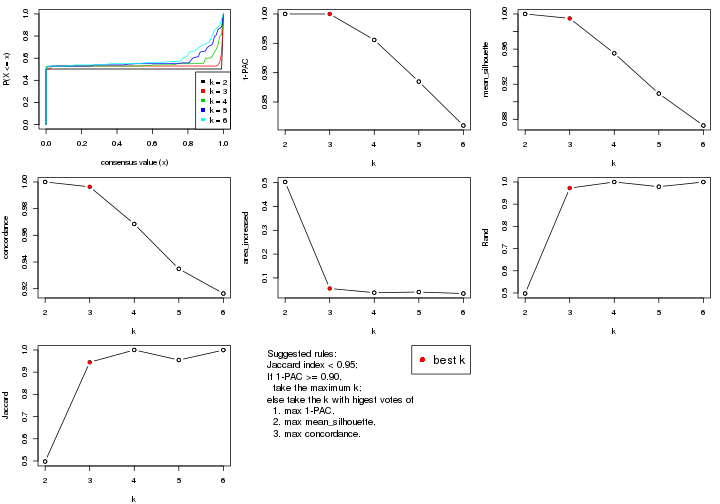

The numeric values for all these statistics can be obtained by `get_stats()`.

```r
get_stats(res)
```

```
#>   k 1-PAC mean_silhouette concordance area_increased  Rand Jaccard
#> 2 2 1.000           1.000       1.000         0.5029 0.498   0.498
#> 3 3 1.000           0.995       0.996         0.0556 0.972   0.945
#> 4 4 0.956           0.955       0.969         0.0381 1.000   1.000
#> 5 5 0.885           0.909       0.935         0.0407 0.979   0.955
#> 6 6 0.810           0.873       0.916         0.0345 1.000   0.999
```

`suggest_best_k()` suggests the best $k$ based on these statistics. The rules are as follows:

- All $k$ with Jaccard index larger than 0.95 are removed because increasing
  $k$ does not provide enough extra information. If all $k$ are removed, it is
  marked as no subgroup is detected.
- For all $k$ with 1-PAC score larger than 0.9, the maximal $k$ is taken as
  the best $k$, and other $k$ are marked as optional $k$.
- If it does not fit the second rule. The $k$ with the maximal vote of the
  highest 1-PAC score, highest mean silhouette, and highest concordance is
  taken as the best $k$.

```r
suggest_best_k(res)
```

```
#> [1] 3
#> attr(,"optional")
#> [1] 2
```

There is also optional best $k$ = 2 that is worth to check.

Following shows the table of the partitions (You need to click the **show/hide
code output** link to see it). The membership matrix (columns with name `p*`)
is inferred by
[`clue::cl_consensus()`](https://www.rdocumentation.org/link/cl_consensus?package=clue)
function with the `SE` method. Basically the value in the membership matrix
represents the probability to belong to a certain group. The finall class
label for an item is determined with the group with highest probability it
belongs to.

In `get_classes()` function, the entropy is calculated from the membership
matrix and the silhouette score is calculated from the consensus matrix.


<script>
$( function() {
	$( '#tabs-MAD-NMF-get-classes' ).tabs();
} );
</script>
<div id='tabs-MAD-NMF-get-classes'>
<ul>
<li><a href='#tab-MAD-NMF-get-classes-1'>k = 2</a></li>
<li><a href='#tab-MAD-NMF-get-classes-2'>k = 3</a></li>
<li><a href='#tab-MAD-NMF-get-classes-3'>k = 4</a></li>
<li><a href='#tab-MAD-NMF-get-classes-4'>k = 5</a></li>
<li><a href='#tab-MAD-NMF-get-classes-5'>k = 6</a></li>
</ul>

<div id='tab-MAD-NMF-get-classes-1'>
<p><a id='tab-MAD-NMF-get-classes-1-a' style='color:#0366d6' href='#'>show/hide code output</a></p>
<pre><code class="r">cbind(get_classes(res, k = 2), get_membership(res, k = 2))
</code></pre>

<pre><code>#&gt;           class entropy silhouette p1 p2
#&gt; SRR315112     2       0          1  0  1
#&gt; SRR315113     1       0          1  1  0
#&gt; SRR315114     1       0          1  1  0
#&gt; SRR315115     2       0          1  0  1
#&gt; SRR315116     2       0          1  0  1
#&gt; SRR566986     2       0          1  0  1
#&gt; SRR566987     2       0          1  0  1
#&gt; SRR566988     2       0          1  0  1
#&gt; SRR566989     2       0          1  0  1
#&gt; SRR566990     2       0          1  0  1
#&gt; SRR566991     2       0          1  0  1
#&gt; SRR566992     2       0          1  0  1
#&gt; SRR566993     2       0          1  0  1
#&gt; SRR566994     2       0          1  0  1
#&gt; SRR566995     2       0          1  0  1
#&gt; SRR566996     2       0          1  0  1
#&gt; SRR566997     2       0          1  0  1
#&gt; SRR566998     2       0          1  0  1
#&gt; SRR566999     2       0          1  0  1
#&gt; SRR567000     2       0          1  0  1
#&gt; SRR567001     2       0          1  0  1
#&gt; SRR567002     2       0          1  0  1
#&gt; SRR567003     2       0          1  0  1
#&gt; SRR567004     2       0          1  0  1
#&gt; SRR567005     2       0          1  0  1
#&gt; SRR567006     2       0          1  0  1
#&gt; SRR567007     2       0          1  0  1
#&gt; SRR567008     2       0          1  0  1
#&gt; SRR567009     2       0          1  0  1
#&gt; SRR567010     2       0          1  0  1
#&gt; SRR567011     2       0          1  0  1
#&gt; SRR567012     2       0          1  0  1
#&gt; SRR567013     2       0          1  0  1
#&gt; SRR567014     2       0          1  0  1
#&gt; SRR567015     2       0          1  0  1
#&gt; SRR567016     2       0          1  0  1
#&gt; SRR567017     2       0          1  0  1
#&gt; SRR567018     2       0          1  0  1
#&gt; SRR567019     2       0          1  0  1
#&gt; SRR567020     2       0          1  0  1
#&gt; SRR567021     2       0          1  0  1
#&gt; SRR567022     2       0          1  0  1
#&gt; SRR567023     2       0          1  0  1
#&gt; SRR567024     2       0          1  0  1
#&gt; SRR567025     2       0          1  0  1
#&gt; SRR567026     2       0          1  0  1
#&gt; SRR567027     2       0          1  0  1
#&gt; SRR567028     2       0          1  0  1
#&gt; SRR567029     2       0          1  0  1
#&gt; SRR567030     2       0          1  0  1
#&gt; SRR567031     2       0          1  0  1
#&gt; SRR567032     2       0          1  0  1
#&gt; SRR567033     2       0          1  0  1
#&gt; SRR567034     2       0          1  0  1
#&gt; SRR567035     2       0          1  0  1
#&gt; SRR567036     2       0          1  0  1
#&gt; SRR567037     2       0          1  0  1
#&gt; SRR567038     2       0          1  0  1
#&gt; SRR567039     2       0          1  0  1
#&gt; SRR567040     2       0          1  0  1
#&gt; SRR567041     2       0          1  0  1
#&gt; SRR567042     2       0          1  0  1
#&gt; SRR567043     2       0          1  0  1
#&gt; SRR567044     2       0          1  0  1
#&gt; SRR567045     2       0          1  0  1
#&gt; SRR567046     2       0          1  0  1
#&gt; SRR567047     2       0          1  0  1
#&gt; SRR567048     2       0          1  0  1
#&gt; SRR567049     2       0          1  0  1
#&gt; SRR567050     2       0          1  0  1
#&gt; SRR567051     2       0          1  0  1
#&gt; SRR567052     2       0          1  0  1
#&gt; SRR567053     2       0          1  0  1
#&gt; SRR567054     2       0          1  0  1
#&gt; SRR567055     2       0          1  0  1
#&gt; SRR567056     2       0          1  0  1
#&gt; SRR567057     2       0          1  0  1
#&gt; SRR567058     2       0          1  0  1
#&gt; SRR567059     2       0          1  0  1
#&gt; SRR567060     2       0          1  0  1
#&gt; SRR567061     2       0          1  0  1
#&gt; SRR567062     2       0          1  0  1
#&gt; SRR567063     2       0          1  0  1
#&gt; SRR567064     2       0          1  0  1
#&gt; SRR567065     2       0          1  0  1
#&gt; SRR567066     2       0          1  0  1
#&gt; SRR567067     2       0          1  0  1
#&gt; SRR567068     2       0          1  0  1
#&gt; SRR567069     2       0          1  0  1
#&gt; SRR567070     2       0          1  0  1
#&gt; SRR567071     2       0          1  0  1
#&gt; SRR567072     2       0          1  0  1
#&gt; SRR567073     2       0          1  0  1
#&gt; SRR567074     2       0          1  0  1
#&gt; SRR567075     2       0          1  0  1
#&gt; SRR567076     1       0          1  1  0
#&gt; SRR567077     1       0          1  1  0
#&gt; SRR567078     1       0          1  1  0
#&gt; SRR567079     1       0          1  1  0
#&gt; SRR567080     1       0          1  1  0
#&gt; SRR567081     1       0          1  1  0
#&gt; SRR567082     1       0          1  1  0
#&gt; SRR567083     1       0          1  1  0
#&gt; SRR567084     1       0          1  1  0
#&gt; SRR567085     1       0          1  1  0
#&gt; SRR567086     1       0          1  1  0
#&gt; SRR567087     1       0          1  1  0
#&gt; SRR567088     1       0          1  1  0
#&gt; SRR567089     1       0          1  1  0
#&gt; SRR567090     1       0          1  1  0
#&gt; SRR567091     1       0          1  1  0
#&gt; SRR567092     1       0          1  1  0
#&gt; SRR567093     1       0          1  1  0
#&gt; SRR567094     1       0          1  1  0
#&gt; SRR567095     1       0          1  1  0
#&gt; SRR567096     1       0          1  1  0
#&gt; SRR567097     1       0          1  1  0
#&gt; SRR567098     1       0          1  1  0
#&gt; SRR567099     1       0          1  1  0
#&gt; SRR567100     1       0          1  1  0
#&gt; SRR567101     1       0          1  1  0
#&gt; SRR567102     1       0          1  1  0
#&gt; SRR567103     1       0          1  1  0
#&gt; SRR567104     1       0          1  1  0
#&gt; SRR567105     1       0          1  1  0
#&gt; SRR567106     1       0          1  1  0
#&gt; SRR567107     1       0          1  1  0
#&gt; SRR567108     1       0          1  1  0
#&gt; SRR567109     1       0          1  1  0
#&gt; SRR567110     1       0          1  1  0
#&gt; SRR567111     1       0          1  1  0
#&gt; SRR567112     1       0          1  1  0
#&gt; SRR567113     1       0          1  1  0
#&gt; SRR567114     1       0          1  1  0
#&gt; SRR567115     1       0          1  1  0
#&gt; SRR567116     1       0          1  1  0
#&gt; SRR567117     1       0          1  1  0
#&gt; SRR567118     1       0          1  1  0
#&gt; SRR567119     1       0          1  1  0
#&gt; SRR567120     1       0          1  1  0
#&gt; SRR567121     1       0          1  1  0
#&gt; SRR567122     1       0          1  1  0
#&gt; SRR567123     1       0          1  1  0
#&gt; SRR567124     1       0          1  1  0
#&gt; SRR567125     1       0          1  1  0
#&gt; SRR567126     1       0          1  1  0
#&gt; SRR567127     1       0          1  1  0
#&gt; SRR567128     1       0          1  1  0
#&gt; SRR567129     1       0          1  1  0
#&gt; SRR567130     1       0          1  1  0
#&gt; SRR567131     1       0          1  1  0
#&gt; SRR567132     1       0          1  1  0
#&gt; SRR567133     1       0          1  1  0
#&gt; SRR567134     1       0          1  1  0
#&gt; SRR567135     1       0          1  1  0
#&gt; SRR567136     1       0          1  1  0
#&gt; SRR567137     1       0          1  1  0
#&gt; SRR567138     1       0          1  1  0
#&gt; SRR567139     1       0          1  1  0
#&gt; SRR567140     1       0          1  1  0
#&gt; SRR567141     1       0          1  1  0
#&gt; SRR567142     1       0          1  1  0
#&gt; SRR567143     1       0          1  1  0
#&gt; SRR567144     1       0          1  1  0
#&gt; SRR567145     1       0          1  1  0
#&gt; SRR567146     1       0          1  1  0
#&gt; SRR567147     1       0          1  1  0
#&gt; SRR567148     1       0          1  1  0
#&gt; SRR567149     1       0          1  1  0
#&gt; SRR567150     1       0          1  1  0
#&gt; SRR567151     1       0          1  1  0
#&gt; SRR567152     1       0          1  1  0
#&gt; SRR567153     1       0          1  1  0
#&gt; SRR567154     1       0          1  1  0
#&gt; SRR567155     1       0          1  1  0
#&gt; SRR567156     1       0          1  1  0
#&gt; SRR567157     1       0          1  1  0
#&gt; SRR567158     1       0          1  1  0
#&gt; SRR567159     1       0          1  1  0
#&gt; SRR567160     1       0          1  1  0
#&gt; SRR567161     1       0          1  1  0
</code></pre>

<script>
$('#tab-MAD-NMF-get-classes-1-a').parent().next().next().hide();
$('#tab-MAD-NMF-get-classes-1-a').click(function(){
  $('#tab-MAD-NMF-get-classes-1-a').parent().next().next().toggle();
  return(false);
});
</script>
</div>

<div id='tab-MAD-NMF-get-classes-2'>
<p><a id='tab-MAD-NMF-get-classes-2-a' style='color:#0366d6' href='#'>show/hide code output</a></p>
<pre><code class="r">cbind(get_classes(res, k = 3), get_membership(res, k = 3))
</code></pre>

<pre><code>#&gt;           class entropy silhouette    p1    p2    p3
#&gt; SRR315112     3  0.1163      0.980 0.000 0.028 0.972
#&gt; SRR315113     3  0.1163      0.970 0.028 0.000 0.972
#&gt; SRR315114     3  0.1163      0.970 0.028 0.000 0.972
#&gt; SRR315115     3  0.1163      0.980 0.000 0.028 0.972
#&gt; SRR315116     3  0.1163      0.980 0.000 0.028 0.972
#&gt; SRR566986     2  0.0000      0.995 0.000 1.000 0.000
#&gt; SRR566987     2  0.0000      0.995 0.000 1.000 0.000
#&gt; SRR566988     2  0.0000      0.995 0.000 1.000 0.000
#&gt; SRR566989     2  0.0000      0.995 0.000 1.000 0.000
#&gt; SRR566990     2  0.0000      0.995 0.000 1.000 0.000
#&gt; SRR566991     2  0.0000      0.995 0.000 1.000 0.000
#&gt; SRR566992     2  0.0000      0.995 0.000 1.000 0.000
#&gt; SRR566993     2  0.0000      0.995 0.000 1.000 0.000
#&gt; SRR566994     2  0.0000      0.995 0.000 1.000 0.000
#&gt; SRR566995     2  0.0000      0.995 0.000 1.000 0.000
#&gt; SRR566996     2  0.0000      0.995 0.000 1.000 0.000
#&gt; SRR566997     2  0.0000      0.995 0.000 1.000 0.000
#&gt; SRR566998     2  0.0000      0.995 0.000 1.000 0.000
#&gt; SRR566999     2  0.0000      0.995 0.000 1.000 0.000
#&gt; SRR567000     2  0.0000      0.995 0.000 1.000 0.000
#&gt; SRR567001     2  0.0000      0.995 0.000 1.000 0.000
#&gt; SRR567002     2  0.0000      0.995 0.000 1.000 0.000
#&gt; SRR567003     2  0.0000      0.995 0.000 1.000 0.000
#&gt; SRR567004     2  0.0000      0.995 0.000 1.000 0.000
#&gt; SRR567005     2  0.0000      0.995 0.000 1.000 0.000
#&gt; SRR567006     2  0.0000      0.995 0.000 1.000 0.000
#&gt; SRR567007     2  0.0000      0.995 0.000 1.000 0.000
#&gt; SRR567008     2  0.0000      0.995 0.000 1.000 0.000
#&gt; SRR567009     2  0.0000      0.995 0.000 1.000 0.000
#&gt; SRR567010     2  0.0000      0.995 0.000 1.000 0.000
#&gt; SRR567011     2  0.0000      0.995 0.000 1.000 0.000
#&gt; SRR567012     2  0.0000      0.995 0.000 1.000 0.000
#&gt; SRR567013     2  0.0000      0.995 0.000 1.000 0.000
#&gt; SRR567014     2  0.0592      0.990 0.000 0.988 0.012
#&gt; SRR567015     2  0.0747      0.988 0.000 0.984 0.016
#&gt; SRR567016     2  0.0592      0.990 0.000 0.988 0.012
#&gt; SRR567017     2  0.1031      0.982 0.000 0.976 0.024
#&gt; SRR567018     2  0.0592      0.990 0.000 0.988 0.012
#&gt; SRR567019     2  0.0592      0.990 0.000 0.988 0.012
#&gt; SRR567020     2  0.0747      0.988 0.000 0.984 0.016
#&gt; SRR567021     2  0.0592      0.990 0.000 0.988 0.012
#&gt; SRR567022     2  0.0000      0.995 0.000 1.000 0.000
#&gt; SRR567023     2  0.1031      0.982 0.000 0.976 0.024
#&gt; SRR567024     2  0.0747      0.988 0.000 0.984 0.016
#&gt; SRR567025     2  0.0747      0.988 0.000 0.984 0.016
#&gt; SRR567026     2  0.0892      0.985 0.000 0.980 0.020
#&gt; SRR567027     2  0.1031      0.982 0.000 0.976 0.024
#&gt; SRR567028     2  0.0592      0.990 0.000 0.988 0.012
#&gt; SRR567029     2  0.1031      0.982 0.000 0.976 0.024
#&gt; SRR567030     2  0.1031      0.982 0.000 0.976 0.024
#&gt; SRR567031     2  0.1031      0.982 0.000 0.976 0.024
#&gt; SRR567032     2  0.1031      0.982 0.000 0.976 0.024
#&gt; SRR567033     2  0.0592      0.990 0.000 0.988 0.012
#&gt; SRR567034     2  0.0592      0.990 0.000 0.988 0.012
#&gt; SRR567035     2  0.0424      0.992 0.000 0.992 0.008
#&gt; SRR567036     2  0.0747      0.988 0.000 0.984 0.016
#&gt; SRR567037     2  0.0592      0.990 0.000 0.988 0.012
#&gt; SRR567038     2  0.0592      0.990 0.000 0.988 0.012
#&gt; SRR567039     2  0.0892      0.985 0.000 0.980 0.020
#&gt; SRR567040     2  0.0592      0.990 0.000 0.988 0.012
#&gt; SRR567041     2  0.0592      0.990 0.000 0.988 0.012
#&gt; SRR567042     2  0.0000      0.995 0.000 1.000 0.000
#&gt; SRR567043     2  0.0424      0.992 0.000 0.992 0.008
#&gt; SRR567044     2  0.0000      0.995 0.000 1.000 0.000
#&gt; SRR567045     2  0.0000      0.995 0.000 1.000 0.000
#&gt; SRR567046     2  0.0000      0.995 0.000 1.000 0.000
#&gt; SRR567047     2  0.0000      0.995 0.000 1.000 0.000
#&gt; SRR567048     2  0.0000      0.995 0.000 1.000 0.000
#&gt; SRR567049     2  0.0000      0.995 0.000 1.000 0.000
#&gt; SRR567050     2  0.0000      0.995 0.000 1.000 0.000
#&gt; SRR567051     2  0.0000      0.995 0.000 1.000 0.000
#&gt; SRR567052     2  0.0000      0.995 0.000 1.000 0.000
#&gt; SRR567053     2  0.0000      0.995 0.000 1.000 0.000
#&gt; SRR567054     2  0.0000      0.995 0.000 1.000 0.000
#&gt; SRR567055     2  0.0000      0.995 0.000 1.000 0.000
#&gt; SRR567056     2  0.0000      0.995 0.000 1.000 0.000
#&gt; SRR567057     2  0.0000      0.995 0.000 1.000 0.000
#&gt; SRR567058     2  0.0000      0.995 0.000 1.000 0.000
#&gt; SRR567059     2  0.0000      0.995 0.000 1.000 0.000
#&gt; SRR567060     2  0.0000      0.995 0.000 1.000 0.000
#&gt; SRR567061     2  0.0000      0.995 0.000 1.000 0.000
#&gt; SRR567062     2  0.0000      0.995 0.000 1.000 0.000
#&gt; SRR567063     2  0.0000      0.995 0.000 1.000 0.000
#&gt; SRR567064     2  0.0000      0.995 0.000 1.000 0.000
#&gt; SRR567065     2  0.0000      0.995 0.000 1.000 0.000
#&gt; SRR567066     2  0.0000      0.995 0.000 1.000 0.000
#&gt; SRR567067     2  0.0000      0.995 0.000 1.000 0.000
#&gt; SRR567068     2  0.0000      0.995 0.000 1.000 0.000
#&gt; SRR567069     2  0.0000      0.995 0.000 1.000 0.000
#&gt; SRR567070     2  0.0000      0.995 0.000 1.000 0.000
#&gt; SRR567071     2  0.0000      0.995 0.000 1.000 0.000
#&gt; SRR567072     2  0.0000      0.995 0.000 1.000 0.000
#&gt; SRR567073     2  0.0000      0.995 0.000 1.000 0.000
#&gt; SRR567074     2  0.0000      0.995 0.000 1.000 0.000
#&gt; SRR567075     2  0.0000      0.995 0.000 1.000 0.000
#&gt; SRR567076     1  0.0000      0.999 1.000 0.000 0.000
#&gt; SRR567077     1  0.0000      0.999 1.000 0.000 0.000
#&gt; SRR567078     1  0.0000      0.999 1.000 0.000 0.000
#&gt; SRR567079     1  0.0000      0.999 1.000 0.000 0.000
#&gt; SRR567080     1  0.0000      0.999 1.000 0.000 0.000
#&gt; SRR567081     1  0.0000      0.999 1.000 0.000 0.000
#&gt; SRR567082     1  0.0000      0.999 1.000 0.000 0.000
#&gt; SRR567083     1  0.0000      0.999 1.000 0.000 0.000
#&gt; SRR567084     1  0.0000      0.999 1.000 0.000 0.000
#&gt; SRR567085     1  0.0000      0.999 1.000 0.000 0.000
#&gt; SRR567086     1  0.0000      0.999 1.000 0.000 0.000
#&gt; SRR567087     1  0.0000      0.999 1.000 0.000 0.000
#&gt; SRR567088     1  0.0000      0.999 1.000 0.000 0.000
#&gt; SRR567089     1  0.0000      0.999 1.000 0.000 0.000
#&gt; SRR567090     1  0.0000      0.999 1.000 0.000 0.000
#&gt; SRR567091     1  0.0000      0.999 1.000 0.000 0.000
#&gt; SRR567092     1  0.0000      0.999 1.000 0.000 0.000
#&gt; SRR567093     1  0.0000      0.999 1.000 0.000 0.000
#&gt; SRR567094     1  0.0000      0.999 1.000 0.000 0.000
#&gt; SRR567095     1  0.0000      0.999 1.000 0.000 0.000
#&gt; SRR567096     1  0.0000      0.999 1.000 0.000 0.000
#&gt; SRR567097     1  0.0000      0.999 1.000 0.000 0.000
#&gt; SRR567098     1  0.0000      0.999 1.000 0.000 0.000
#&gt; SRR567099     1  0.0000      0.999 1.000 0.000 0.000
#&gt; SRR567100     1  0.0000      0.999 1.000 0.000 0.000
#&gt; SRR567101     1  0.0000      0.999 1.000 0.000 0.000
#&gt; SRR567102     1  0.0000      0.999 1.000 0.000 0.000
#&gt; SRR567103     1  0.0000      0.999 1.000 0.000 0.000
#&gt; SRR567104     1  0.0000      0.999 1.000 0.000 0.000
#&gt; SRR567105     1  0.0000      0.999 1.000 0.000 0.000
#&gt; SRR567106     1  0.0000      0.999 1.000 0.000 0.000
#&gt; SRR567107     1  0.0000      0.999 1.000 0.000 0.000
#&gt; SRR567108     1  0.0000      0.999 1.000 0.000 0.000
#&gt; SRR567109     1  0.0000      0.999 1.000 0.000 0.000
#&gt; SRR567110     1  0.0000      0.999 1.000 0.000 0.000
#&gt; SRR567111     1  0.0000      0.999 1.000 0.000 0.000
#&gt; SRR567112     1  0.0000      0.999 1.000 0.000 0.000
#&gt; SRR567113     1  0.0000      0.999 1.000 0.000 0.000
#&gt; SRR567114     1  0.0000      0.999 1.000 0.000 0.000
#&gt; SRR567115     1  0.0000      0.999 1.000 0.000 0.000
#&gt; SRR567116     1  0.0000      0.999 1.000 0.000 0.000
#&gt; SRR567117     1  0.0000      0.999 1.000 0.000 0.000
#&gt; SRR567118     1  0.0000      0.999 1.000 0.000 0.000
#&gt; SRR567119     1  0.0000      0.999 1.000 0.000 0.000
#&gt; SRR567120     1  0.0000      0.999 1.000 0.000 0.000
#&gt; SRR567121     1  0.0000      0.999 1.000 0.000 0.000
#&gt; SRR567122     1  0.0000      0.999 1.000 0.000 0.000
#&gt; SRR567123     1  0.0000      0.999 1.000 0.000 0.000
#&gt; SRR567124     1  0.0000      0.999 1.000 0.000 0.000
#&gt; SRR567125     1  0.0000      0.999 1.000 0.000 0.000
#&gt; SRR567126     1  0.0000      0.999 1.000 0.000 0.000
#&gt; SRR567127     1  0.0000      0.999 1.000 0.000 0.000
#&gt; SRR567128     1  0.0000      0.999 1.000 0.000 0.000
#&gt; SRR567129     1  0.0000      0.999 1.000 0.000 0.000
#&gt; SRR567130     1  0.0000      0.999 1.000 0.000 0.000
#&gt; SRR567131     1  0.0000      0.999 1.000 0.000 0.000
#&gt; SRR567132     1  0.0000      0.999 1.000 0.000 0.000
#&gt; SRR567133     1  0.0000      0.999 1.000 0.000 0.000
#&gt; SRR567134     1  0.0000      0.999 1.000 0.000 0.000
#&gt; SRR567135     1  0.0000      0.999 1.000 0.000 0.000
#&gt; SRR567136     1  0.0000      0.999 1.000 0.000 0.000
#&gt; SRR567137     1  0.0000      0.999 1.000 0.000 0.000
#&gt; SRR567138     1  0.0000      0.999 1.000 0.000 0.000
#&gt; SRR567139     1  0.0000      0.999 1.000 0.000 0.000
#&gt; SRR567140     1  0.0000      0.999 1.000 0.000 0.000
#&gt; SRR567141     1  0.0000      0.999 1.000 0.000 0.000
#&gt; SRR567142     1  0.0000      0.999 1.000 0.000 0.000
#&gt; SRR567143     1  0.0000      0.999 1.000 0.000 0.000
#&gt; SRR567144     1  0.0000      0.999 1.000 0.000 0.000
#&gt; SRR567145     1  0.0000      0.999 1.000 0.000 0.000
#&gt; SRR567146     1  0.1525      0.963 0.964 0.004 0.032
#&gt; SRR567147     1  0.0000      0.999 1.000 0.000 0.000
#&gt; SRR567148     1  0.0000      0.999 1.000 0.000 0.000
#&gt; SRR567149     1  0.0000      0.999 1.000 0.000 0.000
#&gt; SRR567150     1  0.0000      0.999 1.000 0.000 0.000
#&gt; SRR567151     1  0.0000      0.999 1.000 0.000 0.000
#&gt; SRR567152     1  0.0000      0.999 1.000 0.000 0.000
#&gt; SRR567153     1  0.0000      0.999 1.000 0.000 0.000
#&gt; SRR567154     1  0.0000      0.999 1.000 0.000 0.000
#&gt; SRR567155     1  0.0000      0.999 1.000 0.000 0.000
#&gt; SRR567156     1  0.0000      0.999 1.000 0.000 0.000
#&gt; SRR567157     1  0.0000      0.999 1.000 0.000 0.000
#&gt; SRR567158     1  0.0000      0.999 1.000 0.000 0.000
#&gt; SRR567159     1  0.0000      0.999 1.000 0.000 0.000
#&gt; SRR567160     1  0.0000      0.999 1.000 0.000 0.000
#&gt; SRR567161     1  0.1525      0.963 0.964 0.004 0.032
</code></pre>

<script>
$('#tab-MAD-NMF-get-classes-2-a').parent().next().next().hide();
$('#tab-MAD-NMF-get-classes-2-a').click(function(){
  $('#tab-MAD-NMF-get-classes-2-a').parent().next().next().toggle();
  return(false);
});
</script>
</div>

<div id='tab-MAD-NMF-get-classes-3'>
<p><a id='tab-MAD-NMF-get-classes-3-a' style='color:#0366d6' href='#'>show/hide code output</a></p>
<pre><code class="r">cbind(get_classes(res, k = 4), get_membership(res, k = 4))
</code></pre>

<pre><code>#&gt;           class entropy silhouette    p1    p2    p3 p4
#&gt; SRR315112     3  0.0469      0.987 0.000 0.000 0.988 NA
#&gt; SRR315113     3  0.2011      0.984 0.000 0.000 0.920 NA
#&gt; SRR315114     3  0.2011      0.984 0.000 0.000 0.920 NA
#&gt; SRR315115     3  0.0817      0.986 0.000 0.000 0.976 NA
#&gt; SRR315116     3  0.0000      0.988 0.000 0.000 1.000 NA
#&gt; SRR566986     2  0.0000      0.984 0.000 1.000 0.000 NA
#&gt; SRR566987     2  0.0188      0.983 0.000 0.996 0.004 NA
#&gt; SRR566988     2  0.0000      0.984 0.000 1.000 0.000 NA
#&gt; SRR566989     2  0.0000      0.984 0.000 1.000 0.000 NA
#&gt; SRR566990     2  0.0000      0.984 0.000 1.000 0.000 NA
#&gt; SRR566991     2  0.0000      0.984 0.000 1.000 0.000 NA
#&gt; SRR566992     2  0.0000      0.984 0.000 1.000 0.000 NA
#&gt; SRR566993     2  0.0000      0.984 0.000 1.000 0.000 NA
#&gt; SRR566994     2  0.0188      0.983 0.000 0.996 0.004 NA
#&gt; SRR566995     2  0.0000      0.984 0.000 1.000 0.000 NA
#&gt; SRR566996     2  0.0000      0.984 0.000 1.000 0.000 NA
#&gt; SRR566997     2  0.0000      0.984 0.000 1.000 0.000 NA
#&gt; SRR566998     2  0.0000      0.984 0.000 1.000 0.000 NA
#&gt; SRR566999     2  0.0188      0.983 0.000 0.996 0.004 NA
#&gt; SRR567000     2  0.0188      0.984 0.000 0.996 0.000 NA
#&gt; SRR567001     2  0.0000      0.984 0.000 1.000 0.000 NA
#&gt; SRR567002     2  0.0000      0.984 0.000 1.000 0.000 NA
#&gt; SRR567003     2  0.0188      0.983 0.000 0.996 0.004 NA
#&gt; SRR567004     2  0.0000      0.984 0.000 1.000 0.000 NA
#&gt; SRR567005     2  0.0000      0.984 0.000 1.000 0.000 NA
#&gt; SRR567006     2  0.0188      0.984 0.000 0.996 0.000 NA
#&gt; SRR567007     2  0.0188      0.984 0.000 0.996 0.000 NA
#&gt; SRR567008     2  0.0000      0.984 0.000 1.000 0.000 NA
#&gt; SRR567009     2  0.0188      0.983 0.000 0.996 0.004 NA
#&gt; SRR567010     2  0.0188      0.983 0.000 0.996 0.004 NA
#&gt; SRR567011     2  0.0000      0.984 0.000 1.000 0.000 NA
#&gt; SRR567012     2  0.0188      0.983 0.000 0.996 0.004 NA
#&gt; SRR567013     2  0.0000      0.984 0.000 1.000 0.000 NA
#&gt; SRR567014     2  0.0188      0.984 0.000 0.996 0.000 NA
#&gt; SRR567015     2  0.0188      0.984 0.000 0.996 0.000 NA
#&gt; SRR567016     2  0.0188      0.984 0.000 0.996 0.000 NA
#&gt; SRR567017     2  0.0000      0.984 0.000 1.000 0.000 NA
#&gt; SRR567018     2  0.0188      0.984 0.000 0.996 0.000 NA
#&gt; SRR567019     2  0.0188      0.984 0.000 0.996 0.000 NA
#&gt; SRR567020     2  0.0188      0.984 0.000 0.996 0.000 NA
#&gt; SRR567021     2  0.0188      0.984 0.000 0.996 0.000 NA
#&gt; SRR567022     2  0.4164      0.666 0.000 0.736 0.000 NA
#&gt; SRR567023     2  0.0000      0.984 0.000 1.000 0.000 NA
#&gt; SRR567024     2  0.0000      0.984 0.000 1.000 0.000 NA
#&gt; SRR567025     2  0.0188      0.984 0.000 0.996 0.000 NA
#&gt; SRR567026     2  0.0188      0.984 0.000 0.996 0.000 NA
#&gt; SRR567027     2  0.0188      0.984 0.000 0.996 0.000 NA
#&gt; SRR567028     2  0.0188      0.984 0.000 0.996 0.000 NA
#&gt; SRR567029     2  0.0188      0.984 0.000 0.996 0.000 NA
#&gt; SRR567030     2  0.0000      0.984 0.000 1.000 0.000 NA
#&gt; SRR567031     2  0.0188      0.984 0.000 0.996 0.000 NA
#&gt; SRR567032     2  0.0000      0.984 0.000 1.000 0.000 NA
#&gt; SRR567033     2  0.0188      0.984 0.000 0.996 0.000 NA
#&gt; SRR567034     2  0.0188      0.984 0.000 0.996 0.000 NA
#&gt; SRR567035     2  0.0000      0.984 0.000 1.000 0.000 NA
#&gt; SRR567036     2  0.0000      0.984 0.000 1.000 0.000 NA
#&gt; SRR567037     2  0.0000      0.984 0.000 1.000 0.000 NA
#&gt; SRR567038     2  0.0000      0.984 0.000 1.000 0.000 NA
#&gt; SRR567039     2  0.0188      0.984 0.000 0.996 0.000 NA
#&gt; SRR567040     2  0.0188      0.984 0.000 0.996 0.000 NA
#&gt; SRR567041     2  0.0188      0.984 0.000 0.996 0.000 NA
#&gt; SRR567042     2  0.4164      0.666 0.000 0.736 0.000 NA
#&gt; SRR567043     2  0.0000      0.984 0.000 1.000 0.000 NA
#&gt; SRR567044     2  0.0921      0.977 0.000 0.972 0.000 NA
#&gt; SRR567045     2  0.0921      0.977 0.000 0.972 0.000 NA
#&gt; SRR567046     2  0.0817      0.979 0.000 0.976 0.000 NA
#&gt; SRR567047     2  0.0817      0.979 0.000 0.976 0.000 NA
#&gt; SRR567048     2  0.0817      0.979 0.000 0.976 0.000 NA
#&gt; SRR567049     2  0.0817      0.979 0.000 0.976 0.000 NA
#&gt; SRR567050     2  0.0921      0.977 0.000 0.972 0.000 NA
#&gt; SRR567051     2  0.0921      0.977 0.000 0.972 0.000 NA
#&gt; SRR567052     2  0.0921      0.977 0.000 0.972 0.000 NA
#&gt; SRR567053     2  0.0592      0.981 0.000 0.984 0.000 NA
#&gt; SRR567054     2  0.0817      0.979 0.000 0.976 0.000 NA
#&gt; SRR567055     2  0.0921      0.977 0.000 0.972 0.000 NA
#&gt; SRR567056     2  0.0817      0.979 0.000 0.976 0.000 NA
#&gt; SRR567057     2  0.0921      0.977 0.000 0.972 0.000 NA
#&gt; SRR567058     2  0.0921      0.977 0.000 0.972 0.000 NA
#&gt; SRR567059     2  0.0707      0.980 0.000 0.980 0.000 NA
#&gt; SRR567060     2  0.0921      0.977 0.000 0.972 0.000 NA
#&gt; SRR567061     2  0.0707      0.980 0.000 0.980 0.000 NA
#&gt; SRR567062     2  0.0921      0.977 0.000 0.972 0.000 NA
#&gt; SRR567063     2  0.0921      0.977 0.000 0.972 0.000 NA
#&gt; SRR567064     2  0.0592      0.981 0.000 0.984 0.000 NA
#&gt; SRR567065     2  0.0921      0.977 0.000 0.972 0.000 NA
#&gt; SRR567066     2  0.0817      0.979 0.000 0.976 0.000 NA
#&gt; SRR567067     2  0.0921      0.977 0.000 0.972 0.000 NA
#&gt; SRR567068     2  0.0921      0.977 0.000 0.972 0.000 NA
#&gt; SRR567069     2  0.0817      0.979 0.000 0.976 0.000 NA
#&gt; SRR567070     2  0.0921      0.977 0.000 0.972 0.000 NA
#&gt; SRR567071     2  0.0817      0.979 0.000 0.976 0.000 NA
#&gt; SRR567072     2  0.0817      0.979 0.000 0.976 0.000 NA
#&gt; SRR567073     2  0.0817      0.979 0.000 0.976 0.000 NA
#&gt; SRR567074     2  0.0817      0.979 0.000 0.976 0.000 NA
#&gt; SRR567075     2  0.0817      0.979 0.000 0.976 0.000 NA
#&gt; SRR567076     1  0.0188      0.954 0.996 0.000 0.000 NA
#&gt; SRR567077     1  0.0336      0.954 0.992 0.000 0.000 NA
#&gt; SRR567078     1  0.0188      0.954 0.996 0.000 0.000 NA
#&gt; SRR567079     1  0.0188      0.954 0.996 0.000 0.000 NA
#&gt; SRR567080     1  0.0188      0.954 0.996 0.000 0.000 NA
#&gt; SRR567081     1  0.0188      0.954 0.996 0.000 0.000 NA
#&gt; SRR567082     1  0.0336      0.954 0.992 0.000 0.000 NA
#&gt; SRR567083     1  0.0000      0.955 1.000 0.000 0.000 NA
#&gt; SRR567084     1  0.0188      0.954 0.996 0.000 0.000 NA
#&gt; SRR567085     1  0.0188      0.954 0.996 0.000 0.000 NA
#&gt; SRR567086     1  0.0188      0.954 0.996 0.000 0.000 NA
#&gt; SRR567087     1  0.0336      0.954 0.992 0.000 0.000 NA
#&gt; SRR567088     1  0.0336      0.955 0.992 0.000 0.000 NA
#&gt; SRR567089     1  0.0188      0.954 0.996 0.000 0.000 NA
#&gt; SRR567090     1  0.0000      0.955 1.000 0.000 0.000 NA
#&gt; SRR567091     1  0.0188      0.954 0.996 0.000 0.000 NA
#&gt; SRR567092     1  0.0336      0.954 0.992 0.000 0.000 NA
#&gt; SRR567093     1  0.0188      0.954 0.996 0.000 0.000 NA
#&gt; SRR567094     1  0.0188      0.954 0.996 0.000 0.000 NA
#&gt; SRR567095     1  0.0188      0.954 0.996 0.000 0.000 NA
#&gt; SRR567096     1  0.0188      0.954 0.996 0.000 0.000 NA
#&gt; SRR567097     1  0.0188      0.954 0.996 0.000 0.000 NA
#&gt; SRR567098     1  0.0188      0.954 0.996 0.000 0.000 NA
#&gt; SRR567099     1  0.0188      0.954 0.996 0.000 0.000 NA
#&gt; SRR567100     1  0.0188      0.954 0.996 0.000 0.000 NA
#&gt; SRR567101     1  0.0188      0.954 0.996 0.000 0.000 NA
#&gt; SRR567102     1  0.1022      0.951 0.968 0.000 0.000 NA
#&gt; SRR567103     1  0.1022      0.951 0.968 0.000 0.000 NA
#&gt; SRR567104     1  0.0188      0.954 0.996 0.000 0.000 NA
#&gt; SRR567105     1  0.0188      0.954 0.996 0.000 0.000 NA
#&gt; SRR567106     1  0.1637      0.942 0.940 0.000 0.000 NA
#&gt; SRR567107     1  0.1716      0.940 0.936 0.000 0.000 NA
#&gt; SRR567108     1  0.1637      0.942 0.940 0.000 0.000 NA
#&gt; SRR567109     1  0.1637      0.942 0.940 0.000 0.000 NA
#&gt; SRR567110     1  0.1637      0.942 0.940 0.000 0.000 NA
#&gt; SRR567111     1  0.1716      0.940 0.936 0.000 0.000 NA
#&gt; SRR567112     1  0.1637      0.942 0.940 0.000 0.000 NA
#&gt; SRR567113     1  0.1637      0.942 0.940 0.000 0.000 NA
#&gt; SRR567114     1  0.1716      0.940 0.936 0.000 0.000 NA
#&gt; SRR567115     1  0.1716      0.940 0.936 0.000 0.000 NA
#&gt; SRR567116     1  0.1716      0.940 0.936 0.000 0.000 NA
#&gt; SRR567117     1  0.1716      0.940 0.936 0.000 0.000 NA
#&gt; SRR567118     1  0.1637      0.942 0.940 0.000 0.000 NA
#&gt; SRR567119     1  0.1637      0.942 0.940 0.000 0.000 NA
#&gt; SRR567120     1  0.1637      0.942 0.940 0.000 0.000 NA
#&gt; SRR567121     1  0.1716      0.940 0.936 0.000 0.000 NA
#&gt; SRR567122     1  0.1637      0.942 0.940 0.000 0.000 NA
#&gt; SRR567123     1  0.1637      0.942 0.940 0.000 0.000 NA
#&gt; SRR567124     1  0.1716      0.940 0.936 0.000 0.000 NA
#&gt; SRR567125     1  0.1716      0.940 0.936 0.000 0.000 NA
#&gt; SRR567126     1  0.1716      0.940 0.936 0.000 0.000 NA
#&gt; SRR567127     1  0.1716      0.940 0.936 0.000 0.000 NA
#&gt; SRR567128     1  0.1716      0.940 0.936 0.000 0.000 NA
#&gt; SRR567129     1  0.1716      0.940 0.936 0.000 0.000 NA
#&gt; SRR567130     1  0.1637      0.942 0.940 0.000 0.000 NA
#&gt; SRR567131     1  0.1637      0.942 0.940 0.000 0.000 NA
#&gt; SRR567132     1  0.1716      0.940 0.936 0.000 0.000 NA
#&gt; SRR567133     1  0.1637      0.942 0.940 0.000 0.000 NA
#&gt; SRR567134     1  0.1302      0.945 0.956 0.000 0.000 NA
#&gt; SRR567135     1  0.1302      0.945 0.956 0.000 0.000 NA
#&gt; SRR567136     1  0.2408      0.906 0.896 0.000 0.000 NA
#&gt; SRR567137     1  0.1302      0.945 0.956 0.000 0.000 NA
#&gt; SRR567138     1  0.1302      0.945 0.956 0.000 0.000 NA
#&gt; SRR567139     1  0.1302      0.945 0.956 0.000 0.000 NA
#&gt; SRR567140     1  0.1302      0.945 0.956 0.000 0.000 NA
#&gt; SRR567141     1  0.1302      0.945 0.956 0.000 0.000 NA
#&gt; SRR567142     1  0.1302      0.945 0.956 0.000 0.000 NA
#&gt; SRR567143     1  0.1302      0.945 0.956 0.000 0.000 NA
#&gt; SRR567144     1  0.1302      0.945 0.956 0.000 0.000 NA
#&gt; SRR567145     1  0.1302      0.945 0.956 0.000 0.000 NA
#&gt; SRR567146     1  0.5112      0.377 0.560 0.000 0.004 NA
#&gt; SRR567147     1  0.1302      0.945 0.956 0.000 0.000 NA
#&gt; SRR567148     1  0.1302      0.945 0.956 0.000 0.000 NA
#&gt; SRR567149     1  0.1302      0.945 0.956 0.000 0.000 NA
#&gt; SRR567150     1  0.1302      0.945 0.956 0.000 0.000 NA
#&gt; SRR567151     1  0.1302      0.945 0.956 0.000 0.000 NA
#&gt; SRR567152     1  0.1302      0.945 0.956 0.000 0.000 NA
#&gt; SRR567153     1  0.1302      0.945 0.956 0.000 0.000 NA
#&gt; SRR567154     1  0.1302      0.945 0.956 0.000 0.000 NA
#&gt; SRR567155     1  0.1302      0.945 0.956 0.000 0.000 NA
#&gt; SRR567156     1  0.1302      0.945 0.956 0.000 0.000 NA
#&gt; SRR567157     1  0.1302      0.945 0.956 0.000 0.000 NA
#&gt; SRR567158     1  0.1302      0.945 0.956 0.000 0.000 NA
#&gt; SRR567159     1  0.2408      0.906 0.896 0.000 0.000 NA
#&gt; SRR567160     1  0.1302      0.945 0.956 0.000 0.000 NA
#&gt; SRR567161     1  0.5105      0.387 0.564 0.000 0.004 NA
</code></pre>

<script>
$('#tab-MAD-NMF-get-classes-3-a').parent().next().next().hide();
$('#tab-MAD-NMF-get-classes-3-a').click(function(){
  $('#tab-MAD-NMF-get-classes-3-a').parent().next().next().toggle();
  return(false);
});
</script>
</div>

<div id='tab-MAD-NMF-get-classes-4'>
<p><a id='tab-MAD-NMF-get-classes-4-a' style='color:#0366d6' href='#'>show/hide code output</a></p>
<pre><code class="r">cbind(get_classes(res, k = 5), get_membership(res, k = 5))
</code></pre>

<pre><code>#&gt;           class entropy silhouette    p1    p2    p3    p4 p5
#&gt; SRR315112     3  0.1251     0.9341 0.000 0.000 0.956 0.036 NA
#&gt; SRR315113     3  0.3154     0.9173 0.004 0.000 0.836 0.012 NA
#&gt; SRR315114     3  0.3154     0.9173 0.004 0.000 0.836 0.012 NA
#&gt; SRR315115     3  0.1836     0.9256 0.000 0.008 0.936 0.040 NA
#&gt; SRR315116     3  0.0566     0.9364 0.000 0.000 0.984 0.012 NA
#&gt; SRR566986     2  0.0000     0.9611 0.000 1.000 0.000 0.000 NA
#&gt; SRR566987     2  0.0000     0.9611 0.000 1.000 0.000 0.000 NA
#&gt; SRR566988     2  0.0000     0.9611 0.000 1.000 0.000 0.000 NA
#&gt; SRR566989     2  0.0162     0.9609 0.000 0.996 0.000 0.000 NA
#&gt; SRR566990     2  0.0324     0.9611 0.000 0.992 0.000 0.004 NA
#&gt; SRR566991     2  0.0000     0.9611 0.000 1.000 0.000 0.000 NA
#&gt; SRR566992     2  0.0000     0.9611 0.000 1.000 0.000 0.000 NA
#&gt; SRR566993     2  0.0162     0.9607 0.000 0.996 0.000 0.004 NA
#&gt; SRR566994     2  0.0000     0.9611 0.000 1.000 0.000 0.000 NA
#&gt; SRR566995     2  0.0000     0.9611 0.000 1.000 0.000 0.000 NA
#&gt; SRR566996     2  0.0000     0.9611 0.000 1.000 0.000 0.000 NA
#&gt; SRR566997     2  0.0000     0.9611 0.000 1.000 0.000 0.000 NA
#&gt; SRR566998     2  0.0000     0.9611 0.000 1.000 0.000 0.000 NA
#&gt; SRR566999     2  0.0324     0.9611 0.000 0.992 0.000 0.004 NA
#&gt; SRR567000     2  0.0000     0.9611 0.000 1.000 0.000 0.000 NA
#&gt; SRR567001     2  0.0000     0.9611 0.000 1.000 0.000 0.000 NA
#&gt; SRR567002     2  0.0000     0.9611 0.000 1.000 0.000 0.000 NA
#&gt; SRR567003     2  0.0000     0.9611 0.000 1.000 0.000 0.000 NA
#&gt; SRR567004     2  0.0162     0.9609 0.000 0.996 0.000 0.000 NA
#&gt; SRR567005     2  0.0162     0.9607 0.000 0.996 0.000 0.004 NA
#&gt; SRR567006     2  0.0000     0.9611 0.000 1.000 0.000 0.000 NA
#&gt; SRR567007     2  0.0000     0.9611 0.000 1.000 0.000 0.000 NA
#&gt; SRR567008     2  0.0000     0.9611 0.000 1.000 0.000 0.000 NA
#&gt; SRR567009     2  0.0000     0.9611 0.000 1.000 0.000 0.000 NA
#&gt; SRR567010     2  0.0162     0.9609 0.000 0.996 0.000 0.000 NA
#&gt; SRR567011     2  0.0162     0.9607 0.000 0.996 0.000 0.004 NA
#&gt; SRR567012     2  0.0162     0.9607 0.000 0.996 0.000 0.004 NA
#&gt; SRR567013     2  0.0324     0.9611 0.000 0.992 0.000 0.004 NA
#&gt; SRR567014     2  0.1686     0.9398 0.000 0.944 0.008 0.028 NA
#&gt; SRR567015     2  0.1525     0.9419 0.000 0.948 0.004 0.036 NA
#&gt; SRR567016     2  0.1770     0.9335 0.000 0.936 0.008 0.048 NA
#&gt; SRR567017     2  0.1618     0.9393 0.000 0.944 0.008 0.040 NA
#&gt; SRR567018     2  0.1569     0.9405 0.000 0.944 0.004 0.044 NA
#&gt; SRR567019     2  0.1356     0.9467 0.000 0.956 0.004 0.028 NA
#&gt; SRR567020     2  0.1770     0.9338 0.000 0.936 0.008 0.048 NA
#&gt; SRR567021     2  0.1770     0.9340 0.000 0.936 0.008 0.048 NA
#&gt; SRR567022     4  0.4542     0.2469 0.000 0.456 0.008 0.536 NA
#&gt; SRR567023     2  0.1442     0.9444 0.000 0.952 0.004 0.032 NA
#&gt; SRR567024     2  0.1770     0.9337 0.000 0.936 0.008 0.048 NA
#&gt; SRR567025     2  0.1780     0.9375 0.000 0.940 0.008 0.028 NA
#&gt; SRR567026     2  0.1772     0.9368 0.000 0.940 0.008 0.032 NA
#&gt; SRR567027     2  0.1731     0.9366 0.000 0.940 0.008 0.040 NA
#&gt; SRR567028     2  0.1756     0.9367 0.000 0.940 0.008 0.036 NA
#&gt; SRR567029     2  0.1651     0.9388 0.000 0.944 0.008 0.036 NA
#&gt; SRR567030     2  0.1569     0.9436 0.000 0.948 0.012 0.032 NA
#&gt; SRR567031     2  0.1869     0.9336 0.000 0.936 0.012 0.036 NA
#&gt; SRR567032     2  0.1618     0.9402 0.000 0.944 0.008 0.040 NA
#&gt; SRR567033     2  0.1770     0.9340 0.000 0.936 0.008 0.048 NA
#&gt; SRR567034     2  0.1934     0.9300 0.000 0.932 0.008 0.040 NA
#&gt; SRR567035     2  0.1205     0.9471 0.000 0.956 0.000 0.040 NA
#&gt; SRR567036     2  0.1770     0.9337 0.000 0.936 0.008 0.048 NA
#&gt; SRR567037     2  0.1569     0.9413 0.000 0.948 0.008 0.032 NA
#&gt; SRR567038     2  0.1569     0.9413 0.000 0.948 0.008 0.032 NA
#&gt; SRR567039     2  0.1492     0.9421 0.000 0.948 0.004 0.040 NA
#&gt; SRR567040     2  0.1483     0.9433 0.000 0.952 0.008 0.028 NA
#&gt; SRR567041     2  0.1569     0.9413 0.000 0.948 0.008 0.032 NA
#&gt; SRR567042     4  0.4546     0.2365 0.000 0.460 0.008 0.532 NA
#&gt; SRR567043     2  0.1041     0.9501 0.000 0.964 0.000 0.032 NA
#&gt; SRR567044     2  0.1211     0.9524 0.000 0.960 0.000 0.024 NA
#&gt; SRR567045     2  0.1211     0.9524 0.000 0.960 0.000 0.024 NA
#&gt; SRR567046     2  0.1012     0.9555 0.000 0.968 0.000 0.020 NA
#&gt; SRR567047     2  0.1117     0.9541 0.000 0.964 0.000 0.020 NA
#&gt; SRR567048     2  0.1211     0.9523 0.000 0.960 0.000 0.024 NA
#&gt; SRR567049     2  0.1012     0.9555 0.000 0.968 0.000 0.020 NA
#&gt; SRR567050     2  0.1211     0.9524 0.000 0.960 0.000 0.024 NA
#&gt; SRR567051     2  0.1117     0.9541 0.000 0.964 0.000 0.020 NA
#&gt; SRR567052     2  0.1300     0.9498 0.000 0.956 0.000 0.028 NA
#&gt; SRR567053     2  0.1117     0.9541 0.000 0.964 0.000 0.020 NA
#&gt; SRR567054     2  0.1211     0.9523 0.000 0.960 0.000 0.024 NA
#&gt; SRR567055     2  0.1117     0.9541 0.000 0.964 0.000 0.020 NA
#&gt; SRR567056     2  0.1012     0.9555 0.000 0.968 0.000 0.020 NA
#&gt; SRR567057     2  0.1300     0.9498 0.000 0.956 0.000 0.028 NA
#&gt; SRR567058     2  0.1211     0.9523 0.000 0.960 0.000 0.024 NA
#&gt; SRR567059     2  0.1018     0.9559 0.000 0.968 0.000 0.016 NA
#&gt; SRR567060     2  0.1106     0.9544 0.000 0.964 0.000 0.024 NA
#&gt; SRR567061     2  0.1012     0.9555 0.000 0.968 0.000 0.020 NA
#&gt; SRR567062     2  0.1117     0.9541 0.000 0.964 0.000 0.020 NA
#&gt; SRR567063     2  0.1211     0.9523 0.000 0.960 0.000 0.024 NA
#&gt; SRR567064     2  0.1012     0.9560 0.000 0.968 0.000 0.020 NA
#&gt; SRR567065     2  0.1211     0.9524 0.000 0.960 0.000 0.024 NA
#&gt; SRR567066     2  0.1117     0.9541 0.000 0.964 0.000 0.020 NA
#&gt; SRR567067     2  0.1117     0.9541 0.000 0.964 0.000 0.020 NA
#&gt; SRR567068     2  0.1300     0.9498 0.000 0.956 0.000 0.028 NA
#&gt; SRR567069     2  0.1012     0.9555 0.000 0.968 0.000 0.020 NA
#&gt; SRR567070     2  0.1117     0.9541 0.000 0.964 0.000 0.020 NA
#&gt; SRR567071     2  0.1106     0.9544 0.000 0.964 0.000 0.024 NA
#&gt; SRR567072     2  0.1018     0.9559 0.000 0.968 0.000 0.016 NA
#&gt; SRR567073     2  0.1012     0.9555 0.000 0.968 0.000 0.020 NA
#&gt; SRR567074     2  0.1117     0.9541 0.000 0.964 0.000 0.020 NA
#&gt; SRR567075     2  0.1117     0.9541 0.000 0.964 0.000 0.020 NA
#&gt; SRR567076     1  0.0000     0.9244 1.000 0.000 0.000 0.000 NA
#&gt; SRR567077     1  0.0162     0.9245 0.996 0.000 0.000 0.000 NA
#&gt; SRR567078     1  0.0000     0.9244 1.000 0.000 0.000 0.000 NA
#&gt; SRR567079     1  0.0162     0.9243 0.996 0.000 0.000 0.000 NA
#&gt; SRR567080     1  0.0000     0.9244 1.000 0.000 0.000 0.000 NA
#&gt; SRR567081     1  0.0000     0.9244 1.000 0.000 0.000 0.000 NA
#&gt; SRR567082     1  0.0162     0.9245 0.996 0.000 0.000 0.004 NA
#&gt; SRR567083     1  0.0000     0.9244 1.000 0.000 0.000 0.000 NA
#&gt; SRR567084     1  0.0000     0.9244 1.000 0.000 0.000 0.000 NA
#&gt; SRR567085     1  0.0162     0.9243 0.996 0.000 0.000 0.000 NA
#&gt; SRR567086     1  0.0290     0.9240 0.992 0.000 0.000 0.000 NA
#&gt; SRR567087     1  0.0000     0.9244 1.000 0.000 0.000 0.000 NA
#&gt; SRR567088     1  0.0000     0.9244 1.000 0.000 0.000 0.000 NA
#&gt; SRR567089     1  0.0000     0.9244 1.000 0.000 0.000 0.000 NA
#&gt; SRR567090     1  0.0000     0.9244 1.000 0.000 0.000 0.000 NA
#&gt; SRR567091     1  0.0162     0.9243 0.996 0.000 0.000 0.000 NA
#&gt; SRR567092     1  0.0000     0.9244 1.000 0.000 0.000 0.000 NA
#&gt; SRR567093     1  0.0000     0.9244 1.000 0.000 0.000 0.000 NA
#&gt; SRR567094     1  0.0000     0.9244 1.000 0.000 0.000 0.000 NA
#&gt; SRR567095     1  0.0000     0.9244 1.000 0.000 0.000 0.000 NA
#&gt; SRR567096     1  0.0000     0.9244 1.000 0.000 0.000 0.000 NA
#&gt; SRR567097     1  0.0000     0.9244 1.000 0.000 0.000 0.000 NA
#&gt; SRR567098     1  0.0162     0.9243 0.996 0.000 0.000 0.000 NA
#&gt; SRR567099     1  0.0000     0.9244 1.000 0.000 0.000 0.000 NA
#&gt; SRR567100     1  0.0162     0.9243 0.996 0.000 0.000 0.000 NA
#&gt; SRR567101     1  0.0290     0.9240 0.992 0.000 0.000 0.000 NA
#&gt; SRR567102     1  0.3146     0.8354 0.844 0.000 0.000 0.028 NA
#&gt; SRR567103     1  0.3146     0.8370 0.844 0.000 0.000 0.028 NA
#&gt; SRR567104     1  0.0000     0.9244 1.000 0.000 0.000 0.000 NA
#&gt; SRR567105     1  0.0000     0.9244 1.000 0.000 0.000 0.000 NA
#&gt; SRR567106     1  0.2471     0.8852 0.864 0.000 0.000 0.000 NA
#&gt; SRR567107     1  0.2471     0.8852 0.864 0.000 0.000 0.000 NA
#&gt; SRR567108     1  0.2471     0.8852 0.864 0.000 0.000 0.000 NA
#&gt; SRR567109     1  0.2424     0.8872 0.868 0.000 0.000 0.000 NA
#&gt; SRR567110     1  0.2471     0.8852 0.864 0.000 0.000 0.000 NA
#&gt; SRR567111     1  0.2471     0.8852 0.864 0.000 0.000 0.000 NA
#&gt; SRR567112     1  0.2471     0.8852 0.864 0.000 0.000 0.000 NA
#&gt; SRR567113     1  0.2424     0.8872 0.868 0.000 0.000 0.000 NA
#&gt; SRR567114     1  0.2471     0.8852 0.864 0.000 0.000 0.000 NA
#&gt; SRR567115     1  0.2471     0.8852 0.864 0.000 0.000 0.000 NA
#&gt; SRR567116     1  0.2424     0.8871 0.868 0.000 0.000 0.000 NA
#&gt; SRR567117     1  0.2471     0.8852 0.864 0.000 0.000 0.000 NA
#&gt; SRR567118     1  0.2471     0.8852 0.864 0.000 0.000 0.000 NA
#&gt; SRR567119     1  0.2471     0.8852 0.864 0.000 0.000 0.000 NA
#&gt; SRR567120     1  0.2471     0.8852 0.864 0.000 0.000 0.000 NA
#&gt; SRR567121     1  0.2424     0.8871 0.868 0.000 0.000 0.000 NA
#&gt; SRR567122     1  0.2471     0.8852 0.864 0.000 0.000 0.000 NA
#&gt; SRR567123     1  0.2471     0.8852 0.864 0.000 0.000 0.000 NA
#&gt; SRR567124     1  0.2471     0.8852 0.864 0.000 0.000 0.000 NA
#&gt; SRR567125     1  0.2424     0.8871 0.868 0.000 0.000 0.000 NA
#&gt; SRR567126     1  0.2471     0.8852 0.864 0.000 0.000 0.000 NA
#&gt; SRR567127     1  0.2471     0.8852 0.864 0.000 0.000 0.000 NA
#&gt; SRR567128     1  0.2471     0.8852 0.864 0.000 0.000 0.000 NA
#&gt; SRR567129     1  0.2471     0.8852 0.864 0.000 0.000 0.000 NA
#&gt; SRR567130     1  0.2471     0.8852 0.864 0.000 0.000 0.000 NA
#&gt; SRR567131     1  0.2471     0.8852 0.864 0.000 0.000 0.000 NA
#&gt; SRR567132     1  0.2424     0.8871 0.868 0.000 0.000 0.000 NA
#&gt; SRR567133     1  0.2471     0.8852 0.864 0.000 0.000 0.000 NA
#&gt; SRR567134     1  0.1484     0.9119 0.944 0.000 0.000 0.008 NA
#&gt; SRR567135     1  0.1484     0.9119 0.944 0.000 0.000 0.008 NA
#&gt; SRR567136     1  0.3691     0.7872 0.804 0.000 0.000 0.040 NA
#&gt; SRR567137     1  0.1408     0.9135 0.948 0.000 0.000 0.008 NA
#&gt; SRR567138     1  0.1484     0.9119 0.944 0.000 0.000 0.008 NA
#&gt; SRR567139     1  0.1484     0.9119 0.944 0.000 0.000 0.008 NA
#&gt; SRR567140     1  0.1357     0.9125 0.948 0.000 0.000 0.004 NA
#&gt; SRR567141     1  0.1357     0.9125 0.948 0.000 0.000 0.004 NA
#&gt; SRR567142     1  0.1282     0.9137 0.952 0.000 0.000 0.004 NA
#&gt; SRR567143     1  0.1443     0.9128 0.948 0.000 0.004 0.004 NA
#&gt; SRR567144     1  0.1408     0.9135 0.948 0.000 0.000 0.008 NA
#&gt; SRR567145     1  0.1569     0.9122 0.944 0.000 0.004 0.008 NA
#&gt; SRR567146     4  0.6765    -0.0327 0.272 0.000 0.000 0.384 NA
#&gt; SRR567147     1  0.1408     0.9135 0.948 0.000 0.000 0.008 NA
#&gt; SRR567148     1  0.1557     0.9102 0.940 0.000 0.000 0.008 NA
#&gt; SRR567149     1  0.1282     0.9137 0.952 0.000 0.000 0.004 NA
#&gt; SRR567150     1  0.1557     0.9102 0.940 0.000 0.000 0.008 NA
#&gt; SRR567151     1  0.1443     0.9128 0.948 0.000 0.004 0.004 NA
#&gt; SRR567152     1  0.1484     0.9119 0.944 0.000 0.000 0.008 NA
#&gt; SRR567153     1  0.1484     0.9119 0.944 0.000 0.000 0.008 NA
#&gt; SRR567154     1  0.1408     0.9135 0.948 0.000 0.000 0.008 NA
#&gt; SRR567155     1  0.1408     0.9135 0.948 0.000 0.000 0.008 NA
#&gt; SRR567156     1  0.1597     0.9103 0.940 0.000 0.000 0.012 NA
#&gt; SRR567157     1  0.1484     0.9119 0.944 0.000 0.000 0.008 NA
#&gt; SRR567158     1  0.1484     0.9119 0.944 0.000 0.000 0.008 NA
#&gt; SRR567159     1  0.3764     0.7816 0.800 0.000 0.000 0.044 NA
#&gt; SRR567160     1  0.1408     0.9135 0.948 0.000 0.000 0.008 NA
#&gt; SRR567161     4  0.6765    -0.0327 0.272 0.000 0.000 0.384 NA
</code></pre>

<script>
$('#tab-MAD-NMF-get-classes-4-a').parent().next().next().hide();
$('#tab-MAD-NMF-get-classes-4-a').click(function(){
  $('#tab-MAD-NMF-get-classes-4-a').parent().next().next().toggle();
  return(false);
});
</script>
</div>

<div id='tab-MAD-NMF-get-classes-5'>
<p><a id='tab-MAD-NMF-get-classes-5-a' style='color:#0366d6' href='#'>show/hide code output</a></p>
<pre><code class="r">cbind(get_classes(res, k = 6), get_membership(res, k = 6))
</code></pre>

<pre><code>#&gt;           class entropy silhouette    p1    p2    p3    p4 p5    p6
#&gt; SRR315112     3  0.1007      0.870 0.000 0.004 0.968 0.008 NA 0.016
#&gt; SRR315113     3  0.4473      0.812 0.000 0.000 0.740 0.016 NA 0.132
#&gt; SRR315114     3  0.4732      0.800 0.004 0.000 0.724 0.016 NA 0.136
#&gt; SRR315115     3  0.1210      0.866 0.000 0.004 0.960 0.008 NA 0.020
#&gt; SRR315116     3  0.0291      0.872 0.000 0.004 0.992 0.004 NA 0.000
#&gt; SRR566986     2  0.0146      0.927 0.000 0.996 0.000 0.000 NA 0.004
#&gt; SRR566987     2  0.0146      0.928 0.000 0.996 0.000 0.000 NA 0.004
#&gt; SRR566988     2  0.0146      0.927 0.000 0.996 0.000 0.000 NA 0.004
#&gt; SRR566989     2  0.0260      0.928 0.000 0.992 0.000 0.000 NA 0.008
#&gt; SRR566990     2  0.0363      0.927 0.000 0.988 0.000 0.000 NA 0.012
#&gt; SRR566991     2  0.0260      0.927 0.000 0.992 0.000 0.000 NA 0.008
#&gt; SRR566992     2  0.0260      0.928 0.000 0.992 0.000 0.000 NA 0.008
#&gt; SRR566993     2  0.0260      0.928 0.000 0.992 0.000 0.000 NA 0.008
#&gt; SRR566994     2  0.0260      0.928 0.000 0.992 0.000 0.000 NA 0.008
#&gt; SRR566995     2  0.0458      0.929 0.000 0.984 0.000 0.000 NA 0.016
#&gt; SRR566996     2  0.0260      0.928 0.000 0.992 0.000 0.000 NA 0.008
#&gt; SRR566997     2  0.0363      0.928 0.000 0.988 0.000 0.000 NA 0.012
#&gt; SRR566998     2  0.0363      0.927 0.000 0.988 0.000 0.000 NA 0.012
#&gt; SRR566999     2  0.0260      0.928 0.000 0.992 0.000 0.000 NA 0.008
#&gt; SRR567000     2  0.0458      0.928 0.000 0.984 0.000 0.000 NA 0.016
#&gt; SRR567001     2  0.0363      0.927 0.000 0.988 0.000 0.000 NA 0.012
#&gt; SRR567002     2  0.0000      0.927 0.000 1.000 0.000 0.000 NA 0.000
#&gt; SRR567003     2  0.0260      0.927 0.000 0.992 0.000 0.000 NA 0.008
#&gt; SRR567004     2  0.0260      0.928 0.000 0.992 0.000 0.000 NA 0.008
#&gt; SRR567005     2  0.0363      0.927 0.000 0.988 0.000 0.000 NA 0.012
#&gt; SRR567006     2  0.0363      0.928 0.000 0.988 0.000 0.000 NA 0.012
#&gt; SRR567007     2  0.0146      0.927 0.000 0.996 0.000 0.000 NA 0.004
#&gt; SRR567008     2  0.0363      0.927 0.000 0.988 0.000 0.000 NA 0.012
#&gt; SRR567009     2  0.0260      0.928 0.000 0.992 0.000 0.000 NA 0.008
#&gt; SRR567010     2  0.0146      0.928 0.000 0.996 0.000 0.000 NA 0.004
#&gt; SRR567011     2  0.0260      0.928 0.000 0.992 0.000 0.000 NA 0.008
#&gt; SRR567012     2  0.0458      0.926 0.000 0.984 0.000 0.000 NA 0.016
#&gt; SRR567013     2  0.0260      0.928 0.000 0.992 0.000 0.000 NA 0.008
#&gt; SRR567014     2  0.2094      0.893 0.000 0.920 0.004 0.016 NA 0.032
#&gt; SRR567015     2  0.2476      0.879 0.000 0.900 0.012 0.008 NA 0.044
#&gt; SRR567016     2  0.2245      0.884 0.000 0.908 0.008 0.004 NA 0.052
#&gt; SRR567017     2  0.1974      0.894 0.000 0.920 0.012 0.000 NA 0.048
#&gt; SRR567018     2  0.1672      0.903 0.000 0.932 0.004 0.000 NA 0.048
#&gt; SRR567019     2  0.1780      0.902 0.000 0.932 0.004 0.004 NA 0.036
#&gt; SRR567020     2  0.2245      0.884 0.000 0.908 0.008 0.004 NA 0.052
#&gt; SRR567021     2  0.1923      0.893 0.000 0.916 0.004 0.000 NA 0.064
#&gt; SRR567022     6  0.5627      1.000 0.000 0.340 0.016 0.076 NA 0.556
#&gt; SRR567023     2  0.1950      0.896 0.000 0.924 0.008 0.004 NA 0.044
#&gt; SRR567024     2  0.2367      0.879 0.000 0.900 0.012 0.004 NA 0.064
#&gt; SRR567025     2  0.2583      0.877 0.000 0.896 0.008 0.020 NA 0.032
#&gt; SRR567026     2  0.2795      0.867 0.000 0.884 0.008 0.020 NA 0.044
#&gt; SRR567027     2  0.2101      0.895 0.000 0.920 0.008 0.016 NA 0.040
#&gt; SRR567028     2  0.2635      0.873 0.000 0.892 0.008 0.016 NA 0.048
#&gt; SRR567029     2  0.2118      0.894 0.000 0.920 0.008 0.016 NA 0.036
#&gt; SRR567030     2  0.2919      0.857 0.000 0.880 0.020 0.016 NA 0.040
#&gt; SRR567031     2  0.3285      0.832 0.000 0.860 0.024 0.020 NA 0.044
#&gt; SRR567032     2  0.2839      0.861 0.000 0.884 0.024 0.012 NA 0.044
#&gt; SRR567033     2  0.2114      0.882 0.000 0.904 0.008 0.000 NA 0.076
#&gt; SRR567034     2  0.2827      0.864 0.000 0.884 0.012 0.020 NA 0.044
#&gt; SRR567035     2  0.1707      0.900 0.000 0.928 0.004 0.000 NA 0.056
#&gt; SRR567036     2  0.2082      0.892 0.000 0.916 0.004 0.008 NA 0.052
#&gt; SRR567037     2  0.1873      0.896 0.000 0.924 0.008 0.000 NA 0.048
#&gt; SRR567038     2  0.2036      0.890 0.000 0.916 0.008 0.000 NA 0.048
#&gt; SRR567039     2  0.2247      0.887 0.000 0.912 0.012 0.008 NA 0.044
#&gt; SRR567040     2  0.2594      0.873 0.000 0.892 0.004 0.016 NA 0.048
#&gt; SRR567041     2  0.2629      0.874 0.000 0.892 0.004 0.024 NA 0.040
#&gt; SRR567042     6  0.5627      1.000 0.000 0.340 0.016 0.076 NA 0.556
#&gt; SRR567043     2  0.1606      0.903 0.000 0.932 0.004 0.000 NA 0.056
#&gt; SRR567044     2  0.1267      0.910 0.000 0.940 0.000 0.000 NA 0.060
#&gt; SRR567045     2  0.1267      0.911 0.000 0.940 0.000 0.000 NA 0.060
#&gt; SRR567046     2  0.0937      0.919 0.000 0.960 0.000 0.000 NA 0.040
#&gt; SRR567047     2  0.0865      0.921 0.000 0.964 0.000 0.000 NA 0.036
#&gt; SRR567048     2  0.1204      0.913 0.000 0.944 0.000 0.000 NA 0.056
#&gt; SRR567049     2  0.0937      0.919 0.000 0.960 0.000 0.000 NA 0.040
#&gt; SRR567050     2  0.1327      0.907 0.000 0.936 0.000 0.000 NA 0.064
#&gt; SRR567051     2  0.1141      0.915 0.000 0.948 0.000 0.000 NA 0.052
#&gt; SRR567052     2  0.1327      0.908 0.000 0.936 0.000 0.000 NA 0.064
#&gt; SRR567053     2  0.1219      0.919 0.000 0.948 0.000 0.004 NA 0.048
#&gt; SRR567054     2  0.1075      0.917 0.000 0.952 0.000 0.000 NA 0.048
#&gt; SRR567055     2  0.1267      0.910 0.000 0.940 0.000 0.000 NA 0.060
#&gt; SRR567056     2  0.1267      0.911 0.000 0.940 0.000 0.000 NA 0.060
#&gt; SRR567057     2  0.1387      0.904 0.000 0.932 0.000 0.000 NA 0.068
#&gt; SRR567058     2  0.1267      0.911 0.000 0.940 0.000 0.000 NA 0.060
#&gt; SRR567059     2  0.1219      0.918 0.000 0.948 0.000 0.004 NA 0.048
#&gt; SRR567060     2  0.1327      0.908 0.000 0.936 0.000 0.000 NA 0.064
#&gt; SRR567061     2  0.1349      0.912 0.000 0.940 0.000 0.004 NA 0.056
#&gt; SRR567062     2  0.1204      0.913 0.000 0.944 0.000 0.000 NA 0.056
#&gt; SRR567063     2  0.1267      0.911 0.000 0.940 0.000 0.000 NA 0.060
#&gt; SRR567064     2  0.1219      0.918 0.000 0.948 0.000 0.004 NA 0.048
#&gt; SRR567065     2  0.1327      0.908 0.000 0.936 0.000 0.000 NA 0.064
#&gt; SRR567066     2  0.1267      0.910 0.000 0.940 0.000 0.000 NA 0.060
#&gt; SRR567067     2  0.1075      0.917 0.000 0.952 0.000 0.000 NA 0.048
#&gt; SRR567068     2  0.1141      0.916 0.000 0.948 0.000 0.000 NA 0.052
#&gt; SRR567069     2  0.1141      0.915 0.000 0.948 0.000 0.000 NA 0.052
#&gt; SRR567070     2  0.1075      0.917 0.000 0.952 0.000 0.000 NA 0.048
#&gt; SRR567071     2  0.1267      0.911 0.000 0.940 0.000 0.000 NA 0.060
#&gt; SRR567072     2  0.1204      0.913 0.000 0.944 0.000 0.000 NA 0.056
#&gt; SRR567073     2  0.1411      0.908 0.000 0.936 0.000 0.004 NA 0.060
#&gt; SRR567074     2  0.1007      0.918 0.000 0.956 0.000 0.000 NA 0.044
#&gt; SRR567075     2  0.1007      0.918 0.000 0.956 0.000 0.000 NA 0.044
#&gt; SRR567076     1  0.0405      0.881 0.988 0.000 0.000 0.008 NA 0.000
#&gt; SRR567077     1  0.0622      0.882 0.980 0.000 0.000 0.008 NA 0.000
#&gt; SRR567078     1  0.0260      0.881 0.992 0.000 0.000 0.008 NA 0.000
#&gt; SRR567079     1  0.0291      0.882 0.992 0.000 0.000 0.004 NA 0.000
#&gt; SRR567080     1  0.0520      0.882 0.984 0.000 0.000 0.008 NA 0.000
#&gt; SRR567081     1  0.0405      0.881 0.988 0.000 0.000 0.008 NA 0.000
#&gt; SRR567082     1  0.0520      0.882 0.984 0.000 0.000 0.008 NA 0.000
#&gt; SRR567083     1  0.0520      0.882 0.984 0.000 0.000 0.008 NA 0.000
#&gt; SRR567084     1  0.0622      0.881 0.980 0.000 0.000 0.008 NA 0.000
#&gt; SRR567085     1  0.0291      0.882 0.992 0.000 0.000 0.004 NA 0.000
#&gt; SRR567086     1  0.0405      0.882 0.988 0.000 0.000 0.004 NA 0.000
#&gt; SRR567087     1  0.0520      0.882 0.984 0.000 0.000 0.008 NA 0.000
#&gt; SRR567088     1  0.0363      0.882 0.988 0.000 0.000 0.012 NA 0.000
#&gt; SRR567089     1  0.0405      0.881 0.988 0.000 0.000 0.008 NA 0.000
#&gt; SRR567090     1  0.0520      0.882 0.984 0.000 0.000 0.008 NA 0.000
#&gt; SRR567091     1  0.0622      0.882 0.980 0.000 0.000 0.008 NA 0.000
#&gt; SRR567092     1  0.0972      0.880 0.964 0.000 0.000 0.008 NA 0.000
#&gt; SRR567093     1  0.0520      0.881 0.984 0.000 0.000 0.008 NA 0.000
#&gt; SRR567094     1  0.0405      0.881 0.988 0.000 0.000 0.008 NA 0.000
#&gt; SRR567095     1  0.0520      0.882 0.984 0.000 0.000 0.008 NA 0.000
#&gt; SRR567096     1  0.0622      0.881 0.980 0.000 0.000 0.012 NA 0.000
#&gt; SRR567097     1  0.0508      0.882 0.984 0.000 0.000 0.012 NA 0.000
#&gt; SRR567098     1  0.0520      0.882 0.984 0.000 0.000 0.008 NA 0.000
#&gt; SRR567099     1  0.0405      0.881 0.988 0.000 0.000 0.008 NA 0.000
#&gt; SRR567100     1  0.0291      0.882 0.992 0.000 0.000 0.004 NA 0.000
#&gt; SRR567101     1  0.0622      0.882 0.980 0.000 0.000 0.008 NA 0.000
#&gt; SRR567102     1  0.4727      0.541 0.680 0.000 0.000 0.040 NA 0.032
#&gt; SRR567103     1  0.4704      0.550 0.684 0.000 0.000 0.040 NA 0.032
#&gt; SRR567104     1  0.0260      0.881 0.992 0.000 0.000 0.008 NA 0.000
#&gt; SRR567105     1  0.0405      0.881 0.988 0.000 0.000 0.008 NA 0.000
#&gt; SRR567106     1  0.2697      0.819 0.812 0.000 0.000 0.000 NA 0.000
#&gt; SRR567107     1  0.2697      0.820 0.812 0.000 0.000 0.000 NA 0.000
#&gt; SRR567108     1  0.2730      0.818 0.808 0.000 0.000 0.000 NA 0.000
#&gt; SRR567109     1  0.2664      0.821 0.816 0.000 0.000 0.000 NA 0.000
#&gt; SRR567110     1  0.2762      0.815 0.804 0.000 0.000 0.000 NA 0.000
#&gt; SRR567111     1  0.2871      0.816 0.804 0.000 0.000 0.004 NA 0.000
#&gt; SRR567112     1  0.2730      0.818 0.808 0.000 0.000 0.000 NA 0.000
#&gt; SRR567113     1  0.2664      0.821 0.816 0.000 0.000 0.000 NA 0.000
#&gt; SRR567114     1  0.2697      0.820 0.812 0.000 0.000 0.000 NA 0.000
#&gt; SRR567115     1  0.2697      0.820 0.812 0.000 0.000 0.000 NA 0.000
#&gt; SRR567116     1  0.2730      0.818 0.808 0.000 0.000 0.000 NA 0.000
#&gt; SRR567117     1  0.2730      0.818 0.808 0.000 0.000 0.000 NA 0.000
#&gt; SRR567118     1  0.2730      0.818 0.808 0.000 0.000 0.000 NA 0.000
#&gt; SRR567119     1  0.2838      0.817 0.808 0.000 0.000 0.004 NA 0.000
#&gt; SRR567120     1  0.2762      0.815 0.804 0.000 0.000 0.000 NA 0.000
#&gt; SRR567121     1  0.2871      0.816 0.804 0.000 0.000 0.004 NA 0.000
#&gt; SRR567122     1  0.2730      0.818 0.808 0.000 0.000 0.000 NA 0.000
#&gt; SRR567123     1  0.2793      0.812 0.800 0.000 0.000 0.000 NA 0.000
#&gt; SRR567124     1  0.2762      0.815 0.804 0.000 0.000 0.000 NA 0.000
#&gt; SRR567125     1  0.2697      0.820 0.812 0.000 0.000 0.000 NA 0.000
#&gt; SRR567126     1  0.2697      0.820 0.812 0.000 0.000 0.000 NA 0.000
#&gt; SRR567127     1  0.2730      0.818 0.808 0.000 0.000 0.000 NA 0.000
#&gt; SRR567128     1  0.2793      0.812 0.800 0.000 0.000 0.000 NA 0.000
#&gt; SRR567129     1  0.2730      0.818 0.808 0.000 0.000 0.000 NA 0.000
#&gt; SRR567130     1  0.2762      0.815 0.804 0.000 0.000 0.000 NA 0.000
#&gt; SRR567131     1  0.2793      0.812 0.800 0.000 0.000 0.000 NA 0.000
#&gt; SRR567132     1  0.2730      0.818 0.808 0.000 0.000 0.000 NA 0.000
#&gt; SRR567133     1  0.2697      0.819 0.812 0.000 0.000 0.000 NA 0.000
#&gt; SRR567134     1  0.1462      0.866 0.936 0.000 0.000 0.008 NA 0.000
#&gt; SRR567135     1  0.1625      0.862 0.928 0.000 0.000 0.012 NA 0.000
#&gt; SRR567136     1  0.5892      0.165 0.540 0.000 0.000 0.076 NA 0.056
#&gt; SRR567137     1  0.1434      0.869 0.940 0.000 0.000 0.012 NA 0.000
#&gt; SRR567138     1  0.1333      0.871 0.944 0.000 0.000 0.008 NA 0.000
#&gt; SRR567139     1  0.1124      0.875 0.956 0.000 0.000 0.008 NA 0.000
#&gt; SRR567140     1  0.1391      0.870 0.944 0.000 0.000 0.016 NA 0.000
#&gt; SRR567141     1  0.1391      0.870 0.944 0.000 0.000 0.016 NA 0.000
#&gt; SRR567142     1  0.1168      0.875 0.956 0.000 0.000 0.016 NA 0.000
#&gt; SRR567143     1  0.1225      0.873 0.952 0.000 0.000 0.012 NA 0.000
#&gt; SRR567144     1  0.1578      0.872 0.936 0.000 0.000 0.012 NA 0.004
#&gt; SRR567145     1  0.1500      0.867 0.936 0.000 0.000 0.012 NA 0.000
#&gt; SRR567146     4  0.2971      0.986 0.144 0.000 0.004 0.832 NA 0.000
#&gt; SRR567147     1  0.1265      0.875 0.948 0.000 0.000 0.008 NA 0.000
#&gt; SRR567148     1  0.1334      0.876 0.948 0.000 0.000 0.020 NA 0.000
#&gt; SRR567149     1  0.1168      0.875 0.956 0.000 0.000 0.016 NA 0.000
#&gt; SRR567150     1  0.1320      0.871 0.948 0.000 0.000 0.016 NA 0.000
#&gt; SRR567151     1  0.1225      0.873 0.952 0.000 0.000 0.012 NA 0.000
#&gt; SRR567152     1  0.1367      0.871 0.944 0.000 0.000 0.012 NA 0.000
#&gt; SRR567153     1  0.1265      0.875 0.948 0.000 0.000 0.008 NA 0.000
#&gt; SRR567154     1  0.1364      0.873 0.944 0.000 0.000 0.004 NA 0.004
#&gt; SRR567155     1  0.1511      0.871 0.940 0.000 0.000 0.012 NA 0.004
#&gt; SRR567156     1  0.1477      0.873 0.940 0.000 0.000 0.008 NA 0.004
#&gt; SRR567157     1  0.1434      0.869 0.940 0.000 0.000 0.012 NA 0.000
#&gt; SRR567158     1  0.1124      0.878 0.956 0.000 0.000 0.008 NA 0.000
#&gt; SRR567159     1  0.5903      0.149 0.536 0.000 0.000 0.076 NA 0.056
#&gt; SRR567160     1  0.1594      0.866 0.932 0.000 0.000 0.016 NA 0.000
#&gt; SRR567161     4  0.3073      0.986 0.140 0.000 0.004 0.832 NA 0.004
</code></pre>

<script>
$('#tab-MAD-NMF-get-classes-5-a').parent().next().next().hide();
$('#tab-MAD-NMF-get-classes-5-a').click(function(){
  $('#tab-MAD-NMF-get-classes-5-a').parent().next().next().toggle();
  return(false);
});
</script>
</div>
</div>

Heatmaps for the consensus matrix. It visualizes the probability of two
samples to be in a same group.


<script>
$( function() {
	$( '#tabs-MAD-NMF-consensus-heatmap' ).tabs();
} );
</script>
<div id='tabs-MAD-NMF-consensus-heatmap'>
<ul>
<li><a href='#tab-MAD-NMF-consensus-heatmap-1'>k = 2</a></li>
<li><a href='#tab-MAD-NMF-consensus-heatmap-2'>k = 3</a></li>
<li><a href='#tab-MAD-NMF-consensus-heatmap-3'>k = 4</a></li>
<li><a href='#tab-MAD-NMF-consensus-heatmap-4'>k = 5</a></li>
<li><a href='#tab-MAD-NMF-consensus-heatmap-5'>k = 6</a></li>
</ul>
<div id='tab-MAD-NMF-consensus-heatmap-1'>
<pre><code class="r">consensus_heatmap(res, k = 2)
</code></pre>

<p></p>

</div>
<div id='tab-MAD-NMF-consensus-heatmap-2'>
<pre><code class="r">consensus_heatmap(res, k = 3)
</code></pre>

<p></p>

</div>
<div id='tab-MAD-NMF-consensus-heatmap-3'>
<pre><code class="r">consensus_heatmap(res, k = 4)
</code></pre>

<p></p>

</div>
<div id='tab-MAD-NMF-consensus-heatmap-4'>
<pre><code class="r">consensus_heatmap(res, k = 5)
</code></pre>

<p></p>

</div>
<div id='tab-MAD-NMF-consensus-heatmap-5'>
<pre><code class="r">consensus_heatmap(res, k = 6)
</code></pre>

<p></p>

</div>
</div>

Heatmaps for the membership of samples in all partitions to see how consistent they are:


<script>
$( function() {
	$( '#tabs-MAD-NMF-membership-heatmap' ).tabs();
} );
</script>
<div id='tabs-MAD-NMF-membership-heatmap'>
<ul>
<li><a href='#tab-MAD-NMF-membership-heatmap-1'>k = 2</a></li>
<li><a href='#tab-MAD-NMF-membership-heatmap-2'>k = 3</a></li>
<li><a href='#tab-MAD-NMF-membership-heatmap-3'>k = 4</a></li>
<li><a href='#tab-MAD-NMF-membership-heatmap-4'>k = 5</a></li>
<li><a href='#tab-MAD-NMF-membership-heatmap-5'>k = 6</a></li>
</ul>
<div id='tab-MAD-NMF-membership-heatmap-1'>
<pre><code class="r">membership_heatmap(res, k = 2)
</code></pre>

<p></p>

</div>
<div id='tab-MAD-NMF-membership-heatmap-2'>
<pre><code class="r">membership_heatmap(res, k = 3)
</code></pre>

<p></p>

</div>
<div id='tab-MAD-NMF-membership-heatmap-3'>
<pre><code class="r">membership_heatmap(res, k = 4)
</code></pre>

<p></p>

</div>
<div id='tab-MAD-NMF-membership-heatmap-4'>
<pre><code class="r">membership_heatmap(res, k = 5)
</code></pre>

<p></p>

</div>
<div id='tab-MAD-NMF-membership-heatmap-5'>
<pre><code class="r">membership_heatmap(res, k = 6)
</code></pre>

<p></p>

</div>
</div>

As soon as we have had the classes for columns, we can look for signatures
which are significantly different between classes which can be candidate marks
for certain classes. Following are the heatmaps for signatures.


Signature heatmaps where rows are scaled:


<script>
$( function() {
	$( '#tabs-MAD-NMF-get-signatures' ).tabs();
} );
</script>
<div id='tabs-MAD-NMF-get-signatures'>
<ul>
<li><a href='#tab-MAD-NMF-get-signatures-1'>k = 2</a></li>
<li><a href='#tab-MAD-NMF-get-signatures-2'>k = 3</a></li>
<li><a href='#tab-MAD-NMF-get-signatures-3'>k = 4</a></li>
<li><a href='#tab-MAD-NMF-get-signatures-4'>k = 5</a></li>
<li><a href='#tab-MAD-NMF-get-signatures-5'>k = 6</a></li>
</ul>
<div id='tab-MAD-NMF-get-signatures-1'>
<pre><code class="r">get_signatures(res, k = 2)
</code></pre>

<p></p>

</div>
<div id='tab-MAD-NMF-get-signatures-2'>
<pre><code class="r">get_signatures(res, k = 3)
</code></pre>

<p></p>

</div>
<div id='tab-MAD-NMF-get-signatures-3'>
<pre><code class="r">get_signatures(res, k = 4)
</code></pre>

<p></p>

</div>
<div id='tab-MAD-NMF-get-signatures-4'>
<pre><code class="r">get_signatures(res, k = 5)
</code></pre>

<p></p>

</div>
<div id='tab-MAD-NMF-get-signatures-5'>
<pre><code class="r">get_signatures(res, k = 6)
</code></pre>

<p></p>

</div>
</div>


Signature heatmaps where rows are not scaled:


<script>
$( function() {
	$( '#tabs-MAD-NMF-get-signatures-no-scale' ).tabs();
} );
</script>
<div id='tabs-MAD-NMF-get-signatures-no-scale'>
<ul>
<li><a href='#tab-MAD-NMF-get-signatures-no-scale-1'>k = 2</a></li>
<li><a href='#tab-MAD-NMF-get-signatures-no-scale-2'>k = 3</a></li>
<li><a href='#tab-MAD-NMF-get-signatures-no-scale-3'>k = 4</a></li>
<li><a href='#tab-MAD-NMF-get-signatures-no-scale-4'>k = 5</a></li>
<li><a href='#tab-MAD-NMF-get-signatures-no-scale-5'>k = 6</a></li>
</ul>
<div id='tab-MAD-NMF-get-signatures-no-scale-1'>
<pre><code class="r">get_signatures(res, k = 2, scale_rows = FALSE)
</code></pre>

<p></p>

</div>
<div id='tab-MAD-NMF-get-signatures-no-scale-2'>
<pre><code class="r">get_signatures(res, k = 3, scale_rows = FALSE)
</code></pre>

<p></p>

</div>
<div id='tab-MAD-NMF-get-signatures-no-scale-3'>
<pre><code class="r">get_signatures(res, k = 4, scale_rows = FALSE)
</code></pre>

<p></p>

</div>
<div id='tab-MAD-NMF-get-signatures-no-scale-4'>
<pre><code class="r">get_signatures(res, k = 5, scale_rows = FALSE)
</code></pre>

<p></p>

</div>
<div id='tab-MAD-NMF-get-signatures-no-scale-5'>
<pre><code class="r">get_signatures(res, k = 6, scale_rows = FALSE)
</code></pre>

<p></p>

</div>
</div>


Compare the overlap of signatures from different k:

```r
compare_signatures(res)
```


`get_signature()` returns a data frame invisibly. TO get the list of signatures, the function
call should be assigned to a variable explicitly. In following code, if `plot` argument is set
to `FALSE`, no heatmap is plotted while only the differential analysis is performed.

```r
# code only for demonstration
tb = get_signature(res, k = ..., plot = FALSE)
```

An example of the output of `tb` is:

```
#>   which_row         fdr    mean_1    mean_2 scaled_mean_1 scaled_mean_2 km
#> 1        38 0.042760348  8.373488  9.131774    -0.5533452     0.5164555  1
#> 2        40 0.018707592  7.106213  8.469186    -0.6173731     0.5762149  1
#> 3        55 0.019134737 10.221463 11.207825    -0.6159697     0.5749050  1
#> 4        59 0.006059896  5.921854  7.869574    -0.6899429     0.6439467  1
#> 5        60 0.018055526  8.928898 10.211722    -0.6204761     0.5791110  1
#> 6        98 0.009384629 15.714769 14.887706     0.6635654    -0.6193277  2
...
```

The columns in `tb` are:

1. `which_row`: row indices corresponding to the input matrix.
2. `fdr`: FDR for the differential test. 
3. `mean_x`: The mean value in group x.
4. `scaled_mean_x`: The mean value in group x after rows are scaled.
5. `km`: Row groups if k-means clustering is applied to rows.


UMAP plot which shows how samples are separated.


<script>
$( function() {
	$( '#tabs-MAD-NMF-dimension-reduction' ).tabs();
} );
</script>
<div id='tabs-MAD-NMF-dimension-reduction'>
<ul>
<li><a href='#tab-MAD-NMF-dimension-reduction-1'>k = 2</a></li>
<li><a href='#tab-MAD-NMF-dimension-reduction-2'>k = 3</a></li>
<li><a href='#tab-MAD-NMF-dimension-reduction-3'>k = 4</a></li>
<li><a href='#tab-MAD-NMF-dimension-reduction-4'>k = 5</a></li>
<li><a href='#tab-MAD-NMF-dimension-reduction-5'>k = 6</a></li>
</ul>
<div id='tab-MAD-NMF-dimension-reduction-1'>
<pre><code class="r">dimension_reduction(res, k = 2, method = &quot;UMAP&quot;)
</code></pre>

<p></p>

</div>
<div id='tab-MAD-NMF-dimension-reduction-2'>
<pre><code class="r">dimension_reduction(res, k = 3, method = &quot;UMAP&quot;)
</code></pre>

<p></p>

</div>
<div id='tab-MAD-NMF-dimension-reduction-3'>
<pre><code class="r">dimension_reduction(res, k = 4, method = &quot;UMAP&quot;)
</code></pre>

<p></p>

</div>
<div id='tab-MAD-NMF-dimension-reduction-4'>
<pre><code class="r">dimension_reduction(res, k = 5, method = &quot;UMAP&quot;)
</code></pre>

<p></p>

</div>
<div id='tab-MAD-NMF-dimension-reduction-5'>
<pre><code class="r">dimension_reduction(res, k = 6, method = &quot;UMAP&quot;)
</code></pre>

<p></p>

</div>
</div>


Following heatmap shows how subgroups are split when increasing `k`:

```r
collect_classes(res)
```


If matrix rows can be associated to genes, consider to use `functional_enrichment(res,
...)` to perform function enrichment for the signature genes. See [this vignette](http://bioconductor.org/packages/devel/bioc/vignettes/cola/inst/doc/functional_enrichment.html) for more detailed explanations.


 

---------------------------------------------------


### ATC:hclust


The object with results only for a single top-value method and a single partition method 
can be extracted as:

```r
res = res_list["ATC", "hclust"]
# you can also extract it by
# res = res_list["ATC:hclust"]
```

A summary of `res` and all the functions that can be applied to it:

```r
res
```

```
#> A 'ConsensusPartition' object with k = 2, 3, 4, 5, 6.
#>   On a matrix with 12029 rows and 181 columns.
#>   Top rows (1000, 2000, 3000, 4000, 5000) are extracted by 'ATC' method.
#>   Subgroups are detected by 'hclust' method.
#>   Performed in total 1250 partitions by row resampling.
#>   Best k for subgroups seems to be 2.
#> 
#> Following methods can be applied to this 'ConsensusPartition' object:
#>  [1] "cola_report"             "collect_classes"         "collect_plots"          
#>  [4] "collect_stats"           "colnames"                "compare_signatures"     
#>  [7] "consensus_heatmap"       "dimension_reduction"     "functional_enrichment"  
#> [10] "get_anno_col"            "get_anno"                "get_classes"            
#> [13] "get_consensus"           "get_matrix"              "get_membership"         
#> [16] "get_param"               "get_signatures"          "get_stats"              
#> [19] "is_best_k"               "is_stable_k"             "membership_heatmap"     
#> [22] "ncol"                    "nrow"                    "plot_ecdf"              
#> [25] "rownames"                "select_partition_number" "show"                   
#> [28] "suggest_best_k"          "test_to_known_factors"
```

`collect_plots()` function collects all the plots made from `res` for all `k` (number of partitions)
into one single page to provide an easy and fast comparison between different `k`.

```r
collect_plots(res)
```


The plots are:

- The first row: a plot of the ECDF (empirical cumulative distribution
  function) curves of the consensus matrix for each `k` and the heatmap of
  predicted classes for each `k`.
- The second row: heatmaps of the consensus matrix for each `k`.
- The third row: heatmaps of the membership matrix for each `k`.
- The fouth row: heatmaps of the signatures for each `k`.

All the plots in panels can be made by individual functions and they are
plotted later in this section.

`select_partition_number()` produces several plots showing different
statistics for choosing "optimized" `k`. There are following statistics:

- ECDF curves of the consensus matrix for each `k`;
- 1-PAC. [The PAC
  score](https://en.wikipedia.org/wiki/Consensus_clustering#Over-interpretation_potential_of_consensus_clustering)
  measures the proportion of the ambiguous subgrouping.
- Mean silhouette score.
- Concordance. The mean probability of fiting the consensus class ids in all
  partitions.
- Area increased. Denote $A_k$ as the area under the ECDF curve for current
  `k`, the area increased is defined as $A_k - A_{k-1}$.
- Rand index. The percent of pairs of samples that are both in a same cluster
  or both are not in a same cluster in the partition of k and k-1.
- Jaccard index. The ratio of pairs of samples are both in a same cluster in
  the partition of k and k-1 and the pairs of samples are both in a same
  cluster in the partition k or k-1.

The detailed explanations of these statistics can be found in [the _cola_
vignette](http://bioconductor.org/packages/devel/bioc/vignettes/cola/inst/doc/cola.html#toc_13).

Generally speaking, lower PAC score, higher mean silhouette score or higher
concordance corresponds to better partition. Rand index and Jaccard index
measure how similar the current partition is compared to partition with `k-1`.
If they are too similar, we won't accept `k` is better than `k-1`.

```r
select_partition_number(res)
```


The numeric values for all these statistics can be obtained by `get_stats()`.

```r
get_stats(res)
```

```
#>   k 1-PAC mean_silhouette concordance area_increased  Rand Jaccard
#> 2 2 0.498           0.970       0.896        0.41301 0.498   0.498
#> 3 3 0.988           0.959       0.985        0.25812 0.989   0.979
#> 4 4 1.000           0.983       0.993        0.02039 0.990   0.979
#> 5 5 1.000           0.995       0.997        0.01801 0.983   0.965
#> 6 6 1.000           0.988       0.996        0.00496 1.000   1.000
```

`suggest_best_k()` suggests the best $k$ based on these statistics. The rules are as follows:

- All $k$ with Jaccard index larger than 0.95 are removed because increasing
  $k$ does not provide enough extra information. If all $k$ are removed, it is
  marked as no subgroup is detected.
- For all $k$ with 1-PAC score larger than 0.9, the maximal $k$ is taken as
  the best $k$, and other $k$ are marked as optional $k$.
- If it does not fit the second rule. The $k$ with the maximal vote of the
  highest 1-PAC score, highest mean silhouette, and highest concordance is
  taken as the best $k$.

```r
suggest_best_k(res)
```

```
#> [1] 2
```


Following shows the table of the partitions (You need to click the **show/hide
code output** link to see it). The membership matrix (columns with name `p*`)
is inferred by
[`clue::cl_consensus()`](https://www.rdocumentation.org/link/cl_consensus?package=clue)
function with the `SE` method. Basically the value in the membership matrix
represents the probability to belong to a certain group. The finall class
label for an item is determined with the group with highest probability it
belongs to.

In `get_classes()` function, the entropy is calculated from the membership
matrix and the silhouette score is calculated from the consensus matrix.


<script>
$( function() {
	$( '#tabs-ATC-hclust-get-classes' ).tabs();
} );
</script>
<div id='tabs-ATC-hclust-get-classes'>
<ul>
<li><a href='#tab-ATC-hclust-get-classes-1'>k = 2</a></li>
<li><a href='#tab-ATC-hclust-get-classes-2'>k = 3</a></li>
<li><a href='#tab-ATC-hclust-get-classes-3'>k = 4</a></li>
<li><a href='#tab-ATC-hclust-get-classes-4'>k = 5</a></li>
<li><a href='#tab-ATC-hclust-get-classes-5'>k = 6</a></li>
</ul>

<div id='tab-ATC-hclust-get-classes-1'>
<p><a id='tab-ATC-hclust-get-classes-1-a' style='color:#0366d6' href='#'>show/hide code output</a></p>
<pre><code class="r">cbind(get_classes(res, k = 2), get_membership(res, k = 2))
</code></pre>

<pre><code>#&gt;           class entropy silhouette    p1    p2
#&gt; SRR315112     2   0.000      0.756 0.000 1.000
#&gt; SRR315113     1   0.971      0.563 0.600 0.400
#&gt; SRR315114     1   0.971      0.563 0.600 0.400
#&gt; SRR315115     2   0.000      0.756 0.000 1.000
#&gt; SRR315116     2   0.000      0.756 0.000 1.000
#&gt; SRR566986     2   0.722      0.992 0.200 0.800
#&gt; SRR566987     2   0.722      0.992 0.200 0.800
#&gt; SRR566988     2   0.722      0.992 0.200 0.800
#&gt; SRR566989     2   0.722      0.992 0.200 0.800
#&gt; SRR566990     2   0.722      0.992 0.200 0.800
#&gt; SRR566991     2   0.722      0.992 0.200 0.800
#&gt; SRR566992     2   0.722      0.992 0.200 0.800
#&gt; SRR566993     2   0.722      0.992 0.200 0.800
#&gt; SRR566994     2   0.722      0.992 0.200 0.800
#&gt; SRR566995     2   0.722      0.992 0.200 0.800
#&gt; SRR566996     2   0.722      0.992 0.200 0.800
#&gt; SRR566997     2   0.722      0.992 0.200 0.800
#&gt; SRR566998     2   0.722      0.992 0.200 0.800
#&gt; SRR566999     2   0.722      0.992 0.200 0.800
#&gt; SRR567000     2   0.722      0.992 0.200 0.800
#&gt; SRR567001     2   0.722      0.992 0.200 0.800
#&gt; SRR567002     2   0.722      0.992 0.200 0.800
#&gt; SRR567003     2   0.722      0.992 0.200 0.800
#&gt; SRR567004     2   0.722      0.992 0.200 0.800
#&gt; SRR567005     2   0.722      0.992 0.200 0.800
#&gt; SRR567006     2   0.722      0.992 0.200 0.800
#&gt; SRR567007     2   0.722      0.992 0.200 0.800
#&gt; SRR567008     2   0.722      0.992 0.200 0.800
#&gt; SRR567009     2   0.722      0.992 0.200 0.800
#&gt; SRR567010     2   0.722      0.992 0.200 0.800
#&gt; SRR567011     2   0.722      0.992 0.200 0.800
#&gt; SRR567012     2   0.722      0.992 0.200 0.800
#&gt; SRR567013     2   0.722      0.992 0.200 0.800
#&gt; SRR567014     2   0.722      0.992 0.200 0.800
#&gt; SRR567015     2   0.722      0.992 0.200 0.800
#&gt; SRR567016     2   0.722      0.992 0.200 0.800
#&gt; SRR567017     2   0.722      0.992 0.200 0.800
#&gt; SRR567018     2   0.722      0.992 0.200 0.800
#&gt; SRR567019     2   0.722      0.992 0.200 0.800
#&gt; SRR567020     2   0.722      0.992 0.200 0.800
#&gt; SRR567021     2   0.722      0.992 0.200 0.800
#&gt; SRR567022     2   0.722      0.992 0.200 0.800
#&gt; SRR567023     2   0.722      0.992 0.200 0.800
#&gt; SRR567024     2   0.722      0.992 0.200 0.800
#&gt; SRR567025     2   0.722      0.992 0.200 0.800
#&gt; SRR567026     2   0.722      0.992 0.200 0.800
#&gt; SRR567027     2   0.722      0.992 0.200 0.800
#&gt; SRR567028     2   0.722      0.992 0.200 0.800
#&gt; SRR567029     2   0.722      0.992 0.200 0.800
#&gt; SRR567030     2   0.722      0.992 0.200 0.800
#&gt; SRR567031     2   0.722      0.992 0.200 0.800
#&gt; SRR567032     2   0.722      0.992 0.200 0.800
#&gt; SRR567033     2   0.722      0.992 0.200 0.800
#&gt; SRR567034     2   0.722      0.992 0.200 0.800
#&gt; SRR567035     2   0.722      0.992 0.200 0.800
#&gt; SRR567036     2   0.722      0.992 0.200 0.800
#&gt; SRR567037     2   0.722      0.992 0.200 0.800
#&gt; SRR567038     2   0.722      0.992 0.200 0.800
#&gt; SRR567039     2   0.722      0.992 0.200 0.800
#&gt; SRR567040     2   0.722      0.992 0.200 0.800
#&gt; SRR567041     2   0.722      0.992 0.200 0.800
#&gt; SRR567042     2   0.722      0.992 0.200 0.800
#&gt; SRR567043     2   0.722      0.992 0.200 0.800
#&gt; SRR567044     2   0.722      0.992 0.200 0.800
#&gt; SRR567045     2   0.722      0.992 0.200 0.800
#&gt; SRR567046     2   0.722      0.992 0.200 0.800
#&gt; SRR567047     2   0.722      0.992 0.200 0.800
#&gt; SRR567048     2   0.722      0.992 0.200 0.800
#&gt; SRR567049     2   0.722      0.992 0.200 0.800
#&gt; SRR567050     2   0.722      0.992 0.200 0.800
#&gt; SRR567051     2   0.722      0.992 0.200 0.800
#&gt; SRR567052     2   0.722      0.992 0.200 0.800
#&gt; SRR567053     2   0.722      0.992 0.200 0.800
#&gt; SRR567054     2   0.722      0.992 0.200 0.800
#&gt; SRR567055     2   0.722      0.992 0.200 0.800
#&gt; SRR567056     2   0.722      0.992 0.200 0.800
#&gt; SRR567057     2   0.722      0.992 0.200 0.800
#&gt; SRR567058     2   0.722      0.992 0.200 0.800
#&gt; SRR567059     2   0.722      0.992 0.200 0.800
#&gt; SRR567060     2   0.722      0.992 0.200 0.800
#&gt; SRR567061     2   0.722      0.992 0.200 0.800
#&gt; SRR567062     2   0.722      0.992 0.200 0.800
#&gt; SRR567063     2   0.722      0.992 0.200 0.800
#&gt; SRR567064     2   0.722      0.992 0.200 0.800
#&gt; SRR567065     2   0.722      0.992 0.200 0.800
#&gt; SRR567066     2   0.722      0.992 0.200 0.800
#&gt; SRR567067     2   0.722      0.992 0.200 0.800
#&gt; SRR567068     2   0.722      0.992 0.200 0.800
#&gt; SRR567069     2   0.722      0.992 0.200 0.800
#&gt; SRR567070     2   0.722      0.992 0.200 0.800
#&gt; SRR567071     2   0.722      0.992 0.200 0.800
#&gt; SRR567072     2   0.722      0.992 0.200 0.800
#&gt; SRR567073     2   0.722      0.992 0.200 0.800
#&gt; SRR567074     2   0.722      0.992 0.200 0.800
#&gt; SRR567075     2   0.722      0.992 0.200 0.800
#&gt; SRR567076     1   0.000      0.982 1.000 0.000
#&gt; SRR567077     1   0.000      0.982 1.000 0.000
#&gt; SRR567078     1   0.000      0.982 1.000 0.000
#&gt; SRR567079     1   0.000      0.982 1.000 0.000
#&gt; SRR567080     1   0.000      0.982 1.000 0.000
#&gt; SRR567081     1   0.000      0.982 1.000 0.000
#&gt; SRR567082     1   0.000      0.982 1.000 0.000
#&gt; SRR567083     1   0.000      0.982 1.000 0.000
#&gt; SRR567084     1   0.000      0.982 1.000 0.000
#&gt; SRR567085     1   0.000      0.982 1.000 0.000
#&gt; SRR567086     1   0.000      0.982 1.000 0.000
#&gt; SRR567087     1   0.000      0.982 1.000 0.000
#&gt; SRR567088     1   0.000      0.982 1.000 0.000
#&gt; SRR567089     1   0.000      0.982 1.000 0.000
#&gt; SRR567090     1   0.000      0.982 1.000 0.000
#&gt; SRR567091     1   0.000      0.982 1.000 0.000
#&gt; SRR567092     1   0.000      0.982 1.000 0.000
#&gt; SRR567093     1   0.000      0.982 1.000 0.000
#&gt; SRR567094     1   0.000      0.982 1.000 0.000
#&gt; SRR567095     1   0.000      0.982 1.000 0.000
#&gt; SRR567096     1   0.000      0.982 1.000 0.000
#&gt; SRR567097     1   0.000      0.982 1.000 0.000
#&gt; SRR567098     1   0.000      0.982 1.000 0.000
#&gt; SRR567099     1   0.000      0.982 1.000 0.000
#&gt; SRR567100     1   0.000      0.982 1.000 0.000
#&gt; SRR567101     1   0.000      0.982 1.000 0.000
#&gt; SRR567102     1   0.000      0.982 1.000 0.000
#&gt; SRR567103     1   0.000      0.982 1.000 0.000
#&gt; SRR567104     1   0.000      0.982 1.000 0.000
#&gt; SRR567105     1   0.000      0.982 1.000 0.000
#&gt; SRR567106     1   0.000      0.982 1.000 0.000
#&gt; SRR567107     1   0.000      0.982 1.000 0.000
#&gt; SRR567108     1   0.000      0.982 1.000 0.000
#&gt; SRR567109     1   0.000      0.982 1.000 0.000
#&gt; SRR567110     1   0.000      0.982 1.000 0.000
#&gt; SRR567111     1   0.000      0.982 1.000 0.000
#&gt; SRR567112     1   0.000      0.982 1.000 0.000
#&gt; SRR567113     1   0.000      0.982 1.000 0.000
#&gt; SRR567114     1   0.000      0.982 1.000 0.000
#&gt; SRR567115     1   0.000      0.982 1.000 0.000
#&gt; SRR567116     1   0.000      0.982 1.000 0.000
#&gt; SRR567117     1   0.000      0.982 1.000 0.000
#&gt; SRR567118     1   0.000      0.982 1.000 0.000
#&gt; SRR567119     1   0.000      0.982 1.000 0.000
#&gt; SRR567120     1   0.000      0.982 1.000 0.000
#&gt; SRR567121     1   0.000      0.982 1.000 0.000
#&gt; SRR567122     1   0.000      0.982 1.000 0.000
#&gt; SRR567123     1   0.000      0.982 1.000 0.000
#&gt; SRR567124     1   0.000      0.982 1.000 0.000
#&gt; SRR567125     1   0.000      0.982 1.000 0.000
#&gt; SRR567126     1   0.000      0.982 1.000 0.000
#&gt; SRR567127     1   0.000      0.982 1.000 0.000
#&gt; SRR567128     1   0.000      0.982 1.000 0.000
#&gt; SRR567129     1   0.000      0.982 1.000 0.000
#&gt; SRR567130     1   0.000      0.982 1.000 0.000
#&gt; SRR567131     1   0.000      0.982 1.000 0.000
#&gt; SRR567132     1   0.000      0.982 1.000 0.000
#&gt; SRR567133     1   0.000      0.982 1.000 0.000
#&gt; SRR567134     1   0.000      0.982 1.000 0.000
#&gt; SRR567135     1   0.000      0.982 1.000 0.000
#&gt; SRR567136     1   0.000      0.982 1.000 0.000
#&gt; SRR567137     1   0.000      0.982 1.000 0.000
#&gt; SRR567138     1   0.000      0.982 1.000 0.000
#&gt; SRR567139     1   0.000      0.982 1.000 0.000
#&gt; SRR567140     1   0.000      0.982 1.000 0.000
#&gt; SRR567141     1   0.000      0.982 1.000 0.000
#&gt; SRR567142     1   0.000      0.982 1.000 0.000
#&gt; SRR567143     1   0.000      0.982 1.000 0.000
#&gt; SRR567144     1   0.000      0.982 1.000 0.000
#&gt; SRR567145     1   0.000      0.982 1.000 0.000
#&gt; SRR567146     1   0.929      0.265 0.656 0.344
#&gt; SRR567147     1   0.000      0.982 1.000 0.000
#&gt; SRR567148     1   0.000      0.982 1.000 0.000
#&gt; SRR567149     1   0.000      0.982 1.000 0.000
#&gt; SRR567150     1   0.000      0.982 1.000 0.000
#&gt; SRR567151     1   0.000      0.982 1.000 0.000
#&gt; SRR567152     1   0.000      0.982 1.000 0.000
#&gt; SRR567153     1   0.000      0.982 1.000 0.000
#&gt; SRR567154     1   0.000      0.982 1.000 0.000
#&gt; SRR567155     1   0.000      0.982 1.000 0.000
#&gt; SRR567156     1   0.000      0.982 1.000 0.000
#&gt; SRR567157     1   0.000      0.982 1.000 0.000
#&gt; SRR567158     1   0.000      0.982 1.000 0.000
#&gt; SRR567159     1   0.000      0.982 1.000 0.000
#&gt; SRR567160     1   0.000      0.982 1.000 0.000
#&gt; SRR567161     1   0.929      0.265 0.656 0.344
</code></pre>

<script>
$('#tab-ATC-hclust-get-classes-1-a').parent().next().next().hide();
$('#tab-ATC-hclust-get-classes-1-a').click(function(){
  $('#tab-ATC-hclust-get-classes-1-a').parent().next().next().toggle();
  return(false);
});
</script>
</div>

<div id='tab-ATC-hclust-get-classes-2'>
<p><a id='tab-ATC-hclust-get-classes-2-a' style='color:#0366d6' href='#'>show/hide code output</a></p>
<pre><code class="r">cbind(get_classes(res, k = 3), get_membership(res, k = 3))
</code></pre>

<pre><code>#&gt;           class entropy silhouette  p1  p2  p3
#&gt; SRR315112     2   0.613     -0.225 0.0 0.6 0.4
#&gt; SRR315113     1   0.613      0.468 0.6 0.0 0.4
#&gt; SRR315114     1   0.613      0.468 0.6 0.0 0.4
#&gt; SRR315115     2   0.613     -0.225 0.0 0.6 0.4
#&gt; SRR315116     2   0.613     -0.225 0.0 0.6 0.4
#&gt; SRR566986     2   0.000      0.978 0.0 1.0 0.0
#&gt; SRR566987     2   0.000      0.978 0.0 1.0 0.0
#&gt; SRR566988     2   0.000      0.978 0.0 1.0 0.0
#&gt; SRR566989     2   0.000      0.978 0.0 1.0 0.0
#&gt; SRR566990     2   0.000      0.978 0.0 1.0 0.0
#&gt; SRR566991     2   0.000      0.978 0.0 1.0 0.0
#&gt; SRR566992     2   0.000      0.978 0.0 1.0 0.0
#&gt; SRR566993     2   0.000      0.978 0.0 1.0 0.0
#&gt; SRR566994     2   0.000      0.978 0.0 1.0 0.0
#&gt; SRR566995     2   0.000      0.978 0.0 1.0 0.0
#&gt; SRR566996     2   0.000      0.978 0.0 1.0 0.0
#&gt; SRR566997     2   0.000      0.978 0.0 1.0 0.0
#&gt; SRR566998     2   0.000      0.978 0.0 1.0 0.0
#&gt; SRR566999     2   0.000      0.978 0.0 1.0 0.0
#&gt; SRR567000     2   0.000      0.978 0.0 1.0 0.0
#&gt; SRR567001     2   0.000      0.978 0.0 1.0 0.0
#&gt; SRR567002     2   0.000      0.978 0.0 1.0 0.0
#&gt; SRR567003     2   0.000      0.978 0.0 1.0 0.0
#&gt; SRR567004     2   0.000      0.978 0.0 1.0 0.0
#&gt; SRR567005     2   0.000      0.978 0.0 1.0 0.0
#&gt; SRR567006     2   0.000      0.978 0.0 1.0 0.0
#&gt; SRR567007     2   0.000      0.978 0.0 1.0 0.0
#&gt; SRR567008     2   0.000      0.978 0.0 1.0 0.0
#&gt; SRR567009     2   0.000      0.978 0.0 1.0 0.0
#&gt; SRR567010     2   0.000      0.978 0.0 1.0 0.0
#&gt; SRR567011     2   0.000      0.978 0.0 1.0 0.0
#&gt; SRR567012     2   0.000      0.978 0.0 1.0 0.0
#&gt; SRR567013     2   0.000      0.978 0.0 1.0 0.0
#&gt; SRR567014     2   0.000      0.978 0.0 1.0 0.0
#&gt; SRR567015     2   0.000      0.978 0.0 1.0 0.0
#&gt; SRR567016     2   0.000      0.978 0.0 1.0 0.0
#&gt; SRR567017     2   0.000      0.978 0.0 1.0 0.0
#&gt; SRR567018     2   0.000      0.978 0.0 1.0 0.0
#&gt; SRR567019     2   0.000      0.978 0.0 1.0 0.0
#&gt; SRR567020     2   0.000      0.978 0.0 1.0 0.0
#&gt; SRR567021     2   0.000      0.978 0.0 1.0 0.0
#&gt; SRR567022     2   0.000      0.978 0.0 1.0 0.0
#&gt; SRR567023     2   0.000      0.978 0.0 1.0 0.0
#&gt; SRR567024     2   0.000      0.978 0.0 1.0 0.0
#&gt; SRR567025     2   0.000      0.978 0.0 1.0 0.0
#&gt; SRR567026     2   0.000      0.978 0.0 1.0 0.0
#&gt; SRR567027     2   0.000      0.978 0.0 1.0 0.0
#&gt; SRR567028     2   0.000      0.978 0.0 1.0 0.0
#&gt; SRR567029     2   0.000      0.978 0.0 1.0 0.0
#&gt; SRR567030     2   0.000      0.978 0.0 1.0 0.0
#&gt; SRR567031     2   0.000      0.978 0.0 1.0 0.0
#&gt; SRR567032     2   0.000      0.978 0.0 1.0 0.0
#&gt; SRR567033     2   0.000      0.978 0.0 1.0 0.0
#&gt; SRR567034     2   0.000      0.978 0.0 1.0 0.0
#&gt; SRR567035     2   0.000      0.978 0.0 1.0 0.0
#&gt; SRR567036     2   0.000      0.978 0.0 1.0 0.0
#&gt; SRR567037     2   0.000      0.978 0.0 1.0 0.0
#&gt; SRR567038     2   0.000      0.978 0.0 1.0 0.0
#&gt; SRR567039     2   0.000      0.978 0.0 1.0 0.0
#&gt; SRR567040     2   0.000      0.978 0.0 1.0 0.0
#&gt; SRR567041     2   0.000      0.978 0.0 1.0 0.0
#&gt; SRR567042     2   0.000      0.978 0.0 1.0 0.0
#&gt; SRR567043     2   0.000      0.978 0.0 1.0 0.0
#&gt; SRR567044     2   0.000      0.978 0.0 1.0 0.0
#&gt; SRR567045     2   0.000      0.978 0.0 1.0 0.0
#&gt; SRR567046     2   0.000      0.978 0.0 1.0 0.0
#&gt; SRR567047     2   0.000      0.978 0.0 1.0 0.0
#&gt; SRR567048     2   0.000      0.978 0.0 1.0 0.0
#&gt; SRR567049     2   0.000      0.978 0.0 1.0 0.0
#&gt; SRR567050     2   0.000      0.978 0.0 1.0 0.0
#&gt; SRR567051     2   0.000      0.978 0.0 1.0 0.0
#&gt; SRR567052     2   0.000      0.978 0.0 1.0 0.0
#&gt; SRR567053     2   0.000      0.978 0.0 1.0 0.0
#&gt; SRR567054     2   0.000      0.978 0.0 1.0 0.0
#&gt; SRR567055     2   0.000      0.978 0.0 1.0 0.0
#&gt; SRR567056     2   0.000      0.978 0.0 1.0 0.0
#&gt; SRR567057     2   0.000      0.978 0.0 1.0 0.0
#&gt; SRR567058     2   0.000      0.978 0.0 1.0 0.0
#&gt; SRR567059     2   0.000      0.978 0.0 1.0 0.0
#&gt; SRR567060     2   0.000      0.978 0.0 1.0 0.0
#&gt; SRR567061     2   0.000      0.978 0.0 1.0 0.0
#&gt; SRR567062     2   0.000      0.978 0.0 1.0 0.0
#&gt; SRR567063     2   0.000      0.978 0.0 1.0 0.0
#&gt; SRR567064     2   0.000      0.978 0.0 1.0 0.0
#&gt; SRR567065     2   0.000      0.978 0.0 1.0 0.0
#&gt; SRR567066     2   0.000      0.978 0.0 1.0 0.0
#&gt; SRR567067     2   0.000      0.978 0.0 1.0 0.0
#&gt; SRR567068     2   0.000      0.978 0.0 1.0 0.0
#&gt; SRR567069     2   0.000      0.978 0.0 1.0 0.0
#&gt; SRR567070     2   0.000      0.978 0.0 1.0 0.0
#&gt; SRR567071     2   0.000      0.978 0.0 1.0 0.0
#&gt; SRR567072     2   0.000      0.978 0.0 1.0 0.0
#&gt; SRR567073     2   0.000      0.978 0.0 1.0 0.0
#&gt; SRR567074     2   0.000      0.978 0.0 1.0 0.0
#&gt; SRR567075     2   0.000      0.978 0.0 1.0 0.0
#&gt; SRR567076     1   0.000      0.991 1.0 0.0 0.0
#&gt; SRR567077     1   0.000      0.991 1.0 0.0 0.0
#&gt; SRR567078     1   0.000      0.991 1.0 0.0 0.0
#&gt; SRR567079     1   0.000      0.991 1.0 0.0 0.0
#&gt; SRR567080     1   0.000      0.991 1.0 0.0 0.0
#&gt; SRR567081     1   0.000      0.991 1.0 0.0 0.0
#&gt; SRR567082     1   0.000      0.991 1.0 0.0 0.0
#&gt; SRR567083     1   0.000      0.991 1.0 0.0 0.0
#&gt; SRR567084     1   0.000      0.991 1.0 0.0 0.0
#&gt; SRR567085     1   0.000      0.991 1.0 0.0 0.0
#&gt; SRR567086     1   0.000      0.991 1.0 0.0 0.0
#&gt; SRR567087     1   0.000      0.991 1.0 0.0 0.0
#&gt; SRR567088     1   0.000      0.991 1.0 0.0 0.0
#&gt; SRR567089     1   0.000      0.991 1.0 0.0 0.0
#&gt; SRR567090     1   0.000      0.991 1.0 0.0 0.0
#&gt; SRR567091     1   0.000      0.991 1.0 0.0 0.0
#&gt; SRR567092     1   0.000      0.991 1.0 0.0 0.0
#&gt; SRR567093     1   0.000      0.991 1.0 0.0 0.0
#&gt; SRR567094     1   0.000      0.991 1.0 0.0 0.0
#&gt; SRR567095     1   0.000      0.991 1.0 0.0 0.0
#&gt; SRR567096     1   0.000      0.991 1.0 0.0 0.0
#&gt; SRR567097     1   0.000      0.991 1.0 0.0 0.0
#&gt; SRR567098     1   0.000      0.991 1.0 0.0 0.0
#&gt; SRR567099     1   0.000      0.991 1.0 0.0 0.0
#&gt; SRR567100     1   0.000      0.991 1.0 0.0 0.0
#&gt; SRR567101     1   0.000      0.991 1.0 0.0 0.0
#&gt; SRR567102     1   0.000      0.991 1.0 0.0 0.0
#&gt; SRR567103     1   0.000      0.991 1.0 0.0 0.0
#&gt; SRR567104     1   0.000      0.991 1.0 0.0 0.0
#&gt; SRR567105     1   0.000      0.991 1.0 0.0 0.0
#&gt; SRR567106     1   0.000      0.991 1.0 0.0 0.0
#&gt; SRR567107     1   0.000      0.991 1.0 0.0 0.0
#&gt; SRR567108     1   0.000      0.991 1.0 0.0 0.0
#&gt; SRR567109     1   0.000      0.991 1.0 0.0 0.0
#&gt; SRR567110     1   0.000      0.991 1.0 0.0 0.0
#&gt; SRR567111     1   0.000      0.991 1.0 0.0 0.0
#&gt; SRR567112     1   0.000      0.991 1.0 0.0 0.0
#&gt; SRR567113     1   0.000      0.991 1.0 0.0 0.0
#&gt; SRR567114     1   0.000      0.991 1.0 0.0 0.0
#&gt; SRR567115     1   0.000      0.991 1.0 0.0 0.0
#&gt; SRR567116     1   0.000      0.991 1.0 0.0 0.0
#&gt; SRR567117     1   0.000      0.991 1.0 0.0 0.0
#&gt; SRR567118     1   0.000      0.991 1.0 0.0 0.0
#&gt; SRR567119     1   0.000      0.991 1.0 0.0 0.0
#&gt; SRR567120     1   0.000      0.991 1.0 0.0 0.0
#&gt; SRR567121     1   0.000      0.991 1.0 0.0 0.0
#&gt; SRR567122     1   0.000      0.991 1.0 0.0 0.0
#&gt; SRR567123     1   0.000      0.991 1.0 0.0 0.0
#&gt; SRR567124     1   0.000      0.991 1.0 0.0 0.0
#&gt; SRR567125     1   0.000      0.991 1.0 0.0 0.0
#&gt; SRR567126     1   0.000      0.991 1.0 0.0 0.0
#&gt; SRR567127     1   0.000      0.991 1.0 0.0 0.0
#&gt; SRR567128     1   0.000      0.991 1.0 0.0 0.0
#&gt; SRR567129     1   0.000      0.991 1.0 0.0 0.0
#&gt; SRR567130     1   0.000      0.991 1.0 0.0 0.0
#&gt; SRR567131     1   0.000      0.991 1.0 0.0 0.0
#&gt; SRR567132     1   0.000      0.991 1.0 0.0 0.0
#&gt; SRR567133     1   0.000      0.991 1.0 0.0 0.0
#&gt; SRR567134     1   0.000      0.991 1.0 0.0 0.0
#&gt; SRR567135     1   0.000      0.991 1.0 0.0 0.0
#&gt; SRR567136     1   0.000      0.991 1.0 0.0 0.0
#&gt; SRR567137     1   0.000      0.991 1.0 0.0 0.0
#&gt; SRR567138     1   0.000      0.991 1.0 0.0 0.0
#&gt; SRR567139     1   0.000      0.991 1.0 0.0 0.0
#&gt; SRR567140     1   0.000      0.991 1.0 0.0 0.0
#&gt; SRR567141     1   0.000      0.991 1.0 0.0 0.0
#&gt; SRR567142     1   0.000      0.991 1.0 0.0 0.0
#&gt; SRR567143     1   0.000      0.991 1.0 0.0 0.0
#&gt; SRR567144     1   0.000      0.991 1.0 0.0 0.0
#&gt; SRR567145     1   0.000      0.991 1.0 0.0 0.0
#&gt; SRR567146     3   0.613      1.000 0.0 0.4 0.6
#&gt; SRR567147     1   0.000      0.991 1.0 0.0 0.0
#&gt; SRR567148     1   0.000      0.991 1.0 0.0 0.0
#&gt; SRR567149     1   0.000      0.991 1.0 0.0 0.0
#&gt; SRR567150     1   0.000      0.991 1.0 0.0 0.0
#&gt; SRR567151     1   0.000      0.991 1.0 0.0 0.0
#&gt; SRR567152     1   0.000      0.991 1.0 0.0 0.0
#&gt; SRR567153     1   0.000      0.991 1.0 0.0 0.0
#&gt; SRR567154     1   0.000      0.991 1.0 0.0 0.0
#&gt; SRR567155     1   0.000      0.991 1.0 0.0 0.0
#&gt; SRR567156     1   0.000      0.991 1.0 0.0 0.0
#&gt; SRR567157     1   0.000      0.991 1.0 0.0 0.0
#&gt; SRR567158     1   0.000      0.991 1.0 0.0 0.0
#&gt; SRR567159     1   0.000      0.991 1.0 0.0 0.0
#&gt; SRR567160     1   0.000      0.991 1.0 0.0 0.0
#&gt; SRR567161     3   0.613      1.000 0.0 0.4 0.6
</code></pre>

<script>
$('#tab-ATC-hclust-get-classes-2-a').parent().next().next().hide();
$('#tab-ATC-hclust-get-classes-2-a').click(function(){
  $('#tab-ATC-hclust-get-classes-2-a').parent().next().next().toggle();
  return(false);
});
</script>
</div>

<div id='tab-ATC-hclust-get-classes-3'>
<p><a id='tab-ATC-hclust-get-classes-3-a' style='color:#0366d6' href='#'>show/hide code output</a></p>
<pre><code class="r">cbind(get_classes(res, k = 4), get_membership(res, k = 4))
</code></pre>

<pre><code>#&gt;           class entropy silhouette p1  p2 p3  p4
#&gt; SRR315112     2   0.485      0.348  0 0.6  0 0.4
#&gt; SRR315113     4   0.000      1.000  0 0.0  0 1.0
#&gt; SRR315114     4   0.000      1.000  0 0.0  0 1.0
#&gt; SRR315115     2   0.485      0.348  0 0.6  0 0.4
#&gt; SRR315116     2   0.485      0.348  0 0.6  0 0.4
#&gt; SRR566986     2   0.000      0.987  0 1.0  0 0.0
#&gt; SRR566987     2   0.000      0.987  0 1.0  0 0.0
#&gt; SRR566988     2   0.000      0.987  0 1.0  0 0.0
#&gt; SRR566989     2   0.000      0.987  0 1.0  0 0.0
#&gt; SRR566990     2   0.000      0.987  0 1.0  0 0.0
#&gt; SRR566991     2   0.000      0.987  0 1.0  0 0.0
#&gt; SRR566992     2   0.000      0.987  0 1.0  0 0.0
#&gt; SRR566993     2   0.000      0.987  0 1.0  0 0.0
#&gt; SRR566994     2   0.000      0.987  0 1.0  0 0.0
#&gt; SRR566995     2   0.000      0.987  0 1.0  0 0.0
#&gt; SRR566996     2   0.000      0.987  0 1.0  0 0.0
#&gt; SRR566997     2   0.000      0.987  0 1.0  0 0.0
#&gt; SRR566998     2   0.000      0.987  0 1.0  0 0.0
#&gt; SRR566999     2   0.000      0.987  0 1.0  0 0.0
#&gt; SRR567000     2   0.000      0.987  0 1.0  0 0.0
#&gt; SRR567001     2   0.000      0.987  0 1.0  0 0.0
#&gt; SRR567002     2   0.000      0.987  0 1.0  0 0.0
#&gt; SRR567003     2   0.000      0.987  0 1.0  0 0.0
#&gt; SRR567004     2   0.000      0.987  0 1.0  0 0.0
#&gt; SRR567005     2   0.000      0.987  0 1.0  0 0.0
#&gt; SRR567006     2   0.000      0.987  0 1.0  0 0.0
#&gt; SRR567007     2   0.000      0.987  0 1.0  0 0.0
#&gt; SRR567008     2   0.000      0.987  0 1.0  0 0.0
#&gt; SRR567009     2   0.000      0.987  0 1.0  0 0.0
#&gt; SRR567010     2   0.000      0.987  0 1.0  0 0.0
#&gt; SRR567011     2   0.000      0.987  0 1.0  0 0.0
#&gt; SRR567012     2   0.000      0.987  0 1.0  0 0.0
#&gt; SRR567013     2   0.000      0.987  0 1.0  0 0.0
#&gt; SRR567014     2   0.000      0.987  0 1.0  0 0.0
#&gt; SRR567015     2   0.000      0.987  0 1.0  0 0.0
#&gt; SRR567016     2   0.000      0.987  0 1.0  0 0.0
#&gt; SRR567017     2   0.000      0.987  0 1.0  0 0.0
#&gt; SRR567018     2   0.000      0.987  0 1.0  0 0.0
#&gt; SRR567019     2   0.000      0.987  0 1.0  0 0.0
#&gt; SRR567020     2   0.000      0.987  0 1.0  0 0.0
#&gt; SRR567021     2   0.000      0.987  0 1.0  0 0.0
#&gt; SRR567022     2   0.000      0.987  0 1.0  0 0.0
#&gt; SRR567023     2   0.000      0.987  0 1.0  0 0.0
#&gt; SRR567024     2   0.000      0.987  0 1.0  0 0.0
#&gt; SRR567025     2   0.000      0.987  0 1.0  0 0.0
#&gt; SRR567026     2   0.000      0.987  0 1.0  0 0.0
#&gt; SRR567027     2   0.000      0.987  0 1.0  0 0.0
#&gt; SRR567028     2   0.000      0.987  0 1.0  0 0.0
#&gt; SRR567029     2   0.000      0.987  0 1.0  0 0.0
#&gt; SRR567030     2   0.000      0.987  0 1.0  0 0.0
#&gt; SRR567031     2   0.000      0.987  0 1.0  0 0.0
#&gt; SRR567032     2   0.000      0.987  0 1.0  0 0.0
#&gt; SRR567033     2   0.000      0.987  0 1.0  0 0.0
#&gt; SRR567034     2   0.000      0.987  0 1.0  0 0.0
#&gt; SRR567035     2   0.000      0.987  0 1.0  0 0.0
#&gt; SRR567036     2   0.000      0.987  0 1.0  0 0.0
#&gt; SRR567037     2   0.000      0.987  0 1.0  0 0.0
#&gt; SRR567038     2   0.000      0.987  0 1.0  0 0.0
#&gt; SRR567039     2   0.000      0.987  0 1.0  0 0.0
#&gt; SRR567040     2   0.000      0.987  0 1.0  0 0.0
#&gt; SRR567041     2   0.000      0.987  0 1.0  0 0.0
#&gt; SRR567042     2   0.000      0.987  0 1.0  0 0.0
#&gt; SRR567043     2   0.000      0.987  0 1.0  0 0.0
#&gt; SRR567044     2   0.000      0.987  0 1.0  0 0.0
#&gt; SRR567045     2   0.000      0.987  0 1.0  0 0.0
#&gt; SRR567046     2   0.000      0.987  0 1.0  0 0.0
#&gt; SRR567047     2   0.000      0.987  0 1.0  0 0.0
#&gt; SRR567048     2   0.000      0.987  0 1.0  0 0.0
#&gt; SRR567049     2   0.000      0.987  0 1.0  0 0.0
#&gt; SRR567050     2   0.000      0.987  0 1.0  0 0.0
#&gt; SRR567051     2   0.000      0.987  0 1.0  0 0.0
#&gt; SRR567052     2   0.000      0.987  0 1.0  0 0.0
#&gt; SRR567053     2   0.000      0.987  0 1.0  0 0.0
#&gt; SRR567054     2   0.000      0.987  0 1.0  0 0.0
#&gt; SRR567055     2   0.000      0.987  0 1.0  0 0.0
#&gt; SRR567056     2   0.000      0.987  0 1.0  0 0.0
#&gt; SRR567057     2   0.000      0.987  0 1.0  0 0.0
#&gt; SRR567058     2   0.000      0.987  0 1.0  0 0.0
#&gt; SRR567059     2   0.000      0.987  0 1.0  0 0.0
#&gt; SRR567060     2   0.000      0.987  0 1.0  0 0.0
#&gt; SRR567061     2   0.000      0.987  0 1.0  0 0.0
#&gt; SRR567062     2   0.000      0.987  0 1.0  0 0.0
#&gt; SRR567063     2   0.000      0.987  0 1.0  0 0.0
#&gt; SRR567064     2   0.000      0.987  0 1.0  0 0.0
#&gt; SRR567065     2   0.000      0.987  0 1.0  0 0.0
#&gt; SRR567066     2   0.000      0.987  0 1.0  0 0.0
#&gt; SRR567067     2   0.000      0.987  0 1.0  0 0.0
#&gt; SRR567068     2   0.000      0.987  0 1.0  0 0.0
#&gt; SRR567069     2   0.000      0.987  0 1.0  0 0.0
#&gt; SRR567070     2   0.000      0.987  0 1.0  0 0.0
#&gt; SRR567071     2   0.000      0.987  0 1.0  0 0.0
#&gt; SRR567072     2   0.000      0.987  0 1.0  0 0.0
#&gt; SRR567073     2   0.000      0.987  0 1.0  0 0.0
#&gt; SRR567074     2   0.000      0.987  0 1.0  0 0.0
#&gt; SRR567075     2   0.000      0.987  0 1.0  0 0.0
#&gt; SRR567076     1   0.000      1.000  1 0.0  0 0.0
#&gt; SRR567077     1   0.000      1.000  1 0.0  0 0.0
#&gt; SRR567078     1   0.000      1.000  1 0.0  0 0.0
#&gt; SRR567079     1   0.000      1.000  1 0.0  0 0.0
#&gt; SRR567080     1   0.000      1.000  1 0.0  0 0.0
#&gt; SRR567081     1   0.000      1.000  1 0.0  0 0.0
#&gt; SRR567082     1   0.000      1.000  1 0.0  0 0.0
#&gt; SRR567083     1   0.000      1.000  1 0.0  0 0.0
#&gt; SRR567084     1   0.000      1.000  1 0.0  0 0.0
#&gt; SRR567085     1   0.000      1.000  1 0.0  0 0.0
#&gt; SRR567086     1   0.000      1.000  1 0.0  0 0.0
#&gt; SRR567087     1   0.000      1.000  1 0.0  0 0.0
#&gt; SRR567088     1   0.000      1.000  1 0.0  0 0.0
#&gt; SRR567089     1   0.000      1.000  1 0.0  0 0.0
#&gt; SRR567090     1   0.000      1.000  1 0.0  0 0.0
#&gt; SRR567091     1   0.000      1.000  1 0.0  0 0.0
#&gt; SRR567092     1   0.000      1.000  1 0.0  0 0.0
#&gt; SRR567093     1   0.000      1.000  1 0.0  0 0.0
#&gt; SRR567094     1   0.000      1.000  1 0.0  0 0.0
#&gt; SRR567095     1   0.000      1.000  1 0.0  0 0.0
#&gt; SRR567096     1   0.000      1.000  1 0.0  0 0.0
#&gt; SRR567097     1   0.000      1.000  1 0.0  0 0.0
#&gt; SRR567098     1   0.000      1.000  1 0.0  0 0.0
#&gt; SRR567099     1   0.000      1.000  1 0.0  0 0.0
#&gt; SRR567100     1   0.000      1.000  1 0.0  0 0.0
#&gt; SRR567101     1   0.000      1.000  1 0.0  0 0.0
#&gt; SRR567102     1   0.000      1.000  1 0.0  0 0.0
#&gt; SRR567103     1   0.000      1.000  1 0.0  0 0.0
#&gt; SRR567104     1   0.000      1.000  1 0.0  0 0.0
#&gt; SRR567105     1   0.000      1.000  1 0.0  0 0.0
#&gt; SRR567106     1   0.000      1.000  1 0.0  0 0.0
#&gt; SRR567107     1   0.000      1.000  1 0.0  0 0.0
#&gt; SRR567108     1   0.000      1.000  1 0.0  0 0.0
#&gt; SRR567109     1   0.000      1.000  1 0.0  0 0.0
#&gt; SRR567110     1   0.000      1.000  1 0.0  0 0.0
#&gt; SRR567111     1   0.000      1.000  1 0.0  0 0.0
#&gt; SRR567112     1   0.000      1.000  1 0.0  0 0.0
#&gt; SRR567113     1   0.000      1.000  1 0.0  0 0.0
#&gt; SRR567114     1   0.000      1.000  1 0.0  0 0.0
#&gt; SRR567115     1   0.000      1.000  1 0.0  0 0.0
#&gt; SRR567116     1   0.000      1.000  1 0.0  0 0.0
#&gt; SRR567117     1   0.000      1.000  1 0.0  0 0.0
#&gt; SRR567118     1   0.000      1.000  1 0.0  0 0.0
#&gt; SRR567119     1   0.000      1.000  1 0.0  0 0.0
#&gt; SRR567120     1   0.000      1.000  1 0.0  0 0.0
#&gt; SRR567121     1   0.000      1.000  1 0.0  0 0.0
#&gt; SRR567122     1   0.000      1.000  1 0.0  0 0.0
#&gt; SRR567123     1   0.000      1.000  1 0.0  0 0.0
#&gt; SRR567124     1   0.000      1.000  1 0.0  0 0.0
#&gt; SRR567125     1   0.000      1.000  1 0.0  0 0.0
#&gt; SRR567126     1   0.000      1.000  1 0.0  0 0.0
#&gt; SRR567127     1   0.000      1.000  1 0.0  0 0.0
#&gt; SRR567128     1   0.000      1.000  1 0.0  0 0.0
#&gt; SRR567129     1   0.000      1.000  1 0.0  0 0.0
#&gt; SRR567130     1   0.000      1.000  1 0.0  0 0.0
#&gt; SRR567131     1   0.000      1.000  1 0.0  0 0.0
#&gt; SRR567132     1   0.000      1.000  1 0.0  0 0.0
#&gt; SRR567133     1   0.000      1.000  1 0.0  0 0.0
#&gt; SRR567134     1   0.000      1.000  1 0.0  0 0.0
#&gt; SRR567135     1   0.000      1.000  1 0.0  0 0.0
#&gt; SRR567136     1   0.000      1.000  1 0.0  0 0.0
#&gt; SRR567137     1   0.000      1.000  1 0.0  0 0.0
#&gt; SRR567138     1   0.000      1.000  1 0.0  0 0.0
#&gt; SRR567139     1   0.000      1.000  1 0.0  0 0.0
#&gt; SRR567140     1   0.000      1.000  1 0.0  0 0.0
#&gt; SRR567141     1   0.000      1.000  1 0.0  0 0.0
#&gt; SRR567142     1   0.000      1.000  1 0.0  0 0.0
#&gt; SRR567143     1   0.000      1.000  1 0.0  0 0.0
#&gt; SRR567144     1   0.000      1.000  1 0.0  0 0.0
#&gt; SRR567145     1   0.000      1.000  1 0.0  0 0.0
#&gt; SRR567146     3   0.000      1.000  0 0.0  1 0.0
#&gt; SRR567147     1   0.000      1.000  1 0.0  0 0.0
#&gt; SRR567148     1   0.000      1.000  1 0.0  0 0.0
#&gt; SRR567149     1   0.000      1.000  1 0.0  0 0.0
#&gt; SRR567150     1   0.000      1.000  1 0.0  0 0.0
#&gt; SRR567151     1   0.000      1.000  1 0.0  0 0.0
#&gt; SRR567152     1   0.000      1.000  1 0.0  0 0.0
#&gt; SRR567153     1   0.000      1.000  1 0.0  0 0.0
#&gt; SRR567154     1   0.000      1.000  1 0.0  0 0.0
#&gt; SRR567155     1   0.000      1.000  1 0.0  0 0.0
#&gt; SRR567156     1   0.000      1.000  1 0.0  0 0.0
#&gt; SRR567157     1   0.000      1.000  1 0.0  0 0.0
#&gt; SRR567158     1   0.000      1.000  1 0.0  0 0.0
#&gt; SRR567159     1   0.000      1.000  1 0.0  0 0.0
#&gt; SRR567160     1   0.000      1.000  1 0.0  0 0.0
#&gt; SRR567161     3   0.000      1.000  0 0.0  1 0.0
</code></pre>

<script>
$('#tab-ATC-hclust-get-classes-3-a').parent().next().next().hide();
$('#tab-ATC-hclust-get-classes-3-a').click(function(){
  $('#tab-ATC-hclust-get-classes-3-a').parent().next().next().toggle();
  return(false);
});
</script>
</div>

<div id='tab-ATC-hclust-get-classes-4'>
<p><a id='tab-ATC-hclust-get-classes-4-a' style='color:#0366d6' href='#'>show/hide code output</a></p>
<pre><code class="r">cbind(get_classes(res, k = 5), get_membership(res, k = 5))
</code></pre>

<pre><code>#&gt;           class entropy silhouette p1  p2  p3 p4 p5
#&gt; SRR315112     3   0.202       0.59  0 0.1 0.9  0  0
#&gt; SRR315113     5   0.000       1.00  0 0.0 0.0  0  1
#&gt; SRR315114     5   0.000       1.00  0 0.0 0.0  0  1
#&gt; SRR315115     3   0.000       0.78  0 0.0 1.0  0  0
#&gt; SRR315116     3   0.000       0.78  0 0.0 1.0  0  0
#&gt; SRR566986     2   0.000       1.00  0 1.0 0.0  0  0
#&gt; SRR566987     2   0.000       1.00  0 1.0 0.0  0  0
#&gt; SRR566988     2   0.000       1.00  0 1.0 0.0  0  0
#&gt; SRR566989     2   0.000       1.00  0 1.0 0.0  0  0
#&gt; SRR566990     2   0.000       1.00  0 1.0 0.0  0  0
#&gt; SRR566991     2   0.000       1.00  0 1.0 0.0  0  0
#&gt; SRR566992     2   0.000       1.00  0 1.0 0.0  0  0
#&gt; SRR566993     2   0.000       1.00  0 1.0 0.0  0  0
#&gt; SRR566994     2   0.000       1.00  0 1.0 0.0  0  0
#&gt; SRR566995     2   0.000       1.00  0 1.0 0.0  0  0
#&gt; SRR566996     2   0.000       1.00  0 1.0 0.0  0  0
#&gt; SRR566997     2   0.000       1.00  0 1.0 0.0  0  0
#&gt; SRR566998     2   0.000       1.00  0 1.0 0.0  0  0
#&gt; SRR566999     2   0.000       1.00  0 1.0 0.0  0  0
#&gt; SRR567000     2   0.000       1.00  0 1.0 0.0  0  0
#&gt; SRR567001     2   0.000       1.00  0 1.0 0.0  0  0
#&gt; SRR567002     2   0.000       1.00  0 1.0 0.0  0  0
#&gt; SRR567003     2   0.000       1.00  0 1.0 0.0  0  0
#&gt; SRR567004     2   0.000       1.00  0 1.0 0.0  0  0
#&gt; SRR567005     2   0.000       1.00  0 1.0 0.0  0  0
#&gt; SRR567006     2   0.000       1.00  0 1.0 0.0  0  0
#&gt; SRR567007     2   0.000       1.00  0 1.0 0.0  0  0
#&gt; SRR567008     2   0.000       1.00  0 1.0 0.0  0  0
#&gt; SRR567009     2   0.000       1.00  0 1.0 0.0  0  0
#&gt; SRR567010     2   0.000       1.00  0 1.0 0.0  0  0
#&gt; SRR567011     2   0.000       1.00  0 1.0 0.0  0  0
#&gt; SRR567012     2   0.000       1.00  0 1.0 0.0  0  0
#&gt; SRR567013     2   0.000       1.00  0 1.0 0.0  0  0
#&gt; SRR567014     2   0.000       1.00  0 1.0 0.0  0  0
#&gt; SRR567015     2   0.000       1.00  0 1.0 0.0  0  0
#&gt; SRR567016     2   0.000       1.00  0 1.0 0.0  0  0
#&gt; SRR567017     2   0.000       1.00  0 1.0 0.0  0  0
#&gt; SRR567018     2   0.000       1.00  0 1.0 0.0  0  0
#&gt; SRR567019     2   0.000       1.00  0 1.0 0.0  0  0
#&gt; SRR567020     2   0.000       1.00  0 1.0 0.0  0  0
#&gt; SRR567021     2   0.000       1.00  0 1.0 0.0  0  0
#&gt; SRR567022     2   0.000       1.00  0 1.0 0.0  0  0
#&gt; SRR567023     2   0.000       1.00  0 1.0 0.0  0  0
#&gt; SRR567024     2   0.000       1.00  0 1.0 0.0  0  0
#&gt; SRR567025     2   0.000       1.00  0 1.0 0.0  0  0
#&gt; SRR567026     2   0.000       1.00  0 1.0 0.0  0  0
#&gt; SRR567027     2   0.000       1.00  0 1.0 0.0  0  0
#&gt; SRR567028     2   0.000       1.00  0 1.0 0.0  0  0
#&gt; SRR567029     2   0.000       1.00  0 1.0 0.0  0  0
#&gt; SRR567030     2   0.000       1.00  0 1.0 0.0  0  0
#&gt; SRR567031     2   0.000       1.00  0 1.0 0.0  0  0
#&gt; SRR567032     2   0.000       1.00  0 1.0 0.0  0  0
#&gt; SRR567033     2   0.000       1.00  0 1.0 0.0  0  0
#&gt; SRR567034     2   0.000       1.00  0 1.0 0.0  0  0
#&gt; SRR567035     2   0.000       1.00  0 1.0 0.0  0  0
#&gt; SRR567036     2   0.000       1.00  0 1.0 0.0  0  0
#&gt; SRR567037     2   0.000       1.00  0 1.0 0.0  0  0
#&gt; SRR567038     2   0.000       1.00  0 1.0 0.0  0  0
#&gt; SRR567039     2   0.000       1.00  0 1.0 0.0  0  0
#&gt; SRR567040     2   0.000       1.00  0 1.0 0.0  0  0
#&gt; SRR567041     2   0.000       1.00  0 1.0 0.0  0  0
#&gt; SRR567042     2   0.000       1.00  0 1.0 0.0  0  0
#&gt; SRR567043     2   0.000       1.00  0 1.0 0.0  0  0
#&gt; SRR567044     2   0.000       1.00  0 1.0 0.0  0  0
#&gt; SRR567045     2   0.000       1.00  0 1.0 0.0  0  0
#&gt; SRR567046     2   0.000       1.00  0 1.0 0.0  0  0
#&gt; SRR567047     2   0.000       1.00  0 1.0 0.0  0  0
#&gt; SRR567048     2   0.000       1.00  0 1.0 0.0  0  0
#&gt; SRR567049     2   0.000       1.00  0 1.0 0.0  0  0
#&gt; SRR567050     2   0.000       1.00  0 1.0 0.0  0  0
#&gt; SRR567051     2   0.000       1.00  0 1.0 0.0  0  0
#&gt; SRR567052     2   0.000       1.00  0 1.0 0.0  0  0
#&gt; SRR567053     2   0.000       1.00  0 1.0 0.0  0  0
#&gt; SRR567054     2   0.000       1.00  0 1.0 0.0  0  0
#&gt; SRR567055     2   0.000       1.00  0 1.0 0.0  0  0
#&gt; SRR567056     2   0.000       1.00  0 1.0 0.0  0  0
#&gt; SRR567057     2   0.000       1.00  0 1.0 0.0  0  0
#&gt; SRR567058     2   0.000       1.00  0 1.0 0.0  0  0
#&gt; SRR567059     2   0.000       1.00  0 1.0 0.0  0  0
#&gt; SRR567060     2   0.000       1.00  0 1.0 0.0  0  0
#&gt; SRR567061     2   0.000       1.00  0 1.0 0.0  0  0
#&gt; SRR567062     2   0.000       1.00  0 1.0 0.0  0  0
#&gt; SRR567063     2   0.000       1.00  0 1.0 0.0  0  0
#&gt; SRR567064     2   0.000       1.00  0 1.0 0.0  0  0
#&gt; SRR567065     2   0.000       1.00  0 1.0 0.0  0  0
#&gt; SRR567066     2   0.000       1.00  0 1.0 0.0  0  0
#&gt; SRR567067     2   0.000       1.00  0 1.0 0.0  0  0
#&gt; SRR567068     2   0.000       1.00  0 1.0 0.0  0  0
#&gt; SRR567069     2   0.000       1.00  0 1.0 0.0  0  0
#&gt; SRR567070     2   0.000       1.00  0 1.0 0.0  0  0
#&gt; SRR567071     2   0.000       1.00  0 1.0 0.0  0  0
#&gt; SRR567072     2   0.000       1.00  0 1.0 0.0  0  0
#&gt; SRR567073     2   0.000       1.00  0 1.0 0.0  0  0
#&gt; SRR567074     2   0.000       1.00  0 1.0 0.0  0  0
#&gt; SRR567075     2   0.000       1.00  0 1.0 0.0  0  0
#&gt; SRR567076     1   0.000       1.00  1 0.0 0.0  0  0
#&gt; SRR567077     1   0.000       1.00  1 0.0 0.0  0  0
#&gt; SRR567078     1   0.000       1.00  1 0.0 0.0  0  0
#&gt; SRR567079     1   0.000       1.00  1 0.0 0.0  0  0
#&gt; SRR567080     1   0.000       1.00  1 0.0 0.0  0  0
#&gt; SRR567081     1   0.000       1.00  1 0.0 0.0  0  0
#&gt; SRR567082     1   0.000       1.00  1 0.0 0.0  0  0
#&gt; SRR567083     1   0.000       1.00  1 0.0 0.0  0  0
#&gt; SRR567084     1   0.000       1.00  1 0.0 0.0  0  0
#&gt; SRR567085     1   0.000       1.00  1 0.0 0.0  0  0
#&gt; SRR567086     1   0.000       1.00  1 0.0 0.0  0  0
#&gt; SRR567087     1   0.000       1.00  1 0.0 0.0  0  0
#&gt; SRR567088     1   0.000       1.00  1 0.0 0.0  0  0
#&gt; SRR567089     1   0.000       1.00  1 0.0 0.0  0  0
#&gt; SRR567090     1   0.000       1.00  1 0.0 0.0  0  0
#&gt; SRR567091     1   0.000       1.00  1 0.0 0.0  0  0
#&gt; SRR567092     1   0.000       1.00  1 0.0 0.0  0  0
#&gt; SRR567093     1   0.000       1.00  1 0.0 0.0  0  0
#&gt; SRR567094     1   0.000       1.00  1 0.0 0.0  0  0
#&gt; SRR567095     1   0.000       1.00  1 0.0 0.0  0  0
#&gt; SRR567096     1   0.000       1.00  1 0.0 0.0  0  0
#&gt; SRR567097     1   0.000       1.00  1 0.0 0.0  0  0
#&gt; SRR567098     1   0.000       1.00  1 0.0 0.0  0  0
#&gt; SRR567099     1   0.000       1.00  1 0.0 0.0  0  0
#&gt; SRR567100     1   0.000       1.00  1 0.0 0.0  0  0
#&gt; SRR567101     1   0.000       1.00  1 0.0 0.0  0  0
#&gt; SRR567102     1   0.000       1.00  1 0.0 0.0  0  0
#&gt; SRR567103     1   0.000       1.00  1 0.0 0.0  0  0
#&gt; SRR567104     1   0.000       1.00  1 0.0 0.0  0  0
#&gt; SRR567105     1   0.000       1.00  1 0.0 0.0  0  0
#&gt; SRR567106     1   0.000       1.00  1 0.0 0.0  0  0
#&gt; SRR567107     1   0.000       1.00  1 0.0 0.0  0  0
#&gt; SRR567108     1   0.000       1.00  1 0.0 0.0  0  0
#&gt; SRR567109     1   0.000       1.00  1 0.0 0.0  0  0
#&gt; SRR567110     1   0.000       1.00  1 0.0 0.0  0  0
#&gt; SRR567111     1   0.000       1.00  1 0.0 0.0  0  0
#&gt; SRR567112     1   0.000       1.00  1 0.0 0.0  0  0
#&gt; SRR567113     1   0.000       1.00  1 0.0 0.0  0  0
#&gt; SRR567114     1   0.000       1.00  1 0.0 0.0  0  0
#&gt; SRR567115     1   0.000       1.00  1 0.0 0.0  0  0
#&gt; SRR567116     1   0.000       1.00  1 0.0 0.0  0  0
#&gt; SRR567117     1   0.000       1.00  1 0.0 0.0  0  0
#&gt; SRR567118     1   0.000       1.00  1 0.0 0.0  0  0
#&gt; SRR567119     1   0.000       1.00  1 0.0 0.0  0  0
#&gt; SRR567120     1   0.000       1.00  1 0.0 0.0  0  0
#&gt; SRR567121     1   0.000       1.00  1 0.0 0.0  0  0
#&gt; SRR567122     1   0.000       1.00  1 0.0 0.0  0  0
#&gt; SRR567123     1   0.000       1.00  1 0.0 0.0  0  0
#&gt; SRR567124     1   0.000       1.00  1 0.0 0.0  0  0
#&gt; SRR567125     1   0.000       1.00  1 0.0 0.0  0  0
#&gt; SRR567126     1   0.000       1.00  1 0.0 0.0  0  0
#&gt; SRR567127     1   0.000       1.00  1 0.0 0.0  0  0
#&gt; SRR567128     1   0.000       1.00  1 0.0 0.0  0  0
#&gt; SRR567129     1   0.000       1.00  1 0.0 0.0  0  0
#&gt; SRR567130     1   0.000       1.00  1 0.0 0.0  0  0
#&gt; SRR567131     1   0.000       1.00  1 0.0 0.0  0  0
#&gt; SRR567132     1   0.000       1.00  1 0.0 0.0  0  0
#&gt; SRR567133     1   0.000       1.00  1 0.0 0.0  0  0
#&gt; SRR567134     1   0.000       1.00  1 0.0 0.0  0  0
#&gt; SRR567135     1   0.000       1.00  1 0.0 0.0  0  0
#&gt; SRR567136     1   0.000       1.00  1 0.0 0.0  0  0
#&gt; SRR567137     1   0.000       1.00  1 0.0 0.0  0  0
#&gt; SRR567138     1   0.000       1.00  1 0.0 0.0  0  0
#&gt; SRR567139     1   0.000       1.00  1 0.0 0.0  0  0
#&gt; SRR567140     1   0.000       1.00  1 0.0 0.0  0  0
#&gt; SRR567141     1   0.000       1.00  1 0.0 0.0  0  0
#&gt; SRR567142     1   0.000       1.00  1 0.0 0.0  0  0
#&gt; SRR567143     1   0.000       1.00  1 0.0 0.0  0  0
#&gt; SRR567144     1   0.000       1.00  1 0.0 0.0  0  0
#&gt; SRR567145     1   0.000       1.00  1 0.0 0.0  0  0
#&gt; SRR567146     4   0.000       1.00  0 0.0 0.0  1  0
#&gt; SRR567147     1   0.000       1.00  1 0.0 0.0  0  0
#&gt; SRR567148     1   0.000       1.00  1 0.0 0.0  0  0
#&gt; SRR567149     1   0.000       1.00  1 0.0 0.0  0  0
#&gt; SRR567150     1   0.000       1.00  1 0.0 0.0  0  0
#&gt; SRR567151     1   0.000       1.00  1 0.0 0.0  0  0
#&gt; SRR567152     1   0.000       1.00  1 0.0 0.0  0  0
#&gt; SRR567153     1   0.000       1.00  1 0.0 0.0  0  0
#&gt; SRR567154     1   0.000       1.00  1 0.0 0.0  0  0
#&gt; SRR567155     1   0.000       1.00  1 0.0 0.0  0  0
#&gt; SRR567156     1   0.000       1.00  1 0.0 0.0  0  0
#&gt; SRR567157     1   0.000       1.00  1 0.0 0.0  0  0
#&gt; SRR567158     1   0.000       1.00  1 0.0 0.0  0  0
#&gt; SRR567159     1   0.000       1.00  1 0.0 0.0  0  0
#&gt; SRR567160     1   0.000       1.00  1 0.0 0.0  0  0
#&gt; SRR567161     4   0.000       1.00  0 0.0 0.0  1  0
</code></pre>

<script>
$('#tab-ATC-hclust-get-classes-4-a').parent().next().next().hide();
$('#tab-ATC-hclust-get-classes-4-a').click(function(){
  $('#tab-ATC-hclust-get-classes-4-a').parent().next().next().toggle();
  return(false);
});
</script>
</div>

<div id='tab-ATC-hclust-get-classes-5'>
<p><a id='tab-ATC-hclust-get-classes-5-a' style='color:#0366d6' href='#'>show/hide code output</a></p>
<pre><code class="r">cbind(get_classes(res, k = 6), get_membership(res, k = 6))
</code></pre>

<pre><code>#&gt;           class entropy silhouette    p1 p2 p3 p4    p5    p6
#&gt; SRR315112     6   0.282      0.000 0.000  0  0  0 0.204 0.796
#&gt; SRR315113     3   0.000      1.000 0.000  0  1  0 0.000 0.000
#&gt; SRR315114     3   0.000      1.000 0.000  0  1  0 0.000 0.000
#&gt; SRR315115     5   0.139      0.907 0.000  0  0  0 0.932 0.068
#&gt; SRR315116     5   0.000      0.910 0.000  0  0  0 1.000 0.000
#&gt; SRR566986     2   0.000      1.000 0.000  1  0  0 0.000 0.000
#&gt; SRR566987     2   0.000      1.000 0.000  1  0  0 0.000 0.000
#&gt; SRR566988     2   0.000      1.000 0.000  1  0  0 0.000 0.000
#&gt; SRR566989     2   0.000      1.000 0.000  1  0  0 0.000 0.000
#&gt; SRR566990     2   0.000      1.000 0.000  1  0  0 0.000 0.000
#&gt; SRR566991     2   0.000      1.000 0.000  1  0  0 0.000 0.000
#&gt; SRR566992     2   0.000      1.000 0.000  1  0  0 0.000 0.000
#&gt; SRR566993     2   0.000      1.000 0.000  1  0  0 0.000 0.000
#&gt; SRR566994     2   0.000      1.000 0.000  1  0  0 0.000 0.000
#&gt; SRR566995     2   0.000      1.000 0.000  1  0  0 0.000 0.000
#&gt; SRR566996     2   0.000      1.000 0.000  1  0  0 0.000 0.000
#&gt; SRR566997     2   0.000      1.000 0.000  1  0  0 0.000 0.000
#&gt; SRR566998     2   0.000      1.000 0.000  1  0  0 0.000 0.000
#&gt; SRR566999     2   0.000      1.000 0.000  1  0  0 0.000 0.000
#&gt; SRR567000     2   0.000      1.000 0.000  1  0  0 0.000 0.000
#&gt; SRR567001     2   0.000      1.000 0.000  1  0  0 0.000 0.000
#&gt; SRR567002     2   0.000      1.000 0.000  1  0  0 0.000 0.000
#&gt; SRR567003     2   0.000      1.000 0.000  1  0  0 0.000 0.000
#&gt; SRR567004     2   0.000      1.000 0.000  1  0  0 0.000 0.000
#&gt; SRR567005     2   0.000      1.000 0.000  1  0  0 0.000 0.000
#&gt; SRR567006     2   0.000      1.000 0.000  1  0  0 0.000 0.000
#&gt; SRR567007     2   0.000      1.000 0.000  1  0  0 0.000 0.000
#&gt; SRR567008     2   0.000      1.000 0.000  1  0  0 0.000 0.000
#&gt; SRR567009     2   0.000      1.000 0.000  1  0  0 0.000 0.000
#&gt; SRR567010     2   0.000      1.000 0.000  1  0  0 0.000 0.000
#&gt; SRR567011     2   0.000      1.000 0.000  1  0  0 0.000 0.000
#&gt; SRR567012     2   0.000      1.000 0.000  1  0  0 0.000 0.000
#&gt; SRR567013     2   0.000      1.000 0.000  1  0  0 0.000 0.000
#&gt; SRR567014     2   0.000      1.000 0.000  1  0  0 0.000 0.000
#&gt; SRR567015     2   0.000      1.000 0.000  1  0  0 0.000 0.000
#&gt; SRR567016     2   0.000      1.000 0.000  1  0  0 0.000 0.000
#&gt; SRR567017     2   0.000      1.000 0.000  1  0  0 0.000 0.000
#&gt; SRR567018     2   0.000      1.000 0.000  1  0  0 0.000 0.000
#&gt; SRR567019     2   0.000      1.000 0.000  1  0  0 0.000 0.000
#&gt; SRR567020     2   0.000      1.000 0.000  1  0  0 0.000 0.000
#&gt; SRR567021     2   0.000      1.000 0.000  1  0  0 0.000 0.000
#&gt; SRR567022     2   0.000      1.000 0.000  1  0  0 0.000 0.000
#&gt; SRR567023     2   0.000      1.000 0.000  1  0  0 0.000 0.000
#&gt; SRR567024     2   0.000      1.000 0.000  1  0  0 0.000 0.000
#&gt; SRR567025     2   0.000      1.000 0.000  1  0  0 0.000 0.000
#&gt; SRR567026     2   0.000      1.000 0.000  1  0  0 0.000 0.000
#&gt; SRR567027     2   0.000      1.000 0.000  1  0  0 0.000 0.000
#&gt; SRR567028     2   0.000      1.000 0.000  1  0  0 0.000 0.000
#&gt; SRR567029     2   0.000      1.000 0.000  1  0  0 0.000 0.000
#&gt; SRR567030     2   0.000      1.000 0.000  1  0  0 0.000 0.000
#&gt; SRR567031     2   0.000      1.000 0.000  1  0  0 0.000 0.000
#&gt; SRR567032     2   0.000      1.000 0.000  1  0  0 0.000 0.000
#&gt; SRR567033     2   0.000      1.000 0.000  1  0  0 0.000 0.000
#&gt; SRR567034     2   0.000      1.000 0.000  1  0  0 0.000 0.000
#&gt; SRR567035     2   0.000      1.000 0.000  1  0  0 0.000 0.000
#&gt; SRR567036     2   0.000      1.000 0.000  1  0  0 0.000 0.000
#&gt; SRR567037     2   0.000      1.000 0.000  1  0  0 0.000 0.000
#&gt; SRR567038     2   0.000      1.000 0.000  1  0  0 0.000 0.000
#&gt; SRR567039     2   0.000      1.000 0.000  1  0  0 0.000 0.000
#&gt; SRR567040     2   0.000      1.000 0.000  1  0  0 0.000 0.000
#&gt; SRR567041     2   0.000      1.000 0.000  1  0  0 0.000 0.000
#&gt; SRR567042     2   0.000      1.000 0.000  1  0  0 0.000 0.000
#&gt; SRR567043     2   0.000      1.000 0.000  1  0  0 0.000 0.000
#&gt; SRR567044     2   0.000      1.000 0.000  1  0  0 0.000 0.000
#&gt; SRR567045     2   0.000      1.000 0.000  1  0  0 0.000 0.000
#&gt; SRR567046     2   0.000      1.000 0.000  1  0  0 0.000 0.000
#&gt; SRR567047     2   0.000      1.000 0.000  1  0  0 0.000 0.000
#&gt; SRR567048     2   0.000      1.000 0.000  1  0  0 0.000 0.000
#&gt; SRR567049     2   0.000      1.000 0.000  1  0  0 0.000 0.000
#&gt; SRR567050     2   0.000      1.000 0.000  1  0  0 0.000 0.000
#&gt; SRR567051     2   0.000      1.000 0.000  1  0  0 0.000 0.000
#&gt; SRR567052     2   0.000      1.000 0.000  1  0  0 0.000 0.000
#&gt; SRR567053     2   0.000      1.000 0.000  1  0  0 0.000 0.000
#&gt; SRR567054     2   0.000      1.000 0.000  1  0  0 0.000 0.000
#&gt; SRR567055     2   0.000      1.000 0.000  1  0  0 0.000 0.000
#&gt; SRR567056     2   0.000      1.000 0.000  1  0  0 0.000 0.000
#&gt; SRR567057     2   0.000      1.000 0.000  1  0  0 0.000 0.000
#&gt; SRR567058     2   0.000      1.000 0.000  1  0  0 0.000 0.000
#&gt; SRR567059     2   0.000      1.000 0.000  1  0  0 0.000 0.000
#&gt; SRR567060     2   0.000      1.000 0.000  1  0  0 0.000 0.000
#&gt; SRR567061     2   0.000      1.000 0.000  1  0  0 0.000 0.000
#&gt; SRR567062     2   0.000      1.000 0.000  1  0  0 0.000 0.000
#&gt; SRR567063     2   0.000      1.000 0.000  1  0  0 0.000 0.000
#&gt; SRR567064     2   0.000      1.000 0.000  1  0  0 0.000 0.000
#&gt; SRR567065     2   0.000      1.000 0.000  1  0  0 0.000 0.000
#&gt; SRR567066     2   0.000      1.000 0.000  1  0  0 0.000 0.000
#&gt; SRR567067     2   0.000      1.000 0.000  1  0  0 0.000 0.000
#&gt; SRR567068     2   0.000      1.000 0.000  1  0  0 0.000 0.000
#&gt; SRR567069     2   0.000      1.000 0.000  1  0  0 0.000 0.000
#&gt; SRR567070     2   0.000      1.000 0.000  1  0  0 0.000 0.000
#&gt; SRR567071     2   0.000      1.000 0.000  1  0  0 0.000 0.000
#&gt; SRR567072     2   0.000      1.000 0.000  1  0  0 0.000 0.000
#&gt; SRR567073     2   0.000      1.000 0.000  1  0  0 0.000 0.000
#&gt; SRR567074     2   0.000      1.000 0.000  1  0  0 0.000 0.000
#&gt; SRR567075     2   0.000      1.000 0.000  1  0  0 0.000 0.000
#&gt; SRR567076     1   0.000      0.995 1.000  0  0  0 0.000 0.000
#&gt; SRR567077     1   0.000      0.995 1.000  0  0  0 0.000 0.000
#&gt; SRR567078     1   0.000      0.995 1.000  0  0  0 0.000 0.000
#&gt; SRR567079     1   0.000      0.995 1.000  0  0  0 0.000 0.000
#&gt; SRR567080     1   0.000      0.995 1.000  0  0  0 0.000 0.000
#&gt; SRR567081     1   0.000      0.995 1.000  0  0  0 0.000 0.000
#&gt; SRR567082     1   0.000      0.995 1.000  0  0  0 0.000 0.000
#&gt; SRR567083     1   0.000      0.995 1.000  0  0  0 0.000 0.000
#&gt; SRR567084     1   0.000      0.995 1.000  0  0  0 0.000 0.000
#&gt; SRR567085     1   0.000      0.995 1.000  0  0  0 0.000 0.000
#&gt; SRR567086     1   0.000      0.995 1.000  0  0  0 0.000 0.000
#&gt; SRR567087     1   0.000      0.995 1.000  0  0  0 0.000 0.000
#&gt; SRR567088     1   0.000      0.995 1.000  0  0  0 0.000 0.000
#&gt; SRR567089     1   0.000      0.995 1.000  0  0  0 0.000 0.000
#&gt; SRR567090     1   0.000      0.995 1.000  0  0  0 0.000 0.000
#&gt; SRR567091     1   0.000      0.995 1.000  0  0  0 0.000 0.000
#&gt; SRR567092     1   0.000      0.995 1.000  0  0  0 0.000 0.000
#&gt; SRR567093     1   0.000      0.995 1.000  0  0  0 0.000 0.000
#&gt; SRR567094     1   0.000      0.995 1.000  0  0  0 0.000 0.000
#&gt; SRR567095     1   0.000      0.995 1.000  0  0  0 0.000 0.000
#&gt; SRR567096     1   0.000      0.995 1.000  0  0  0 0.000 0.000
#&gt; SRR567097     1   0.000      0.995 1.000  0  0  0 0.000 0.000
#&gt; SRR567098     1   0.000      0.995 1.000  0  0  0 0.000 0.000
#&gt; SRR567099     1   0.000      0.995 1.000  0  0  0 0.000 0.000
#&gt; SRR567100     1   0.000      0.995 1.000  0  0  0 0.000 0.000
#&gt; SRR567101     1   0.000      0.995 1.000  0  0  0 0.000 0.000
#&gt; SRR567102     1   0.000      0.995 1.000  0  0  0 0.000 0.000
#&gt; SRR567103     1   0.000      0.995 1.000  0  0  0 0.000 0.000
#&gt; SRR567104     1   0.000      0.995 1.000  0  0  0 0.000 0.000
#&gt; SRR567105     1   0.000      0.995 1.000  0  0  0 0.000 0.000
#&gt; SRR567106     1   0.000      0.995 1.000  0  0  0 0.000 0.000
#&gt; SRR567107     1   0.000      0.995 1.000  0  0  0 0.000 0.000
#&gt; SRR567108     1   0.000      0.995 1.000  0  0  0 0.000 0.000
#&gt; SRR567109     1   0.000      0.995 1.000  0  0  0 0.000 0.000
#&gt; SRR567110     1   0.000      0.995 1.000  0  0  0 0.000 0.000
#&gt; SRR567111     1   0.000      0.995 1.000  0  0  0 0.000 0.000
#&gt; SRR567112     1   0.000      0.995 1.000  0  0  0 0.000 0.000
#&gt; SRR567113     1   0.000      0.995 1.000  0  0  0 0.000 0.000
#&gt; SRR567114     1   0.000      0.995 1.000  0  0  0 0.000 0.000
#&gt; SRR567115     1   0.000      0.995 1.000  0  0  0 0.000 0.000
#&gt; SRR567116     1   0.000      0.995 1.000  0  0  0 0.000 0.000
#&gt; SRR567117     1   0.000      0.995 1.000  0  0  0 0.000 0.000
#&gt; SRR567118     1   0.000      0.995 1.000  0  0  0 0.000 0.000
#&gt; SRR567119     1   0.000      0.995 1.000  0  0  0 0.000 0.000
#&gt; SRR567120     1   0.000      0.995 1.000  0  0  0 0.000 0.000
#&gt; SRR567121     1   0.000      0.995 1.000  0  0  0 0.000 0.000
#&gt; SRR567122     1   0.000      0.995 1.000  0  0  0 0.000 0.000
#&gt; SRR567123     1   0.000      0.995 1.000  0  0  0 0.000 0.000
#&gt; SRR567124     1   0.000      0.995 1.000  0  0  0 0.000 0.000
#&gt; SRR567125     1   0.000      0.995 1.000  0  0  0 0.000 0.000
#&gt; SRR567126     1   0.000      0.995 1.000  0  0  0 0.000 0.000
#&gt; SRR567127     1   0.000      0.995 1.000  0  0  0 0.000 0.000
#&gt; SRR567128     1   0.000      0.995 1.000  0  0  0 0.000 0.000
#&gt; SRR567129     1   0.000      0.995 1.000  0  0  0 0.000 0.000
#&gt; SRR567130     1   0.000      0.995 1.000  0  0  0 0.000 0.000
#&gt; SRR567131     1   0.000      0.995 1.000  0  0  0 0.000 0.000
#&gt; SRR567132     1   0.000      0.995 1.000  0  0  0 0.000 0.000
#&gt; SRR567133     1   0.000      0.995 1.000  0  0  0 0.000 0.000
#&gt; SRR567134     1   0.000      0.995 1.000  0  0  0 0.000 0.000
#&gt; SRR567135     1   0.000      0.995 1.000  0  0  0 0.000 0.000
#&gt; SRR567136     1   0.282      0.751 0.796  0  0  0 0.000 0.204
#&gt; SRR567137     1   0.000      0.995 1.000  0  0  0 0.000 0.000
#&gt; SRR567138     1   0.000      0.995 1.000  0  0  0 0.000 0.000
#&gt; SRR567139     1   0.000      0.995 1.000  0  0  0 0.000 0.000
#&gt; SRR567140     1   0.000      0.995 1.000  0  0  0 0.000 0.000
#&gt; SRR567141     1   0.000      0.995 1.000  0  0  0 0.000 0.000
#&gt; SRR567142     1   0.000      0.995 1.000  0  0  0 0.000 0.000
#&gt; SRR567143     1   0.000      0.995 1.000  0  0  0 0.000 0.000
#&gt; SRR567144     1   0.000      0.995 1.000  0  0  0 0.000 0.000
#&gt; SRR567145     1   0.000      0.995 1.000  0  0  0 0.000 0.000
#&gt; SRR567146     4   0.000      1.000 0.000  0  0  1 0.000 0.000
#&gt; SRR567147     1   0.000      0.995 1.000  0  0  0 0.000 0.000
#&gt; SRR567148     1   0.000      0.995 1.000  0  0  0 0.000 0.000
#&gt; SRR567149     1   0.000      0.995 1.000  0  0  0 0.000 0.000
#&gt; SRR567150     1   0.000      0.995 1.000  0  0  0 0.000 0.000
#&gt; SRR567151     1   0.000      0.995 1.000  0  0  0 0.000 0.000
#&gt; SRR567152     1   0.000      0.995 1.000  0  0  0 0.000 0.000
#&gt; SRR567153     1   0.000      0.995 1.000  0  0  0 0.000 0.000
#&gt; SRR567154     1   0.000      0.995 1.000  0  0  0 0.000 0.000
#&gt; SRR567155     1   0.000      0.995 1.000  0  0  0 0.000 0.000
#&gt; SRR567156     1   0.000      0.995 1.000  0  0  0 0.000 0.000
#&gt; SRR567157     1   0.000      0.995 1.000  0  0  0 0.000 0.000
#&gt; SRR567158     1   0.000      0.995 1.000  0  0  0 0.000 0.000
#&gt; SRR567159     1   0.282      0.751 0.796  0  0  0 0.000 0.204
#&gt; SRR567160     1   0.000      0.995 1.000  0  0  0 0.000 0.000
#&gt; SRR567161     4   0.000      1.000 0.000  0  0  1 0.000 0.000
</code></pre>

<script>
$('#tab-ATC-hclust-get-classes-5-a').parent().next().next().hide();
$('#tab-ATC-hclust-get-classes-5-a').click(function(){
  $('#tab-ATC-hclust-get-classes-5-a').parent().next().next().toggle();
  return(false);
});
</script>
</div>
</div>

Heatmaps for the consensus matrix. It visualizes the probability of two
samples to be in a same group.


<script>
$( function() {
	$( '#tabs-ATC-hclust-consensus-heatmap' ).tabs();
} );
</script>
<div id='tabs-ATC-hclust-consensus-heatmap'>
<ul>
<li><a href='#tab-ATC-hclust-consensus-heatmap-1'>k = 2</a></li>
<li><a href='#tab-ATC-hclust-consensus-heatmap-2'>k = 3</a></li>
<li><a href='#tab-ATC-hclust-consensus-heatmap-3'>k = 4</a></li>
<li><a href='#tab-ATC-hclust-consensus-heatmap-4'>k = 5</a></li>
<li><a href='#tab-ATC-hclust-consensus-heatmap-5'>k = 6</a></li>
</ul>
<div id='tab-ATC-hclust-consensus-heatmap-1'>
<pre><code class="r">consensus_heatmap(res, k = 2)
</code></pre>

<p></p>

</div>
<div id='tab-ATC-hclust-consensus-heatmap-2'>
<pre><code class="r">consensus_heatmap(res, k = 3)
</code></pre>

<p></p>

</div>
<div id='tab-ATC-hclust-consensus-heatmap-3'>
<pre><code class="r">consensus_heatmap(res, k = 4)
</code></pre>

<p></p>

</div>
<div id='tab-ATC-hclust-consensus-heatmap-4'>
<pre><code class="r">consensus_heatmap(res, k = 5)
</code></pre>

<p></p>

</div>
<div id='tab-ATC-hclust-consensus-heatmap-5'>
<pre><code class="r">consensus_heatmap(res, k = 6)
</code></pre>

<p></p>

</div>
</div>

Heatmaps for the membership of samples in all partitions to see how consistent they are:


<script>
$( function() {
	$( '#tabs-ATC-hclust-membership-heatmap' ).tabs();
} );
</script>
<div id='tabs-ATC-hclust-membership-heatmap'>
<ul>
<li><a href='#tab-ATC-hclust-membership-heatmap-1'>k = 2</a></li>
<li><a href='#tab-ATC-hclust-membership-heatmap-2'>k = 3</a></li>
<li><a href='#tab-ATC-hclust-membership-heatmap-3'>k = 4</a></li>
<li><a href='#tab-ATC-hclust-membership-heatmap-4'>k = 5</a></li>
<li><a href='#tab-ATC-hclust-membership-heatmap-5'>k = 6</a></li>
</ul>
<div id='tab-ATC-hclust-membership-heatmap-1'>
<pre><code class="r">membership_heatmap(res, k = 2)
</code></pre>

<p></p>

</div>
<div id='tab-ATC-hclust-membership-heatmap-2'>
<pre><code class="r">membership_heatmap(res, k = 3)
</code></pre>

<p></p>

</div>
<div id='tab-ATC-hclust-membership-heatmap-3'>
<pre><code class="r">membership_heatmap(res, k = 4)
</code></pre>

<p></p>

</div>
<div id='tab-ATC-hclust-membership-heatmap-4'>
<pre><code class="r">membership_heatmap(res, k = 5)
</code></pre>

<p></p>

</div>
<div id='tab-ATC-hclust-membership-heatmap-5'>
<pre><code class="r">membership_heatmap(res, k = 6)
</code></pre>

<p></p>

</div>
</div>

As soon as we have had the classes for columns, we can look for signatures
which are significantly different between classes which can be candidate marks
for certain classes. Following are the heatmaps for signatures.


Signature heatmaps where rows are scaled:


<script>
$( function() {
	$( '#tabs-ATC-hclust-get-signatures' ).tabs();
} );
</script>
<div id='tabs-ATC-hclust-get-signatures'>
<ul>
<li><a href='#tab-ATC-hclust-get-signatures-1'>k = 2</a></li>
<li><a href='#tab-ATC-hclust-get-signatures-2'>k = 3</a></li>
<li><a href='#tab-ATC-hclust-get-signatures-3'>k = 4</a></li>
<li><a href='#tab-ATC-hclust-get-signatures-4'>k = 5</a></li>
<li><a href='#tab-ATC-hclust-get-signatures-5'>k = 6</a></li>
</ul>
<div id='tab-ATC-hclust-get-signatures-1'>
<pre><code class="r">get_signatures(res, k = 2)
</code></pre>

<p></p>

</div>
<div id='tab-ATC-hclust-get-signatures-2'>
<pre><code class="r">get_signatures(res, k = 3)
</code></pre>

<p></p>

</div>
<div id='tab-ATC-hclust-get-signatures-3'>
<pre><code class="r">get_signatures(res, k = 4)
</code></pre>

<p></p>

</div>
<div id='tab-ATC-hclust-get-signatures-4'>
<pre><code class="r">get_signatures(res, k = 5)
</code></pre>

<p></p>

</div>
<div id='tab-ATC-hclust-get-signatures-5'>
<pre><code class="r">get_signatures(res, k = 6)
</code></pre>

<p></p>

</div>
</div>


Signature heatmaps where rows are not scaled:


<script>
$( function() {
	$( '#tabs-ATC-hclust-get-signatures-no-scale' ).tabs();
} );
</script>
<div id='tabs-ATC-hclust-get-signatures-no-scale'>
<ul>
<li><a href='#tab-ATC-hclust-get-signatures-no-scale-1'>k = 2</a></li>
<li><a href='#tab-ATC-hclust-get-signatures-no-scale-2'>k = 3</a></li>
<li><a href='#tab-ATC-hclust-get-signatures-no-scale-3'>k = 4</a></li>
<li><a href='#tab-ATC-hclust-get-signatures-no-scale-4'>k = 5</a></li>
<li><a href='#tab-ATC-hclust-get-signatures-no-scale-5'>k = 6</a></li>
</ul>
<div id='tab-ATC-hclust-get-signatures-no-scale-1'>
<pre><code class="r">get_signatures(res, k = 2, scale_rows = FALSE)
</code></pre>

<p></p>

</div>
<div id='tab-ATC-hclust-get-signatures-no-scale-2'>
<pre><code class="r">get_signatures(res, k = 3, scale_rows = FALSE)
</code></pre>

<p></p>

</div>
<div id='tab-ATC-hclust-get-signatures-no-scale-3'>
<pre><code class="r">get_signatures(res, k = 4, scale_rows = FALSE)
</code></pre>

<p></p>

</div>
<div id='tab-ATC-hclust-get-signatures-no-scale-4'>
<pre><code class="r">get_signatures(res, k = 5, scale_rows = FALSE)
</code></pre>

<p></p>

</div>
<div id='tab-ATC-hclust-get-signatures-no-scale-5'>
<pre><code class="r">get_signatures(res, k = 6, scale_rows = FALSE)
</code></pre>

<p></p>

</div>
</div>


Compare the overlap of signatures from different k:

```r
compare_signatures(res)
```


`get_signature()` returns a data frame invisibly. TO get the list of signatures, the function
call should be assigned to a variable explicitly. In following code, if `plot` argument is set
to `FALSE`, no heatmap is plotted while only the differential analysis is performed.

```r
# code only for demonstration
tb = get_signature(res, k = ..., plot = FALSE)
```

An example of the output of `tb` is:

```
#>   which_row         fdr    mean_1    mean_2 scaled_mean_1 scaled_mean_2 km
#> 1        38 0.042760348  8.373488  9.131774    -0.5533452     0.5164555  1
#> 2        40 0.018707592  7.106213  8.469186    -0.6173731     0.5762149  1
#> 3        55 0.019134737 10.221463 11.207825    -0.6159697     0.5749050  1
#> 4        59 0.006059896  5.921854  7.869574    -0.6899429     0.6439467  1
#> 5        60 0.018055526  8.928898 10.211722    -0.6204761     0.5791110  1
#> 6        98 0.009384629 15.714769 14.887706     0.6635654    -0.6193277  2
...
```

The columns in `tb` are:

1. `which_row`: row indices corresponding to the input matrix.
2. `fdr`: FDR for the differential test. 
3. `mean_x`: The mean value in group x.
4. `scaled_mean_x`: The mean value in group x after rows are scaled.
5. `km`: Row groups if k-means clustering is applied to rows.


UMAP plot which shows how samples are separated.


<script>
$( function() {
	$( '#tabs-ATC-hclust-dimension-reduction' ).tabs();
} );
</script>
<div id='tabs-ATC-hclust-dimension-reduction'>
<ul>
<li><a href='#tab-ATC-hclust-dimension-reduction-1'>k = 2</a></li>
<li><a href='#tab-ATC-hclust-dimension-reduction-2'>k = 3</a></li>
<li><a href='#tab-ATC-hclust-dimension-reduction-3'>k = 4</a></li>
<li><a href='#tab-ATC-hclust-dimension-reduction-4'>k = 5</a></li>
<li><a href='#tab-ATC-hclust-dimension-reduction-5'>k = 6</a></li>
</ul>
<div id='tab-ATC-hclust-dimension-reduction-1'>
<pre><code class="r">dimension_reduction(res, k = 2, method = &quot;UMAP&quot;)
</code></pre>

<p></p>

</div>
<div id='tab-ATC-hclust-dimension-reduction-2'>
<pre><code class="r">dimension_reduction(res, k = 3, method = &quot;UMAP&quot;)
</code></pre>

<p></p>

</div>
<div id='tab-ATC-hclust-dimension-reduction-3'>
<pre><code class="r">dimension_reduction(res, k = 4, method = &quot;UMAP&quot;)
</code></pre>

<p></p>

</div>
<div id='tab-ATC-hclust-dimension-reduction-4'>
<pre><code class="r">dimension_reduction(res, k = 5, method = &quot;UMAP&quot;)
</code></pre>

<p></p>

</div>
<div id='tab-ATC-hclust-dimension-reduction-5'>
<pre><code class="r">dimension_reduction(res, k = 6, method = &quot;UMAP&quot;)
</code></pre>

<p></p>

</div>
</div>


Following heatmap shows how subgroups are split when increasing `k`:

```r
collect_classes(res)
```


If matrix rows can be associated to genes, consider to use `functional_enrichment(res,
...)` to perform function enrichment for the signature genes. See [this vignette](http://bioconductor.org/packages/devel/bioc/vignettes/cola/inst/doc/functional_enrichment.html) for more detailed explanations.


 

---------------------------------------------------


### ATC:kmeans**


The object with results only for a single top-value method and a single partition method 
can be extracted as:

```r
res = res_list["ATC", "kmeans"]
# you can also extract it by
# res = res_list["ATC:kmeans"]
```

A summary of `res` and all the functions that can be applied to it:

```r
res
```

```
#> A 'ConsensusPartition' object with k = 2, 3, 4, 5, 6.
#>   On a matrix with 12029 rows and 181 columns.
#>   Top rows (1000, 2000, 3000, 4000, 5000) are extracted by 'ATC' method.
#>   Subgroups are detected by 'kmeans' method.
#>   Performed in total 1250 partitions by row resampling.
#>   Best k for subgroups seems to be 2.
#> 
#> Following methods can be applied to this 'ConsensusPartition' object:
#>  [1] "cola_report"             "collect_classes"         "collect_plots"          
#>  [4] "collect_stats"           "colnames"                "compare_signatures"     
#>  [7] "consensus_heatmap"       "dimension_reduction"     "functional_enrichment"  
#> [10] "get_anno_col"            "get_anno"                "get_classes"            
#> [13] "get_consensus"           "get_matrix"              "get_membership"         
#> [16] "get_param"               "get_signatures"          "get_stats"              
#> [19] "is_best_k"               "is_stable_k"             "membership_heatmap"     
#> [22] "ncol"                    "nrow"                    "plot_ecdf"              
#> [25] "rownames"                "select_partition_number" "show"                   
#> [28] "suggest_best_k"          "test_to_known_factors"
```

`collect_plots()` function collects all the plots made from `res` for all `k` (number of partitions)
into one single page to provide an easy and fast comparison between different `k`.

```r
collect_plots(res)
```


The plots are:

- The first row: a plot of the ECDF (empirical cumulative distribution
  function) curves of the consensus matrix for each `k` and the heatmap of
  predicted classes for each `k`.
- The second row: heatmaps of the consensus matrix for each `k`.
- The third row: heatmaps of the membership matrix for each `k`.
- The fouth row: heatmaps of the signatures for each `k`.

All the plots in panels can be made by individual functions and they are
plotted later in this section.

`select_partition_number()` produces several plots showing different
statistics for choosing "optimized" `k`. There are following statistics:

- ECDF curves of the consensus matrix for each `k`;
- 1-PAC. [The PAC
  score](https://en.wikipedia.org/wiki/Consensus_clustering#Over-interpretation_potential_of_consensus_clustering)
  measures the proportion of the ambiguous subgrouping.
- Mean silhouette score.
- Concordance. The mean probability of fiting the consensus class ids in all
  partitions.
- Area increased. Denote $A_k$ as the area under the ECDF curve for current
  `k`, the area increased is defined as $A_k - A_{k-1}$.
- Rand index. The percent of pairs of samples that are both in a same cluster
  or both are not in a same cluster in the partition of k and k-1.
- Jaccard index. The ratio of pairs of samples are both in a same cluster in
  the partition of k and k-1 and the pairs of samples are both in a same
  cluster in the partition k or k-1.

The detailed explanations of these statistics can be found in [the _cola_
vignette](http://bioconductor.org/packages/devel/bioc/vignettes/cola/inst/doc/cola.html#toc_13).

Generally speaking, lower PAC score, higher mean silhouette score or higher
concordance corresponds to better partition. Rand index and Jaccard index
measure how similar the current partition is compared to partition with `k-1`.
If they are too similar, we won't accept `k` is better than `k-1`.

```r
select_partition_number(res)
```


The numeric values for all these statistics can be obtained by `get_stats()`.

```r
get_stats(res)
```

```
#>   k 1-PAC mean_silhouette concordance area_increased  Rand Jaccard
#> 2 2 1.000           0.990       0.992         0.4995 0.498   0.498
#> 3 3 0.717           0.730       0.859         0.1919 0.967   0.934
#> 4 4 0.659           0.701       0.668         0.1071 0.779   0.536
#> 5 5 0.672           0.723       0.717         0.0840 0.992   0.971
#> 6 6 0.671           0.781       0.715         0.0395 0.888   0.639
```

`suggest_best_k()` suggests the best $k$ based on these statistics. The rules are as follows:

- All $k$ with Jaccard index larger than 0.95 are removed because increasing
  $k$ does not provide enough extra information. If all $k$ are removed, it is
  marked as no subgroup is detected.
- For all $k$ with 1-PAC score larger than 0.9, the maximal $k$ is taken as
  the best $k$, and other $k$ are marked as optional $k$.
- If it does not fit the second rule. The $k$ with the maximal vote of the
  highest 1-PAC score, highest mean silhouette, and highest concordance is
  taken as the best $k$.

```r
suggest_best_k(res)
```

```
#> [1] 2
```


Following shows the table of the partitions (You need to click the **show/hide
code output** link to see it). The membership matrix (columns with name `p*`)
is inferred by
[`clue::cl_consensus()`](https://www.rdocumentation.org/link/cl_consensus?package=clue)
function with the `SE` method. Basically the value in the membership matrix
represents the probability to belong to a certain group. The finall class
label for an item is determined with the group with highest probability it
belongs to.

In `get_classes()` function, the entropy is calculated from the membership
matrix and the silhouette score is calculated from the consensus matrix.


<script>
$( function() {
	$( '#tabs-ATC-kmeans-get-classes' ).tabs();
} );
</script>
<div id='tabs-ATC-kmeans-get-classes'>
<ul>
<li><a href='#tab-ATC-kmeans-get-classes-1'>k = 2</a></li>
<li><a href='#tab-ATC-kmeans-get-classes-2'>k = 3</a></li>
<li><a href='#tab-ATC-kmeans-get-classes-3'>k = 4</a></li>
<li><a href='#tab-ATC-kmeans-get-classes-4'>k = 5</a></li>
<li><a href='#tab-ATC-kmeans-get-classes-5'>k = 6</a></li>
</ul>

<div id='tab-ATC-kmeans-get-classes-1'>
<p><a id='tab-ATC-kmeans-get-classes-1-a' style='color:#0366d6' href='#'>show/hide code output</a></p>
<pre><code class="r">cbind(get_classes(res, k = 2), get_membership(res, k = 2))
</code></pre>

<pre><code>#&gt;           class entropy silhouette    p1    p2
#&gt; SRR315112     2  0.0672      0.992 0.008 0.992
#&gt; SRR315113     1  0.0000      0.984 1.000 0.000
#&gt; SRR315114     1  0.0000      0.984 1.000 0.000
#&gt; SRR315115     2  0.0672      0.992 0.008 0.992
#&gt; SRR315116     2  0.0672      0.992 0.008 0.992
#&gt; SRR566986     2  0.0000      1.000 0.000 1.000
#&gt; SRR566987     2  0.0000      1.000 0.000 1.000
#&gt; SRR566988     2  0.0000      1.000 0.000 1.000
#&gt; SRR566989     2  0.0000      1.000 0.000 1.000
#&gt; SRR566990     2  0.0000      1.000 0.000 1.000
#&gt; SRR566991     2  0.0000      1.000 0.000 1.000
#&gt; SRR566992     2  0.0000      1.000 0.000 1.000
#&gt; SRR566993     2  0.0000      1.000 0.000 1.000
#&gt; SRR566994     2  0.0000      1.000 0.000 1.000
#&gt; SRR566995     2  0.0000      1.000 0.000 1.000
#&gt; SRR566996     2  0.0000      1.000 0.000 1.000
#&gt; SRR566997     2  0.0000      1.000 0.000 1.000
#&gt; SRR566998     2  0.0000      1.000 0.000 1.000
#&gt; SRR566999     2  0.0000      1.000 0.000 1.000
#&gt; SRR567000     2  0.0000      1.000 0.000 1.000
#&gt; SRR567001     2  0.0000      1.000 0.000 1.000
#&gt; SRR567002     2  0.0000      1.000 0.000 1.000
#&gt; SRR567003     2  0.0000      1.000 0.000 1.000
#&gt; SRR567004     2  0.0000      1.000 0.000 1.000
#&gt; SRR567005     2  0.0000      1.000 0.000 1.000
#&gt; SRR567006     2  0.0000      1.000 0.000 1.000
#&gt; SRR567007     2  0.0000      1.000 0.000 1.000
#&gt; SRR567008     2  0.0000      1.000 0.000 1.000
#&gt; SRR567009     2  0.0000      1.000 0.000 1.000
#&gt; SRR567010     2  0.0000      1.000 0.000 1.000
#&gt; SRR567011     2  0.0000      1.000 0.000 1.000
#&gt; SRR567012     2  0.0000      1.000 0.000 1.000
#&gt; SRR567013     2  0.0000      1.000 0.000 1.000
#&gt; SRR567014     2  0.0000      1.000 0.000 1.000
#&gt; SRR567015     2  0.0000      1.000 0.000 1.000
#&gt; SRR567016     2  0.0000      1.000 0.000 1.000
#&gt; SRR567017     2  0.0000      1.000 0.000 1.000
#&gt; SRR567018     2  0.0000      1.000 0.000 1.000
#&gt; SRR567019     2  0.0000      1.000 0.000 1.000
#&gt; SRR567020     2  0.0000      1.000 0.000 1.000
#&gt; SRR567021     2  0.0000      1.000 0.000 1.000
#&gt; SRR567022     2  0.0000      1.000 0.000 1.000
#&gt; SRR567023     2  0.0000      1.000 0.000 1.000
#&gt; SRR567024     2  0.0000      1.000 0.000 1.000
#&gt; SRR567025     2  0.0000      1.000 0.000 1.000
#&gt; SRR567026     2  0.0000      1.000 0.000 1.000
#&gt; SRR567027     2  0.0000      1.000 0.000 1.000
#&gt; SRR567028     2  0.0000      1.000 0.000 1.000
#&gt; SRR567029     2  0.0000      1.000 0.000 1.000
#&gt; SRR567030     2  0.0000      1.000 0.000 1.000
#&gt; SRR567031     2  0.0000      1.000 0.000 1.000
#&gt; SRR567032     2  0.0000      1.000 0.000 1.000
#&gt; SRR567033     2  0.0000      1.000 0.000 1.000
#&gt; SRR567034     2  0.0000      1.000 0.000 1.000
#&gt; SRR567035     2  0.0000      1.000 0.000 1.000
#&gt; SRR567036     2  0.0000      1.000 0.000 1.000
#&gt; SRR567037     2  0.0000      1.000 0.000 1.000
#&gt; SRR567038     2  0.0000      1.000 0.000 1.000
#&gt; SRR567039     2  0.0000      1.000 0.000 1.000
#&gt; SRR567040     2  0.0000      1.000 0.000 1.000
#&gt; SRR567041     2  0.0000      1.000 0.000 1.000
#&gt; SRR567042     2  0.0000      1.000 0.000 1.000
#&gt; SRR567043     2  0.0000      1.000 0.000 1.000
#&gt; SRR567044     2  0.0000      1.000 0.000 1.000
#&gt; SRR567045     2  0.0000      1.000 0.000 1.000
#&gt; SRR567046     2  0.0000      1.000 0.000 1.000
#&gt; SRR567047     2  0.0000      1.000 0.000 1.000
#&gt; SRR567048     2  0.0000      1.000 0.000 1.000
#&gt; SRR567049     2  0.0000      1.000 0.000 1.000
#&gt; SRR567050     2  0.0000      1.000 0.000 1.000
#&gt; SRR567051     2  0.0000      1.000 0.000 1.000
#&gt; SRR567052     2  0.0000      1.000 0.000 1.000
#&gt; SRR567053     2  0.0000      1.000 0.000 1.000
#&gt; SRR567054     2  0.0000      1.000 0.000 1.000
#&gt; SRR567055     2  0.0000      1.000 0.000 1.000
#&gt; SRR567056     2  0.0000      1.000 0.000 1.000
#&gt; SRR567057     2  0.0000      1.000 0.000 1.000
#&gt; SRR567058     2  0.0000      1.000 0.000 1.000
#&gt; SRR567059     2  0.0000      1.000 0.000 1.000
#&gt; SRR567060     2  0.0000      1.000 0.000 1.000
#&gt; SRR567061     2  0.0000      1.000 0.000 1.000
#&gt; SRR567062     2  0.0000      1.000 0.000 1.000
#&gt; SRR567063     2  0.0000      1.000 0.000 1.000
#&gt; SRR567064     2  0.0000      1.000 0.000 1.000
#&gt; SRR567065     2  0.0000      1.000 0.000 1.000
#&gt; SRR567066     2  0.0000      1.000 0.000 1.000
#&gt; SRR567067     2  0.0000      1.000 0.000 1.000
#&gt; SRR567068     2  0.0000      1.000 0.000 1.000
#&gt; SRR567069     2  0.0000      1.000 0.000 1.000
#&gt; SRR567070     2  0.0000      1.000 0.000 1.000
#&gt; SRR567071     2  0.0000      1.000 0.000 1.000
#&gt; SRR567072     2  0.0000      1.000 0.000 1.000
#&gt; SRR567073     2  0.0000      1.000 0.000 1.000
#&gt; SRR567074     2  0.0000      1.000 0.000 1.000
#&gt; SRR567075     2  0.0000      1.000 0.000 1.000
#&gt; SRR567076     1  0.0672      0.992 0.992 0.008
#&gt; SRR567077     1  0.0672      0.992 0.992 0.008
#&gt; SRR567078     1  0.0672      0.992 0.992 0.008
#&gt; SRR567079     1  0.0672      0.992 0.992 0.008
#&gt; SRR567080     1  0.0672      0.992 0.992 0.008
#&gt; SRR567081     1  0.0672      0.992 0.992 0.008
#&gt; SRR567082     1  0.0672      0.992 0.992 0.008
#&gt; SRR567083     1  0.0672      0.992 0.992 0.008
#&gt; SRR567084     1  0.0672      0.992 0.992 0.008
#&gt; SRR567085     1  0.0672      0.992 0.992 0.008
#&gt; SRR567086     1  0.0672      0.992 0.992 0.008
#&gt; SRR567087     1  0.0672      0.992 0.992 0.008
#&gt; SRR567088     1  0.0672      0.992 0.992 0.008
#&gt; SRR567089     1  0.0672      0.992 0.992 0.008
#&gt; SRR567090     1  0.0672      0.992 0.992 0.008
#&gt; SRR567091     1  0.0672      0.992 0.992 0.008
#&gt; SRR567092     1  0.0672      0.992 0.992 0.008
#&gt; SRR567093     1  0.0672      0.992 0.992 0.008
#&gt; SRR567094     1  0.0672      0.992 0.992 0.008
#&gt; SRR567095     1  0.0672      0.992 0.992 0.008
#&gt; SRR567096     1  0.0672      0.992 0.992 0.008
#&gt; SRR567097     1  0.0672      0.992 0.992 0.008
#&gt; SRR567098     1  0.0672      0.992 0.992 0.008
#&gt; SRR567099     1  0.0672      0.992 0.992 0.008
#&gt; SRR567100     1  0.0672      0.992 0.992 0.008
#&gt; SRR567101     1  0.0672      0.992 0.992 0.008
#&gt; SRR567102     1  0.0672      0.992 0.992 0.008
#&gt; SRR567103     1  0.0672      0.992 0.992 0.008
#&gt; SRR567104     1  0.0672      0.992 0.992 0.008
#&gt; SRR567105     1  0.0672      0.992 0.992 0.008
#&gt; SRR567106     1  0.0672      0.992 0.992 0.008
#&gt; SRR567107     1  0.0672      0.992 0.992 0.008
#&gt; SRR567108     1  0.0672      0.992 0.992 0.008
#&gt; SRR567109     1  0.0672      0.992 0.992 0.008
#&gt; SRR567110     1  0.0672      0.992 0.992 0.008
#&gt; SRR567111     1  0.0672      0.992 0.992 0.008
#&gt; SRR567112     1  0.0672      0.992 0.992 0.008
#&gt; SRR567113     1  0.0672      0.992 0.992 0.008
#&gt; SRR567114     1  0.0672      0.992 0.992 0.008
#&gt; SRR567115     1  0.0672      0.992 0.992 0.008
#&gt; SRR567116     1  0.0672      0.992 0.992 0.008
#&gt; SRR567117     1  0.0672      0.992 0.992 0.008
#&gt; SRR567118     1  0.0672      0.992 0.992 0.008
#&gt; SRR567119     1  0.0672      0.992 0.992 0.008
#&gt; SRR567120     1  0.0672      0.992 0.992 0.008
#&gt; SRR567121     1  0.0672      0.992 0.992 0.008
#&gt; SRR567122     1  0.0672      0.992 0.992 0.008
#&gt; SRR567123     1  0.0672      0.992 0.992 0.008
#&gt; SRR567124     1  0.0672      0.992 0.992 0.008
#&gt; SRR567125     1  0.0672      0.992 0.992 0.008
#&gt; SRR567126     1  0.0672      0.992 0.992 0.008
#&gt; SRR567127     1  0.0672      0.992 0.992 0.008
#&gt; SRR567128     1  0.0672      0.992 0.992 0.008
#&gt; SRR567129     1  0.0672      0.992 0.992 0.008
#&gt; SRR567130     1  0.0672      0.992 0.992 0.008
#&gt; SRR567131     1  0.0672      0.992 0.992 0.008
#&gt; SRR567132     1  0.0672      0.992 0.992 0.008
#&gt; SRR567133     1  0.0672      0.992 0.992 0.008
#&gt; SRR567134     1  0.0672      0.992 0.992 0.008
#&gt; SRR567135     1  0.0672      0.992 0.992 0.008
#&gt; SRR567136     1  0.0672      0.992 0.992 0.008
#&gt; SRR567137     1  0.0672      0.992 0.992 0.008
#&gt; SRR567138     1  0.0672      0.992 0.992 0.008
#&gt; SRR567139     1  0.0672      0.992 0.992 0.008
#&gt; SRR567140     1  0.0672      0.992 0.992 0.008
#&gt; SRR567141     1  0.0672      0.992 0.992 0.008
#&gt; SRR567142     1  0.0672      0.992 0.992 0.008
#&gt; SRR567143     1  0.0672      0.992 0.992 0.008
#&gt; SRR567144     1  0.0672      0.992 0.992 0.008
#&gt; SRR567145     1  0.0672      0.992 0.992 0.008
#&gt; SRR567146     1  0.9358      0.466 0.648 0.352
#&gt; SRR567147     1  0.0672      0.992 0.992 0.008
#&gt; SRR567148     1  0.0672      0.992 0.992 0.008
#&gt; SRR567149     1  0.0672      0.992 0.992 0.008
#&gt; SRR567150     1  0.0672      0.992 0.992 0.008
#&gt; SRR567151     1  0.0672      0.992 0.992 0.008
#&gt; SRR567152     1  0.0672      0.992 0.992 0.008
#&gt; SRR567153     1  0.0672      0.992 0.992 0.008
#&gt; SRR567154     1  0.0672      0.992 0.992 0.008
#&gt; SRR567155     1  0.0672      0.992 0.992 0.008
#&gt; SRR567156     1  0.0672      0.992 0.992 0.008
#&gt; SRR567157     1  0.0672      0.992 0.992 0.008
#&gt; SRR567158     1  0.0672      0.992 0.992 0.008
#&gt; SRR567159     1  0.0672      0.992 0.992 0.008
#&gt; SRR567160     1  0.0672      0.992 0.992 0.008
#&gt; SRR567161     1  0.9358      0.466 0.648 0.352
</code></pre>

<script>
$('#tab-ATC-kmeans-get-classes-1-a').parent().next().next().hide();
$('#tab-ATC-kmeans-get-classes-1-a').click(function(){
  $('#tab-ATC-kmeans-get-classes-1-a').parent().next().next().toggle();
  return(false);
});
</script>
</div>

<div id='tab-ATC-kmeans-get-classes-2'>
<p><a id='tab-ATC-kmeans-get-classes-2-a' style='color:#0366d6' href='#'>show/hide code output</a></p>
<pre><code class="r">cbind(get_classes(res, k = 3), get_membership(res, k = 3))
</code></pre>

<pre><code>#&gt;           class entropy silhouette    p1    p2    p3
#&gt; SRR315112     3   0.627    -0.3609 0.000 0.452 0.548
#&gt; SRR315113     3   0.630    -0.1875 0.480 0.000 0.520
#&gt; SRR315114     1   0.621     0.3277 0.572 0.000 0.428
#&gt; SRR315115     3   0.627    -0.3609 0.000 0.452 0.548
#&gt; SRR315116     3   0.619    -0.2905 0.000 0.420 0.580
#&gt; SRR566986     2   0.465     0.7816 0.000 0.792 0.208
#&gt; SRR566987     2   0.465     0.7816 0.000 0.792 0.208
#&gt; SRR566988     2   0.465     0.7816 0.000 0.792 0.208
#&gt; SRR566989     2   0.465     0.7816 0.000 0.792 0.208
#&gt; SRR566990     2   0.465     0.7816 0.000 0.792 0.208
#&gt; SRR566991     2   0.465     0.7816 0.000 0.792 0.208
#&gt; SRR566992     2   0.465     0.7816 0.000 0.792 0.208
#&gt; SRR566993     2   0.465     0.7816 0.000 0.792 0.208
#&gt; SRR566994     2   0.465     0.7816 0.000 0.792 0.208
#&gt; SRR566995     2   0.465     0.7816 0.000 0.792 0.208
#&gt; SRR566996     2   0.465     0.7816 0.000 0.792 0.208
#&gt; SRR566997     2   0.465     0.7816 0.000 0.792 0.208
#&gt; SRR566998     2   0.465     0.7816 0.000 0.792 0.208
#&gt; SRR566999     2   0.465     0.7816 0.000 0.792 0.208
#&gt; SRR567000     2   0.465     0.7816 0.000 0.792 0.208
#&gt; SRR567001     2   0.465     0.7816 0.000 0.792 0.208
#&gt; SRR567002     2   0.465     0.7816 0.000 0.792 0.208
#&gt; SRR567003     2   0.465     0.7816 0.000 0.792 0.208
#&gt; SRR567004     2   0.465     0.7816 0.000 0.792 0.208
#&gt; SRR567005     2   0.465     0.7816 0.000 0.792 0.208
#&gt; SRR567006     2   0.465     0.7816 0.000 0.792 0.208
#&gt; SRR567007     2   0.465     0.7816 0.000 0.792 0.208
#&gt; SRR567008     2   0.465     0.7816 0.000 0.792 0.208
#&gt; SRR567009     2   0.465     0.7816 0.000 0.792 0.208
#&gt; SRR567010     2   0.465     0.7816 0.000 0.792 0.208
#&gt; SRR567011     2   0.465     0.7816 0.000 0.792 0.208
#&gt; SRR567012     2   0.465     0.7816 0.000 0.792 0.208
#&gt; SRR567013     2   0.465     0.7816 0.000 0.792 0.208
#&gt; SRR567014     2   0.601     0.6866 0.000 0.628 0.372
#&gt; SRR567015     2   0.601     0.6866 0.000 0.628 0.372
#&gt; SRR567016     2   0.601     0.6866 0.000 0.628 0.372
#&gt; SRR567017     2   0.601     0.6866 0.000 0.628 0.372
#&gt; SRR567018     2   0.601     0.6866 0.000 0.628 0.372
#&gt; SRR567019     2   0.601     0.6866 0.000 0.628 0.372
#&gt; SRR567020     2   0.601     0.6866 0.000 0.628 0.372
#&gt; SRR567021     2   0.601     0.6866 0.000 0.628 0.372
#&gt; SRR567022     2   0.601     0.6866 0.000 0.628 0.372
#&gt; SRR567023     2   0.601     0.6866 0.000 0.628 0.372
#&gt; SRR567024     2   0.601     0.6866 0.000 0.628 0.372
#&gt; SRR567025     2   0.601     0.6866 0.000 0.628 0.372
#&gt; SRR567026     2   0.601     0.6866 0.000 0.628 0.372
#&gt; SRR567027     2   0.601     0.6866 0.000 0.628 0.372
#&gt; SRR567028     2   0.601     0.6866 0.000 0.628 0.372
#&gt; SRR567029     2   0.601     0.6866 0.000 0.628 0.372
#&gt; SRR567030     2   0.601     0.6866 0.000 0.628 0.372
#&gt; SRR567031     2   0.601     0.6866 0.000 0.628 0.372
#&gt; SRR567032     2   0.601     0.6866 0.000 0.628 0.372
#&gt; SRR567033     2   0.601     0.6866 0.000 0.628 0.372
#&gt; SRR567034     2   0.601     0.6866 0.000 0.628 0.372
#&gt; SRR567035     2   0.601     0.6866 0.000 0.628 0.372
#&gt; SRR567036     2   0.601     0.6866 0.000 0.628 0.372
#&gt; SRR567037     2   0.601     0.6866 0.000 0.628 0.372
#&gt; SRR567038     2   0.601     0.6866 0.000 0.628 0.372
#&gt; SRR567039     2   0.601     0.6866 0.000 0.628 0.372
#&gt; SRR567040     2   0.601     0.6866 0.000 0.628 0.372
#&gt; SRR567041     2   0.601     0.6866 0.000 0.628 0.372
#&gt; SRR567042     2   0.601     0.6866 0.000 0.628 0.372
#&gt; SRR567043     2   0.601     0.6866 0.000 0.628 0.372
#&gt; SRR567044     2   0.000     0.7223 0.000 1.000 0.000
#&gt; SRR567045     2   0.000     0.7223 0.000 1.000 0.000
#&gt; SRR567046     2   0.000     0.7223 0.000 1.000 0.000
#&gt; SRR567047     2   0.000     0.7223 0.000 1.000 0.000
#&gt; SRR567048     2   0.000     0.7223 0.000 1.000 0.000
#&gt; SRR567049     2   0.000     0.7223 0.000 1.000 0.000
#&gt; SRR567050     2   0.000     0.7223 0.000 1.000 0.000
#&gt; SRR567051     2   0.000     0.7223 0.000 1.000 0.000
#&gt; SRR567052     2   0.000     0.7223 0.000 1.000 0.000
#&gt; SRR567053     2   0.000     0.7223 0.000 1.000 0.000
#&gt; SRR567054     2   0.000     0.7223 0.000 1.000 0.000
#&gt; SRR567055     2   0.000     0.7223 0.000 1.000 0.000
#&gt; SRR567056     2   0.000     0.7223 0.000 1.000 0.000
#&gt; SRR567057     2   0.000     0.7223 0.000 1.000 0.000
#&gt; SRR567058     2   0.000     0.7223 0.000 1.000 0.000
#&gt; SRR567059     2   0.000     0.7223 0.000 1.000 0.000
#&gt; SRR567060     2   0.000     0.7223 0.000 1.000 0.000
#&gt; SRR567061     2   0.000     0.7223 0.000 1.000 0.000
#&gt; SRR567062     2   0.000     0.7223 0.000 1.000 0.000
#&gt; SRR567063     2   0.000     0.7223 0.000 1.000 0.000
#&gt; SRR567064     2   0.000     0.7223 0.000 1.000 0.000
#&gt; SRR567065     2   0.000     0.7223 0.000 1.000 0.000
#&gt; SRR567066     2   0.000     0.7223 0.000 1.000 0.000
#&gt; SRR567067     2   0.000     0.7223 0.000 1.000 0.000
#&gt; SRR567068     2   0.000     0.7223 0.000 1.000 0.000
#&gt; SRR567069     2   0.000     0.7223 0.000 1.000 0.000
#&gt; SRR567070     2   0.000     0.7223 0.000 1.000 0.000
#&gt; SRR567071     2   0.000     0.7223 0.000 1.000 0.000
#&gt; SRR567072     2   0.000     0.7223 0.000 1.000 0.000
#&gt; SRR567073     2   0.000     0.7223 0.000 1.000 0.000
#&gt; SRR567074     2   0.000     0.7223 0.000 1.000 0.000
#&gt; SRR567075     2   0.000     0.7223 0.000 1.000 0.000
#&gt; SRR567076     1   0.562     0.8475 0.692 0.000 0.308
#&gt; SRR567077     1   0.562     0.8475 0.692 0.000 0.308
#&gt; SRR567078     1   0.562     0.8475 0.692 0.000 0.308
#&gt; SRR567079     1   0.562     0.8475 0.692 0.000 0.308
#&gt; SRR567080     1   0.562     0.8475 0.692 0.000 0.308
#&gt; SRR567081     1   0.562     0.8475 0.692 0.000 0.308
#&gt; SRR567082     1   0.562     0.8475 0.692 0.000 0.308
#&gt; SRR567083     1   0.562     0.8475 0.692 0.000 0.308
#&gt; SRR567084     1   0.562     0.8475 0.692 0.000 0.308
#&gt; SRR567085     1   0.562     0.8475 0.692 0.000 0.308
#&gt; SRR567086     1   0.562     0.8475 0.692 0.000 0.308
#&gt; SRR567087     1   0.562     0.8475 0.692 0.000 0.308
#&gt; SRR567088     1   0.562     0.8475 0.692 0.000 0.308
#&gt; SRR567089     1   0.562     0.8475 0.692 0.000 0.308
#&gt; SRR567090     1   0.562     0.8475 0.692 0.000 0.308
#&gt; SRR567091     1   0.562     0.8475 0.692 0.000 0.308
#&gt; SRR567092     1   0.562     0.8475 0.692 0.000 0.308
#&gt; SRR567093     1   0.562     0.8475 0.692 0.000 0.308
#&gt; SRR567094     1   0.562     0.8475 0.692 0.000 0.308
#&gt; SRR567095     1   0.562     0.8475 0.692 0.000 0.308
#&gt; SRR567096     1   0.562     0.8475 0.692 0.000 0.308
#&gt; SRR567097     1   0.562     0.8475 0.692 0.000 0.308
#&gt; SRR567098     1   0.562     0.8475 0.692 0.000 0.308
#&gt; SRR567099     1   0.562     0.8475 0.692 0.000 0.308
#&gt; SRR567100     1   0.562     0.8475 0.692 0.000 0.308
#&gt; SRR567101     1   0.562     0.8475 0.692 0.000 0.308
#&gt; SRR567102     1   0.573     0.8441 0.676 0.000 0.324
#&gt; SRR567103     1   0.573     0.8441 0.676 0.000 0.324
#&gt; SRR567104     1   0.562     0.8475 0.692 0.000 0.308
#&gt; SRR567105     1   0.562     0.8475 0.692 0.000 0.308
#&gt; SRR567106     1   0.000     0.7176 1.000 0.000 0.000
#&gt; SRR567107     1   0.000     0.7176 1.000 0.000 0.000
#&gt; SRR567108     1   0.000     0.7176 1.000 0.000 0.000
#&gt; SRR567109     1   0.000     0.7176 1.000 0.000 0.000
#&gt; SRR567110     1   0.000     0.7176 1.000 0.000 0.000
#&gt; SRR567111     1   0.000     0.7176 1.000 0.000 0.000
#&gt; SRR567112     1   0.000     0.7176 1.000 0.000 0.000
#&gt; SRR567113     1   0.000     0.7176 1.000 0.000 0.000
#&gt; SRR567114     1   0.000     0.7176 1.000 0.000 0.000
#&gt; SRR567115     1   0.000     0.7176 1.000 0.000 0.000
#&gt; SRR567116     1   0.000     0.7176 1.000 0.000 0.000
#&gt; SRR567117     1   0.000     0.7176 1.000 0.000 0.000
#&gt; SRR567118     1   0.000     0.7176 1.000 0.000 0.000
#&gt; SRR567119     1   0.000     0.7176 1.000 0.000 0.000
#&gt; SRR567120     1   0.000     0.7176 1.000 0.000 0.000
#&gt; SRR567121     1   0.000     0.7176 1.000 0.000 0.000
#&gt; SRR567122     1   0.000     0.7176 1.000 0.000 0.000
#&gt; SRR567123     1   0.000     0.7176 1.000 0.000 0.000
#&gt; SRR567124     1   0.000     0.7176 1.000 0.000 0.000
#&gt; SRR567125     1   0.000     0.7176 1.000 0.000 0.000
#&gt; SRR567126     1   0.000     0.7176 1.000 0.000 0.000
#&gt; SRR567127     1   0.000     0.7176 1.000 0.000 0.000
#&gt; SRR567128     1   0.000     0.7176 1.000 0.000 0.000
#&gt; SRR567129     1   0.000     0.7176 1.000 0.000 0.000
#&gt; SRR567130     1   0.000     0.7176 1.000 0.000 0.000
#&gt; SRR567131     1   0.000     0.7176 1.000 0.000 0.000
#&gt; SRR567132     1   0.000     0.7176 1.000 0.000 0.000
#&gt; SRR567133     1   0.000     0.7176 1.000 0.000 0.000
#&gt; SRR567134     1   0.595     0.8344 0.640 0.000 0.360
#&gt; SRR567135     1   0.595     0.8344 0.640 0.000 0.360
#&gt; SRR567136     1   0.595     0.8344 0.640 0.000 0.360
#&gt; SRR567137     1   0.595     0.8344 0.640 0.000 0.360
#&gt; SRR567138     1   0.595     0.8344 0.640 0.000 0.360
#&gt; SRR567139     1   0.595     0.8344 0.640 0.000 0.360
#&gt; SRR567140     1   0.595     0.8344 0.640 0.000 0.360
#&gt; SRR567141     1   0.595     0.8344 0.640 0.000 0.360
#&gt; SRR567142     1   0.595     0.8344 0.640 0.000 0.360
#&gt; SRR567143     1   0.595     0.8344 0.640 0.000 0.360
#&gt; SRR567144     1   0.595     0.8344 0.640 0.000 0.360
#&gt; SRR567145     1   0.595     0.8344 0.640 0.000 0.360
#&gt; SRR567146     3   0.691     0.0766 0.180 0.092 0.728
#&gt; SRR567147     1   0.595     0.8344 0.640 0.000 0.360
#&gt; SRR567148     1   0.595     0.8344 0.640 0.000 0.360
#&gt; SRR567149     1   0.595     0.8344 0.640 0.000 0.360
#&gt; SRR567150     1   0.595     0.8344 0.640 0.000 0.360
#&gt; SRR567151     1   0.595     0.8344 0.640 0.000 0.360
#&gt; SRR567152     1   0.595     0.8344 0.640 0.000 0.360
#&gt; SRR567153     1   0.595     0.8344 0.640 0.000 0.360
#&gt; SRR567154     1   0.595     0.8344 0.640 0.000 0.360
#&gt; SRR567155     1   0.595     0.8344 0.640 0.000 0.360
#&gt; SRR567156     1   0.595     0.8344 0.640 0.000 0.360
#&gt; SRR567157     1   0.595     0.8344 0.640 0.000 0.360
#&gt; SRR567158     1   0.595     0.8344 0.640 0.000 0.360
#&gt; SRR567159     1   0.595     0.8344 0.640 0.000 0.360
#&gt; SRR567160     1   0.595     0.8344 0.640 0.000 0.360
#&gt; SRR567161     3   0.691     0.0766 0.180 0.092 0.728
</code></pre>

<script>
$('#tab-ATC-kmeans-get-classes-2-a').parent().next().next().hide();
$('#tab-ATC-kmeans-get-classes-2-a').click(function(){
  $('#tab-ATC-kmeans-get-classes-2-a').parent().next().next().toggle();
  return(false);
});
</script>
</div>

<div id='tab-ATC-kmeans-get-classes-3'>
<p><a id='tab-ATC-kmeans-get-classes-3-a' style='color:#0366d6' href='#'>show/hide code output</a></p>
<pre><code class="r">cbind(get_classes(res, k = 4), get_membership(res, k = 4))
</code></pre>

<pre><code>#&gt;           class entropy silhouette    p1    p2    p3    p4
#&gt; SRR315112     3  0.6993      0.387 0.000 0.260 0.572 0.168
#&gt; SRR315113     4  0.7332      0.208 0.160 0.000 0.372 0.468
#&gt; SRR315114     4  0.7385      0.222 0.176 0.000 0.340 0.484
#&gt; SRR315115     3  0.6993      0.387 0.000 0.260 0.572 0.168
#&gt; SRR315116     3  0.6805      0.342 0.000 0.220 0.604 0.176
#&gt; SRR566986     2  0.6391      0.260 0.000 0.588 0.328 0.084
#&gt; SRR566987     2  0.6391      0.260 0.000 0.588 0.328 0.084
#&gt; SRR566988     2  0.6391      0.260 0.000 0.588 0.328 0.084
#&gt; SRR566989     2  0.6391      0.260 0.000 0.588 0.328 0.084
#&gt; SRR566990     2  0.6391      0.260 0.000 0.588 0.328 0.084
#&gt; SRR566991     2  0.6391      0.260 0.000 0.588 0.328 0.084
#&gt; SRR566992     2  0.6391      0.260 0.000 0.588 0.328 0.084
#&gt; SRR566993     2  0.6391      0.260 0.000 0.588 0.328 0.084
#&gt; SRR566994     2  0.6391      0.260 0.000 0.588 0.328 0.084
#&gt; SRR566995     2  0.6391      0.260 0.000 0.588 0.328 0.084
#&gt; SRR566996     2  0.6391      0.260 0.000 0.588 0.328 0.084
#&gt; SRR566997     2  0.6391      0.260 0.000 0.588 0.328 0.084
#&gt; SRR566998     2  0.6391      0.260 0.000 0.588 0.328 0.084
#&gt; SRR566999     2  0.6391      0.260 0.000 0.588 0.328 0.084
#&gt; SRR567000     2  0.6391      0.260 0.000 0.588 0.328 0.084
#&gt; SRR567001     2  0.6391      0.260 0.000 0.588 0.328 0.084
#&gt; SRR567002     2  0.6391      0.260 0.000 0.588 0.328 0.084
#&gt; SRR567003     2  0.6391      0.260 0.000 0.588 0.328 0.084
#&gt; SRR567004     2  0.6391      0.260 0.000 0.588 0.328 0.084
#&gt; SRR567005     2  0.6391      0.260 0.000 0.588 0.328 0.084
#&gt; SRR567006     2  0.6391      0.260 0.000 0.588 0.328 0.084
#&gt; SRR567007     2  0.6391      0.260 0.000 0.588 0.328 0.084
#&gt; SRR567008     2  0.6391      0.260 0.000 0.588 0.328 0.084
#&gt; SRR567009     2  0.6391      0.260 0.000 0.588 0.328 0.084
#&gt; SRR567010     2  0.6391      0.260 0.000 0.588 0.328 0.084
#&gt; SRR567011     2  0.6391      0.260 0.000 0.588 0.328 0.084
#&gt; SRR567012     2  0.6391      0.260 0.000 0.588 0.328 0.084
#&gt; SRR567013     2  0.6391      0.260 0.000 0.588 0.328 0.084
#&gt; SRR567014     3  0.4898      0.813 0.000 0.416 0.584 0.000
#&gt; SRR567015     3  0.4898      0.813 0.000 0.416 0.584 0.000
#&gt; SRR567016     3  0.4898      0.813 0.000 0.416 0.584 0.000
#&gt; SRR567017     3  0.4898      0.813 0.000 0.416 0.584 0.000
#&gt; SRR567018     3  0.4898      0.813 0.000 0.416 0.584 0.000
#&gt; SRR567019     3  0.4898      0.813 0.000 0.416 0.584 0.000
#&gt; SRR567020     3  0.4898      0.813 0.000 0.416 0.584 0.000
#&gt; SRR567021     3  0.4898      0.813 0.000 0.416 0.584 0.000
#&gt; SRR567022     3  0.5070      0.806 0.000 0.416 0.580 0.004
#&gt; SRR567023     3  0.4898      0.813 0.000 0.416 0.584 0.000
#&gt; SRR567024     3  0.4898      0.813 0.000 0.416 0.584 0.000
#&gt; SRR567025     3  0.4898      0.813 0.000 0.416 0.584 0.000
#&gt; SRR567026     3  0.4898      0.813 0.000 0.416 0.584 0.000
#&gt; SRR567027     3  0.4898      0.813 0.000 0.416 0.584 0.000
#&gt; SRR567028     3  0.4898      0.813 0.000 0.416 0.584 0.000
#&gt; SRR567029     3  0.4898      0.813 0.000 0.416 0.584 0.000
#&gt; SRR567030     3  0.4898      0.813 0.000 0.416 0.584 0.000
#&gt; SRR567031     3  0.4898      0.813 0.000 0.416 0.584 0.000
#&gt; SRR567032     3  0.4898      0.813 0.000 0.416 0.584 0.000
#&gt; SRR567033     3  0.4898      0.813 0.000 0.416 0.584 0.000
#&gt; SRR567034     3  0.4898      0.813 0.000 0.416 0.584 0.000
#&gt; SRR567035     3  0.4898      0.813 0.000 0.416 0.584 0.000
#&gt; SRR567036     3  0.4898      0.813 0.000 0.416 0.584 0.000
#&gt; SRR567037     3  0.4898      0.813 0.000 0.416 0.584 0.000
#&gt; SRR567038     3  0.4898      0.813 0.000 0.416 0.584 0.000
#&gt; SRR567039     3  0.4898      0.813 0.000 0.416 0.584 0.000
#&gt; SRR567040     3  0.4898      0.813 0.000 0.416 0.584 0.000
#&gt; SRR567041     3  0.4898      0.813 0.000 0.416 0.584 0.000
#&gt; SRR567042     3  0.5070      0.806 0.000 0.416 0.580 0.004
#&gt; SRR567043     3  0.4898      0.813 0.000 0.416 0.584 0.000
#&gt; SRR567044     2  0.0188      0.641 0.000 0.996 0.000 0.004
#&gt; SRR567045     2  0.0188      0.641 0.000 0.996 0.000 0.004
#&gt; SRR567046     2  0.0000      0.641 0.000 1.000 0.000 0.000
#&gt; SRR567047     2  0.0000      0.641 0.000 1.000 0.000 0.000
#&gt; SRR567048     2  0.0000      0.641 0.000 1.000 0.000 0.000
#&gt; SRR567049     2  0.0000      0.641 0.000 1.000 0.000 0.000
#&gt; SRR567050     2  0.0188      0.641 0.000 0.996 0.000 0.004
#&gt; SRR567051     2  0.0000      0.641 0.000 1.000 0.000 0.000
#&gt; SRR567052     2  0.0000      0.641 0.000 1.000 0.000 0.000
#&gt; SRR567053     2  0.0000      0.641 0.000 1.000 0.000 0.000
#&gt; SRR567054     2  0.0000      0.641 0.000 1.000 0.000 0.000
#&gt; SRR567055     2  0.0000      0.641 0.000 1.000 0.000 0.000
#&gt; SRR567056     2  0.0188      0.641 0.000 0.996 0.000 0.004
#&gt; SRR567057     2  0.0000      0.641 0.000 1.000 0.000 0.000
#&gt; SRR567058     2  0.0188      0.641 0.000 0.996 0.000 0.004
#&gt; SRR567059     2  0.0000      0.641 0.000 1.000 0.000 0.000
#&gt; SRR567060     2  0.0188      0.641 0.000 0.996 0.000 0.004
#&gt; SRR567061     2  0.0000      0.641 0.000 1.000 0.000 0.000
#&gt; SRR567062     2  0.0000      0.641 0.000 1.000 0.000 0.000
#&gt; SRR567063     2  0.0188      0.641 0.000 0.996 0.000 0.004
#&gt; SRR567064     2  0.0000      0.641 0.000 1.000 0.000 0.000
#&gt; SRR567065     2  0.0188      0.641 0.000 0.996 0.000 0.004
#&gt; SRR567066     2  0.0000      0.641 0.000 1.000 0.000 0.000
#&gt; SRR567067     2  0.0188      0.641 0.000 0.996 0.000 0.004
#&gt; SRR567068     2  0.0000      0.641 0.000 1.000 0.000 0.000
#&gt; SRR567069     2  0.0188      0.641 0.000 0.996 0.000 0.004
#&gt; SRR567070     2  0.0188      0.641 0.000 0.996 0.000 0.004
#&gt; SRR567071     2  0.0188      0.641 0.000 0.996 0.000 0.004
#&gt; SRR567072     2  0.0000      0.641 0.000 1.000 0.000 0.000
#&gt; SRR567073     2  0.0000      0.641 0.000 1.000 0.000 0.000
#&gt; SRR567074     2  0.0000      0.641 0.000 1.000 0.000 0.000
#&gt; SRR567075     2  0.0000      0.641 0.000 1.000 0.000 0.000
#&gt; SRR567076     1  0.1716      0.856 0.936 0.000 0.000 0.064
#&gt; SRR567077     1  0.1716      0.856 0.936 0.000 0.000 0.064
#&gt; SRR567078     1  0.1716      0.856 0.936 0.000 0.000 0.064
#&gt; SRR567079     1  0.1716      0.856 0.936 0.000 0.000 0.064
#&gt; SRR567080     1  0.1716      0.856 0.936 0.000 0.000 0.064
#&gt; SRR567081     1  0.1716      0.856 0.936 0.000 0.000 0.064
#&gt; SRR567082     1  0.1716      0.856 0.936 0.000 0.000 0.064
#&gt; SRR567083     1  0.1716      0.856 0.936 0.000 0.000 0.064
#&gt; SRR567084     1  0.1716      0.856 0.936 0.000 0.000 0.064
#&gt; SRR567085     1  0.1716      0.856 0.936 0.000 0.000 0.064
#&gt; SRR567086     1  0.1716      0.856 0.936 0.000 0.000 0.064
#&gt; SRR567087     1  0.1716      0.856 0.936 0.000 0.000 0.064
#&gt; SRR567088     1  0.1716      0.856 0.936 0.000 0.000 0.064
#&gt; SRR567089     1  0.1716      0.856 0.936 0.000 0.000 0.064
#&gt; SRR567090     1  0.1716      0.856 0.936 0.000 0.000 0.064
#&gt; SRR567091     1  0.1716      0.856 0.936 0.000 0.000 0.064
#&gt; SRR567092     1  0.1716      0.856 0.936 0.000 0.000 0.064
#&gt; SRR567093     1  0.1716      0.856 0.936 0.000 0.000 0.064
#&gt; SRR567094     1  0.1716      0.856 0.936 0.000 0.000 0.064
#&gt; SRR567095     1  0.1716      0.856 0.936 0.000 0.000 0.064
#&gt; SRR567096     1  0.1716      0.856 0.936 0.000 0.000 0.064
#&gt; SRR567097     1  0.1716      0.856 0.936 0.000 0.000 0.064
#&gt; SRR567098     1  0.1716      0.856 0.936 0.000 0.000 0.064
#&gt; SRR567099     1  0.1716      0.856 0.936 0.000 0.000 0.064
#&gt; SRR567100     1  0.1716      0.856 0.936 0.000 0.000 0.064
#&gt; SRR567101     1  0.1716      0.856 0.936 0.000 0.000 0.064
#&gt; SRR567102     1  0.1610      0.852 0.952 0.000 0.016 0.032
#&gt; SRR567103     1  0.1610      0.852 0.952 0.000 0.016 0.032
#&gt; SRR567104     1  0.1716      0.856 0.936 0.000 0.000 0.064
#&gt; SRR567105     1  0.1716      0.856 0.936 0.000 0.000 0.064
#&gt; SRR567106     4  0.4916      0.928 0.424 0.000 0.000 0.576
#&gt; SRR567107     4  0.4916      0.928 0.424 0.000 0.000 0.576
#&gt; SRR567108     4  0.4916      0.928 0.424 0.000 0.000 0.576
#&gt; SRR567109     4  0.4916      0.928 0.424 0.000 0.000 0.576
#&gt; SRR567110     4  0.4916      0.928 0.424 0.000 0.000 0.576
#&gt; SRR567111     4  0.4916      0.928 0.424 0.000 0.000 0.576
#&gt; SRR567112     4  0.4916      0.928 0.424 0.000 0.000 0.576
#&gt; SRR567113     4  0.4916      0.928 0.424 0.000 0.000 0.576
#&gt; SRR567114     4  0.4916      0.928 0.424 0.000 0.000 0.576
#&gt; SRR567115     4  0.4916      0.928 0.424 0.000 0.000 0.576
#&gt; SRR567116     4  0.4916      0.928 0.424 0.000 0.000 0.576
#&gt; SRR567117     4  0.4916      0.928 0.424 0.000 0.000 0.576
#&gt; SRR567118     4  0.4916      0.928 0.424 0.000 0.000 0.576
#&gt; SRR567119     4  0.4916      0.928 0.424 0.000 0.000 0.576
#&gt; SRR567120     4  0.4916      0.928 0.424 0.000 0.000 0.576
#&gt; SRR567121     4  0.4916      0.928 0.424 0.000 0.000 0.576
#&gt; SRR567122     4  0.4916      0.928 0.424 0.000 0.000 0.576
#&gt; SRR567123     4  0.4916      0.928 0.424 0.000 0.000 0.576
#&gt; SRR567124     4  0.4916      0.928 0.424 0.000 0.000 0.576
#&gt; SRR567125     4  0.4916      0.928 0.424 0.000 0.000 0.576
#&gt; SRR567126     4  0.4916      0.928 0.424 0.000 0.000 0.576
#&gt; SRR567127     4  0.4916      0.928 0.424 0.000 0.000 0.576
#&gt; SRR567128     4  0.4916      0.928 0.424 0.000 0.000 0.576
#&gt; SRR567129     4  0.4916      0.928 0.424 0.000 0.000 0.576
#&gt; SRR567130     4  0.4916      0.928 0.424 0.000 0.000 0.576
#&gt; SRR567131     4  0.4916      0.928 0.424 0.000 0.000 0.576
#&gt; SRR567132     4  0.4916      0.928 0.424 0.000 0.000 0.576
#&gt; SRR567133     4  0.4916      0.928 0.424 0.000 0.000 0.576
#&gt; SRR567134     1  0.2469      0.847 0.892 0.000 0.108 0.000
#&gt; SRR567135     1  0.2469      0.847 0.892 0.000 0.108 0.000
#&gt; SRR567136     1  0.2714      0.839 0.884 0.000 0.112 0.004
#&gt; SRR567137     1  0.2469      0.847 0.892 0.000 0.108 0.000
#&gt; SRR567138     1  0.2469      0.847 0.892 0.000 0.108 0.000
#&gt; SRR567139     1  0.2469      0.847 0.892 0.000 0.108 0.000
#&gt; SRR567140     1  0.2469      0.847 0.892 0.000 0.108 0.000
#&gt; SRR567141     1  0.2469      0.847 0.892 0.000 0.108 0.000
#&gt; SRR567142     1  0.2469      0.847 0.892 0.000 0.108 0.000
#&gt; SRR567143     1  0.2469      0.847 0.892 0.000 0.108 0.000
#&gt; SRR567144     1  0.2469      0.847 0.892 0.000 0.108 0.000
#&gt; SRR567145     1  0.2469      0.847 0.892 0.000 0.108 0.000
#&gt; SRR567146     3  0.8547     -0.236 0.224 0.036 0.416 0.324
#&gt; SRR567147     1  0.2469      0.847 0.892 0.000 0.108 0.000
#&gt; SRR567148     1  0.2469      0.847 0.892 0.000 0.108 0.000
#&gt; SRR567149     1  0.2469      0.847 0.892 0.000 0.108 0.000
#&gt; SRR567150     1  0.2469      0.847 0.892 0.000 0.108 0.000
#&gt; SRR567151     1  0.2469      0.847 0.892 0.000 0.108 0.000
#&gt; SRR567152     1  0.2469      0.847 0.892 0.000 0.108 0.000
#&gt; SRR567153     1  0.2469      0.847 0.892 0.000 0.108 0.000
#&gt; SRR567154     1  0.2469      0.847 0.892 0.000 0.108 0.000
#&gt; SRR567155     1  0.2469      0.847 0.892 0.000 0.108 0.000
#&gt; SRR567156     1  0.2469      0.847 0.892 0.000 0.108 0.000
#&gt; SRR567157     1  0.2469      0.847 0.892 0.000 0.108 0.000
#&gt; SRR567158     1  0.2469      0.847 0.892 0.000 0.108 0.000
#&gt; SRR567159     1  0.2714      0.839 0.884 0.000 0.112 0.004
#&gt; SRR567160     1  0.2469      0.847 0.892 0.000 0.108 0.000
#&gt; SRR567161     3  0.8547     -0.236 0.224 0.036 0.416 0.324
</code></pre>

<script>
$('#tab-ATC-kmeans-get-classes-3-a').parent().next().next().hide();
$('#tab-ATC-kmeans-get-classes-3-a').click(function(){
  $('#tab-ATC-kmeans-get-classes-3-a').parent().next().next().toggle();
  return(false);
});
</script>
</div>

<div id='tab-ATC-kmeans-get-classes-4'>
<p><a id='tab-ATC-kmeans-get-classes-4-a' style='color:#0366d6' href='#'>show/hide code output</a></p>
<pre><code class="r">cbind(get_classes(res, k = 5), get_membership(res, k = 5))
</code></pre>

<pre><code>#&gt;           class entropy silhouette    p1    p2    p3    p4    p5
#&gt; SRR315112     3  0.5701     0.2303 0.000 0.068 0.696 0.168 0.068
#&gt; SRR315113     4  0.7169     0.9029 0.040 0.000 0.244 0.496 0.220
#&gt; SRR315114     4  0.7255     0.8920 0.048 0.000 0.224 0.496 0.232
#&gt; SRR315115     3  0.5701     0.2303 0.000 0.068 0.696 0.168 0.068
#&gt; SRR315116     3  0.5550     0.0713 0.000 0.044 0.696 0.188 0.072
#&gt; SRR566986     2  0.7244     0.2823 0.000 0.440 0.328 0.196 0.036
#&gt; SRR566987     2  0.7285     0.2817 0.000 0.440 0.328 0.192 0.040
#&gt; SRR566988     2  0.7285     0.2817 0.000 0.440 0.328 0.192 0.040
#&gt; SRR566989     2  0.7343     0.2782 0.000 0.436 0.328 0.192 0.044
#&gt; SRR566990     2  0.7285     0.2817 0.000 0.440 0.328 0.192 0.040
#&gt; SRR566991     2  0.7244     0.2823 0.000 0.440 0.328 0.196 0.036
#&gt; SRR566992     2  0.7343     0.2782 0.000 0.436 0.328 0.192 0.044
#&gt; SRR566993     2  0.7343     0.2782 0.000 0.436 0.328 0.192 0.044
#&gt; SRR566994     2  0.7305     0.2770 0.000 0.436 0.328 0.196 0.040
#&gt; SRR566995     2  0.7285     0.2817 0.000 0.440 0.328 0.192 0.040
#&gt; SRR566996     2  0.7244     0.2823 0.000 0.440 0.328 0.196 0.036
#&gt; SRR566997     2  0.7343     0.2782 0.000 0.436 0.328 0.192 0.044
#&gt; SRR566998     2  0.7285     0.2817 0.000 0.440 0.328 0.192 0.040
#&gt; SRR566999     2  0.7244     0.2823 0.000 0.440 0.328 0.196 0.036
#&gt; SRR567000     2  0.7343     0.2782 0.000 0.436 0.328 0.192 0.044
#&gt; SRR567001     2  0.7285     0.2817 0.000 0.440 0.328 0.192 0.040
#&gt; SRR567002     2  0.7305     0.2765 0.000 0.436 0.328 0.196 0.040
#&gt; SRR567003     2  0.7244     0.2823 0.000 0.440 0.328 0.196 0.036
#&gt; SRR567004     2  0.7285     0.2817 0.000 0.440 0.328 0.192 0.040
#&gt; SRR567005     2  0.7285     0.2817 0.000 0.440 0.328 0.192 0.040
#&gt; SRR567006     2  0.7343     0.2782 0.000 0.436 0.328 0.192 0.044
#&gt; SRR567007     2  0.7305     0.2765 0.000 0.436 0.328 0.196 0.040
#&gt; SRR567008     2  0.7285     0.2817 0.000 0.440 0.328 0.192 0.040
#&gt; SRR567009     2  0.7305     0.2770 0.000 0.436 0.328 0.196 0.040
#&gt; SRR567010     2  0.7244     0.2823 0.000 0.440 0.328 0.196 0.036
#&gt; SRR567011     2  0.7285     0.2817 0.000 0.440 0.328 0.192 0.040
#&gt; SRR567012     2  0.7285     0.2817 0.000 0.440 0.328 0.192 0.040
#&gt; SRR567013     2  0.7285     0.2817 0.000 0.440 0.328 0.192 0.040
#&gt; SRR567014     3  0.3561     0.9318 0.000 0.260 0.740 0.000 0.000
#&gt; SRR567015     3  0.3561     0.9318 0.000 0.260 0.740 0.000 0.000
#&gt; SRR567016     3  0.3561     0.9318 0.000 0.260 0.740 0.000 0.000
#&gt; SRR567017     3  0.3561     0.9318 0.000 0.260 0.740 0.000 0.000
#&gt; SRR567018     3  0.3561     0.9318 0.000 0.260 0.740 0.000 0.000
#&gt; SRR567019     3  0.3561     0.9318 0.000 0.260 0.740 0.000 0.000
#&gt; SRR567020     3  0.3561     0.9318 0.000 0.260 0.740 0.000 0.000
#&gt; SRR567021     3  0.3561     0.9318 0.000 0.260 0.740 0.000 0.000
#&gt; SRR567022     3  0.4216     0.9065 0.000 0.260 0.720 0.012 0.008
#&gt; SRR567023     3  0.3561     0.9318 0.000 0.260 0.740 0.000 0.000
#&gt; SRR567024     3  0.3561     0.9318 0.000 0.260 0.740 0.000 0.000
#&gt; SRR567025     3  0.3561     0.9318 0.000 0.260 0.740 0.000 0.000
#&gt; SRR567026     3  0.3561     0.9318 0.000 0.260 0.740 0.000 0.000
#&gt; SRR567027     3  0.3561     0.9318 0.000 0.260 0.740 0.000 0.000
#&gt; SRR567028     3  0.3561     0.9318 0.000 0.260 0.740 0.000 0.000
#&gt; SRR567029     3  0.3561     0.9318 0.000 0.260 0.740 0.000 0.000
#&gt; SRR567030     3  0.3561     0.9318 0.000 0.260 0.740 0.000 0.000
#&gt; SRR567031     3  0.3561     0.9318 0.000 0.260 0.740 0.000 0.000
#&gt; SRR567032     3  0.3561     0.9318 0.000 0.260 0.740 0.000 0.000
#&gt; SRR567033     3  0.3561     0.9318 0.000 0.260 0.740 0.000 0.000
#&gt; SRR567034     3  0.3561     0.9318 0.000 0.260 0.740 0.000 0.000
#&gt; SRR567035     3  0.3561     0.9318 0.000 0.260 0.740 0.000 0.000
#&gt; SRR567036     3  0.3561     0.9318 0.000 0.260 0.740 0.000 0.000
#&gt; SRR567037     3  0.3561     0.9318 0.000 0.260 0.740 0.000 0.000
#&gt; SRR567038     3  0.3561     0.9318 0.000 0.260 0.740 0.000 0.000
#&gt; SRR567039     3  0.3561     0.9318 0.000 0.260 0.740 0.000 0.000
#&gt; SRR567040     3  0.3561     0.9318 0.000 0.260 0.740 0.000 0.000
#&gt; SRR567041     3  0.3561     0.9318 0.000 0.260 0.740 0.000 0.000
#&gt; SRR567042     3  0.4216     0.9065 0.000 0.260 0.720 0.012 0.008
#&gt; SRR567043     3  0.3561     0.9318 0.000 0.260 0.740 0.000 0.000
#&gt; SRR567044     2  0.0404     0.6183 0.000 0.988 0.000 0.000 0.012
#&gt; SRR567045     2  0.0510     0.6182 0.000 0.984 0.000 0.000 0.016
#&gt; SRR567046     2  0.0703     0.6178 0.000 0.976 0.000 0.000 0.024
#&gt; SRR567047     2  0.0955     0.6178 0.000 0.968 0.000 0.004 0.028
#&gt; SRR567048     2  0.0771     0.6174 0.000 0.976 0.000 0.004 0.020
#&gt; SRR567049     2  0.0703     0.6178 0.000 0.976 0.000 0.000 0.024
#&gt; SRR567050     2  0.0404     0.6183 0.000 0.988 0.000 0.000 0.012
#&gt; SRR567051     2  0.0510     0.6182 0.000 0.984 0.000 0.000 0.016
#&gt; SRR567052     2  0.0510     0.6184 0.000 0.984 0.000 0.000 0.016
#&gt; SRR567053     2  0.0671     0.6177 0.000 0.980 0.000 0.004 0.016
#&gt; SRR567054     2  0.0671     0.6180 0.000 0.980 0.000 0.004 0.016
#&gt; SRR567055     2  0.0510     0.6182 0.000 0.984 0.000 0.000 0.016
#&gt; SRR567056     2  0.0955     0.6178 0.000 0.968 0.000 0.004 0.028
#&gt; SRR567057     2  0.0510     0.6184 0.000 0.984 0.000 0.000 0.016
#&gt; SRR567058     2  0.0510     0.6188 0.000 0.984 0.000 0.000 0.016
#&gt; SRR567059     2  0.0771     0.6179 0.000 0.976 0.000 0.004 0.020
#&gt; SRR567060     2  0.1041     0.6177 0.000 0.964 0.000 0.004 0.032
#&gt; SRR567061     2  0.0671     0.6176 0.000 0.980 0.000 0.004 0.016
#&gt; SRR567062     2  0.0771     0.6174 0.000 0.976 0.000 0.004 0.020
#&gt; SRR567063     2  0.0510     0.6188 0.000 0.984 0.000 0.000 0.016
#&gt; SRR567064     2  0.0771     0.6179 0.000 0.976 0.000 0.004 0.020
#&gt; SRR567065     2  0.0510     0.6182 0.000 0.984 0.000 0.000 0.016
#&gt; SRR567066     2  0.0794     0.6166 0.000 0.972 0.000 0.000 0.028
#&gt; SRR567067     2  0.0898     0.6171 0.000 0.972 0.000 0.008 0.020
#&gt; SRR567068     2  0.0671     0.6180 0.000 0.980 0.000 0.004 0.016
#&gt; SRR567069     2  0.0955     0.6178 0.000 0.968 0.000 0.004 0.028
#&gt; SRR567070     2  0.0898     0.6171 0.000 0.972 0.000 0.008 0.020
#&gt; SRR567071     2  0.1041     0.6177 0.000 0.964 0.000 0.004 0.032
#&gt; SRR567072     2  0.0794     0.6166 0.000 0.972 0.000 0.000 0.028
#&gt; SRR567073     2  0.0671     0.6176 0.000 0.980 0.000 0.004 0.016
#&gt; SRR567074     2  0.0955     0.6178 0.000 0.968 0.000 0.004 0.028
#&gt; SRR567075     2  0.0671     0.6177 0.000 0.980 0.000 0.004 0.016
#&gt; SRR567076     1  0.0000     0.7842 1.000 0.000 0.000 0.000 0.000
#&gt; SRR567077     1  0.0000     0.7842 1.000 0.000 0.000 0.000 0.000
#&gt; SRR567078     1  0.0000     0.7842 1.000 0.000 0.000 0.000 0.000
#&gt; SRR567079     1  0.0000     0.7842 1.000 0.000 0.000 0.000 0.000
#&gt; SRR567080     1  0.0000     0.7842 1.000 0.000 0.000 0.000 0.000
#&gt; SRR567081     1  0.0000     0.7842 1.000 0.000 0.000 0.000 0.000
#&gt; SRR567082     1  0.0000     0.7842 1.000 0.000 0.000 0.000 0.000
#&gt; SRR567083     1  0.0000     0.7842 1.000 0.000 0.000 0.000 0.000
#&gt; SRR567084     1  0.0000     0.7842 1.000 0.000 0.000 0.000 0.000
#&gt; SRR567085     1  0.0000     0.7842 1.000 0.000 0.000 0.000 0.000
#&gt; SRR567086     1  0.0000     0.7842 1.000 0.000 0.000 0.000 0.000
#&gt; SRR567087     1  0.0000     0.7842 1.000 0.000 0.000 0.000 0.000
#&gt; SRR567088     1  0.0000     0.7842 1.000 0.000 0.000 0.000 0.000
#&gt; SRR567089     1  0.0000     0.7842 1.000 0.000 0.000 0.000 0.000
#&gt; SRR567090     1  0.0000     0.7842 1.000 0.000 0.000 0.000 0.000
#&gt; SRR567091     1  0.0000     0.7842 1.000 0.000 0.000 0.000 0.000
#&gt; SRR567092     1  0.0000     0.7842 1.000 0.000 0.000 0.000 0.000
#&gt; SRR567093     1  0.0000     0.7842 1.000 0.000 0.000 0.000 0.000
#&gt; SRR567094     1  0.0000     0.7842 1.000 0.000 0.000 0.000 0.000
#&gt; SRR567095     1  0.0000     0.7842 1.000 0.000 0.000 0.000 0.000
#&gt; SRR567096     1  0.0000     0.7842 1.000 0.000 0.000 0.000 0.000
#&gt; SRR567097     1  0.0000     0.7842 1.000 0.000 0.000 0.000 0.000
#&gt; SRR567098     1  0.0000     0.7842 1.000 0.000 0.000 0.000 0.000
#&gt; SRR567099     1  0.0000     0.7842 1.000 0.000 0.000 0.000 0.000
#&gt; SRR567100     1  0.0000     0.7842 1.000 0.000 0.000 0.000 0.000
#&gt; SRR567101     1  0.0000     0.7842 1.000 0.000 0.000 0.000 0.000
#&gt; SRR567102     1  0.1830     0.7800 0.924 0.000 0.000 0.068 0.008
#&gt; SRR567103     1  0.1830     0.7800 0.924 0.000 0.000 0.068 0.008
#&gt; SRR567104     1  0.0000     0.7842 1.000 0.000 0.000 0.000 0.000
#&gt; SRR567105     1  0.0000     0.7842 1.000 0.000 0.000 0.000 0.000
#&gt; SRR567106     5  0.4236     0.9947 0.328 0.000 0.004 0.004 0.664
#&gt; SRR567107     5  0.3932     0.9959 0.328 0.000 0.000 0.000 0.672
#&gt; SRR567108     5  0.4201     0.9945 0.328 0.000 0.008 0.000 0.664
#&gt; SRR567109     5  0.4236     0.9942 0.328 0.000 0.004 0.004 0.664
#&gt; SRR567110     5  0.4084     0.9955 0.328 0.000 0.004 0.000 0.668
#&gt; SRR567111     5  0.4084     0.9953 0.328 0.000 0.004 0.000 0.668
#&gt; SRR567112     5  0.4201     0.9947 0.328 0.000 0.008 0.000 0.664
#&gt; SRR567113     5  0.4236     0.9942 0.328 0.000 0.004 0.004 0.664
#&gt; SRR567114     5  0.3932     0.9959 0.328 0.000 0.000 0.000 0.672
#&gt; SRR567115     5  0.3932     0.9959 0.328 0.000 0.000 0.000 0.672
#&gt; SRR567116     5  0.4084     0.9953 0.328 0.000 0.004 0.000 0.668
#&gt; SRR567117     5  0.4084     0.9953 0.328 0.000 0.004 0.000 0.668
#&gt; SRR567118     5  0.4201     0.9947 0.328 0.000 0.008 0.000 0.664
#&gt; SRR567119     5  0.4201     0.9945 0.328 0.000 0.008 0.000 0.664
#&gt; SRR567120     5  0.3932     0.9959 0.328 0.000 0.000 0.000 0.672
#&gt; SRR567121     5  0.4457     0.9919 0.328 0.000 0.012 0.004 0.656
#&gt; SRR567122     5  0.4084     0.9955 0.328 0.000 0.004 0.000 0.668
#&gt; SRR567123     5  0.3932     0.9959 0.328 0.000 0.000 0.000 0.672
#&gt; SRR567124     5  0.4084     0.9953 0.328 0.000 0.004 0.000 0.668
#&gt; SRR567125     5  0.4084     0.9953 0.328 0.000 0.004 0.000 0.668
#&gt; SRR567126     5  0.3932     0.9959 0.328 0.000 0.000 0.000 0.672
#&gt; SRR567127     5  0.4084     0.9953 0.328 0.000 0.000 0.004 0.668
#&gt; SRR567128     5  0.4084     0.9953 0.328 0.000 0.004 0.000 0.668
#&gt; SRR567129     5  0.4084     0.9953 0.328 0.000 0.000 0.004 0.668
#&gt; SRR567130     5  0.3932     0.9959 0.328 0.000 0.000 0.000 0.672
#&gt; SRR567131     5  0.3932     0.9959 0.328 0.000 0.000 0.000 0.672
#&gt; SRR567132     5  0.4457     0.9919 0.328 0.000 0.012 0.004 0.656
#&gt; SRR567133     5  0.4236     0.9947 0.328 0.000 0.004 0.004 0.664
#&gt; SRR567134     1  0.3932     0.7608 0.672 0.000 0.000 0.328 0.000
#&gt; SRR567135     1  0.3932     0.7608 0.672 0.000 0.000 0.328 0.000
#&gt; SRR567136     1  0.4101     0.7533 0.664 0.000 0.000 0.332 0.004
#&gt; SRR567137     1  0.3932     0.7608 0.672 0.000 0.000 0.328 0.000
#&gt; SRR567138     1  0.3932     0.7608 0.672 0.000 0.000 0.328 0.000
#&gt; SRR567139     1  0.3932     0.7608 0.672 0.000 0.000 0.328 0.000
#&gt; SRR567140     1  0.3932     0.7608 0.672 0.000 0.000 0.328 0.000
#&gt; SRR567141     1  0.3932     0.7608 0.672 0.000 0.000 0.328 0.000
#&gt; SRR567142     1  0.3932     0.7608 0.672 0.000 0.000 0.328 0.000
#&gt; SRR567143     1  0.3932     0.7608 0.672 0.000 0.000 0.328 0.000
#&gt; SRR567144     1  0.3932     0.7608 0.672 0.000 0.000 0.328 0.000
#&gt; SRR567145     1  0.3932     0.7608 0.672 0.000 0.000 0.328 0.000
#&gt; SRR567146     4  0.7135     0.9145 0.064 0.004 0.184 0.560 0.188
#&gt; SRR567147     1  0.3932     0.7608 0.672 0.000 0.000 0.328 0.000
#&gt; SRR567148     1  0.3932     0.7608 0.672 0.000 0.000 0.328 0.000
#&gt; SRR567149     1  0.3932     0.7608 0.672 0.000 0.000 0.328 0.000
#&gt; SRR567150     1  0.3932     0.7608 0.672 0.000 0.000 0.328 0.000
#&gt; SRR567151     1  0.3932     0.7608 0.672 0.000 0.000 0.328 0.000
#&gt; SRR567152     1  0.3932     0.7608 0.672 0.000 0.000 0.328 0.000
#&gt; SRR567153     1  0.3932     0.7608 0.672 0.000 0.000 0.328 0.000
#&gt; SRR567154     1  0.3932     0.7608 0.672 0.000 0.000 0.328 0.000
#&gt; SRR567155     1  0.3932     0.7608 0.672 0.000 0.000 0.328 0.000
#&gt; SRR567156     1  0.3932     0.7608 0.672 0.000 0.000 0.328 0.000
#&gt; SRR567157     1  0.3932     0.7608 0.672 0.000 0.000 0.328 0.000
#&gt; SRR567158     1  0.3932     0.7608 0.672 0.000 0.000 0.328 0.000
#&gt; SRR567159     1  0.4101     0.7533 0.664 0.000 0.000 0.332 0.004
#&gt; SRR567160     1  0.3932     0.7608 0.672 0.000 0.000 0.328 0.000
#&gt; SRR567161     4  0.7135     0.9145 0.064 0.004 0.184 0.560 0.188
</code></pre>

<script>
$('#tab-ATC-kmeans-get-classes-4-a').parent().next().next().hide();
$('#tab-ATC-kmeans-get-classes-4-a').click(function(){
  $('#tab-ATC-kmeans-get-classes-4-a').parent().next().next().toggle();
  return(false);
});
</script>
</div>

<div id='tab-ATC-kmeans-get-classes-5'>
<p><a id='tab-ATC-kmeans-get-classes-5-a' style='color:#0366d6' href='#'>show/hide code output</a></p>
<pre><code class="r">cbind(get_classes(res, k = 6), get_membership(res, k = 6))
</code></pre>

<pre><code>#&gt;           class entropy silhouette    p1    p2    p3    p4    p5    p6
#&gt; SRR315112     3  0.6567      0.949 0.008 0.176 0.420 0.368 0.000 0.028
#&gt; SRR315113     4  0.5150      0.722 0.056 0.000 0.168 0.712 0.028 0.036
#&gt; SRR315114     4  0.5223      0.727 0.056 0.000 0.160 0.712 0.036 0.036
#&gt; SRR315115     3  0.6567      0.949 0.008 0.176 0.420 0.368 0.000 0.028
#&gt; SRR315116     3  0.6403      0.888 0.008 0.144 0.436 0.384 0.000 0.028
#&gt; SRR566986     2  0.0767      0.594 0.012 0.976 0.000 0.008 0.000 0.004
#&gt; SRR566987     2  0.0291      0.595 0.004 0.992 0.000 0.004 0.000 0.000
#&gt; SRR566988     2  0.0363      0.595 0.012 0.988 0.000 0.000 0.000 0.000
#&gt; SRR566989     2  0.0508      0.595 0.012 0.984 0.000 0.004 0.000 0.000
#&gt; SRR566990     2  0.0551      0.594 0.008 0.984 0.000 0.004 0.000 0.004
#&gt; SRR566991     2  0.0000      0.595 0.000 1.000 0.000 0.000 0.000 0.000
#&gt; SRR566992     2  0.0508      0.595 0.012 0.984 0.000 0.004 0.000 0.000
#&gt; SRR566993     2  0.0405      0.595 0.008 0.988 0.000 0.000 0.000 0.004
#&gt; SRR566994     2  0.0405      0.595 0.000 0.988 0.000 0.008 0.000 0.004
#&gt; SRR566995     2  0.0000      0.595 0.000 1.000 0.000 0.000 0.000 0.000
#&gt; SRR566996     2  0.0767      0.594 0.012 0.976 0.000 0.008 0.000 0.004
#&gt; SRR566997     2  0.0405      0.595 0.008 0.988 0.000 0.000 0.000 0.004
#&gt; SRR566998     2  0.0000      0.595 0.000 1.000 0.000 0.000 0.000 0.000
#&gt; SRR566999     2  0.0405      0.595 0.008 0.988 0.000 0.004 0.000 0.000
#&gt; SRR567000     2  0.0291      0.595 0.004 0.992 0.000 0.004 0.000 0.000
#&gt; SRR567001     2  0.0363      0.595 0.012 0.988 0.000 0.000 0.000 0.000
#&gt; SRR567002     2  0.0291      0.595 0.000 0.992 0.000 0.004 0.000 0.004
#&gt; SRR567003     2  0.0000      0.595 0.000 1.000 0.000 0.000 0.000 0.000
#&gt; SRR567004     2  0.0551      0.594 0.004 0.984 0.000 0.008 0.000 0.004
#&gt; SRR567005     2  0.0363      0.595 0.012 0.988 0.000 0.000 0.000 0.000
#&gt; SRR567006     2  0.0291      0.595 0.004 0.992 0.000 0.004 0.000 0.000
#&gt; SRR567007     2  0.0291      0.595 0.000 0.992 0.000 0.004 0.000 0.004
#&gt; SRR567008     2  0.0363      0.595 0.012 0.988 0.000 0.000 0.000 0.000
#&gt; SRR567009     2  0.0405      0.595 0.000 0.988 0.000 0.008 0.000 0.004
#&gt; SRR567010     2  0.0405      0.595 0.008 0.988 0.000 0.004 0.000 0.000
#&gt; SRR567011     2  0.0551      0.594 0.008 0.984 0.000 0.004 0.000 0.004
#&gt; SRR567012     2  0.0291      0.595 0.004 0.992 0.000 0.004 0.000 0.000
#&gt; SRR567013     2  0.0551      0.594 0.004 0.984 0.000 0.008 0.000 0.004
#&gt; SRR567014     2  0.3996      0.531 0.000 0.512 0.484 0.000 0.000 0.004
#&gt; SRR567015     2  0.4224      0.529 0.008 0.512 0.476 0.000 0.000 0.004
#&gt; SRR567016     2  0.4126      0.530 0.004 0.512 0.480 0.000 0.000 0.004
#&gt; SRR567017     2  0.3996      0.531 0.000 0.512 0.484 0.000 0.000 0.004
#&gt; SRR567018     2  0.3996      0.531 0.000 0.512 0.484 0.000 0.000 0.004
#&gt; SRR567019     2  0.3996      0.531 0.000 0.512 0.484 0.000 0.000 0.004
#&gt; SRR567020     2  0.4126      0.530 0.004 0.512 0.480 0.000 0.000 0.004
#&gt; SRR567021     2  0.3996      0.531 0.000 0.512 0.484 0.000 0.000 0.004
#&gt; SRR567022     2  0.4306      0.516 0.004 0.520 0.464 0.000 0.000 0.012
#&gt; SRR567023     2  0.3996      0.531 0.000 0.512 0.484 0.000 0.000 0.004
#&gt; SRR567024     2  0.3996      0.531 0.000 0.512 0.484 0.000 0.000 0.004
#&gt; SRR567025     2  0.3996      0.531 0.000 0.512 0.484 0.000 0.000 0.004
#&gt; SRR567026     2  0.4126      0.530 0.004 0.512 0.480 0.000 0.000 0.004
#&gt; SRR567027     2  0.4224      0.529 0.008 0.512 0.476 0.000 0.000 0.004
#&gt; SRR567028     2  0.4224      0.530 0.008 0.512 0.476 0.000 0.000 0.004
#&gt; SRR567029     2  0.4224      0.529 0.008 0.512 0.476 0.000 0.000 0.004
#&gt; SRR567030     2  0.3996      0.531 0.000 0.512 0.484 0.000 0.000 0.004
#&gt; SRR567031     2  0.4126      0.530 0.004 0.512 0.480 0.000 0.000 0.004
#&gt; SRR567032     2  0.3996      0.531 0.000 0.512 0.484 0.000 0.000 0.004
#&gt; SRR567033     2  0.3996      0.531 0.000 0.512 0.484 0.000 0.000 0.004
#&gt; SRR567034     2  0.4224      0.530 0.008 0.512 0.476 0.000 0.000 0.004
#&gt; SRR567035     2  0.3996      0.531 0.000 0.512 0.484 0.000 0.000 0.004
#&gt; SRR567036     2  0.3996      0.531 0.000 0.512 0.484 0.000 0.000 0.004
#&gt; SRR567037     2  0.4126      0.530 0.004 0.512 0.480 0.000 0.000 0.004
#&gt; SRR567038     2  0.4126      0.530 0.004 0.512 0.480 0.000 0.000 0.004
#&gt; SRR567039     2  0.4224      0.529 0.008 0.512 0.476 0.000 0.000 0.004
#&gt; SRR567040     2  0.4224      0.529 0.008 0.512 0.476 0.000 0.000 0.004
#&gt; SRR567041     2  0.4224      0.529 0.008 0.512 0.476 0.000 0.000 0.004
#&gt; SRR567042     2  0.4306      0.516 0.004 0.520 0.464 0.000 0.000 0.012
#&gt; SRR567043     2  0.3996      0.531 0.000 0.512 0.484 0.000 0.000 0.004
#&gt; SRR567044     6  0.4177      0.974 0.020 0.304 0.000 0.008 0.000 0.668
#&gt; SRR567045     6  0.4372      0.974 0.024 0.300 0.004 0.008 0.000 0.664
#&gt; SRR567046     6  0.4830      0.972 0.024 0.300 0.020 0.012 0.000 0.644
#&gt; SRR567047     6  0.4691      0.974 0.016 0.304 0.020 0.012 0.000 0.648
#&gt; SRR567048     6  0.4704      0.974 0.020 0.300 0.028 0.004 0.000 0.648
#&gt; SRR567049     6  0.4830      0.972 0.024 0.300 0.020 0.012 0.000 0.644
#&gt; SRR567050     6  0.4177      0.974 0.020 0.304 0.000 0.008 0.000 0.668
#&gt; SRR567051     6  0.4495      0.975 0.020 0.300 0.012 0.008 0.000 0.660
#&gt; SRR567052     6  0.4022      0.975 0.012 0.300 0.004 0.004 0.000 0.680
#&gt; SRR567053     6  0.4847      0.973 0.024 0.304 0.012 0.020 0.000 0.640
#&gt; SRR567054     6  0.4865      0.970 0.028 0.304 0.036 0.000 0.000 0.632
#&gt; SRR567055     6  0.4495      0.975 0.020 0.300 0.012 0.008 0.000 0.660
#&gt; SRR567056     6  0.4253      0.973 0.012 0.300 0.020 0.000 0.000 0.668
#&gt; SRR567057     6  0.4022      0.975 0.012 0.300 0.004 0.004 0.000 0.680
#&gt; SRR567058     6  0.4643      0.973 0.012 0.300 0.028 0.008 0.000 0.652
#&gt; SRR567059     6  0.4432      0.974 0.016 0.304 0.012 0.008 0.000 0.660
#&gt; SRR567060     6  0.4674      0.973 0.016 0.304 0.024 0.008 0.000 0.648
#&gt; SRR567061     6  0.4493      0.975 0.016 0.304 0.020 0.004 0.000 0.656
#&gt; SRR567062     6  0.4704      0.974 0.020 0.300 0.028 0.004 0.000 0.648
#&gt; SRR567063     6  0.4643      0.973 0.012 0.300 0.028 0.008 0.000 0.652
#&gt; SRR567064     6  0.4432      0.974 0.016 0.304 0.012 0.008 0.000 0.660
#&gt; SRR567065     6  0.4372      0.974 0.024 0.300 0.004 0.008 0.000 0.664
#&gt; SRR567066     6  0.4419      0.976 0.008 0.304 0.020 0.008 0.000 0.660
#&gt; SRR567067     6  0.4569      0.973 0.016 0.304 0.024 0.004 0.000 0.652
#&gt; SRR567068     6  0.4865      0.970 0.028 0.304 0.036 0.000 0.000 0.632
#&gt; SRR567069     6  0.4253      0.973 0.012 0.300 0.020 0.000 0.000 0.668
#&gt; SRR567070     6  0.4569      0.973 0.016 0.304 0.024 0.004 0.000 0.652
#&gt; SRR567071     6  0.4674      0.973 0.016 0.304 0.024 0.008 0.000 0.648
#&gt; SRR567072     6  0.4419      0.976 0.008 0.304 0.020 0.008 0.000 0.660
#&gt; SRR567073     6  0.4493      0.975 0.016 0.304 0.020 0.004 0.000 0.656
#&gt; SRR567074     6  0.4691      0.974 0.016 0.304 0.020 0.012 0.000 0.648
#&gt; SRR567075     6  0.4847      0.973 0.024 0.304 0.012 0.020 0.000 0.640
#&gt; SRR567076     5  0.1265      0.811 0.044 0.000 0.000 0.000 0.948 0.008
#&gt; SRR567077     5  0.1461      0.810 0.044 0.000 0.000 0.000 0.940 0.016
#&gt; SRR567078     5  0.1461      0.810 0.044 0.000 0.000 0.000 0.940 0.016
#&gt; SRR567079     5  0.1511      0.811 0.044 0.000 0.004 0.000 0.940 0.012
#&gt; SRR567080     5  0.1549      0.810 0.044 0.000 0.000 0.000 0.936 0.020
#&gt; SRR567081     5  0.1367      0.811 0.044 0.000 0.000 0.000 0.944 0.012
#&gt; SRR567082     5  0.1605      0.808 0.044 0.000 0.004 0.000 0.936 0.016
#&gt; SRR567083     5  0.1461      0.811 0.044 0.000 0.000 0.000 0.940 0.016
#&gt; SRR567084     5  0.1511      0.810 0.044 0.000 0.004 0.000 0.940 0.012
#&gt; SRR567085     5  0.1461      0.810 0.044 0.000 0.000 0.000 0.940 0.016
#&gt; SRR567086     5  0.1265      0.811 0.044 0.000 0.000 0.000 0.948 0.008
#&gt; SRR567087     5  0.1461      0.810 0.044 0.000 0.000 0.000 0.940 0.016
#&gt; SRR567088     5  0.1633      0.808 0.044 0.000 0.000 0.000 0.932 0.024
#&gt; SRR567089     5  0.1605      0.808 0.044 0.000 0.004 0.000 0.936 0.016
#&gt; SRR567090     5  0.1461      0.811 0.044 0.000 0.000 0.000 0.940 0.016
#&gt; SRR567091     5  0.1549      0.810 0.044 0.000 0.000 0.000 0.936 0.020
#&gt; SRR567092     5  0.1265      0.811 0.044 0.000 0.000 0.000 0.948 0.008
#&gt; SRR567093     5  0.1410      0.810 0.044 0.000 0.004 0.000 0.944 0.008
#&gt; SRR567094     5  0.1367      0.811 0.044 0.000 0.000 0.000 0.944 0.012
#&gt; SRR567095     5  0.1265      0.811 0.044 0.000 0.000 0.000 0.948 0.008
#&gt; SRR567096     5  0.1410      0.810 0.044 0.000 0.004 0.000 0.944 0.008
#&gt; SRR567097     5  0.1633      0.808 0.044 0.000 0.000 0.000 0.932 0.024
#&gt; SRR567098     5  0.1511      0.811 0.044 0.000 0.004 0.000 0.940 0.012
#&gt; SRR567099     5  0.1265      0.811 0.044 0.000 0.000 0.000 0.948 0.008
#&gt; SRR567100     5  0.1461      0.810 0.044 0.000 0.000 0.000 0.940 0.016
#&gt; SRR567101     5  0.1265      0.811 0.044 0.000 0.000 0.000 0.948 0.008
#&gt; SRR567102     5  0.1921      0.800 0.012 0.000 0.004 0.032 0.928 0.024
#&gt; SRR567103     5  0.1921      0.800 0.012 0.000 0.004 0.032 0.928 0.024
#&gt; SRR567104     5  0.1461      0.810 0.044 0.000 0.000 0.000 0.940 0.016
#&gt; SRR567105     5  0.1511      0.810 0.044 0.000 0.004 0.000 0.940 0.012
#&gt; SRR567106     1  0.4214      0.970 0.744 0.000 0.024 0.000 0.192 0.040
#&gt; SRR567107     1  0.3515      0.976 0.780 0.000 0.012 0.000 0.192 0.016
#&gt; SRR567108     1  0.3502      0.973 0.780 0.000 0.008 0.000 0.192 0.020
#&gt; SRR567109     1  0.4000      0.971 0.756 0.000 0.032 0.000 0.192 0.020
#&gt; SRR567110     1  0.4223      0.966 0.744 0.000 0.028 0.000 0.192 0.036
#&gt; SRR567111     1  0.4090      0.966 0.748 0.000 0.012 0.000 0.192 0.048
#&gt; SRR567112     1  0.3689      0.975 0.772 0.000 0.016 0.000 0.192 0.020
#&gt; SRR567113     1  0.4000      0.971 0.756 0.000 0.032 0.000 0.192 0.020
#&gt; SRR567114     1  0.3730      0.976 0.768 0.000 0.008 0.000 0.192 0.032
#&gt; SRR567115     1  0.3515      0.976 0.780 0.000 0.012 0.000 0.192 0.016
#&gt; SRR567116     1  0.4007      0.972 0.756 0.000 0.028 0.000 0.192 0.024
#&gt; SRR567117     1  0.4090      0.966 0.748 0.000 0.012 0.000 0.192 0.048
#&gt; SRR567118     1  0.3689      0.975 0.772 0.000 0.016 0.000 0.192 0.020
#&gt; SRR567119     1  0.3502      0.973 0.780 0.000 0.008 0.000 0.192 0.020
#&gt; SRR567120     1  0.3689      0.975 0.772 0.000 0.016 0.000 0.192 0.020
#&gt; SRR567121     1  0.3699      0.971 0.772 0.000 0.008 0.000 0.188 0.032
#&gt; SRR567122     1  0.4223      0.966 0.744 0.000 0.028 0.000 0.192 0.036
#&gt; SRR567123     1  0.3309      0.976 0.788 0.000 0.016 0.000 0.192 0.004
#&gt; SRR567124     1  0.3418      0.976 0.784 0.000 0.008 0.000 0.192 0.016
#&gt; SRR567125     1  0.4007      0.972 0.756 0.000 0.028 0.000 0.192 0.024
#&gt; SRR567126     1  0.3730      0.976 0.768 0.000 0.008 0.000 0.192 0.032
#&gt; SRR567127     1  0.3515      0.976 0.780 0.000 0.016 0.000 0.192 0.012
#&gt; SRR567128     1  0.3418      0.976 0.784 0.000 0.008 0.000 0.192 0.016
#&gt; SRR567129     1  0.3515      0.976 0.780 0.000 0.016 0.000 0.192 0.012
#&gt; SRR567130     1  0.3689      0.975 0.772 0.000 0.016 0.000 0.192 0.020
#&gt; SRR567131     1  0.3309      0.976 0.788 0.000 0.016 0.000 0.192 0.004
#&gt; SRR567132     1  0.3699      0.971 0.772 0.000 0.008 0.000 0.188 0.032
#&gt; SRR567133     1  0.4214      0.970 0.744 0.000 0.024 0.000 0.192 0.040
#&gt; SRR567134     5  0.3288      0.789 0.000 0.000 0.000 0.276 0.724 0.000
#&gt; SRR567135     5  0.3288      0.789 0.000 0.000 0.000 0.276 0.724 0.000
#&gt; SRR567136     5  0.4180      0.767 0.004 0.000 0.008 0.276 0.692 0.020
#&gt; SRR567137     5  0.3288      0.789 0.000 0.000 0.000 0.276 0.724 0.000
#&gt; SRR567138     5  0.3288      0.789 0.000 0.000 0.000 0.276 0.724 0.000
#&gt; SRR567139     5  0.3288      0.789 0.000 0.000 0.000 0.276 0.724 0.000
#&gt; SRR567140     5  0.3309      0.789 0.000 0.000 0.000 0.280 0.720 0.000
#&gt; SRR567141     5  0.3309      0.789 0.000 0.000 0.000 0.280 0.720 0.000
#&gt; SRR567142     5  0.3288      0.789 0.000 0.000 0.000 0.276 0.724 0.000
#&gt; SRR567143     5  0.3309      0.789 0.000 0.000 0.000 0.280 0.720 0.000
#&gt; SRR567144     5  0.3309      0.789 0.000 0.000 0.000 0.280 0.720 0.000
#&gt; SRR567145     5  0.3288      0.789 0.000 0.000 0.000 0.276 0.724 0.000
#&gt; SRR567146     4  0.7243      0.758 0.080 0.000 0.276 0.476 0.036 0.132
#&gt; SRR567147     5  0.3309      0.789 0.000 0.000 0.000 0.280 0.720 0.000
#&gt; SRR567148     5  0.3288      0.789 0.000 0.000 0.000 0.276 0.724 0.000
#&gt; SRR567149     5  0.3288      0.789 0.000 0.000 0.000 0.276 0.724 0.000
#&gt; SRR567150     5  0.3288      0.789 0.000 0.000 0.000 0.276 0.724 0.000
#&gt; SRR567151     5  0.3309      0.789 0.000 0.000 0.000 0.280 0.720 0.000
#&gt; SRR567152     5  0.3309      0.789 0.000 0.000 0.000 0.280 0.720 0.000
#&gt; SRR567153     5  0.3288      0.789 0.000 0.000 0.000 0.276 0.724 0.000
#&gt; SRR567154     5  0.3309      0.789 0.000 0.000 0.000 0.280 0.720 0.000
#&gt; SRR567155     5  0.3309      0.789 0.000 0.000 0.000 0.280 0.720 0.000
#&gt; SRR567156     5  0.3288      0.789 0.000 0.000 0.000 0.276 0.724 0.000
#&gt; SRR567157     5  0.3288      0.789 0.000 0.000 0.000 0.276 0.724 0.000
#&gt; SRR567158     5  0.3288      0.789 0.000 0.000 0.000 0.276 0.724 0.000
#&gt; SRR567159     5  0.4180      0.767 0.004 0.000 0.008 0.276 0.692 0.020
#&gt; SRR567160     5  0.3309      0.789 0.000 0.000 0.000 0.280 0.720 0.000
#&gt; SRR567161     4  0.7258      0.758 0.080 0.000 0.272 0.476 0.036 0.136
</code></pre>

<script>
$('#tab-ATC-kmeans-get-classes-5-a').parent().next().next().hide();
$('#tab-ATC-kmeans-get-classes-5-a').click(function(){
  $('#tab-ATC-kmeans-get-classes-5-a').parent().next().next().toggle();
  return(false);
});
</script>
</div>
</div>

Heatmaps for the consensus matrix. It visualizes the probability of two
samples to be in a same group.


<script>
$( function() {
	$( '#tabs-ATC-kmeans-consensus-heatmap' ).tabs();
} );
</script>
<div id='tabs-ATC-kmeans-consensus-heatmap'>
<ul>
<li><a href='#tab-ATC-kmeans-consensus-heatmap-1'>k = 2</a></li>
<li><a href='#tab-ATC-kmeans-consensus-heatmap-2'>k = 3</a></li>
<li><a href='#tab-ATC-kmeans-consensus-heatmap-3'>k = 4</a></li>
<li><a href='#tab-ATC-kmeans-consensus-heatmap-4'>k = 5</a></li>
<li><a href='#tab-ATC-kmeans-consensus-heatmap-5'>k = 6</a></li>
</ul>
<div id='tab-ATC-kmeans-consensus-heatmap-1'>
<pre><code class="r">consensus_heatmap(res, k = 2)
</code></pre>

<p></p>

</div>
<div id='tab-ATC-kmeans-consensus-heatmap-2'>
<pre><code class="r">consensus_heatmap(res, k = 3)
</code></pre>

<p></p>

</div>
<div id='tab-ATC-kmeans-consensus-heatmap-3'>
<pre><code class="r">consensus_heatmap(res, k = 4)
</code></pre>

<p></p>

</div>
<div id='tab-ATC-kmeans-consensus-heatmap-4'>
<pre><code class="r">consensus_heatmap(res, k = 5)
</code></pre>

<p></p>

</div>
<div id='tab-ATC-kmeans-consensus-heatmap-5'>
<pre><code class="r">consensus_heatmap(res, k = 6)
</code></pre>

<p></p>

</div>
</div>

Heatmaps for the membership of samples in all partitions to see how consistent they are:


<script>
$( function() {
	$( '#tabs-ATC-kmeans-membership-heatmap' ).tabs();
} );
</script>
<div id='tabs-ATC-kmeans-membership-heatmap'>
<ul>
<li><a href='#tab-ATC-kmeans-membership-heatmap-1'>k = 2</a></li>
<li><a href='#tab-ATC-kmeans-membership-heatmap-2'>k = 3</a></li>
<li><a href='#tab-ATC-kmeans-membership-heatmap-3'>k = 4</a></li>
<li><a href='#tab-ATC-kmeans-membership-heatmap-4'>k = 5</a></li>
<li><a href='#tab-ATC-kmeans-membership-heatmap-5'>k = 6</a></li>
</ul>
<div id='tab-ATC-kmeans-membership-heatmap-1'>
<pre><code class="r">membership_heatmap(res, k = 2)
</code></pre>

<p></p>

</div>
<div id='tab-ATC-kmeans-membership-heatmap-2'>
<pre><code class="r">membership_heatmap(res, k = 3)
</code></pre>

<p>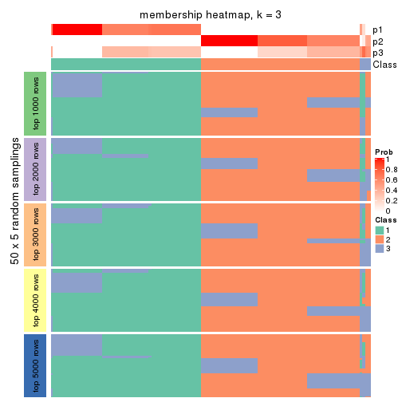</p>

</div>
<div id='tab-ATC-kmeans-membership-heatmap-3'>
<pre><code class="r">membership_heatmap(res, k = 4)
</code></pre>

<p></p>

</div>
<div id='tab-ATC-kmeans-membership-heatmap-4'>
<pre><code class="r">membership_heatmap(res, k = 5)
</code></pre>

<p>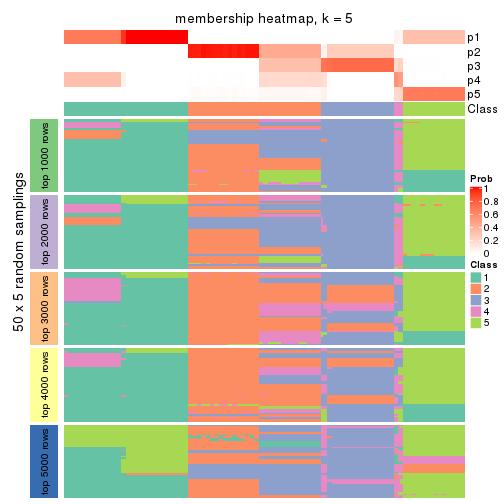</p>

</div>
<div id='tab-ATC-kmeans-membership-heatmap-5'>
<pre><code class="r">membership_heatmap(res, k = 6)
</code></pre>

<p></p>

</div>
</div>

As soon as we have had the classes for columns, we can look for signatures
which are significantly different between classes which can be candidate marks
for certain classes. Following are the heatmaps for signatures.


Signature heatmaps where rows are scaled:


<script>
$( function() {
	$( '#tabs-ATC-kmeans-get-signatures' ).tabs();
} );
</script>
<div id='tabs-ATC-kmeans-get-signatures'>
<ul>
<li><a href='#tab-ATC-kmeans-get-signatures-1'>k = 2</a></li>
<li><a href='#tab-ATC-kmeans-get-signatures-2'>k = 3</a></li>
<li><a href='#tab-ATC-kmeans-get-signatures-3'>k = 4</a></li>
<li><a href='#tab-ATC-kmeans-get-signatures-4'>k = 5</a></li>
<li><a href='#tab-ATC-kmeans-get-signatures-5'>k = 6</a></li>
</ul>
<div id='tab-ATC-kmeans-get-signatures-1'>
<pre><code class="r">get_signatures(res, k = 2)
</code></pre>

<p></p>

</div>
<div id='tab-ATC-kmeans-get-signatures-2'>
<pre><code class="r">get_signatures(res, k = 3)
</code></pre>

<p></p>

</div>
<div id='tab-ATC-kmeans-get-signatures-3'>
<pre><code class="r">get_signatures(res, k = 4)
</code></pre>

<p></p>

</div>
<div id='tab-ATC-kmeans-get-signatures-4'>
<pre><code class="r">get_signatures(res, k = 5)
</code></pre>

<p></p>

</div>
<div id='tab-ATC-kmeans-get-signatures-5'>
<pre><code class="r">get_signatures(res, k = 6)
</code></pre>

<p></p>

</div>
</div>


Signature heatmaps where rows are not scaled:


<script>
$( function() {
	$( '#tabs-ATC-kmeans-get-signatures-no-scale' ).tabs();
} );
</script>
<div id='tabs-ATC-kmeans-get-signatures-no-scale'>
<ul>
<li><a href='#tab-ATC-kmeans-get-signatures-no-scale-1'>k = 2</a></li>
<li><a href='#tab-ATC-kmeans-get-signatures-no-scale-2'>k = 3</a></li>
<li><a href='#tab-ATC-kmeans-get-signatures-no-scale-3'>k = 4</a></li>
<li><a href='#tab-ATC-kmeans-get-signatures-no-scale-4'>k = 5</a></li>
<li><a href='#tab-ATC-kmeans-get-signatures-no-scale-5'>k = 6</a></li>
</ul>
<div id='tab-ATC-kmeans-get-signatures-no-scale-1'>
<pre><code class="r">get_signatures(res, k = 2, scale_rows = FALSE)
</code></pre>

<p></p>

</div>
<div id='tab-ATC-kmeans-get-signatures-no-scale-2'>
<pre><code class="r">get_signatures(res, k = 3, scale_rows = FALSE)
</code></pre>

<p></p>

</div>
<div id='tab-ATC-kmeans-get-signatures-no-scale-3'>
<pre><code class="r">get_signatures(res, k = 4, scale_rows = FALSE)
</code></pre>

<p></p>

</div>
<div id='tab-ATC-kmeans-get-signatures-no-scale-4'>
<pre><code class="r">get_signatures(res, k = 5, scale_rows = FALSE)
</code></pre>

<p></p>

</div>
<div id='tab-ATC-kmeans-get-signatures-no-scale-5'>
<pre><code class="r">get_signatures(res, k = 6, scale_rows = FALSE)
</code></pre>

<p></p>

</div>
</div>


Compare the overlap of signatures from different k:

```r
compare_signatures(res)
```


`get_signature()` returns a data frame invisibly. TO get the list of signatures, the function
call should be assigned to a variable explicitly. In following code, if `plot` argument is set
to `FALSE`, no heatmap is plotted while only the differential analysis is performed.

```r
# code only for demonstration
tb = get_signature(res, k = ..., plot = FALSE)
```

An example of the output of `tb` is:

```
#>   which_row         fdr    mean_1    mean_2 scaled_mean_1 scaled_mean_2 km
#> 1        38 0.042760348  8.373488  9.131774    -0.5533452     0.5164555  1
#> 2        40 0.018707592  7.106213  8.469186    -0.6173731     0.5762149  1
#> 3        55 0.019134737 10.221463 11.207825    -0.6159697     0.5749050  1
#> 4        59 0.006059896  5.921854  7.869574    -0.6899429     0.6439467  1
#> 5        60 0.018055526  8.928898 10.211722    -0.6204761     0.5791110  1
#> 6        98 0.009384629 15.714769 14.887706     0.6635654    -0.6193277  2
...
```

The columns in `tb` are:

1. `which_row`: row indices corresponding to the input matrix.
2. `fdr`: FDR for the differential test. 
3. `mean_x`: The mean value in group x.
4. `scaled_mean_x`: The mean value in group x after rows are scaled.
5. `km`: Row groups if k-means clustering is applied to rows.


UMAP plot which shows how samples are separated.


<script>
$( function() {
	$( '#tabs-ATC-kmeans-dimension-reduction' ).tabs();
} );
</script>
<div id='tabs-ATC-kmeans-dimension-reduction'>
<ul>
<li><a href='#tab-ATC-kmeans-dimension-reduction-1'>k = 2</a></li>
<li><a href='#tab-ATC-kmeans-dimension-reduction-2'>k = 3</a></li>
<li><a href='#tab-ATC-kmeans-dimension-reduction-3'>k = 4</a></li>
<li><a href='#tab-ATC-kmeans-dimension-reduction-4'>k = 5</a></li>
<li><a href='#tab-ATC-kmeans-dimension-reduction-5'>k = 6</a></li>
</ul>
<div id='tab-ATC-kmeans-dimension-reduction-1'>
<pre><code class="r">dimension_reduction(res, k = 2, method = &quot;UMAP&quot;)
</code></pre>

<p></p>

</div>
<div id='tab-ATC-kmeans-dimension-reduction-2'>
<pre><code class="r">dimension_reduction(res, k = 3, method = &quot;UMAP&quot;)
</code></pre>

<p></p>

</div>
<div id='tab-ATC-kmeans-dimension-reduction-3'>
<pre><code class="r">dimension_reduction(res, k = 4, method = &quot;UMAP&quot;)
</code></pre>

<p></p>

</div>
<div id='tab-ATC-kmeans-dimension-reduction-4'>
<pre><code class="r">dimension_reduction(res, k = 5, method = &quot;UMAP&quot;)
</code></pre>

<p></p>

</div>
<div id='tab-ATC-kmeans-dimension-reduction-5'>
<pre><code class="r">dimension_reduction(res, k = 6, method = &quot;UMAP&quot;)
</code></pre>

<p></p>

</div>
</div>


Following heatmap shows how subgroups are split when increasing `k`:

```r
collect_classes(res)
```


If matrix rows can be associated to genes, consider to use `functional_enrichment(res,
...)` to perform function enrichment for the signature genes. See [this vignette](http://bioconductor.org/packages/devel/bioc/vignettes/cola/inst/doc/functional_enrichment.html) for more detailed explanations.


 

---------------------------------------------------


### ATC:skmeans**


The object with results only for a single top-value method and a single partition method 
can be extracted as:

```r
res = res_list["ATC", "skmeans"]
# you can also extract it by
# res = res_list["ATC:skmeans"]
```

A summary of `res` and all the functions that can be applied to it:

```r
res
```

```
#> A 'ConsensusPartition' object with k = 2, 3, 4, 5, 6.
#>   On a matrix with 12029 rows and 181 columns.
#>   Top rows (1000, 2000, 3000, 4000, 5000) are extracted by 'ATC' method.
#>   Subgroups are detected by 'skmeans' method.
#>   Performed in total 1250 partitions by row resampling.
#>   Best k for subgroups seems to be 3.
#> 
#> Following methods can be applied to this 'ConsensusPartition' object:
#>  [1] "cola_report"             "collect_classes"         "collect_plots"          
#>  [4] "collect_stats"           "colnames"                "compare_signatures"     
#>  [7] "consensus_heatmap"       "dimension_reduction"     "functional_enrichment"  
#> [10] "get_anno_col"            "get_anno"                "get_classes"            
#> [13] "get_consensus"           "get_matrix"              "get_membership"         
#> [16] "get_param"               "get_signatures"          "get_stats"              
#> [19] "is_best_k"               "is_stable_k"             "membership_heatmap"     
#> [22] "ncol"                    "nrow"                    "plot_ecdf"              
#> [25] "rownames"                "select_partition_number" "show"                   
#> [28] "suggest_best_k"          "test_to_known_factors"
```

`collect_plots()` function collects all the plots made from `res` for all `k` (number of partitions)
into one single page to provide an easy and fast comparison between different `k`.

```r
collect_plots(res)
```


The plots are:

- The first row: a plot of the ECDF (empirical cumulative distribution
  function) curves of the consensus matrix for each `k` and the heatmap of
  predicted classes for each `k`.
- The second row: heatmaps of the consensus matrix for each `k`.
- The third row: heatmaps of the membership matrix for each `k`.
- The fouth row: heatmaps of the signatures for each `k`.

All the plots in panels can be made by individual functions and they are
plotted later in this section.

`select_partition_number()` produces several plots showing different
statistics for choosing "optimized" `k`. There are following statistics:

- ECDF curves of the consensus matrix for each `k`;
- 1-PAC. [The PAC
  score](https://en.wikipedia.org/wiki/Consensus_clustering#Over-interpretation_potential_of_consensus_clustering)
  measures the proportion of the ambiguous subgrouping.
- Mean silhouette score.
- Concordance. The mean probability of fiting the consensus class ids in all
  partitions.
- Area increased. Denote $A_k$ as the area under the ECDF curve for current
  `k`, the area increased is defined as $A_k - A_{k-1}$.
- Rand index. The percent of pairs of samples that are both in a same cluster
  or both are not in a same cluster in the partition of k and k-1.
- Jaccard index. The ratio of pairs of samples are both in a same cluster in
  the partition of k and k-1 and the pairs of samples are both in a same
  cluster in the partition k or k-1.

The detailed explanations of these statistics can be found in [the _cola_
vignette](http://bioconductor.org/packages/devel/bioc/vignettes/cola/inst/doc/cola.html#toc_13).

Generally speaking, lower PAC score, higher mean silhouette score or higher
concordance corresponds to better partition. Rand index and Jaccard index
measure how similar the current partition is compared to partition with `k-1`.
If they are too similar, we won't accept `k` is better than `k-1`.

```r
select_partition_number(res)
```


The numeric values for all these statistics can be obtained by `get_stats()`.

```r
get_stats(res)
```

```
#>   k 1-PAC mean_silhouette concordance area_increased  Rand Jaccard
#> 2 2 1.000           0.999       1.000         0.5029 0.498   0.498
#> 3 3 1.000           0.950       0.966         0.0920 0.962   0.924
#> 4 4 0.773           0.906       0.868         0.1537 0.886   0.753
#> 5 5 0.668           0.915       0.859         0.1162 0.904   0.723
#> 6 6 0.735           0.865       0.868         0.0609 0.999   0.998
```

`suggest_best_k()` suggests the best $k$ based on these statistics. The rules are as follows:

- All $k$ with Jaccard index larger than 0.95 are removed because increasing
  $k$ does not provide enough extra information. If all $k$ are removed, it is
  marked as no subgroup is detected.
- For all $k$ with 1-PAC score larger than 0.9, the maximal $k$ is taken as
  the best $k$, and other $k$ are marked as optional $k$.
- If it does not fit the second rule. The $k$ with the maximal vote of the
  highest 1-PAC score, highest mean silhouette, and highest concordance is
  taken as the best $k$.

```r
suggest_best_k(res)
```

```
#> [1] 3
#> attr(,"optional")
#> [1] 2
```

There is also optional best $k$ = 2 that is worth to check.

Following shows the table of the partitions (You need to click the **show/hide
code output** link to see it). The membership matrix (columns with name `p*`)
is inferred by
[`clue::cl_consensus()`](https://www.rdocumentation.org/link/cl_consensus?package=clue)
function with the `SE` method. Basically the value in the membership matrix
represents the probability to belong to a certain group. The finall class
label for an item is determined with the group with highest probability it
belongs to.

In `get_classes()` function, the entropy is calculated from the membership
matrix and the silhouette score is calculated from the consensus matrix.


<script>
$( function() {
	$( '#tabs-ATC-skmeans-get-classes' ).tabs();
} );
</script>
<div id='tabs-ATC-skmeans-get-classes'>
<ul>
<li><a href='#tab-ATC-skmeans-get-classes-1'>k = 2</a></li>
<li><a href='#tab-ATC-skmeans-get-classes-2'>k = 3</a></li>
<li><a href='#tab-ATC-skmeans-get-classes-3'>k = 4</a></li>
<li><a href='#tab-ATC-skmeans-get-classes-4'>k = 5</a></li>
<li><a href='#tab-ATC-skmeans-get-classes-5'>k = 6</a></li>
</ul>

<div id='tab-ATC-skmeans-get-classes-1'>
<p><a id='tab-ATC-skmeans-get-classes-1-a' style='color:#0366d6' href='#'>show/hide code output</a></p>
<pre><code class="r">cbind(get_classes(res, k = 2), get_membership(res, k = 2))
</code></pre>

<pre><code>#&gt;           class entropy silhouette    p1    p2
#&gt; SRR315112     2    0.00      1.000 0.000 1.000
#&gt; SRR315113     1    0.00      0.999 1.000 0.000
#&gt; SRR315114     1    0.00      0.999 1.000 0.000
#&gt; SRR315115     2    0.00      1.000 0.000 1.000
#&gt; SRR315116     2    0.00      1.000 0.000 1.000
#&gt; SRR566986     2    0.00      1.000 0.000 1.000
#&gt; SRR566987     2    0.00      1.000 0.000 1.000
#&gt; SRR566988     2    0.00      1.000 0.000 1.000
#&gt; SRR566989     2    0.00      1.000 0.000 1.000
#&gt; SRR566990     2    0.00      1.000 0.000 1.000
#&gt; SRR566991     2    0.00      1.000 0.000 1.000
#&gt; SRR566992     2    0.00      1.000 0.000 1.000
#&gt; SRR566993     2    0.00      1.000 0.000 1.000
#&gt; SRR566994     2    0.00      1.000 0.000 1.000
#&gt; SRR566995     2    0.00      1.000 0.000 1.000
#&gt; SRR566996     2    0.00      1.000 0.000 1.000
#&gt; SRR566997     2    0.00      1.000 0.000 1.000
#&gt; SRR566998     2    0.00      1.000 0.000 1.000
#&gt; SRR566999     2    0.00      1.000 0.000 1.000
#&gt; SRR567000     2    0.00      1.000 0.000 1.000
#&gt; SRR567001     2    0.00      1.000 0.000 1.000
#&gt; SRR567002     2    0.00      1.000 0.000 1.000
#&gt; SRR567003     2    0.00      1.000 0.000 1.000
#&gt; SRR567004     2    0.00      1.000 0.000 1.000
#&gt; SRR567005     2    0.00      1.000 0.000 1.000
#&gt; SRR567006     2    0.00      1.000 0.000 1.000
#&gt; SRR567007     2    0.00      1.000 0.000 1.000
#&gt; SRR567008     2    0.00      1.000 0.000 1.000
#&gt; SRR567009     2    0.00      1.000 0.000 1.000
#&gt; SRR567010     2    0.00      1.000 0.000 1.000
#&gt; SRR567011     2    0.00      1.000 0.000 1.000
#&gt; SRR567012     2    0.00      1.000 0.000 1.000
#&gt; SRR567013     2    0.00      1.000 0.000 1.000
#&gt; SRR567014     2    0.00      1.000 0.000 1.000
#&gt; SRR567015     2    0.00      1.000 0.000 1.000
#&gt; SRR567016     2    0.00      1.000 0.000 1.000
#&gt; SRR567017     2    0.00      1.000 0.000 1.000
#&gt; SRR567018     2    0.00      1.000 0.000 1.000
#&gt; SRR567019     2    0.00      1.000 0.000 1.000
#&gt; SRR567020     2    0.00      1.000 0.000 1.000
#&gt; SRR567021     2    0.00      1.000 0.000 1.000
#&gt; SRR567022     2    0.00      1.000 0.000 1.000
#&gt; SRR567023     2    0.00      1.000 0.000 1.000
#&gt; SRR567024     2    0.00      1.000 0.000 1.000
#&gt; SRR567025     2    0.00      1.000 0.000 1.000
#&gt; SRR567026     2    0.00      1.000 0.000 1.000
#&gt; SRR567027     2    0.00      1.000 0.000 1.000
#&gt; SRR567028     2    0.00      1.000 0.000 1.000
#&gt; SRR567029     2    0.00      1.000 0.000 1.000
#&gt; SRR567030     2    0.00      1.000 0.000 1.000
#&gt; SRR567031     2    0.00      1.000 0.000 1.000
#&gt; SRR567032     2    0.00      1.000 0.000 1.000
#&gt; SRR567033     2    0.00      1.000 0.000 1.000
#&gt; SRR567034     2    0.00      1.000 0.000 1.000
#&gt; SRR567035     2    0.00      1.000 0.000 1.000
#&gt; SRR567036     2    0.00      1.000 0.000 1.000
#&gt; SRR567037     2    0.00      1.000 0.000 1.000
#&gt; SRR567038     2    0.00      1.000 0.000 1.000
#&gt; SRR567039     2    0.00      1.000 0.000 1.000
#&gt; SRR567040     2    0.00      1.000 0.000 1.000
#&gt; SRR567041     2    0.00      1.000 0.000 1.000
#&gt; SRR567042     2    0.00      1.000 0.000 1.000
#&gt; SRR567043     2    0.00      1.000 0.000 1.000
#&gt; SRR567044     2    0.00      1.000 0.000 1.000
#&gt; SRR567045     2    0.00      1.000 0.000 1.000
#&gt; SRR567046     2    0.00      1.000 0.000 1.000
#&gt; SRR567047     2    0.00      1.000 0.000 1.000
#&gt; SRR567048     2    0.00      1.000 0.000 1.000
#&gt; SRR567049     2    0.00      1.000 0.000 1.000
#&gt; SRR567050     2    0.00      1.000 0.000 1.000
#&gt; SRR567051     2    0.00      1.000 0.000 1.000
#&gt; SRR567052     2    0.00      1.000 0.000 1.000
#&gt; SRR567053     2    0.00      1.000 0.000 1.000
#&gt; SRR567054     2    0.00      1.000 0.000 1.000
#&gt; SRR567055     2    0.00      1.000 0.000 1.000
#&gt; SRR567056     2    0.00      1.000 0.000 1.000
#&gt; SRR567057     2    0.00      1.000 0.000 1.000
#&gt; SRR567058     2    0.00      1.000 0.000 1.000
#&gt; SRR567059     2    0.00      1.000 0.000 1.000
#&gt; SRR567060     2    0.00      1.000 0.000 1.000
#&gt; SRR567061     2    0.00      1.000 0.000 1.000
#&gt; SRR567062     2    0.00      1.000 0.000 1.000
#&gt; SRR567063     2    0.00      1.000 0.000 1.000
#&gt; SRR567064     2    0.00      1.000 0.000 1.000
#&gt; SRR567065     2    0.00      1.000 0.000 1.000
#&gt; SRR567066     2    0.00      1.000 0.000 1.000
#&gt; SRR567067     2    0.00      1.000 0.000 1.000
#&gt; SRR567068     2    0.00      1.000 0.000 1.000
#&gt; SRR567069     2    0.00      1.000 0.000 1.000
#&gt; SRR567070     2    0.00      1.000 0.000 1.000
#&gt; SRR567071     2    0.00      1.000 0.000 1.000
#&gt; SRR567072     2    0.00      1.000 0.000 1.000
#&gt; SRR567073     2    0.00      1.000 0.000 1.000
#&gt; SRR567074     2    0.00      1.000 0.000 1.000
#&gt; SRR567075     2    0.00      1.000 0.000 1.000
#&gt; SRR567076     1    0.00      0.999 1.000 0.000
#&gt; SRR567077     1    0.00      0.999 1.000 0.000
#&gt; SRR567078     1    0.00      0.999 1.000 0.000
#&gt; SRR567079     1    0.00      0.999 1.000 0.000
#&gt; SRR567080     1    0.00      0.999 1.000 0.000
#&gt; SRR567081     1    0.00      0.999 1.000 0.000
#&gt; SRR567082     1    0.00      0.999 1.000 0.000
#&gt; SRR567083     1    0.00      0.999 1.000 0.000
#&gt; SRR567084     1    0.00      0.999 1.000 0.000
#&gt; SRR567085     1    0.00      0.999 1.000 0.000
#&gt; SRR567086     1    0.00      0.999 1.000 0.000
#&gt; SRR567087     1    0.00      0.999 1.000 0.000
#&gt; SRR567088     1    0.00      0.999 1.000 0.000
#&gt; SRR567089     1    0.00      0.999 1.000 0.000
#&gt; SRR567090     1    0.00      0.999 1.000 0.000
#&gt; SRR567091     1    0.00      0.999 1.000 0.000
#&gt; SRR567092     1    0.00      0.999 1.000 0.000
#&gt; SRR567093     1    0.00      0.999 1.000 0.000
#&gt; SRR567094     1    0.00      0.999 1.000 0.000
#&gt; SRR567095     1    0.00      0.999 1.000 0.000
#&gt; SRR567096     1    0.00      0.999 1.000 0.000
#&gt; SRR567097     1    0.00      0.999 1.000 0.000
#&gt; SRR567098     1    0.00      0.999 1.000 0.000
#&gt; SRR567099     1    0.00      0.999 1.000 0.000
#&gt; SRR567100     1    0.00      0.999 1.000 0.000
#&gt; SRR567101     1    0.00      0.999 1.000 0.000
#&gt; SRR567102     1    0.00      0.999 1.000 0.000
#&gt; SRR567103     1    0.00      0.999 1.000 0.000
#&gt; SRR567104     1    0.00      0.999 1.000 0.000
#&gt; SRR567105     1    0.00      0.999 1.000 0.000
#&gt; SRR567106     1    0.00      0.999 1.000 0.000
#&gt; SRR567107     1    0.00      0.999 1.000 0.000
#&gt; SRR567108     1    0.00      0.999 1.000 0.000
#&gt; SRR567109     1    0.00      0.999 1.000 0.000
#&gt; SRR567110     1    0.00      0.999 1.000 0.000
#&gt; SRR567111     1    0.00      0.999 1.000 0.000
#&gt; SRR567112     1    0.00      0.999 1.000 0.000
#&gt; SRR567113     1    0.00      0.999 1.000 0.000
#&gt; SRR567114     1    0.00      0.999 1.000 0.000
#&gt; SRR567115     1    0.00      0.999 1.000 0.000
#&gt; SRR567116     1    0.00      0.999 1.000 0.000
#&gt; SRR567117     1    0.00      0.999 1.000 0.000
#&gt; SRR567118     1    0.00      0.999 1.000 0.000
#&gt; SRR567119     1    0.00      0.999 1.000 0.000
#&gt; SRR567120     1    0.00      0.999 1.000 0.000
#&gt; SRR567121     1    0.00      0.999 1.000 0.000
#&gt; SRR567122     1    0.00      0.999 1.000 0.000
#&gt; SRR567123     1    0.00      0.999 1.000 0.000
#&gt; SRR567124     1    0.00      0.999 1.000 0.000
#&gt; SRR567125     1    0.00      0.999 1.000 0.000
#&gt; SRR567126     1    0.00      0.999 1.000 0.000
#&gt; SRR567127     1    0.00      0.999 1.000 0.000
#&gt; SRR567128     1    0.00      0.999 1.000 0.000
#&gt; SRR567129     1    0.00      0.999 1.000 0.000
#&gt; SRR567130     1    0.00      0.999 1.000 0.000
#&gt; SRR567131     1    0.00      0.999 1.000 0.000
#&gt; SRR567132     1    0.00      0.999 1.000 0.000
#&gt; SRR567133     1    0.00      0.999 1.000 0.000
#&gt; SRR567134     1    0.00      0.999 1.000 0.000
#&gt; SRR567135     1    0.00      0.999 1.000 0.000
#&gt; SRR567136     1    0.00      0.999 1.000 0.000
#&gt; SRR567137     1    0.00      0.999 1.000 0.000
#&gt; SRR567138     1    0.00      0.999 1.000 0.000
#&gt; SRR567139     1    0.00      0.999 1.000 0.000
#&gt; SRR567140     1    0.00      0.999 1.000 0.000
#&gt; SRR567141     1    0.00      0.999 1.000 0.000
#&gt; SRR567142     1    0.00      0.999 1.000 0.000
#&gt; SRR567143     1    0.00      0.999 1.000 0.000
#&gt; SRR567144     1    0.00      0.999 1.000 0.000
#&gt; SRR567145     1    0.00      0.999 1.000 0.000
#&gt; SRR567146     1    0.26      0.955 0.956 0.044
#&gt; SRR567147     1    0.00      0.999 1.000 0.000
#&gt; SRR567148     1    0.00      0.999 1.000 0.000
#&gt; SRR567149     1    0.00      0.999 1.000 0.000
#&gt; SRR567150     1    0.00      0.999 1.000 0.000
#&gt; SRR567151     1    0.00      0.999 1.000 0.000
#&gt; SRR567152     1    0.00      0.999 1.000 0.000
#&gt; SRR567153     1    0.00      0.999 1.000 0.000
#&gt; SRR567154     1    0.00      0.999 1.000 0.000
#&gt; SRR567155     1    0.00      0.999 1.000 0.000
#&gt; SRR567156     1    0.00      0.999 1.000 0.000
#&gt; SRR567157     1    0.00      0.999 1.000 0.000
#&gt; SRR567158     1    0.00      0.999 1.000 0.000
#&gt; SRR567159     1    0.00      0.999 1.000 0.000
#&gt; SRR567160     1    0.00      0.999 1.000 0.000
#&gt; SRR567161     1    0.26      0.955 0.956 0.044
</code></pre>

<script>
$('#tab-ATC-skmeans-get-classes-1-a').parent().next().next().hide();
$('#tab-ATC-skmeans-get-classes-1-a').click(function(){
  $('#tab-ATC-skmeans-get-classes-1-a').parent().next().next().toggle();
  return(false);
});
</script>
</div>

<div id='tab-ATC-skmeans-get-classes-2'>
<p><a id='tab-ATC-skmeans-get-classes-2-a' style='color:#0366d6' href='#'>show/hide code output</a></p>
<pre><code class="r">cbind(get_classes(res, k = 3), get_membership(res, k = 3))
</code></pre>

<pre><code>#&gt;           class entropy silhouette    p1    p2    p3
#&gt; SRR315112     3   0.579      0.689 0.000 0.332 0.668
#&gt; SRR315113     3   0.263      0.788 0.084 0.000 0.916
#&gt; SRR315114     3   0.263      0.788 0.084 0.000 0.916
#&gt; SRR315115     3   0.579      0.689 0.000 0.332 0.668
#&gt; SRR315116     3   0.579      0.689 0.000 0.332 0.668
#&gt; SRR566986     2   0.000      0.964 0.000 1.000 0.000
#&gt; SRR566987     2   0.000      0.964 0.000 1.000 0.000
#&gt; SRR566988     2   0.000      0.964 0.000 1.000 0.000
#&gt; SRR566989     2   0.000      0.964 0.000 1.000 0.000
#&gt; SRR566990     2   0.000      0.964 0.000 1.000 0.000
#&gt; SRR566991     2   0.000      0.964 0.000 1.000 0.000
#&gt; SRR566992     2   0.000      0.964 0.000 1.000 0.000
#&gt; SRR566993     2   0.000      0.964 0.000 1.000 0.000
#&gt; SRR566994     2   0.000      0.964 0.000 1.000 0.000
#&gt; SRR566995     2   0.000      0.964 0.000 1.000 0.000
#&gt; SRR566996     2   0.000      0.964 0.000 1.000 0.000
#&gt; SRR566997     2   0.000      0.964 0.000 1.000 0.000
#&gt; SRR566998     2   0.000      0.964 0.000 1.000 0.000
#&gt; SRR566999     2   0.000      0.964 0.000 1.000 0.000
#&gt; SRR567000     2   0.000      0.964 0.000 1.000 0.000
#&gt; SRR567001     2   0.000      0.964 0.000 1.000 0.000
#&gt; SRR567002     2   0.000      0.964 0.000 1.000 0.000
#&gt; SRR567003     2   0.000      0.964 0.000 1.000 0.000
#&gt; SRR567004     2   0.000      0.964 0.000 1.000 0.000
#&gt; SRR567005     2   0.000      0.964 0.000 1.000 0.000
#&gt; SRR567006     2   0.000      0.964 0.000 1.000 0.000
#&gt; SRR567007     2   0.000      0.964 0.000 1.000 0.000
#&gt; SRR567008     2   0.000      0.964 0.000 1.000 0.000
#&gt; SRR567009     2   0.000      0.964 0.000 1.000 0.000
#&gt; SRR567010     2   0.000      0.964 0.000 1.000 0.000
#&gt; SRR567011     2   0.000      0.964 0.000 1.000 0.000
#&gt; SRR567012     2   0.000      0.964 0.000 1.000 0.000
#&gt; SRR567013     2   0.000      0.964 0.000 1.000 0.000
#&gt; SRR567014     2   0.000      0.964 0.000 1.000 0.000
#&gt; SRR567015     2   0.000      0.964 0.000 1.000 0.000
#&gt; SRR567016     2   0.000      0.964 0.000 1.000 0.000
#&gt; SRR567017     2   0.000      0.964 0.000 1.000 0.000
#&gt; SRR567018     2   0.000      0.964 0.000 1.000 0.000
#&gt; SRR567019     2   0.000      0.964 0.000 1.000 0.000
#&gt; SRR567020     2   0.000      0.964 0.000 1.000 0.000
#&gt; SRR567021     2   0.000      0.964 0.000 1.000 0.000
#&gt; SRR567022     2   0.000      0.964 0.000 1.000 0.000
#&gt; SRR567023     2   0.000      0.964 0.000 1.000 0.000
#&gt; SRR567024     2   0.000      0.964 0.000 1.000 0.000
#&gt; SRR567025     2   0.000      0.964 0.000 1.000 0.000
#&gt; SRR567026     2   0.000      0.964 0.000 1.000 0.000
#&gt; SRR567027     2   0.000      0.964 0.000 1.000 0.000
#&gt; SRR567028     2   0.000      0.964 0.000 1.000 0.000
#&gt; SRR567029     2   0.000      0.964 0.000 1.000 0.000
#&gt; SRR567030     2   0.000      0.964 0.000 1.000 0.000
#&gt; SRR567031     2   0.000      0.964 0.000 1.000 0.000
#&gt; SRR567032     2   0.000      0.964 0.000 1.000 0.000
#&gt; SRR567033     2   0.000      0.964 0.000 1.000 0.000
#&gt; SRR567034     2   0.000      0.964 0.000 1.000 0.000
#&gt; SRR567035     2   0.000      0.964 0.000 1.000 0.000
#&gt; SRR567036     2   0.000      0.964 0.000 1.000 0.000
#&gt; SRR567037     2   0.000      0.964 0.000 1.000 0.000
#&gt; SRR567038     2   0.000      0.964 0.000 1.000 0.000
#&gt; SRR567039     2   0.000      0.964 0.000 1.000 0.000
#&gt; SRR567040     2   0.000      0.964 0.000 1.000 0.000
#&gt; SRR567041     2   0.000      0.964 0.000 1.000 0.000
#&gt; SRR567042     2   0.000      0.964 0.000 1.000 0.000
#&gt; SRR567043     2   0.000      0.964 0.000 1.000 0.000
#&gt; SRR567044     2   0.263      0.934 0.000 0.916 0.084
#&gt; SRR567045     2   0.263      0.934 0.000 0.916 0.084
#&gt; SRR567046     2   0.263      0.934 0.000 0.916 0.084
#&gt; SRR567047     2   0.263      0.934 0.000 0.916 0.084
#&gt; SRR567048     2   0.263      0.934 0.000 0.916 0.084
#&gt; SRR567049     2   0.263      0.934 0.000 0.916 0.084
#&gt; SRR567050     2   0.263      0.934 0.000 0.916 0.084
#&gt; SRR567051     2   0.263      0.934 0.000 0.916 0.084
#&gt; SRR567052     2   0.263      0.934 0.000 0.916 0.084
#&gt; SRR567053     2   0.263      0.934 0.000 0.916 0.084
#&gt; SRR567054     2   0.263      0.934 0.000 0.916 0.084
#&gt; SRR567055     2   0.263      0.934 0.000 0.916 0.084
#&gt; SRR567056     2   0.263      0.934 0.000 0.916 0.084
#&gt; SRR567057     2   0.263      0.934 0.000 0.916 0.084
#&gt; SRR567058     2   0.263      0.934 0.000 0.916 0.084
#&gt; SRR567059     2   0.263      0.934 0.000 0.916 0.084
#&gt; SRR567060     2   0.263      0.934 0.000 0.916 0.084
#&gt; SRR567061     2   0.263      0.934 0.000 0.916 0.084
#&gt; SRR567062     2   0.263      0.934 0.000 0.916 0.084
#&gt; SRR567063     2   0.263      0.934 0.000 0.916 0.084
#&gt; SRR567064     2   0.263      0.934 0.000 0.916 0.084
#&gt; SRR567065     2   0.263      0.934 0.000 0.916 0.084
#&gt; SRR567066     2   0.263      0.934 0.000 0.916 0.084
#&gt; SRR567067     2   0.263      0.934 0.000 0.916 0.084
#&gt; SRR567068     2   0.263      0.934 0.000 0.916 0.084
#&gt; SRR567069     2   0.263      0.934 0.000 0.916 0.084
#&gt; SRR567070     2   0.263      0.934 0.000 0.916 0.084
#&gt; SRR567071     2   0.263      0.934 0.000 0.916 0.084
#&gt; SRR567072     2   0.263      0.934 0.000 0.916 0.084
#&gt; SRR567073     2   0.263      0.934 0.000 0.916 0.084
#&gt; SRR567074     2   0.263      0.934 0.000 0.916 0.084
#&gt; SRR567075     2   0.263      0.934 0.000 0.916 0.084
#&gt; SRR567076     1   0.000      0.973 1.000 0.000 0.000
#&gt; SRR567077     1   0.000      0.973 1.000 0.000 0.000
#&gt; SRR567078     1   0.000      0.973 1.000 0.000 0.000
#&gt; SRR567079     1   0.000      0.973 1.000 0.000 0.000
#&gt; SRR567080     1   0.000      0.973 1.000 0.000 0.000
#&gt; SRR567081     1   0.000      0.973 1.000 0.000 0.000
#&gt; SRR567082     1   0.000      0.973 1.000 0.000 0.000
#&gt; SRR567083     1   0.000      0.973 1.000 0.000 0.000
#&gt; SRR567084     1   0.000      0.973 1.000 0.000 0.000
#&gt; SRR567085     1   0.000      0.973 1.000 0.000 0.000
#&gt; SRR567086     1   0.000      0.973 1.000 0.000 0.000
#&gt; SRR567087     1   0.000      0.973 1.000 0.000 0.000
#&gt; SRR567088     1   0.000      0.973 1.000 0.000 0.000
#&gt; SRR567089     1   0.000      0.973 1.000 0.000 0.000
#&gt; SRR567090     1   0.000      0.973 1.000 0.000 0.000
#&gt; SRR567091     1   0.000      0.973 1.000 0.000 0.000
#&gt; SRR567092     1   0.000      0.973 1.000 0.000 0.000
#&gt; SRR567093     1   0.000      0.973 1.000 0.000 0.000
#&gt; SRR567094     1   0.000      0.973 1.000 0.000 0.000
#&gt; SRR567095     1   0.000      0.973 1.000 0.000 0.000
#&gt; SRR567096     1   0.000      0.973 1.000 0.000 0.000
#&gt; SRR567097     1   0.000      0.973 1.000 0.000 0.000
#&gt; SRR567098     1   0.000      0.973 1.000 0.000 0.000
#&gt; SRR567099     1   0.000      0.973 1.000 0.000 0.000
#&gt; SRR567100     1   0.000      0.973 1.000 0.000 0.000
#&gt; SRR567101     1   0.000      0.973 1.000 0.000 0.000
#&gt; SRR567102     1   0.000      0.973 1.000 0.000 0.000
#&gt; SRR567103     1   0.000      0.973 1.000 0.000 0.000
#&gt; SRR567104     1   0.000      0.973 1.000 0.000 0.000
#&gt; SRR567105     1   0.000      0.973 1.000 0.000 0.000
#&gt; SRR567106     1   0.245      0.944 0.924 0.000 0.076
#&gt; SRR567107     1   0.245      0.944 0.924 0.000 0.076
#&gt; SRR567108     1   0.245      0.944 0.924 0.000 0.076
#&gt; SRR567109     1   0.245      0.944 0.924 0.000 0.076
#&gt; SRR567110     1   0.245      0.944 0.924 0.000 0.076
#&gt; SRR567111     1   0.245      0.944 0.924 0.000 0.076
#&gt; SRR567112     1   0.245      0.944 0.924 0.000 0.076
#&gt; SRR567113     1   0.245      0.944 0.924 0.000 0.076
#&gt; SRR567114     1   0.245      0.944 0.924 0.000 0.076
#&gt; SRR567115     1   0.245      0.944 0.924 0.000 0.076
#&gt; SRR567116     1   0.245      0.944 0.924 0.000 0.076
#&gt; SRR567117     1   0.245      0.944 0.924 0.000 0.076
#&gt; SRR567118     1   0.245      0.944 0.924 0.000 0.076
#&gt; SRR567119     1   0.245      0.944 0.924 0.000 0.076
#&gt; SRR567120     1   0.245      0.944 0.924 0.000 0.076
#&gt; SRR567121     1   0.245      0.944 0.924 0.000 0.076
#&gt; SRR567122     1   0.245      0.944 0.924 0.000 0.076
#&gt; SRR567123     1   0.245      0.944 0.924 0.000 0.076
#&gt; SRR567124     1   0.245      0.944 0.924 0.000 0.076
#&gt; SRR567125     1   0.245      0.944 0.924 0.000 0.076
#&gt; SRR567126     1   0.245      0.944 0.924 0.000 0.076
#&gt; SRR567127     1   0.245      0.944 0.924 0.000 0.076
#&gt; SRR567128     1   0.245      0.944 0.924 0.000 0.076
#&gt; SRR567129     1   0.245      0.944 0.924 0.000 0.076
#&gt; SRR567130     1   0.245      0.944 0.924 0.000 0.076
#&gt; SRR567131     1   0.245      0.944 0.924 0.000 0.076
#&gt; SRR567132     1   0.245      0.944 0.924 0.000 0.076
#&gt; SRR567133     1   0.245      0.944 0.924 0.000 0.076
#&gt; SRR567134     1   0.000      0.973 1.000 0.000 0.000
#&gt; SRR567135     1   0.000      0.973 1.000 0.000 0.000
#&gt; SRR567136     1   0.000      0.973 1.000 0.000 0.000
#&gt; SRR567137     1   0.000      0.973 1.000 0.000 0.000
#&gt; SRR567138     1   0.000      0.973 1.000 0.000 0.000
#&gt; SRR567139     1   0.000      0.973 1.000 0.000 0.000
#&gt; SRR567140     1   0.000      0.973 1.000 0.000 0.000
#&gt; SRR567141     1   0.000      0.973 1.000 0.000 0.000
#&gt; SRR567142     1   0.000      0.973 1.000 0.000 0.000
#&gt; SRR567143     1   0.000      0.973 1.000 0.000 0.000
#&gt; SRR567144     1   0.000      0.973 1.000 0.000 0.000
#&gt; SRR567145     1   0.000      0.973 1.000 0.000 0.000
#&gt; SRR567146     3   0.313      0.813 0.052 0.032 0.916
#&gt; SRR567147     1   0.000      0.973 1.000 0.000 0.000
#&gt; SRR567148     1   0.000      0.973 1.000 0.000 0.000
#&gt; SRR567149     1   0.000      0.973 1.000 0.000 0.000
#&gt; SRR567150     1   0.000      0.973 1.000 0.000 0.000
#&gt; SRR567151     1   0.000      0.973 1.000 0.000 0.000
#&gt; SRR567152     1   0.000      0.973 1.000 0.000 0.000
#&gt; SRR567153     1   0.000      0.973 1.000 0.000 0.000
#&gt; SRR567154     1   0.000      0.973 1.000 0.000 0.000
#&gt; SRR567155     1   0.000      0.973 1.000 0.000 0.000
#&gt; SRR567156     1   0.000      0.973 1.000 0.000 0.000
#&gt; SRR567157     1   0.000      0.973 1.000 0.000 0.000
#&gt; SRR567158     1   0.000      0.973 1.000 0.000 0.000
#&gt; SRR567159     1   0.000      0.973 1.000 0.000 0.000
#&gt; SRR567160     1   0.000      0.973 1.000 0.000 0.000
#&gt; SRR567161     3   0.313      0.813 0.052 0.032 0.916
</code></pre>

<script>
$('#tab-ATC-skmeans-get-classes-2-a').parent().next().next().hide();
$('#tab-ATC-skmeans-get-classes-2-a').click(function(){
  $('#tab-ATC-skmeans-get-classes-2-a').parent().next().next().toggle();
  return(false);
});
</script>
</div>

<div id='tab-ATC-skmeans-get-classes-3'>
<p><a id='tab-ATC-skmeans-get-classes-3-a' style='color:#0366d6' href='#'>show/hide code output</a></p>
<pre><code class="r">cbind(get_classes(res, k = 4), get_membership(res, k = 4))
</code></pre>

<pre><code>#&gt;           class entropy silhouette    p1    p2    p3    p4
#&gt; SRR315112     4  0.6338      0.632 0.000 0.236 0.120 0.644
#&gt; SRR315113     4  0.0000      0.788 0.000 0.000 0.000 1.000
#&gt; SRR315114     4  0.0000      0.788 0.000 0.000 0.000 1.000
#&gt; SRR315115     4  0.6338      0.632 0.000 0.236 0.120 0.644
#&gt; SRR315116     4  0.5582      0.705 0.000 0.168 0.108 0.724
#&gt; SRR566986     2  0.4961      0.924 0.000 0.552 0.448 0.000
#&gt; SRR566987     2  0.4961      0.924 0.000 0.552 0.448 0.000
#&gt; SRR566988     2  0.4961      0.924 0.000 0.552 0.448 0.000
#&gt; SRR566989     2  0.4961      0.924 0.000 0.552 0.448 0.000
#&gt; SRR566990     2  0.4961      0.924 0.000 0.552 0.448 0.000
#&gt; SRR566991     2  0.4961      0.924 0.000 0.552 0.448 0.000
#&gt; SRR566992     2  0.4961      0.924 0.000 0.552 0.448 0.000
#&gt; SRR566993     2  0.4961      0.924 0.000 0.552 0.448 0.000
#&gt; SRR566994     2  0.4961      0.924 0.000 0.552 0.448 0.000
#&gt; SRR566995     2  0.4961      0.924 0.000 0.552 0.448 0.000
#&gt; SRR566996     2  0.4961      0.924 0.000 0.552 0.448 0.000
#&gt; SRR566997     2  0.4961      0.924 0.000 0.552 0.448 0.000
#&gt; SRR566998     2  0.4961      0.924 0.000 0.552 0.448 0.000
#&gt; SRR566999     2  0.4961      0.924 0.000 0.552 0.448 0.000
#&gt; SRR567000     2  0.4961      0.924 0.000 0.552 0.448 0.000
#&gt; SRR567001     2  0.4961      0.924 0.000 0.552 0.448 0.000
#&gt; SRR567002     2  0.4961      0.924 0.000 0.552 0.448 0.000
#&gt; SRR567003     2  0.4961      0.924 0.000 0.552 0.448 0.000
#&gt; SRR567004     2  0.4961      0.924 0.000 0.552 0.448 0.000
#&gt; SRR567005     2  0.4961      0.924 0.000 0.552 0.448 0.000
#&gt; SRR567006     2  0.4961      0.924 0.000 0.552 0.448 0.000
#&gt; SRR567007     2  0.4961      0.924 0.000 0.552 0.448 0.000
#&gt; SRR567008     2  0.4961      0.924 0.000 0.552 0.448 0.000
#&gt; SRR567009     2  0.4961      0.924 0.000 0.552 0.448 0.000
#&gt; SRR567010     2  0.4961      0.924 0.000 0.552 0.448 0.000
#&gt; SRR567011     2  0.4961      0.924 0.000 0.552 0.448 0.000
#&gt; SRR567012     2  0.4961      0.924 0.000 0.552 0.448 0.000
#&gt; SRR567013     2  0.4961      0.924 0.000 0.552 0.448 0.000
#&gt; SRR567014     2  0.4746      0.933 0.000 0.632 0.368 0.000
#&gt; SRR567015     2  0.4746      0.933 0.000 0.632 0.368 0.000
#&gt; SRR567016     2  0.4746      0.933 0.000 0.632 0.368 0.000
#&gt; SRR567017     2  0.4746      0.933 0.000 0.632 0.368 0.000
#&gt; SRR567018     2  0.4746      0.933 0.000 0.632 0.368 0.000
#&gt; SRR567019     2  0.4746      0.933 0.000 0.632 0.368 0.000
#&gt; SRR567020     2  0.4746      0.933 0.000 0.632 0.368 0.000
#&gt; SRR567021     2  0.4746      0.933 0.000 0.632 0.368 0.000
#&gt; SRR567022     2  0.4746      0.933 0.000 0.632 0.368 0.000
#&gt; SRR567023     2  0.4746      0.933 0.000 0.632 0.368 0.000
#&gt; SRR567024     2  0.4746      0.933 0.000 0.632 0.368 0.000
#&gt; SRR567025     2  0.4746      0.933 0.000 0.632 0.368 0.000
#&gt; SRR567026     2  0.4746      0.933 0.000 0.632 0.368 0.000
#&gt; SRR567027     2  0.4746      0.933 0.000 0.632 0.368 0.000
#&gt; SRR567028     2  0.4746      0.933 0.000 0.632 0.368 0.000
#&gt; SRR567029     2  0.4746      0.933 0.000 0.632 0.368 0.000
#&gt; SRR567030     2  0.4746      0.933 0.000 0.632 0.368 0.000
#&gt; SRR567031     2  0.4746      0.933 0.000 0.632 0.368 0.000
#&gt; SRR567032     2  0.4746      0.933 0.000 0.632 0.368 0.000
#&gt; SRR567033     2  0.4746      0.933 0.000 0.632 0.368 0.000
#&gt; SRR567034     2  0.4746      0.933 0.000 0.632 0.368 0.000
#&gt; SRR567035     2  0.4746      0.933 0.000 0.632 0.368 0.000
#&gt; SRR567036     2  0.4746      0.933 0.000 0.632 0.368 0.000
#&gt; SRR567037     2  0.4746      0.933 0.000 0.632 0.368 0.000
#&gt; SRR567038     2  0.4746      0.933 0.000 0.632 0.368 0.000
#&gt; SRR567039     2  0.4746      0.933 0.000 0.632 0.368 0.000
#&gt; SRR567040     2  0.4746      0.933 0.000 0.632 0.368 0.000
#&gt; SRR567041     2  0.4746      0.933 0.000 0.632 0.368 0.000
#&gt; SRR567042     2  0.4746      0.933 0.000 0.632 0.368 0.000
#&gt; SRR567043     2  0.4746      0.933 0.000 0.632 0.368 0.000
#&gt; SRR567044     3  0.0000      1.000 0.000 0.000 1.000 0.000
#&gt; SRR567045     3  0.0000      1.000 0.000 0.000 1.000 0.000
#&gt; SRR567046     3  0.0000      1.000 0.000 0.000 1.000 0.000
#&gt; SRR567047     3  0.0000      1.000 0.000 0.000 1.000 0.000
#&gt; SRR567048     3  0.0000      1.000 0.000 0.000 1.000 0.000
#&gt; SRR567049     3  0.0000      1.000 0.000 0.000 1.000 0.000
#&gt; SRR567050     3  0.0000      1.000 0.000 0.000 1.000 0.000
#&gt; SRR567051     3  0.0000      1.000 0.000 0.000 1.000 0.000
#&gt; SRR567052     3  0.0000      1.000 0.000 0.000 1.000 0.000
#&gt; SRR567053     3  0.0000      1.000 0.000 0.000 1.000 0.000
#&gt; SRR567054     3  0.0000      1.000 0.000 0.000 1.000 0.000
#&gt; SRR567055     3  0.0000      1.000 0.000 0.000 1.000 0.000
#&gt; SRR567056     3  0.0000      1.000 0.000 0.000 1.000 0.000
#&gt; SRR567057     3  0.0000      1.000 0.000 0.000 1.000 0.000
#&gt; SRR567058     3  0.0000      1.000 0.000 0.000 1.000 0.000
#&gt; SRR567059     3  0.0000      1.000 0.000 0.000 1.000 0.000
#&gt; SRR567060     3  0.0000      1.000 0.000 0.000 1.000 0.000
#&gt; SRR567061     3  0.0000      1.000 0.000 0.000 1.000 0.000
#&gt; SRR567062     3  0.0000      1.000 0.000 0.000 1.000 0.000
#&gt; SRR567063     3  0.0000      1.000 0.000 0.000 1.000 0.000
#&gt; SRR567064     3  0.0000      1.000 0.000 0.000 1.000 0.000
#&gt; SRR567065     3  0.0000      1.000 0.000 0.000 1.000 0.000
#&gt; SRR567066     3  0.0000      1.000 0.000 0.000 1.000 0.000
#&gt; SRR567067     3  0.0000      1.000 0.000 0.000 1.000 0.000
#&gt; SRR567068     3  0.0000      1.000 0.000 0.000 1.000 0.000
#&gt; SRR567069     3  0.0000      1.000 0.000 0.000 1.000 0.000
#&gt; SRR567070     3  0.0000      1.000 0.000 0.000 1.000 0.000
#&gt; SRR567071     3  0.0000      1.000 0.000 0.000 1.000 0.000
#&gt; SRR567072     3  0.0000      1.000 0.000 0.000 1.000 0.000
#&gt; SRR567073     3  0.0000      1.000 0.000 0.000 1.000 0.000
#&gt; SRR567074     3  0.0000      1.000 0.000 0.000 1.000 0.000
#&gt; SRR567075     3  0.0000      1.000 0.000 0.000 1.000 0.000
#&gt; SRR567076     1  0.0000      0.902 1.000 0.000 0.000 0.000
#&gt; SRR567077     1  0.0000      0.902 1.000 0.000 0.000 0.000
#&gt; SRR567078     1  0.0000      0.902 1.000 0.000 0.000 0.000
#&gt; SRR567079     1  0.0000      0.902 1.000 0.000 0.000 0.000
#&gt; SRR567080     1  0.0000      0.902 1.000 0.000 0.000 0.000
#&gt; SRR567081     1  0.0000      0.902 1.000 0.000 0.000 0.000
#&gt; SRR567082     1  0.0000      0.902 1.000 0.000 0.000 0.000
#&gt; SRR567083     1  0.0000      0.902 1.000 0.000 0.000 0.000
#&gt; SRR567084     1  0.0000      0.902 1.000 0.000 0.000 0.000
#&gt; SRR567085     1  0.0000      0.902 1.000 0.000 0.000 0.000
#&gt; SRR567086     1  0.0000      0.902 1.000 0.000 0.000 0.000
#&gt; SRR567087     1  0.0000      0.902 1.000 0.000 0.000 0.000
#&gt; SRR567088     1  0.0000      0.902 1.000 0.000 0.000 0.000
#&gt; SRR567089     1  0.0000      0.902 1.000 0.000 0.000 0.000
#&gt; SRR567090     1  0.0000      0.902 1.000 0.000 0.000 0.000
#&gt; SRR567091     1  0.0000      0.902 1.000 0.000 0.000 0.000
#&gt; SRR567092     1  0.0000      0.902 1.000 0.000 0.000 0.000
#&gt; SRR567093     1  0.0000      0.902 1.000 0.000 0.000 0.000
#&gt; SRR567094     1  0.0000      0.902 1.000 0.000 0.000 0.000
#&gt; SRR567095     1  0.0000      0.902 1.000 0.000 0.000 0.000
#&gt; SRR567096     1  0.0000      0.902 1.000 0.000 0.000 0.000
#&gt; SRR567097     1  0.0000      0.902 1.000 0.000 0.000 0.000
#&gt; SRR567098     1  0.0000      0.902 1.000 0.000 0.000 0.000
#&gt; SRR567099     1  0.0000      0.902 1.000 0.000 0.000 0.000
#&gt; SRR567100     1  0.0000      0.902 1.000 0.000 0.000 0.000
#&gt; SRR567101     1  0.0000      0.902 1.000 0.000 0.000 0.000
#&gt; SRR567102     1  0.0592      0.899 0.984 0.016 0.000 0.000
#&gt; SRR567103     1  0.0592      0.899 0.984 0.016 0.000 0.000
#&gt; SRR567104     1  0.0000      0.902 1.000 0.000 0.000 0.000
#&gt; SRR567105     1  0.0000      0.902 1.000 0.000 0.000 0.000
#&gt; SRR567106     1  0.4761      0.812 0.764 0.192 0.000 0.044
#&gt; SRR567107     1  0.4761      0.812 0.764 0.192 0.000 0.044
#&gt; SRR567108     1  0.4761      0.812 0.764 0.192 0.000 0.044
#&gt; SRR567109     1  0.4761      0.812 0.764 0.192 0.000 0.044
#&gt; SRR567110     1  0.4761      0.812 0.764 0.192 0.000 0.044
#&gt; SRR567111     1  0.4761      0.812 0.764 0.192 0.000 0.044
#&gt; SRR567112     1  0.4761      0.812 0.764 0.192 0.000 0.044
#&gt; SRR567113     1  0.4761      0.812 0.764 0.192 0.000 0.044
#&gt; SRR567114     1  0.4761      0.812 0.764 0.192 0.000 0.044
#&gt; SRR567115     1  0.4761      0.812 0.764 0.192 0.000 0.044
#&gt; SRR567116     1  0.4761      0.812 0.764 0.192 0.000 0.044
#&gt; SRR567117     1  0.4761      0.812 0.764 0.192 0.000 0.044
#&gt; SRR567118     1  0.4761      0.812 0.764 0.192 0.000 0.044
#&gt; SRR567119     1  0.4761      0.812 0.764 0.192 0.000 0.044
#&gt; SRR567120     1  0.4761      0.812 0.764 0.192 0.000 0.044
#&gt; SRR567121     1  0.4761      0.812 0.764 0.192 0.000 0.044
#&gt; SRR567122     1  0.4761      0.812 0.764 0.192 0.000 0.044
#&gt; SRR567123     1  0.4761      0.812 0.764 0.192 0.000 0.044
#&gt; SRR567124     1  0.4761      0.812 0.764 0.192 0.000 0.044
#&gt; SRR567125     1  0.4761      0.812 0.764 0.192 0.000 0.044
#&gt; SRR567126     1  0.4761      0.812 0.764 0.192 0.000 0.044
#&gt; SRR567127     1  0.4761      0.812 0.764 0.192 0.000 0.044
#&gt; SRR567128     1  0.4761      0.812 0.764 0.192 0.000 0.044
#&gt; SRR567129     1  0.4761      0.812 0.764 0.192 0.000 0.044
#&gt; SRR567130     1  0.4761      0.812 0.764 0.192 0.000 0.044
#&gt; SRR567131     1  0.4761      0.812 0.764 0.192 0.000 0.044
#&gt; SRR567132     1  0.4761      0.812 0.764 0.192 0.000 0.044
#&gt; SRR567133     1  0.4761      0.812 0.764 0.192 0.000 0.044
#&gt; SRR567134     1  0.1452      0.893 0.956 0.036 0.000 0.008
#&gt; SRR567135     1  0.1452      0.893 0.956 0.036 0.000 0.008
#&gt; SRR567136     1  0.1452      0.893 0.956 0.036 0.000 0.008
#&gt; SRR567137     1  0.1452      0.893 0.956 0.036 0.000 0.008
#&gt; SRR567138     1  0.1452      0.893 0.956 0.036 0.000 0.008
#&gt; SRR567139     1  0.1452      0.893 0.956 0.036 0.000 0.008
#&gt; SRR567140     1  0.1452      0.893 0.956 0.036 0.000 0.008
#&gt; SRR567141     1  0.1452      0.893 0.956 0.036 0.000 0.008
#&gt; SRR567142     1  0.1452      0.893 0.956 0.036 0.000 0.008
#&gt; SRR567143     1  0.1452      0.893 0.956 0.036 0.000 0.008
#&gt; SRR567144     1  0.1452      0.893 0.956 0.036 0.000 0.008
#&gt; SRR567145     1  0.1452      0.893 0.956 0.036 0.000 0.008
#&gt; SRR567146     4  0.3355      0.795 0.004 0.160 0.000 0.836
#&gt; SRR567147     1  0.1452      0.893 0.956 0.036 0.000 0.008
#&gt; SRR567148     1  0.1452      0.893 0.956 0.036 0.000 0.008
#&gt; SRR567149     1  0.1452      0.893 0.956 0.036 0.000 0.008
#&gt; SRR567150     1  0.1452      0.893 0.956 0.036 0.000 0.008
#&gt; SRR567151     1  0.1452      0.893 0.956 0.036 0.000 0.008
#&gt; SRR567152     1  0.1452      0.893 0.956 0.036 0.000 0.008
#&gt; SRR567153     1  0.1452      0.893 0.956 0.036 0.000 0.008
#&gt; SRR567154     1  0.1452      0.893 0.956 0.036 0.000 0.008
#&gt; SRR567155     1  0.1452      0.893 0.956 0.036 0.000 0.008
#&gt; SRR567156     1  0.1452      0.893 0.956 0.036 0.000 0.008
#&gt; SRR567157     1  0.1452      0.893 0.956 0.036 0.000 0.008
#&gt; SRR567158     1  0.1452      0.893 0.956 0.036 0.000 0.008
#&gt; SRR567159     1  0.1452      0.893 0.956 0.036 0.000 0.008
#&gt; SRR567160     1  0.1452      0.893 0.956 0.036 0.000 0.008
#&gt; SRR567161     4  0.3355      0.795 0.004 0.160 0.000 0.836
</code></pre>

<script>
$('#tab-ATC-skmeans-get-classes-3-a').parent().next().next().hide();
$('#tab-ATC-skmeans-get-classes-3-a').click(function(){
  $('#tab-ATC-skmeans-get-classes-3-a').parent().next().next().toggle();
  return(false);
});
</script>
</div>

<div id='tab-ATC-skmeans-get-classes-4'>
<p><a id='tab-ATC-skmeans-get-classes-4-a' style='color:#0366d6' href='#'>show/hide code output</a></p>
<pre><code class="r">cbind(get_classes(res, k = 5), get_membership(res, k = 5))
</code></pre>

<pre><code>#&gt;           class entropy silhouette    p1    p2    p3    p4    p5
#&gt; SRR315112     3  0.3661      0.726 0.000 0.276 0.724 0.000 0.000
#&gt; SRR315113     3  0.0404      0.816 0.000 0.000 0.988 0.012 0.000
#&gt; SRR315114     3  0.0404      0.816 0.000 0.000 0.988 0.012 0.000
#&gt; SRR315115     3  0.3661      0.726 0.000 0.276 0.724 0.000 0.000
#&gt; SRR315116     3  0.3074      0.800 0.000 0.196 0.804 0.000 0.000
#&gt; SRR566986     2  0.4215      0.829 0.000 0.768 0.000 0.168 0.064
#&gt; SRR566987     2  0.4215      0.829 0.000 0.768 0.000 0.168 0.064
#&gt; SRR566988     2  0.4215      0.829 0.000 0.768 0.000 0.168 0.064
#&gt; SRR566989     2  0.4215      0.829 0.000 0.768 0.000 0.168 0.064
#&gt; SRR566990     2  0.4215      0.829 0.000 0.768 0.000 0.168 0.064
#&gt; SRR566991     2  0.4215      0.829 0.000 0.768 0.000 0.168 0.064
#&gt; SRR566992     2  0.4215      0.829 0.000 0.768 0.000 0.168 0.064
#&gt; SRR566993     2  0.4215      0.829 0.000 0.768 0.000 0.168 0.064
#&gt; SRR566994     2  0.4215      0.829 0.000 0.768 0.000 0.168 0.064
#&gt; SRR566995     2  0.4215      0.829 0.000 0.768 0.000 0.168 0.064
#&gt; SRR566996     2  0.4215      0.829 0.000 0.768 0.000 0.168 0.064
#&gt; SRR566997     2  0.4215      0.829 0.000 0.768 0.000 0.168 0.064
#&gt; SRR566998     2  0.4215      0.829 0.000 0.768 0.000 0.168 0.064
#&gt; SRR566999     2  0.4215      0.829 0.000 0.768 0.000 0.168 0.064
#&gt; SRR567000     2  0.4215      0.829 0.000 0.768 0.000 0.168 0.064
#&gt; SRR567001     2  0.4215      0.829 0.000 0.768 0.000 0.168 0.064
#&gt; SRR567002     2  0.4215      0.829 0.000 0.768 0.000 0.168 0.064
#&gt; SRR567003     2  0.4215      0.829 0.000 0.768 0.000 0.168 0.064
#&gt; SRR567004     2  0.4215      0.829 0.000 0.768 0.000 0.168 0.064
#&gt; SRR567005     2  0.4215      0.829 0.000 0.768 0.000 0.168 0.064
#&gt; SRR567006     2  0.4215      0.829 0.000 0.768 0.000 0.168 0.064
#&gt; SRR567007     2  0.4215      0.829 0.000 0.768 0.000 0.168 0.064
#&gt; SRR567008     2  0.4215      0.829 0.000 0.768 0.000 0.168 0.064
#&gt; SRR567009     2  0.4215      0.829 0.000 0.768 0.000 0.168 0.064
#&gt; SRR567010     2  0.4215      0.829 0.000 0.768 0.000 0.168 0.064
#&gt; SRR567011     2  0.4215      0.829 0.000 0.768 0.000 0.168 0.064
#&gt; SRR567012     2  0.4215      0.829 0.000 0.768 0.000 0.168 0.064
#&gt; SRR567013     2  0.4215      0.829 0.000 0.768 0.000 0.168 0.064
#&gt; SRR567014     2  0.0000      0.846 0.000 1.000 0.000 0.000 0.000
#&gt; SRR567015     2  0.0000      0.846 0.000 1.000 0.000 0.000 0.000
#&gt; SRR567016     2  0.0000      0.846 0.000 1.000 0.000 0.000 0.000
#&gt; SRR567017     2  0.0000      0.846 0.000 1.000 0.000 0.000 0.000
#&gt; SRR567018     2  0.0000      0.846 0.000 1.000 0.000 0.000 0.000
#&gt; SRR567019     2  0.0000      0.846 0.000 1.000 0.000 0.000 0.000
#&gt; SRR567020     2  0.0000      0.846 0.000 1.000 0.000 0.000 0.000
#&gt; SRR567021     2  0.0000      0.846 0.000 1.000 0.000 0.000 0.000
#&gt; SRR567022     2  0.0000      0.846 0.000 1.000 0.000 0.000 0.000
#&gt; SRR567023     2  0.0000      0.846 0.000 1.000 0.000 0.000 0.000
#&gt; SRR567024     2  0.0000      0.846 0.000 1.000 0.000 0.000 0.000
#&gt; SRR567025     2  0.0000      0.846 0.000 1.000 0.000 0.000 0.000
#&gt; SRR567026     2  0.0000      0.846 0.000 1.000 0.000 0.000 0.000
#&gt; SRR567027     2  0.0000      0.846 0.000 1.000 0.000 0.000 0.000
#&gt; SRR567028     2  0.0000      0.846 0.000 1.000 0.000 0.000 0.000
#&gt; SRR567029     2  0.0000      0.846 0.000 1.000 0.000 0.000 0.000
#&gt; SRR567030     2  0.0000      0.846 0.000 1.000 0.000 0.000 0.000
#&gt; SRR567031     2  0.0000      0.846 0.000 1.000 0.000 0.000 0.000
#&gt; SRR567032     2  0.0000      0.846 0.000 1.000 0.000 0.000 0.000
#&gt; SRR567033     2  0.0000      0.846 0.000 1.000 0.000 0.000 0.000
#&gt; SRR567034     2  0.0000      0.846 0.000 1.000 0.000 0.000 0.000
#&gt; SRR567035     2  0.0000      0.846 0.000 1.000 0.000 0.000 0.000
#&gt; SRR567036     2  0.0000      0.846 0.000 1.000 0.000 0.000 0.000
#&gt; SRR567037     2  0.0000      0.846 0.000 1.000 0.000 0.000 0.000
#&gt; SRR567038     2  0.0000      0.846 0.000 1.000 0.000 0.000 0.000
#&gt; SRR567039     2  0.0000      0.846 0.000 1.000 0.000 0.000 0.000
#&gt; SRR567040     2  0.0000      0.846 0.000 1.000 0.000 0.000 0.000
#&gt; SRR567041     2  0.0000      0.846 0.000 1.000 0.000 0.000 0.000
#&gt; SRR567042     2  0.0000      0.846 0.000 1.000 0.000 0.000 0.000
#&gt; SRR567043     2  0.0000      0.846 0.000 1.000 0.000 0.000 0.000
#&gt; SRR567044     4  0.2732      1.000 0.000 0.160 0.000 0.840 0.000
#&gt; SRR567045     4  0.2732      1.000 0.000 0.160 0.000 0.840 0.000
#&gt; SRR567046     4  0.2732      1.000 0.000 0.160 0.000 0.840 0.000
#&gt; SRR567047     4  0.2732      1.000 0.000 0.160 0.000 0.840 0.000
#&gt; SRR567048     4  0.2732      1.000 0.000 0.160 0.000 0.840 0.000
#&gt; SRR567049     4  0.2732      1.000 0.000 0.160 0.000 0.840 0.000
#&gt; SRR567050     4  0.2732      1.000 0.000 0.160 0.000 0.840 0.000
#&gt; SRR567051     4  0.2732      1.000 0.000 0.160 0.000 0.840 0.000
#&gt; SRR567052     4  0.2732      1.000 0.000 0.160 0.000 0.840 0.000
#&gt; SRR567053     4  0.2732      1.000 0.000 0.160 0.000 0.840 0.000
#&gt; SRR567054     4  0.2732      1.000 0.000 0.160 0.000 0.840 0.000
#&gt; SRR567055     4  0.2732      1.000 0.000 0.160 0.000 0.840 0.000
#&gt; SRR567056     4  0.2732      1.000 0.000 0.160 0.000 0.840 0.000
#&gt; SRR567057     4  0.2732      1.000 0.000 0.160 0.000 0.840 0.000
#&gt; SRR567058     4  0.2732      1.000 0.000 0.160 0.000 0.840 0.000
#&gt; SRR567059     4  0.2732      1.000 0.000 0.160 0.000 0.840 0.000
#&gt; SRR567060     4  0.2732      1.000 0.000 0.160 0.000 0.840 0.000
#&gt; SRR567061     4  0.2732      1.000 0.000 0.160 0.000 0.840 0.000
#&gt; SRR567062     4  0.2732      1.000 0.000 0.160 0.000 0.840 0.000
#&gt; SRR567063     4  0.2732      1.000 0.000 0.160 0.000 0.840 0.000
#&gt; SRR567064     4  0.2732      1.000 0.000 0.160 0.000 0.840 0.000
#&gt; SRR567065     4  0.2732      1.000 0.000 0.160 0.000 0.840 0.000
#&gt; SRR567066     4  0.2732      1.000 0.000 0.160 0.000 0.840 0.000
#&gt; SRR567067     4  0.2732      1.000 0.000 0.160 0.000 0.840 0.000
#&gt; SRR567068     4  0.2732      1.000 0.000 0.160 0.000 0.840 0.000
#&gt; SRR567069     4  0.2732      1.000 0.000 0.160 0.000 0.840 0.000
#&gt; SRR567070     4  0.2732      1.000 0.000 0.160 0.000 0.840 0.000
#&gt; SRR567071     4  0.2732      1.000 0.000 0.160 0.000 0.840 0.000
#&gt; SRR567072     4  0.2732      1.000 0.000 0.160 0.000 0.840 0.000
#&gt; SRR567073     4  0.2732      1.000 0.000 0.160 0.000 0.840 0.000
#&gt; SRR567074     4  0.2732      1.000 0.000 0.160 0.000 0.840 0.000
#&gt; SRR567075     4  0.2732      1.000 0.000 0.160 0.000 0.840 0.000
#&gt; SRR567076     1  0.1792      0.920 0.916 0.000 0.000 0.000 0.084
#&gt; SRR567077     1  0.1792      0.920 0.916 0.000 0.000 0.000 0.084
#&gt; SRR567078     1  0.1792      0.920 0.916 0.000 0.000 0.000 0.084
#&gt; SRR567079     1  0.1792      0.920 0.916 0.000 0.000 0.000 0.084
#&gt; SRR567080     1  0.1792      0.920 0.916 0.000 0.000 0.000 0.084
#&gt; SRR567081     1  0.1792      0.920 0.916 0.000 0.000 0.000 0.084
#&gt; SRR567082     1  0.1792      0.920 0.916 0.000 0.000 0.000 0.084
#&gt; SRR567083     1  0.1792      0.920 0.916 0.000 0.000 0.000 0.084
#&gt; SRR567084     1  0.1792      0.920 0.916 0.000 0.000 0.000 0.084
#&gt; SRR567085     1  0.1792      0.920 0.916 0.000 0.000 0.000 0.084
#&gt; SRR567086     1  0.1792      0.920 0.916 0.000 0.000 0.000 0.084
#&gt; SRR567087     1  0.1792      0.920 0.916 0.000 0.000 0.000 0.084
#&gt; SRR567088     1  0.1792      0.920 0.916 0.000 0.000 0.000 0.084
#&gt; SRR567089     1  0.1792      0.920 0.916 0.000 0.000 0.000 0.084
#&gt; SRR567090     1  0.1792      0.920 0.916 0.000 0.000 0.000 0.084
#&gt; SRR567091     1  0.1792      0.920 0.916 0.000 0.000 0.000 0.084
#&gt; SRR567092     1  0.1792      0.920 0.916 0.000 0.000 0.000 0.084
#&gt; SRR567093     1  0.1792      0.920 0.916 0.000 0.000 0.000 0.084
#&gt; SRR567094     1  0.1792      0.920 0.916 0.000 0.000 0.000 0.084
#&gt; SRR567095     1  0.1792      0.920 0.916 0.000 0.000 0.000 0.084
#&gt; SRR567096     1  0.1792      0.920 0.916 0.000 0.000 0.000 0.084
#&gt; SRR567097     1  0.1792      0.920 0.916 0.000 0.000 0.000 0.084
#&gt; SRR567098     1  0.1792      0.920 0.916 0.000 0.000 0.000 0.084
#&gt; SRR567099     1  0.1792      0.920 0.916 0.000 0.000 0.000 0.084
#&gt; SRR567100     1  0.1792      0.920 0.916 0.000 0.000 0.000 0.084
#&gt; SRR567101     1  0.1792      0.920 0.916 0.000 0.000 0.000 0.084
#&gt; SRR567102     1  0.1043      0.921 0.960 0.000 0.000 0.000 0.040
#&gt; SRR567103     1  0.1043      0.921 0.960 0.000 0.000 0.000 0.040
#&gt; SRR567104     1  0.1792      0.920 0.916 0.000 0.000 0.000 0.084
#&gt; SRR567105     1  0.1792      0.920 0.916 0.000 0.000 0.000 0.084
#&gt; SRR567106     5  0.3612      1.000 0.268 0.000 0.000 0.000 0.732
#&gt; SRR567107     5  0.3612      1.000 0.268 0.000 0.000 0.000 0.732
#&gt; SRR567108     5  0.3612      1.000 0.268 0.000 0.000 0.000 0.732
#&gt; SRR567109     5  0.3612      1.000 0.268 0.000 0.000 0.000 0.732
#&gt; SRR567110     5  0.3612      1.000 0.268 0.000 0.000 0.000 0.732
#&gt; SRR567111     5  0.3612      1.000 0.268 0.000 0.000 0.000 0.732
#&gt; SRR567112     5  0.3612      1.000 0.268 0.000 0.000 0.000 0.732
#&gt; SRR567113     5  0.3612      1.000 0.268 0.000 0.000 0.000 0.732
#&gt; SRR567114     5  0.3612      1.000 0.268 0.000 0.000 0.000 0.732
#&gt; SRR567115     5  0.3612      1.000 0.268 0.000 0.000 0.000 0.732
#&gt; SRR567116     5  0.3612      1.000 0.268 0.000 0.000 0.000 0.732
#&gt; SRR567117     5  0.3612      1.000 0.268 0.000 0.000 0.000 0.732
#&gt; SRR567118     5  0.3612      1.000 0.268 0.000 0.000 0.000 0.732
#&gt; SRR567119     5  0.3612      1.000 0.268 0.000 0.000 0.000 0.732
#&gt; SRR567120     5  0.3612      1.000 0.268 0.000 0.000 0.000 0.732
#&gt; SRR567121     5  0.3612      1.000 0.268 0.000 0.000 0.000 0.732
#&gt; SRR567122     5  0.3612      1.000 0.268 0.000 0.000 0.000 0.732
#&gt; SRR567123     5  0.3612      1.000 0.268 0.000 0.000 0.000 0.732
#&gt; SRR567124     5  0.3612      1.000 0.268 0.000 0.000 0.000 0.732
#&gt; SRR567125     5  0.3612      1.000 0.268 0.000 0.000 0.000 0.732
#&gt; SRR567126     5  0.3612      1.000 0.268 0.000 0.000 0.000 0.732
#&gt; SRR567127     5  0.3612      1.000 0.268 0.000 0.000 0.000 0.732
#&gt; SRR567128     5  0.3612      1.000 0.268 0.000 0.000 0.000 0.732
#&gt; SRR567129     5  0.3612      1.000 0.268 0.000 0.000 0.000 0.732
#&gt; SRR567130     5  0.3612      1.000 0.268 0.000 0.000 0.000 0.732
#&gt; SRR567131     5  0.3612      1.000 0.268 0.000 0.000 0.000 0.732
#&gt; SRR567132     5  0.3612      1.000 0.268 0.000 0.000 0.000 0.732
#&gt; SRR567133     5  0.3612      1.000 0.268 0.000 0.000 0.000 0.732
#&gt; SRR567134     1  0.0955      0.917 0.968 0.000 0.000 0.028 0.004
#&gt; SRR567135     1  0.0955      0.917 0.968 0.000 0.000 0.028 0.004
#&gt; SRR567136     1  0.0955      0.917 0.968 0.000 0.000 0.028 0.004
#&gt; SRR567137     1  0.0955      0.917 0.968 0.000 0.000 0.028 0.004
#&gt; SRR567138     1  0.0955      0.917 0.968 0.000 0.000 0.028 0.004
#&gt; SRR567139     1  0.0955      0.917 0.968 0.000 0.000 0.028 0.004
#&gt; SRR567140     1  0.0955      0.917 0.968 0.000 0.000 0.028 0.004
#&gt; SRR567141     1  0.0955      0.917 0.968 0.000 0.000 0.028 0.004
#&gt; SRR567142     1  0.0955      0.917 0.968 0.000 0.000 0.028 0.004
#&gt; SRR567143     1  0.0955      0.917 0.968 0.000 0.000 0.028 0.004
#&gt; SRR567144     1  0.0955      0.917 0.968 0.000 0.000 0.028 0.004
#&gt; SRR567145     1  0.0955      0.917 0.968 0.000 0.000 0.028 0.004
#&gt; SRR567146     3  0.5240      0.798 0.000 0.000 0.676 0.120 0.204
#&gt; SRR567147     1  0.0955      0.917 0.968 0.000 0.000 0.028 0.004
#&gt; SRR567148     1  0.0955      0.917 0.968 0.000 0.000 0.028 0.004
#&gt; SRR567149     1  0.0955      0.917 0.968 0.000 0.000 0.028 0.004
#&gt; SRR567150     1  0.0955      0.917 0.968 0.000 0.000 0.028 0.004
#&gt; SRR567151     1  0.0955      0.917 0.968 0.000 0.000 0.028 0.004
#&gt; SRR567152     1  0.0955      0.917 0.968 0.000 0.000 0.028 0.004
#&gt; SRR567153     1  0.0955      0.917 0.968 0.000 0.000 0.028 0.004
#&gt; SRR567154     1  0.0955      0.917 0.968 0.000 0.000 0.028 0.004
#&gt; SRR567155     1  0.0955      0.917 0.968 0.000 0.000 0.028 0.004
#&gt; SRR567156     1  0.0955      0.917 0.968 0.000 0.000 0.028 0.004
#&gt; SRR567157     1  0.0955      0.917 0.968 0.000 0.000 0.028 0.004
#&gt; SRR567158     1  0.0955      0.917 0.968 0.000 0.000 0.028 0.004
#&gt; SRR567159     1  0.0955      0.917 0.968 0.000 0.000 0.028 0.004
#&gt; SRR567160     1  0.0955      0.917 0.968 0.000 0.000 0.028 0.004
#&gt; SRR567161     3  0.5240      0.798 0.000 0.000 0.676 0.120 0.204
</code></pre>

<script>
$('#tab-ATC-skmeans-get-classes-4-a').parent().next().next().hide();
$('#tab-ATC-skmeans-get-classes-4-a').click(function(){
  $('#tab-ATC-skmeans-get-classes-4-a').parent().next().next().toggle();
  return(false);
});
</script>
</div>

<div id='tab-ATC-skmeans-get-classes-5'>
<p><a id='tab-ATC-skmeans-get-classes-5-a' style='color:#0366d6' href='#'>show/hide code output</a></p>
<pre><code class="r">cbind(get_classes(res, k = 6), get_membership(res, k = 6))
</code></pre>

<pre><code>#&gt;           class entropy silhouette    p1    p2    p3    p4    p5    p6
#&gt; SRR315112     3   0.339      0.669 0.000 0.144 0.804 0.052 0.000 0.000
#&gt; SRR315113     3   0.149      0.390 0.036 0.000 0.940 0.000 0.000 0.024
#&gt; SRR315114     3   0.149      0.390 0.036 0.000 0.940 0.000 0.000 0.024
#&gt; SRR315115     3   0.339      0.669 0.000 0.144 0.804 0.052 0.000 0.000
#&gt; SRR315116     3   0.323      0.670 0.000 0.128 0.820 0.052 0.000 0.000
#&gt; SRR566986     2   0.200      0.741 0.000 0.884 0.000 0.000 0.000 0.116
#&gt; SRR566987     2   0.200      0.741 0.000 0.884 0.000 0.000 0.000 0.116
#&gt; SRR566988     2   0.200      0.741 0.000 0.884 0.000 0.000 0.000 0.116
#&gt; SRR566989     2   0.200      0.741 0.000 0.884 0.000 0.000 0.000 0.116
#&gt; SRR566990     2   0.200      0.741 0.000 0.884 0.000 0.000 0.000 0.116
#&gt; SRR566991     2   0.200      0.741 0.000 0.884 0.000 0.000 0.000 0.116
#&gt; SRR566992     2   0.200      0.741 0.000 0.884 0.000 0.000 0.000 0.116
#&gt; SRR566993     2   0.200      0.741 0.000 0.884 0.000 0.000 0.000 0.116
#&gt; SRR566994     2   0.200      0.741 0.000 0.884 0.000 0.000 0.000 0.116
#&gt; SRR566995     2   0.200      0.741 0.000 0.884 0.000 0.000 0.000 0.116
#&gt; SRR566996     2   0.200      0.741 0.000 0.884 0.000 0.000 0.000 0.116
#&gt; SRR566997     2   0.200      0.741 0.000 0.884 0.000 0.000 0.000 0.116
#&gt; SRR566998     2   0.200      0.741 0.000 0.884 0.000 0.000 0.000 0.116
#&gt; SRR566999     2   0.200      0.741 0.000 0.884 0.000 0.000 0.000 0.116
#&gt; SRR567000     2   0.200      0.741 0.000 0.884 0.000 0.000 0.000 0.116
#&gt; SRR567001     2   0.200      0.741 0.000 0.884 0.000 0.000 0.000 0.116
#&gt; SRR567002     2   0.200      0.741 0.000 0.884 0.000 0.000 0.000 0.116
#&gt; SRR567003     2   0.200      0.741 0.000 0.884 0.000 0.000 0.000 0.116
#&gt; SRR567004     2   0.200      0.741 0.000 0.884 0.000 0.000 0.000 0.116
#&gt; SRR567005     2   0.200      0.741 0.000 0.884 0.000 0.000 0.000 0.116
#&gt; SRR567006     2   0.200      0.741 0.000 0.884 0.000 0.000 0.000 0.116
#&gt; SRR567007     2   0.200      0.741 0.000 0.884 0.000 0.000 0.000 0.116
#&gt; SRR567008     2   0.200      0.741 0.000 0.884 0.000 0.000 0.000 0.116
#&gt; SRR567009     2   0.200      0.741 0.000 0.884 0.000 0.000 0.000 0.116
#&gt; SRR567010     2   0.200      0.741 0.000 0.884 0.000 0.000 0.000 0.116
#&gt; SRR567011     2   0.200      0.741 0.000 0.884 0.000 0.000 0.000 0.116
#&gt; SRR567012     2   0.200      0.741 0.000 0.884 0.000 0.000 0.000 0.116
#&gt; SRR567013     2   0.200      0.741 0.000 0.884 0.000 0.000 0.000 0.116
#&gt; SRR567014     2   0.322      0.754 0.000 0.736 0.000 0.264 0.000 0.000
#&gt; SRR567015     2   0.322      0.754 0.000 0.736 0.000 0.264 0.000 0.000
#&gt; SRR567016     2   0.322      0.754 0.000 0.736 0.000 0.264 0.000 0.000
#&gt; SRR567017     2   0.322      0.754 0.000 0.736 0.000 0.264 0.000 0.000
#&gt; SRR567018     2   0.322      0.754 0.000 0.736 0.000 0.264 0.000 0.000
#&gt; SRR567019     2   0.322      0.754 0.000 0.736 0.000 0.264 0.000 0.000
#&gt; SRR567020     2   0.322      0.754 0.000 0.736 0.000 0.264 0.000 0.000
#&gt; SRR567021     2   0.322      0.754 0.000 0.736 0.000 0.264 0.000 0.000
#&gt; SRR567022     2   0.320      0.754 0.000 0.740 0.000 0.260 0.000 0.000
#&gt; SRR567023     2   0.322      0.754 0.000 0.736 0.000 0.264 0.000 0.000
#&gt; SRR567024     2   0.322      0.754 0.000 0.736 0.000 0.264 0.000 0.000
#&gt; SRR567025     2   0.322      0.754 0.000 0.736 0.000 0.264 0.000 0.000
#&gt; SRR567026     2   0.322      0.754 0.000 0.736 0.000 0.264 0.000 0.000
#&gt; SRR567027     2   0.322      0.754 0.000 0.736 0.000 0.264 0.000 0.000
#&gt; SRR567028     2   0.322      0.754 0.000 0.736 0.000 0.264 0.000 0.000
#&gt; SRR567029     2   0.322      0.754 0.000 0.736 0.000 0.264 0.000 0.000
#&gt; SRR567030     2   0.322      0.754 0.000 0.736 0.000 0.264 0.000 0.000
#&gt; SRR567031     2   0.322      0.754 0.000 0.736 0.000 0.264 0.000 0.000
#&gt; SRR567032     2   0.322      0.754 0.000 0.736 0.000 0.264 0.000 0.000
#&gt; SRR567033     2   0.322      0.754 0.000 0.736 0.000 0.264 0.000 0.000
#&gt; SRR567034     2   0.322      0.754 0.000 0.736 0.000 0.264 0.000 0.000
#&gt; SRR567035     2   0.322      0.754 0.000 0.736 0.000 0.264 0.000 0.000
#&gt; SRR567036     2   0.322      0.754 0.000 0.736 0.000 0.264 0.000 0.000
#&gt; SRR567037     2   0.322      0.754 0.000 0.736 0.000 0.264 0.000 0.000
#&gt; SRR567038     2   0.322      0.754 0.000 0.736 0.000 0.264 0.000 0.000
#&gt; SRR567039     2   0.322      0.754 0.000 0.736 0.000 0.264 0.000 0.000
#&gt; SRR567040     2   0.322      0.754 0.000 0.736 0.000 0.264 0.000 0.000
#&gt; SRR567041     2   0.322      0.754 0.000 0.736 0.000 0.264 0.000 0.000
#&gt; SRR567042     2   0.320      0.754 0.000 0.740 0.000 0.260 0.000 0.000
#&gt; SRR567043     2   0.322      0.754 0.000 0.736 0.000 0.264 0.000 0.000
#&gt; SRR567044     6   0.150      1.000 0.000 0.076 0.000 0.000 0.000 0.924
#&gt; SRR567045     6   0.150      1.000 0.000 0.076 0.000 0.000 0.000 0.924
#&gt; SRR567046     6   0.150      1.000 0.000 0.076 0.000 0.000 0.000 0.924
#&gt; SRR567047     6   0.150      1.000 0.000 0.076 0.000 0.000 0.000 0.924
#&gt; SRR567048     6   0.150      1.000 0.000 0.076 0.000 0.000 0.000 0.924
#&gt; SRR567049     6   0.150      1.000 0.000 0.076 0.000 0.000 0.000 0.924
#&gt; SRR567050     6   0.150      1.000 0.000 0.076 0.000 0.000 0.000 0.924
#&gt; SRR567051     6   0.150      1.000 0.000 0.076 0.000 0.000 0.000 0.924
#&gt; SRR567052     6   0.150      1.000 0.000 0.076 0.000 0.000 0.000 0.924
#&gt; SRR567053     6   0.150      1.000 0.000 0.076 0.000 0.000 0.000 0.924
#&gt; SRR567054     6   0.150      1.000 0.000 0.076 0.000 0.000 0.000 0.924
#&gt; SRR567055     6   0.150      1.000 0.000 0.076 0.000 0.000 0.000 0.924
#&gt; SRR567056     6   0.150      1.000 0.000 0.076 0.000 0.000 0.000 0.924
#&gt; SRR567057     6   0.150      1.000 0.000 0.076 0.000 0.000 0.000 0.924
#&gt; SRR567058     6   0.150      1.000 0.000 0.076 0.000 0.000 0.000 0.924
#&gt; SRR567059     6   0.150      1.000 0.000 0.076 0.000 0.000 0.000 0.924
#&gt; SRR567060     6   0.150      1.000 0.000 0.076 0.000 0.000 0.000 0.924
#&gt; SRR567061     6   0.150      1.000 0.000 0.076 0.000 0.000 0.000 0.924
#&gt; SRR567062     6   0.150      1.000 0.000 0.076 0.000 0.000 0.000 0.924
#&gt; SRR567063     6   0.150      1.000 0.000 0.076 0.000 0.000 0.000 0.924
#&gt; SRR567064     6   0.150      1.000 0.000 0.076 0.000 0.000 0.000 0.924
#&gt; SRR567065     6   0.150      1.000 0.000 0.076 0.000 0.000 0.000 0.924
#&gt; SRR567066     6   0.150      1.000 0.000 0.076 0.000 0.000 0.000 0.924
#&gt; SRR567067     6   0.150      1.000 0.000 0.076 0.000 0.000 0.000 0.924
#&gt; SRR567068     6   0.150      1.000 0.000 0.076 0.000 0.000 0.000 0.924
#&gt; SRR567069     6   0.150      1.000 0.000 0.076 0.000 0.000 0.000 0.924
#&gt; SRR567070     6   0.150      1.000 0.000 0.076 0.000 0.000 0.000 0.924
#&gt; SRR567071     6   0.150      1.000 0.000 0.076 0.000 0.000 0.000 0.924
#&gt; SRR567072     6   0.150      1.000 0.000 0.076 0.000 0.000 0.000 0.924
#&gt; SRR567073     6   0.150      1.000 0.000 0.076 0.000 0.000 0.000 0.924
#&gt; SRR567074     6   0.150      1.000 0.000 0.076 0.000 0.000 0.000 0.924
#&gt; SRR567075     6   0.150      1.000 0.000 0.076 0.000 0.000 0.000 0.924
#&gt; SRR567076     5   0.144      0.875 0.072 0.000 0.000 0.000 0.928 0.000
#&gt; SRR567077     5   0.144      0.875 0.072 0.000 0.000 0.000 0.928 0.000
#&gt; SRR567078     5   0.144      0.875 0.072 0.000 0.000 0.000 0.928 0.000
#&gt; SRR567079     5   0.144      0.875 0.072 0.000 0.000 0.000 0.928 0.000
#&gt; SRR567080     5   0.144      0.875 0.072 0.000 0.000 0.000 0.928 0.000
#&gt; SRR567081     5   0.144      0.875 0.072 0.000 0.000 0.000 0.928 0.000
#&gt; SRR567082     5   0.144      0.875 0.072 0.000 0.000 0.000 0.928 0.000
#&gt; SRR567083     5   0.144      0.875 0.072 0.000 0.000 0.000 0.928 0.000
#&gt; SRR567084     5   0.144      0.875 0.072 0.000 0.000 0.000 0.928 0.000
#&gt; SRR567085     5   0.144      0.875 0.072 0.000 0.000 0.000 0.928 0.000
#&gt; SRR567086     5   0.144      0.875 0.072 0.000 0.000 0.000 0.928 0.000
#&gt; SRR567087     5   0.144      0.875 0.072 0.000 0.000 0.000 0.928 0.000
#&gt; SRR567088     5   0.144      0.875 0.072 0.000 0.000 0.000 0.928 0.000
#&gt; SRR567089     5   0.144      0.875 0.072 0.000 0.000 0.000 0.928 0.000
#&gt; SRR567090     5   0.144      0.875 0.072 0.000 0.000 0.000 0.928 0.000
#&gt; SRR567091     5   0.144      0.875 0.072 0.000 0.000 0.000 0.928 0.000
#&gt; SRR567092     5   0.144      0.875 0.072 0.000 0.000 0.000 0.928 0.000
#&gt; SRR567093     5   0.144      0.875 0.072 0.000 0.000 0.000 0.928 0.000
#&gt; SRR567094     5   0.144      0.875 0.072 0.000 0.000 0.000 0.928 0.000
#&gt; SRR567095     5   0.144      0.875 0.072 0.000 0.000 0.000 0.928 0.000
#&gt; SRR567096     5   0.144      0.875 0.072 0.000 0.000 0.000 0.928 0.000
#&gt; SRR567097     5   0.144      0.875 0.072 0.000 0.000 0.000 0.928 0.000
#&gt; SRR567098     5   0.144      0.875 0.072 0.000 0.000 0.000 0.928 0.000
#&gt; SRR567099     5   0.144      0.875 0.072 0.000 0.000 0.000 0.928 0.000
#&gt; SRR567100     5   0.144      0.875 0.072 0.000 0.000 0.000 0.928 0.000
#&gt; SRR567101     5   0.144      0.875 0.072 0.000 0.000 0.000 0.928 0.000
#&gt; SRR567102     5   0.101      0.871 0.044 0.000 0.000 0.000 0.956 0.000
#&gt; SRR567103     5   0.101      0.871 0.044 0.000 0.000 0.000 0.956 0.000
#&gt; SRR567104     5   0.144      0.875 0.072 0.000 0.000 0.000 0.928 0.000
#&gt; SRR567105     5   0.144      0.875 0.072 0.000 0.000 0.000 0.928 0.000
#&gt; SRR567106     1   0.191      1.000 0.892 0.000 0.000 0.000 0.108 0.000
#&gt; SRR567107     1   0.191      1.000 0.892 0.000 0.000 0.000 0.108 0.000
#&gt; SRR567108     1   0.191      1.000 0.892 0.000 0.000 0.000 0.108 0.000
#&gt; SRR567109     1   0.191      1.000 0.892 0.000 0.000 0.000 0.108 0.000
#&gt; SRR567110     1   0.191      1.000 0.892 0.000 0.000 0.000 0.108 0.000
#&gt; SRR567111     1   0.191      1.000 0.892 0.000 0.000 0.000 0.108 0.000
#&gt; SRR567112     1   0.191      1.000 0.892 0.000 0.000 0.000 0.108 0.000
#&gt; SRR567113     1   0.191      1.000 0.892 0.000 0.000 0.000 0.108 0.000
#&gt; SRR567114     1   0.191      1.000 0.892 0.000 0.000 0.000 0.108 0.000
#&gt; SRR567115     1   0.191      1.000 0.892 0.000 0.000 0.000 0.108 0.000
#&gt; SRR567116     1   0.191      1.000 0.892 0.000 0.000 0.000 0.108 0.000
#&gt; SRR567117     1   0.191      1.000 0.892 0.000 0.000 0.000 0.108 0.000
#&gt; SRR567118     1   0.191      1.000 0.892 0.000 0.000 0.000 0.108 0.000
#&gt; SRR567119     1   0.191      1.000 0.892 0.000 0.000 0.000 0.108 0.000
#&gt; SRR567120     1   0.191      1.000 0.892 0.000 0.000 0.000 0.108 0.000
#&gt; SRR567121     1   0.191      1.000 0.892 0.000 0.000 0.000 0.108 0.000
#&gt; SRR567122     1   0.191      1.000 0.892 0.000 0.000 0.000 0.108 0.000
#&gt; SRR567123     1   0.191      1.000 0.892 0.000 0.000 0.000 0.108 0.000
#&gt; SRR567124     1   0.191      1.000 0.892 0.000 0.000 0.000 0.108 0.000
#&gt; SRR567125     1   0.191      1.000 0.892 0.000 0.000 0.000 0.108 0.000
#&gt; SRR567126     1   0.191      1.000 0.892 0.000 0.000 0.000 0.108 0.000
#&gt; SRR567127     1   0.191      1.000 0.892 0.000 0.000 0.000 0.108 0.000
#&gt; SRR567128     1   0.191      1.000 0.892 0.000 0.000 0.000 0.108 0.000
#&gt; SRR567129     1   0.191      1.000 0.892 0.000 0.000 0.000 0.108 0.000
#&gt; SRR567130     1   0.191      1.000 0.892 0.000 0.000 0.000 0.108 0.000
#&gt; SRR567131     1   0.191      1.000 0.892 0.000 0.000 0.000 0.108 0.000
#&gt; SRR567132     1   0.191      1.000 0.892 0.000 0.000 0.000 0.108 0.000
#&gt; SRR567133     1   0.191      1.000 0.892 0.000 0.000 0.000 0.108 0.000
#&gt; SRR567134     5   0.263      0.854 0.000 0.000 0.004 0.164 0.832 0.000
#&gt; SRR567135     5   0.263      0.854 0.000 0.000 0.004 0.164 0.832 0.000
#&gt; SRR567136     5   0.277      0.850 0.004 0.000 0.004 0.164 0.828 0.000
#&gt; SRR567137     5   0.263      0.854 0.000 0.000 0.004 0.164 0.832 0.000
#&gt; SRR567138     5   0.263      0.854 0.000 0.000 0.004 0.164 0.832 0.000
#&gt; SRR567139     5   0.263      0.854 0.000 0.000 0.004 0.164 0.832 0.000
#&gt; SRR567140     5   0.263      0.854 0.000 0.000 0.004 0.164 0.832 0.000
#&gt; SRR567141     5   0.263      0.854 0.000 0.000 0.004 0.164 0.832 0.000
#&gt; SRR567142     5   0.263      0.854 0.000 0.000 0.004 0.164 0.832 0.000
#&gt; SRR567143     5   0.263      0.854 0.000 0.000 0.004 0.164 0.832 0.000
#&gt; SRR567144     5   0.263      0.854 0.000 0.000 0.004 0.164 0.832 0.000
#&gt; SRR567145     5   0.263      0.854 0.000 0.000 0.004 0.164 0.832 0.000
#&gt; SRR567146     4   0.576      1.000 0.076 0.000 0.304 0.568 0.000 0.052
#&gt; SRR567147     5   0.263      0.854 0.000 0.000 0.004 0.164 0.832 0.000
#&gt; SRR567148     5   0.263      0.854 0.000 0.000 0.004 0.164 0.832 0.000
#&gt; SRR567149     5   0.263      0.854 0.000 0.000 0.004 0.164 0.832 0.000
#&gt; SRR567150     5   0.263      0.854 0.000 0.000 0.004 0.164 0.832 0.000
#&gt; SRR567151     5   0.263      0.854 0.000 0.000 0.004 0.164 0.832 0.000
#&gt; SRR567152     5   0.263      0.854 0.000 0.000 0.004 0.164 0.832 0.000
#&gt; SRR567153     5   0.263      0.854 0.000 0.000 0.004 0.164 0.832 0.000
#&gt; SRR567154     5   0.263      0.854 0.000 0.000 0.004 0.164 0.832 0.000
#&gt; SRR567155     5   0.263      0.854 0.000 0.000 0.004 0.164 0.832 0.000
#&gt; SRR567156     5   0.263      0.854 0.000 0.000 0.004 0.164 0.832 0.000
#&gt; SRR567157     5   0.263      0.854 0.000 0.000 0.004 0.164 0.832 0.000
#&gt; SRR567158     5   0.263      0.854 0.000 0.000 0.004 0.164 0.832 0.000
#&gt; SRR567159     5   0.277      0.850 0.004 0.000 0.004 0.164 0.828 0.000
#&gt; SRR567160     5   0.263      0.854 0.000 0.000 0.004 0.164 0.832 0.000
#&gt; SRR567161     4   0.576      1.000 0.076 0.000 0.304 0.568 0.000 0.052
</code></pre>

<script>
$('#tab-ATC-skmeans-get-classes-5-a').parent().next().next().hide();
$('#tab-ATC-skmeans-get-classes-5-a').click(function(){
  $('#tab-ATC-skmeans-get-classes-5-a').parent().next().next().toggle();
  return(false);
});
</script>
</div>
</div>

Heatmaps for the consensus matrix. It visualizes the probability of two
samples to be in a same group.


<script>
$( function() {
	$( '#tabs-ATC-skmeans-consensus-heatmap' ).tabs();
} );
</script>
<div id='tabs-ATC-skmeans-consensus-heatmap'>
<ul>
<li><a href='#tab-ATC-skmeans-consensus-heatmap-1'>k = 2</a></li>
<li><a href='#tab-ATC-skmeans-consensus-heatmap-2'>k = 3</a></li>
<li><a href='#tab-ATC-skmeans-consensus-heatmap-3'>k = 4</a></li>
<li><a href='#tab-ATC-skmeans-consensus-heatmap-4'>k = 5</a></li>
<li><a href='#tab-ATC-skmeans-consensus-heatmap-5'>k = 6</a></li>
</ul>
<div id='tab-ATC-skmeans-consensus-heatmap-1'>
<pre><code class="r">consensus_heatmap(res, k = 2)
</code></pre>

<p></p>

</div>
<div id='tab-ATC-skmeans-consensus-heatmap-2'>
<pre><code class="r">consensus_heatmap(res, k = 3)
</code></pre>

<p></p>

</div>
<div id='tab-ATC-skmeans-consensus-heatmap-3'>
<pre><code class="r">consensus_heatmap(res, k = 4)
</code></pre>

<p></p>

</div>
<div id='tab-ATC-skmeans-consensus-heatmap-4'>
<pre><code class="r">consensus_heatmap(res, k = 5)
</code></pre>

<p></p>

</div>
<div id='tab-ATC-skmeans-consensus-heatmap-5'>
<pre><code class="r">consensus_heatmap(res, k = 6)
</code></pre>

<p></p>

</div>
</div>

Heatmaps for the membership of samples in all partitions to see how consistent they are:


<script>
$( function() {
	$( '#tabs-ATC-skmeans-membership-heatmap' ).tabs();
} );
</script>
<div id='tabs-ATC-skmeans-membership-heatmap'>
<ul>
<li><a href='#tab-ATC-skmeans-membership-heatmap-1'>k = 2</a></li>
<li><a href='#tab-ATC-skmeans-membership-heatmap-2'>k = 3</a></li>
<li><a href='#tab-ATC-skmeans-membership-heatmap-3'>k = 4</a></li>
<li><a href='#tab-ATC-skmeans-membership-heatmap-4'>k = 5</a></li>
<li><a href='#tab-ATC-skmeans-membership-heatmap-5'>k = 6</a></li>
</ul>
<div id='tab-ATC-skmeans-membership-heatmap-1'>
<pre><code class="r">membership_heatmap(res, k = 2)
</code></pre>

<p></p>

</div>
<div id='tab-ATC-skmeans-membership-heatmap-2'>
<pre><code class="r">membership_heatmap(res, k = 3)
</code></pre>

<p></p>

</div>
<div id='tab-ATC-skmeans-membership-heatmap-3'>
<pre><code class="r">membership_heatmap(res, k = 4)
</code></pre>

<p></p>

</div>
<div id='tab-ATC-skmeans-membership-heatmap-4'>
<pre><code class="r">membership_heatmap(res, k = 5)
</code></pre>

<p></p>

</div>
<div id='tab-ATC-skmeans-membership-heatmap-5'>
<pre><code class="r">membership_heatmap(res, k = 6)
</code></pre>

<p></p>

</div>
</div>

As soon as we have had the classes for columns, we can look for signatures
which are significantly different between classes which can be candidate marks
for certain classes. Following are the heatmaps for signatures.


Signature heatmaps where rows are scaled:


<script>
$( function() {
	$( '#tabs-ATC-skmeans-get-signatures' ).tabs();
} );
</script>
<div id='tabs-ATC-skmeans-get-signatures'>
<ul>
<li><a href='#tab-ATC-skmeans-get-signatures-1'>k = 2</a></li>
<li><a href='#tab-ATC-skmeans-get-signatures-2'>k = 3</a></li>
<li><a href='#tab-ATC-skmeans-get-signatures-3'>k = 4</a></li>
<li><a href='#tab-ATC-skmeans-get-signatures-4'>k = 5</a></li>
<li><a href='#tab-ATC-skmeans-get-signatures-5'>k = 6</a></li>
</ul>
<div id='tab-ATC-skmeans-get-signatures-1'>
<pre><code class="r">get_signatures(res, k = 2)
</code></pre>

<p></p>

</div>
<div id='tab-ATC-skmeans-get-signatures-2'>
<pre><code class="r">get_signatures(res, k = 3)
</code></pre>

<p></p>

</div>
<div id='tab-ATC-skmeans-get-signatures-3'>
<pre><code class="r">get_signatures(res, k = 4)
</code></pre>

<p></p>

</div>
<div id='tab-ATC-skmeans-get-signatures-4'>
<pre><code class="r">get_signatures(res, k = 5)
</code></pre>

<p></p>

</div>
<div id='tab-ATC-skmeans-get-signatures-5'>
<pre><code class="r">get_signatures(res, k = 6)
</code></pre>

<p></p>

</div>
</div>


Signature heatmaps where rows are not scaled:


<script>
$( function() {
	$( '#tabs-ATC-skmeans-get-signatures-no-scale' ).tabs();
} );
</script>
<div id='tabs-ATC-skmeans-get-signatures-no-scale'>
<ul>
<li><a href='#tab-ATC-skmeans-get-signatures-no-scale-1'>k = 2</a></li>
<li><a href='#tab-ATC-skmeans-get-signatures-no-scale-2'>k = 3</a></li>
<li><a href='#tab-ATC-skmeans-get-signatures-no-scale-3'>k = 4</a></li>
<li><a href='#tab-ATC-skmeans-get-signatures-no-scale-4'>k = 5</a></li>
<li><a href='#tab-ATC-skmeans-get-signatures-no-scale-5'>k = 6</a></li>
</ul>
<div id='tab-ATC-skmeans-get-signatures-no-scale-1'>
<pre><code class="r">get_signatures(res, k = 2, scale_rows = FALSE)
</code></pre>

<p></p>

</div>
<div id='tab-ATC-skmeans-get-signatures-no-scale-2'>
<pre><code class="r">get_signatures(res, k = 3, scale_rows = FALSE)
</code></pre>

<p></p>

</div>
<div id='tab-ATC-skmeans-get-signatures-no-scale-3'>
<pre><code class="r">get_signatures(res, k = 4, scale_rows = FALSE)
</code></pre>

<p></p>

</div>
<div id='tab-ATC-skmeans-get-signatures-no-scale-4'>
<pre><code class="r">get_signatures(res, k = 5, scale_rows = FALSE)
</code></pre>

<p></p>

</div>
<div id='tab-ATC-skmeans-get-signatures-no-scale-5'>
<pre><code class="r">get_signatures(res, k = 6, scale_rows = FALSE)
</code></pre>

<p></p>

</div>
</div>


Compare the overlap of signatures from different k:

```r
compare_signatures(res)
```


`get_signature()` returns a data frame invisibly. TO get the list of signatures, the function
call should be assigned to a variable explicitly. In following code, if `plot` argument is set
to `FALSE`, no heatmap is plotted while only the differential analysis is performed.

```r
# code only for demonstration
tb = get_signature(res, k = ..., plot = FALSE)
```

An example of the output of `tb` is:

```
#>   which_row         fdr    mean_1    mean_2 scaled_mean_1 scaled_mean_2 km
#> 1        38 0.042760348  8.373488  9.131774    -0.5533452     0.5164555  1
#> 2        40 0.018707592  7.106213  8.469186    -0.6173731     0.5762149  1
#> 3        55 0.019134737 10.221463 11.207825    -0.6159697     0.5749050  1
#> 4        59 0.006059896  5.921854  7.869574    -0.6899429     0.6439467  1
#> 5        60 0.018055526  8.928898 10.211722    -0.6204761     0.5791110  1
#> 6        98 0.009384629 15.714769 14.887706     0.6635654    -0.6193277  2
...
```

The columns in `tb` are:

1. `which_row`: row indices corresponding to the input matrix.
2. `fdr`: FDR for the differential test. 
3. `mean_x`: The mean value in group x.
4. `scaled_mean_x`: The mean value in group x after rows are scaled.
5. `km`: Row groups if k-means clustering is applied to rows.


UMAP plot which shows how samples are separated.


<script>
$( function() {
	$( '#tabs-ATC-skmeans-dimension-reduction' ).tabs();
} );
</script>
<div id='tabs-ATC-skmeans-dimension-reduction'>
<ul>
<li><a href='#tab-ATC-skmeans-dimension-reduction-1'>k = 2</a></li>
<li><a href='#tab-ATC-skmeans-dimension-reduction-2'>k = 3</a></li>
<li><a href='#tab-ATC-skmeans-dimension-reduction-3'>k = 4</a></li>
<li><a href='#tab-ATC-skmeans-dimension-reduction-4'>k = 5</a></li>
<li><a href='#tab-ATC-skmeans-dimension-reduction-5'>k = 6</a></li>
</ul>
<div id='tab-ATC-skmeans-dimension-reduction-1'>
<pre><code class="r">dimension_reduction(res, k = 2, method = &quot;UMAP&quot;)
</code></pre>

<p></p>

</div>
<div id='tab-ATC-skmeans-dimension-reduction-2'>
<pre><code class="r">dimension_reduction(res, k = 3, method = &quot;UMAP&quot;)
</code></pre>

<p></p>

</div>
<div id='tab-ATC-skmeans-dimension-reduction-3'>
<pre><code class="r">dimension_reduction(res, k = 4, method = &quot;UMAP&quot;)
</code></pre>

<p></p>

</div>
<div id='tab-ATC-skmeans-dimension-reduction-4'>
<pre><code class="r">dimension_reduction(res, k = 5, method = &quot;UMAP&quot;)
</code></pre>

<p></p>

</div>
<div id='tab-ATC-skmeans-dimension-reduction-5'>
<pre><code class="r">dimension_reduction(res, k = 6, method = &quot;UMAP&quot;)
</code></pre>

<p></p>

</div>
</div>


Following heatmap shows how subgroups are split when increasing `k`:

```r
collect_classes(res)
```


If matrix rows can be associated to genes, consider to use `functional_enrichment(res,
...)` to perform function enrichment for the signature genes. See [this vignette](http://bioconductor.org/packages/devel/bioc/vignettes/cola/inst/doc/functional_enrichment.html) for more detailed explanations.


 

---------------------------------------------------


### ATC:pam**


The object with results only for a single top-value method and a single partition method 
can be extracted as:

```r
res = res_list["ATC", "pam"]
# you can also extract it by
# res = res_list["ATC:pam"]
```

A summary of `res` and all the functions that can be applied to it:

```r
res
```

```
#> A 'ConsensusPartition' object with k = 2, 3, 4, 5, 6.
#>   On a matrix with 12029 rows and 181 columns.
#>   Top rows (1000, 2000, 3000, 4000, 5000) are extracted by 'ATC' method.
#>   Subgroups are detected by 'pam' method.
#>   Performed in total 1250 partitions by row resampling.
#>   Best k for subgroups seems to be 4.
#> 
#> Following methods can be applied to this 'ConsensusPartition' object:
#>  [1] "cola_report"             "collect_classes"         "collect_plots"          
#>  [4] "collect_stats"           "colnames"                "compare_signatures"     
#>  [7] "consensus_heatmap"       "dimension_reduction"     "functional_enrichment"  
#> [10] "get_anno_col"            "get_anno"                "get_classes"            
#> [13] "get_consensus"           "get_matrix"              "get_membership"         
#> [16] "get_param"               "get_signatures"          "get_stats"              
#> [19] "is_best_k"               "is_stable_k"             "membership_heatmap"     
#> [22] "ncol"                    "nrow"                    "plot_ecdf"              
#> [25] "rownames"                "select_partition_number" "show"                   
#> [28] "suggest_best_k"          "test_to_known_factors"
```

`collect_plots()` function collects all the plots made from `res` for all `k` (number of partitions)
into one single page to provide an easy and fast comparison between different `k`.

```r
collect_plots(res)
```

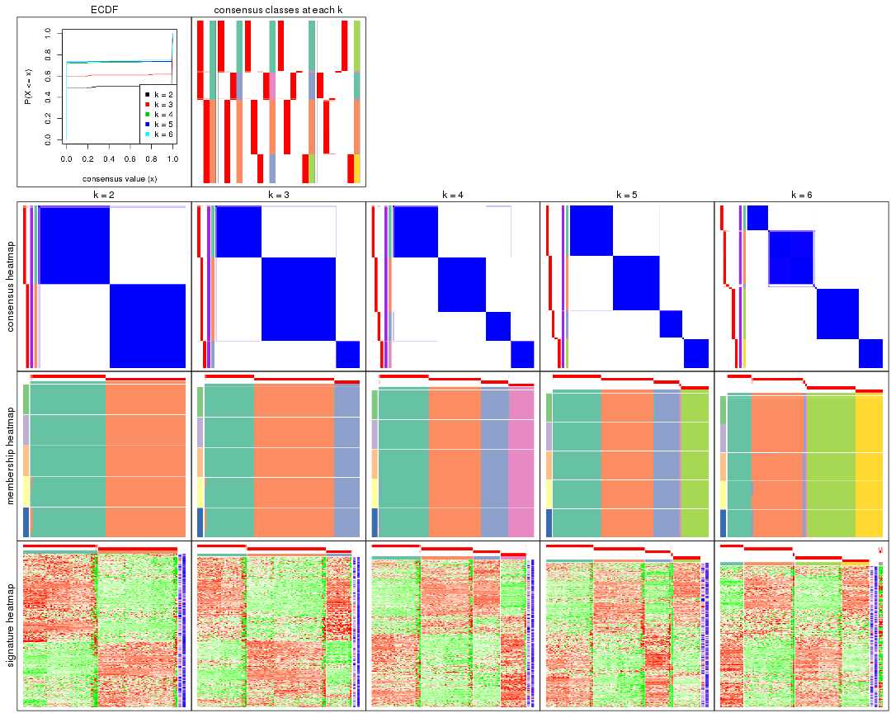

The plots are:

- The first row: a plot of the ECDF (empirical cumulative distribution
  function) curves of the consensus matrix for each `k` and the heatmap of
  predicted classes for each `k`.
- The second row: heatmaps of the consensus matrix for each `k`.
- The third row: heatmaps of the membership matrix for each `k`.
- The fouth row: heatmaps of the signatures for each `k`.

All the plots in panels can be made by individual functions and they are
plotted later in this section.

`select_partition_number()` produces several plots showing different
statistics for choosing "optimized" `k`. There are following statistics:

- ECDF curves of the consensus matrix for each `k`;
- 1-PAC. [The PAC
  score](https://en.wikipedia.org/wiki/Consensus_clustering#Over-interpretation_potential_of_consensus_clustering)
  measures the proportion of the ambiguous subgrouping.
- Mean silhouette score.
- Concordance. The mean probability of fiting the consensus class ids in all
  partitions.
- Area increased. Denote $A_k$ as the area under the ECDF curve for current
  `k`, the area increased is defined as $A_k - A_{k-1}$.
- Rand index. The percent of pairs of samples that are both in a same cluster
  or both are not in a same cluster in the partition of k and k-1.
- Jaccard index. The ratio of pairs of samples are both in a same cluster in
  the partition of k and k-1 and the pairs of samples are both in a same
  cluster in the partition k or k-1.

The detailed explanations of these statistics can be found in [the _cola_
vignette](http://bioconductor.org/packages/devel/bioc/vignettes/cola/inst/doc/cola.html#toc_13).

Generally speaking, lower PAC score, higher mean silhouette score or higher
concordance corresponds to better partition. Rand index and Jaccard index
measure how similar the current partition is compared to partition with `k-1`.
If they are too similar, we won't accept `k` is better than `k-1`.

```r
select_partition_number(res)
```


The numeric values for all these statistics can be obtained by `get_stats()`.

```r
get_stats(res)
```

```
#>   k 1-PAC mean_silhouette concordance area_increased  Rand Jaccard
#> 2 2     1           0.991       0.996        0.50257 0.498   0.498
#> 3 3     1           0.991       0.997        0.21042 0.893   0.785
#> 4 4     1           0.989       0.996        0.19970 0.880   0.693
#> 5 5     1           0.996       0.999        0.00829 0.993   0.975
#> 6 6     1           0.976       0.994        0.01093 0.993   0.973
```

`suggest_best_k()` suggests the best $k$ based on these statistics. The rules are as follows:

- All $k$ with Jaccard index larger than 0.95 are removed because increasing
  $k$ does not provide enough extra information. If all $k$ are removed, it is
  marked as no subgroup is detected.
- For all $k$ with 1-PAC score larger than 0.9, the maximal $k$ is taken as
  the best $k$, and other $k$ are marked as optional $k$.
- If it does not fit the second rule. The $k$ with the maximal vote of the
  highest 1-PAC score, highest mean silhouette, and highest concordance is
  taken as the best $k$.

```r
suggest_best_k(res)
```

```
#> [1] 4
#> attr(,"optional")
#> [1] 2 3
```

There is also optional best $k$ = 2 3 that is worth to check.

Following shows the table of the partitions (You need to click the **show/hide
code output** link to see it). The membership matrix (columns with name `p*`)
is inferred by
[`clue::cl_consensus()`](https://www.rdocumentation.org/link/cl_consensus?package=clue)
function with the `SE` method. Basically the value in the membership matrix
represents the probability to belong to a certain group. The finall class
label for an item is determined with the group with highest probability it
belongs to.

In `get_classes()` function, the entropy is calculated from the membership
matrix and the silhouette score is calculated from the consensus matrix.


<script>
$( function() {
	$( '#tabs-ATC-pam-get-classes' ).tabs();
} );
</script>
<div id='tabs-ATC-pam-get-classes'>
<ul>
<li><a href='#tab-ATC-pam-get-classes-1'>k = 2</a></li>
<li><a href='#tab-ATC-pam-get-classes-2'>k = 3</a></li>
<li><a href='#tab-ATC-pam-get-classes-3'>k = 4</a></li>
<li><a href='#tab-ATC-pam-get-classes-4'>k = 5</a></li>
<li><a href='#tab-ATC-pam-get-classes-5'>k = 6</a></li>
</ul>

<div id='tab-ATC-pam-get-classes-1'>
<p><a id='tab-ATC-pam-get-classes-1-a' style='color:#0366d6' href='#'>show/hide code output</a></p>
<pre><code class="r">cbind(get_classes(res, k = 2), get_membership(res, k = 2))
</code></pre>

<pre><code>#&gt;           class entropy silhouette    p1    p2
#&gt; SRR315112     2   0.000      1.000 0.000 1.000
#&gt; SRR315113     1   0.850      0.627 0.724 0.276
#&gt; SRR315114     1   0.000      0.992 1.000 0.000
#&gt; SRR315115     2   0.000      1.000 0.000 1.000
#&gt; SRR315116     2   0.000      1.000 0.000 1.000
#&gt; SRR566986     2   0.000      1.000 0.000 1.000
#&gt; SRR566987     2   0.000      1.000 0.000 1.000
#&gt; SRR566988     2   0.000      1.000 0.000 1.000
#&gt; SRR566989     2   0.000      1.000 0.000 1.000
#&gt; SRR566990     2   0.000      1.000 0.000 1.000
#&gt; SRR566991     2   0.000      1.000 0.000 1.000
#&gt; SRR566992     2   0.000      1.000 0.000 1.000
#&gt; SRR566993     2   0.000      1.000 0.000 1.000
#&gt; SRR566994     2   0.000      1.000 0.000 1.000
#&gt; SRR566995     2   0.000      1.000 0.000 1.000
#&gt; SRR566996     2   0.000      1.000 0.000 1.000
#&gt; SRR566997     2   0.000      1.000 0.000 1.000
#&gt; SRR566998     2   0.000      1.000 0.000 1.000
#&gt; SRR566999     2   0.000      1.000 0.000 1.000
#&gt; SRR567000     2   0.000      1.000 0.000 1.000
#&gt; SRR567001     2   0.000      1.000 0.000 1.000
#&gt; SRR567002     2   0.000      1.000 0.000 1.000
#&gt; SRR567003     2   0.000      1.000 0.000 1.000
#&gt; SRR567004     2   0.000      1.000 0.000 1.000
#&gt; SRR567005     2   0.000      1.000 0.000 1.000
#&gt; SRR567006     2   0.000      1.000 0.000 1.000
#&gt; SRR567007     2   0.000      1.000 0.000 1.000
#&gt; SRR567008     2   0.000      1.000 0.000 1.000
#&gt; SRR567009     2   0.000      1.000 0.000 1.000
#&gt; SRR567010     2   0.000      1.000 0.000 1.000
#&gt; SRR567011     2   0.000      1.000 0.000 1.000
#&gt; SRR567012     2   0.000      1.000 0.000 1.000
#&gt; SRR567013     2   0.000      1.000 0.000 1.000
#&gt; SRR567014     2   0.000      1.000 0.000 1.000
#&gt; SRR567015     2   0.000      1.000 0.000 1.000
#&gt; SRR567016     2   0.000      1.000 0.000 1.000
#&gt; SRR567017     2   0.000      1.000 0.000 1.000
#&gt; SRR567018     2   0.000      1.000 0.000 1.000
#&gt; SRR567019     2   0.000      1.000 0.000 1.000
#&gt; SRR567020     2   0.000      1.000 0.000 1.000
#&gt; SRR567021     2   0.000      1.000 0.000 1.000
#&gt; SRR567022     2   0.000      1.000 0.000 1.000
#&gt; SRR567023     2   0.000      1.000 0.000 1.000
#&gt; SRR567024     2   0.000      1.000 0.000 1.000
#&gt; SRR567025     2   0.000      1.000 0.000 1.000
#&gt; SRR567026     2   0.000      1.000 0.000 1.000
#&gt; SRR567027     2   0.000      1.000 0.000 1.000
#&gt; SRR567028     2   0.000      1.000 0.000 1.000
#&gt; SRR567029     2   0.000      1.000 0.000 1.000
#&gt; SRR567030     2   0.000      1.000 0.000 1.000
#&gt; SRR567031     2   0.000      1.000 0.000 1.000
#&gt; SRR567032     2   0.000      1.000 0.000 1.000
#&gt; SRR567033     2   0.000      1.000 0.000 1.000
#&gt; SRR567034     2   0.000      1.000 0.000 1.000
#&gt; SRR567035     2   0.000      1.000 0.000 1.000
#&gt; SRR567036     2   0.000      1.000 0.000 1.000
#&gt; SRR567037     2   0.000      1.000 0.000 1.000
#&gt; SRR567038     2   0.000      1.000 0.000 1.000
#&gt; SRR567039     2   0.000      1.000 0.000 1.000
#&gt; SRR567040     2   0.000      1.000 0.000 1.000
#&gt; SRR567041     2   0.000      1.000 0.000 1.000
#&gt; SRR567042     2   0.000      1.000 0.000 1.000
#&gt; SRR567043     2   0.000      1.000 0.000 1.000
#&gt; SRR567044     2   0.000      1.000 0.000 1.000
#&gt; SRR567045     2   0.000      1.000 0.000 1.000
#&gt; SRR567046     2   0.000      1.000 0.000 1.000
#&gt; SRR567047     2   0.000      1.000 0.000 1.000
#&gt; SRR567048     2   0.000      1.000 0.000 1.000
#&gt; SRR567049     2   0.000      1.000 0.000 1.000
#&gt; SRR567050     2   0.000      1.000 0.000 1.000
#&gt; SRR567051     2   0.000      1.000 0.000 1.000
#&gt; SRR567052     2   0.000      1.000 0.000 1.000
#&gt; SRR567053     2   0.000      1.000 0.000 1.000
#&gt; SRR567054     2   0.000      1.000 0.000 1.000
#&gt; SRR567055     2   0.000      1.000 0.000 1.000
#&gt; SRR567056     2   0.000      1.000 0.000 1.000
#&gt; SRR567057     2   0.000      1.000 0.000 1.000
#&gt; SRR567058     2   0.000      1.000 0.000 1.000
#&gt; SRR567059     2   0.000      1.000 0.000 1.000
#&gt; SRR567060     2   0.000      1.000 0.000 1.000
#&gt; SRR567061     2   0.000      1.000 0.000 1.000
#&gt; SRR567062     2   0.000      1.000 0.000 1.000
#&gt; SRR567063     2   0.000      1.000 0.000 1.000
#&gt; SRR567064     2   0.000      1.000 0.000 1.000
#&gt; SRR567065     2   0.000      1.000 0.000 1.000
#&gt; SRR567066     2   0.000      1.000 0.000 1.000
#&gt; SRR567067     2   0.000      1.000 0.000 1.000
#&gt; SRR567068     2   0.000      1.000 0.000 1.000
#&gt; SRR567069     2   0.000      1.000 0.000 1.000
#&gt; SRR567070     2   0.000      1.000 0.000 1.000
#&gt; SRR567071     2   0.000      1.000 0.000 1.000
#&gt; SRR567072     2   0.000      1.000 0.000 1.000
#&gt; SRR567073     2   0.000      1.000 0.000 1.000
#&gt; SRR567074     2   0.000      1.000 0.000 1.000
#&gt; SRR567075     2   0.000      1.000 0.000 1.000
#&gt; SRR567076     1   0.000      0.992 1.000 0.000
#&gt; SRR567077     1   0.000      0.992 1.000 0.000
#&gt; SRR567078     1   0.000      0.992 1.000 0.000
#&gt; SRR567079     1   0.000      0.992 1.000 0.000
#&gt; SRR567080     1   0.000      0.992 1.000 0.000
#&gt; SRR567081     1   0.000      0.992 1.000 0.000
#&gt; SRR567082     1   0.000      0.992 1.000 0.000
#&gt; SRR567083     1   0.000      0.992 1.000 0.000
#&gt; SRR567084     1   0.000      0.992 1.000 0.000
#&gt; SRR567085     1   0.000      0.992 1.000 0.000
#&gt; SRR567086     1   0.000      0.992 1.000 0.000
#&gt; SRR567087     1   0.000      0.992 1.000 0.000
#&gt; SRR567088     1   0.000      0.992 1.000 0.000
#&gt; SRR567089     1   0.000      0.992 1.000 0.000
#&gt; SRR567090     1   0.000      0.992 1.000 0.000
#&gt; SRR567091     1   0.000      0.992 1.000 0.000
#&gt; SRR567092     1   0.000      0.992 1.000 0.000
#&gt; SRR567093     1   0.000      0.992 1.000 0.000
#&gt; SRR567094     1   0.000      0.992 1.000 0.000
#&gt; SRR567095     1   0.000      0.992 1.000 0.000
#&gt; SRR567096     1   0.000      0.992 1.000 0.000
#&gt; SRR567097     1   0.000      0.992 1.000 0.000
#&gt; SRR567098     1   0.000      0.992 1.000 0.000
#&gt; SRR567099     1   0.000      0.992 1.000 0.000
#&gt; SRR567100     1   0.000      0.992 1.000 0.000
#&gt; SRR567101     1   0.000      0.992 1.000 0.000
#&gt; SRR567102     1   0.000      0.992 1.000 0.000
#&gt; SRR567103     1   0.000      0.992 1.000 0.000
#&gt; SRR567104     1   0.000      0.992 1.000 0.000
#&gt; SRR567105     1   0.000      0.992 1.000 0.000
#&gt; SRR567106     1   0.000      0.992 1.000 0.000
#&gt; SRR567107     1   0.000      0.992 1.000 0.000
#&gt; SRR567108     1   0.000      0.992 1.000 0.000
#&gt; SRR567109     1   0.000      0.992 1.000 0.000
#&gt; SRR567110     1   0.000      0.992 1.000 0.000
#&gt; SRR567111     1   0.000      0.992 1.000 0.000
#&gt; SRR567112     1   0.000      0.992 1.000 0.000
#&gt; SRR567113     1   0.000      0.992 1.000 0.000
#&gt; SRR567114     1   0.000      0.992 1.000 0.000
#&gt; SRR567115     1   0.000      0.992 1.000 0.000
#&gt; SRR567116     1   0.000      0.992 1.000 0.000
#&gt; SRR567117     1   0.000      0.992 1.000 0.000
#&gt; SRR567118     1   0.000      0.992 1.000 0.000
#&gt; SRR567119     1   0.000      0.992 1.000 0.000
#&gt; SRR567120     1   0.000      0.992 1.000 0.000
#&gt; SRR567121     1   0.000      0.992 1.000 0.000
#&gt; SRR567122     1   0.000      0.992 1.000 0.000
#&gt; SRR567123     1   0.000      0.992 1.000 0.000
#&gt; SRR567124     1   0.000      0.992 1.000 0.000
#&gt; SRR567125     1   0.000      0.992 1.000 0.000
#&gt; SRR567126     1   0.000      0.992 1.000 0.000
#&gt; SRR567127     1   0.000      0.992 1.000 0.000
#&gt; SRR567128     1   0.000      0.992 1.000 0.000
#&gt; SRR567129     1   0.000      0.992 1.000 0.000
#&gt; SRR567130     1   0.000      0.992 1.000 0.000
#&gt; SRR567131     1   0.000      0.992 1.000 0.000
#&gt; SRR567132     1   0.000      0.992 1.000 0.000
#&gt; SRR567133     1   0.000      0.992 1.000 0.000
#&gt; SRR567134     1   0.000      0.992 1.000 0.000
#&gt; SRR567135     1   0.000      0.992 1.000 0.000
#&gt; SRR567136     1   0.000      0.992 1.000 0.000
#&gt; SRR567137     1   0.000      0.992 1.000 0.000
#&gt; SRR567138     1   0.000      0.992 1.000 0.000
#&gt; SRR567139     1   0.000      0.992 1.000 0.000
#&gt; SRR567140     1   0.000      0.992 1.000 0.000
#&gt; SRR567141     1   0.000      0.992 1.000 0.000
#&gt; SRR567142     1   0.000      0.992 1.000 0.000
#&gt; SRR567143     1   0.000      0.992 1.000 0.000
#&gt; SRR567144     1   0.000      0.992 1.000 0.000
#&gt; SRR567145     1   0.000      0.992 1.000 0.000
#&gt; SRR567146     1   0.706      0.766 0.808 0.192
#&gt; SRR567147     1   0.000      0.992 1.000 0.000
#&gt; SRR567148     1   0.000      0.992 1.000 0.000
#&gt; SRR567149     1   0.000      0.992 1.000 0.000
#&gt; SRR567150     1   0.000      0.992 1.000 0.000
#&gt; SRR567151     1   0.000      0.992 1.000 0.000
#&gt; SRR567152     1   0.000      0.992 1.000 0.000
#&gt; SRR567153     1   0.000      0.992 1.000 0.000
#&gt; SRR567154     1   0.000      0.992 1.000 0.000
#&gt; SRR567155     1   0.000      0.992 1.000 0.000
#&gt; SRR567156     1   0.000      0.992 1.000 0.000
#&gt; SRR567157     1   0.000      0.992 1.000 0.000
#&gt; SRR567158     1   0.000      0.992 1.000 0.000
#&gt; SRR567159     1   0.000      0.992 1.000 0.000
#&gt; SRR567160     1   0.000      0.992 1.000 0.000
#&gt; SRR567161     1   0.788      0.698 0.764 0.236
</code></pre>

<script>
$('#tab-ATC-pam-get-classes-1-a').parent().next().next().hide();
$('#tab-ATC-pam-get-classes-1-a').click(function(){
  $('#tab-ATC-pam-get-classes-1-a').parent().next().next().toggle();
  return(false);
});
</script>
</div>

<div id='tab-ATC-pam-get-classes-2'>
<p><a id='tab-ATC-pam-get-classes-2-a' style='color:#0366d6' href='#'>show/hide code output</a></p>
<pre><code class="r">cbind(get_classes(res, k = 3), get_membership(res, k = 3))
</code></pre>

<pre><code>#&gt;           class entropy silhouette    p1    p2  p3
#&gt; SRR315112     2   0.000      1.000 0.000 1.000 0.0
#&gt; SRR315113     3   0.455      0.748 0.200 0.000 0.8
#&gt; SRR315114     3   0.000      0.993 0.000 0.000 1.0
#&gt; SRR315115     2   0.000      1.000 0.000 1.000 0.0
#&gt; SRR315116     2   0.000      1.000 0.000 1.000 0.0
#&gt; SRR566986     2   0.000      1.000 0.000 1.000 0.0
#&gt; SRR566987     2   0.000      1.000 0.000 1.000 0.0
#&gt; SRR566988     2   0.000      1.000 0.000 1.000 0.0
#&gt; SRR566989     2   0.000      1.000 0.000 1.000 0.0
#&gt; SRR566990     2   0.000      1.000 0.000 1.000 0.0
#&gt; SRR566991     2   0.000      1.000 0.000 1.000 0.0
#&gt; SRR566992     2   0.000      1.000 0.000 1.000 0.0
#&gt; SRR566993     2   0.000      1.000 0.000 1.000 0.0
#&gt; SRR566994     2   0.000      1.000 0.000 1.000 0.0
#&gt; SRR566995     2   0.000      1.000 0.000 1.000 0.0
#&gt; SRR566996     2   0.000      1.000 0.000 1.000 0.0
#&gt; SRR566997     2   0.000      1.000 0.000 1.000 0.0
#&gt; SRR566998     2   0.000      1.000 0.000 1.000 0.0
#&gt; SRR566999     2   0.000      1.000 0.000 1.000 0.0
#&gt; SRR567000     2   0.000      1.000 0.000 1.000 0.0
#&gt; SRR567001     2   0.000      1.000 0.000 1.000 0.0
#&gt; SRR567002     2   0.000      1.000 0.000 1.000 0.0
#&gt; SRR567003     2   0.000      1.000 0.000 1.000 0.0
#&gt; SRR567004     2   0.000      1.000 0.000 1.000 0.0
#&gt; SRR567005     2   0.000      1.000 0.000 1.000 0.0
#&gt; SRR567006     2   0.000      1.000 0.000 1.000 0.0
#&gt; SRR567007     2   0.000      1.000 0.000 1.000 0.0
#&gt; SRR567008     2   0.000      1.000 0.000 1.000 0.0
#&gt; SRR567009     2   0.000      1.000 0.000 1.000 0.0
#&gt; SRR567010     2   0.000      1.000 0.000 1.000 0.0
#&gt; SRR567011     2   0.000      1.000 0.000 1.000 0.0
#&gt; SRR567012     2   0.000      1.000 0.000 1.000 0.0
#&gt; SRR567013     2   0.000      1.000 0.000 1.000 0.0
#&gt; SRR567014     2   0.000      1.000 0.000 1.000 0.0
#&gt; SRR567015     2   0.000      1.000 0.000 1.000 0.0
#&gt; SRR567016     2   0.000      1.000 0.000 1.000 0.0
#&gt; SRR567017     2   0.000      1.000 0.000 1.000 0.0
#&gt; SRR567018     2   0.000      1.000 0.000 1.000 0.0
#&gt; SRR567019     2   0.000      1.000 0.000 1.000 0.0
#&gt; SRR567020     2   0.000      1.000 0.000 1.000 0.0
#&gt; SRR567021     2   0.000      1.000 0.000 1.000 0.0
#&gt; SRR567022     2   0.000      1.000 0.000 1.000 0.0
#&gt; SRR567023     2   0.000      1.000 0.000 1.000 0.0
#&gt; SRR567024     2   0.000      1.000 0.000 1.000 0.0
#&gt; SRR567025     2   0.000      1.000 0.000 1.000 0.0
#&gt; SRR567026     2   0.000      1.000 0.000 1.000 0.0
#&gt; SRR567027     2   0.000      1.000 0.000 1.000 0.0
#&gt; SRR567028     2   0.000      1.000 0.000 1.000 0.0
#&gt; SRR567029     2   0.000      1.000 0.000 1.000 0.0
#&gt; SRR567030     2   0.000      1.000 0.000 1.000 0.0
#&gt; SRR567031     2   0.000      1.000 0.000 1.000 0.0
#&gt; SRR567032     2   0.000      1.000 0.000 1.000 0.0
#&gt; SRR567033     2   0.000      1.000 0.000 1.000 0.0
#&gt; SRR567034     2   0.000      1.000 0.000 1.000 0.0
#&gt; SRR567035     2   0.000      1.000 0.000 1.000 0.0
#&gt; SRR567036     2   0.000      1.000 0.000 1.000 0.0
#&gt; SRR567037     2   0.000      1.000 0.000 1.000 0.0
#&gt; SRR567038     2   0.000      1.000 0.000 1.000 0.0
#&gt; SRR567039     2   0.000      1.000 0.000 1.000 0.0
#&gt; SRR567040     2   0.000      1.000 0.000 1.000 0.0
#&gt; SRR567041     2   0.000      1.000 0.000 1.000 0.0
#&gt; SRR567042     2   0.000      1.000 0.000 1.000 0.0
#&gt; SRR567043     2   0.000      1.000 0.000 1.000 0.0
#&gt; SRR567044     2   0.000      1.000 0.000 1.000 0.0
#&gt; SRR567045     2   0.000      1.000 0.000 1.000 0.0
#&gt; SRR567046     2   0.000      1.000 0.000 1.000 0.0
#&gt; SRR567047     2   0.000      1.000 0.000 1.000 0.0
#&gt; SRR567048     2   0.000      1.000 0.000 1.000 0.0
#&gt; SRR567049     2   0.000      1.000 0.000 1.000 0.0
#&gt; SRR567050     2   0.000      1.000 0.000 1.000 0.0
#&gt; SRR567051     2   0.000      1.000 0.000 1.000 0.0
#&gt; SRR567052     2   0.000      1.000 0.000 1.000 0.0
#&gt; SRR567053     2   0.000      1.000 0.000 1.000 0.0
#&gt; SRR567054     2   0.000      1.000 0.000 1.000 0.0
#&gt; SRR567055     2   0.000      1.000 0.000 1.000 0.0
#&gt; SRR567056     2   0.000      1.000 0.000 1.000 0.0
#&gt; SRR567057     2   0.000      1.000 0.000 1.000 0.0
#&gt; SRR567058     2   0.000      1.000 0.000 1.000 0.0
#&gt; SRR567059     2   0.000      1.000 0.000 1.000 0.0
#&gt; SRR567060     2   0.000      1.000 0.000 1.000 0.0
#&gt; SRR567061     2   0.000      1.000 0.000 1.000 0.0
#&gt; SRR567062     2   0.000      1.000 0.000 1.000 0.0
#&gt; SRR567063     2   0.000      1.000 0.000 1.000 0.0
#&gt; SRR567064     2   0.000      1.000 0.000 1.000 0.0
#&gt; SRR567065     2   0.000      1.000 0.000 1.000 0.0
#&gt; SRR567066     2   0.000      1.000 0.000 1.000 0.0
#&gt; SRR567067     2   0.000      1.000 0.000 1.000 0.0
#&gt; SRR567068     2   0.000      1.000 0.000 1.000 0.0
#&gt; SRR567069     2   0.000      1.000 0.000 1.000 0.0
#&gt; SRR567070     2   0.000      1.000 0.000 1.000 0.0
#&gt; SRR567071     2   0.000      1.000 0.000 1.000 0.0
#&gt; SRR567072     2   0.000      1.000 0.000 1.000 0.0
#&gt; SRR567073     2   0.000      1.000 0.000 1.000 0.0
#&gt; SRR567074     2   0.000      1.000 0.000 1.000 0.0
#&gt; SRR567075     2   0.000      1.000 0.000 1.000 0.0
#&gt; SRR567076     1   0.000      0.990 1.000 0.000 0.0
#&gt; SRR567077     1   0.000      0.990 1.000 0.000 0.0
#&gt; SRR567078     1   0.000      0.990 1.000 0.000 0.0
#&gt; SRR567079     1   0.000      0.990 1.000 0.000 0.0
#&gt; SRR567080     1   0.000      0.990 1.000 0.000 0.0
#&gt; SRR567081     1   0.000      0.990 1.000 0.000 0.0
#&gt; SRR567082     1   0.000      0.990 1.000 0.000 0.0
#&gt; SRR567083     1   0.000      0.990 1.000 0.000 0.0
#&gt; SRR567084     1   0.000      0.990 1.000 0.000 0.0
#&gt; SRR567085     1   0.000      0.990 1.000 0.000 0.0
#&gt; SRR567086     1   0.000      0.990 1.000 0.000 0.0
#&gt; SRR567087     1   0.000      0.990 1.000 0.000 0.0
#&gt; SRR567088     1   0.000      0.990 1.000 0.000 0.0
#&gt; SRR567089     1   0.000      0.990 1.000 0.000 0.0
#&gt; SRR567090     1   0.000      0.990 1.000 0.000 0.0
#&gt; SRR567091     1   0.000      0.990 1.000 0.000 0.0
#&gt; SRR567092     1   0.000      0.990 1.000 0.000 0.0
#&gt; SRR567093     1   0.000      0.990 1.000 0.000 0.0
#&gt; SRR567094     1   0.000      0.990 1.000 0.000 0.0
#&gt; SRR567095     1   0.000      0.990 1.000 0.000 0.0
#&gt; SRR567096     1   0.000      0.990 1.000 0.000 0.0
#&gt; SRR567097     1   0.000      0.990 1.000 0.000 0.0
#&gt; SRR567098     1   0.000      0.990 1.000 0.000 0.0
#&gt; SRR567099     1   0.000      0.990 1.000 0.000 0.0
#&gt; SRR567100     1   0.000      0.990 1.000 0.000 0.0
#&gt; SRR567101     1   0.000      0.990 1.000 0.000 0.0
#&gt; SRR567102     1   0.000      0.990 1.000 0.000 0.0
#&gt; SRR567103     1   0.000      0.990 1.000 0.000 0.0
#&gt; SRR567104     1   0.000      0.990 1.000 0.000 0.0
#&gt; SRR567105     1   0.000      0.990 1.000 0.000 0.0
#&gt; SRR567106     3   0.000      0.993 0.000 0.000 1.0
#&gt; SRR567107     3   0.000      0.993 0.000 0.000 1.0
#&gt; SRR567108     3   0.000      0.993 0.000 0.000 1.0
#&gt; SRR567109     3   0.000      0.993 0.000 0.000 1.0
#&gt; SRR567110     3   0.000      0.993 0.000 0.000 1.0
#&gt; SRR567111     3   0.000      0.993 0.000 0.000 1.0
#&gt; SRR567112     3   0.000      0.993 0.000 0.000 1.0
#&gt; SRR567113     3   0.000      0.993 0.000 0.000 1.0
#&gt; SRR567114     3   0.000      0.993 0.000 0.000 1.0
#&gt; SRR567115     3   0.000      0.993 0.000 0.000 1.0
#&gt; SRR567116     3   0.000      0.993 0.000 0.000 1.0
#&gt; SRR567117     3   0.000      0.993 0.000 0.000 1.0
#&gt; SRR567118     3   0.000      0.993 0.000 0.000 1.0
#&gt; SRR567119     3   0.000      0.993 0.000 0.000 1.0
#&gt; SRR567120     3   0.000      0.993 0.000 0.000 1.0
#&gt; SRR567121     3   0.000      0.993 0.000 0.000 1.0
#&gt; SRR567122     3   0.000      0.993 0.000 0.000 1.0
#&gt; SRR567123     3   0.000      0.993 0.000 0.000 1.0
#&gt; SRR567124     3   0.000      0.993 0.000 0.000 1.0
#&gt; SRR567125     3   0.000      0.993 0.000 0.000 1.0
#&gt; SRR567126     3   0.000      0.993 0.000 0.000 1.0
#&gt; SRR567127     3   0.000      0.993 0.000 0.000 1.0
#&gt; SRR567128     3   0.000      0.993 0.000 0.000 1.0
#&gt; SRR567129     3   0.000      0.993 0.000 0.000 1.0
#&gt; SRR567130     3   0.000      0.993 0.000 0.000 1.0
#&gt; SRR567131     3   0.000      0.993 0.000 0.000 1.0
#&gt; SRR567132     3   0.000      0.993 0.000 0.000 1.0
#&gt; SRR567133     3   0.000      0.993 0.000 0.000 1.0
#&gt; SRR567134     1   0.000      0.990 1.000 0.000 0.0
#&gt; SRR567135     1   0.000      0.990 1.000 0.000 0.0
#&gt; SRR567136     1   0.000      0.990 1.000 0.000 0.0
#&gt; SRR567137     1   0.000      0.990 1.000 0.000 0.0
#&gt; SRR567138     1   0.000      0.990 1.000 0.000 0.0
#&gt; SRR567139     1   0.000      0.990 1.000 0.000 0.0
#&gt; SRR567140     1   0.000      0.990 1.000 0.000 0.0
#&gt; SRR567141     1   0.000      0.990 1.000 0.000 0.0
#&gt; SRR567142     1   0.000      0.990 1.000 0.000 0.0
#&gt; SRR567143     1   0.000      0.990 1.000 0.000 0.0
#&gt; SRR567144     1   0.000      0.990 1.000 0.000 0.0
#&gt; SRR567145     1   0.000      0.990 1.000 0.000 0.0
#&gt; SRR567146     1   0.440      0.729 0.812 0.188 0.0
#&gt; SRR567147     1   0.000      0.990 1.000 0.000 0.0
#&gt; SRR567148     1   0.000      0.990 1.000 0.000 0.0
#&gt; SRR567149     1   0.000      0.990 1.000 0.000 0.0
#&gt; SRR567150     1   0.000      0.990 1.000 0.000 0.0
#&gt; SRR567151     1   0.000      0.990 1.000 0.000 0.0
#&gt; SRR567152     1   0.000      0.990 1.000 0.000 0.0
#&gt; SRR567153     1   0.000      0.990 1.000 0.000 0.0
#&gt; SRR567154     1   0.000      0.990 1.000 0.000 0.0
#&gt; SRR567155     1   0.000      0.990 1.000 0.000 0.0
#&gt; SRR567156     1   0.000      0.990 1.000 0.000 0.0
#&gt; SRR567157     1   0.000      0.990 1.000 0.000 0.0
#&gt; SRR567158     1   0.000      0.990 1.000 0.000 0.0
#&gt; SRR567159     1   0.000      0.990 1.000 0.000 0.0
#&gt; SRR567160     1   0.000      0.990 1.000 0.000 0.0
#&gt; SRR567161     1   0.484      0.673 0.776 0.224 0.0
</code></pre>

<script>
$('#tab-ATC-pam-get-classes-2-a').parent().next().next().hide();
$('#tab-ATC-pam-get-classes-2-a').click(function(){
  $('#tab-ATC-pam-get-classes-2-a').parent().next().next().toggle();
  return(false);
});
</script>
</div>

<div id='tab-ATC-pam-get-classes-3'>
<p><a id='tab-ATC-pam-get-classes-3-a' style='color:#0366d6' href='#'>show/hide code output</a></p>
<pre><code class="r">cbind(get_classes(res, k = 4), get_membership(res, k = 4))
</code></pre>

<pre><code>#&gt;           class entropy silhouette    p1    p2    p3  p4
#&gt; SRR315112     2   0.000      1.000 0.000 1.000 0.000 0.0
#&gt; SRR315113     4   0.361      0.744 0.200 0.000 0.000 0.8
#&gt; SRR315114     4   0.000      0.992 0.000 0.000 0.000 1.0
#&gt; SRR315115     2   0.000      1.000 0.000 1.000 0.000 0.0
#&gt; SRR315116     2   0.000      1.000 0.000 1.000 0.000 0.0
#&gt; SRR566986     2   0.000      1.000 0.000 1.000 0.000 0.0
#&gt; SRR566987     2   0.000      1.000 0.000 1.000 0.000 0.0
#&gt; SRR566988     2   0.000      1.000 0.000 1.000 0.000 0.0
#&gt; SRR566989     2   0.000      1.000 0.000 1.000 0.000 0.0
#&gt; SRR566990     2   0.000      1.000 0.000 1.000 0.000 0.0
#&gt; SRR566991     2   0.000      1.000 0.000 1.000 0.000 0.0
#&gt; SRR566992     2   0.000      1.000 0.000 1.000 0.000 0.0
#&gt; SRR566993     2   0.000      1.000 0.000 1.000 0.000 0.0
#&gt; SRR566994     2   0.000      1.000 0.000 1.000 0.000 0.0
#&gt; SRR566995     2   0.000      1.000 0.000 1.000 0.000 0.0
#&gt; SRR566996     2   0.000      1.000 0.000 1.000 0.000 0.0
#&gt; SRR566997     2   0.000      1.000 0.000 1.000 0.000 0.0
#&gt; SRR566998     2   0.000      1.000 0.000 1.000 0.000 0.0
#&gt; SRR566999     2   0.000      1.000 0.000 1.000 0.000 0.0
#&gt; SRR567000     2   0.000      1.000 0.000 1.000 0.000 0.0
#&gt; SRR567001     2   0.000      1.000 0.000 1.000 0.000 0.0
#&gt; SRR567002     2   0.000      1.000 0.000 1.000 0.000 0.0
#&gt; SRR567003     2   0.000      1.000 0.000 1.000 0.000 0.0
#&gt; SRR567004     2   0.000      1.000 0.000 1.000 0.000 0.0
#&gt; SRR567005     2   0.000      1.000 0.000 1.000 0.000 0.0
#&gt; SRR567006     2   0.000      1.000 0.000 1.000 0.000 0.0
#&gt; SRR567007     2   0.000      1.000 0.000 1.000 0.000 0.0
#&gt; SRR567008     2   0.000      1.000 0.000 1.000 0.000 0.0
#&gt; SRR567009     2   0.000      1.000 0.000 1.000 0.000 0.0
#&gt; SRR567010     2   0.000      1.000 0.000 1.000 0.000 0.0
#&gt; SRR567011     2   0.000      1.000 0.000 1.000 0.000 0.0
#&gt; SRR567012     2   0.000      1.000 0.000 1.000 0.000 0.0
#&gt; SRR567013     2   0.000      1.000 0.000 1.000 0.000 0.0
#&gt; SRR567014     2   0.000      1.000 0.000 1.000 0.000 0.0
#&gt; SRR567015     2   0.000      1.000 0.000 1.000 0.000 0.0
#&gt; SRR567016     2   0.000      1.000 0.000 1.000 0.000 0.0
#&gt; SRR567017     2   0.000      1.000 0.000 1.000 0.000 0.0
#&gt; SRR567018     2   0.000      1.000 0.000 1.000 0.000 0.0
#&gt; SRR567019     2   0.000      1.000 0.000 1.000 0.000 0.0
#&gt; SRR567020     2   0.000      1.000 0.000 1.000 0.000 0.0
#&gt; SRR567021     2   0.000      1.000 0.000 1.000 0.000 0.0
#&gt; SRR567022     2   0.000      1.000 0.000 1.000 0.000 0.0
#&gt; SRR567023     2   0.000      1.000 0.000 1.000 0.000 0.0
#&gt; SRR567024     2   0.000      1.000 0.000 1.000 0.000 0.0
#&gt; SRR567025     2   0.000      1.000 0.000 1.000 0.000 0.0
#&gt; SRR567026     2   0.000      1.000 0.000 1.000 0.000 0.0
#&gt; SRR567027     2   0.000      1.000 0.000 1.000 0.000 0.0
#&gt; SRR567028     2   0.000      1.000 0.000 1.000 0.000 0.0
#&gt; SRR567029     2   0.000      1.000 0.000 1.000 0.000 0.0
#&gt; SRR567030     2   0.000      1.000 0.000 1.000 0.000 0.0
#&gt; SRR567031     2   0.000      1.000 0.000 1.000 0.000 0.0
#&gt; SRR567032     2   0.000      1.000 0.000 1.000 0.000 0.0
#&gt; SRR567033     2   0.000      1.000 0.000 1.000 0.000 0.0
#&gt; SRR567034     2   0.000      1.000 0.000 1.000 0.000 0.0
#&gt; SRR567035     2   0.000      1.000 0.000 1.000 0.000 0.0
#&gt; SRR567036     2   0.000      1.000 0.000 1.000 0.000 0.0
#&gt; SRR567037     2   0.000      1.000 0.000 1.000 0.000 0.0
#&gt; SRR567038     2   0.000      1.000 0.000 1.000 0.000 0.0
#&gt; SRR567039     2   0.000      1.000 0.000 1.000 0.000 0.0
#&gt; SRR567040     2   0.000      1.000 0.000 1.000 0.000 0.0
#&gt; SRR567041     2   0.000      1.000 0.000 1.000 0.000 0.0
#&gt; SRR567042     2   0.000      1.000 0.000 1.000 0.000 0.0
#&gt; SRR567043     2   0.000      1.000 0.000 1.000 0.000 0.0
#&gt; SRR567044     3   0.000      1.000 0.000 0.000 1.000 0.0
#&gt; SRR567045     3   0.000      1.000 0.000 0.000 1.000 0.0
#&gt; SRR567046     3   0.000      1.000 0.000 0.000 1.000 0.0
#&gt; SRR567047     3   0.000      1.000 0.000 0.000 1.000 0.0
#&gt; SRR567048     3   0.000      1.000 0.000 0.000 1.000 0.0
#&gt; SRR567049     3   0.000      1.000 0.000 0.000 1.000 0.0
#&gt; SRR567050     3   0.000      1.000 0.000 0.000 1.000 0.0
#&gt; SRR567051     3   0.000      1.000 0.000 0.000 1.000 0.0
#&gt; SRR567052     3   0.000      1.000 0.000 0.000 1.000 0.0
#&gt; SRR567053     3   0.000      1.000 0.000 0.000 1.000 0.0
#&gt; SRR567054     3   0.000      1.000 0.000 0.000 1.000 0.0
#&gt; SRR567055     3   0.000      1.000 0.000 0.000 1.000 0.0
#&gt; SRR567056     3   0.000      1.000 0.000 0.000 1.000 0.0
#&gt; SRR567057     3   0.000      1.000 0.000 0.000 1.000 0.0
#&gt; SRR567058     3   0.000      1.000 0.000 0.000 1.000 0.0
#&gt; SRR567059     3   0.000      1.000 0.000 0.000 1.000 0.0
#&gt; SRR567060     3   0.000      1.000 0.000 0.000 1.000 0.0
#&gt; SRR567061     3   0.000      1.000 0.000 0.000 1.000 0.0
#&gt; SRR567062     3   0.000      1.000 0.000 0.000 1.000 0.0
#&gt; SRR567063     3   0.000      1.000 0.000 0.000 1.000 0.0
#&gt; SRR567064     3   0.000      1.000 0.000 0.000 1.000 0.0
#&gt; SRR567065     3   0.000      1.000 0.000 0.000 1.000 0.0
#&gt; SRR567066     3   0.000      1.000 0.000 0.000 1.000 0.0
#&gt; SRR567067     3   0.000      1.000 0.000 0.000 1.000 0.0
#&gt; SRR567068     3   0.000      1.000 0.000 0.000 1.000 0.0
#&gt; SRR567069     3   0.000      1.000 0.000 0.000 1.000 0.0
#&gt; SRR567070     3   0.000      1.000 0.000 0.000 1.000 0.0
#&gt; SRR567071     3   0.000      1.000 0.000 0.000 1.000 0.0
#&gt; SRR567072     3   0.000      1.000 0.000 0.000 1.000 0.0
#&gt; SRR567073     3   0.000      1.000 0.000 0.000 1.000 0.0
#&gt; SRR567074     3   0.000      1.000 0.000 0.000 1.000 0.0
#&gt; SRR567075     3   0.000      1.000 0.000 0.000 1.000 0.0
#&gt; SRR567076     1   0.000      0.989 1.000 0.000 0.000 0.0
#&gt; SRR567077     1   0.000      0.989 1.000 0.000 0.000 0.0
#&gt; SRR567078     1   0.000      0.989 1.000 0.000 0.000 0.0
#&gt; SRR567079     1   0.000      0.989 1.000 0.000 0.000 0.0
#&gt; SRR567080     1   0.000      0.989 1.000 0.000 0.000 0.0
#&gt; SRR567081     1   0.000      0.989 1.000 0.000 0.000 0.0
#&gt; SRR567082     1   0.000      0.989 1.000 0.000 0.000 0.0
#&gt; SRR567083     1   0.000      0.989 1.000 0.000 0.000 0.0
#&gt; SRR567084     1   0.000      0.989 1.000 0.000 0.000 0.0
#&gt; SRR567085     1   0.000      0.989 1.000 0.000 0.000 0.0
#&gt; SRR567086     1   0.000      0.989 1.000 0.000 0.000 0.0
#&gt; SRR567087     1   0.000      0.989 1.000 0.000 0.000 0.0
#&gt; SRR567088     1   0.000      0.989 1.000 0.000 0.000 0.0
#&gt; SRR567089     1   0.000      0.989 1.000 0.000 0.000 0.0
#&gt; SRR567090     1   0.000      0.989 1.000 0.000 0.000 0.0
#&gt; SRR567091     1   0.000      0.989 1.000 0.000 0.000 0.0
#&gt; SRR567092     1   0.000      0.989 1.000 0.000 0.000 0.0
#&gt; SRR567093     1   0.000      0.989 1.000 0.000 0.000 0.0
#&gt; SRR567094     1   0.000      0.989 1.000 0.000 0.000 0.0
#&gt; SRR567095     1   0.000      0.989 1.000 0.000 0.000 0.0
#&gt; SRR567096     1   0.000      0.989 1.000 0.000 0.000 0.0
#&gt; SRR567097     1   0.000      0.989 1.000 0.000 0.000 0.0
#&gt; SRR567098     1   0.000      0.989 1.000 0.000 0.000 0.0
#&gt; SRR567099     1   0.000      0.989 1.000 0.000 0.000 0.0
#&gt; SRR567100     1   0.000      0.989 1.000 0.000 0.000 0.0
#&gt; SRR567101     1   0.000      0.989 1.000 0.000 0.000 0.0
#&gt; SRR567102     1   0.000      0.989 1.000 0.000 0.000 0.0
#&gt; SRR567103     1   0.000      0.989 1.000 0.000 0.000 0.0
#&gt; SRR567104     1   0.000      0.989 1.000 0.000 0.000 0.0
#&gt; SRR567105     1   0.000      0.989 1.000 0.000 0.000 0.0
#&gt; SRR567106     4   0.000      0.992 0.000 0.000 0.000 1.0
#&gt; SRR567107     4   0.000      0.992 0.000 0.000 0.000 1.0
#&gt; SRR567108     4   0.000      0.992 0.000 0.000 0.000 1.0
#&gt; SRR567109     4   0.000      0.992 0.000 0.000 0.000 1.0
#&gt; SRR567110     4   0.000      0.992 0.000 0.000 0.000 1.0
#&gt; SRR567111     4   0.000      0.992 0.000 0.000 0.000 1.0
#&gt; SRR567112     4   0.000      0.992 0.000 0.000 0.000 1.0
#&gt; SRR567113     4   0.000      0.992 0.000 0.000 0.000 1.0
#&gt; SRR567114     4   0.000      0.992 0.000 0.000 0.000 1.0
#&gt; SRR567115     4   0.000      0.992 0.000 0.000 0.000 1.0
#&gt; SRR567116     4   0.000      0.992 0.000 0.000 0.000 1.0
#&gt; SRR567117     4   0.000      0.992 0.000 0.000 0.000 1.0
#&gt; SRR567118     4   0.000      0.992 0.000 0.000 0.000 1.0
#&gt; SRR567119     4   0.000      0.992 0.000 0.000 0.000 1.0
#&gt; SRR567120     4   0.000      0.992 0.000 0.000 0.000 1.0
#&gt; SRR567121     4   0.000      0.992 0.000 0.000 0.000 1.0
#&gt; SRR567122     4   0.000      0.992 0.000 0.000 0.000 1.0
#&gt; SRR567123     4   0.000      0.992 0.000 0.000 0.000 1.0
#&gt; SRR567124     4   0.000      0.992 0.000 0.000 0.000 1.0
#&gt; SRR567125     4   0.000      0.992 0.000 0.000 0.000 1.0
#&gt; SRR567126     4   0.000      0.992 0.000 0.000 0.000 1.0
#&gt; SRR567127     4   0.000      0.992 0.000 0.000 0.000 1.0
#&gt; SRR567128     4   0.000      0.992 0.000 0.000 0.000 1.0
#&gt; SRR567129     4   0.000      0.992 0.000 0.000 0.000 1.0
#&gt; SRR567130     4   0.000      0.992 0.000 0.000 0.000 1.0
#&gt; SRR567131     4   0.000      0.992 0.000 0.000 0.000 1.0
#&gt; SRR567132     4   0.000      0.992 0.000 0.000 0.000 1.0
#&gt; SRR567133     4   0.000      0.992 0.000 0.000 0.000 1.0
#&gt; SRR567134     1   0.000      0.989 1.000 0.000 0.000 0.0
#&gt; SRR567135     1   0.000      0.989 1.000 0.000 0.000 0.0
#&gt; SRR567136     1   0.000      0.989 1.000 0.000 0.000 0.0
#&gt; SRR567137     1   0.000      0.989 1.000 0.000 0.000 0.0
#&gt; SRR567138     1   0.000      0.989 1.000 0.000 0.000 0.0
#&gt; SRR567139     1   0.000      0.989 1.000 0.000 0.000 0.0
#&gt; SRR567140     1   0.000      0.989 1.000 0.000 0.000 0.0
#&gt; SRR567141     1   0.000      0.989 1.000 0.000 0.000 0.0
#&gt; SRR567142     1   0.000      0.989 1.000 0.000 0.000 0.0
#&gt; SRR567143     1   0.000      0.989 1.000 0.000 0.000 0.0
#&gt; SRR567144     1   0.000      0.989 1.000 0.000 0.000 0.0
#&gt; SRR567145     1   0.000      0.989 1.000 0.000 0.000 0.0
#&gt; SRR567146     1   0.484      0.639 0.724 0.024 0.252 0.0
#&gt; SRR567147     1   0.000      0.989 1.000 0.000 0.000 0.0
#&gt; SRR567148     1   0.000      0.989 1.000 0.000 0.000 0.0
#&gt; SRR567149     1   0.000      0.989 1.000 0.000 0.000 0.0
#&gt; SRR567150     1   0.000      0.989 1.000 0.000 0.000 0.0
#&gt; SRR567151     1   0.000      0.989 1.000 0.000 0.000 0.0
#&gt; SRR567152     1   0.000      0.989 1.000 0.000 0.000 0.0
#&gt; SRR567153     1   0.000      0.989 1.000 0.000 0.000 0.0
#&gt; SRR567154     1   0.000      0.989 1.000 0.000 0.000 0.0
#&gt; SRR567155     1   0.000      0.989 1.000 0.000 0.000 0.0
#&gt; SRR567156     1   0.000      0.989 1.000 0.000 0.000 0.0
#&gt; SRR567157     1   0.000      0.989 1.000 0.000 0.000 0.0
#&gt; SRR567158     1   0.000      0.989 1.000 0.000 0.000 0.0
#&gt; SRR567159     1   0.000      0.989 1.000 0.000 0.000 0.0
#&gt; SRR567160     1   0.000      0.989 1.000 0.000 0.000 0.0
#&gt; SRR567161     1   0.470      0.532 0.676 0.004 0.320 0.0
</code></pre>

<script>
$('#tab-ATC-pam-get-classes-3-a').parent().next().next().hide();
$('#tab-ATC-pam-get-classes-3-a').click(function(){
  $('#tab-ATC-pam-get-classes-3-a').parent().next().next().toggle();
  return(false);
});
</script>
</div>

<div id='tab-ATC-pam-get-classes-4'>
<p><a id='tab-ATC-pam-get-classes-4-a' style='color:#0366d6' href='#'>show/hide code output</a></p>
<pre><code class="r">cbind(get_classes(res, k = 5), get_membership(res, k = 5))
</code></pre>

<pre><code>#&gt;           class entropy silhouette  p1 p2  p3 p4 p5
#&gt; SRR315112     2   0.000      1.000 0.0  1 0.0  0  0
#&gt; SRR315113     3   0.311      0.620 0.2  0 0.8  0  0
#&gt; SRR315114     3   0.000      0.989 0.0  0 1.0  0  0
#&gt; SRR315115     2   0.000      1.000 0.0  1 0.0  0  0
#&gt; SRR315116     2   0.000      1.000 0.0  1 0.0  0  0
#&gt; SRR566986     2   0.000      1.000 0.0  1 0.0  0  0
#&gt; SRR566987     2   0.000      1.000 0.0  1 0.0  0  0
#&gt; SRR566988     2   0.000      1.000 0.0  1 0.0  0  0
#&gt; SRR566989     2   0.000      1.000 0.0  1 0.0  0  0
#&gt; SRR566990     2   0.000      1.000 0.0  1 0.0  0  0
#&gt; SRR566991     2   0.000      1.000 0.0  1 0.0  0  0
#&gt; SRR566992     2   0.000      1.000 0.0  1 0.0  0  0
#&gt; SRR566993     2   0.000      1.000 0.0  1 0.0  0  0
#&gt; SRR566994     2   0.000      1.000 0.0  1 0.0  0  0
#&gt; SRR566995     2   0.000      1.000 0.0  1 0.0  0  0
#&gt; SRR566996     2   0.000      1.000 0.0  1 0.0  0  0
#&gt; SRR566997     2   0.000      1.000 0.0  1 0.0  0  0
#&gt; SRR566998     2   0.000      1.000 0.0  1 0.0  0  0
#&gt; SRR566999     2   0.000      1.000 0.0  1 0.0  0  0
#&gt; SRR567000     2   0.000      1.000 0.0  1 0.0  0  0
#&gt; SRR567001     2   0.000      1.000 0.0  1 0.0  0  0
#&gt; SRR567002     2   0.000      1.000 0.0  1 0.0  0  0
#&gt; SRR567003     2   0.000      1.000 0.0  1 0.0  0  0
#&gt; SRR567004     2   0.000      1.000 0.0  1 0.0  0  0
#&gt; SRR567005     2   0.000      1.000 0.0  1 0.0  0  0
#&gt; SRR567006     2   0.000      1.000 0.0  1 0.0  0  0
#&gt; SRR567007     2   0.000      1.000 0.0  1 0.0  0  0
#&gt; SRR567008     2   0.000      1.000 0.0  1 0.0  0  0
#&gt; SRR567009     2   0.000      1.000 0.0  1 0.0  0  0
#&gt; SRR567010     2   0.000      1.000 0.0  1 0.0  0  0
#&gt; SRR567011     2   0.000      1.000 0.0  1 0.0  0  0
#&gt; SRR567012     2   0.000      1.000 0.0  1 0.0  0  0
#&gt; SRR567013     2   0.000      1.000 0.0  1 0.0  0  0
#&gt; SRR567014     2   0.000      1.000 0.0  1 0.0  0  0
#&gt; SRR567015     2   0.000      1.000 0.0  1 0.0  0  0
#&gt; SRR567016     2   0.000      1.000 0.0  1 0.0  0  0
#&gt; SRR567017     2   0.000      1.000 0.0  1 0.0  0  0
#&gt; SRR567018     2   0.000      1.000 0.0  1 0.0  0  0
#&gt; SRR567019     2   0.000      1.000 0.0  1 0.0  0  0
#&gt; SRR567020     2   0.000      1.000 0.0  1 0.0  0  0
#&gt; SRR567021     2   0.000      1.000 0.0  1 0.0  0  0
#&gt; SRR567022     2   0.000      1.000 0.0  1 0.0  0  0
#&gt; SRR567023     2   0.000      1.000 0.0  1 0.0  0  0
#&gt; SRR567024     2   0.000      1.000 0.0  1 0.0  0  0
#&gt; SRR567025     2   0.000      1.000 0.0  1 0.0  0  0
#&gt; SRR567026     2   0.000      1.000 0.0  1 0.0  0  0
#&gt; SRR567027     2   0.000      1.000 0.0  1 0.0  0  0
#&gt; SRR567028     2   0.000      1.000 0.0  1 0.0  0  0
#&gt; SRR567029     2   0.000      1.000 0.0  1 0.0  0  0
#&gt; SRR567030     2   0.000      1.000 0.0  1 0.0  0  0
#&gt; SRR567031     2   0.000      1.000 0.0  1 0.0  0  0
#&gt; SRR567032     2   0.000      1.000 0.0  1 0.0  0  0
#&gt; SRR567033     2   0.000      1.000 0.0  1 0.0  0  0
#&gt; SRR567034     2   0.000      1.000 0.0  1 0.0  0  0
#&gt; SRR567035     2   0.000      1.000 0.0  1 0.0  0  0
#&gt; SRR567036     2   0.000      1.000 0.0  1 0.0  0  0
#&gt; SRR567037     2   0.000      1.000 0.0  1 0.0  0  0
#&gt; SRR567038     2   0.000      1.000 0.0  1 0.0  0  0
#&gt; SRR567039     2   0.000      1.000 0.0  1 0.0  0  0
#&gt; SRR567040     2   0.000      1.000 0.0  1 0.0  0  0
#&gt; SRR567041     2   0.000      1.000 0.0  1 0.0  0  0
#&gt; SRR567042     2   0.000      1.000 0.0  1 0.0  0  0
#&gt; SRR567043     2   0.000      1.000 0.0  1 0.0  0  0
#&gt; SRR567044     5   0.000      1.000 0.0  0 0.0  0  1
#&gt; SRR567045     5   0.000      1.000 0.0  0 0.0  0  1
#&gt; SRR567046     5   0.000      1.000 0.0  0 0.0  0  1
#&gt; SRR567047     5   0.000      1.000 0.0  0 0.0  0  1
#&gt; SRR567048     5   0.000      1.000 0.0  0 0.0  0  1
#&gt; SRR567049     5   0.000      1.000 0.0  0 0.0  0  1
#&gt; SRR567050     5   0.000      1.000 0.0  0 0.0  0  1
#&gt; SRR567051     5   0.000      1.000 0.0  0 0.0  0  1
#&gt; SRR567052     5   0.000      1.000 0.0  0 0.0  0  1
#&gt; SRR567053     5   0.000      1.000 0.0  0 0.0  0  1
#&gt; SRR567054     5   0.000      1.000 0.0  0 0.0  0  1
#&gt; SRR567055     5   0.000      1.000 0.0  0 0.0  0  1
#&gt; SRR567056     5   0.000      1.000 0.0  0 0.0  0  1
#&gt; SRR567057     5   0.000      1.000 0.0  0 0.0  0  1
#&gt; SRR567058     5   0.000      1.000 0.0  0 0.0  0  1
#&gt; SRR567059     5   0.000      1.000 0.0  0 0.0  0  1
#&gt; SRR567060     5   0.000      1.000 0.0  0 0.0  0  1
#&gt; SRR567061     5   0.000      1.000 0.0  0 0.0  0  1
#&gt; SRR567062     5   0.000      1.000 0.0  0 0.0  0  1
#&gt; SRR567063     5   0.000      1.000 0.0  0 0.0  0  1
#&gt; SRR567064     5   0.000      1.000 0.0  0 0.0  0  1
#&gt; SRR567065     5   0.000      1.000 0.0  0 0.0  0  1
#&gt; SRR567066     5   0.000      1.000 0.0  0 0.0  0  1
#&gt; SRR567067     5   0.000      1.000 0.0  0 0.0  0  1
#&gt; SRR567068     5   0.000      1.000 0.0  0 0.0  0  1
#&gt; SRR567069     5   0.000      1.000 0.0  0 0.0  0  1
#&gt; SRR567070     5   0.000      1.000 0.0  0 0.0  0  1
#&gt; SRR567071     5   0.000      1.000 0.0  0 0.0  0  1
#&gt; SRR567072     5   0.000      1.000 0.0  0 0.0  0  1
#&gt; SRR567073     5   0.000      1.000 0.0  0 0.0  0  1
#&gt; SRR567074     5   0.000      1.000 0.0  0 0.0  0  1
#&gt; SRR567075     5   0.000      1.000 0.0  0 0.0  0  1
#&gt; SRR567076     1   0.000      1.000 1.0  0 0.0  0  0
#&gt; SRR567077     1   0.000      1.000 1.0  0 0.0  0  0
#&gt; SRR567078     1   0.000      1.000 1.0  0 0.0  0  0
#&gt; SRR567079     1   0.000      1.000 1.0  0 0.0  0  0
#&gt; SRR567080     1   0.000      1.000 1.0  0 0.0  0  0
#&gt; SRR567081     1   0.000      1.000 1.0  0 0.0  0  0
#&gt; SRR567082     1   0.000      1.000 1.0  0 0.0  0  0
#&gt; SRR567083     1   0.000      1.000 1.0  0 0.0  0  0
#&gt; SRR567084     1   0.000      1.000 1.0  0 0.0  0  0
#&gt; SRR567085     1   0.000      1.000 1.0  0 0.0  0  0
#&gt; SRR567086     1   0.000      1.000 1.0  0 0.0  0  0
#&gt; SRR567087     1   0.000      1.000 1.0  0 0.0  0  0
#&gt; SRR567088     1   0.000      1.000 1.0  0 0.0  0  0
#&gt; SRR567089     1   0.000      1.000 1.0  0 0.0  0  0
#&gt; SRR567090     1   0.000      1.000 1.0  0 0.0  0  0
#&gt; SRR567091     1   0.000      1.000 1.0  0 0.0  0  0
#&gt; SRR567092     1   0.000      1.000 1.0  0 0.0  0  0
#&gt; SRR567093     1   0.000      1.000 1.0  0 0.0  0  0
#&gt; SRR567094     1   0.000      1.000 1.0  0 0.0  0  0
#&gt; SRR567095     1   0.000      1.000 1.0  0 0.0  0  0
#&gt; SRR567096     1   0.000      1.000 1.0  0 0.0  0  0
#&gt; SRR567097     1   0.000      1.000 1.0  0 0.0  0  0
#&gt; SRR567098     1   0.000      1.000 1.0  0 0.0  0  0
#&gt; SRR567099     1   0.000      1.000 1.0  0 0.0  0  0
#&gt; SRR567100     1   0.000      1.000 1.0  0 0.0  0  0
#&gt; SRR567101     1   0.000      1.000 1.0  0 0.0  0  0
#&gt; SRR567102     1   0.000      1.000 1.0  0 0.0  0  0
#&gt; SRR567103     1   0.000      1.000 1.0  0 0.0  0  0
#&gt; SRR567104     1   0.000      1.000 1.0  0 0.0  0  0
#&gt; SRR567105     1   0.000      1.000 1.0  0 0.0  0  0
#&gt; SRR567106     3   0.000      0.989 0.0  0 1.0  0  0
#&gt; SRR567107     3   0.000      0.989 0.0  0 1.0  0  0
#&gt; SRR567108     3   0.000      0.989 0.0  0 1.0  0  0
#&gt; SRR567109     3   0.000      0.989 0.0  0 1.0  0  0
#&gt; SRR567110     3   0.000      0.989 0.0  0 1.0  0  0
#&gt; SRR567111     3   0.000      0.989 0.0  0 1.0  0  0
#&gt; SRR567112     3   0.000      0.989 0.0  0 1.0  0  0
#&gt; SRR567113     3   0.000      0.989 0.0  0 1.0  0  0
#&gt; SRR567114     3   0.000      0.989 0.0  0 1.0  0  0
#&gt; SRR567115     3   0.000      0.989 0.0  0 1.0  0  0
#&gt; SRR567116     3   0.000      0.989 0.0  0 1.0  0  0
#&gt; SRR567117     3   0.000      0.989 0.0  0 1.0  0  0
#&gt; SRR567118     3   0.000      0.989 0.0  0 1.0  0  0
#&gt; SRR567119     3   0.000      0.989 0.0  0 1.0  0  0
#&gt; SRR567120     3   0.000      0.989 0.0  0 1.0  0  0
#&gt; SRR567121     3   0.000      0.989 0.0  0 1.0  0  0
#&gt; SRR567122     3   0.000      0.989 0.0  0 1.0  0  0
#&gt; SRR567123     3   0.000      0.989 0.0  0 1.0  0  0
#&gt; SRR567124     3   0.000      0.989 0.0  0 1.0  0  0
#&gt; SRR567125     3   0.000      0.989 0.0  0 1.0  0  0
#&gt; SRR567126     3   0.000      0.989 0.0  0 1.0  0  0
#&gt; SRR567127     3   0.000      0.989 0.0  0 1.0  0  0
#&gt; SRR567128     3   0.000      0.989 0.0  0 1.0  0  0
#&gt; SRR567129     3   0.000      0.989 0.0  0 1.0  0  0
#&gt; SRR567130     3   0.000      0.989 0.0  0 1.0  0  0
#&gt; SRR567131     3   0.000      0.989 0.0  0 1.0  0  0
#&gt; SRR567132     3   0.000      0.989 0.0  0 1.0  0  0
#&gt; SRR567133     3   0.000      0.989 0.0  0 1.0  0  0
#&gt; SRR567134     1   0.000      1.000 1.0  0 0.0  0  0
#&gt; SRR567135     1   0.000      1.000 1.0  0 0.0  0  0
#&gt; SRR567136     1   0.000      1.000 1.0  0 0.0  0  0
#&gt; SRR567137     1   0.000      1.000 1.0  0 0.0  0  0
#&gt; SRR567138     1   0.000      1.000 1.0  0 0.0  0  0
#&gt; SRR567139     1   0.000      1.000 1.0  0 0.0  0  0
#&gt; SRR567140     1   0.000      1.000 1.0  0 0.0  0  0
#&gt; SRR567141     1   0.000      1.000 1.0  0 0.0  0  0
#&gt; SRR567142     1   0.000      1.000 1.0  0 0.0  0  0
#&gt; SRR567143     1   0.000      1.000 1.0  0 0.0  0  0
#&gt; SRR567144     1   0.000      1.000 1.0  0 0.0  0  0
#&gt; SRR567145     1   0.000      1.000 1.0  0 0.0  0  0
#&gt; SRR567146     4   0.000      1.000 0.0  0 0.0  1  0
#&gt; SRR567147     1   0.000      1.000 1.0  0 0.0  0  0
#&gt; SRR567148     1   0.000      1.000 1.0  0 0.0  0  0
#&gt; SRR567149     1   0.000      1.000 1.0  0 0.0  0  0
#&gt; SRR567150     1   0.000      1.000 1.0  0 0.0  0  0
#&gt; SRR567151     1   0.000      1.000 1.0  0 0.0  0  0
#&gt; SRR567152     1   0.000      1.000 1.0  0 0.0  0  0
#&gt; SRR567153     1   0.000      1.000 1.0  0 0.0  0  0
#&gt; SRR567154     1   0.000      1.000 1.0  0 0.0  0  0
#&gt; SRR567155     1   0.000      1.000 1.0  0 0.0  0  0
#&gt; SRR567156     1   0.000      1.000 1.0  0 0.0  0  0
#&gt; SRR567157     1   0.000      1.000 1.0  0 0.0  0  0
#&gt; SRR567158     1   0.000      1.000 1.0  0 0.0  0  0
#&gt; SRR567159     1   0.000      1.000 1.0  0 0.0  0  0
#&gt; SRR567160     1   0.000      1.000 1.0  0 0.0  0  0
#&gt; SRR567161     4   0.000      1.000 0.0  0 0.0  1  0
</code></pre>

<script>
$('#tab-ATC-pam-get-classes-4-a').parent().next().next().hide();
$('#tab-ATC-pam-get-classes-4-a').click(function(){
  $('#tab-ATC-pam-get-classes-4-a').parent().next().next().toggle();
  return(false);
});
</script>
</div>

<div id='tab-ATC-pam-get-classes-5'>
<p><a id='tab-ATC-pam-get-classes-5-a' style='color:#0366d6' href='#'>show/hide code output</a></p>
<pre><code class="r">cbind(get_classes(res, k = 6), get_membership(res, k = 6))
</code></pre>

<pre><code>#&gt;           class entropy silhouette    p1    p2    p3 p4 p5 p6
#&gt; SRR315112     2  0.3409      0.471 0.000 0.700 0.300  0  0  0
#&gt; SRR315113     3  0.0146      0.235 0.004 0.000 0.996  0  0  0
#&gt; SRR315114     3  0.0146      0.235 0.004 0.000 0.996  0  0  0
#&gt; SRR315115     2  0.3409      0.471 0.000 0.700 0.300  0  0  0
#&gt; SRR315116     3  0.3782      0.144 0.000 0.412 0.588  0  0  0
#&gt; SRR566986     2  0.0146      0.986 0.000 0.996 0.004  0  0  0
#&gt; SRR566987     2  0.0146      0.986 0.000 0.996 0.004  0  0  0
#&gt; SRR566988     2  0.0146      0.986 0.000 0.996 0.004  0  0  0
#&gt; SRR566989     2  0.0146      0.986 0.000 0.996 0.004  0  0  0
#&gt; SRR566990     2  0.0146      0.986 0.000 0.996 0.004  0  0  0
#&gt; SRR566991     2  0.0146      0.986 0.000 0.996 0.004  0  0  0
#&gt; SRR566992     2  0.0146      0.986 0.000 0.996 0.004  0  0  0
#&gt; SRR566993     2  0.0146      0.986 0.000 0.996 0.004  0  0  0
#&gt; SRR566994     2  0.0146      0.986 0.000 0.996 0.004  0  0  0
#&gt; SRR566995     2  0.0146      0.986 0.000 0.996 0.004  0  0  0
#&gt; SRR566996     2  0.0146      0.986 0.000 0.996 0.004  0  0  0
#&gt; SRR566997     2  0.0146      0.986 0.000 0.996 0.004  0  0  0
#&gt; SRR566998     2  0.0146      0.986 0.000 0.996 0.004  0  0  0
#&gt; SRR566999     2  0.0146      0.986 0.000 0.996 0.004  0  0  0
#&gt; SRR567000     2  0.0146      0.986 0.000 0.996 0.004  0  0  0
#&gt; SRR567001     2  0.0146      0.986 0.000 0.996 0.004  0  0  0
#&gt; SRR567002     2  0.0146      0.986 0.000 0.996 0.004  0  0  0
#&gt; SRR567003     2  0.0146      0.986 0.000 0.996 0.004  0  0  0
#&gt; SRR567004     2  0.0146      0.986 0.000 0.996 0.004  0  0  0
#&gt; SRR567005     2  0.0146      0.986 0.000 0.996 0.004  0  0  0
#&gt; SRR567006     2  0.0146      0.986 0.000 0.996 0.004  0  0  0
#&gt; SRR567007     2  0.0146      0.986 0.000 0.996 0.004  0  0  0
#&gt; SRR567008     2  0.0146      0.986 0.000 0.996 0.004  0  0  0
#&gt; SRR567009     2  0.0146      0.986 0.000 0.996 0.004  0  0  0
#&gt; SRR567010     2  0.0146      0.986 0.000 0.996 0.004  0  0  0
#&gt; SRR567011     2  0.0146      0.986 0.000 0.996 0.004  0  0  0
#&gt; SRR567012     2  0.0146      0.986 0.000 0.996 0.004  0  0  0
#&gt; SRR567013     2  0.0146      0.986 0.000 0.996 0.004  0  0  0
#&gt; SRR567014     2  0.0000      0.986 0.000 1.000 0.000  0  0  0
#&gt; SRR567015     2  0.0000      0.986 0.000 1.000 0.000  0  0  0
#&gt; SRR567016     2  0.0000      0.986 0.000 1.000 0.000  0  0  0
#&gt; SRR567017     2  0.0000      0.986 0.000 1.000 0.000  0  0  0
#&gt; SRR567018     2  0.0000      0.986 0.000 1.000 0.000  0  0  0
#&gt; SRR567019     2  0.0000      0.986 0.000 1.000 0.000  0  0  0
#&gt; SRR567020     2  0.0000      0.986 0.000 1.000 0.000  0  0  0
#&gt; SRR567021     2  0.0000      0.986 0.000 1.000 0.000  0  0  0
#&gt; SRR567022     2  0.0000      0.986 0.000 1.000 0.000  0  0  0
#&gt; SRR567023     2  0.0000      0.986 0.000 1.000 0.000  0  0  0
#&gt; SRR567024     2  0.0000      0.986 0.000 1.000 0.000  0  0  0
#&gt; SRR567025     2  0.0000      0.986 0.000 1.000 0.000  0  0  0
#&gt; SRR567026     2  0.0000      0.986 0.000 1.000 0.000  0  0  0
#&gt; SRR567027     2  0.0000      0.986 0.000 1.000 0.000  0  0  0
#&gt; SRR567028     2  0.0000      0.986 0.000 1.000 0.000  0  0  0
#&gt; SRR567029     2  0.0000      0.986 0.000 1.000 0.000  0  0  0
#&gt; SRR567030     2  0.0000      0.986 0.000 1.000 0.000  0  0  0
#&gt; SRR567031     2  0.0000      0.986 0.000 1.000 0.000  0  0  0
#&gt; SRR567032     2  0.0000      0.986 0.000 1.000 0.000  0  0  0
#&gt; SRR567033     2  0.0000      0.986 0.000 1.000 0.000  0  0  0
#&gt; SRR567034     2  0.0000      0.986 0.000 1.000 0.000  0  0  0
#&gt; SRR567035     2  0.0000      0.986 0.000 1.000 0.000  0  0  0
#&gt; SRR567036     2  0.0000      0.986 0.000 1.000 0.000  0  0  0
#&gt; SRR567037     2  0.0000      0.986 0.000 1.000 0.000  0  0  0
#&gt; SRR567038     2  0.0000      0.986 0.000 1.000 0.000  0  0  0
#&gt; SRR567039     2  0.0000      0.986 0.000 1.000 0.000  0  0  0
#&gt; SRR567040     2  0.0000      0.986 0.000 1.000 0.000  0  0  0
#&gt; SRR567041     2  0.0000      0.986 0.000 1.000 0.000  0  0  0
#&gt; SRR567042     2  0.0000      0.986 0.000 1.000 0.000  0  0  0
#&gt; SRR567043     2  0.0000      0.986 0.000 1.000 0.000  0  0  0
#&gt; SRR567044     6  0.0000      1.000 0.000 0.000 0.000  0  0  1
#&gt; SRR567045     6  0.0000      1.000 0.000 0.000 0.000  0  0  1
#&gt; SRR567046     6  0.0000      1.000 0.000 0.000 0.000  0  0  1
#&gt; SRR567047     6  0.0000      1.000 0.000 0.000 0.000  0  0  1
#&gt; SRR567048     6  0.0000      1.000 0.000 0.000 0.000  0  0  1
#&gt; SRR567049     6  0.0000      1.000 0.000 0.000 0.000  0  0  1
#&gt; SRR567050     6  0.0000      1.000 0.000 0.000 0.000  0  0  1
#&gt; SRR567051     6  0.0000      1.000 0.000 0.000 0.000  0  0  1
#&gt; SRR567052     6  0.0000      1.000 0.000 0.000 0.000  0  0  1
#&gt; SRR567053     6  0.0000      1.000 0.000 0.000 0.000  0  0  1
#&gt; SRR567054     6  0.0000      1.000 0.000 0.000 0.000  0  0  1
#&gt; SRR567055     6  0.0000      1.000 0.000 0.000 0.000  0  0  1
#&gt; SRR567056     6  0.0000      1.000 0.000 0.000 0.000  0  0  1
#&gt; SRR567057     6  0.0000      1.000 0.000 0.000 0.000  0  0  1
#&gt; SRR567058     6  0.0000      1.000 0.000 0.000 0.000  0  0  1
#&gt; SRR567059     6  0.0000      1.000 0.000 0.000 0.000  0  0  1
#&gt; SRR567060     6  0.0000      1.000 0.000 0.000 0.000  0  0  1
#&gt; SRR567061     6  0.0000      1.000 0.000 0.000 0.000  0  0  1
#&gt; SRR567062     6  0.0000      1.000 0.000 0.000 0.000  0  0  1
#&gt; SRR567063     6  0.0000      1.000 0.000 0.000 0.000  0  0  1
#&gt; SRR567064     6  0.0000      1.000 0.000 0.000 0.000  0  0  1
#&gt; SRR567065     6  0.0000      1.000 0.000 0.000 0.000  0  0  1
#&gt; SRR567066     6  0.0000      1.000 0.000 0.000 0.000  0  0  1
#&gt; SRR567067     6  0.0000      1.000 0.000 0.000 0.000  0  0  1
#&gt; SRR567068     6  0.0000      1.000 0.000 0.000 0.000  0  0  1
#&gt; SRR567069     6  0.0000      1.000 0.000 0.000 0.000  0  0  1
#&gt; SRR567070     6  0.0000      1.000 0.000 0.000 0.000  0  0  1
#&gt; SRR567071     6  0.0000      1.000 0.000 0.000 0.000  0  0  1
#&gt; SRR567072     6  0.0000      1.000 0.000 0.000 0.000  0  0  1
#&gt; SRR567073     6  0.0000      1.000 0.000 0.000 0.000  0  0  1
#&gt; SRR567074     6  0.0000      1.000 0.000 0.000 0.000  0  0  1
#&gt; SRR567075     6  0.0000      1.000 0.000 0.000 0.000  0  0  1
#&gt; SRR567076     5  0.0000      1.000 0.000 0.000 0.000  0  1  0
#&gt; SRR567077     5  0.0000      1.000 0.000 0.000 0.000  0  1  0
#&gt; SRR567078     5  0.0000      1.000 0.000 0.000 0.000  0  1  0
#&gt; SRR567079     5  0.0000      1.000 0.000 0.000 0.000  0  1  0
#&gt; SRR567080     5  0.0000      1.000 0.000 0.000 0.000  0  1  0
#&gt; SRR567081     5  0.0000      1.000 0.000 0.000 0.000  0  1  0
#&gt; SRR567082     5  0.0000      1.000 0.000 0.000 0.000  0  1  0
#&gt; SRR567083     5  0.0000      1.000 0.000 0.000 0.000  0  1  0
#&gt; SRR567084     5  0.0000      1.000 0.000 0.000 0.000  0  1  0
#&gt; SRR567085     5  0.0000      1.000 0.000 0.000 0.000  0  1  0
#&gt; SRR567086     5  0.0000      1.000 0.000 0.000 0.000  0  1  0
#&gt; SRR567087     5  0.0000      1.000 0.000 0.000 0.000  0  1  0
#&gt; SRR567088     5  0.0000      1.000 0.000 0.000 0.000  0  1  0
#&gt; SRR567089     5  0.0000      1.000 0.000 0.000 0.000  0  1  0
#&gt; SRR567090     5  0.0000      1.000 0.000 0.000 0.000  0  1  0
#&gt; SRR567091     5  0.0000      1.000 0.000 0.000 0.000  0  1  0
#&gt; SRR567092     5  0.0000      1.000 0.000 0.000 0.000  0  1  0
#&gt; SRR567093     5  0.0000      1.000 0.000 0.000 0.000  0  1  0
#&gt; SRR567094     5  0.0000      1.000 0.000 0.000 0.000  0  1  0
#&gt; SRR567095     5  0.0000      1.000 0.000 0.000 0.000  0  1  0
#&gt; SRR567096     5  0.0000      1.000 0.000 0.000 0.000  0  1  0
#&gt; SRR567097     5  0.0000      1.000 0.000 0.000 0.000  0  1  0
#&gt; SRR567098     5  0.0000      1.000 0.000 0.000 0.000  0  1  0
#&gt; SRR567099     5  0.0000      1.000 0.000 0.000 0.000  0  1  0
#&gt; SRR567100     5  0.0000      1.000 0.000 0.000 0.000  0  1  0
#&gt; SRR567101     5  0.0000      1.000 0.000 0.000 0.000  0  1  0
#&gt; SRR567102     5  0.0000      1.000 0.000 0.000 0.000  0  1  0
#&gt; SRR567103     5  0.0000      1.000 0.000 0.000 0.000  0  1  0
#&gt; SRR567104     5  0.0000      1.000 0.000 0.000 0.000  0  1  0
#&gt; SRR567105     5  0.0000      1.000 0.000 0.000 0.000  0  1  0
#&gt; SRR567106     1  0.0000      1.000 1.000 0.000 0.000  0  0  0
#&gt; SRR567107     1  0.0000      1.000 1.000 0.000 0.000  0  0  0
#&gt; SRR567108     1  0.0000      1.000 1.000 0.000 0.000  0  0  0
#&gt; SRR567109     1  0.0000      1.000 1.000 0.000 0.000  0  0  0
#&gt; SRR567110     1  0.0000      1.000 1.000 0.000 0.000  0  0  0
#&gt; SRR567111     1  0.0000      1.000 1.000 0.000 0.000  0  0  0
#&gt; SRR567112     1  0.0000      1.000 1.000 0.000 0.000  0  0  0
#&gt; SRR567113     1  0.0000      1.000 1.000 0.000 0.000  0  0  0
#&gt; SRR567114     1  0.0000      1.000 1.000 0.000 0.000  0  0  0
#&gt; SRR567115     1  0.0000      1.000 1.000 0.000 0.000  0  0  0
#&gt; SRR567116     1  0.0000      1.000 1.000 0.000 0.000  0  0  0
#&gt; SRR567117     1  0.0000      1.000 1.000 0.000 0.000  0  0  0
#&gt; SRR567118     1  0.0000      1.000 1.000 0.000 0.000  0  0  0
#&gt; SRR567119     1  0.0000      1.000 1.000 0.000 0.000  0  0  0
#&gt; SRR567120     1  0.0000      1.000 1.000 0.000 0.000  0  0  0
#&gt; SRR567121     1  0.0000      1.000 1.000 0.000 0.000  0  0  0
#&gt; SRR567122     1  0.0000      1.000 1.000 0.000 0.000  0  0  0
#&gt; SRR567123     1  0.0000      1.000 1.000 0.000 0.000  0  0  0
#&gt; SRR567124     1  0.0000      1.000 1.000 0.000 0.000  0  0  0
#&gt; SRR567125     1  0.0000      1.000 1.000 0.000 0.000  0  0  0
#&gt; SRR567126     1  0.0000      1.000 1.000 0.000 0.000  0  0  0
#&gt; SRR567127     1  0.0000      1.000 1.000 0.000 0.000  0  0  0
#&gt; SRR567128     1  0.0000      1.000 1.000 0.000 0.000  0  0  0
#&gt; SRR567129     1  0.0000      1.000 1.000 0.000 0.000  0  0  0
#&gt; SRR567130     1  0.0000      1.000 1.000 0.000 0.000  0  0  0
#&gt; SRR567131     1  0.0000      1.000 1.000 0.000 0.000  0  0  0
#&gt; SRR567132     1  0.0000      1.000 1.000 0.000 0.000  0  0  0
#&gt; SRR567133     1  0.0000      1.000 1.000 0.000 0.000  0  0  0
#&gt; SRR567134     5  0.0000      1.000 0.000 0.000 0.000  0  1  0
#&gt; SRR567135     5  0.0000      1.000 0.000 0.000 0.000  0  1  0
#&gt; SRR567136     5  0.0000      1.000 0.000 0.000 0.000  0  1  0
#&gt; SRR567137     5  0.0000      1.000 0.000 0.000 0.000  0  1  0
#&gt; SRR567138     5  0.0000      1.000 0.000 0.000 0.000  0  1  0
#&gt; SRR567139     5  0.0000      1.000 0.000 0.000 0.000  0  1  0
#&gt; SRR567140     5  0.0000      1.000 0.000 0.000 0.000  0  1  0
#&gt; SRR567141     5  0.0000      1.000 0.000 0.000 0.000  0  1  0
#&gt; SRR567142     5  0.0000      1.000 0.000 0.000 0.000  0  1  0
#&gt; SRR567143     5  0.0000      1.000 0.000 0.000 0.000  0  1  0
#&gt; SRR567144     5  0.0000      1.000 0.000 0.000 0.000  0  1  0
#&gt; SRR567145     5  0.0000      1.000 0.000 0.000 0.000  0  1  0
#&gt; SRR567146     4  0.0000      1.000 0.000 0.000 0.000  1  0  0
#&gt; SRR567147     5  0.0000      1.000 0.000 0.000 0.000  0  1  0
#&gt; SRR567148     5  0.0000      1.000 0.000 0.000 0.000  0  1  0
#&gt; SRR567149     5  0.0000      1.000 0.000 0.000 0.000  0  1  0
#&gt; SRR567150     5  0.0000      1.000 0.000 0.000 0.000  0  1  0
#&gt; SRR567151     5  0.0000      1.000 0.000 0.000 0.000  0  1  0
#&gt; SRR567152     5  0.0000      1.000 0.000 0.000 0.000  0  1  0
#&gt; SRR567153     5  0.0000      1.000 0.000 0.000 0.000  0  1  0
#&gt; SRR567154     5  0.0000      1.000 0.000 0.000 0.000  0  1  0
#&gt; SRR567155     5  0.0000      1.000 0.000 0.000 0.000  0  1  0
#&gt; SRR567156     5  0.0000      1.000 0.000 0.000 0.000  0  1  0
#&gt; SRR567157     5  0.0000      1.000 0.000 0.000 0.000  0  1  0
#&gt; SRR567158     5  0.0000      1.000 0.000 0.000 0.000  0  1  0
#&gt; SRR567159     5  0.0000      1.000 0.000 0.000 0.000  0  1  0
#&gt; SRR567160     5  0.0000      1.000 0.000 0.000 0.000  0  1  0
#&gt; SRR567161     4  0.0000      1.000 0.000 0.000 0.000  1  0  0
</code></pre>

<script>
$('#tab-ATC-pam-get-classes-5-a').parent().next().next().hide();
$('#tab-ATC-pam-get-classes-5-a').click(function(){
  $('#tab-ATC-pam-get-classes-5-a').parent().next().next().toggle();
  return(false);
});
</script>
</div>
</div>

Heatmaps for the consensus matrix. It visualizes the probability of two
samples to be in a same group.


<script>
$( function() {
	$( '#tabs-ATC-pam-consensus-heatmap' ).tabs();
} );
</script>
<div id='tabs-ATC-pam-consensus-heatmap'>
<ul>
<li><a href='#tab-ATC-pam-consensus-heatmap-1'>k = 2</a></li>
<li><a href='#tab-ATC-pam-consensus-heatmap-2'>k = 3</a></li>
<li><a href='#tab-ATC-pam-consensus-heatmap-3'>k = 4</a></li>
<li><a href='#tab-ATC-pam-consensus-heatmap-4'>k = 5</a></li>
<li><a href='#tab-ATC-pam-consensus-heatmap-5'>k = 6</a></li>
</ul>
<div id='tab-ATC-pam-consensus-heatmap-1'>
<pre><code class="r">consensus_heatmap(res, k = 2)
</code></pre>

<p></p>

</div>
<div id='tab-ATC-pam-consensus-heatmap-2'>
<pre><code class="r">consensus_heatmap(res, k = 3)
</code></pre>

<p></p>

</div>
<div id='tab-ATC-pam-consensus-heatmap-3'>
<pre><code class="r">consensus_heatmap(res, k = 4)
</code></pre>

<p></p>

</div>
<div id='tab-ATC-pam-consensus-heatmap-4'>
<pre><code class="r">consensus_heatmap(res, k = 5)
</code></pre>

<p>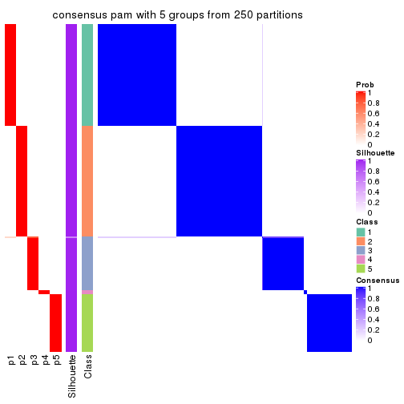</p>

</div>
<div id='tab-ATC-pam-consensus-heatmap-5'>
<pre><code class="r">consensus_heatmap(res, k = 6)
</code></pre>

<p></p>

</div>
</div>

Heatmaps for the membership of samples in all partitions to see how consistent they are:


<script>
$( function() {
	$( '#tabs-ATC-pam-membership-heatmap' ).tabs();
} );
</script>
<div id='tabs-ATC-pam-membership-heatmap'>
<ul>
<li><a href='#tab-ATC-pam-membership-heatmap-1'>k = 2</a></li>
<li><a href='#tab-ATC-pam-membership-heatmap-2'>k = 3</a></li>
<li><a href='#tab-ATC-pam-membership-heatmap-3'>k = 4</a></li>
<li><a href='#tab-ATC-pam-membership-heatmap-4'>k = 5</a></li>
<li><a href='#tab-ATC-pam-membership-heatmap-5'>k = 6</a></li>
</ul>
<div id='tab-ATC-pam-membership-heatmap-1'>
<pre><code class="r">membership_heatmap(res, k = 2)
</code></pre>

<p></p>

</div>
<div id='tab-ATC-pam-membership-heatmap-2'>
<pre><code class="r">membership_heatmap(res, k = 3)
</code></pre>

<p></p>

</div>
<div id='tab-ATC-pam-membership-heatmap-3'>
<pre><code class="r">membership_heatmap(res, k = 4)
</code></pre>

<p></p>

</div>
<div id='tab-ATC-pam-membership-heatmap-4'>
<pre><code class="r">membership_heatmap(res, k = 5)
</code></pre>

<p>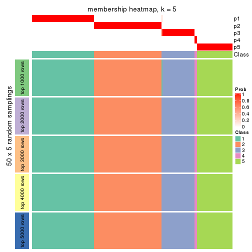</p>

</div>
<div id='tab-ATC-pam-membership-heatmap-5'>
<pre><code class="r">membership_heatmap(res, k = 6)
</code></pre>

<p></p>

</div>
</div>

As soon as we have had the classes for columns, we can look for signatures
which are significantly different between classes which can be candidate marks
for certain classes. Following are the heatmaps for signatures.


Signature heatmaps where rows are scaled:


<script>
$( function() {
	$( '#tabs-ATC-pam-get-signatures' ).tabs();
} );
</script>
<div id='tabs-ATC-pam-get-signatures'>
<ul>
<li><a href='#tab-ATC-pam-get-signatures-1'>k = 2</a></li>
<li><a href='#tab-ATC-pam-get-signatures-2'>k = 3</a></li>
<li><a href='#tab-ATC-pam-get-signatures-3'>k = 4</a></li>
<li><a href='#tab-ATC-pam-get-signatures-4'>k = 5</a></li>
<li><a href='#tab-ATC-pam-get-signatures-5'>k = 6</a></li>
</ul>
<div id='tab-ATC-pam-get-signatures-1'>
<pre><code class="r">get_signatures(res, k = 2)
</code></pre>

<p></p>

</div>
<div id='tab-ATC-pam-get-signatures-2'>
<pre><code class="r">get_signatures(res, k = 3)
</code></pre>

<p></p>

</div>
<div id='tab-ATC-pam-get-signatures-3'>
<pre><code class="r">get_signatures(res, k = 4)
</code></pre>

<p></p>

</div>
<div id='tab-ATC-pam-get-signatures-4'>
<pre><code class="r">get_signatures(res, k = 5)
</code></pre>

<p></p>

</div>
<div id='tab-ATC-pam-get-signatures-5'>
<pre><code class="r">get_signatures(res, k = 6)
</code></pre>

<p></p>

</div>
</div>


Signature heatmaps where rows are not scaled:


<script>
$( function() {
	$( '#tabs-ATC-pam-get-signatures-no-scale' ).tabs();
} );
</script>
<div id='tabs-ATC-pam-get-signatures-no-scale'>
<ul>
<li><a href='#tab-ATC-pam-get-signatures-no-scale-1'>k = 2</a></li>
<li><a href='#tab-ATC-pam-get-signatures-no-scale-2'>k = 3</a></li>
<li><a href='#tab-ATC-pam-get-signatures-no-scale-3'>k = 4</a></li>
<li><a href='#tab-ATC-pam-get-signatures-no-scale-4'>k = 5</a></li>
<li><a href='#tab-ATC-pam-get-signatures-no-scale-5'>k = 6</a></li>
</ul>
<div id='tab-ATC-pam-get-signatures-no-scale-1'>
<pre><code class="r">get_signatures(res, k = 2, scale_rows = FALSE)
</code></pre>

<p></p>

</div>
<div id='tab-ATC-pam-get-signatures-no-scale-2'>
<pre><code class="r">get_signatures(res, k = 3, scale_rows = FALSE)
</code></pre>

<p></p>

</div>
<div id='tab-ATC-pam-get-signatures-no-scale-3'>
<pre><code class="r">get_signatures(res, k = 4, scale_rows = FALSE)
</code></pre>

<p></p>

</div>
<div id='tab-ATC-pam-get-signatures-no-scale-4'>
<pre><code class="r">get_signatures(res, k = 5, scale_rows = FALSE)
</code></pre>

<p>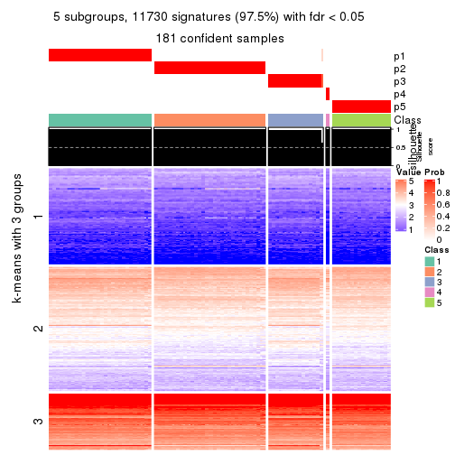</p>

</div>
<div id='tab-ATC-pam-get-signatures-no-scale-5'>
<pre><code class="r">get_signatures(res, k = 6, scale_rows = FALSE)
</code></pre>

<p></p>

</div>
</div>


Compare the overlap of signatures from different k:

```r
compare_signatures(res)
```


`get_signature()` returns a data frame invisibly. TO get the list of signatures, the function
call should be assigned to a variable explicitly. In following code, if `plot` argument is set
to `FALSE`, no heatmap is plotted while only the differential analysis is performed.

```r
# code only for demonstration
tb = get_signature(res, k = ..., plot = FALSE)
```

An example of the output of `tb` is:

```
#>   which_row         fdr    mean_1    mean_2 scaled_mean_1 scaled_mean_2 km
#> 1        38 0.042760348  8.373488  9.131774    -0.5533452     0.5164555  1
#> 2        40 0.018707592  7.106213  8.469186    -0.6173731     0.5762149  1
#> 3        55 0.019134737 10.221463 11.207825    -0.6159697     0.5749050  1
#> 4        59 0.006059896  5.921854  7.869574    -0.6899429     0.6439467  1
#> 5        60 0.018055526  8.928898 10.211722    -0.6204761     0.5791110  1
#> 6        98 0.009384629 15.714769 14.887706     0.6635654    -0.6193277  2
...
```

The columns in `tb` are:

1. `which_row`: row indices corresponding to the input matrix.
2. `fdr`: FDR for the differential test. 
3. `mean_x`: The mean value in group x.
4. `scaled_mean_x`: The mean value in group x after rows are scaled.
5. `km`: Row groups if k-means clustering is applied to rows.


UMAP plot which shows how samples are separated.


<script>
$( function() {
	$( '#tabs-ATC-pam-dimension-reduction' ).tabs();
} );
</script>
<div id='tabs-ATC-pam-dimension-reduction'>
<ul>
<li><a href='#tab-ATC-pam-dimension-reduction-1'>k = 2</a></li>
<li><a href='#tab-ATC-pam-dimension-reduction-2'>k = 3</a></li>
<li><a href='#tab-ATC-pam-dimension-reduction-3'>k = 4</a></li>
<li><a href='#tab-ATC-pam-dimension-reduction-4'>k = 5</a></li>
<li><a href='#tab-ATC-pam-dimension-reduction-5'>k = 6</a></li>
</ul>
<div id='tab-ATC-pam-dimension-reduction-1'>
<pre><code class="r">dimension_reduction(res, k = 2, method = &quot;UMAP&quot;)
</code></pre>

<p></p>

</div>
<div id='tab-ATC-pam-dimension-reduction-2'>
<pre><code class="r">dimension_reduction(res, k = 3, method = &quot;UMAP&quot;)
</code></pre>

<p></p>

</div>
<div id='tab-ATC-pam-dimension-reduction-3'>
<pre><code class="r">dimension_reduction(res, k = 4, method = &quot;UMAP&quot;)
</code></pre>

<p></p>

</div>
<div id='tab-ATC-pam-dimension-reduction-4'>
<pre><code class="r">dimension_reduction(res, k = 5, method = &quot;UMAP&quot;)
</code></pre>

<p></p>

</div>
<div id='tab-ATC-pam-dimension-reduction-5'>
<pre><code class="r">dimension_reduction(res, k = 6, method = &quot;UMAP&quot;)
</code></pre>

<p></p>

</div>
</div>


Following heatmap shows how subgroups are split when increasing `k`:

```r
collect_classes(res)
```


If matrix rows can be associated to genes, consider to use `functional_enrichment(res,
...)` to perform function enrichment for the signature genes. See [this vignette](http://bioconductor.org/packages/devel/bioc/vignettes/cola/inst/doc/functional_enrichment.html) for more detailed explanations.


 

---------------------------------------------------


### ATC:mclust**


The object with results only for a single top-value method and a single partition method 
can be extracted as:

```r
res = res_list["ATC", "mclust"]
# you can also extract it by
# res = res_list["ATC:mclust"]
```

A summary of `res` and all the functions that can be applied to it:

```r
res
```

```
#> A 'ConsensusPartition' object with k = 2, 3, 4, 5, 6.
#>   On a matrix with 12029 rows and 181 columns.
#>   Top rows (1000, 2000, 3000, 4000, 5000) are extracted by 'ATC' method.
#>   Subgroups are detected by 'mclust' method.
#>   Performed in total 1250 partitions by row resampling.
#>   Best k for subgroups seems to be 6.
#> 
#> Following methods can be applied to this 'ConsensusPartition' object:
#>  [1] "cola_report"             "collect_classes"         "collect_plots"          
#>  [4] "collect_stats"           "colnames"                "compare_signatures"     
#>  [7] "consensus_heatmap"       "dimension_reduction"     "functional_enrichment"  
#> [10] "get_anno_col"            "get_anno"                "get_classes"            
#> [13] "get_consensus"           "get_matrix"              "get_membership"         
#> [16] "get_param"               "get_signatures"          "get_stats"              
#> [19] "is_best_k"               "is_stable_k"             "membership_heatmap"     
#> [22] "ncol"                    "nrow"                    "plot_ecdf"              
#> [25] "rownames"                "select_partition_number" "show"                   
#> [28] "suggest_best_k"          "test_to_known_factors"
```

`collect_plots()` function collects all the plots made from `res` for all `k` (number of partitions)
into one single page to provide an easy and fast comparison between different `k`.

```r
collect_plots(res)
```


The plots are:

- The first row: a plot of the ECDF (empirical cumulative distribution
  function) curves of the consensus matrix for each `k` and the heatmap of
  predicted classes for each `k`.
- The second row: heatmaps of the consensus matrix for each `k`.
- The third row: heatmaps of the membership matrix for each `k`.
- The fouth row: heatmaps of the signatures for each `k`.

All the plots in panels can be made by individual functions and they are
plotted later in this section.

`select_partition_number()` produces several plots showing different
statistics for choosing "optimized" `k`. There are following statistics:

- ECDF curves of the consensus matrix for each `k`;
- 1-PAC. [The PAC
  score](https://en.wikipedia.org/wiki/Consensus_clustering#Over-interpretation_potential_of_consensus_clustering)
  measures the proportion of the ambiguous subgrouping.
- Mean silhouette score.
- Concordance. The mean probability of fiting the consensus class ids in all
  partitions.
- Area increased. Denote $A_k$ as the area under the ECDF curve for current
  `k`, the area increased is defined as $A_k - A_{k-1}$.
- Rand index. The percent of pairs of samples that are both in a same cluster
  or both are not in a same cluster in the partition of k and k-1.
- Jaccard index. The ratio of pairs of samples are both in a same cluster in
  the partition of k and k-1 and the pairs of samples are both in a same
  cluster in the partition k or k-1.

The detailed explanations of these statistics can be found in [the _cola_
vignette](http://bioconductor.org/packages/devel/bioc/vignettes/cola/inst/doc/cola.html#toc_13).

Generally speaking, lower PAC score, higher mean silhouette score or higher
concordance corresponds to better partition. Rand index and Jaccard index
measure how similar the current partition is compared to partition with `k-1`.
If they are too similar, we won't accept `k` is better than `k-1`.

```r
select_partition_number(res)
```


The numeric values for all these statistics can be obtained by `get_stats()`.

```r
get_stats(res)
```

```
#>   k 1-PAC mean_silhouette concordance area_increased  Rand Jaccard
#> 2 2 1.000           0.953       0.982         0.5021 0.498   0.498
#> 3 3 0.693           0.891       0.863         0.2086 0.850   0.709
#> 4 4 0.894           0.976       0.959         0.1903 0.865   0.651
#> 5 5 1.000           0.986       0.994         0.0417 0.967   0.877
#> 6 6 1.000           0.967       0.987         0.0664 0.944   0.779
```

`suggest_best_k()` suggests the best $k$ based on these statistics. The rules are as follows:

- All $k$ with Jaccard index larger than 0.95 are removed because increasing
  $k$ does not provide enough extra information. If all $k$ are removed, it is
  marked as no subgroup is detected.
- For all $k$ with 1-PAC score larger than 0.9, the maximal $k$ is taken as
  the best $k$, and other $k$ are marked as optional $k$.
- If it does not fit the second rule. The $k$ with the maximal vote of the
  highest 1-PAC score, highest mean silhouette, and highest concordance is
  taken as the best $k$.

```r
suggest_best_k(res)
```

```
#> [1] 6
#> attr(,"optional")
#> [1] 2 5
```

There is also optional best $k$ = 2 5 that is worth to check.

Following shows the table of the partitions (You need to click the **show/hide
code output** link to see it). The membership matrix (columns with name `p*`)
is inferred by
[`clue::cl_consensus()`](https://www.rdocumentation.org/link/cl_consensus?package=clue)
function with the `SE` method. Basically the value in the membership matrix
represents the probability to belong to a certain group. The finall class
label for an item is determined with the group with highest probability it
belongs to.

In `get_classes()` function, the entropy is calculated from the membership
matrix and the silhouette score is calculated from the consensus matrix.


<script>
$( function() {
	$( '#tabs-ATC-mclust-get-classes' ).tabs();
} );
</script>
<div id='tabs-ATC-mclust-get-classes'>
<ul>
<li><a href='#tab-ATC-mclust-get-classes-1'>k = 2</a></li>
<li><a href='#tab-ATC-mclust-get-classes-2'>k = 3</a></li>
<li><a href='#tab-ATC-mclust-get-classes-3'>k = 4</a></li>
<li><a href='#tab-ATC-mclust-get-classes-4'>k = 5</a></li>
<li><a href='#tab-ATC-mclust-get-classes-5'>k = 6</a></li>
</ul>

<div id='tab-ATC-mclust-get-classes-1'>
<p><a id='tab-ATC-mclust-get-classes-1-a' style='color:#0366d6' href='#'>show/hide code output</a></p>
<pre><code class="r">cbind(get_classes(res, k = 2), get_membership(res, k = 2))
</code></pre>

<pre><code>#&gt;           class entropy silhouette    p1    p2
#&gt; SRR315112     2  1.0000     0.0145 0.496 0.504
#&gt; SRR315113     1  0.9686     0.3318 0.604 0.396
#&gt; SRR315114     1  0.9686     0.3318 0.604 0.396
#&gt; SRR315115     2  1.0000     0.0145 0.496 0.504
#&gt; SRR315116     2  1.0000     0.0145 0.496 0.504
#&gt; SRR566986     2  0.0000     0.9803 0.000 1.000
#&gt; SRR566987     2  0.0000     0.9803 0.000 1.000
#&gt; SRR566988     2  0.0000     0.9803 0.000 1.000
#&gt; SRR566989     2  0.0000     0.9803 0.000 1.000
#&gt; SRR566990     2  0.0000     0.9803 0.000 1.000
#&gt; SRR566991     2  0.0000     0.9803 0.000 1.000
#&gt; SRR566992     2  0.0000     0.9803 0.000 1.000
#&gt; SRR566993     2  0.0000     0.9803 0.000 1.000
#&gt; SRR566994     2  0.0000     0.9803 0.000 1.000
#&gt; SRR566995     2  0.0000     0.9803 0.000 1.000
#&gt; SRR566996     2  0.0000     0.9803 0.000 1.000
#&gt; SRR566997     2  0.0000     0.9803 0.000 1.000
#&gt; SRR566998     2  0.0000     0.9803 0.000 1.000
#&gt; SRR566999     2  0.0000     0.9803 0.000 1.000
#&gt; SRR567000     2  0.0000     0.9803 0.000 1.000
#&gt; SRR567001     2  0.0000     0.9803 0.000 1.000
#&gt; SRR567002     2  0.0000     0.9803 0.000 1.000
#&gt; SRR567003     2  0.0000     0.9803 0.000 1.000
#&gt; SRR567004     2  0.0000     0.9803 0.000 1.000
#&gt; SRR567005     2  0.0000     0.9803 0.000 1.000
#&gt; SRR567006     2  0.0000     0.9803 0.000 1.000
#&gt; SRR567007     2  0.0000     0.9803 0.000 1.000
#&gt; SRR567008     2  0.0000     0.9803 0.000 1.000
#&gt; SRR567009     2  0.0000     0.9803 0.000 1.000
#&gt; SRR567010     2  0.0000     0.9803 0.000 1.000
#&gt; SRR567011     2  0.0000     0.9803 0.000 1.000
#&gt; SRR567012     2  0.0000     0.9803 0.000 1.000
#&gt; SRR567013     2  0.0000     0.9803 0.000 1.000
#&gt; SRR567014     2  0.0000     0.9803 0.000 1.000
#&gt; SRR567015     2  0.0000     0.9803 0.000 1.000
#&gt; SRR567016     2  0.0000     0.9803 0.000 1.000
#&gt; SRR567017     2  0.0000     0.9803 0.000 1.000
#&gt; SRR567018     2  0.0000     0.9803 0.000 1.000
#&gt; SRR567019     2  0.0000     0.9803 0.000 1.000
#&gt; SRR567020     2  0.0000     0.9803 0.000 1.000
#&gt; SRR567021     2  0.0000     0.9803 0.000 1.000
#&gt; SRR567022     2  0.0672     0.9784 0.008 0.992
#&gt; SRR567023     2  0.0000     0.9803 0.000 1.000
#&gt; SRR567024     2  0.0000     0.9803 0.000 1.000
#&gt; SRR567025     2  0.0000     0.9803 0.000 1.000
#&gt; SRR567026     2  0.0000     0.9803 0.000 1.000
#&gt; SRR567027     2  0.0000     0.9803 0.000 1.000
#&gt; SRR567028     2  0.0000     0.9803 0.000 1.000
#&gt; SRR567029     2  0.0000     0.9803 0.000 1.000
#&gt; SRR567030     2  0.0000     0.9803 0.000 1.000
#&gt; SRR567031     2  0.0000     0.9803 0.000 1.000
#&gt; SRR567032     2  0.0000     0.9803 0.000 1.000
#&gt; SRR567033     2  0.0000     0.9803 0.000 1.000
#&gt; SRR567034     2  0.0000     0.9803 0.000 1.000
#&gt; SRR567035     2  0.0000     0.9803 0.000 1.000
#&gt; SRR567036     2  0.0000     0.9803 0.000 1.000
#&gt; SRR567037     2  0.0000     0.9803 0.000 1.000
#&gt; SRR567038     2  0.0000     0.9803 0.000 1.000
#&gt; SRR567039     2  0.0000     0.9803 0.000 1.000
#&gt; SRR567040     2  0.0000     0.9803 0.000 1.000
#&gt; SRR567041     2  0.0000     0.9803 0.000 1.000
#&gt; SRR567042     2  0.0672     0.9784 0.008 0.992
#&gt; SRR567043     2  0.0000     0.9803 0.000 1.000
#&gt; SRR567044     2  0.0672     0.9784 0.008 0.992
#&gt; SRR567045     2  0.0672     0.9784 0.008 0.992
#&gt; SRR567046     2  0.0672     0.9784 0.008 0.992
#&gt; SRR567047     2  0.0672     0.9784 0.008 0.992
#&gt; SRR567048     2  0.0672     0.9784 0.008 0.992
#&gt; SRR567049     2  0.0672     0.9784 0.008 0.992
#&gt; SRR567050     2  0.0672     0.9784 0.008 0.992
#&gt; SRR567051     2  0.0672     0.9784 0.008 0.992
#&gt; SRR567052     2  0.0672     0.9784 0.008 0.992
#&gt; SRR567053     2  0.0672     0.9784 0.008 0.992
#&gt; SRR567054     2  0.0672     0.9784 0.008 0.992
#&gt; SRR567055     2  0.0672     0.9784 0.008 0.992
#&gt; SRR567056     2  0.0672     0.9784 0.008 0.992
#&gt; SRR567057     2  0.0672     0.9784 0.008 0.992
#&gt; SRR567058     2  0.0672     0.9784 0.008 0.992
#&gt; SRR567059     2  0.0672     0.9784 0.008 0.992
#&gt; SRR567060     2  0.0672     0.9784 0.008 0.992
#&gt; SRR567061     2  0.0672     0.9784 0.008 0.992
#&gt; SRR567062     2  0.0672     0.9784 0.008 0.992
#&gt; SRR567063     2  0.0672     0.9784 0.008 0.992
#&gt; SRR567064     2  0.0672     0.9784 0.008 0.992
#&gt; SRR567065     2  0.0672     0.9784 0.008 0.992
#&gt; SRR567066     2  0.0672     0.9784 0.008 0.992
#&gt; SRR567067     2  0.0672     0.9784 0.008 0.992
#&gt; SRR567068     2  0.0672     0.9784 0.008 0.992
#&gt; SRR567069     2  0.0672     0.9784 0.008 0.992
#&gt; SRR567070     2  0.0672     0.9784 0.008 0.992
#&gt; SRR567071     2  0.0672     0.9784 0.008 0.992
#&gt; SRR567072     2  0.0672     0.9784 0.008 0.992
#&gt; SRR567073     2  0.0672     0.9784 0.008 0.992
#&gt; SRR567074     2  0.0672     0.9784 0.008 0.992
#&gt; SRR567075     2  0.0672     0.9784 0.008 0.992
#&gt; SRR567076     1  0.0000     0.9829 1.000 0.000
#&gt; SRR567077     1  0.0000     0.9829 1.000 0.000
#&gt; SRR567078     1  0.0000     0.9829 1.000 0.000
#&gt; SRR567079     1  0.0000     0.9829 1.000 0.000
#&gt; SRR567080     1  0.0000     0.9829 1.000 0.000
#&gt; SRR567081     1  0.0000     0.9829 1.000 0.000
#&gt; SRR567082     1  0.0000     0.9829 1.000 0.000
#&gt; SRR567083     1  0.0000     0.9829 1.000 0.000
#&gt; SRR567084     1  0.0000     0.9829 1.000 0.000
#&gt; SRR567085     1  0.0000     0.9829 1.000 0.000
#&gt; SRR567086     1  0.0000     0.9829 1.000 0.000
#&gt; SRR567087     1  0.0000     0.9829 1.000 0.000
#&gt; SRR567088     1  0.0000     0.9829 1.000 0.000
#&gt; SRR567089     1  0.0000     0.9829 1.000 0.000
#&gt; SRR567090     1  0.0000     0.9829 1.000 0.000
#&gt; SRR567091     1  0.0000     0.9829 1.000 0.000
#&gt; SRR567092     1  0.0000     0.9829 1.000 0.000
#&gt; SRR567093     1  0.0000     0.9829 1.000 0.000
#&gt; SRR567094     1  0.0000     0.9829 1.000 0.000
#&gt; SRR567095     1  0.0000     0.9829 1.000 0.000
#&gt; SRR567096     1  0.0000     0.9829 1.000 0.000
#&gt; SRR567097     1  0.0000     0.9829 1.000 0.000
#&gt; SRR567098     1  0.0000     0.9829 1.000 0.000
#&gt; SRR567099     1  0.0000     0.9829 1.000 0.000
#&gt; SRR567100     1  0.0000     0.9829 1.000 0.000
#&gt; SRR567101     1  0.0000     0.9829 1.000 0.000
#&gt; SRR567102     1  0.0000     0.9829 1.000 0.000
#&gt; SRR567103     1  0.0000     0.9829 1.000 0.000
#&gt; SRR567104     1  0.0000     0.9829 1.000 0.000
#&gt; SRR567105     1  0.0000     0.9829 1.000 0.000
#&gt; SRR567106     1  0.0000     0.9829 1.000 0.000
#&gt; SRR567107     1  0.0000     0.9829 1.000 0.000
#&gt; SRR567108     1  0.0000     0.9829 1.000 0.000
#&gt; SRR567109     1  0.0000     0.9829 1.000 0.000
#&gt; SRR567110     1  0.0000     0.9829 1.000 0.000
#&gt; SRR567111     1  0.0000     0.9829 1.000 0.000
#&gt; SRR567112     1  0.0000     0.9829 1.000 0.000
#&gt; SRR567113     1  0.0000     0.9829 1.000 0.000
#&gt; SRR567114     1  0.0000     0.9829 1.000 0.000
#&gt; SRR567115     1  0.0000     0.9829 1.000 0.000
#&gt; SRR567116     1  0.0000     0.9829 1.000 0.000
#&gt; SRR567117     1  0.0000     0.9829 1.000 0.000
#&gt; SRR567118     1  0.0000     0.9829 1.000 0.000
#&gt; SRR567119     1  0.0000     0.9829 1.000 0.000
#&gt; SRR567120     1  0.0000     0.9829 1.000 0.000
#&gt; SRR567121     1  0.0000     0.9829 1.000 0.000
#&gt; SRR567122     1  0.0000     0.9829 1.000 0.000
#&gt; SRR567123     1  0.0000     0.9829 1.000 0.000
#&gt; SRR567124     1  0.0000     0.9829 1.000 0.000
#&gt; SRR567125     1  0.0000     0.9829 1.000 0.000
#&gt; SRR567126     1  0.0000     0.9829 1.000 0.000
#&gt; SRR567127     1  0.0000     0.9829 1.000 0.000
#&gt; SRR567128     1  0.0000     0.9829 1.000 0.000
#&gt; SRR567129     1  0.0000     0.9829 1.000 0.000
#&gt; SRR567130     1  0.0000     0.9829 1.000 0.000
#&gt; SRR567131     1  0.0000     0.9829 1.000 0.000
#&gt; SRR567132     1  0.0000     0.9829 1.000 0.000
#&gt; SRR567133     1  0.0000     0.9829 1.000 0.000
#&gt; SRR567134     1  0.0000     0.9829 1.000 0.000
#&gt; SRR567135     1  0.0000     0.9829 1.000 0.000
#&gt; SRR567136     1  0.0000     0.9829 1.000 0.000
#&gt; SRR567137     1  0.0000     0.9829 1.000 0.000
#&gt; SRR567138     1  0.0000     0.9829 1.000 0.000
#&gt; SRR567139     1  0.0000     0.9829 1.000 0.000
#&gt; SRR567140     1  0.0000     0.9829 1.000 0.000
#&gt; SRR567141     1  0.0000     0.9829 1.000 0.000
#&gt; SRR567142     1  0.0000     0.9829 1.000 0.000
#&gt; SRR567143     1  0.0000     0.9829 1.000 0.000
#&gt; SRR567144     1  0.0000     0.9829 1.000 0.000
#&gt; SRR567145     1  0.0000     0.9829 1.000 0.000
#&gt; SRR567146     1  0.9044     0.5241 0.680 0.320
#&gt; SRR567147     1  0.0000     0.9829 1.000 0.000
#&gt; SRR567148     1  0.0000     0.9829 1.000 0.000
#&gt; SRR567149     1  0.0000     0.9829 1.000 0.000
#&gt; SRR567150     1  0.0000     0.9829 1.000 0.000
#&gt; SRR567151     1  0.0000     0.9829 1.000 0.000
#&gt; SRR567152     1  0.0000     0.9829 1.000 0.000
#&gt; SRR567153     1  0.0000     0.9829 1.000 0.000
#&gt; SRR567154     1  0.0000     0.9829 1.000 0.000
#&gt; SRR567155     1  0.0000     0.9829 1.000 0.000
#&gt; SRR567156     1  0.0000     0.9829 1.000 0.000
#&gt; SRR567157     1  0.0000     0.9829 1.000 0.000
#&gt; SRR567158     1  0.0000     0.9829 1.000 0.000
#&gt; SRR567159     1  0.0000     0.9829 1.000 0.000
#&gt; SRR567160     1  0.0000     0.9829 1.000 0.000
#&gt; SRR567161     1  0.9044     0.5241 0.680 0.320
</code></pre>

<script>
$('#tab-ATC-mclust-get-classes-1-a').parent().next().next().hide();
$('#tab-ATC-mclust-get-classes-1-a').click(function(){
  $('#tab-ATC-mclust-get-classes-1-a').parent().next().next().toggle();
  return(false);
});
</script>
</div>

<div id='tab-ATC-mclust-get-classes-2'>
<p><a id='tab-ATC-mclust-get-classes-2-a' style='color:#0366d6' href='#'>show/hide code output</a></p>
<pre><code class="r">cbind(get_classes(res, k = 3), get_membership(res, k = 3))
</code></pre>

<pre><code>#&gt;           class entropy silhouette    p1    p2    p3
#&gt; SRR315112     1   0.941      0.570 0.504 0.276 0.220
#&gt; SRR315113     1   0.909      0.609 0.504 0.344 0.152
#&gt; SRR315114     1   0.909      0.609 0.504 0.344 0.152
#&gt; SRR315115     1   0.941      0.570 0.504 0.276 0.220
#&gt; SRR315116     1   0.941      0.570 0.504 0.276 0.220
#&gt; SRR566986     2   0.586      1.000 0.000 0.656 0.344
#&gt; SRR566987     2   0.586      1.000 0.000 0.656 0.344
#&gt; SRR566988     2   0.586      1.000 0.000 0.656 0.344
#&gt; SRR566989     2   0.586      1.000 0.000 0.656 0.344
#&gt; SRR566990     2   0.586      1.000 0.000 0.656 0.344
#&gt; SRR566991     2   0.586      1.000 0.000 0.656 0.344
#&gt; SRR566992     2   0.586      1.000 0.000 0.656 0.344
#&gt; SRR566993     2   0.586      1.000 0.000 0.656 0.344
#&gt; SRR566994     2   0.586      1.000 0.000 0.656 0.344
#&gt; SRR566995     2   0.586      1.000 0.000 0.656 0.344
#&gt; SRR566996     2   0.586      1.000 0.000 0.656 0.344
#&gt; SRR566997     2   0.586      1.000 0.000 0.656 0.344
#&gt; SRR566998     2   0.586      1.000 0.000 0.656 0.344
#&gt; SRR566999     2   0.586      1.000 0.000 0.656 0.344
#&gt; SRR567000     2   0.586      1.000 0.000 0.656 0.344
#&gt; SRR567001     2   0.586      1.000 0.000 0.656 0.344
#&gt; SRR567002     2   0.586      1.000 0.000 0.656 0.344
#&gt; SRR567003     2   0.586      1.000 0.000 0.656 0.344
#&gt; SRR567004     2   0.586      1.000 0.000 0.656 0.344
#&gt; SRR567005     2   0.586      1.000 0.000 0.656 0.344
#&gt; SRR567006     2   0.586      1.000 0.000 0.656 0.344
#&gt; SRR567007     2   0.586      1.000 0.000 0.656 0.344
#&gt; SRR567008     2   0.586      1.000 0.000 0.656 0.344
#&gt; SRR567009     2   0.586      1.000 0.000 0.656 0.344
#&gt; SRR567010     2   0.586      1.000 0.000 0.656 0.344
#&gt; SRR567011     2   0.586      1.000 0.000 0.656 0.344
#&gt; SRR567012     2   0.586      1.000 0.000 0.656 0.344
#&gt; SRR567013     2   0.586      1.000 0.000 0.656 0.344
#&gt; SRR567014     2   0.586      1.000 0.000 0.656 0.344
#&gt; SRR567015     2   0.586      1.000 0.000 0.656 0.344
#&gt; SRR567016     2   0.586      1.000 0.000 0.656 0.344
#&gt; SRR567017     2   0.586      1.000 0.000 0.656 0.344
#&gt; SRR567018     2   0.586      1.000 0.000 0.656 0.344
#&gt; SRR567019     2   0.586      1.000 0.000 0.656 0.344
#&gt; SRR567020     2   0.586      1.000 0.000 0.656 0.344
#&gt; SRR567021     2   0.586      1.000 0.000 0.656 0.344
#&gt; SRR567022     3   0.855     -0.358 0.096 0.412 0.492
#&gt; SRR567023     2   0.586      1.000 0.000 0.656 0.344
#&gt; SRR567024     2   0.586      1.000 0.000 0.656 0.344
#&gt; SRR567025     2   0.586      1.000 0.000 0.656 0.344
#&gt; SRR567026     2   0.586      1.000 0.000 0.656 0.344
#&gt; SRR567027     2   0.586      1.000 0.000 0.656 0.344
#&gt; SRR567028     2   0.586      1.000 0.000 0.656 0.344
#&gt; SRR567029     2   0.586      1.000 0.000 0.656 0.344
#&gt; SRR567030     2   0.586      1.000 0.000 0.656 0.344
#&gt; SRR567031     2   0.586      1.000 0.000 0.656 0.344
#&gt; SRR567032     2   0.586      1.000 0.000 0.656 0.344
#&gt; SRR567033     2   0.586      1.000 0.000 0.656 0.344
#&gt; SRR567034     2   0.586      1.000 0.000 0.656 0.344
#&gt; SRR567035     2   0.586      1.000 0.000 0.656 0.344
#&gt; SRR567036     2   0.586      1.000 0.000 0.656 0.344
#&gt; SRR567037     2   0.586      1.000 0.000 0.656 0.344
#&gt; SRR567038     2   0.586      1.000 0.000 0.656 0.344
#&gt; SRR567039     2   0.586      1.000 0.000 0.656 0.344
#&gt; SRR567040     2   0.586      1.000 0.000 0.656 0.344
#&gt; SRR567041     2   0.586      1.000 0.000 0.656 0.344
#&gt; SRR567042     3   0.855     -0.358 0.096 0.412 0.492
#&gt; SRR567043     2   0.586      1.000 0.000 0.656 0.344
#&gt; SRR567044     3   0.000      0.958 0.000 0.000 1.000
#&gt; SRR567045     3   0.000      0.958 0.000 0.000 1.000
#&gt; SRR567046     3   0.000      0.958 0.000 0.000 1.000
#&gt; SRR567047     3   0.000      0.958 0.000 0.000 1.000
#&gt; SRR567048     3   0.000      0.958 0.000 0.000 1.000
#&gt; SRR567049     3   0.000      0.958 0.000 0.000 1.000
#&gt; SRR567050     3   0.000      0.958 0.000 0.000 1.000
#&gt; SRR567051     3   0.000      0.958 0.000 0.000 1.000
#&gt; SRR567052     3   0.000      0.958 0.000 0.000 1.000
#&gt; SRR567053     3   0.000      0.958 0.000 0.000 1.000
#&gt; SRR567054     3   0.000      0.958 0.000 0.000 1.000
#&gt; SRR567055     3   0.000      0.958 0.000 0.000 1.000
#&gt; SRR567056     3   0.000      0.958 0.000 0.000 1.000
#&gt; SRR567057     3   0.000      0.958 0.000 0.000 1.000
#&gt; SRR567058     3   0.000      0.958 0.000 0.000 1.000
#&gt; SRR567059     3   0.000      0.958 0.000 0.000 1.000
#&gt; SRR567060     3   0.000      0.958 0.000 0.000 1.000
#&gt; SRR567061     3   0.000      0.958 0.000 0.000 1.000
#&gt; SRR567062     3   0.000      0.958 0.000 0.000 1.000
#&gt; SRR567063     3   0.000      0.958 0.000 0.000 1.000
#&gt; SRR567064     3   0.000      0.958 0.000 0.000 1.000
#&gt; SRR567065     3   0.000      0.958 0.000 0.000 1.000
#&gt; SRR567066     3   0.000      0.958 0.000 0.000 1.000
#&gt; SRR567067     3   0.000      0.958 0.000 0.000 1.000
#&gt; SRR567068     3   0.000      0.958 0.000 0.000 1.000
#&gt; SRR567069     3   0.000      0.958 0.000 0.000 1.000
#&gt; SRR567070     3   0.000      0.958 0.000 0.000 1.000
#&gt; SRR567071     3   0.000      0.958 0.000 0.000 1.000
#&gt; SRR567072     3   0.000      0.958 0.000 0.000 1.000
#&gt; SRR567073     3   0.000      0.958 0.000 0.000 1.000
#&gt; SRR567074     3   0.000      0.958 0.000 0.000 1.000
#&gt; SRR567075     3   0.000      0.958 0.000 0.000 1.000
#&gt; SRR567076     1   0.000      0.874 1.000 0.000 0.000
#&gt; SRR567077     1   0.000      0.874 1.000 0.000 0.000
#&gt; SRR567078     1   0.000      0.874 1.000 0.000 0.000
#&gt; SRR567079     1   0.000      0.874 1.000 0.000 0.000
#&gt; SRR567080     1   0.000      0.874 1.000 0.000 0.000
#&gt; SRR567081     1   0.000      0.874 1.000 0.000 0.000
#&gt; SRR567082     1   0.000      0.874 1.000 0.000 0.000
#&gt; SRR567083     1   0.000      0.874 1.000 0.000 0.000
#&gt; SRR567084     1   0.000      0.874 1.000 0.000 0.000
#&gt; SRR567085     1   0.000      0.874 1.000 0.000 0.000
#&gt; SRR567086     1   0.000      0.874 1.000 0.000 0.000
#&gt; SRR567087     1   0.000      0.874 1.000 0.000 0.000
#&gt; SRR567088     1   0.000      0.874 1.000 0.000 0.000
#&gt; SRR567089     1   0.000      0.874 1.000 0.000 0.000
#&gt; SRR567090     1   0.000      0.874 1.000 0.000 0.000
#&gt; SRR567091     1   0.000      0.874 1.000 0.000 0.000
#&gt; SRR567092     1   0.000      0.874 1.000 0.000 0.000
#&gt; SRR567093     1   0.000      0.874 1.000 0.000 0.000
#&gt; SRR567094     1   0.000      0.874 1.000 0.000 0.000
#&gt; SRR567095     1   0.000      0.874 1.000 0.000 0.000
#&gt; SRR567096     1   0.000      0.874 1.000 0.000 0.000
#&gt; SRR567097     1   0.000      0.874 1.000 0.000 0.000
#&gt; SRR567098     1   0.000      0.874 1.000 0.000 0.000
#&gt; SRR567099     1   0.000      0.874 1.000 0.000 0.000
#&gt; SRR567100     1   0.000      0.874 1.000 0.000 0.000
#&gt; SRR567101     1   0.000      0.874 1.000 0.000 0.000
#&gt; SRR567102     1   0.668      0.810 0.748 0.100 0.152
#&gt; SRR567103     1   0.496      0.830 0.832 0.040 0.128
#&gt; SRR567104     1   0.000      0.874 1.000 0.000 0.000
#&gt; SRR567105     1   0.000      0.874 1.000 0.000 0.000
#&gt; SRR567106     1   0.709      0.804 0.724 0.124 0.152
#&gt; SRR567107     1   0.709      0.804 0.724 0.124 0.152
#&gt; SRR567108     1   0.709      0.804 0.724 0.124 0.152
#&gt; SRR567109     1   0.709      0.804 0.724 0.124 0.152
#&gt; SRR567110     1   0.709      0.804 0.724 0.124 0.152
#&gt; SRR567111     1   0.709      0.804 0.724 0.124 0.152
#&gt; SRR567112     1   0.709      0.804 0.724 0.124 0.152
#&gt; SRR567113     1   0.709      0.804 0.724 0.124 0.152
#&gt; SRR567114     1   0.709      0.804 0.724 0.124 0.152
#&gt; SRR567115     1   0.709      0.804 0.724 0.124 0.152
#&gt; SRR567116     1   0.709      0.804 0.724 0.124 0.152
#&gt; SRR567117     1   0.709      0.804 0.724 0.124 0.152
#&gt; SRR567118     1   0.709      0.804 0.724 0.124 0.152
#&gt; SRR567119     1   0.709      0.804 0.724 0.124 0.152
#&gt; SRR567120     1   0.709      0.804 0.724 0.124 0.152
#&gt; SRR567121     1   0.709      0.804 0.724 0.124 0.152
#&gt; SRR567122     1   0.709      0.804 0.724 0.124 0.152
#&gt; SRR567123     1   0.709      0.804 0.724 0.124 0.152
#&gt; SRR567124     1   0.709      0.804 0.724 0.124 0.152
#&gt; SRR567125     1   0.709      0.804 0.724 0.124 0.152
#&gt; SRR567126     1   0.709      0.804 0.724 0.124 0.152
#&gt; SRR567127     1   0.709      0.804 0.724 0.124 0.152
#&gt; SRR567128     1   0.709      0.804 0.724 0.124 0.152
#&gt; SRR567129     1   0.709      0.804 0.724 0.124 0.152
#&gt; SRR567130     1   0.709      0.804 0.724 0.124 0.152
#&gt; SRR567131     1   0.709      0.804 0.724 0.124 0.152
#&gt; SRR567132     1   0.709      0.804 0.724 0.124 0.152
#&gt; SRR567133     1   0.709      0.804 0.724 0.124 0.152
#&gt; SRR567134     1   0.000      0.874 1.000 0.000 0.000
#&gt; SRR567135     1   0.000      0.874 1.000 0.000 0.000
#&gt; SRR567136     1   0.709      0.804 0.724 0.124 0.152
#&gt; SRR567137     1   0.000      0.874 1.000 0.000 0.000
#&gt; SRR567138     1   0.000      0.874 1.000 0.000 0.000
#&gt; SRR567139     1   0.000      0.874 1.000 0.000 0.000
#&gt; SRR567140     1   0.000      0.874 1.000 0.000 0.000
#&gt; SRR567141     1   0.000      0.874 1.000 0.000 0.000
#&gt; SRR567142     1   0.000      0.874 1.000 0.000 0.000
#&gt; SRR567143     1   0.000      0.874 1.000 0.000 0.000
#&gt; SRR567144     1   0.000      0.874 1.000 0.000 0.000
#&gt; SRR567145     1   0.000      0.874 1.000 0.000 0.000
#&gt; SRR567146     1   0.908      0.611 0.508 0.340 0.152
#&gt; SRR567147     1   0.000      0.874 1.000 0.000 0.000
#&gt; SRR567148     1   0.000      0.874 1.000 0.000 0.000
#&gt; SRR567149     1   0.000      0.874 1.000 0.000 0.000
#&gt; SRR567150     1   0.000      0.874 1.000 0.000 0.000
#&gt; SRR567151     1   0.000      0.874 1.000 0.000 0.000
#&gt; SRR567152     1   0.000      0.874 1.000 0.000 0.000
#&gt; SRR567153     1   0.000      0.874 1.000 0.000 0.000
#&gt; SRR567154     1   0.000      0.874 1.000 0.000 0.000
#&gt; SRR567155     1   0.000      0.874 1.000 0.000 0.000
#&gt; SRR567156     1   0.000      0.874 1.000 0.000 0.000
#&gt; SRR567157     1   0.000      0.874 1.000 0.000 0.000
#&gt; SRR567158     1   0.000      0.874 1.000 0.000 0.000
#&gt; SRR567159     1   0.709      0.804 0.724 0.124 0.152
#&gt; SRR567160     1   0.000      0.874 1.000 0.000 0.000
#&gt; SRR567161     1   0.908      0.611 0.508 0.340 0.152
</code></pre>

<script>
$('#tab-ATC-mclust-get-classes-2-a').parent().next().next().hide();
$('#tab-ATC-mclust-get-classes-2-a').click(function(){
  $('#tab-ATC-mclust-get-classes-2-a').parent().next().next().toggle();
  return(false);
});
</script>
</div>

<div id='tab-ATC-mclust-get-classes-3'>
<p><a id='tab-ATC-mclust-get-classes-3-a' style='color:#0366d6' href='#'>show/hide code output</a></p>
<pre><code class="r">cbind(get_classes(res, k = 4), get_membership(res, k = 4))
</code></pre>

<pre><code>#&gt;           class entropy silhouette    p1    p2 p3    p4
#&gt; SRR315112     4   0.000      0.767 0.000 0.000  0 1.000
#&gt; SRR315113     4   0.000      0.767 0.000 0.000  0 1.000
#&gt; SRR315114     4   0.000      0.767 0.000 0.000  0 1.000
#&gt; SRR315115     4   0.000      0.767 0.000 0.000  0 1.000
#&gt; SRR315116     4   0.000      0.767 0.000 0.000  0 1.000
#&gt; SRR566986     2   0.000      0.996 0.000 1.000  0 0.000
#&gt; SRR566987     2   0.000      0.996 0.000 1.000  0 0.000
#&gt; SRR566988     2   0.000      0.996 0.000 1.000  0 0.000
#&gt; SRR566989     2   0.000      0.996 0.000 1.000  0 0.000
#&gt; SRR566990     2   0.000      0.996 0.000 1.000  0 0.000
#&gt; SRR566991     2   0.000      0.996 0.000 1.000  0 0.000
#&gt; SRR566992     2   0.000      0.996 0.000 1.000  0 0.000
#&gt; SRR566993     2   0.000      0.996 0.000 1.000  0 0.000
#&gt; SRR566994     2   0.000      0.996 0.000 1.000  0 0.000
#&gt; SRR566995     2   0.000      0.996 0.000 1.000  0 0.000
#&gt; SRR566996     2   0.000      0.996 0.000 1.000  0 0.000
#&gt; SRR566997     2   0.000      0.996 0.000 1.000  0 0.000
#&gt; SRR566998     2   0.000      0.996 0.000 1.000  0 0.000
#&gt; SRR566999     2   0.000      0.996 0.000 1.000  0 0.000
#&gt; SRR567000     2   0.000      0.996 0.000 1.000  0 0.000
#&gt; SRR567001     2   0.000      0.996 0.000 1.000  0 0.000
#&gt; SRR567002     2   0.000      0.996 0.000 1.000  0 0.000
#&gt; SRR567003     2   0.000      0.996 0.000 1.000  0 0.000
#&gt; SRR567004     2   0.000      0.996 0.000 1.000  0 0.000
#&gt; SRR567005     2   0.000      0.996 0.000 1.000  0 0.000
#&gt; SRR567006     2   0.000      0.996 0.000 1.000  0 0.000
#&gt; SRR567007     2   0.000      0.996 0.000 1.000  0 0.000
#&gt; SRR567008     2   0.000      0.996 0.000 1.000  0 0.000
#&gt; SRR567009     2   0.000      0.996 0.000 1.000  0 0.000
#&gt; SRR567010     2   0.000      0.996 0.000 1.000  0 0.000
#&gt; SRR567011     2   0.000      0.996 0.000 1.000  0 0.000
#&gt; SRR567012     2   0.000      0.996 0.000 1.000  0 0.000
#&gt; SRR567013     2   0.000      0.996 0.000 1.000  0 0.000
#&gt; SRR567014     2   0.000      0.996 0.000 1.000  0 0.000
#&gt; SRR567015     2   0.000      0.996 0.000 1.000  0 0.000
#&gt; SRR567016     2   0.000      0.996 0.000 1.000  0 0.000
#&gt; SRR567017     2   0.000      0.996 0.000 1.000  0 0.000
#&gt; SRR567018     2   0.000      0.996 0.000 1.000  0 0.000
#&gt; SRR567019     2   0.000      0.996 0.000 1.000  0 0.000
#&gt; SRR567020     2   0.000      0.996 0.000 1.000  0 0.000
#&gt; SRR567021     2   0.000      0.996 0.000 1.000  0 0.000
#&gt; SRR567022     2   0.228      0.894 0.000 0.904  0 0.096
#&gt; SRR567023     2   0.000      0.996 0.000 1.000  0 0.000
#&gt; SRR567024     2   0.000      0.996 0.000 1.000  0 0.000
#&gt; SRR567025     2   0.000      0.996 0.000 1.000  0 0.000
#&gt; SRR567026     2   0.000      0.996 0.000 1.000  0 0.000
#&gt; SRR567027     2   0.000      0.996 0.000 1.000  0 0.000
#&gt; SRR567028     2   0.000      0.996 0.000 1.000  0 0.000
#&gt; SRR567029     2   0.000      0.996 0.000 1.000  0 0.000
#&gt; SRR567030     2   0.000      0.996 0.000 1.000  0 0.000
#&gt; SRR567031     2   0.000      0.996 0.000 1.000  0 0.000
#&gt; SRR567032     2   0.000      0.996 0.000 1.000  0 0.000
#&gt; SRR567033     2   0.000      0.996 0.000 1.000  0 0.000
#&gt; SRR567034     2   0.000      0.996 0.000 1.000  0 0.000
#&gt; SRR567035     2   0.000      0.996 0.000 1.000  0 0.000
#&gt; SRR567036     2   0.000      0.996 0.000 1.000  0 0.000
#&gt; SRR567037     2   0.000      0.996 0.000 1.000  0 0.000
#&gt; SRR567038     2   0.000      0.996 0.000 1.000  0 0.000
#&gt; SRR567039     2   0.000      0.996 0.000 1.000  0 0.000
#&gt; SRR567040     2   0.000      0.996 0.000 1.000  0 0.000
#&gt; SRR567041     2   0.000      0.996 0.000 1.000  0 0.000
#&gt; SRR567042     2   0.228      0.894 0.000 0.904  0 0.096
#&gt; SRR567043     2   0.000      0.996 0.000 1.000  0 0.000
#&gt; SRR567044     3   0.000      1.000 0.000 0.000  1 0.000
#&gt; SRR567045     3   0.000      1.000 0.000 0.000  1 0.000
#&gt; SRR567046     3   0.000      1.000 0.000 0.000  1 0.000
#&gt; SRR567047     3   0.000      1.000 0.000 0.000  1 0.000
#&gt; SRR567048     3   0.000      1.000 0.000 0.000  1 0.000
#&gt; SRR567049     3   0.000      1.000 0.000 0.000  1 0.000
#&gt; SRR567050     3   0.000      1.000 0.000 0.000  1 0.000
#&gt; SRR567051     3   0.000      1.000 0.000 0.000  1 0.000
#&gt; SRR567052     3   0.000      1.000 0.000 0.000  1 0.000
#&gt; SRR567053     3   0.000      1.000 0.000 0.000  1 0.000
#&gt; SRR567054     3   0.000      1.000 0.000 0.000  1 0.000
#&gt; SRR567055     3   0.000      1.000 0.000 0.000  1 0.000
#&gt; SRR567056     3   0.000      1.000 0.000 0.000  1 0.000
#&gt; SRR567057     3   0.000      1.000 0.000 0.000  1 0.000
#&gt; SRR567058     3   0.000      1.000 0.000 0.000  1 0.000
#&gt; SRR567059     3   0.000      1.000 0.000 0.000  1 0.000
#&gt; SRR567060     3   0.000      1.000 0.000 0.000  1 0.000
#&gt; SRR567061     3   0.000      1.000 0.000 0.000  1 0.000
#&gt; SRR567062     3   0.000      1.000 0.000 0.000  1 0.000
#&gt; SRR567063     3   0.000      1.000 0.000 0.000  1 0.000
#&gt; SRR567064     3   0.000      1.000 0.000 0.000  1 0.000
#&gt; SRR567065     3   0.000      1.000 0.000 0.000  1 0.000
#&gt; SRR567066     3   0.000      1.000 0.000 0.000  1 0.000
#&gt; SRR567067     3   0.000      1.000 0.000 0.000  1 0.000
#&gt; SRR567068     3   0.000      1.000 0.000 0.000  1 0.000
#&gt; SRR567069     3   0.000      1.000 0.000 0.000  1 0.000
#&gt; SRR567070     3   0.000      1.000 0.000 0.000  1 0.000
#&gt; SRR567071     3   0.000      1.000 0.000 0.000  1 0.000
#&gt; SRR567072     3   0.000      1.000 0.000 0.000  1 0.000
#&gt; SRR567073     3   0.000      1.000 0.000 0.000  1 0.000
#&gt; SRR567074     3   0.000      1.000 0.000 0.000  1 0.000
#&gt; SRR567075     3   0.000      1.000 0.000 0.000  1 0.000
#&gt; SRR567076     1   0.000      1.000 1.000 0.000  0 0.000
#&gt; SRR567077     1   0.000      1.000 1.000 0.000  0 0.000
#&gt; SRR567078     1   0.000      1.000 1.000 0.000  0 0.000
#&gt; SRR567079     1   0.000      1.000 1.000 0.000  0 0.000
#&gt; SRR567080     1   0.000      1.000 1.000 0.000  0 0.000
#&gt; SRR567081     1   0.000      1.000 1.000 0.000  0 0.000
#&gt; SRR567082     1   0.000      1.000 1.000 0.000  0 0.000
#&gt; SRR567083     1   0.000      1.000 1.000 0.000  0 0.000
#&gt; SRR567084     1   0.000      1.000 1.000 0.000  0 0.000
#&gt; SRR567085     1   0.000      1.000 1.000 0.000  0 0.000
#&gt; SRR567086     1   0.000      1.000 1.000 0.000  0 0.000
#&gt; SRR567087     1   0.000      1.000 1.000 0.000  0 0.000
#&gt; SRR567088     1   0.000      1.000 1.000 0.000  0 0.000
#&gt; SRR567089     1   0.000      1.000 1.000 0.000  0 0.000
#&gt; SRR567090     1   0.000      1.000 1.000 0.000  0 0.000
#&gt; SRR567091     1   0.000      1.000 1.000 0.000  0 0.000
#&gt; SRR567092     1   0.000      1.000 1.000 0.000  0 0.000
#&gt; SRR567093     1   0.000      1.000 1.000 0.000  0 0.000
#&gt; SRR567094     1   0.000      1.000 1.000 0.000  0 0.000
#&gt; SRR567095     1   0.000      1.000 1.000 0.000  0 0.000
#&gt; SRR567096     1   0.000      1.000 1.000 0.000  0 0.000
#&gt; SRR567097     1   0.000      1.000 1.000 0.000  0 0.000
#&gt; SRR567098     1   0.000      1.000 1.000 0.000  0 0.000
#&gt; SRR567099     1   0.000      1.000 1.000 0.000  0 0.000
#&gt; SRR567100     1   0.000      1.000 1.000 0.000  0 0.000
#&gt; SRR567101     1   0.000      1.000 1.000 0.000  0 0.000
#&gt; SRR567102     4   0.428      0.867 0.280 0.000  0 0.720
#&gt; SRR567103     4   0.478      0.709 0.376 0.000  0 0.624
#&gt; SRR567104     1   0.000      1.000 1.000 0.000  0 0.000
#&gt; SRR567105     1   0.000      1.000 1.000 0.000  0 0.000
#&gt; SRR567106     4   0.376      0.938 0.216 0.000  0 0.784
#&gt; SRR567107     4   0.376      0.938 0.216 0.000  0 0.784
#&gt; SRR567108     4   0.376      0.938 0.216 0.000  0 0.784
#&gt; SRR567109     4   0.376      0.938 0.216 0.000  0 0.784
#&gt; SRR567110     4   0.376      0.938 0.216 0.000  0 0.784
#&gt; SRR567111     4   0.376      0.938 0.216 0.000  0 0.784
#&gt; SRR567112     4   0.376      0.938 0.216 0.000  0 0.784
#&gt; SRR567113     4   0.376      0.938 0.216 0.000  0 0.784
#&gt; SRR567114     4   0.376      0.938 0.216 0.000  0 0.784
#&gt; SRR567115     4   0.376      0.938 0.216 0.000  0 0.784
#&gt; SRR567116     4   0.376      0.938 0.216 0.000  0 0.784
#&gt; SRR567117     4   0.376      0.938 0.216 0.000  0 0.784
#&gt; SRR567118     4   0.376      0.938 0.216 0.000  0 0.784
#&gt; SRR567119     4   0.376      0.938 0.216 0.000  0 0.784
#&gt; SRR567120     4   0.376      0.938 0.216 0.000  0 0.784
#&gt; SRR567121     4   0.376      0.938 0.216 0.000  0 0.784
#&gt; SRR567122     4   0.376      0.938 0.216 0.000  0 0.784
#&gt; SRR567123     4   0.376      0.938 0.216 0.000  0 0.784
#&gt; SRR567124     4   0.376      0.938 0.216 0.000  0 0.784
#&gt; SRR567125     4   0.376      0.938 0.216 0.000  0 0.784
#&gt; SRR567126     4   0.376      0.938 0.216 0.000  0 0.784
#&gt; SRR567127     4   0.376      0.938 0.216 0.000  0 0.784
#&gt; SRR567128     4   0.376      0.938 0.216 0.000  0 0.784
#&gt; SRR567129     4   0.376      0.938 0.216 0.000  0 0.784
#&gt; SRR567130     4   0.376      0.938 0.216 0.000  0 0.784
#&gt; SRR567131     4   0.376      0.938 0.216 0.000  0 0.784
#&gt; SRR567132     4   0.376      0.938 0.216 0.000  0 0.784
#&gt; SRR567133     4   0.376      0.938 0.216 0.000  0 0.784
#&gt; SRR567134     1   0.000      1.000 1.000 0.000  0 0.000
#&gt; SRR567135     1   0.000      1.000 1.000 0.000  0 0.000
#&gt; SRR567136     4   0.413      0.892 0.260 0.000  0 0.740
#&gt; SRR567137     1   0.000      1.000 1.000 0.000  0 0.000
#&gt; SRR567138     1   0.000      1.000 1.000 0.000  0 0.000
#&gt; SRR567139     1   0.000      1.000 1.000 0.000  0 0.000
#&gt; SRR567140     1   0.000      1.000 1.000 0.000  0 0.000
#&gt; SRR567141     1   0.000      1.000 1.000 0.000  0 0.000
#&gt; SRR567142     1   0.000      1.000 1.000 0.000  0 0.000
#&gt; SRR567143     1   0.000      1.000 1.000 0.000  0 0.000
#&gt; SRR567144     1   0.000      1.000 1.000 0.000  0 0.000
#&gt; SRR567145     1   0.000      1.000 1.000 0.000  0 0.000
#&gt; SRR567146     4   0.000      0.767 0.000 0.000  0 1.000
#&gt; SRR567147     1   0.000      1.000 1.000 0.000  0 0.000
#&gt; SRR567148     1   0.000      1.000 1.000 0.000  0 0.000
#&gt; SRR567149     1   0.000      1.000 1.000 0.000  0 0.000
#&gt; SRR567150     1   0.000      1.000 1.000 0.000  0 0.000
#&gt; SRR567151     1   0.000      1.000 1.000 0.000  0 0.000
#&gt; SRR567152     1   0.000      1.000 1.000 0.000  0 0.000
#&gt; SRR567153     1   0.000      1.000 1.000 0.000  0 0.000
#&gt; SRR567154     1   0.000      1.000 1.000 0.000  0 0.000
#&gt; SRR567155     1   0.000      1.000 1.000 0.000  0 0.000
#&gt; SRR567156     1   0.000      1.000 1.000 0.000  0 0.000
#&gt; SRR567157     1   0.000      1.000 1.000 0.000  0 0.000
#&gt; SRR567158     1   0.000      1.000 1.000 0.000  0 0.000
#&gt; SRR567159     4   0.413      0.892 0.260 0.000  0 0.740
#&gt; SRR567160     1   0.000      1.000 1.000 0.000  0 0.000
#&gt; SRR567161     4   0.000      0.767 0.000 0.000  0 1.000
</code></pre>

<script>
$('#tab-ATC-mclust-get-classes-3-a').parent().next().next().hide();
$('#tab-ATC-mclust-get-classes-3-a').click(function(){
  $('#tab-ATC-mclust-get-classes-3-a').parent().next().next().toggle();
  return(false);
});
</script>
</div>

<div id='tab-ATC-mclust-get-classes-4'>
<p><a id='tab-ATC-mclust-get-classes-4-a' style='color:#0366d6' href='#'>show/hide code output</a></p>
<pre><code class="r">cbind(get_classes(res, k = 5), get_membership(res, k = 5))
</code></pre>

<pre><code>#&gt;           class entropy silhouette    p1    p2    p3 p4 p5
#&gt; SRR315112     3   0.000      1.000 0.000 0.000 1.000  0  0
#&gt; SRR315113     3   0.000      1.000 0.000 0.000 1.000  0  0
#&gt; SRR315114     3   0.000      1.000 0.000 0.000 1.000  0  0
#&gt; SRR315115     3   0.000      1.000 0.000 0.000 1.000  0  0
#&gt; SRR315116     3   0.000      1.000 0.000 0.000 1.000  0  0
#&gt; SRR566986     2   0.000      0.987 0.000 1.000 0.000  0  0
#&gt; SRR566987     2   0.000      0.987 0.000 1.000 0.000  0  0
#&gt; SRR566988     2   0.000      0.987 0.000 1.000 0.000  0  0
#&gt; SRR566989     2   0.000      0.987 0.000 1.000 0.000  0  0
#&gt; SRR566990     2   0.000      0.987 0.000 1.000 0.000  0  0
#&gt; SRR566991     2   0.000      0.987 0.000 1.000 0.000  0  0
#&gt; SRR566992     2   0.000      0.987 0.000 1.000 0.000  0  0
#&gt; SRR566993     2   0.000      0.987 0.000 1.000 0.000  0  0
#&gt; SRR566994     2   0.000      0.987 0.000 1.000 0.000  0  0
#&gt; SRR566995     2   0.000      0.987 0.000 1.000 0.000  0  0
#&gt; SRR566996     2   0.000      0.987 0.000 1.000 0.000  0  0
#&gt; SRR566997     2   0.000      0.987 0.000 1.000 0.000  0  0
#&gt; SRR566998     2   0.000      0.987 0.000 1.000 0.000  0  0
#&gt; SRR566999     2   0.000      0.987 0.000 1.000 0.000  0  0
#&gt; SRR567000     2   0.000      0.987 0.000 1.000 0.000  0  0
#&gt; SRR567001     2   0.000      0.987 0.000 1.000 0.000  0  0
#&gt; SRR567002     2   0.000      0.987 0.000 1.000 0.000  0  0
#&gt; SRR567003     2   0.000      0.987 0.000 1.000 0.000  0  0
#&gt; SRR567004     2   0.000      0.987 0.000 1.000 0.000  0  0
#&gt; SRR567005     2   0.000      0.987 0.000 1.000 0.000  0  0
#&gt; SRR567006     2   0.000      0.987 0.000 1.000 0.000  0  0
#&gt; SRR567007     2   0.000      0.987 0.000 1.000 0.000  0  0
#&gt; SRR567008     2   0.000      0.987 0.000 1.000 0.000  0  0
#&gt; SRR567009     2   0.000      0.987 0.000 1.000 0.000  0  0
#&gt; SRR567010     2   0.000      0.987 0.000 1.000 0.000  0  0
#&gt; SRR567011     2   0.000      0.987 0.000 1.000 0.000  0  0
#&gt; SRR567012     2   0.000      0.987 0.000 1.000 0.000  0  0
#&gt; SRR567013     2   0.000      0.987 0.000 1.000 0.000  0  0
#&gt; SRR567014     2   0.000      0.987 0.000 1.000 0.000  0  0
#&gt; SRR567015     2   0.000      0.987 0.000 1.000 0.000  0  0
#&gt; SRR567016     2   0.000      0.987 0.000 1.000 0.000  0  0
#&gt; SRR567017     2   0.000      0.987 0.000 1.000 0.000  0  0
#&gt; SRR567018     2   0.000      0.987 0.000 1.000 0.000  0  0
#&gt; SRR567019     2   0.000      0.987 0.000 1.000 0.000  0  0
#&gt; SRR567020     2   0.000      0.987 0.000 1.000 0.000  0  0
#&gt; SRR567021     2   0.000      0.987 0.000 1.000 0.000  0  0
#&gt; SRR567022     2   0.403      0.465 0.000 0.648 0.352  0  0
#&gt; SRR567023     2   0.000      0.987 0.000 1.000 0.000  0  0
#&gt; SRR567024     2   0.000      0.987 0.000 1.000 0.000  0  0
#&gt; SRR567025     2   0.000      0.987 0.000 1.000 0.000  0  0
#&gt; SRR567026     2   0.000      0.987 0.000 1.000 0.000  0  0
#&gt; SRR567027     2   0.000      0.987 0.000 1.000 0.000  0  0
#&gt; SRR567028     2   0.000      0.987 0.000 1.000 0.000  0  0
#&gt; SRR567029     2   0.000      0.987 0.000 1.000 0.000  0  0
#&gt; SRR567030     2   0.000      0.987 0.000 1.000 0.000  0  0
#&gt; SRR567031     2   0.000      0.987 0.000 1.000 0.000  0  0
#&gt; SRR567032     2   0.000      0.987 0.000 1.000 0.000  0  0
#&gt; SRR567033     2   0.000      0.987 0.000 1.000 0.000  0  0
#&gt; SRR567034     2   0.000      0.987 0.000 1.000 0.000  0  0
#&gt; SRR567035     2   0.000      0.987 0.000 1.000 0.000  0  0
#&gt; SRR567036     2   0.000      0.987 0.000 1.000 0.000  0  0
#&gt; SRR567037     2   0.000      0.987 0.000 1.000 0.000  0  0
#&gt; SRR567038     2   0.000      0.987 0.000 1.000 0.000  0  0
#&gt; SRR567039     2   0.000      0.987 0.000 1.000 0.000  0  0
#&gt; SRR567040     2   0.000      0.987 0.000 1.000 0.000  0  0
#&gt; SRR567041     2   0.000      0.987 0.000 1.000 0.000  0  0
#&gt; SRR567042     2   0.403      0.465 0.000 0.648 0.352  0  0
#&gt; SRR567043     2   0.000      0.987 0.000 1.000 0.000  0  0
#&gt; SRR567044     4   0.000      1.000 0.000 0.000 0.000  1  0
#&gt; SRR567045     4   0.000      1.000 0.000 0.000 0.000  1  0
#&gt; SRR567046     4   0.000      1.000 0.000 0.000 0.000  1  0
#&gt; SRR567047     4   0.000      1.000 0.000 0.000 0.000  1  0
#&gt; SRR567048     4   0.000      1.000 0.000 0.000 0.000  1  0
#&gt; SRR567049     4   0.000      1.000 0.000 0.000 0.000  1  0
#&gt; SRR567050     4   0.000      1.000 0.000 0.000 0.000  1  0
#&gt; SRR567051     4   0.000      1.000 0.000 0.000 0.000  1  0
#&gt; SRR567052     4   0.000      1.000 0.000 0.000 0.000  1  0
#&gt; SRR567053     4   0.000      1.000 0.000 0.000 0.000  1  0
#&gt; SRR567054     4   0.000      1.000 0.000 0.000 0.000  1  0
#&gt; SRR567055     4   0.000      1.000 0.000 0.000 0.000  1  0
#&gt; SRR567056     4   0.000      1.000 0.000 0.000 0.000  1  0
#&gt; SRR567057     4   0.000      1.000 0.000 0.000 0.000  1  0
#&gt; SRR567058     4   0.000      1.000 0.000 0.000 0.000  1  0
#&gt; SRR567059     4   0.000      1.000 0.000 0.000 0.000  1  0
#&gt; SRR567060     4   0.000      1.000 0.000 0.000 0.000  1  0
#&gt; SRR567061     4   0.000      1.000 0.000 0.000 0.000  1  0
#&gt; SRR567062     4   0.000      1.000 0.000 0.000 0.000  1  0
#&gt; SRR567063     4   0.000      1.000 0.000 0.000 0.000  1  0
#&gt; SRR567064     4   0.000      1.000 0.000 0.000 0.000  1  0
#&gt; SRR567065     4   0.000      1.000 0.000 0.000 0.000  1  0
#&gt; SRR567066     4   0.000      1.000 0.000 0.000 0.000  1  0
#&gt; SRR567067     4   0.000      1.000 0.000 0.000 0.000  1  0
#&gt; SRR567068     4   0.000      1.000 0.000 0.000 0.000  1  0
#&gt; SRR567069     4   0.000      1.000 0.000 0.000 0.000  1  0
#&gt; SRR567070     4   0.000      1.000 0.000 0.000 0.000  1  0
#&gt; SRR567071     4   0.000      1.000 0.000 0.000 0.000  1  0
#&gt; SRR567072     4   0.000      1.000 0.000 0.000 0.000  1  0
#&gt; SRR567073     4   0.000      1.000 0.000 0.000 0.000  1  0
#&gt; SRR567074     4   0.000      1.000 0.000 0.000 0.000  1  0
#&gt; SRR567075     4   0.000      1.000 0.000 0.000 0.000  1  0
#&gt; SRR567076     1   0.000      0.993 1.000 0.000 0.000  0  0
#&gt; SRR567077     1   0.000      0.993 1.000 0.000 0.000  0  0
#&gt; SRR567078     1   0.000      0.993 1.000 0.000 0.000  0  0
#&gt; SRR567079     1   0.000      0.993 1.000 0.000 0.000  0  0
#&gt; SRR567080     1   0.000      0.993 1.000 0.000 0.000  0  0
#&gt; SRR567081     1   0.000      0.993 1.000 0.000 0.000  0  0
#&gt; SRR567082     1   0.000      0.993 1.000 0.000 0.000  0  0
#&gt; SRR567083     1   0.000      0.993 1.000 0.000 0.000  0  0
#&gt; SRR567084     1   0.000      0.993 1.000 0.000 0.000  0  0
#&gt; SRR567085     1   0.000      0.993 1.000 0.000 0.000  0  0
#&gt; SRR567086     1   0.000      0.993 1.000 0.000 0.000  0  0
#&gt; SRR567087     1   0.000      0.993 1.000 0.000 0.000  0  0
#&gt; SRR567088     1   0.000      0.993 1.000 0.000 0.000  0  0
#&gt; SRR567089     1   0.000      0.993 1.000 0.000 0.000  0  0
#&gt; SRR567090     1   0.000      0.993 1.000 0.000 0.000  0  0
#&gt; SRR567091     1   0.000      0.993 1.000 0.000 0.000  0  0
#&gt; SRR567092     1   0.000      0.993 1.000 0.000 0.000  0  0
#&gt; SRR567093     1   0.000      0.993 1.000 0.000 0.000  0  0
#&gt; SRR567094     1   0.000      0.993 1.000 0.000 0.000  0  0
#&gt; SRR567095     1   0.000      0.993 1.000 0.000 0.000  0  0
#&gt; SRR567096     1   0.000      0.993 1.000 0.000 0.000  0  0
#&gt; SRR567097     1   0.000      0.993 1.000 0.000 0.000  0  0
#&gt; SRR567098     1   0.000      0.993 1.000 0.000 0.000  0  0
#&gt; SRR567099     1   0.000      0.993 1.000 0.000 0.000  0  0
#&gt; SRR567100     1   0.000      0.993 1.000 0.000 0.000  0  0
#&gt; SRR567101     1   0.000      0.993 1.000 0.000 0.000  0  0
#&gt; SRR567102     1   0.196      0.898 0.904 0.000 0.096  0  0
#&gt; SRR567103     1   0.196      0.898 0.904 0.000 0.096  0  0
#&gt; SRR567104     1   0.000      0.993 1.000 0.000 0.000  0  0
#&gt; SRR567105     1   0.000      0.993 1.000 0.000 0.000  0  0
#&gt; SRR567106     5   0.000      1.000 0.000 0.000 0.000  0  1
#&gt; SRR567107     5   0.000      1.000 0.000 0.000 0.000  0  1
#&gt; SRR567108     5   0.000      1.000 0.000 0.000 0.000  0  1
#&gt; SRR567109     5   0.000      1.000 0.000 0.000 0.000  0  1
#&gt; SRR567110     5   0.000      1.000 0.000 0.000 0.000  0  1
#&gt; SRR567111     5   0.000      1.000 0.000 0.000 0.000  0  1
#&gt; SRR567112     5   0.000      1.000 0.000 0.000 0.000  0  1
#&gt; SRR567113     5   0.000      1.000 0.000 0.000 0.000  0  1
#&gt; SRR567114     5   0.000      1.000 0.000 0.000 0.000  0  1
#&gt; SRR567115     5   0.000      1.000 0.000 0.000 0.000  0  1
#&gt; SRR567116     5   0.000      1.000 0.000 0.000 0.000  0  1
#&gt; SRR567117     5   0.000      1.000 0.000 0.000 0.000  0  1
#&gt; SRR567118     5   0.000      1.000 0.000 0.000 0.000  0  1
#&gt; SRR567119     5   0.000      1.000 0.000 0.000 0.000  0  1
#&gt; SRR567120     5   0.000      1.000 0.000 0.000 0.000  0  1
#&gt; SRR567121     5   0.000      1.000 0.000 0.000 0.000  0  1
#&gt; SRR567122     5   0.000      1.000 0.000 0.000 0.000  0  1
#&gt; SRR567123     5   0.000      1.000 0.000 0.000 0.000  0  1
#&gt; SRR567124     5   0.000      1.000 0.000 0.000 0.000  0  1
#&gt; SRR567125     5   0.000      1.000 0.000 0.000 0.000  0  1
#&gt; SRR567126     5   0.000      1.000 0.000 0.000 0.000  0  1
#&gt; SRR567127     5   0.000      1.000 0.000 0.000 0.000  0  1
#&gt; SRR567128     5   0.000      1.000 0.000 0.000 0.000  0  1
#&gt; SRR567129     5   0.000      1.000 0.000 0.000 0.000  0  1
#&gt; SRR567130     5   0.000      1.000 0.000 0.000 0.000  0  1
#&gt; SRR567131     5   0.000      1.000 0.000 0.000 0.000  0  1
#&gt; SRR567132     5   0.000      1.000 0.000 0.000 0.000  0  1
#&gt; SRR567133     5   0.000      1.000 0.000 0.000 0.000  0  1
#&gt; SRR567134     1   0.000      0.993 1.000 0.000 0.000  0  0
#&gt; SRR567135     1   0.000      0.993 1.000 0.000 0.000  0  0
#&gt; SRR567136     1   0.196      0.898 0.904 0.000 0.096  0  0
#&gt; SRR567137     1   0.000      0.993 1.000 0.000 0.000  0  0
#&gt; SRR567138     1   0.000      0.993 1.000 0.000 0.000  0  0
#&gt; SRR567139     1   0.000      0.993 1.000 0.000 0.000  0  0
#&gt; SRR567140     1   0.000      0.993 1.000 0.000 0.000  0  0
#&gt; SRR567141     1   0.000      0.993 1.000 0.000 0.000  0  0
#&gt; SRR567142     1   0.000      0.993 1.000 0.000 0.000  0  0
#&gt; SRR567143     1   0.000      0.993 1.000 0.000 0.000  0  0
#&gt; SRR567144     1   0.000      0.993 1.000 0.000 0.000  0  0
#&gt; SRR567145     1   0.000      0.993 1.000 0.000 0.000  0  0
#&gt; SRR567146     3   0.000      1.000 0.000 0.000 1.000  0  0
#&gt; SRR567147     1   0.000      0.993 1.000 0.000 0.000  0  0
#&gt; SRR567148     1   0.000      0.993 1.000 0.000 0.000  0  0
#&gt; SRR567149     1   0.000      0.993 1.000 0.000 0.000  0  0
#&gt; SRR567150     1   0.000      0.993 1.000 0.000 0.000  0  0
#&gt; SRR567151     1   0.000      0.993 1.000 0.000 0.000  0  0
#&gt; SRR567152     1   0.000      0.993 1.000 0.000 0.000  0  0
#&gt; SRR567153     1   0.000      0.993 1.000 0.000 0.000  0  0
#&gt; SRR567154     1   0.000      0.993 1.000 0.000 0.000  0  0
#&gt; SRR567155     1   0.000      0.993 1.000 0.000 0.000  0  0
#&gt; SRR567156     1   0.000      0.993 1.000 0.000 0.000  0  0
#&gt; SRR567157     1   0.000      0.993 1.000 0.000 0.000  0  0
#&gt; SRR567158     1   0.000      0.993 1.000 0.000 0.000  0  0
#&gt; SRR567159     1   0.196      0.898 0.904 0.000 0.096  0  0
#&gt; SRR567160     1   0.000      0.993 1.000 0.000 0.000  0  0
#&gt; SRR567161     3   0.000      1.000 0.000 0.000 1.000  0  0
</code></pre>

<script>
$('#tab-ATC-mclust-get-classes-4-a').parent().next().next().hide();
$('#tab-ATC-mclust-get-classes-4-a').click(function(){
  $('#tab-ATC-mclust-get-classes-4-a').parent().next().next().toggle();
  return(false);
});
</script>
</div>

<div id='tab-ATC-mclust-get-classes-5'>
<p><a id='tab-ATC-mclust-get-classes-5-a' style='color:#0366d6' href='#'>show/hide code output</a></p>
<pre><code class="r">cbind(get_classes(res, k = 6), get_membership(res, k = 6))
</code></pre>

<pre><code>#&gt;           class entropy silhouette p1    p2    p3    p4    p5   p6
#&gt; SRR315112     3  0.0000      0.887  0 0.000 1.000 0.000 0.000 0.00
#&gt; SRR315113     3  0.0000      0.887  0 0.000 1.000 0.000 0.000 0.00
#&gt; SRR315114     3  0.0000      0.887  0 0.000 1.000 0.000 0.000 0.00
#&gt; SRR315115     3  0.0000      0.887  0 0.000 1.000 0.000 0.000 0.00
#&gt; SRR315116     3  0.0000      0.887  0 0.000 1.000 0.000 0.000 0.00
#&gt; SRR566986     2  0.0000      1.000  0 1.000 0.000 0.000 0.000 0.00
#&gt; SRR566987     2  0.0000      1.000  0 1.000 0.000 0.000 0.000 0.00
#&gt; SRR566988     2  0.0000      1.000  0 1.000 0.000 0.000 0.000 0.00
#&gt; SRR566989     2  0.0000      1.000  0 1.000 0.000 0.000 0.000 0.00
#&gt; SRR566990     2  0.0000      1.000  0 1.000 0.000 0.000 0.000 0.00
#&gt; SRR566991     2  0.0000      1.000  0 1.000 0.000 0.000 0.000 0.00
#&gt; SRR566992     2  0.0000      1.000  0 1.000 0.000 0.000 0.000 0.00
#&gt; SRR566993     2  0.0000      1.000  0 1.000 0.000 0.000 0.000 0.00
#&gt; SRR566994     2  0.0000      1.000  0 1.000 0.000 0.000 0.000 0.00
#&gt; SRR566995     2  0.0000      1.000  0 1.000 0.000 0.000 0.000 0.00
#&gt; SRR566996     2  0.0000      1.000  0 1.000 0.000 0.000 0.000 0.00
#&gt; SRR566997     2  0.0000      1.000  0 1.000 0.000 0.000 0.000 0.00
#&gt; SRR566998     2  0.0000      1.000  0 1.000 0.000 0.000 0.000 0.00
#&gt; SRR566999     2  0.0000      1.000  0 1.000 0.000 0.000 0.000 0.00
#&gt; SRR567000     2  0.0000      1.000  0 1.000 0.000 0.000 0.000 0.00
#&gt; SRR567001     2  0.0000      1.000  0 1.000 0.000 0.000 0.000 0.00
#&gt; SRR567002     2  0.0000      1.000  0 1.000 0.000 0.000 0.000 0.00
#&gt; SRR567003     2  0.0000      1.000  0 1.000 0.000 0.000 0.000 0.00
#&gt; SRR567004     2  0.0000      1.000  0 1.000 0.000 0.000 0.000 0.00
#&gt; SRR567005     2  0.0000      1.000  0 1.000 0.000 0.000 0.000 0.00
#&gt; SRR567006     2  0.0000      1.000  0 1.000 0.000 0.000 0.000 0.00
#&gt; SRR567007     2  0.0000      1.000  0 1.000 0.000 0.000 0.000 0.00
#&gt; SRR567008     2  0.0000      1.000  0 1.000 0.000 0.000 0.000 0.00
#&gt; SRR567009     2  0.0000      1.000  0 1.000 0.000 0.000 0.000 0.00
#&gt; SRR567010     2  0.0000      1.000  0 1.000 0.000 0.000 0.000 0.00
#&gt; SRR567011     2  0.0000      1.000  0 1.000 0.000 0.000 0.000 0.00
#&gt; SRR567012     2  0.0000      1.000  0 1.000 0.000 0.000 0.000 0.00
#&gt; SRR567013     2  0.0000      1.000  0 1.000 0.000 0.000 0.000 0.00
#&gt; SRR567014     2  0.0000      1.000  0 1.000 0.000 0.000 0.000 0.00
#&gt; SRR567015     2  0.0000      1.000  0 1.000 0.000 0.000 0.000 0.00
#&gt; SRR567016     2  0.0000      1.000  0 1.000 0.000 0.000 0.000 0.00
#&gt; SRR567017     2  0.0000      1.000  0 1.000 0.000 0.000 0.000 0.00
#&gt; SRR567018     2  0.0000      1.000  0 1.000 0.000 0.000 0.000 0.00
#&gt; SRR567019     2  0.0000      1.000  0 1.000 0.000 0.000 0.000 0.00
#&gt; SRR567020     2  0.0000      1.000  0 1.000 0.000 0.000 0.000 0.00
#&gt; SRR567021     2  0.0000      1.000  0 1.000 0.000 0.000 0.000 0.00
#&gt; SRR567022     3  0.3464      0.605  0 0.312 0.688 0.000 0.000 0.00
#&gt; SRR567023     2  0.0000      1.000  0 1.000 0.000 0.000 0.000 0.00
#&gt; SRR567024     2  0.0000      1.000  0 1.000 0.000 0.000 0.000 0.00
#&gt; SRR567025     2  0.0000      1.000  0 1.000 0.000 0.000 0.000 0.00
#&gt; SRR567026     2  0.0000      1.000  0 1.000 0.000 0.000 0.000 0.00
#&gt; SRR567027     2  0.0000      1.000  0 1.000 0.000 0.000 0.000 0.00
#&gt; SRR567028     2  0.0000      1.000  0 1.000 0.000 0.000 0.000 0.00
#&gt; SRR567029     2  0.0000      1.000  0 1.000 0.000 0.000 0.000 0.00
#&gt; SRR567030     2  0.0000      1.000  0 1.000 0.000 0.000 0.000 0.00
#&gt; SRR567031     2  0.0000      1.000  0 1.000 0.000 0.000 0.000 0.00
#&gt; SRR567032     2  0.0000      1.000  0 1.000 0.000 0.000 0.000 0.00
#&gt; SRR567033     2  0.0000      1.000  0 1.000 0.000 0.000 0.000 0.00
#&gt; SRR567034     2  0.0000      1.000  0 1.000 0.000 0.000 0.000 0.00
#&gt; SRR567035     2  0.0000      1.000  0 1.000 0.000 0.000 0.000 0.00
#&gt; SRR567036     2  0.0000      1.000  0 1.000 0.000 0.000 0.000 0.00
#&gt; SRR567037     2  0.0000      1.000  0 1.000 0.000 0.000 0.000 0.00
#&gt; SRR567038     2  0.0000      1.000  0 1.000 0.000 0.000 0.000 0.00
#&gt; SRR567039     2  0.0000      1.000  0 1.000 0.000 0.000 0.000 0.00
#&gt; SRR567040     2  0.0000      1.000  0 1.000 0.000 0.000 0.000 0.00
#&gt; SRR567041     2  0.0000      1.000  0 1.000 0.000 0.000 0.000 0.00
#&gt; SRR567042     3  0.3464      0.605  0 0.312 0.688 0.000 0.000 0.00
#&gt; SRR567043     2  0.0000      1.000  0 1.000 0.000 0.000 0.000 0.00
#&gt; SRR567044     6  0.0000      0.999  0 0.000 0.000 0.000 0.000 1.00
#&gt; SRR567045     6  0.0000      0.999  0 0.000 0.000 0.000 0.000 1.00
#&gt; SRR567046     6  0.0000      0.999  0 0.000 0.000 0.000 0.000 1.00
#&gt; SRR567047     6  0.0000      0.999  0 0.000 0.000 0.000 0.000 1.00
#&gt; SRR567048     6  0.0000      0.999  0 0.000 0.000 0.000 0.000 1.00
#&gt; SRR567049     6  0.0000      0.999  0 0.000 0.000 0.000 0.000 1.00
#&gt; SRR567050     6  0.0000      0.999  0 0.000 0.000 0.000 0.000 1.00
#&gt; SRR567051     6  0.0000      0.999  0 0.000 0.000 0.000 0.000 1.00
#&gt; SRR567052     6  0.0000      0.999  0 0.000 0.000 0.000 0.000 1.00
#&gt; SRR567053     6  0.0000      0.999  0 0.000 0.000 0.000 0.000 1.00
#&gt; SRR567054     6  0.0000      0.999  0 0.000 0.000 0.000 0.000 1.00
#&gt; SRR567055     6  0.0000      0.999  0 0.000 0.000 0.000 0.000 1.00
#&gt; SRR567056     6  0.0000      0.999  0 0.000 0.000 0.000 0.000 1.00
#&gt; SRR567057     6  0.0000      0.999  0 0.000 0.000 0.000 0.000 1.00
#&gt; SRR567058     6  0.0000      0.999  0 0.000 0.000 0.000 0.000 1.00
#&gt; SRR567059     6  0.0547      0.980  0 0.000 0.020 0.000 0.000 0.98
#&gt; SRR567060     6  0.0000      0.999  0 0.000 0.000 0.000 0.000 1.00
#&gt; SRR567061     6  0.0000      0.999  0 0.000 0.000 0.000 0.000 1.00
#&gt; SRR567062     6  0.0000      0.999  0 0.000 0.000 0.000 0.000 1.00
#&gt; SRR567063     6  0.0000      0.999  0 0.000 0.000 0.000 0.000 1.00
#&gt; SRR567064     6  0.0547      0.980  0 0.000 0.020 0.000 0.000 0.98
#&gt; SRR567065     6  0.0000      0.999  0 0.000 0.000 0.000 0.000 1.00
#&gt; SRR567066     6  0.0000      0.999  0 0.000 0.000 0.000 0.000 1.00
#&gt; SRR567067     6  0.0000      0.999  0 0.000 0.000 0.000 0.000 1.00
#&gt; SRR567068     6  0.0000      0.999  0 0.000 0.000 0.000 0.000 1.00
#&gt; SRR567069     6  0.0000      0.999  0 0.000 0.000 0.000 0.000 1.00
#&gt; SRR567070     6  0.0000      0.999  0 0.000 0.000 0.000 0.000 1.00
#&gt; SRR567071     6  0.0000      0.999  0 0.000 0.000 0.000 0.000 1.00
#&gt; SRR567072     6  0.0000      0.999  0 0.000 0.000 0.000 0.000 1.00
#&gt; SRR567073     6  0.0000      0.999  0 0.000 0.000 0.000 0.000 1.00
#&gt; SRR567074     6  0.0000      0.999  0 0.000 0.000 0.000 0.000 1.00
#&gt; SRR567075     6  0.0000      0.999  0 0.000 0.000 0.000 0.000 1.00
#&gt; SRR567076     5  0.0000      0.959  0 0.000 0.000 0.000 1.000 0.00
#&gt; SRR567077     5  0.0000      0.959  0 0.000 0.000 0.000 1.000 0.00
#&gt; SRR567078     5  0.0000      0.959  0 0.000 0.000 0.000 1.000 0.00
#&gt; SRR567079     5  0.0000      0.959  0 0.000 0.000 0.000 1.000 0.00
#&gt; SRR567080     5  0.0000      0.959  0 0.000 0.000 0.000 1.000 0.00
#&gt; SRR567081     5  0.0000      0.959  0 0.000 0.000 0.000 1.000 0.00
#&gt; SRR567082     5  0.0000      0.959  0 0.000 0.000 0.000 1.000 0.00
#&gt; SRR567083     5  0.0000      0.959  0 0.000 0.000 0.000 1.000 0.00
#&gt; SRR567084     5  0.0000      0.959  0 0.000 0.000 0.000 1.000 0.00
#&gt; SRR567085     5  0.0000      0.959  0 0.000 0.000 0.000 1.000 0.00
#&gt; SRR567086     5  0.0000      0.959  0 0.000 0.000 0.000 1.000 0.00
#&gt; SRR567087     5  0.0000      0.959  0 0.000 0.000 0.000 1.000 0.00
#&gt; SRR567088     5  0.0000      0.959  0 0.000 0.000 0.000 1.000 0.00
#&gt; SRR567089     5  0.0000      0.959  0 0.000 0.000 0.000 1.000 0.00
#&gt; SRR567090     5  0.0000      0.959  0 0.000 0.000 0.000 1.000 0.00
#&gt; SRR567091     5  0.0000      0.959  0 0.000 0.000 0.000 1.000 0.00
#&gt; SRR567092     5  0.0000      0.959  0 0.000 0.000 0.000 1.000 0.00
#&gt; SRR567093     5  0.0000      0.959  0 0.000 0.000 0.000 1.000 0.00
#&gt; SRR567094     5  0.0000      0.959  0 0.000 0.000 0.000 1.000 0.00
#&gt; SRR567095     5  0.0000      0.959  0 0.000 0.000 0.000 1.000 0.00
#&gt; SRR567096     5  0.0000      0.959  0 0.000 0.000 0.000 1.000 0.00
#&gt; SRR567097     5  0.0000      0.959  0 0.000 0.000 0.000 1.000 0.00
#&gt; SRR567098     5  0.0000      0.959  0 0.000 0.000 0.000 1.000 0.00
#&gt; SRR567099     5  0.0000      0.959  0 0.000 0.000 0.000 1.000 0.00
#&gt; SRR567100     5  0.0000      0.959  0 0.000 0.000 0.000 1.000 0.00
#&gt; SRR567101     5  0.0000      0.959  0 0.000 0.000 0.000 1.000 0.00
#&gt; SRR567102     5  0.5907      0.106  0 0.000 0.216 0.340 0.444 0.00
#&gt; SRR567103     5  0.5907      0.106  0 0.000 0.216 0.340 0.444 0.00
#&gt; SRR567104     5  0.0000      0.959  0 0.000 0.000 0.000 1.000 0.00
#&gt; SRR567105     5  0.0000      0.959  0 0.000 0.000 0.000 1.000 0.00
#&gt; SRR567106     1  0.0000      1.000  1 0.000 0.000 0.000 0.000 0.00
#&gt; SRR567107     1  0.0000      1.000  1 0.000 0.000 0.000 0.000 0.00
#&gt; SRR567108     1  0.0000      1.000  1 0.000 0.000 0.000 0.000 0.00
#&gt; SRR567109     1  0.0000      1.000  1 0.000 0.000 0.000 0.000 0.00
#&gt; SRR567110     1  0.0000      1.000  1 0.000 0.000 0.000 0.000 0.00
#&gt; SRR567111     1  0.0000      1.000  1 0.000 0.000 0.000 0.000 0.00
#&gt; SRR567112     1  0.0000      1.000  1 0.000 0.000 0.000 0.000 0.00
#&gt; SRR567113     1  0.0000      1.000  1 0.000 0.000 0.000 0.000 0.00
#&gt; SRR567114     1  0.0000      1.000  1 0.000 0.000 0.000 0.000 0.00
#&gt; SRR567115     1  0.0000      1.000  1 0.000 0.000 0.000 0.000 0.00
#&gt; SRR567116     1  0.0000      1.000  1 0.000 0.000 0.000 0.000 0.00
#&gt; SRR567117     1  0.0000      1.000  1 0.000 0.000 0.000 0.000 0.00
#&gt; SRR567118     1  0.0000      1.000  1 0.000 0.000 0.000 0.000 0.00
#&gt; SRR567119     1  0.0000      1.000  1 0.000 0.000 0.000 0.000 0.00
#&gt; SRR567120     1  0.0000      1.000  1 0.000 0.000 0.000 0.000 0.00
#&gt; SRR567121     1  0.0000      1.000  1 0.000 0.000 0.000 0.000 0.00
#&gt; SRR567122     1  0.0000      1.000  1 0.000 0.000 0.000 0.000 0.00
#&gt; SRR567123     1  0.0000      1.000  1 0.000 0.000 0.000 0.000 0.00
#&gt; SRR567124     1  0.0000      1.000  1 0.000 0.000 0.000 0.000 0.00
#&gt; SRR567125     1  0.0000      1.000  1 0.000 0.000 0.000 0.000 0.00
#&gt; SRR567126     1  0.0000      1.000  1 0.000 0.000 0.000 0.000 0.00
#&gt; SRR567127     1  0.0000      1.000  1 0.000 0.000 0.000 0.000 0.00
#&gt; SRR567128     1  0.0000      1.000  1 0.000 0.000 0.000 0.000 0.00
#&gt; SRR567129     1  0.0000      1.000  1 0.000 0.000 0.000 0.000 0.00
#&gt; SRR567130     1  0.0000      1.000  1 0.000 0.000 0.000 0.000 0.00
#&gt; SRR567131     1  0.0000      1.000  1 0.000 0.000 0.000 0.000 0.00
#&gt; SRR567132     1  0.0000      1.000  1 0.000 0.000 0.000 0.000 0.00
#&gt; SRR567133     1  0.0000      1.000  1 0.000 0.000 0.000 0.000 0.00
#&gt; SRR567134     4  0.0000      0.976  0 0.000 0.000 1.000 0.000 0.00
#&gt; SRR567135     4  0.0000      0.976  0 0.000 0.000 1.000 0.000 0.00
#&gt; SRR567136     4  0.3330      0.619  0 0.000 0.284 0.716 0.000 0.00
#&gt; SRR567137     4  0.0000      0.976  0 0.000 0.000 1.000 0.000 0.00
#&gt; SRR567138     4  0.0000      0.976  0 0.000 0.000 1.000 0.000 0.00
#&gt; SRR567139     4  0.0000      0.976  0 0.000 0.000 1.000 0.000 0.00
#&gt; SRR567140     4  0.0000      0.976  0 0.000 0.000 1.000 0.000 0.00
#&gt; SRR567141     4  0.0000      0.976  0 0.000 0.000 1.000 0.000 0.00
#&gt; SRR567142     4  0.0000      0.976  0 0.000 0.000 1.000 0.000 0.00
#&gt; SRR567143     4  0.0000      0.976  0 0.000 0.000 1.000 0.000 0.00
#&gt; SRR567144     4  0.0000      0.976  0 0.000 0.000 1.000 0.000 0.00
#&gt; SRR567145     4  0.0000      0.976  0 0.000 0.000 1.000 0.000 0.00
#&gt; SRR567146     3  0.0000      0.887  0 0.000 1.000 0.000 0.000 0.00
#&gt; SRR567147     4  0.0000      0.976  0 0.000 0.000 1.000 0.000 0.00
#&gt; SRR567148     4  0.0000      0.976  0 0.000 0.000 1.000 0.000 0.00
#&gt; SRR567149     4  0.0000      0.976  0 0.000 0.000 1.000 0.000 0.00
#&gt; SRR567150     4  0.0000      0.976  0 0.000 0.000 1.000 0.000 0.00
#&gt; SRR567151     4  0.0000      0.976  0 0.000 0.000 1.000 0.000 0.00
#&gt; SRR567152     4  0.0000      0.976  0 0.000 0.000 1.000 0.000 0.00
#&gt; SRR567153     4  0.0000      0.976  0 0.000 0.000 1.000 0.000 0.00
#&gt; SRR567154     4  0.0000      0.976  0 0.000 0.000 1.000 0.000 0.00
#&gt; SRR567155     4  0.0000      0.976  0 0.000 0.000 1.000 0.000 0.00
#&gt; SRR567156     4  0.0000      0.976  0 0.000 0.000 1.000 0.000 0.00
#&gt; SRR567157     4  0.0000      0.976  0 0.000 0.000 1.000 0.000 0.00
#&gt; SRR567158     4  0.0000      0.976  0 0.000 0.000 1.000 0.000 0.00
#&gt; SRR567159     4  0.3330      0.619  0 0.000 0.284 0.716 0.000 0.00
#&gt; SRR567160     4  0.0000      0.976  0 0.000 0.000 1.000 0.000 0.00
#&gt; SRR567161     3  0.0000      0.887  0 0.000 1.000 0.000 0.000 0.00
</code></pre>

<script>
$('#tab-ATC-mclust-get-classes-5-a').parent().next().next().hide();
$('#tab-ATC-mclust-get-classes-5-a').click(function(){
  $('#tab-ATC-mclust-get-classes-5-a').parent().next().next().toggle();
  return(false);
});
</script>
</div>
</div>

Heatmaps for the consensus matrix. It visualizes the probability of two
samples to be in a same group.


<script>
$( function() {
	$( '#tabs-ATC-mclust-consensus-heatmap' ).tabs();
} );
</script>
<div id='tabs-ATC-mclust-consensus-heatmap'>
<ul>
<li><a href='#tab-ATC-mclust-consensus-heatmap-1'>k = 2</a></li>
<li><a href='#tab-ATC-mclust-consensus-heatmap-2'>k = 3</a></li>
<li><a href='#tab-ATC-mclust-consensus-heatmap-3'>k = 4</a></li>
<li><a href='#tab-ATC-mclust-consensus-heatmap-4'>k = 5</a></li>
<li><a href='#tab-ATC-mclust-consensus-heatmap-5'>k = 6</a></li>
</ul>
<div id='tab-ATC-mclust-consensus-heatmap-1'>
<pre><code class="r">consensus_heatmap(res, k = 2)
</code></pre>

<p></p>

</div>
<div id='tab-ATC-mclust-consensus-heatmap-2'>
<pre><code class="r">consensus_heatmap(res, k = 3)
</code></pre>

<p></p>

</div>
<div id='tab-ATC-mclust-consensus-heatmap-3'>
<pre><code class="r">consensus_heatmap(res, k = 4)
</code></pre>

<p></p>

</div>
<div id='tab-ATC-mclust-consensus-heatmap-4'>
<pre><code class="r">consensus_heatmap(res, k = 5)
</code></pre>

<p></p>

</div>
<div id='tab-ATC-mclust-consensus-heatmap-5'>
<pre><code class="r">consensus_heatmap(res, k = 6)
</code></pre>

<p></p>

</div>
</div>

Heatmaps for the membership of samples in all partitions to see how consistent they are:


<script>
$( function() {
	$( '#tabs-ATC-mclust-membership-heatmap' ).tabs();
} );
</script>
<div id='tabs-ATC-mclust-membership-heatmap'>
<ul>
<li><a href='#tab-ATC-mclust-membership-heatmap-1'>k = 2</a></li>
<li><a href='#tab-ATC-mclust-membership-heatmap-2'>k = 3</a></li>
<li><a href='#tab-ATC-mclust-membership-heatmap-3'>k = 4</a></li>
<li><a href='#tab-ATC-mclust-membership-heatmap-4'>k = 5</a></li>
<li><a href='#tab-ATC-mclust-membership-heatmap-5'>k = 6</a></li>
</ul>
<div id='tab-ATC-mclust-membership-heatmap-1'>
<pre><code class="r">membership_heatmap(res, k = 2)
</code></pre>

<p></p>

</div>
<div id='tab-ATC-mclust-membership-heatmap-2'>
<pre><code class="r">membership_heatmap(res, k = 3)
</code></pre>

<p></p>

</div>
<div id='tab-ATC-mclust-membership-heatmap-3'>
<pre><code class="r">membership_heatmap(res, k = 4)
</code></pre>

<p></p>

</div>
<div id='tab-ATC-mclust-membership-heatmap-4'>
<pre><code class="r">membership_heatmap(res, k = 5)
</code></pre>

<p>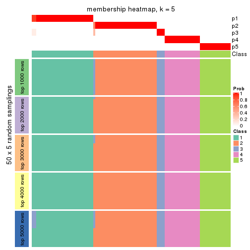</p>

</div>
<div id='tab-ATC-mclust-membership-heatmap-5'>
<pre><code class="r">membership_heatmap(res, k = 6)
</code></pre>

<p></p>

</div>
</div>

As soon as we have had the classes for columns, we can look for signatures
which are significantly different between classes which can be candidate marks
for certain classes. Following are the heatmaps for signatures.


Signature heatmaps where rows are scaled:


<script>
$( function() {
	$( '#tabs-ATC-mclust-get-signatures' ).tabs();
} );
</script>
<div id='tabs-ATC-mclust-get-signatures'>
<ul>
<li><a href='#tab-ATC-mclust-get-signatures-1'>k = 2</a></li>
<li><a href='#tab-ATC-mclust-get-signatures-2'>k = 3</a></li>
<li><a href='#tab-ATC-mclust-get-signatures-3'>k = 4</a></li>
<li><a href='#tab-ATC-mclust-get-signatures-4'>k = 5</a></li>
<li><a href='#tab-ATC-mclust-get-signatures-5'>k = 6</a></li>
</ul>
<div id='tab-ATC-mclust-get-signatures-1'>
<pre><code class="r">get_signatures(res, k = 2)
</code></pre>

<p></p>

</div>
<div id='tab-ATC-mclust-get-signatures-2'>
<pre><code class="r">get_signatures(res, k = 3)
</code></pre>

<p></p>

</div>
<div id='tab-ATC-mclust-get-signatures-3'>
<pre><code class="r">get_signatures(res, k = 4)
</code></pre>

<p></p>

</div>
<div id='tab-ATC-mclust-get-signatures-4'>
<pre><code class="r">get_signatures(res, k = 5)
</code></pre>

<p></p>

</div>
<div id='tab-ATC-mclust-get-signatures-5'>
<pre><code class="r">get_signatures(res, k = 6)
</code></pre>

<p></p>

</div>
</div>


Signature heatmaps where rows are not scaled:


<script>
$( function() {
	$( '#tabs-ATC-mclust-get-signatures-no-scale' ).tabs();
} );
</script>
<div id='tabs-ATC-mclust-get-signatures-no-scale'>
<ul>
<li><a href='#tab-ATC-mclust-get-signatures-no-scale-1'>k = 2</a></li>
<li><a href='#tab-ATC-mclust-get-signatures-no-scale-2'>k = 3</a></li>
<li><a href='#tab-ATC-mclust-get-signatures-no-scale-3'>k = 4</a></li>
<li><a href='#tab-ATC-mclust-get-signatures-no-scale-4'>k = 5</a></li>
<li><a href='#tab-ATC-mclust-get-signatures-no-scale-5'>k = 6</a></li>
</ul>
<div id='tab-ATC-mclust-get-signatures-no-scale-1'>
<pre><code class="r">get_signatures(res, k = 2, scale_rows = FALSE)
</code></pre>

<p></p>

</div>
<div id='tab-ATC-mclust-get-signatures-no-scale-2'>
<pre><code class="r">get_signatures(res, k = 3, scale_rows = FALSE)
</code></pre>

<p>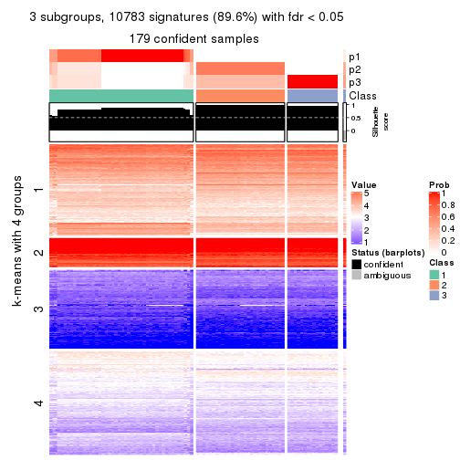</p>

</div>
<div id='tab-ATC-mclust-get-signatures-no-scale-3'>
<pre><code class="r">get_signatures(res, k = 4, scale_rows = FALSE)
</code></pre>

<p></p>

</div>
<div id='tab-ATC-mclust-get-signatures-no-scale-4'>
<pre><code class="r">get_signatures(res, k = 5, scale_rows = FALSE)
</code></pre>

<p></p>

</div>
<div id='tab-ATC-mclust-get-signatures-no-scale-5'>
<pre><code class="r">get_signatures(res, k = 6, scale_rows = FALSE)
</code></pre>

<p></p>

</div>
</div>


Compare the overlap of signatures from different k:

```r
compare_signatures(res)
```


`get_signature()` returns a data frame invisibly. TO get the list of signatures, the function
call should be assigned to a variable explicitly. In following code, if `plot` argument is set
to `FALSE`, no heatmap is plotted while only the differential analysis is performed.

```r
# code only for demonstration
tb = get_signature(res, k = ..., plot = FALSE)
```

An example of the output of `tb` is:

```
#>   which_row         fdr    mean_1    mean_2 scaled_mean_1 scaled_mean_2 km
#> 1        38 0.042760348  8.373488  9.131774    -0.5533452     0.5164555  1
#> 2        40 0.018707592  7.106213  8.469186    -0.6173731     0.5762149  1
#> 3        55 0.019134737 10.221463 11.207825    -0.6159697     0.5749050  1
#> 4        59 0.006059896  5.921854  7.869574    -0.6899429     0.6439467  1
#> 5        60 0.018055526  8.928898 10.211722    -0.6204761     0.5791110  1
#> 6        98 0.009384629 15.714769 14.887706     0.6635654    -0.6193277  2
...
```

The columns in `tb` are:

1. `which_row`: row indices corresponding to the input matrix.
2. `fdr`: FDR for the differential test. 
3. `mean_x`: The mean value in group x.
4. `scaled_mean_x`: The mean value in group x after rows are scaled.
5. `km`: Row groups if k-means clustering is applied to rows.


UMAP plot which shows how samples are separated.


<script>
$( function() {
	$( '#tabs-ATC-mclust-dimension-reduction' ).tabs();
} );
</script>
<div id='tabs-ATC-mclust-dimension-reduction'>
<ul>
<li><a href='#tab-ATC-mclust-dimension-reduction-1'>k = 2</a></li>
<li><a href='#tab-ATC-mclust-dimension-reduction-2'>k = 3</a></li>
<li><a href='#tab-ATC-mclust-dimension-reduction-3'>k = 4</a></li>
<li><a href='#tab-ATC-mclust-dimension-reduction-4'>k = 5</a></li>
<li><a href='#tab-ATC-mclust-dimension-reduction-5'>k = 6</a></li>
</ul>
<div id='tab-ATC-mclust-dimension-reduction-1'>
<pre><code class="r">dimension_reduction(res, k = 2, method = &quot;UMAP&quot;)
</code></pre>

<p></p>

</div>
<div id='tab-ATC-mclust-dimension-reduction-2'>
<pre><code class="r">dimension_reduction(res, k = 3, method = &quot;UMAP&quot;)
</code></pre>

<p></p>

</div>
<div id='tab-ATC-mclust-dimension-reduction-3'>
<pre><code class="r">dimension_reduction(res, k = 4, method = &quot;UMAP&quot;)
</code></pre>

<p></p>

</div>
<div id='tab-ATC-mclust-dimension-reduction-4'>
<pre><code class="r">dimension_reduction(res, k = 5, method = &quot;UMAP&quot;)
</code></pre>

<p></p>

</div>
<div id='tab-ATC-mclust-dimension-reduction-5'>
<pre><code class="r">dimension_reduction(res, k = 6, method = &quot;UMAP&quot;)
</code></pre>

<p></p>

</div>
</div>


Following heatmap shows how subgroups are split when increasing `k`:

```r
collect_classes(res)
```


If matrix rows can be associated to genes, consider to use `functional_enrichment(res,
...)` to perform function enrichment for the signature genes. See [this vignette](http://bioconductor.org/packages/devel/bioc/vignettes/cola/inst/doc/functional_enrichment.html) for more detailed explanations.


 

---------------------------------------------------


### ATC:NMF**


The object with results only for a single top-value method and a single partition method 
can be extracted as:

```r
res = res_list["ATC", "NMF"]
# you can also extract it by
# res = res_list["ATC:NMF"]
```

A summary of `res` and all the functions that can be applied to it:

```r
res
```

```
#> A 'ConsensusPartition' object with k = 2, 3, 4, 5, 6.
#>   On a matrix with 12029 rows and 181 columns.
#>   Top rows (1000, 2000, 3000, 4000, 5000) are extracted by 'ATC' method.
#>   Subgroups are detected by 'NMF' method.
#>   Performed in total 1250 partitions by row resampling.
#>   Best k for subgroups seems to be 3.
#> 
#> Following methods can be applied to this 'ConsensusPartition' object:
#>  [1] "cola_report"             "collect_classes"         "collect_plots"          
#>  [4] "collect_stats"           "colnames"                "compare_signatures"     
#>  [7] "consensus_heatmap"       "dimension_reduction"     "functional_enrichment"  
#> [10] "get_anno_col"            "get_anno"                "get_classes"            
#> [13] "get_consensus"           "get_matrix"              "get_membership"         
#> [16] "get_param"               "get_signatures"          "get_stats"              
#> [19] "is_best_k"               "is_stable_k"             "membership_heatmap"     
#> [22] "ncol"                    "nrow"                    "plot_ecdf"              
#> [25] "rownames"                "select_partition_number" "show"                   
#> [28] "suggest_best_k"          "test_to_known_factors"
```

`collect_plots()` function collects all the plots made from `res` for all `k` (number of partitions)
into one single page to provide an easy and fast comparison between different `k`.

```r
collect_plots(res)
```


The plots are:

- The first row: a plot of the ECDF (empirical cumulative distribution
  function) curves of the consensus matrix for each `k` and the heatmap of
  predicted classes for each `k`.
- The second row: heatmaps of the consensus matrix for each `k`.
- The third row: heatmaps of the membership matrix for each `k`.
- The fouth row: heatmaps of the signatures for each `k`.

All the plots in panels can be made by individual functions and they are
plotted later in this section.

`select_partition_number()` produces several plots showing different
statistics for choosing "optimized" `k`. There are following statistics:

- ECDF curves of the consensus matrix for each `k`;
- 1-PAC. [The PAC
  score](https://en.wikipedia.org/wiki/Consensus_clustering#Over-interpretation_potential_of_consensus_clustering)
  measures the proportion of the ambiguous subgrouping.
- Mean silhouette score.
- Concordance. The mean probability of fiting the consensus class ids in all
  partitions.
- Area increased. Denote $A_k$ as the area under the ECDF curve for current
  `k`, the area increased is defined as $A_k - A_{k-1}$.
- Rand index. The percent of pairs of samples that are both in a same cluster
  or both are not in a same cluster in the partition of k and k-1.
- Jaccard index. The ratio of pairs of samples are both in a same cluster in
  the partition of k and k-1 and the pairs of samples are both in a same
  cluster in the partition k or k-1.

The detailed explanations of these statistics can be found in [the _cola_
vignette](http://bioconductor.org/packages/devel/bioc/vignettes/cola/inst/doc/cola.html#toc_13).

Generally speaking, lower PAC score, higher mean silhouette score or higher
concordance corresponds to better partition. Rand index and Jaccard index
measure how similar the current partition is compared to partition with `k-1`.
If they are too similar, we won't accept `k` is better than `k-1`.

```r
select_partition_number(res)
```


The numeric values for all these statistics can be obtained by `get_stats()`.

```r
get_stats(res)
```

```
#>   k 1-PAC mean_silhouette concordance area_increased  Rand Jaccard
#> 2 2 1.000           1.000       1.000         0.5029 0.498   0.498
#> 3 3 1.000           0.954       0.972         0.0567 0.972   0.945
#> 4 4 0.989           0.962       0.978         0.0222 0.990   0.978
#> 5 5 0.898           0.945       0.963         0.0312 1.000   1.000
#> 6 6 0.757           0.842       0.892         0.0811 1.000   1.000
```

`suggest_best_k()` suggests the best $k$ based on these statistics. The rules are as follows:

- All $k$ with Jaccard index larger than 0.95 are removed because increasing
  $k$ does not provide enough extra information. If all $k$ are removed, it is
  marked as no subgroup is detected.
- For all $k$ with 1-PAC score larger than 0.9, the maximal $k$ is taken as
  the best $k$, and other $k$ are marked as optional $k$.
- If it does not fit the second rule. The $k$ with the maximal vote of the
  highest 1-PAC score, highest mean silhouette, and highest concordance is
  taken as the best $k$.

```r
suggest_best_k(res)
```

```
#> [1] 3
#> attr(,"optional")
#> [1] 2
```

There is also optional best $k$ = 2 that is worth to check.

Following shows the table of the partitions (You need to click the **show/hide
code output** link to see it). The membership matrix (columns with name `p*`)
is inferred by
[`clue::cl_consensus()`](https://www.rdocumentation.org/link/cl_consensus?package=clue)
function with the `SE` method. Basically the value in the membership matrix
represents the probability to belong to a certain group. The finall class
label for an item is determined with the group with highest probability it
belongs to.

In `get_classes()` function, the entropy is calculated from the membership
matrix and the silhouette score is calculated from the consensus matrix.


<script>
$( function() {
	$( '#tabs-ATC-NMF-get-classes' ).tabs();
} );
</script>
<div id='tabs-ATC-NMF-get-classes'>
<ul>
<li><a href='#tab-ATC-NMF-get-classes-1'>k = 2</a></li>
<li><a href='#tab-ATC-NMF-get-classes-2'>k = 3</a></li>
<li><a href='#tab-ATC-NMF-get-classes-3'>k = 4</a></li>
<li><a href='#tab-ATC-NMF-get-classes-4'>k = 5</a></li>
<li><a href='#tab-ATC-NMF-get-classes-5'>k = 6</a></li>
</ul>

<div id='tab-ATC-NMF-get-classes-1'>
<p><a id='tab-ATC-NMF-get-classes-1-a' style='color:#0366d6' href='#'>show/hide code output</a></p>
<pre><code class="r">cbind(get_classes(res, k = 2), get_membership(res, k = 2))
</code></pre>

<pre><code>#&gt;           class entropy silhouette p1 p2
#&gt; SRR315112     2       0          1  0  1
#&gt; SRR315113     1       0          1  1  0
#&gt; SRR315114     1       0          1  1  0
#&gt; SRR315115     2       0          1  0  1
#&gt; SRR315116     2       0          1  0  1
#&gt; SRR566986     2       0          1  0  1
#&gt; SRR566987     2       0          1  0  1
#&gt; SRR566988     2       0          1  0  1
#&gt; SRR566989     2       0          1  0  1
#&gt; SRR566990     2       0          1  0  1
#&gt; SRR566991     2       0          1  0  1
#&gt; SRR566992     2       0          1  0  1
#&gt; SRR566993     2       0          1  0  1
#&gt; SRR566994     2       0          1  0  1
#&gt; SRR566995     2       0          1  0  1
#&gt; SRR566996     2       0          1  0  1
#&gt; SRR566997     2       0          1  0  1
#&gt; SRR566998     2       0          1  0  1
#&gt; SRR566999     2       0          1  0  1
#&gt; SRR567000     2       0          1  0  1
#&gt; SRR567001     2       0          1  0  1
#&gt; SRR567002     2       0          1  0  1
#&gt; SRR567003     2       0          1  0  1
#&gt; SRR567004     2       0          1  0  1
#&gt; SRR567005     2       0          1  0  1
#&gt; SRR567006     2       0          1  0  1
#&gt; SRR567007     2       0          1  0  1
#&gt; SRR567008     2       0          1  0  1
#&gt; SRR567009     2       0          1  0  1
#&gt; SRR567010     2       0          1  0  1
#&gt; SRR567011     2       0          1  0  1
#&gt; SRR567012     2       0          1  0  1
#&gt; SRR567013     2       0          1  0  1
#&gt; SRR567014     2       0          1  0  1
#&gt; SRR567015     2       0          1  0  1
#&gt; SRR567016     2       0          1  0  1
#&gt; SRR567017     2       0          1  0  1
#&gt; SRR567018     2       0          1  0  1
#&gt; SRR567019     2       0          1  0  1
#&gt; SRR567020     2       0          1  0  1
#&gt; SRR567021     2       0          1  0  1
#&gt; SRR567022     2       0          1  0  1
#&gt; SRR567023     2       0          1  0  1
#&gt; SRR567024     2       0          1  0  1
#&gt; SRR567025     2       0          1  0  1
#&gt; SRR567026     2       0          1  0  1
#&gt; SRR567027     2       0          1  0  1
#&gt; SRR567028     2       0          1  0  1
#&gt; SRR567029     2       0          1  0  1
#&gt; SRR567030     2       0          1  0  1
#&gt; SRR567031     2       0          1  0  1
#&gt; SRR567032     2       0          1  0  1
#&gt; SRR567033     2       0          1  0  1
#&gt; SRR567034     2       0          1  0  1
#&gt; SRR567035     2       0          1  0  1
#&gt; SRR567036     2       0          1  0  1
#&gt; SRR567037     2       0          1  0  1
#&gt; SRR567038     2       0          1  0  1
#&gt; SRR567039     2       0          1  0  1
#&gt; SRR567040     2       0          1  0  1
#&gt; SRR567041     2       0          1  0  1
#&gt; SRR567042     2       0          1  0  1
#&gt; SRR567043     2       0          1  0  1
#&gt; SRR567044     2       0          1  0  1
#&gt; SRR567045     2       0          1  0  1
#&gt; SRR567046     2       0          1  0  1
#&gt; SRR567047     2       0          1  0  1
#&gt; SRR567048     2       0          1  0  1
#&gt; SRR567049     2       0          1  0  1
#&gt; SRR567050     2       0          1  0  1
#&gt; SRR567051     2       0          1  0  1
#&gt; SRR567052     2       0          1  0  1
#&gt; SRR567053     2       0          1  0  1
#&gt; SRR567054     2       0          1  0  1
#&gt; SRR567055     2       0          1  0  1
#&gt; SRR567056     2       0          1  0  1
#&gt; SRR567057     2       0          1  0  1
#&gt; SRR567058     2       0          1  0  1
#&gt; SRR567059     2       0          1  0  1
#&gt; SRR567060     2       0          1  0  1
#&gt; SRR567061     2       0          1  0  1
#&gt; SRR567062     2       0          1  0  1
#&gt; SRR567063     2       0          1  0  1
#&gt; SRR567064     2       0          1  0  1
#&gt; SRR567065     2       0          1  0  1
#&gt; SRR567066     2       0          1  0  1
#&gt; SRR567067     2       0          1  0  1
#&gt; SRR567068     2       0          1  0  1
#&gt; SRR567069     2       0          1  0  1
#&gt; SRR567070     2       0          1  0  1
#&gt; SRR567071     2       0          1  0  1
#&gt; SRR567072     2       0          1  0  1
#&gt; SRR567073     2       0          1  0  1
#&gt; SRR567074     2       0          1  0  1
#&gt; SRR567075     2       0          1  0  1
#&gt; SRR567076     1       0          1  1  0
#&gt; SRR567077     1       0          1  1  0
#&gt; SRR567078     1       0          1  1  0
#&gt; SRR567079     1       0          1  1  0
#&gt; SRR567080     1       0          1  1  0
#&gt; SRR567081     1       0          1  1  0
#&gt; SRR567082     1       0          1  1  0
#&gt; SRR567083     1       0          1  1  0
#&gt; SRR567084     1       0          1  1  0
#&gt; SRR567085     1       0          1  1  0
#&gt; SRR567086     1       0          1  1  0
#&gt; SRR567087     1       0          1  1  0
#&gt; SRR567088     1       0          1  1  0
#&gt; SRR567089     1       0          1  1  0
#&gt; SRR567090     1       0          1  1  0
#&gt; SRR567091     1       0          1  1  0
#&gt; SRR567092     1       0          1  1  0
#&gt; SRR567093     1       0          1  1  0
#&gt; SRR567094     1       0          1  1  0
#&gt; SRR567095     1       0          1  1  0
#&gt; SRR567096     1       0          1  1  0
#&gt; SRR567097     1       0          1  1  0
#&gt; SRR567098     1       0          1  1  0
#&gt; SRR567099     1       0          1  1  0
#&gt; SRR567100     1       0          1  1  0
#&gt; SRR567101     1       0          1  1  0
#&gt; SRR567102     1       0          1  1  0
#&gt; SRR567103     1       0          1  1  0
#&gt; SRR567104     1       0          1  1  0
#&gt; SRR567105     1       0          1  1  0
#&gt; SRR567106     1       0          1  1  0
#&gt; SRR567107     1       0          1  1  0
#&gt; SRR567108     1       0          1  1  0
#&gt; SRR567109     1       0          1  1  0
#&gt; SRR567110     1       0          1  1  0
#&gt; SRR567111     1       0          1  1  0
#&gt; SRR567112     1       0          1  1  0
#&gt; SRR567113     1       0          1  1  0
#&gt; SRR567114     1       0          1  1  0
#&gt; SRR567115     1       0          1  1  0
#&gt; SRR567116     1       0          1  1  0
#&gt; SRR567117     1       0          1  1  0
#&gt; SRR567118     1       0          1  1  0
#&gt; SRR567119     1       0          1  1  0
#&gt; SRR567120     1       0          1  1  0
#&gt; SRR567121     1       0          1  1  0
#&gt; SRR567122     1       0          1  1  0
#&gt; SRR567123     1       0          1  1  0
#&gt; SRR567124     1       0          1  1  0
#&gt; SRR567125     1       0          1  1  0
#&gt; SRR567126     1       0          1  1  0
#&gt; SRR567127     1       0          1  1  0
#&gt; SRR567128     1       0          1  1  0
#&gt; SRR567129     1       0          1  1  0
#&gt; SRR567130     1       0          1  1  0
#&gt; SRR567131     1       0          1  1  0
#&gt; SRR567132     1       0          1  1  0
#&gt; SRR567133     1       0          1  1  0
#&gt; SRR567134     1       0          1  1  0
#&gt; SRR567135     1       0          1  1  0
#&gt; SRR567136     1       0          1  1  0
#&gt; SRR567137     1       0          1  1  0
#&gt; SRR567138     1       0          1  1  0
#&gt; SRR567139     1       0          1  1  0
#&gt; SRR567140     1       0          1  1  0
#&gt; SRR567141     1       0          1  1  0
#&gt; SRR567142     1       0          1  1  0
#&gt; SRR567143     1       0          1  1  0
#&gt; SRR567144     1       0          1  1  0
#&gt; SRR567145     1       0          1  1  0
#&gt; SRR567146     1       0          1  1  0
#&gt; SRR567147     1       0          1  1  0
#&gt; SRR567148     1       0          1  1  0
#&gt; SRR567149     1       0          1  1  0
#&gt; SRR567150     1       0          1  1  0
#&gt; SRR567151     1       0          1  1  0
#&gt; SRR567152     1       0          1  1  0
#&gt; SRR567153     1       0          1  1  0
#&gt; SRR567154     1       0          1  1  0
#&gt; SRR567155     1       0          1  1  0
#&gt; SRR567156     1       0          1  1  0
#&gt; SRR567157     1       0          1  1  0
#&gt; SRR567158     1       0          1  1  0
#&gt; SRR567159     1       0          1  1  0
#&gt; SRR567160     1       0          1  1  0
#&gt; SRR567161     1       0          1  1  0
</code></pre>

<script>
$('#tab-ATC-NMF-get-classes-1-a').parent().next().next().hide();
$('#tab-ATC-NMF-get-classes-1-a').click(function(){
  $('#tab-ATC-NMF-get-classes-1-a').parent().next().next().toggle();
  return(false);
});
</script>
</div>

<div id='tab-ATC-NMF-get-classes-2'>
<p><a id='tab-ATC-NMF-get-classes-2-a' style='color:#0366d6' href='#'>show/hide code output</a></p>
<pre><code class="r">cbind(get_classes(res, k = 3), get_membership(res, k = 3))
</code></pre>

<pre><code>#&gt;           class entropy silhouette    p1    p2    p3
#&gt; SRR315112     3  0.6079      0.541 0.000 0.388 0.612
#&gt; SRR315113     3  0.6529      0.354 0.368 0.012 0.620
#&gt; SRR315114     3  0.6410      0.237 0.420 0.004 0.576
#&gt; SRR315115     3  0.6154      0.504 0.000 0.408 0.592
#&gt; SRR315116     3  0.6079      0.541 0.000 0.388 0.612
#&gt; SRR566986     2  0.0237      0.966 0.000 0.996 0.004
#&gt; SRR566987     2  0.0424      0.965 0.000 0.992 0.008
#&gt; SRR566988     2  0.0000      0.966 0.000 1.000 0.000
#&gt; SRR566989     2  0.0237      0.966 0.000 0.996 0.004
#&gt; SRR566990     2  0.0237      0.966 0.000 0.996 0.004
#&gt; SRR566991     2  0.0000      0.966 0.000 1.000 0.000
#&gt; SRR566992     2  0.0237      0.966 0.000 0.996 0.004
#&gt; SRR566993     2  0.0424      0.965 0.000 0.992 0.008
#&gt; SRR566994     2  0.0424      0.965 0.000 0.992 0.008
#&gt; SRR566995     2  0.0424      0.965 0.000 0.992 0.008
#&gt; SRR566996     2  0.0000      0.966 0.000 1.000 0.000
#&gt; SRR566997     2  0.0000      0.966 0.000 1.000 0.000
#&gt; SRR566998     2  0.0747      0.963 0.000 0.984 0.016
#&gt; SRR566999     2  0.0592      0.964 0.000 0.988 0.012
#&gt; SRR567000     2  0.0237      0.966 0.000 0.996 0.004
#&gt; SRR567001     2  0.0237      0.966 0.000 0.996 0.004
#&gt; SRR567002     2  0.0237      0.966 0.000 0.996 0.004
#&gt; SRR567003     2  0.0237      0.966 0.000 0.996 0.004
#&gt; SRR567004     2  0.0237      0.966 0.000 0.996 0.004
#&gt; SRR567005     2  0.0000      0.966 0.000 1.000 0.000
#&gt; SRR567006     2  0.0000      0.966 0.000 1.000 0.000
#&gt; SRR567007     2  0.0000      0.966 0.000 1.000 0.000
#&gt; SRR567008     2  0.0000      0.966 0.000 1.000 0.000
#&gt; SRR567009     2  0.0237      0.966 0.000 0.996 0.004
#&gt; SRR567010     2  0.0424      0.965 0.000 0.992 0.008
#&gt; SRR567011     2  0.0237      0.966 0.000 0.996 0.004
#&gt; SRR567012     2  0.0592      0.964 0.000 0.988 0.012
#&gt; SRR567013     2  0.0000      0.966 0.000 1.000 0.000
#&gt; SRR567014     2  0.1163      0.958 0.000 0.972 0.028
#&gt; SRR567015     2  0.1529      0.950 0.000 0.960 0.040
#&gt; SRR567016     2  0.1411      0.953 0.000 0.964 0.036
#&gt; SRR567017     2  0.1529      0.950 0.000 0.960 0.040
#&gt; SRR567018     2  0.0747      0.963 0.000 0.984 0.016
#&gt; SRR567019     2  0.1031      0.960 0.000 0.976 0.024
#&gt; SRR567020     2  0.1411      0.953 0.000 0.964 0.036
#&gt; SRR567021     2  0.0892      0.962 0.000 0.980 0.020
#&gt; SRR567022     2  0.0237      0.966 0.000 0.996 0.004
#&gt; SRR567023     2  0.1643      0.947 0.000 0.956 0.044
#&gt; SRR567024     2  0.1643      0.947 0.000 0.956 0.044
#&gt; SRR567025     2  0.1031      0.960 0.000 0.976 0.024
#&gt; SRR567026     2  0.1163      0.958 0.000 0.972 0.028
#&gt; SRR567027     2  0.1163      0.958 0.000 0.972 0.028
#&gt; SRR567028     2  0.1529      0.950 0.000 0.960 0.040
#&gt; SRR567029     2  0.1643      0.947 0.000 0.956 0.044
#&gt; SRR567030     2  0.1643      0.947 0.000 0.956 0.044
#&gt; SRR567031     2  0.1529      0.950 0.000 0.960 0.040
#&gt; SRR567032     2  0.1643      0.947 0.000 0.956 0.044
#&gt; SRR567033     2  0.1289      0.955 0.000 0.968 0.032
#&gt; SRR567034     2  0.1163      0.958 0.000 0.972 0.028
#&gt; SRR567035     2  0.0747      0.963 0.000 0.984 0.016
#&gt; SRR567036     2  0.1289      0.956 0.000 0.968 0.032
#&gt; SRR567037     2  0.1411      0.953 0.000 0.964 0.036
#&gt; SRR567038     2  0.1289      0.955 0.000 0.968 0.032
#&gt; SRR567039     2  0.1529      0.950 0.000 0.960 0.040
#&gt; SRR567040     2  0.0892      0.962 0.000 0.980 0.020
#&gt; SRR567041     2  0.0592      0.964 0.000 0.988 0.012
#&gt; SRR567042     2  0.0237      0.966 0.000 0.996 0.004
#&gt; SRR567043     2  0.0424      0.965 0.000 0.992 0.008
#&gt; SRR567044     2  0.1643      0.954 0.000 0.956 0.044
#&gt; SRR567045     2  0.1753      0.952 0.000 0.952 0.048
#&gt; SRR567046     2  0.1643      0.954 0.000 0.956 0.044
#&gt; SRR567047     2  0.1643      0.954 0.000 0.956 0.044
#&gt; SRR567048     2  0.1529      0.956 0.000 0.960 0.040
#&gt; SRR567049     2  0.1529      0.956 0.000 0.960 0.040
#&gt; SRR567050     2  0.1643      0.954 0.000 0.956 0.044
#&gt; SRR567051     2  0.1753      0.952 0.000 0.952 0.048
#&gt; SRR567052     2  0.1643      0.954 0.000 0.956 0.044
#&gt; SRR567053     2  0.1643      0.954 0.000 0.956 0.044
#&gt; SRR567054     2  0.1529      0.956 0.000 0.960 0.040
#&gt; SRR567055     2  0.1753      0.952 0.000 0.952 0.048
#&gt; SRR567056     2  0.1753      0.952 0.000 0.952 0.048
#&gt; SRR567057     2  0.1753      0.952 0.000 0.952 0.048
#&gt; SRR567058     2  0.1860      0.949 0.000 0.948 0.052
#&gt; SRR567059     2  0.1860      0.949 0.000 0.948 0.052
#&gt; SRR567060     2  0.1753      0.952 0.000 0.952 0.048
#&gt; SRR567061     2  0.1529      0.956 0.000 0.960 0.040
#&gt; SRR567062     2  0.1643      0.954 0.000 0.956 0.044
#&gt; SRR567063     2  0.1860      0.949 0.000 0.948 0.052
#&gt; SRR567064     2  0.1860      0.949 0.000 0.948 0.052
#&gt; SRR567065     2  0.1643      0.954 0.000 0.956 0.044
#&gt; SRR567066     2  0.1753      0.952 0.000 0.952 0.048
#&gt; SRR567067     2  0.1753      0.952 0.000 0.952 0.048
#&gt; SRR567068     2  0.1643      0.954 0.000 0.956 0.044
#&gt; SRR567069     2  0.1753      0.952 0.000 0.952 0.048
#&gt; SRR567070     2  0.1753      0.952 0.000 0.952 0.048
#&gt; SRR567071     2  0.1753      0.952 0.000 0.952 0.048
#&gt; SRR567072     2  0.1860      0.949 0.000 0.948 0.052
#&gt; SRR567073     2  0.1529      0.956 0.000 0.960 0.040
#&gt; SRR567074     2  0.1753      0.952 0.000 0.952 0.048
#&gt; SRR567075     2  0.1529      0.956 0.000 0.960 0.040
#&gt; SRR567076     1  0.0000      0.992 1.000 0.000 0.000
#&gt; SRR567077     1  0.0000      0.992 1.000 0.000 0.000
#&gt; SRR567078     1  0.0000      0.992 1.000 0.000 0.000
#&gt; SRR567079     1  0.0000      0.992 1.000 0.000 0.000
#&gt; SRR567080     1  0.0000      0.992 1.000 0.000 0.000
#&gt; SRR567081     1  0.0000      0.992 1.000 0.000 0.000
#&gt; SRR567082     1  0.0000      0.992 1.000 0.000 0.000
#&gt; SRR567083     1  0.0000      0.992 1.000 0.000 0.000
#&gt; SRR567084     1  0.0000      0.992 1.000 0.000 0.000
#&gt; SRR567085     1  0.0000      0.992 1.000 0.000 0.000
#&gt; SRR567086     1  0.0000      0.992 1.000 0.000 0.000
#&gt; SRR567087     1  0.0000      0.992 1.000 0.000 0.000
#&gt; SRR567088     1  0.0000      0.992 1.000 0.000 0.000
#&gt; SRR567089     1  0.0000      0.992 1.000 0.000 0.000
#&gt; SRR567090     1  0.0000      0.992 1.000 0.000 0.000
#&gt; SRR567091     1  0.0000      0.992 1.000 0.000 0.000
#&gt; SRR567092     1  0.0000      0.992 1.000 0.000 0.000
#&gt; SRR567093     1  0.0000      0.992 1.000 0.000 0.000
#&gt; SRR567094     1  0.0000      0.992 1.000 0.000 0.000
#&gt; SRR567095     1  0.0000      0.992 1.000 0.000 0.000
#&gt; SRR567096     1  0.0000      0.992 1.000 0.000 0.000
#&gt; SRR567097     1  0.0000      0.992 1.000 0.000 0.000
#&gt; SRR567098     1  0.0000      0.992 1.000 0.000 0.000
#&gt; SRR567099     1  0.0000      0.992 1.000 0.000 0.000
#&gt; SRR567100     1  0.0000      0.992 1.000 0.000 0.000
#&gt; SRR567101     1  0.0000      0.992 1.000 0.000 0.000
#&gt; SRR567102     1  0.0000      0.992 1.000 0.000 0.000
#&gt; SRR567103     1  0.0000      0.992 1.000 0.000 0.000
#&gt; SRR567104     1  0.0000      0.992 1.000 0.000 0.000
#&gt; SRR567105     1  0.0000      0.992 1.000 0.000 0.000
#&gt; SRR567106     1  0.0000      0.992 1.000 0.000 0.000
#&gt; SRR567107     1  0.0000      0.992 1.000 0.000 0.000
#&gt; SRR567108     1  0.0000      0.992 1.000 0.000 0.000
#&gt; SRR567109     1  0.0000      0.992 1.000 0.000 0.000
#&gt; SRR567110     1  0.0000      0.992 1.000 0.000 0.000
#&gt; SRR567111     1  0.0000      0.992 1.000 0.000 0.000
#&gt; SRR567112     1  0.0000      0.992 1.000 0.000 0.000
#&gt; SRR567113     1  0.0000      0.992 1.000 0.000 0.000
#&gt; SRR567114     1  0.0000      0.992 1.000 0.000 0.000
#&gt; SRR567115     1  0.0000      0.992 1.000 0.000 0.000
#&gt; SRR567116     1  0.0000      0.992 1.000 0.000 0.000
#&gt; SRR567117     1  0.0000      0.992 1.000 0.000 0.000
#&gt; SRR567118     1  0.0000      0.992 1.000 0.000 0.000
#&gt; SRR567119     1  0.0000      0.992 1.000 0.000 0.000
#&gt; SRR567120     1  0.0000      0.992 1.000 0.000 0.000
#&gt; SRR567121     1  0.0000      0.992 1.000 0.000 0.000
#&gt; SRR567122     1  0.0000      0.992 1.000 0.000 0.000
#&gt; SRR567123     1  0.0000      0.992 1.000 0.000 0.000
#&gt; SRR567124     1  0.0000      0.992 1.000 0.000 0.000
#&gt; SRR567125     1  0.0000      0.992 1.000 0.000 0.000
#&gt; SRR567126     1  0.0000      0.992 1.000 0.000 0.000
#&gt; SRR567127     1  0.0000      0.992 1.000 0.000 0.000
#&gt; SRR567128     1  0.0000      0.992 1.000 0.000 0.000
#&gt; SRR567129     1  0.0000      0.992 1.000 0.000 0.000
#&gt; SRR567130     1  0.0000      0.992 1.000 0.000 0.000
#&gt; SRR567131     1  0.0000      0.992 1.000 0.000 0.000
#&gt; SRR567132     1  0.0000      0.992 1.000 0.000 0.000
#&gt; SRR567133     1  0.0000      0.992 1.000 0.000 0.000
#&gt; SRR567134     1  0.0000      0.992 1.000 0.000 0.000
#&gt; SRR567135     1  0.0000      0.992 1.000 0.000 0.000
#&gt; SRR567136     1  0.0000      0.992 1.000 0.000 0.000
#&gt; SRR567137     1  0.0000      0.992 1.000 0.000 0.000
#&gt; SRR567138     1  0.0000      0.992 1.000 0.000 0.000
#&gt; SRR567139     1  0.0000      0.992 1.000 0.000 0.000
#&gt; SRR567140     1  0.0000      0.992 1.000 0.000 0.000
#&gt; SRR567141     1  0.0000      0.992 1.000 0.000 0.000
#&gt; SRR567142     1  0.0000      0.992 1.000 0.000 0.000
#&gt; SRR567143     1  0.0000      0.992 1.000 0.000 0.000
#&gt; SRR567144     1  0.0000      0.992 1.000 0.000 0.000
#&gt; SRR567145     1  0.0000      0.992 1.000 0.000 0.000
#&gt; SRR567146     1  0.5706      0.496 0.680 0.000 0.320
#&gt; SRR567147     1  0.0000      0.992 1.000 0.000 0.000
#&gt; SRR567148     1  0.0000      0.992 1.000 0.000 0.000
#&gt; SRR567149     1  0.0000      0.992 1.000 0.000 0.000
#&gt; SRR567150     1  0.0000      0.992 1.000 0.000 0.000
#&gt; SRR567151     1  0.0000      0.992 1.000 0.000 0.000
#&gt; SRR567152     1  0.0000      0.992 1.000 0.000 0.000
#&gt; SRR567153     1  0.0000      0.992 1.000 0.000 0.000
#&gt; SRR567154     1  0.0000      0.992 1.000 0.000 0.000
#&gt; SRR567155     1  0.0000      0.992 1.000 0.000 0.000
#&gt; SRR567156     1  0.0000      0.992 1.000 0.000 0.000
#&gt; SRR567157     1  0.0000      0.992 1.000 0.000 0.000
#&gt; SRR567158     1  0.0000      0.992 1.000 0.000 0.000
#&gt; SRR567159     1  0.0000      0.992 1.000 0.000 0.000
#&gt; SRR567160     1  0.0000      0.992 1.000 0.000 0.000
#&gt; SRR567161     1  0.5706      0.496 0.680 0.000 0.320
</code></pre>

<script>
$('#tab-ATC-NMF-get-classes-2-a').parent().next().next().hide();
$('#tab-ATC-NMF-get-classes-2-a').click(function(){
  $('#tab-ATC-NMF-get-classes-2-a').parent().next().next().toggle();
  return(false);
});
</script>
</div>

<div id='tab-ATC-NMF-get-classes-3'>
<p><a id='tab-ATC-NMF-get-classes-3-a' style='color:#0366d6' href='#'>show/hide code output</a></p>
<pre><code class="r">cbind(get_classes(res, k = 4), get_membership(res, k = 4))
</code></pre>

<pre><code>#&gt;           class entropy silhouette    p1    p2    p3    p4
#&gt; SRR315112     3  0.3539      0.629 0.000 0.176 0.820 0.004
#&gt; SRR315113     3  0.3501      0.281 0.132 0.000 0.848 0.020
#&gt; SRR315114     3  0.4004      0.197 0.164 0.000 0.812 0.024
#&gt; SRR315115     3  0.4018      0.566 0.000 0.224 0.772 0.004
#&gt; SRR315116     3  0.3539      0.629 0.000 0.176 0.820 0.004
#&gt; SRR566986     2  0.0000      0.983 0.000 1.000 0.000 0.000
#&gt; SRR566987     2  0.0188      0.983 0.000 0.996 0.004 0.000
#&gt; SRR566988     2  0.0000      0.983 0.000 1.000 0.000 0.000
#&gt; SRR566989     2  0.0000      0.983 0.000 1.000 0.000 0.000
#&gt; SRR566990     2  0.0000      0.983 0.000 1.000 0.000 0.000
#&gt; SRR566991     2  0.0188      0.983 0.000 0.996 0.004 0.000
#&gt; SRR566992     2  0.0000      0.983 0.000 1.000 0.000 0.000
#&gt; SRR566993     2  0.0336      0.982 0.000 0.992 0.008 0.000
#&gt; SRR566994     2  0.0336      0.982 0.000 0.992 0.008 0.000
#&gt; SRR566995     2  0.0336      0.982 0.000 0.992 0.008 0.000
#&gt; SRR566996     2  0.0000      0.983 0.000 1.000 0.000 0.000
#&gt; SRR566997     2  0.0000      0.983 0.000 1.000 0.000 0.000
#&gt; SRR566998     2  0.0336      0.982 0.000 0.992 0.008 0.000
#&gt; SRR566999     2  0.0188      0.983 0.000 0.996 0.004 0.000
#&gt; SRR567000     2  0.0000      0.983 0.000 1.000 0.000 0.000
#&gt; SRR567001     2  0.0000      0.983 0.000 1.000 0.000 0.000
#&gt; SRR567002     2  0.0000      0.983 0.000 1.000 0.000 0.000
#&gt; SRR567003     2  0.0188      0.983 0.000 0.996 0.004 0.000
#&gt; SRR567004     2  0.0000      0.983 0.000 1.000 0.000 0.000
#&gt; SRR567005     2  0.0000      0.983 0.000 1.000 0.000 0.000
#&gt; SRR567006     2  0.0000      0.983 0.000 1.000 0.000 0.000
#&gt; SRR567007     2  0.0188      0.983 0.000 0.996 0.004 0.000
#&gt; SRR567008     2  0.0000      0.983 0.000 1.000 0.000 0.000
#&gt; SRR567009     2  0.0188      0.983 0.000 0.996 0.004 0.000
#&gt; SRR567010     2  0.0188      0.983 0.000 0.996 0.004 0.000
#&gt; SRR567011     2  0.0000      0.983 0.000 1.000 0.000 0.000
#&gt; SRR567012     2  0.0336      0.982 0.000 0.992 0.008 0.000
#&gt; SRR567013     2  0.0000      0.983 0.000 1.000 0.000 0.000
#&gt; SRR567014     2  0.0336      0.982 0.000 0.992 0.008 0.000
#&gt; SRR567015     2  0.0336      0.982 0.000 0.992 0.008 0.000
#&gt; SRR567016     2  0.0336      0.982 0.000 0.992 0.008 0.000
#&gt; SRR567017     2  0.0336      0.982 0.000 0.992 0.008 0.000
#&gt; SRR567018     2  0.0188      0.983 0.000 0.996 0.004 0.000
#&gt; SRR567019     2  0.0188      0.983 0.000 0.996 0.004 0.000
#&gt; SRR567020     2  0.0336      0.982 0.000 0.992 0.008 0.000
#&gt; SRR567021     2  0.0336      0.982 0.000 0.992 0.008 0.000
#&gt; SRR567022     2  0.0469      0.979 0.000 0.988 0.000 0.012
#&gt; SRR567023     2  0.0469      0.980 0.000 0.988 0.012 0.000
#&gt; SRR567024     2  0.0336      0.982 0.000 0.992 0.008 0.000
#&gt; SRR567025     2  0.0336      0.982 0.000 0.992 0.008 0.000
#&gt; SRR567026     2  0.0336      0.982 0.000 0.992 0.008 0.000
#&gt; SRR567027     2  0.0336      0.982 0.000 0.992 0.008 0.000
#&gt; SRR567028     2  0.0524      0.981 0.000 0.988 0.008 0.004
#&gt; SRR567029     2  0.0336      0.982 0.000 0.992 0.008 0.000
#&gt; SRR567030     2  0.0469      0.980 0.000 0.988 0.012 0.000
#&gt; SRR567031     2  0.0336      0.982 0.000 0.992 0.008 0.000
#&gt; SRR567032     2  0.0469      0.980 0.000 0.988 0.012 0.000
#&gt; SRR567033     2  0.0336      0.982 0.000 0.992 0.008 0.000
#&gt; SRR567034     2  0.0524      0.981 0.000 0.988 0.008 0.004
#&gt; SRR567035     2  0.0000      0.983 0.000 1.000 0.000 0.000
#&gt; SRR567036     2  0.0336      0.982 0.000 0.992 0.008 0.000
#&gt; SRR567037     2  0.0336      0.982 0.000 0.992 0.008 0.000
#&gt; SRR567038     2  0.0336      0.982 0.000 0.992 0.008 0.000
#&gt; SRR567039     2  0.0336      0.982 0.000 0.992 0.008 0.000
#&gt; SRR567040     2  0.0188      0.983 0.000 0.996 0.004 0.000
#&gt; SRR567041     2  0.0000      0.983 0.000 1.000 0.000 0.000
#&gt; SRR567042     2  0.0469      0.979 0.000 0.988 0.000 0.012
#&gt; SRR567043     2  0.0000      0.983 0.000 1.000 0.000 0.000
#&gt; SRR567044     2  0.1151      0.975 0.000 0.968 0.024 0.008
#&gt; SRR567045     2  0.1151      0.975 0.000 0.968 0.024 0.008
#&gt; SRR567046     2  0.1151      0.975 0.000 0.968 0.024 0.008
#&gt; SRR567047     2  0.1151      0.975 0.000 0.968 0.024 0.008
#&gt; SRR567048     2  0.1151      0.975 0.000 0.968 0.024 0.008
#&gt; SRR567049     2  0.1151      0.975 0.000 0.968 0.024 0.008
#&gt; SRR567050     2  0.1151      0.975 0.000 0.968 0.024 0.008
#&gt; SRR567051     2  0.1151      0.975 0.000 0.968 0.024 0.008
#&gt; SRR567052     2  0.1151      0.975 0.000 0.968 0.024 0.008
#&gt; SRR567053     2  0.1151      0.975 0.000 0.968 0.024 0.008
#&gt; SRR567054     2  0.1151      0.975 0.000 0.968 0.024 0.008
#&gt; SRR567055     2  0.1151      0.975 0.000 0.968 0.024 0.008
#&gt; SRR567056     2  0.1151      0.975 0.000 0.968 0.024 0.008
#&gt; SRR567057     2  0.1151      0.975 0.000 0.968 0.024 0.008
#&gt; SRR567058     2  0.1151      0.975 0.000 0.968 0.024 0.008
#&gt; SRR567059     2  0.1151      0.975 0.000 0.968 0.024 0.008
#&gt; SRR567060     2  0.1151      0.975 0.000 0.968 0.024 0.008
#&gt; SRR567061     2  0.1151      0.975 0.000 0.968 0.024 0.008
#&gt; SRR567062     2  0.1151      0.975 0.000 0.968 0.024 0.008
#&gt; SRR567063     2  0.1151      0.975 0.000 0.968 0.024 0.008
#&gt; SRR567064     2  0.1284      0.972 0.000 0.964 0.024 0.012
#&gt; SRR567065     2  0.1151      0.975 0.000 0.968 0.024 0.008
#&gt; SRR567066     2  0.1151      0.975 0.000 0.968 0.024 0.008
#&gt; SRR567067     2  0.1151      0.975 0.000 0.968 0.024 0.008
#&gt; SRR567068     2  0.1151      0.975 0.000 0.968 0.024 0.008
#&gt; SRR567069     2  0.1151      0.975 0.000 0.968 0.024 0.008
#&gt; SRR567070     2  0.1151      0.975 0.000 0.968 0.024 0.008
#&gt; SRR567071     2  0.1151      0.975 0.000 0.968 0.024 0.008
#&gt; SRR567072     2  0.1151      0.975 0.000 0.968 0.024 0.008
#&gt; SRR567073     2  0.1151      0.975 0.000 0.968 0.024 0.008
#&gt; SRR567074     2  0.1151      0.975 0.000 0.968 0.024 0.008
#&gt; SRR567075     2  0.1151      0.975 0.000 0.968 0.024 0.008
#&gt; SRR567076     1  0.0000      0.980 1.000 0.000 0.000 0.000
#&gt; SRR567077     1  0.0000      0.980 1.000 0.000 0.000 0.000
#&gt; SRR567078     1  0.0000      0.980 1.000 0.000 0.000 0.000
#&gt; SRR567079     1  0.0000      0.980 1.000 0.000 0.000 0.000
#&gt; SRR567080     1  0.0000      0.980 1.000 0.000 0.000 0.000
#&gt; SRR567081     1  0.0000      0.980 1.000 0.000 0.000 0.000
#&gt; SRR567082     1  0.0000      0.980 1.000 0.000 0.000 0.000
#&gt; SRR567083     1  0.0000      0.980 1.000 0.000 0.000 0.000
#&gt; SRR567084     1  0.0000      0.980 1.000 0.000 0.000 0.000
#&gt; SRR567085     1  0.0000      0.980 1.000 0.000 0.000 0.000
#&gt; SRR567086     1  0.0000      0.980 1.000 0.000 0.000 0.000
#&gt; SRR567087     1  0.0000      0.980 1.000 0.000 0.000 0.000
#&gt; SRR567088     1  0.0000      0.980 1.000 0.000 0.000 0.000
#&gt; SRR567089     1  0.0000      0.980 1.000 0.000 0.000 0.000
#&gt; SRR567090     1  0.0000      0.980 1.000 0.000 0.000 0.000
#&gt; SRR567091     1  0.0000      0.980 1.000 0.000 0.000 0.000
#&gt; SRR567092     1  0.0000      0.980 1.000 0.000 0.000 0.000
#&gt; SRR567093     1  0.0000      0.980 1.000 0.000 0.000 0.000
#&gt; SRR567094     1  0.0000      0.980 1.000 0.000 0.000 0.000
#&gt; SRR567095     1  0.0000      0.980 1.000 0.000 0.000 0.000
#&gt; SRR567096     1  0.0000      0.980 1.000 0.000 0.000 0.000
#&gt; SRR567097     1  0.0000      0.980 1.000 0.000 0.000 0.000
#&gt; SRR567098     1  0.0000      0.980 1.000 0.000 0.000 0.000
#&gt; SRR567099     1  0.0000      0.980 1.000 0.000 0.000 0.000
#&gt; SRR567100     1  0.0188      0.977 0.996 0.000 0.000 0.004
#&gt; SRR567101     1  0.0000      0.980 1.000 0.000 0.000 0.000
#&gt; SRR567102     1  0.0336      0.975 0.992 0.000 0.000 0.008
#&gt; SRR567103     1  0.0188      0.977 0.996 0.000 0.000 0.004
#&gt; SRR567104     1  0.0000      0.980 1.000 0.000 0.000 0.000
#&gt; SRR567105     1  0.0000      0.980 1.000 0.000 0.000 0.000
#&gt; SRR567106     1  0.1576      0.957 0.948 0.000 0.004 0.048
#&gt; SRR567107     1  0.1389      0.960 0.952 0.000 0.000 0.048
#&gt; SRR567108     1  0.1389      0.960 0.952 0.000 0.000 0.048
#&gt; SRR567109     1  0.1389      0.960 0.952 0.000 0.000 0.048
#&gt; SRR567110     1  0.1389      0.960 0.952 0.000 0.000 0.048
#&gt; SRR567111     1  0.1389      0.960 0.952 0.000 0.000 0.048
#&gt; SRR567112     1  0.1389      0.960 0.952 0.000 0.000 0.048
#&gt; SRR567113     1  0.1389      0.960 0.952 0.000 0.000 0.048
#&gt; SRR567114     1  0.1389      0.960 0.952 0.000 0.000 0.048
#&gt; SRR567115     1  0.1389      0.960 0.952 0.000 0.000 0.048
#&gt; SRR567116     1  0.1389      0.960 0.952 0.000 0.000 0.048
#&gt; SRR567117     1  0.1389      0.960 0.952 0.000 0.000 0.048
#&gt; SRR567118     1  0.1389      0.960 0.952 0.000 0.000 0.048
#&gt; SRR567119     1  0.1389      0.960 0.952 0.000 0.000 0.048
#&gt; SRR567120     1  0.1389      0.960 0.952 0.000 0.000 0.048
#&gt; SRR567121     1  0.1389      0.960 0.952 0.000 0.000 0.048
#&gt; SRR567122     1  0.1389      0.960 0.952 0.000 0.000 0.048
#&gt; SRR567123     1  0.1389      0.960 0.952 0.000 0.000 0.048
#&gt; SRR567124     1  0.1389      0.960 0.952 0.000 0.000 0.048
#&gt; SRR567125     1  0.1389      0.960 0.952 0.000 0.000 0.048
#&gt; SRR567126     1  0.1389      0.960 0.952 0.000 0.000 0.048
#&gt; SRR567127     1  0.1389      0.960 0.952 0.000 0.000 0.048
#&gt; SRR567128     1  0.1389      0.960 0.952 0.000 0.000 0.048
#&gt; SRR567129     1  0.1389      0.960 0.952 0.000 0.000 0.048
#&gt; SRR567130     1  0.1389      0.960 0.952 0.000 0.000 0.048
#&gt; SRR567131     1  0.1389      0.960 0.952 0.000 0.000 0.048
#&gt; SRR567132     1  0.1389      0.960 0.952 0.000 0.000 0.048
#&gt; SRR567133     1  0.1576      0.957 0.948 0.000 0.004 0.048
#&gt; SRR567134     1  0.0000      0.980 1.000 0.000 0.000 0.000
#&gt; SRR567135     1  0.0000      0.980 1.000 0.000 0.000 0.000
#&gt; SRR567136     1  0.0592      0.969 0.984 0.000 0.000 0.016
#&gt; SRR567137     1  0.0000      0.980 1.000 0.000 0.000 0.000
#&gt; SRR567138     1  0.0000      0.980 1.000 0.000 0.000 0.000
#&gt; SRR567139     1  0.0000      0.980 1.000 0.000 0.000 0.000
#&gt; SRR567140     1  0.0000      0.980 1.000 0.000 0.000 0.000
#&gt; SRR567141     1  0.0000      0.980 1.000 0.000 0.000 0.000
#&gt; SRR567142     1  0.0000      0.980 1.000 0.000 0.000 0.000
#&gt; SRR567143     1  0.0000      0.980 1.000 0.000 0.000 0.000
#&gt; SRR567144     1  0.0000      0.980 1.000 0.000 0.000 0.000
#&gt; SRR567145     1  0.0000      0.980 1.000 0.000 0.000 0.000
#&gt; SRR567146     4  0.3484      1.000 0.144 0.004 0.008 0.844
#&gt; SRR567147     1  0.0000      0.980 1.000 0.000 0.000 0.000
#&gt; SRR567148     1  0.0000      0.980 1.000 0.000 0.000 0.000
#&gt; SRR567149     1  0.0000      0.980 1.000 0.000 0.000 0.000
#&gt; SRR567150     1  0.0000      0.980 1.000 0.000 0.000 0.000
#&gt; SRR567151     1  0.0000      0.980 1.000 0.000 0.000 0.000
#&gt; SRR567152     1  0.0000      0.980 1.000 0.000 0.000 0.000
#&gt; SRR567153     1  0.0000      0.980 1.000 0.000 0.000 0.000
#&gt; SRR567154     1  0.0000      0.980 1.000 0.000 0.000 0.000
#&gt; SRR567155     1  0.0000      0.980 1.000 0.000 0.000 0.000
#&gt; SRR567156     1  0.0000      0.980 1.000 0.000 0.000 0.000
#&gt; SRR567157     1  0.0000      0.980 1.000 0.000 0.000 0.000
#&gt; SRR567158     1  0.0000      0.980 1.000 0.000 0.000 0.000
#&gt; SRR567159     1  0.0592      0.969 0.984 0.000 0.000 0.016
#&gt; SRR567160     1  0.0000      0.980 1.000 0.000 0.000 0.000
#&gt; SRR567161     4  0.3484      1.000 0.144 0.004 0.008 0.844
</code></pre>

<script>
$('#tab-ATC-NMF-get-classes-3-a').parent().next().next().hide();
$('#tab-ATC-NMF-get-classes-3-a').click(function(){
  $('#tab-ATC-NMF-get-classes-3-a').parent().next().next().toggle();
  return(false);
});
</script>
</div>

<div id='tab-ATC-NMF-get-classes-4'>
<p><a id='tab-ATC-NMF-get-classes-4-a' style='color:#0366d6' href='#'>show/hide code output</a></p>
<pre><code class="r">cbind(get_classes(res, k = 5), get_membership(res, k = 5))
</code></pre>

<pre><code>#&gt;           class entropy silhouette    p1    p2    p3    p4 p5
#&gt; SRR315112     3  0.1630      0.810 0.000 0.036 0.944 0.016 NA
#&gt; SRR315113     3  0.2890      0.752 0.004 0.000 0.836 0.000 NA
#&gt; SRR315114     3  0.3163      0.743 0.012 0.000 0.824 0.000 NA
#&gt; SRR315115     3  0.2748      0.672 0.000 0.096 0.880 0.016 NA
#&gt; SRR315116     3  0.1331      0.812 0.000 0.040 0.952 0.008 NA
#&gt; SRR566986     2  0.0162      0.987 0.000 0.996 0.000 0.000 NA
#&gt; SRR566987     2  0.0000      0.987 0.000 1.000 0.000 0.000 NA
#&gt; SRR566988     2  0.0000      0.987 0.000 1.000 0.000 0.000 NA
#&gt; SRR566989     2  0.0000      0.987 0.000 1.000 0.000 0.000 NA
#&gt; SRR566990     2  0.0162      0.987 0.000 0.996 0.000 0.000 NA
#&gt; SRR566991     2  0.0162      0.987 0.000 0.996 0.000 0.000 NA
#&gt; SRR566992     2  0.0000      0.987 0.000 1.000 0.000 0.000 NA
#&gt; SRR566993     2  0.0162      0.987 0.000 0.996 0.000 0.000 NA
#&gt; SRR566994     2  0.0162      0.987 0.000 0.996 0.000 0.000 NA
#&gt; SRR566995     2  0.0162      0.987 0.000 0.996 0.000 0.000 NA
#&gt; SRR566996     2  0.0162      0.987 0.000 0.996 0.000 0.000 NA
#&gt; SRR566997     2  0.0162      0.987 0.000 0.996 0.000 0.000 NA
#&gt; SRR566998     2  0.0162      0.987 0.000 0.996 0.000 0.000 NA
#&gt; SRR566999     2  0.0162      0.987 0.000 0.996 0.000 0.000 NA
#&gt; SRR567000     2  0.0000      0.987 0.000 1.000 0.000 0.000 NA
#&gt; SRR567001     2  0.0000      0.987 0.000 1.000 0.000 0.000 NA
#&gt; SRR567002     2  0.0000      0.987 0.000 1.000 0.000 0.000 NA
#&gt; SRR567003     2  0.0162      0.987 0.000 0.996 0.000 0.000 NA
#&gt; SRR567004     2  0.0000      0.987 0.000 1.000 0.000 0.000 NA
#&gt; SRR567005     2  0.0162      0.987 0.000 0.996 0.000 0.000 NA
#&gt; SRR567006     2  0.0000      0.987 0.000 1.000 0.000 0.000 NA
#&gt; SRR567007     2  0.0000      0.987 0.000 1.000 0.000 0.000 NA
#&gt; SRR567008     2  0.0000      0.987 0.000 1.000 0.000 0.000 NA
#&gt; SRR567009     2  0.0162      0.987 0.000 0.996 0.000 0.000 NA
#&gt; SRR567010     2  0.0000      0.987 0.000 1.000 0.000 0.000 NA
#&gt; SRR567011     2  0.0162      0.987 0.000 0.996 0.000 0.000 NA
#&gt; SRR567012     2  0.0000      0.987 0.000 1.000 0.000 0.000 NA
#&gt; SRR567013     2  0.0000      0.987 0.000 1.000 0.000 0.000 NA
#&gt; SRR567014     2  0.0451      0.985 0.000 0.988 0.004 0.000 NA
#&gt; SRR567015     2  0.0451      0.985 0.000 0.988 0.004 0.000 NA
#&gt; SRR567016     2  0.0451      0.985 0.000 0.988 0.004 0.000 NA
#&gt; SRR567017     2  0.0451      0.985 0.000 0.988 0.004 0.000 NA
#&gt; SRR567018     2  0.0451      0.985 0.000 0.988 0.004 0.000 NA
#&gt; SRR567019     2  0.0451      0.985 0.000 0.988 0.004 0.000 NA
#&gt; SRR567020     2  0.0451      0.985 0.000 0.988 0.004 0.000 NA
#&gt; SRR567021     2  0.0451      0.985 0.000 0.988 0.004 0.000 NA
#&gt; SRR567022     2  0.1770      0.943 0.000 0.936 0.008 0.008 NA
#&gt; SRR567023     2  0.0451      0.985 0.000 0.988 0.004 0.000 NA
#&gt; SRR567024     2  0.0451      0.985 0.000 0.988 0.004 0.000 NA
#&gt; SRR567025     2  0.0451      0.985 0.000 0.988 0.004 0.000 NA
#&gt; SRR567026     2  0.0451      0.985 0.000 0.988 0.004 0.000 NA
#&gt; SRR567027     2  0.0451      0.985 0.000 0.988 0.004 0.000 NA
#&gt; SRR567028     2  0.0451      0.985 0.000 0.988 0.004 0.000 NA
#&gt; SRR567029     2  0.0451      0.985 0.000 0.988 0.004 0.000 NA
#&gt; SRR567030     2  0.0451      0.985 0.000 0.988 0.004 0.000 NA
#&gt; SRR567031     2  0.0451      0.985 0.000 0.988 0.004 0.000 NA
#&gt; SRR567032     2  0.0451      0.985 0.000 0.988 0.004 0.000 NA
#&gt; SRR567033     2  0.0451      0.985 0.000 0.988 0.004 0.000 NA
#&gt; SRR567034     2  0.0451      0.985 0.000 0.988 0.004 0.000 NA
#&gt; SRR567035     2  0.0451      0.985 0.000 0.988 0.004 0.000 NA
#&gt; SRR567036     2  0.0451      0.985 0.000 0.988 0.004 0.000 NA
#&gt; SRR567037     2  0.0451      0.985 0.000 0.988 0.004 0.000 NA
#&gt; SRR567038     2  0.0451      0.985 0.000 0.988 0.004 0.000 NA
#&gt; SRR567039     2  0.0451      0.985 0.000 0.988 0.004 0.000 NA
#&gt; SRR567040     2  0.0290      0.986 0.000 0.992 0.000 0.000 NA
#&gt; SRR567041     2  0.0290      0.986 0.000 0.992 0.000 0.000 NA
#&gt; SRR567042     2  0.1695      0.944 0.000 0.940 0.008 0.008 NA
#&gt; SRR567043     2  0.0290      0.986 0.000 0.992 0.000 0.000 NA
#&gt; SRR567044     2  0.0671      0.982 0.000 0.980 0.000 0.004 NA
#&gt; SRR567045     2  0.0671      0.982 0.000 0.980 0.000 0.004 NA
#&gt; SRR567046     2  0.0671      0.982 0.000 0.980 0.000 0.004 NA
#&gt; SRR567047     2  0.0671      0.982 0.000 0.980 0.000 0.004 NA
#&gt; SRR567048     2  0.0671      0.982 0.000 0.980 0.000 0.004 NA
#&gt; SRR567049     2  0.0671      0.982 0.000 0.980 0.000 0.004 NA
#&gt; SRR567050     2  0.0671      0.982 0.000 0.980 0.000 0.004 NA
#&gt; SRR567051     2  0.0671      0.982 0.000 0.980 0.000 0.004 NA
#&gt; SRR567052     2  0.0671      0.982 0.000 0.980 0.000 0.004 NA
#&gt; SRR567053     2  0.0671      0.982 0.000 0.980 0.000 0.004 NA
#&gt; SRR567054     2  0.0671      0.982 0.000 0.980 0.000 0.004 NA
#&gt; SRR567055     2  0.0671      0.982 0.000 0.980 0.000 0.004 NA
#&gt; SRR567056     2  0.0671      0.982 0.000 0.980 0.000 0.004 NA
#&gt; SRR567057     2  0.0671      0.982 0.000 0.980 0.000 0.004 NA
#&gt; SRR567058     2  0.0955      0.975 0.000 0.968 0.000 0.004 NA
#&gt; SRR567059     2  0.0955      0.975 0.000 0.968 0.000 0.004 NA
#&gt; SRR567060     2  0.0671      0.982 0.000 0.980 0.000 0.004 NA
#&gt; SRR567061     2  0.0671      0.982 0.000 0.980 0.000 0.004 NA
#&gt; SRR567062     2  0.0671      0.982 0.000 0.980 0.000 0.004 NA
#&gt; SRR567063     2  0.0955      0.975 0.000 0.968 0.000 0.004 NA
#&gt; SRR567064     2  0.1041      0.972 0.000 0.964 0.000 0.004 NA
#&gt; SRR567065     2  0.0671      0.982 0.000 0.980 0.000 0.004 NA
#&gt; SRR567066     2  0.0671      0.982 0.000 0.980 0.000 0.004 NA
#&gt; SRR567067     2  0.0671      0.982 0.000 0.980 0.000 0.004 NA
#&gt; SRR567068     2  0.0671      0.982 0.000 0.980 0.000 0.004 NA
#&gt; SRR567069     2  0.0671      0.982 0.000 0.980 0.000 0.004 NA
#&gt; SRR567070     2  0.0671      0.982 0.000 0.980 0.000 0.004 NA
#&gt; SRR567071     2  0.0671      0.982 0.000 0.980 0.000 0.004 NA
#&gt; SRR567072     2  0.0671      0.982 0.000 0.980 0.000 0.004 NA
#&gt; SRR567073     2  0.0671      0.982 0.000 0.980 0.000 0.004 NA
#&gt; SRR567074     2  0.0671      0.982 0.000 0.980 0.000 0.004 NA
#&gt; SRR567075     2  0.0671      0.982 0.000 0.980 0.000 0.004 NA
#&gt; SRR567076     1  0.0000      0.937 1.000 0.000 0.000 0.000 NA
#&gt; SRR567077     1  0.0290      0.934 0.992 0.000 0.000 0.000 NA
#&gt; SRR567078     1  0.0162      0.936 0.996 0.000 0.000 0.000 NA
#&gt; SRR567079     1  0.0000      0.937 1.000 0.000 0.000 0.000 NA
#&gt; SRR567080     1  0.0000      0.937 1.000 0.000 0.000 0.000 NA
#&gt; SRR567081     1  0.0162      0.936 0.996 0.000 0.000 0.000 NA
#&gt; SRR567082     1  0.0000      0.937 1.000 0.000 0.000 0.000 NA
#&gt; SRR567083     1  0.0000      0.937 1.000 0.000 0.000 0.000 NA
#&gt; SRR567084     1  0.0000      0.937 1.000 0.000 0.000 0.000 NA
#&gt; SRR567085     1  0.0162      0.936 0.996 0.000 0.000 0.000 NA
#&gt; SRR567086     1  0.0162      0.936 0.996 0.000 0.000 0.000 NA
#&gt; SRR567087     1  0.0290      0.934 0.992 0.000 0.000 0.000 NA
#&gt; SRR567088     1  0.0162      0.936 0.996 0.000 0.000 0.000 NA
#&gt; SRR567089     1  0.0000      0.937 1.000 0.000 0.000 0.000 NA
#&gt; SRR567090     1  0.0162      0.936 0.996 0.000 0.000 0.000 NA
#&gt; SRR567091     1  0.0000      0.937 1.000 0.000 0.000 0.000 NA
#&gt; SRR567092     1  0.0290      0.934 0.992 0.000 0.000 0.000 NA
#&gt; SRR567093     1  0.0162      0.936 0.996 0.000 0.000 0.000 NA
#&gt; SRR567094     1  0.0000      0.937 1.000 0.000 0.000 0.000 NA
#&gt; SRR567095     1  0.0000      0.937 1.000 0.000 0.000 0.000 NA
#&gt; SRR567096     1  0.0162      0.936 0.996 0.000 0.000 0.000 NA
#&gt; SRR567097     1  0.0290      0.934 0.992 0.000 0.000 0.000 NA
#&gt; SRR567098     1  0.0000      0.937 1.000 0.000 0.000 0.000 NA
#&gt; SRR567099     1  0.0162      0.936 0.996 0.000 0.000 0.000 NA
#&gt; SRR567100     1  0.0162      0.936 0.996 0.000 0.000 0.000 NA
#&gt; SRR567101     1  0.0162      0.936 0.996 0.000 0.000 0.000 NA
#&gt; SRR567102     1  0.0794      0.922 0.972 0.000 0.000 0.000 NA
#&gt; SRR567103     1  0.0794      0.922 0.972 0.000 0.000 0.000 NA
#&gt; SRR567104     1  0.0162      0.936 0.996 0.000 0.000 0.000 NA
#&gt; SRR567105     1  0.0000      0.937 1.000 0.000 0.000 0.000 NA
#&gt; SRR567106     1  0.2813      0.872 0.832 0.000 0.000 0.000 NA
#&gt; SRR567107     1  0.2813      0.872 0.832 0.000 0.000 0.000 NA
#&gt; SRR567108     1  0.2813      0.872 0.832 0.000 0.000 0.000 NA
#&gt; SRR567109     1  0.2813      0.872 0.832 0.000 0.000 0.000 NA
#&gt; SRR567110     1  0.2813      0.872 0.832 0.000 0.000 0.000 NA
#&gt; SRR567111     1  0.2813      0.872 0.832 0.000 0.000 0.000 NA
#&gt; SRR567112     1  0.2813      0.872 0.832 0.000 0.000 0.000 NA
#&gt; SRR567113     1  0.2813      0.872 0.832 0.000 0.000 0.000 NA
#&gt; SRR567114     1  0.2813      0.872 0.832 0.000 0.000 0.000 NA
#&gt; SRR567115     1  0.2813      0.872 0.832 0.000 0.000 0.000 NA
#&gt; SRR567116     1  0.2813      0.872 0.832 0.000 0.000 0.000 NA
#&gt; SRR567117     1  0.2813      0.872 0.832 0.000 0.000 0.000 NA
#&gt; SRR567118     1  0.2813      0.872 0.832 0.000 0.000 0.000 NA
#&gt; SRR567119     1  0.2813      0.872 0.832 0.000 0.000 0.000 NA
#&gt; SRR567120     1  0.2813      0.872 0.832 0.000 0.000 0.000 NA
#&gt; SRR567121     1  0.2813      0.872 0.832 0.000 0.000 0.000 NA
#&gt; SRR567122     1  0.2813      0.872 0.832 0.000 0.000 0.000 NA
#&gt; SRR567123     1  0.2813      0.872 0.832 0.000 0.000 0.000 NA
#&gt; SRR567124     1  0.2813      0.872 0.832 0.000 0.000 0.000 NA
#&gt; SRR567125     1  0.2813      0.872 0.832 0.000 0.000 0.000 NA
#&gt; SRR567126     1  0.2813      0.872 0.832 0.000 0.000 0.000 NA
#&gt; SRR567127     1  0.2813      0.872 0.832 0.000 0.000 0.000 NA
#&gt; SRR567128     1  0.2813      0.872 0.832 0.000 0.000 0.000 NA
#&gt; SRR567129     1  0.2813      0.872 0.832 0.000 0.000 0.000 NA
#&gt; SRR567130     1  0.2813      0.872 0.832 0.000 0.000 0.000 NA
#&gt; SRR567131     1  0.2813      0.872 0.832 0.000 0.000 0.000 NA
#&gt; SRR567132     1  0.2813      0.872 0.832 0.000 0.000 0.000 NA
#&gt; SRR567133     1  0.2813      0.872 0.832 0.000 0.000 0.000 NA
#&gt; SRR567134     1  0.0000      0.937 1.000 0.000 0.000 0.000 NA
#&gt; SRR567135     1  0.0000      0.937 1.000 0.000 0.000 0.000 NA
#&gt; SRR567136     1  0.1205      0.910 0.956 0.000 0.000 0.004 NA
#&gt; SRR567137     1  0.0000      0.937 1.000 0.000 0.000 0.000 NA
#&gt; SRR567138     1  0.0000      0.937 1.000 0.000 0.000 0.000 NA
#&gt; SRR567139     1  0.0000      0.937 1.000 0.000 0.000 0.000 NA
#&gt; SRR567140     1  0.0000      0.937 1.000 0.000 0.000 0.000 NA
#&gt; SRR567141     1  0.0000      0.937 1.000 0.000 0.000 0.000 NA
#&gt; SRR567142     1  0.0000      0.937 1.000 0.000 0.000 0.000 NA
#&gt; SRR567143     1  0.0000      0.937 1.000 0.000 0.000 0.000 NA
#&gt; SRR567144     1  0.0000      0.937 1.000 0.000 0.000 0.000 NA
#&gt; SRR567145     1  0.0000      0.937 1.000 0.000 0.000 0.000 NA
#&gt; SRR567146     4  0.0671      1.000 0.016 0.000 0.004 0.980 NA
#&gt; SRR567147     1  0.0000      0.937 1.000 0.000 0.000 0.000 NA
#&gt; SRR567148     1  0.0000      0.937 1.000 0.000 0.000 0.000 NA
#&gt; SRR567149     1  0.0000      0.937 1.000 0.000 0.000 0.000 NA
#&gt; SRR567150     1  0.0000      0.937 1.000 0.000 0.000 0.000 NA
#&gt; SRR567151     1  0.0000      0.937 1.000 0.000 0.000 0.000 NA
#&gt; SRR567152     1  0.0000      0.937 1.000 0.000 0.000 0.000 NA
#&gt; SRR567153     1  0.0000      0.937 1.000 0.000 0.000 0.000 NA
#&gt; SRR567154     1  0.0000      0.937 1.000 0.000 0.000 0.000 NA
#&gt; SRR567155     1  0.0000      0.937 1.000 0.000 0.000 0.000 NA
#&gt; SRR567156     1  0.0000      0.937 1.000 0.000 0.000 0.000 NA
#&gt; SRR567157     1  0.0000      0.937 1.000 0.000 0.000 0.000 NA
#&gt; SRR567158     1  0.0000      0.937 1.000 0.000 0.000 0.000 NA
#&gt; SRR567159     1  0.1282      0.907 0.952 0.000 0.000 0.004 NA
#&gt; SRR567160     1  0.0000      0.937 1.000 0.000 0.000 0.000 NA
#&gt; SRR567161     4  0.0671      1.000 0.016 0.000 0.004 0.980 NA
</code></pre>

<script>
$('#tab-ATC-NMF-get-classes-4-a').parent().next().next().hide();
$('#tab-ATC-NMF-get-classes-4-a').click(function(){
  $('#tab-ATC-NMF-get-classes-4-a').parent().next().next().toggle();
  return(false);
});
</script>
</div>

<div id='tab-ATC-NMF-get-classes-5'>
<p><a id='tab-ATC-NMF-get-classes-5-a' style='color:#0366d6' href='#'>show/hide code output</a></p>
<pre><code class="r">cbind(get_classes(res, k = 6), get_membership(res, k = 6))
</code></pre>

<pre><code>#&gt;           class entropy silhouette    p1    p2    p3    p4    p5 p6
#&gt; SRR315112     3  0.4329      0.721 0.000 0.012 0.664 0.000 0.024 NA
#&gt; SRR315113     3  0.1501      0.635 0.000 0.000 0.924 0.000 0.076 NA
#&gt; SRR315114     3  0.1910      0.618 0.000 0.000 0.892 0.000 0.108 NA
#&gt; SRR315115     3  0.5795      0.587 0.000 0.080 0.568 0.000 0.052 NA
#&gt; SRR315116     3  0.4311      0.722 0.000 0.012 0.668 0.000 0.024 NA
#&gt; SRR566986     2  0.0146      0.915 0.000 0.996 0.000 0.000 0.000 NA
#&gt; SRR566987     2  0.0146      0.914 0.000 0.996 0.000 0.000 0.004 NA
#&gt; SRR566988     2  0.0291      0.915 0.000 0.992 0.000 0.000 0.004 NA
#&gt; SRR566989     2  0.0146      0.915 0.000 0.996 0.000 0.000 0.000 NA
#&gt; SRR566990     2  0.0260      0.914 0.000 0.992 0.000 0.000 0.008 NA
#&gt; SRR566991     2  0.0000      0.914 0.000 1.000 0.000 0.000 0.000 NA
#&gt; SRR566992     2  0.0146      0.915 0.000 0.996 0.000 0.000 0.000 NA
#&gt; SRR566993     2  0.0146      0.914 0.000 0.996 0.000 0.000 0.004 NA
#&gt; SRR566994     2  0.0000      0.914 0.000 1.000 0.000 0.000 0.000 NA
#&gt; SRR566995     2  0.0146      0.914 0.000 0.996 0.000 0.000 0.004 NA
#&gt; SRR566996     2  0.0146      0.915 0.000 0.996 0.000 0.000 0.000 NA
#&gt; SRR566997     2  0.0146      0.915 0.000 0.996 0.000 0.000 0.000 NA
#&gt; SRR566998     2  0.0146      0.914 0.000 0.996 0.000 0.000 0.004 NA
#&gt; SRR566999     2  0.0000      0.914 0.000 1.000 0.000 0.000 0.000 NA
#&gt; SRR567000     2  0.0260      0.914 0.000 0.992 0.000 0.000 0.008 NA
#&gt; SRR567001     2  0.0146      0.915 0.000 0.996 0.000 0.000 0.000 NA
#&gt; SRR567002     2  0.0146      0.915 0.000 0.996 0.000 0.000 0.004 NA
#&gt; SRR567003     2  0.0146      0.914 0.000 0.996 0.000 0.000 0.004 NA
#&gt; SRR567004     2  0.0146      0.915 0.000 0.996 0.000 0.000 0.004 NA
#&gt; SRR567005     2  0.0291      0.915 0.000 0.992 0.000 0.000 0.004 NA
#&gt; SRR567006     2  0.0260      0.914 0.000 0.992 0.000 0.000 0.008 NA
#&gt; SRR567007     2  0.0146      0.915 0.000 0.996 0.000 0.000 0.004 NA
#&gt; SRR567008     2  0.0146      0.915 0.000 0.996 0.000 0.000 0.000 NA
#&gt; SRR567009     2  0.0000      0.914 0.000 1.000 0.000 0.000 0.000 NA
#&gt; SRR567010     2  0.0000      0.914 0.000 1.000 0.000 0.000 0.000 NA
#&gt; SRR567011     2  0.0146      0.915 0.000 0.996 0.000 0.000 0.004 NA
#&gt; SRR567012     2  0.0146      0.914 0.000 0.996 0.000 0.000 0.004 NA
#&gt; SRR567013     2  0.0146      0.915 0.000 0.996 0.000 0.000 0.004 NA
#&gt; SRR567014     2  0.1806      0.890 0.000 0.908 0.000 0.000 0.088 NA
#&gt; SRR567015     2  0.1753      0.893 0.000 0.912 0.000 0.000 0.084 NA
#&gt; SRR567016     2  0.2070      0.884 0.000 0.896 0.000 0.000 0.092 NA
#&gt; SRR567017     2  0.1700      0.894 0.000 0.916 0.000 0.000 0.080 NA
#&gt; SRR567018     2  0.1757      0.896 0.000 0.916 0.000 0.000 0.076 NA
#&gt; SRR567019     2  0.1757      0.896 0.000 0.916 0.000 0.000 0.076 NA
#&gt; SRR567020     2  0.2070      0.884 0.000 0.896 0.000 0.000 0.092 NA
#&gt; SRR567021     2  0.1806      0.890 0.000 0.908 0.000 0.000 0.088 NA
#&gt; SRR567022     2  0.5047      0.549 0.000 0.636 0.000 0.000 0.156 NA
#&gt; SRR567023     2  0.1866      0.891 0.000 0.908 0.000 0.000 0.084 NA
#&gt; SRR567024     2  0.2070      0.884 0.000 0.896 0.000 0.000 0.092 NA
#&gt; SRR567025     2  0.1918      0.891 0.000 0.904 0.000 0.000 0.088 NA
#&gt; SRR567026     2  0.1806      0.890 0.000 0.908 0.000 0.000 0.088 NA
#&gt; SRR567027     2  0.1700      0.894 0.000 0.916 0.000 0.000 0.080 NA
#&gt; SRR567028     2  0.1918      0.889 0.000 0.904 0.000 0.000 0.088 NA
#&gt; SRR567029     2  0.1700      0.894 0.000 0.916 0.000 0.000 0.080 NA
#&gt; SRR567030     2  0.1970      0.886 0.000 0.900 0.000 0.000 0.092 NA
#&gt; SRR567031     2  0.1970      0.886 0.000 0.900 0.000 0.000 0.092 NA
#&gt; SRR567032     2  0.1866      0.891 0.000 0.908 0.000 0.000 0.084 NA
#&gt; SRR567033     2  0.1806      0.890 0.000 0.908 0.000 0.000 0.088 NA
#&gt; SRR567034     2  0.1806      0.891 0.000 0.908 0.000 0.000 0.088 NA
#&gt; SRR567035     2  0.1588      0.897 0.000 0.924 0.000 0.000 0.072 NA
#&gt; SRR567036     2  0.1918      0.888 0.000 0.904 0.000 0.000 0.088 NA
#&gt; SRR567037     2  0.1644      0.895 0.000 0.920 0.000 0.000 0.076 NA
#&gt; SRR567038     2  0.1644      0.895 0.000 0.920 0.000 0.000 0.076 NA
#&gt; SRR567039     2  0.1753      0.893 0.000 0.912 0.000 0.000 0.084 NA
#&gt; SRR567040     2  0.1753      0.892 0.000 0.912 0.000 0.000 0.084 NA
#&gt; SRR567041     2  0.1700      0.894 0.000 0.916 0.000 0.000 0.080 NA
#&gt; SRR567042     2  0.5047      0.549 0.000 0.636 0.000 0.000 0.156 NA
#&gt; SRR567043     2  0.1588      0.897 0.000 0.924 0.000 0.000 0.072 NA
#&gt; SRR567044     2  0.2234      0.887 0.000 0.872 0.000 0.000 0.124 NA
#&gt; SRR567045     2  0.2234      0.887 0.000 0.872 0.000 0.000 0.124 NA
#&gt; SRR567046     2  0.2234      0.887 0.000 0.872 0.000 0.000 0.124 NA
#&gt; SRR567047     2  0.2048      0.890 0.000 0.880 0.000 0.000 0.120 NA
#&gt; SRR567048     2  0.2234      0.887 0.000 0.872 0.000 0.000 0.124 NA
#&gt; SRR567049     2  0.2191      0.888 0.000 0.876 0.000 0.000 0.120 NA
#&gt; SRR567050     2  0.2191      0.888 0.000 0.876 0.000 0.000 0.120 NA
#&gt; SRR567051     2  0.2135      0.886 0.000 0.872 0.000 0.000 0.128 NA
#&gt; SRR567052     2  0.2146      0.890 0.000 0.880 0.000 0.000 0.116 NA
#&gt; SRR567053     2  0.2191      0.888 0.000 0.876 0.000 0.000 0.120 NA
#&gt; SRR567054     2  0.2135      0.886 0.000 0.872 0.000 0.000 0.128 NA
#&gt; SRR567055     2  0.2178      0.885 0.000 0.868 0.000 0.000 0.132 NA
#&gt; SRR567056     2  0.2346      0.885 0.000 0.868 0.000 0.000 0.124 NA
#&gt; SRR567057     2  0.2048      0.890 0.000 0.880 0.000 0.000 0.120 NA
#&gt; SRR567058     2  0.2730      0.866 0.000 0.836 0.000 0.000 0.152 NA
#&gt; SRR567059     2  0.2653      0.871 0.000 0.844 0.000 0.000 0.144 NA
#&gt; SRR567060     2  0.2320      0.883 0.000 0.864 0.000 0.000 0.132 NA
#&gt; SRR567061     2  0.2191      0.888 0.000 0.876 0.000 0.000 0.120 NA
#&gt; SRR567062     2  0.2234      0.887 0.000 0.872 0.000 0.000 0.124 NA
#&gt; SRR567063     2  0.2730      0.866 0.000 0.836 0.000 0.000 0.152 NA
#&gt; SRR567064     2  0.2744      0.869 0.000 0.840 0.000 0.000 0.144 NA
#&gt; SRR567065     2  0.2092      0.888 0.000 0.876 0.000 0.000 0.124 NA
#&gt; SRR567066     2  0.2219      0.883 0.000 0.864 0.000 0.000 0.136 NA
#&gt; SRR567067     2  0.2135      0.886 0.000 0.872 0.000 0.000 0.128 NA
#&gt; SRR567068     2  0.2135      0.886 0.000 0.872 0.000 0.000 0.128 NA
#&gt; SRR567069     2  0.2234      0.887 0.000 0.872 0.000 0.000 0.124 NA
#&gt; SRR567070     2  0.2178      0.885 0.000 0.868 0.000 0.000 0.132 NA
#&gt; SRR567071     2  0.2219      0.883 0.000 0.864 0.000 0.000 0.136 NA
#&gt; SRR567072     2  0.2362      0.880 0.000 0.860 0.000 0.000 0.136 NA
#&gt; SRR567073     2  0.2048      0.890 0.000 0.880 0.000 0.000 0.120 NA
#&gt; SRR567074     2  0.2048      0.890 0.000 0.880 0.000 0.000 0.120 NA
#&gt; SRR567075     2  0.2191      0.888 0.000 0.876 0.000 0.000 0.120 NA
#&gt; SRR567076     1  0.0146      0.857 0.996 0.000 0.000 0.000 0.004 NA
#&gt; SRR567077     1  0.0260      0.856 0.992 0.000 0.000 0.000 0.008 NA
#&gt; SRR567078     1  0.0146      0.857 0.996 0.000 0.000 0.000 0.004 NA
#&gt; SRR567079     1  0.0000      0.857 1.000 0.000 0.000 0.000 0.000 NA
#&gt; SRR567080     1  0.0146      0.857 0.996 0.000 0.000 0.000 0.004 NA
#&gt; SRR567081     1  0.0146      0.857 0.996 0.000 0.000 0.000 0.004 NA
#&gt; SRR567082     1  0.0146      0.857 0.996 0.000 0.000 0.000 0.004 NA
#&gt; SRR567083     1  0.0146      0.857 0.996 0.000 0.000 0.000 0.004 NA
#&gt; SRR567084     1  0.0146      0.857 0.996 0.000 0.000 0.000 0.004 NA
#&gt; SRR567085     1  0.0146      0.857 0.996 0.000 0.000 0.000 0.004 NA
#&gt; SRR567086     1  0.0260      0.856 0.992 0.000 0.000 0.000 0.008 NA
#&gt; SRR567087     1  0.0363      0.855 0.988 0.000 0.000 0.000 0.012 NA
#&gt; SRR567088     1  0.0146      0.857 0.996 0.000 0.000 0.000 0.004 NA
#&gt; SRR567089     1  0.0146      0.857 0.996 0.000 0.000 0.000 0.004 NA
#&gt; SRR567090     1  0.0260      0.856 0.992 0.000 0.000 0.000 0.008 NA
#&gt; SRR567091     1  0.0146      0.857 0.996 0.000 0.000 0.000 0.004 NA
#&gt; SRR567092     1  0.0260      0.856 0.992 0.000 0.000 0.000 0.008 NA
#&gt; SRR567093     1  0.0260      0.855 0.992 0.000 0.000 0.000 0.008 NA
#&gt; SRR567094     1  0.0146      0.857 0.996 0.000 0.000 0.000 0.004 NA
#&gt; SRR567095     1  0.0146      0.857 0.996 0.000 0.000 0.000 0.004 NA
#&gt; SRR567096     1  0.0146      0.856 0.996 0.000 0.000 0.000 0.004 NA
#&gt; SRR567097     1  0.0363      0.853 0.988 0.000 0.000 0.000 0.012 NA
#&gt; SRR567098     1  0.0000      0.857 1.000 0.000 0.000 0.000 0.000 NA
#&gt; SRR567099     1  0.0260      0.856 0.992 0.000 0.000 0.000 0.008 NA
#&gt; SRR567100     1  0.0146      0.857 0.996 0.000 0.000 0.000 0.004 NA
#&gt; SRR567101     1  0.0000      0.857 1.000 0.000 0.000 0.000 0.000 NA
#&gt; SRR567102     1  0.2302      0.785 0.872 0.000 0.000 0.008 0.120 NA
#&gt; SRR567103     1  0.2312      0.790 0.876 0.000 0.000 0.012 0.112 NA
#&gt; SRR567104     1  0.0146      0.857 0.996 0.000 0.000 0.000 0.004 NA
#&gt; SRR567105     1  0.0146      0.857 0.996 0.000 0.000 0.000 0.004 NA
#&gt; SRR567106     1  0.3769      0.697 0.640 0.000 0.000 0.356 0.004 NA
#&gt; SRR567107     1  0.3647      0.697 0.640 0.000 0.000 0.360 0.000 NA
#&gt; SRR567108     1  0.3647      0.697 0.640 0.000 0.000 0.360 0.000 NA
#&gt; SRR567109     1  0.3647      0.697 0.640 0.000 0.000 0.360 0.000 NA
#&gt; SRR567110     1  0.3647      0.697 0.640 0.000 0.000 0.360 0.000 NA
#&gt; SRR567111     1  0.3647      0.697 0.640 0.000 0.000 0.360 0.000 NA
#&gt; SRR567112     1  0.3647      0.697 0.640 0.000 0.000 0.360 0.000 NA
#&gt; SRR567113     1  0.3647      0.697 0.640 0.000 0.000 0.360 0.000 NA
#&gt; SRR567114     1  0.3647      0.697 0.640 0.000 0.000 0.360 0.000 NA
#&gt; SRR567115     1  0.3647      0.697 0.640 0.000 0.000 0.360 0.000 NA
#&gt; SRR567116     1  0.3647      0.697 0.640 0.000 0.000 0.360 0.000 NA
#&gt; SRR567117     1  0.3647      0.697 0.640 0.000 0.000 0.360 0.000 NA
#&gt; SRR567118     1  0.3647      0.697 0.640 0.000 0.000 0.360 0.000 NA
#&gt; SRR567119     1  0.3647      0.697 0.640 0.000 0.000 0.360 0.000 NA
#&gt; SRR567120     1  0.3647      0.697 0.640 0.000 0.000 0.360 0.000 NA
#&gt; SRR567121     1  0.3647      0.697 0.640 0.000 0.000 0.360 0.000 NA
#&gt; SRR567122     1  0.3647      0.697 0.640 0.000 0.000 0.360 0.000 NA
#&gt; SRR567123     1  0.3769      0.697 0.640 0.000 0.000 0.356 0.004 NA
#&gt; SRR567124     1  0.3647      0.697 0.640 0.000 0.000 0.360 0.000 NA
#&gt; SRR567125     1  0.3647      0.697 0.640 0.000 0.000 0.360 0.000 NA
#&gt; SRR567126     1  0.3647      0.697 0.640 0.000 0.000 0.360 0.000 NA
#&gt; SRR567127     1  0.3647      0.697 0.640 0.000 0.000 0.360 0.000 NA
#&gt; SRR567128     1  0.3647      0.697 0.640 0.000 0.000 0.360 0.000 NA
#&gt; SRR567129     1  0.3647      0.697 0.640 0.000 0.000 0.360 0.000 NA
#&gt; SRR567130     1  0.3647      0.697 0.640 0.000 0.000 0.360 0.000 NA
#&gt; SRR567131     1  0.3769      0.697 0.640 0.000 0.000 0.356 0.004 NA
#&gt; SRR567132     1  0.3647      0.697 0.640 0.000 0.000 0.360 0.000 NA
#&gt; SRR567133     1  0.3647      0.697 0.640 0.000 0.000 0.360 0.000 NA
#&gt; SRR567134     1  0.0146      0.856 0.996 0.000 0.000 0.000 0.004 NA
#&gt; SRR567135     1  0.0405      0.854 0.988 0.000 0.000 0.000 0.008 NA
#&gt; SRR567136     1  0.3012      0.761 0.852 0.000 0.000 0.020 0.104 NA
#&gt; SRR567137     1  0.0146      0.856 0.996 0.000 0.000 0.000 0.004 NA
#&gt; SRR567138     1  0.0260      0.855 0.992 0.000 0.000 0.000 0.008 NA
#&gt; SRR567139     1  0.0146      0.856 0.996 0.000 0.000 0.000 0.004 NA
#&gt; SRR567140     1  0.0146      0.856 0.996 0.000 0.000 0.000 0.004 NA
#&gt; SRR567141     1  0.0146      0.856 0.996 0.000 0.000 0.000 0.004 NA
#&gt; SRR567142     1  0.0000      0.857 1.000 0.000 0.000 0.000 0.000 NA
#&gt; SRR567143     1  0.0146      0.856 0.996 0.000 0.000 0.000 0.004 NA
#&gt; SRR567144     1  0.0260      0.855 0.992 0.000 0.000 0.000 0.008 NA
#&gt; SRR567145     1  0.0405      0.854 0.988 0.000 0.000 0.000 0.008 NA
#&gt; SRR567146     4  0.3647      1.000 0.000 0.000 0.000 0.640 0.000 NA
#&gt; SRR567147     1  0.0146      0.856 0.996 0.000 0.000 0.000 0.004 NA
#&gt; SRR567148     1  0.0260      0.855 0.992 0.000 0.000 0.000 0.008 NA
#&gt; SRR567149     1  0.0000      0.857 1.000 0.000 0.000 0.000 0.000 NA
#&gt; SRR567150     1  0.0260      0.855 0.992 0.000 0.000 0.000 0.008 NA
#&gt; SRR567151     1  0.0146      0.856 0.996 0.000 0.000 0.000 0.004 NA
#&gt; SRR567152     1  0.0260      0.855 0.992 0.000 0.000 0.000 0.008 NA
#&gt; SRR567153     1  0.0000      0.857 1.000 0.000 0.000 0.000 0.000 NA
#&gt; SRR567154     1  0.0363      0.854 0.988 0.000 0.000 0.000 0.012 NA
#&gt; SRR567155     1  0.0260      0.855 0.992 0.000 0.000 0.000 0.008 NA
#&gt; SRR567156     1  0.0508      0.851 0.984 0.000 0.000 0.000 0.012 NA
#&gt; SRR567157     1  0.0508      0.851 0.984 0.000 0.000 0.000 0.012 NA
#&gt; SRR567158     1  0.0000      0.857 1.000 0.000 0.000 0.000 0.000 NA
#&gt; SRR567159     1  0.3046      0.764 0.852 0.000 0.000 0.024 0.100 NA
#&gt; SRR567160     1  0.0146      0.856 0.996 0.000 0.000 0.000 0.004 NA
#&gt; SRR567161     4  0.3647      1.000 0.000 0.000 0.000 0.640 0.000 NA
</code></pre>

<script>
$('#tab-ATC-NMF-get-classes-5-a').parent().next().next().hide();
$('#tab-ATC-NMF-get-classes-5-a').click(function(){
  $('#tab-ATC-NMF-get-classes-5-a').parent().next().next().toggle();
  return(false);
});
</script>
</div>
</div>

Heatmaps for the consensus matrix. It visualizes the probability of two
samples to be in a same group.


<script>
$( function() {
	$( '#tabs-ATC-NMF-consensus-heatmap' ).tabs();
} );
</script>
<div id='tabs-ATC-NMF-consensus-heatmap'>
<ul>
<li><a href='#tab-ATC-NMF-consensus-heatmap-1'>k = 2</a></li>
<li><a href='#tab-ATC-NMF-consensus-heatmap-2'>k = 3</a></li>
<li><a href='#tab-ATC-NMF-consensus-heatmap-3'>k = 4</a></li>
<li><a href='#tab-ATC-NMF-consensus-heatmap-4'>k = 5</a></li>
<li><a href='#tab-ATC-NMF-consensus-heatmap-5'>k = 6</a></li>
</ul>
<div id='tab-ATC-NMF-consensus-heatmap-1'>
<pre><code class="r">consensus_heatmap(res, k = 2)
</code></pre>

<p></p>

</div>
<div id='tab-ATC-NMF-consensus-heatmap-2'>
<pre><code class="r">consensus_heatmap(res, k = 3)
</code></pre>

<p></p>

</div>
<div id='tab-ATC-NMF-consensus-heatmap-3'>
<pre><code class="r">consensus_heatmap(res, k = 4)
</code></pre>

<p></p>

</div>
<div id='tab-ATC-NMF-consensus-heatmap-4'>
<pre><code class="r">consensus_heatmap(res, k = 5)
</code></pre>

<p>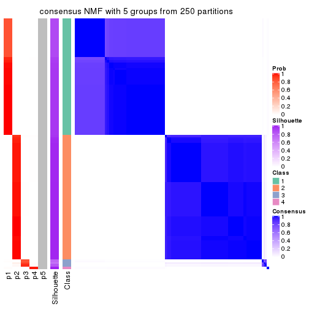</p>

</div>
<div id='tab-ATC-NMF-consensus-heatmap-5'>
<pre><code class="r">consensus_heatmap(res, k = 6)
</code></pre>

<p></p>

</div>
</div>

Heatmaps for the membership of samples in all partitions to see how consistent they are:


<script>
$( function() {
	$( '#tabs-ATC-NMF-membership-heatmap' ).tabs();
} );
</script>
<div id='tabs-ATC-NMF-membership-heatmap'>
<ul>
<li><a href='#tab-ATC-NMF-membership-heatmap-1'>k = 2</a></li>
<li><a href='#tab-ATC-NMF-membership-heatmap-2'>k = 3</a></li>
<li><a href='#tab-ATC-NMF-membership-heatmap-3'>k = 4</a></li>
<li><a href='#tab-ATC-NMF-membership-heatmap-4'>k = 5</a></li>
<li><a href='#tab-ATC-NMF-membership-heatmap-5'>k = 6</a></li>
</ul>
<div id='tab-ATC-NMF-membership-heatmap-1'>
<pre><code class="r">membership_heatmap(res, k = 2)
</code></pre>

<p></p>

</div>
<div id='tab-ATC-NMF-membership-heatmap-2'>
<pre><code class="r">membership_heatmap(res, k = 3)
</code></pre>

<p></p>

</div>
<div id='tab-ATC-NMF-membership-heatmap-3'>
<pre><code class="r">membership_heatmap(res, k = 4)
</code></pre>

<p></p>

</div>
<div id='tab-ATC-NMF-membership-heatmap-4'>
<pre><code class="r">membership_heatmap(res, k = 5)
</code></pre>

<p></p>

</div>
<div id='tab-ATC-NMF-membership-heatmap-5'>
<pre><code class="r">membership_heatmap(res, k = 6)
</code></pre>

<p></p>

</div>
</div>

As soon as we have had the classes for columns, we can look for signatures
which are significantly different between classes which can be candidate marks
for certain classes. Following are the heatmaps for signatures.


Signature heatmaps where rows are scaled:


<script>
$( function() {
	$( '#tabs-ATC-NMF-get-signatures' ).tabs();
} );
</script>
<div id='tabs-ATC-NMF-get-signatures'>
<ul>
<li><a href='#tab-ATC-NMF-get-signatures-1'>k = 2</a></li>
<li><a href='#tab-ATC-NMF-get-signatures-2'>k = 3</a></li>
<li><a href='#tab-ATC-NMF-get-signatures-3'>k = 4</a></li>
<li><a href='#tab-ATC-NMF-get-signatures-4'>k = 5</a></li>
<li><a href='#tab-ATC-NMF-get-signatures-5'>k = 6</a></li>
</ul>
<div id='tab-ATC-NMF-get-signatures-1'>
<pre><code class="r">get_signatures(res, k = 2)
</code></pre>

<p></p>

</div>
<div id='tab-ATC-NMF-get-signatures-2'>
<pre><code class="r">get_signatures(res, k = 3)
</code></pre>

<p></p>

</div>
<div id='tab-ATC-NMF-get-signatures-3'>
<pre><code class="r">get_signatures(res, k = 4)
</code></pre>

<p></p>

</div>
<div id='tab-ATC-NMF-get-signatures-4'>
<pre><code class="r">get_signatures(res, k = 5)
</code></pre>

<p></p>

</div>
<div id='tab-ATC-NMF-get-signatures-5'>
<pre><code class="r">get_signatures(res, k = 6)
</code></pre>

<p></p>

</div>
</div>


Signature heatmaps where rows are not scaled:


<script>
$( function() {
	$( '#tabs-ATC-NMF-get-signatures-no-scale' ).tabs();
} );
</script>
<div id='tabs-ATC-NMF-get-signatures-no-scale'>
<ul>
<li><a href='#tab-ATC-NMF-get-signatures-no-scale-1'>k = 2</a></li>
<li><a href='#tab-ATC-NMF-get-signatures-no-scale-2'>k = 3</a></li>
<li><a href='#tab-ATC-NMF-get-signatures-no-scale-3'>k = 4</a></li>
<li><a href='#tab-ATC-NMF-get-signatures-no-scale-4'>k = 5</a></li>
<li><a href='#tab-ATC-NMF-get-signatures-no-scale-5'>k = 6</a></li>
</ul>
<div id='tab-ATC-NMF-get-signatures-no-scale-1'>
<pre><code class="r">get_signatures(res, k = 2, scale_rows = FALSE)
</code></pre>

<p></p>

</div>
<div id='tab-ATC-NMF-get-signatures-no-scale-2'>
<pre><code class="r">get_signatures(res, k = 3, scale_rows = FALSE)
</code></pre>

<p></p>

</div>
<div id='tab-ATC-NMF-get-signatures-no-scale-3'>
<pre><code class="r">get_signatures(res, k = 4, scale_rows = FALSE)
</code></pre>

<p></p>

</div>
<div id='tab-ATC-NMF-get-signatures-no-scale-4'>
<pre><code class="r">get_signatures(res, k = 5, scale_rows = FALSE)
</code></pre>

<p></p>

</div>
<div id='tab-ATC-NMF-get-signatures-no-scale-5'>
<pre><code class="r">get_signatures(res, k = 6, scale_rows = FALSE)
</code></pre>

<p></p>

</div>
</div>


Compare the overlap of signatures from different k:

```r
compare_signatures(res)
```


`get_signature()` returns a data frame invisibly. TO get the list of signatures, the function
call should be assigned to a variable explicitly. In following code, if `plot` argument is set
to `FALSE`, no heatmap is plotted while only the differential analysis is performed.

```r
# code only for demonstration
tb = get_signature(res, k = ..., plot = FALSE)
```

An example of the output of `tb` is:

```
#>   which_row         fdr    mean_1    mean_2 scaled_mean_1 scaled_mean_2 km
#> 1        38 0.042760348  8.373488  9.131774    -0.5533452     0.5164555  1
#> 2        40 0.018707592  7.106213  8.469186    -0.6173731     0.5762149  1
#> 3        55 0.019134737 10.221463 11.207825    -0.6159697     0.5749050  1
#> 4        59 0.006059896  5.921854  7.869574    -0.6899429     0.6439467  1
#> 5        60 0.018055526  8.928898 10.211722    -0.6204761     0.5791110  1
#> 6        98 0.009384629 15.714769 14.887706     0.6635654    -0.6193277  2
...
```

The columns in `tb` are:

1. `which_row`: row indices corresponding to the input matrix.
2. `fdr`: FDR for the differential test. 
3. `mean_x`: The mean value in group x.
4. `scaled_mean_x`: The mean value in group x after rows are scaled.
5. `km`: Row groups if k-means clustering is applied to rows.


UMAP plot which shows how samples are separated.


<script>
$( function() {
	$( '#tabs-ATC-NMF-dimension-reduction' ).tabs();
} );
</script>
<div id='tabs-ATC-NMF-dimension-reduction'>
<ul>
<li><a href='#tab-ATC-NMF-dimension-reduction-1'>k = 2</a></li>
<li><a href='#tab-ATC-NMF-dimension-reduction-2'>k = 3</a></li>
<li><a href='#tab-ATC-NMF-dimension-reduction-3'>k = 4</a></li>
<li><a href='#tab-ATC-NMF-dimension-reduction-4'>k = 5</a></li>
<li><a href='#tab-ATC-NMF-dimension-reduction-5'>k = 6</a></li>
</ul>
<div id='tab-ATC-NMF-dimension-reduction-1'>
<pre><code class="r">dimension_reduction(res, k = 2, method = &quot;UMAP&quot;)
</code></pre>

<p></p>

</div>
<div id='tab-ATC-NMF-dimension-reduction-2'>
<pre><code class="r">dimension_reduction(res, k = 3, method = &quot;UMAP&quot;)
</code></pre>

<p></p>

</div>
<div id='tab-ATC-NMF-dimension-reduction-3'>
<pre><code class="r">dimension_reduction(res, k = 4, method = &quot;UMAP&quot;)
</code></pre>

<p></p>

</div>
<div id='tab-ATC-NMF-dimension-reduction-4'>
<pre><code class="r">dimension_reduction(res, k = 5, method = &quot;UMAP&quot;)
</code></pre>

<p></p>

</div>
<div id='tab-ATC-NMF-dimension-reduction-5'>
<pre><code class="r">dimension_reduction(res, k = 6, method = &quot;UMAP&quot;)
</code></pre>

<p></p>

</div>
</div>


Following heatmap shows how subgroups are split when increasing `k`:

```r
collect_classes(res)
```


If matrix rows can be associated to genes, consider to use `functional_enrichment(res,
...)` to perform function enrichment for the signature genes. See [this vignette](http://bioconductor.org/packages/devel/bioc/vignettes/cola/inst/doc/functional_enrichment.html) for more detailed explanations.


 

## Session info


```r
sessionInfo()
```

```
#> R version 3.6.0 (2019-04-26)
#> Platform: x86_64-pc-linux-gnu (64-bit)
#> Running under: CentOS Linux 7 (Core)
#> 
#> Matrix products: default
#> BLAS:   /usr/lib64/libblas.so.3.4.2
#> LAPACK: /usr/lib64/liblapack.so.3.4.2
#> 
#> locale:
#>  [1] LC_CTYPE=en_GB.UTF-8       LC_NUMERIC=C               LC_TIME=en_GB.UTF-8       
#>  [4] LC_COLLATE=en_GB.UTF-8     LC_MONETARY=en_GB.UTF-8    LC_MESSAGES=en_GB.UTF-8   
#>  [7] LC_PAPER=en_GB.UTF-8       LC_NAME=C                  LC_ADDRESS=C              
#> [10] LC_TELEPHONE=C             LC_MEASUREMENT=en_GB.UTF-8 LC_IDENTIFICATION=C       
#> 
#> attached base packages:
#> [1] grid      stats     graphics  grDevices utils     datasets  methods   base     
#> 
#> other attached packages:
#> [1] genefilter_1.66.0    ComplexHeatmap_2.3.1 markdown_1.1         knitr_1.26          
#> [5] GetoptLong_0.1.7     cola_1.3.2          
#> 
#> loaded via a namespace (and not attached):
#>  [1] circlize_0.4.8       shape_1.4.4          xfun_0.11            slam_0.1-46         
#>  [5] lattice_0.20-38      splines_3.6.0        colorspace_1.4-1     vctrs_0.2.0         
#>  [9] stats4_3.6.0         blob_1.2.0           XML_3.98-1.20        survival_2.44-1.1   
#> [13] rlang_0.4.2          pillar_1.4.2         DBI_1.0.0            BiocGenerics_0.30.0 
#> [17] bit64_0.9-7          RColorBrewer_1.1-2   matrixStats_0.55.0   stringr_1.4.0       
#> [21] GlobalOptions_0.1.1  evaluate_0.14        memoise_1.1.0        Biobase_2.44.0      
#> [25] IRanges_2.18.3       parallel_3.6.0       AnnotationDbi_1.46.1 highr_0.8           
#> [29] Rcpp_1.0.3           xtable_1.8-4         backports_1.1.5      S4Vectors_0.22.1    
#> [33] annotate_1.62.0      skmeans_0.2-11       bit_1.1-14           microbenchmark_1.4-7
#> [37] brew_1.0-6           impute_1.58.0        rjson_0.2.20         png_0.1-7           
#> [41] digest_0.6.23        stringi_1.4.3        polyclip_1.10-0      clue_0.3-57         
#> [45] tools_3.6.0          bitops_1.0-6         magrittr_1.5         eulerr_6.0.0        
#> [49] RCurl_1.95-4.12      RSQLite_2.1.4        tibble_2.1.3         cluster_2.1.0       
#> [53] crayon_1.3.4         pkgconfig_2.0.3      zeallot_0.1.0        Matrix_1.2-17       
#> [57] xml2_1.2.2           httr_1.4.1           R6_2.4.1             mclust_5.4.5        
#> [61] compiler_3.6.0
```


